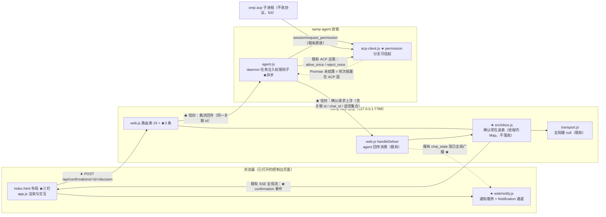

# architecture.md — 0021-confirmation-inbox-and-event-push

**版本**: 1.1.0（**阶段 3 · 第 2 轮**：L1 四条 + 覆盖范围**均已 `[user_confirmed]`**；并入真实 omp 受控实测证据 M1~M4（§9.4）；**M4「答复链路修复」升格为本迭代硬义务**）
**输入补充**: `clarifications/arch-round-1-verdicts.md`（L1 裁决 + 实测证据，2026-09-13）
**迭代**: 0021-confirmation-inbox-and-event-push
**阶段**: 3（技术架构）
**创建日期**: 2026-09-13
**输入**: `prd.md` v0.2.0 + `prd/F01~F12*.md`（12 卡，`[架构待填]` T-01~T-16）；`demand.md` v1.1.0
**代码基线**: `<工作区地址>/oamp/**`（只读）；迭代分支 `iteration/0021-confirmation-inbox-and-event-push`（base = main `854766c`）
**本方案的对象**: **oamp** —— 本机 `http://127.0.0.1:7788` 的 Web 控制台与其 HTTP/SSE 接口面。**不改 omp / harness 侧协议**（N3 → F12）。

> 阅读顺序建议：先看 §1 现状基线（30 秒建立心智模型）→ §3 L1 清单（**4 条，均已 `[user_confirmed]`**）→ §4 改动面清单（落点在哪）→ **§9.4 实测证据（M1~M4，含 M4 的必做义务）**。

---

## 0. 本文件状态（阶段 3 · 全量落盘）

| 章节 | 状态 |
|---|---|
| §1 现状架构基线（as-is） | ✅ 已落盘 |
| §2 目标架构（to-be：组件图 / 数据流 / 接缝） | ✅ 已落盘（第 1 轮提前完成） |
| §3 关键技术决策（L1 清单 + L2 清单） | ✅ 已落盘（L1 四条含备选/影响面；**L1-2 / L1-3 本轮已修订**；L2 10 条各附一句话理由） |
| §4 出现点 / 改动面清单（逐文件 + 行号 + 新建/修改/零改动 + 卡号） | ✅ 已落盘（新建 3 / 修改 11 / 零改动 10；含硬约束与顺序约束） |
| §5 接口与事件契约（新增 API / SSE 事件 / 跨进程信封） | ✅ 已落盘（2 条路由字段表 + 1 类 SSE 事件 + 3 个 notice kind） |
| §6 inbox 项的承载形态与生命周期 | ✅ 已落盘（进程内 Map / 5 函数 / 生命周期图 / 边界判定） |
| §7 T-01~T-16 逐项落定（12 张卡的 `[架构待填]` 补全） | ✅ 已落盘（16/16） |
| §8 内部一致性自查全表 | ✅ 已落盘（C1~C12） |
| §9 风险与已知代价（R1~R3 承载 + K1~K3 + **§9.4 实测证据 M1~M4 与可复跑方法**） | ✅ 已落盘 |
| §10 越界与疑问 | ✅ 已落盘（覆盖面疑问**已裁决**，§10.1 改为裁决回填） |
| §11 必然变更点清单（测试 / 文档 / 行为） | ✅ 已落盘（B-1~B-14 + 零改动清单） |

---

## 1. 现状架构基线（as-is）

### 1.1 相关进程与进程边界

```
┌─ 浏览器 ────────────────────┐   ┌─ oamp web 进程 (127.0.0.1:7788) ─┐   ┌─ oamp agent 进程 ─┐   ┌─ omp acp 子进程 ─┐
│ index.html + app.js         │   │ web.js  路由/SSE/派发/对账        │   │ agent.js          │   │ acp-client.js    │
│ EventSource(/api/stream)    │◀─SSE─│ transport.js  SSE 键空间         │   │ Router/Task/       │   │ 按行 JSON-RPC    │
│ EventSource(/api/events)    │   │ persist.js  SQLite               │◀─UDS─│ ContextPool       │─stdio─│ session/prompt   │
└─────────────────────────────┘   │ cluster.js 拓扑轮询               │ 信封  │ task.js            │   │ session/          │
                                  └──────────────────────────────────┘   └───────────────────┘   │  request_permission│
                                                                                                  └───────────────────┘
```

**关键事实**：确认请求（`session/request_permission`）发生在**最右侧的 `omp acp` 子进程**里，被 `acp-client.js` 消费；要"上浮给人"，该事件必须**跨 3 条进程边界**到达浏览器，裁决再**原路回传**。

### 1.2 既有技术栈（本方案不得新增）

| 面 | 现状 | 证据 |
|---|---|---|
| HTTP 服务 | Node 内置 `http`，零第三方依赖 | `oamp/src/web.js` |
| 实时推送 | **SSE**（`text/event-stream`），键空间 `chat:<id>` / `call:<id>` / `chat-calls:<id>` / `null`(全局) | `oamp/src/transport.js:18-24` |
| 前端 | **零框架、零构建**：静态 `index.html` + `app.js` + `style.css`，原生 `EventSource` | `oamp/web/index.html:93`、`oamp/web/app.js:493` |
| 持久化 | SQLite（`persist.js`），**仅对话与消息** | `oamp/src/persist.js` |
| 配置 | `cluster.json` + `cluster-config.js`（`permission: allow\|deny`，缺省 `allow`） | `oamp/src/cluster-config.js:16-19` |
| 路由 | 自建路由表 `createApiRoutes`（19 条），表顺序 = 匹配优先级 | `oamp/src/web.js:465`、`1251` |
| 跨进程信封 | agent→web：`task.update` / `task.result` / `notice`；web→agent：`notice{kind:'context_release'}` | `oamp/src/web.js:1476-1500`、`1559-1566` |

### 1.3 与本次需求直接相关的现状缺口（**现状事实，非缺陷指控**）

| # | 现状 | 位置 | 与本次需求的关系 |
|---|---|---|---|
| G1 | 受门禁工具调用**一律自动答复**：`_permissionDecision` 返回 `allow`/`deny` 后立即 `_respond(...)` | `oamp/src/acp-client.js:397-425` | W3 → 需改为"上浮给人裁决"（F02） |
| G2 | `onPermissionRequest` 钩子**已是同步回调** `(info) ⇒ 'allow'\|'deny'` | `oamp/src/acp-client.js:73`、`415-423` | 接线点存在，但**签名是同步的**——挂起裁决需要异步形态（L1-2） |
| G3 | 轮次有硬超时：`prompt(text, {timeoutMs = 300000})`，超时即 `cancel → 宽限 → kill` | `oamp/src/acp-client.js:163`、`188` | **与 M3「默认阻塞且无上限」直接冲突**（L1-1） |
| G4 | SSE 只有 4 类对话事件 + 2 类全局事件 + 3 类调用事件；**无跨对话的"待确认"通道** | `oamp/src/web.js:13-20`、`oamp/API.md §4` | W1「跨对话集中」需要一条**独立于当前会话**的推送路径（L2-1） |
| G5 | 页面主体是**两栏**（`.sidebar` + `.detail`），另有整页切换的 `#projects-view` | `oamp/web/index.html:41-85` | W1 需要第三栏（T-01，L2-2） |
| G6 | **无任何通知 / Notification API 代码** | 全仓 `grep` 零命中 | W4 首个通道需新建（F08） |
| G7 | 前端对"刷新后重建"的兜底 = `onopen` 时全量拉取当前会话详情 | `oamp/web/app.js:5` 注释、`493-500` | W6 需要**跨对话**的在途列表重建（T-07） |

### 1.4 既有可复用原语（**奥卡姆剃刀：优先复用，不新建**）

| 原语 | 位置 | 复用方式 |
|---|---|---|
`transport.publishGlobal` / 全局订阅键 `null` | `transport.js:26`、`103-105` | 待确认 inbox 的推送**直接复用全局键**（跨对话、与会话订阅结构性隔离） |
| 路由表 `createApiRoutes` | `web.js:465` | 新增 API 追加表项，**不改既有 19 条** |
| `matchRoute` / `projectRoutes` / `renderLlmsTxt` | `web.js:1251`、`1265`、`1283` | 新路由登记后 `/api/docs` 与 `/llms.txt` **自动派生**（零额外改动） |
| agent→web `notice` 信封（含 `kind`） | `web.js:1478-1484` | 确认请求上浮的**候选载体**（复用 vs 新增见 L1-3） |
| web→agent `notice{kind}` 控制消息 | `web.js:1559-1566` | 裁决回传的**候选载体**（同上） |
| 进程内任务表 / 调用 roster | `web.js` §3.14-3.19 | inbox 在途表的**形态先例**（进程内、不做持久化 → 天然满足 N2/F11） |

### 1.5 硬约束：**登记面 → 派生面的联动**（新增一条路由的必然后果）

> 这一节是本方案最容易低估的成本：oamp 的接口面有**两个逐字节 / 双向的漂移锁**（`oamp/test/api-routes.test.js:278`、`:303`）。**新增路由不是"加一段 handler"**，它必然拉动下面三处。

| # | 派生面 | 硬约束 | 证据 | 不联动的后果 |
|---|---|---|---|---|
| D1 | `oamp/llms.txt` | **逐字节快照**：`renderLlmsTxt(projectRoutes(createApiRoutes({})))` 必须与仓库文件字节相等 | `api-routes.test.js:278-287`；重生成命令 = `node oamp/scripts/gen-llms-txt.mjs`；`llms.txt:11` 现为「## 接口（19 条）」 | 测试红：`llms.txt 与生成结果不一致` |
| D2 | `oamp/API.md` | **路径级双向覆盖**：登记集合与文档集合互为子集——新增路由必须在 API.md 出现 `METHOD /api/…` 形态的反引号签名 | `api-routes.test.js:303-315`（`docSignatures` 只认 `` `(GET\|POST) (/api/…)` `` 这一种形态） | 测试红：`API.md 缺登记: …` |
| D3 | `GET /api/docs` 与 `/llms.txt` 的 HTTP 产物 | 由 `projectRoutes` **每次重新投影**（不缓存）⇒ 自动派生；`danger` 由 `method !== 'GET'` **派生**，不手写 | `web.js:1265-1275`、`1283` | 无（**零改动**即正确）——但投影表项必须凑齐 8 个元数据字段 |

**对本迭代的含义**：新增 2~3 条确认面接口 ⇒ **必然修改** `oamp/API.md`（追加 §3.20+ 小节）与重新生成 `oamp/llms.txt`。这两处不是"顺手"，是**同一处改动的组成部分**（已登记为 §4.2 的 M-9 / M-10）。

**另一条构造性约束**：漂移锁以 `createApiRoutes({})`（**空依赖**）调用 ⇒ 表项构造必须是纯构造，handler 内的依赖使用不得发生在构造期（`web.js:466-468` 既有注释「纯构造：不调用依赖、不读磁盘、不起定时器」）。新增路由沿用该形状。

---

## 2. 目标架构（to-be）

> 一句话：**在 web 进程里加一张"在途确认表"，把 agent 进程里那条原本同步回包的 ACP 权限请求改成"挂起等回包"，用既有的全局 SSE 键把它推到前端第三栏，用页面内的 Notification API 通知。全程不新增进程、不新增依赖、不新增持久化表。**

### 2.1 组件图（新增/改动以 ★ 标注）



**读图要点**：★ 共 6 处，全部落在**既有 4 个进程**内——**没有第 5 个进程、没有新端口、没有新依赖**（`package.json` dependencies 为空是 `hygiene.test.js` 强制的）。

### 2.2 三条核心数据流

**流 1 · 确认上浮（F02 / E1）**

1. `omp acp` 子进程发出 `session/request_permission`（既有原语，**不改**）；
2. `acp-client.js` 判定档位：`deny` ⇒ **原路同步拒绝**（F02 验收 4，行为不变）；`allow` 或缺省 ⇒ 调异步钩子，**此刻不回包**，ACP 轮次停在等待态；
3. `agent.js` 把请求（关联 id、`chat_id`、工具名/标题、**请求方给出的选项集合**——F03 的选项来源）作为新信封回给 web 实例（`origin`，既有 `sendTaskMessage` 同形）；
4. `web.js` 登记进 `inbox.js`（携带来源对话标识 ⇒ MI-02 可辨识），**同时**推一帧 `confirmation` 到全局 SSE 键；
5. 前端收到 → 第三栏出现条目（**无需刷新**，E1 达成）→ 通知服务判为 `confirmation_required` → Notification 通道投递（**仅在首次入库时**，MI-01）。

**流 2 · 裁决回传（F03 / F04 / E2）**

1. 用户在栏内点选选项（选项为主）＋可选文本（文本为辅）→ 一并提交（`POST /api/confirmations/<id>/decision`）；
2. `web.js` 从 `inbox.js` **原子取出并移除**该条（⇒ 栏内消失，F03 验收 4；已裁决项**不回流**，F06 验收 4 / N2）；
3. 按登记时记录的来源实例与关联 id，把裁决作为新信封回传 agent 进程；
4. `agent.js` 结算那个挂起的 Promise → `acp-client.js` 回 `allow_once` / `reject_once` → 轮次**继续或中止**（F04 验收 1~2）；
5. 挂起期间计时被**冻结**（L1-1）⇒ 无论等待多久都不会被 `cancel → kill`（F05 / E4）。

**流 3 · 事件通知（F07 / F08 / E3）**

1. 对话终态由**既有** `publishState` 产生（`web.js:1374`）——★ 追加一次全局广播，不改既有 `chat:<id>` 键的发布行为；
2. 前端在**全局流**上派生 `chat_completed` / `chat_failed`（由既有 `chat_state` 的 `working → completed/failed` 转变而来）⇒ **不新增服务端事件类型**；
3. `confirmation_required` 来自流 1 的第 4 步；
4. 三类事件 → `notify.js` 的**服务**判"是否应通知" → **通道**投递（首个通道 = Notification API）；
5. 因走全局流，用户**停在任何对话甚至项目列表页**都能收到（E3：不依赖停留在该对话）。

**事件类型封闭性**：常量仅 3 个（`chat_completed` / `chat_failed` / `confirmation_required`），**无 `call_completed`**（N5 → F07 验收 3：调用面的完成不产生通知）。

### 2.3 与既有组件的接缝（**复用了什么**）

| 接缝 | 复用 | 不新建 |
|---|---|---|
| 跨对话推送 | 既有**全局订阅键 `null`** + `publishGlobal`（`transport.js:16-24`、`103-105`） | 不新建 SSE 通道/键空间 |
| 路由与文档 | 既有路由表 + `projectRoutes` 派生（`web.js:465`、`1265`） | 不新建路由框架；`/api/docs` 自动派生 |
| 进程内状态 | 既有任务表 / 调用 roster 的形态先例 | 不新建持久化表、不引入 SQLite 迁移（N2/F11） |
| 跨进程信封 | 既有 `sendTaskMessage` / `sendControlNotice` 同形（`agent.js:160`、`web.js:1560`） | 不新建 side-channel、不新增端口 |
| 前端实时面 | 既有 `EventSource('/api/events')` 全局连接（`app.js:131`） | 不新建连接、不引入前端框架 |
| 前端重建兜底 | 既有 "`onopen` 全量拉取" 体例（`app.js:5` 注释、`493-500`） | 不新建缓存层 |

### 2.4 明确**不引入**的东西（奥卡姆剃刀 / L2-7）

Service Worker、Web Push、VAPID、WebSocket、新 npm 依赖、新进程、新端口、新持久化表、新配置文件项、前端框架/构建链、消息队列、事件总线。

> 检验：上面每一项，**删掉它哪个功能需求无法实现？**——没有。故不引入。

---

## 3. 关键技术决策

### 3.1 L1 决策清单（**4 条全部 `[user_confirmed]`** ✅）

> 判定口径（角色契约）：L1 = 引入新技术栈 / 改变现有核心模块职责 / 影响系统整体边界。以下 4 条**均落在既有技术栈内**，但都改变既有语义或跨进程契约，故按 L1 上报。
>
> **裁决状态**（`clarifications/arch-round-1-verdicts.md`，2026-09-13）：**L1-1 / L1-3 / L1-4 采纳**；**L1-2「先实测再定」→ 实测（M1/M2/M3）证实推断后采纳，并附加义务「答复链路修复」（M4）**。**覆盖范围**疑问（仅 `omp-daemon` 常驻路径）**采纳**。⇒ 四条 L1 可进入实现。

#### L1-1 · 挂起期间**冻结**轮次超时计时（使 M3「默认阻塞且无上限」成立）

| 项 | 内容 |
|---|---|
| **是什么** | 当一轮 `session/prompt` 因确认项挂起时，**暂停**该轮的 `timeoutMs` 计时；裁决到达、轮次继续后**恢复**计时。等价于"等待人拍板的时间不计入轮次预算"。 |
| **为何必须** | 现状超时是**三层叠加**且都封顶：① ACP 层 `prompt(text, {timeoutMs = 300000})`，超时即 `cancel → 宽限 2000ms → kill`（`acp-client.js:163`、`188`、`12-16`）；② agent 层 daemon 任务沿用 `task.timeoutMs`（`agent.js:296-322`、`322`）；③ HTTP 入口层 `DEFAULT_OMP_TIMEOUT_MS = 300000` 且硬校验 `timeoutMs <= MAX_TIMEOUT_MS = 600000`（`agent.js:27-29`、`87-88`、`111-112`）。**即使把请求超时打满到上限，也只有 10 分钟**——M3 的「无上限」在现状下**任何参数组合都到不了**。若不改：E4（放置任意长时间后条目仍在、轮次未推进）必然失败，且失败态是"条目还在、轮次已死"的**孤儿态**（比没有该功能更难排查）。这是**功能规格与技术约束之间的真实冲突**，不是可绕过的实现细节。 |
| **备选** | ① **冻结计时**（推荐）：只改"计时是否推进"，不改既有契约的语义面；② 调用方显式传超大/零超时：需改 `POST /api/messages`、`POST /api/calls` 的 `MAX_TIMEOUT_MS` 校验与所有调用方（本迭代自身的 hub 派发即调用方之一），且**把"无上限"这个产品语义外推给每个调用方**，脆弱；③ 不改超时、另起一条"确认轮次豁免 kill"的旁路：等于给同一轮次造两套生命周期，理解成本高于收益。 |
| **影响面** | `oamp/src/acp-client.js`（`prompt` / `_request` 的计时器：`setTimeout` → 可控的暂停/恢复）；`oamp/src/agent.js`（daemon 任务的 `task.timeoutMs` 传递）；`oamp/API.md`（需说明"挂起不计时"）；`oamp/test/`（既有超时断言的行为边界）。**不改**：`MAX_TIMEOUT_MS` 的校验范围、shell / 一次性 `omp` 路径的超时语义。 |
| **不确认的后果** | 实现将退化为"确认项在 `timeoutMs` 内必须被裁决"，与 F05 验收 1~2 / E4 直接矛盾。 |
| **裁决** | ✅ **`[user_confirmed]` 采纳**（推荐项）。**附加实测要求**：冻结计时的覆盖面必须**同时**涵盖 ACP 层（`acp-client.js` 的 `_request` 计时器）与 agent 层计时（`agent.js` 的 daemon 任务 `task.timeoutMs`）——见 §9.4 派生义务 4。 |

#### L1-2 · `allow` 档语义变更的承载点 = 把 `onPermissionRequest` 从**同步回调**改为**可异步挂起**

| 项 | 内容 |
|---|---|
| **是什么** | ① `AcpClient` 的权限判定钩子由 `(info) => 'allow'\|'deny'`（同步）扩展为可返回 **Promise** 或 `{optionId}`；未被结算期间 `session/request_permission` **保持未应答**（不发 `_respond`），轮次自然阻塞在 ACP 层。②**同时**把 `allow` 档的 argv 由 `--approval-mode yolo` 改为 `always-ask`（`acp-client.js:123`）——`yolo` 的字面语义是"不询问、自动放行"，若 omp 在 yolo 下**根本不发**权限请求，则"上浮给人"**没有可上浮的请求**（功能不存在）。〔**已由真实 omp 受控实测证实**：**M1** `yolo` 档零 PERMISSION 行、工具直接执行；**M2** `always-ask` 档发请求并携带 4 项 options；**M3** omp 以 `SEs.get(optionId)` 校验应答。见 §9.4〕 |
| **为何必须** | 现状 `_handleServerRequest` 在同一个 tick 里判定并回 `_respond`（`acp-client.js:397-411`）。"上浮给人裁决"必须在**人拍板之前不回包**——这是 F02/F04 的全部技术内容。`allow` 档改为上浮（R3）意味着**默认路径**（缺省 `allow`）也走这条异步分支，不再是边缘路径。 |
| **备选** | ① **钩子返回 Promise**（推荐）：改动最小，`_permissionDecision` 的调用点从"取返回值"改为"await 结算"；② 新增独立的 `onPermissionRequestAsync` 配置项：同一件事两条路径，违背"只有一种实现时的配置项是纯负债"（`transport.js:3` 既有立场）；③ 在 ACP 之外另起一层代理子进程拦截：引入新进程与协议转换层，**用大炮打蚊子**。 |
| **影响面** | `oamp/src/acp-client.js`（`_handleServerRequest` / `_permissionDecision` 的异步化与 `optionId` 回显、`permission_denied` 触发时机、`:123` 的 argv）；`oamp/src/context-pool.js`（透传钩子）；`oamp/src/agent.js`（钩子的注入者）；**测试必然变更 2 处**：`tool-permission.test.js:397`、`acp-daemon.test.js:532`（`yolo` → `always-ask`）。**一次性路径的 argv（`agent.js:197`）零改动**（见 §9.2 K3）。 |
| **裁决** | ✅ **`[user_confirmed]` 采纳（「先实测再定」→ 实测证实后采纳）**。**附加义务**：**「答复链路修复」（M4）为本迭代硬义务**——受控实测中 oamp 已回 `allow_once` 且审计 `TOOL_APPROVED`，但模型侧工具结果仍是 `Tool call denied by user: bash` ⇒ 现有自动答复路径**在真实 omp 上从未跑通**（因 `yolo` 档从不触发）。**不得降级为文档说明**，须在承载 F02 / F04 的实现中定位根因并修复（落点与排查方向见 §4.2 M-16、§11.5 B-15）。 |
| **兼容性** | `deny` 档**保持自动拒绝**（F02 验收 4 / T-1）：由 `ContextPool` **不注入**上浮钩子实现 ⇒ `acp-client.js:414` 的优先级语义与 `:404-407` 的三步**逐字不变**。**同步返回 `'allow'`/`'deny'` 的两条路径也逐字不变**（仍回 `allow_once`/`reject_once`，`tool-permission.test.js:268`/`:333` 继续绿）——异步与 `{optionId}` 是**追加**的返回形态，不是替换。 |

#### L1-3（**本轮修订**）· 新增 **agent ⇄ web** 的确认请求 / 裁决**双向关联消息**（oamp 内部跨进程契约扩展）

| 项 | 内容 |
|---|---|
| **是什么** | 在既有 agent↔web 信封面（`task.update` / `task.result` / `notice`）之外，新增一对**带关联 id** 的消息：agent→web 的"确认请求上浮"与 web→agent 的"裁决回传"。 |
| **为何必须** | 既有 `notice` 是 fire-and-forget、**无请求 id、无回执语义**（`web.js:1478`）；web→agent 的控制面只有 `notice{kind:'context_release'}`（`web.js:1559`）。F04 要求"裁决只作用于其所属的那一条 / 那一轮"——**没有关联 id 就无法保证作用域**，也无法在并发多对话时把裁决投递到正确的轮次。 |
| **备选（本轮按实测重排）** | ① **复用 `notice` + 扩 `kind` 枚举（本轮改为推荐）**：`router.js:23` 的 `VALID_TYPES = {task.request, task.update, task.result, notice}` 是**封闭集合**，`validateSendMessage` 对未知 `type` 直接拒（`router.js:29`）⇒ **新增 `type` 必然要改 Router 进程**；复用 `notice` 则 **Router 零改动**。代价 = `kind` 的语义从"提示"扩到"请求 / 应答"（靠 kind 命名自解释）。② 新增一对信封类型（首轮推荐）：语义最显式，但要动 `VALID_TYPES` + Router 校验面 + `API.md`；③ 另开 side-channel HTTP(S)（agent 反调 web 的 REST）：引入反向依赖与端口 / 鉴权问题，**与 N1/F10 的边界纠缠**。 |
| **影响面（修订后）** | `oamp/src/web.js`（`handleDeliver` 的 `notice` 分支：既有 kind 过滤需放行 3 个新 kind + 消费 / 发送两侧）；`oamp/src/agent.js`（发送侧 + 接收侧）；`oamp/API.md §7`（若其中列举了 `notice` 的 kind，需补）。**零改动**：`oamp/src/router.js`（`VALID_TYPES` 不动）、`omp`/`harness` 协议本身（N3 仍成立：ACP 的 `session/request_permission` 是既有原语，本方案不新增、不修改 ACP 侧任何方法）。 |
| **与 N3 的关系** | N3 禁止的是改 **omp / harness 侧**协议。本项改的是 **oamp 自己的** agent↔web 信封，**不触碰 ACP**。 |
| **裁决** | ✅ **`[user_confirmed]` 采纳**（推荐项：复用 `notice` + 3 个 `kind`，**Router 零改动**）。 |

#### L1-4 · 通知投递的能力边界 = **页面打开时才可通知**（不引入 Service Worker / Web Push / VAPID）

| 项 | 内容 |
|---|---|
| **是什么** | 首个通道 = 浏览器 **Notification API**，在**已打开的 oamp 页面**里由既有 SSE 连接触发的 JS 直接调用 `new Notification(...)`。**不引入** Service Worker、Push API、VAPID 密钥、任何第三方推送服务。 |
| **为何必须**（说明而非主张） | E3 的判据是"**不依赖用户停留在该对话**"（可切到别的页面/标签**仍**收到），**不是**"浏览器关闭后仍收到"。前者用页面内 Notification API + 全局 SSE 即可满足；后者才需要 Service Worker + Web Push（并涉及 N1 的"投递路径经浏览器厂商推送服务"这条 T-2 裁决解禁的路）。**本迭代按 E3 的字面判据取前者**。 |
| **备选** | ① **页面内 Notification API**（推荐）：零新依赖、零密钥、零服务端出网；② Service Worker + Web Push：为一条本迭代未要求的判据引入 SW 生命周期、密钥管理与离线投递语义，**YAGNI**；③ 站内横幅/声音：N4 明确不做偏好，且不满足"切到别的页面仍被叫到"。 |
| **影响面** | 前端新增通知模块（`oamp/web/`）；`oamp/API.md` 可为空改动（通道是前端行为）；**服务端零新增出网路径**（F10 的"仅 127.0.0.1"边界因此**天然保持**）。 |
| **裁决** | ✅ **`[user_confirmed]` 采纳**：只做**页面内 Notification API**，**不引入** Service Worker / Web Push / VAPID。判据按 E3 字面（可切到别的页面 / 标签仍收到），**不含**"浏览器关闭后仍收到"。 |

### 3.2 L2 决策清单（**自主决定**）

> 第 1 轮登记结论与一句话理由；第 2 轮补字段级细节与验收方式。

| # | 决策 | 一句话 | 关联卡 |
|---|---|---|---|
| L2-1 | inbox 推送复用 **全局 SSE 键 `null`** 而非新建 `/api/stream` 变体 | 全局键已存在且与 chat 键结构性隔离（`transport.js:16-24`） | F01 / F06 |
| L2-2 | 第三栏 = 既有 `main.layout` 内**新增一栏**（CSS grid 三列），不新建页面、不新建路由 | 与 `#projects-view` 的整页切换体例区分开；N7 只禁其它入口载体，不禁第三栏本身 | F01 |
| L2-3 | inbox 在途表 = **服务端进程内**（web 进程），**不落 SQLite** | 刷新/重连重建（W6）要求服务端；"无历史台账"（N2/F11）要求不持久化——两者同时满足 | F01 / F06 / F11 |
| L2-4 | 新增 API 走既有路由表 `createApiRoutes` 追加表项 | `/api/docs` 与 `/llms.txt` 自动派生，零额外改动 | F02 / F03 / F06 |
| L2-5 | 事件类型封闭 3 类 = **服务端常量** + **前端文案表** | T-14；避免字符串散落 | F07 |
| L2-6 | 通知服务/通道分离的落点 = 前端一个小模块内 `service`(选事件→通知意图) 与 `channel`(投递) 两个函数 | T-12；**不新建进程、不新建服务端组件**——"服务"是模块内的职责边界，不是部署单元 | F09 |
| L2-7 | 不新建任何持久化表、不新增 npm 依赖、不新增配置文件项 | 奥卡姆剃刀：每条 `[架构待填]` 都能用既有原语回答 | 全局 |
| L2-8 | `chat_completed` / `chat_failed` **由前端从既有 `chat_state` 派生**；服务端只给 `publishState` 追加一次全局广播 | `web.js:1374` 是唯一状态发布点；缺全局广播则"看着 A 对话时 B 对话完成"收不到（E3 不依赖停留）；派生优于新增事件类型 | F07 / F08 |
| L2-9 | 确认项**进入** inbox 即"通知一次"，由前端在 `confirmation` 事件到达时触发；重建在途列表**不触发** | MI-01 的验收口径直接落在"事件只在首次入库时发"这一服务端事实上 | F07 / F08 / F06 |
| L2-10 | 新增路由登记在**表末位**；`POST /api/confirmations/:id/decision` 用**后缀形态**避开 `GET /api/chats/<字面量>` 的贪婪吞并（`web.js:461-463` 既有教训） | 表顺序 = 匹配优先级（`api-routes.test.js:319`） | F03 |

---

## 4. 出现点 / 改动面清单

> 口径：**行号为当前 `0081` 基线实测行号**（迭代分支 base = main `854766c`）。"卡号" = 该落点服务的功能卡。第 2 轮会在此基础上细化到函数级。

### 4.1 新建（3 条）

| # | 路径 | 规模（估） | 内容 | 卡号 |
|---|---|---|---|---|
| N-1 | `oamp/src/inbox.js` | ~150 行 | 确认项在途表：登记 / 查询 / 裁决 / 移除；进程内 `Map`，**不持久化**；携带 `chat_id`（可辨识来源对话，MI-02）与**请求方来源信息** | F01 / F02 / F04 / F06 / F11 |
| N-2 | `oamp/web/notify.js` | ~90 行 | 通知**服务**（事件类型 → 是否应通知）+ 通道接口（`deliver(intent)`），首个通道 = 页面内 Notification API；权限未授予时的降级（T-11） | F07 / F08 / F09 |
| N-3 | `oamp/test/confirmation-inbox.test.js` | ~（第 2 轮定） | 新能力的行为断言（在途重建、裁决回路、通知恰好一次） | F01~F09 |

### 4.2 修改（11 条）

| # | 路径 | 落点行号（基线） | 改动内容 | 卡号 |
|---|---|---|---|---|
| M-1 | `oamp/src/acp-client.js` | `73`、`397-425` | `onPermissionRequest` 支持 Promise / `{optionId}`；`_handleServerRequest` 的 permission 分支改为"待裁决期间不回包"；`deny` 档短路保持同步；应答 `optionId` 改为回显（§5.4） | F02 / F04 / F12 |
| **M-12** | `oamp/src/acp-client.js` | **`123`** | `--approval-mode` 的 `allow` 档 **`yolo` → `always-ask`**（否则 omp 不发权限请求，"上浮"无来源；见 L1-2 / §9.3 V1） | F02 |
| **M-13** | `oamp/src/context-pool.js` | `24-46`、`204-212` | `ContextPool` opts 增加 `onPermissionRequest` 并透传给 `AcpClient`（**现无注入者**）；**仅 `permission === 'allow'` 时由 agent 侧传入** | F02 |
| M-2 | `oamp/src/acp-client.js` | `159-202`、`268-280` | 轮次计时器可**冻结/恢复**（L1-1）；`permission_denied` 的触发时机随异步化复核 | F05 |
| M-3 | `oamp/src/agent.js` | `296-358`（daemon 任务）、`601-641`（ctx.pool 构造）、`160-170`（`sendTaskMessage` 邻近） | daemon 任务注入上浮钩子；`pending: Map<confirmation_id, resolve>`；确认请求上浮 / 裁决回传 / 取消通知的收发；`permission` 档从 `cluster.json` 透传（`cluster-config.js:16-19`）。**`agent.js:197`（一次性路径 argv）零改动** | F02 / F04 / F05 |
| M-4 | `oamp/src/web.js` | 路由表 `465-1250` **追加 2 条**（表末位） | `GET /api/confirmations`（在途列表 / 重建，§5.1 R-1）、`POST /api/confirmations/<id>/decision`（裁决，§5.1 R-2）。**不再新增订阅端点**——`confirmation` 走既有 `/api/events` 全局流 | F01 / F03 / F06 |
| M-5 | `oamp/src/web.js` | `1476-1500`（`handleDeliver`）、`1559-1566`（`sendControlNotice`） | `notice` 分支放行 3 个新 kind：`confirmation_request` → `inbox.add()` + `transport.publishGlobal({type:'confirmation',…})`；`confirmation_cancelled` → `inbox.remove()`；R-2 → `sendControlNotice(agentId, {kind:'confirmation_decision',…})`（+ 文本非空时追加一条 chat 输入） | F02 / F04 / F05 |
| M-6 | `oamp/src/web.js` | `1374`（`publishState`）、`1393-1400`（终态落盘） | 见 **L2-8**：给 `publishState` **追加一次全局广播**（既有 `chat:<id>` 发布逐字不变）⇒ 前端可在全局流上派生 `chat_completed` / `chat_failed`。**不新增事件类型** | F07 / F08 |
| M-7 | `oamp/web/index.html` | `44-85`（`<main class="layout">` … `</main>`） | `main.layout` 内新增第三栏容器（结构节点；既有 `.sidebar`(45) 与 `.detail`(60) 之间的兄弟节点） | F01 |
| M-8 | `oamp/web/app.js` | `128-157`（全局 SSE `connectAgentEvents`）、`493-500`（chat SSE `onopen`）、`196-400`（渲染体例） | 全局 SSE 增加 `confirmation` 分支；第三栏渲染（选项按钮 + 文本输入 + 提交）；`onopen`（含重连）后重建在途列表；调用 `notify.js` 派发三类事件 | F01 / F03 / F06 / F07 / F08 |
| **M-14** | `oamp/API.md` | `§4.2`（`912-924`） | "全局订阅（**2 类事件**）" + "全局链路上**只**有这两类事件" → 改写为 3 类（+`confirmation`）并补事件表行 | F07 |
| **M-16** | **`oamp/src/acp-client.js`** | `397-410`、**`400`（`_respond` 包形态）** | **答复链路修复（M4 · 本迭代硬义务，`[user_confirmed]` L1-2 附加义务）**：现状回 `allow_once` 且审计 `TOOL_APPROVED`，但真实 omp 上模型侧仍得 `Tool call denied by user: bash` ⇒ 裁决**未真正放行工具**。根因方向见 §9.4.3（D1 响应包形态 / D2 时序 / D3 与 `--no-session` 的交互 / D4 审计与真实后果脱钩）。**观测判据 = 模型侧工具结果**，不是审计行 | F02 / F04 |
| **M-15** | `oamp/api-routes.test.js` 之外的**派生面同步** | —— | 与 M-4 同一提交完成：`node oamp/scripts/gen-llms-txt.mjs`（M-10）+ `API.md` 新接口小节（M-9）。**漂移锁以"同步派生面"转绿，不是改测试** | F10 |
| M-9 | `oamp/API.md` | §3 末尾（现止于 `840` 行 `### 3.19`） | **追加** §3.20+ 小节，登记新增的确认面接口（漂移锁③ D2 强制；既有 19 条**逐字不改**） | F10 / F12 |
| M-10 | `oamp/llms.txt` | `11`（`## 接口（19 条）`） | **重新生成**（`node oamp/scripts/gen-llms-txt.mjs`）——纯派生文件，**不手改** | F10 |
| M-11 | `oamp/web/style.css` | 第三栏样式 | 三列布局与栏内控件样式 | F01 / F03 |

### 4.3 零改动（**明确不动**，含理由）

| # | 路径 / 面 | 理由 | 卡号 |
|---|---|---|---|
| Z-1 | omp / harness 侧 ACP 协议（`session/request_permission` 及其 options） | **N3 硬边界**：本方案只消费既有原语 | F12 |
| Z-2 | `POST /api/messages`、`POST /api/calls` 的**请求 / 响应契约** | 本迭代不加新入口；确认流由 agent 侧上浮触发，不经过消息入口 | F10 / F12 |
| Z-3 | `oamp/src/persist.js`（SQLite schema） | N2/F11：**不做历史台账** ⇒ 无需新表、无需迁移 | F11 |
| Z-4 | `cluster-config.js` 的 `permission` 档位**取值与校验**（`allow\|deny`，`197` 行） | 档位取值不变（R3 只改 `allow` 档的**行为**，不改配置面）；**不新增配置项**（N4/N6） | F02 / F05 |
| Z-5 | `oamp/src/transport.js` | 复用既有全局键与 `publishGlobal`；**键空间不扩充** | F01 / F06 |
| Z-6 | 顶栏导航 / 左栏过滤器 / 归档 / 项目列表视图 | N7：**不做第三栏之外的入口载体** | F01 |
| Z-7 | 鉴权、监听地址（`web.js` 的服务构造处） | N1/F10：边界不变 | F10 |
| Z-8 | `oamp/API.md` 的既有 19 条接口条目 | 只**追加**新接口章节，既有条目零改写（`projectRoutes` 自动派生） | F10 / F12 |
| Z-9 | `oamp/test/hygiene.test.js` | 三条断言与新改动无交集（见 §4.5）——**但它是"不得引入依赖"的强制项** | 全局 |
| Z-10 | `oamp/src/persist.js` 的调用面 / `oamp/src/router.js` / `oamp/src/cluster.js` | 确认面不经 Router 拓扑与集群配置；inbox 在 web 进程内 | F02 / F11 |
| **Z-11** | **`oamp/src/router.js` 的 `VALID_TYPES`（`:23`）** | **L1-3 修订的直接收益**：复用既有 `notice` 类型 + 扩 `kind` ⇒ **Router 进程零改动**（否则新增 type 必被杀） | F04 / F12 |
| **Z-12** | **`oamp/src/agent.js:197`（一次性路径的 `--approval-mode`）** | 一次性路径**无 ACP 应答通道**，改 `always-ask` 会产生无人可答的挂起 ⇒ 保持 `yolo`。**覆盖面边界见 §9.2 K3 / §10.1 疑问 1** | F02 |

### 4.4 改动面的**顺序约束**（供阶段 4 PR 拆分直接使用）

1. **协议先行**（L1-3）：agent⇄web 信封字段先定稿——它是 M-3 / M-5 两侧的共享接口，**先于**两端实现。
2. **服务端其次**：N-1（inbox）→ M-5（消费/回传）→ M-4（路由）→ **M-9 + M-10（派生面同步，与 M-4 同一提交）**。
3. **前端最后**：M-7（结构）→ M-8（消费与交互）→ N-2（通知）→ M-11（样式）。
4. **挂起语义（M-1 / M-2）与 L1-1 冻结**必须与 #2 同批——否则"条目能进栏、轮次却会超时死"，中间态不可验收。
5. **M-16（答复链路修复）必须与 M-12（argv 档位改写）同批**——两者是同一枚硬币：改了 argv 才有请求，而有请求而不修答复链路，结果是**每个受门禁调用都被拒**（比现状更坏）。**M-12 单独合入 = 已知的负向中间态**，禁止拆成两个 PR。
6. **M-16 的排查顺序**：先做 D3（用 daemon 真实 argv 复跑探针，排除探针 argv 干扰）→ 再 D1（帧逐字比对）→ 再 D2（时序分档）。**D3 最先**，因为它决定 D1/D2 是否成立。

### 4.5 既有断言的影响判定（**必然变更点**，第 2 轮给具体断言行）

| 测试文件 | 判定 | 依据 |
|---|---|---|
| `oamp/test/tool-permission.test.js` | ⚠️ **改判：仅 1 处必然变更（`:397`）** | **改判理由（本轮实测）**：异步与 `{optionId}` 是**追加**的返回形态，同步返回 `'allow'`/`'deny'` 的两条路径**逐字保留** ⇒ `:268`（恒回 `allow_once`）与 `:333`（`reject_once`）**继续绿**。唯一必然变更 = **`:397` 的 argv 断言 `yolo` → `always-ask`**（L1-2 的 argv 面） |
| `oamp/test/api-routes.test.js` | ⚠️ **必然变更** | 漂移锁②（`llms.txt` 逐字节）与漂移锁③（API.md 双向覆盖）**必然**因新增路由而红——靠 **M-9 + M-10 同步**转绿，**不是改测试**。另有「漂移锁①：登记元数据必填」（`:195`）⇒ 新表项 8 字段必须齐 |
| `oamp/test/api-pages.test.js` | ✅ **改判：与第三栏无交集** | **改判理由（本轮实测）**：该 test 的 `window.confirm` 计数断言作用域是 **`debug.js`**（test 内 `const js = read('debug.js')`，`:121`），**不是 `app.js`** ⇒ 第三栏在 `app.js` 里加任何交互都**不撞**此断言。唯一可能交集 = 对 `/api/events` 事件集合的断言（见下 `web.test.js` 行） | F01 / F03 |
| `oamp/test/hygiene.test.js` | ✅ **预计零改动**（但约束新建文件） | 三条断言：`.gitignore` 含 `.runtime/`；`bin/`+`src/` 的 `.js` 与 `package.json` **凭据字段名词边界扫描零命中**（`to+ken`/`api+_key`/`secr+et` 等，`hygiene.test.js:18-26`）；`package.json` dependencies 为空。⇒ `src/inbox.js` **不得出现这类词**（如变量名含 `token`）；`web/` 不在扫描面内。**零依赖（L2-7）是测试强制的**，不是偏好 |
| `oamp/test/acp-daemon.test.js` | ⚠️ **必然变更（本轮新增点名）** | `:532` 断言 daemon 路径 `tools on + allow` 的 argv 含 `--approval-mode yolo`——与 `tool-permission.test.js:397` 同源，随 L1-2 的 argv 面改为 `always-ask`。**`:554`（一次性路径 `yolo`）不变**（Z-12） | F02 |
| `oamp/test/project-workspace.test.js`（1327 行）/ `oamp/test/web.test.js`（1640 行） | ⚠️ **需实现期复核**（本轮未逐行核） | ① 第三栏改变 `.layout` 的 DOM 结构——**若**含子元素计数 / 结构断言则受影响；② **若** `web.test.js` 对 `/api/events` 事件集合做**封闭断言**（"恰好 2 类"）⇒ 新增 `confirmation` 帧后须同步（§11.1 B-5）；为"包含"断言则零改动。`/api/stream` 的 4 类事件不变 ⇒ 该面零影响。**两条均登记为实现期检查项** | F01 / F07 |

---

## 5. 接口与事件契约

> 三个契约面：**① 浏览器 ⇄ web**（HTTP + SSE）、**② agent ⇄ web**（信封 body）、**③ 前端内部控制面**（服务 ⇄ 通道）。全部复用既有形状，无新依赖。

### 5.1 浏览器 ⇄ web · 新增 2 条 HTTP 接口

两条都追加在路由表**末位**（`web.js:465-1250` 的 `routes` 数组尾部），8 个元数据字段齐备（漂移锁① `api-routes.test.js:195`），纯构造（`web.js:466-468`）。

**R-1 `GET /api/confirmations`** —— 在途确认项列表（**重建入口**，F06 / T-07）

| 项 | 值 |
|---|---|
| `kind` | `json` |
| `danger` | `false`（派生：`method === 'GET'`） |
| `summary` | `待确认项列表（跨对话的在途确认项；进程内，不持久）` |
| `params` | 无 |
| `response` | `对象 { confirmations: [{ confirmation_id, chat_id, agent_id, tool, title, options: [{option_id, label?}], created_at }] }`（空 = `[]`） |
| `errors` | `[]`（**无错误面**：纯内存读，不查 Router、不读库——空态返回空数组，不 404） |
| 语义 | 返回**当前全部未裁决项**，不排序承诺（MI-04：不判顺序）、不分页（在途量 = 同时挂起的轮次数，天然小） |

**R-2 `POST /api/confirmations/<confirmation_id>/decision`** —— 提交一次裁决（F03 / F04）

| 项 | 值 |
|---|---|
| `kind` | `json`；`danger` = `true`（派生） |
| `summary` | `提交确认项裁决（选项 id 必填 + 可选文本；条目随即移出在途表并回传请求方）` |
| 入参 body | `{ option_id: <string>, text?: <string> }` |
| `response` | `200 { confirmation_id, accepted: true }` |
| `errors` | `400 INVALID_PARAM`（`option_id` 缺失/非字符串/不在该条的选项集合内——**服务端校验选项合法性**）；`404 NOT_FOUND`（`confirmation_id` 不在在途表：已裁决 / 已失效 / 从未存在——**同一码**，不区分，因无历史台账 N2） |
| 路由形态 | 路径参 = **后缀段**（`/api/confirmations/<id>/decision`）。**不能**用 `POST /api/confirmations/:id`——会把未来的子资源锁死；也不必登记在 `GET /api/chats/:chat_id` 之前（前缀不同） |
| 幂等 | **非幂等且不重试**：第二次提交同一 id 得 `404`（首个请求已把它移出表）。前端据此把条目移除，**不重放**（F03 验收 4 / MI-01 的另一面） |

**错误契约**：沿用既有 `{error: <人类可读字符串>, code: <ERR_CODE>}`（`web.js:26-27` 注释）；**新增 0 个错误码**（`INVALID_PARAM` / `NOT_FOUND` 均已在既有集合中）。

### 5.2 浏览器 ⇄ web · SSE 事件（**新增 1 类，走既有全局键**）

| 事件名 | 载体键 | `data` 字段 | 触发时机 |
|---|---|---|---|
| `confirmation` | **全局键 `null`**（`GET /api/events`，`transport.publishGlobal`） | `{ confirmation_id, chat_id, agent_id, tool, title, options, created_at }` | 一条确认请求**首次**登记进在途表时，**恰一帧** |

- **不新增订阅端点**：`GET /api/events` 现在承载 2 类（`agent_online` / `agent_offline`）→ 变 3 类（+`confirmation`）。§4.2 的"全局链路上**只**有这两类事件"结论**必然改写**（见 §4.5 必然变更点）。
- **零 `chat` 键帧**：`GET /api/stream` 的 4 类事件**逐字不变**（F10 / F12 的边界不进反）。
- **通知去重的服务端事实**（MI-01）：帧只在"入表那一刻"发一次；`GET /api/confirmations` 的重建**不发帧** ⇒ 刷新/重连天然不重复通知。前端**不自行去重**（去重靠单一发布点，不靠前端记忆）。
- **裁决不推移除帧**：裁决使条目消失不推 `confirmation` 帧——前端以 `POST` 的 `200` 为移除依据。**逻辑**：多标签页场景下，未提交裁决的另一个标签页会因**无事件**而保留陈旧条目，直到刷新（重建）时消失。此为本轮**明示代价**：`demand.md` 只要求"裁决后条目消失"（W2），单页即满足。**不引入**"跨标签页同步"的额外事件（YAGNI，且它与 N2 相邻）。

### 5.3 agent ⇄ web 信封（**复用既有 `notice` 类型 + 新增 3 个 `kind`**）

> **关键约束（本轮实测）**：`router.js:23` 的 `VALID_TYPES = {task.request, task.update, task.result, notice}` 是**封闭集合**，`validateSendMessage` 对未知 `type` 直接 `INVALID_MESSAGE`（`router.js:29`）。**新增 `type` ⇒ 必须改 Router**（第三处进程）。故本方案**复用 `notice`**，只扩 `kind` 枚举 ⇒ **Router 零改动**。

**信封 1 · `notice{kind:'confirmation_request'}`（agent → web）**

```jsonc
{ "kind": "confirmation_request",
  "confirmation_id": "cfm-<uuid>",   // agent 侧生成的关联 id（L1-3 的作用域锚点）
  "chat_id": "chat-…",               // 来源对话（MI-02 的可辨识性 + 裁决回传寻址）
  "agent_id": "pb-dev",
  "tool": "edit",                    // toolCall.toolName
  "title": "…",                      // toolCall.title，截断 120 字符（沿用 TOOL_TITLE_MAX）
  "options": [{ "option_id": "allow_once", "label": "…" }], // ← 逐字来自 ACP params.options（F03 的选项来源）
  //   M2 实测：真实 omp 给出 4 项 = [allow_once, allow_always, reject_once, reject_always]
  //   ⇒ 这 4 项就是 W2「确认选项」的真实全集，**原样**进入 inbox 条目（不筛选、不增补、不翻译）
  "created_at": 1757… }
```

**信封 2 · `notice{kind:'confirmation_decision'}`（web → agent）**

```jsonc
{ "kind": "confirmation_decision",
  "confirmation_id": "cfm-<uuid>",   // 同一关联 id ⇒ 作用域精确到那一条 / 那一轮
  "option_id": "allow_always",        // 用户选中的那一项（**逐字回显给 ACP**，见 5.4）
  "text": "理由或补充说明",            // 可为空字符串（T-04）；不参与 ACP 应答
  "chat_id": "chat-…" }
```

**信封 3 · `notice{kind:'confirmation_cancelled'}`（agent → web，可选失效路径）**

```jsonc
{ "kind": "confirmation_cancelled", "confirmation_id": "cfm-<uuid>" }
```

**为什么 `text` 不参与 ACP 应答**：ACP 的 `session/request_permission` 应答体只有 `{outcome:{outcome:'selected', optionId}}`（`acp-client.js:400`），**没有自由文本通道**。文本的产品价值是"拒绝理由 / 给 agent 的补充说明"（W2）⇒ 实现为**追加一条 `chat` 输入**：`web.js` 在回传裁决后，向该 `chat_id` 追加并派发（复用既有落库 + 派发路径）。这是 W2"文本为辅"唯一不越界的落地方式——不改 ACP、不新增协议。（**待实现期确认**：ACP 若在 `outcome` 上支持扩展字段，可改写为随应答下发；当前按可得的原语回落。）

### 5.4 ACP 应答：`optionId` 必须**回显用户选择**（既有代码的一处硬编码必须改）

现状 `acp-client.js:400` 恒回 `optionId: allow ? 'allow_once' : 'reject_once'`——**丢弃了 ACP 给出的真实选项集合**（fake 里是 4 项：`allow_once` / `allow_always` / `reject_once` / `reject_always`，`tool-permission.test.js:126-131`）。

| 路径 | 应答 `optionId` | 兼容性 |
|---|---|---|
| 同步 `'allow'`（缺省，无钩子） | `allow_once` | **逐字不变**（`tool-permission.test.js:268` 继续绿） |
| 同步 `'deny'`（deny 档） | `reject_once` | **逐字不变**（`:333` 继续绿） |
| 钩子返回 `{optionId}`（新增返回形态） | **该 `optionId`** | 新能力；`optionId` **必须**属于请求的 `options` 集合。**M3 实测：omp 以 `SEs.get(optionId)` 校验，未知值直接抛错** ⇒ agent 侧必须先校验（非集合内 → 回落 `allow_once`/`reject_once` 并记审计）。**这是硬约束，不是体验优化**——回一个非法 id 会让轮次崩在协议的校验里 |

⇒ `_permissionDecision` 的返回值域从 `'allow'|'deny'` 扩为 `'allow' | 'deny' | {optionId} | Promise<…>`。**同步返回的两条既有路径逐字不变**。

### 5.5 前端内部控制面（服务 ⇄ 通道，T-12）

```
notify.js
  ├─ service 层：onEvent(eventType, payload) → 决定 intent（是否通知 / 标题 / 正文 / 去向）
  │     EVENT_TYPES = ['chat_completed','chat_failed','confirmation_required']  ← T-14 的承载
  └─ channel 层：deliver(intent) → 具体投递
        channel = 'notification-api'（首个也是唯一实现）
```

**契约**：`service` **只**产出 `intent = {type, title, body, target}`，**不接触** `Notification` 构造函数；`channel` **只**接收 `intent`，**不认识**事件类型（不 `switch (eventType)`）。⇒ 扩展通道 = 向 `channels` 加一个 `deliver`，**事件类型契约（3 类）与 `service` 零改动**（F09 验收 1~2）。这是可被静态检查的形状（阶段 4 的断言点）。

---

## 6. inbox 项的承载形态与生命周期（T-08）

### 6.1 承载形态：web 进程内 `Map`，**不落库**

| 判据 | 结论 | 依据 |
|---|---|---|
| 为什么**必须**在服务端（不能只在前端内存） | 页面刷新 / 断线重连后要重建（W6 / E5），而前端内存随刷新清零 | F06 验收 1~3 |
| 为什么**不能**落 SQLite | N2/F11 不做台账；且落库会引出迁移、清理策略、TTL —— 全是本迭代未要求的实体 | `persist.js` 现有 schema 零改动（Z-3） |
| 形态先例 | 进程内任务表 `tasks` / 调用 roster `callSchemas`（`web.js` 内）——同为"进程内、不持久、重启即丢" | 复用既有体例 |

`inbox.js` 的对外形状（**5 个函数**，无类、无事件、无定时器）：

| 函数 | 语义 |
|---|---|
| `add(entry)` | 入表并返回 `true`（**首次**插入）/`false`（id 重复，幂等丢弃——防重放导致重复通知） |
| `list()` | 快照数组（重建面 R-1 的数据源） |
| `take(confirmationId)` | **原子取出并移除**（裁决用；不存在 → `null` ⇒ R-2 回 404） |
| `remove(confirmationId)` | 移除（失效路径用：agent 侧轮次已死 / 对话已关闭） |
| `size()` | 计数（诊断） |

### 6.2 生命周期

```
[agent 侧 ACP 请求到达]
   │  档=allow 且 钩子已注入
   ▼
入表 add()  ──► 推 1 帧 SSE confirmation ──► 前端第三栏出现 + 通知服务判 confirmation_required ──► 通道投递
   │                                                    │
   │ (存活期 = 无限，无 TTL、无上限——F05 / M3)              │ 用户点选 + 可选文本
   │                                                    ▼
   │                                          POST R-2 ──► take() 原子移除 ──► 回传信封 2 ──► agent 结算 Promise
   │                                                                              └► ACP 应答 optionId
   │
   ├── 失效路径 A：agent 进程退出 / 上下文被淘汰 / 轮次被 cancel
   │      ⇒ agent 侧发 notice{kind:'confirmation_cancelled'} ⇒ web remove()（条目消失；**不发通知**）
   └── 失效路径 B：web 进程重启
          ⇒ 表随进程消失；agent 侧 Promise 仍在挂（跨 web 重启的孤儿）——**明示的已知代价**，见 §9
```

**边界判定**：

- **`chat_id` 缺失 / 对话已关闭**：确认项**仍入表**（agent 侧 `chat_id` 恒非空——daemon 任务强制，`agent.js:110-113`；若对话随后被关闭，条目保留，因轮次仍在等）。**不做**"对话关闭即清栏"的联动——`demand.md` 未要求，且它与 N2 相邻（YAGNI）。
- **与"无历史台账"的边界**（F11 / MI-03）：本表**只装未裁决项**；`take()` 即删除 ⇒ 已裁决项**无任何读取入口**（无列表、无查询参数、无导出）。**只判用户可见面**（MI-03）——不判"进程内存里是否还残留一个变量"。
- **重启即清空**是特性不是缺陷：它同时满足 N2 与 W6（W6 只要求**在活着的 web 进程内**刷新/重连后仍在）。

---

## 7. T-01~T-16 逐项落定

> 每项标注决策级别与所依据的既有代码事实。全部落定共 **16/16**；其中依赖 **L1 决策 4 条**（见 §3.1）。

### T-01 · 第三栏布局与响应式 → F01

**落定**：在既有 `<main class="layout">`（`index.html:44-85`）内**新增一个兄弟节点** `<section class="inbox">`，位置 = `.sidebar`（`:45`）与 `.detail`（`:60`）**之间**。CSS 由现有两列改为**三列**（`grid-template-columns` 加一列，宽度固定 `320px`）；`.detail` 保持 `1fr`（**主体仍最宽**，不改变既有阅读重心）。
**窄屏**：`@media (max-width: 1100px)` 时第三栏**折叠为可开合面板**（默认收起，标题显示在途条数），**不做**横向滚动。**判据**：E1 是"盯着控制台即可判断"，故窄屏下它必须**仍可达**（一个点击），不能消失。
**不新建页面 / 不新建路由**（N7 的反面：第三栏本身是要求，其它载体才是禁区——顶栏 / 左栏过滤器分区 / 独立页）。
**为什么不是**：① 顶栏抽屉（N7 禁）② 左栏过滤器第 4 个 tab（与"对话列表"抢同一栏位，跨对话集中度低）③ 独立页面（看不见 = 不满足 E1）。

### T-02 · 确认项在栏内的呈现形态 → F01 / F02 / F03

**落定**：一条 = **三行**，字段全部来自 `add()` 时的 entry（**栏不做二次取数**——重建面 R-1 与实时帧 `confirmation` **同一 payload 形状**，避免两条渲染路径）：

| 行 | 内容 | 来源字段 | 卡 |
|---|---|---|---|
| ① 来源 | 对话标题 / `chat_id` 短标识 + agent（如 `@pb-dev · 修复登录`） | `chat_id`, `agent_id` | F01 验收 4 / MI-02 |
| ② 请求 | 工具名 + `title`（动作描述） | `tool`, `title` | F02 验收 1 |
| ③ 控件 | **选项**（每个 `option_id` 一个按钮） + 文本输入 | `options` | F03 |

**可辨识性（MI-02）的落地**：① 行渲染 `chat_id`（若 `app.js` 已有标题缓存则用标题，取不到则**回落 `chat_id`**——**不额外拉取**）。这条"回落而非补取"是硬约束：任何"进栏项要先请求一次对话详情"的做法都会让刷新重建产生 N 次请求，且与 E1 的"免刷新可见"相冲。
**点击条目不切换主视图**：不把第三栏做成导航（避免与"裁决"这一唯一职责混淆）。
**为什么不是**：卡片式大块布局（在途量小时过重）、只显示 tool 名（无法辨识来源，违反 MI-02）。

### T-03 · 裁决交互控件形态 → F03

**落定**：**选项为主** = 每个 `options[i]` 一个 `<button>`（`label` 缺失时显示 `option_id`）；**文本为辅** = 一个 `<input type="text">`（单行，placeholder「拒绝理由 / 补充说明（可不填）」）；**一并提交** = 点击选项按钮即提交 `{option_id, text}`（**无独立的"提交"按钮**——点选项就是决定，W2 原文"点选即完成裁决"）。
**控件形态选 `button` 而非 `<select>` + 确认**：`select` 需要两跳（选 + 确认），违背 W2 的"点一下就完事"；误点由 ② 行的动作描述兜底（用户看得到自己要做什么）。
**提交中态**：按钮 `disabled` + 文字「提交中…」；成功后**整条移除**（不等 SSE——`200` 即依据）。

### T-04 · 文本是否必填 / 空白可否提交 → F03

**落定**：**文本永远可选**；空白（`''` 或纯空白）**可提交**，服务端 `trim()` 后为空即**不**追加 `chat` 输入。
**依据**：W2/P4「选项为主、文本为辅」——若必填，它就成并列的必填项，与"为主/为辅"矛盾；且拒绝场景下强制写理由会**阻碍**用户拍板（与 W1"随手拍板"的用户价值相冲）。
**空白判定点**：服务端（`web.js`）做 `trim()`——前端不校验（保持"点即提交"）。

### T-05 · 确认源的接线方式与是否需新增承载体 → F02 / F12

**落定**：**不新增承载体**。接线 = 三处既有位置的**最小扩展**：

| 步骤 | 落点 | 内容 | 级别 |
|---|---|---|---|
| ① 钩子可异步 | `acp-client.js:415-425`（`_permissionDecision`） | 返回值域扩为 `'allow'\|'deny'\|{optionId}\|Promise<…>`；`_handleServerRequest:397-410` 从"同步取判定"改为"`await` 判定后再 `_respond`"；**并修复答复链路本身**（M4，见 §9.4.3） | L1-2 |
| ② 钩子注入 | `context-pool.js:204-212`（构造 `AcpClient` 处） | `ContextPool` 的 opts 增加 `onPermissionRequest` 并透传（**现为未接通的能力**——实测全仓 `onPermissionRequest` 只在 `acp-client.js` 出现，无注入者） | L2 |
| ③ 上浮产出 | `agent.js` daemon 任务（`runDaemonTask`，`agent.js:296-358`） | 注入钩子：生成 `confirmation_id`、登记本地 `pending` Promise、`sendNotice(origin, {kind:'confirmation_request',…})` | L2 |

**档位接线（R3）**：`ContextPool` 仅在 `permission === 'allow'` 时注入上浮钩子；`deny` 档**不注入** ⇒ `acp-client.js:414` 的既有优先级语义（钩子 > 静态档）**逐字不变**，deny 档自动拒绝的路径（`:404-407` 三步）**逐字不变**。
**argv 接线（L1-2 ②，**实测证实** M1/M2）**：`acp-client.js:123` 的 `allow` 档由 `yolo` 改为 `always-ask`——**不改就没有请求可上浮**（`yolo` 档实测零权限请求）。
**选项来源（M2）**：钩子收到的 `info.options` 即真实 omp 给出的 **4 项** `[allow_once, allow_always, reject_once, reject_always]`，**原样**进 inbox 条目（不筛选、不增补、不翻译）。
**承载体**：**无新建进程 / 无新端口 / 无新文件落盘**；`confirmation_id` 与 pending Promise 都活在 agent 进程内存里。
**答复链路（M4 · 硬义务）**：钩子形参**不是**本项的全部——实测发现"回了 `allow_once` 但模型侧仍 denied"（§9.4.3）。⇒ 本 T 项的验收判据 = **模型侧工具结果**（工具真的执行），**不是**审计行 `TOOL_APPROVED`。

### T-06 · 裁决回传到请求方的载体与形态 → F04

**落定**：`web.js` 的 R-2 handler → `sendControlNotice`（`web.js:1559-1566`，既有函数、既有形状）→ agent 进程 → 按 `confirmation_id` 从本地 `pending` Map 取 `{resolve}` → **结算**该 Promise → `acp-client` 用 `optionId` 回 `_respond`。
**作用域保证**（F04 验收 3）：作用域 = `confirmation_id`（不是"当前对话"、不是"最近一条"）⇒ 并发多对话、同对话多请求都精确投递。
**取不到的处置**：`pending` 无此 id（web 重启后残留 / 已收尾清理）⇒ **静默丢弃**并记一行审计；**不**给浏览器回错误（浏览器侧已 `200` 且条目已移除——两个失败面不同源，不伪造关联）。
**继续 or 中止**：由 `optionId` 决定——`allow*` ⇒ 轮次自然继续（ACP 收 allow 后模型接着跑）；`reject*` ⇒ 沿既有拒绝路径（`:404-407`：`_permissionDenied = true` + `cancel()` ⇒ `prompt()` 结算时抛 `permission_denied`）。
**"继续"的前提未成立（M4）**：实测表明即便回 `allow_once`，模型侧仍得 `Tool call denied by user: bash` ⇒ **本 T 项的"继续"分支在当前代码里是断的**，修复是 M-16（§4.2）/ B-15（§11.5）。⇒ 本 T 项的**观测判据 = 模型侧工具结果**，审计行不可作为证据（D4）。

### T-07 · 在途列表重建机制 → F06

**落定**：**纯拉取式重建，零前端缓存**。契约：
1. 页面初始化（`app.js` 启动）→ `GET /api/confirmations` → 全量渲染第三栏；
2. 全局 SSE 每次 `onopen`（含**首次**与**每次自动重连**）→ 再拉一次 `GET /api/confirmations` → **整栏覆盖重绘**（既有体例：`app.js:156` `es.onopen = () => loadAgents()`；`:494-497` 重连后全量拉取）；
3. 增量 `confirmation` 帧 → 追加到本地列表（去重靠 `confirmation_id`）。
**职责划分**：**服务端 = 在途唯一真源**（`inbox.js`）；前端 = 只读镜像 + 待提交态。**不引入** `localStorage` / `sessionStorage`（与 `api-pages.test.js` 对 debug.js 的"零持久化留存"同体例，且 N2）。
**"内容一致"的口径（MI-04）**：= 条目存在 + `chat_id`/`tool`/`title`/`options` 一致；**不含**栏内顺序与位置 ⇒ 重建后**不做**排序稳定性承诺（也就不需要给 `created_at` 排序语义）。
**为什么不是**：SSE 事件重放（服务端要存历史 → 撞 N2）、`Last-Event-ID` 续传（同上 + 复杂度）。

### T-08 · inbox 承载形态与生命周期 → F01 / F06 / F11

**落定**：见 **§6**（进程内 `Map`、5 个函数、无 TTL、无持久化、`take()` 即删）。核心权衡：**服务端持有**（W6 要求）∧ **不持久化**（N2 要求）⇒ 唯一交集 = **进程内内存表**。

### T-09 · 通知的标题 / 正文 / 点击去向 → F08

**落定**（三行文案表，`service` 层的唯一产物）：

| 事件 | `title` | `body` | 点击去向 |
|---|---|---|---|
| `chat_completed` | `对话已完成` | `<chat 标题或 chat_id>：<回答首行，截断 80 字符>` | 切到该对话（`selectChat(chat_id)` + `window.focus()`） |
| `chat_failed` | `对话失败` | `<chat 标题或 chat_id>：<error 码或文案，截断 80 字符>` | 同上 |
| `confirmation_required` | `需要你确认` | `<agent_id> 请求执行 <tool>：<title，截断 80 字符>` | `window.focus()` + **高亮该条目**（不切换对话——裁决在第三栏完成） |

**文案不含**敏感内容（工具参数 / 命令原文）——`title` 已是 `toolCall.title`（既有 120 字符截断，`acp-client.js:17`），再截 80。
**点击可用性的降级**：`Notification` 的 `onclick` 在部分平台不可靠 ⇒ 通知本身**不承载关键动作**（关键动作恒在栏内）——通知是"叫你一声"，不是"唯一入口"。

### T-10 · 多条通知的合并 / 覆盖策略 → F08

**落定**：**不合并、不覆盖**——一条事件一个系统通知（**不使用** `tag`，即不按 tag 覆盖）。
**理由**：三类事件各自独立且低频（一次对话一次终态、一个确认项一次），合并策略需要"窗口期 + 计数 + 二次文案"，是为一个**未观察到的量级问题**引入状态机（YAGNI）。若实际出现通知风暴，是**下一迭代**的候选（回退口：加 `tag` + 窗口，不改事件类型契约——F09 的分离正是为此留空间）。
**唯一的去重**（不是合并）：`confirmation_required` 靠服务端"只在首次入表发帧"（MI-01）保证**恰一次**；前端**不做**去重。

### T-11 · 权限未授予时的降级形态 → F08

**落定**：**零打扰降级**：

| 状态 | 行为 |
|---|---|
| `Notification.permission === 'granted'` | 正常投递 |
| `'default'`（未询问） | **不在页面加载时请求**（规范要求请求必须由用户手势触发，且加载即弹窗是打扰）；改为**第三栏出现后的首次用户点击**时请求（一次手势，一次机会）；未获授权期间按 `'denied'` 分支 |
| `'denied'` | **静默跳过投递**，**不**弹页面内横幅、**不**提示、**不**重试（N4：不做通知偏好；本迭代"降级"的语义就是"不投递"） |
| 环境无 `Notification`（旧浏览器 / 非安全上下文） | 同上（`typeof Notification === 'undefined'` ⇒ 通道标记 `unavailable`，`service` 照常产出 intent，`deliver` 空转） |

**关键**：降级只影响 `channel`，**不影响事件类型契约与第三栏**（F09 验收 1）。E3 的判定自带前提"权限已授予时"，故未授予不算验收缺口。
**为什么不在加载时请求**：① 规范要求手势；② 与 N4"不做偏好"一致——不主动经营权限。

### T-12 · 通知服务与通道的组织形态 → F09

**落定**：**前端单文件 `oamp/web/notify.js`，模块内两层函数**（见 §5.5）。
- **不新建进程**：F09 要求的是**职责分离**（"什么事件"与"怎么投递"），不是部署分离。oamp 是单机零依赖运行时，为一个前端通知加进程/服务是把"边界"错当"部署单元"。
- **不新建服务端组件**：三类事件全部源自浏览器**已有的**两条 SSE 连接（全局 + chat），服务端只做一次全局广播（L2-8）。
- **分离的可验证形状**（阶段 4 断言点）：`service` 段内**零** `Notification` 标识符；`channel` 段内**零**事件类型字符串。

### T-13 · 事件投递走哪条路径 / 通道的具体实现 → F07 / F08 / F10

**落定**：**服务端 → SSE（既有两条连接）→ 前端 `notify.js` → 浏览器 Notification API**。
- **零新增出网路径**：服务端**不**接触任何推送服务 ⇒ F10 的"仅 127.0.0.1"边界**自然成立**（`web.js` 的 server 构造处零改动）。
- **不引入** Service Worker / Push API / VAPID / WebSocket（L1-4）。
- **通道标识**：`channel = 'notification-api'`（写进 intent 的日志行，便于验证报告举证"哪个通道投递了"）。

### T-14 · 事件类型定义的承载形态 → F07

**落定**：**前端一个冻结常量数组** `EVENT_TYPES = Object.freeze(['chat_completed','chat_failed','confirmation_required'])`（`notify.js`），与 **`service` 层的一个 `switch`** 一一对应。
- **服务端零事件类型常量**：服务端不判"是否该通知"，只推事实（`chat_state` / `confirmation`）⇒"封闭 3 类"的**唯一真源在前端一处**（无第二处可漂移）。
- **不含 `call_completed`**（N5）：`call_state` / `call_result` 走 `call:` 与 `chat-calls:` 键（`transport.js:18-22` 三个互不为前缀的空间），**前端不在那些键上派生通知** ⇒ 结构上不可能产生（不是靠"记得别写"）。
- **文案**：`service` 段的 `TEMPLATES` 表（见 T-09），与常量数组同处一文件。

### T-15 · 策略扩展点是否预留 → F05

**落定**：**不预留**（本体代码里零扩展点开关、零配置项、零"未来策略"形参）。
**依据（P7 明示"策略化留后续"）**：预留的形式只有两种，都劣：① 加一个 `strategy` 配置项（N6 明禁配置面）；② 加一个恒不被调用的钩子（死代码，与"只有一种实现时的配置项是纯负债"同判，`transport.js:3` 既有立场）。
**可扩展性由结构保证而非预留**：裁决的唯一入口是 `inbox.take()` + R-2 handler（一处）；未来插入"超时默认选项"只需**在 `inbox.js` 加一个基于 `created_at` 的定时器**（`created_at` 已在 entry 里），**不需要**改动 ACP 侧、信封、前端任一契约。⇒ 扩展成本已被隔离在单文件内，无需现在造接口。

### T-16 · 挂起期间 agent 的具体行为形态 → F05

**落定**（挂起期 = 从"判定为上浮"到"收到裁决"之间）：

| 面 | 行为 |
|---|---|
| ACP 层 | `session/request_permission` **保持未应答**（不写 `_respond`）⇒ omp 侧自然停在等待态 |
| 轮次计时 | **冻结**（L1-1）：挂起开始 `clearTimeout` 并记录 `remainingMs`；裁决到达后按剩余时间重启 |
| 进程 | **不 kill、不 cancel、不重试**；子进程存活（`client.dead === false`） |
| 审计 | 入表时**不**写 `TOOL_APPROVED` / `TOOL_DENIED`；裁决到达后按决议写**恰一行**（沿用 `_audit` 既有行形态与字段集合，`option` = 实际回显的 `optionId`） |
| 上行 | 挂起期间**不**发 `task.update`（不产生心跳式噪音）——轮次仍在 `working`，与既有"首个增量才转 working"的口径一致 |
| 多请求 | 一轮内**可有多个**确认项同时挂起（Map 支持）；互不阻塞（各自独立 Promise） |
| 崩溃面 | agent 进程被强杀 ⇒ 表随 `pending` 一起消失；web 侧条目成为孤儿，由**失效路径 A** 或"用户裁决后回传失败"（静默丢弃）收尾 |

---

## 8. 内部一致性自查

| # | 检查项 | 结论 | 依据 |
|---|---|---|---|
| C1 | **T-01~T-16 全覆盖** | ✅ 16/16 | §7 逐项落定；每项标 L1/L2/L3 与代码事实（`acp-client.js` / `context-pool.js` / `agent.js` / `web.js` / `transport.js` / `router.js` / `index.html` / `app.js`） |
| C2 | **每组件可追溯到卡** | ✅ | N-1 `inbox.js` → F01/F02/F04/F06/F11；N-2 `notify.js` → F07/F08/F09；🆕 `POST` 裁决 → F03/F04；`confirmation` 全局帧 → F01/F06；信封 1/2/3 → F02/F04/F05 |
| C3 | **无凭空组件**（YAGNI） | ✅ | §2.4 列的 10 项（SW / Web Push / VAPID / WebSocket / 新依赖 / 新进程 / 新端口 / 新持久化表 / 新配置项 / 前端框架）删掉后**无任何功能需求无法实现**；`package.json` dependencies 为空由 `hygiene.test.js` 强制 |
| C4 | **L1 已列出、未实施** | ✅ | §3.1 四条 L1 逐条给了「是什么 / 为何必须 / 备选 / 影响面」，**均已 `[user_confirmed]`**（第 2 轮并入裁决）；**本阶段零代码改动** |
| C4b | **覆盖范围疑问已裁决** | ✅ | `omp-daemon` 常驻路径（采纳）；一次性 `omp -p` / `!` shell 维持现状（§9.2 K3 / §10.1） |
| C4c | **L1-2 的 `[INFERENCE]` 已消解** | ✅ | **架构论证中的 `[INFERENCE]` 标记 = 0 处**（仅本表与 §9.3『已消解』的陈述句保留该词）；结论由真实 omp 受控实测 M1/M2/M3 替代（§9.3 / §9.4） |
| C5 | **与既有架构结论的关系** | ✅ | 复用：全局键 `null`（`transport.js:16-24`）、路由表 + 投影派生（`web.js:465`/`1265`/`1283`）、`notice` 信封（`web.js:1478`）/`sendControlNotice`（`:1559`）、进程内状态表体例、`onopen` 全量拉取体例（`app.js:156`/`494`）。**唯一被扩展的既有语义 = `notice` 的 `kind` 枚举**（L1-3） |
| C6 | **零新依赖声明** | ✅ | 零 npm 依赖、零构建链、零新工具；新建 2 个源文件均为**同构复用既有模块**（`inbox.js` 同 `web.js` 内进程内表的体例；`notify.js` 同 `app.js` 的零框架原生 JS） |
| C7 | **不改上游协议**（N3 / F12） | ✅ | ACP 侧零新增 / 零修改方法；`session/request_permission` 及其 `options` **原样消费**；仅有的 ACP 侧改动是**应答值**（回显用户选中的 `optionId`）与**何时应答**（挂起），**不动协议形状** |
| C8 | **服务边界不变**（N1 / F10） | ✅ | server 构造处零改动（监听地址/鉴权）；服务端零新增出网路径（L1-4） |
| C9 | **无历史台账**（N2 / F11） | ✅ | `persist.js` schema 零改动；`inbox` 只装未裁决项且 `take()` 即删；零已裁决项读取入口 |
| C10 | **每架构决策可追溯到卡** | ✅ | §3.2 的 L2-1~L2-10 每条带卡号；§7 的 T-01~T-16 每条带卡号 |
| C11 | **组件图/数据流可自然语言理解** | ✅ | §2.1 图 + 读图要点；§2.2 三条流各 5 步，无架构背景可读；§5 三个契约面各给字段表 |
| C12 | **功能规格 `[架构待填]` 全部填写** | ✅ 16/16 | §7；且**只填架构维度**——12 张卡的产品维度（用户价值 / 验收标准 / 边界）**一字未改** |
| C13 | **M4 已升格为硬义务且有落点** | ✅ | 义务声明 §3.1 L1-2「裁决」行 + §9.4.3；落点 §4.2 **M-16**；顺序约束 §4.4 第 5~6 条；必然变更点 §11.5 **B-15**；观测判据（模型侧工具结果，非审计行）已写入 T-05 / T-06 |
| C14 | **M2 的 options 四项已接入设计** | ✅ | §5.3 信封 1 的原样注释、§5.4（M3 的 `SEs.get` 校验 → 硬约束）、§7 T-02（每项一按钮）、§7 T-05（选项来源）|

**本轮未发现**「功能规格与技术约束之间的根本冲突」——唯一真实冲突（M3 无上限 vs 三层超时封顶）已作为 **L1-1** 上报，未擅自修改功能规格。

---

## 9. 风险与已知代价

### 9.1 `demand.md` §6 的三项已知代价 —— 架构承载

| # | 代价（用户已明示接受） | 架构承载 | 卡 |
|---|---|---|---|
| **R1** | 无人看守时，触发确认的 agent 轮次**保持等待** | **L1-1 的计时冻结**是它的全部实现：`_request` 的 `setTimeout` 在挂起期被 `clearTimeout` 并记录 `remainingMs`，裁决到达后按剩余时间重启 ⇒ 轮次既**不被 kill**（不会死）也**不推进**（不会自作主张）。本迭代自身的执行正是该场景（hub 后台派发 + `dev` 角色 `permission: allow`） | F05 |
| **R2** | **不提供超时退化** | 结构上：`inbox.js` **零定时器**、**零 TTL**、**零默认选项**；`T-15` 明确**不预留**策略扩展点。⇒ 不存在"到点自动收尾"的任何代码路径 | F05 |
| **R3** | `allow` 档改为上浮 / `deny` 档保持自动拒绝 | `allow` 档：`ContextPool` 注入上浮钩子 ⇒ 不再自动回 `allow_once`；`deny` 档：**不注入**钩子 ⇒ `acp-client.js:404-407` 三步逐字不变 | F02 |

### 9.2 本方案新增的**明示代价**（诚实登记，供主 agent 判断是否可接受）

| # | 代价 | 触发条件 | 为什么接受 |
|---|---|---|---|
| **K1** | **多标签页不同步**：同一确认项在标签页 A 被裁决后，标签页 B 的栏内条目**不自动消失**（无"移除帧"，§5.2），直到 B 刷新/重连重建 | 同时开两个 oamp 页面 | `demand.md` 只要求"裁决后条目消失"（W2，单页语义）；跨标签页同步需要额外事件 + 前端记忆，是为未要求的场景造实体（YAGNI）。**回退口**：加一帧 `confirmation_resolved`（不改任何既有契约） |
| **K2** | **跨 web 重启的孤儿**：web 进程重启后表清空，而 agent 侧 Promise 仍挂（轮次仍在等）⇒ 该确认项**不可达**（栏里没有、也无人能裁决） | web 进程重启（开发期常见） | N2 禁止持久化 ⇒ 无第二处可选；且 E5 只判"在**活着的**进程内刷新/重连后仍在"。**收敛路径**：agent 进程重启会一并清掉（轮次随之终结）；或用户重启对话。**回退口**：若实测痛，下一迭代把表落 SQLite（**但这会与 N2 正面冲突**，故须用户先改 N2） |
| **K3** | **一次性 `omp` / `!` shell 路径不上浮**：只有 `omp-daemon` 常驻路径的受门禁调用会产生确认项 | 勾选「一次性」发送，或 `!` 开头的 shell 命令 | ① 一次性路径**不使用 `AcpClient`**（`agent.js:186-198` 直接 `spawn omp -p --no-session`），**没有可应答的 ACP 通道**；② 该路径若改为 `--approval-mode always-ask`，将出现**无人可答**的挂起（比"不上浮"更糟）。⇒ **这是本方案的覆盖面边界。**✅ **`[user_confirmed]` 采纳**：（见 §10.1） |

### 9.3 两条假设的实测状态（**均已由受控实测裁决**，证据见 §9.4）

| # | 假设 | 状态 | 依据 |
|---|---|---|---|
| V1 | `--approval-mode yolo` 下 omp **不再发出** `session/request_permission`，故 `allow` 档必须改为 `always-ask` | ✅ **实测证实**（L1-2 的 `[INFERENCE]` 已消解） | **M1**：`yolo` 档工具**直接执行**，agent 日志**零** PERMISSION/APPROVED 行（只有 `TOOL_CALL … kind=execute … status=completed`）。**M2**：`always-ask` 档**发**请求，携带 `[allow_once, allow_always, reject_once, reject_always]` |
| V2 | ACP 的 `session/request_permission` 应答**只能**给 `optionId`，**无**自由文本字段 | ✅ **实测证实**（应答契约为 `result.outcome = {outcome:'selected', optionId}`，且以 `SEs.get(optionId)` 校验，未知 id 抛错） | **M3**：omp dist `cli.js` 决策段 `let T = h.outcome; … let R = SEs.get(T.optionId); if (!R) throw new X('Tool permission response used unknown option ID: …')`；**M2** 的 options 四项 = 合法 `optionId` 全集 |

⇒ §5.3 的"文本 → 追加一条 chat 输入"**不再是权宜之计，而是唯一不漏项的落地方式**：文本**不进** ACP 应答包（应答包只接受合法 `optionId`，且未知值会抛错）。

### 9.4 受控实测证据（M1~M4）与可复跑方法

> 实测时间 2026-09-13，真实 `omp`（非 fake）。记录来源：`clarifications/arch-round-1-verdicts.md` 第二节。**证据可复跑**（方法见下）。

#### 9.4.1 结论表

| # | 实测项 | 结果 | 证据 |
|---|---|---|---|
| **M1** | `yolo` 档（= 现状 `allow` 档）是否发权限请求 | **不发** —— 工具直接执行，agent 日志**零** PERMISSION / APPROVED 行 | `oamp/.runtime/cluster/pb-dev.log`：`TOOL_CALL … kind=execute title="$ echo L1-2-PROBE" status=completed`（**无权限行**）；调用 `task-d3140142-…` 返回真实输出 |
| **M2** | `always-ask` 档是否发权限请求 | **发**，且**携带请求方选项集合**：`[allow_once, allow_always, reject_once, reject_always]`（`title = "echo ALWAYS-ASK-PROBE"`） | 受控脚本 `/tmp/probe-always-ask.mjs` 输出 `hookFired: 1`、`options: [4 项]`；审计序列 `ACP_READY → TOOL_APPROVED → TOOL_CALL` |
| **M3** | omp 的响应契约 | 读 `result.outcome = { outcome: 'selected', optionId }`，并以 `SEs.get(optionId)` **校验**；**未知 `optionId` 直接抛错** | omp dist `cli.js` 决策段：`let T=h.outcome; … let R=SEs.get(T.optionId); if(!R) throw new X('Tool permission response used unknown option ID: …')` |
| **M4** | ⚠️ **新现象（未解）** | oamp 回 `allow_once`、审计 `TOOL_APPROVED`，但**模型侧收到的工具结果仍是「Tool call denied by user: bash」** ⇒ 接线缝**存在但不通**；该路径因 `yolo` 档从不触发，**从未在真实 omp 上跑通过** | 同一脚本输出 `text` 逐字：「我调用了 bash…工具返回的原始结果只有一行：`Tool call denied by user: bash`」 |

#### 9.4.2 三条已成立的结论（本轮并入设计）

| # | 结论 | 并入位置 |
|---|---|---|
| 1 | **不改 argv 就没有可上浮的请求**（M1+M2）——L1-2 的 argv 面**是功能的存在前提**，不是优化 | §3.1 L1-2、§4.2 M-12、§11.1 B-1/B-2 |
| 2 | **选项来源 = 请求方 options 原样**（M2 的 4 项即 W2「确认选项」的真实全集） | §5.3 信封 1、§7 T-02 / T-05、§11.5 义务 3 |
| 3 | **应答包只接受合法 `optionId`，未知值抛错**（M3） | §5.4 的"非集合内 → 回落"**升级为硬约束**（回落不是体验优化，是不让轮次崩） |

#### 9.4.3 **M4：答复链路修复（本迭代硬义务）**

**定位**：不是"未实现"，是"**实现存在但从未在真实 omp 上跑通**"——该路径因 `yolo` 档从不触发，因而**从未被真实调用**（fake ACP 的 `session/request_permission` 是构造的，不校验真实放行后果）。**⇒ `L1-2` 的采纳使这条沉睡路径首次进入生产路径，它的正确性成为功能可用性的前提。**

**为什么必须在本迭代修**：若只改 argv 不改答复链路，结果是**每一个受门禁调用都被拒**（模型收到 "denied by user"）——比现状（自动放行）**更坏**，且 F02 / F04 的验收（"该轮继续"）全线失败。**不得降级为文档说明或后续迭代**。

**落点**：`oamp/src/acp-client.js:397-410`（`_handleServerRequest` 的 permission 分支）+ `:400`（`_respond` 的包形态）。**与 F02 / F04 的对应**：F02（上浮）与 F04（裁决回路）的**共同末梢**——裁决最终必须变成"工具真的执行了"，这一跳就在这两行。

**排查方向（**本轮不下定论**，实现期实证）**：

| # | 方向 | 具体怀疑点 | 验证手段 |
|---|---|---|---|
| D1 | **响应包形态** | 现状回 `{ outcome: { outcome: 'selected', optionId } }`（`acp-client.js:400`），而 omp 读的是 `result.outcome`（**M3**）。若 ACP 的 JSON-RPC `result` 需要**再包一层**（如 `{ result: { outcome: … } }`）或字段名不同（如 `optionId` vs `option_id`），则 omp 取到 `undefined` ⇒ `SEs.get(undefined)` 走不到抛错分支而**静默当作拒绝** | 抓 **M2 受控脚本**的真实帧（`frames.log` 的 `server_request_reply`），逐字比对 omp 源码读取路径；这是**最可疑**的一条（M3 的抛错行为未在实测中出现 ⇒ 说明 `h.outcome` 不是 `undefined` 就是取到了别的对象） |
| D2 | **时序** | 现状是"收到请求同步应答"；异步化后**应答变晚**。若 omp 侧对 `session/request_permission` 有**等待窗口**，或要求应答**先于**某个后续通知（`session/update`），晚回会被判为无应答 ⇒ 回落成 denied | 在受控脚本里人为延迟回包（如 0ms / 1ms / 100ms / 1s 四档），观察模型侧工具结果是否改变 |
| D3 | **与 `--no-session` 的交互** | 受控实测用的 argv 含 `--no-session`（`omp acp --no-skills --no-rules --no-session --approval-mode …`），而 **daemon 常驻路径不带 `--no-session`**（`AcpClient.start()` 的 argv 由 `acp-client.js:118-123` 构造）。若"无会话"下的权限应答不落到工具结果上，则实测的 M4 **可能部分是探针 argv 的产物** | **用 daemon 的真实 argv**（不带 `--no-session`）重跑同一探针；**这一步应最先做**——它决定 D1/D2 是否成立 |
| D4 | 审计与真实后果的**脱钩** | `TOOL_APPROVED` 在**回包后立即写**（`:401-403`），它证明"oamp 回了包"，**不证明**"omp 采纳了包"（M4 正是这条脱钩的实证） | 审计行**不得**作为 F02 / F04 的验证证据；验收须以**模型侧工具结果**（工具真的执行 / 真的被拒）为准 |

**复跑方法（可执行）**：

```sh
# ① 受控探针：直接以 AcpClient 起真实 omp（always-ask），钩子固定回 allow_once
node /tmp/probe-always-ask.mjs      # 期望：hookFired: 1 + options 四项 + 工具真实输出
                                     # 现状（M4）：text 里出现 "Tool call denied by user: bash"

# ② daemon 真实路径：hub API 派发同型任务给 allow 档角色，读 agent 日志
#    观测面 = oamp/.runtime/cluster/pb-dev.log 的 TOOL_CALL 行 title/status 与
#            TOOL_APPROVED / TOOL_DENIED 行；以及任务的 task.result.text（模型侧描述）
```

**观测判据（修复完成的定义）**：受控探针输出中，**模型侧工具结果等于工具真实输出**（如 `L1-2-PROBE`），而**不是** `Tool call denied by user: …`；且 `reject_once` 路径下**确实是** denied。**两条都要**（只测放行会把"恒放行"的错误修复误判为成功）。


---

## 10. 越界与疑问

### 10.1 上轮疑问的裁决回填（**已全部 `[user_confirmed]`**）

1. **上浮覆盖面是否含"一次性 omp / `!` shell 路径"？** → ✅ **裁决：不含**。
   - 事实：只有 `omp-daemon` 路径能上浮（有 ACP 通道与常驻上下文）；一次性路径 `agent.js:186-198` 直启 `omp -p --no-session`，无应答方。
   - **裁决**：本迭代覆盖面 = `omp-daemon`（= `POST /api/messages` 的**默认路径**，不勾选一次性）；一次性 `omp -p` 与 `!` shell 路径**维持现状**（`yolo`）。⇒ `agent.js:197` **零改动**（§4.3 Z-12）。
   - 残留含义：F02 验收 1 的"受门禁工具调用"在本迭代**指常驻路径上的**受门禁调用；一次性路径不在其内。**此项已由用户确认，不再是开放式疑问。**

2. **L1-1 ~ L1-4**（§3.1）→ ✅ **四条全部采纳**（L1-2 经实测证实后采纳，并附加「答复链路修复」义务 M4 → §9.4.3 / §11.5）。

**本轮无新增待裁决疑问**。M4 的**根因**是**实现期实证**事项（不是决策事项）——四条排查方向与复跑方法已给（§9.4.3），不阻塞架构阶段收尾。

### 10.2 本阶段未做的事（边界自陈）

- **未修改任何功能卡的产品维度**（用户价值 / 验收标准 / 边界）——12 张卡的 `[架构待填]` 段**只填架构维度**；`prd.md` 未触碰。
- **未修改** `demand.md` / `status.md` / `history.md` / `clarifications/**`。
- **未改一行产品代码**（`oamp/**` 全部只读）；**未运行**测试 / 构建 / 服务；**未执行** git 写命令。
- **未做**工程任务拆解（阶段 4 的职责）——§4.4 只给"顺序约束"，不产出任务清单。
- **未写**实现代码。

### 10.3 与既有架构结论的关系（供主 agent 复核）

本方案**只扩展**了两处既有语义，其余全部复用（C5）：
1. `notice` 的 `kind` 枚举（新增 3 个值）——**跨进程契约的语义扩展**，故按 L1 上报（L1-3）。
2. `GET /api/events` 的事件集合（2 类 → 3 类）——**对外可观测面的扩展**，必然改写 `API.md §4.2` 与 `llms.txt`（见 §11 必然变更点）。

其余（`/api/stream` 的 4 类事件、调用面三类事件、全部既有 19 条路由、`chat:<id>` 键空间、ACP 协议、监听边界）**逐字不变**。

---

## 11. 必然变更点清单（对既有测试 / 既有文档结论 / 既有行为的必然改动）

> 修订说明：本轮实测把首轮 §4.5 的两处判定**改判**——① `api-pages.test.js` 的 `window.confirm` 断言作用域是 **`debug.js`**（非 `app.js`），第三栏不撞；② `tool-permission.test.js` 的既有用例**不会**因异步化而红（同步返回路径逐字保留，见 §5.4）。**只有 argv 档位三处**与**派生面两处**是必然变更。

### 11.1 既有测试的必然变更

| # | 文件:行 | 断言原文 | 为何必然变 | 处置 | 卡 |
|---|---|---|---|---|---|
| B-1 | `acp-daemon.test.js:532` | `assert.equal(devArgv[…], 'yolo', '§4.4/pr-007①：tools on + allow 的常驻 argv 应含 --approval-mode yolo')` | `allow` 档改为上浮 ⇒ daemon 路径必须 `always-ask`（否则 omp 不发权限请求，功能不存在；V1） | **改断言为 `always-ask`**（依据 R3 的语义变更 + **M1/M2 实测证实**，不是"为过测试而改"） | F02 |
| B-2 | `tool-permission.test.js:397` | `assert.equal(allowArgv[allowIdx + 1], 'yolo')` | 同上（`AcpClient` 的 `allow` 档 argv） | **改断言为 `always-ask`**（同 B-1，M1/M2 实测证实） | F02 |
| B-3 | `api-routes.test.js:278-287` | `llms.txt` 逐字节快照 + `## 接口（19 条）` | 新增 2 条路由 ⇒ 投影必变 | **重生成 `llms.txt`**（`node oamp/scripts/gen-llms-txt.mjs`）——**不改测试** | F10 |
| B-4 | `api-routes.test.js:303-315` | API.md 与登记集合的**双向覆盖** | 新增路由必须在 `API.md` 出现 `` `(GET\|POST) (/api/…)` `` 签名 | **追加 `API.md §3.20 / §3.21`**（既有 19 条逐字不动）——**不改测试** | F10 / F12 |
| B-5 | `api-pages.test.js`（全局事件面） | 若存在对 `/api/events` 事件清单（2 类）的**逐条**断言 | 新增 `confirmation` 帧 ⇒ 全局链路事件集合由 2 类变 3 类 | **须实测复核**：若为"恰好这两类"的封闭断言 → 改断言为 3 类；若为"包含这两类" → 零改动 | F07 |

### 11.2 既有文档结论的必然变更

| # | 文档 | 原文 | 处置 |
|---|---|---|---|
| B-6 | `oamp/API.md §4.2` | "全局订阅：`GET /api/events`（**2 类事件**）" + "全局链路上**只**有这两类事件"（`API.md:912-924`） | **改写**：3 类（+`confirmation`），并补 §4.2.1 的事件表行 |
| B-7 | `oamp/API.md §4.1` / `§4.4` / 既有 19 条路由条目 | —— | **零改动**（F12 的边界：`/api/stream` 4 类、调用面 3 类逐字不变） |
| B-8 | `oamp/llms.txt:11` | `## 接口（19 条）` | 重生成 ⇒ 变 21 条（**不手改**） |
| B-9 | `oamp/src/acp-client.js:73`（JSDoc） | `@param {function|null} [opts.onPermissionRequest] 动态策略钩子 (info) ⇒ 'allow'\|'deny'；给了则优先于 permission` | **改写**返回值域描述：`'allow'\|'deny'\|{optionId}\|Promise<…>`；优先级语义**逐字保留** |
| B-10 | `oamp/API.md §7`（子 agent 契约对照表，若登记了 `notice` 的 kind 枚举） | —— | **须实测复核**：若列举了 kind 值 → 补 3 个新 kind；若未列举 → 零改动 |

### 11.3 既有行为的必然变更（可观测面）

| # | 行为 | 变更 | 依据 | 卡 |
|---|---|---|---|---|
| B-11 | `allow` 档受门禁工具调用 | 从"**立即自动放行**"变为"**上浮等人裁决**" | R3（用户明示接受） | F02 |
| B-12 | `GET /api/events` 订阅者 | 会收到第 3 类事件 `confirmation`（既有消费方 `app.js:128-157` 的 `read()` 对未知事件名**静默忽略**，故不破坏既有逻辑，但**须复核** `app.js` 的事件分派形状） | F01 / F07 | F01 |
| B-13 | daemon 路径 argv | `--approval-mode yolo` → `always-ask`（同上 B-1/B-2 的运行时面） | 同 B-1 | F02 |
| B-14 | `TOOL_APPROVED` / `TOOL_DENIED` 审计行的**时机** | 从"请求到达即写"变为"裁决到达才写"（**字段集合与行形态不变**，只变时机；`option` = 实际回显的 `optionId`） | T-16 | F02 / F04 |

### 11.4 判定**为零改动**的项（明确不动）

`persist.js`（schema/调用面）、`transport.js`（键空间不扩充）、`router.js`（`VALID_TYPES` 不动 —— L1-3 修订的直接收益）、`cluster-config.js`（档位取值与校验不动）、`web.js` 的 server 构造处 / 静态面 / 既有 19 条路由 handler、`oamp/test/hygiene.test.js`、既有 19 条 `API.md` 条目、`GET /api/stream` 的 4 类事件、调用面三类事件、`app.js` 既有渲染与交互、`style.css` 既有规则（只**追加**三列与新栏样式）。

### 11.5 **必做义务**（非"变更点"而是"必须做到"，缺则本迭代失败）

| # | 义务 | 为什么是义务而非可选 | 落点 | 卡 |
|---|---|---|---|---|
| **B-15** | **答复链路修复（M4）**：确认 `allow_once`（及人裁决选定的 `optionId`）在**真实 omp** 上被采纳并**真的放行工具** | 该路径因 `yolo` 档从不触发而**从未在真实 omp 上跑通**（实测 M4：回 `allow_once` + 审计 `TOOL_APPROVED`，模型侧仍 `Tool call denied by user: bash`）。**L1-2 的采纳使这条沉睡路径首次进入生产路径** ⇒ 不修的后果是**每一个受门禁调用都被拒**（比现状更坏），F02 / F04 的"该轮继续"全线失败。**不得降级为文档说明或后续迭代** | `acp-client.js:397-410`、**`:400`**（排查方向 D1~D4 见 §9.4.3） | F02 / F04 |
| **B-15a** | **并修"拒"的一侧**：`reject*` 路径下模型侧**确实**得到 denied | 只测放行会把"恒放行"的错误修复**误判为成功**（观测判据必须双向） | 同上 | F04 |
| **B-15b** | **验收证据换锚**：F02 / F04 的验证**以模型侧工具结果为据**，**不得**以 `TOOL_APPROVED` / `TOOL_DENIED` 审计行为据 | M4 正是"审计行与真实后果脱钩"的实证（D4）：审计只证明"oamp 回了包" | 验证报告（阶段 6） | F02 / F04 |
