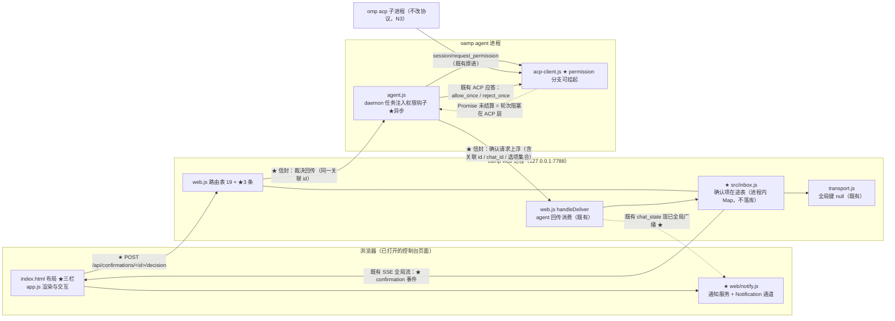

# architecture.md — 0021-confirmation-inbox-and-event-push

**版本**: 0.1.0（**第 1 轮骨架 + L1 清单 + 出现点/改动面清单**；第 2 轮补 §2/§3 与 T-01~T-16 落定）
**迭代**: 0021-confirmation-inbox-and-event-push
**阶段**: 3（技术架构）
**创建日期**: 2026-09-13
**输入**: `prd.md` v0.2.0 + `prd/F01~F12*.md`（12 卡，`[架构待填]` T-01~T-16）；`demand.md` v1.1.0
**代码基线**: `<工作区地址>/oamp/**`（只读）；迭代分支 `iteration/0021-confirmation-inbox-and-event-push`（base = main `854766c`）
**本方案的对象**: **oamp** —— 本机 `http://127.0.0.1:7788` 的 Web 控制台与其 HTTP/SSE 接口面。**不改 omp / harness 侧协议**（N3 → F12）。

> 阅读顺序建议：先看 §1 现状基线（30 秒建立心智模型）→ §3 L1 清单（需决策项，4 条）→ §4 改动面清单（落点在哪）。

---

## 0. 本文件状态（第 1 轮可达边界）

| 章节 | 状态 |
|---|---|
| §1 现状架构基线（as-is） | ✅ 已落盘 |
| §2 目标架构（to-be：组件图 / 数据流 / 接缝） | ✅ 已落盘（第 1 轮提前完成） |
| §3 关键技术决策（L1 清单 + L2 清单） | ✅ 已落盘（L1 逐条含备选/影响面；L2 10 条各附一句话理由） |
| §4 出现点 / 改动面清单（逐文件 + 行号 + 新建/修改/零改动 + 卡号） | ✅ 已落盘（新建 3 / 修改 11 / 零改动 10；含硬约束与顺序约束） |
| §5 接口与事件契约（新增 API / SSE 事件 / 跨进程信封） | ⏳ 第 2 轮（本轮已在 §2.2 给出事件类型与流向，字段级待补） |
| §6 inbox 项的承载形态与生命周期 | ⏳ 第 2 轮补 |
| §7 T-01~T-16 逐项落定（12 张卡的 `[架构待填]` 补全） | ⏳ 第 2 轮补 |
| §8 内部一致性自查全表 | ⏳ 第 2 轮补 |
| §9 风险与已知代价（R1~R3 承载） | ⏳ 第 2 轮补 |
| §10 越界与疑问 | ⏳ 第 2 轮补 |

---

## 1. 现状架构基线（as-is）

### 1.1 相关进程与进程边界

```
┌─ 浏览器 ────────────────────┐   ┌─ oamp web 进程 (127.0.0.1:7788) ─┐   ┌─ oamp agent 进程 ─┐   ┌─ omp acp 子进程 ─┐
│ index.html + app.js         │   │ web.js  路由/SSE/派发/对账        │   │ agent.js          │   │ acp-client.js    │
│ EventSource(/api/stream)    │◀─SSE─│ transport.js  SSE 键空间         │   │ Router/Task/       │   │ 按行 JSON-RPC    │
│ EventSource(/api/events)    │   │ persist.js  SQLite               │◀─UDS─│ ContextPool       │─stdio─│ session/prompt   │
└─────────────────────────────┘   │ cluster.js 拓扑轮询               │ 信封  │ task.js            │   │ session/          │
                                  └──────────────────────────────────┘   └───────────────────┘   │  request_permission│
                                                                                                  └───────────────────┘
```

**关键事实**：确认请求（`session/request_permission`）发生在**最右侧的 `omp acp` 子进程**里，被 `acp-client.js` 消费；要"上浮给人"，该事件必须**跨 3 条进程边界**到达浏览器，裁决再**原路回传**。

### 1.2 既有技术栈（本方案不得新增）

| 面 | 现状 | 证据 |
|---|---|---|
| HTTP 服务 | Node 内置 `http`，零第三方依赖 | `oamp/src/web.js` |
| 实时推送 | **SSE**（`text/event-stream`），键空间 `chat:<id>` / `call:<id>` / `chat-calls:<id>` / `null`(全局) | `oamp/src/transport.js:18-24` |
| 前端 | **零框架、零构建**：静态 `index.html` + `app.js` + `style.css`，原生 `EventSource` | `oamp/web/index.html:93`、`oamp/web/app.js:493` |
| 持久化 | SQLite（`persist.js`），**仅对话与消息** | `oamp/src/persist.js` |
| 配置 | `cluster.json` + `cluster-config.js`（`permission: allow\|deny`，缺省 `allow`） | `oamp/src/cluster-config.js:16-19` |
| 路由 | 自建路由表 `createApiRoutes`（19 条），表顺序 = 匹配优先级 | `oamp/src/web.js:465`、`1251` |
| 跨进程信封 | agent→web：`task.update` / `task.result` / `notice`；web→agent：`notice{kind:'context_release'}` | `oamp/src/web.js:1476-1500`、`1559-1566` |

### 1.3 与本次需求直接相关的现状缺口（**现状事实，非缺陷指控**）

| # | 现状 | 位置 | 与本次需求的关系 |
|---|---|---|---|
| G1 | 受门禁工具调用**一律自动答复**：`_permissionDecision` 返回 `allow`/`deny` 后立即 `_respond(...)` | `oamp/src/acp-client.js:397-425` | W3 → 需改为"上浮给人裁决"（F02） |
| G2 | `onPermissionRequest` 钩子**已是同步回调** `(info) ⇒ 'allow'\|'deny'` | `oamp/src/acp-client.js:73`、`415-423` | 接线点存在，但**签名是同步的**——挂起裁决需要异步形态（L1-2） |
| G3 | 轮次有硬超时：`prompt(text, {timeoutMs = 300000})`，超时即 `cancel → 宽限 → kill` | `oamp/src/acp-client.js:163`、`188` | **与 M3「默认阻塞且无上限」直接冲突**（L1-1） |
| G4 | SSE 只有 4 类对话事件 + 2 类全局事件 + 3 类调用事件；**无跨对话的"待确认"通道** | `oamp/src/web.js:13-20`、`oamp/API.md §4` | W1「跨对话集中」需要一条**独立于当前会话**的推送路径（L2-1） |
| G5 | 页面主体是**两栏**（`.sidebar` + `.detail`），另有整页切换的 `#projects-view` | `oamp/web/index.html:41-85` | W1 需要第三栏（T-01，L2-2） |
| G6 | **无任何通知 / Notification API 代码** | 全仓 `grep` 零命中 | W4 首个通道需新建（F08） |
| G7 | 前端对"刷新后重建"的兜底 = `onopen` 时全量拉取当前会话详情 | `oamp/web/app.js:5` 注释、`493-500` | W6 需要**跨对话**的在途列表重建（T-07） |

### 1.4 既有可复用原语（**奥卡姆剃刀：优先复用，不新建**）

| 原语 | 位置 | 复用方式 |
|---|---|---|
`transport.publishGlobal` / 全局订阅键 `null` | `transport.js:26`、`103-105` | 待确认 inbox 的推送**直接复用全局键**（跨对话、与会话订阅结构性隔离） |
| 路由表 `createApiRoutes` | `web.js:465` | 新增 API 追加表项，**不改既有 19 条** |
| `matchRoute` / `projectRoutes` / `renderLlmsTxt` | `web.js:1251`、`1265`、`1283` | 新路由登记后 `/api/docs` 与 `/llms.txt` **自动派生**（零额外改动） |
| agent→web `notice` 信封（含 `kind`） | `web.js:1478-1484` | 确认请求上浮的**候选载体**（复用 vs 新增见 L1-3） |
| web→agent `notice{kind}` 控制消息 | `web.js:1559-1566` | 裁决回传的**候选载体**（同上） |
| 进程内任务表 / 调用 roster | `web.js` §3.14-3.19 | inbox 在途表的**形态先例**（进程内、不做持久化 → 天然满足 N2/F11） |

### 1.5 硬约束：**登记面 → 派生面的联动**（新增一条路由的必然后果）

> 这一节是本方案最容易低估的成本：oamp 的接口面有**两个逐字节 / 双向的漂移锁**（`oamp/test/api-routes.test.js:278`、`:303`）。**新增路由不是"加一段 handler"**，它必然拉动下面三处。

| # | 派生面 | 硬约束 | 证据 | 不联动的后果 |
|---|---|---|---|---|
| D1 | `oamp/llms.txt` | **逐字节快照**：`renderLlmsTxt(projectRoutes(createApiRoutes({})))` 必须与仓库文件字节相等 | `api-routes.test.js:278-287`；重生成命令 = `node oamp/scripts/gen-llms-txt.mjs`；`llms.txt:11` 现为「## 接口（19 条）」 | 测试红：`llms.txt 与生成结果不一致` |
| D2 | `oamp/API.md` | **路径级双向覆盖**：登记集合与文档集合互为子集——新增路由必须在 API.md 出现 `METHOD /api/…` 形态的反引号签名 | `api-routes.test.js:303-315`（`docSignatures` 只认 `` `(GET\|POST) (/api/…)` `` 这一种形态） | 测试红：`API.md 缺登记: …` |
| D3 | `GET /api/docs` 与 `/llms.txt` 的 HTTP 产物 | 由 `projectRoutes` **每次重新投影**（不缓存）⇒ 自动派生；`danger` 由 `method !== 'GET'` **派生**，不手写 | `web.js:1265-1275`、`1283` | 无（**零改动**即正确）——但投影表项必须凑齐 8 个元数据字段 |

**对本迭代的含义**：新增 2~3 条确认面接口 ⇒ **必然修改** `oamp/API.md`（追加 §3.20+ 小节）与重新生成 `oamp/llms.txt`。这两处不是"顺手"，是**同一处改动的组成部分**（已登记为 §4.2 的 M-9 / M-10）。

**另一条构造性约束**：漂移锁以 `createApiRoutes({})`（**空依赖**）调用 ⇒ 表项构造必须是纯构造，handler 内的依赖使用不得发生在构造期（`web.js:466-468` 既有注释「纯构造：不调用依赖、不读磁盘、不起定时器」）。新增路由沿用该形状。

---

## 2. 目标架构（to-be）

> 一句话：**在 web 进程里加一张"在途确认表"，把 agent 进程里那条原本同步回包的 ACP 权限请求改成"挂起等回包"，用既有的全局 SSE 键把它推到前端第三栏，用页面内的 Notification API 通知。全程不新增进程、不新增依赖、不新增持久化表。**

### 2.1 组件图（新增/改动以 ★ 标注）



**读图要点**：★ 共 6 处，全部落在**既有 4 个进程**内——**没有第 5 个进程、没有新端口、没有新依赖**（`package.json` dependencies 为空是 `hygiene.test.js` 强制的）。

### 2.2 三条核心数据流

**流 1 · 确认上浮（F02 / E1）**

1. `omp acp` 子进程发出 `session/request_permission`（既有原语，**不改**）；
2. `acp-client.js` 判定档位：`deny` ⇒ **原路同步拒绝**（F02 验收 4，行为不变）；`allow` 或缺省 ⇒ 调异步钩子，**此刻不回包**，ACP 轮次停在等待态；
3. `agent.js` 把请求（关联 id、`chat_id`、工具名/标题、**请求方给出的选项集合**——F03 的选项来源）作为新信封回给 web 实例（`origin`，既有 `sendTaskMessage` 同形）；
4. `web.js` 登记进 `inbox.js`（携带来源对话标识 ⇒ MI-02 可辨识），**同时**推一帧 `confirmation` 到全局 SSE 键；
5. 前端收到 → 第三栏出现条目（**无需刷新**，E1 达成）→ 通知服务判为 `confirmation_required` → Notification 通道投递（**仅在首次入库时**，MI-01）。

**流 2 · 裁决回传（F03 / F04 / E2）**

1. 用户在栏内点选选项（选项为主）＋可选文本（文本为辅）→ 一并提交（`POST /api/confirmations/<id>/decision`）；
2. `web.js` 从 `inbox.js` **原子取出并移除**该条（⇒ 栏内消失，F03 验收 4；已裁决项**不回流**，F06 验收 4 / N2）；
3. 按登记时记录的来源实例与关联 id，把裁决作为新信封回传 agent 进程；
4. `agent.js` 结算那个挂起的 Promise → `acp-client.js` 回 `allow_once` / `reject_once` → 轮次**继续或中止**（F04 验收 1~2）；
5. 挂起期间计时被**冻结**（L1-1）⇒ 无论等待多久都不会被 `cancel → kill`（F05 / E4）。

**流 3 · 事件通知（F07 / F08 / E3）**

1. 对话终态由**既有** `publishState` 产生（`web.js:1374`）——★ 追加一次全局广播，不改既有 `chat:<id>` 键的发布行为；
2. 前端在**全局流**上派生 `chat_completed` / `chat_failed`（由既有 `chat_state` 的 `working → completed/failed` 转变而来）⇒ **不新增服务端事件类型**；
3. `confirmation_required` 来自流 1 的第 4 步；
4. 三类事件 → `notify.js` 的**服务**判"是否应通知" → **通道**投递（首个通道 = Notification API）；
5. 因走全局流，用户**停在任何对话甚至项目列表页**都能收到（E3：不依赖停留在该对话）。

**事件类型封闭性**：常量仅 3 个（`chat_completed` / `chat_failed` / `confirmation_required`），**无 `call_completed`**（N5 → F07 验收 3：调用面的完成不产生通知）。

### 2.3 与既有组件的接缝（**复用了什么**）

| 接缝 | 复用 | 不新建 |
|---|---|---|
| 跨对话推送 | 既有**全局订阅键 `null`** + `publishGlobal`（`transport.js:16-24`、`103-105`） | 不新建 SSE 通道/键空间 |
| 路由与文档 | 既有路由表 + `projectRoutes` 派生（`web.js:465`、`1265`） | 不新建路由框架；`/api/docs` 自动派生 |
| 进程内状态 | 既有任务表 / 调用 roster 的形态先例 | 不新建持久化表、不引入 SQLite 迁移（N2/F11） |
| 跨进程信封 | 既有 `sendTaskMessage` / `sendControlNotice` 同形（`agent.js:160`、`web.js:1560`） | 不新建 side-channel、不新增端口 |
| 前端实时面 | 既有 `EventSource('/api/events')` 全局连接（`app.js:131`） | 不新建连接、不引入前端框架 |
| 前端重建兜底 | 既有 "`onopen` 全量拉取" 体例（`app.js:5` 注释、`493-500`） | 不新建缓存层 |

### 2.4 明确**不引入**的东西（奥卡姆剃刀 / L2-7）

Service Worker、Web Push、VAPID、WebSocket、新 npm 依赖、新进程、新端口、新持久化表、新配置文件项、前端框架/构建链、消息队列、事件总线。

> 检验：上面每一项，**删掉它哪个功能需求无法实现？**——没有。故不引入。

---

## 3. 关键技术决策

### 3.1 L1 决策清单（**需主 agent 确认，未确认前不进入实现**）

> 判定口径（角色契约）：L1 = 引入新技术栈 / 改变现有核心模块职责 / 影响系统整体边界。以下 4 条**均落在既有技术栈内**，但都改变既有语义或跨进程契约，故按 L1 上报。

#### L1-1 · 挂起期间**冻结**轮次超时计时（使 M3「默认阻塞且无上限」成立）

| 项 | 内容 |
|---|---|
| **是什么** | 当一轮 `session/prompt` 因确认项挂起时，**暂停**该轮的 `timeoutMs` 计时；裁决到达、轮次继续后**恢复**计时。等价于"等待人拍板的时间不计入轮次预算"。 |
| **为何必须** | 现状超时是**三层叠加**且都封顶：① ACP 层 `prompt(text, {timeoutMs = 300000})`，超时即 `cancel → 宽限 2000ms → kill`（`acp-client.js:163`、`188`、`12-16`）；② agent 层 daemon 任务沿用 `task.timeoutMs`（`agent.js:296-322`、`322`）；③ HTTP 入口层 `DEFAULT_OMP_TIMEOUT_MS = 300000` 且硬校验 `timeoutMs <= MAX_TIMEOUT_MS = 600000`（`agent.js:27-29`、`87-88`、`111-112`）。**即使把请求超时打满到上限，也只有 10 分钟**——M3 的「无上限」在现状下**任何参数组合都到不了**。若不改：E4（放置任意长时间后条目仍在、轮次未推进）必然失败，且失败态是"条目还在、轮次已死"的**孤儿态**（比没有该功能更难排查）。这是**功能规格与技术约束之间的真实冲突**，不是可绕过的实现细节。 |
| **备选** | ① **冻结计时**（推荐）：只改"计时是否推进"，不改既有契约的语义面；② 调用方显式传超大/零超时：需改 `POST /api/messages`、`POST /api/calls` 的 `MAX_TIMEOUT_MS` 校验与所有调用方（本迭代自身的 hub 派发即调用方之一），且**把"无上限"这个产品语义外推给每个调用方**，脆弱；③ 不改超时、另起一条"确认轮次豁免 kill"的旁路：等于给同一轮次造两套生命周期，理解成本高于收益。 |
| **影响面** | `oamp/src/acp-client.js`（`prompt` / `_request` 的计时器：`setTimeout` → 可控的暂停/恢复）；`oamp/src/agent.js`（daemon 任务的 `task.timeoutMs` 传递）；`oamp/API.md`（需说明"挂起不计时"）；`oamp/test/`（既有超时断言的行为边界）。**不改**：`MAX_TIMEOUT_MS` 的校验范围、shell / 一次性 `omp` 路径的超时语义。 |
| **不确认的后果** | 实现将退化为"确认项在 `timeoutMs` 内必须被裁决"，与 F05 验收 1~2 / E4 直接矛盾。 |

#### L1-2 · `allow` 档语义变更的承载点 = 把 `onPermissionRequest` 从**同步回调**改为**可异步挂起**

| 项 | 内容 |
|---|---|
| **是什么** | `AcpClient` 的权限判定钩子由 `(info) => 'allow'\|'deny'`（同步）扩展为可返回 **Promise**；返回 Promise 未被结算期间，`session/request_permission` 的服务端请求**保持未应答**（不发 `_respond`），轮次自然阻塞在 ACP 层。 |
| **为何必须** | 现状 `_handleServerRequest` 在同一个 tick 里判定并回 `_respond`（`acp-client.js:397-411`）。"上浮给人裁决"必须在**人拍板之前不回包**——这是 F02/F04 的全部技术内容。`allow` 档改为上浮（R3）意味着**默认路径**（缺省 `allow`）也走这条异步分支，不再是边缘路径。 |
| **备选** | ① **钩子返回 Promise**（推荐）：改动最小，`_permissionDecision` 的调用点从"取返回值"改为"await 结算"；② 新增独立的 `onPermissionRequestAsync` 配置项：同一件事两条路径，违背"只有一种实现时的配置项是纯负债"（`transport.js:3` 既有立场）；③ 在 ACP 之外另起一层代理子进程拦截：引入新进程与协议转换层，**用大炮打蚊子**。 |
| **影响面** | `oamp/src/acp-client.js`（`_handleServerRequest` / `_permissionDecision` 的异步化、`permission_denied` 轮次错误的触发时机）；`oamp/src/agent.js`（钩子的注入者）；`oamp/test/tool-permission.test.js`（**既有断言必然受影响**）。 |
| **兼容性** | `deny` 档**保持自动拒绝**（F02 验收 4 / T-1），即"同步判定为 deny 时不进入挂起分支"——既有 `deny` 行为逐字不变。 |

#### L1-3 · 新增 **agent ⇄ web** 的确认请求 / 裁决**双向关联消息**（oamp 内部跨进程契约扩展）

| 项 | 内容 |
|---|---|
| **是什么** | 在既有 agent↔web 信封面（`task.update` / `task.result` / `notice`）之外，新增一对**带关联 id** 的消息：agent→web 的"确认请求上浮"与 web→agent 的"裁决回传"。 |
| **为何必须** | 既有 `notice` 是 fire-and-forget、**无请求 id、无回执语义**（`web.js:1478`）；web→agent 的控制面只有 `notice{kind:'context_release'}`（`web.js:1559`）。F04 要求"裁决只作用于其所属的那一条 / 那一轮"——**没有关联 id 就无法保证作用域**，也无法在并发多对话时把裁决投递到正确的轮次。 |
| **备选** | ① 复用 `notice` + 在 body 里塞 id（不新增信封类型，推荐度**中**：语义上 notice 是"通知"不是"请求"，未来读者难以判断谁等谁）；② **新增一对信封类型**（推荐）：语义显式，`web.js` 的 `onAgentMessage` 加两个分支、`sendControlNotice` 旁加一个同形态的发送函数；③ 另开一条 side-channel HTTP(S)（agent 反调 web 的 REST）：引入反向依赖与端口/鉴权问题，**与 N1/F10 的边界纠缠**。 |
| **影响面** | `oamp/src/web.js`（代理回传消费分支 + 控制面发送）；`oamp/src/agent.js`（发送侧）；`oamp/API.md §7`（子 agent 契约对照表需登记差异）；**不动 omp/harness 协议本身**（N3 仍成立：ACP 的 `session/request_permission` 是既有原语，本方案不新增、不修改 ACP 侧任何方法）。 |
| **与 N3 的关系** | N3 禁止的是改 **omp / harness 侧**协议。本项改的是 **oamp 自己的** agent↔web 信封，**不触碰 ACP**。此边界需主 agent 确认无误判。 |

#### L1-4 · 通知投递的能力边界 = **页面打开时才可通知**（不引入 Service Worker / Web Push / VAPID）

| 项 | 内容 |
|---|---|
| **是什么** | 首个通道 = 浏览器 **Notification API**，在**已打开的 oamp 页面**里由既有 SSE 连接触发的 JS 直接调用 `new Notification(...)`。**不引入** Service Worker、Push API、VAPID 密钥、任何第三方推送服务。 |
| **为何必须**（说明而非主张） | E3 的判据是"**不依赖用户停留在该对话**"（可切到别的页面/标签**仍**收到），**不是**"浏览器关闭后仍收到"。前者用页面内 Notification API + 全局 SSE 即可满足；后者才需要 Service Worker + Web Push（并涉及 N1 的"投递路径经浏览器厂商推送服务"这条 T-2 裁决解禁的路）。**本迭代按 E3 的字面判据取前者**。 |
| **备选** | ① **页面内 Notification API**（推荐）：零新依赖、零密钥、零服务端出网；② Service Worker + Web Push：为一条本迭代未要求的判据引入 SW 生命周期、密钥管理与离线投递语义，**YAGNI**；③ 站内横幅/声音：N4 明确不做偏好，且不满足"切到别的页面仍被叫到"。 |
| **影响面** | 前端新增通知模块（`oamp/web/`）；`oamp/API.md` 可为空改动（通道是前端行为）；**服务端零新增出网路径**（F10 的"仅 127.0.0.1"边界因此**天然保持**）。 |
| **需主 agent 确认的点** | 若用户对"浏览器关闭后仍要收到"有期待，则此项需升级为 SW + Web Push（**范围与 N1 的解读都会变**）。**本方案按 E3 字面判据，判为不需要。** |

### 3.2 L2 决策清单（**自主决定**）

> 第 1 轮登记结论与一句话理由；第 2 轮补字段级细节与验收方式。

| # | 决策 | 一句话 | 关联卡 |
|---|---|---|---|
| L2-1 | inbox 推送复用 **全局 SSE 键 `null`** 而非新建 `/api/stream` 变体 | 全局键已存在且与 chat 键结构性隔离（`transport.js:16-24`） | F01 / F06 |
| L2-2 | 第三栏 = 既有 `main.layout` 内**新增一栏**（CSS grid 三列），不新建页面、不新建路由 | 与 `#projects-view` 的整页切换体例区分开；N7 只禁其它入口载体，不禁第三栏本身 | F01 |
| L2-3 | inbox 在途表 = **服务端进程内**（web 进程），**不落 SQLite** | 刷新/重连重建（W6）要求服务端；"无历史台账"（N2/F11）要求不持久化——两者同时满足 | F01 / F06 / F11 |
| L2-4 | 新增 API 走既有路由表 `createApiRoutes` 追加表项 | `/api/docs` 与 `/llms.txt` 自动派生，零额外改动 | F02 / F03 / F06 |
| L2-5 | 事件类型封闭 3 类 = **服务端常量** + **前端文案表** | T-14；避免字符串散落 | F07 |
| L2-6 | 通知服务/通道分离的落点 = 前端一个小模块内 `service`(选事件→通知意图) 与 `channel`(投递) 两个函数 | T-12；**不新建进程、不新建服务端组件**——"服务"是模块内的职责边界，不是部署单元 | F09 |
| L2-7 | 不新建任何持久化表、不新增 npm 依赖、不新增配置文件项 | 奥卡姆剃刀：每条 `[架构待填]` 都能用既有原语回答 | 全局 |
| L2-8 | `chat_completed` / `chat_failed` **由前端从既有 `chat_state` 派生**；服务端只给 `publishState` 追加一次全局广播 | `web.js:1374` 是唯一状态发布点；缺全局广播则"看着 A 对话时 B 对话完成"收不到（E3 不依赖停留）；派生优于新增事件类型 | F07 / F08 |
| L2-9 | 确认项**进入** inbox 即"通知一次"，由前端在 `confirmation` 事件到达时触发；重建在途列表**不触发** | MI-01 的验收口径直接落在"事件只在首次入库时发"这一服务端事实上 | F07 / F08 / F06 |
| L2-10 | 新增路由登记在**表末位**；`POST /api/confirmations/:id/decision` 用**后缀形态**避开 `GET /api/chats/<字面量>` 的贪婪吞并（`web.js:461-463` 既有教训） | 表顺序 = 匹配优先级（`api-routes.test.js:319`） | F03 |

---

## 4. 出现点 / 改动面清单

> 口径：**行号为当前 `0081` 基线实测行号**（迭代分支 base = main `854766c`）。"卡号" = 该落点服务的功能卡。第 2 轮会在此基础上细化到函数级。

### 4.1 新建（3 条）

| # | 路径 | 规模（估） | 内容 | 卡号 |
|---|---|---|---|---|
| N-1 | `oamp/src/inbox.js` | ~150 行 | 确认项在途表：登记 / 查询 / 裁决 / 移除；进程内 `Map`，**不持久化**；携带 `chat_id`（可辨识来源对话，MI-02）与**请求方来源信息** | F01 / F02 / F04 / F06 / F11 |
| N-2 | `oamp/web/notify.js` | ~90 行 | 通知**服务**（事件类型 → 是否应通知）+ 通道接口（`deliver(intent)`），首个通道 = 页面内 Notification API；权限未授予时的降级（T-11） | F07 / F08 / F09 |
| N-3 | `oamp/test/confirmation-inbox.test.js` | ~（第 2 轮定） | 新能力的行为断言（在途重建、裁决回路、通知恰好一次） | F01~F09 |

### 4.2 修改（11 条）

| # | 路径 | 落点行号（基线） | 改动内容 | 卡号 |
|---|---|---|---|---|
| M-1 | `oamp/src/acp-client.js` | `73`、`397-425` | `onPermissionRequest` 支持 Promise；`_handleServerRequest` 的 permission 分支改为"待裁决期间不回包"；`deny` 档短路保持同步 | F02 / F04 / F12 |
| M-2 | `oamp/src/acp-client.js` | `159-202`、`268-280` | 轮次计时器可**冻结/恢复**（L1-1）；`permission_denied` 的触发时机随异步化复核 | F05 |
| M-3 | `oamp/src/agent.js` | `296-358`、`612-641` | daemon 任务注入异步 permission 钩子；确认请求上浮 / 裁决回传的发送与接收；`permission` 档从 `cluster.json` 透传（`cluster-config.js:16-19`） | F02 / F04 / F05 |
| M-4 | `oamp/src/web.js` | 路由表 `465-1250` 追加 3 条 | `GET /api/confirmations`（在途列表，重建）、`POST /api/confirmations/<id>/decision`（裁决）、（可选）`GET /api/confirmations/stream` 或复用 `/api/events` 推 `confirmation` 事件 | F01 / F03 / F06 |
| M-5 | `oamp/src/web.js` | `1476-1500`、`1559-1566` | 消费 agent 上浮的确认请求 → 登记 inbox + 推全局事件；裁决 → 回传 agent | F02 / F04 |
| M-6 | `oamp/src/web.js` | `1374`（`publishState`）、`1393-1400`（终态落盘） | 见 **L2-8**：给 `publishState` **追加一次全局广播**（既有 `chat:<id>` 发布逐字不变）⇒ 前端可在全局流上派生 `chat_completed` / `chat_failed`。**不新增事件类型** | F07 / F08 |
| M-7 | `oamp/web/index.html` | `44-85`（`<main class="layout">` … `</main>`） | `main.layout` 内新增第三栏容器（结构节点；既有 `.sidebar`(45) 与 `.detail`(60) 之间的兄弟节点） | F01 |
| M-8 | `oamp/web/app.js` | `493-560`（SSE 消费）、`196-400`（渲染体例） | 消费全局 `confirmation` 事件；第三栏渲染（选项控件 + 文本输入 + 提交）；调用 `notify.js`；重连后重建在途列表 | F01 / F03 / F06 / F07 / F08 |
| M-9 | `oamp/API.md` | §3 末尾（现止于 `840` 行 `### 3.19`） | **追加** §3.20+ 小节，登记新增的确认面接口（漂移锁③ D2 强制；既有 19 条**逐字不改**） | F10 / F12 |
| M-10 | `oamp/llms.txt` | `11`（`## 接口（19 条）`） | **重新生成**（`node oamp/scripts/gen-llms-txt.mjs`）——纯派生文件，**不手改** | F10 |
| M-11 | `oamp/web/style.css` | 第三栏样式 | 三列布局与栏内控件样式 | F01 / F03 |

### 4.3 零改动（**明确不动**，含理由）

| # | 路径 / 面 | 理由 | 卡号 |
|---|---|---|---|
| Z-1 | omp / harness 侧 ACP 协议（`session/request_permission` 及其 options） | **N3 硬边界**：本方案只消费既有原语 | F12 |
| Z-2 | `POST /api/messages`、`POST /api/calls` 的**请求 / 响应契约** | 本迭代不加新入口；确认流由 agent 侧上浮触发，不经过消息入口 | F10 / F12 |
| Z-3 | `oamp/src/persist.js`（SQLite schema） | N2/F11：**不做历史台账** ⇒ 无需新表、无需迁移 | F11 |
| Z-4 | `cluster-config.js` 的 `permission` 档位**取值与校验**（`allow\|deny`，`197` 行） | 档位取值不变（R3 只改 `allow` 档的**行为**，不改配置面）；**不新增配置项**（N4/N6） | F02 / F05 |
| Z-5 | `oamp/src/transport.js` | 复用既有全局键与 `publishGlobal`；**键空间不扩充** | F01 / F06 |
| Z-6 | 顶栏导航 / 左栏过滤器 / 归档 / 项目列表视图 | N7：**不做第三栏之外的入口载体** | F01 |
| Z-7 | 鉴权、监听地址（`web.js` 的服务构造处） | N1/F10：边界不变 | F10 |
| Z-8 | `oamp/API.md` 的既有 19 条接口条目 | 只**追加**新接口章节，既有条目零改写（`projectRoutes` 自动派生） | F10 / F12 |
| Z-9 | `oamp/test/hygiene.test.js` | 三条断言与新改动无交集（见 §4.5）——**但它是"不得引入依赖"的强制项** | 全局 |
| Z-10 | `oamp/src/persist.js` 的调用面 / `oamp/src/router.js` / `oamp/src/cluster.js` | 确认面不经 Router 拓扑与集群配置；inbox 在 web 进程内 | F02 / F11 |

### 4.4 改动面的**顺序约束**（供阶段 4 PR 拆分直接使用）

1. **协议先行**（L1-3）：agent⇄web 信封字段先定稿——它是 M-3 / M-5 两侧的共享接口，**先于**两端实现。
2. **服务端其次**：N-1（inbox）→ M-5（消费/回传）→ M-4（路由）→ **M-9 + M-10（派生面同步，与 M-4 同一提交）**。
3. **前端最后**：M-7（结构）→ M-8（消费与交互）→ N-2（通知）→ M-11（样式）。
4. **挂起语义（M-1 / M-2）与 L1-1 冻结**必须与 #2 同批——否则"条目能进栏、轮次却会超时死"，中间态不可验收。

### 4.5 既有断言的影响判定（**必然变更点**，第 2 轮给具体断言行）

| 测试文件 | 判定 | 依据 |
|---|---|---|
| `oamp/test/tool-permission.test.js` | ⚠️ **必然变更** | 该文件断言 `allow` 档 = 自动放行（`acp-client.js:397-411` 的同步应答路径）；L1-2 使 `allow` 档缺省路径变为"上浮" ⇒ **断言前提消失**。第 2 轮需逐条点名要改的断言行 |
| `oamp/test/api-routes.test.js` | ⚠️ **必然变更** | 漂移锁②（`llms.txt` 逐字节）与漂移锁③（API.md 双向覆盖）**必然**因新增路由而红——靠 **M-9 + M-10 同步**转绿，**不是改测试**。另有「漂移锁①：登记元数据必填」（`:195`）⇒ 新表项 8 字段必须齐 |
| `oamp/test/api-pages.test.js` | ⚠️ **可能变更** | 该文件对前端源码做**计数式结构断言**（`:121` `window.confirm` 恰一处、`:124-125` `danger-badge` 恰两处且由投影派生）——第三栏若引入前确认 UI 会**直接撞上 `:121`**；第 2 轮须复核并在此写明处置 | F01 / F03 |
| `oamp/test/hygiene.test.js` | ✅ **预计零改动**（但约束新建文件） | 三条断言：`.gitignore` 含 `.runtime/`；`bin/`+`src/` 的 `.js` 与 `package.json` **凭据字段名词边界扫描零命中**（`to+ken`/`api+_key`/`secr+et` 等，`hygiene.test.js:18-26`）；`package.json` dependencies 为空。⇒ `src/inbox.js` **不得出现这类词**（如变量名含 `token`）；`web/` 不在扫描面内。**零依赖（L2-7）是测试强制的**，不是偏好 |
| `oamp/test/project-workspace.test.js` | ⚠️ **需复核** | 该文件 1327 行、覆盖前端整页行为；第三栏改变 `.layout` 的 DOM 结构，若其中有布局/可见性断言则受影响。第 2 轮点名 |
| `oamp/test/web.test.js`（1640 行）、`call-protocol.test.js` | ⚠️ **需复核** | `/api/stream`、`/api/events` 与调用面事件清单若被逐条断言，新增 SSE 事件名与路由需同步 |

---

## 5. 接口与事件契约

> ⏳ 第 2 轮补：`GET /api/confirmations` / `POST /api/confirmations/<id>/decision` 的请求响应字段；inbox SSE 事件名与 payload；agent⇄web 新增信封的字段集合；错误契约（404/409/400）沿用 §2.2。

---

## 6. inbox 项的承载形态与生命周期

> ⏳ 第 2 轮补（T-08）：登记时机 → 在途存活 → 裁决/失效 → 移除；与"无历史台账"（N2）的边界；`chat_id` 缺失/对话已关闭时的处理。

---

## 7. T-01~T-16 逐项落定

> ⏳ **第 2 轮补**（本轮明确不做）。12 张卡的 `[架构待填]` 全部在本节回答；每项标注 **L1 / L2 / L3** 与所依据的既有代码事实。

| 编号 | 关联卡 | 落定状态 |
|---|---|---|
| T-01 第三栏布局与响应式 | F01 | ⏳ 第 2 轮 |
| T-02 确认项在栏内的呈现形态 | F01 / F02 / F03 | ⏳ 第 2 轮 |
| T-03 裁决交互控件形态 | F03 | ⏳ 第 2 轮 |
| T-04 文本是否必填 / 空白可否提交 | F03 | ⏳ 第 2 轮 |
| T-05 确认源接线方式与是否新增承载体 | F02 / F12 | ⏳ 第 2 轮 |
| T-06 裁决回传载体与形态 | F04 | ⏳ 第 2 轮 |
| T-07 在途列表重建机制 | F06 | ⏳ 第 2 轮 |
| T-08 inbox 承载形态与生命周期 | F01 / F06 / F11 | ⏳ 第 2 轮 |
| T-09 通知标题 / 正文 / 点击去向 | F08 | ⏳ 第 2 轮 |
| T-10 多条通知的合并 / 覆盖策略 | F08 | ⏳ 第 2 轮 |
| T-11 权限未授予时的降级形态 | F08 | ⏳ 第 2 轮 |
| T-12 通知服务与通道的组织形态 | F09 | ⏳ 第 2 轮 |
| T-13 事件投递路径 / 通道实现 | F07 / F08 / F10 | ⏳ 第 2 轮 |
| T-14 事件类型定义的承载形态 | F07 | ⏳ 第 2 轮 |
| T-15 策略扩展点是否预留 | F05 | ⏳ 第 2 轮 |
| T-16 挂起期间 agent 的行为形态 | F05 | ⏳ 第 2 轮 |

---

## 8. 内部一致性自查

> ⏳ 第 2 轮补（全表）。

---

## 9. 风险与已知代价

> ⏳ 第 2 轮补：R1（无人看守时轮次保持等待）/ R2（无超时退化）/ R3（`allow` 档语义变更）的架构承载，以及本次执行自身的 R1 场景（hub 后台派发 + `dev` 角色 `allow` 档）。

---

## 10. 越界与疑问

> ⏳ 第 2 轮补。
