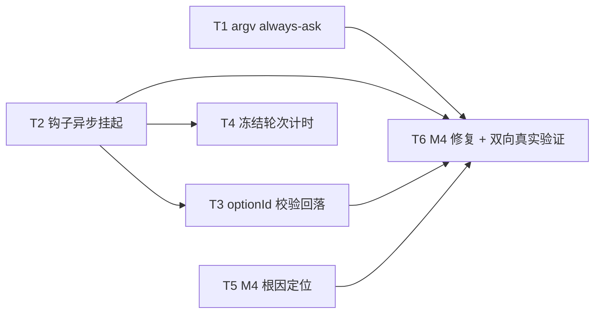

# 001-tasks.md — pr-001 内部任务图（agent 侧权限挂起链路 + ACP 答复链路修复）

**迭代**: 0021-confirmation-inbox-and-event-push ｜ **阶段**: 5（PR 实现）｜ **PR 文件**: `prs/pr-001-agent-permission-suspend-and-reply-fix.md`
**worktree 分支**: `feat/0021-pr-001-permission-suspend-and-reply-fix` ｜ **任务总数**: **6**（T1~T6）｜ **依赖图**: 无环（见 §2）

## 0. 范围、文件面与事实锚点

**本 PR 文件范围（唯一可写面）**

| 文件 | 动作 | 内容 |
|---|---|---|
| `oamp/src/acp-client.js` | 修改 | argv 档位段（`:123`）、`_handleServerRequest` permission 分支与 `_respond` 包形态（`:397-410`、`:400`）、`_permissionDecision`（`:414-425`）、`prompt`/`_request` 计时器（`:159-202`、`:268-279`）、`onPermissionRequest` 的 JSDoc（`:73`） |
| `oamp/test/tool-permission.test.js` | 修改 | 既有 argv 断言 `yolo` → `always-ask`；补挂起期不回包 / `optionId` 回显 / 非法 `optionId` 回落 / 冻结计时的帧级断言 |
| `oamp/test/acp-daemon.test.js` | 修改 | 常驻路径 argv 断言 `yolo` → `always-ask`；**一次性路径 `yolo` 断言保持不变** |

**非目标（由其它 PR 承担，本 PR 不写）**：`context-pool.js` / `agent.js` 的钩子注入与 `pending` 表（pr-002）、`inbox.js` / `web.js`（pr-003）、前端第三栏与 `notify.js`（pr-004）；`API.md` / `llms.txt` 派生面（pr-003）。

**读码事实锚点（本任务图的判据基础）**

| # | 事实 | 位置 |
|---|---|---|
| A1 | 现行 argv：`this.permission === 'deny' ? 'always-ask' : 'yolo'`（仅 `tools=true` 时追加） | `acp-client.js:123` |
| A2 | 现行 permission 分支在**同一 tick** 判定并回包，恒回 `allow_once`/`reject_once`；`!== 'deny'` 判据会把「未结算 Promise」当成 allow | `acp-client.js:397-410` |
| A3 | 现行钩子调用点只接受 `'allow'`/`'deny'` 两个字面量，其它返回值回落静态档 | `acp-client.js:414-425` |
| A4 | 轮次计时 = `_request` 的 `setTimeout`，`session/prompt` 的 `timeoutMs` 唯一入口；超时回调 = `cancel → 宽限 → kill` | `acp-client.js:268-279`、`:187-196` |
| A5 | fake ACP 观测面：`FAKE_ACP_FRAMES_LOG` 记录 `initialize` / `server_request_reply` / `session/cancel` 帧；`FAKE_ACP_ARGS_LOG` 记录启动 argv | `tool-permission.test.js:34`（argv）、`:53`、`:65`、`:142-143`（帧） |
| A6 | daemon 路径**无**独立 task 计时器：`setTimeout(… task.timeoutMs)` 只存在于 `runOmpTask`（`:216`）与 shell 执行器（`:391`）；daemon 只把 `task.timeoutMs` 透传给 `session.prompt` | `agent.js:296-360`、`:322` |
| A7 | `AcpClient.start()` 恒追加 `--no-session`，且构造入参无 argv 覆盖位（只有 `bin`） | `acp-client.js:118-124` |
| A8 | 两处 argv 断言：常驻 `tools on + allow` → `yolo`（`:532`）；一次性 `-p`（allow）→ `yolo`（`:554`，**不变**） | `acp-daemon.test.js` |

## 1. 任务列表

### T1: `allow` 档 argv 由 `yolo` 改 `always-ask`，并同步两处既有断言

- **验收标准**:
  1. `tools=true` 时 `permission='allow'` 与 `'deny'` 的 argv 均含 `--approval-mode always-ask`；`tools=false` 与匿名实例 argv **不含** `--approval-mode`。判据：`node --test oamp/test/tool-permission.test.js` 中 argv 用例全绿，且 allow 档断言值 = `always-ask`。
  2. 常驻路径断言同步：`oamp/test/acp-daemon.test.js:532` 的 `yolo` 改为 `always-ask`。判据：`node --test oamp/test/acp-daemon.test.js` 全绿。
  3. 一次性路径零改动：`oamp/test/acp-daemon.test.js:554` 的断言**逐字保持 `yolo`**；`oamp/src/agent.js` 不在 diff 内。判据：该行未变 + `git -C <worktree> diff --name-only` 不含 `oamp/src/agent.js`。
- **前置依赖**: 无
- **优先级**: P0
- **追溯**: architecture §3.1 L1-2② ／ §4.2 M-12 ／ §4.3 Z-12 ／ §9.4.2 结论 1 ／ §11.1 B-1、B-2 ／ §11.3 B-13；prd/F02「架构落定 · 档位」、F12「必然变更」

### T2: `onPermissionRequest` 返回域扩为 `'allow'|'deny'|{optionId}|Promise<…>`：挂起期不回包、结算后回显

- **验收标准**:
  1. 钩子返回**未结算的 Promise** 期间，对该 `session/request_permission` 不产生应答帧；Promise 结算后才回包。判据（帧级）：`FAKE_ACP_FRAMES_LOG` 中该请求的 `server_request_reply` 记录**晚于** Promise 结算时刻，挂起窗口内该 `server_request_id` 无 reply 记录。
  2. 结算后回包的 `optionId` = 钩子 `{optionId}` 返回值（不恒为 `allow_once`/`reject_once`）。判据：帧日志 `reply.result.outcome.optionId === <钩子选定值>`。
  3. 同步返回 `'allow'` / `'deny'` 的两条既有路径**逐字不变**：仍回 `allow_once` / `reject_once`，审计各恰一行；`deny` 档三步（回 `reject_once` → `session/cancel` → `prompt()` 抛 `permission_denied`）不变。判据：`tool-permission.test.js` 两条既有用例**未改一字**且全绿。
  4. 挂起路径的审计行在**裁决到达后**写恰一行，`option` = 实际回显的 `optionId`（行形态与字段集合不变）。判据：`TOOL_APPROVED`/`TOOL_DENIED` 行数 = 1 且 `fields.option` 等于回显值。
  5. JSDoc（`acp-client.js:73`）返回值域改写为 `'allow'|'deny'|{optionId}|Promise<…>`；「给了则优先于 permission」的优先级语义逐字保留。判据：读该行。
- **前置依赖**: 无
- **优先级**: P0
- **追溯**: architecture §3.1 L1-2① ／ §4.2 M-1 ／ §5.4 ／ §7 T-05①、T-16 ／ §11.2 B-9 ／ §11.3 B-14；prd/F02 验收 1、F12 架构落定①②

### T3: `optionId` 合法性校验与回落（M3 硬约束）

- **验收标准**:
  1. 钩子返回的 `optionId` **不在**该请求 `params.options` 集合内时，应答回落为 `allow_once`（放行侧）/ `reject_once`（拒绝侧），并记恰一行审计，`option` = 回落值。判据：帧日志 `reply.result.outcome.optionId ∈ options 集合`；审计行 `fields.option` = 回落值。
  2. 任何路径的应答值恒为合法 `optionId`：该轮不因应答值崩在协议校验里。判据：上述请求后该轮仍以 `stop_reason` 正常结算（fake ACP 侧不出现「未知 option ID」类错误的观测面 = 无 `-32601`/异常帧）。
  3. 合法 `{optionId}`（∈ `options`）逐字回显。判据：回显值 = 钩子值且 ∈ `options`（与 T2 验收 2 同一断言覆盖）。
- **前置依赖**: T2
- **优先级**: P0
- **追溯**: architecture §5.4（M3 实测行）／ §7 T-05「M3 的硬约束」／ §9.4.2 结论 3；prd/F02「M3 的硬约束」、F04「M3 的应答契约约束」

### T4: 挂起期间冻结轮次计时（ACP 层），裁决后按剩余时间恢复

- **验收标准**:
  1. 单次挂起时长 **> `timeoutMs`** 时，轮次未被 `cancel`/`kill`。判据：帧日志**无** `session/cancel`；`client.dead === false`；`prompt()` 未以 `AcpError{code:'timeout'}` 结算。
  2. 裁决到达后按**剩余时间**恢复并正常结算。判据：结算挂起 Promise 后 `prompt()` 以 `stop_reason` 正常 resolve；且恢复后的超时仍生效（对照用例：冻结未发生/已恢复时，超时路径仍能 `cancel → kill`）。
  3. 冻结只作用于挂起路径（钩子返回未结算 Promise 期间）：同步 `'allow'`/`'deny'` 与响应回落路径的计时行为不变。判据：T1/T2/T3 用例不受影响，`timeout` 语义未被改写。
- **前置依赖**: T2
- **优先级**: P0
- **追溯**: architecture §3.1 L1-1（「影响面」含 `prompt`/`_request` 计时器）／ §4.2 M-2 ／ §7 T-16「轮次计时」行 ／ §9.4 派生义务 4；prd/F05 验收 2 + 架构落定「『无上限』的实现前提 = L1-1」

### T5: M4 根因定位（D3 → D1 → D2），产出可复跑证据

- **验收标准**:
  1. 按架构给定顺序排查并给出**单一结论**：D3（探针 argv 与 daemon argv 的交互）成立 / 不成立 → D1（响应包形态）成立 / 不成立 → D2（时序）成立 / 不成立。判据：每条方向给出「成立 + 观测证据」或「不成立 + 排除证据」。
  2. D3 步以 **daemon 真实 argv（不含 `--no-session`）** 复跑同一探针，记录实际 argv 逐字。判据：证据含 argv 列表且其中无 `--no-session`。
  3. D1 证据 = **帧逐字比对**：该 permission 请求的客户端应答帧原文（`{jsonrpc, id, result}`）与 omp 读取路径（`result.outcome` → `outcome`/`optionId`）的比对结论。
  4. D2 证据 = 延迟分档（0 / 1ms / 100ms / 1s）下模型侧工具结果的对照表。
  5. 结论**不以审计行（`TOOL_APPROVED`/`TOOL_DENIED`）为证据**。判据：结论所引证据为模型侧工具结果或原始帧。
- **前置依赖**: 无
- **优先级**: P0
- **追溯**: architecture §9.4.3 D1~D4 + 「复跑方法」／ §4.4 约束 6；prd/F04「⚠️『继续』分支当前是断的」；§11.5 B-15

### T6: M4 修复落地 + 双向真实 omp 验证

- **验收标准**:
  1. 放行路径（真实 `omp`，daemon 真实 argv）：**模型侧工具结果 = 工具真实输出**（探针 `echo` 的原始输出逐字回显），**不是** `Tool call denied by user: …`。判据：探针输出 `text` / `task.result.text` 含真实输出且不含 `denied by user`。
  2. 拒绝路径（真实 `omp`）：模型侧**确实**得到 denied。判据：同一探针在拒绝选项下，模型侧工具结果体现拒绝。
  3. 1+2 **同时成立**才算通过（只测放行不作数）。
  4. 不回归 fake 层：`node --test oamp/test/tool-permission.test.js` 与 `node --test oamp/test/acp-daemon.test.js` 全绿（含同步 `allow`/`deny` 逐字用例）。
  5. PR 收口回归：`node --test oamp/test/*.test.js`（oamp 全量）全绿。
- **前置依赖**: T1、T2、T3、T5
- **优先级**: P0
- **追溯**: architecture §9.4.3「观测判据（修复完成的定义）」／ §11.5 B-15、B-15a、B-15b ／ §4.4 约束 5；prd/F02 验收 1（MI-05 的**真实样本**半句）、F04 验收 2

## 2. 依赖图（无环）

拓扑序（合法执行序）：`T1, T2, T5 → T3, T4 → T6`

- **最长依赖链**：`T2 → T3 → T6`（3 跳）。
- **关键路径任务**：T2、T3、T6；T5 与 T2 并行推进但同为 T6 的硬前置（T6 需 T5 的根因 + T1 的 argv）。
- **无环**：所有边指向 T6 或沿 `T2 → {T3, T4}` 单调前进，无回边。

**同文件串行约束（必须）**：T1/T2/T3/T4/T6 全部写 `oamp/src/acp-client.js`，**不得并发派发**；由同一实现者按 `T1 → T2 → T3 → T4 → T6` 串行落地。T5 只读代码 + 临时探针（不改产品代码），可与 T2/T3 并行。

**原子性约束（架构 §4.4 约束 5 的直接推论）**：T1 单独合入 = 已知负向中间态（argv 改后真实 omp 必发权限请求，而答复链路未修 ⇒ 每个受门禁调用都被拒，比现状更坏）。⇒ T1 与 T6 **必须同批**（同一 PR，本 PR 已满足）；**T6 未完成前本 PR 不得合入**。

## 3. 与 pr-001 验收标准逐条对位表

| PR 验收 # | 验收摘要 | 承接任务 | 对位说明 |
|---|---|---|---|
| 1 | `tool-permission.test.js` 全绿；同步 `'allow'`/`'deny'` 既有用例逐字保留（应答 `allow_once`/`reject_once`，审计各一行）；`deny` 档三步不变 | **T2**（主）、T1/T3/T4（同文件新增用例同样须全绿） | T2 验收 3 直接对位；T1/T3/T4 的用例不破坏该文件绿灯 |
| 2 | 未结算 Promise 期间不回包（帧级：应答晚于 Promise 结算）；结算后 `optionId` = 钩子选定值 | **T2**（验收 1、2） | 观测面 = `FAKE_ACP_FRAMES_LOG` 的 `server_request_reply` |
| 3 | 非法 `optionId` 回落 `allow_once`/`reject_once` 并记审计；不出现「未知 option ID」类错误 | **T3** | 对位 M3 硬约束 |
| 4 | 挂起期计时冻结：> `timeoutMs` 仍未被 `cancel`/`kill`；裁决后按剩余时间恢复并正常结算 | **T4** | 观测面 = 无 `session/cancel` + `client.dead === false` + `prompt()` 未 `timeout` |
| 5 | `tools=true` 且 `allow` ⇒ argv `always-ask`（两测试文件断言同步）；`deny`/`tools=off` 形状不变；一次性 `omp -p` 仍 `yolo` | **T1**（验收 1、2、3） | 对位 B-1/B-2 与 Z-12 |
| 6 | **M4**：真实 `omp` + daemon 真实 argv 双向量测；审计行不作判据 | **T5**（定位/证据）+ **T6**（修复与双向验证） | 见 §4 |

**覆盖检查**：PR 6 条验收标准 → 全部有任务承接，无遗漏；无任务超出 PR 验收标准（T1~T6 每条均可追溯到 architecture / prd / PR 文件）。

## 4. M4 的定位与修复步骤（本 PR 承载的硬义务）

**定位**（architecture §9.4.3 原口径）：不是「未实现」，而是「**实现存在但从未在真实 omp 上跑通**」——该路径因 `allow` 档长期用 `yolo`（实测 M1：`yolo` 档零权限请求）而从不触发；fake ACP 的 `session/request_permission` 是构造的，不校验真实放行后果。`L1-2` 的采纳使这条沉睡路径首次进入生产路径 ⇒ 它的正确性成为 F02/F04 可用性的前提。

**为什么不能降级**：只改 argv 不改答复链路 ⇒ 真实 omp 上每个受门禁调用都被判 `Tool call denied by user`（比现状更坏），F02/F04 的「该轮继续」全线失败（§9.4.3；§4.4 约束 5）。

**落点**：`oamp/src/acp-client.js:397-410`（permission 分支）+ `:400`（`_respond` 包形态）。

**修复步骤（顺序由架构给定，不得跳步：D3 → D1 → D2；D4 是证据口径）**

| 步 | 方向 | 做什么 | 观测判据 |
|---|---|---|---|
| ①（最先） | **D3** argv 交互 | 用 **daemon 真实 argv（不带 `--no-session`）** 重跑同一探针，排除「实测 M4 是探针 argv 的产物」 | 两种 argv 下模型侧工具结果是否改变 |
| ② | **D1** 响应包形态 | 抓 M2/D3 受控运行的真实应答帧，与 omp 读取路径（`result.outcome` → `{outcome, optionId}`）**逐字比对**；核对是否需再包一层 / 字段名差异 | 帧原文 + omp 取值路径比对结论 |
| ③ | **D2** 时序 | 人为延迟回包（0 / 1ms / 100ms / 1s 四档），观察模型侧工具结果 | 四档对照表 |
| ④ | **D4** 证据口径 | 全程以**模型侧工具结果**为判据；审计行只证明「oamp 回了包」，不证明「omp 采纳了包」 | 结论引用模型侧结果 / 原始帧 |

**修复完成的定义（双向，缺一不可）**：① 放行路径下模型侧工具结果 = 工具真实输出（如 `L1-2-PROBE`）；② 拒绝路径下模型侧确实 denied。只测放行会把「恒放行」的错误修复误判为成功（B-15a）。

**可复跑手段**

- 探针已入库：`docs/iterations/0021-confirmation-inbox-and-event-push/clarifications/probe-always-ask.mjs`（`node <该文件>`，输出 `hookFired` / `options` / `audit` / 模型侧 `text`）。
- D3 的 argv 达成方式〔实现手段，非验收标准、非新增架构决策〕：读码事实 A7 —— `AcpClient.start()` 恒追加 `--no-session`，且构造入参无 argv 覆盖位 ⇒ 用一个**临时 wrapper bin**（丢弃 `--no-session` 后 exec 真实 `omp`）经既有 `bin` 注入点达成「daemon 真实 argv」，**不改产品代码、不改探针入库文件**（探针文件不在本 PR 文件范围，见 §5 疑问 2）。
- daemon 真实路径复跑：经 hub API 向 `allow` 档角色派发同型任务，读 `task.result.text`（模型侧描述）为主，`TOOL_CALL` 行的 `title`/`status` 为辅。

## 5. 边界与疑问（提请主 agent）

1. **L1-1 的双层覆盖面 vs 本 PR 文件范围**：L1-1/§9.4 派生义务 4 要求冻结同时覆盖 **ACP 层**与 **agent 层（`task.timeoutMs`）**。读码事实 A6：daemon 路径**没有第二处独立计时器**，其 `task.timeoutMs` 直接透传进 `AcpClient` 的 `_request` 计时器（`agent.js:322` → `acp-client.js:268-279`）；`agent.js` 的两个 `setTimeout` 只属 `runOmpTask`/shell 执行器（一次性路径，L1-1 明示**不改**超时语义）。⇒ 对 daemon 轮次而言，T4 单点冻结即覆盖双层义务；**若 pr-002 在 `agent.js` 侧另引入 task 级计时/取消逻辑，须复核是否与 T4 的冻结语义冲突**——提请主 agent 在 pr-002 拆解时承接该检查项（本 PR 不越界改 `agent.js`）。
2. **D3 需要「daemon 真实 argv」，但探针文件不在本 PR 文件范围**：`clarifications/probe-always-ask.mjs` 走 `AcpClient.start()`（恒含 `--no-session`）。本 PR 的 T5 以临时 wrapper bin 手段达成 D3（§4），**不修改探针入库文件**。若主 agent 认为探针本身需改造为「可注入 argv」并入库，属文件范围变更，需裁决（planner 不擅自扩范围）。
3. **粒度决策（记录）**：T5（根因定位）与 T6（修复 + 双向量测）**本可合并**，此处拆开是因为二者有独立的可验收产物——T5 的产物是「根因结论 + 三类证据（argv/帧/时序）」，T6 的产物是「真实 omp 双向观测结果」；合并会让「定位完成但修复未验证」这一中间态不可独立验收。二者共写 `acp-client.js`，按 §2 串行约束执行。

## 6. 追溯总表（任务 → 输入）

| 任务 | architecture 追溯 | prd 追溯 | PR 文件追溯 |
|---|---|---|---|
| T1 | §3.1 L1-2②、§4.2 M-12、§4.3 Z-12、§9.4.2 结论 1、§11.1 B-1/B-2、§11.3 B-13 | F02 架构落定·档位、F12 架构落定 | 验收 5；文件范围（`acp-client.js` argv 段 + 两测试文件） |
| T2 | §3.1 L1-2①、§4.2 M-1、§5.4、§7 T-05①/T-16、§11.2 B-9、§11.3 B-14 | F02 验收 1/2/4、F04 架构落定、F12 架构落定① | 验收 1/2；文件范围（`_handleServerRequest`/`_permissionDecision`/JSDoc） |
| T3 | §5.4、§7 T-05 M3 硬约束、§9.4.2 结论 3 | F02 M3 硬约束、F04 M3 应答契约约束 | 验收 3 |
| T4 | §3.1 L1-1、§4.2 M-2、§7 T-16、§9.4 派生义务 4 | F05 验收 2 + 架构落定 | 验收 4；文件范围（`prompt`/`_request` 计时器段） |
| T5 | §9.4.3 D1~D4 + 复跑方法、§4.4 约束 6 | F04「继续分支是断的」 | 验收 6；上下文摘要「承载 M4」 |
| T6 | §9.4.3 观测判据、§11.5 B-15/B-15a/B-15b、§4.4 约束 5 | F02 验收 1（MI-05 真实样本）、F04 验收 2 | 验收 6；上下文摘要 M4 判据 |
