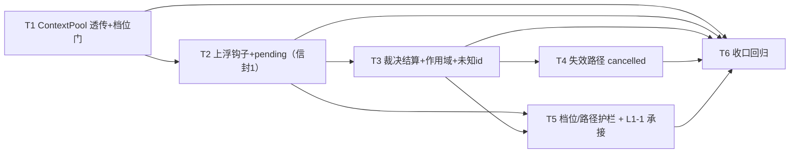

# 002-tasks.md — pr-002 内部任务图（agent 进程接线：上浮钩子注入 / pending 表 / 信封收发）

**迭代**: 0021-confirmation-inbox-and-event-push ｜ **阶段**: 5（PR 实现）｜ **PR 文件**: `prs/pr-002-agent-confirmation-wiring.md`
**worktree 分支**: `feat/0021-pr-002-agent-confirmation-wiring`（base = `c84233a`，**已含 pr-001 与 pr-003**）｜ **任务总数**: **6**（T1~T6）｜ **依赖图**: 无环（见 §2）

## 0. 范围、文件面与事实锚点

**本 PR 文件范围（唯一可写面）**

| 文件 | 动作 | 内容 |
|---|---|---|
| `oamp/src/context-pool.js` | 修改 | 构造 opts 增加 `onPermissionRequest`（+ 档位门）；在 `_ensureClient` 处**附加会话身份**后透传给 `new AcpClient({ … })` |
| `oamp/src/agent.js` | 修改 | `runDaemonTask` 注入上浮钩子 + `pending` 表；池构造处传入钩子；`sendNotice` / `handleNotice` / `createTaskDeliverHandler` 的信封收发与结算；SIGINT 扫尾 |
| `oamp/test/confirmation-roundtrip.test.js` | **新建** | 上浮 / 裁决结算 / 作用域 / 未知 id / 失效路径 / 档位与路径回归（harness + fake ACP + 假 web 节点） |
| `oamp/test/context-pool.test.js` | 修改 | `onPermissionRequest` 透传与档位门断言（其 fake bin 增权限门模式） |

**非目标（由其它 PR 承担或已合入，本 PR 不写）**：`oamp/src/acp-client.js`（pr-001 已合入，本 PR 只**消费**其钩子契约）；`oamp/src/web.js` / `src/inbox.js` / `API.md` / `llms.txt`（pr-003 已合入）；`oamp/web/**`、`oamp/src/web.js`、`oamp/llms.txt`、`oamp/test/inbox-console.test.js`、`oamp/test/notification-scope.test.js`（**pr-004 文件面，零重叠要求**）；`oamp/test/helpers/**`（harness 无 flag 面，本 PR 按既有先例自建，不改 harness）。

**读码事实锚点（判据基础；行号为 base `c84233a` 实测）**

| # | 事实 | 位置 |
|---|---|---|
| A1 | 钩子入参**两型**（pr-001 已定）：ACP 权限门 `{sessionId, toolCall, options}`；工具审批门 `{sessionId, kind:'tool_approval', toolCall:{toolName,title}, options}` | `acp-client.js:89-90` |
| A2 | 钩子唯一存储点 `this.onPermissionRequest`（非函数 ⇒ null）；返回域 `'allow'|'deny'|{optionId}|Promise<…>`；`optionId` 非集合内回落默认项 | `acp-client.js:102-113`、`:484-502` |
| A3 | 返回**未结算 Promise** 期间冻结轮次计时（`_askHook` → `_pauseTurnTimer`/`_resumeTurnTimer`）；**该冻结的唯一实现点在 AcpClient** | `acp-client.js:507-517`、`:581-607` |
| A4 | 放行凭据 FIFO 一次性抵扣：ACP 权限门已放行的 toolCall，其紧随的审批门不再上浮（一 toolCall 恰一次打扰） | `acp-client.js:519-524`、`:526-556` |
| A5 | 审批门选项恒 `['Approve','Deny']`；**只有** `'allow'` / `{optionId:'Approve'}` 视为放行，其余（含钩子未配置）一律 `Deny` | `acp-client.js:558-578` |
| A6 | 轮次计时 = `_request` 的 `setTimeout`；`session/prompt` 的 `timeoutMs` 是唯一入口 | `acp-client.js:297-323` |
| A7 | 子进程退出/崩溃 ⇒ `_failAll` 一次性 reject 全部在飞请求（含 `session/prompt`） | `acp-client.js:674-680` |
| A8 | `ContextPool` 构造 opts **无** `onPermissionRequest`（该能力现无注入者） | `context-pool.js:27-49` |
| A9 | `new AcpClient({…})` 唯一组装点 = `ContextSession._ensureClient`；会话持有 `chatId`/`agentId`/`lastOrigin` | `context-pool.js:196-228`、`:112-120`、`:146-157` |
| A10 | 三条失效路径（`dispose()` / `release()` / `_evictIfNeeded()`）均 `session.dispose()` ⇒ kill 子进程 | `context-pool.js:81-102` |
| A11 | **daemon 路径无第二处计时器**：`task.timeoutMs` 只透传给 `session.prompt`；`agent.js` 的 `setTimeout` 只属 `runOmpTask`（一次性）与 shell 执行器 | `agent.js:318-323`、`:216-231`、`:391-405` |
| A12 | `sendNotice(client, logger, {chatId, kind, text, origin})` 的 body 恒为 `{chat_id, kind, text}`（只够 context 提示） | `agent.js:282-293` |
| A13 | `handleNotice(logger, message, pool)` 只认 `kind:'context_release'`；调用点由 `createTaskDeliverHandler` 传入 `ctx.pool` | `agent.js:491-501`、`:461-467` |
| A14 | 池构造处已用 `onNotice: (notice) => sendNotice(activeClient, logger, notice)` 闭包体例（`activeClient` 随重连漂移） | `agent.js:611-624` |
| A15 | SIGINT 优雅退出序 = 停心跳 → `deregister` → `close` →（`finally`）`pool.dispose()`；二次 SIGINT 直接 `process.exit(130)` | `agent.js:659-681`、`:794` |
| A16 | **对端契约（pr-003 已合入，本 PR 不得改）**：`confirmation_request` ⇒ 入 inbox + 全局恰一帧；`confirmation_cancelled` ⇒ `inbox.remove`；R-2 ⇒ `sendControlNotice(agent_id, {kind:'confirmation_decision', confirmation_id, option_id, text, chat_id})`，且 `option_id` 必须 ∈ 该条 `options`；选项元素形态 = `{option_id, label?}` | `web.js:1588-1600`、`:1604-1606`、`:1306`、`:1296-1300`；`API.md §3.20` |
| A17 | 测试脚手架：harness `startAgent` **无 flag 面**（不能传 `--tools on` / `--permission deny`）⇒ 带档位的实例须照 `acp-daemon.test.js:446` 的 `startFlaggedAgent` 体例自建；`FAKE_ACP_FRAMES_LOG` 的 `server_request_reply` 是应答帧观测面 | `harness.js:159-161`；`acp-daemon.test.js:446-460`；`tool-permission.test.js:34-70` |

**本 PR 内的冻结契约（T1 ‖ T2 的并发前提；每个任务都必须遵守）**

1. **钩子入参**（agent 侧所见）= A1 的两型 `info` **附加** `{chatId, agentId, origin}`；附加点 = `ContextPool._ensureClient`（会话是唯一知道 `chatId`/`agentId`/`lastOrigin` 的地方，A9）〔`[model_inferred]`，见 §5 疑问 2〕。
2. **档位单一判定点** = `ContextPool`：仅 `permission === 'allow'` 时把钩子交给 `AcpClient`，`deny` 档恒传 `null`（PR 文件「`deny` 不注入」的落地面）。
3. **pending 表** = agent 进程级 `Map<confirmation_id, {chatId, resolve}>`；**裁决结算** = `resolve({optionId: <信封 2 的 option_id>})`（两型门共用；审批门上 `{optionId:'Approve'}` 即放行，A5）。
4. **信封字段**照 architecture §5.3 逐字：信封 1 = `{kind:'confirmation_request', confirmation_id, chat_id, agent_id, tool, title, options, created_at}`；信封 2 由 web 发出（本 PR 只消费）；信封 3 = `{kind:'confirmation_cancelled', confirmation_id}`。
5. **挂起的唯一载体 = 钩子返回的未结算 Promise**；agent 侧**不引入任何计时器 / cancel / kill**（冻结由 A3 的 AcpClient 实现承担）。

## 1. 任务列表

### T1: `ContextPool` 接线——`onPermissionRequest` 透传 + 档位门 + 会话身份附加

- **验收标准**:
  1. **透传与身份附加**：`permission:'allow'` 且注入钩子时，任一 ACP 权限门触发即调用该钩子**恰一次**；入参 = A1 形态 `{sessionId, toolCall, options}` **外加** `chatId` / `agentId`（= `getOrCreate(chatId, agentId)` 的实参）与 `origin`（该键该轮 `prompt` 的 origin）；`toolCall` / `options` 与 ACP 请求帧**逐字相同**（不筛选、不重排、不增补）。判据（进程内单元，fake bin）：spy 钩子的 `info` 字段断言 + `deepEqual(info.options, 请求帧 options)`。
  2. **档位门（单点）**：同一钩子在 `permission:'deny'` 池上**零调用**；该请求仍走既有自动拒绝三步——应答帧 `result.outcome.optionId === 'reject_once'` → `session/cancel` 通知 → `prompt()` 以 `AcpError{code:'permission_denied'}` 拒绝。判据：spy 计数 = 0 + 帧日志 + reject code。
  3. **不改变钩子语义**：钩子返回未结算 Promise 期间该请求**无应答帧**（帧时序：reply 晚于结算时刻）；结算 `{optionId}` 后回包值**逐字等于**钩子值。判据：`FAKE_ACP_FRAMES_LOG` 的 `server_request_reply`（与 pr-001 同口径，本任务只证"透传不篡改"）。
  4. **既有面零改动**：未注入钩子（opts 缺省）时 `ContextPool` 行为与既有用例逐字不变。判据：`node --test oamp/test/context-pool.test.js` **既有用例**全绿（只新增，不改写既有断言）。
- **前置依赖**: 无
- **优先级**: P0
- **追溯**: PR 文件「文件范围」`context-pool.js` + 验收 6；architecture §4.2 **M-13** ／ §7 **T-05 ②③** ／ §3.1 L1-2「兼容性」行 ／ §9.1 **R3** ／ §4.3 Z-4；prd/F02 架构落定「档位」、F05 架构落定「覆盖面」

### T2: agent 侧上浮钩子 + `pending` 表（信封 1：`confirmation_request`）

- **验收标准**:
  1. **上浮信封**：`permission='allow'` 的 daemon 任务中，ACP 权限门触发 ⇒ 向发起者（`origin`）发出 `notice{kind:'confirmation_request'}`，body 含 8 字段：`confirmation_id`（字符串）/ `chat_id`（= 该任务 `chat_id`）/ `agent_id`（= 本实例 id，即裁决回传收件方）/ `tool`（= `toolCall.toolName`，真实 omp 权限门可能不携带 ⇒ 允许 `null`，**不得**用 `title` 猜测）/ `title`（= `toolCall.title`，> 120 字符时截断至 120）/ `options` / `created_at`（`Number.isFinite` 的数字，不得依赖 web 侧兜底）。判据：假 web 节点 `received` 中该信封的逐字段断言（含超长 title 的截断断言）。
  2. **选项逐字**：`options` 与该请求 `params.options` 的选项集合**逐字相等**——同顺序、同数量、`option_id` 逐字（不筛选 / 不增补 / 不翻译），元素形态 `{option_id, label?}`（`label` 取不到时省略）。判据：`deepEqual(envelope.options.map(o => o.option_id), 请求帧 options.map(o => o.optionId))`。
  3. **审批门同样上浮（第二型入参）**：`kind === 'tool_approval'` 的 elicitation 门触发 ⇒ 发出**同形状**信封 1，`options` = `['Approve','Deny']` 的等价集合，`tool` = elicitation message 首行 `Allow tool: <tool>` 解析出的工具名（解析不到 ⇒ `null`）。判据：审批门用例的信封字段断言（两型**共用**一条 pending 表与同一信封形状）。
  4. **挂起真实发生**：上浮期间该 server request **无应答帧**，该轮**无终态帧**（无 `task.result`）。判据：帧日志无该 request 的 `server_request_reply` + 无 `task.result`。
  5. **id 唯一**：同一轮内两次门请求 ⇒ 两个不同 `confirmation_id`、两条 pending。判据：两条信封的 id 不等且均被后续裁决分别命中（与 T3 验收 3 同用例）。
- **前置依赖**: T1（**契约边**：消费 §0 冻结契约 1 的钩子入参形态；文件不重叠，可与 T1 并行落地）
- **优先级**: P0
- **追溯**: PR 验收 1、2；architecture §5.3 信封 1 ／ §7 **T-05 ③** ／ §7 T-16「多请求」行 ／ §9.4.2 结论 2 ／ §4.2 **M-3**；prd/F02 验收 1、2、3 + 架构落定「选项集合」；prd/F05 架构落定「T-16」

### T3: 裁决结算（信封 2 → pending resolve → ACP 回包）+ 作用域 + 未知 id 静默丢弃

- **验收标准**:
  1. **结算与回显**：收到 `notice{kind:'confirmation_decision', confirmation_id, option_id}` ⇒ 该挂起被结算，ACP 应答帧 `result.outcome.optionId` **逐字等于** `option_id`，且该 request **恰一帧**应答。判据：`FAKE_ACP_FRAMES_LOG` 的 `server_request_reply` 逐字比对 + 帧计数 = 1。
  2. **继续 / 中止**：`allow*` ⇒ 该轮继续并正常结算（`task.result.state === 'completed'`）；`reject*` ⇒ 走既有拒绝路径（`session/cancel` 帧 + `task.result.state==='failed' && error==='permission_denied'`），且该会话**仍可用**（同 chat 下一轮能正常跑）。判据：帧日志 + 两条终态信封 + 后续轮次成功。
  3. **作用域精确**：两个 chat（两条不同 `confirmation_id`）同时挂起 ⇒ 裁决其一后**仅**该条出现应答帧、其轮次结算；另一条**无应答帧、其轮次未结算**（无 `task.result`）；随后裁决另一条 ⇒ 正常结算。判据：按 request id 精确到帧的计数 + 两条轮次的终态时序。
  4. **未知 id 静默丢弃**：投递不在 pending 表内的 `confirmation_id` ⇒ 不抛错、不向发起者发任何消息（`received` 无新增帧）、其它挂起不受影响，且日志**恰一行**审计（含该 `confirmation_id`、可区分命中/未命中）。判据：帧计数不变 + 审计行数 = 1 + 另一挂起仍在（长挂起轮次仍无终态）。
- **前置依赖**: T2
- **优先级**: P0
- **追溯**: PR 验收 2、3、4；architecture §5.3 信封 2 ／ §7 **T-06**（作用域保证 + 「取不到的处置」）／ §5.4 ／ §4.2 M-3；prd/F04 验收 1、2、3 + 架构落定（信封 / 继续或中止 / 取不到 pending 的处置 / M3 应答契约）

### T4: 失效路径——轮次终结 / 上下文淘汰 / 进程退出前 ⇒ `confirmation_cancelled` + pending 清除

- **验收标准**:
  1. **轮次异常终结**：fake ACP 崩溃（`FAKE_ACP_CRASH_ON_PROMPT` 体例）⇒ 该轮未裁决项向发起者发 `notice{kind:'confirmation_cancelled', confirmation_id}`；轮次终态为 `failed`。
  2. **上下文淘汰**：压小 `OAMP_CTX_MAX` 触发 LRU 淘汰 ⇒ 同 1。
  3. **上下文释放**：`notice{kind:'context_release', chat_id}` ⇒ 同 1。
  4. **进程退出前扫尾**：SIGINT 时未裁决项发出 cancelled，且**先于** `deregister`/关连接（帧可被对端观测——退出前告知）。判据：假 web 节点的 `received` 在 agent 进程退出前包含该帧（`waitFor` 观测），退出码 0。
  5. **不残留**：上述任一失效后，再投递同 `confirmation_id` 的裁决 ⇒ **静默丢弃**（判据同 T3 验收 4：零新帧 + 恰一行审计），且不产生任何 ACP 应答帧。
  6. **无误报**：正常完成的轮次（裁决放行后跑完）**零** cancelled 帧。
- **前置依赖**: T3
- **优先级**: P0
- **追溯**: PR 验收 5；architecture §6.2 生命周期「失效路径 A」／ §7 T-16「崩溃面」行 ／ §5.3 信封 3 ／ §4.2 M-3；prd/F05 架构落定（T-16 挂起期行为）

### T5: 档位与路径回归护栏 + L1-1 承接检查（本 PR 不引入 agent 级计时）

- **验收标准**:
  1. **`deny` 档不上浮（端到端）**：`--tools on --permission deny` 实例上的受门禁调用 ⇒ **零** `confirmation_request`，该轮按既有语义中止（帧 `reject_once` + `session/cancel` + `task.result.error === 'permission_denied'`）。判据：`received` 无该 kind + 帧日志 + 终态。
  2. **一次性路径零改动**：`--tools on --permission allow` 实例的一次性任务（`executor='omp'`）argv 仍含 `--approval-mode yolo`（逐字），且零 `confirmation_request`；`agent.js` 一次性 argv 行未改。判据：`FAKE_ACP_ARGS_LOG` 的一次性 argv 断言 + `git diff` 不含该行。
  3. **`!` shell 路径零改动**：shell 任务不产生任何 `confirmation_request`，其执行与终态行为不变（判据：终态信封 + `received` 无该 kind）。
  4. **L1-1 承接检查（结论落地）**：本 PR **不引入** agent 侧 task 级计时 / 取消 —— 判据：`runDaemonTask` 的 diff 中**无新增** `setTimeout` / `clearTimeout` / `cancel(` / `kill(`，`task.timeoutMs` 仍原样透传给 `session.prompt`（A11 的透传链未变）。
  5. **冻结语义不冲突（行为判据）**：`timeout_ms` 取小值（如 300）而挂起时长**超过**该值 ⇒ 轮次未被 cancel/kill（无 `session/cancel` 帧、无 `task.result`、ACP 子进程存活）；裁决到达后该轮正常结算。判据：挂起窗口内的帧日志 + 终态时序。
- **前置依赖**: T2、T3（行为用例需要上浮与结算可用）
- **优先级**: P0
- **追溯**: PR 验收 6、7；施工输入 §4（承接 `prs/pr-001-tasks.md` §5 疑问 1 的检查项）；architecture §9.1 **R3** ／ §4.3 **Z-12** ／ §9.2 **K3** ／ §7 T-16（轮次计时 / 进程 / 审计行）／ §3.1 **L1-1**「影响面」／ §11.3 B-13 ／ §10.1 裁决 1；prd/F02 验收 4 + 架构落定「覆盖面边界」、prd/F05 验收 1、2 + 架构落定「附加要求」

### T6: 收口回归（新测试 + 既有面全绿 + 文件面核对 + 提交）

- **验收标准**:
  1. `node --test oamp/test/confirmation-roundtrip.test.js oamp/test/context-pool.test.js` 全绿。
  2. `node --test oamp/test/*.test.js`（oamp 全量）全绿；且既有测试文件的改动**只含新增**（无断言被删除、弱化或改写；`context-pool.test.js` 尤须核对）。
  3. 文件面核对：`git -C <worktree> diff --name-only c84233a..HEAD` **⊆ 本 PR 文件范围 4 条**，且与 **pr-004 文件面零重叠**（无 `oamp/web/**`、`oamp/src/web.js`、`oamp/llms.txt`、`oamp/test/inbox-console.test.js`、`oamp/test/notification-scope.test.js`）。
  4. `git status --porcelain` 为空（已提交，未用 `--no-verify`）。
- **前置依赖**: T1、T2、T3、T4、T5
- **优先级**: P0
- **追溯**: PR 文件「文件范围」+ 验收 1~7（收口）；architecture §11.4（零改动清单：`router.js` / `transport.js` / `persist.js` / `cluster-config.js` / 既有 19 条路由 handler）

## 2. 依赖图（无环）

拓扑序（合法执行序）：`T1 ‖ T2 → T3 → T4 → T5 → T6`

- **最长依赖链**：`T1 → T2 → T3 → T4 → T6`（5 跳）；`T5` 与 `T4` 同层（均以 T3 为前置）。
- **关键路径任务**：T2、T3（全部下游的硬前置）；T4 与 T5 可并行推进（不同用例面，但见下方串行约束）。
- **无环**：所有边单向递增（T1 → T2 → {T3} → {T4, T5} → T6），无回边。

**同文件串行约束（必须）**
- `oamp/src/context-pool.js` + `oamp/test/context-pool.test.js`：**仅 T1** 写。
- `oamp/src/agent.js`：**T2 → T3 → T4 → T5** 四处修改（`runDaemonTask` / `sendNotice` / `handleNotice` / `createTaskDeliverHandler` / SIGINT 段），**不得并发派发**；由同一实现者按序落地。
- `oamp/test/confirmation-roundtrip.test.js`：**T2 建**（fake bin 两型门 + `startFlaggedAgent` 体例 + 基础用例），T3 / T4 / T5 **顺序追加**用例，T6 只运行与核对 ⇒ 该文件同样**串行**。
- **可并发的唯一组合 = T1 ‖ T2**（文件不重叠，且 §0 冻结契约已固定两者接口）：图中 `T1 → T2` 是**契约边**（T2 消费 T1 定义的钩子入参形态），不是物理阻塞边 —— 接口已冻结时两者可由不同实现者并行落地；`T2 → T3 → T4 → T5` 之后的链全部串行。

**首任务即建测试脚手架**：T2 须先落 `confirmation-roundtrip.test.js` 的地基（fake ACP bin 的两型门模式 + 假 web 节点 + 带 flag 的 agent 拉起），T3~T5 的验收才有观测面（A17）。

## 3. 与 pr-002 验收标准逐条对位表

| PR 验收 # | 验收摘要 | 承接任务 | 对位说明 |
|---|---|---|---|
| 1 | `allow` 档 daemon 路径上浮：`notice{kind:'confirmation_request'}` 且 7+1 字段齐备 | **T2**（验收 1、3） | 字段集合 = architecture §5.3 信封 1；对端消费 = A16 |
| 1（后半） | `options` **逐字等于**请求方选项集合 | **T2**（验收 2） | 判据 = `option_id` 序列 `deepEqual` 请求帧 |
| 2 | 裁决结算：ACP 回包 `optionId` = `option_id`；`allow*` 继续 / `reject*` 走 `permission_denied` | **T3**（验收 1、2） | 观测面 = 帧 `server_request_reply` + 终态信封 |
| 3 | 作用域精确：同时挂起两条，裁决其一不影响另一条 | **T3**（验收 3） | 判据 = 另一条无应答帧且无终态 |
| 4 | 未知 `confirmation_id` 静默丢弃 + 一行审计 | **T3**（验收 4） | 判据 = 零新帧 + 审计恰一行 |
| 5 | 失效路径（轮次取消 / 淘汰 / 退出前）发 `confirmation_cancelled` 且 pending 不残留 | **T4**（验收 1~5） | 三种触发面各一用例 + 「不残留」以「后续裁决被静默丢弃」为判据 |
| 6 | `permission='deny'` 不注入钩子：零确认项、既有自动拒绝不变 | **T1**（验收 2，单元）+ **T5**（验收 1，端到端） | 判定面 = 钩子零调用 + 既有三步帧 |
| 7 | 一次性 `omp -p` 与 `!` shell 路径零改动 | **T5**（验收 2、3） | 判据 = 一次性 argv `yolo` 逐字 + 零确认项 |

**覆盖检查**：PR 7 条验收标准 → 全部有任务承接，无遗漏；T1~T6 每条均可追溯到 architecture / prd / PR 文件 / 既有代码事实（见 §6）；**无任务超出 PR 文件范围**。

## 4. 关键实现约束（判据口径，供实现者遵守）

1. **两型门归一化（T2 的核心）**：统一走"信封 1 + pending"一条路，差异只在字段来源——

   | 门 | 触发面 | `tool` | `title` | `options` 来源 |
   |---|---|---|---|---|
   | ACP 权限门 | `session/request_permission` | `toolCall.toolName`（可为 null） | `toolCall.title` | 请求帧 `params.options` 的 `optionId` 值域（4 项实测） |
   | 工具审批门 | `elicitation/create`（shape = `Approve|Deny`） | 从 message 首行解析 | `params.message` 原样（截断 120） | `['Approve','Deny']` |

   两型共用 pending 表与结算路径；`option_id` 值域在两型下都是"ACP 侧可直接回显的 optionId" ⇒ 裁决结算只需 `resolve({optionId: option_id})`（§0 契约 3）。

2. **不重复打扰**：同一 toolCall 的审批门在**放行凭据抵扣**下不再上浮（A4，pr-001 既有语义）——本 PR **不重复实现**该去重，也不得引入第二套去重。

3. **档位门唯一**：`deny` 档的"不注入"只在 `ContextPool` 判定一次（§0 契约 2）；`agent.js` 无条件提供钩子，避免两处口径漂移。`deny` 档的自动拒绝三步（回 `reject_once` → `session/cancel` → `prompt()` 抛 `permission_denied`）**逐字不变**。

4. **pending 表的清理归属**：以「轮次终结」为清扫点——`runDaemonTask` 的 `session.prompt(...)` settle（resolve 或 reject）后，清除该 `chatId` 名下**仍未结算**的条目并发信封 3。同键轮次 FIFO 串行 ⇒ 按 `chatId` 清扫是精确的（不会误伤其它 chat / 其它轮次）。SIGINT 时另做一次全量清扫，且**先于** A15 的 `deregister`（退出前告知 + 可观测）。〔`[model_inferred]`，见 §5 疑问 4〕

5. **审计行**：上浮可沿用既有 `CONTEXT_NOTICE` 行（`agent.js:292`）以免新增日志面；"未知 `confirmation_id`"须恰一行、可区分命中/未命中（事件名属实现细节，验收只判「恰一行且含该 id」）。

6. **`sendNotice` 扩字段**：既有 body 恒为 `{chat_id, kind, text}`（A12），信封 1 需 7 字段 ⇒ 需扩展该函数（或新增同形发送路径）。**约束**：既有 `context_released` / `context_reset` 的 body 形状与时机**逐字不变**（`context-pool.test.js` 与 `web.test.js` 的既有断言面）。

7. **hook 异常安全**：钩子体内不得抛错（`_askHook` 抛错 ⇒ 门保守拒绝，A5）；发送一律 best-effort（沿用 `sendNotice` 的 `.catch(() => {})` 体例）。

8. **不得引入架构外决策**：不新增配置项 / 不新增信封 `type`（Router 零改动，`VALID_TYPES` 不动）/ 不新增持久化 / 不引入计时器（L1-1 的冻结唯一点在 AcpClient，A3）。

## 5. 边界与疑问（提请主 agent）

1. **档位判定点的措辞差异（PR 文件 vs architecture）**：PR 文件写「仅 `permission === 'allow'` 时**由 agent 侧注入**」，architecture §7 T-05 写「**`ContextPool` 仅在 `permission === 'allow'` 时注入**上浮钩子」。本任务图取 **单一判定点 = `ContextPool`**（§0 契约 2），理由：① 判定点唯一（避免两处口径漂移）；② 可被**进程内单元**断言（harness `startAgent` 无 flag 面，见 A17，纯 agent 侧判定则只能靠子进程用例覆盖）；③ 与 architecture 字面一致；PR 文件的「由 agent 侧注入」在语义上仍成立（agent 是钩子的提供者）。**请主 agent 确认或改判**。
2. **钩子入参缺会话身份（架构信息缺口，本任务图已推导并标注）**：§5.3 要求信封 1 含 `chat_id` / `agent_id`，但 pr-001 已定的钩子入参只有 `{sessionId, toolCall, options[, kind]}`（A1），**architecture 未写** `chatId`/`agentId` 如何到达钩子。由既有代码结构唯一确定解 = `ContextPool._ensureClient` 处附加会话身份（AcpClient 每会话一实例；`chatId`/`agentId`/`lastOrigin` 只有 `ContextSession` 持有，A9）。planner 判定这**不是补充架构决策**（字段需求由 §5.3 给定、接线位置由代码结构唯一确定），但该推导标 `[model_inferred]`，请主 agent 确认。
3. **审批门的 `title` 语义**：§5.3 把信封 1 的 `title` 定义为 `toolCall.title`，而审批门无 `toolCall.title`（只有 elicitation message，形如 `Allow tool: write\n…`）。本任务图判定 = **原样透传该 message 并截断 120**（`[model_inferred]`）；若产品上希望改取首行之后的详情，属呈现口径变更，需主 agent 裁决。
4. **失效路径的实现落点未在 architecture 钉死**：§6.2 只写「agent 侧发 `confirmation_cancelled`」，未写触发点。本任务图的落点 = 轮次 settle 清扫 + SIGINT 前全量清扫（§4 约束 4，`[model_inferred]`）。其中"退出前"存在**投递竞争**：若清扫晚于 `deregister`/`close`，帧可能随连接关闭丢失 ⇒ 本任务图把它写成实现顺序约束 + 可观测判据（T4 验收 4）。若实测仍不可稳定观测，请主 agent 裁决判据降级方式。
5. **`API.md §7` 的 notice kind 枚举（B-10 复核）**：architecture §11.2 B-10 要求"若 §7 列举了 `notice` 的 kind ⇒ 补 3 个新 kind"。实测：`API.md` 仅在 §3.21 登记 `confirmation_decision` 回传（`:954`），§7「sub agent 契约对照」**未列举** kind 值 ⇒ **无待补项**，本 PR 对 `API.md` 零改动（且该文件不在本 PR 文件范围）。**登记为已复核结论**，非缺口。
6. **覆盖面边界（非缺口）**：web 进程重启后 agent 侧 pending 仍挂（architecture §9.2 **K2** 的明示代价）——本 PR 不引入持久化、不做跨 web 重启的对账，也不因此新增路径。
7. **测试脚手架不越界**：本 PR 不改 `oamp/test/helpers/**`（A17），带档位实例由新测试文件内的 `startFlaggedAgent` 体例自建（先例：`acp-daemon.test.js:446`）。
8. **粒度决策（记录）**：① T2（上浮）与 T3（结算）**本可合并**（同为 `agent.js` 的信封收发），拆开是因为二者有独立的可验收产物——T2 的产物是"信封 1 发出且字段/选项逐字正确"，T3 的产物是"裁决命中并改变 ACP 回包"，合并会让"能上浮但结算未接通"这一中间态不可独立验收。② T1（池侧透传）**独立于** T2（agent 侧），因为它的判据是**进程内单元**（spy 钩子），不依赖 daemon 端到端链路，且是 `deny` 不注入的主要判定面。③ T5 不再拆分：其 5 条判据共用同一 fake bin 与同一批实例拉起，拆开只会重复脚手架。

## 6. 追溯总表（任务 → 输入）

| 任务 | architecture 追溯 | prd 追溯 | PR 文件追溯 | 既有代码事实 |
|---|---|---|---|---|
| T1 | §4.2 M-13、§7 T-05 ②③、§3.1 L1-2 兼容性行、§9.1 R3、§4.3 Z-4 | F02 架构落定「档位」、F05 架构落定「覆盖面」 | 文件范围（`context-pool.js` / `context-pool.test.js`）、验收 6 | A8、A9、A10 |
| T2 | §5.3 信封 1、§7 T-05 ③、§7 T-16「多请求」、§9.4.2 结论 2、§4.2 M-3 | F02 验收 1/2/3 + 架构落定「M2 选项四项」、F05 架构落定 T-16 | 验收 1、2；文件范围（`runDaemonTask` / `sendNotice` / 池构造处） | A1、A2、A5、A12、A14、A9 |
| T3 | §5.3 信封 2、§7 T-06、§5.4、§4.2 M-3 | F04 验收 1/2/3 + 架构落定（信封 / 继续或中止 / 取不到 pending 的处置 / M3 约束） | 验收 2、3、4；文件范围（`handleNotice` / 结算） | A2、A5、A6、A13 |
| T4 | §6.2 生命周期「失效路径 A」、§7 T-16「崩溃面」、§5.3 信封 3、§4.2 M-3 | F05 架构落定 T-16 | 验收 5 | A7、A10、A15 |
| T5 | §9.1 R3、§4.3 Z-12、§9.2 K3、§7 T-16、§3.1 L1-1 影响面、§11.3 B-13、§10.1 裁决 1、§4.2 M-12（argv 面已由 pr-001 落地） | F02 验收 4 + 架构落定「覆盖面边界」、F05 验收 1/2 + 架构落定「附加要求」 | 验收 6、7；施工输入 §4（承接 `pr-001-tasks.md` §5 疑问 1） | A6、A11；`agent.js:197` |
| T6 | §11.4（零改动清单） | —— | 文件范围 + 验收 1~7 收口 | A16（对端契约不得改） |
