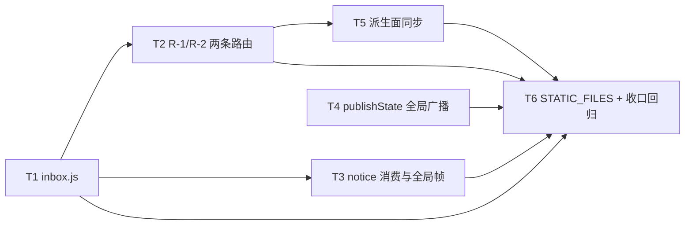

# 003-tasks.md — pr-003 内部任务图（web 进程承载确认面）

**迭代**: 0021-confirmation-inbox-and-event-push ｜ **阶段**: 5（PR 实现）｜ **PR 文件**: `prs/pr-003-web-inbox-and-decision-api.md`
**worktree 分支**: `feat/0021-pr-003-web-inbox-and-decision-api` ｜ **任务总数**: **6**（T1~T6）｜ **依赖图**: 无环（见 §2）

## 0. 范围、文件面与事实锚点

**本 PR 文件范围（唯一可写面）**

| 文件 | 动作 | 内容 |
|---|---|---|
| `oamp/src/inbox.js` | **新建** | 登记 / 查询 / 原子取出 / 移除 / 计数；进程内 `Map`，不落库 |
| `oamp/src/web.js` | 修改 | 路由表末位追加 2 条表项；`handleDeliver` 的 `notice` 分支；`publishState` 的全局广播；`STATIC_FILES` 追加 `/notify.js` |
| `oamp/API.md` | 修改 | §3 追加新接口小节 + §3 标题条数 + §4.2 事件集合与「键隔离」表述 |
| `oamp/llms.txt` | 重新生成 | `node oamp/scripts/gen-llms-txt.mjs`（不手改） |
| `oamp/test/confirmation-inbox.test.js` | **新建** | inbox 行为 / 两条新路由契约 / 帧与通知「恰一次」 |
| `oamp/test/api-routes.test.js` | 修改 | 登记集合 `deepEqual`、标题断言、`/api/docs` 投影断言 |
| `oamp/test/project-workspace.test.js` | 修改 | 同型登记集合 + `routes.length` + 标题 + 追加末位切片断言 |
| `oamp/test/call-protocol.test.js` | 修改 | `/api/docs` 的 `routes.length` 条数断言 |
| `oamp/test/web.test.js` | 修改 | 「全局订阅不得收到对话类事件」键隔离否定断言按新口径同步 |

**非目标（由其它 PR 承担，本 PR 不写）**：`acp-client.js` 挂起链路与 M4 修复（pr-001）、`context-pool.js` / `agent.js` 钩子注入与 `pending` 表（pr-002）、`web/index.html` / `web/app.js` / `web/style.css` / **`web/notify.js`** 本体（pr-004）。

**读码事实锚点（判据基础）**

| # | 事实 | 位置 |
|---|---|---|
| A1 | 路由表 = `createApiRoutes({…})` 返回的有序数组，表项 = 8 元数据字段 + handler；**纯构造**（不调依赖、不读磁盘） | `web.js:465-466`、`:429` |
| A2 | 投影 `projectRoutes` 每次重算、`danger = method !== 'GET'`；`renderLlmsTxt` 纯函数（同输入逐字节相同） | `web.js:1265-1275`、`:1288+` |
| A3 | `handleDeliver` 的 `notice` 分支**先取 `chat_id` 再按 kind 白名单过滤**，未知/无 `chat_id` 直接 `return`（当前白名单 = `context_released` / `context_reset`） | `web.js:1477-1486` |
| A4 | `publishState = (chatId, state) => transport.publish(chatId, {type:'chat_state', …})`＝唯一状态发布点；`publishGlobal` 只写全局键 `null` | `web.js:1373-1374`、`transport.js:16-24` |
| A5 | 进程内内存态先例 = `tasks` / `callSchemas`（同为「进程内、不持久、重启即丢」） | `web.js:1359`、`:1366` |
| A6 | 文本落地可复用的既有原语：`db.insertInput({chatId, projectId, text, agentId})`、`publishMessage`、`publishState`、`sendTask` | `persist.js:284-292`、`web.js:1371-1374`、`:836-870` |
| A7 | 漂移锁三处：① 元数据必填 + `EXPECTED_SIGNATURES` deepEqual；② `llms.txt` 逐字节；③ `API.md` 路径级双向覆盖 | `api-routes.test.js:195-244`、`:278-287`、`:303-315` |
| A8 | 其它硬编码登记断言：`project-workspace.test.js:1235-1241`（`deepEqual` + `routes.length === 19` + `slice(-6)` 追加末位）、`:1275`（`## 接口（19 条）`）；`call-protocol.test.js:1047`（`routes.length === 19`）；`api-routes.test.js:473`（`/api/docs` 投影 deepEqual）、`:479`（写接口 `danger` 计数 = 7）、`:489` 与 `:505`（两处 `19 条` 标题） | 各文件行号见左 |
| A9 | 键隔离否定断言 = `web.test.js:1502`（排除 `message` / `task_update` / `chat_state` / `notice` 四类不出现在全局流） | `web.test.js:1475-1506` |
| A10 | `STATIC_FILES` 为显式白名单（无通配、无目录索引）；`serveStatic` 的 ENOENT → 404 | `web.js:392-408`、`:410-426` |
| A11 | `api-pages.test.js` **无**对 `/api/events` 事件集合的断言（仅 `window.confirm` / `danger-badge` 文本断言）⇒ §11.1 B-5 对该文件**无影响** | `api-pages.test.js:116-125` |
| A12 | `hygiene.test.js` 扫 `bin/` + `src/` 的 `.js` 与 `package.json`：凭据类字段名词边界零命中；dependencies 必须为空 | `hygiene.test.js:17-38` |

## 1. 任务列表

### T1: 新建 `oamp/src/inbox.js`（5 函数、内存 Map、`take()` 即删）

- **验收标准**:
  1. `add(entry)` 首次登记返回 `true` 且该条出现在 `list()` 中；同一 `confirmation_id` 再次 `add` 返回 `false`，且不覆盖首次登记的字段、计数不变（幂等丢弃）。判据：单元断言。
  2. `take(id)` 返回该条并使其从 `list()` 消失；对同一 id 再次 `take` → `null`（= R-2 回 `404` 的判据来源）。
  3. `remove(id)` 使该条消失；对不存在的 id 无副作用、不抛错；`size()` 与 `list().length` 恒一致。
  4. **无历史台账由结构保证**：导出面恰好 5 个函数（`add` / `list` / `take` / `remove` / `size`），无任何已裁决项的读取入口（无 history / export / decided 类导出）。判据：读 `src/inbox.js` 导出清单。
  5. `node --test oamp/test/hygiene.test.js` 保持绿（`src/inbox.js` 不得出现凭据类字段名；`package.json` dependencies 仍为空）。
- **前置依赖**: 无
- **优先级**: P0
- **追溯**: architecture §6.1（5 函数表）／ §6.2 ／ §7 T-08 ／ §4.1 N-1 ／ §4.3 Z-3、Z-9 ／ §11.4；prd/F11 架构落定（结构保证）、F01 T-08、F06 T-08

### T2: 登记 `GET /api/confirmations`（R-1）与 `POST /api/confirmations/<id>/decision`（R-2：校验 / 错误契约 / 回传 / 文本落地）

- **验收标准**:
  1. **R-1 列表**：空态 `200 {confirmations: []}`（不 `404`）；有在途项时元素含 `confirmation_id` / `chat_id` / `agent_id` / `tool` / `title` / `options` / `created_at` 七字段；handler 只依赖注入的 inbox（不查 Router、不读库）。判据：HTTP 断言（空态与有项两态）+ 字段集合断言。
  2. **登记形态**：两条表项追加在路由表**末位**，8 个元数据字段齐备；`POST` 项的 `danger` 投影派生为 `true`；`GET /api/confirmations` 不被 `GET /api/chats/:chat_id` 的贪婪参数吞并（判据：`matchRoute` 命中该路径）。
  3. **R-2 合法裁决**：body `{option_id}` 合法 → `200 {confirmation_id, accepted: true}`；该条**立即**移出在途表（第二次提交同一 id → `404 NOT_FOUND`）；同时向该条的发出方发出 `notice{kind:'confirmation_decision', confirmation_id（同值）, option_id（用户所选）}`。判据：响应体 + 第二次提交的 404 + 发出方收到的 notice body 逐字断言。
  4. **错误契约**：`option_id` 缺失 / 非字符串 / **不在该条 `options` 内** → `400 INVALID_PARAM` **且该条目保留在途**（判据：错误响应 + 随后 `GET /api/confirmations` 仍含该条）；`confirmation_id` 不在表内（已裁决 / 已失效 / 从未存在）→ `404 NOT_FOUND`（同一码、不区分）。
  5. **文本落地**：`text` 非空白 → 向该 `chat_id` 追加一条 `direction='in'` 输入并派发（判据：`GET /api/chats/<id>` 可见该输入 + 发生一次派发）；`text` 缺失 / `''` / 纯空白 → 不追加、不派发，且裁决本身仍成功。
  6. **既有面零改动**：既有 19 条路由 handler 的行为不变（改动只限「新增表项 + 新增函数」）；判据：既有测试文件全绿（见 §5 疑问 2 的约束）。
- **前置依赖**: T1
- **优先级**: P0
- **追溯**: architecture §5.1 R-1 / R-2（含错误契约与幂等表）／ §5.3 信封 2 与「为什么 `text` 不参与 ACP 应答」／ §7 T-06 ／ §3.2 L2-4、L2-10 ／ §6.1；prd/F03 验收 1~4 + 架构落定（T-03 / T-04 / 文本落地）、F04 架构落定、F11 架构落定

### T3: `handleDeliver` 消费 3 个新 `notice` kind（入表 + 恰一帧全局 `confirmation` + 幂等 + 取消移除）

- **验收标准**:
  1. `notice{kind:'confirmation_request', …}` 投递到 web 后：① 出现在 `GET /api/confirmations`；② **全局**订阅（`GET /api/events`）收到**恰一帧** `confirmation`，其 `data` 与列表元素**同形状**（同 7 字段）；③ 不产生任何 `chat:<id>` 定向帧。判据：帧日志计数 + `data` 字段集合断言。
  2. **幂等**：重复投递同一 `confirmation_id` → 不再入表、不再发帧（全局帧数仍为 1）。判据：重复投递后帧计数不变。
  3. **重建不发帧**：`GET /api/confirmations`（含刷新 / 重连语义）全程零帧。判据：调用前后全局帧计数不变。
  4. **取消路径**：`notice{kind:'confirmation_cancelled', confirmation_id}` → 该条移出在途表，且**不产生任何广播**（判据：帧计数不变 + 列表不再含该条）。
  5. **既有 kind 不变**：`context_released` / `context_reset` 的转发帧形态与时机逐字不变（判据：既有用例全绿 + 帧形状断言）。
- **前置依赖**: T1
- **优先级**: P0
- **追溯**: architecture §5.2（新增 1 类事件、走全局键、帧只在入表时恰一次）／ §5.3 信封 1 与信封 3 ／ §4.2 M-5 ／ §7 T-07、T-08 ／ §11.3 B-12 ／ §3.2 L2-1、L2-9；prd/F01 验收 3、F06 验收 1/4（MI-01 不重复通知）、F11

### T4: `publishState` 追加全局广播 + `web.test.js` 键隔离断言按新口径同步

- **验收标准**:
  1. 既有 `chat:<id>` 键的 `chat_state` 帧**形态与时机逐字不变**（判据：按对话订阅收到的帧集合与改造前一致；既有用例全绿）。
  2. 对话终态（`completed` / `failed`）在**全局链路**（`GET /api/events`）上可观测（判据：走到终态的对话使全局订阅收到对应帧）。
  3. 全局链路**不含** `message` / `task_update` / `notice`（三类仍只走 `chat:<id>`），且**不新增第 4 类事件类型**（服务端零事件类型常量，只推事实）。判据：全局帧类型集合断言。
  4. `oamp/test/web.test.js` 的键隔离否定断言按新口径同步后全绿，且**未被削弱/删除**（仍显式排除 `message` / `task_update` / `notice`）。判据：该断言的新形态 + `node --test oamp/test/web.test.js` 全绿。
- **前置依赖**: 无
- **优先级**: P0
- **追溯**: architecture §2.2 流 3 ／ §3.2 L2-8 ／ §4.2 M-6 ／ §7 T-13、T-14 ／ §11.1 B-5 ／ §11.4（`/api/stream` 4 类事件不变）；prd/F07 验收 1~3 + 架构落定（产生时机）、F10 架构落定

### T5: 派生面同步（`API.md` §3/§4.2 + `llms.txt` 重生成 + 三测试文件硬编码断言）

- **验收标准**:
  1. `API.md`：§3 追加两条接口小节（签名形态 `` `GET /api/confirmations` ``、`` `POST /api/confirmations/<id>/decision` ``，字段级 `params` / `response` / `errors` 齐备）+ §3 清单表追加两行 + §3 标题条数改为 21；**既有 19 条条目正文逐字不改**。判据：漂移锁③ 双向覆盖绿（无「缺登记」/「多出未登记路径」）。
  2. `oamp/llms.txt` 由 `node oamp/scripts/gen-llms-txt.mjs` **重生成**（不手改），与 `renderLlmsTxt(projectRoutes(createApiRoutes({})))` **逐字节相等**，标题行为 `## 接口（21 条）`。判据：漂移锁② 绿。
  3. 三处硬编码断言同步且**未削弱**：`api-routes.test.js`（`EXPECTED_SIGNATURES` deepEqual 两处、`## 接口（19 条）` 与 `## 3. 接口清单（19 条）` 标题、`/api/docs` 投影中的写接口 `danger` 计数 7 → **8**）；`project-workspace.test.js`（`EXPECTED_ROUTE_SIGNATURES`、`routes.length` 19 → **21**、**`slice(-6)` 追加末位切片**、标题断言）；`call-protocol.test.js`（`routes.length` 19 → **21**）。判据：三个文件全绿，且断言形态仍为等价强度的清单/条数比较（不得退化为子集断言）。
  4. `API.md §4.2`：全局订阅事件集合登记与 T4 的新口径一致（`agent_online` / `agent_offline` + 新增类；「全局链路上只有这两类」的表述按新事实改写），且与 `web.test.js` 的隔离断言口径一致。判据：`API.md §4.2` 文本与 T4 验收 3 的事件集合逐条对齐。
- **前置依赖**: T2
- **优先级**: P0
- **追溯**: architecture §1.5 D1/D2/D3 ／ §4.2 M-9、M-10、M-14、M-15 ／ §11.1 B-3、B-4 ／ §11.2 B-6、B-7、B-8 ／ §4.3 Z-8 ／ §5.2；prd/F10 架构落定「必然变更」、F07 架构落定「必然变更」

### T6: `STATIC_FILES` 登记 `/notify.js` + PR 收口回归

- **验收标准**:
  1. `STATIC_FILES` 含 `'/notify.js': 'web/notify.js'`；`web/notify.js` 尚不存在（pr-004 才落盘）时 `GET /notify.js` → `404`（`serveStatic` 的 ENOENT 分支行为不变），且不引入通配 / 目录枚举（判据：`GET /notify.js` 与 `GET /web/notify.js` 均为 404）。
  2. 既有静态面路径（`/`、`/app.js`、`/style.css`、`/docs`、`/llms.txt` …）响应逐字不变（判据：既有用例全绿 + 抽查响应字节相等）。
  3. **PR 收口**：`node --test oamp/test/confirmation-inbox.test.js oamp/test/api-routes.test.js oamp/test/project-workspace.test.js oamp/test/call-protocol.test.js oamp/test/web.test.js` 全绿；`node --test oamp/test/hygiene.test.js` 保持绿。
- **前置依赖**: T1、T2、T3、T4、T5
- **优先级**: P0
- **追溯**: pr-003 上下文摘要（「另须在 `STATIC_FILES` 白名单登记 `/notify.js`」）／ architecture §4.1 N-2 ／ §5.5 ／ §7 T-12 ／ §11.4（静态面既有条目零改动）；pr-003 验收 11、12；prd/F10 架构落定

## 2. 依赖图（无环）

拓扑序（合法执行序）：`T1, T4 → T2, T3 → T5 → T6`

- **最长依赖链**：`T1 → T2 → T5 → T6`（4 跳）。
- **关键路径任务**：T1、T2、T5、T6；T4 可自始并行，T3 与 T2 并行（均以 T1 为前置），二者在 T6 汇合。
- **无环**：所有边方向单调（T1 → {T2,T3} → T5 → T6；T4 → T6），无回边。

**同文件串行约束（必须）**：`oamp/src/web.js` 被 T2 / T3 / T4 / T6 四处修改，**不得并发派发**；由同一实现者按 `T2 → T3 → T4 → T6` 顺序落地（T5 只写 `API.md` / `llms.txt` / 测试文件，可与 T2 之后并行）。

## 3. 与 pr-003 验收标准逐条对位表

| PR 验收 # | 验收摘要 | 承接任务 | 对位说明 |
|---|---|---|---|
| 1 | `GET /api/confirmations` 形态 / 空态 `[]` / 不 404 / 元素 7 字段 | **T2**（验收 1、2） | 字段集合 = §5.1 R-1 的 `response` 表 |
| 2 | `confirmation_request` → 入表 + 全局**恰一帧** `confirmation`（同形状）+ 重复投递不发 | **T3**（验收 1、2） | 帧级判据 = 全局 SSE 帧计数 |
| 3 | 重建面**不发任何帧** | **T2**（R-1 无帧）+ **T3**（验收 3） | 判据 = 调用前后帧计数不变 |
| 4 | R-2 合法 → `200 {accepted:true}` + 立即移出（二次 404）+ 回传 `confirmation_decision` | **T2**（验收 3） | 回传 body 逐字断言 |
| 5 | 错误契约：`400 INVALID_PARAM` 且条目保留 / `404 NOT_FOUND` 同码 | **T2**（验收 4） | 对位 §5.1 R-2 的 `errors` 行 |
| 6 | 文本非空白 ⇒ 追加 chat 输入并派发；空白不追加 | **T2**（验收 5） | 判据 = `GET /api/chats/<id>` + 派发发生 |
| 7 | `confirmation_cancelled` → 移出在途表 + 无通知广播 | **T3**（验收 4） | 帧计数不变 |
| 8 | 无历史台账（结构保证）+ `persist.js` 零改动 | **T1**（验收 4）+ **T2**（无读取入口） | 导出面恰好 5 函数；`persist.js` 不在文件范围 |
| 9 | 三条漂移锁转绿且未削弱；三测试文件硬编码清单/条数/标题同步 | **T5** | A7/A8 的锚点逐条对位 |
| 10 | `publishState` 既有 `chat:<id>` 逐字不变 + 新增全局广播使终态可观测 + 三面口径一致 | **T4**（验收 1~4）+ **T5**（验收 4） | `API.md §4.2` 与 `web.test.js` 隔离断言同口径 |
| 11 | `STATIC_FILES` 含 `/notify.js`；文件不存在时 404 | **T6**（验收 1、2） | `serveStatic` ENOENT 行为不变 |
| 12 | 五测试文件全绿 + `hygiene` 保持绿 | **T6**（验收 3） | 各任务自身用例为其前提 |

**覆盖检查**：PR 12 条验收标准 → 全部有任务承接，无遗漏；T1~T6 均可追溯到 architecture / prd / PR 文件（见 §6）。

## 4. M4（答复链路修复）：**本 PR 不承载**

PR 文件「上下文摘要」明确「**不承载 M4 答复链路修复**（M4 落 pr-001）」，`prs/pr-001-agent-permission-suspend-and-reply-fix.md` 亦自陈「承载 M4」。本 PR 的验收标准中**没有**任何一条要求真实 `omp` 上的模型侧工具结果，故不产生 M4 定位/修复任务——本 PR 对 M4 的关系仅为**消费 pr-001 的成果**（`allow` 档挂起后产生的 `confirmation_request` 信封），不反向依赖（PR 依赖图为 `pr-003 → pr-004`，pr-003 `depends_on` = 无）。

## 5. 边界与疑问（提请主 agent）

1. **`publishState` 全局广播的字段级细节未在 architecture 钉死**（信息缺口，planner 不填）：§2.2 流 3 只写「追加一次全局广播」，§3.2 **L2-8** 写「服务端只给 `publishState` 追加一次全局广播」，§7 **T-14** 写「服务端只推事实（`chat_state` / `confirmation`），不新增事件类型」；但**未钉死**：① 广播帧的事件名（按 T-14 推断复用既有事实类型）、② **广播范围**（每一次 `publishState` 调用都广播，还是仅 `completed` / `failed` 终态广播）。二者直接影响 `web.test.js:1502` 键隔离断言的改法（若全局帧类型 = `chat_state`，该断言的类型清单必须去掉 `chat_state`，否则必然红）。T4 的验收按 **PR 文件口径**（终态可观测 + 三面一致 + 无第 4 类 + 既有 `chat:<id>` 不变）写成，**未**替架构选定广播范围；实现期须定稿该点，若与 §11.4「`/api/stream` 的 4 类事件不变」或 B-5 的结论冲突，请主 agent 裁决。
2. **文本落地的复用方式 vs §11.4「既有 19 条路由 handler 零改动」存在张力**：§5.3 要求文本「复用既有落库 + 派发路径」，而该路径目前**内联**在 `POST /api/messages` 的 handler 体内（A6：`db.insertInput` → `publishMessage` → `publishState('working')` → `sendTask` → 任务登记）。若实现选择**抽取**该内核函数，则 §11.4 的「既有 handler 零改动」被打破；若选择**调用同一批既有原语**（新增 handler 内自行编排），则 §11.4 成立但存在少量重复。T2 验收 6 已把「既有 handler 行为零改动」写成判据（判定面 = 既有测试全绿），实现期择优，**不在任务图里替架构选边**。
3. **`oamp/web/debug.js:8` 的 `EVENT_TYPES` 白名单未含 `confirmation`**（调试台不会显示新帧）：该文件不在本 PR 文件范围，且无任何验收标准要求它同步 ⇒ 登记为**边界**（是否需要同步由主 agent / pr-004 裁决）。
4. **§11.1 B-5 的复核结论**（读码实测）：`api-pages.test.js` **无** `/api/events` 事件集合断言（A11），故 B-5 对 `api-pages.test.js` **无影响**；本迭代唯一的键隔离否定断言在 `web.test.js:1502`，已在 PR-003 文件范围内 → 无文件范围缺口。
5. **简报工作区路径偏差**：简报给的 `…/0021-003-web-inbox-and-decision-api` 不存在；实际 worktree = `…/0021-pr-003-web-inbox-and-decision-api`（分支 `feat/0021-pr-003-web-inbox-and-decision-api`，与简报一致），本文件按实际路径写入。

## 6. 追溯总表（任务 → 输入）

| 任务 | architecture 追溯 | prd 追溯 | PR 文件追溯 |
|---|---|---|---|
| T1 | §6.1、§6.2、§7 T-08、§4.1 N-1、§4.3 Z-3/Z-9、§11.4 | F11 架构落定、F01 T-08、F06 T-08 | 文件范围（`oamp/src/inbox.js` 新建） |
| T2 | §5.1 R-1/R-2、§5.3 信封 2、§7 T-06、§3.2 L2-4/L2-10、§6.1 | F03 验收 1~4 + 架构落定、F04 架构落定、F11 架构落定 | 验收 1、4、5、6、8；文件范围（路由表末位 2 条表项） |
| T3 | §5.2、§5.3 信封 1/3、§4.2 M-5、§7 T-07/T-08、§11.3 B-12、§3.2 L2-1/L2-9 | F01 验收 3、F06 验收 1/4、F11 | 验收 2、3、7；文件范围（`handleDeliver` 的 `notice` 分支） |
| T4 | §2.2 流 3、§3.2 L2-8、§4.2 M-6、§7 T-13/T-14、§11.1 B-5、§11.4 | F07 验收 1~3 + 架构落定、F10 架构落定 | 验收 10；文件范围（`publishState` 全局广播 + `web.test.js` 同步） |
| T5 | §1.5 D1~D3、§4.2 M-9/M-10/M-14/M-15、§11.1 B-3/B-4、§11.2 B-6~B-8、§4.3 Z-8 | F10 架构落定、F07 架构落定 | 验收 9；文件范围（`API.md`、`llms.txt`、三测试文件） |
| T6 | §4.1 N-2、§5.5、§7 T-12、§11.4 | F10 架构落定 | 验收 11、12；上下文摘要（`/notify.js` 白名单） |
