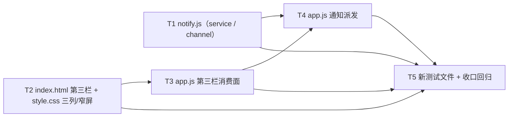

# pr-004-tasks.md — pr-004 内部任务图（控制台第三栏待确认 inbox + 浏览器通知）

**迭代**: 0021-confirmation-inbox-and-event-push ｜ **阶段**: 5（PR 实现）｜ **PR 文件**: `prs/pr-004-console-inbox-column-and-notify.md`
**worktree 分支**: `feat/0021-pr-004-console-inbox-column-and-notify`（base = 迭代分支 `1f7eceb`，已含 pr-003）｜ **任务总数**: **5**（T1~T5）｜ **依赖图**: 无环（见 §2）

## 0. 范围、文件面与事实锚点

**本 PR 文件范围（唯一可写面，5 条）**

| 文件 | 动作 | 内容 |
|---|---|---|
| `oamp/web/notify.js` | **新建** | `service` 层（事件类型常量 + 文案表 + 是否通知的判定 → `intent`）与 `channel` 层（`deliver(intent)`，首个通道 = 页面内 Notification API，权限 / 环境缺失时静默降级） |
| `oamp/web/index.html` | 修改 | `<main class="layout">` 内新增第三栏静态节点（`.sidebar` 与 `.detail` 之间的兄弟节点）；引入独立脚本 `` 体例 ⇒ 第三栏与新增 script **不与之相撞** | `test/project-workspace.test.js:818-828`、`:881-887`；`test/api-pages.test.js:81`、`:114` |
| A10 | 构造样本的可复现面已存在：harness 假节点 `startFakeNode` + 按 §5.3 信封 1 投递 `notice` 的 `sendNotice` helper（pr-003 落盘） | `test/helpers/fake-node.js:26`；`test/confirmation-inbox.test.js:140-150` |
| A11 | 路由/接口面已就绪：`GET /api/confirmations`、`POST /api/confirmations/:confirmation_id/decision`（表末位，pr-003 落盘）⇒ 本 PR **零新增路由** | `src/web.js:1253`、`:1270` |

## 1. 任务列表

### T1: 新建 `oamp/web/notify.js`（service / channel 两层分离 + 三事件常量 + Notification 通道与降级）

- **验收标准**:
  1. **事件类型封闭 3 类**：文件内事件类型常量恰为 `chat_completed` / `chat_failed` / `confirmation_required`（**无** `call_completed`、无第 4 类）；常量与 `service` 层一个分派点一一对应，服务端零事件类型常量。判据：静态断言（常量清单 + 事件类型字符串全集）。
  2. **两层零命中（可静态判定）**：`service` 段内**零** `Notification` 标识符；`channel` / `deliver` 段内**零**事件类型字符串（不 `switch (eventType)`）。判据：按段落切片后断言两侧零命中（§7 T-12「可被静态检查的形状」）。
  3. **职责分离可描述**：`service` 只产出 `intent = {type, title, body, target}`（三行文案表：`chat_completed`「对话已完成」/ `chat_failed`「对话失败」/ `confirmation_required`「需要你确认」，正文截断 80 字符）；`channel.deliver(intent)` 只消费 `intent`、不认识事件类型 ⇒ 扩展 / 替换通道 = 加一个 `deliver`，事件类型契约与 `service` 零改动。判据：读导出面与调用点 + 静态断言（`deliver` 形参不含 eventType 形态的分派）。
  4. **投递与降级**：`Notification.permission === 'granted'` → 投递一次系统通知；`'denied'` 或 `typeof Notification === 'undefined'` → **静默**（不弹横幅、不提示、不重试、不抛错、不影响 `service` 产出与第三栏）。判据：浏览器实测（denied 权限 / 无 Notification 环境两档，页面无提示且控制台零未捕获异常）+ 静态断言（降级分支在场）。
  5. **加载期零权限请求**：模块求值期不调用 `Notification.requestPermission()`；`'default'` 期间一律按未授权处理（不投递）；权限请求只发生在**用户手势回调**内且至多一次（T-11：第三栏出现后的首次用户点击）。判据：静态断言（`requestPermission` 仅出现在手势入口函数体内）+ 浏览器实测（加载后无权限弹窗）。
  6. **零依赖 / 零构建 / 独立脚本**：文件为浏览器可直接执行的经典脚本（`import` / `export` **零命中**，与 `index.html` 无 `type=module` 的既有形态一致），对外以全局入口暴露给 `app.js`；`node oamp/test/hygiene.test.js` 保持绿。`[model_inferred]`（入口形态由 §11.4「零构建」+ §2.1 组件图 `UI --> NT` 边推得，非架构原文——见 §5 疑问 7）
  7. **不引入** Service Worker / Web Push / VAPID / WebSocket（§2.4）。
  8. **service / channel 段落边界可静态切片**：两段以稳定标记分隔（供 T5 断言），不靠行号。
- **前置依赖**: 无（与 T2 并行）
- **优先级**: P0
- **追溯**: architecture §4.1 N-2 ／ §5.5（服务 ⇄ 通道契约）／ §7 T-09、T-10、T-11、T-12、T-13、T-14 ／ §2.4 ／ §3.1 L1-4 ／ §11.4；prd/F07 验收 1~2、F08 验收 1~3 与边界 N4、F09 验收 1~2；PR 文件 验收 1、2、7、8、9

### T2: `index.html` 第三栏静态节点 + 独立脚本引入；`style.css` 三列布局与窄屏折叠（只追加）

- **验收标准**:
  1. **第三栏 = `main.layout` 内的兄弟节点，位于对话列表与详情之间**：`<main class="layout …">`（检索式 **`layout`**）内 DOM 顺序 = `.sidebar` → 新增第三栏 → `.detail`，且第三栏在 `</main>` 之前。判据：静态断言（三者 `indexOf` 递增 + `<main` / `</main>` 区间包含）。
  2. **不新增入口载体**：无新页面 / 新路由 / 顶栏抽屉 / 左栏过滤器第 4 个 tab——既有 `.filters` 按钮集合与 `#projects-view` 结构不变。判据：`index.html` diff 只含第三栏节点与一条 script。
  3. **独立脚本**：含 ``，与既有 `` **两条独立标签**（通知模块不并入 `app.js`、不内联）。判据：静态断言（两标签并存；`app.js` 内零 `Notification`，与 T4 验收 5 同源）。
  4. **宽屏三栏**：`.detail` 保持 `flex: 1`（主体仍最宽）；第三栏与两栏同屏可见、定宽 `320px`（与 `.sidebar` 同口径），无横向滚动。判据：新增 CSS 规则在场（第三栏定宽 + `.detail` 未被改写）+ 浏览器实测。
  5. **窄屏（`max-width: 1100px`）折叠为可开合面板**：默认收起、标题显示**在途条数**、一次点击可展开并操作条目（不消失、不做横向滚动）。判据：`@media (max-width: 1100px)` 规则作用于第三栏（本仓现有样式零 `@media` ⇒ 本栏首次引入断点）+ 浏览器实测（1100px 上下两档）。
  6. **只追加**：既有 `style.css` 规则**零改写**（`.layout`、`.sidebar`、`.detail` 等既有声明文本原样在场）；第三栏折叠状态按本仓「`.hidden` 逐组件定义」体例给自己的规则，**不复用**别组件规则。判据：`git diff` 中既有行为纯新增 + 既有前端断言（A9 的三条真隐藏规则等）保持绿。
  7. `GET /notify.js` 在 T1 落盘后为 **200**（非 404）——`STATIC_FILES` 已由 pr-003 登记，本 PR 对 `src/web.js` 零改动。判据：HTTP 断言（T5 承接）。
- **前置依赖**: 无（与 T1 并行）
- **优先级**: P0
- **追溯**: architecture §4.2 M-7、M-11 ／ §7 T-01 ／ §11.4（`style.css` 既有规则只追加）／ §4.3 Z-6 ／ §3.2 L2-2；prd/F01 验收 1 与边界 N7；PR 文件 验收 1、6；偏差 D-h8（检索式）、D-h7（flex 实现不绑定）

### T3: `app.js` 第三栏消费面（拉取重建 + 帧追加 + 渲染 + 点选即提交 + 窄屏开合）

- **验收标准**:
  1. **双来源同形状、同一渲染路径**：`GET /api/confirmations`（`{confirmations:[…]}`，A7）与全局 `confirmation` 帧（同形 7 字段 entry）共用一个渲染函数；条目三行 = ① 来源对话（`state.chats` 命中则用其 `title`，未命中即回落 `chat_id`；**不额外拉取**——渲染路径零新增 `/api/chats/` 请求）② `tool` + `title`（动作描述）③ 每个 `options[i]` 一个 `<button>`（`label` 缺失显示 `option_id`）+ 一个单行文本输入框（placeholder「拒绝理由 / 补充说明（可不填）」）。判据：静态断言（唯一渲染函数 + 三行控件检索式）+ 浏览器实测。
  2. **重建 = 纯拉取、零缓存、跨对话**：页面打开即拉取一次；**全局 SSE 每次 `onopen`（含首次与每次自动重连）**再拉取并**整栏覆盖重绘**；增量帧按 `confirmation_id` 去重追加；`localStorage` / `sessionStorage` 零命中；栏内内容不随当前选中对话变化。判据：静态断言（拉取点在 init 与全局 `onopen`；零 storage 标识符）+ 浏览器实测（刷新 / 断线重连 / 切换对话）。
  3. **点选即提交**：点击任一选项按钮 → `POST /api/confirmations/<confirmation_id>/decision`，body `{option_id, text}`（text 取输入框原值，空白可提交，**前端不校验**）；提交中该条按钮 `disabled`（+「提交中…」）；成功（`200`）→ **立即**整条移出栏内（不等 SSE）。判据：静态断言（`/decision` 调用点在场）+ 浏览器实测。
  4. **`404` 不重放**：提交得 `404 NOT_FOUND`（已裁决 / 已失效 / 从未存在，同码不区分）→ 同样移出栏内、**不重放**（§5.1 幂等行原文）。判据：浏览器实测（同一条重复提交）。
  5. **窄屏开合交互**：折叠态标题显示在途条数；一次点击开合；开合**不切换主视图**（不调 `openChat`、不改 `state.chat`），栏目不自成导航。判据：浏览器实测（≤1100px 与 >1100px 两档）。
  6. **既有面零回归**：`subscribe` 的 4 类事件与 `handleEvent`（A5）逐字不变；全局 `agent_online` / `agent_offline` 分支不变；`main.layout` 的 `hidden` 视图切换与项目列表视图语义不变。判据：既有前端断言全绿（A9）+ 浏览器实测。
  7. **权限手势入口接线**：第三栏的首次用户交互（展开 / 收起 / 点选选项）触发一次 T1 的手势入口（至多请求一次权限）；未触发手势前不请求。判据：浏览器实测（加载后无弹窗；首次点击后至多一次请求）。
- **前置依赖**: T2（静态节点与折叠样式）
- **优先级**: P0
- **追溯**: architecture §4.2 M-8（第三栏渲染 / 提交 / 重建）／ §5.1 R-1、R-2 ／ §5.2 ／ §7 T-01、T-02、T-03、T-04、T-07、T-11 ／ §3.2 L2-1、L2-2、L2-3、L2-10 ／ §11.4；prd/F01 验收 1~4、F03 验收 1~4、F06 验收 1~4；PR 文件 验收 3、4、5、6、9

### T4: `app.js` 三类事件的通知派发（终态派生 + 首次入栏一次 + 调用面零通知）

- **验收标准**:
  1. **终态派生**：全局链路的 `chat_state` 帧（A6：pr-003 起每次 `publishState` 追加一次全局广播）在状态由**非终态**变为 `completed` / `failed` 时，各派发**一次** `chat_completed` / `chat_failed` 到 `notify` 的 `service` 层。判据：静态断言（派发点位于全局订阅分支）+ 浏览器实测（分别在当前对话 / 另一对话 / 项目列表视图三种停留位置触发）。
  2. **不依赖停留位置，也不依赖对话列表**：派生状态表按 `chat_id` 维护，**不依赖** `state.chats` 成员（跨项目 / 未加载的对话同样派生）；派发点不在 `/api/stream` 会话订阅路径与 `renderChat` 路径上。判据：读派发点所在分支 + 浏览器实测（项目列表视图，A4）。
  3. **`confirmation_required` 仅首次入栏一次**：派发只出现在全局 `confirmation` 帧分支；`GET /api/confirmations` 重建路径（打开页面 / 每次 `onopen`）**零派发**；服务端已保证重复投递同一 `confirmation_id` 不再发帧（pr-003 T3），前端**不额外去重**。判据：静态断言（重建函数体内零派发点）+ 浏览器实测（刷新 / 重连不重复通知）。
  4. **调用面零通知**：hub 调用面事件（`call_state` / `call_result`，走 `call:` / `chat-calls:` 键）**不产生**任何通知——`notify` 派发点恰 2 处（全局 `chat_state` 分支 + `confirmation` 分支），会话订阅 4 类事件处理路径零 `notify` 调用。判据：静态断言（派发点计数）+ 浏览器实测（派发一次后台调用并等其完成 → 零通知）。
  5. **`app.js` 零投递实现**：`app.js` 内零 `new Notification`、零 `Notification.requestPermission`（投递与权限全在 `notify.js`）；通知**不承载唯一入口**（`onclick` 不可用时裁决仍在栏内可完成）。判据：静态断言 + 浏览器实测。
  6. **同一终态重复广播不重复派发** `[model_inferred]`：派生以「**状态转变**」为判据而非「帧到达」——同一 `chat_id` 的同一终态再次到达不再派发。判据：浏览器实测（终态后同对话再落一条消息 / 重复广播场景）。追溯依据：prd/F07 验收 2「由工作中变为**完成** ⇒ 完成类事件」（转变语义）+ PR 验收 7「各触发**一次**」。
- **前置依赖**: T1（`notify` 入口与 `service` / `channel` 契约）、T3（全局 `confirmation` 帧分支与在途状态）
- **优先级**: P0
- **追溯**: architecture §2.2 流 3 ／ §5.2 ／ §7 T-09、T-10、T-13、T-14 ／ §3.2 L2-8、L2-9 ／ §4.2 M-8（通知派发调用点）／ §11.1 B-12；prd/F07 验收 1~3、F08 验收 1~3、F09 验收 1~2；PR 文件 验收 7、8、9

### T5: 新建 `oamp/test/inbox-console.test.js`（前端静态契约 + `GET /notify.js` 200）+ PR 收口回归

- **验收标准**:
  1. **体例与边界**：新文件以**前端文本级静态契约**为主（读 `oamp/web/**` 源码，体例同既有前端静态契约测试 A9/A10），另起 harness 真实 `oamp web` 子进程做 HTTP 断言；零新依赖、不写真实 `oamp/data/sql.db`（`OAMP_DB` 指向临时目录）。
  2. **静态断言覆盖**：① `index.html` 三栏顺序（`.sidebar` → 第三栏 → `.detail`，且在 `<main …>` 内）+ 独立 `<script src="/notify.js">`；② `notify.js` 的 `EVENT_TYPES` 恰 3 类且无 `call_completed`、`service` 段零 `Notification`、`channel`/`deliver` 段零事件类型字符串；③ `style.css` 含第三栏规则与 `@media (max-width: 1100px)`，且既有 `.layout` / `.sidebar` / `.detail` 声明原样在场（只追加）；④ `app.js` 含全局 `confirmation` 监听、`onopen` 重建（`/api/confirmations` 拉取点）、`/decision` 提交点、零 `new Notification`。判据：断言逐条在场（检索式与 T1~T4 的实际落盘形态对齐后生效）。
  3. **HTTP 断言**：`GET /notify.js` → `200` 且 `content-type` 为 JS（**非 404**）；`GET /`、`/app.js`、`/style.css` 仍 `200`。判据：`node --test oamp/test/inbox-console.test.js` 全绿。
  4. **既有测试零修改**：本 PR 不修改任何既有 `oamp/test/*.js`（文件范围仅含新测试文件）；既有前端断言保持绿。判据：`git diff --name-only` 不含既有测试文件 + 既有文件复跑绿。
  5. **PR 收口**：`node --test oamp/test/inbox-console.test.js oamp/test/api-pages.test.js oamp/test/project-workspace.test.js oamp/test/confirmation-inbox.test.js` 全绿；`node --test oamp/test/hygiene.test.js` 保持绿。
  6. **浏览器行为面不在本文件承载（登记为验收方式）**：PR 验收 3 / 4 / 5 / 6 / 7 / 8 / 9 的运行期行为（免刷新入栏、点选即提交、刷新 / 重连重建、窄屏折叠、三类通知各一次、降级静默、`onclick` 不可用仍可裁决）由阶段 5 的**浏览器实测**承接——以非默认端口拉起 `oamp web` + agent 进行；构造样本 = 按 architecture §5.3 信封 1 用假节点投递（A10 同源体例），真实样本 = `allow` 档 agent 上浮。
- **前置依赖**: T1、T2、T3、T4
- **优先级**: P0
- **追溯**: architecture §5.5（静态可检查形状）／ §7 T-12 ／ §4.1 N-3 的三文件拆分（verdict B）／ §11.4；prd/F09 验收 1~2（形态可静态描述）、F01 验收 1、F06 验收 1~3；PR 文件 验收 1、2、10 与文件范围（新测试文件）

## 2. 依赖图（无环）

拓扑序（合法执行序）：`T1, T2 → T3 → T4 → T5`（T1 与 T2 自始可并行）

- **最长依赖链**：`T2 → T3 → T4 → T5`（4 跳）。
- **关键路径任务**：**T2、T3、T4、T5**；**T1** 可自始并行，其两条出边（→ T4、→ T5）均不构成关键路径延长。
- **无环**：所有边方向单调（T1/T2 → T3 → T4 → T5；T1 → T4、T1/T2 → T5），无回边、无自环。

**同文件串行约束（必须）**

| 文件 | 修改任务 | 串行要求 |
|---|---|---|
| `oamp/web/notify.js` | T1（唯一） | — |
| `oamp/web/index.html` | T2（唯一） | — |
| `oamp/web/style.css` | T2（唯一） | — |
| `oamp/web/app.js` | **T3、T4** | **不得并发**：由同一实现者按 `T3 → T4` 顺序落地（T4 的派发点落在 T3 建立的全局 `confirmation` 分支与在途状态上） |
| `oamp/test/inbox-console.test.js` | T5（唯一，新建） | 须待 T1~T4 落盘后再定稿断言（检索式对齐，见 §5 疑问 5） |
| 既有测试文件 | **无**（本 PR 零改动） | — |

## 3. 与 pr-004 验收标准逐条对位表

| PR 验收 # | 验收摘要 | 承接任务 | 对位说明 / 判据面 |
|---|---|---|---|
| 1 | `GET /notify.js` 返回该文件（非 404）+ `index.html` 独立 `<script>` 引入 | **T2**（验收 3、7）+ **T5**（验收 3） | `STATIC_FILES` 由 pr-003 登记（A1），本 PR 只落文件 + 引入标签；200 由 HTTP 断言判 |
| 2 | 服务 / 通道分离**可静态判定**（3 类常量无 `call_completed`；`service` 零 `Notification`；`channel`/`deliver` 零事件类型字符串） | **T1**（验收 1、2）+ **T5**（验收 2） | 断言的三个零命中/常量清单 = §7 T-12 的「可静态检查形状」 |
| 3 | 无需刷新即入栏；条目含 ①来源对话标识（取不到回落 `chat_id`）②工具名 + 动作描述 ③每选项一按钮 + 一文本框 | **T3**（验收 1） | 帧驱动增量 + 同一渲染路径；回落口径 = §7 T-02（**不**额外拉取） |
| 4 | 点选即裁决：`{option_id, text}` 提交、提交中 `disabled`、`200` 即移除（不等 SSE） | **T3**（验收 3） | 判据 = `POST` 的 200 触发移除，而非 SSE 帧 |
| 5 | 刷新 / 断线重连后仍在且内容一致；已裁决项不回流 | **T3**（验收 2、4）；样式面 **T2**（验收 5） | 「内容一致」口径 = MI-04（不判顺序）；已裁决项无读取入口（pr-003 T1/T2） |
| 6 | 第三栏是 `main.layout` 内兄弟节点、位于对话列表与详情之间；≤1100px 折叠为可开合面板且仍可达；未新增页面 / 路由 / 顶栏抽屉 / 左栏 tab | **T2**（验收 1、2、4、5）+ **T3**（验收 5） | DOM 顺序静态断言 + 折叠行为浏览器实测；N7 / §4.3 Z-6 |
| 7 | 三类事件各触发一次通知；终态帧派生（停在其他对话 / 项目列表页也能收到）；`confirmation_required` 仅首次入栏一次、重建不重复；hub 调用面完成不产生通知 | **T4**（验收 1、2、3、4、6）+ **T1**（验收 3、4） | 派生=转变语义（F07 验收 2）；重建零派发=服务端单一发布点（L2-9 / MI-01） |
| 8 | 降级：`denied` / 无 `Notification` 静默不投递、不影响第三栏与事件契约；加载时不主动请求权限（`default` 按未授权） | **T1**（验收 4、5）+ **T3**（验收 7） | 权限请求只在手势内、至多一次（T-11）；降级只影响 `channel`（F09 验收 1） |
| 9 | 通知 `onclick` 不可用时关键动作仍在栏内可完成 | **T4**（验收 5）+ **T3**（验收 1、3） | 通知不承载唯一入口（T-09）：裁决入口恒在栏内选项按钮 |
| 10 | `node --test oamp/test/inbox-console.test.js` 全绿 | **T5**（验收 2、3、5） | 新文件新建、既有测试零改动（验收 4） |

**覆盖检查**：PR 10 条验收标准 → 全部有任务承接，无遗漏、无扩范围；T1~T5 均可追溯到 architecture / prd / PR 文件（见 §6）。

## 4. 关键实现约束

1. **检索式以 `layout` 为词**（偏差 D-h8）：`index.html` 实为 `<main class="layout hidden">`（A2），字面 `class="layout"` 不命中。
2. **§11.4 零改动清单**（本 PR 相关面）：`app.js` 既有渲染与交互、`style.css` 既有规则（**只追加**）、`GET /api/stream` 的 4 类事件、既有 19 条路由 handler、`persist.js` / `router.js` / `transport.js`。**`oamp/src/web.js` 整体不在本 PR 文件范围**（含 `STATIC_FILES`、路由表、`handleDeliver`、`publishState` 的全局广播）。
3. **`notify.js` 必须独立脚本**：与 `app.js` 并列加载，不并入、不内联；零构建 ⇒ 只能经典脚本 + 全局入口；`service` / `channel` 以稳定标记分段（供静态切片，T1 验收 8）。
4. **事件类型封闭 3 类**（`chat_completed` / `chat_failed` / `confirmation_required`），**无 `call_completed`**；服务端零事件类型常量 ⇒ 唯一真源在前端一处（T-14）。
5. **不新增入口载体**（N7 / Z-6）；**不引入** Service Worker / Web Push / VAPID / WebSocket / 新依赖 / 构建链（§2.4）。
6. **前端零持久化**：`localStorage` / `sessionStorage` 零命中（T-07）；去重靠服务端单一发布点，前端**不自行去重**（T-10）。
7. **「内容一致」口径（MI-04）**：= 条目存在 + `chat_id` / `tool` / `title` / `options` 一致；**不判**栏内顺序与位置 ⇒ 重建不做排序稳定性承诺。
8. **样本可复现**：构造样本 = 按 architecture §5.3 信封 1 由假节点投递 `notice{kind:'confirmation_request'}`（A10 体例）；真实样本 = `allow` 档 agent 上浮（消费 pr-001 / pr-002 成果）。浏览器实测须以**非默认端口**拉起 `oamp web`（PR 验收 3 口径）。
9. **权限**：仅手势回调内、至多一次请求；加载路径零 `requestPermission`（T-11）。
10. **（可选，不强制）** 若实现期需要在 Node 侧补 `deliver` 的运行期断言（stub 全局 `Notification`），须落在 `oamp/test/inbox-console.test.js` 内且零新依赖；不引入测试替身库。

## 5. 边界与疑问（提请主 agent）

1. **终态派生口径有信息缺口（planner 不填）**：architecture §2.2 流 3 与 prd/F07 验收 2 只钉死「`working` → `completed` / `failed` 的**转变**」，未钉死：① 同一终态的**重复广播**是否应再通知；② 页面在某对话进入 `working` **之前**就已加载（或首次观测到的帧即终态）时，是否算一次转变并通知。T4 验收 1 / 6 按「转变」语义写成（① 不重复）；② **未钉死**——两种口径都满足 PR 验收 7 的场景（"停在其他对话 / 项目列表页也能收到"时页面在 `working` 帧到达前已连接，A4），故不阻塞实现，但实现期须定稿；若与 F07 的「各一次」判据冲突，请主 agent 裁决。
2. **R-2 非 200 的前端处置**：`404` 有原文依据（§5.1 幂等行：前端据此移除、不重放 → T3 验收 4）；**`400 INVALID_PARAM` 架构未写前端处置**（正常路径不可达：`option_id` 来自服务端返回的 `entry.options`）。任务图**未**替架构选边；若实现期需要可见处置，建议沿用既有 `#hint` 行体例，请主 agent 确认。
3. **第三栏在项目列表视图下随 `main.layout.hidden` 一并不可见**（既有视图语义，`demand.md` 未要求改变）。PR 验收 7 的「项目列表页也能收到通知」由全局 SSE 驱动（`init()` 在 `resolveCurrentProject()` **之前**建立全局连接，A4），与栏可见性无关 ⇒ 二者不冲突。登记为边界，非缺口。
4. **`src/web.js` 的 `/api/events` 路由登记文案与实际事件集合不一致**：该表项仍写「全局事件订阅（SSE：agent_online / agent_offline）」与 `response: … agent_online / agent_offline`，未含 pr-003 起实际发布的第 3 类 `confirmation`（pr-003 已按裁决把口径落在 `API.md §4.2`）。该文件**不在本 PR 文件范围** ⇒ 本 PR 不处理；派生面（`/api/docs`、`llms.txt`）中该条目的文案与真实事件集合仍有偏差，是否补登请主 agent 决定（可能属 pr-003 的残留或下一 PR）。
5. **静态断言的检索式依赖实现落盘形态**：`notify.js` 的全局入口名与 `service` / `channel` 分段标记是实现细节（零构建下只能是全局），T5 的断言必须在 T1 落盘后以实际形态对齐（先例教训：`api-pages.test.js` 的 `window.confirm` 断言作用域曾被架构误标为 `app.js`，实为 `debug.js`）。⇒ 建议 T1 完成后先 `grep` 校验命中再写 T5。
6. **工作区路径**：实际 worktree = `…/0021-confirmation-inbox-and-event-push/.pb-agents/worktrees/0021-pr-004-console-inbox-column-and-notify`（分支 `feat/0021-pr-004-console-inbox-column-and-notify`，base `1f7eceb` 已含 pr-003），与简报一致，无偏差。
7. **`[model_inferred]` 项共 2 条**（需主 agent 确认）：① T1 验收 6 的「对外入口为全局」交付形态（推断自 §11.4 零构建 + §2.1 组件图 `UI --> NT` 边）；② T4 验收 6 的「同一终态重复广播不重复派发」（推断自 prd/F07 验收 2 的转变语义 + PR 验收 7 的「各一次」）。二者均**不引入架构之外的技术决策**。

## 6. 追溯总表（任务 → 输入）

| 任务 | architecture 追溯 | prd 追溯 | PR 文件追溯 |
|---|---|---|---|
| T1 | §4.1 N-2、§5.5、§7 T-09/T-10/T-11/T-12/T-13/T-14、§2.4、§3.1 L1-4、§11.4 | F07 验收 1~2、F08 验收 1~3 与边界 N4、F09 验收 1~2 | 验收 1、2、7、8、9；文件范围（`oamp/web/notify.js` 新建） |
| T2 | §4.2 M-7、M-11、§7 T-01、§11.4、§4.3 Z-6、§3.2 L2-2 | F01 验收 1 与边界 N7 | 验收 1、6；文件范围（`index.html`、`style.css`）；偏差 D-h8 / D-h7 |
| T3 | §4.2 M-8（第三栏渲染 / 提交 / 重建）、§5.1 R-1/R-2、§5.2、§7 T-01~T-04/T-07/T-11、§3.2 L2-1~L2-3、L2-10、§11.4 | F01 验收 1~4、F03 验收 1~4、F06 验收 1~4 | 验收 3、4、5、6、9；文件范围（`web/app.js`） |
| T4 | §2.2 流 3、§5.2、§7 T-09/T-10/T-13/T-14、§3.2 L2-8/L2-9、§4.2 M-8（通知调用点）、§11.1 B-12 | F07 验收 1~3、F08 验收 1~3、F09 验收 1~2 | 验收 7、8、9；文件范围（`web/app.js`） |
| T5 | §5.5、§7 T-12、§4.1 N-3 拆分（verdict B）、§11.4 | F09 验收 1~2、F01 验收 1、F06 验收 1~3 | 验收 1、2、10；文件范围（`oamp/test/inbox-console.test.js` 新建） |
