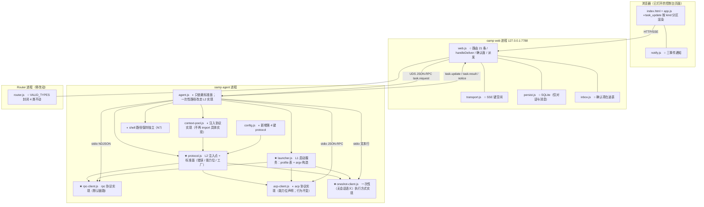

# architecture.md — 0022-agent-launcher-and-protocol-layer

**版本**: 0.2.0（阶段 3 · 第 2 轮收口：**L1 决策 2 条已用户确认**（§4.1）、**`[model_inferred]` 7 项归零**（§12.1）；第 1 轮已完成 M7 实测（§2，探针脚本与原始输出已落盘）与 T-01~T-11 全部落定（§7））
**迭代**: 0022-agent-launcher-and-protocol-layer
**阶段**: 3（技术架构）
**创建日期**: 2026-09-14
**本轮收口**: 2026-09-14（第 2 轮：用户裁决回收——L1 2 条已确认、`[model_inferred]` 7 项归零、§12.2 三条疑问已裁定；裁决原件 = `clarifications/2026-09-14-architect-round1-verdicts.md`，回收过程 = `clarifications/2026-09-14-architect-round2.md`）
**输入**: `prd.md` v0.2.0 + `prd/F01~F13*.md`（13 卡，`[架构待填]` T-01~T-11）+ `demand.md` v1.0.0（W1~W8 / N1~N12 / M1~M7 / E1~E7 / R1~R7 / A1~A7 / J1~J4）+ **M7 实测证据**（本文件 §2）
**代码基线**: `<工作区地址>/oamp/**`（只读；本次基线复核为**2026-09-14 实读**，逐条带 `文件:行号`）
**体例参照（只读，未写入）**: `docs/iterations/0021-confirmation-inbox-and-event-push/architecture.md`、`docs/iterations/0011-chat-context-protocol/architecture.md`
**本方案的对象**: **oamp**（本机 `http://127.0.0.1:7788` 的 Web 控制台 + HTTP/SSE 接口面 + 集群/agent 运行时）。**不改 omp / harness 侧源码与协议**（N2 → F11）。

> **阅读顺序**：§1 现状基线（30 秒建立心智模型）→ **§2 M7 实测证据（本迭代的地基：L2 接口按实测定型，不按假设）** → §3 目标架构 → §4 L1 清单（**2 条已确认（2026-09-14）**）→ §7 T-01~T-11 落定 → §9 必然变更点清单 → §8 自查表。

---

## 0. 本文件状态

| 章节 | 状态 |
|---|---|
| §1 现状架构基线（as-is，逐条带文件:行号） | ✅ 已落盘（G1~G10 缺口 + 可复用原语 + §1.5 D-2 当日基线快照） |
| §2 **M7 实测证据（M-1~M-5 + M-2b；探针脚本 + 原始输出已落盘）** | ✅ 已落盘（6 个探针、6 份原始输出；含 1 处探针自身缺陷的诚实登记） |
| §3 目标架构（组件图 / 模块布局 / 核心数据流） | ✅ 已落盘 |
| §4 关键技术决策（L1 清单 + L2 清单） | ✅ 已落盘（**L1 2 条已用户确认（2026-09-14）**、候选 2 条判为 L2；L2 13 条各附理由） |
| §5 接口与契约（标准面签名 / profile 字段集 / 注入点 / 帧映射 / 增量帧面 / 门映射 / 能力位） | ✅ 已落盘 |
| §6 功能卡 ↔ 技术路径映射（F01~F13） | ✅ 已落盘（13/13） |
| §7 T-01~T-11 逐项落定 | ✅ 已落盘（11/11） |
| §8 内部一致性自查（C1~C16） | ✅ 已落盘 |
| §9 必然变更点清单（新建 / 修改 / 零改动 / 测试面 / 文档面） | ✅ 已落盘 |
| §10 奥卡姆剃刀检验（新组件 ↔ 必需功能） | ✅ 已落盘 |
| §11 风险与已知代价（R1~R7 承载 + 实测新事实 N-1~N-6） | ✅ 已落盘 |
| §12 越界与疑问（含 `[user_confirmed]` 集中列示 **7 项已裁决**；§12.2 三条疑问已裁定） | ✅ 已落盘 |
| §13 未越界声明 | ✅ 已落盘 |

---

## 1. 现状架构基线（as-is，2026-09-14 实读）

### 1.1 相关进程与进程边界

```
┌─ 浏览器 ───────────────────┐  ┌─ oamp web 进程 (127.0.0.1:7788) ────────┐  ┌─ oamp agent 进程 ────────────┐
│ index.html + app.js        │  │ web.js  路由(24条)/SSE/派发/对账       │  │ agent.js  生命周期 + 任务执行 │
│ notify.js 通知面           │◀─│ transport.js 键空间 chat:/call:/全局    │  │  ├─ shell 路径（非 omp）      │
│ EventSource ×2             │SSE│ persist.js SQLite（仅对话与消息）      │◀─│  ├─ 一次性路径 `omp -p`       │
└────────────────────────────┘  │ inbox.js 确认项在途表（进程内）        │UDS│  └─ 常驻路径 ContextPool      │
                                └────────────────────────────────────────┘  └───────────────┬───────────────┘
                                                                                            │ stdio
                                                                          ┌─────────────────┴──────────────────┐
                                                                          │ `omp acp` 常驻子进程（一 chat 一进程）│
                                                                          │ `omp -p` 一次性子进程（一轮一进程）  │
                                                                          └────────────────────────────────────┘
```

关键字面事实：**协议实现（`acp-client.js`）与消费层（`context-pool.js` / `agent.js`）同处 `src/` 平铺**，且消费层**直接 import 并直接构造**协议实现——本迭代要补的正是这一层的接缝。

### 1.2 既有技术栈（本方案不得新增；N10 / F12）

| 面 | 现状 | 证据 |
|---|---|---|
| 运行时 | **零依赖 Node.js ≥22 ESM**；`package.json.dependencies = {}` | `oamp/package.json`；`oamp/test/hygiene.test.js`（断言 `dependencies` 为空） |
| HTTP 服务 | Node 内置 `http`；静态单页 + JSON API（**21 条路由**） | `oamp/src/web.js`（路由表 `createApiRoutes`） |
| 实时推送 | **SSE**（`text/event-stream`）；键空间 = `chat:<id>` / `call:<id>` / `chat-calls:<id>` / `null`(全局) | `oamp/src/transport.js:18-24`、`:26`、`:103-105` |
| 持久化 | SQLite（仅 `chats` / `messages` / `projects` 等）；**过程不入库** | `oamp/src/persist.js` |
| 配置 | `config.json`（**3 键**：`data.db` / `defaults.model` / `context.max`）+ env 覆盖；`loadConfig` 是**叶子模块**（不 import `src/` 内任何模块） | `oamp/src/config.js:1-3`、`loadConfig()` |
| 跨进程信封 | agent→web：`task.update` / `task.result` / `notice`；web→agent：`notice{kind:'context_release'\|'confirmation_decision'}` | `oamp/src/web.js:1586-1655`、`oamp/src/router.js`（`VALID_TYPES` 封闭 4 类） |
| 内部 RPC | `src/rpc.js` = oamp **自己的** UDS NDJSON/JSON-RPC 对端（Router ↔ agent/web） | `oamp/src/rpc.js:1-8`、`MAX_FRAME_BYTES` |

> ⚠ **命名澄清（避免与既有模块混淆）**：`oamp/src/rpc.js` 是 **oamp 内部进程间**的 JSON-RPC（Router 面），**与本迭代的「rpc 协议」不是同一个东西**。本迭代的 rpc = `omp --mode rpc`（omp 子进程的 stdio 协议）；对应实现新文件 `oamp/src/rpc-client.js`。二者不可互相引用、不可合并。

### 1.3 与本次需求直接相关的现状缺口（**现状事实，非缺陷指控**）

| # | 现状 | 证据（文件:行号） | 与需求的关系 |
|---|---|---|---|
| G1 | **消费层直接 import 并构造协议实现**：`ContextPool` 文件头 `import { AcpClient, AcpError } from './acp-client.js'`，`_ensureClient()` 内 `new AcpClient({...})` | `oamp/src/context-pool.js:7`、`:200-249`（`new AcpClient` 在 `:203`） | W2 / W8 的 D-2 今天**结构性不成立**（协议实现的构造与符号都在消费层） |
| G2 | **argv 知识两份**：常驻路径 argv 在协议客户端内部拼装；一次性路径 argv 在任务面另拼一份 | `oamp/src/acp-client.js:137-144`；`oamp/src/agent.js:192-199` | W1「启动数据化」的靶点（F7 / F8） |
| G3 | **argv 构造与协议语义同处一个类**（`AcpClient.start()` 里既有进程参数又有协议初始化） | `oamp/src/acp-client.js:136-182` | W1 / W2 的接缝（启动归 L1、会话归 L2） |
| G4 | **思考与工具输出增量被客户端显式丢弃**：`_chunkHandler` 只接受 `agent_message_chunk`，其余 `sessionUpdate` 直接 return | `oamp/src/acp-client.js:201-203` | W3 / W7：U-4 的目标在 acp 链路今天**物理上不可达**（F9）；本迭代由 rpc 链路达成（A4 / N12：acp 不补） |
| G5 | **三条执行路径分散在任务面**：`runTask()` 按 `task.executor` 分派到 `runOmpTask` / `runDaemonTask` / `runShellTask` | `oamp/src/agent.js:436-440`、`:181`、`:372`、`:443` | W1 / W6：一次性路径要建模为 L2 的无会话语义实现（J4），shell 保持独立（N7） |
| G6 | **无「能力位」声明面**：`src/` 与 `web/` 中零命中 | 全仓 grep（`capabilities` / `thinking:` 等零命中） | F09 / M6：缺能力今天只能"用时才发现" |
| G7 | **协议指定无配置面**：`config.json` 只有 3 键，无协议相关键 | `oamp/src/config.js`（三键默认值常量） | W2 / M2：协议今天写死在代码里（F10） |
| G8 | **前端 `task_update` 不区分 kind**：任何 `text`/`line` 都 `appendChunk` 进同一个流式文本 | `oamp/web/app.js:566-572`、`:598-603` | W7 / F08：过程与答案今天混在一条流里；若新增思考/工具增量而不改前端，思考会被并进"答案" |
| G9 | **无内部分层**：`src/` 平铺 19 个文件，协议实现与消费层同层、无目录分组 | `oamp/src/` 目录清单 | T-01：三层落点需要一次明确（但**不必**新建目录，见 §4.2 L2-1） |
| G10 | **门的上浮载体只有 ACP 形态**：`raiseConfirmation()` 读 `info.toolCall.{toolName,title}` 与 `info.options[].optionId/name/label` | `oamp/src/agent.js:303-311（readConfirmationOptions）、319-337（raiseConfirmation）`；`oamp/src/acp-client.js:23`、`:30-34`、`:534-575` | F05：RPC 的门是**字符串选项**（`['Approve','Deny']`）+ 多行 `title`（M-5 实测）⇒ 归一必须发生在**协议实现内**，消费层零改动 |

### 1.4 既有可复用原语（**奥卡姆剃刀：优先复用，不新建**）

| 原语 | 位置 | 本次如何复用 |
|---|---|---|
| 协议中立错误码集（`context_crashed` / `model_unavailable` / `timeout` / `permission_denied` / `context_busy`） | `oamp/src/acp-client.js:5-8`（`AcpError.code`）；消费侧按 `err.code` 映射文案与状态 | 原样**升格为标准面错误类型**（`ProtocolError`），码值逐字不变 ⇒ `agent.js` 的错误映射零改动 |
| 门 → 7 字段信封的唯一上浮函数 `raiseConfirmation()` | `oamp/src/agent.js:319-337` | **零改动**复用：只要协议实现产出同形钩子入参（`{kind:'tool_approval', toolCall:{toolName,title}, options:[{optionId,label?}]}`） |
| 工具名提取原语 + 多行 `title` 前缀常量 | `oamp/src/acp-client.js:23`（`'Allow tool: '`）、`:30-34`（`readApprovalToolName`） | **零改动**复用：RPC 门的 `title` 与 ACP 审批门 `title` **同源同形**（M-5 实测逐字验证） |
| 同键 FIFO 串行 + 队列上限 + LRU 淘汰 + 崩溃/超时收尾 | `oamp/src/context-pool.js:13`、`:143-186`、`:196-261`、`_evictIfNeeded` | **零改动**复用：M-1 实测证明 RPC **比 ACP 更严格地要求单轮串行**（并发 prompt 直接报错），既有语义天然适配 |
| 按对话运行时通道 `task.update` → SSE `task_update`（`{chat_id, task_id, kind, text, line}`；不入库） | `oamp/src/web.js:1626-1632`；`oamp/src/agent.js:392-399`（`onChunk`） | **零改动**复用：新 kind 取值原样透传（§5.5）；`stdout` 专属的 `entry.lines` 累积路径**不被新 kind 触发** |
| 确认面 7 字段信封 + 收件箱 + 裁决回路 + 三事件通知 | `oamp/src/web.js:1257-1273`、`:1274-1345`、`:1597-1613`；`oamp/src/inbox.js`；`oamp/web/notify.js:12` | **零改动**复用（0021 既有交付，F06/E5「不退化」的基线） |
| 模型解析链（payload > env > 角色级 flag > config > 内置）与角色文件注入（`--append-system-prompt`） | `oamp/src/agent.js:369-370（链的文档）、`:376`（常驻路径）、`:194`（一次性路径）、`:627-630`（env 层）、`:668-676`（roleFile 解析） | 原样保留；协议注入点的解析链**体例对齐**它（M2 明文要求） |
| 测试面 argv 观测钩子（`OAMP_TEST_ARGS_FILE` 形态的 argv 落盘断言） | `oamp/test/acp-daemon.test.js:539-556`、`oamp/test/context-pool.test.js:515-534`、`oamp/test/tool-permission.test.js:323-362` | 测试面**最小更新**（A5）：断言从「`argv[0] === 'acp'`」改为「按 profile 期望值断言」 |

### 1.5 D-2 的当日基线快照（阶段 3 实跑，作为"改造前"的对照面）

阶段 3 为 D-2（消费层不自行构造 / 选择协议实现）取了一次可复跑的基线（**只读 grep，未改任何代码**）：

| grep | 结果 | 读法 |
|---|---|---|
| `grep -rn "acp-client" oamp/src/` | `context-pool.js:7`（import 语句）；`acp-client.js:1`（自身文件头）；`agent.js:30`（**注释**里的口径引用） | **今天唯一的实质违规 = `context-pool.js:7` 这一处 import + `:203` 的构造**；协议实现的符号只从这里进消费层 |
| `grep -rn "'acp'\|"acp"\|'rpc'\|"rpc"" oamp/src/{agent.js,context-pool.js,web.js,config.js}` | **零命中** | 今天消费层**没有**"按协议取值"的分支 ⇒ D-2 的第二半（按协议值的分支）今天是**零基线**，本迭代只需**保持**零 |
| 消费层的一次性路径 mode 记号 | `agent.js:192` 的 `args = ['-p', '--no-session']` | 消费层今天持有的是**执行方式记号 `-p` + 整段 argv**（F8），不是协议名 ⇒ 归一动作 = 把这段 argv 迁进 L1 profile |

> **对改造的含义**：本迭代在 D-2 上的实际工作量集中在**一处 import + 一处构造 + 一段 argv**；`protocol.js` 的注入点因此是"把一个本就单一的实现接缝显式化"，而不是"重构协议知识散布的代码"。这也解释了为什么 §10 的奥卡姆表里几个"看起来优雅"的组件（目录、参数对象、消费层能力开关）都被判为不引入。

---

## 2. M7 实测证据（**需求级前置要求；本架构的 L2 接口按本节定型**）

> 位置：`clarifications/probes/`（脚本 + 原始输出，随迭代归档）。运行环境：本机 `omp v18.0.11`（`/Users/chenchiyuan/.bun/bin/omp`），模型 `deepseek/deepseek-v4-flash`，cwd `/tmp`。
> **可复跑**：`node probe-m*.mjs > m*-output.txt 2>&1`（各脚本头部注明 argv 与判据；无第三方依赖、无 git 写操作）。

| # | 探针脚本 | 原始输出 | 覆盖 M7 项 |
|---|---|---|---|
| M-1 | `probe-m1-session-model.mjs` | `m1-output.txt` | M-1 会话模型 |
| M-2 | `probe-m2-cancel-timeout.mjs` | `m2-output.txt` | M-2 取消与超时 |
| M-2b | `probe-m2b-terminal-payload.mjs` | `m2b-output.txt` | M-2 终态载荷（+ E3 前置条件） |
| M-3 | `probe-m3-argv-matrix.mjs` | `m3-output.txt` | M-3 argv 面完整性（9 组矩阵，含 acp 对照组） |
| M-4 | `probe-m4-host-tools.mjs` | `m4-output.txt` | M-4 宿主工具面 |
| M-5 | `probe-m5-gate-count.mjs` | `m5-output.txt` | M-5 门计数（+ F15 `title` 同源验证） |

### 2.1 M-1 会话模型：**1 进程 = 1 会话 = 1 在飞轮次**（决定上下文池映射）

argv：`--mode rpc --model <M> --no-skills --no-rules --no-session --thinking off`

| 观测 | 证据（`m1-output.txt`） | 结论 |
|---|---|---|
| 会话标识是**进程级单值** | `get_state` 的 `sessionId` 恒为单个标量（`stateSamples` 5 次采样）；`prompt` 命令**不带**会话选择参数 | 会话不可寻址 ⇒ 无多会话面 |
| 运行中再发第二个 `prompt` **被拒**，不是排队 | `1.29s` P1 受理起轮 → `3.19s` P2 得 `success:false, error:"Agent is already processing. Use steer() or followUp() to queue messages, or wait for completion."`；`agent_start` 全程仅 **1** 次 | **同一时刻只有一个会话、一个在飞轮次**；并发必须由**客户端**串行化 |
| `new_session` 是**替换**而非新增 | `33.69s` `new_session{id:'ns'}` → `response{cancelled:false}` → `36.69s` `get_state.sessionId` **变化**、`messageCount` 归 0、`get_last_assistant_text` 返回 `{}` | 切换会话 = 丢弃上下文（对齐 N9「切换即失忆」） |
| 上下文在同一进程内**跨轮累积** | `messageCount` 0→3→4（`sessionId` 不变） | 常驻语义成立 |

⇒ **设计约束 D-R1**：`ContextPool` 的键（`chat_id::agent_id`）与常驻子进程**必须保持 1:1**（与现状一致），**不做 1:N**；同键 FIFO 串行是**必要条件**（缺它则 RPC 直接报错），既有 `QUEUE_LIMIT=8` + `context_busy` 语义零改动适用。

### 2.2 M-2 取消与超时：`abort` 无参数、无协议级超时、终态与响应同刻

argv：`--mode rpc --model <M> --no-skills --no-rules --no-session --thinking off --approval-mode always-ask`

| 观测 | 证据（`m2-output.txt`） | 结论 |
|---|---|---|
| 空转 `abort` 不报错、不影响会话 | `1.05s` 发 `{type:'abort'}` → 无 error response（`idleAbortIdleError: null`）→ `1.40s` `get_state` 正常 | `abort` 幂等、可无条件调用 |
| `abort` 作用域 = **该进程唯一会话的在飞轮次**（命令无任何参数） | `56.80s` 起轮 → `57.80s` 发 `abort` → `57.82s` `response{command:'abort',success:true}` **与** `agent_end{isTerminal:true}` 同刻；随后 `61.80s` 新轮正常建立（`sessionId` 未变、`messageCount` 累积到 8） | abort 只终结在飞轮次，**不杀进程、不删上下文** |
| 轮次终态 = `agent_end{isTerminal:true}`；`agent_end` 每轮一次 | `agentEndEvents` 3 条（50.13s / 57.82s / 63.09s），全部 `isTerminal:true`；`agent_start` 3 次与之配对 | 终态判据唯一且成对 |
| **门无协议级超时**：`extension_ui_request` **不带 `timeout` 字段**，未应答期间轮次无限期挂起 | 门 `3.52s` 到达 → 我**故意不回执** 45s → `48.52s` 才回 `Deny` → `tool_execution_end` 在 `48.52s` | 超时策略**只能在客户端侧实现**；RPC 面不提供 |
| `prompt` **无超时参数**（命令面无该字段）；进程级另有 `--max-time` | `RpcCommand` 类型面 + `omp --help` 有 `--max-time=<value>`（M-3 实测该 flag 在 rpc 模式可用） | 轮次超时由消费层/实现侧实现（沿用既有 `prompt(timeoutMs)` → cancel → 宽限 → kill 三拍） |
| `tool_execution_start` **不等于**"已获批准" | 门 `3.52s` 到达同刻出现 `tool_execution_start`；`tool_execution_end` 迟至 `48.52s`（裁决后） | 消费层**不得**用 `tool_execution_start` 作放行判据 |

⇒ **设计约束 D-R2**：`cancel()` 实现 = 发 `{type:'abort'}` → 等 `agent_end{isTerminal:true}` 宽限 → 仍未到则 kill；常量沿用既有 `CANCEL_GRACE_MS=2000` / `KILL_GRACE_MS=500`（`acp-client.js:15-16`）口径。**门的等待不计入轮次超时**（与 0021 的 L1-1 冻结口径一致：无应答期间不推进计时）。

### 2.3 M-2b 终态载荷与思考增量（**E3 的前置条件**）

argv：`--mode rpc --model <M> --no-skills --no-rules --no-session`（**故意不传 `--thinking`**）

| 观测 | 证据（`m2b-output.txt`） | 结论 |
|---|---|---|
| `agent_end` 帧载荷 = `{type, messages, isTerminal}`，`messages` 含本轮全部消息 | `frameKeys: ["type","messages","isTerminal"]`，`messageCount: 4` | 终态帧自足，**无需额外发 `get_messages`** |
| 可从终态帧直接得 `stop_reason` / `usage` | 末条 assistant 的 `stopReason: "stop"`；`usage` 键 = `input/output/cacheRead/cacheWrite/totalTokens/cost` | T-04 的返回值字段有实测来源，零额外往返 |
| **思考增量默认档稳定出现** | `thinking_start` 3.01s → `thinking_delta` **88** 条 → `thinking_end` 3.39s；首个思考增量距 prompt ≈ 1.8s；随后 `text_delta` 118 条、`toolcall_delta` 25 条 | **E3 的前置条件成立**；且**该效果依赖不传 `--thinking off`**（M-1 传了 `off` → `thinking_*` 帧 **0** 条） |
| `*_delta` 统一形状 = `{type, contentIndex, delta, partial}`；`*_end` 带全量 `content`/`toolCall` | `assistantEventSamples`（8 个子类型的 keys 逐个实测） | 增量映射的字段来源确定；`toolcall_delta` 首个 delta 可为**空串** ⇒ 映射时跳过空 delta |
| `tool_execution_update.partialResult` = `{content:[{type:'text',…}], details:…}` | `TOOL_UPDATE keys=["content","details"] contentKinds=["text"]` | 工具输出增量的文本提取路径确定（`content[].text`） |
| 单轮帧量级 | `message_update: 239` / 一轮（含思考 88 + 文本 118 + 工具参数 25） | 与 R5 登记一致（**已知代价**，本迭代不做节流：N5） |

⇒ **设计约束 D-R3**：**rpc profile 不得传 `--thinking off`**（传了则思考增量消失，E3 直接失败）；`--thinking` 字段留空即"由模型默认档决定"。

### 2.4 M-3 argv 面完整性：**一份 profile 字段集可同时覆盖 rpc 与 acp，唯一差异是 mode 记号**

9 组矩阵（`m3-output.txt`；`ready` 到达时刻 0.70~0.85s）：

| 组 | argv 关键段 | 结果 | 证据要点 |
|---|---|---|---|
| `rpc/baseline` | `--mode rpc --model M` | ✅ ready，`dumpTools` 11 个内置工具 | 基线 |
| `rpc/no-skills+no-rules+no-session` | 三个禁用 flag | ✅ ready | M-3 项全部可用 |
| `rpc/tools=read,bash` | `--tools=read,bash` | ✅ ready，`dumpTools=[read,bash,write]` | 白名单**生效**（裁掉其余内置工具）但 **`write` 恒在**（essential 工具，见 §11 N-2） |
| `rpc/no-tools` | `--no-tools` | ✅ ready，`dumpTools` = **45 个 MCP 工具**（内置全关，MCP 仍在） | **`--no-tools` 关不掉 MCP 工具**（§11 N-1） |
| `rpc/append-system-prompt` | `--append-system-prompt=/tmp/oamp-probe-role.md` + `--tools=read` | ✅ ready，**`systemPrompt` 含探针标记** ⇒ 注入**确实生效** | 与 acp 路径同一机制（`oamp/src/acp-client.js:143`） |
| `rpc/approval-mode+thinking+max-time` | `--approval-mode always-ask --thinking off --max-time 5m` | ✅ ready | 三 flag 均被 rpc 接受 |
| `rpc/cwd-flag` | `--cwd=/tmp` | ✅ ready | `--cwd` 可用（本方案仍用 spawn 的 `cwd`，保持既有形态） |
| `rpc/@file-positional(应被拒)` | 位置参数 `@/tmp/…` | ❌ **`Error: @file arguments are not supported in RPC mode`**，exit 1 | 与用户原话一致：**RPC 的输入必须走协议** |
| `acp/对照组` | `acp --no-skills --no-rules --no-tools --no-session --model M --append-system-prompt F --approval-mode always-ask` | ✅ `session/new` 返回 `sessionId` | **同一组非 mode 参数在 acp 侧同样可用** |

⇒ **设计约束 D-R4**：profile 字段集**一份**覆盖 rpc/acp（T-02 的字段就是"非 mode 参数"那一组）；**唯一 per-protocol 差异 = mode 记号**（acp 是**子命令** `acp`、rpc 是**flag** `--mode rpc`、oneshot 是**flag** `-p`）⇒ profile 用 `modeArgs: string[]` 承载。
⇒ **设计约束 D-R5**：`--tools=<list>` 不能精确表达"某个集合"（essential 工具恒在）⇒ profile 的工具字段语义定为「开关（`off`/`allow`）或可选白名单（`list`）」，**不承诺精确集合**。

### 2.5 M-4 宿主工具面：**默认零触发；仅显式注册后触发**

argv：`--mode rpc --model <M> --no-skills --no-rules --no-session --thinking off --approval-mode yolo --tools=read`

| 阶段 | 动作 | 观测（`m4-output.txt` 时间线） |
|---|---|---|
| A（默认） | `1.53s` prompt："调用 probe_host_echo"；`30.73s` prompt："读 `probe://hello`" | **`host_tool_call` 0 次、`host_uri_request` 0 次**（模型只调了 `read` 并落空）⇒ **默认零触发** |
| B（显式注册） | `62.73s` `set_host_tools`（注册 `probe_host_echo`）→ `66.74s` **同问一次** | `69.24s` **`host_tool_call{toolName:'probe_host_echo', arguments:{text:'b'}}`** → 我回 `host_tool_result` → 轮次继续（并调 `write`） |
| C（显式注册） | `108.73s` `set_host_uri_schemes`（注册 `probe://`）→ `110.73s` **同问一次** | `112.16s` **`host_uri_request{operation:'read', url:'probe://hello'}`** → 我回 `host_uri_result` → `read` 工具完成 |

> **探针自身缺陷的诚实登记**：M-4 的 `phaseA_hostToolCalls` / `phaseA_uiRequests` 派生计数**不可用**（`phase` 是脚本级变量，记录发生在阶段 C，全部被标成 `'C'`）。**结论以时间线为准**（A 段两次 prompt 的窗口 `1.53s~30.7s` / `30.7s~62.7s` 内零 `host_*` 帧；`host_*` 首次出现都在对应注册动作**之后**）。此缺陷不影响结论，但**不得**引用那两个派生数字。

其它事实：`--approval-mode yolo` 下**零审批门**（无 `Allow tool:` select）⇒ 门的存在性由档位决定；注册后 `get_state.dumpTools` **仍只列 `read,write`**（宿主工具不进 `dumpTools`）；出现 **1 帧 `notice`**（触发条件未查明）；`setWidget` 在 **stdin EOF 之后**仍到达（240.01s）。

⇒ **设计约束 D-R6**：能力位 `hostTools` 本迭代**显式声明为不具备**（`'no'` + 理由），**不接线**；若未来实现，入口是既有的 `set_host_tools` + `host_tool_call`/`host_tool_result`（协议面已具备，无需 omp 改动）。
⇒ **设计约束 D-R7**：消费/实现层对**未知帧**（本迭代未映射的 `type`，如那一帧 `notice`）一律**忽略且不崩**；进程关闭路径必须容忍**晚到帧**（EOF 后仍可能来帧）。

### 2.6 M-5 门计数：**一次受门禁调用恒产生一道门**（F05「不重不欠」的直接支撑）

argv：`--mode rpc --model <M> --no-skills --no-rules --no-session --thinking off --approval-mode always-ask --tools=read,bash,write`
prompt：两次 `bash`（`echo gate-A` / `echo gate-B`）+ 一次 `write`（`/tmp/oamp-probe-gated.txt`）

| 观测 | 证据（`m5-output.txt`） | 结论 |
|---|---|---|
| **3 次受门禁调用 → 恰 3 道门**，且按调用键分组**每键 1** | `gatesByCallKey = {"Command: echo gate-A":1, "Command: echo gate-B":1, "Path: /tmp/oamp-probe-gated.txt":1}`；`toolExecStarts: 3`、`toolExecEnds: 3`、`toolErrors: 0` | **不重不欠成立**，无需合并策略 |
| 门的形状：`method='select'`，`options` **恒为** `["Approve","Deny"]` | `gateMethods:["select"]`、`gateOptionSets:["[\"Approve\",\"Deny\"]"]` | F05 验收 3 的"值域随协议声明"（二元）实测成立 |
| 门**不带 `timeout`** | `gateTimeoutFields` 三项 `hasTimeout:false` | 与 M-2 一致（无协议级超时） |
| `title` 形状 = **多行**，且与 ACP 审批门**同源同形** | `"Allow tool: bash\nCommand: echo gate-A"`；`write` 的门 = `"Allow tool: write\nPath: …\nContent:\ndone"` | F15 的"复用既有提取原语"**实测复现**：`'Allow tool: '` 前缀 + 首行截取即得 `tool` 名，多行不影响 |
| 门**先于**工具执行（批准后才跑） | 3.46s GATE 与 3.46s `TOOL_START` 同刻，3.66s `TOOL_END`（我 150ms 后回 `Approve`） | 门的时序契约明确 |
| 反向请求面**默认活跃**，但**不都是门** | 同场 3 帧 `setWidget`（非门，无 `title`、无 `options`）；其中 1 帧在 stdin EOF 之后 | 实现层**必须按 method + `Allow tool: ` 前缀双重过滤**；展示类请求**无需回执**（未回执而轮次正常完成） |
| 门总数 vs 工具调用总数 | `extension_ui_request` 6 帧 = 3 门 + 3 `setWidget` | 计数判据须先过滤 |

⇒ **设计约束 D-R8**：门的判定 = `type === 'extension_ui_request' && method === 'select' && title.startsWith('Allow tool: ')`；回执 = `{type:'extension_ui_response', id, value:'Approve'|'Deny'}`。
⇒ **设计约束 D-R9**：write（tier ≥ write）在 **RPC 下也只有一道门**（对照 ACP 的两道：`session/request_permission` + `elicitation/create`）⇒ 跨协议差异由**能力位与选项值域**表达，**不在消费层做协议分支**（A3/P5）。

### 2.7 实测 → 设计约束索引（§5 的每个签名都能回指到本条）

| 约束 | 一句话 | 影响的架构件 |
|---|---|---|
| D-R1 | 1 进程 = 1 会话 = 1 在飞轮次 ⇒ 池:进程 保持 1:1、同键串行是必要条件 | §4.2 L2-2、§5.1、§6 F02 |
| D-R2 | `abort` 无参、幂等；无协议级超时；门等待不计时；`tool_execution_start` 不是放行判据 | §5.1 `cancel()`、§5.4 映射表 |
| D-R3 | rpc profile **不得**传 `--thinking off` | §5.2 profile、§6 F04/F08 |
| D-R4 | 一份 profile 字段集覆盖 rpc/acp，唯一差异 = `modeArgs` | §5.2 profile（T-02） |
| D-R5 | 工具字段语义 = 开关或白名单，不承诺精确集合 | §5.2 profile、§11 N-2 |
| D-R6 | `hostTools` 本迭代显式声明不具备，不接线 | §5.7 能力位（T-05/T-09） |
| D-R7 | 未知帧忽略不崩；关闭路径容忍晚到帧 | §5.4 映射表 |
| D-R8 | 门的判定与回执形态（双重过滤） | §5.6 门映射（T-08） |
| D-R9 | RPC 单门二元 vs ACP 双门结构化 ⇒ 差异走能力位/值域，消费层零分支 | §5.7、§6 F05 |

---

## 3. 目标架构（to-be）

### 3.1 一句话架构

> **把「怎么起一个 agent 进程」下沉成 profile 数据（L1），把「怎么跟它说话」收敛成一份被写定的会话标准面（L2：注入点 + 三个实现），消费层只依赖标准面。** 默认链路换成 `omp --mode rpc`（新增 `rpc-client.js` 承接思考/工具/门），acp 原地保留为兜底，`omp -p` 一次性执行改由 `oneshot-client.js` 承接无会话语义；**不新增依赖、不新增目录、不新增进程、不新增持久化、不新增 UI 载体、不改 omp**。

### 3.2 组件图（★=新建　◐=改造　○=不变）



### 3.3 模块布局与三层落点（**不新建目录**，全部平铺进既有 `src/`）

| 层 | 模块 | 状态 | 职责一句话 | 判据（可机械核） |
|---|---|---|---|---|
| **L1 启动服务** | `src/launcher.js` | ★ 新建 | 「怎么起一个 agent 进程」的数据表（profile）+ **唯一** argv 构造 + 子进程 spawn | 生产消费层的 import 图中不出现「argv / 进程参数」知识；`-p` 与 `--mode rpc` 的 argv 均出自本模块 |
| | `src/config.js` | ◐ 改造 | 新增第 4 键 `protocol`（+ env `OAMP_PROTOCOL`）；**保持叶子模块**（零 `src/` 内 import） | 文件头「只依赖 node: 内置模块」不变 |
| **L2 协议层** | `src/protocol.js` | ★ 新建 | **被写定的会话标准面**（四动作 / 三类增量 / 两类反向请求 / 能力位 / 协议中立错误）+ **唯一注入点**（解析链选实现） | 全仓 `grep`：只有本文件 import 三个实现模块 |
| | `src/rpc-client.js` | ★ 新建 | rpc 协议实现（帧 ↔ 标准面映射；默认链路） | 文件的 import 只有 `node:*` / `protocol.js` / `launcher.js` |
| | `src/acp-client.js` | ◐ 改造 | **行为不变**（N12/A4）：只加能力位声明与统一 `onDelta` 回调外观 | `_chunkHandler` 仍只接受 `agent_message_chunk`（思考仍不产生） |
| | `src/oneshot-client.js` | ★ 新建 | 一次性执行实现（无会话语义；承接原 `agent.js` 的 `-p` argv 与 stdout 行流回收） | 不持有会话状态 |
| **L3 消费层** | `src/context-pool.js` | ◐ 改造 | 键/队列/LRU/收尾语义**不变**；改为消费**注入的**会话工厂与 `ProtocolError` | 文件内不再出现任何协议实现模块名 |
| | `src/agent.js` | ◐ 改造 | 任务面三分派不变；`runOmpTask` 瘦身为「取标准面的一次性实现 → prompt → 上报」；门的上浮函数**零改动** | 文件内不再出现协议名与 argv 字面量 |
| | `src/web.js` | ○ 不变 | 增量帧零改动透传（§5.5） | `task.update` 分支逐字不变 |
| | `web/app.js` | ◐ 改造 | `task_update` 按 `kind` 分区渲染（思考 / 工具块） | 无新面板、无新页面 |

**三层边界判据（D-2 的机械复核方式，源自 A1/A5）**：
1. `grep -rn "acp-client\|rpc-client\|oneshot-client" oamp/src` 的命中集合 ⊆ `{src/protocol.js}`（**保护 `src/context-pool.js` / `src/agent.js` 零命中**）；
2. `grep -rn "'rpc'\|'acp'\|'oneshot'" oamp/src/{agent.js,context-pool.js,web.js}` 零命中（协议**取值**不出现在消费层；选择点本身在 `protocol.js` 允许命名协议——这正是依赖注入语义的必然结果，见 F03 的声明）；
3. `git diff` 看 `src/{agent.js,context-pool.js,web.js}` 之外的生产消费层文件：**切换协议时为空**。

### 3.4 核心数据流

#### 流 1 · 一轮常驻对话（默认 rpc，端到端）

```text
① 浏览器 POST /api/messages {chat_id, agent_id, text, model?, one_shot?}
② web.js:766 校验 → 落 in 记录 → 推 message(in)/chat_state(working)
   → payload {executor:'omp-daemon', chat_id, prompt, model?, project?} → agent
③ agent.js:372 runDaemonTask：模型解析链（既有）→ pool.getOrCreate(chat_id, agent_id)
④ context-pool.js：同键 FIFO 入队 → _pump → _ensureClient 首次建键
      └→ 调用 ★L2 createResident(...)（注入点已解析出 rpc）→ rpc-client 会话对象
         └→ ★L1 launcher 按 profile['omp-rpc'] 构造 argv → spawn omp 子进程
            argv = ['--mode','rpc','--no-skills','--no-rules','--no-session',
                    '--model',M,(roleFile? '--append-system-prompt',F),(tools? 不传|'--tools=…'),
                    (tools? '--approval-mode','always-ask')]        ← D-R4 / D-R3（不传 --thinking）
            ready 帧 → negotiate_protocol{2} → 就绪（≈0.7~0.85s，M-3 实测）
⑤ rpc-client.prompt(text,{timeoutMs,onDelta})：
     发 {id,type:'prompt',message} → response{success:true} ⇒ **仅记受理**（D-R2/F2）
     ├ message_update{thinking_delta} → onDelta{kind:'thinking'} ┐
     ├ message_update{text_delta}     → onDelta{kind:'chunk'}    ├ 逐 delta 原样（T-06）
     ├ message_update{toolcall_delta} → onDelta{kind:'tool_call'}│
     ├ tool_execution_update          → onDelta{kind:'tool_output'}┘
     └ agent_end{isTerminal:true} → 结算：text=文本累积、stop_reason=末条 assistant.stopReason、
                                    usage=末条 assistant.usage（M-2b 实测）
⑥ 消费层 onDelta → agent.js:392-399 sendUpdate('working',{kind,text}) → web.js:1626
     → SSE task_update{chat_id,task_id,kind,text}（**不入库**）→ app.js 按 kind 分区渲染
⑦ 终态 → task.result → web.js finishTask 落 out 记录（恰两条）→ SSE message/chat_state
```

#### 流 2 · 一次受门禁工具调用（RPC 单门 → 既有确认面）

```text
① rpc 子进程发 extension_ui_request{id, method:'select',
      title:'Allow tool: bash\nCommand: echo gate-A', options:['Approve','Deny']}
      （**无 timeout 字段**；M-5 实测）
② rpc-client 双重过滤：method==='select' && title.startsWith('Allow tool: ')（D-R8）
     → readApprovalToolName(title)（**复用既有原语**，acp-client.js:30-34）
     → 归一为既有钩子入参形状：
        {kind:'tool_approval', toolCall:{toolName:'bash', title:'Allow tool: bash\n…'},
         options:[{option_id:'Approve'},{option_id:'Deny'}]}          ← 边界归一在**实现内**
③ 既有的 agent.js:319 raiseConfirmation(...) **零改动**：
     → 7 字段信封 {confirmation_id, chat_id, agent_id, tool, title(截断120), options, created_at}
     → notice{kind:'confirmation_request'} → web.js:1597 入 inbox + 全局 SSE `confirmation`
④ 用户裁决 → POST /api/confirmations/<id>/decision → web.js:1295 原子取出
     → notice{kind:'confirmation_decision', confirmation_id, option_id} → agent
⑤ agent.js:344 settleConfirmation **零改动** → 结算挂起的 Promise（该 Promise 即 L2 的钩子返回值）
     → rpc-client 回 {type:'extension_ui_response', id, value:'Approve'|'Deny'}
⑥ omp 继续执行工具 → tool_execution_end → 后续增量 → agent_end 终态（回流程 1 的 ⑤~⑦）
   ※ 门未裁决期间：轮次挂起、**不计入轮次超时**（D-R2）；一条调用恰一道门（D-R9/M-5）
```

#### 流 3 · 一次性执行（`one_shot:true`，无会话语义）

```text
① 浏览器 POST /api/messages {one_shot:true} → web.js:855 payload {executor:'omp', prompt, …}
② agent.js runTask → 一次性路径：★L2 createEphemeral(...)（oneshot-client，不入注入点选择域）
     └→ ★L1 launcher 按 profile['omp-oneshot'] 构造 argv：
        ['-p','--no-session',(noTools? '--no-tools'),('--model',M),(--append-system-prompt,F),
         ('--approval-mode','yolo'), <prompt 位置参数>]
③ 子进程 stdout 行流 → onDelta{kind:'chunk', text:line}（**结构化增量能力位 = degraded**，§5.7）
     行数上限（MAX_STREAM_LINES=200）与截断语义**沿用既有**（agent.js:26、:239-245）
④ 进程退出 → 结算 → task.result → 落 out 记录
   ※ 无会话建立、无上下文续接（MI-04 的两条可观察信号）；前后轮互不相干（D-R1 的必然结果）
```

#### 流 4 · 协议切换（注入配置一处，消费层零 diff）

```text
① 改**一处**注入配置（三档任选其一）：
     角色级：oamp agent start <id> --protocol acp
     全局  ：OAMP_PROTOCOL=acp  或  config.json 的 protocol: "acp"
     （内置默认 = rpc）
② agent 进程重启（切换是运维动作；在飞上下文不迁移——N9）
③ 注入点解析链（角色级 > env > config.json > 内置）→ 命中 'acp' → 装配 acp-client
④ 消费层代码 diff = 0（D-3 判定方式）；被指定者**确实生效**：观察子进程 argv 首段
     = 'acp'（子命令）而非 '--mode rpc'（flag）→ D-1「指定即生效」可观测
```

---

## 4. 关键技术决策

### 4.1 L1 决策清单（**2 条已用户确认（2026-09-14）；可进入实现**）

> 分级口径（角色契约）：**L1 = 引入新技术栈 / 改变现有核心模块职责 / 影响系统整体边界**。以下 2 条**不引入新技术栈**（零新依赖、零新进程），但都**改变既有核心模块职责或跨模块契约**，故按 L1 上报。两条均已于 **2026-09-14** 经用户裁决**采纳推荐项①**（原件 = `clarifications/2026-09-14-architect-round1-verdicts.md`）；备选与否决理由按裁决保留在下方表内。

#### L1-1 · 协议注入点的落点与配置载体（**新增配置面 + 消费层取实现方式的变更**）

| 项 | 内容 |
|---|---|
| **是什么** | ① 注入点落点 = **`src/protocol.js` 的 `createProtocolLayer()`**（新建模块，位于 L2）；② 配置载体 = **一个字符串**（协议名），三档解析链：**角色级** `oamp agent start <id> --protocol <rpc\|acp>` > **全局** env `OAMP_PROTOCOL` > `config.json` 新第 4 键 `protocol` > **内置 `rpc`**；③ **不引入"协议参数对象"**（两个实现无各自参数，YAGNI）。 |
| **为何是 L1** | 它同时**新增一个配置面**（`config.json` 第 4 键 = 该文件从三键变四键；新增一个 `agent start` flag）、**改变 `ContextPool` 的构造契约**（不再自建 `AcpClient`，改为接收注入的会话工厂），并把"协议是进程级语义"从隐含事实变成显式配置。 |
| **备选** | ① **三档解析链 + 单一字符串键（推荐）**：体例与既有模型解析链逐字对齐（`agent.js:369-370、376、627-630`），学习成本 ≈ 0；② 只做全局 `config.json`（不做角色级 / flag）：与既有模型链体例不一致，且"同机多实例跑不同协议"不可能；③ 引入 `protocol: {name, options}` 对象形态：当前两个实现零参数，**空对象是纯负债**（`transport.js:3` 既有立场：只有一种实现时的配置项是纯负债）；④ 走 HTTP API / 控制台可切：**N3 明文禁止**。 |
| **影响面** | 新建 `src/protocol.js`；改 `src/config.js`（第 4 键 + env，叶子约束不变）、`src/agent.js`（`AGENT_FLAGS` + `parseAgentArgs` 增加 `--protocol`（`:588-624`），退 2 口径沿用）、`src/context-pool.js`（构造参数）；`oamp/README.md` 补启动参数说明。**零改动**：`oamp/API.md` 与 `oamp/llms.txt`（配置面**不是** HTTP 接口面 ⇒ 不触发 0016/0021 的文档漂移锁 D1/D2）。 |
| **不确认的后果** | F02 验收 1（入口唯一 + 解析链）、E2（切换只改一处注入配置）、D-1（指定即生效）**均无落点**；F03 整张卡无法判定。 |
| **裁决** | ✅ **用户确认（2026-09-14，采纳推荐项①）**（原件 = `clarifications/2026-09-14-architect-round1-verdicts.md`） |

#### L1-2 · L2「标准面」被写定为一份接口契约，并成为消费层的唯一依赖面

| 项 | 内容 |
|---|---|
| **是什么** | 把 `demand.md` M6 / A3-P3 的四类内容（**会话四动作** / **三类增量回调** / **两类反向请求回调** / **能力位**）写定为 `src/protocol.js` 导出的**一份形状**（签名见 §5.1），并成为 `context-pool.js` / `agent.js` 的唯一依赖面；协议中立错误类型 `ProtocolError`（码值**逐字沿用**既有 `AcpError.code` 五值）与能力位键集（M6 六候选）随之下沉到本模块。 |
| **为何是 L1** | ① 它**改变现有核心模块的职责**：`AcpClient` 从"被消费层直接构造的实现"变为"实现标准面的一个实现"（须提供能力位声明与统一 `onDelta` 外观）；`ContextPool` 从"持有具体客户端"变为"持有标准面会话"；② 它是**跨模块契约**（三实现 + 两消费方共同依赖），一旦定型 6 个月内不会改；③ 它直接决定 D-1~D-3 能否成立。 |
| **备选** | ① **一份标准面 + 三实现（推荐）**：最小可表达 A3-P3 全部四类内容，且让 D-2 机械可核；② 不写标准面、只做"每次调用传协议名"的分发函数：把协议知识摊回消费层 ⇒ **D-2 结构性不成立**；③ 为每类能力做独立小接口（ISP 极致）：三实现 × 六能力位的组合爆炸，理解成本远超收益，**YAGNI**；④ 引入 `EventEmitter` 或 AsyncIterator 形态承载增量：与既有回调形态（`onChunk`）不一致，且无实际收益。 |
| **影响面** | 新建 `src/protocol.js`、`src/rpc-client.js`、`src/oneshot-client.js`；改 `src/acp-client.js`（能力位 + `onChunk`→`onDelta` 统一外观，**行为零变更**）、`src/context-pool.js`、`src/agent.js`；测试面新增协议层用例（§9.4 B-16）+ 新增零侵入机械断言测试（§9.4 B-17）+ 6 个既有 argv 断言文件最小更新（A5/R2）。 |
| **不确认的后果** | W8/D-1~D-3 无判据；F09（能力位）无承载；F04/F07 的"三类增量 / 无会话语义"无统一形状 ⇒ 阶段 4 无法切出无重叠的 PR 边界。 |
| **裁决** | ✅ **用户确认（2026-09-14，采纳推荐项①）**（原件 = `clarifications/2026-09-14-architect-round1-verdicts.md`） |

#### 候选复核（brief 给出的另两条候选：**我的判定 = L2**，附理由）

| 候选 | 我的判定 | 理由 | 落点 |
|---|---|---|---|
| **是否引入新的内部分层目录结构**（如 `src/protocol/`） | **L2（判为不引入）** | ① 项目既有体例是 `src/` **平铺**（21 文件，无子目录）；② 新建目录不解决任何一个功能点的问题（奥卡姆：说不清"不引入它什么无法实现"即不引入）；③ 三层落点**已有可机械核的判据**（§3.3 三条 grep/diff），不依赖目录名；④ `docs/multi-omp-agent-protocol.md` §10/§14.1 已占用「adapter 层」这一命名指**消息面**（F13/登记⑤），新目录只会制造同名不同物的第二次冲突。 | §4.2 L2-1、§7 T-01 |
| **常驻会话进程与上下文池的映射关系** | **L2（判为保持 1:1）** | ① 现状即 1:1（`context-pool.js:1-3` 注释：一键 = 一进程 + 一 session）；② **M-1 实测**证明 RPC 连"同进程多会话"都不支持（并发 prompt 直接报错）⇒ 1:N 物理上不可行，1:1 不是选择而是事实；③ 保持 1:1 ⇒ 池的键/队列/LRU/收尾语义**零改动**（最小改动面）。若主 agent 认为它属"系统整体边界"并按 L1 处理，结论**不变**、只是流程上多一次确认。 | §4.2 L2-2、§7 T-01 |

### 4.2 L2 决策清单（**自主决定**）

| # | 决策 | 一句话理由 | 关联卡 |
|---|---|---|---|
| L2-1 | **不新建目录**：4 个新文件平铺进既有 `src/` | 与项目既有体例一致；三层边界靠 grep/diff 判据而非目录名（§3.3） | F01 / F02 |
| L2-2 | **池 : 常驻进程 = 1:1 保持**；同键 FIFO 串行保留 | M-1 实测：RPC 单进程单会话单轮，并发 prompt 直接报错 ⇒ 串行是必要条件 | F02 / F04 |
| L2-3 | 「一轮结束」= **`agent_end{isTerminal:true}`**；`response{command:'prompt',success:true}` 仅记受理 | F2 + M-1（受理回包在起轮前返回）+ M-2（终态与 abort 响应同刻） | F04 |
| L2-4 | 三类增量的映射`delta→onDelta`：`thinking_delta→thinking`、`text_delta→chunk`、`toolcall_delta→tool_call`、`tool_execution_update→tool_output`；**空 delta 跳过** | M-2b 实测字段形状；`toolcall_delta` 首个 delta 可为空串 | F04 / F08 |
| L2-5 | 门的映射 = 实现内归一为既有钩子入参（`kind:'tool_approval'`），**复用** `raiseConfirmation` 与 `readApprovalToolName` | M-5 实测 RPC `title` 与 ACP 审批门同源；归一在实现内 ⇒ 消费层零改动 | F05 |
| L2-6 | 反向请求的处置：**门（select + `Allow tool: `）→ 必须回执**；**其余交互类**（select/confirm/input/editor）→ 回 `cancelled:true`（不代答产品外提问，体例对齐 `acp-client.js:534-549` 的 C5）；**纯展示类**（setWidget/setStatus/setTitle/set_editor_text/notify/open_url/cancel）→ **不回执** | M-5 实测 3 帧 `setWidget` 未回执而轮次正常完成 | F09 / T-09 |
| L2-7 | 一次性执行 = `createEphemeral()` 固定用 oneshot 实现（**不在注入点选择域内**），argv 由 profile 构造 | F02 验收 3（选择域封闭）+ J4 + F8（argv 两份归一） | F07 |
| L2-8 | 取消 = 发 `{type:'abort'}`（无参、幂等）→ 等终态宽限 → 超宽限 kill；常量沿用既有 `CANCEL_GRACE_MS` / `KILL_GRACE_MS` | M-2 实测（无参、幂等、终态与响应同刻） | F04 |
| L2-9 | 门等待**不计入轮次超时**（挂起期间冻结计时）；RPC 门无 `timeout` 字段 ⇒ 超时策略只在客户端侧 | M-2 实测（46s 未应答仍挂）+ 0021 L1-1 既有口径 | F05 |
| L2-10 | 关闭路径：`close()` = 关 stdin → 短宽限 → kill（RPC 面"关 stdin 即退出"）；**容忍 EOF 后的晚到帧** | M-1（stdin EOF → exit 0）+ M-4/M-5（EOF 后仍来 `setWidget`） | F04 |
| L2-11 | 未知帧（未映射 `type`）**忽略不崩**；`rpc_chunk` 分片帧**实现重组**（v2 帧面：单帧 ≤1 MiB，逻辑帧 ≤64 MiB，256 KiB/片） | D-R7 + `maxFrameBytes:1048576` 实测（大工具输出会触发分片，不重组即断流） | F04 |
| L2-12 | 能力位取值 = 三态字符串 `'yes' \| 'no' \| 'degraded'`；**非 `yes` 必须**在同对象的 `notes[key]` 给理由（结构性禁止"静默缺失"） | F09 验收 2/3（MI-03 的"有 / 无 / 降级"三表态）+ M6 六候选原样 | F09 |
| L2-13 | profile 序列化形态 = **进程内 JS 字面量**（`launcher.js` 内置表），**不新增配置文件、不新增 JSON 文件**；新增宿主 = 表内加一项 | W1/E7 最小落点；YAGNI（无运行时热改需求） | F01 |

---

## 5. 接口与契约

### 5.1 L2 标准面（**被写定的「协议 / 标准」**；T-04 的签名形态）

```js
// ── src/protocol.js —— L2：标准面定义 + 唯一注入点 ─────────────────────────────

/** 协议中立错误（码值逐字沿用既有 AcpError.code 五值 ⇒ 消费层错误映射零改动）。 */
export class ProtocolError extends Error { constructor(code, message) }  // code ∈
//   'context_crashed' | 'model_unavailable' | 'timeout' | 'permission_denied' | 'context_busy'

/** 能力位键集 = M6 候选清单原样（六项，不增不减；A6 用户无预设，取最小改动）。 [user_confirmed MI-A-6] */
export const CAPABILITY_KEYS = ['streaming','thinking','approvalGate','hostTools','introspection','queueControl'];

/** 唯一注入点：由注入配置装配出一个门面；消费层只认识本门面。 */
export function createProtocolLayer({ resident, profiles, bin, cwd, logger }) → {
  capabilities(),                       // 常驻协议的能力位（声明面；供断言与未来编排读取）
  createResident({ chatId, agentId, role, hooks }),  // 开会话（常驻通道）
  createEphemeral({ hooks }),                        // 一次性执行（无会话语义；不在选择域）
}

// ── 会话对象（两工厂同形；四动作 = 开会话 / 提示 / 取消 / 关闭）────────────────
session.prompt(text, { model, timeoutMs, onDelta })
  → Promise<{ text, model, stop_reason, usage, pid? }>
     // text        = 本轮 **text 类**增量累积（思考不计入答案；M-2b 实测源）
     // model       = 实际生效模型（取不到即 null，不造值——体例同 0011 §7.4）
     // stop_reason = 终态帧末条 assistant.stopReason（M-2b 实测 'stop'；取不到即 null）
     // usage       = 终态帧末条 assistant.usage（M-2b 实测六键；取不到即 null）
session.cancel({ graceMs })   → Promise<void>    // 显式取消 / 超时路径（L2-8）
session.close()               → void             // 关闭并回收子进程（L2-10）
session.capabilities          → { [CAPABILITY_KEYS]: 'yes'|'no'|'degraded' }
session.capabilityNotes       → { [key]: string }  // 非 'yes' 必填（L2-12）
session.pid / session.contextId → string|null   // 既有审计面（context_id = ctx-<pid>-<generation> 不变）

// ── 三类增量回调（实现 → 消费层；单向）─────────────────────────────────────────
onDelta({ kind, text })   // kind ∈ {'chunk'(文本) | 'thinking'(思考) | 'tool_call'(工具参数) | 'tool_output'(工具执行中输出)}

// ── 两类反向请求回调（实现 → 消费层提问；返回**未结算 Promise** ⇒ 实现内冻结轮次计时）──
hooks.onApproval({ kind:'tool_approval', toolCall:{ toolName, title }, options:[{ optionId, label? }] })
  → Promise<{ optionId }>
hooks.onHostUi(info) → Promise<…>   // 本迭代**不接线**（hostTools:'no'）；形状留给未来实现
```

**四类内容 ↔ A3-P3 的逐条对应**（可核）：会话四动作 → `createResident/createEphemeral` + `prompt/cancel/close`；三类增量回调 → `onDelta` 的 `chunk|thinking|tool_*`；两类反向请求 → `onApproval` / `onHostUi`；能力位显式声明 → `capabilities` + `capabilityNotes`（非 yes 必填）。

### 5.2 profile 字段集（T-02；**一份字段集覆盖 rpc / acp / oneshot**，M-3 实测支撑 D-R4）

```js
// src/launcher.js —— L1：启动数据（进程内字面量，不新增配置文件）
// 键 = (host, protocol/执行方式)：解析链选出 protocol 后按 host 取；oneshot 由「一次性」语义取
const PROFILES = {
  'omp:rpc': {
    host: 'omp', bin: 'omp',                 // bin 解析：OAMP_OMP_BIN > profile.bin > 'omp'
    modeArgs: ['--mode', 'rpc'],             // ★ 唯一与 acp 不同的 argv 段（D-R4）
    input: 'protocol',                       // 提示词走协议（rpc/acp）；oneshot 为 'positional'
    session: false,                          // false ⇒ 追加 --no-session
    skills: false,                           // false ⇒ 追加 --no-skills
    rules: false,                            // false ⇒ 追加 --no-rules
    tools: { mode: 'off' },                  // 'off' ⇒ --no-tools；'allow' ⇒ 不传；'list' ⇒ --tools=<csv>（默认 off；工具开时由调用方置 'allow'）
    approval: { mode: 'always-ask', appliesWhen: 'tools-on' },  // ★ 门的存在性由档位决定（M-4 实证 yolo 零门）
    thinking: null,                          // ★ 恒 null = 不传 --thinking（传 off 会使思考增量消失，D-R3） **[user_confirmed MI-A-4]**
    model: null, roleFile: null,             // null ⇒ 由调用方按既有解析链填入
    cwd: null,                               // null ⇒ 子进程 cwd = 进程 cwd（既有形态）
  },
  'omp:acp':      { … 'modeArgs': ['acp']（**子命令**）, input:'protocol', session:false,
                    skills:false, rules:false, tools:{mode:'off'},
                    approval:{mode:'always-ask', appliesWhen:'tools-on'}, thinking:null, … },
  'omp:oneshot':  { … modeArgs: ['-p'], input:'positional', session:false,
                    approval:{mode:'yolo', appliesWhen:'always'},   // 既有一致（零行为变更）
                    thinking:null, … },
  'claude:*':     { … **仅保留结构与能力位**（N1：本迭代不做真实接入）},
  'codex:*':      { … 同上 },
};
```

**字段语义锚点**（逐条可核）：`modeArgs` 的存在性 = D-R4；`thinking: null` 的必要性 = D-R3；`approval.mode` 的必要性 = M-4（`yolo` 零门）+ M-5（`always-ask` 每调用一门）；`tools.mode` 的三值 = D-R5；`input` 的两种取值 = M-3（`@file` 在 rpc 被拒 ⇒ rpc/acp 必须走协议）。

### 5.3 注入点与解析链（T-03）

| 项 | 落定 |
|---|---|
| **落点** | `src/protocol.js` 的 `createProtocolLayer()`——**全仓唯一**选择协议实现的地方 |
| **配置载体** | 一个字符串（协议名 `'rpc' \| 'acp'`）；**不引入参数对象**（L1-1 备选③已否） |
| **解析链** | 角色级（`oamp agent start <id> --protocol <v>`）> env `OAMP_PROTOCOL` > `config.json: protocol` > 内置 `'rpc'`（体例逐字对齐既有模型解析链）；角色级 `--protocol` flag 的形态 **[user_confirmed MI-A-7]** |
| **选择域校验** | 取值域 = `{rpc, acp}`；越界值 → 沿用既有配置校验口径（`agent start` 非法取值退 2；`config.json` 非法值在 `loadConfig` 报错，体例同既有 `readPositiveInt` / 非法配置处理） |
| **`oneshot` 不在选择域** | 它由「一次性」语义选中（`web.js:855` 的 `one_shot` 分支 → payload `executor:'omp'`），F02 验收 3 的判定面 = 该配置项的可选值恰为 `{rpc, acp}` |

### 5.4 RPC 帧 → 标准面映射表（**逐帧**；每条带实测依据）

| RPC 帧（stdout 方向） | 处置 | 依据 |
|---|---|---|
| `ready{protocolVersion,supportedProtocolVersions,maxFrameBytes,maxReassembledFrameBytes}` | 记版本面 → 发 `{type:'negotiate_protocol',protocolVersion:2}`；收到 `response{protocolVersion:2}` 即就绪 | M-3（ready 0.70~0.85s） |
| `response{command:'negotiate_protocol',success:true,data:{protocolVersion:2}}` | 校验恰为 2，否则初始化失败（`context_crashed`） | M-1/M-5 实测 |
| `response{command:'prompt',success:true}` | **仅记受理**，不结算轮次 | F2 / M-1 |
| `response{command:any,success:false,error,code?}` | → `ProtocolError`（`code` 缺失时按命令归类；`'Agent is already processing…'` 属并发误用，池层串行已结构性避免） | M-1（实测错误原文） |
| `message_update{assistantMessageEvent:{type:'thinking_delta',delta}}` | `onDelta{kind:'thinking',text:delta}`（**delta 为空则跳过**） | M-2b（88 条实测） |
| `message_update{…{type:'text_delta',delta}}` | `onDelta{kind:'chunk',text:delta}`（空则跳过） | M-2b（118 条） |
| `message_update{…{type:'toolcall_delta',delta}}` | `onDelta{kind:'tool_call',text:delta}`（空则跳过） | M-2b（25 条；首个 delta 可为空串） |
| `message_update{…{type: 其余 8 子类型}}` | **忽略**（`thinking_start/text_start/text_end/*_end/toolcall_end/done/error/image_end`） | M-2b（子类型清单实测） |
| `tool_execution_update{partialResult}` | `onDelta{kind:'tool_output',text: <content[].text 拼接>}`；**取不到文本即跳过**（不造内容） | M-2b（`partialResult={content,details}`） |
| `tool_execution_start` / `tool_execution_end` | **忽略**（`start` 不是"已放行"判据） | M-2（start 与门同刻、end 在裁决后） |
| `agent_end{isTerminal:true, messages}` | **结算轮次**：`text` = 本轮 chunk 累积；`stop_reason` = `messages` 末条 assistant 的 `stopReason`；`usage` = 其 `usage`；失败/无 assistant 时相应字段为 `null` | M-2b（`frameKeys`、`stopReason:'stop'`、usage 六键） |
| `agent_end{isTerminal:false}` | **不结算**，继续等下一个终态帧 | 上游 `agent-session` 的 `isTerminal:!willContinue` 语义；本迭代**未观测**到该取值（诚实登记，仍按上游语义处理） |
| `extension_ui_request{method:'select', title 以 'Allow tool: ' 开头}` | **审批门** → `hooks.onApproval(...)`（§5.6）；裁决 → `{type:'extension_ui_response',id,value:<optionId>}` | M-5（3/3 道门） |
| `extension_ui_request{method ∈ select/confirm/input/editor}` 且非审批门 | 回 `{type:'extension_ui_response',id,cancelled:true}`（不代答产品外提问） | 体例对齐 `acp-client.js` C5；未见实测反例 |
| `extension_ui_request{method ∈ setWidget/setStatus/setTitle/set_editor_text/notify/open_url/cancel}` | **不回执** | M-5（3 帧 setWidget 未回执、轮次正常收尾）；M-4（6 帧） |
| `host_tool_call` / `host_uri_request` | **不接线**（能力位 `hostTools:'no'`）；默认不注册即不触发 | M-4（阶段 A 零触发；B/C 需显式注册） |
| `available_commands_update` | **忽略** | M-1/M-2/M-5（每场 2~4 帧） |
| `rpc_chunk{chunkId,index,count,byteLength,data}` | **按 v2 帧面重组**（单帧 ≤1 MiB / 逻辑帧 ≤64 MiB / 片 ≤256 KiB）后再按上表处理 | `maxFrameBytes:1048576`、`maxReassembledFrameBytes:67108864`（实测帧面）+ 上游 `rpc-frame.ts` 规则 |
| 其它未知 `type`（如 M-4 观测到 1 帧 `notice`） | **忽略不崩** | D-R7 |

### 5.5 增量 → 既有运行时通道的帧面（T-06 / T-07）

| 项 | 落定 | 理由 / 依据 |
|---|---|---|
| **通道** | **复用**既有 `task.update`（agent→web）与 SSE `task_update`（web→浏览器），沿用 `{chat_id, task_id, kind, text, line}` 形状 | F14 / A3-P4（"复用按对话的运行时通道，不新增载体"）；**`web.js` 零改动**（其分支只过滤 `kind` 是否字符串，原样透传） |
| **kind 取值域** | 既有 `chunk`（文本，语义不变；shell/一次性路径已在用 `stdout`/`stderr`）+ **新增三个取值** `thinking` / `tool_call` / `tool_output`（**不新增 SSE 事件类型**，[user_confirmed MI-A-1]） | 不新增 SSE **事件类型**（前端 `addEventListener` 面零改动）；`stdout` 专属的 `entry.lines` 累积**不被新 kind 触发**（`web.js:1628`）⇒ daemon 路径的 out 文本不受影响 |
| **粒度（T-06）** | **原样**（逐 delta 直出，不聚合、不节流） | R5 帧量大是**用户已接受的已知代价**；N5 明文不做节流/过滤/分级；聚合会丢边界语义（思考→文本→工具的参数边界是过程可见性的信息本身） |
| **呈现（T-06）** | 在**既有流式占位气泡内部**新增两个过程分区（`thinking` 块 / `tool` 块），`chunk` 仍写既有 `#stream-text`；**不新增面板、不新增页面、不新增开关**（不做折叠 / 配色 / 开关，[user_confirmed MI-A-2]） | F08 验收 2/4（"落在既有对话详情内"+"不新增 UI 载体"+"不做开关/过滤/分级"）；现状 `app.js:566-572` 不分 kind，故**前端必改**（§9 B-5） |
| **不入库** | 过程增量只经过 `transport.publish`，不接触 `persist`（模块边界即约束，0011 §4.7 既有口径） | E3/F08 验收 3（轮次结束仍恰两条记录）；`message(out)` 到达即清空 `state.stream` ⇒ 过程块随终态消失，天然满足"不入库"的可见面 |
| **acp 链路** | `thinking`/`tool_*` 增量**不产生**（能力位 `'no'`） | A4 / N12；不在本项范围（F08 验收 1 明文） |

### 5.6 门 → 既有确认面 7 字段映射（T-08）

| 项 | 落定 | 依据 |
|---|---|---|
| **判定** | `type==='extension_ui_request' && method==='select' && title.startsWith('Allow tool: ')`（**双重过滤**） | M-5（同场 3 帧 `setWidget` 非门） |
| **`tool`** | `readApprovalToolName(title)`（**复用既有原语**，`acp-client.js:30-34`；RPC 与 ACP 审批门**同源**） | M-5（`"Allow tool: bash\nCommand: …"`）；F15 |
| **`title`** | **原样多行**，截断 120 字符（沿用 `CONFIRMATION_TITLE_MAX`） | M-5（多行实测）；既有 ACP 审批门 title 同为多行 ⇒ 既有界面**已容忍**该形态，零新增渲染分支 |
| **`options`** | 归一为 `[{option_id:'Approve'},{option_id:'Deny'}]`（RPC 恒二元，顺序按 omp 给的数组原样） | M-5（`options` 恒 `["Approve","Deny"]`）；A3-P5（值域随协议声明） |
| **呈现（T-08）** | 主标签 = `tool`（工具名，一级字段已有）；`title` 原样作为条目详情（与 ACP 审批门**逐字同形**，不新增分支）；**不做跨协议逐字翻译**（`tool` 名作主标签 + `title` 原样多行作详情，复用既有条目渲染，[user_confirmed MI-A-3]） | A3-P5（不要求选项名逐字等价）；N12（不动 acp 侧） |
| **回路** | 7 字段信封 → 收件箱 → `POST /api/confirmations/<id>/decision` → `confirmation_decision` → 结算挂起 Promise → 回 `extension_ui_response` | M4 全部既有件（0021 交付），本迭代**零改动**接线 |
| **时序** | 门在前、批准后才有 `tool_execution_end`；门未裁决期间轮次挂起且**不计时**（L2-9） | M-2 / M-5 |
| **计数** | 一次受门禁调用恰一道门 ⇒ **无需合并策略** | M-5（3/3，每调用键 1） |

### 5.7 能力位最终集合与签名（T-05；三态 + 非 yes 必填理由）

```js
// 取值域 = 'yes' | 'no' | 'degraded'（MI-03 的三表态：有 / 无 / 降级）
// 硬约束：CAPABILITY_KEYS 六键**必须全部存在**；任一键非 'yes' ⇒ capabilityNotes[key] 非空字符串　[user_confirmed MI-A-6]
```

| 能力位 | `rpc`（默认链路） | `acp`（兜底链路） | `oneshot`（执行方式） |
|---|---|---|---|
| `streaming` | `yes` | `yes` | **`degraded`**（仅进程 stdout 行流 `kind:'chunk'`；无结构化 delta 面；note 必填；**[user_confirmed MI-A-5]**） |
| `thinking` | `yes`（M-2b 实测 88 条） | **`no`**（A4/N12：`_chunkHandler` 只接受 `agent_message_chunk`，`acp-client.js:201-203`） | **`no`**（一次性文本输出无思考块） |
| `approvalGate` | `yes`（M-5 实测 3/3） | `yes`（既有权限门 + 审批门两道） | **`no`**（`--approval-mode yolo`，无门） |
| `hostTools` | **`no`**（本迭代不接线；M-4 实测默认零触发、需显式注册） | **`no`**（既有未实现） | **`no`** |
| `introspection` | `yes`（`get_state` / `get_session_stats` / `get_messages` 可用） | `yes`（`session/new` 的 `configOptions` 回读生效模型，`acp-client.js:56-63`） | **`no`**（无会话状态面） |
| `queueControl` | **`yes`**（面具备：`steer`/`follow_up`/`set_*_mode`；**仅作声明，不做产品功能**——N6/F09 验收 4） | **`no`**（既有无插话/排队控制） | **`no`** |

> **"缺能力显式降级"的落点（T-11）**：降级发生在**协议实现内部**（不产生该类增量），能力位是**声明面**（供人工核对、测试断言与未来编排读取）；**消费层统一接线、不做能力分支**——否则会引入"按协议取值"的判断，违反 D-2。这一取舍是 F09 验收 2 与 F03 D-2 两卡同时成立的唯一解（§8 C9）。

---

## 6. 功能卡 ↔ 技术路径映射（F01~F13 逐卡）

| 卡 | 技术路径（模块 / 接口 / 文件） | 关键设计点 |
|---|---|---|
| **F01** 启动服务（L1） | ★`src/launcher.js`（profile 表 + argv 构造 + spawn）；◐`src/config.js`（第 4 键）；◐`src/agent.js`（`--protocol` flag） | 验收 1 的"标准被写定"= §5.1 的四类内容；验收 2 的数据化 = §5.2；验收 3 新增宿主 = 表内加一项（零源码改动）；验收 4 = 表内只留 `claude:*` / `codex:*` 结构 |
| **F02** 协议层与入口唯一 | ★`src/protocol.js`（注入点）；§5.3 解析链；§5.2 `modeArgs` | 验收 1 = 标准面 + 入口唯一；验收 2 默认 rpc = `modeArgs:['--mode','rpc']`（argv 可观测）；验收 3 选择域 = `{rpc,acp}`（oneshot 由 intent 选中）；验收 4 = 无控制台入口/无 per-request 参数；验收 5 = 切换即新会话（N9，池语义不变） |
| **F03** 零侵入契约 | §3.3 三条机械判据；★`src/protocol.js` 为唯一 import 点；机械断言落在 §9.4 B-17 | D-1 = 注入点决定实现（argv 首段可观测）；D-2 = grep 生产消费层零协议符号/零协议取值分支；D-3 = 切换后消费层 `git diff` 为空；适用范围 = 生产消费层（测试面不纳入，A5） |
| **F04** rpc 适配器 | ★`src/rpc-client.js`；§5.4 逐帧映射 | 验收 1 三类增量（管道面，MI-01）= §5.4 的 thinking/text/toolcall/tool_output 四路；验收 2 终态 = `agent_end{isTerminal:true}`（L2-3）；验收 3 门被承接 = §5.6；验收 4 真实进程证据（阶段 5/6） |
| **F05** 权限门跨协议映射 | §5.6；复用 `raiseConfirmation` / `readApprovalToolName` / 7 字段信封 / 收件箱 / 裁决回路 | 验收 1 = 7 字段齐备；验收 2 不重不欠 = M-5 实测恒一道门（无合并策略）；验收 3 = 值域二元 `Approve/Deny`；验收 4 = `tool` 名复用既有原语、多行 title 不影响 |
| **F06** acp 保留 | ◐`src/acp-client.js`（**仅**能力位 + `onDelta` 外观；`_chunkHandler` 与既有两门逻辑逐字不动） | 验收 1 不退化 = 0021 既有验收同法复核；验收 2 = `thinking:'no'` 显式声明（不补能力）；验收 3 = 注入配置切回即生效；验收 4 = 既有链路回归一条 |
| **F07** oneshot 适配器 | ★`src/oneshot-client.js`；§5.2 `'omp:oneshot'` profile | 验收 1 无会话语义 = `createEphemeral` 每次 prompt 起新进程、不持有上下文（MI-04 两条信号）；验收 2 = 能力位显式 `no/degraded`；验收 3 = shell 路径**不入** L2（N7） |
| **F08** 过程可视化 | §5.5（既有 `task_update` 通道 + 三个新 kind）；◐`web/app.js` 按 kind 分区 | 验收 1 界面面 = 轮次结束前在既有对话详情可见；验收 2 = 既有气泡内分区（无新载体）；验收 3 = 不入库（恰两条记录）；验收 4 = 无开关/过滤/分级 |
| **F09** 能力位声明 | §5.7（六键 × 三实现 + 三态 + 非 yes 必填理由）；`CAPABILITY_KEYS` 常量 | 验收 1 逐协议显式声明；验收 2 缺能力显式降级（T-11 的落点）；验收 3 候选清单 = 可表态检查点（六键齐全 + 有取值即过，**非最终集合门槛**）；验收 4 `steer` 仅声明 |
| **F10** 服务边界不变 | **零改动**：不碰监听地址/鉴权面；新增配置面是**进程内配置**，不是新接口 | 验收 1~2 由 `git diff` 范围直接判定 |
| **F11** 上游零改动 | **零改动** omp/harness；本方案消费的能力全部可回指 F1~F6 与 M-1~M-5 实测 | 验收 1~2 由改动范围判定；无"需 omp 新增字段"的前置项 |
| **F12** 零依赖 | 新建 4 文件只用 `node:*` 内置模块；`package.json` 零改动 | 验收 1~2 由 `test/hygiene.test.js`（dependencies 为空）+ 依赖清单判定 |
| **F13** 不做 Router | **零改动** `src/router.js`（`VALID_TYPES` 封闭 4 类不动）；profile 与 `instances[]` **不合并** | 验收 1~3 由改动范围 + 命名决策（§7 T-01 的命名澄清）判定 |

---

## 7. T-01~T-11 逐项落定（**11/11**）

| # | 待填内容 | 落定结论 | 落点 |
|---|---|---|---|
| **T-01** | 三层（L1/L2/L3）的形态细节与职责边界 | **不新建目录**，平铺 `src/`：**L1** = `launcher.js`（profile + argv + spawn）+ `config.js`（第 4 键）；**L2** = `protocol.js`（标准面 + 注入点）+ `rpc-client.js` / `acp-client.js` / `oneshot-client.js`（三实现：前两者是**协议实现**、后者是**执行方式实现**——维度不同，登记①）；**L3** = `context-pool.js` / `agent.js` / `web.js`（只依赖标准面）。边界判据 = §3.3 三条（grep import 集合 ⊆ `protocol.js`；消费层零协议取值；切换时消费层 diff 为零）。**命名澄清**：文档与注释统一用「**协议层 / 协议实现**」，**不新造「adapter 层」这一层名**（避免与 `docs/multi-omp-agent-protocol.md` §10/§14.1 的消息面概念同名不同物）；仅保留 demand 的「(rpc) 适配器」作为**单个实现**的称呼 | §3.3、§4.2 L2-1 |
| **T-02** | profile 的内容维度承载形态 | 进程内 JS 字面量表，键 = `(host, protocol/执行方式)`；字段 = `host / bin / modeArgs / input / session / skills / rules / tools{mode,list?} / approval{mode,appliesWhen} / thinking / model / roleFile / cwd`；**不新增配置文件** | §5.2、§4.2 L2-13 |
| **T-03** | 协议注入点的具体落点与配置载体形态 | 落点 = `src/protocol.js` 的 `createProtocolLayer()`（全仓唯一）；载体 = 一个字符串键；解析链 = 角色级 `--protocol` > env `OAMP_PROTOCOL` > `config.json: protocol` > 内置 `rpc`；选择域 `{rpc, acp}` | §5.3（L1-1 **已用户确认（2026-09-14）**；角色级 `--protocol` 为 **[user_confirmed MI-A-7]**） |
| **T-04** | L2 会话四动作与三类增量回调的接口签名形态 | 见 §5.1 代码块（`createResident/createEphemeral` + `prompt/cancel/close` + `onDelta` + `onApproval/onHostUi` + `capabilities`）；返回值字段 `{text, model, stop_reason, usage, pid?}` **全部有实测来源**（M-2b） | §5.1 |
| **T-05** | 能力位的最终集合与签名 | 键集 = M6 候选六项**原样**（`streaming/thinking/approvalGate/hostTools/introspection/queueControl`）；取值 = 三态字符串 `'yes'\|'no'\|'degraded'`；**非 yes 必须**在 `capabilityNotes[key]` 给理由；三实现逐键取值见 §5.7 表 | §5.7、§4.2 L2-12 |
| **T-06** | 过程增量的透出粒度与呈现形态 | 粒度 = **原样**（逐 delta，不聚合不节流——R5 已接受、N5 禁止策略）；呈现 = **既有流式占位气泡内部**新增 `thinking` / `tool` 两个过程分区，文本仍走既有 `#stream-text`；不新增面板/页面/开关 | §5.5 |
| **T-07** | 过程增量在运行时通道上的承载形态 | **复用**既有 `task.update` → SSE `task_update`（`{chat_id,task_id,kind,text,line}`）；`kind` 取值域扩展 `thinking` / `tool_call` / `tool_output`（**不新增 SSE 事件类型**）；`web.js` 零改动 | §5.5 |
| **T-08** | RPC 门的呈现形态（含多行 `title`） | `tool` = 既有原语提取的工具名（一级字段，主标签）；`title` = 原样多行、截断 120（与 ACP 审批门**逐字同形**，复用既有条目渲染，零新增分支）；`options` 归一为 `[{option_id:'Approve'},{option_id:'Deny'}]`；不跨协议逐字翻译 | §5.6 |
| **T-09** | 宿主工具面的形态与是否实现 | **本迭代不实现、不接线**：能力位 `hostTools:'no'`（全部三实现）；实现层对 `host_tool_call` / `host_uri_request` **不注册即不触发**（M-4 实测默认零触发；显式注册后才触发，入口 = `set_host_tools` + `host_tool_call`/`host_tool_result`，协议面已具备）；非门反向请求的处置见 §4.2 L2-6 | §5.7、§4.2 L2-6 |
| **T-10** | oneshot 适配器的能力降级表现形态 | 降级 = **能力位显式表态**（`streaming:'degraded'` + 其余 `'no'`，各带 note）；行为面 = argv 走 `'omp:oneshot'` profile（`-p` + `--no-session` + 工具关时 `--no-tools` + 一次性路径既定 `--approval-mode yolo`）；消费面 = 一次性路径不建立会话；可观察信号 = 执行记录/日志显示一次性启动方式 + 前后轮无上下文续接（MI-04） | §5.7、§5.2、§6 F07 |
| **T-11** | 缺能力时消费面的降级表现形态（协议面，非 oneshot） | **降级在实现内**（不产生该类增量）+ **声明在能力位**（显式，不静默）；**消费层统一接线、不做能力分支**（避免 D-2 违规）。表现面：acp 下界面不出现过程块（不报错、不提示、不新增 UI——demand 未要求提示）；oneshot 下不出现思考/门 | §5.7、§8 C9 |

---

## 8. 内部一致性自查（C1~C16）

| # | 检查 | 结论 | 依据 |
|---|---|---|---|
| **C1** | W1~W8 逐条有技术路径 | ✅ | W1→F01/§5.2；W2→F02/§5.3；W3→F04/§5.4；W4→F05/§5.6；W5→F06；W6→F07；W7→F08/§5.5；W8→F03/§3.3（映射见 §6） |
| **C2** | N1~N12 逐条未被违反 | ✅ | N1（profile 只留结构，§5.2）；N2（零 omp 改动，全部能力可回指 F1~F6/M-1~M-5）；N3（注入只发生在**开会话时**，无 per-chat/控制台入口，§5.3）；N4（过程只走 transport，§5.5）；N5（无开关/过滤/分级，§5.5）；N6（`queueControl` 仅声明，§5.7）；N7（shell 不进 L2，§3.4 流 3）；N8（零改动，§6 F10）；N9（切换即失忆，池语义不变）；N10（新建文件只用 `node:*`）；N11（router 零改动、profile 不合并）；N12（acp 不补能力，`_chunkHandler` 不动） |
| **C3** | E1~E7 的判定通道齐备 | ✅ | E1 argv 可观测（`modeArgs`）；E2 改注入配置 + 消费层 diff；E3 轮次结束前可见（§5.5）+ 恰两条记录（既有边界）；E4 条目数=1（M-5 实测支撑）；E5 acp 同法复核 + oneshot 两条信号 + shell 不变；E6 真实进程（阶段 5/6）；E7 加 profile 后 L2/L3 diff 为空 |
| **C4** | D-1 / D-2 / D-3 机械可核 | ✅ | §3.3 三条判据（grep import 集合 / grep 协议取值 / 切换 diff）；三条判据的**可执行证据** = §9.4 B-17 新增机械断言测试（§12.2-3 裁决） |
| **C5** | 保证项 F10~F13 无违反 | ✅ | 服务边界零改动（新增配置面是进程内配置）；omp 零改动；零依赖；Router 零改动 |
| **C6** | 与 R1~R7（已接受代价）一致 | ✅ | R1（双轨：acp 只声明不补能力）；R2（测试面最小更新，A5）；**R3 已由 M7 实测处置**（§2）；R4（值域差异走能力位/值域，§5.7/§5.6）；R5（原样透出不是节流，§5.5）；R6（claude/codex 只留结构）；R7（切换即失忆） |
| **C7** | 注入点唯一 × 一次性执行 | ✅ | oneshot **不在**选择域（F02 验收 3），由 `createEphemeral()` 固定装配（§4.2 L2-7）；消费层只说"一次性"，不认识实现名 |
| **C8** | 池 1:1 × 同键串行 × M-1 实测 | ✅ | M-1 证明并发 prompt 被拒 ⇒ 池的既有串行是必要条件而非优化（D-R1） |
| **C9** | 能力位声明面 × D-2（消费层零协议分支） | ✅ | 降级在实现内（T-11）；能力位是声明面，不是消费层的调度开关——否则会引入"按协议取值"分支 |
| **C10** | 增量原样透出 × 不入库 | ✅ | 只经 `transport.publish`（不进 persist）；`message(out)` 到达即清空流式态（§5.5） |
| **C11** | 门一道 × 既有确认面 7 字段 | ✅ | M-5 恒一道 ⇒ 无合并策略；归一在实现内 ⇒ `raiseConfirmation` 零改动（§5.6） |
| **C12** | 一份 profile 字段集 × 两协议（M-3） | ✅ | D-R4；差异只在 `modeArgs`（§5.2） |
| **C13** | 新增配置键 × 零依赖 / 既有配置体例 | ✅ | 只加一个字符串键 + env；`config.js` 保持叶子模块（§3.3） |
| **C14** | 不新建目录 × T-01 可判性 | ✅ | 边界靠 grep/diff 判据而非目录名（§3.3 / §4.1 候选复核） |
| **C15** | 不动 HTTP 接口面 ⇒ 不触发 0016/0021 文档漂移锁 | ✅ | 协议指定走配置面（非 API）⇒ `API.md` / `llms.txt` 零改动（§9） |
| **C16** | 产品维度未被触碰 | ✅ | 本文件与卡片回填只写架构维度；未改任何验收标准 / 用户价值 / 边界；未新增功能点（§13） |

---

## 9. 必然变更点清单

### 9.1 新建（4）

| # | 文件 | 内容 | 服务卡 |
|---|---|---|---|
| B-1 | `oamp/src/launcher.js` | profile 表 + **唯一** argv 构造 + spawn 封装（L1） | F01 / F02 / F07 |
| B-2 | `oamp/src/protocol.js` | 标准面（`ProtocolError` / `CAPABILITY_KEYS` / 门面工厂，L2）+ **唯一注入点** | F02 / F03 / F09 |
| B-3 | `oamp/src/rpc-client.js` | rpc 协议实现（帧映射 / 门 / 终态 / 重组 / 取消，默认链路） | F04 / F05 |
| B-4 | `oamp/src/oneshot-client.js` | 一次性执行实现（无会话语义；承接 `agent.js` 的 `-p` argv 与行流回收） | F07 |

### 9.2 修改（生产 6 处）

| # | 文件 | 变更 | 依据 |
|---|---|---|---|
| B-5 | `oamp/web/app.js` | `task_update` 按 `kind` 分区渲染（`thinking` / `tool_call` / `tool_output` 三块落在既有流式气泡内） | F08 验收 1~2；现状 `:566-572` 不分 kind（G8） |
| B-6 | `oamp/src/context-pool.js` | 去掉 `import { AcpClient, AcpError }`（`:7`）与 `new AcpClient(...)`（`:200-249`），改为**注入**的会话工厂 + `ProtocolError`；键/队列/LRU/收尾语义逐字不变 | F03 D-2；G1 |
| B-7 | `oamp/src/agent.js` | ① `ContextPool` 构造改为注入协议层；② `runOmpTask`（`:181-280`）瘦身为走 L2 一次性实现；③ `AGENT_FLAGS`/`parseAgentArgs`（`:588-624`）增加 `--protocol`（**[user_confirmed MI-A-7]**）；④ 门的钩子入参适配（**消费层零协议分支**） | F01 / F03 / F07 |
| B-8 | `oamp/src/acp-client.js` | ① 加 `capabilities` / `capabilityNotes`（`thinking:'no'`）；② `onChunk(text)` → `onDelta({kind:'chunk',text})` 统一外观；③ 抛 `ProtocolError`。**`_chunkHandler`（`:201-203`）与两门逻辑（`:434-575`）逐字不动** | F06 / F09 / N12 |
| B-9 | `oamp/src/config.js` | 新增第 4 键 `protocol`（+ env `OAMP_PROTOCOL`）；**保持叶子模块** | L1-1 / G7 |
| B-10 | `oamp/README.md` | 补：协议指定三档解析链与默认 rpc；新增 `agent start --protocol` | 文档面（阶段 5 处置） |

### 9.3 零改动（明确列表，防夹带）

`oamp/src/router.js`（`VALID_TYPES` 封闭 4 类）／`oamp/src/rpc.js`（oamp 内部 UDS 协议）／`oamp/src/node-client.js`／`oamp/src/persist.js`／`oamp/src/transport.js`／`oamp/src/inbox.js`／**`oamp/src/web.js`**（`task.update` 分支原样透传新 kind）／`oamp/src/cluster.js`／`oamp/src/cluster-config.js`／`oamp/src/role-binding.js`／`oamp/src/status.js`／`oamp/src/log.js`／`oamp/src/task.js`／`oamp/src/registry.js`／`oamp/src/cli.js`／`oamp/bin/**`／`oamp/web/index.html`／`oamp/web/style.css`（除非过程块需要样式：**需在实现阶段确认**，若需则属 B-5 的附带）／`oamp/web/notify.js`（三事件封闭）／**`oamp/API.md`**／**`oamp/llms.txt`**／`oamp/package.json`（零新依赖）／`omp` 与 harness 全部。

### 9.4 测试面（**既有面最小更新** 与 **新增测试** 并列，互不替代）

> 口径来源：A5 只定「**既有**测试面不纳入零侵入判据、按 profile 期望值断言做**最小更新**」；§12.2-3 用户裁决另定「**新增**零侵入机械断言测试」（B-17）。两组**并存**：B-17 是 D-2 / D-3 的**可执行证据**，**不替换** B-11~B-15 的既有断言更新。

#### 9.4.1 既有测试面 · 最小更新（6 文件）

| # | 测试文件 | 最小更新点 |
|---|---|---|
| B-11 | `oamp/test/acp-daemon.test.js:539-556` | 角色实例 argv 断言：`argv[0]==='acp'` → 按 `'omp:acp'` profile 期望值断言 |
| B-12 | `oamp/test/context-pool.test.js:515`、`:525-534` | 一次性 / daemon argv 断言同上（两处） |
| B-13 | `oamp/test/tool-permission.test.js:323-362`、`:502-527` | `--no-tools` / `--append-system-prompt` / `--approval-mode` 断言同上 |
| B-14 | `oamp/test/web.test.js:557-574` | 默认路径"应起 acp 常驻进程" → 改为断言 profile 期望 argv（默认 rpc 后**语义反转**，须按 F02 验收 2 落字） |
| B-15 | `oamp/test/project-workspace.test.js:1003`、`oamp/test/confirmation-roundtrip.test.js:703-711` | 一次性 argv 断言同上 |

#### 9.4.2 新增测试（**与既有面并列**；由 §12.2-3 裁决与协议层落点分别支撑）

| # | 测试 | 断言内容 | 性质 |
|---|---|---|---|
| B-16 | 新增协议层用例 | 能力位六键齐全 + 非 yes 必有 note（F09 验收 1/3 的机械断言）；注入点解析链三档；D-1「指定即生效」；RPC 帧映射（用真实进程或帧级夹具） | 新增（协议层自身的用例） |
| B-17 | **新增零侵入机械断言测试** | 把 §3.3 三条判据固化为机械断言：① 生产消费层（`src/context-pool.js` / `src/agent.js` / `src/web.js`）不 import、不构造任何具体协议实现模块；② 生产消费层不出现按协议取值（`'rpc'` / `'acp'` / `'oneshot'`）的分支；③ 切换协议只改注入配置时，生产消费层 `git diff` 为零（对基线快照比对） | **新增**（§12.2-3 裁决：D-2 / D-3 的可执行证据） |

### 9.5 明确**不在**本迭代（防夹带）

不改 omp / harness 任何文件；不新增依赖 / 目录 / 进程 / 持久化 / UI 载体；不做节流、不做过程持久化、不做 per-chat 协议、不做控制台切换、不做 `steer` 产品功能、不补 acp 能力、不做宿主工具面、不合并 `instances[]`、不重构既有模块的其它部分。

---

## 10. 奥卡姆剃刀检验（每个新组件 ↔ 必需功能）

| 新组件 | 不引入它，哪个具体功能无法实现 | 判定 |
|---|---|---|
| ★`src/launcher.js` | **W1/E7**（启动数据化、"新增宿主只加 profile"）与 **F7/F8 的 argv 两份归一**：不引入则 argv 知识继续散落两处，且没有承载 profile 的位置 | ✅ 必需 |
| ★`src/protocol.js` | **W2/W8**（注入点唯一 + D-1~D-3）与 **F09**（能力位声明面）：不引入则该标准面在消费层就地生长，D-2 结构性不成立 | ✅ 必需 |
| ★`src/rpc-client.js` | **W3**（默认链路 + 三类增量 + 门）：不引入则默认协议无法落地 | ✅ 必需 |
| ★`src/oneshot-client.js` | **W6**：不引入则 `-p` 的 argv 与 stdout 回收必须留在消费层 ⇒ 消费层含协议/执行方式知识，D-2 与 E7 同时失败 | ✅ 必需 |
| ◐`config.js` 第 4 键 | **M2**（协议指定的配置面）：不引入则"改一处配置切换协议"无落点 | ✅ 必需 |
| × 新目录 | 无（说不清"不引入它什么无法实现"） | ❌ 不引入（L2-1） |
| × 协议参数对象 | 无（两实现零参数） | ❌ 不引入（L1-1 备选③） |
| × 能力位驱动的消费层开关 | 无（降级已在实现内表达） | ❌ 不引入（T-11/C9） |
| × 新增 SSE 事件类型 | 无（既有 `task_update` 的 `kind` 已足够表达） | ❌ 不引入（§5.5） |
| × 门的跨协议翻译层 | 无（A3-P5 明文不要求逐字等价） | ❌ 不引入（§5.6） |

---

## 11. 风险与已知代价

| # | 项 | 架构处置 |
|---|---|---|
| R1 | 双轨维护成本（用户已选 J2） | acp 侧只声明不补能力（A4/N12）；acp 实现改动仅 3 处外观（B-8），行为零变更 |
| R2 | 既有测试面冲击（F17/F18） | A5 定刻度：生产消费层纳入判据、测试面最小更新（§9.4，6 个既有文件）；**另有 2 项新增测试**（B-16 协议层用例 / B-17 零侵入机械断言），与最小更新**并列不替代** |
| R3 | RPC 会话模型未实测 | **已由 M7 实测处置**：M-1~M-5 + M-2b（§2），结论直接支撑 D-R1~D-R9 |
| R4 | RPC 门二元 + `title` 多行 | 值域随协议声明（§5.7）；`title` 与 ACP 审批门同形 ⇒ 既有渲染已容忍（§5.6） |
| R5 | 过程增量帧量大 | 实测单轮 `message_update` 115~239 帧；原样透出（不做节流，N5）；若体感不佳属下一迭代输入 |
| R6 | 未实测宿主（claude/codex）profile 可能返工 | 只留结构与能力位（N1）；profile 表结构已按"一份字段集覆盖多 flag 面"设计，返工面收敛在 `modeArgs` / `toolMode` 两个字段 |
| R7 | 协议切换使在飞上下文失忆 | 切换是运维动作、在飞不迁移（N9）；沿用既有 `context_reset` 提示语义 |
| **N-1** | **`--no-tools` 关不掉 MCP 工具**（M-3 实测：`dumpTools` 45 个 MCP 工具） | **现状既有行为，本迭代不改**（N2：不改 omp 配置面）。影响：`--no-tools` 下仍存在可被模型调用的工具 ⇒ F05 的验收场景应使用**明确的 `bash`/`write` 场景**（M-5 同法），不要用"工具全关"作为前置假设 |
| **N-2** | **`--tools=<list>` 不能精确裁剪**（M-3 实测：`--tools=read` → `[read, write]`；essential 工具恒在） | profile 的 `tools.mode='list'` 语义定为"白名单偏好"而非"精确集合"（D-R5）；本迭代默认 `off`/`allow` 两态即够（既有语义） |
| **N-3** | **反向请求面默认活跃且大部分不是门**（M-4/M-5 实测 `setWidget` 若干帧） | 实现层双重过滤（§5.4）；纯展示类不回执（L2-6）；非门交互类回 `cancelled` |
| **N-4** | **RPC 面另有 `notice` 帧**（M-4 观测 1 帧，触发条件未查明） | 未知帧忽略不崩（D-R7）；**不**作为能力位依据、不进验收面 |
| **N-5** | `agent_end{isTerminal:false}` **未观测到** | 按上游语义（`willContinue` ⇒ `false`）处理：不结算、等下一个终态帧；阶段 5 若观测到需回归（登记为验证要点） |
| **N-6** | abort 后的终态**未显式携带中断原因**（M-2 未记录到 reason 字段） | 消费层对超时/取消路径沿用既有"轮次失败/超时"映射；**不新增**"中断原因"字段（未被要求） |

---

## 12. 越界与疑问

### 12.1 `[user_confirmed]` 集中列示（**7 项，2026-09-14 用户全部采纳；`[model_inferred]` 归零**）

> 第 1 轮由本阶段以 `[model_inferred]` 列出的 7 项架构推断（"需求已定必须有、但形态存在多解"），经主 agent **真实阻塞式转呈**用户，**2026-09-14 全部采纳**（裁决原件 = `clarifications/2026-09-14-architect-round1-verdicts.md`；回收过程 = `clarifications/2026-09-14-architect-round2.md`）。下表**保留推断原文**（第 2 列）、"为何可能属用户决策"（第 3 列）与"若不确认的后果"（第 4 列，**已因采纳而不发生**，留作风险留档），并新增**裁决结论**（第 5 列）。

| # | 推断内容（原文） | 为何可能属用户决策 | 若不确认的后果（已不发生） | 裁决结论（`user_confirmed` · 2026-09-14） |
|---|---|---|---|---|
| MI-A-1 | 过程增量**不新增 SSE 事件类型**，只扩展 `kind` 取值（`thinking`/`tool_call`/`tool_output`） | A6 记录用户对"呈现形态"无预设想法，但这是**产品可见面**的形状选择 | 若用户要求独立事件类型，T-07 与 `web.js` 零改动的前提失效（改动面扩大） | ✅ **采纳**：只扩展 `kind` 取值 ⇒ `oamp/src/web.js` 零改动前提成立（落点 §5.5） |
| MI-A-2 | 过程展示 = **既有流式气泡内部分区**（思考块 / 工具块），不做折叠/配色/开关 | T-06 的呈现形态（A6 无预设） | 若要求折叠或视觉分级，属 T-06 变更（不影响其它设计） | ✅ **采纳**：既有流式气泡内部分区，不做折叠 / 配色 / 开关（落点 §5.5） |
| MI-A-3 | 门的呈现 = **`tool` 名作主标签、`title` 原样多行作详情**（复用既有条目渲染） | T-08（A6 无预设）；R4 已知代价 | 若要求专门的多行 `title` 呈现，需前端新增渲染分支 | ✅ **采纳**：`tool` 名作主标签、`title` 原样多行作详情，复用既有条目渲染（落点 §5.6） |
| MI-A-4 | rpc profile **不传 `--thinking`**（依赖模型默认档） | 内容维度之一（W1 括注的 thinking 不在九维清单内）；但它是 E3 成立的**必要条件**（D-R3） | 若显式传 `off` 档，**思考增量消失 ⇒ E3 直接失败**（此为事实约束，非偏好） | ✅ **采纳**：rpc profile **不传 `--thinking`**——E3 成立的**必要条件**（若传 `off` 则思考增量消失、E3 直接失败）（落点 §5.2） |
| MI-A-5 | oneshot 的 `streaming` 表为 **`degraded`**（有 stdout 行流、无结构化 delta） | 三态取值域的使用方式（MI-03 只定"可表态"，未定取值分配） | 若要求 `no`（视为无流式），则 `agent.js` 既有 `stdout` 行流的上报语义需重述 | ✅ **采纳**：oneshot 的 `streaming` = **`degraded`**（有 stdout 行流、无结构化 delta）（落点 §5.7） |
| MI-A-6 | 能力位最终集合 = M6 候选六项**原样**（不增不减） | M6 明文"最终集合与签名 `[架构待填]`"（A6 无预设） | 若需增删键，§5.7 表与测试断言同步调整（影响面收敛在 `protocol.js` 与测试面） | ✅ **采纳**：能力位最终集合 = M6 候选**六项原样**（不增不减）（落点 §5.1 / §5.7） |
| MI-A-7 | 新增 `agent start --protocol` flag（角色级档位） | L1-1 的解析链形态；与既有 `--tools/--permission/--model` 体例对齐 | 若不做角色级档位，解析链退为 env > config > 内置（L1-1 备选②） | ✅ **采纳**：新增 `agent start --protocol` flag（角色级档位）（落点 §5.3 / §9.2 B-7） |

### 12.2 其它疑问（**3 条已裁定 + 1 条无冲突声明**）

> 下述 1~3 经主 agent 转呈并裁定（原件同上）；1 / 2 **采纳 architect 判断**（两者均**不是用户决策点**），3 转为**已裁决项**（用户裁决 = 新增机械断言测试）。

1. **`oamp/API.md` / `oamp/llms.txt` 是否登记新配置键** —— **已裁定：零改动**。`API.md` 只记 HTTP 接口面，**配置面不是 HTTP 接口面**（§9.3 零改动列表已含二者）⇒ 不触发 0016/0021 的文档漂移锁 D1/D2。
2. **`web/style.css` 是否增样式** —— **已裁定：登记为「实现阶段确认」**。`app.js` 必改（B-5）；样式是否随之新增取决于实现形态（可用既有 class 组合表达）⇒ §9.3 保持"零改动（除非过程块需要样式：**需在实现阶段确认**，若需则属 B-5 的附带）"，**架构面不扩大改动面**。
3. **零侵入三条判据是否固化为测试** —— **已裁决：新增机械断言测试**。把 §3.3 三条判据固化为机械断言，落 **§9.4 B-17**；其定位为**新增测试**（D-2 / D-3 的可执行证据），**不是** A5 所指的"既有测试面最小更新"，两者**并存、互不替代**（§9.4）。
4. **未发现功能规格与技术约束之间的根本冲突**（**无裁定需求**）：13 张卡的验收标准在实测后**全部可实现**（R3 的处置已把"待实测"转成"已实测且支持"）；无需修改任何产品维度（§13）。

---

## 13. 未越界声明

- **第 1 轮（v0.1.0）写入**：`architecture.md`、`prd/F01~F13*.md` 的「架构待填」段（只填 T-01~T-11 相关行，不改产品维度）、`clarifications/2026-09-14-architect-round1.md`、`clarifications/probes/**`（6 个探针脚本 + 6 份原始输出）。
- **第 2 轮（本版 v0.2.0）写入**：`architecture.md`（用户裁决回收：§4.1 两条 L1 的裁决行、§12.1 七项 `[user_confirmed]`、§12.2 三条裁定、§9.4 新增 B-17、§5.2 / §5.3 / §5.5 / §5.6 / §5.7 的落点标记、§6 F03 / §8 C4 / §11 R2 的追溯引用）、`prd/F02-protocol-layer-and-injection-entry.md` 的「架构待填」T-03 行（L1-1 状态由"待确认"改为已确认）、`clarifications/2026-09-14-architect-round2.md`——均为 `<工作区地址>` 下的**绝对路径**写入。
- **未修改** `demand.md` / `prd.md` / `status.md` / `history.md` / `clarifications/` 下既有文件；**未触碰**任何功能卡的产品维度（功能 ID / 用户价值 / 验收标准 / 边界）。
- **未修改**任何产品代码（`oamp/**` 只读；本文件不含任何代码提交）；**未运行**测试套件 / 构建 / 格式化；**未执行**任何 git 写命令。
- **未写入** `docs/iterations/0021-*/**` 与 `docs/iterations/0011-*/**`（仅只读参考体例与既有架构口径）。
- **L1 决策已确认、仍未实施**：§4.1 的两条 L1 已于 2026-09-14 经用户确认（采纳推荐项①），构成本迭代的**生效架构契约**；但阶段 3 仍**不进入任何代码实现**（实现属阶段 5）。
- **未在架构面新增功能点**：本文件所有组件都能回指 `demand.md` 的 W / N / M / E 条款或 M7 实测要求；§10 的奥卡姆表逐条给出"不引入它什么无法实现"。
