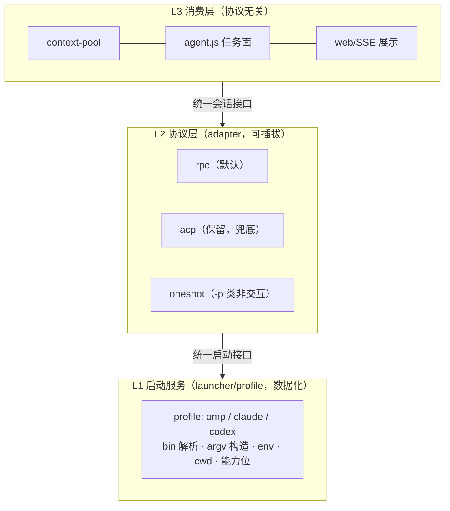

# 0022 开工前方案沟通记录（阶段 1 输入材料）

**日期**: 2026-09-14
**性质**: 用户原始表述 + 主 agent 实测证据 + 用户已裁决项 + 现状代码事实
**说明**: 本文件是 demand 角色的起点材料（「用户原始表述 / 迭代目标 / 草稿文本」），不是需求合同；需求结论由 demand 产出到 `demand.md`。

---

## 一、用户原始表述（逐字）

> omp 支持 rpc 模式：RPC 模式 — `omp --mode rpc`。启动特点：stdio 上的原生 JSON-RPC 服务器，先发 ready 帧再接受命令；是常驻服务，客户端关闭 stdin / 断开 / 进程中断才退出。`@file` 启动参数被拒绝，输入必须走协议。适合场景：把 omp 嵌入自研应用/服务，通过程序化协议驱动完整代理能力。
>
> 相比目前的启动，rpc 模式似乎更适合。我现在需要系统架构封装几个层面：
>
> 1. agent 的启动服务，我的希望之后能接入不同的客户端，比如 omp，claude，codex。此服务封装不同 agent 的启动，对外提供统一的接入。
> 2. agent 通讯协议支持，之后可以选择多协议。也就是有协议层封装，走什么协议都可以指定。比如我希望现在接入 rpc 协议（omp 客户端支持的 rpc 协议），hub 与 agent 之间通过 rpc 服务通讯（默认）。希望以后的修改对协议指定是零侵入的。
> 3. 请确认：rpc 协议的信息传递是否是双向；是否是流式。我的目标是希望看到 agent 执行过程的信息，也就是 hub 侧能展示 agent 的部分思考/运行过程。

后续追加指令：「请先与我沟通方案，然后使用 workflow-pb 的工作流开发」。

---

## 二、第 3 问的实测结论（一手证据，非文档转述）

探针脚本：`/tmp/oamp-rpc-probe.mjs`、`/tmp/oamp-rpc-gate-probe.mjs`（临时目录，未落仓库）。
真实执行 `omp --mode rpc`（`--model deepseek/deepseek-v4-flash`），事件时间线：

| 观测项 | 实测结果 |
|---|---|
| ready 帧 | 0.70s 到达：`{type:"ready", protocolVersion:1, supportedProtocolVersions:[1,2], maxFrameBytes:1048576, maxReassembledFrameBytes:67108864}` |
| v2 协议协商 | `negotiate_protocol{protocolVersion:2}` → `{success:true, data:{protocolVersion:2}}` |
| prompt 语义 | 1.01s 返回 `{command:"prompt", success:true}` —— **受理确认，不是完成**；完成信号是 `agent_end{isTerminal}` |
| 流式（文本） | `text_start` → `text_delta` × 138 → `text_end`；首个 `text_delta` 2.83s |
| 流式（思考） | `thinking_start` → **`thinking_delta` × 120** → `thinking_end`；首个 `thinking_delta` 2.71s（`set_thinking_level high` 生效） |
| 流式（工具） | `toolcall_start` / `toolcall_delta` × 23 / `toolcall_end`；`tool_execution_start` / `tool_execution_update` × 2 / `tool_execution_end`（工具执行中的部分输出增量） |
| 单轮帧量 | 一次 prompt 共 266 帧 `message_update`（约 3 秒内） |
| 双向（控制面） | 流式进行中发 `get_state` → 2.71s 收到 `response`（`success:true`）；即 stdin 在流式期间仍被持续处理 |
| 双向（中断式插话） | 流式中发 `steer` → 产生第二个 `agent_start` / `turn_start`（中断式插入一轮），证明运行中可干预 |
| 双向（反向请求） | 服务端主动发请求给 host：`extension_ui_request`（带 `id`，需 `extension_ui_response` 回执）；文档另有 `host_tool_call`→`host_tool_result`、`host_uri_request`→`host_uri_result` |
| **工具审批门上浮** | `extension_ui_request{method:"select", title:"Allow tool: bash\nCommand: echo hello-gate", options:["Approve","Deny"]}`（4.10s）→ host 回 `{type:"extension_ui_response", value:"Approve"}`（4.30s）→ 工具执行（4.35s `tool_execution_update` 输出 `hello-gate`） |

**结论**：RPC 是双向的（两个方向都具备「请求-应答」+ 事件通知）；是流式的（token 级增量，含思考与工具增量）；**思考过程可被 hub 消费**。

---

## 三、现状代码事实（主 agent 已核实）

| # | 事实 | 证据位置 |
|---|---|---|
| 1 | 目前只有一种 agent 接入方式：`omp acp`；**argv 构造与协议语义耦合在同一个类**（启动服务未独立） | `oamp/src/acp-client.js:137-145`：`['acp','--no-skills','--no-rules', --no-tools?, '--no-session', --model, --append-system-prompt, --approval-mode always-ask]` |
| 2 | **思考增量被协议客户端显式丢弃** —— 今天的 hub 侧看不到思考 | `oamp/src/acp-client.js:203`：`if (!update \|\| update.sessionUpdate !== 'agent_message_chunk') return;`（ACP 的 `agent_thought_chunk` 被过滤） |
| 3 | 三个执行路径（`omp-daemon` 常驻 / `omp -p` 一次性 / shell）的启动逻辑分散在任务面 | `oamp/src/agent.js`：`runDaemonTask` / `runOmpTask` / `runShellTask` |
| 4 | 上下文池直接 import 具体协议客户端，协议相关知识上浮到消费层 | `oamp/src/context-pool.js`：`import { AcpClient, AcpError } from './acp-client.js'`；池构造参数 `bin/tools/permission/roleFile` 一路穿透到 AcpClient |
| 5 | 换协议目前需要同时改动三处 | `context-pool.js` + `agent.js` + `acp-client.js` |
| 6 | 现有 ACP 权限门语义（allow/deny 档、确认收件箱依赖它） | `acp-client.js` `session/request_permission` 路径；迭代 0021 的确认收件箱与审计字段 `tool/title/option` 建立在此之上 |
| 7 | 现有「一次问答恰两条记录、过程不入库」边界 | `oamp/README.md`（0011 约定）：流式增量 / 心跳 / 日志**永不入库** |

**测试面现状**：`oamp/test/` 共 30 个测试文件，其中 `acp-daemon.test.js`(39.1KB)、`context-pool.test.js`(26.6KB)、`tool-permission.test.js`(47.5KB)、`confirmation-*.test.js` 与协议/权限门强相关。

---

## 四、用户已裁决项（`user_confirmed`，来自 2026-09-14 开工前裁决）

1. **本迭代范围**：做「抽象层 + omp rpc 落地」——L1 启动服务（profile）+ L2 协议层 adapter 接口 + omp 的 rpc 适配器落地（含权限门 / 思考 / 工具增量映射）；**claude 与 codex 只留 profile 结构与能力位，不做真实接入**。
2. **协议切换策略**：**rpc 默认 + acp 保留（双轨）**——默认走 rpc，配置可切回 acp 兜底；两条链路都要维护与测试。
3. **过程可视化范围**：**实时展示 + 不入库**——思考 / 文本 / 工具参数与输出的增量走运行时 SSE 通道展示（等价现有 `task_update` 语义），不落 SQLite，不改「一次问答恰两条记录」边界。
4. **一次性路径**：**纳入为 oneshot 适配器**——把 `omp -p` 一次性执行建模为 L2 的 oneshot 适配器（无会话语义）；shell 执行器保持独立、不纳入协议层。

---

## 五、主 agent 给出的分层建议（供 demand 参考，不作为结论）

- **L1 启动服务**：把「怎么起一个 agent 进程」数据化为 profile（bin 解析链、argv 构造、env、cwd、模型/角色/工具/权限入参），对外暴露 `startSession(profileId, opts) → handle`。
- **L2 协议层**：一个内部会话语义接口（`open / prompt(text,{onDelta,onThinking,onTool}) / cancel / close` + 反向请求回调 `onApprovalRequest / onUiRequest`），三个 adapter 实现；**协议选择点唯一**（一处配置）。
- **L3 消费层**：只依赖 L2 接口；协议能力差异以 capabilities 显式声明（`streaming / thinking / approvalGate / hostTools / introspection / queueControl`），缺能力时显式降级。

**「零侵入」的可验证判据（建议，待 demand/prd 定稿）**：
1. 消费层源码中不出现协议名（`'acp'` / `'rpc'`）与 argv 字面量；
2. 切换协议只改一处配置，消费层 diff 为零；
3. 新增一个 agent（claude/codex）只新增 profile，不改 L2/L3。

**现实校验（「统一接口」不空想）**：三个宿主的程序面都是 stdio JSON/NDJSON 流 —— omp `--mode rpc`（本次实测）；claude `-p --input-format stream-json --output-format stream-json --include-partial-messages`（双向 + 增量，本机 `claude --help` 可见）；codex `app-server`（JSON-RPC over stdio，自带 `generate-ts` / `generate-json-schema`，本机 `codex app-server --help` 可见）。差异在能力位，不在形态。

---

## 六、已知风险（需在需求/架构阶段落定，不能默认）

| # | 风险 | 影响 |
|---|---|---|
| R1 | RPC 审批门的**信息形状**与 ACP 不同（RPC 是 `select` + 文案 `Allow tool: bash\nCommand: …`；ACP 是结构化 `session/request_permission` 带 option/tool 字段） | 0021 的审计字段（`tool`/`title`/`option`）与确认收件箱在 RPC 下需重新映射；映射不当会功能退化 |
| R2 | 双轨（rpc 默认 + acp 保留）使协议相关测试面接近翻倍 | 迭代周期与维护成本 |
| R3 | 思考/工具增量进入 web 实时通道 | 触碰 0021 的 SSE 事件面与「过程不入库」边界（用户已裁决：展示但不入库） |
| R4 | 抽象层本身不改行为，但会移动大量代码 | 既有 30 个测试文件的回归面；`acp-daemon.test.js` / `context-pool.test.js` / `tool-permission.test.js` 可能因接口变更而需最小更新 |
| R5 | 规范/skill 版本漂移 | `.pb-agents/roles/`（副本）为 workflow-pb **v0.8.0**，skill `SKILL.md`(v1.6.0) 指向规范 v0.3.0，而 git 追踪的 `roles/workflow-pb/workflow-pb.md` 为 **v0.10.0**；本迭代按 v0.10.0「真源 = 被 git 追踪的内容」使用 `roles/` |

---

## 七、本迭代的迭代目标（一句话，待 demand 收敛）

把「启动 agent 进程」与「与 agent 通讯」两件事从现状（单协议、argv 与协议语义耦合、思考被丢弃）解耦为**可插拔的启动服务层 + 协议层**，并以 omp 的 rpc 协议作为默认链路落地，使 hub 侧首次能看到 agent 的思考与运行过程，同时保持既有权限门与确认收件箱语义不退化。
