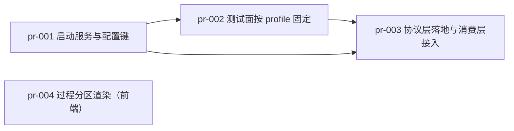

# pr-planner 第 1 轮记录 — 0022 阶段 4（PR 规划）

**角色**: pr-planner（`roles/pr-planner/pr-planner.md` v0.1.0）
**日期**: 2026-09-14
**输入**: `architecture.md` v0.2.0（799 行）、`prd.md` v0.2.0 + `prd/F01~F13*.md`（13 卡）、代码库现状（`<工作区地址>/oamp/**`，本轮**实读**，逐条带文件:行号）
**产出**: `prs/pr-001-launcher-and-protocol-config.md`、`prs/pr-002-test-face-profile-pinning.md`、`prs/pr-003-protocol-layer-and-consumption-cutover.md`、`prs/pr-004-stream-kind-partition-ui.md`、本文件

---

## 1. 判定标准（本轮用什么证据下判断）

- **依赖只认代码级证据**：共享符号 / 接口 / 文件引用三选一，逐条带 `文件:行号` 或可复跑检索式；读不到证据就不写依赖（`depends_on` 里 4 条边全部带证据，见 §3）。
- **PR 粒度的下限 = 能独立合并**：每个 PR 单独落到迭代分支后，既有测试面必须保持绿（否则该 PR 的验收无法独立判断）。这一条被用来**否决**了「按文档章节顺序切三层」的朴素拆法（§4）。
- **文件范围不重叠**：同一文件不得出现在两个 PR 的文件范围里；同一 PR 内不重复列同一文件。
- **不自行推断路径/迭代 ID**：全部输入路径取自派发简报。

---

## 2. 交付物与覆盖

| PR 文件 | 主题 | 文件数（生产 / 测试 / 文档） | batch |
|---|---|---|---|
| `pr-001-launcher-and-protocol-config.md` | L1：`launcher.js`（profile + 唯一 argv 构造 + spawn）+ `config.js` 第 4 键 | 1 新建 / 1 修改；1 测试修改 | 1 |
| `pr-002-test-face-profile-pinning.md` | 既有 harness 测试面按 profile 显式化（协议注入固定 `acp`） | 0 生产改动；4 测试修改 | 2 |
| `pr-003-protocol-layer-and-consumption-cutover.md` | L2：标准面 + 唯一注入点 + 三实现；L3：消费层接入（默认 rpc） | 3 新建 / 3 修改；3 测试修改 + 2 测试新建 + README | 3 |
| `pr-004-stream-kind-partition-ui.md` | 前端 `task_update` 按 `kind` 分区渲染（既有气泡内） | 0 生产后端改动；`web/app.js` 修改 | 1 |

### 功能点覆盖（13/13）

| 卡 | 承载 PR | 卡 | 承载 PR |
|---|---|---|---|
| F01 | pr-001（验收 2/3/4）、pr-003（验收 1） | F08 | pr-004（验收 1/2/4 界面面）、pr-003（验收 3 不入库 + 管道面） |
| F02 | pr-003（全部） | F09 | pr-003（全部） |
| F03 | pr-003（验收 1~3）、pr-002（验收 4 适用范围） | F10 | pr-001（新增配置面不改服务边界）+ pr-003（承载） |
| F04 | pr-003（全部） | F11 | pr-003（承载；逐 PR diff 复核） |
| F05 | pr-003（全部） | F12 | pr-001（验收 1/2）、pr-003（承载） |
| F06 | pr-003（全部）、pr-002（验收 1 的回归面） | F13 | pr-001（验收 2：不与 `instances[]` / 集群配置合并） |
| F07 | pr-003（全部） | — | — |

### 保证项 F10~F13 的承载安排（**未派生独立 PR**；架构面零改动）

| 卡 | 承载 PR | 验收安排 |
|---|---|---|
| **F10** 服务边界不变 | pr-001（唯一可能被误读为「新服务面」的改动 = 新增配置面） | 逐 PR 复核 `git diff --stat`：不含 `oamp/web.js` 的监听 / 鉴权面；`protocol` 是**进程内配置**（`config.json` + env），不新增 HTTP 接口 ⇒ `API.md` / `llms.txt` 零改动 |
| **F11** 上游零改动 | pr-003（唯一消费 omp 子进程协议面的 PR） | 逐 PR 复核 diff 不含 `omp/**`；本迭代所需能力可全部回指既有实测 M-1~M-5（无「需 omp 新增字段」前置项） |
| **F12** 零依赖 | pr-001（`launcher.js` 只用 `node:*`）、pr-003（3 个新文件同） | 每次合并后 `oamp/test/hygiene.test.js` 的 `dependencies === {}` 断言保持绿；`package.json` 零改动 |
| **F13** 不做 OAMP Router | pr-001（profile 表与该文 `instances[]` / `oamp/src/cluster-config.js` 的 `roles` 段不合并） | `oamp/src/router.js`（`VALID_TYPES` 封闭 4 类）与 `oamp/src/cluster-config.js` 零改动；两者可各自读到 |

---

## 3. `depends_on` 逐条证据（代码级）

| 边 | 证据（可复跑） | 为什么不是「文档顺序」 |
|---|---|---|
| pr-002 → pr-001 | ① 期望值真源 = `oamp/src/launcher.js` 的 `PROFILES`（architecture §9.4.1 B-11~B-15 明文「按 profile 期望值断言」）；② 注入键 `OAMP_PROTOCOL` 由 pr-001 的 `oamp/src/config.js` 交付 | 断言直接引用 pr-001 产出的表 / 键；pr-002 的判据在 pr-001 之前无法成立 |
| pr-003 → pr-001 | ① 三实现模块的启动面 = `launcher.js` 的 `PROFILES` + argv 构造 + spawn（architecture §3.3 明文「`rpc-client.js` 的 import 只有 `node:*` / `protocol.js` / `launcher.js`」、§3.2 组件图 `L1 --> R / AC / OS`）；② 解析链第 2/3 层取值 = `config.js` 的 `protocol` 键 | 现在的 `oamp/src/acp-client.js:137-144` 与 `oamp/src/agent.js:190-199` 各自拼一份 argv（G2/G3）——归一后的唯一真源在 pr-001 |
| pr-003 → pr-002 | 4 个 harness 测试文件的 fake omp 桩**只实现 ACP JSON-RPC**：`oamp/test/acp-daemon.test.js` 的 `FAKE_ACP_SOURCE` 按 `msg.method === 'initialize' / 'session/new' / 'session/prompt'` 分支（`:27-118`），无 `-p` 时即 ACP 形态；默认切 rpc 后这些进程会被以 `--mode rpc` 启动并收到 `{id,type:'prompt'}` 帧 ⇒ 永不回包 ⇒ 整组失败 | 不是偏好顺序：不先固定 `OAMP_PROTOCOL='acp'`，pr-003 合并即打破既有面（`web.test.js:627` 的 `kind === 'chunk'`、`call-protocol.test.js:757` 的 `kind ∈ {chunk,stdout,stderr}`、`context-pool.test.js` 的 `argv[0] === 'acp'` 等断言随链路形态失效） |
| pr-004 → （无） | `oamp/web/app.js` 只读 SSE 帧的 `kind` / `text` / `line`；`oamp/src/web.js:1626-1632` 的 `task.update` 分支零改动、原样透传 | 找不到共享符号 / 接口 / 文件 ⇒ 无依赖（不写「可能有隐性依赖」） |

---

## 4. 本轮最重要的结论：L2 + L3 是**一个不可再拆**的合并单元

派发简报要求核实「L2 标准面 → 三个实现 → 消费层改造」的先后。**代码事实是：这三段不能各自独立合并**，朴素按层拆法会产生三个互相打破的半成品 PR。三条证据边：

1. **实现 ↔ `protocol.js` 互有 import（同一 PR 才能同时存在）**
   - architecture §3.3 明文：`src/protocol.js`「全仓 `grep`：只有本文件 import 三个实现模块」；`src/rpc-client.js`「文件的 import 只有 `node:*` / `protocol.js` / `launcher.js`」。
   - ⇒ 三实现取 `ProtocolError` / `CAPABILITY_KEYS` 需 `protocol.js` 已存在；`protocol.js` 装配三实现需三者已存在。任一先落地都会让另一侧 import 失败。

2. **`onDelta` 是一条跨三文件的签名链（改一侧必改另两侧）**
   - 现状 `onChunk`：`oamp/src/acp-client.js:191`（形参）→ `:207`（调用 `onChunk(content.text)`）→ `oamp/src/context-pool.js:150`（`prompt(..., onChunk)` 形参）→ `:157`（入队）→ `:186`（`client.prompt(..., {onChunk: turn.onChunk})`）→ `oamp/src/agent.js:396`（`onChunk: (text) => sendUpdate('working', {kind:'chunk', text})`）。
   - architecture §9.2 B-8② 要求 `acp-client` 统一外观为 `onDelta({kind,text})` ⇒ 该改名必然连带 `context-pool.js` 与 `agent.js`；若只改 `acp-client`，既有流式面**静默失效**（`context-pool` 传的 `onChunk` 被忽略），`oamp/test/acp-daemon.test.js:404`（终态前 ≥2 增量）与 `oamp/test/web.test.js:624` 会红。

3. **`ContextPool` 的构造契约只有 `agent.js` 一个生产调用方（改契约必连带）**
   - `oamp/src/context-pool.js:203`（`new AcpClient(...)`）→ 注入会话工厂后，构造参数集合变化；唯一生产调用点 = `oamp/src/agent.js:698-712`（`new ContextPool({max, bin, cwd, logger, onNotice, onPermissionRequest, role, roleFile, tools, permission})`）；直接 import `ContextPool` 的测试只有 `oamp/test/confirmation-roundtrip.test.js:20`（`:319` / `:354` / `:386` 三处构造）。

⇒ 传递闭包 = `{protocol.js, rpc-client.js, oneshot-client.js, acp-client.js, context-pool.js, agent.js}`，即 **pr-003 的全部生产文件**。补充核实（简报四点）：

- **launcher 与 protocol 是否可各自独立落地**：launcher **可以**（pr-001 无消费方、行为零变更）；protocol **不可以**（它 import 三实现，而三实现 import launcher ⇒ protocol 严格依赖 launcher + 三实现同时在场）。
- **acp-client 改造是否必须以 `protocol.js` 存在为前提**：**是**（错误类型 `ProtocolError` 与能力位键集 `CAPABILITY_KEYS` 都下沉在 `protocol.js`，见 §5.1/§5.7 与 §9.2 B-8③）。
- **oneshot-client 是否依赖 launcher 的 argv 构造**：**是**（architecture §5.2 的 `omp:oneshot` profile 承载 `modeArgs:['-p']` / `input:'positional'` / `approval:{mode:'yolo',appliesWhen:'always'}`；§3.2 组件图 `L1 --> OS`）。

---

## 5. 文件范围无重叠（机器核对）

| 文件 | pr-001 | pr-002 | pr-003 | pr-004 |
|---|---|---|---|---|
| `oamp/src/launcher.js`（新建） | ✕ | | | |
| `oamp/src/config.js` | ✕ | | | |
| `oamp/src/protocol.js`（新建） | | | ✕ | |
| `oamp/src/rpc-client.js`（新建） | | | ✕ | |
| `oamp/src/oneshot-client.js`（新建） | | | ✕ | |
| `oamp/src/acp-client.js` | | | ✕ | |
| `oamp/src/context-pool.js` | | | ✕ | |
| `oamp/src/agent.js` | | | ✕ | |
| `oamp/web/app.js` | | | | ✕ |
| `oamp/web/style.css`（条件） | | | | ✕ |
| `oamp/README.md` | | | ✕ | |
| `oamp/test/config-file.test.js` | ✕ | | | |
| `oamp/test/acp-daemon.test.js` | | ✕ | | |
| `oamp/test/context-pool.test.js` | | ✕ | | |
| `oamp/test/project-workspace.test.js` | | ✕ | | |
| `oamp/test/call-protocol.test.js` | | ✕ | | |
| `oamp/test/web.test.js` | | | ✕ | |
| `oamp/test/confirmation-roundtrip.test.js` | | | ✕ | |
| `oamp/test/tool-permission.test.js` | | | ✕ | |
| `oamp/test/protocol-layer.test.js`（新建，B-16） | | | ✕ | |
| `oamp/test/zero-intrusion.test.js`（新建，B-17） | | | ✕ | |

每个 ✕ 恰一个 → **无重叠**（21 个文件 / 每文件恰 1 个归属）。

### 依赖图（无环）

拓扑序：`pr-001 → pr-002 → pr-003`，`pr-004` 独立（可与 pr-001 并行）。4 条边、无回边 ⇒ **无环**。

---

## 6. 与 `architecture.md` 的差异（均为代码现状发现，**未修改架构文件**）

| # | 架构写法 | 代码现状 | 本轮的处置 |
|---|---|---|---|
| 1 | §9.4.1「既有测试面最小更新（**6 文件**）」未列 `oamp/test/config-file.test.js` | `oamp/test/config-file.test.js:36-49` 对 `loadConfig` 的整体返回值做**全对象** `assert.deepEqual`（键集合精确匹配）⇒ `config.js` 新增第 4 键必然打破该断言 | 纳入 **pr-001** 的文件范围（最小更新：补 `protocol` 键） |
| 2 | §9.4.1 的 6 个文件里未含 `oamp/test/call-protocol.test.js` | 该文件经 `OAMP_OMP_BIN` 注入 ACP 形态 fake（`:301`），并以 `FAKE_ACP_MEMORY` / `FAKE_ACP_SESSION_ECHO` 依赖常驻链路（`:1003`）；另 `:757` 断言 `call_update.kind ∈ {chunk,stdout,stderr}` | 纳入 **pr-002** 的文件范围（不修则默认切 rpc 后该文件整组失败） |
| 3 | §9.4.1 的 6 文件之一 `tool-permission.test.js`（B-13）与 §9.4.1 的另 5 文件并列 | 该文件**直接 import `AcpClient`**（`:12`）而非经 harness，其 argv 断言与错误类型断言（`:441`）随 `acp-client` 本体的改造而变（argv 来源、`ProtocolError`） | 从「按 profile 固定」这一批里**移出**，归 **pr-003**（与 `acp-client` 的改造同一个 PR 内改一次到位；否则同一文件会横跨两个 PR） |
| 4 | §9.3 把 `oamp/web/style.css` 列为「零改动（除非过程块需要样式：**需在实现阶段确认**）」 | 现状 `oamp/web/app.js:421` 的气泡由 `app.js` 渲染，过程分区可复用既有 class 组合 | 在 **pr-004** 的文件范围里登记为**条件文件**并注明判据（见 §7 疑问 4） |

以上第 1~3 项是「测试面清单少列 / 归属需要重新指派」，**不是**功能规格与技术约束的冲突；产品维度与架构决策零触碰。

---

## 7. 交主 agent 决定的疑问（本轮不自行拍板）

1. **一次性路径的过程增量 `kind` 取值（影响面最大的一条）**
   - 事实：架构 §3.4 流 3 写作「子进程 stdout 行流 → `onDelta{kind:'chunk', text:line}`」；但**现状**是一次性路径以 `kind:'stdout'` / `'stderr'` + `line` 上报（`oamp/src/agent.js` 的 `sendLine('stdout')` / `sendLine('stderr')`），且 `oamp/src/web.js:1628` **只对 `kind === 'stdout'`** 累积 `entry.lines`；§5.5 又写「既有 `chunk`（文本，语义不变；shell / 一次性路径已在用 `stdout`/`stderr`）」。
   - 两种读法与后果：**(a) 保持 `stdout`/`stderr`**（本轮的取法，已写入 pr-003 的验收「一次性路径的既有可见面零回归」）⇒ 零行为变更、`oamp/test/omp-executor.test.js:116` 与 `oamp/test/context-pool.test.js:512` 不受影响。**(b) 改为 `chunk`** ⇒ `entry.lines` 不再累积、`out` 明细形态变化，且 `oamp/test/omp-executor.test.js`（PR 未列）与 `oamp/test/context-pool.test.js`（pr-002 已归属）会连带需要改动，**文件归属矩阵需重排**。
   - 建议：取 (a)（与 N12 / A4 的「不顺手改行为」一致）。若采 (b)，请指示，本轮将把 `oamp/test/omp-executor.test.js` 一并纳入 pr-003 的文件范围。

2. **B-14「默认路径断言语义反转」的落字口径**
   - 架构 §9.4.1 B-14：「`oamp/test/web.test.js:557-574` 默认路径『应起 acp 常驻进程』→ 改为断言 profile 期望 argv（默认 rpc 后**语义反转**）」。两种落地：(a) 该用例显式注入 `OAMP_PROTOCOL='acp'` 后断言 `omp:acp` 期望 argv（本轮的取法：把「内置默认就是 acp」的隐式前提显式化），**另在** `test/protocol-layer.test.js`（B-16）里断言「默认 ⇒ `--mode rpc`」；(b) 让该用例真的跑默认 rpc 路径 ⇒ 其 ACP 形态 fake 桩必须扩写为 rpc 形态（超出 A5 的「最小更新」刻度，且会把改动面铺回 pr-002 归属的文件）。
   - 建议：取 (a)。若主 agent 判定必须 (b)，请指示——受影响文件仍在 pr-002 / pr-003 的既有边界内，只是 pr-003 的工作量增加。

3. **pr-002「测试面按 profile 显式化」是否独立成 PR**
   - 本轮给了独立成 PR 的方案（职责单一、零生产改动、可与 pr-001/004 并行、把「隐式默认 = acp」这一陈旧假设清掉），代价是多一次合并与一条 `pr-003 → pr-002` 的测试面依赖边。
   - 备选：把 pr-002 的 4 个文件并入 pr-003（则删去 pr-002，`pr-003 → pr-002` 一条边消失，pr-003 的文件数由 15 增至 19）。
   - 建议：保留独立 PR（合并单元更小、失败定位更准）。若主 agent 更看重合并次数，按备选收合即可，无需重做判断。

4. **`oamp/web/style.css` 是否纳入 pr-004**
   - §9.3 已把它登记为「实现阶段确认」项。本轮在 pr-004 的文件范围里标为**条件文件**（仅在过程分区需要新样式时才纳入；`index.html` 明确零改动）。请主 agent 在阶段 5 派发时确认是否需要在 PR 文件里把它改为确定项。

5. **`claude:*` / `codex:*` profile 结构项的形状**
   - §5.2 只给「仅保留结构与能力位」（N1 / R6）。pr-001 的验收按「结构与能力位在场、无真实接入链路」判；**具体键值不在本轮判定**（属阶段 5 实现面），此处仅登记以免被读成缺口。

---

## 8. 越界声明

- 本轮**只写入**两处：`docs/iterations/0022-agent-launcher-and-protocol-layer/prs/**`（4 个 PR 文件）与 `docs/iterations/0022-agent-launcher-and-protocol-layer/clarifications/2026-09-14-pr-planner-round1.md`（本文件）；一切写入以**工作区地址**为根、按绝对路径寻址。
- **未修改** `architecture.md` / `prd.md` / `prd/*.md` / `demand.md` / `status.md` / `history.md` / `progress.md` 与 `clarifications/` 下的既有文件（只读）。
- **未执行任何 git 写操作**（无 commit / branch / worktree / checkout / add / stash）；**未创建** PR worktree 或分支。
- **未触碰** `oamp/**`（代码库只读）与 `omp` / harness 侧任何文件。
- **未产出**全局 `tasks.md`，**未做**单 PR 内部的任务拆解（阶段 5 由各 PR 子 agent 内的 planner 完成）。
- 依赖图**无环**（§5），故未触发「有环立即上报」路径；未发现功能规格与技术约束之间的根本冲突（§6 的三项差异均为测试面清单与归属问题，已按代码现状处置并登记）。
