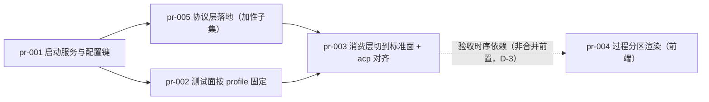

# pr-planner 第 2 轮记录 — 0022 阶段 4（PR 规划 · Gate 未通过后的返工）

**角色**: pr-planner（`roles/pr-planner/pr-planner.md` v0.1.0）
**日期**: 2026-09-14
**轮次性质**: 阶段 4 返工（**只做重划与偏差修正，不重做全套规划**）
**主输入**: `clarifications/verify-stage4-gate-20260914.md`（FAIL：pr-003 的 A1 / A2；证据 E-1~E-6；偏差 D-1~D-5）
**其余输入**: `prs/pr-001~pr-004*.md`（待修订）、`architecture.md` v0.2.0（只读）、`prd/*.md`（13 卡，只读）、代码库 `<工作区地址>/oamp/**`（本轮**实读**，逐条带文件:行号）
**产出**: 修订后的 `prs/pr-003-protocol-layer-and-consumption-cutover.md`（重划为「切换子集」）、**新增** `prs/pr-005-protocol-layer-and-injection-entry.md`（「加性子集」）、按 D-2 / D-3 / D-4 修正 `prs/pr-001` / `prs/pr-002` / `prs/pr-004`、本文件
**未改动**: `architecture.md` / `prd/*.md` / `demand.md` / `status.md` / `history.md` / `progress.md`（只读；D-1 的架构回填由主 agent 处置）

---

## 1. 重划结论（before → after）

| 项 | 第 1 轮 | 第 2 轮（本轮） |
|---|---|---|
| pr-003 | 协议层落地 + 消费层接入 + 3 测试修改 + 2 测试新建 + README（6 生产模块 / 5 测试 / 1 文档；涉及 12 张卡；18 条验收横跨 5 个关注面） | **切换子集**：`acp-client.js` / `context-pool.js` / `agent.js` + `web.test.js` / `confirmation-roundtrip.test.js` / `tool-permission.test.js` / `zero-intrusion.test.js`（新建）/ `README.md`（3 生产 + 3 测试修改 + 1 测试新建 + 1 文档；单一事务 =「把消费层切到标准面」） |
| pr-005（新增） | — | **加性子集**：`protocol.js` / `rpc-client.js` / `oneshot-client.js`（3 新建）+ `protocol-layer.test.js`（新建）；零消费方、行为零变更 |
| pr-001 / pr-002 / pr-004 | 原样 | 文件名与编号不变，仅按 D-2 / D-3 / D-4 修正措辞（pr-001 另修「三实现归谁」的归属句） |

- **编号与文件名的处置**：pr-003 **保留原编号与原文件名**（已被 `status.md` 与 Gate 报告引用；其 H1 已改为真实内容，顶部加「本轮重划说明」一行以免文件名误导）；新的加性子集按 NNN 递增取 **pr-005**（与现有 001~004 不冲突）。
- 重划**只动 PR 边界与依赖**，不动任何功能规格、技术决策与实现口径；pr-005 的验收面整体取自原 pr-003 的既有条目（未新增规格）。

---

## 2. fail 的两条证据如何被消除（逐条）

### 2.1 A1 逻辑原子性（fail → 期望 pass）

**原 fail 的论证面**（Gate 报告 A1 段）：该 PR 自述即**两个交付物**（协议层落地 / 消费层接入），文件范围 = 6 个生产模块 + 5 个测试 + 1 文档，涉及 12/13 张卡，18 条验收横跨 5 个互不相同的关注面（RPC 帧语义 / 既有 ACP 零回归 / 池接线 / 一次性路径 / CLI + 文档）；其自述的「不可再拆」论据（互有 import + `onDelta` 跨三文件签名链）**在代码层成立但只覆盖 `{protocol.js, acp-client, context-pool, agent}` 子簇**，对 `rpc-client.js` / `oneshot-client.js` / `--protocol` flag / `README.md` / 5 个测试文件不构成约束。

**本轮的消除方式**：

1. **子簇被完整识别并各自成 PR**：`{protocol.js, rpc-client.js, oneshot-client.js}` 是**新建面**（零消费方：`oamp/` 全仓对这三个模块名零命中 = Gate E-1），`{acp-client.js, context-pool.js, agent.js}` 是**改造面**（互有 import 与签名链 = Gate E-4 的代码实测）。两个子集**不相交**，各自成 PR。
2. **pr-005 的内部粘合**：`protocol.js` ↔ 两实现是同一批新建（ESM 循环导入、互取 `ProtocolError` / `CAPABILITY_KEYS`），且两实现的 argv 经同一份 L1 profile ⇒ 三者必须同批（§3.3 的「只有 `protocol.js` import 三个实现模块」）。
3. **pr-003 的内部粘合**（把原「不可再拆」论据收窄到它真正约束的范围）：`oamp/src/acp-client.js:191`（`onChunk` 形参）→ `:207`（`onChunk(content.text)`）→ `oamp/src/context-pool.js:150` / `:157` / `:186`（透传）→ `oamp/src/agent.js:396`（`onChunk: (text) => sendUpdate('working', {kind:'chunk', text})`）是一条**打破式**签名链；错误类型同理（`acp-client.js:42-48` 的本地 `AcpError` 类 ↔ `context-pool.js:7` 的 import 与 `:151` / `:251` 的 `instanceof AcpError`；`oamp/test/tool-permission.test.js:12` 直引 `AcpClient`、`:441` 断言 `err.name === 'AcpError'`）。改一侧必须改其余 ⇒ 这四个文件（含直引测试）同批。
4. **结果**：每个 PR 的文件范围落在**同一层、同一心智模型**内（pr-005 = 新面自证；pr-003 = 一次性切除旧面、切到新面），不再有「新建 + 改造 + 文档 + 5 套验收」的混合单元。

### 2.2 A2 可审查性（fail → 期望 pass）

**原 fail 的论证面**：审查者须同时持有 5 套心智模型（RPC 帧映射 / ACP 遗留行为保持 / 池接线 / 一次性路径 / CLI + 文档），18 条验收标准即这 5 套模型的混合判据。

**本轮的消除方式**（按模型分配到承载 PR）：

| 原混合模型 | 现在归属 | 审查者需要的模型 |
|---|---|---|
| RPC 帧 → 增量 / 终态 / 取消 / 重组 | **pr-005**（`rpc-client.js` + `protocol-layer.test.js`） | 「新面：标准面定义 + rpc 帧映射」（单一） |
| 一次性执行（oneshot 无会话语义 / 行流回收） | **pr-005**（`oneshot-client.js`）+ pr-003（消费侧接入后的零回归） | 同上；消费侧只判「可见面不变」 |
| 能力位声明（F09） | **pr-005**（rpc / oneshot 两实现）+ **pr-003**（acp 实现 + 消费层零能力分支） | 各 PR 只判自己交付的实现 |
| ACP 遗留行为保持（不退化 / 不补能力） | **pr-003**（`acp-client.js` + `tool-permission.test.js`） | 「把 acp 摆到标准面上，行为不动」（单一） |
| 池接线（注入会话工厂 / `ProtocolError`） | **pr-003**（`context-pool.js` / `agent.js`） | 「消费层切到注入面」 |
| CLI flag + README | **pr-003**（`agent.js` / `README.md`） | 同一次切换的对外可见面 |

分配后，pr-003 的验收条目仍跨「acp 对齐 / 消费层零侵入 / 默认切换 / 一次性零回归 / CLI / 文档」数个面，但**它们是同一次切换的六个可见切面**（同一心智模型：把消费层从「直接绑 acp」切到「注入面 + 默认 rpc」），不再包含「新面本身的定义与帧语义」——后者正是原 PR 的另一半交付物，现已独立。

---

## 3. 为什么这个切法是**被代码强制**的（而不是选择）

本轮复核了三种可能的切法，只有一种不产生「红面被推到别的 PR」或「循环依赖」：

| 候选切法 | 结论 |
|---|---|
| ① 按「L2 标准面 / 三实现 / L3 消费层」切三层 | **不可行**：实现取 `ProtocolError`（在 `protocol.js`）、`protocol.js` 装配三实现 ⇒ 谁先落地都让另一侧 import 失败；且三实现撤走 L1 的 argv 后无人构造 argv（round1 已否，本轮复核不变） |
| ② 把 `acp-client.js` 的加性部分（能力位 / argv 经 L1）放进加性 PR，把 `onChunk`→`onDelta` 与 `AcpError`→`ProtocolError` 留给切换 PR | **不可行**：`onDelta` 是**打破式**签名变更（`context-pool.js:186` 透传 `onChunk`，`acp-client.js:207` 主动调用）——只改一侧会让既有流式面**静默失效**（`acp-daemon.test.js` 的「终态前 ≥2 增量」、`web.test.js:627` 的 `kind === 'chunk'` 变红）⇒ 加性 PR 自己就过不了验收。若同时保留 `onChunk` 与 `onDelta`，则是在同一迭代内留双份外观（违反「统一外观」，且是 clean-cutover 明令禁止的过渡别名） |
| ③ **加性子集 = 新建三模块 + 自证用例；切换子集 = acp 对齐 + 消费层补偿**（本轮采纳） | **可行**：加性子集零消费方（E-1）⇒ 落地不改变任何运行路径、既有 29 个测试文件零改动即全绿；切换子集的打破关系被完整地关在它自己的文件集合内（`acp-client.js` + `context-pool.js` + `agent.js` + 直引测试） |

**必须如实登记的一点（不假装两个 PR 都是「完整的标准面交付」）**：pr-005 落地时 `oamp/src/protocol.js` 的 **acp 分支是装配直通**——`AcpClient` 今天**还**没有 `capabilities` / `capabilityNotes`、**还**用 `onChunk`、**还**抛 `AcpError`。因此：

- pr-005 **只**对 acp 断言「选择与进程面」（指定 acp ⇒ 子进程 argv 首段 = `acp`，今天即成立，且 pr-003 落地后仍成立——argv 由 L1 的 `omp:acp` profile 复现同一字面值）；
- acp 会话对象的**标准面外观**（能力位 / notes / `onDelta` / `ProtocolError`）与「消费层零侵入」在 pr-003 内一次性成立，其断言落在 pr-003 的 `oamp/test/tool-permission.test.js`（该文件 `:12` 直引 `AcpClient`，是 acp 单实现的最短判定面）；
- `protocol.js` 对 acp 的装配形态是**最终形态**（`new AcpClient({…})` 直通），pr-003 **不需要**回头改 `protocol.js`（§9.2 B-8 的变更项不含构造签名、不含选择逻辑）⇒ 无文件范围重叠、无「先写后删」的过渡代码。

**为守住这条边界，pr-005 写入了两条带代码证据的边界稳定约束**（见 pr-005 文件范围段）：

1. **门名解析原语不得从 `acp-client.js` 引入**：`readApprovalToolName` 现为模块**私有**（`oamp/src/acp-client.js:30-34` 无 `export`，仅在 `:567` 内部使用）⇒ ESM 命名导入会在**链接期**失败；且 `acp-client.js` 归 pr-003，依赖其新增导出即成为 `pr-005 → pr-003` 的反向边（与 `pr-003 → pr-005` 成环）。故原语由 `protocol.js` 自持（或 `rpc-client.js` 内自持），pr-003 删除 `acp-client.js` 内的重复定义改为引用同一份（architecture §5.6 明确「RPC 与 ACP 审批门**同源**」，只留一份是既定口径）。
2. **`AcpClient` 构造入参集合在本 PR 内固定**：现状 `oamp/src/context-pool.js:203` 的 `new AcpClient({bin, model, cwd, logger, tools, permission, roleFile, onPermissionRequest})` 即注入点装配 acp 的入参面。

---

## 4. D-1~D-5 逐条处置

| # | 处置 | 落点（可核） |
|---|---|---|
| **D-1** | `oamp/test/call-protocol.test.js` **保持属测试面**（归 pr-002 固定，不由 pr-003 修改）；并在 pr-002 与 pr-003 两处登记**正确实测口径**：`architecture.md` §9.4.1 的「既有测试面 · 最小更新」列 **6** 文件，**实测应为 7** —— 测试面 ACP-only 桩文件全集 = `acp-daemon` / `call-protocol` / `confirmation-roundtrip` / `context-pool` / `project-workspace` / `tool-permission` / `web`（Gate E-6 实测；round1 §6 的同一发现）。**未改 `architecture.md` 本体**（回填由主 agent 处置） | `prs/pr-002-…md`「文件范围」的 `call-protocol.test.js` 条目下「D-1 登记」子条；`prs/pr-003-…md`「零改动」段的「测试面口径登记（D-1）」段 |
| **D-2** | 删除 pr-002 验收标准第 2 条的「或与之一致的显式期望数组」替代写法，**锁定为「直接引用 pr-001 的 `PROFILES` 表」**（并在 `depends_on` 里同步登记依赖强度已锁定 + 现状真源行号）。是否保留退路：**不保留**——代码复核后无需退路：`PROFILES['omp:acp']` / `PROFILES['omp:oneshot']` 的期望值可由 profile 表直接推导（§5.2），而「本地复写一份一致数组」没有任何技术必要性，只会让依赖在实现层可被绕过 | `prs/pr-002-…md` 验收标准第 2 条 + `depends_on` pr-001 条 |
| **D-3** | 在 pr-004 的 `depends_on` 段内**显式登记验收时序依赖**（与合并前置区分、**不进** `depends_on`、不新增第八字段）：F08 验收 1 的端到端形态在**验收复核时序**上依赖 pr-003（本轮重划后把常驻链路切到 rpc 的那一步），并写明阶段 6 复核清单的用法（不得在本 PR 单独合并时判其端到端面通过）；同时给出「本 PR 验收标准 1~5 仍可独立判定」的判定法依据（第 2 条用浏览器控制台直调 `handleEvent`） | `prs/pr-004-…md` `depends_on` 段的第二条引用块 |
| **D-4** | 「其余 **30** 个测试文件」口径更正为实测 **29**（相对表述 + 数字并列）：pr-001 = 29 − 1（`config-file.test.js`）= **28**；pr-002 = 29 − 4 = **25**；两处均注明 `oamp/test/` 下 `.js` 共 31（另含 `helpers/harness.js`、`helpers/fake-node.js`） | `prs/pr-001-…md` 验收标准末条；`prs/pr-002-…md`「零改动」段 |
| **D-5** | **由本轮拆分自然消除**，无需额外动作：pr-003 自述的「不可再拆的合并单元」命题已删除；其**成立的内核**（`acp-client.js` ↔ `context-pool.js` ↔ `agent.js` 的打破式签名链）收窄为 pr-003 的**内部**同批理由（§2.1 第 3 点），不再被用来覆盖 `rpc-client.js` / `oneshot-client.js` / `--protocol` flag / `README.md` / 5 个测试文件 | `prs/pr-003-…md` 上下文摘要 + 顶部重划说明（原「不可再拆」句已不存在） |

另：round1 在 pr-003 正文引用过的 `clarifications/2026-09-14-pr-planner-round1.md §3`（Gate 判定为**执行过程材料**、不作依据）**已从修订后的 pr-003 中移除**；pr-003 的依赖理由改为直接给代码锚点（`acp-client` / `context-pool` / `agent` 的符号替换面）。

---

## 5. 依赖图重算（逐条附代码级证据）

| 边 | 代码级证据（可复跑 / 可指行） | 为什么不是文档顺序 |
|---|---|---|
| **pr-005 → pr-001** | ① argv 唯一来源：§3.3 白名单「`rpc-client.js` 的 import 只有 `node:*` / `protocol.js` / `launcher.js`」，§9.1 B-1 判据「`-p` 与 `--mode rpc` 的 argv 均出自本模块」；② 解析链第 2/3 层取值 = pr-001 的 `oamp/src/config.js` 第 4 键 `protocol`（§5.3）；③ 现状两处 argv 生产点 `oamp/src/acp-client.js:137`（`['acp','--no-skills','--no-rules']`）与 `oamp/src/agent.js:190-199`（`['-p','--no-session']`）在本 PR 内改为只经 L1 产出 | `launcher.js` 与 `config.js` 的 `protocol` 键是**被 import / 被读取的符号**；pr-001 未合并时这两处 import 与解析链取值都不存在 |
| **pr-003 → pr-005** | 本 PR 直接引用 `oamp/src/protocol.js` 的三个符号：`ProtocolError`（`acp-client.js:42-48` 的本地类定义即替换面；`context-pool.js:7` 的 import 与 `:151` / `:251` 的 `instanceof AcpError` 判定即判定面）、`CAPABILITY_KEYS`（acp 能力位键集）、`createProtocolLayer()`（`agent.js:698` 的 `new ContextPool({…})` 构造面改为注入其产物） | 三个符号只存在于 pr-005 新建的文件里；pr-005 未合并时本 PR 的 import 目标不存在 ⇒ 判据无法成立 |
| **pr-003 → pr-002** | 4 个 harness 测试文件的 fake omp 桩**只实现 ACP JSON-RPC**（`FAKE_ACP_SOURCE` 按 `msg.method` 分支）；默认切 rpc 后它们被以 `--mode rpc` 启动、桩永不回包 ⇒ 整组失败。可指断言：`oamp/test/call-protocol.test.js:757`（`['chunk','stdout','stderr'].includes(u.data.kind)`）、`oamp/test/context-pool.test.js` 的 `argvs.find((a) => a[0] === 'acp')` 与一次性 / 常驻 argv 断言（`:506-534`）、`oamp/test/acp-daemon.test.js:546`（`devArgv = readJsonl(devArgs).find((a) => a[0] === 'acp')`） | 不先固定 `OAMP_PROTOCOL='acp'`，pr-003 一合并即打破既有测试面（真实红面，不是偏好） |
| **pr-003 → pr-001** | `oamp/src/acp-client.js:137` 现状 argv 字面量改经 L1 的 `omp:acp` profile（`PROFILES` + `buildArgv` 由 pr-001 交付，§3.3 判据「生产消费层的 import 图中不出现 argv 知识」）；解析链第 2/3 层取值 = pr-001 的 `config.js` 第 4 键 | 同上：pr-001 是 argv 与 `protocol` 键的代码产出方 |
| **pr-002 → pr-001** | 断言直接引用 `PROFILES['omp:acp']` / `PROFILES['omp:oneshot']` 的键值（D-2 已锁死，**无替代写法**）；注入键 `OAMP_PROTOCOL` 由 pr-001 的 `config.js` 交付。现状真源：`oamp/src/acp-client.js:137`、`oamp/src/agent.js:190-199` | pr-001 未合并时 `PROFILES` 表不存在 ⇒ 判据无法成立 |
| **pr-004 →（无）** | `oamp/web/app.js` 只读 SSE 帧的 `kind` / `text` / `line` 三个字段，零 `import`（不引用任何 `src/**` 模块）；`oamp/src/web.js:1626-1632` 的 `task.update` 分支零改动、原样透传新 kind ⇒ 无共享符号 / 接口 / 文件 | 找不到证据就不写依赖（D-3 的端到端**验收时序**另在 pr-004 内显式登记，不进 `depends_on`） |

**依赖图（无环；本轮 5 条边 + 1 条时序登记）**

拓扑序：`pr-001 → {pr-002, pr-005} → pr-003`；`pr-004` 独立（其 F08 端到端复核时点晚于 pr-003，虚线为验收时序、非合并前置）。
**首波可并发 = {pr-001, pr-004}；次波 = {pr-002, pr-005}；末波 = {pr-003}。** 无回边 ⇒ 无环。

`batch` 字段（人工速览，非调度依据）：pr-001 = **1**、pr-002 = **2**、pr-005 = **2**、pr-003 = **3**、pr-004 = **1**。

---

## 6. 四条完成判据复核

### 6.1 七字段齐备

| PR | 上下文摘要 | 涉及功能点 | 文件范围 | 验收标准 | 参考资料 | depends_on | batch |
|---|---|---|---|---|---|---|---|
| pr-001 | ✓ | ✓ | ✓ | ✓ | ✓ | ✓（无） | ✓ 1 |
| pr-002 | ✓ | ✓ | ✓ | ✓ | ✓ | ✓（1 条） | ✓ 2 |
| pr-003 | ✓ | ✓ | ✓ | ✓ | ✓ | ✓（3 条） | ✓ 3 |
| pr-004 | ✓ | ✓ | ✓ | ✓ | ✓ | ✓（无 + 时序登记） | ✓ 1 |
| pr-005 | ✓ | ✓ | ✓ | ✓ | ✓ | ✓（1 条） | ✓ 2 |

5 份 PR × 7 字段 = 35/35。

### 6.2 文件范围两两无重叠（21 行 = 20 个确定文件 + 1 个条件项；每文件恰一个归属）

| 文件 | pr-001 | pr-002 | pr-003 | pr-004 | pr-005 |
|---|---|---|---|---|---|
| `oamp/src/launcher.js`（新建） | ✕ | | | | |
| `oamp/src/config.js` | ✕ | | | | |
| `oamp/src/protocol.js`（新建） | | | | | ✕ |
| `oamp/src/rpc-client.js`（新建） | | | | | ✕ |
| `oamp/src/oneshot-client.js`（新建） | | | | | ✕ |
| `oamp/src/acp-client.js` | | | ✕ | | |
| `oamp/src/context-pool.js` | | | ✕ | | |
| `oamp/src/agent.js` | | | ✕ | | |
| `oamp/web/app.js` | | | | ✕ | |
| `oamp/web/style.css`（条件） | | | | ✕ | |
| `oamp/README.md` | | | ✕ | | |
| `oamp/test/config-file.test.js` | ✕ | | | | |
| `oamp/test/acp-daemon.test.js` | | ✕ | | | |
| `oamp/test/context-pool.test.js` | | ✕ | | | |
| `oamp/test/project-workspace.test.js` | | ✕ | | | |
| `oamp/test/call-protocol.test.js` | | ✕ | | | |
| `oamp/test/web.test.js` | | | ✕ | | |
| `oamp/test/confirmation-roundtrip.test.js` | | | ✕ | | |
| `oamp/test/tool-permission.test.js` | | | ✕ | | |
| `oamp/test/zero-intrusion.test.js`（新建，B-17） | | | ✕ | | |
| `oamp/test/protocol-layer.test.js`（新建，B-16） | | | | | ✕ |

（表内 `src/context-pool.js`（生产）与 `test/context-pool.test.js`（测试）是两个不同文件、分属 pr-003 / pr-002；`web/style.css` 为 pr-004 的**条件项**（仅在过程分区需要新样式时纳入）。每个 ✕ 恰一个 ⇒ **无重叠**。）

### 6.3 依赖图无环

见 §5：5 条依赖边 + 1 条验收时序登记，拓扑序唯一、无回边。**无环**。

### 6.4 F01~F13 全覆盖（13/13）

| 卡 | 承载 PR | 卡 | 承载 PR |
|---|---|---|---|
| F01 | pr-001（验收 2/3/4）、pr-005（argv 经 L1）、pr-003（注入面接线） | F08 | pr-005（三类增量产生）、pr-003（管道承接 + 不入库）、pr-004（界面分区） |
| F02 | pr-005（解析链 / 默认 / 选择域）、pr-003（运行时默认 / 指定即生效 / 可切回） | F09 | pr-005（rpc / oneshot 能力位）、pr-003（acp 能力位 + 消费层零能力分支） |
| F03 | pr-003（三条机械判据）、pr-002（验收 4 适用范围） | F10 | pr-001（唯一可能被误读为新服务面的配置面）、pr-003 / pr-005（逐 PR diff 复核） |
| F04 | pr-005（帧映射）、pr-003（消费侧管道面） | F11 | pr-005 / pr-003（消费 omp 协议面的两个 PR；逐 PR diff 复核不含 `omp/**`） |
| F05 | pr-005（RPC 门实现）、pr-003（收件箱 7 字段 + 裁决回路） | F12 | pr-001、pr-005（三新文件零依赖）、pr-003（`hygiene.test.js` 载体） |
| F06 | pr-002（验收 1 回归面）、pr-003（acp 对齐 + 不退化） | F13 | pr-001（零改动承诺） |
| F07 | pr-005（oneshot 实现）、pr-003（消费侧接入 + 零回归） | — | — |

并集 = F01~F13 全部（每卡至少被一个 PR 的「涉及功能点」字段引用）。**13/13 全覆盖。**

---

## 7. pr-005 能否独立通过验收（逐条证据，含**不成立面**的如实登记）

**成立面**（pr-005 的每条验收都在自身文件内可判）：

- **零消费方**：`oamp/` 全仓（`src/` + `test/` + `web/`）对 `launcher.js|protocol.js|rpc-client|oneshot-client` **零命中**（Gate E-1，本轮采信为对照面实测）⇒ 落地不改变任何运行路径。
- **既有测试面不受影响**：`oamp/test/hygiene.test.js` 只断言 `.gitignore` 含 `.runtime/`（`:41`）、凭据词零命中（`:47`，扫描面 = `bin/` + `src/` 下全部 `.js`，`hygiene.test.js:33-49`）、`package.json` 的 `dependencies` 为空（`:61`）——**不含**「孤儿模块 / 未被 import 的模块」类断言（Gate E-5，本轮复读该文件确认）⇒ 新增无消费方的模块不会使其变红；29 个既有测试文件本 PR 修改 **0** 个。
- **新增模块自身的判据**：标准面签名（§5.1）、解析链四档（§5.3）、默认 rpc 与指定 acp 的 argv 观测（fake bin 记 argv）、RPC 逐帧映射（§5.4）、oneshot 无会话 + 行流形状 —— 判定面全在 pr-005 的 4 个文件内。
- **注意（本轮新增的机械约束）**：`hygiene.test.js` 的凭据词扫描（`token` / `api_key` / `secret` / `password` / `credential` / `authorization` / `private_key`，词边界精确匹配）**覆盖新增的三个 `.js`** ⇒ 新文件文本不得出现上述单词（已写入 pr-005 的验收标准）。

**不成立面（如实登记，不假装成立）**：

- pr-005 落地后 **acp 分支的标准面外观尚不成立**（`AcpClient` 仍抛 `AcpError`、仍用 `onChunk`、无 `capabilities`）——该面由 pr-003 的提交单元成立；故 pr-005 **不对此下断言**（其验收只判 acp 的**选择与进程面**），相关断言归 pr-003 的 `oamp/test/tool-permission.test.js`。
- 因此 pr-005 **不是**「完整的标准面交付」，而是「新面 + 两个自洽实现」（rpc / oneshot）；这一范围让渡已在 pr-005 的验收标准第 5 条与文件范围段显式写明（供 Gate 复核，避免被读成缺口或用「顺序偏好」掩饰）。
- **反过来说明依赖是真实的**：pr-003 不能先于 pr-005 落地（其 import 目标不存在），pr-005 也不是「为了凑批次而拆出的空转 PR」（它交付 3 个模块 + 1 个自证用例，且是 pr-003 的符号真源）。

---

## 8. 疑问 / 交主 agent 决定

1. **pr-003 的文件名是否改名**：本轮**保留** `pr-003-protocol-layer-and-consumption-cutover.md`（稳定 `status.md` 与 Gate 报告的既有引用），并把 H1 与顶部「重划说明」改为真实内容。若主 agent 更看重文件名与内容逐字相符，建议的替代名为 `pr-003-consumption-cutover-and-acp-alignment.md`（编号不变）；改名需同步 `status.md` 的 PR 表引用——**未自行改名**，等指示。
2. **`architecture.md` §9.4.1 的 6 → 7 回填**：本轮只在 pr-002 / pr-003 与本文档登记正确口径，**未改架构文件**（按简报要求）。建议主 agent 在阶段 5 派发前回填，或把该清单改为可机械派生的结果（Gate「下一迭代候选」第 3 条的同一发现）。
3. **pr-005 的 acp 装配直通**：这是本轮拆分产生的**唯一跨 PR 接缝**（`protocol.js` 先落地、`AcpClient` 的外观后对齐）。若主 agent 判定「任何 PR 都不得出现未对齐的实现被装配」这一更强约束，则替代方案只有一个：把 `acp-client.js` 的打破式变更与 `context-pool.js` / `agent.js` 全并回 pr-005（即回到第 1 轮的单一巨型单元，Gate 已判 A1 / A2 fail）——本轮不采纳，理由与证据见 §3 候选②。请主 agent 确认该接缝可接受。

---

## 9. 越界声明

- 本轮**只写入**三处：`docs/iterations/0022-agent-launcher-and-protocol-layer/prs/**`（修订 pr-003、新增 pr-005、按 D-2/D-3/D-4 修正 pr-001/pr-002/pr-004）与 `docs/iterations/0022-agent-launcher-and-protocol-layer/clarifications/2026-09-14-pr-planner-round2.md`（本文件）；一切写入以**工作区地址**为根、按**绝对路径**寻址。
- **未修改** `architecture.md` / `prd.md` / `prd/*.md` / `demand.md` / `status.md` / `history.md` / `progress.md` 与 `clarifications/` 下的既有文件（只读）。
- **未执行任何 git 写操作**（无 commit / branch / worktree / checkout / add / stash）；**未创建** PR worktree 或分支。
- **未触碰** `oamp/**`（代码库只读，仅实读锚点）与 `omp` / harness 侧任何文件。
- **未产出**全局 `tasks.md`；**未做**单 PR 内部的任务拆解。
- 依赖图**无环**（§5.3），故未触发「有环立即上报」路径；`pr-004` 的验收时序依赖按 D-3 显式登记（不进 `depends_on`），不构成隐瞒。
