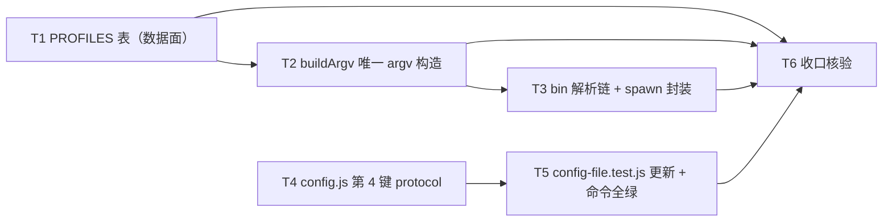

# pr-001-tasks.md — pr-001 内部任务图（L1 启动服务：`launcher.js` profile 表 + 唯一 argv 构造 / `config.js` 第 4 键）

**迭代**: 0022-agent-launcher-and-protocol-layer ｜ **阶段**: 5（PR 实现）｜ **PR 文件**: `prs/pr-001-launcher-and-protocol-config.md`
**worktree 分支**: `feat/0022-pr-001-launcher-and-protocol-config`（base = `e3f8a62`，与迭代分支同点）｜ **任务总数**: **6**（T1~T6）｜ **依赖图**: 无环（见 §2）

## 0. 范围、文件面与事实锚点

### 0.1 本 PR 文件范围（唯一可写面）

| 文件 | 动作 | 内容 |
|---|---|---|
| `oamp/src/launcher.js` | **新建** | `PROFILES` 进程内字面量表（键 = `(host, protocol/执行方式)`）+ `buildArgv(profileKey, {model, roleFile, tools, prompt})` 唯一 argv 构造 + spawn 封装；只 import `node:*` |
| `oamp/src/config.js` | 修改 | `loadConfig()` 返回值新增第 4 键 `protocol`（`env.OAMP_PROTOCOL` > `config.json: protocol` > 内置 `'rpc'`）；非法取值按既有体例抛 `OAMP 配置错误`；**叶子约束不变** |
| `oamp/test/config-file.test.js` | 修改 | 全对象断言补 `protocol` 键；新增 `OAMP_PROTOCOL` / `config.json: protocol` 的优先级与非法取值断言 |

### 0.2 非目标（零改动 / 防夹带；PR 文件「零改动」段逐条）

`oamp/src/router.js`、`oamp/src/cluster-config.js`（`roles` 段**不合并**进 profile 表）、`oamp/src/cluster.js`、`oamp/src/status.js`、`oamp/src/task.js`、`oamp/src/web.js`、`oamp/API.md`、`oamp/llms.txt`、`oamp/package.json`、`omp/**`；以及**既有 argv 调用点** `oamp/src/acp-client.js`（`:137-145`）与 `oamp/src/agent.js`（`:190-199`、`:207`）——它们的迁移归 pr-003 / pr-005，本 PR **只新增**（架构 §3.3 三层落点、§9.3 零改动清单）。

### 0.3 读码事实锚点（base `e3f8a62` 实测；判据基础）

| # | 事实 | 位置 |
|---|---|---|
| A1 | `config.js` 自述**叶子模块**（只依赖 `node:`，不 import `src/` 内任何模块） | `oamp/src/config.js:1-3` |
| A2 | 既有「响亮失败」体例：非法取值抛 `` `OAMP 配置错误: …` `` | `oamp/src/config.js:29-39`（`readPositiveInt`，抛错在 `:36`）、`:110-112`（`OAMP_RECONNECT 仅支持 0/1`，抛错在 `:112`） |
| A3 | 空串 / 纯空白 env 视为**未提供**（继续向下取值） | `oamp/src/config.js:41-44`（`readNonEmptyString`） |
| A4 | 配置文件只读三个 section（`data` / `defaults` / `context`），返回 `{db, model, contextMax}` | `oamp/src/config.js:93-95`（三 section 读取）、`:100-104`（返回三键） |
| A5 | `loadConfig` 返回对象 = **10 键**（socketPath / heartbeatIntervalMs / heartbeatIdleMs / heartbeatTimeoutMs / hbLogWindowMs / reconnect / reconnectMaxMs / dbPath / defaultModel / contextMax） | `oamp/src/config.js:107-131`（函数体；返回对象 `:114-130`） |
| A6 | 现状 acp argv 逐字 = `['acp','--no-skills','--no-rules']` 起，工具关 `--no-tools`，档位仅工具开时 `always-ask`；spawn 带 `cwd` + `['pipe','pipe','pipe']` | `oamp/src/acp-client.js:137-145` |
| A7 | 现状一次性 argv 逐字 = `['-p','--no-session']` 起，`--no-tools` / `--model` / `--append-system-prompt` / `--approval-mode`（`deny ⇒ always-ask`，否则 `yolo`），提示词为**末位位置参数**；spawn `['ignore','pipe','pipe']` | `oamp/src/agent.js:190-199`、`:207` |
| A8 | 既有 bin 解析 = `process.env.OAMP_OMP_BIN \|\| 'omp'`（两处消费：一次性 `:188`、池构造 `:700`） | `oamp/src/agent.js:31` |
| A9 | 全对象 `assert.deepEqual(config, {…})` 用例（新增键必然命中该断言） | `oamp/test/config-file.test.js:32-48`（`deepEqual` 在 `:34-47`） |
| A10 | `hygiene.test.js` 三条静态断言：`.gitignore` 含 `.runtime/`；`bin/` + `src/`（**平铺**）`.js` + `package.json` 凭据词零命中（`token`/`api_key`/`secret`/`password`/`credential`/`authorization`/`private_key`，词边界、大小写不敏感）；`package.json` 的 `dependencies` 为空 | `oamp/test/hygiene.test.js:16-24`（词表）、`:26-39`（扫描面 = `bin/` + `src/` 平铺 `.js` + `package.json`）、`:41`（`.gitignore`）、`:47`（凭据零命中）、`:61-63`（deps 为空） |
| A11 | 测试面计数：`oamp/test/*.test.js` = **29**；`oamp/test/**/*.js` = **31**（另含 `helpers/harness.js`、`helpers/fake-node.js`） | 实测（Gate E-3 同口径） |
| A12 | **零消费方**：`oamp/` 全仓对 `launcher.js` / `OAMP_PROTOCOL` 零命中 ⇒ 本 PR 落地不改变任何运行路径 | Gate E-1（`clarifications/verify-stage4-gate-r2-20260914.md` §E-1） |

### 0.4 本 PR 内的冻结契约（每个任务都必须遵守）

1. **零消费方 / 行为零变更**：`oamp/src/launcher.js` 不得被任何既有 `src/**` 文件 import；`config.protocol` 不得出现任何读者（既有文件 diff 面为零）——PR 文件「本 PR 的 launcher **尚无消费方**（三实现归 pr-005、消费层接入归 pr-003）」。
2. **唯一真源、只增不改**：本 PR 只**新增** argv 生产点，既有两处 argv 调用点（A6 / A7）逐字不动（迁移归 pr-003 / pr-005）。
3. **两个新增面互不引用**：`launcher.js` 的 import ⊆ `node:*`；`config.js` 不 import `src/` 内任何模块 ⇒ 两者之间也无 import 边。
4. **数据面承载**：profile 序列化 = 进程内 JS 字面量；**不新增配置文件 / JSON 文件**（架构 §4.2 L2-13）。
5. **文件面封闭 ⇒ 验收方式**：只写 0.1 的三个文件；`launcher.js` 的验收一律用**一次性核对 / 一次性脚本（不入库）**，**不新增测试文件**（PR 验收末条的 `git diff --stat` 判据）。本阶段产物 `prs/pr-001-tasks.md` 自身不计入源码 / 测试面。
6. **新文件文本受 hygiene 扫描**：`launcher.js` 文本不得命中 A10 的凭据词表。

## 1. 任务列表

### T1: `launcher.js` 数据面 —— `PROFILES` 表（三份 omp profile + claude / codex 结构项）

- **验收标准**:
  1. **文件与 import 面**：`oamp/src/launcher.js` 存在；文件头 import 集合 ⊆ `node:*`（零 `src/` 内 import、零第三方依赖）；`oamp/package.json` 的 `dependencies` 仍为 `{}`。判据 = 文件头逐条核对 + `node --test oamp/test/hygiene.test.js` 绿（A10 的凭据词扫描同时覆盖本文件）。
  2. **键集**：`PROFILES` 含 `omp:rpc` / `omp:acp` / `omp:oneshot` 三项；另含 **claude 与 codex 宿主的结构项**（键的宿主段 = `claude` / `codex`；协议 / 执行方式段与具体字段值自定——见 §5 登记①）。判据 = 以一次性脚本 `import` 该表并逐键列举（不入库）。
  3. **字段集与 §5.2 逐项一致**：每份 profile 的字段名集合 = 架构 §5.2 的十三项，**无多无少**：`host / bin / modeArgs / input / session / skills / rules / tools{mode,list?} / approval{mode,appliesWhen} / thinking / model / roleFile / cwd`。判据 = 字段名集合逐项比对。
  4. **取值逐字**：`omp:rpc` / `omp:acp` 的取值 = 架构 §5.2 代码块逐字（`input:'protocol'`、`session:false`、`skills:false`、`rules:false`、`tools:{mode:'off'}`、`approval:{mode:'always-ask',appliesWhen:'tools-on'}`、`thinking:null`、`model:null`、`roleFile:null`、`cwd:null`；`modeArgs` 的取值判据归 T2 验收 1）；`omp:oneshot` 的取值 = §5.2 列明项逐字（`input:'positional'`、`session:false`、`approval:{mode:'yolo',appliesWhen:'always'}`、`thinking:null`、`modeArgs:['-p']`）。判据 = 逐字段 `deepEqual`。
  5. **`omp:oneshot` 的 `skills` / `rules` = `true`**（即**不**追加 `--no-skills` / `--no-rules`）：以复现既有一次性 argv（A7 无此二 flag）〔`[model_inferred]` MI-3〕。判据 = 该两项取值在场且为 `true`，T2 的 oneshot argv 检索零命中该二 flag。
  6. **claude / codex 只有结构与能力位**：结构项仅承载字段（无真实接入链路、无 bin 探测、无实测证据、无 spawn 接线；本 PR 不产生任何 claude / codex 证据产物）。判据 = 表内无三宿主之外的接线代码 + 本 PR 无相关证据文件。
  7. **新增宿主 = 新增 profile 数据**：向 `PROFILES` 增加一项（如 `claude` 宿主 + 某协议 / 执行方式）⇒ 不改 `oamp/src/launcher.js` 之外的任何源码即可由**同一入口**产出其 argv。判据 = `git diff --stat` 的**源码面**只含 `oamp/src/launcher.js`——不含其余源码与测试文件（本阶段产物 `prs/pr-001-tasks.md` 不计入；本 PR 阶段的判定面；「协议层与消费层零改动」由 pr-005 / pr-003 在同一判据面复核）。
  8. **不与集群 / 实例配置合并**：`launcher.js` 内无 `cluster` / `instances` / `roles` 相关读取（无 import、无字段名、无分支）；`oamp/src/cluster-config.js` 零改动；两者可各自读到。判据 = 文本检索零命中 + `git diff --stat`。
  9. **导出面可被依赖方引用**：`PROFILES` 可被本文件之外 `import`（pr-002 的依赖强度已锁死为「直接引用该表」）〔`[model_inferred]` MI-1〕。判据 = 一次性脚本 `import { PROFILES } from './launcher.js'` 可用。
- **前置依赖**: 无
- **优先级**: P0
- **追溯**: PR 文件「文件范围」第 1 项 + 验收 1 / 2 / 3 / 12；architecture §5.2（字段集与取值）／§3.3（`launcher.js` 与 `config.js` 两行判据）／§4.2 **L2-13**（进程内字面量、不新增配置文件）／§7 **T-02** ／§9.1 **B-1** ／§10（Occam：`launcher.js` ✅ 必需）；prd/F01 验收 2 / 3 / 4 + 架构落定 T-01 / T-02；prd/F12 验收 1 / 2 + 架构落定；prd/F13 验收 2 + 架构落定

### T2: `buildArgv` —— 唯一 argv 构造（modeArgs 唯一差异段 / thinking / 工具与档位 / 提示词承载）

- **验收标准**:
  1. **`modeArgs` 是三份 profile 唯一的 argv 差异段**：argv 首段 = 各 profile 的 `modeArgs` 逐字 —— `omp:rpc` = `['--mode','rpc']`、`omp:acp` = `['acp']`（**子命令**）、`omp:oneshot` = `['-p']`；**其余 flag 段由同一份字段集、同一段代码推导**。判据 = 三份 argv 的元素集合差恰为 `modeArgs`（架构 M-3 九组矩阵：非 mode 参数两侧通用）。
  2. **不含 `--thinking`**：三份 profile 的 argv 均不含 `--thinking`（含 `--thinking off` 形态）——`thinking` 恒 `null`（传 `off` 会使思考增量消失 ⇒ E3 直接失败）。判据 = argv 元素检索零命中。
  3. **`tools` 三值语义**：`{mode:'off'}` ⇒ 追加 `--no-tools`；`{mode:'allow'}` ⇒ **不追加** `--no-tools`、也不追加 `--tools`；`{mode:'list', list:[…]}` ⇒ 追加 `--tools=<csv>`（不追加 `--no-tools`；语义 = 白名单偏好，**不承诺精确集合**）。判据 = 三种取值各产出一份 argv 逐项检索。
  4. **`approval.appliesWhen` 两档语义**：`'tools-on'`（`omp:acp` = `always-ask`）⇒ **仅当工具开**（`tools.mode !== 'off'`）时追加 `--approval-mode always-ask`，工具关时**不追加**；`'always'`（`omp:oneshot` = `yolo`）⇒ **恒追加** `--approval-mode yolo`；档位值与既有 argv 逐字一致（A6 的 `always-ask`、A7 的 `yolo`）。判据 = 工具开 / 工具关 × 两份 profile 的四种组合逐项检索。
  5. **提示词承载两态**：`input:'positional'`（`omp:oneshot`）⇒ 提示词是 argv **末位位置参数**，逐字（不截断、不加前后缀）；`input:'protocol'`（`omp:rpc` / `omp:acp`）⇒ 提示词**不出现在 argv**（其余位置零残留）。判据 = 传入非空提示词后比对 argv 末位 / 全量检索。
  6. **其余 flag 段与调用参数**：`session:false` ⇒ `--no-session`；`skills:false` ⇒ `--no-skills`；`rules:false` ⇒ `--no-rules`；调用参数 `model` 非 null ⇒ `--model <值>`；`roleFile` 非 null ⇒ `--append-system-prompt <值>`；`cwd` 不参与 argv。判据 = `omp:acp` 形态可复现 A6 的 flag 集合（`--no-skills` / `--no-rules` / `[--no-tools]` / `--no-session` / `[--model]` / `[--append-system-prompt]` / `[--approval-mode always-ask]`）与值逐字。
  7. **返回值不含 bin**：`buildArgv` 产出的是 **args 数组**（bin 由 T3 的 spawn 侧解析注入）——依据架构 §3.4 流 1 的 argv 字面量（`['--mode','rpc', …]`，不含 `omp`）与 PR 文件把「`bin` 解析链」单列为独立判据（验收 8）。判据 = 返回值首元素为 mode 段而非可执行名。
  8. **调用形态**〔`[model_inferred]` MI-1〕：签名 = `buildArgv(profileKey, {model, roleFile, tools, prompt})`；`tools` 覆写与 `profile.tools` **同形**（未传即取 `profile.tools`）；`model` / `roleFile` 未传即取 `profile` 值（`null` ⇒ 不追加对应 flag）；未知 `profileKey` 的处置由实现按既有「响亮失败」体例定。判据 = 上述各条均以该签名驱动。
  9. **argv 段次序**〔`[model_inferred]` MI-2〕：`modeArgs` → `[--no-skills]` → `[--no-rules]` → `[--no-tools]` → `[--no-session]` → `[--model]` → `[--append-system-prompt]` → `[--approval-mode]` → `[positional prompt]`；判据 = `omp:acp` 形态与 A6 既有次序**逐位一致**（一次性形态的既有次序仅在 `--no-session` / `--no-tools` 的相对位置不同，M-3 已证 flag 集合与顺序无关，故取 acp 次序为唯一规范序）。
- **前置依赖**: T1
- **优先级**: P0
- **追溯**: PR 文件「文件范围」第 1 项 + 验收 4 / 5 / 6 / 7；architecture §5.2（`modeArgs` / `thinking: null` / `approval.mode` 的存在性锚点）／§2.4 **M-3**（九组 argv 矩阵）／§2.7（实测 → 设计约束索引）／§4.2 **L2-13** ／§5.2 字段语义锚点（`input` 两态、`tools.mode` 三值、`approval.mode` 的必要性）／§7 **T-02** ／§9.1 **B-1** ／§12.1 **MI-A-4**（rpc 不传 `--thinking`，`[user_confirmed]`）；prd/F01 验收 2 + 架构落定 T-02；既有代码 A6 / A7

### T3: `bin` 解析链 + spawn 封装（进程面）

- **验收标准**:
  1. **bin 解析链三档**：`env.OAMP_OMP_BIN` > `profile.bin` > `'omp'` 逐档生效（env 优先于 profile 值；profile 无值回落 `'omp'`）。判据 = 三档各起一次，被启动的 bin 路径可观测（fake bin 记录自身 argv / 或直接读解析结果）；既有注入语义不变（A8 的 `OAMP_OMP_BIN`）。
  2. **argv 全部来自 T2 产物**：spawn 封装体内**不出现任何 flag 字面量**（`--mode` / `--no-tools` / `--approval-mode` / `--append-system-prompt` …），实际启动的 argv 与 `buildArgv` 输出 `deepEqual`。判据 = 封装体内 flag 字面量检索零命中 + fake bin 记录的 argv 逐位比对（架构 §3.3 L1 判据行「`-p` 与 `--mode rpc` 的 argv 均出自本模块」）。
  3. **cwd 基准**：`profile.cwd` 为 `null` ⇒ 子进程 cwd = 进程 cwd（既有形态）；非 `null` ⇒ 用该值。判据 = fake bin 回显自身 cwd。
  4. **stdin 策略两态可指定、stdout / stderr 恒为 pipe**〔`[model_inferred]` MI-4〕：既有两处 spawn 的差异必须可表达 —— 常驻侧 `['pipe','pipe','pipe']`（A6）、一次性侧 `['ignore','pipe','pipe']`（A7）。判据 = 以两种 stdin 形态各起一个 fake bin 子进程，二者均正常结束且 argv / cwd 可观测（一次性侧不得因悬挂的 stdin 管道而阻塞）。
  5. **封装不自行接线 stdout / stderr**：行流 / 帧读取的 `data` 监听归实现方（pr-005 的三个实现），封装只负责启动并返回子进程句柄。判据 = 封装体内无 `stdout.on('data'` / `stderr.on('data'`；一次性脚本内由调用侧接线即可收齐输出。
- **前置依赖**: T1、T2
- **优先级**: P0
- **追溯**: PR 文件「文件范围」第 1 项（spawn 封装）+ 验收 8；architecture §3.3（L1 职责 = profile + 唯一 argv + 子进程 spawn）／§3.4 流 1（`★L1 launcher 按 profile['omp-rpc'] 构造 argv → spawn omp 子进程`）／§5.2（`bin` 与 `cwd` 的语义锚点行）／§9.1 **B-1**；既有代码 A6 / A7 / A8

### T4: `config.js` 第 4 键 `protocol`（三档解析 + 越界响亮失败 + 叶子约束）

- **验收标准**:
  1. **三档解析**：`loadConfig({OAMP_PROTOCOL:'acp'})` ⇒ `protocol === 'acp'`；配置文件含 `{"protocol":"acp"}` ⇒ `protocol === 'acp'`；两者皆缺 ⇒ `protocol === 'rpc'`（内置默认）；两者并存 ⇒ env 胜出。判据 = 三档各有直接断言（判据面 = 返回值字段）。
  2. **越界值响亮失败**：`OAMP_PROTOCOL='bogus'` ⇒ 抛 `OAMP 配置错误`（体例同 A2 的 `OAMP_RECONNECT 仅支持 0/1`）；配置文件 `{"protocol":"bogus"}` ⇒ 同样抛错（选择域 = `{rpc, acp}`）。判据 = `assert.throws(…, /OAMP 配置错误/)`。
  3. **既有 10 键逐字不变**：新增键之外，返回对象的既有键（A5 的 10 键）取值与新增前逐字相同。判据 = 全对象 `deepEqual`（A9 的用例，由 T5 增补 `protocol` 后覆盖）。
  4. **空串体例**：`OAMP_PROTOCOL` 为空串 / 纯空白 ⇒ 视为未提供，继续向下一级取值（A3 体例）。判据 = 断言回落值。
  5. **叶子约束不变**：文件头 import 只含 `node:*`，无任何 `./xxx.js`；`config.js` 不因新增键而引用 `launcher.js` 或其它 `src/` 模块。判据 = 文件头逐条核对（A1）。
  6. **配置面而非接口面**：本键只经 `config.json` + env 抵达，不新增 HTTP 接口、不改服务监听 / 鉴权（承载 F10 验收 1/2）。判据 = `git diff --stat` 不含 `oamp/src/web.js` / `oamp/API.md` / `oamp/llms.txt`（与 T6 验收 3 同判据面）。
- **前置依赖**: 无（**与 T1~T3 的文件面不重叠，可并行落地**）
- **优先级**: P0
- **追溯**: PR 文件「文件范围」第 2 项 + 验收 9 / 10 / 11 前半；architecture §3.3（`config.js` 行「新增第 4 键 `protocol`（+ env `OAMP_PROTOCOL`）；**保持叶子模块**」）／§5.3（解析链与选择域校验）／§3.4 流 1 ①（`OAMP_PROTOCOL=acp 或 config.json 的 protocol`）／§4.1 **L1-1**（`[user_confirmed]` 采纳推荐项①）／§7 **T-03** ／§9.2 **B-9**；prd/F02 架构落定 T-03；prd/F10 架构落定「进程内配置」

### T5: `config-file.test.js` 最小更新 + 两文件命令全绿

- **验收标准**:
  1. **全对象断言增补**：用例 `无配置文件：新增三键取内置默认，既有六键取值逐字不变` 的 `assert.deepEqual(config, {…})`（A9，`:34-47`）新增 `protocol: 'rpc'`；既有 10 键**逐字不变**（不得删除 / 弱化 / 改写其它键）。判据 = 用例绿 + 该断言块 diff 只含新增。
  2. **优先级与回落断言**：新增 `OAMP_PROTOCOL` 与 `config.json: protocol` 的优先 / 回落断言（env > 配置文件 > 内置默认）。判据 = 新增用例绿。
  3. **非法取值断言**：`OAMP_PROTOCOL='bogus'`（及配置文件非法值）⇒ `assert.throws(…, /OAMP 配置错误/)`。判据 = 新增断言绿。
  4. **命令全绿**：`node --test oamp/test/config-file.test.js oamp/test/hygiene.test.js` 全绿。判据 = 实跑输出（两个文件、零失败）。
  5. **测试面无越界**：除本文件外，既有测试文件（29 − 1 = **28** 个 `.test.js`）零改动；不新增测试文件。判据 = `git diff --stat` 的源码与测试面只含本 PR 三个文件（本阶段产物 `prs/pr-001-tasks.md` 不计入）。
- **前置依赖**: T4
- **优先级**: P0
- **追溯**: PR 文件「文件范围」第 3 项 + 验收 13 前半；architecture §9.3（测试面外零改动）／§9.4.1（既有测试面「最小更新」口径）；prd/F12 架构落定（`hygiene.test.js` 零依赖断言继续成立）

### T6: 收口核验（F10 / F12 / F13 承载面 + 改动面封闭 + 零消费方）

- **验收标准**:
  1. **命令全绿**：`node --test oamp/test/config-file.test.js oamp/test/hygiene.test.js` 全绿（收口复核）。
  2. **改动面封闭**：`git -C <PR worktree> diff --stat <base>..HEAD` 的**源码与测试面只含** `oamp/src/launcher.js` / `oamp/src/config.js` / `oamp/test/config-file.test.js` 三个文件（本阶段产物 `prs/pr-001-tasks.md` 不计入）；`oamp/test/*.test.js` 29 个中只有 `config-file.test.js` 被改（其余 **28** 个零改动），`oamp/test/**/*.js` 共 31 个（含 `helpers/` 两个）零新增零改动。
  3. **F10 承载面**：diff 不含 `oamp/src/web.js`、不含监听地址 / 鉴权相关代码；`oamp/API.md` / `oamp/llms.txt` 零改动（`protocol` 是进程内配置，不是新 HTTP 接口）。
  4. **F12 承载面**：`oamp/package.json` 零改动（`dependencies` 仍 `{}`）；`hygiene.test.js` 三条断言全绿（A10）。
  5. **F13 承载面**：`oamp/src/router.js`（`VALID_TYPES` 封闭 4 类）/ `oamp/src/cluster-config.js` 零改动；`launcher.js` 内无 `cluster` / `instances` / `roles` 读取；`docs/multi-omp-agent-protocol.md` 零改动。
  6. **零消费方 / 行为零变更**：`grep -rn "launcher.js" oamp/{src,test,web,bin}` 的命中集合为空（`launcher.js` 尚无消费方）；`grep -rn "\.protocol\|OAMP_PROTOCOL" oamp/{src,test,web}` 的命中只落 `oamp/src/config.js` 与 `oamp/test/config-file.test.js`（`protocol` 无生产读者）。
  7. **提交卫生**：未使用 `--no-verify`；`git status --porcelain` 为空（改动已提交）。
- **前置依赖**: T1、T2、T3、T5
- **优先级**: P0
- **追溯**: PR 文件 验收 1（后半）/ 11 / 12（后半）/ 13（后半）；prd/F10 验收 1 / 2；prd/F12 验收 1 / 2；prd/F13 验收 1 / 2 / 3；architecture §9.3（零改动清单）／§9.4.1 / §9.4.2（本 PR 不涉新增测试）／§9.5；Gate E-1（零消费方对照面）

## 2. 依赖图（无环）

拓扑序（合法执行序）：`{T1 → T2 → T3} ‖ {T4 → T5}` → `T6`

- **最长依赖链**：`T1 → T2 → T3 → T6`（3 跳）；旁支链 `T4 → T5 → T6`（2 跳）。
- **关键路径任务**：**T1、T2、T3**（T6 的三条硬前置全在其后）；**T4 → T5** 与关键路径**无交点**，可整链并行。
- **无环**：全部边单向递增（T1 → T2 → T3 → T6；T4 → T5 → T6），无回边。

**同文件串行约束（必须）**

| 文件 | 写入任务 | 约束 |
|---|---|---|
| `oamp/src/launcher.js` | **T1 → T2 → T3**（同一文件的三个面：表 / 构造 / 进程） | 不得并发派发；由同一实现者按序落地 |
| `oamp/src/config.js` + `oamp/test/config-file.test.js` | **T4 → T5** | 不得并发派发（T5 的断言以 T4 的返回值为判据） |

**可并行的唯一组合 = `{T1,T2,T3}` ‖ `{T4,T5}`**（两组文件面零重叠）。

## 3. 与 pr-001 验收标准逐条对位表

| PR 验收 # | 验收摘要 | 承接任务 | 对位说明 |
|---|---|---|---|
| 1 | `launcher.js` 存在；import ⊆ `node:*`；`dependencies` 仍 `{}`（F12 1/2） | **T1**（验收 1）+ **T6**（验收 4） | import 面在 T1 判；`package.json` 零改动在 T6 以 diff + hygiene 判 |
| 2 | profile 表三项 + `claude:*` / `codex:*` 结构项；字段集与 §5.2 逐项一致（F01 4） | **T1**（验收 2、3、4、6） | 字段名集合与取值分两条判据；claude / codex 只判「结构与能力位在场、无真实接入链路」 |
| 3 | 新增宿主 = 新增 profile 数据（F01 3） | **T1**（验收 7）+ **T2**（验收 1） | 表内加一项（T1）⇒ 同一入口产出其 argv（T2 的单一推导段）；判定面 = `git diff --stat` |
| 4 | `modeArgs` 是三份 profile 唯一的 argv 差异段（D-R4） | **T2**（验收 1） | 判据 = 三份 argv 差集恰为 `modeArgs` |
| 5 | `omp:rpc` 的 argv 不含 `--thinking`（D-R3 / MI-A-4） | **T2**（验收 2）+ **T1**（验收 4 的 `thinking:null`） | 表侧取值 + argv 侧检索双判据 |
| 6 | 工具与档位语义三条（D-R5 / §5.2） | **T2**（验收 3、4、6） | `tools` 三值一条、`appliesWhen` 两档一条、其余 flag 段一条 |
| 7 | 提示词承载两态（`positional` / `protocol`） | **T2**（验收 5） | 判据 = 末位位置参数 / argv 零残留 |
| 8 | `bin` 解析链 = `OAMP_OMP_BIN` > `profile.bin` > `'omp'` | **T3**（验收 1） | 判据 = 三档优先级可观测 |
| 9 | `config.js` 第 4 键三档解析 + 非法取值抛错 | **T4**（验收 1、2）+ **T5**（验收 2、3） | 实现侧（T4）与断言侧（T5）分开判 |
| 10 | `config.js` 仍是叶子模块 | **T4**（验收 5） | 判据 = 文件头 import 面 |
| 11 | 服务边界与配置面不扩大（F10） | **T6**（验收 3）+ **T4**（验收 6） | 判定面 = diff 不含 `web.js` 监听 / 鉴权面 + `API.md` / `llms.txt` 零改动 |
| 12 | 启动数据不与 `instances[]` / 集群配置合并（F13 2） | **T1**（验收 8）+ **T6**（验收 5） | 表侧零读取 + `cluster-config.js` 零改动 |
| 13 | 命令全绿且改动面封闭 | **T5**（验收 4、5）+ **T6**（验收 1、2、6、7） | 命令在 T5 首跑、T6 收口复核；封闭面 = 三文件 |

**覆盖检查**：PR 文件 13 条验收标准 → 全部有任务承接，无遗漏；T1~T6 每条均可追溯到 PR 文件 / architecture / prd 的具名条目（见 §6）；**无任务超出 PR 文件范围**。

## 4. 关键实现约束（判据口径，供实现者遵守）

1. **不得把 launcher「接上去」**：本 PR 不迁移 A6 / A7 的既有 argv 调用点，也不得让 `acp-client.js` / `agent.js` / `context-pool.js` / `web.js` 出现任何 diff（§0.4 契约 1、2；PR 文件「本 PR 的 launcher 尚无消费方」）。
2. **唯一真源的最小含义**：`buildArgv` 是**唯一**产出 omp argv 的函数，spawn 封装不得再拼 flag（T3 验收 2）；`-p` 与 `--mode rpc` 的 argv 均经它产出（架构 §9.1 B-1 判据）。
3. **`--no-skills` / `--no-rules` 的来源**：仅由 `skills` / `rules` 字段推导 —— `omp:rpc` / `omp:acp` 为 `false`（追加），`omp:oneshot` 为 `true`（不追加，复现 A7）〔MI-3〕。
4. **档位值只取 profile 值**：`omp:acp` = `always-ask`、`omp:oneshot` = `yolo`，与既有 argv 逐字一致；**不得**在 launcher 内按 permission 等外部条件改写档位（caller 覆写面未定，见 §5 登记④）。
5. **不新增配置文件 / JSON**：profile 是进程内字面量（L2-13）；`config.json` 只多读一个 `protocol` 键，不新增文件。
6. **新文件文本洁净**：`launcher.js` 不得出现 A10 的凭据词（该扫描覆盖 `src/` 平铺 `.js`）。
7. **验收方式不入库**：`launcher.js` 的三条任务用一次性核对 / 一次性脚本（`node --input-type=module -e …` 或临时 `.mjs` 于 `/tmp`）验证，**不得**在本 PR 新增测试文件（否则破坏改动面封闭判据）。
8. **不得引入架构外决策**：不新增 profile 字段、不新增 env 键、不新增目录、不引入第三方依赖（§9.5「不在本迭代」清单）。

## 5. 边界与疑问（提请主 agent）

**`[model_inferred]` 清单（需主 agent 确认；未确认前不作为生效契约）**

1. **MI-1 · `launcher.js` 的对外接口面**：架构 §5.2 只给 `const PROFILES = {…}` 与字段语义，**未给导出形态与 `buildArgv` / spawn 封装的调用契约**；而其依赖方已锁定（pr-002 验收 2「直接引用 `PROFILES` 表」；pr-003 / pr-005 的启动面 = 「`PROFILES` + argv 构造 + spawn」）。本任务图推导：① `PROFILES` / `buildArgv` 可被 import（T1 验收 9、T2 验收 8）；② `buildArgv(profileKey, {model, roleFile, tools, prompt})` 四参、`tools` 与 `profile.tools` 同形（T2 验收 8）。推导方式 = 从依赖方的既定需要与 PR 文件字面签名反推，**不新增字段**。
2. **MI-2 · argv 的规范次序**：架构只钉死「`modeArgs` 是唯一差异段」与零星约束（首段为 mode、提示词末位），**未给 flag 次序**；而 A6 与 A7 两处既有次序本身不一致（`--no-tools` 与 `--no-session` 相对位置）。本任务图取 **A6（acp）次序为唯一规范序**（T2 验收 9），理由：① 复现常驻链路既有 argv 逐字；② M-3 九组矩阵已证非 mode 参数在 rpc / acp 两侧通用、flag 集合与顺序无关；③ pr-002 的断言以 `PROFILES` + 本构造为真源。**若主 agent 另有次序口径，请在 pr-002 落地前裁决。**
3. **MI-3 · `omp:oneshot` 的 `skills` / `rules` 取值**：架构 §5.2 的 oneshot 行以 `…` 省略，未给 `skills` / `rules`；而既有一次性 argv（A7）**不含** `--no-skills` / `--no-rules`。本任务图取 `true`（不追加），以保「一次性路径零行为变更」；若取 `false` 则一次性 argv 会新增两条 flag（改行为、且与 T-10「行为面 = `-p` + `--no-session` + 工具关时 `--no-tools` + `--approval-mode yolo`」的枚举不符）。
4. **MI-4 · spawn 封装的 stdin 策略**：架构未给 stdio 字段（§5.2 十三字段无此项），但既有两处 spawn 的 stdin 形态不同（A6 `pipe` / A7 `ignore`），而 `omp -p` 在 stdin 为悬挂管道时存在阻塞风险 ⇒ 本任务图要求封装可指定 stdin（T3 验收 4），且封装不接线 stdout / stderr（T3 验收 5，与既有调用点分工一致）。
5. **MI-5 · `config.json` 的 `protocol` 键位置**：PR 验收 9 的字面是 `{"protocol":"acp"}`（**顶层**），架构 §3.4 流 1 ① 亦写 `config.json 的 protocol`；而既有配置文件风格是 `data` / `defaults` / `context` **分段**（A4）。本任务图按**字面取顶层**（T4 验收 1 的判据即该字面）；如需改为分段，属口径变更，请先裁决。

**登记（非缺口 / 非本 PR 判据面）**

① **claude / codex 结构项的具体键值不在本 PR 判据面**：`clarifications/2026-09-14-pr-planner-round1.md` 第 5 条已登记 —— 本 PR 只判「结构与能力位在场、无真实接入链路」（T1 验收 6）。
② **架构 §9.4.1 的既有测试面清单未列 `config-file.test.js`**（该清单为 6/7 口径，Gate D-1 同族）：本 PR 以 **PR 文件「文件范围」第 3 项**为准（T5），不改上游产物。
③ **`approval` 的 caller 覆写面无承载位**：A7 的 `deny ⇒ always-ask` 由外部条件决定，而 PR 文件给出的 `buildArgv` 签名（`{model, roleFile, tools, prompt}`）内无 approval 覆写参数。本任务图按**字面签名**判（不扩展，T2 验收 4 只判 profile 值）；若 pr-003 / pr-005 需保留该覆写语义，需由主 agent 裁决签名扩展或 caller 侧前置处理 —— **不阻塞本 PR**。
④ **本 PR 的 F10 / F12 / F13 是「保证项」**：其判定面 = diff 面与命令面（T6），不含任何运行路径判据（F10 架构落定「本卡在架构面零改动」、F12 同、F13 同）。

## 6. 追溯总表（任务 → 输入）

| 任务 | PR 文件追溯 | architecture 追溯 | prd 追溯 | 既有代码事实 |
|---|---|---|---|---|
| T1 | 文件范围 1；验收 1 / 2 / 3 / 12 | §5.2（字段集与取值）、§3.3（L1 两行判据）、§4.2 L2-13、§7 T-02、§9.1 B-1、§9.3、§10 | F01 验收 2 / 3 / 4 + 架构落定 T-01 / T-02；F12 验收 1 / 2 + 架构落定；F13 验收 2 + 架构落定 | A10、A11、A12 |
| T2 | 文件范围 1；验收 4 / 5 / 6 / 7 | §5.2、§2.4 M-3、§2.7、§4.2 L2-13、§5.1、§7 T-02、§9.1 B-1、§12.1 MI-A-4 | F01 验收 2 + 架构落定 T-02 | A6、A7 |
| T3 | 文件范围 1；验收 8 | §3.3（L1 职责）、§3.4 流 1、§5.2（`bin` / `cwd` 行）、§9.1 B-1 | F01 验收 1 / 2 的「统一入口」面 + 架构落定 T-01 | A6、A7、A8 |
| T4 | 文件范围 2；验收 9 / 10 / 11（前半） | §3.3（`config.js` 行）、§5.3、§3.4 流 1 ①、§4.1 L1-1、§7 T-03、§9.2 B-9 | F02 架构落定 T-03；F10 架构落定 | A1、A2、A3、A4、A5 |
| T5 | 文件范围 3；验收 13（前半） | §9.3、§9.4.1 | F12 架构落定（hygiene 断言面） | A9、A10、A11 |
| T6 | 验收 1（后半）/ 11 / 12（后半）/ 13（后半） | §9.3（零改动清单）、§9.4、§9.5 | F10 验收 1 / 2；F12 验收 1 / 2；F13 验收 1 / 2 / 3 | A10、A11、A12（Gate E-1 零消费方对照面） |
