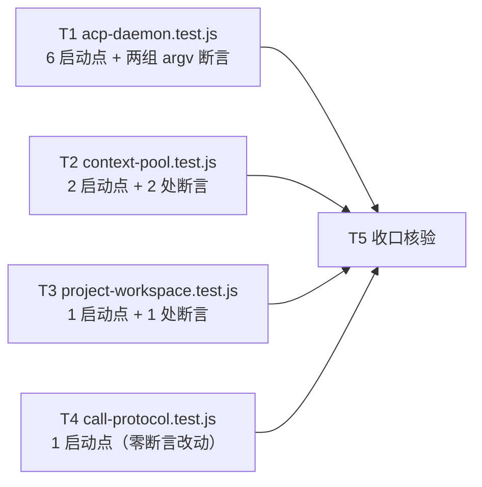

# pr-002-tasks.md — pr-002 内部任务图（既有 harness 测试面按 L1 profile 显式化，协议注入固定为 `acp`）

**迭代**: 0022-agent-launcher-and-protocol-layer ｜ **阶段**: 5（PR 实现）｜ **PR 文件**: `prs/pr-002-test-face-profile-pinning.md`
**worktree 分支**: `feat/0022-pr-002-test-face-profile-pinning`（base = `fa2acd6`，与迭代分支 `iteration/0022-agent-launcher-and-protocol-layer` 同点）｜ **任务总数**: **5**（T1~T5）｜ **依赖图**: 无环（见 §2）

---

## 0. 范围、文件面与事实锚点

### 0.1 本 PR 文件范围（唯一可写面）

| 文件 | 动作 | 内容（逐启动点 / 逐断言点） |
|---|---|---|
| `oamp/test/acp-daemon.test.js` | 修改 | ① **6 个 agent 启动点**注入 `OAMP_PROTOCOL: 'acp'`（4 个 env 载体：`setup()` 的 `envExtra`:246；`roleEnv`:501（覆盖 `:503` / `:509` / `:523` 三个 `startFlaggedAgent`）；匿名实例 `:515`；perm 审计用例 `:695`）；② 用例 `E2E：角色实例 argv 注入 + 工具开关 + 匿名回归 + 一次性路径注入（F02-5/F04-2/AR-04/AR-05/AR-08）`（`:491`）的 argv 断言按 `omp:acp` / `omp:oneshot` profile 期望值 —— 断言点 `:539-543`、`:546-552`、`:555-557`、`:560-564`、`:570-574`、`:578-582`、`:584-589` |
| `oamp/test/context-pool.test.js` | 修改 | ① **2 个启动点**注入同款 env（`setup()` 的 `envExtra`:201-204；`agent2`:267）；② 用例 `§6.6：daemon 启动参数含 acp 固定集（--no-skills/--no-rules/--no-tools/--no-session + --model）`（`:525`，断言 `:530-537`）与 `F08/§9.1：一次性 executor=omp（-p）与 shell 路径不回归`（`:511`，断言 `:514-515`）按 profile 期望值 |
| `oamp/test/project-workspace.test.js` | 修改 | ① **1 个启动点**：`setup()` 的 `envExtra`:225；② 用例 `F07：一次性路径每次注入（末位 argv 逐字）/ 常驻路径首轮一次 / E9 原文逐字未变`（`:985`）的 argv 断言（`:997-1006`）按 `omp:oneshot` profile 期望值 |
| `oamp/test/call-protocol.test.js` | 修改 | **仅** `setup()` 的 `envExtra`:301 注入同款 env（该文件**零 argv 断言**；组 F 的 `call_update.kind ∈ {chunk, stdout, stderr}` 断言 `:757` 逐字不动） |

> 本阶段产物 `prs/pr-002-tasks.md` 自身不计入源码 / 测试面（同 pr-001 口径）。

### 0.2 非目标（零改动 / 防夹带）

- **`oamp/src/**` 全部**：本 PR 不含任何生产变更（PR 验收 4 / 5）。
- `oamp/test/helpers/**`：`harness.js` 的 `buildEnv` / `startAgent` / `startRouter` 零改动；注入一律走各文件既有的 `envExtra` / `env` 通道（PR 文件「零改动（防夹带）」段）。
- 其余既有测试文件（`oamp/test/*.test.js` 实测 **29** 个，扣除本 PR 4 个后 **25** 个）与 `oamp/test/helpers/{harness,fake-node}.js`。
- `oamp/package.json` / `oamp/web/**` / `oamp/bin/**` / `omp/**`。
- `docs/iterations/0022-*/architecture.md` 与 `prd/*.md`：**只读追溯面**；§9.4.1 的清单口径回填由主 agent 另行处置（见 §5 登记①）。

### 0.3 读码事实锚点（base `fa2acd6` 实测；判据基础）

| # | 事实 | 位置 |
|---|---|---|
| A1 | 4 文件的 **agent 启动点共 10 处**，落在 **8 个 env 载体**：acp-daemon 6 处 / 4 载体（`setup():246`；`roleEnv:501` → `:503`、`:509`、`:523`；匿名 `:515`；perm 审计 `:695`）；context-pool 2 处 / 2 载体（`setup():203`、`agent2:267`）；project-workspace 1 处（`setup():225`）；call-protocol 1 处（`setup():301`） | 实测（逐文件 `startAgent(` / `startFlaggedAgent(` / `OAMP_OMP_BIN` 检索） |
| A2 | `harness.buildEnv(socket, extra) = { ...process.env, OAMP_SOCKET, ...SHORT_ENV, ...extra }`；`startAgent` / `startRouter` 均以 `envExtra` 透传 ⇒ **`envExtra` 是唯一既有 env 注入通道** | `oamp/test/helpers/harness.js:29-31`、`:106-111`、`:159-161` |
| A3 | 常驻路径现状 argv（生产）：`acp --no-skills --no-rules [--no-tools] --no-session [--model] [--append-system-prompt] [--approval-mode always-ask]` —— 与 `buildArgv('omp:acp', …)` 的**段序与取值逐位一致** | `oamp/src/acp-client.js:137-144` vs `oamp/src/launcher.js:106-129` |
| A4 | 一次性路径现状 argv（生产）：`-p --no-session [--no-tools] [--model] [--append-system-prompt] [--approval-mode（toolsOn ? (permission==='deny' ? 'always-ask' : 'yolo') : 缺省）] <prompt>` | `oamp/src/agent.js:192-199` |
| A5 | `PROFILES['omp:oneshot'].approval = { mode:'yolo', appliesWhen:'always' }` ⇒ `buildArgv` 对一次性路径**恒追加** `--approval-mode yolo`（与 A4 的 tools-off 分支不同） | `oamp/src/launcher.js:43-57`、`:126-128` |
| A6 | `buildArgv` 段序 = `modeArgs → skills → rules → tools → session → model → roleFile → approval → positional` ⇒ 一次性 tools-off 侧 `--no-tools` 与 `--no-session` 的**相对次序与 A4 相反**（常驻侧无此差异，A3 逐位一致） | `oamp/src/launcher.js:106-129` |
| A7 | ⇒ A4 ↔ A5/A6 的**三处实证分歧**（一次性 tools-off 档位缺省、一次性 deny 档位值、一次性 tools-off 段序）是 PR 验收标准第 2 条的唯一实现风险点 ⇒ 见 §5 疑问① | A3 / A4 / A5 / A6 |
| A8 | `oamp/src/launcher.js` **零 import 方**（`oamp/{src,test,web,bin}` 对 `launcher` 零命中） | 实测 |
| A9 | `config.protocol` **零生产读者**：全仓 `OAMP_PROTOCOL` / `.protocol` 命中只落 `oamp/src/config.js:117,144-145`（键的产出面）与 `oamp/test/config-file.test.js:139-145`（pr-001 的断言） | 实测 |
| A10 | 生产消费层零协议取值分支：`=== 'acp'` / `=== 'rpc'` / `'oneshot'` 在 `oamp/src` + `oamp/web` 零命中（`oamp/src/router.js:27` 的 `m.protocol !== 'oamp/1'` 是消息信封字段，与协议选择无关） | 实测 |
| A11 | 既有 argv 断言点：acp-daemon `:539-543`（三处 `waitFor` 的 `a[0]==='acp'`）+ `:546-589`（六组）；context-pool `:514-515`、`:530-537`；project-workspace `:997-1006`；call-protocol **零 argv 断言** | 实测 |
| A12 | 行流语义用例（本 PR 必须保持绿）：`acp-daemon.test.js:381` `E2E：E-4 SSE——终态 message(out) 之前收到 ≥2 个 task_update 且文本递增` | 实测 |
| A13 | 测试面计数：`oamp/test/*.test.js` = **29**；本 PR 4 个之外 **25** 个零改动；`oamp/test/**/*.js` = **31**（另含 `helpers/` 两个） | 实测（同 pr-001 A11 口径） |
| A14 | 4 文件的桩形态 = **ACP-only**（`FAKE_ACP_SOURCE` 的 `msg.method` 分支 / `argv.includes('-p')` 两形态；无 `--mode rpc` 应答）⇒ 默认切 rpc 后会永不回包 ⇒ 本 PR 的注入是这组测试的存在性前提 | PR 文件「上下文摘要」；4 文件桩源码 |

### 0.4 本 PR 内的冻结契约（每个任务都必须遵守）

1. **生产零改动**：`oamp/src/**` 零 diff（PR 验收 4）。
2. **期望值真源 = `oamp/src/launcher.js`**：argv 期望值经 `PROFILES['omp:acp']` / `PROFILES['omp:oneshot']` 产出（**全量** argv 期望值经同模块的 `buildArgv` 产出 —— 见 §5 MI-1）；**文件内不得出现 profile 形态的本地复写数组**（PR 验收 2：「不得以本地复写的『一致期望数组』替代」）。
3. **四条既有硬约束逐字保持**（PR 验收 2 末句）：① 常驻 argv 首段 `acp`；② 工具开关与 `--no-tools` 同向；③ `--append-system-prompt <角色 md 绝对路径>`；④ 档位 `--approval-mode` 在「常驻 tools on」= `always-ask` /「一次性」= `yolo`。
4. **既有断言语义不得删除或弱化**：为求绿而删断言 / 放宽为恒真 / 去掉档位判定即违反（PR 验收 3 与 §2.3 回归不变式的承载面）。
5. **注入走既有通道**：只改各文件的 `envExtra` / 局部 env 常量；`oamp/test/helpers/**` 零改动、**不新增 helper 文件**、不新增测试用例。
6. **注入是惰性的**（PR 验收 5）：A8 / A9 / A10 ⇒ 注入 `OAMP_PROTOCOL:'acp'` 在 pr-003 落地前无读者 ⇒ 4 文件的运行行为与今天逐字相同。
7. **文件面封闭 ⇒ 验收方式**：只写 0.1 的 4 个文件；`node --test` 的单文件命令在本 PR worktree 内执行（**不跑全量**由 T5 统一收口）。

---

## 1. 任务列表

### T1: `acp-daemon.test.js` —— 6 个启动点注入 + 两组 argv 断言按 profile

- **验收标准**:
  1. **注入面完整**：文件内 **6 个** agent 启动点的 env 全部含 `OAMP_PROTOCOL: 'acp'` —— ① `setup()` 的 `envExtra`（`:246`）；② `roleEnv`（`:501`，一处覆盖 `:503` / `:509` / `:523`）；③ 匿名实例 `:515`；④ perm 审计用例 `:695`（4 处载体、6 个启动点全覆盖，A1）。判据 = `grep -n "OAMP_PROTOCOL" oamp/test/acp-daemon.test.js` 命中 4 处且落点为上述 env 载体；启动点逐一核对无遗漏。
  2. **profile 真源引用**：argv 期望值取自 `oamp/src/launcher.js` 的导出（文件内 `import { PROFILES, buildArgv } from '../src/launcher.js'` 或等价形态）；文件内**零** profile 形态的本地复写数组（不存在 `['acp','--no-skills',…]` 这类字面期望数组）。判据 = `grep -n "PROFILES\['omp:acp'\]\|PROFILES\['omp:oneshot'\]" oamp/test/acp-daemon.test.js` 命中 + 字面期望数组检索零命中〔MI-1 / MI-4〕。
  3. **常驻侧三处 `waitFor` 的判据来源**（`:539-543`）：`a[0]` 的期望值 = `PROFILES['omp:acp'].modeArgs[0]`（= `'acp'`）。判据 = 改写后用例绿 + 该三处不再出现裸字面 `'acp'` 作为期望值。
  4. **四条硬约束逐字保持**（`:546-589` 六组）：① 常驻首段 = profile 的 `modeArgs` 首元素；② 工具开关与 `--no-tools` 同向（`:551` tools on 不得含、`:556` tools off 必须含、`:573` / `:580` / `:589` 一次性同向）；③ `--append-system-prompt` 值 = `ROLE_FILE_DEV` / `ROLE_FILE_PLANNER` 且 `path.isAbsolute`（`:549-550`、`:557`、`:572`）；④ 档位值 = `PROFILES['omp:acp'].approval.mode`（`always-ask`，`:552`）/ `PROFILES['omp:oneshot'].approval.mode`（`yolo`，`:574`）。判据 = 逐条在场 + 用例绿。
  5. **匿名常驻 argv 逐字节回归**（`:560-564`）：期望值由 profile 产出（`buildArgv('omp:acp', { model: 'deepseek/deepseek-v4-flash' })` 形态），保持 `assert.deepEqual` 的**逐字节**强度与「无角色注入」语义。实测该 profile 派生数组与现状 argv 逐位相等（A3）⇒ 本条可达成且不需要任何生产改动。判据 = 用例绿且期望值来自 `launcher.js`。
  6. **两处调用层覆写面（`:578-582` 一次性 tools-off 无档位；`:584-589` 一次性 deny ⇒ `always-ask`）**：既有断言语义**不得删除或弱化**；改写形态以 §5 疑问① 的裁决为准（裁决前不得以「删掉该两条断言」「改成不断言档位」求绿）。判据 = 该两条断言仍在场，且仍能对「tools off ⇒ 无 `--approval-mode`」与「deny ⇒ `always-ask`」给出通过 / 不通过。
  7. **其余断言零改动**：除第 1 条的注入面与 `:539-589` 的 argv 断言外，本文件零 diff（`E-4` 用例 `:381`、E-1/E-2/E-3/E-5、F08-1/2、permission 审计等断言逐字不动）。判据 = `git -C <PR worktree> diff oamp/test/acp-daemon.test.js` 逐块核对无越界改动。
  8. **文件单跑全绿**：`node --test oamp/test/acp-daemon.test.js` 零失败。判据 = 实跑输出。
- **前置依赖**: 无
- **优先级**: P0
- **追溯**: PR 文件「文件范围」第 1 项 + 验收 1（acp-daemon 部分）/ 2 / 3 / 5；architecture §9.4.1 **B-11**（`:539-556` 的角色实例 argv 断言）、§1.4 末行（测试面 argv 观测钩子的「最小更新」口径）、§11 **R2**、§9.4（既有面最小更新与 B-17 并列不替代）；prd/F03 验收 4（适用范围 = 生产消费层，测试面不在判据内）；prd/F06 验收 1（**辅面**，见 §5 登记②）

### T2: `context-pool.test.js` —— 2 个启动点注入 + 2 处 argv 断言按 profile

- **验收标准**:
  1. **注入面完整**：2 个 agent 启动点的 env 均含 `OAMP_PROTOCOL: 'acp'` —— `setup()` 的 `envExtra`（`:201-204`，覆盖全部经 setup 起 agent 的用例）与 `agent2`（`:267`）。判据 = `grep -n "OAMP_PROTOCOL" oamp/test/context-pool.test.js` 命中 2 处且落点为 agent 启动 env（A1）。
  2. **`§6.6` 断言按 profile**（`:525-537`）：常驻子进程的判据 `argvs.find((a) => a[0] === 'acp')` 中 `'acp'` 的期望值取自 `PROFILES['omp:acp'].modeArgs[0]`；四个固定 flag（`--no-skills` / `--no-rules` / `--no-tools` / `--no-session`）与 `--model` 值断言（`:534-537`）逐条保持。判据 = 用例绿 + `grep -n "PROFILES\['omp:"` 命中 + 字面 profile 数组零命中〔MI-1 / MI-4〕。
  3. **`F08/§9.1` 断言按 profile**（`:514-515`）：一次性参数集的判据「含 `-p` 且不含 `acp`」的两个记号取自 profile（`PROFILES['omp:oneshot'].modeArgs` / `PROFILES['omp:acp'].modeArgs`）；shell 路径与 `context_reset` 计数的断言逐字不动。判据 = 用例绿。
  4. **其余断言零改动**：文件内既有一切其它断言（受理面拒收、拒收不触发 `context_reset`、`§7.2` 等）零 diff；无其它 agent 启动点遗漏。判据 = `git -C <PR worktree> diff oamp/test/context-pool.test.js` 逐块核对。
  5. **文件单跑全绿**：`node --test oamp/test/context-pool.test.js` 零失败。判据 = 实跑输出。
- **前置依赖**: 无
- **优先级**: P0
- **追溯**: PR 文件「文件范围」第 2 项 + 验收 1（context-pool 部分）/ 2 / 3 / 5；architecture §9.4.1 **B-12**（`:515`、`:525-534` 两处）、§1.4 末行、§11 R2；prd/F03 验收 4；prd/F06 验收 1（辅面）

### T3: `project-workspace.test.js` —— 1 个启动点注入 + F07 末位 argv 断言按 profile

- **验收标准**:
  1. **注入面完整**：`setup()` 的 `envExtra`（`:225`）含 `OAMP_PROTOCOL: 'acp'`（覆盖全部经 setup 起 agent 的用例）。判据 = `grep -n "OAMP_PROTOCOL" oamp/test/project-workspace.test.js` 命中 1 处且落点为 agent 启动 env；该文件无其它 agent 启动点（A1）。
  2. **`F07` 断言按 profile**（`:997-1006`）：一次性进程的**筛选条件**取自 profile（`PROFILES['omp:oneshot'].modeArgs` 的 `-p` 记号 + 不含 `PROFILES['omp:acp'].modeArgs` 的记号）；末位 argv 的**逐字**比较值仍 = `${rendered}\n\n${oneShotText}`（项目块渲染 + `\n\n` + 原文，属业务内容、非 profile 数据），比较强度保持 `assert.equal` 逐字。判据 = 用例绿 + 期望值构造引用 `launcher.js`（`buildArgv('omp:oneshot', { prompt }).at(-1)` 形态或等价）〔MI-1 / MI-4〕。
  3. **其余断言零改动**：常驻路径首轮注入一次 / 次轮不注入、`E9` 原文逐字（HTTP 与 sqlite 双口径）、`renderExpected` 相关静态契约断言逐字不动。判据 = `git -C <PR worktree> diff oamp/test/project-workspace.test.js` 逐块核对。
  4. **文件单跑全绿**：`node --test oamp/test/project-workspace.test.js` 零失败。判据 = 实跑输出。
- **前置依赖**: 无
- **优先级**: P0
- **追溯**: PR 文件「文件范围」第 3 项 + 验收 1（project-workspace 部分）/ 2 / 3 / 5；architecture §9.4.1 **B-15**（`:1003` 的一次性 argv 断言）、§1.4 末行、§11 R2；prd/F03 验收 4；prd/F06 验收 1（辅面）

### T4: `call-protocol.test.js` —— 1 个启动点注入（零断言改动）

- **验收标准**:
  1. **注入面完整**：`setup()` 的 `envExtra`（`:301`）含 `OAMP_PROTOCOL: 'acp'` —— 该文件唯一 agent 启动点，覆盖组 F 等全部用例。判据 = `grep -n "OAMP_PROTOCOL" oamp/test/call-protocol.test.js` 命中 1 处且落点为 agent 启动 env。
  2. **零断言改动**：本文件无 argv 断言（A11）；组 F 的 `call_update.kind ∈ {chunk, stdout, stderr}`（`:757`）等一切既有断言逐字不动。判据 = `git -C <PR worktree> diff oamp/test/call-protocol.test.js` 只含注入行。
  3. **前提被显式固定**：注入后该文件的 **ACP-only 桩**（A14）与「常驻链路 = acp」的前提一致，该前提在 pr-003 落地后仍成立。判据 = 组 F 用例绿。
  4. **文件单跑全绿**：`node --test oamp/test/call-protocol.test.js` 零失败。判据 = 实跑输出。
- **前置依赖**: 无
- **优先级**: P1（可最后落地、不阻塞其它任务；**仍属本 PR 验收必要项**，不得省略）
- **追溯**: PR 文件「文件范围」第 4 项 + 验收 1（call-protocol 部分）/ 3 / 5；PR 文件「D-1 登记（测试面归属口径）」（`call-protocol` 属测试面、由本 PR 固定）；architecture §1.4 末行、§11 R2；prd/F06 验收 1（辅面）

### T5: 收口核验（4 文件合跑 + 全库既有面 + 改动面封闭 + 惰性 + 注入完整性）

- **验收标准**:
  1. **4 文件合跑全绿**：`node --test oamp/test/acp-daemon.test.js oamp/test/context-pool.test.js oamp/test/project-workspace.test.js oamp/test/call-protocol.test.js` 零失败（PR 验收 6）。
  2. **全库既有面仍绿**：`node --test oamp/test/*.test.js` 无非本 PR 引入的失败（PR 验收 7）。
  3. **改动面封闭**：`git -C <PR worktree> diff --stat fa2acd6..HEAD` 只含 0.1 的 4 个测试文件（本阶段产物 `prs/pr-002-tasks.md` 不计入）；`oamp/src/**`、`oamp/test/helpers/**`、其余 25 个 `*.test.js` 零改动（PR 验收 4）〔MI-3：base = 迭代分支合入点〕。
  4. **惰性核查**（PR 验收 5）：`grep -rn "config\.protocol" oamp/src/agent.js oamp/src/context-pool.js oamp/src/web.js` 零命中；`grep -rn "=== 'acp'" / "=== 'rpc'" / "'oneshot'" 于同三文件` 零命中（A9 / A10 为对照基线）⇒ 本 PR 合并本身不改变任何运行行为。
  5. **注入完整性**：4 文件 `OAMP_PROTOCOL` 命中数 = **8**（acp-daemon 4 / context-pool 2 / project-workspace 1 / call-protocol 1），且 acp-daemon 的 `roleEnv` 一处覆盖 3 个启动点 ⇒ **10 个启动点全覆盖**（A1）。
  6. **行流与终态语义零改动**：`E-4 SSE` 用例（`acp-daemon.test.js:381`）与 context-pool 的 `F08/§9.1` 一次性行流断言保持绿（PR 验收 3）。
  7. **提交卫生**：未使用 `--no-verify`；`git -C <PR worktree> status --porcelain` 为空（4 文件改动与本任务图均已提交）。
- **前置依赖**: T1、T2、T3、T4
- **优先级**: P0
- **追溯**: PR 文件「验收标准」第 3 / 4 / 5 / 6 / 7 条；architecture §9.3（零改动清单）/ §9.4 / §9.5 / §11 R2；prd/F03 验收 3 / 4（生产消费层 `git diff` 为零 = T5 验收 3 的零改动面）

---

## 2. 依赖图（无环）

拓扑序（合法执行序）：`{T1 ‖ T2 ‖ T3 ‖ T4} → T5`

- **最长依赖链**：**1 跳**（`T{i} → T5`）——4 个文件实现任务之间**零依赖边**。
- **关键路径任务**：**T1**（断言面最大：6 个启动点 + 7 组断言 + §5 疑问① 的两处待裁决点）与 **T5**。
- **可并行面**：`{T1, T2, T3, T4}`（4 个文件面互不相交，可全并发）。
- **无环**：全部边为「叶子 → T5」单向，无回边；不存在相互依赖。

**同文件串行约束（必须）**

| 文件 | 写入任务 | 约束 |
|---|---|---|
| `oamp/test/acp-daemon.test.js` | T1 | 单写者；T1 未完成前 T5 不得占用该文件 |
| `oamp/test/context-pool.test.js` | T2 | 单写者 |
| `oamp/test/project-workspace.test.js` | T3 | 单写者 |
| `oamp/test/call-protocol.test.js` | T4 | 单写者 |

> 4 个文件**零重叠** ⇒ 无同文件竞争；T5 是**只读核验**（唯一写入 = 本任务图自身，且在本 PR 的文件面之外）。**唯一跨任务共享物 = 冻结契约 §0.4 的「期望值真源 = `launcher.js`」口径**——它不构成依赖边（无需等另一任务完成），但 4 个任务必须用同一口径，否则 T5 的收口判据（字面 profile 数组零命中）会各自漂移。

---

## 3. 与 pr-002 验收标准逐条对位表

| PR 验收 # | 验收摘要 | 承接任务 | 对位说明 |
|---|---|---|---|
| 1 | 4 文件所有 agent 启动点显式传入 `OAMP_PROTOCOL: 'acp'`（grep 命中且落点是 agent 启动 env） | **T1**（验收 1）/ **T2**（验收 1）/ **T3**（验收 1）/ **T4**（验收 1）+ **T5**（验收 5 的完整性复核） | 逐文件落地 + 收口按 A1 的 10 处启动点核完整性 |
| 2 | argv 期望值按 `PROFILES['omp:acp']` / `PROFILES['omp:oneshot']` 断言，**不得本地复写期望数组**；四条硬约束逐字保持 | **T1**（验收 2、3、4、5）/ **T2**（验收 2、3）/ **T3**（验收 2） | 常驻/一次性两侧分列；硬约束以 `PROFILES` 取值断言逐条在场；**唯一风险点 = §5 疑问①** |
| 3 | 行流与终态语义零改动（`E-4` 用例保持绿） | **T1**（验收 7 的在场面）+ **T5**（验收 6 的复核面） | 用例在场（T1）与实测通过（T5）分判 |
| 4 | 生产源码零改动（`git diff --stat` 只含 4 个测试文件） | **T5**（验收 3）+ 各任务的「其余断言零改动」判据 | 判定面 = diff 面 |
| 5 | 注入在切换落地前为惰性（两条 grep 零命中） | **T5**（验收 4） | 对照基线 A9 / A10（实测已零命中） |
| 6 | 4 文件单独与合并跑均全绿 | 各任务**验收末条**（单跑）+ **T5**（验收 1，合跑） | 单跑归各任务、合跑归 T5 |
| 7 | 合并后全库既有面仍绿（`node --test oamp/test/*.test.js`） | **T5**（验收 2） | 全库面只在收口跑一次（本任务图不在实现阶段跑全量） |
| D-6 | 择一判定：F06 验收 1 主面归 pr-003，本 PR 只判辅面（测试面前置） | **不承接为任务**（声明性） | 见 §5 登记②；本任务图全部任务**不对 acp 行为本身下断言**（生产零改动） |

**覆盖检查**：PR 文件 7 条验收标准 + D-6 声明 → 全部有承接，无遗漏；T1~T5 每条均可追溯到 PR 文件 / architecture / prd 的具名条目（见 §6）；**无任务超出 PR 文件范围**。

---

## 4. 关键实现约束（判据口径，供实现者遵守）

1. **注入值的唯一性**：注入键 `OAMP_PROTOCOL`、值 `'acp'`（pr-001 `config.js` 已交付该键；选择域 `{rpc, acp}`，非空串才生效 ⇒ 值必须是 `'acp'` 字面，不得留空串）。
2. **注入点是 env 载体**：`setup()` 的 `envExtra` / 局部 env 常量（`roleEnv`）是唯一形态；**不新增** `startAgent` 参数、不改 `harness.js`（契约 §0.4-5）。
3. **argv 期望值的三层口径**：① 模式记号（`acp` / `-p`）= profile 的 `modeArgs`；② 由 profile 字段推导的 flag（`--no-skills` / `--no-rules` / `--no-tools` / `--no-session`）= profile 的 `skills` / `rules` / `tools` / `session` 字段（`buildArgv` 已实现该推导，直接调用即得）；③ 档位值 = profile 的 `approval.mode`。**不得**把 ②③ 在测试文件里手抄成常量数组。
4. **一次性路径的边界**（A7 / §5 疑问①）：`omp:oneshot` profile 的 `approval.appliesWhen === 'always'` 与生产 `agent.js:198`（`if (toolsOn)`）在 tools-off 与 deny 两处不一致 ⇒ 这两处的断言**不得**被改成「全量 deepEqual profile 派生数组」（必然变红且生产不可改），也**不得**被删除。裁决前的合法形态 = 保留既有调用层期望值 + 让模式记号/工具开关方向引用 profile。
5. **不得为求绿放宽任何既有断言**：断言集合只允许「期望值来源替换」，不允许「判定强度下调」（契约 §0.4-4）。
6. **不新增测试文件 / 用例**：本 PR 的改动面 = 4 个既有文件的既有行（PR 文件「文件范围」段）。
7. **不得引入架构外决策**：不新增 env 键、不改 profile 表、不改 `launcher.js`（它属 pr-001，本 PR 只**读**它）；需要 profile 缺位时按 §5 疑问① 上报，不就地扩表。
8. **命令形态**：单文件跑使用 `node --test <file>`；本任务图的验收命令**不包含**全量套件（全量只在 T5 收口跑一次）。

---

## 5. 边界与疑问（提请主 agent）

**`[model_inferred]` 清单（需主 agent 确认；未确认前不作为生效契约）**

1. **MI-1 · 期望 argv 的产出是否允许经 `buildArgv`**：PR 验收 2 的字面只点「直接引用 pr-001 的 `PROFILES` 表」。但**仅**引用 `PROFILES` 数据而把 `modeArgs → skills → rules → tools → session → model → roleFile → approval → positional` 的推导复写在测试文件里，等价于换了一处的本地复写（且与 `launcher.js` 的双份维护）。本任务图推导：`PROFILES` 与同模块的 `buildArgv` **均可**被测试引用（T1 验收 2、4；T2 验收 2；T3 验收 2）。
2. **MI-2 · 启动点数量作为完整性判据**：PR 文件只给「检索式 `OAMP_OMP_BIN` / `envExtra` / `startAgent(`」而未给逐点数。本任务图以实测 A1（10 处启动点 / 8 个 env 载体）作为完整性判据（T5 验收 5）。
3. **MI-3 · 收口的 diff 基准**：PR 验收 4 只写 `git diff --stat`。本任务图取 **base = 迭代分支合入点 `fa2acd6`**（两 PR worktree 同点，实测）作为对照（T5 验收 3）。
4. **MI-4 · 一次性路径的「筛选记号」也须来自 profile**：PR 文件只要求「argv 断言按 profile 期望值」，未逐处点明 `list.some((a) => a.includes('-p') && !a.includes('acp'))` 这类**筛选条件**。本任务图把筛选记号一并纳入 profile 真源（T2 验收 3、T3 验收 2），理由：筛选记号与断言同属「内置默认假设」的载体，只改断言不改筛选会留下第二处隐式假设。

**疑问（需裁决）**

① **一次性路径的三处 A4 ↔ A5/A6 分歧：`--approval-mode` 与段序的期望值归属**（**这是本 PR 唯一可能卡住验收第 2 条的点**）
  - **证据**：生产 `oamp/src/agent.js:192-199` —— `-p --no-session [--no-tools] …`，且 `--approval-mode` 仅在 `toolsOn` 时追加、值为 `permission === 'deny' ? 'always-ask' : 'yolo'`；`launcher.js:43-57` 的 `omp:oneshot` = `approval: { mode:'yolo', appliesWhen:'always' }`，`launcher.js:126-128` 据此**恒追加** `yolo`；`launcher.js:106-129` 的段序把 `--no-tools` 排在 `--no-session` 之前（与生产一次性侧相反，常驻侧一致 —— A3 已逐位核过）。
  - **受影响断言**：`acp-daemon.test.js:578-582`（tools off ⇒ 无 `--approval-mode`）与 `:584-589`（deny ⇒ `always-ask`）。
  - **本任务图的实跑核验**（base `fa2acd6`，一次性脚本、不入库）：`buildArgv` 派生值与**四组**现状 argv —— 常驻 anon（tools off）/ 常驻 role（tools on）/ 常驻 role（tools off）/ 一次性 tools-on+allow —— **逐字节相等**（§0.4-3 的四条硬约束与 §1 T1 验收 5 因此可达成，且不需要任何生产改动）；**不等**的只有上述两组：`一次性 tools-on+deny` 差在档位值（`yolo` vs `always-ask`），`一次性 tools-off` 差在 `--no-tools` 段序 + 多一条 `--approval-mode yolo`。
  - **为什么必须裁决**：若「全部一次性 argv 期望值均由 profile 派生并全量比对」，则这两条断言在**生产零改动**（验收 4）与**4 文件全绿**（验收 6）两个硬约束下**必然失败**；若「两条断言照旧写既有调用层期望值」，则验收 2「期望值均出自 profile」的字面被开了一个豁免口。二者不可同时字面成立。
  - **三个可选裁决**：(a) 认 profile 为唯一真源 ⇒ **不可行**（与验收 4/6 冲突）；(b) 认「档位由调用层 permission 档位决定」为 profile 覆写面的豁免区 ⇒ 该两条保留既有调用层期望值，模式记号 / 工具开关方向仍引用 profile（**唯一可同时满足验收 4 与 6 的读法**）；(c) 由 pr-003 / pr-005 在 launcher 侧补 `approval` 覆写位后再由本 PR 对齐 ⇒ 本 PR 需等待，**不推荐**（本 PR 是测试面前置，不应被生产改造阻塞）。
  - **根因同源**：pr-001 任务图 §5 登记③「`approval` 的 caller 覆写面无承载位（`buildArgv` 签名内无 approval 覆写参数）」——该缺口在 pr-001 是「不阻塞」，在 **pr-002 变为承重**。**本任务图在裁决前按 (b) 的形态写判据（T1 验收 6），但不自我宣布生效。**

② **MI-1 的口径确认**：是否允许测试引用 `buildArgv`（而非仅 `PROFILES` 表）作为期望 argv 的产出面。

**登记（非缺口 / 非本 PR 判据面）**

① **architecture §9.4.1 清单（6 文件）与实测（7 文件）的差异**：PR 文件「D-1 登记（测试面归属口径）」已给出正确口径 —— ACP-only 桩文件全体 = `acp-daemon` / `call-protocol` / `confirmation-roundtrip` / `context-pool` / `project-workspace` / `tool-permission` / `web`（7 个）；`call-protocol` 属测试面、由本 PR 固定，`tool-permission` / `confirmation-roundtrip` / `web` 归 pr-003。**本任务图按 PR 文件口径执行（只写 4 个文件）**，不修改 architecture（回填由主 agent 处置）。
② **D-6 择一判定**：F06 验收 1（acp 既有行为不退化）由 `pr-003` 判主面（行为回归面），本 PR 只判辅面（测试面前置）。⇒ 本任务图**不含任何对 acp 行为的断言任务**（生产零改动）。
③ **验收 5 的惰性判据是「当下实测」而非「未来保证」**：A8/A9/A10 在 base `fa2acd6` 成立；pr-003 落地后该键被读取属**预期**（PR 文件「pr-005 落地后协议层会读取该键，但消费层尚未接线 ⇒ 运行行为仍零变更」）。T5 的判据只在**本 PR 的合并时点**成立。
④ **本 PR 与 pr-005 的并发关系**：两 PR 的 worktree 同点（`fa2acd6`）、文件面零重叠（本 PR 只写 `oamp/test/**` 4 个文件）⇒ 可并发；但**两者同时落进迭代分支前，测试面的注入不改变任何运行行为**（A9）⇒ 合入顺序对测试结果无影响。

---

## 6. 追溯总表（任务 → 输入）

| 任务 | PR 文件追溯 | architecture 追溯 | prd 追溯 | 实测事实 |
|---|---|---|---|---|
| T1 | 文件范围 1；验收 1 / 2 / 3 / 5 | §9.4.1 B-11、§1.4 末行、§11 R2、§9.4 | F03 验收 4；F06 验收 1（辅面） | A1、A3、A4、A5、A6、A11、A12、A14 |
| T2 | 文件范围 2；验收 1 / 2 / 3 / 5 | §9.4.1 B-12、§1.4 末行、§11 R2 | F03 验收 4；F06 验收 1（辅面） | A1、A2、A3、A11、A14 |
| T3 | 文件范围 3；验收 1 / 2 / 3 / 5 | §9.4.1 B-15、§1.4 末行、§11 R2 | F03 验收 4；F06 验收 1（辅面） | A1、A2、A4、A11、A14 |
| T4 | 文件范围 4；验收 1 / 3 / 5；「D-1 登记」 | §1.4 末行、§11 R2 | F06 验收 1（辅面） | A1、A2、A11、A14 |
| T5 | 验收 3 / 4 / 5 / 6 / 7 | §9.3（零改动清单）、§9.4、§9.5 | F03 验收 3 / 4 | A1、A8、A9、A10、A11、A12、A13 |
