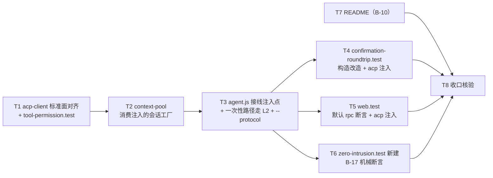

# pr-003-tasks.md — pr-003 内部任务图（消费层切到标准面：acp 实现对齐 + 默认 rpc + 零侵入机械断言）

**迭代**: 0022-agent-launcher-and-protocol-layer ｜ **阶段**: 5（PR 实现）· 末波 ｜ **PR 文件**: `prs/pr-003-protocol-layer-and-consumption-cutover.md`
**worktree 分支**: `feat/0022-pr-003-protocol-layer-and-consumption-cutover`（base = `b54f143`，已含 `2a2d979`（pr-001）/ `4777bf0`（pr-002）/ `b54f143`（pr-005）⇒ `launcher.js` / `config.js` 第 4 键 / `protocol.js` / `rpc-client.js` / `oneshot-client.js` 在本 worktree 内可读）｜ **任务总数**: **8**（T1~T8）｜ **依赖图**: 无环（见 §2）

---

## 0. 范围、文件面与事实锚点

### 0.1 本 PR 文件范围（唯一可写面；PR 文件「文件范围」8 项逐条）

| # | 文件 | 动作 | 内容（任务图切片） |
|---|---|---|---|
| 1 | `oamp/src/acp-client.js` | **修改** | 对齐标准面：① argv 改经 L1 `omp:acp` profile（逐字复现现状 argv）；② 增 `capabilities` / `capabilityNotes`（§5.7 acp 列）；③ `onChunk` → `onDelta({kind:'chunk',text})`；④ 删本地 `AcpError` 改抛 `ProtocolError`（码值五值逐字）+ 门名解析原语改引用 `protocol.js` 同源实现；⑤ 构造入参集合不变（10 键）；⑥ 补标准面回收动作 `close()`（见 A13） |
| 2 | `oamp/src/context-pool.js` | **修改** | 删 `import { AcpClient, AcpError }` 与 `new AcpClient({...})` ⇒ 消费**注入的**会话工厂；`onChunk` → `onDelta`；`AcpError`（8 处）→ `ProtocolError`；档位注入语义与身份附加由本 PR 承载 |
| 3 | `oamp/src/agent.js` | **修改** | ① `new ContextPool({...})` 改注入唯一注入点产物；② `runOmpTask` 瘦身为「一次性实现 → prompt → 上报」（删 `-p` argv / 进程 / 超时 / 行流回收）；③ `AGENT_FLAGS` + `parseAgentArgs` 增 `--protocol`；④ `runDaemonTask` 的 `onChunk` → `onDelta` 并按 `kind` 原样上送 |
| 4 | `oamp/test/tool-permission.test.js` | **修改** | argv 断言按 `omp:acp` profile；错误断言按 `ProtocolError`；**新增 acp 标准面外观断言**（B-16 的 acp 侧） |
| 5 | `oamp/test/confirmation-roundtrip.test.js` | **修改** | 三处 `new ContextPool` 改按注入的会话工厂；跨进程用例注入 `OAMP_PROTOCOL: 'acp'`；一次性 argv 断言按 `omp:oneshot` profile |
| 6 | `oamp/test/web.test.js` | **修改** | 默认路径 argv 断言**语义反转**（默认 ⇒ `['--mode','rpc']`）；需 acp 语义的用例显式注入；SSE 用例 `kind` 判据面明确 |
| 7 | `oamp/test/zero-intrusion.test.js` | **新建** | = §9.4.2 **B-17**：§3.3 三条判据的机械断言（D-2 / D-3 的可执行证据） |
| 8 | `oamp/README.md` | **修改** | = §9.2 **B-10**：env 表补 `OAMP_PROTOCOL`、配置面三键改四键、启动示例补 `--protocol`、常驻路径表述由「总是 `omp acp`」改为「默认 `omp --mode rpc`，可切回 acp」 |

> 本阶段产物 `prs/pr-003-tasks.md` 自身不计入源码 / 测试 / 文档面（同 pr-001 / pr-002 / pr-005 口径）。

### 0.2 非目标（零改动 / 防夹带；PR 文件「零改动」段逐条）

`oamp/src/protocol.js` / `oamp/src/rpc-client.js` / `oamp/src/oneshot-client.js` / `oamp/test/protocol-layer.test.js`（**归 pr-005**）、`oamp/src/launcher.js` / `oamp/src/config.js`（pr-001）、`oamp/web/**`（pr-004）、`oamp/src/web.js`（`task.update` 分支原样透传新 kind）、`oamp/src/{router,rpc,persist,transport,inbox,node-client,task,status,cluster,cluster-config,role-binding}.js`、`oamp/bin/**`、`oamp/API.md`、`oamp/llms.txt`、`oamp/package.json`、`omp/**`、`oamp/test/helpers/**`、`oamp/test/{acp-daemon,context-pool,project-workspace,call-protocol}.test.js`（**pr-002 已固定**）、本 PR 未列的其他既有测试文件。

### 0.3 读码事实锚点（base `b54f143` 实测；判据基础）

| # | 事实 | 位置 |
|---|---|---|
| A1 | `protocol.js` 已落地：导出 `ProtocolError`（下称标准面错误）/ `CAPABILITY_KEYS`（六键）/ `readApprovalToolName` / `createProtocolLayer({resident, profiles, bin, cwd, logger})`；acp 分支从 `resident` 取 `model` / `roleFile` / `tools`（`=== true`）/ `permission`，从 `createResident` 实参取 `{chatId, agentId, role}` 并读 `hooks.onExit` / `hooks.onPermissionRequest` / 惰性 `hooks.contextId`；`capabilities()` 对 acp 返回 `null`（acp 声明面随实例落地） | `oamp/src/protocol.js:14-21`、`:23`、`:32-36`、`:73-126`（acp 分支 `:96-118`） |
| A2 | `rpc-client.js` 已落地：会话对象 = `{prompt, cancel, close, capabilities, capabilityNotes, pid, contextId(恒 null)}`；`prompt` **忽略 `opts.model`**（无轮次级切换命令）；审批门读 `hooks.onApproval`（无钩子 ⇒ 回 `cancelled:true`）；`HANDSHAKE_TIMEOUT_MS = 10000` | `oamp/src/rpc-client.js:117-135`、`:308-327`、`:479-482`、`:13`、`:538-552` |
| A3 | `oneshot-client.js` 已落地：`createOneshotSession`；argv 经 `spawnAgent('omp:oneshot', {model, roleFile, tools, approval, prompt, stdin:'ignore'})`；增量面 = `onDelta({kind:'chunk', text, stream})` + 截断 `onDelta({event:'truncated', note})`；`prompt` 返回 `{text: stdout 累积, model: 请求模型, stop_reason:null, usage:null, pid}`；`contextId` 恒 `null` | `oamp/src/oneshot-client.js:89-247` |
| A4 | `PROFILES` 已落地：`omp:acp.modeArgs = ['acp']`；`omp:oneshot.approval = {mode:'yolo', appliesWhen:'always'}`；`buildArgv` 次序 = `modeArgs → skills → rules → tools → session → model → roleFile → approval → positional`；`spawnAgent` 的 stdin 可指定（常驻 `pipe` / 一次性 `ignore`） | `oamp/src/launcher.js:12-88`、`:109-137`、`:150-156` |
| A5 | `config.js` 第 4 键已折叠三档（`env.OAMP_PROTOCOL` > `config.json: protocol` > 内置 `'rpc'`），越界值响亮失败；**零生产读者**（角色级 `--protocol` 明写归 pr-003） | `oamp/src/config.js:18-19`、`:49-`（`readProtocol`）、`:117`、`:144-145` |
| A6 | `acp-client.js` 现状：argv 构造 `:137`（`['acp','--no-skills','--no-rules']` + `--no-tools`（工具关）+ `--no-session` + `--model` + `--append-system-prompt` + `--approval-mode always-ask`（工具开））；本地 `AcpError` 类 `:42-46`，全文件 **14 处**引用（`instanceof` 判定 `:174` / `:321`；构造 / 抛出 `:169`/`:175`/`:176`/`:192`/`:193`/`:226`/`:230`/`:298`/`:305`/`:328`/`:366`/`:674`）；门名解析原语 `:30-34`（模块私有）+ 前缀常量 `:23`；`prompt` 签名 `:191`（`{model, timeoutMs, onChunk}`）、`onChunk` 调用 `:207`；`_chunkHandler` 的 `agent_message_chunk` 分支 `:201-203`；两道门 `:434-575`；回收面只有 `cancel()` `:258` / `kill()` `:267` / `dispose()` `:292-294`（= `kill()` 的别名），**无 `close()`** | 实测 |
| A7 | `context-pool.js` 现状：`import { AcpClient, AcpError }` `:7`；`prompt` 的 `onChunk` `:150`/`:157`/`:186`；`AcpError` **8 处**（`instanceof` 判定 `:191` / `:251`；`new AcpError(...)` `:151`/`:153`/`:168`/`:178`/`:242`/`:257`）；`new AcpClient({...})` `:203-249`（`auditContext` 四键 `:211-218`（含惰性 `context_id` getter）、`onExit` `:220-221`、`onPermissionRequest` 的 allow 档位门 + 身份附加 `:223-226`）；`_ensureClient` 复用守卫 `:201`（读实现私有成员 `client.dead` / `client.disposed`）；释放 `this.client?.dispose()` `:167`；`get contextId` = `ctx-<pid>-<generation>` `:133` | 实测 |
| A8 | `agent.js` 现状：`runOmpTask` `:181-280`（`-p` argv `:192-199`、spawn `:207`、行流回收与 200 行截断 `:236-250`、截断文案 `:242`）；`runDaemonTask` `:372-440`（`onChunk` `:396`）；`runShellTask` `:443-`（自带截断 `:487-490`）；`AGENT_FLAGS` `:589`；`parseAgentArgs` `:592-624`；`new ContextPool({...})` `:698-712`；`pool.dispose()` `:750` / `:885`；`OMP_BIN()` `:31`；`MAX_STREAM_LINES = 200` `:26` | 实测 |
| A9 | `web.js` 的 `task.update` 分支只按「`kind` 是否字符串」过滤并原样透传 `{kind, text, line}`；`stdout` 专属累积在 `:1629`（不被新 kind 触发）⇒ 本 PR 零改动该文件 | `oamp/src/web.js:1626-1632` |
| A10 | 测试面计数（实测）：`oamp/test/*.test.js` = **30**（含 pr-005 新增的 `protocol-layer.test.js`）；本 PR 新增 `zero-intrusion.test.js` ⇒ **31**；`oamp/test/helpers/*.js` = 2 | 实测 |
| A11 | `web.test.js` 的 fake omp `FAKE_ACP_SOURCE`（`:25-101`）为 **ACP-only**：`argv.includes('-p')` 分支 + `initialize` / `session/new` / `session/set_config_option` / `session/prompt` 应答，**无 `--mode rpc` 应答**（不吐 `ready` 帧）；argv 日志在进程启动即写（`:33-35`） | 实测 |
| A12 | `web.test.js` 的 `sendAndWait` 默认 `timeoutMs = 8000`（`:270`）；rpc 握手上限 = 10000（A2）⇒ 默认 rpc + ACP-only 桩下，该常驻轮次**必然握手超时失败**（失败前 argv 已落盘） | 实测 A2 / A11 |
| A13 | `protocol-layer.test.js` 的回收辅助注释：「acp 分支的会话对象外观（`close()`）归 pr-003 对齐，今日只有 `kill()` ⇒ 两者兼容回收」；该文件另断言 `createProtocolLayer({resident:{protocol:'acp'}})` 起 acp 子进程（`argv[0] === 'acp'`、无 `--mode`）与 `capabilities() === null` | `oamp/test/protocol-layer.test.js:238-241`、`:285-295` |
| A14 | `hygiene.test.js`：扫描 `bin/` + `src/` **平铺** `.js` + `package.json` 的七词表（词边界 + 大小写不敏感）+ `dependencies` 为空；**不含**孤儿模块断言 | `oamp/test/hygiene.test.js:17-24`、`:26-41`、`:63-67` |
| A15 | `omp-executor.test.js` 自带 fake omp（不涉协议）走 `executor:'omp'` 一次性路径 + shell 兼容 ⇒ 默认切 rpc 不影响该文件 | `oamp/test/omp-executor.test.js:14-30`、`:89-120` |
| A16 | `confirmation-roundtrip.test.js`：直引 `ContextPool`（`:20`）；三处 `new ContextPool({bin, cwd, permission, onPermissionRequest})`（`:319` / `:354` / `:386`）；跨进程用例的 env 载体 `startFlaggedAgent`（`:202`）与用例级 `envExtra`（`:263`）；一次性 argv 断言 `:703-711`（`--approval-mode yolo`） | 实测 |
| A17 | `tool-permission.test.js`：直引 `AcpClient`（`:12`）；`startClient`（`:307`，`new AcpClient({bin, cwd, logger, ...opts})`）；argv 断言 `:329` / `:338`（常驻段序）/ `:510` / `:516` / `:527`（档位）；错误断言 `:441`（`err.name === 'AcpError' && err.code === 'permission_denied'`）与 code-only `:493` / `:709` / `:857` | 实测 |
| A18 | D-2 判据 1 的**字面读法不可成立**：`grep -rn "acp-client\|rpc-client\|oneshot-client" oamp/src` 实测命中 **5 文件 13 处**，其中 `oamp/src/acp-client.js:1`（文件头自指）、`oamp/src/agent.js:30`（注释引用既有常量口径）、`oamp/src/rpc-client.js`（4 处注释，属 pr-005 零改动面）均非 import / 构造行为面 ⇒ 见 §5 上报① | 实测 |

### 0.4 本 PR 内的冻结契约（每个任务都必须遵守）

1. **唯一可写面 = §0.1 的 8 项**；`git diff --stat` 越界即 F10 / F11 验收不通过（PR 文件「零改动（防夹带）」段逐字）。
2. **标准面形状不扩展**：不新增字段 / 配置键 / env 键 / 目录 / 第三方依赖；三实现（rpc / acp / oneshot）的会话形状与能力位键集照抄 §5.1 / §5.7。
3. **acp 行为零变更**（N12 / A4）：`_chunkHandler` 只接受 `agent_message_chunk` 的分支、两道门逻辑、冻结计时 / `_pausedTurns`、`_waitQuiescence`、既有常量逐字不动；只做**外观对齐**（能力位 + `onDelta` + `ProtocolError` + `close()` + 门名原语同源 + argv 经 L1 profile）。
4. **消费层零协议分支**：`context-pool.js` / `agent.js` / `web.js` 不 import / 不构造任何具体协议实现模块，不出现按协议取值（`'rpc'` / `'acp'` / `'oneshot'`）的分支。
5. **池的四项语义逐字不变**：键 `chatId::agentId`、`QUEUE_LIMIT = 8`、同键 FIFO 串行、`_evictIfNeeded` LRU、`_failSession` 收尾分类、`sentTurns` 首轮名额语义、`contextId` / `pid` / `model` 审计面。
6. **门的既有回路零改动**：`raiseConfirmation` / `readConfirmationOptions` / `settleConfirmation` / `cancelPending` / `handleNotice` / `runShellTask` / 心跳两档 / 重连自愈逐字不动。
7. **argv 真源 = `launcher.js`**：生产 argv 一律经 `buildArgv` / `spawnAgent` 产出；测试内的期望值取自 `PROFILES` / `buildArgv`，**不得**复写 profile 形态的本地期望数组。
8. **命令形态**：单文件跑用 `node --test <file>`；**全量套件只在 T8 跑一次**（实现阶段不反复跑全量）。

### 0.5 中间态红面登记（PR 文件「关键约束（决定本 PR 不能再拆）」的直接结果）

| 时点 | 仓库状态 | 说明 |
|---|---|---|
| T1 落地后、T2 落地前 | **不可加载**：`context-pool.js:7` 仍 import 已删的 `AcpError`，而 `acp-client.js` 不再导出它 ⇒ 一切经 agent 子进程的测试（`acp-daemon` / `context-pool` / `project-workspace` / `call-protocol` / `web` / `confirmation-roundtrip` / `omp-executor` / …）**红** | T1 的验收面刻意**不含**这些（见 T1 验收 11） |
| T2 落地后、T3 落地前 | 池的构造契约已变而 `agent.js:698` 仍传旧构造面 ⇒ 同上仍红 | T2 的验收 = 一次性脚本 + 静态面（见 T2 验收 9~10） |
| T3 落地后 | 经 agent 的测试转绿：pr-002 固定的 4 个 + `omp-executor`（T3 验收 7）；`web` / `confirmation-roundtrip` / `zero-intrusion` 按 T4~T6 各自收敛 | — |

> **任何中间态都不得被提交为「可交付状态」**：T1~T3 是**同一事务的三个串行切片**，不是三个 PR（PR 文件「关键约束（决定本 PR 不能再拆）」逐字；见 §5 登记②）。

---

## 1. 任务列表

### T1: `acp-client.js` 对齐标准面 + `tool-permission.test.js` 同批（acp 单实现 + 其最短判定面）

- **验收标准**:
  1. **argv 真源迁移且逐字等价**：`start()` 的 argv 由 L1 产出（`buildArgv('omp:acp', {model, roleFile, tools})` 形态，或 `spawnAgent('omp:acp', …)` 封装）——文件内不再出现 `const args = ['acp'` 的手工拼装（该检索式零命中）。**逐字等价判据**：迁移前先以既有 `FAKE_ACP_ARGS_LOG` 观测面落盘**四组**现状 argv（① 匿名 / 工具关；② 角色 + 模型 + 工具关；③ 工具开 + `permission='allow'`；④ 工具开 + `permission='deny'`），迁移后同法再取四组，逐位相等。依据 §3.3 L1 行「生产消费层的 import 图中不出现 argv 知识」+ MI-2 的规范次序。
  2. **能力位声明（§5.7 acp 列逐字）**：`capabilities` 六键齐全（键集取自 `protocol.js` 的 `CAPABILITY_KEYS`，不增不减）、取值 ∈ `{yes, no, degraded}`；`thinking === 'no'`；`streaming` / `approvalGate` / `introspection` === `'yes'`；`hostTools` / `queueControl` === `'no'`；**每个非 `yes` 键**（`thinking` / `hostTools` / `queueControl`）的 `capabilityNotes[key]` 为**非空字符串**。判据 = 一次性脚本逐键断言。
  3. **统一 `onDelta` 外观**：`prompt(text, {model, timeoutMs, onDelta})` 的文本增量经 `onDelta({kind:'chunk', text})` 到达（逐块、原样、不聚合）；`grep -n "onChunk" oamp/src/acp-client.js` **零命中**（形参与调用一并改）；思考 / 工具增量**仍不产生**（`_chunkHandler` 的 `agent_message_chunk` 分支逐字未动）。
  4. **错误契约**：本地 `AcpError` 类删除（`grep -n "AcpError" oamp/src/acp-client.js` **零命中**）；全文件抛 / 判一律 `ProtocolError`，**码值五值逐字不变**（`context_crashed` / `model_unavailable` / `timeout` / `permission_denied` / `context_busy`）；原 `instanceof` 判定点（`:174` / `:321`）语义不变。
  5. **门名解析原语同源**：文件内不再自持 `readApprovalToolName` / `APPROVAL_MESSAGE_PREFIX`（零重复实现），改为引用 `oamp/src/protocol.js` 的具名导出；多行 `title` 的提取语义逐字不变（既有门用例保持绿，`:434-575` 逻辑逐字未动）。
  6. **标准面回收动作**：`close()` 在场，语义 = 既有 `dispose()` / `kill()`（主动终止、幂等、**不触发** `onExit`）。追溯 = §5.1 四动作（`close()`）+ A13（pr-005 的回收辅助已按此预留兼容）；`close()` 未在 PR 文件的 acp-client 变更项 ①~⑤ 中逐字列出，但它是 §5.1「会话四动作」与池的释放路径（`context-pool.js:167`）的必需项 —— 不补则池的释放路径在标准面无动作可用；见 §5 登记⑨。
  7. **行为零变更（严格不动清单逐条）**：`_chunkHandler`（`:201-203`）、两道门（`:434-575`）、冻结计时 / `_pausedTurns`、`_waitQuiescence`、常量（`CANCEL_GRACE_MS` / `KILL_GRACE_MS` / `INIT_QUIET_MS` / `INIT_MAX_MS` / `REQUEST_TIMEOUT_MS` / `TOOL_TITLE_MAX`）逐字未动。判据 = `git diff` 逐块核对。
  8. **构造入参集合不变 = 10 键**（PR 文件 ⑤）：`bin` / `model` / `cwd` / `tools` / `roleFile` / `permission` / `auditContext` / `logger` / `onExit` / `onPermissionRequest` 全部保留原名原义；`auditContext` 四键与惰性 `context_id` getter 语义不变。判据 = `protocol-layer.test.js` 的 acp 分支装配用例（`:285-295`）保持绿。
  9. **`tool-permission.test.js` 同批对齐**：① 既有 argv 断言（`:329` / `:338` 常驻段序、`:510` / `:516` / `:527` 档位）的期望值取自 `PROFILES['omp:acp']` / `buildArgv`（文件内**零** profile 形态本地复写数组）；② 拒绝档错误断言 `:441` 改按标准面错误契约（`err.name === 'ProtocolError'` + `err.code === 'permission_denied'` + 文案不变），code-only 断言 `:493` / `:709` / `:857` 语义不变；③ **新增 acp 实现的标准面外观断言**（= §9.4.2 **B-16 的 acp 侧**）：六键齐全 + 三态取值 + 非 `yes` 必有非空 `capabilityNotes` + `prompt` 文本增量经 `onDelta({kind:'chunk', text})` 到达 + 错误面 `ProtocolError`（`code` 五值）；④ 其余断言零改动（`git diff` 逐块核对）。
  10. **文本洁净**：两文件文本不命中 hygiene 七词（A14；含 `token` 词边界陷阱与中文语境独立词）。
  11. **本任务命令面**：`node --test oamp/test/tool-permission.test.js oamp/test/protocol-layer.test.js oamp/test/hygiene.test.js` 零失败（本任务**不**跑经 agent 子进程的测试，理由见 §0.5）。
  12. **改动面封闭**：`git diff --stat` 只含 `oamp/src/acp-client.js` + `oamp/test/tool-permission.test.js`。
- **前置依赖**: 无
- **优先级**: P0
- **追溯**: PR 文件「文件范围」第 1 / 6 项 + 验收 1（acp 侧）/ 5 / 6 / 8 / 13；architecture §3.3（acp 行判据）/ §5.1（标准面）/ §5.6（门名同源）/ §5.7（acp 列）/ §9.2 **B-8** / §9.4.1 **B-13** / §9.4.2 **B-16（acp 侧）** / §11 **R1 / R2**；prd/F06 验收 2 / 3（acp 不补能力 + 可切回）、F09 验收 1 / 2 / 3（能力位显式声明）；既有代码 A4 / A6 / A13 / A14 / A17

### T2: `context-pool.js` —— 改消费注入的会话工厂（标准面 + 档位钩子 + 审计面逐字不变）

- **验收标准**:
  1. **依赖面切断（D-2 池侧）**：`grep -n "acp-client" oamp/src/context-pool.js` **零命中**（`import { AcpClient, AcpError }` 与 `new AcpClient({...})` 一并消失）；`grep -n "AcpError" oamp/src/context-pool.js` **零命中**，8 处引用（6 处构造 / 抛出 + 2 处 `instanceof` 判定）改 `ProtocolError`，判定语义（收尾分类）不变。
  2. **构造面 = 注入的会话工厂**：池不再自建具体实现，也不再接受 `bin` / `cwd` / `tools` / `roleFile`（其取值改由注入方在 resident / 门面装配面承载，§5.1 / §5.2）；新增注入位（形参名 `createResident` = 门面的同名成员）`[model_inferred MI-1]`。判据 = 一次性脚本：以桩工厂注入 ⇒ 首次建键时调用恰一次，入参键集合 = `{chatId, agentId, role, hooks}`。
  3. **钩子装配（会话身份 + 档位门 + 出口）**：`hooks` 面提供 ①`onPermissionRequest`（acp 分支消费，A1）与 ②`onApproval`（rpc 分支消费，A2）两型，**均仅 `permission === 'allow'` 档注入**、且均附加 `{chatId, agentId, origin}`（`origin` = 该轮 origin）后透传给 `onPermissionRequest` 出口——既有 `:223-226` 语义逐字保持；③`onExit` = `_onClientExit` 实体（空闲崩溃收尾）；④`contextId` 为**惰性 getter**（取值期才解析，转发会话的 `ctx-<pid>-<generation>`）。
     > `[model_inferred MI-2]`：档位门**同样适用于 `onApproval`**（理由见 §5）。
  4. **审计面逐字不变**：`auditContext` 四键的取值来源不变（`instance` ← `agentId` / `role` ← 池的 `role` / `chat_id` ← `chatId` / **惰性** `context_id`）；`get contextId` 公式 `ctx-<pid>-<generation>`（`:133`）不变；`pid` / `model` 审计面不变。
  5. **`onDelta` 透传**：调用方的 `onDelta` 原样交给会话 `prompt`（零改形、零包装）；`grep -n "onChunk" oamp/src/context-pool.js` **零命中**（形参、队列字段、`_pump` 透传一并改）。
  6. **释放路径走标准面**：`this.client?.close()`（标准面无 `dispose` 名 ⇒ 不得保留 `dispose()` 调用）；`dispose()` / `release()` / `_evictIfNeeded` / SIGINT 收尾的**可见语义**不变（`context_released` / `context_reset` 提示、键移除、排队轮次失败、在飞轮次由会话回绝）。
  7. **严格不动清单逐条核对**：键 `chatId::agentId`、`QUEUE_LIMIT = 8`、同键 FIFO 串行、`_evictIfNeeded` LRU 语义、`_failSession` 收尾分类（`model_unavailable` / `context_busy` / `permission_denied` 不重置上下文）、`sentTurns` 首轮名额语义（仅在成功返回后自增）。
  8. **会话可用性判据（登记，非新决策）**：现复用守卫（`:201`）读实现私有成员 `client.dead` / `client.disposed`，而标准面无该成员 ⇒ 本任务取最小口径：守卫改按**池自身状态**（`this.client` 在场 + 池的 `closed` 标记），会话失效一律由调用失败路径 `_failSession` 收尾（分类不动）`[model_inferred MI-3]`。判据 = 一次性脚本：桩会话在 `close()` 后再次 `prompt` 失败 ⇒ 池走 `_failSession` ⇒ 键移除 + `context_reset` + 排队轮次失败。
  9. **一次性脚本核对（不入库）**：以桩工厂逐条核对验收 2~6 与 8（装配入参、钩子三成员与档位门、惰性 `context_id`、`onDelta` 透传、释放路径、失效收尾）。
  10. **静态面（D-2 判据 2 的池侧）**：`grep -nE "'rpc'|'acp'|'oneshot'" oamp/src/context-pool.js` **零命中**；文件内不出现具体协议实现模块名。
  11. **改动面封闭**：`git diff --stat` 只含 `oamp/src/context-pool.js`。
- **前置依赖**: T1（`ProtocolError` 契约与 acp 会话的 `close()` 由 T1 落定）
- **优先级**: P0
- **追溯**: PR 文件「文件范围」第 2 项 + 验收 1（池侧）/ 7（档位与身份）/ 8；architecture §3.3（context-pool 行判据「改为消费**注入的**会话工厂与 `ProtocolError`」）/ §5.1（`hooks` 形状与 `createResident` 签名）/ §5.6（门映射）/ §9.2 **B-6** / §4.2 **L2-5**（归一在实现内、消费层零改动）；prd/F03 验收 1 / 2、F05 验收 1 / 4；既有代码 A1 / A2 / A7

### T3: `agent.js` —— 接线唯一注入点 + 一次性路径走 L2 + `--protocol`

- **验收标准**:
  1. **注入点接线**：`new ContextPool({...})`（`:698`）改为注入唯一注入点的产物——门面经 `createProtocolLayer({ resident, bin: OMP_BIN(), cwd: process.cwd(), logger })` 装配，`resident = {protocol（角色级档位，未指定即 null）, configProtocol（`loadConfig()` 的第 4 键，已折叠 env > config.json > 内置 rpc）, model, roleFile, tools（布尔）, permission}`（§5.2 的「null ⇒ 由调用方按既有解析链填入」逐条）；`createResident` 交给池，门面（`createEphemeral`）交给任务面。判据 = 读码 + 一次性脚本（默认 ⇒ 常驻 argv `--mode rpc`；`--protocol acp` ⇒ argv 首段 `acp`）。
  2. **CLI `--protocol`（MI-A-7）**：`AGENT_FLAGS`（`:589`）增 `--protocol`；`parseAgentArgs`（`:592`）取值域恰 `{rpc, acp}`；非法取值 / 缺取值 / 未知参数 ⇒ 退 2（体例与文案体例逐字同既有 `--tools` / `--permission`）；未指定 ⇒ `null`（交由解析链，不自行落默认）。判据 = 子进程 CLI：`oamp agent start <id> --protocol acp`（生效：argv 首段 `acp`）/ `--protocol bad` 退 2 / `--protocol`（无值）退 2 / 未知参数退 2。
  3. **`runOmpTask` 瘦身（F07 / 主 agent 裁定 1）**：改为「取标准面的一次性实现（`createEphemeral`）→ `prompt(text, {model, timeoutMs, onDelta})` → 上报」；删除本处的 `-p` argv 拼装（`:192-199`）、`spawn`、超时三拍、行流回收（`:236-250`）。**上报面形状逐字不变**：
     - 行流：`{kind: 'stdout'|'stderr', line}`（由 `onDelta({kind:'chunk', text, stream})` 映射，行流身份可区分）；
     - 截断：`{event:'truncated', note:'明细行数超上限（200），后续行不再逐条上报'}`（文案逐字，恰一次）；
     - 终态：`task.result{state, executor:'omp', exit_code, duration_ms}`（+ 失败 `error` / `timed_out` 语义不变）。
  4. **一次性 argv = `omp:oneshot` profile 期望值**（§5.2 / MI-2 次序）：逐位等于 `buildArgv('omp:oneshot', {model, roleFile, tools, approval, prompt})` —— `-p` 首段、`--no-tools`（工具关时）、`--no-session`、`--model`（有值时）、`--append-system-prompt`（有角色时）、`--approval-mode`（工具开 + allow ⇒ `yolo`；工具开 + deny ⇒ `always-ask`；工具关 ⇒ **不追加**）、末位位置参数 = 项目块 + `\n\n` + 原文（无项目上下文时逐字等于原文）；前后两轮**无上下文续接**。判据 = `FAKE_ACP_ARGS_LOG` / `-p` 桩 + `omp-executor.test.js` / `project-workspace.test.js` / `context-pool.test.js`。
     > 登记：`—no-tools` 与 `--no-session` 的规范次序取 **MI-2**（`--no-tools → --no-session`），与今天一次性侧相对次序不同（pr-002 A6 已实测并放宽该断言）⇒ 本判据按 profile 逐位落字，**不**额外要求与旧序逐位一致（见 §5 登记①）。
  5. **`runDaemonTask` 增量承接（F04 消费侧 / F08 管道面）**：`onChunk`（`:396`）改 `onDelta`，按 `kind` **原样**上送 `{kind, text}`（`chunk` / `thinking` / `tool_call` / `tool_output` 四类逐类可达）；不聚合、不节流、不落库（只经 `task.update`）。
  6. **严格不动**：`raiseConfirmation`（`:319`）/ `readConfirmationOptions`（`:303`）/ `settleConfirmation` / `cancelPending` / `handleNotice` / `runShellTask`（`:443`，含 `:487-490` 截断）/ 心跳两档（`heartbeatPlan`）/ 重连自愈 / `MAX_STREAM_LINES` 语义。判据 = `git diff` 逐块核对。
  7. **静态面（D-2 判据 1 / 2 的 agent 侧）**：agent.js 不 import / 不构造具体协议实现模块；`grep -nE "'rpc'|'acp'|'oneshot'" oamp/src/agent.js` **零命中**；argv 字面量（`'-p'` / `'--no-skills'` / `'--no-session'` / `'--approval-mode'` / `'--no-tools'`）**零命中**。
  8. **行为回归（经 agent 的既有面）**：`node --test oamp/test/context-pool.test.js oamp/test/acp-daemon.test.js oamp/test/project-workspace.test.js oamp/test/call-protocol.test.js oamp/test/omp-executor.test.js` 零失败。其中 pr-002 固定的 4 个 = acp 注入下的既有行为回归（F06 验收 1 的回归面）；`omp-executor` = 一次性路径与 shell 路径零回归（F07）。
  9. **管道面一次性证据（不入库）**：以 rpc 形态 stub bin 起 agent，一轮内含三类过程帧 ⇒ `task.update` 上送 `thinking` / `tool_call` / `tool_output` **逐类可数**；受理回包（`response{command:'prompt',success:true}`）**不结算**轮次、终态只认 `agent_end{isTerminal:true}`、`agent_end{isTerminal:false}` 继续等（N-5）；非门反向请求（非门交互类 / 纯展示类 / 未知帧）经消费层**零新增分支**、轮次正常终态。
     > 登记：该面的**入库**证据面在本 PR 的文件范围内不存在（7 个 ACP-only 桩 + 唯一可新增文件承载 B-17 机械断言）⇒ 以一次性脚本 + 阶段 6 真实进程证据承接（见 §5 上报③）。
  10. **改动面封闭**：`git diff --stat` 只含 `oamp/src/agent.js`。
- **前置依赖**: T1、T2
- **优先级**: P0
- **追溯**: PR 文件「文件范围」第 3 项 + 验收 2 / 3 / 4 / 6 / 7 / 8 / 9 / 10 / 12；architecture §3.4 流 1 / 流 3 / 流 4、§4.2 **L2-2 / L2-3 / L2-7 / L2-9**、§5.1 / §5.2（profile 字段集与「调用方按既有解析链填入」）/ §5.3（解析链与角色级档位）/ §5.5（增量通道与 kind 取值域）、§9.2 **B-7**、§11 **N-5 / R7**、§12.1 **MI-A-7**；prd/F01 验收 1 / 2（统一入口 + 启动数据化）、F02 验收 2 / 5、F03 验收 1、F07 验收 1 / 3、F08 验收 3；既有代码 A2 / A3 / A4 / A5 / A8 / A15

### T4: `confirmation-roundtrip.test.js` —— 按新构造契约与 acp 注入对齐（门回路回归面）

- **验收标准**:
  1. **三处池构造改造**：`:319` / `:354` / `:386` 的 `new ContextPool({bin, cwd, permission, onPermissionRequest})` 改为「门面装配 + 注入会话工厂」形态（进程内：`createProtocolLayer({resident:{protocol:'acp', permission, …}, bin: FAKE_BIN, cwd: ROOT})` ⇒ 取 `createResident` 注入池）；三处均**不得残留**旧构造键（`bin` / `cwd` / `tools` / `roleFile` 不再传池）。
  2. **跨进程用例显式注入 `OAMP_PROTOCOL: 'acp'`**：env 载体 = `startFlaggedAgent`（`:202`）与用例级 `envExtra`（`:263`）；理由 = 默认协议已切 rpc 而 4 文件的桩为 ACP-only（pr-002 的 B-11~B-15「最小更新」口径，不扩写 fake 桩）。
  3. **一次性 argv 断言按 profile**（`:703-711`）：期望值取自 `launcher.js`（`buildArgv('omp:oneshot', …)` 或 `PROFILES['omp:oneshot']` 的字段推导），`--approval-mode yolo` 的口径与值逐字保持；文件内**零** profile 形态本地复写数组。
  4. **其余断言零改动**：T1①~③ 的门透传 / 档位门 / 冻结计时判据、跨进程 7 字段信封与三事件通知面、失效清扫面逐字不动（`git diff` 逐块核对）。
  5. **本文件全绿**：`node --test oamp/test/confirmation-roundtrip.test.js` 零失败。
  6. **改动面封闭**：`git diff --stat` 只含该文件。
- **前置依赖**: T2、T3
- **优先级**: P0
- **追溯**: PR 文件「文件范围」第 5 项 + 验收 6（**主面**：acp 行为回归）/ 7 / 9 / 13；architecture §9.4.1 **B-15** / §11 **R2** / §5.3（钩子注入点）/ §5.5；prd/F06 验收 1（**主面**）、F05 验收 1~4、F07 验收 1；既有代码 A16

### T5: `web.test.js` —— 默认路径断言语义反转 + acp 语义注入 + SSE `kind` 判据面

- **验收标准**:
  1. **默认路径断言反转（F02 验收 2）**：用例「Web：执行路径判定——默认 daemon / one_shot / ! shell」的常驻路径判据由 `argvs.some((a) => a[0] === 'acp')`（`:557`，注释「默认路径应起 acp 常驻进程」）**改写**为「默认（不做任何协议指定）⇒ 被启动子进程 argv 含 `['--mode','rpc']`」；**不得**以「注入 acp 后断言 acp argv」替代该条。
  2. **该用例的其余路径判据不受影响**（一次性 `-p` `:558`、`!` shell），且用例整体**确定性通过**。⚠ 事实约束（A11 / A12）：该用例的桩为 ACP-only、rpc 握手上限 10s、`sendAndWait` 默认预算 8s ⇒ 默认 rpc 下的常驻轮次**必然握手超时失败**（失败前 argv 已落盘）。因此该轮次的等待预算与文本判据须按此调整为确定性形态；其「常驻首轮注入项目上下文」的语义由 `project-workspace.test.js`（pr-002 固定 acp，见 `:232` 的 `OAMP_PROTOCOL: 'acp'` 注入与 `:1021-1022` 的首轮注入断言）承载。本任务取 `[model_inferred MI-5]` 的最小形态，提请主 agent 确认（见 §5 上报②）。
  3. **需 acp 语义的用例显式注入 `OAMP_PROTOCOL: 'acp'`**：① 「model 透传与审计」（`:563-594`，其 argv 判据 `:573-575` 按 `omp:acp` profile 期望值落字——进程启动模型 = 注入点 resident 的模型解析值，**每轮请求模型仍经 `set_model` 生效**，`out.model` 审计判据逐字保持）；② 「SSE 事件序列 + E-4」（`:596-642`）。
  4. **SSE 用例 `kind` 判据面明确**（`:627`）：`updates.every((u) => u.data.kind === 'chunk' && typeof u.data.text === 'string')` 的判据锁定在该用例显式注入的 **acp 链路**（acp 不产生 thinking / tool 增量 ⇒ 该断言成立；rpc 链路含过程增量 ⇒ 不在本用例的判据面内）；「过程增量不入库（该轮仍恰 2 行）」「E-4 全部 `task_update` 在 `message(out)` 之前」「首片必须到达」等断言逐字保持。
  5. **本文件全绿**：`node --test oamp/test/web.test.js` 零失败。
  6. **改动面封闭**：`git diff --stat` 只含该文件。
- **前置依赖**: T3（T1 / T2 经 T3 传递）
- **优先级**: P0
- **追溯**: PR 文件「文件范围」第 4 项 + 验收 3 / 4 / 9 / 10 / 11 / 13；architecture §9.4.1 **B-14**（`:557-574` 两处 argv 断言的最小更新）/ §11 **R2** / §5.3 / §5.5（kind 取值域与过程不入库）；prd/F02 验收 2、F06 验收 1（主面）、F08 验收 1 / 2（**辅面**：管道面）/ F08 验收 3；既有代码 A9 / A11 / A12

### T6: `oamp/test/zero-intrusion.test.js` —— 新建（§9.4.2 B-17：D-2 / D-3 的可执行证据）

- **验收标准**:
  1. **唯一新增测试文件**：`oamp/test/zero-intrusion.test.js` 存在，与既有 30 个测试文件并列；只用 `node:*`（`node:test` + `node:assert/strict`），**零第三方依赖**、不新增 / 不修改 `oamp/test/helpers/**`。判据 = `git diff --stat` + import 面。
  2. **① 消费层不 import / 不构造具体协议实现模块**：对 `oamp/src/context-pool.js` / `agent.js` / `web.js` 三文件断言——无 `from './{acp,rpc,oneshot}-client.js'` 形态的 import，无 `new (AcpClient|…)` 形态的构造（判据按 §9.4.2 B-17 的逐字表述：**生产消费层**三文件为零命中面）。
  3. **② 消费层不出现按协议取值的分支**：三文件文本对 `'rpc'` / `'acp'` / `'oneshot'` 值字面**零命中**（与 T2 验收 10 / T3 验收 7 的静态面同判据，此处固化为可重复断言）。
  4. **③ 切换协议只改注入配置时，生产消费层 diff 为零**：以**运行时快照比对**实现——读取三文件内容为基线快照 ⇒ 以不同的注入配置各起一次真实 agent（默认（rpc）与 `OAMP_PROTOCOL=acp`）⇒ 再读并逐字节比对，相等即通过（基线 = 测试起始快照，不内嵌哈希）`[model_inferred MI-4]`。
  5. **无架构外断言**：本文件**不**承载行为断言（三类增量 / 门 / 时序等归 T3~T5 与阶段 6），只承载上述三条机械判据（§9.4.2 的定位：D-2 / D-3 的可执行证据，与 B-11~B-15 的既有断言更新**并存、互不替代**）。
  6. **文本洁净**：新文件不命中 hygiene 七词（A14）；`oamp/package.json` 零改动。
  7. **本任务命令面**：`node --test oamp/test/zero-intrusion.test.js oamp/test/hygiene.test.js` 零失败。
  8. **改动面封闭**：`git diff --stat` 只含该新文件。
- **前置依赖**: T3（T1 / T2 经 T3 传递；判据面 = 最终消费层形态）
- **优先级**: P0
- **追溯**: PR 文件「文件范围」第 7 项 + 验收 1 / 2 / 13；architecture §3.3（三条机械判据）/ §9.4.2 **B-17** / §12.2-3（用户裁决：新增机械断言测试）/ §9.4（与既有面并列不替代）；prd/F03 验收 2 / 3 / 4（D-2 / D-3 / 适用范围 = 生产消费层）；既有代码 A7 / A9 / A18

### T7: `oamp/README.md` —— 与实现一致（§9.2 B-10）

- **验收标准**:
  1. **环境变量表含 `OAMP_PROTOCOL` 行**：列名体例与既有行一致（作用域 = agent、默认 `rpc`、取值 `rpc|acp`、语义 = 常驻协议指定的全局档）。
  2. **「配置面」由三键改四键**：`oamp/config.json` 的**顶层** `protocol` 键（示例 JSON 含 `"protocol": "rpc"`）+ 优先级说明（env > 配置文件 > 内置）；首段「库路径 / 默认模型 / 上下文上限三键」表述随之更新（不得残留「三键」）。
  3. **角色实例启动示例补 `--protocol acp|rpc`**（与既有 `--role` / `--model` / `--tools` / `--permission` 同段）。
  4. **常驻路径表述更新**：由「总是 `omp acp` 进程」改为「默认 `omp --mode rpc`，可经三档注入配置切回 `acp`」——覆盖运行路径表、常驻上下文段、集群 / 角色段中所有「`omp acp`」的默认路径表述（历史沿革 / ACP 兜底说明处保留 `acp` 是正确表述）。
  5. **不触碰 `oamp/API.md` / `oamp/llms.txt`**（配置面**不是** HTTP 接口面 ⇒ 不触发 0016 / 0021 的文档漂移锁）。
  6. **判据 = 逐条机械核对**：`grep -n "OAMP_PROTOCOL" oamp/README.md` 命中 ≥1；示例 JSON 含 `"protocol"`；启动示例含 `--protocol`；`grep -n "三键" oamp/README.md` **零命中**。
  7. **改动面封闭**：`git diff --stat` 只含 `oamp/README.md`。
- **前置依赖**: 无（与 T1~T6 文件面零重叠，可任意时点并行落地）
- **优先级**: P1（不阻塞其它任务；**仍属本 PR 验收必要项**）
- **追溯**: PR 文件「文件范围」第 8 项 + 验收 4 / 16；architecture §9.2 **B-10** / §9.3（`API.md` / `llms.txt` 零改动）；prd/F01 验收 2（启动信息数据化）、F02 验收 1 / 3（配置面与选择域）

### T8: 收口核验（全库全绿 / 改动面封闭 / D-1·D-2·D-3 机械判据 / 边界与上游零改动）

- **验收标准**:
  1. **全库测试面全绿**：`node --test oamp/test/*.test.js`（**31** = 30 既有 + 本 PR 新增 `zero-intrusion.test.js`；含 pr-002 固定的 4 个与 pr-005 的 `protocol-layer.test.js`）零失败；`oamp/test/hygiene.test.js` 的零依赖与凭据词断言保持绿（F12 承载）。
  2. **本 PR 的 4 个测试文件全绿**：`node --test oamp/test/zero-intrusion.test.js oamp/test/tool-permission.test.js oamp/test/web.test.js oamp/test/confirmation-roundtrip.test.js`。
  3. **D-2 机械判据**：生产消费层三文件（`context-pool.js` / `agent.js` / `web.js`）对 `acp-client|rpc-client|oneshot-client` **零命中**、对 `'rpc'|'acp'|'oneshot'` **零命中**（全 `oamp/src` 的命中集合口径见 §5 上报①）。
  4. **D-3 机械判据**：把注入配置从 rpc 改为 acp（三档任一：角色级 `--protocol acp` / `OAMP_PROTOCOL=acp` / `config.json: protocol`）⇒ 生产消费层三文件 `git diff` 为空（与 T6 验收 4 的运行时快照同判据，此处以 git 面复核）。
  5. **D-1 机械判据**：指定 `acp` ⇒ 被启动子进程 argv 首段 = `acp`；默认 ⇒ argv 含 `['--mode','rpc']`；两者**不回落**（观测面 = 运行时子进程 argv）。
  6. **改动面封闭**：`git -C <PR worktree> diff --stat <base>..HEAD` 只含 §0.1 的 8 项（本阶段产物 `prs/pr-003-tasks.md` 不计入）；零改动清单逐条核对（`protocol.js` / `rpc-client.js` / `oneshot-client.js` / `launcher.js` / `config.js` / `web.js` / `oamp/web/**` / `oamp/bin/**` / `oamp/API.md` / `oamp/llms.txt` / `oamp/package.json` / `omp/**` / `oamp/test/helpers/**` / pr-002 的 4 个测试文件）。
  7. **服务边界与上游零改动（F10 / F11）**：diff 不含 `oamp/src/web.js` 的监听 / 鉴权面、不含 `oamp/API.md` / `oamp/llms.txt` / `omp/**`；本迭代消费的 rpc 能力全部可回指既有实测（M-1~M-5），无「需 omp 新增字段」前置项。
  8. **N3 面静态核对**：控制台与接口面无协议切换入口、无 per-chat / per-request 协议参数、无动态切换（`oamp/web/**` 与 `oamp/src/web.js` 零协议取值命中）。
  9. **提交卫生**：未使用 `--no-verify`；`git status --porcelain` 为空（改动与本任务图均已提交）。
- **前置依赖**: T1、T2、T3、T4、T5、T6、T7
- **优先级**: P0
- **追溯**: PR 文件验收 1~16 的**收口面**（尤其 13 / 14 / 15）+ 「零改动（防夹带）」段；architecture §3.3（三条机械判据）/ §9.2 / §9.3 / §9.4 / §9.5；prd/F10 验收 1 / 2；prd/F11 验收 1 / 2；prd/F12 验收 1 / 2；既有代码 A10 / A14 / A18

---

## 2. 依赖图（无环）

拓扑序（合法执行序）：`T1 → T2 → T3 → { T4 ‖ T5 ‖ T6 } ‖ T7 → T8`

- **最长依赖链**：`T1 → T2 → T3 → T4 → T8`（4 跳；经 T5 / T6 的支路同长）。
- **关键路径任务**：**T1、T2、T3**（共享前缀，不可跳过或重排）+ 收口 **T8**；T4 / T5 / T6 三者同深（任一为关键路径的第三跳）。
- **可并行面**：`{T4, T5, T6}`（T3 之后；三者的文件面两两不重叠）+ **T7**（与 T1~T6 全程并行，无依赖边）。
- **无环**：边集 = `{T1→T2, T2→T3, T3→T4, T3→T5, T3→T6, T4→T8, T5→T8, T6→T8, T7→T8}`（共 9 条，与各任务「前置依赖」逐条对齐），全部单向递增、无回边；T7 为**孤立源点**（无前置依赖）。
- **依赖方向说明（为何 T1 在最前）**：`acp-client.js` 的标准面外观（`onDelta` / `ProtocolError` / `close()` / 门名原语同源）是 `context-pool.js` 的**消费契约**，而 `context-pool.js` 的构造契约是 `agent.js` 的**注入契约** —— 三条边是「契约先落、消费方后随」的硬顺序，不是顺序偏好。
- **不可分解说明**：T1~T3 不得拆成三个 PR / 三次合并（PR 文件「关键约束（决定本 PR 不能再拆）」逐字）——切片只用于任务粒度与验收定位（见 §0.5）。

**同文件串行约束（必须）**

| 文件 | 写入任务 | 约束 |
|---|---|---|
| `oamp/src/acp-client.js` | **T1** | 单任务独占 |
| `oamp/test/tool-permission.test.js` | **T1** | 与实现同批（该文件 `:12` 直引 `AcpClient`、`:441` 断言错误名 ⇒ 拆开即中间态红） |
| `oamp/src/context-pool.js` | **T2** | 单任务独占 |
| `oamp/src/agent.js` | **T3** | 单任务独占 |
| `oamp/test/confirmation-roundtrip.test.js` | **T4** | 单任务独占 |
| `oamp/test/web.test.js` | **T5** | 单任务独占 |
| `oamp/test/zero-intrusion.test.js` | **T6** | 新建，单任务独占 |
| `oamp/README.md` | **T7** | 单任务独占（与其它任务零重叠） |

> 8 个文件**两两不重叠** ⇒ 无同文件竞争；T8 是**只读核验**（唯一写入 = 本任务图自身，且在本 PR 的文件面之外）。**唯一跨任务共享物 = §0.4 的冻结契约**（标准面形状 / argv 真源 / 池的四项语义 / 门回路零改动）——它不构成依赖边，但所有任务必须用同一口径，否则 T8 的收口判据会各自漂移。

---

## 3. 与 pr-003 验收标准逐条对位表

> 编号 = PR 文件「验收标准」段 16 个条目的自上而下序号。

| PR 验收 # | 验收摘要（PR 文件原文缩略） | 承接任务 | 对位说明 |
|---|---|---|---|
| 1 | **D-2 机械可核**（§3.3 判据 1/2）：消费层零 import / 零协议取值 | **T2**（验收 1、10）/ **T3**（验收 7）/ **T6**（验收 2、3）/ **T8**（验收 3） | 实现侧静态面（T2 / T3）+ 固化为可重复断言（T6）+ git 面复核（T8）；全 `oamp/src` 的字面口径见 §5 上报① |
| 2 | **D-3 机械可核**：切协议只改注入配置 ⇒ 消费层 `git diff` 为空 | **T6**（验收 4）/ **T8**（验收 4） | 运行时快照比对（T6）+ git 面复核（T8） |
| 3 | **D-1 指定即生效**：指定 `acp` ⇒ argv 首段 `acp`；默认 ⇒ `['--mode','rpc']`；不回落 | **T3**（验收 1、2、9）/ **T5**（验收 1）/ **T8**（验收 5） | 装配与档位在 T3；默认 argv 落字在 T5；收口复核在 T8 |
| 4 | **默认 rpc + 选择域封闭 + 可切回**（F02 2/3/4/5） | **T3**（验收 1、2）/ **T5**（验收 1、3）/ **T8**（验收 5、8） | 默认 argv（T5）、档位生效与选择域接线（T3）、N3 无切换入口（T8 静态核对） |
| 5 | **acp 标准面外观**（F09 1/3 acp 侧、B-16 acp 部分） | **T1**（验收 2、3、4、9③） | 实现 + 最短判定面同批 |
| 6 | **acp 不退化、不补能力**（F06 1/2/3） | **T1**（验收 2、3、7）/ **T3**（验收 8）/ **T4**（验收 4、5） | 能力位与「不产生过程增量」在 T1；经 agent 的行为回归在 T3 / T4（**主面**，PR 文件「择一判定声明」②） |
| 7 | **门承接（消费层侧）**（F05 1~4） | **T2**（验收 3、4）/ **T3**（验收 6）/ **T4**（验收 4） | 档位门与身份附加在池（T2）；7 字段信封与裁决回路零改动在 T3；回归在 T4 |
| 8 | **非门反向请求处置（经消费层的观察面）**（L2-6 / N-3） | **T1**（验收 7）/ **T2**（验收 3）/ **T3**（验收 9） | 实现归 pr-005（L2）；消费层侧 = 零新增分支 + 轮次正常终态 |
| 9 | **一次性路径迁移后既有可见面零回归**（F07 / 主 agent 裁定 1） | **T3**（验收 3、4、8）/ **T4**（验收 3、5）/ **T5**（验收 2） | 行流形状 / 截断文案 / 超时语义 / argv / 无续接 / shell 不进 L2 |
| 10 | **三类增量在管道面被承接**（F04 消费侧、F08 1/2） | **T3**（验收 5、9）/ **T5**（验收 4） | 管道面（`onDelta` 按 kind 上送）在 T3（一次性脚本证据，见 §5 上报③）；SSE 面在 T5 |
| 11 | **过程增量不入库、记录条数不变**（F08 3） | **T5**（验收 4）/ **T3**（验收 5） | 「该轮仍恰 2 行」断言在 T5；不落库由 T3 的只经 `task.update` 保证 |
| 12 | **CLI `--protocol`**（MI-A-7） | **T3**（验收 2） | 单点判定 |
| 13 | **D-2 / D-3 的可执行证据 + 本 PR 的 4 个测试文件全绿** | **T1**（验收 11）/ **T4**（验收 5）/ **T5**（验收 5）/ **T6**（验收 7）/ **T8**（验收 2） | 四文件各自绿（T1 / T4 / T5 / T6）+ 合跑（T8） |
| 14 | **全库测试面全绿**（31 文件）+ hygiene | **T8**（验收 1） | 全量只在收口跑一次 |
| 15 | **服务边界与上游零改动**（F10 / F11） | **T8**（验收 6、7、8） | 判定面 = diff 面 + N3 静态面 |
| 16 | **README 与实现一致**（B-10） | **T7**（验收 1~6） | 单点判定 |

**覆盖检查**：PR 文件 16 条验收标准 → 全部有任务承接，无遗漏；T1~T8 每条均可追溯到 PR 文件 / architecture / prd 的具名条目（见 §6）；**无任务超出 PR 文件范围**（D-6 择一判定声明逐条已落：F02 验收 1/2 = 本 PR 判**辅面**（T5 的默认 argv 落字）/ F06 验收 1 = 本 PR 判**主面**（T4）/ F08 验收 1/2 = 本 PR 判**辅面**（T3 管道面 + T5 SSE 面）；主面分别归 pr-005 / pr-002 / pr-004）。

---

## 4. 关键实现约束（判据口径，供实现者遵守）

1. **acp 只做外观对齐**：`acp-client.js` 的改动面 = argv 真源 + 能力位 + `onDelta` + `ProtocolError` + 门名原语同源 + `close()`；**行为面**（`_chunkHandler` / 两道门 / 冻结计时 / 常量 / 构造 10 键）逐字不动（§0.4-3）。
2. **池零实现知识**：池只认识标准面（`prompt` / `close` / `hooks`），不认识任何实现模块名或实现私有成员（`dead` / `disposed` / `kill` / `dispose`）；`permission` 档位判定与身份附加留在池（唯一注入点，既有语义）。
3. **agent.js 零 argv 知识**：`-p` / `--mode` / `--no-skills` / `--no-session` / `--approval-mode` / `--no-tools` 等字面量与「协议名」取值不得出现在 `agent.js`（argv 真源 = `launcher.js`；协议选择真源 = `protocol.js`）。
4. **参数解析体例逐字对齐**：`--protocol` 的非法取值 / 缺取值文案体例、退 2 口径、`AGENT_FLAGS` 集合形态与既有 `--tools` / `--permission` 完全同构（不新增第三种体例）。
5. **行的形状不因迁移而变**：一次性路径的 `{kind:'stdout'|'stderr', line}`、截断事件的 `event` + `note` 文案、`task.result` 字段集合、`web.js:1629` 的 `stdout` 累积触发条件 —— 全部保持（T3 验收 3 / 4）。
6. **不得为求绿放宽既有断言**：pr-002 固定的 4 个测试文件与本 PR 的 3 个既有测试文件，只允许「构造面 / 期望值来源 / 注入面」的替换，不允许「判定强度下调」（`assert.deepEqual` 不得降为 `assert.ok`，不得删断言）。
7. **期望值真源三层口径**：① 模式记号（`acp` / `-p` / `--mode rpc`）= `profile.modeArgs`；② 由 profile 字段推导的 flag = 调 `buildArgv` 取；③ 档位值 = `profile.approval.mode`（调用层覆写位见 MI-2 裁定）。测试内**不得**手抄成常量数组。
8. **验收命令粒度**：单文件 / 单组 `node --test <file>…`；全量套件仅在 **T8** 跑一次；中间态红面按 §0.5 预期，不得据此误判失败。
9. **不入库的验证手段**：T1~T3 的读码 / 装配 / argv / 管道面核对用**一次性脚本**（`node --input-type=module -e …` 或 `/tmp` 下的临时 `.mjs`），**不入库**；本 PR 唯一入库的新测试文件 = `oamp/test/zero-intrusion.test.js`（不新增 helper）。
10. **零第三方依赖**（F12）：新增测试只用 `node:test` + `node:assert/strict`；`package.json` 零改动。

---

## 5. 边界与疑问（提请主 agent）

**`[model_inferred]` 清单（需主 agent 确认；未确认前不作为生效契约）**

1. **MI-1 · 池的注入位命名与形状**：PR 文件只写「改为调用**注入的**会话工厂」，未给形参名 / 形状。本任务图取 **`createResident`**（= `protocol.js` 门面的同名成员，§5.1），池调用 `createResident({chatId, agentId, role, hooks})`。备选：注入门面对象本身（`protocolLayer`）或另起名（`createSession`）。**不确认的后果**：仅影响 T2 / T4 的代码字面，**判据面（装配行为与键集合）不受影响**。
2. **MI-2 · 档位门同适用于 `onApproval`**：PR 文件只点名 `onPermissionRequest`（既有形参）的「仅 `allow` 档注入」。本任务图推导：rpc 分支消费的 `hooks.onApproval`（A2）**同样**只在 `permission === 'allow'` 档注入。理由：deny 档的产品语义是「自动拒绝、不打扰人」（F05 / 0021 既有；PR 文件「仅 allow 档注入 + 附加会话身份后透传」）；备选（两型钩子档位不同）会让 deny 档在 rpc 下产生确认条目，与 F05 的语义与 D-2 的「消费层零分支」同时冲突。**请裁决。**
3. **MI-3 · 池的会话可用性判据**：现守卫（`:201`）读实现私有成员 `client.dead` / `client.disposed`；标准面无该成员（rpc / oneshot 会话对象没有）。本任务图取最小口径：守卫改按**池自身状态**（`this.client` 在场 + 池的 `closed`），失效一律由调用失败路径 `_failSession` 收尾（分类不动）。备选：保留读 `dead` / `disposed`（acp 同形、rpc 退化为「在场即复用」）。两者对 acp 的**可见行为**等价（空闲崩溃经 `onExit` 钩子先行收尾；在飞崩溃由失败路径收尾）；差别仅在「rpc 空闲崩溃后首轮是否自愈」。**请裁决**（不确认不阻塞：T2 验收 8 已按最小口径落判据）。
4. **MI-4 · B-17 ③ 的机械化形态**：PR 文件 / §9.4.2 写「切换协议只改注入配置时，生产消费层 `git diff` 为零（**与基线快照比对**）」。本任务图取**运行时快照比对**（测试起始读取三文件内容为基线，起过两种注入配置后再读比对）。备选：内嵌基线哈希（每次合法改动都会变红，不取）。**请确认。**
5. **MI-5 · `web.test.js` 默认路径用例的常驻轮次形态**：本任务图取「以确定性等待（放宽该轮预算至 > rpc 握手上限 10s）承接 argv 判据 + 接受该轮必然失败（文本判据语义由 `project-workspace.test.js` 承载）」。备选：新增独立小用例承载该判据（超出 PR 文件「修改既有用例」的口径）。**请确认**（与上报②同源）。

**口径上报（与上游产物不一致处；本角色不改上游产物，只如实报告）**

① **D-2 判据 1 的字面读法不可能成立**（对应 PR 验收 1 与 architecture §3.3 判据 1）：
  - **PR 文件字面**：「`grep -rn "acp-client\|rpc-client\|oneshot-client" oamp/src` 的命中集合 **=** `{oamp/src/protocol.js}`」。
  - **实测反证（base `b54f143`）**：命中 **5 文件 13 处** —— `oamp/src/acp-client.js:1`（文件头自指）、`oamp/src/agent.js:30`（注释引用既有 `TOOL_TITLE_MAX` 口径）、`oamp/src/rpc-client.js`（4 处注释）、`oamp/src/oneshot-client.js`、`oamp/src/protocol.js`（import + 注释）。其中 `rpc-client.js` / `oneshot-client.js` 属 **pr-005 的零改动面** ⇒ 该字面口径**在本 PR 内不可达**（不改上游文件即无法满足）。
  - **本任务图口径**：按 architecture §9.4.2 **B-17** 的精确表述落地 —— 「**生产消费层**（`context-pool.js` / `agent.js` / `web.js`）不 import、不构造任何具体协议实现模块」（T2 验收 1、T3 验收 7、T6 验收 2、T8 验收 3）。
  - **建议**：把 PR 验收 1 的字面口径更正为「生产消费层三文件零命中；全 `oamp/src` 的命中集合 ⊆ `{protocol.js}` ∪ 三个实现模块的自指 / 注释命中」。若主 agent 坚持字面成立（需把 `acp-client.js` 头注释与 `rpc-client.js` 注释改掉），则侵入 pr-005 的零改动面，属阶段 4 的口径问题，**不在本任务图内**。
② **`web.test.js`「执行路径判定」用例的两条断言互斥**（对应 PR 验收 3 与「文件范围」第 4 项 ①）：
  - ① 要求该用例的常驻路径判据落字为「默认 ⇒ 含 `['--mode','rpc']`」（即**不注入** acp）；② 要求「需要 acp 语义的用例」显式注入。
  - **实测约束**：该用例的桩 `FAKE_ACP_SOURCE` 为 ACP-only（A11：无 `--mode rpc` 应答），且 rpc 握手上限 10s（A2）> `sendAndWait` 默认预算 8s（A12）⇒ 默认 rpc 下该常驻轮次必然失败，「常驻首轮注入项目上下文」的**文本**断言在该用例内**不再成立**。
  - **本任务图口径**（MI-5）：保留 argv 判据（PR ① 的硬要求）、把该轮的文本判据语义移交 `project-workspace.test.js`（pr-002 固定 acp，已覆盖常驻首轮项目上下文注入语义，证据 = `project-workspace.test.js:232` + `:1021-1022`）。
  - **请主 agent 确认**该取舍（或裁定另立判据面）。
③ **F04 验收 1/2 的消费侧管道面在本 PR 的文件范围内无入库证据面**（对应 PR 验收 10）：
  - 客观面：7 个桩文件均为 ACP-only（默认 rpc 下不产生过程增量），而本 PR 可新增的唯一测试文件承载 §9.4.2 B-17 的三条**机械**断言、不承载行为断言（B-14 落字亦明确「不扩写 fake 桩」）⇒ 「三类增量逐类可数」无法落在入库测试里。
  - **本任务图口径**：T3 验收 9 以一次性脚本承接（不入库），并登记为**阶段 6 的证据产出面**（真实进程，类比 F04 验收 4 与 F06 验收 4 的证据时机口径）。
  - **若主 agent 要求入库证据**：需追加文件面（新增一个 rpc 形态桩的测试文件，或授权扩写 `web.test.js` 的桩）⇒ 超出本 PR 的 8 项文件范围，请裁决。

**登记（非缺口 / 非本 PR 判据面）**

① **一次性路径的段序口径**：`--no-tools` 与 `--no-session` 的规范次序取 **MI-2**（`--no-tools → --no-session`，`clarifications/2026-09-14-stage5-wave1-verdicts.md` §pr-001 MI-2），与今天一次性侧相对次序相反（pr-002 A6 实测，pr-002 的断言已据此放宽）⇒ 本 PR 的 `one_shot` argv 判据按 `buildArgv('omp:oneshot', …)` 逐位落字，不额外要求与旧序逐位一致。
② **T1~T3 是同一事务的串行切片**：不得拆为三个 PR（PR 文件「关键约束（决定本 PR 不能再拆）」逐字）；切片只用于粒度与验收定位（§0.5）。
③ **rpc 链路的每轮模型请求不生效**：pr-005 的 rpc 实现无轮次级模型切换命令（§5.4 未列，A2）⇒ 模型透传 / 审计语义的判据面须固定 acp 链路（PR 文件「文件范围」第 4 项 ② 已有此落字）。**本 PR 不新增该能力**（属 pr-005 的实现面 + 需求边界）。
④ **常驻进程启动模型的口径变化（本 PR 的必然结果）**：迁移后 acp 会话的构造 `model` 取自门面装配面（`resident.model` = 实例级解析链 `OAMP_OMP_MODEL > 角色级 --model > config.defaults.model > 内置`，§5.2「null ⇒ 由调用方按既有解析链填入」），而现状 `context-pool.js:203-205` 以**首轮请求模型**构造 ⇒ `web.test.js:574-575`「首轮应以请求 model 起进程」的观测面变为「**实例级模型起进程** + 每轮请求模型经 `set_model` 生效」（`out.model` 审计与切换行为不变）。属 pr-005 已合并接口的必然结果（`createResident` 签名不含 model，A1）；本 PR 只按新口径落字（T5 验收 3①），不新增能力。
⑤ **rpc 链路的 deny 档位语义**：无钩子 ⇒ rpc 实现回 `cancelled:true`（工具被拒），非 acp 的轮次级 `permission_denied` 错误。属 pr-005 的实现面；本 PR 只接线（T2 验收 3），**不作为本 PR 验收项**。
⑥ **`architecture.md` §9.4.1 的 6 文件清单与实测 7 个 ACP-only 桩文件的差异**：按 PR 文件「测试面口径登记（D-1）」执行（本 PR 只写 3 个既有 + 1 个新建；另 4 个归 pr-002，其中 `call-protocol.test.js` 属测试面）；§9.4.1 的清单回填由主 agent 另行处置。
⑦ **阶段 6 的验证要点（本任务图指向的未实测项）**：**N-5**（`agent_end{isTerminal:false}` 未观测到 ⇒ 阶段 5 若观测到需回归）、**R5**（过程增量帧量大，原样透出）。
⑧ **命令面**：本 PR 的验收命令不含全量套件（仅 T8 跑一次）；T1 / T2 的中间态按 §0.5 为预期红面。
⑨ **`acp-client` 补 `close()` 的归属**：PR 文件的 acp 变更项逐条为 ①argv ②能力位 ③`onDelta` ④`ProtocolError` + 门名同源 ⑤构造入参不变，未单列 `close()`；但标准面的会话四动作（§5.1）与池的释放路径（`context-pool.js:167` 的 `this.client?.dispose()`）要求三实现同形，而 `dispose()` 不在标准面上（rpc / oneshot 会话只提供 `close()`，A2 / A3）⇒ 本任务图把 `close()` 计入「对齐标准面」项（T1 验收 6）。证据 = `oamp/test/protocol-layer.test.js:238-241` 的兼容回收注释。

---

## 6. 追溯总表（任务 → 输入）

| 任务 | PR 文件追溯 | architecture 追溯 | prd 追溯 | 既有代码 / 实测事实 |
|---|---|---|---|---|
| T1 | 文件范围 1 / 6；验收 1 / 5 / 6 / 8 / 13 | §3.3（acp 行）、§5.1、§5.6、§5.7、§9.2 B-8、§9.4.1 B-13、§9.4.2 B-16（acp 侧）、§11 R1 / R2 | F06 验收 2 / 3；F09 验收 1 / 2 / 3 | A4、A6、A13、A14、A17 |
| T2 | 文件范围 2；验收 1 / 7 / 8 | §3.3（context-pool 行）、§5.1、§5.6、§9.2 B-6、§4.2 L2-5 | F03 验收 1 / 2；F05 验收 1 / 4 | A1、A2、A7 |
| T3 | 文件范围 3；验收 2 / 3 / 4 / 6 / 7 / 8 / 9 / 10 / 12 | §3.4 流 1 / 3 / 4、§4.2 L2-2 / L2-3 / L2-7 / L2-9、§5.1、§5.2、§5.3、§5.5、§9.2 B-7、§11 N-5 / R7、§12.1 MI-A-7 | F01 验收 1 / 2；F02 验收 2 / 5；F03 验收 1；F07 验收 1 / 3；F08 验收 3 | A2、A3、A4、A5、A8、A15 |
| T4 | 文件范围 5；验收 6 / 7 / 9 / 13 | §9.4.1 B-15、§11 R2、§5.3、§5.5 | F06 验收 1（**主面**）；F05 验收 1~4；F07 验收 1 | A16 |
| T5 | 文件范围 4；验收 3 / 4 / 9 / 10 / 11 / 13 | §9.4.1 B-14、§11 R2、§5.3、§5.5 | F02 验收 2；F06 验收 1（主面）；F08 验收 1 / 2（**辅面**）/ 3 | A9、A11、A12 |
| T6 | 文件范围 7；验收 1 / 2 / 13 | §3.3（三条机械判据）、§9.4.2 B-17、§12.2-3、§9.4 | F03 验收 2 / 3 / 4 | A7、A9、A18 |
| T7 | 文件范围 8；验收 4 / 16 | §9.2 B-10、§9.3 | F01 验收 2；F02 验收 1 / 3 | — |
| T8 | 验收 1~16（收口面）+「零改动（防夹带）」段 | §3.3、§9.2、§9.3、§9.4、§9.5 | F10 验收 1 / 2；F11 验收 1 / 2；F12 验收 1 / 2 | A10、A14、A18 |
