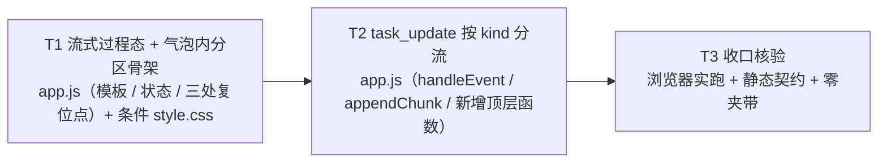

# pr-004-tasks.md — pr-004 内部任务图（过程增量按 `kind` 分区渲染，前端既有气泡内）

**迭代**: 0022-agent-launcher-and-protocol-layer ｜ **阶段**: 5（PR 实现）· 首波 ｜ **PR 文件**: `prs/pr-004-stream-kind-partition-ui.md`
**worktree 分支**: `feat/0022-pr-004-stream-kind-partition-ui`（base = 迭代分支 `e3f8a62`）｜ **任务总数**: **3**（T1~T3）｜ **依赖图**: 无环（见 §2）
**输入**: 该 PR 文件 + `architecture.md` v0.2.0（§5.5 T-06/T-07、§9.2 B-5、§9.3、§12.1 MI-A-1/MI-A-2、§12.2-2、§7 T-06/T-07）+ `prd/F08-process-visibility-runtime-stream.md`
**代码基线**: 本 worktree 实测（行号为本次实读，非引用）

## 0. 范围、文件面与事实锚点

### 0.1 本 PR 文件范围（唯一可写面）

| 文件 | 动作 | 内容 |
|---|---|---|
| `oamp/web/app.js` | **修改** | ① `handleEvent` 的 `task_update` 分支与 `appendChunk` 按 `kind` 分流；② 流式气泡模板内新增 `thinking` / `tool` 两个过程分区容器；③ 订阅 4 类事件逐字不变；④ `message(out)` 清空流式态行为不变 |
| `oamp/web/style.css` | **条件修改** | 仅当过程分区无法用既有 class 组合表达时才动；§9.3 / §12.2-2 已登记为「实现阶段确认」项 |

### 0.2 非目标（明确不写；越界即 PR 验收 2 / 4 / 6 不通过）

- `oamp/web/index.html`、`oamp/web/notify.js`（三事件封闭）
- `oamp/src/**`（含 `src/web.js` 的 `task.update` 分支 —— 本 PR 的**零改动输入契约**）、`oamp/src/transport.js`
- `oamp/test/**`：**本 PR 不修改任何既有测试文件，也不新增测试文件**（PR 验收 6 的 `git diff --stat` 范围只含 `app.js` / 条件 `style.css`）
- 新面板 / 新页面 / 新增 SSE 事件类型 / 开关 / 过滤 / 分级（N5 / MI-A-1 / MI-A-2）
- 节流 / 聚合 / 过程持久化 / 过程回放（T-06 粒度 = 原样；N4 / N5）
- 其它 PR（`pr-001` / `pr-002` / `pr-003` / `pr-005`）的产物与文件；本 PR `depends_on` 为空，**不得引入对其他 PR 交付物的依赖**

### 0.3 读码事实锚点（判据基础；本 worktree 实测）

| # | 事实 | 位置 |
|---|---|---|
| A1 | 流式态 = `state.stream: { chatId: null, text: '' }` —— **只有文本一个缓冲**（注释：`task_update` 累积；终态 message 到达即清空） | `oamp/web/app.js:32` |
| A2 | `renderStreamSlot(chat)` 的守卫 = `state.stream.chatId !== chat.chat_id \|\| state.stream.text === ''` ⇒ **仅"文本非空"才挂载气泡**；模板含 `

${escapeHtml(state.stream.text)}

` | `oamp/web/app.js:417-422`（模板行 `:421`） |
| A3 | `renderStatusLine()` 另有一处"流式态非空"判据：`const streaming = state.stream.chatId === chat.chat_id && state.stream.text !== '';`（只在**非** `waiting` 分支参与文案） | `oamp/web/app.js:450` |
| A4 | 订阅面 = `for (const type of ['message', 'task_update', 'chat_state', 'notice'])`（四类事件，逐字） | `oamp/web/app.js:550-551` |
| A5 | `handleEvent(type, data)`：入口守卫 → `current` 判据 → `task_update` 分支**现状不分 kind**（`text` 优先、否则 `line` + `\n`，非空即 `appendChunk`） | `oamp/web/app.js:563-571` |
| A6 | `appendChunk(chatId, chunk)`：切 chat 即复位 → 累积 → `#stream-text` 取不到先 `renderChat()` 再取 → `textContent` 覆写 → 滚动到底 | `oamp/web/app.js:601-612` |
| A7 | 流式态复位点**共三处**：`unsubscribe()`（`:533`）、`message(out)` 终态清空（`:574`）、`appendChunk` 内切 chat 复位（`:602`） | `oamp/web/app.js:533`、`:574`、`:602` |
| A8 | 上游帧面（**零改动输入契约**）：`task.update` 分支只校验 `kind` 是否字符串、原样透传 `{chat_id, task_id, kind, text, line}`；`stdout` 专属 `entry.lines` 累积不被新 kind 触发 | `oamp/src/web.js:1626-1632`（`entry.lines` 在 `:1628`） |
| A9 | 既有 `kind` 取值**今天已含** `stdout` / `stderr`（`!` shell 与一次性 omp 路径，走 `line`）+ `chunk`（常驻流式分片，走 `text`）⇒ 分区白名单只能是**新增三值**，其余一律走既有答案路径 | `oamp/src/web.js:1627-1628`；`oamp/web/app.js:568`；`oamp/API.md:993` |
| A10 | 既有前端静态契约的**四条断言面**（不得触犯）：① 订阅 4 类事件逐字 ② 顶层函数六名在场 ③ `POLL_MS` / `setTimeout(tick` 否定断言 ④ `/api/chats/` 读口在场 | `oamp/test/inbox-console.test.js:356`；`oamp/test/project-workspace.test.js:861-863`、`:877-878`；`oamp/test/web.test.js:1040` |
| A11 | `functionBody(src, name)` 抽取器要求 `\n(?:async )?function <name>(…) {` … 列 0 的 `}` 收尾 ⇒ 新增渲染函数必须是列 0 的**顶层函数** | `oamp/test/project-workspace.test.js:306-309` |
| A12 | `index.html` 内**没有** `#stream-text` 静态节点：整个流式气泡由 `renderStreamSlot` 渲染进 `#messages` ⇒ "气泡内新增容器"与"`index.html` 零改动"不冲突 | `oamp/web/index.html:77`（`#messages`）；`oamp/web/app.js:421` |
| A13 | `renderStreamSlot(chat)` 的调用点 = `renderChat` 的 `box.innerHTML = \`${freshBar(chat)}${body}${renderStreamSlot(chat)}${renderNotices(chat.chat_id)}\`` ⇒ 气泡挂载与否**完全由 A2 的守卫决定**，且整块重渲染与增量追加走同一路径 | `oamp/web/app.js:390` |

## 1. 任务列表

### T1: 流式过程态的承载与气泡内分区骨架（`state.stream` 扩展 + `renderStreamSlot` 模板 + 三处复位点）

- **验收标准**:
  1. **两个过程分区容器落在既有气泡内部**：`renderStreamSlot` 产出的模板在既有 `
` → `.msg-body` **之内**新增 `thinking` 过程分区与 `tool` 过程分区两个容器；不得在气泡外新增节点、不得新增第二个气泡、不得新增面板。
  2. **`#stream-text` 逐字不变**：模板中 `

${escapeHtml(state.stream.text)}

` 的形态与既有逐字一致（检索式 `id="stream-text"` 仍命中，且仍是**答案文本**的唯一落点）。判据：读模板字符串 + 浏览器 DOM（`#stream-text` 在场）。
  3. **挂载判据覆盖过程内容** `[model_inferred]`：A2 的守卫从"仅 `state.stream.text` 非空"改为"**文本或过程任一非空**即挂载"——否则仅有 `thinking` 增量时（M-2b 实测思考先于文本约 1.8s）气泡根本不出现，`prd/F08` 验收 1「轮次结束前可见思考增量」与 PR 验收 2 的控制台判定面（直调 `handleEvent(..., {kind:'thinking', text:'t'})` 后**观察落点**）均不可观测。追溯依据：architecture §5.5「呈现 = 在既有流式占位气泡内部新增两个过程分区」（分区必须可见）+ PR 验收 2 的判定面原文。
  4. **三处复位点口径统一（不留"答案已清、过程残留"）**：A7 的三处流式态复位点（`unsubscribe()` `:533`、`message(out)` 终态清空 `:574`、`appendChunk` 切 chat 复位 `:602`）必须同时复位过程缓冲，且**不新增第四个清空触发点**。判据：静态读三处 + 浏览器实测（终态到达后过程分区内容消失）。
  5. **无过程内容时零可见残留**：无过程增量期间，分区容器不产生可见内容（不出现空块、占位符、边框、空行）；气泡视觉与改造前一致。判据：浏览器实测（既有 `chunk` 单路场景）。
  6. **分区不做视觉分级** `[user_confirmed MI-A-2]`：不引入折叠、不做配色区分、不引入展示开关（过程分区只提供**结构落点**，不以配色 / 图标 / 折叠等"视觉分级规则"作区分手段——若实现期需要区分手段，属 MI-A-2 已覆盖的决策，不再扩面）；样式落点判定 = 优先用既有 class 组合表达 ⇒ `oamp/web/style.css` **零改动**；若确需新增 ⇒ **只追加**（既有 `.answer` / `.msg-body` / `.msg` 等声明零改写）。判据：`git diff --stat` 与 `style.css` diff 形态。
  7. **不触碰 `renderStatusLine` 的既有判据**：A3（`:450`）的 `streaming` 判据**逐字不变**（见 §5 疑问 2）。
- **前置依赖**: 无
- **优先级**: P0
- **追溯**: architecture §5.5（呈现 T-06；不入库行）、§9.2 B-5、§9.3（`style.css` 待确认）、§12.1 MI-A-2、§12.2-2、§7 T-06；`prd/F08` 验收 2 / 4 与边界 N5；PR 文件「上下文摘要」、「文件范围」①②③④、验收 1 / 2 / 3 / 4

### T2: `task_update` 按 `kind` 分流（`handleEvent` 分支 + `appendChunk` + 新增顶层过程渲染函数）

- **验收标准**:
  1. **`chunk` 走既有路径、语义逐字不变**：`kind === 'chunk'` 仍走既有 `appendChunk` 路径，写入既有 `#stream-text`；A6 的四段语义（切 chat 复位、累积、元素缺失先 `renderChat()` 再取、`textContent` 覆写 + 滚动到底）与 A5 的取值口径（`text` 优先、否则 `line` + `\n`、空串不追加）逐字保持。判据：静态读分支 + 浏览器实测（常驻 `chunk` 流逐块写入 `#stream-text`）。
  2. **三个新 kind 落点正确**：`thinking` → `thinking` 分区；`tool_call` 与 `tool_output` → `tool` 分区（T-06 的"两个过程分区"：参数与执行输出同属工具块）；三者的内容**不进入** `#stream-text`。判据：浏览器 DOM（分区内容在场、`#stream-text.textContent` 不含过程文本）。
  3. **控制台判定面（PR 验收 2 原文）**：浏览器控制台直调页面顶层函数 `handleEvent('task_update', { chat_id: <当前对话>, kind: 'thinking', text: 't' })` ⇒ 内容出现在过程分区，且 `#stream-text` 不含 `t`。判据：浏览器实跑（不经真实 rpc 链路）。
  4. **非当前对话零渲染**：A5 的 `if (!current) return;` 语义不变——三类增量在非当前对话时同样不渲染。判据：静态读 + 浏览器实测（切到另一对话后投帧）。
  5. **空值 / 非字符串取值的处置沿用既有口径**：取值结果为空串时不追加（既有 `if (chunk !== '')` 语义）；不为过程 kind 引入新的空值渲染、不造占位内容。判据：浏览器控制台直调（`text: ''`）。
  6. **`stdout` / `stderr` 仍走既有答案路径** `[model_inferred]`：分区白名单**只有** `thinking` / `tool_call` / `tool_output` 三个新值；其余取值（`chunk` / `stdout` / `stderr` / 未来未知取值）一律走既有 `#stream-text` 路径——否则 `!` shell 路径与一次性路径的文本渲染回归（PR 验收 1 明文要求 shell 路径文本仍逐块写入 `#stream-text`）。追溯依据：A9（今天 `kind` 已含 `stdout`/`stderr`）+ PR 验收 1。
  7. **新增函数为顶层函数且命名不冲突**：新增渲染 / 追加函数以列 0 的 `function <name>(…) {` 形态定义（A11 抽取器的前提），命名不与既有六函数（`loadProjects` / `renderProjects` / `createProject` / `resolveCurrentProject` / `showProjectList` / `showWorkspace`，A10②）及 `init` 冲突，且不与既有其它顶层函数重名。**不改 `init` 自执行入口及其 boot 顺序**（`loadAgents → connectAgentEvents → await resolveCurrentProject`，A10② 同源的既有静态契约）。判据：静态读 + 既有静态契约用例保持绿。
  8. **订阅面零改动**：A4 的四类事件订阅逐字不变；**无新增 `addEventListener`**、无新增 SSE 事件类型（`[user_confirmed MI-A-1]`）。判据：静态断言式读码（`grep`）+ 浏览器 Network 面板确认仍为既有事件类型。
  9. **其余事件分支零改动**：`message` / `chat_state` / `notice` 三个既有分支逐字不变（含 `message(out)` 的清空语义，T1 验收 4 只扩展缓冲、不改触发点）。
- **前置依赖**: T1（过程分区容器与其缓冲）
- **优先级**: P0
- **追溯**: architecture §5.5（通道 / kind 取值域 / 粒度 T-06·T-07）、§4.2 L2-4（`delta→onDelta` 映射，本 PR 的输入端命名来源）、§7 T-06 / T-07、§12.1 MI-A-1 / MI-A-2；`prd/F08` 验收 1 / 2 / 4；PR 文件「文件范围」①②③④、验收 1 / 2 / 3 / 5

### T3: 收口核验（既有面零回归实跑 / 零夹带核验 / PR 验收对位）

- **验收标准**:
  1. **既有文本渲染零回归实跑**（PR 验收 1）：以**非默认端口**拉起 `oamp web` + agent，实跑 ① `!` shell 路径 ② 常驻 `chunk` 流 ⇒ 文本仍逐块写入既有 `#stream-text`；气泡内滚动正常；一轮结束后过程分区随流式态清空、答案文本与落盘一致（`GET /api/chats/<id>` 比对）。
  2. **三新 kind 实跑**：`thinking` / `tool_call` / `tool_output` 三类增量在**轮次结束前**实时出现在既有对话详情内（`prd/F08` 验收 1 的界面面判据），且不并入答案文本。**端到端形态（默认 rpc 链路上真实收到三类增量）在本 PR 单独合并时不得判为通过**（见验收 7）。
  3. **不新增 UI 载体、不做开关 / 过滤 / 分级**（PR 验收 3）：`oamp/web/index.html` 零改动（`#messages` 骨架与两条脚本标签逐字不变）；无新面板 / 新页面；SSE 订阅仍为既有 4 类事件；控制台与配置面无过程展示的开关 / 过滤 / 分级项（`prd/F08` 验收 2 / 4）。
  4. **过程内容不进入答案、不改变记录条数判据**（PR 验收 4 界面侧）：界面上的过程块随 `message(out)` 到达而清空；不产生额外消息条目；同轮结束后记录仍恰两条（不入库由 `oamp/src/web.js` 零改动保证）。判据：浏览器实跑 + `GET /api/chats/<id>` 计数。
  5. **既有前端静态契约保持绿、且不以改测试达成**（PR 验收 5）：`node --test oamp/test/web.test.js oamp/test/inbox-console.test.js oamp/test/api-pages.test.js oamp/test/project-workspace.test.js` 全绿——含 A10 的四条断言面（顶层函数在场 / `POLL_MS` / `setTimeout(tick` 否定 / `/api/chats/` 读口 / 订阅 4 类事件）；`oamp/test/**` 零改动（**测试转红不得改测试来消除**）。
  6. **零夹带**（PR 验收 6）：`git diff --stat` 只含 `oamp/web/app.js`（及被 T1 验收 6 条件纳入的 `oamp/web/style.css`）；`oamp/src/**`（含 A8 的 `src/web.js:1626-1632`）与 `oamp/test/**` 零改动；`oamp/web/index.html`、`oamp/web/notify.js` 零改动。
  7. **跨 PR 验收归属与复核时序登记**（PR 文件「择一判定声明」原文）：本 PR 判 `prd/F08` 验收 1 / 2 的**主面（界面面）**；管道面（三类增量是否被承接上送）由 `prs/pr-003-protocol-layer-and-consumption-cutover.md` 判**辅面**，同一条验收只计一次主面判定、不互推；**F08 验收 1 的端到端形态复核时点晚于 pr-003 合并**，本 PR 单独合并时不得判其端到端面通过。
  8. **过程增量的"原样"粒度未被破坏**：实现中未引入节流 / 聚合 / 缓冲合并（T-06 粒度 = 原样；R5 帧量大是用户已接受的已知代价）。判据：静态读码（无 `setTimeout` / 合并缓冲形态）。
- **前置依赖**: T1、T2
- **优先级**: P0
- **追溯**: PR 文件 验收 1~6 + 择一判定声明；architecture §5.5（通道 / 粒度 / 不入库）、§9.3 零改动清单、§12.1 MI-A-1 / MI-A-2、§7 T-06；`prd/F08` 验收 1~4 与边界 N4 / N5；A8 / A10 / A12

## 2. 依赖图（无环）

拓扑序（合法执行序）：`T1 → T2 → T3`

- **最长依赖链**：`T1 → T2 → T3`（3 跳）。
- **关键路径任务**：**T1、T2、T3**（三跳全在关键路径上）。
- **无环**：边方向单调递增（T1 → T2 → T3），无回边、无自环。
- **无并行切片（诚实登记，非粒度失误）**：本 PR 的生产写入面是**单一文件** `oamp/web/app.js`（`oamp/web/style.css` 条件且从属于 T1 的标记），T2 的过程缓冲必须落在 T1 建立的分区容器上，T3 的核验面又必须晚于 T2 ⇒ 三个任务天然串行，**不为凑并行而拆**（planner 粒度规则：可以合并的先合并；这里的串行来自文件面与验证时序，不是拆得过细）。

**同文件串行约束（必须）**

| 文件 | 修改任务 | 串行要求 |
|---|---|---|
| `oamp/web/app.js` | **T1、T2** | **不得并发**：由同一实现者按 `T1 → T2` 顺序落地（T2 的过程写入落在 T1 建立的分区容器与缓冲上） |
| `oamp/web/style.css` | T1（条件） | 仅当 T1 验收 6 判定"既有 class 组合无法表达"时才触发；零追加或纯追加 |
| `oamp/web/index.html` / `oamp/web/notify.js` / `oamp/src/**` / `oamp/test/**` | **无**（本 PR 零改动） | — |

## 3. 与 pr-004 验收标准逐条对位表

| PR 验收 # | 验收摘要（PR 文件原文口径） | 承接任务 | 对位说明 / 判据面 |
|---|---|---|---|
| 1 | **既有文本渲染零回归**：`!` shell 路径与常驻 `chunk` 流仍逐块写入既有 `#stream-text`；滚动与终态清空行为不变 | **T1**（验收 2 / 4 / 5）、**T2**（验收 1 / 6 / 9）、**T3**（验收 1） | 回归风险点 = kind 分流误伤 `stdout` / `stderr`（A9）与复位点漏复位（A7）；判据面 = 浏览器实跑 + 落盘文本比对 |
| 2 | **三个新 kind 落点正确**：`thinking` / `tool_call` / `tool_output` 进过程分区，不并入答案文本；判定 = 控制台直调 `handleEvent('task_update', {…})` | **T1**（验收 1 / 3）、**T2**（验收 2 / 3 / 5）、**T3**（验收 2） | 判定面**不经真实 rpc 链路**（PR 文件原文）⇒ 本 PR 可独立判定；T1 验收 3 是判定面成立的前提（气泡必须先挂载） |
| 3 | **不新增 UI 载体、不做开关 / 过滤 / 分级**：无新面板 / 新页面；`index.html` 零改动；SSE 仍 4 类事件；无开关 / 过滤 / 分级项 | **T1**（验收 1 / 6）、**T2**（验收 8）、**T3**（验收 3） | MI-A-1（不新增事件类型）/ MI-A-2（不做折叠 / 配色 / 开关）；判据 = `index.html` diff 为零 + 读码 + 浏览器配置面观察 |
| 4 | **过程内容不进答案、不改记录条数判据**：过程块随 `message(out)` 清空、不产生额外消息条目 | **T1**（验收 2 / 4）、**T2**（验收 2 / 9）、**T3**（验收 4） | 清空是既有 `message(out)` 路径（A7 `:574`）的自然结果，**不新增触发点**；不入库由 `src/web.js` 零改动保证（A8） |
| 5 | **既有前端静态契约不回归、且不以改测试达成** | **T3**（验收 5）；T2 验收 7 为其静态前提 | 四条断言面 = A10；`oamp/test/**` 零改动为硬约束 |
| 6 | **零生产后端改动**：`git diff --stat` 只含 `app.js`（及条件 `style.css`） | **T3**（验收 6）；T1 验收 6 决定是否纳入 `style.css` | 判据 = `git diff --stat` 与逐文件 diff 形态 |
| — | **择一判定声明（D-6 · 跨 PR 验收归属）** | **T3**（验收 7） | 本 PR 判界面面**主面**；管道面归 pr-003 判**辅面**；端到端形态复核时点晚于 pr-003 合并 |
| — | **不做节流 / 聚合**（T-06 粒度 = 原样；N5） | **T3**（验收 8） | 防夹带：不得以"体感不佳"为由在实现期引入节流（R5 是已接受的已知代价） |

**覆盖检查**：PR 6 条验收标准 + 择一判定声明 → 全部有任务承接；无遗漏、无扩范围。T1~T3 的每条验收标准均可追溯到 architecture / prd / PR 文件的具体条目（见 §6），`[model_inferred]` 仅 2 条（§5 疑问 1）。

## 4. 关键实现约束

1. **单文件 + 条件样式**：生产写入面 = `oamp/web/app.js`（必需）+ `oamp/web/style.css`（条件）。除此以外**零写入**——尤其 `oamp/src/web.js` 是**输入契约**（A8：只校验 `kind` 是否字符串、原样透传 `{chat_id, task_id, kind, text, line}`）。
2. **kind 白名单口径**：分区只收 `thinking` / `tool_call` / `tool_output`；`chunk` 与既有 `stdout` / `stderr`（A9）一律走既有答案路径。不得反转为"非 chunk 即过程"（会吞掉 shell / 一次性路径的文本）。
3. **过程缓冲与复位**：缓冲挂在既有 `state.stream` 上；A7 的三处复位点必须同步复位；**不新增清空触发点**（终态清空复用既有 `message(out)` 路径）。
4. **挂载判据必须先于落点判定就绪**：A2 的 `state.stream.text === ''` 守卫不改 ⇒ 仅过程增量时气泡不出现（T1 验收 3）。这是 PR 验收 2 判定面能跑通的前提。
5. **顶层函数形态**：新增函数必须是列 0 的 `function <name>(…) {` … 列 0 `}`（A11 的抽取器前提）；不得嵌套在既有函数内、不得用 `const f = () => {}` 形态承载被静态契约抽取的函数。
6. **不得触犯的四条既有断言面**（A10）：订阅 4 类事件逐字 / 顶层六函数在场 / `POLL_MS` 与 `setTimeout(tick` 零命中 / `/api/chats/` 读口在场。
7. **不做视觉分级**：MI-A-2 明确"不做折叠 / 配色 / 开关" ⇒ 分区容器只提供结构落点，不引入配色区分规则（T1 验收 6 与验收 5 的边界）。
8. **浏览器实测须以非默认端口拉起**（体例同 0021 迭代任务图），避免与运行中的 `127.0.0.1:7788` 冲突。
9. **不做节流 / 聚合 / 缓冲合并**：T-06 粒度 = 原样（R5 帧量大为用户已接受的已知代价，N5 禁止策略）。

## 5. 边界与疑问（提请主 agent）

1. **`[model_inferred]` 验收标准共 2 条**（不引入架构之外的技术决策，均从既有输入直接推导）：
   - **T1 验收 3**：气泡挂载判据（A2 `state.stream.text === ''`）须覆盖过程内容。
     *推导来源*：architecture §5.5「呈现 = 在既有流式占位气泡内部新增两个过程分区」（分区可见是 T-06 的明文落定）+ PR 验收 2 的判定面原文（直调 `handleEvent(..., {kind:'thinking', …})` **观察落点**）+ `prd/F08` 验收 1（思考增量在轮次结束前可见；M-2b 实测思考先于文本约 1.8s）。
     *为何需确认*：PR 文件与 architecture 均未点名该守卫；不改则 PR 验收 2 的判定面在"仅过程增量"场景下无落点可观察。
   - **T2 验收 6**：`stdout` / `stderr`（及未来未知取值）仍走既有 `#stream-text` 路径。
     *推导来源*：A9（`kind` 今天已含 `stdout`/`stderr`）+ PR 验收 1 明文（`!` shell 路径文本仍逐块写入 `#stream-text`）+ architecture §5.5「`kind` 取值域：既有 `chunk`（语义不变）+ **新增**三个取值」（"新增"⇒ 不改既有取值归属）。
2. **`renderStatusLine` 的 `streaming` 判据（A3 / `:450`）不在 PR 文件与 architecture 的显式范围内**：实现后两处"流式态非空"的判据会出现口径差（气泡挂载按 A2 改后判据，状态行仍按 `text` 非空）。**任务图按"不触碰"落定**（外科手术式改动：`app.js:450` 只在非 `waiting` 分支参与文案，对本 PR 的用户可见面影响极小）。若实现期认为必须一并调整，属**架构未覆盖的口径变更** ⇒ 报告主 agent，不自行选边。
3. **`oamp/web/style.css` 的「实现阶段确认」（§9.3 / §12.2-2）由 T1 验收 6 承接**：任务图**不替代**该判定，只给出判据（能用既有 class 组合表达 ⇒ 零改动；需新增 ⇒ 只追加、既有规则零改写）。若出现"既有规则必须改写才能表达"的情形，即超出 PR 文件范围 ⇒ 报告主 agent。
4. **过程块的"呈现形态"只到结构层**：MI-A-2 已定"既有流式气泡内部分区，不做折叠 / 配色 / 开关"⇒ 本任务图**不**为视觉区分（边框 / 强调色 / 图标）写验收标准；若实现期需要视觉可见性区分，属 MI-A-2 已覆盖的决策，不再上报。
5. **测试面零改动带来的解题约束**：PR 验收 5 要求 4 个既有测试文件保持绿，且 `oamp/test/**` 零改动 ⇒ 任何静态契约转红**只能改 `app.js` 消除**，不得改测试（T3 验收 5 已落为判据）。
6. **无循环依赖**：依赖图 `T1 → T2 → T3` 单调，无环；未发现 architecture 层面的组件边界问题。
7. **未越界**：本任务图未新增架构决策、未修改任何上游产物（`prd/**`、`architecture.md`、PR 文件）、未引入对其他 PR 交付物的依赖（与 PR 文件 `depends_on: 无` 一致，`pr-003` 只影响**验收复核时序**，该时序边界已登记在 T3 验收 7 与 PR 文件原文，未写成任务依赖）。

## 6. 追溯总表（任务 → 输入）

| 任务 | architecture 追溯 | prd 追溯 | PR 文件追溯 |
|---|---|---|---|
| **T1** | §5.5（呈现 T-06 / 不入库行 / acp 链路不在范围）、§7 T-06、§9.2 B-5、§9.3（`web/index.html`、`style.css` 待确认项）、§12.1 MI-A-2、§12.2-2 | F08 验收 1（可见性前提）、2、4；边界 N5 | 「上下文摘要」、「文件范围」①②③④、「零改动」清单、验收 1 / 2 / 3 / 4 |
| **T2** | §5.5（通道 / kind 取值域 / 粒度 T-06·T-07）、§4.2 L2-4（`delta→onDelta` 四路映射）、§7 T-06 / T-07、§12.1 MI-A-1 / MI-A-2 | F08 验收 1 / 2 / 4；边界 N5 | 「文件范围」①②③④、验收 1 / 2 / 3 / 5；「上游帧面」行（A8） |
| **T3** | §5.5（通道 / 粒度 / 不入库）、§9.2 B-5、§9.3 零改动清单、§12.1 MI-A-1 / MI-A-2、§7 T-06、§11 R5 | F08 验收 1~4；边界 N4 / N5 | 验收 1~6 + 「择一判定声明（D-6）」+「depends_on」段（时序依赖与合并前置的区分） |
