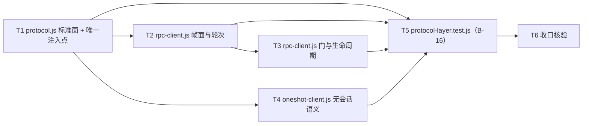

# pr-005-tasks.md — pr-005 内部任务图（L2 协议层：标准面 + 唯一注入点 + `rpc` / `oneshot` 两实现，加性子集）

**迭代**: 0022-agent-launcher-and-protocol-layer ｜ **阶段**: 5（PR 实现）· 次波 ｜ **PR 文件**: `prs/pr-005-protocol-layer-and-injection-entry.md`
**worktree 分支**: `feat/0022-pr-005-protocol-layer-and-injection-entry`（base = `fa2acd6`，已含 `2a2d979`（pr-001 合并）⇒ `oamp/src/launcher.js` 与 `config.js` 第 4 键在本 worktree 可读）｜ **任务总数**: **6**（T1~T6）｜ **依赖图**: 无环（见 §2）

## 0. 范围、文件面与事实锚点

### 0.1 本 PR 文件范围（唯一可写面）

| 文件 | 动作 | 内容 |
|---|---|---|
| `oamp/src/protocol.js` | **新建** | `ProtocolError`（五码逐字）+ `CAPABILITY_KEYS`（六键原样）+ `createProtocolLayer({resident, profiles, bin, cwd, logger})` ⇒ `capabilities()` / `createResident({chatId, agentId, role, hooks})` / `createEphemeral({hooks})`；解析链四档 + 选择域 `{rpc, acp}`；**全仓唯一 import 三个实现模块的文件**；自持门名解析原语（不 import `acp-client.js` 的私有函数） |
| `oamp/src/rpc-client.js` | **新建** | rpc 协议实现：握手（`ready` → `negotiate_protocol{2}`）/ 逐帧映射（§5.4 全表）/ 终态结算 / 受理不结算 / `rpc_chunk` 重组 / 门承接（§5.6）/ `cancel` / `close` / 能力位六键；import ⊆ `node:*` ∪ `{./protocol.js, ./launcher.js}` |
| `oamp/src/oneshot-client.js` | **新建** | 一次性执行实现（**不持有跨轮状态**）；argv 经 L1 `omp:oneshot` profile；承接 `agent.js:190-199` 的 `-p` argv 与 `:236-250` 行流回收 + `MAX_STREAM_LINES=200` 截断语义；能力位 `streaming:'degraded'` + 其余 `'no'` 各带 note；import 面同 `rpc-client.js` |
| `oamp/test/protocol-layer.test.js` | **新建** | = architecture §9.4.2 **B-16**：①能力位 ②解析链四档 + 选择域封闭 ③默认走 rpc / 指定走 acp 的 argv 观测（fake bin）④RPC 逐帧映射 + 门 ⑤oneshot：argv / 两轮两进程不续接 / 行流形状与 200 行截断 |

### 0.2 非目标（零改动 / 防夹带；PR 文件「零改动」段逐条）

`oamp/src/acp-client.js` / `oamp/src/context-pool.js` / `oamp/src/agent.js`（三者的对齐与接线归 **pr-003**）；`oamp/src/launcher.js` / `oamp/src/config.js`（pr-001）；`oamp/web/**`（pr-004）；`oamp/src/web.js` / `router.js` / `rpc.js`（oamp 内部 UDS 协议）/ `bin/**`；`oamp/test/` 全部既有文件（29 个 `.test.js` + `helpers/` 2 个）——`acp-daemon` / `context-pool` / `project-workspace` / `call-protocol`（pr-002）、`web` / `confirmation-roundtrip` / `tool-permission` / `zero-intrusion`（pr-003）及其余；`oamp/API.md` / `oamp/llms.txt` / `oamp/package.json`；`omp/**`。

### 0.3 读码事实锚点（base `fa2acd6` 实测；判据基础）

| # | 事实 | 位置 |
|---|---|---|
| A1 | 本 PR 三个新模块**今日不存在**，全仓对 `rpc-client` / `oneshot-client` / `protocol.js` / `ProtocolError` / `CAPABILITY_KEYS` / `createProtocolLayer` **零命中** ⇒ 落地行为零变更、既有测试面零回归（Gate E-1 复核） | `grep -rn` 全 `oamp/` 实测；`ls oamp/src` |
| A2 | `oamp/src/launcher.js` 已落地（pr-001）：`PROFILES` 五键（`omp:rpc` / `omp:acp` / `omp:oneshot` / `claude:acp` / `codex:acp`）+ `buildArgv` / `resolveBin` / `spawnAgent`；`omp:rpc.modeArgs = ['--mode','rpc']`、`omp:acp.modeArgs = ['acp']`、`omp:oneshot.modeArgs = ['-p']`（`skills/rules: true` ⇒ 不追加 `--no-skills`/`--no-rules`） | `oamp/src/launcher.js:13-70` |
| A3 | `config.js` 第 4 键 `protocol` **已折叠三档**（`env.OAMP_PROTOCOL` > `config.json: protocol` > 内置 `'rpc'`），越界值响亮失败；注释明写「角色级 `--protocol` 归 pr-003」 | `oamp/src/config.js:18-19`、`:49-`（`readProtocol`）、`:117`、`:144-145` |
| A4 | 门名解析原语 `readApprovalToolName` 为 **模块私有**（无 `export`）；前缀常量 `APPROVAL_MESSAGE_PREFIX = 'Allow tool: '` 同为私有 | `oamp/src/acp-client.js:20`、`:30-34` |
| A5 | `AcpError` 类（`name='AcpError'`、`code`）；五码：`context_crashed` / `model_unavailable` / `timeout` / `permission_denied` / `context_busy` | `oamp/src/acp-client.js:5-7`（注释）、`:42-48`（类） |
| A6 | `new AcpClient({…})` 现状入参 = **10 键**：`bin` / `model` / `cwd` / `tools` / `roleFile` / `permission` / `auditContext`（`instance` / `role` / `chat_id` + 惰性 `context_id` getter）/ `logger` / `onExit` / `onPermissionRequest` | `oamp/src/context-pool.js:203-227`（逐键 `:204`~`:226`）；`_onClientExit` 在 `:239-243` |
| A7 | 宽限常量既有值：`CANCEL_GRACE_MS = 2000`、`KILL_GRACE_MS = 500`（L2-8 明文沿用） | `oamp/src/acp-client.js:14-15` |
| A8 | `stripAnsi` / `makeLineReader` / `MAX_STREAM_LINES = 200` 三者均**模块私有**（无 `export`），且 `agent.js` 在本 PR 零改动 ⇒ 承接方必须自持同源实现 | `oamp/src/agent.js:26`、`:36-39`、`:144-`（`makeLineReader`） |
| A9 | 现状一次性 argv = `['-p','--no-session']` 起，`--no-tools` / `--model` / `--append-system-prompt` / `--approval-mode`（`deny ⇒ always-ask`，否则 `yolo`），项目上下文与提示词为**末位位置参数**；spawn stdio = `['ignore','pipe','pipe']`；行流回收 = 去 ANSI → 空行跳过 → 200 行上限 → 恰一次 `event:'truncated'` 事件（note 文案含 `200`） | `oamp/src/agent.js:190-199`、`:207`、`:236-250` |
| A10 | `hygiene.test.js`：七词表（`token` / `api_key` / `secret` / `password` / `credential` / `authorization` / `private_key`，`new RegExp('\\b'+w+'\\b','i')`）；扫描面 = `bin/` + `src/` **平铺** `.js` + `package.json`；`dependencies` 为空；**不含**「孤儿模块 / 未被 import 的模块」断言 ⇒ 无消费方的新增模块不会使其变红 | `oamp/test/hygiene.test.js:17-24`、`:26-39`、`:47`、`:61-63`；Gate E-5 |
| A11 | 测试面计数（实测）：`oamp/test/*.test.js` = **29**；`oamp/test/helpers/*.js` = **2** | 实测（Gate E-3 同口径） |
| A12 | `oamp/package.json` 的 `dependencies` = `{}`（实测） | 实测 |
| A13 | 既有确认钩子**入参形状**（pr-003 的 `raiseConfirmation` **零改动**消费）：`info.toolCall.toolName` / `.title`；`info.options[].optionId`（**读 `raw.optionId`**，`raw.name|raw.label` 作 label）；钩子**返回值** = `{ optionId }` | `oamp/src/agent.js:302-311`（`readConfirmationOptions`）、`:319-337`、`:344-351`（`settleConfirmation` 解 `{ optionId }`） |
| A14 | 探针原始输出在本 worktree 内可读（`m1` / `m2` / `m2b` / `m3` / `m5`）⇒ 本 PR 的逐帧映射判据全部可回指 architecture §5.4，无「需真实 omp 进程」前置 | `clarifications/probes/*-output.txt` |

### 0.4 本 PR 内的冻结契约（每个任务都必须遵守）

1. **零消费方 / 行为零变更**：三个新模块不得被任何既有 `src/**` 文件 import，也不得新增任何既有文件的读者（PR 验收 11）；`git diff --stat` 只含 0.1 的 4 个文件。
2. **不得跨模块借用私有原语**（两条边界稳定约束）：`readApprovalToolName` 不得从 `acp-client.js` 引入（A4：无 export ⇒ **链接期**失败，且构成 `pr-005 → pr-003` 反向边）；`stripAnsi` / `makeLineReader` / `MAX_STREAM_LINES` 不得从 `agent.js` 引入（A8：同为私有 + `agent.js` 零改动）。
3. **`AcpClient` 构造入参集合在本 PR 内固定 = 10 键**（A6）：`protocol.js` 一次性写定装配面；pr-003 的 `acp-client.js` 改造项**不含**构造签名变更。
4. **签名与键集不扩展**：§5.1 的门面 / 会话形状、§5.7 的六键与三态取值、§5.4 的逐帧映射均照抄，不新增字段、不新增配置键、不新增目录、不引入第三方依赖。
5. **文件面封闭 ⇒ 唯一入库测试**：本 PR 只新增 `oamp/test/protocol-layer.test.js` 一个测试文件；T1~T4 的验证用**一次性核对 / 一次性脚本**（不入库）。
6. **新文件文本受 hygiene 扫描**（A10）：三新文件与新增测试文件的文本不得出现七词；**注意词边界语义**——`token` 后接词字符（如 `inputTokens`）不命中，但**中文语境中的独立词**（如注释「token 计数」）会命中。
7. **不接上消费层**：本 PR 不出现任何既有文件的 diff；「默认走 rpc」在运行期的首次真实生效属 pr-003 的端到端回归面（PR 文件「择一判定声明」D-6：本 PR 判**主面** = 注入点的「选择与进程面」）。

## 1. 任务列表

### T1: `protocol.js` —— 标准面符号与唯一注入点（解析链四档 + 三实现装配）

- **验收标准**:
  1. **文件与 import 面**：`oamp/src/protocol.js` 存在；`grep -nE "^import" oamp/src/protocol.js` 的非 `node:` 命中 ⊆ `{./rpc-client.js, ./oneshot-client.js, ./acp-client.js, ./launcher.js}`，**且 ⊇ 三个实现模块**（PR 验收 1 ② 的「机械复核式」逐字）；无第三方裸包名；`oamp/package.json` 零改动（`dependencies` 仍 `{}`，A12）。依据 §3.3「全仓 `grep`：只有本文件 import 三个实现模块」。判据 = 该 grep 输出 + `node --test oamp/test/hygiene.test.js` 绿。
  2. **`ProtocolError`**：具名导出类；`code` 取值集合 = 五码逐字（A5：`context_crashed` / `model_unavailable` / `timeout` / `permission_denied` / `context_busy`）；`name` = `'ProtocolError'`；形状与既有 `AcpError` 同构（`class … extends Error`，`code` 实例字段）。判据 = 一次性脚本列举实例的 `name` / `code`。
  3. **`CAPABILITY_KEYS`**：具名导出常量 = 六键**原样不增不减**：`['streaming','thinking','approvalGate','hostTools','introspection','queueControl']`（§5.1 / §5.7 / T-05）。判据 = `deepEqual` 逐键。
  4. **门面形状**：`createProtocolLayer({ resident, profiles, bin, cwd, logger })` 返回恰含 `capabilities` / `createResident` / `createEphemeral` 三成员（§5.1 逐字）。判据 = 一次性脚本读取返回对象的键集合与各成员类型。
  5. **解析链四档逐档生效**：角色级 > `env.OAMP_PROTOCOL` > `config.json: protocol` > 内置 `'rpc'`（§5.3）。其中第 2/3/4 档已由 pr-001 的 `loadConfig()` 折叠为 `config.protocol`（A3），门面只需在**角色级档位在场时覆盖该折叠值**，缺省回落折叠值。判据 = 四组输入产生对应实现的选择结果（**运行期观测面在 T5 判**——承载面见 §5 MI-1 与登记③）。追溯：F02 验收 1 的解析链。
  6. **选择域封闭**：取值域恰 `{rpc, acp}`；`oneshot` **不在选择域**（请求常驻会话时给 `'oneshot'` 不得装配 oneshot 实现，F02 验收 3）；越界值 ⇒ 响亮失败（体例同既有配置校验，A3 的 `OAMP 配置错误` 文案体例；`config.json` 侧的越界报错属 pr-001 已交付面，不在本 PR 重复实现）。判据 = 域内 / 域外各一次输入。
  7. **acp 分支装配 = 10 键**（A6，§5.1；PR 文件「边界稳定约束」第二条）：`bin` / `model` / `cwd` / `tools` / `roleFile` / `permission` / `auditContext` / `logger` / `onExit` / `onPermissionRequest` **全部有承载位**，一处不漏；其中 ①`auditContext` 四键 = `instance`（← `agentId`）/ `role`（← `createResident` 的 `role`）/ `chat_id`（← `chatId`）/ **惰性 `context_id` getter**（取值期才解析，经 `hooks` 转发回调用方会话的 `contextId`）；②`onExit` 接到会话的空闲崩溃收尾（回调实体由调用面经 `hooks` 给出）；③`onPermissionRequest` 只承载**装配位**与透传（「仅 allow 档注入 + 附加 `{chatId, agentId, origin}`」的档位语义归 pr-003）。判据 = 一次性脚本以桩对象记录装配入参的键集合（10 键逐键在场）与 `auditContext.context_id` 的**惰性**（装配时不触发取值）。
  8. **`createEphemeral({hooks})` 固定装配 oneshot 实现、不经解析链**（L2-7 / F02 验收 3）：同一门面在 `resident.protocol='acp'` 时 `createEphemeral()` 仍装配 oneshot 实现。判据 = 一次性脚本（在 T4 落地后执行；见登记③）。
  9. **`hooks` 面**：反向请求回调 `onApproval` / `onHostUi` 在场（§5.1）；`onHostUi` 本迭代**不接线**（`hostTools:'no'`）——只保留形状、不被调用、不抛错。
  10. **门名解析原语自持**：`protocol.js` 内自持 `readApprovalToolName` 同源实现（前缀 `'Allow tool: '`；取首个换行之前的剩余段并 `trim`；非字符串 / 前缀不符 / 空结果 ⇒ `null`，A4 语义逐字）并以**具名导出**（供 `rpc-client.js` 与 pr-003 的 acp 侧共用同一份）；**不得**从 `oamp/src/acp-client.js` 引入（A4 + PR 文件边界约束）。判据 = 文件内 `import` 面零 `acp-client` 的该符号 + 一次性脚本对五种输入的返回值（含多行 `title`）。
  11. **文本洁净**：文件文本不命中 A10 七词（含 `token` 词的边界陷阱）。
  12. **零改动既有文件**：本任务完成后 `git diff --stat` 只含新增 `oamp/src/protocol.js`。
- **前置依赖**: 无
- **优先级**: P0
- **追溯**: PR 文件「文件范围」第 1 项 + 验收 1 / 2 / 3 / 4 / 5 / 10；architecture §5.1（标准面 + 注入点签名）／§5.3（解析链与选择域）／§3.3（L2 两行判据）／§4.2 **L2-7**（oneshot 不经选择域）／§5.6（门名原语同源）／§9.1 **B-2** ／§7 **T-03 / T-04 / T-05**；prd/F02 验收 1 / 3 / 4 + 架构落定 T-03 / T-04；prd/F09 验收 1 + 架构落定 T-05；prd/F12 验收 1 / 2 + 架构落定；既有代码 A2 / A3 / A4 / A5 / A6

### T2: `rpc-client.js` —— 会话对象与帧面（握手 / 三类增量 / 终态 / 分片重组 / 能力位）

- **验收标准**:
  1. **import 面**：`grep -nE "^import" oamp/src/rpc-client.js` 的非 `node:` 命中 ⊆ `{./protocol.js, ./launcher.js}`（PR 验收 1 ① 逐字，与 §3.3 的 `rpc-client.js` 行判据一致）；对 `ProtocolError` / `CAPABILITY_KEYS` 的引用**只出现在函数体 / 类成员内**，不在模块顶层求值（PR 验收 10 的前提）。
  2. **进程面**：常驻会话的 argv **全部经 L1**产出（`launcher.js` 的 `omp:rpc` profile + 唯一 argv 构造 + spawn 封装）——argv 含 `['--mode','rpc']`（A2 的 `modeArgs` 逐字）、**不含** `--thinking`（profile `thinking:null`）、`session:false ⇒ --no-session`、`skills/rules:false ⇒ --no-skills / --no-rules`；bin 解析沿用 `OAMP_OMP_BIN > profile.bin > 'omp'`；本模块内**不出现 flag 字面量**（`--mode` / `--no-tools` / `--approval-mode` …）。会话 `pid` 可读。判据 = fake bin 回显 argv + 模块内 flag 字面量检索零命中。
  3. **握手**：收 `ready{protocolVersion,…}` ⇒ 发 `{type:'negotiate_protocol',protocolVersion:2}`；收 `response{command:'negotiate_protocol',success:true,data:{protocolVersion:2}}` ⇒ 就绪；版本 ≠ 2 ⇒ 初始化失败（`ProtocolError('context_crashed')`）。判据 = 帧级夹具逐帧断言。
  4. **`prompt(text, {model, timeoutMs, onDelta})`**：发 `{id, type:'prompt', message}`；收 `response{command:'prompt',success:true}` **只记受理、不结算轮次**（L2-3 / F04 验收 2）。判据 = 该回包到达后 Promise 仍挂起。
  5. **逐帧增量映射（§5.4 表逐行）**：`message_update.assistantMessageEvent.type === 'thinking_delta'` ⇒ `onDelta{kind:'thinking', text:delta}`；`text_delta` ⇒ `{kind:'chunk'}`；`toolcall_delta` ⇒ `{kind:'tool_call'}`——四类均**逐 delta 原样**（不聚合、不节流）且 **delta 为空串则跳过**（不产生回调）；`tool_execution_update{partialResult}` ⇒ `{kind:'tool_output', text: <content[].text 拼接>}`，**取不到文本即跳过**（不造内容）。判据 = 帧级夹具逐帧计数与载荷逐字比对。
  6. **终态结算**：`agent_end{isTerminal:true, messages}` ⇒ 结算 Promise：`text` = 本轮 `chunk` 累积（**思考不计入答案**）、`stop_reason` = `messages` 末条 assistant 的 `stopReason`、`usage` = 其 `usage`、`model` = 实际生效模型；取不到即 `null`（**不造值**）。`agent_end{isTerminal:false}` ⇒ **不结算**（继续等下一个终态帧）。判据 = 两类终态帧各一次。
  7. **忽略面**：`message_update` 其余 8 子类型、`tool_execution_start` / `tool_execution_end` / `available_commands_update`、以及其它未知 `type` ⇒ **忽略不崩**（不产生增量、不结算、不抛错）；`response{command:any,success:false,error,code?}` ⇒ `ProtocolError`（码值 ∈ 五值；`code` 缺失时按命令归类）。判据 = 帧级夹具注入上述帧后轮次仍能正常终态。
  8. **`rpc_chunk` 分片重组**：`{chunkId,index,count,byteLength,data}` 按 v2 帧面（单帧 ≤ 1 MiB / 逻辑帧 ≤ 64 MiB / 片 ≤ 256 KiB）**先重组、再按 §5.4 处理**；重组未完成期间不产生下游增量、不崩。判据 = 用 `rpc_chunk` 分片承载一个逻辑帧，重组后的处置与单帧路径逐字一致。
  9. **能力位（§5.7 的 rpc 列逐字）**：会话 `capabilities` 六键齐全、取值 ∈ `{yes, no, degraded}`；`streaming` / `thinking` / `approvalGate` / `introspection` / `queueControl` = `'yes'`，`hostTools` = `'no'`；**任一非 `yes` 键**（本实现在此形态下即 `hostTools`）的 `capabilityNotes[key]` 为**非空字符串**（L2-12 的硬约束）。判据 = 逐键断言。
  10. **文本洁净**（A10，含 `token` 词边界陷阱）+ 本任务不修改任何既有文件。
- **前置依赖**: T1
- **优先级**: P0
- **追溯**: PR 文件「文件范围」第 2 项 + 验收 1 / 2 / 5 / 6 / 10；architecture §5.4（逐帧映射表全表）／§5.1（会话四动作 + `onDelta` 形状 + 返回字段）／§4.2 **L2-3 / L2-4 / L2-11** ／§5.7（rpc 能力位）／§3.3（`rpc-client.js` 判据行）／§9.1 **B-3** ／§2.2 M-2 / §2.3 M-2b（帧面实测）；prd/F04 验收 1 / 2 + 架构落定 T-04；prd/F09 验收 1 / 3 + 架构落定 T-05；prd/F12 验收 1 / 2；既有代码 A2 / A5 / A14

### T3: `rpc-client.js` —— 门承接与生命周期（`cancel` / `close`）

- **验收标准**:
  1. **门双重过滤**：`type === 'extension_ui_request' && method === 'select' && title.startsWith('Allow tool: ')` ⇒ 归一为**既有钩子入参形状**并调用一次 `hooks.onApproval({ kind:'tool_approval', toolCall:{ toolName, title }, options:[{optionId:'Approve'},{optionId:'Deny'}] })`（§5.1；`optionId`（非 `option_id`）见 §5 矛盾①）。`toolName` 由 T1 自持原语从 `title` **首行**提取；`title` 为帧内**原样多行**（截断由既有消费面负责，A13 的 `slice(0,120)`）。判据 = 含多行 `title` 的门帧一次。
  2. **恰一次**：一次受门禁调用 ⇒ `hooks.onApproval` **恰一次**（不重不欠，无合并策略；§5.6 / M-5）。判据 = 三帧门场景下回调计数 = 帧数 = 1 次调用。
  3. **回执帧**：门 Promise 结算后回 `{type:'extension_ui_response', id, value: <optionId>}`，`id` 与请求帧同源、`value` ∈ `{Approve, Deny}`（顺序按 omp 给的数组原样）。判据 = fake bin 记录收到的回执帧。
  4. **非门交互类**：`method ∈ {select, confirm, input, editor}` 且非审批门 ⇒ 回 `{type:'extension_ui_response', id, cancelled:true}`（不代答产品外提问，L2-6）。判据 = 三类非门帧各一次，回执逐字。
  5. **展示类不回执**：`method ∈ {setWidget, setStatus, setTitle, set_editor_text, notify, open_url, cancel}` ⇒ **不回执**（无任何 `extension_ui_response` 发出），轮次仍能正常终态（M-5 实测）。判据 = fake bin 记录「零回执」+ 轮次终态。
  6. **门等待不计入轮次超时**（L2-9）：`hooks.onApproval` 返回未结算 Promise 期间轮次计时**冻结**（挂起期间不触发 `timeoutMs` 失败）；结算后恢复。判据 = 门挂起时长远超 `timeoutMs` 而轮次仍成功终态。
  7. **`cancel({graceMs})`**：发**无参** `{type:'abort'}`（**无 `id` / 无其它字段**）、**幂等**（重复调用不产生第二帧）⇒ 终态宽限（`CANCEL_GRACE_MS = 2000`，A7）⇒ 超宽限 `kill`（`SIGTERM → KILL_GRACE_MS = 500`）。判据 = fake bin 收到的 abort 帧逐字 + 重复调用帧计数 = 1。
  8. **`close()`**：关 stdin ⇒ 短宽限 ⇒ `kill`；**容忍 EOF 后晚到的帧**（不崩、不产生未捕获 rejection / 未处理异常），`close()` 幂等。判据 = fake bin 在 stdin 关闭后仍吐帧，进程无未捕获异常、退出干净。
  9. **文本洁净**（A10）+ 本任务不修改任何既有文件。
- **前置依赖**: T2（**同一文件 `rpc-client.js`，必须串行落地**，见 §2）
- **优先级**: P0
- **追溯**: PR 文件「文件范围」第 2 项 + 验收 7 / 8；architecture §5.6（门映射 7 项）／§4.2 **L2-6 / L2-8 / L2-9 / L2-10** ／§3.4 流 2（门 → 既有确认面）／§5.1（`hooks.onApproval` 形状与返回值）／§2.2 M-2 / §2.6 M-5（实测）；prd/F05 验收 1~4 + 架构落定 T-08；既有代码 A4 / A7 / A13

### T4: `oneshot-client.js` —— 一次性执行实现（无会话语义）

- **验收标准**:
  1. **import 面**：非 `node:` 命中 ⊆ `{./protocol.js, ./launcher.js}`（PR 验收 1 ①）；符号引用只在函数体 / 类成员内求值（PR 验收 10）。
  2. **argv = L1 `omp:oneshot` profile 期望值**（A2 的 `buildArgv('omp:oneshot', …)` 产物）：`['-p', ('--no-tools' 当工具关), '--no-session', ('--model',M)?, ('--append-system-prompt',F)?, '--approval-mode','yolo', <提示词末位位置参数>]`；**不追加** `--no-skills` / `--no-rules`（profile `skills/rules: true`）；spawn stdio stdin = `'ignore'`（A9）+ stdout / stderr 为 pipe；本模块内不出现 flag 字面量。判据 = fake bin 记录的 argv 逐位比对。
  3. **无会话语义**（F07 验收 1）：连续两次 `prompt()` ⇒ **两次独立子进程**（两个 pid、两次 spawn）；会话对象**不持有跨轮状态**（不建会话、不累积上下文、第二轮的 argv / stdin 不含上一轮任何残留），**无 `contextId`**（属性不存在或恒 `null`）；两轮之间不续接。判据 = fake bin 侧记录 spawn 次数 + 会话对象键面。
  4. **行流回收与截断**（A8 / A9 逐字承接）：stdout / stderr 逐行回收；每行经去 ANSI、**空行跳过**；行数上限 `MAX_STREAM_LINES = 200`，超限后**恰一次**发出截断事件（`event:'truncated'`，note 文案与 `agent.js:242` 现值逐字一致）且后续行不再逐条上报；行流身份（`stdout` / `stderr`）随增量**可区分**（承载形态见 §5 MI-2）。判据 = fake bin 吐 250 行时的事件序列与计数。
  5. **增量面**：`onDelta({kind:'chunk', text:<line>})`（§5.7 oneshot 列的「仅进程 stdout 行流」；`streaming:'degraded'`）。判据 = 回调载荷形状。
  6. **终态与超时**：子进程正常退出 ⇒ 结算（返回字段取值见 §5 MI-3，其中 `text` = stdout 累积、`pid` = 本轮子进程）；`timeoutMs` 到期 ⇒ 既有语义（`SIGTERM` → 500ms `SIGKILL`，A9）。
  7. **能力位（§5.7 的 oneshot 列逐字）**：六键齐全、取值 ∈ 三态；`streaming === 'degraded'`、`thinking` / `approvalGate` / `hostTools` / `introspection` / `queueControl` === `'no'`；**每个非 `yes` 键**的 `capabilityNotes[key]` 为**非空字符串**；不产生门（从不调用 `hooks.onApproval`）。判据 = 逐键断言 + 回调计数为 0。
  8. **不含 shell 执行器**（F07 验收 3 / N7）：模块内无 shell 执行器（不处理 `!` 前缀、不 spawn shell、无 `sh -c` / `execSync`）；`oamp/src/agent.js` 的 shell 路径零改动（T6 的 diff 面复核）。
  9. **文本洁净**（A10）+ 本任务不修改任何既有文件。
- **前置依赖**: T1
- **优先级**: P0
- **追溯**: PR 文件「文件范围」第 3 项 + 验收 1 / 2 / 9 / 10；architecture §3.4 流 3（一次性执行，无会话语义）／§5.7（oneshot 能力位）／§4.2 **L2-7** ／§5.2（`omp:oneshot` profile）／§3.3（`oneshot-client.js` 判据行「不持有会话状态」）／§9.1 **B-4** ／§7 **T-10**；prd/F07 验收 1 / 2 / 3 + 架构落定 T-04 / T-10；prd/F12 验收 1 / 2；既有代码 A2 / A8 / A9

### T5: `oamp/test/protocol-layer.test.js` —— B-16 五组断言 + 本 PR 命令面全绿

- **验收标准**:
  1. **唯一新增测试文件**：`oamp/test/protocol-layer.test.js` 存在（= architecture §9.4.2 **B-16**），与既有 29 个测试文件并列；**零第三方依赖**（只用 `node:*`；fake bin 用运行时写入临时目录的脚本 + env 注入，不新增 `oamp/test/helpers/**` 文件，A11）。判据 = import 面 + `git diff --stat`。
  2. **①能力位组**：`rpc` 与 `oneshot` 两实现各自六键齐全、取值 ∈ `{yes, no, degraded}`；任一非 `yes` 键的 `capabilityNotes[key]` 为**非空字符串**；逐字断言 `rpc.thinking === 'yes'`、`oneshot.streaming === 'degraded'`、`oneshot.approvalGate === 'no'`（§5.7）。`acp` 侧的能力位断言**不属本文件**（归 pr-003，PR 验收 5 明文）。
  3. **②解析链四档 + 选择域封闭**：角色级 > `env.OAMP_PROTOCOL` > `config.json: protocol` > 内置 `'rpc'` 逐档生效（四组输入 ⇒ 对应实现）；取值域恰 `{rpc, acp}`；`oneshot` 不在域；越界值失败。判据 = 选择结果 / 装配结果的可观测差异（承载面见 §5 MI-1）。
  4. **③选择与进程面**：无任何指定 ⇒ 由 `createResident()` 起的子进程 argv 含 `['--mode','rpc']`；指定 `acp` ⇒ argv 首段 = `'acp'`（子命令）且**不回落**到 rpc。观测面 = fake bin 记录的 argv（`OAMP_OMP_BIN` 注入，A2 的 `resolveBin`）。**本组只判「选择与进程面」**（PR 验收 5 末尾的限制逐字）。
  5. **④RPC 逐帧映射组**：三类增量（含**空 delta 跳过**）+ `tool_execution_update` → `tool_output`；`agent_end{isTerminal:true}` 结算且 `stop_reason` / `usage` 取自 `messages` 末条 assistant；`agent_end{isTerminal:false}` 不结算；`response{command:'prompt',success:true}` 不结算；门 ⇒ `hooks.onApproval` 恰一次 + 回执帧逐字；非门交互类 ⇒ `{cancelled:true}`；展示类 ⇒ 零回执；未知帧 ⇒ 忽略不崩。观测面 = 帧级夹具或 rpc 形态 fake bin（二者之一，逐帧可断言）。判据 = 上述每条的独立断言（不得合并成一条宽断言）。
  6. **⑤oneshot 组**：argv = `omp:oneshot` profile 期望值（含末位位置参数与 `--approval-mode yolo`）；连续两轮 ⇒ 两进程、不续接；行流 `stdout` / `stderr` 的 `kind` + `line` 形状与 `MAX_STREAM_LINES = 200` 截断事件与今天逐字一致（A9）。
  7. **本 PR 命令面全绿**：`node --test oamp/test/protocol-layer.test.js oamp/test/hygiene.test.js` 零失败；**全量**（`node --test oamp/test/*.test.js`，30 个文件）由 T6 收口判。
  8. **测试面封闭**：既有 29 个 `oamp/test/*.test.js` 与 `oamp/test/helpers/*.js`（2 个）**修改 0 个**、零新增 helper 文件。判据 = `git diff --stat` + `git status --porcelain`。
- **前置依赖**: T1、T2、T3、T4
- **优先级**: P0
- **追溯**: PR 文件「文件范围」第 4 项 + 验收 1 / 3 / 4 / 5 / 6 / 7 / 8 / 12；architecture §9.4.2 **B-16** ／§5.7 ／§5.3 ／§5.4 ／§5.6 ／§5.2；prd/F02 验收 1~3；prd/F04 验收 1 / 2；prd/F05 验收 1~4；prd/F07 验收 1 / 2；prd/F09 验收 1 / 3；prd/F12 验收 1 / 2；既有代码 A2 / A8 / A9 / A13

### T6: 收口核验（零消费方 / 行为零变更 / 互有 import 可加载 / 边界与上游零改动）

- **验收标准**:
  1. **命令全绿**：`node --test oamp/test/*.test.js` 全绿（**30** 个文件 = 29 既有 + `protocol-layer.test.js`）。
  2. **改动面封闭**：`git -C <PR worktree> diff --stat <base>..HEAD` 只含 **4** 个文件 —— `oamp/src/protocol.js` / `oamp/src/rpc-client.js` / `oamp/src/oneshot-client.js` / `oamp/test/protocol-layer.test.js`（本阶段产物 `prs/pr-005-tasks.md` 不计入）；`oamp/package.json` 零改动。
  3. **零消费方 / 行为零变更**（PR 验收 11 逐字）：`grep -rn "rpc-client\|oneshot-client" oamp/src` 的命中集合 ⊆ `{oamp/src/protocol.js}`；`grep -rn "from './protocol.js'\|from './rpc-client.js'\|from './oneshot-client.js'" oamp/src` 的命中集合 ⊆ 本 PR 的三个新模块本身（新面之外无生产者引用）。
  4. **互有 import 可加载**（PR 验收 10）：`node -e "import('./oamp/src/protocol.js')"`（或等价 ESM 冒烟）**无 TDZ / 循环导入错误**；实现侧对 `ProtocolError` / `CAPABILITY_KEYS` 的引用不在模块顶层求值。
  5. **既有测试面零改动**（PR 验收 12）：29 个既有 `oamp/test/*.test.js` 修改 **0** 个（`acp-daemon` / `context-pool` / `project-workspace` / `call-protocol` / `web` / `confirmation-roundtrip` / `tool-permission` / `zero-intrusion` / `config-file` / `hygiene` / … 逐个核对）。
  6. **静态卫生**（PR 验收 13）：`node --test oamp/test/hygiene.test.js` 全绿（A10：新增三文件与新增测试文件的文本零凭据词）。
  7. **服务边界与上游零改动**（PR 验收 14）：diff 不含 `oamp/src/web.js`（监听 / 鉴权面）、`oamp/API.md` / `oamp/llms.txt` / `omp/**`；亦不含 `oamp/src/acp-client.js` / `context-pool.js` / `agent.js`（pr-003）、`launcher.js` / `config.js`（pr-001）、`oamp/web/**`（pr-004）。
  8. **提交卫生**：未使用 `--no-verify`；`git status --porcelain` 为空（改动已提交）。
- **前置依赖**: T5
- **优先级**: P0
- **追溯**: PR 文件验收 1（后半）/ 10 / 11 / 12 / 13 / 14 + 「零改动（防夹带）」段；architecture §3.3（三条机械判据）／§9.3（零改动清单）／§9.5；prd/F10 验收 1 / 2；prd/F11 验收 1 / 2；prd/F12 验收 1 / 2；既有代码 A1 / A10 / A11 / A12

## 2. 依赖图（无环）

拓扑序（合法执行序）：`T1 → { T2 → T3 } ‖ { T4 }` → `T5` → `T6`

- **最长依赖链**：`T1 → T2 → T3 → T5 → T6`（4 跳）。
- **关键路径任务**：**T1、T2、T3、T5、T6**；**T4 是旁支**（在 T1 之后与 `T2 → T3` 并行，仅于 T5 汇合）。
- **无环**：边集 = `{T1→T2, T2→T3, T1→T4, T1→T5, T2→T5, T3→T5, T4→T5, T5→T6}`（与各任务「前置依赖」逐条对齐），全部单向递增、无回边。
- **依赖方向说明（为何 T1 在最前）**：三个实现模块均 import `./protocol.js` 的符号，而 `protocol.js` 又 import 三个实现模块（§3.3 的互有 import 是**既定形态**）⇒ ESM 的**文件存在性**要求 `protocol.js` 的文件与符号面先成型（T1），实现侧才可加载；这条边是文件存在性边，不是设计边。

**同文件串行约束（必须）**

| 文件 | 写入任务 | 约束 |
|---|---|---|
| `oamp/src/protocol.js` | **T1** | 单任务独占 |
| `oamp/src/rpc-client.js` | **T2 → T3**（同一文件的帧面与门 / 生命周期两个面） | **不得并发派发**；由同一实现者按序落地 |
| `oamp/src/oneshot-client.js` | **T4** | 与 T2 / T3 **文件面零重叠 ⇒ 可并行** |
| `oamp/test/protocol-layer.test.js` | **T5** | 依赖全部实现面就绪 |

**可并行的唯一组合 = `{T2 → T3} ‖ {T4}`**（T1 之后）。T5 / T6 为串行收口。

## 3. 与 pr-005 验收标准逐条对位表

| PR 验收 # | 验收摘要 | 承接任务 | 对位说明 |
|---|---|---|---|
| 1 | 三个新文件存在；import 白名单（`rpc` / `oneshot` ⊆ `node:*` ∪ `{./protocol.js, ./launcher.js}`；`protocol.js` ⊆ 三实现 ∪ `{launcher}` **且 ⊇ 三实现**）；`dependencies` 仍 `{}`（F12 1/2） | **T1**（验收 1、2、3）/ **T2**（验收 1）/ **T4**（验收 1）/ **T6**（验收 2、6） | 三个文件各判自己的 import 面；白名单的「机械复核式」逐字落在 T1 / T2 / T4；`package.json` 与文件存在性在 T6 收口 |
| 2 | 标准面四动作 + 三类增量 + 两类反向请求 + 能力位齐备（§5.1）；`prompt` 返回四字段 | **T1**（验收 3、4、9）/ **T2**（验收 4、5、6）/ **T4**（验收 5、6）/ **T5**（验收 2） | 门面形状在 T1；会话对象形状在两实现（T2 / T4）；断言在 T5 |
| 3 | 能力位声明面（本 PR 侧）：六键齐全 + 三态 + 非 `yes` 必有 note；`rpc.thinking==='yes'` / `oneshot.streaming==='degraded'` / `oneshot.approvalGate==='no'`（§5.7） | **T2**（验收 9）/ **T4**（验收 7）/ **T5**（验收 2） | 两实现各判自己的六键；逐字断言在 T5 |
| 4 | 注入点解析链四档 + 选择域封闭；越界值在 `loadConfig` 报错；`oneshot` 不在域 | **T1**（验收 5、6）/ **T5**（验收 3） | 实现侧（T1）与断言侧（T5）分开判；越界报错面已由 pr-001 交付（登记①） |
| 5 | 默认走 rpc + 指定即生效（argv 观测）；不回落（只判「选择与进程面」） | **T1**（验收 5、7）/ **T2**（验收 2）/ **T5**（验收 4） | 装配面在 T1、argv 在 T2、fake bin 观测在 T5；`acp` 会话**外观**归 pr-003 |
| 6 | RPC 帧映射逐条（含空 delta 跳过 / 终态字段来源 / 受理不结算 / 忽略面 / 未知帧 / 分片重组） | **T2**（验收 3~8）/ **T5**（验收 5） | 逐帧映射面在 T2；逐条断言在 T5 |
| 7 | 门承接（RPC 侧）：恰一次 / `title` 首行取 `tool` / 二元 options / 回执逐字 / 非门 `cancelled` / 展示类不回执 | **T3**（验收 1~5）/ **T5**（验收 5） | 实现面在 T3；断言在 T5 |
| 8 | 取消与关闭语义（`abort` 无参幂等 / 宽限 / kill / 关 stdin / 容忍晚到帧） | **T3**（验收 7、8）/ **T5**（验收 5） | 同上 |
| 9 | oneshot 无会话语义：argv / 两轮两进程不续接 / 行流形状与 200 行截断逐字 / 能力位 / 无 shell 执行器 | **T4**（验收 2~8）/ **T5**（验收 6） | 实现面在 T4；断言在 T5 |
| 10 | 三实现与 `protocol.js` 互有 import 可加载（无 TDZ） | **T2**（验收 1）/ **T4**（验收 1）/ **T6**（验收 4） | 「引用只在函数体 / 类成员内」在两实现各自判；加载冒烟在 T6 |
| 11 | 零消费方 / 行为零变更（grep 集合 + `git diff --stat` 只含 4 文件） | **T6**（验收 2、3） | 单点收口判定 |
| 12 | 既有测试面零改动零回归（29 个改 0；全量命令全绿） | **T5**（验收 7、8）/ **T6**（验收 1、5） | 本 PR 命令面在 T5 首跑；全量 + 逐文件核对在 T6 |
| 13 | 静态卫生不因新增模块变红 | **T1**（验收 11）/ **T2**（验收 10）/ **T3**（验收 9）/ **T4**（验收 9）/ **T6**（验收 6） | 每个新文件各自洁净；hygiene 全绿在 T6 收口 |
| 14 | 服务边界与上游零改动（F10 / F11） | **T6**（验收 7） | 判定面 = diff 面 |

**覆盖检查**：PR 文件 14 条验收标准 → 全部有任务承接，无遗漏；T1~T6 每条均可追溯到 PR 文件 / architecture / prd 的具名条目（见 §6）；**无任务超出 PR 文件范围**（D-6 择一判定声明：F02 验收 1/2 的**辅面（端到端回归）**与 F04 验收 4 的**真实进程证据**均**不在本任务图**——前者归 pr-003、后者属阶段 5/6 的验证面）。

## 4. 关键实现约束（判据口径，供实现者遵守）

1. **不得把协议层「接上去」**：本 PR 不产生任何既有文件的 diff —— `context-pool.js` / `agent.js` / `acp-client.js`（pr-003）、`launcher.js` / `config.js`（pr-001）、`web/**`（pr-004）逐字不动（§0.4 契约 1、7）。
2. **自持原语清单（不得跨模块借用；两条均为硬边界）**：
   - `readApprovalToolName`：源自 `acp-client.js:30-34`，该函数**无 export**（A4）⇒ 引入即链接期失败，且构成 `pr-005 → pr-003` 反向边（与 `pr-003 → pr-005` 成环）。
   - `stripAnsi` / `makeLineReader` / `MAX_STREAM_LINES = 200`：源自 `agent.js:26 / :36-39 / :144-`，同为私有（A8）且该文件零改动 ⇒ `oneshot-client.js` 自持同源实现（语义逐字，含空行跳过与截断事件文案）。
3. **`AcpClient` 构造面一次性写定 = 10 键**（A6）：`protocol.js` 是装配归属方；若实现阶段确需变更构造签名，**回到阶段 4 重划**（不得在本 PR 内二次改动）。
4. **签名不扩展、键集不增删**：门面三成员、会话四动作 + 两属性、`onDelta` 四 kind、能力位六键 / 三态、§5.4 逐帧映射 —— 全部照抄；不新增字段 / 配置键 / env 键 / 目录 / 依赖（§9.5）。
5. **`oneshot` 的取值面不得泄漏进选择域**：`createEphemeral()` 固定装配 oneshot；解析链的取值域恰 `{rpc, acp}`，越界值响亮失败（T1 验收 6）。
6. **文本洁净的边界语义**：hygiene 用 `\b<word>\b` + 大小写不敏感 —— camelCase（`inputTokens`）不命中，但**中文语境中的独立词**（如注释「token 计数」）会命中；三新文件与新增测试文件的注释一并受检。
7. **验收方式**：T1~T4 用**一次性核对 / 一次性脚本**（`node --input-type=module -e …` 或 `/tmp` 下的临时 `.mjs`），**不入库**；本 PR 唯一入库的测试面 = `oamp/test/protocol-layer.test.js`（不新增 `oamp/test/helpers/**`）。
8. **测试面不引入第三方依赖**（F12）：fake bin / 帧级夹具用 `node:fs` 运行时写入临时目录 + env（`OAMP_OMP_BIN`）注入；断言库仅 `node:test` + `node:assert/strict`（与既有测试面一致）。
9. **真实进程证据不在本 PR 的验收面**：F04 验收 4（真实 omp 进程）属阶段 5/6 的证据面；本 PR 的 §5.4 逐帧判据全部可回指 M-1~M-5 实测（A14），无需引入「需 omp 新增字段」的前置项。

## 5. 边界与疑问（提请主 agent）

**`[model_inferred]` 清单（需主 agent 确认；未确认前不作为生效契约）**

1. **MI-1 · 解析链的承载面（第三档 `config.json` 与角色级档位如何进入门面）**：architecture §5.1 只给 `createProtocolLayer({ resident, profiles, bin, cwd, logger })` 五个参数，**未给协议解析输入的承载键**；而 pr-001 已把第 2/3/4 档折叠进 `config.protocol`（A3 的注释明写「角色级 `--protocol` 归 pr-003」），且 PR 验收 1 ② 的 import 白名单**排除 `./config.js`** ⇒ 折叠值与角色级档位只能经**参数**进入。本任务图的最小推导：`resident` 承载①角色级档位（`resident.protocol`，可为 `null`）与②折叠值（`resident.configProtocol`，缺省 `'rpc'`）两个输入 —— **键名属推导**。备选：② 门面新增参数键（改 §5.1 签名 ⇒ 需架构侧口径）；③ 允许 `protocol.js` 直连 `./config.js`（与 PR 验收 1 ② 字面冲突）。**不确认的后果**：T1 验收 5 / T5 验收 3 的驱动方式无定式，但**判据面（四档的可观测结果 = 被装配的实现 / argv）不受影响**。**请在 T5 落地前裁决。**
2. **MI-2 · oneshot 行流身份的承载形态**：PR 要求「行流 `stdout` / `stderr` 的 `kind` + `line` 形状与今天逐字一致」（A9），而 §5.1 的 `onDelta({kind, text})` **只有两字段**、§5.7 又写 oneshot「仅进程 stdout 行流 `kind:'chunk'`」。最小推导：oneshot 的增量载荷 = `{kind:'chunk', text:<line>, stream:'stdout'|'stderr'}`（额外 `stream` 字段承载行流身份，供 pr-003 逐字复现既有 `{kind, line}` 形状），截断事件经同一通道以既有 `event:'truncated'` + note 文案表达。**`stream` 字段名属推导**；若 §5.1 的两字段为硬上限，则「与今天逐字一致」在 L2 面不可判（需回到阶段 4 补形状）。**请裁决后再落 T4 验收 4 / T5 验收 6。**
3. **MI-3 · oneshot `prompt()` 的返回字段取值**：§5.1 的四字段（`text` / `model` / `stop_reason` / `usage`）对有会话语义的实现均有 M-2b 实测来源；oneshot 无终态帧 ⇒ 本任务图推导：`text` = stdout 行流累积、`model` = 本轮请求模型或 `null`、`stop_reason` = `null`、`usage` = `null`（**不造值**）、`pid` = 本轮子进程。若消费层（pr-003）不消费 `text`，该项对落地面为零影响。
4. **MI-4 · 门名解析原语的归属**：PR 文件允许「`protocol.js` 自持**或** `rpc-client.js` 内自持」二选一。本任务图取 **`protocol.js` 具名导出**（T1 验收 10），理由：pr-003 的 `acp-client.js` 在同一 PR 内已引用 `protocol.js` 的符号 ⇒ 只有落在 `protocol.js` 才能在不新增 import 边的条件下实现「RPC 与 ACP 审批门**同源**」（§5.6）；若取 `rpc-client.js` 自持，acp 侧将无法复用同一份。**待确认（不影响任务图的边与文件范围）。**

**矛盾上报（architecture / PR 文件内部不一致；按角色契约指出、不选边）**

① **钩子入参的选项键名**：§5.1 写 `hooks.onApproval({… options:[{ optionId, label? }]})` 与返回 `Promise<{ optionId }>`，与**既有消费面**一致（`agent.js:302-311` 读 `raw.optionId`；`:344-351` 解 `{ optionId }`）；但 §3.4 流 2 与 §5.6 表把归一后的钩子入参字面写成 `options:[{option_id:'Approve'}]`。若按 §3.4 / §5.6 的字面落地，pr-003 的 `raiseConfirmation`（**零改动**面）将读到 `option_id: null` ⇒ 7 字段信封的选项值域劣化、裁决回路失效。本任务图按 **`optionId`**（= §5.1 + A13 的既有读法 + PR 验收 7「归一为既有钩子入参形状」）写 T3 验收 1，**并提请主 agent 统一 §3.4 / §5.6 的字面**（属上游产物，本角色不改）。

**登记（非缺口 / 非本 PR 判据面）**

① **越界值报错面属 pr-001 已交付**：`config.json: protocol` 非法值在 `loadConfig` 报错（A3）；本 PR 只判「门面不接收域外值 / 域外值被响亮拒绝」（T1 验收 6），不重复实现配置校验。
② **`acp` 会话对象的标准面外观归 pr-003**：能力位 / `capabilityNotes` / `onDelta` 外观 / `ProtocolError` 的对齐属 pr-003（PR 验收 5 明文 + §9.2 B-8）；本 PR 只判其**选择与进程面**（argv 首段 = `acp`）。**本任务图不写任何 acp 外观断言**，T5 验收 2 / 4 已显式界定。
③ **T1 的运行期判据时序**：`protocol.js` 的加载冒烟、解析链四档与 argv 观测需 T2 / T4 的文件存在（ESM 文件存在性约束，§2 说明）⇒ 统一由 **T5（用例）/ T6（收口）**判定，T1 自身判据面 = **静态面 + 装配读码**。这是**验收时序安排**，非判据缺口。
④ **`oamp/test/helpers/**` 零改动**：本 PR 的 fake bin / 夹具一律在新增测试文件内自包含（运行时写临时目录），不新增 / 不修改 helper 文件（T5 验收 8）。
⑤ **探针证据可读性**：M-1~M-5 原始输出在 worktree 内可读（A14），本 PR 的帧映射判据无需真实 omp 进程；F04 验收 4 的「真实进程证据」属阶段 5/6 的证据产出面，不在本任务图内。

## 6. 追溯总表（任务 → 输入）

| 任务 | PR 文件追溯 | architecture 追溯 | prd 追溯 | 既有代码 / 证据事实 |
|---|---|---|---|---|
| T1 | 文件范围 1；验收 1 / 2 / 3 / 4 / 5 / 10 | §5.1、§5.3、§3.3（L2 两行判据）、§4.2 L2-7、§5.6、§7 T-03 / T-04 / T-05、§9.1 B-2 | F02 验收 1 / 3 / 4 + 架构落定 T-03 / T-04；F09 验收 1 + 架构落定 T-05；F12 验收 1 / 2 + 架构落定 | A2、A3、A4、A5、A6 |
| T2 | 文件范围 2；验收 1 / 2 / 5 / 6 / 10 | §5.4（逐帧全表）、§5.1、§4.2 L2-3 / L2-4 / L2-11、§5.7、§3.3、§9.1 B-3、§2.2 M-2 / §2.3 M-2b | F04 验收 1 / 2 + 架构落定 T-04；F09 验收 1 / 3；F12 验收 1 / 2 | A2、A5、A14 |
| T3 | 文件范围 2；验收 7 / 8 | §5.6（门映射 7 项）、§4.2 L2-6 / L2-8 / L2-9 / L2-10、§3.4 流 2、§5.1、§2.2 M-2 / §2.6 M-5 | F05 验收 1~4 + 架构落定 T-08 | A4、A7、A13 |
| T4 | 文件范围 3；验收 1 / 2 / 9 / 10 | §3.4 流 3、§5.7、§4.2 L2-7、§5.2、§3.3、§7 T-10、§9.1 B-4 | F07 验收 1 / 2 / 3 + 架构落定 T-04 / T-10；F12 验收 1 / 2 | A2、A8、A9 |
| T5 | 文件范围 4；验收 1 / 3 / 4 / 5 / 6 / 7 / 8 / 12 | §9.4.2 B-16、§5.7、§5.3、§5.4、§5.6、§5.2 | F02 验收 1~3；F04 验收 1 / 2；F05 验收 1~4；F07 验收 1 / 2；F09 验收 1 / 3；F12 验收 1 / 2 | A2、A8、A9、A10、A11、A13 |
| T6 | 验收 1（后半）/ 10 / 11 / 12 / 13 / 14 + 零改动段 | §3.3（三条机械判据）、§9.3（零改动清单）、§9.5 | F10 验收 1 / 2；F11 验收 1 / 2；F12 验收 1 / 2 | A1、A10、A11、A12 |
