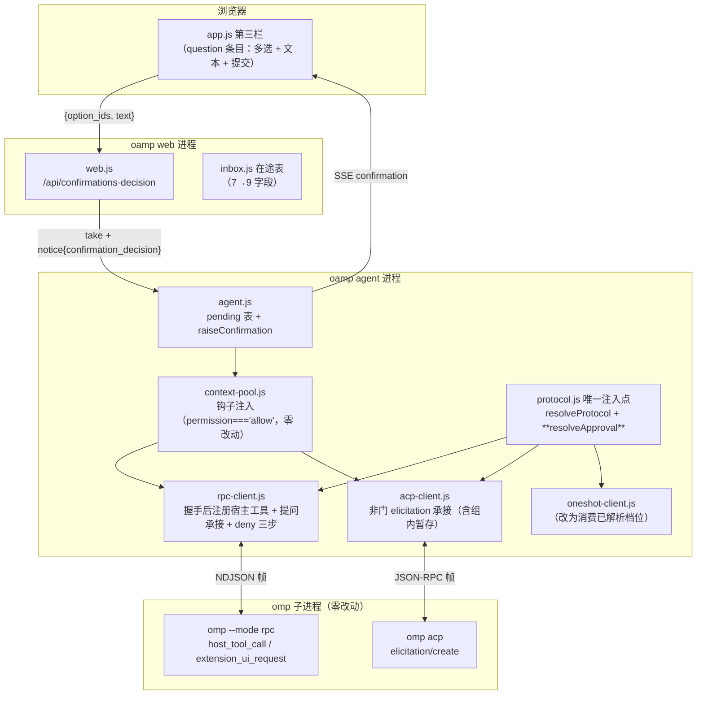

# architecture.md — 0023-yolo-approval-and-question-inbox

**版本**: 0.3.0（阶段 3 · 第 3 轮收口：**门禁 D-1 定点修正** —— 确认项信封的**类别字段由 `kind` 改名为 `request_kind`**（§5.2 / §5.3 / §5.5 / §12.4），消解它与既有通知判别键 `kind` 的**同 key 双语义**冲突；**L1-1~L1-7 语义逐字不变（只改名）**）
**迭代**: 0023-yolo-approval-and-question-inbox
**阶段**: 3（技术架构）
**创建日期**: 2026-09-14
**本轮收口**: 2026-09-14（第 3 轮：**门禁 D-1 定点修正** —— 信封类别字段 `kind` → `request_kind`，逐 key 证明与既有通知 body 的 key 集**不相交**（§5.2「与既有通知 `kind` 的共存证明」）；修正记录 = `clarifications/2026-09-14-architect-round3.md`）
**前轮收口**: 2026-09-14（第 2 轮：用户裁决回收——L1 7 条已确认、`[model_inferred]` 4 项归零、§12.1 三条疑问已裁定；裁决原件 = `clarifications/2026-09-14-architect-round1-verdicts.md`，回收过程 = `clarifications/2026-09-14-architect-round2.md`）
**输入**: `prd.md` v0.2.0（16 卡：F01~F11 需求功能点 + F12~F16 保证项；`[架构待填]` T-01~T-08）+ `prd/F01~F16*.md` + `demand.md` v1.0.0（W1~W6 / N1~N12 / M1~M8 / E1~E9 / R1~R5 / 登记⑧ 五类处置；**只读**）+ `clarifications/2026-09-14-*.md` + `clarifications/probes/probe-r1*`（K11 / K12）+ **本轮 6 条真实探针**（§2，脚本与原始输出落 `clarifications/probes/`）
**代码基线**: `<工作区地址>/oamp/**`（只读；本次基线复核为 **2026-09-14 实读**，逐条带 `文件:行号`）
**体例参照（只读，未写入）**: `docs/iterations/0022-agent-launcher-and-protocol-layer/architecture.md`
**本方案的对象**: **oamp**（本机 `http://127.0.0.1:7788` Web 控制台 + HTTP/SSE 接口面 + agent 运行时）。**不改 omp / harness 源码与协议**（N3 → F12）。

> **阅读顺序**：§1 现状基线（30 秒建立心智模型）→ **§2 实测证据（本迭代的地基：形态按实测定型，不按假设）** → §3 目标架构 → §4 L1 决策清单（7 条已确认）+ L2 决策 → §5 接口契约 → §6 卡↔路径 → §7 T-01~T-08 → §8 自查 → §9 必然变更点 → §12 越界与疑问。

---

## 0. 本文件状态

| 章节 | 状态 |
|---|---|
| §1 现状架构基线（as-is，逐条带文件:行号） | ✅ 已落盘（G1~G8 现状事实 + R1~R7 可复用原语） |
| §2 **本轮实测（6 个探针 + 6 份原始输出，脚本可复跑）** | ✅ 已落盘（含 1 条上游硬约束与 1 条现状缺口被实测推翻的诚实登记） |
| §3 目标架构（组件图 / 模块布局 / 6 条核心数据流） | ✅ 已落盘 |
| §4 关键技术决策（**L1 7 条已用户确认（2026-09-14）** + L2 决策 9 条） | ✅ 已落盘 |
| §5 接口与契约（档位 / 信封 / 回传载荷 / 宿主工具 / acp 表单映射 / 能力位 / 挂起收尾） | ✅ 已落盘 |
| §6 功能卡 ↔ 技术路径映射（F01~F16，16/16） | ✅ 已落盘 |
| §7 T-01~T-08 逐项落定（8/8） | ✅ 已落盘 |
| §8 内部一致性自查（C1~C14） | ✅ 已落盘 |
| §9 必然变更点清单（改 / 不改 / 测试面 / 文档面） | ✅ 已落盘 |
| §10 奥卡姆剃刀检验（新组件 ↔ 必需功能） | ✅ 已落盘（**新组件 0 个**） |
| §11 风险与已知代价（R1~R5 承载 + 实测新事实 N-1~N-5） | ✅ 已落盘 |
| §12 越界与疑问（含 `[user_confirmed]` 集中列示） | ✅ 已落盘（疑问 3 条已裁定 + `[model_inferred]` 4 条已全部转 `[user_confirmed]`；第 3 轮追加 D-1 定点修正登记 §12.4） |
| **§5.2 / §5.3 / §5.5 信封类别字段改名（第 3 轮 · 门禁 D-1 定点修正）** | ✅ 已落盘（`kind` → `request_kind`；与既有通知 body 的 key 集**不相交**，逐 key 对照见 §5.2） |
| §13 未越界声明 | ✅ 已落盘 |

---

## 1. 现状架构基线（as-is，2026-09-14 实读）

### 1.1 相关进程与进程边界

```
┌─ 浏览器 ─────────────────────┐  ┌─ oamp web 进程 (127.0.0.1:7788) ──────────┐  ┌─ oamp agent 进程 ─────────────┐
│ index.html + app.js          │  │ web.js  路由 / SSE / 派发 / agent 回传消费 │  │ agent.js  生命周期 + 任务执行  │
│ 第三栏（待确认收件箱）        │◀─│ inbox.js 在途确认表（进程内 Map）          │  │  ├─ shell 路径（非 omp）       │
│ notify.js 通知面             │SSE│ transport.js 键空间 chat:/call:/全局       │◀─│  ├─ 一次性路径 `omp -p`        │
│ EventSource ×2               │  │ persist.js SQLite（仅对话与消息）          │UDS│  └─ 常驻路径 ContextPool       │
└──────────────────────────────┘  └───────────────────────────────────────────┘  └───────────────┬───────────────┘
                                                                                                │ stdio
                                                                    ┌───────────────────────────┴───────────────────────────┐
                                                                    │ `omp --mode rpc` 常驻子进程（默认链路，一 chat 一进程）│
                                                                    │ `omp acp` 常驻子进程（备选链路，一 chat 一进程）       │
                                                                    └───────────────────────────────────────────────────────┘
```

L1/L2 分层（0022 已建立，本迭代沿用）：`launcher.js` = L1（profile 数据表 + 唯一 argv 构造 + spawn）；`protocol.js` = **唯一注入点**（解析链 + 两型会话装配）；三个实现模块（`rpc-client.js` / `acp-client.js` / `oneshot-client.js`）= L2；消费层（`context-pool.js` / `agent.js`）只认识门面。

### 1.2 既有技术栈（本方案**不新增**任何一项；N10 / F16）

| 面 | 现状 | 证据 |
|---|---|---|
| 运行时 | 零依赖 Node.js ≥22 ESM；`package.json.dependencies = {}` | `oamp/package.json`；`oamp/test/hygiene.test.js` |
| HTTP / 推送 | Node 内置 `http`；SSE（全局键 + `chat:<id>` / `call:<id>`） | `oamp/src/web.js`、`oamp/src/transport.js:18-26` |
| 配置 | `config.json`（**4 键**：`data.db` / `defaults.model` / `context.max` / `protocol`）+ env 折叠；`loadConfig` 为叶子模块 | `oamp/src/config.js:1-3`、`:21-31` |
| 跨进程信封 | agent→web：`task.update` / `task.result` / `notice`；web→agent：`notice{kind:'context_release'\|'confirmation_decision'}` | `oamp/src/web.js:1585-1620`、`oamp/src/agent.js:515-545` |
| 确认面（0021） | 在途表 `inbox.js`（进程内 Map，5 导出：add/list/take/remove/size）+ 通知事件 `confirmation_required` 沿用 | `oamp/src/inbox.js:1-42`、`oamp/web/app.js:648-712` |
| 链路 | 默认 `rpc`（`--mode rpc`），可切 `acp`；选择域 `{rpc, acp}`；`oneshot` 由语义选中 | `oamp/src/protocol.js:47-63`、`oamp/src/launcher.js:13-90` |

### 1.3 与本次需求直接相关的现状事实与缺口（**现状事实，非缺陷指控**）

| # | 现状 | 证据（文件:行号） | 与需求的关系 |
|---|---|---|---|
| **G1** | **档位现状是 profile 静态数据**：`omp:rpc` / `omp:acp` 均为 `approval:{mode:'always-ask',appliesWhen:'tools-on'}`；`omp:oneshot` 为 `{mode:'yolo',appliesWhen:'always'}` | `launcher.js:22`、`:37`、`:52` | W1（默认 `yolo`）/ M1（档位解析）的靶点：静态表表达不了 per-instance 覆写与配置面 |
| **G2** | **rpc / acp 实现根本不传 `approval`**：`createRpcSession` 只传 `{model, roleFile, tools}`；`AcpClient.start()` 只传 `{model, roleFile, tools}` ⇒ 实际档位 = profile 默认 | `rpc-client.js:120`；`acp-client.js:162-166` | 唯一汇聚点的接入点：两处均需改为传**已解析**的档位 |
| **G3** | **oneshot 实现自己合成档位**（第三处判定）：`toolsOn ? (permission==='deny' ? 'always-ask' : 'yolo') : null` | `oneshot-client.js:93-96`、`:121` | F03 验收 4（**唯一**汇聚点）：此处是「每个调用点自觉」的现存实例，须改为消费解析结果 |
| **G4** | **rpc 的非门交互请求一律回 `{cancelled:true}`**（`select`/`confirm`/`input`/`editor`） | `rpc-client.js:24`、`:341-343` | W3 / W5：默认链路今天**物理上没有提问面**（提问被当场取消） |
| **G5** | **acp 的非 `Approve\|Deny` elicitation 一律 `decline`**（注释明示"oamp 不代答产品外的提问"） | `acp-client.js:565-571`（`decline` 在 `:570`） | W3 / F09：acp 链路的提问面**存在但被拒答** |
| **G6** | **信封 7 字段、无类别字段**（`confirmation_id/chat_id/agent_id/tool/title/options/created_at`）；`web.js` 逐字段白名单重建；在途表按 id 存整条、`take()` 即删 | `agent.js:275-293`、`web.js:1597-1610`、`inbox.js:9-30` | M3 / T-02：`request_kind`（类别字段）与提问形状的扩展依据 |
| **G7** | **裁决回传载荷只有 `{optionId}`**；自由文本在 web 侧被当作"追加一条 chat 输入"（代码注释在 `:1312`） | `agent.js:300-308`、`web.js:1308-1324` | M5 / T-04：答案本体（含文本）无法回传；旁路须按 `request_kind` 分化 |
| **G8** | **上浮钩子按 `permission` 档单点注入**：仅 `permission === 'allow'` 时给 `onPermissionRequest`/`onApproval`，`deny` 档恒 `null` | `context-pool.js:194-203`、`agent.js:698-700` | W2 / F03：`deny` 档"门存在但不上浮"的**唯一**结构依据（本迭代**零改动**保留，见 §5.1） |

### 1.4 可复用原语（本迭代**必须复用、不得另造**）

| # | 原语 | 位置 | 复用点 |
|---|---|---|---|
| R1 | 轮次计时冻结 / 解冻（挂起期不计入轮次预算） | `rpc-client.js:179-202`（`freezeTurnTimer`/`thawTurnTimer`/`pauseDepth`）；`acp-client.js:520-536`（`_askHook` + `_pauseTurnTimer`） | T-08：提问类挂起复用同一原语 ⇒ "无上限"结构性成立 |
| R2 | 反向请求钩子两型（`onApproval` / `onPermissionRequest`）+ 未结算 Promise | `context-pool.js:194-203`、`rpc-client.js:306-330` | 提问钩子 `onQuestionRequest` 与门钩子**同形同位**（新增第二型，不新建通路） |
| R3 | 确认面上浮三步（信封 1 `notice{kind:'confirmation_request'}` → 登记在途表 → 全局 SSE 帧） | `agent.js:275-293`、`web.js:1596-1610` | 提问类复用同一信封与同一发布点（N6：不新增事件类型） |
| R4 | 失效清扫（信封 3 `confirmation_cancelled` → `inbox.remove`） | `agent.js:311-321`、`web.js:1612-1616` | 挂起提问的收尾面（轮次死 / SIGINT / `host_tool_cancel`） |
| R5 | 裁决落库 + 派发原语（`db.insertInput` + `publishMessage` + `sendTask`） | `web.js:1313-1344` | **仅 permission 类**继续使用（④改写：question 类停用该旁路） |
| R6 | 能力位键集与声明（六键 + 非 yes 键必带 note） | `protocol.js:23`、`rpc-client.js:31-46`、`acp-client.js:26-35` | F11：能力位**不随档位变**由结构保证（§5.6） |
| R7 | `ProtocolError` 五值码集（含 `permission_denied`）+ 轮次级失败的会话保持语义 | `protocol.js:14-20`、`rpc-client.js:28`、`context-pool.js:234-240` | F03：rpc 侧 `permission_denied` 结算**复用既有码值**，不新增错误面 |

> ⚠ **命名澄清**：`oamp/src/rpc.js` 是 oamp **自身**进程间的 JSON-RPC 对端（Router 面），与本迭代的「rpc 链路」（`omp --mode rpc`）不是同一个东西；二者不可互相引用。

---

## 2. 本轮实测证据（先实测后定型）

### 2.1 探针清单（脚本 + 原始输出均落 `clarifications/probes/`，可复跑）

| # | 探针（脚本 → 原始输出） | 回答的问题 | 形态 |
|---|---|---|---|
| **A2** | `probe-a2-acp-ask-form.mjs` → `a2-acp-ask-form-output.txt` | `ask` 在 acp 下 `elicitation/create` 的 requestedSchema 形状；非 `Approve\|Deny` 表单如何区分；齐答后一次性回包需要什么状态 | 真实 `omp acp` 子进程 + NDJSON JSON-RPC（与 `acp-client.js` 同协议面） |
| **R2** | `probe-r2-host-tools.mjs` → `r2-host-tools-output.txt` | `set_host_tools` 的注册时机（ready 前 / 后）、重复注册语义、`--no-tools` 下是否可用、`host_tool_call`→`host_tool_result` 的时序与轮次结算 | 真实 `omp --mode rpc` 进程；S1~S4 四场景 |
| **R2b** | `probe-r2b-host-tool-persistence.mjs` → `r2b-host-tool-persistence-output.txt` | 注册一次后**跨轮**是否仍可调用 | 同会话两轮 |
| **R3** | `probe-r3-deny-autoreject.mjs` → `r3-deny-autoreject-output.txt` | `cancelled:true` / `value:'Deny'` 回执在 omp 侧的真实后果（该轮是否中止、如何收尾） | always-ask + 工具开；D1~D3 |
| **R3b** | `probe-r3b-abort-semantics.mjs` → `r3b-abort-semantics-output.txt` | 补 `{type:'abort'}` 后是否有终态帧；abort 后**同一会话能否继续** | 单场景两轮 |
| **R4** | `probe-r4-yolo-gate.mjs` → `r4-yolo-gate-output.txt` | `yolo` 下是否**完全**无门（含 tier ≥ write）；用户策略 `prompt` / `deny` 例外的真实形态 | Y1~Y3（`--config` 临时 overlay，**未触碰 `~/.omp` 用户配置**） |

### 2.2 A2 实测（`acp` 链路的提问帧面）

一次 `ask(questions=[3 问])` 调用产生**恰 1 帧** `elicitation/create`：

```jsonc
// params（原样摘录，原始输出见 a2-acp-ask-form-output.txt）
{ "mode": "form", "sessionId": "01a09f9a-…", "message": "Answer 3 questions",
  "requestedSchema": { "type": "object", "properties": {
    "q0": { "type": "string", "title": "优先保证哪一点？", "oneOf": [ {"const":"思考过程可见","title":"思考过程可见"}, {"const":"工具调用可审批","title":"工具调用可审批"} ] },
    "q0__other": { "type": "string", "title": "Other (type your own)" },
    "q1": { "type": "array", "title": "要改哪些文件？", "items": { "anyOf": [ {"const":"web.js","title":"web.js"}, … ] } },
    "q1__other": { "type": "string", "title": "Other (type your own)" },
    "q2": { … 单选 … }, "q2__other": { … } } } }
// 无 required 字段（undefined ⇒ 未携带）
```

- **区分方式（实测）**：审批门表单的判据是 `properties.value.enum ⊇ {Approve, Deny}`（`acp-client.js:565-571` 既有判据）；提问表单**没有** `value` 属性，属性名为 `q{i}` / `q{i}__other`。两类在**同一方法名**（`elicitation/create`）下靠 schema 形状区分。
- **组内齐答后一次性回包（实测）**：客户端回**恰 1 帧** `{action:'accept', content:{ q0:…, q0__other:…, q1:[…], q1__other:"", q2:…, q2__other:"" }}` ⇒ `session/prompt` 以 `stopReason:'end_turn'` 正常结算。⇒ 一次 elicitation 的全部问答案在**同一个 content 映射**里，N 问一次回。
- **模型侧收到的结果（实测，模型自述复述）**：q1 单选 + `q1__other` 非空 ⇒ **`选中项文本：（无选中项）`、自定义文本保留**；q2 多选（`q1`/第二问）⇒ **两选项均保留**；单选无文本 ⇒ 选项保留。
- **上游硬约束（实测 + 源码双证）**：omp `askDialog` 的解析规则为 `customInput === undefined && labels.includes(value) ? [value] : []`（单选分支，`acp-agent.ts:548-553`）⇒ **单选问答里"选项 + 自由文本"并存时，选项被上游丢弃**（多选分支独立于 customInput，两者都保留）。见 §2.7 与 §12 疑问 1。

> **承接项闭合**：本节即 `demand.md` §7「待实测」**唯一 1 项**（`prd.md`「移交阶段 3 的承接项」**M-1**：`acp` 多问题表单的端到端帧面 —— 一问一条 × 齐答后回包）的实测结论，本轮闭合；另一项 **M-2**（新计时面须与"无上限"一并处置）由 §5.7 落定（**不新增计时面**）。原列的「`rpc-ui` 的 `PI_NO_PTY=1` 副作用」已随 A1 否决该路径由需求阶段解除。

### 2.3 R2 / R2b 实测（默认链路的宿主工具通路）

| 观察 | 实测结果 | 证据 |
|---|---|---|
| 注册时机 | **ready 帧之前发送亦被受理**（`set_host_tools` 的回包在 ready 之后到达、`success:true`、`toolNames:["ask_user"]`），且模型随后**确实调用到了** | `r2-host-tools-output.txt` S2 |
| 重复注册语义 | **替换**（先注册 `ask_user`、再注册 `other_tool` ⇒ 回包 `toolNames:["other_tool"]`；不累加） | 同上 S3 |
| `--no-tools` 下可用性 | **宿主工具仍可注册且模型可调用**（`--no-tools` 下 `host_tool_call{toolName:'ask_user'}` 正常到达） | 同上 S4 |
| 轮次结算关系 | `host_tool_call` 到达后**该轮保持"在飞"**（故意延迟 8.00s 回包，期间**无** `agent_end`）；回包后该轮继续（后续工具照跑、`agent_end{isTerminal:true}` 正常收尾） | 同上 S1 |
| 跨轮存活 | 注册一次后，**同一会话第 2 轮**仍可调用（两轮各 1 次 `host_tool_call`） | `r2b-host-tool-persistence-output.txt` |
| 回包形状 | 我方回 `{type:'host_tool_result', id, result:{content:[{type:'text',text}]}}` ⇒ 该轮继续并正常收尾 | K12（既有）+ 本轮 S1 |
| 未注册工具 | omp 侧约定：回 `isError:true` + "not registered" 文本；另有 `host_tool_cancel{targetId}` 帧用于**撤销**挂起调用 | omp 源码 `src/modes/rpc/host-tools.ts`、`rpc-types.ts:446-483` |

### 2.4 R3 / R3b 实测（`deny` 档在 rpc 链路的自动拒绝落点 —— **本迭代最关键的一条现状缺口**）

| 场景 | 回执 | 实测后果 |
|---|---|---|
| D1 | `{cancelled:true}`（= **oamp 现状**在 `deny` 档发出的回执） | 工具被拒（模型自述"denied by user policy"）⇒ **该轮照常继续并正常收尾**：`agent_end{isTerminal:true}`、`stopReason:'stop'`，**无** `permission_denied`、**无**轮次中止 |
| D2 | `{value:'Deny'}` | 与 D1 **等价**（同为拒绝；轮次同样正常收尾） |
| D3 | `{value:'Approve'}` | 工具照常执行（对照组：证明门确实可裁决） |
| R3b | D1 回执 + 随后 `{type:'abort'}` | 0.3s 内 `turn_end` + `agent_end{isTerminal:true}`、`response{command:'abort',success:true}`；**随后同一会话第二轮 prompt 正常收尾** ⇒ 中止是**轮次级**，不杀会话（与 ACP 侧 `session/cancel` 语义等价） |

> **结论（推翻既有假设，构成必然变更点）**：`prd/F03` 验收 3 / MI-02 要求 rpc 链路观测到「**该轮以 `permission_denied` 中止**」，而**现状不存在这一观测面**——仅回 `cancelled:true` 只拒工具、轮次照常跑完。⇒ rpc 侧必须补上「中止该轮」这一步（§3.3 流 5 / §5.1 / §9）。ACP 侧的三步（`reject_once` + `session/cancel` + `permission_denied`）**逐字不动**（既有）。

### 2.5 R4 实测（`yolo` 下的门分布）

| 场景 | 配置 | 实测 |
|---|---|---|
| Y1 | `--approval-mode yolo`（无用户策略） | **零 `select` 门**（`extension_ui_request` 仅 `setWidget` 展示帧）；`write` 与 `bash` **确实执行**（`out.txt = "hello-0023"`、`echo done` 有输出）⇒ **E1 两半句同时成立** |
| Y2 | `--approval-mode yolo` + `--config`（临时 overlay）`tools.approval.bash: prompt` | **门出现**：`select` + `options:["Approve","Deny"]` + `title:"Allow tool: bash\nCommand: …"` ⇒ K10 的"用户策略例外"**运行期成立**，且**形态与 always-ask 下完全一致**（既有门识别原语继续有效） |
| Y3 | `--approval-mode yolo` + overlay `tools.approval.bash: deny` | 无门，工具被策略阻止（模型自述"blocked by user policy"） |

> overlay 文件写在 `/tmp/probe-0023-r4/`（`--config` 是 omp 既有的"本次运行额外叠加"入口，**未读写 `~/.omp`**）。

### 2.6 实测 → 架构含义（逐条落到决策）

| 实测事实 | 架构含义 |
|---|---|
| yolo 下零门、always-ask 下门齐备（Y1 / R3 D*） | 档位必须真的落到 argv（`--approval-mode`）⇒ W1 的实现面 = argv 取值（§5.1） |
| yolo 下用户策略仍可产门（Y2） | ①`request_kind:'permission'` 通路**不可删**（F10 验收 2 成立）；② **门钩子**必须继续在 **`permission==='allow'`** 时注入（否则偶发门无人接收、被 `cancelled:true` 吃掉）⇒ G8 的判定**零改动**保留；③ 该判定只约束**门面**，**提问钩子另按"恒注入"**（§5.1） |
| rpc 拒绝后轮次照常收尾（R3 D1） | rpc 侧「自动拒绝三步」**须新建**（回执 ⇒ `abort` ⇒ 以 `permission_denied` 结算）；acp 侧零改动 |
| abort 后会话可用（R3b） | 中止按**轮次级**实现（复用 `ProtocolError('permission_denied')` + `ContextPool._failSession` 的轮次级语义），**不杀子进程、不弃会话** |
| 宿主工具在 ready 前/后均可注册、注册为替换、跨轮存活、`--no-tools` 下可用（R2/R2b） | 注册**恰一次**、时机 = 握手完成后（返回会话对象前）；提问能力**不依赖工具开关**（F09 验收 1 对匿名实例同样成立） |
| `host_tool_call` 期间该轮在飞、无终态帧（R2 S1） | 挂起期必须**冻结轮次计时**（复用 R1 原语）⇒ T-08 的"无上限"结构性成立 |
| A2：一次 ask = 一帧多问、一次回包 | 一问一条须由 **hub 侧拆分登记**；齐答后一次性回包的最小状态 = 该帧处理函数内的局部聚合（T-03） |
| A2：单选 + 文本 ⇒ 选项被上游丢弃 | 上游硬约束，hub 不可解 ⇒ 登记为 R4 实例（§12 疑问 1） |

### 2.7 实测发现的两条上游硬约束（**不是本迭代引入**，但影响验收口径）

1. **acp 单值属性的承载上限**：`q{i}` 单选与 `value` 单属性只能承载**一个值** ⇒ acp 链路上「选项 + 自由文本」并存时，只能是二选一被模型看到（单选为"文本胜出"，多选为"两者都在"）。omp 的 `askDialog` 解析规则与 `select` 形状都是既有实现（`acp-agent.ts:548-553`），**改它即违反 N3 / F12**。
2. **`q{i}__other` 的存在性**：omp 对**每一问**都附加 `#{i}__other` 自由文本属性（`acp-agent.ts:500`）⇒ acp 链路的"每问都允许自由文本"是**上游强加**的事实，与 F05 验收 3/4（允许自由文本）同向、无冲突。

---

## 3. 目标架构

### 3.1 组件图（新增 0 个组件，全部为既有模块的内聚扩展）



### 3.2 模块布局（**改 9 个后端文件 + 2 个前端文件；新增模块 0**）

| 模块 | 本迭代职责 | 变更性质 |
|---|---|---|
| `src/protocol.js` | **档位唯一汇聚点**：`resolveApproval(spec)`（纯函数）+ `createProtocolLayer` 求值一次并写入 spec | 扩展（+1 函数 / 1 次求值） |
| `src/launcher.js` | profile 表不再承载档位**取值**（只留 `appliesWhen` 形态）；`buildArgv` 的 `approval` 入参改为已解析档位 | 收窄（死数据删除 + 入参语义收窄） |
| `src/rpc-client.js` | ① 握手后注册宿主工具（恰一次）② `host_tool_call` → 上浮 + 冻结计时 + 回包 ③ `host_tool_cancel` → 撤条目 ④ 门被自动拒绝时补"中止该轮"三步 | 扩展（+2 承接 / 1 拒绝分支改写） |
| `src/acp-client.js` | `_handleElicitationRequest` 的**非门分支**由 `decline` 改为"逐问登记 → 齐答后一次性回包"；承载本期新增的 `approval` 入参 | 改写（1 处判定分支）+ 入参透传 |
| `src/agent.js` | ① 新增 `--approval-mode` 参数解析 + 档位声明入事件 ② 提问钩子接线（`onQuestionRequest` 与门钩子共用 `raiseConfirmation`）③ 信封扩展与 `request_kind` 分化 | 扩展（3 处） |
| `src/config.js` | 第 5 键 `approval`（值域 `{always-ask, yolo}`，缺省 `yolo`；非法 ⇒ 响亮失败） | 扩展（1 键） |
| `web/app.js`（+ `web/style.css`） | 条目按 `request_kind` 分化渲染（**[user_confirmed MI-2]**）：question 类支持多选与"一次提交"（permission 类交互**不变**） | 扩展（1 分支） |
| `src/context-pool.js` | **提问钩子透传**（`onQuestionRequest`，注入条件与门钩子**不同**：门钩子仍限 `permission === 'allow'`、提问钩子**恒注入**）——其余逻辑零改动 | 扩展（1 处透传） |
| `src/web.js` | ① 信封白名单补 `request_kind`/`multiple` ② 裁决路由按 `request_kind` 分化（question 类停掉"文本 → chat 输入"旁路；MI-03 必填校验） | 扩展（2 处） |
| `inbox.js` / `transport.js` / `persist.js` / `router.js` | **零改动**（在途表结构不变：整条存、`take()` 即删） | 零 |
| `oneshot-client.js` | 改为消费已解析档位（删除自定义合成） | 收窄 |

### 3.3 核心数据流

**流 1 · 档位解析（唯一汇聚点，★ 本迭代的新增判定）**

```
agent start <id> [--permission allow|deny] [--approval-mode <v>]
  ├─ parseAgentArgs：--approval-mode 取值域校验（非法 ⇒ 退出 2，点名该值）
  ├─ loadConfig：config.json 第 5 键 approval（非法 ⇒ OAMP 配置错误 ⇒ 退出 1）
  └─ makeLayer({ permission, approval: <flag>, configApproval: config.approval, … })
        └─ protocol.js::createProtocolLayer
              └─ resolveApproval(spec)  ← ★ 全仓唯一判定处
                    permission === 'deny'           ⇒ 'always-ask'   （优先于显式档位）
                    spec.approval（显式 --approval-mode）⇒ 该值
                    spec.configApproval（config 第 5 键）⇒ 该值
                    否则                             ⇒ 'yolo'（内置默认）
              └─ spec.approval = <解析结果>（冻结字符串）
                    ├─ rpc-client → buildArgv(…, approval)
                    ├─ acp-client → buildArgv(…, approval)
                    └─ oneshot-client → buildArgv(…, approval)
                          └─ launcher：profile.approval.appliesWhen === 'tools-on' 且工具开 ⇒ 追加 `--approval-mode <值>`
```

**流 2 · rpc 链路的提问（默认链路，W5 的默认面）**

```
会话建立：createRpcSession → ready → negotiate_protocol(2) → 【新增】set_host_tools([ask_user]) 恰一次 → 返回会话
一轮：prompt
  └─ 模型调用 ask_user{question, options?, multiple?}
        └─ 帧 host_tool_call{id, toolCallId, toolName:'ask_user', arguments}
              ├─ rpc-client：freezeTurnTimer()（挂起期不计入轮次预算）
              ├─ hooks.onQuestionRequest({requestKind:'question', question, options, multiple, chatId, agentId, origin})
              │     └─ agent.js::raiseConfirmation → 信封（request_kind:'question'）→ notice → web.js → inbox.add → SSE 帧 → 第三栏
              ├─ 用户作答 → POST /api/confirmations/<id>/decision {option_ids, text}
              │     └─ web.js → notice{kind:'confirmation_decision', option_ids, text} → agent.js → resolve
              └─ rpc-client：thawTurnTimer() → host_tool_result{id, result:{content:[{type:'text', text}]}}
  └─ 该轮继续 → agent_end{isTerminal:true}
收尾面：host_tool_cancel{targetId} → 撤条目（不发回包）；轮次死 / SIGINT → 既有 cancelPending（信封 3）
```

**流 3 · acp 链路的提问（W5 的 acp 面 + 一问一条 + 组内暂存）**

```
帧 elicitation/create{id, params:{mode:'form', message, requestedSchema}}
  ├─ 是审批门（properties.value.enum ⊇ {Approve,Deny}）⇒ 既有路径（零改动）
  ├─ 是提问表单 ⇒ 【新增】按形状拆问（§5.5 映射表）
  │     ├─ 每题一次 hooks.onQuestionRequest(...)（N 问 ⇒ N 条独立条目 = 一问一条）
  │     ├─ 组内暂存 = 本帧处理函数内的局部状态（该帧 id + 每题一个未结算 Promise）
  │     └─ Promise.all(各问) —— 齐答后【恰一次】_respond(id, {action:'accept', content:{q{i}:…, q{i}__other:…}})
  └─ 其余未知形状 ⇒ 既有 decline（保守，不代答）
```

**流 4 · 作答回传（W4 / F07）**

```
第三栏 question 条目 → POST decision {option_ids, text}
  ├─ 服务端校验：option_ids ⊆ 条目 options；且 option_ids.length>0 或 text.trim() !== ''（MI-03；空提交 ⇒ 400 且条目保留在途）
  ├─ notice{kind:'confirmation_decision', confirmation_id, option_ids, text}
  ├─ agent.js::settleConfirmation → resolve({ optionIds, text })（question 类）/ resolve({ optionId })（permission 类，既有）
  └─ 提问方实现按链路上线（§5.4 / §5.5）
        rpc → host_tool_result（文本渲染；自由文本逐字保留）
        acp → elicitation/create 的 content（q{i} / q{i}__other）
  ※ question 类【不再】追加 chat 输入（④改写）；permission 类维持既有旁路（R5）
```

**流 5 · `deny` 档的自动拒绝（★ 实测推翻现状，须补）**

```
deny 实例 ⇒ permission==='deny'
  ├─ 档位解析 ⇒ 'always-ask'（argv 仍带 --approval-mode always-ask ⇒ omp 侧门存在）
  ├─ 门钩子注入：context-pool 的 permission==='allow' 判定 ⇒ **null**（门面既有点，判定零改动）⇒ 工具门零上浮、收件箱零新增
  │   ※ 同一实例的**提问**仍上浮（提问钩子恒注入，§5.1）——两类条目互不影响
  └─ rpc 链路【新增三步，与 acp 既有三步语义等价】：
        ① 回执拒绝：extension_ui_response{cancelled:true}（既有）
        ② 中止该轮：发 {type:'abort'}（幂等；实测 0.3s 内 turn_end + agent_end）
        ③ 以 permission_denied 结算该轮：复用 ProtocolError('permission_denied')（R7）⇒ ContextPool 按轮次级失败处理、会话保持可用
      acp 链路：既有三步（reject_once → session/cancel → permission_denied）**逐字不动**
```

**流 6 · 挂起与收尾（无上限 / 不代答 / 不设超时）**

```
挂起期：钩子返回未结算 Promise ⇒ 轮次计时冻结（R1，两实现各一处）⇒ 无上限（不新增任何计时器 / 超时面）
期间：不自动选、不自动答、不代答拒绝（N2 / N12）；entry 一直在途（刷新 / 重连由既有重建面拉回）
收尾：① 作答 ⇒ 结算 + 回包 ② rpc 收到 host_tool_cancel ⇒ 撤条目、不回包
      ③ 轮次终结 / 上下文淘汰 / SIGINT ⇒ 既有 cancelPending ⇒ notice{confirmation_cancelled} ⇒ inbox.remove（R4）
```

---

## 4. 关键技术决策

### 4.1 L1 决策清单（**影响系统边界 / 核心模块职责 / 新增配置面 —— 7 条已用户确认（2026-09-14）；可进入实现**）

> 分级口径（角色契约）：**L1 = 引入新技术栈 / 改变现有核心模块职责 / 影响系统整体边界**。以下 7 条**不引入新技术栈**（零新依赖、零新进程），但都**改变既有核心模块职责或跨模块契约**，故按 L1 上报。7 条均已于 **2026-09-14** 经用户裁决**采纳推荐项①**（原件 = `clarifications/2026-09-14-architect-round1-verdicts.md`）；**候选方案与否决理由逐字保留在下方表内**。**第 3 轮定点修正（2026-09-14 · 门禁 D-1）**：L1-3 推荐①的类别字段**只改名**（`kind` → `request_kind`，落点 §5.2 / §12.4）——七条决策的**语义逐字不变**；表内候选与理由原文按留档体例保留，其中提及 `kind` 者一律以 §5.2 的 `request_kind` 为准（`kind` 是**通知**判别键，不是信封字段）。

| # | **裁决** | 决策 | 候选方案 | **推荐** | 理由 / 影响面 |
|---|---|---|---|---|---|
| **L1-1** | ✅ 用户确认（2026-09-14，采纳推荐） | **档位解析的唯一汇聚点落点**（T-01） | ① `protocol.js::resolveApproval`（**唯一注入点**，与 `resolveProtocol` 对称）② `agent.js` 启动段一次性求解后透传 ③ 各实现各自求解（现状） | **①** | ①处是「消费层只认识门面」的既有单点（`context-layer` 三实现只在门面内装配）；三条链路（rpc / acp / oneshot）**结构上不可能绕过**（它们只从门面拿 spec）；③ 是现状、正是 F03 验收 4 要消灭的形态。影响面：`protocol.js` +1 纯函数、三实现各 -N 行判定 |
| **L1-2** | ✅ 用户确认（2026-09-14，采纳推荐） | **档位取值域的配置面落点与键名**（T-07） | ① `config.json` 第 5 键 `approval` + `agent start --approval-mode <v>`（Q3 点名的两处）② 另加 env `OAMP_APPROVAL` ③ 只在 CLI | **①** | Q3 原文只点名这两处；②是**未被要求**的扩展面（奥卡姆 + 边界纪律）；③会让"配置面"缺一半（E8 要求读配置面）。键名/参数名**沿用 Q3 原词**，不另造 |
| **L1-3** | ✅ 用户确认（2026-09-14，采纳推荐） | **提问信封的字段形状**（T-02） | ① 新增 `kind` + `multiple` 两字段，问题文本复用既有 `title`、选项复用既有 `options`，自由文本**由 `kind:'question'` 蕴含**（不加字段）② 新增 `kind` + `question` + `multiple` + `allow_text` 四字段 ③ 单一 `payload` 子对象承载提问形状 | **①** | ①新增面最小（+2 字段）且**每一条 M3 可表达性都有承载**（§5.2 逐项对照）；②的 `allow_text` 在 question 类**恒真**（F05 验收 3/4 要求两类形态都允许文本）⇒ 常数字段是伪信息；③引入子对象会同时改前端渲染与在途表结构（N11 载体不变）。**注意**：`kind` 需同时覆盖 permission 类（M3 明文"以 `kind` 区分两类"） |
| **L1-4** | ✅ 用户确认（2026-09-14，采纳推荐） | **裁决回传载荷字段**（T-04） | ① 按 `kind` 分化：question 类 `option_ids: string[]` + `text: string`；permission 类既有 `option_id` + `text` 不变 ② 统一改成 `option_ids` + `text`（permission 侧把单选也数组化）③ 新增 `answer:{option_ids,text}` 子对象 | **①** | ①满足多选（F05 验收 2）且**零改动** permission 侧既有契约（登记⑧ ④"permission 类维持原文"）；②会改既有结算路径（`settleConfirmation` 的 `{optionId}` → acp `reject_once` 等语义面）⇒ 无谓回归风险；③同 L1-3 ③ |
| **L1-5** | ✅ 用户确认（2026-09-14，采纳推荐） | **acp 组内暂存的形态**（T-03） | ① 该帧处理函数内的**局部状态**（帧 id + 每题一个未结算 Promise + 答案聚合）② 新增进程级"提问组表"模块 ③ 复用 `agent.js` 的 `pending` 表做分组 | **①** | ①状态生命周期 = 该帧处理函数的生命周期，**无跨帧 / 跨模块状态**，奥卡姆检验通过（②③都需要新状态载体与清理路径）；②新增模块无对应功能；③要把 ACP 帧 id 泄漏进 pending 表（违反 0022 的 L2 边界） |
| **L1-6** | ✅ 用户确认（2026-09-14，采纳推荐） | **宿主工具命名 / 参数 schema / 注册时机**（T-05） | ① `ask_user`（A1 原词）+ `{question, options?:string[], multiple?:boolean}` + **握手完成后、返回会话前注册恰一次** ② 命名 `ask`（与 omp 同名）③ 每次 prompt 前重复注册 | **①** | ①与 A1 原文（"如 `ask_user`"）与 K12 探针一致；注册时机由 R2 实测支撑（ready 前后均可，选"握手完成"⇒"会话就绪即已注册"，无首轮竞态）；③被 R2 S3 实测否决（**替换**语义，重复注册等于自覆盖）。**`--no-tools` 下仍可用**（R2 S4）⇒ 提问能力不依赖工具开关 |
| **L1-7** | ✅ 用户确认（2026-09-14，采纳推荐） | **能力位集合与签名 / 档位声明面**（T-06 + M8） | ① 能力位集合与签名**不变**（六键、`approvalGate` 恒按协议取值）；"本次生效形态"由**档位声明**单独表达：`spec.approval`（运行值）+ `AGENT_START` 事件 `approval` 字段 + argv 面 ② 在能力位里加 `approvalMode: 'yolo'\|'always-ask'` ③ 新增 `capabilities().approval` 子对象 | **①** | M8 明文要求"两件事分开表达"；②③正是 M8 禁止的形态（把档位塞回能力位，F11 验收 3 会失败）。①的档位声明与"实际档位"同源于唯一汇聚点的**同一个值**⇒ F11 验收 2 的"一致"由结构保证 |

> **L1 生效与"未实施"的边界**：上表 7 条**已由"未确认"转为生效架构契约**（构成本迭代阶段 4/5 的实现依据），但阶段 3 **仍未落地任何代码**（实现属阶段 5）。7 条**全部采纳推荐**⇒ `prd/F01~F16*.md` 的架构段回填与 §5 各契约、§7 对应项**逐字不变**（无口径重写）。

### 4.2 L2 决策（自主决定，逐条附理由）

| # | 决策 | 理由 |
|---|---|---|
| L2-1 | **档位取值不再由 profile 静态表承载**（`PROFILES` 五行的 `mode` 删除，保留 `appliesWhen` 形态）；`buildArgv` 的 `approval` 入参 = **已解析档位字符串**（未给 ⇒ 响亮失败） | 静态表表达不了 per-instance 覆写（M1）；`undefined` 静默回落会让"某条链路忘记覆写"变成**静默失效**——正是 F03 验收 4 要消灭的通路。响亮失败 = 既有配置校验体例 |
| L2-2 | `omp:oneshot` 行的 `appliesWhen` 由 `'always'`（既有死值：一次性实现从来都是显式传段）改为 `'tools-on'` | 让 profile 行与真实行为一致；改后一次性路径 argv **逐字不变**（`tools off ⇒ 无档位段`） |
| L2-3 | **提问钩子命名 `onQuestionRequest`**：与门钩子**同形**（钩子入参 / 未结算 Promise / 冻结计时的用法一致）、经**同一注入点**透传，但**注入条件不同** —— 门钩子仍由 `permission === 'allow'` 判定（deny ⇒ null ⇒ 自动拒绝），提问钩子**恒注入**（M6「一律登记待答」/ F04 验收 4；`deny` 实例上提问同样上浮） | 复用 R2 原语（不新建通路、不新建模块）；"提问不随档位变"必须与 `permission` 解耦才能成立（否则 `deny` 实例的提问会被自动拒绝 = 代答，违 N12）；**类别标记（第 3 轮 D-1 定点修正）**：提问钩子入参新增 `requestKind`（`'permission' | 'question'`），由 `raiseConfirmation` **一对一**写入信封的 `request_kind`（无映射层；缺省 ⇒ `'permission'`，与 §5.2 的兜底同源） |
| L2-4 | **question 类条目的选项 `option_id` = `label`**（两个载体上都是"人给的字符串"，omp 的 acp 回包按 label 匹配、宿主工具参数本就是字符串数组） | 少一层 id↔label 映射；`option_id` 在 acp 侧取 `const`、`label` 取 `title`（两者在 omp 产出里恒相等，防御性取字段） |
| L2-5 | **宿主工具回包文本的渲染**：仅选项 ⇒ `选项：A, B`；选项+文本 ⇒ `选项：A, B\n文本：<逐字>`；仅文本 ⇒ `<逐字>` | 自由文本**逐字**出现（E4 的"答案文本与输入一致"可核）；标签行固定、机器可读；格式属呈现细节（L3 可调）；**已采纳**（[user_confirmed MI-4]，2026-09-14） |
| L2-6 | **未知形状的 elicitation 继续 `decline`**（只新增识别 §5.5 表中四种形状） | 保守不代答（既有注释口径）；不为未知协议形状猜语义 |
| L2-7 | **`MI-03` 必填性在服务端（`web.js` 裁决路由）判定**，前端只做可用性提示 | 服务端是权威校验点（既有非法 `option_id` ⇒ 400 + 条目保留在途的同一体例）；前端校验可被绕过 |
| L2-8 | **question 类条目的前端交互 = 选项可多选取舍 + 文本 + 一次"提交"**（permission 类**点选即裁决不变**） | F05 验收 3/5 要求"选项 + 文本一并提交"与"仅文本可提交"⇒ 即点即裁决无法承载；N11 要求既有交互面不变 ⇒ 分化只发生在 question 类；**已采纳**（[user_confirmed MI-2]，2026-09-14） |
| L2-9 | `AGENT_START` 事件新增 `approval` 字段（保留既有 `permission`） | 档位声明的**可读面**（F11 验收 2 的判定入口）；既有事件面零新增载体 |

---

## 5. 接口与契约

### 5.1 档位（T-01 / T-07 / T-06）

**取值域**：`'always-ask' | 'yolo'`（两值，`write` / `tier` 不入域 — N1 / A2）。

**配置面（两处，Q3 原词；[user_confirmed MI-1]：不加 env 键）**

| 面 | 形态 | 校验（MI-01：非法 ⇒ 拒绝启动并点名该值） |
|---|---|---|
| `config.json` | 第 **5** 键 `approval`，缺省 `yolo` | `loadConfig` 抛 `OAMP 配置错误: approval 仅支持 always-ask/yolo（当前值 …）` ⇒ `agent start` 退出 1 |
| `agent start` | `--approval-mode <always-ask\|yolo>`（未给 ⇒ 交解析链） | `parseAgentArgs` 返回 `{ok:false, reason}` ⇒ `agent start` 退出 2 |

**解析链（唯一汇聚点 = `protocol.js::resolveApproval(spec)`，纯函数）**

```
permission === 'deny'                 ⇒ 'always-ask'   // W2 / M1 / A5/P12：优先于显式档位
spec.approval（显式 --approval-mode）  ⇒ 该值
spec.configApproval（config 第 5 键）  ⇒ 该值
否则                                   ⇒ 'yolo'          // 内置默认（W1 / E8）
```

- 求值**一次**（`createProtocolLayer`），结果写入传给实现的 `spec.approval`；三实现**只消费**、不再判定（F03 验收 4）。
- **argv 面**：`appliesWhen === 'tools-on'` 且工具开 ⇒ 追加 `--approval-mode <值>`；工具关 ⇒ 不追加（omp 自身默认即 yolo）。⇒ E8 的"观察 argv"可核。
- **钩子注入面（两型分开，★ 本迭代必须区分的一处）**：
  - **门钩子（`onApproval` / `onPermissionRequest`）**：`context-pool.js:194-203` 的 `permission === 'allow'` 判定**逐字保留**——它是"`deny` 档的工具门不上浮"的唯一点，且保证 yolo 档下的偶发门（R4 Y2 实测）仍有人接收（F10 验收 2）。
  - **提问钩子（`onQuestionRequest`，新增）**：**恒注入**（与 `permission` 解耦）——依据 M6「提问类请求**一律**登记待答、不代答拒绝」与 F04 验收 4「提问上浮不随档位变」。`permission` 只决定**工具门**是否自动拒绝（W2 / Q1 原文只谈门），不决定提问面。
  - **两型在同一实例上的并存形态（防止误读）**：`deny` 实例 ⇒ **工具门零上浮**（收件箱零新增，F03 验收 2 成立）**且提问仍上浮**（F04 验收 4 / N12 成立）——两者不冲突：它们是同一个 inbox 上的两类条目，由 `request_kind` 区分。
  - **离线边界（如实登记，不新增机制）**：无收件人（agent 与 Router 连接不可用）时沿用既有 `raiseConfirmation` 的 `null` 回落（**不把轮次永久吊起**）；E5 / F08 的判定场景是"条目已出现后搁置"，不覆盖该边界；**不新增离线重投 / 重放机制**（未要求）。
- **能力位面（F11）**：`CAPABILITY_KEYS` 六键与 `capabilities()` 签名**不变**；`approvalGate` 恒按协议声明（rpc/acp `'yes'`、oneshot `'no'` + note），**与档位无关**（代码结构上：档位值不进入任何能力位表）。档位声明 = `spec.approval` + `AGENT_START` 事件 `approval` 字段 + argv。
- **生效范围（Q-3 已裁定（2026-09-14））**：档位配置面对**三条路径**（rpc / acp / 一次性 `omp -p`）**统一生效**（解析点唯一 ⇒ F03 验收 4 的单点要求）。**代价如实登记**：配 `always-ask` 时，一次性路径（无反向通道）在工具开启时会退化为 **omp 侧自动拒绝**受门禁调用 —— 与既有 `--permission deny` 在一次性路径的表现**同形**（存量行为）；已否决"给一次性路径开例外"（会产生第二个判定点，与 F03 验收 4 相冲）。

### 5.2 确认项信封（T-02）

沿用既有 7 字段，**新增 2 个**（`request_kind` / `multiple`）：

| 字段 | 类型 | permission 类 | question 类 | 说明 |
|---|---|---|---|---|
| `confirmation_id` | string | ✅ | ✅ | 既有 |
| **`request_kind`** | `'permission' \| 'question'` | `'permission'` | `'question'` | **新增**：M3 的类别字段（**不与通知判别键 `kind` 同 key**；如缺失按 `'permission'` 兜底，兼容既有投递） |
| `chat_id` / `agent_id` | string\|null | ✅ | ✅ | 既有 |
| `tool` | string\|null | 工具名 | 承载名（rpc：`ask_user`；acp：`ask` / `null`） | 既有字段，语义不变（"是谁在要"） |
| `title` | string\|null | 原始请求正文（多行） | **问题文本** | M3「问题文本」的承载（与既有"给人看的正文"同一展示位 ⇒ 前端第二行零改动） |
| `options` | `[{option_id,label?}]` | 请求方给的集合 | 提问给的集合（可为 `[]`） | M3「选项集合」的承载；`option_id` = `label`（L2-4） |
| **`multiple`** | boolean | `false` | 是否多选 | **新增**：M3「含是否多选」的承载 |
| `created_at` | number | ✅ | ✅ | 既有 |

**M3 四项可表达性逐项对照**（自查用）：

| M3 要求 | 承载 |
|---|---|
| 问题文本 | `title` |
| 选项集合（含是否多选） | `options` + `multiple` |
| 是否允许自由文本 | **由 `request_kind:'question'` 蕴含**（question 类**恒**允许自由文本 —— F05 验收 3 带选项可附文本、验收 4 纯文本提问；acp 侧上游对每问恒附加 `__other`，§2.7）⇒ 不设恒真字段 |
| 无选项的纯自由文本提问 | `options: []` + `request_kind:'question'` |

> **不改载体（N11）**：仍在第三栏、仍用既有条目容器与 `POST /api/confirmations/<id>/decision`；变异面仅"条目形状 + question 类控件"。

#### 5.2.1 与既有通知 `kind` 的共存证明（第 3 轮 · 门禁 D-1 定点修正）

**为什么必须改名**：`notice` 的 body 是**扁平**结构，而 `kind` 在既有投递上早已是**通知类型判别键**（实读 2026-09-14）：

| 面 | 代码事实（`文件:行号`） | `kind` 的角色 |
|---|---|---|
| 生产（agent→web，无信封形态） | `agent.js:245` `const body = fields === null ? { chat_id: chatId, kind, text } : { kind, ...fields };` | 通知类型 |
| 生产（agent→web，信封形态） | `agent.js:291`（`kind: 'confirmation_request'`）、`:319`（`kind: 'confirmation_cancelled'`） | 通知类型 |
| 消费（web 侧判读） | `web.js:1597`（`=== 'confirmation_request'`）、`:1613`（`=== 'confirmation_cancelled'`）、`:1618`（`context_released` / `context_reset`） | 通知类型 |
| 生产（web→agent） | `web.js:1695-1703` `sendControlNotice` ⇒ `:1311`（`kind: 'confirmation_decision'`）、`:598` / `:632`（`kind: 'context_release'`） | 通知类型 |
| 消费（agent 侧判读） | `agent.js:536`（`=== 'confirmation_decision'`）、`:540`（`!== 'context_release'`） | 通知类型 |

⇒ 若信封的类别字段也叫 `kind`，`agent.js:245` 的 `{ kind, ...fields }` 展开次序会让 `fields.kind` **覆盖**通知类型 ⇒ **同一个扁平 key 承载两个值**（该请求在 `web.js:1597` 判否后被丢弃）。改名后此冲突不复存在。

**逐 key 对照（既有通知 body 的 key 并集 × 本次新增字段名）**

| 既有 notice body 的 key（两方向并集） | 实读出处（`文件:行号`） | 语义 | 与 `request_kind` / `multiple` 相交 |
|---|---|---|---|
| `kind` | `agent.js:245` / `:291` / `:319` / `:536` / `:540`；`web.js:1597` / `:1613` / `:1618` / `:1311` / `:598` / `:632` | 通知类型判别键 | **不相交** |
| `chat_id` | `agent.js:245` / `:282`；`web.js:1601` / `:1311` / `:598` | 归属对话 | **不相交** |
| `text` | `agent.js:245`；`web.js:1311` | 提示正文 / 裁决附文 | **不相交** |
| `confirmation_id` | `agent.js:281` / `:319`；`web.js:1600` / `:1614` / `:1311` | 在途项 id | **不相交** |
| `agent_id` | `agent.js:283`；`web.js:1602` | 发起 agent | **不相交** |
| `tool` | `agent.js:284`；`web.js:1603` | 工具名 / 承载名 | **不相交** |
| `title` | `agent.js:285`；`web.js:1604` | 请求正文 / 问题文本 | **不相交** |
| `options` | `agent.js:286`；`web.js:1605` | 选项集合 | **不相交** |
| `created_at` | `agent.js:287`；`web.js:1606` | 登记时刻 | **不相交** |
| `option_id` | `web.js:1311`（回传向） | permission 类选中项 | **不相交** |

**key 并集（10 个）** = {`kind`, `chat_id`, `text`, `confirmation_id`, `agent_id`, `tool`, `title`, `options`, `created_at`, `option_id`}；**本次新增字段名** = {`request_kind`, `multiple`} ⇒ **交集 = ∅**。

**字段面 = 生产面与消费面的边界（解耦效果）**

| 面 | 本迭代的字段面 | 缺该字段时的行为 |
|---|---|---|
| **生产面**（agent 侧 `raiseConfirmation`） | 在既有 7 字段上**追加** `request_kind`（由钩子入参 `requestKind` 一对一透传；入参缺省 ⇒ `'permission'`）与 `multiple` | —— |
| **消费面**（`web.js` 白名单重建 + `web/app.js`） | 读 `body.request_kind`；**非字符串 ⇒ 按 `'permission'` 兜底**（既有投递无此字段） | 新分支**惰性**：既有投递照常走 `'permission'` 路径 ⇒ 无条目丢失、无判据改写、无构建 / 测试失败 |

⇒ 两侧由此**各自可独立合入**：生产面只"增字段"、不改任何既有判据；消费面只"读自己已兜底的字段"，`web.js:1597` 的**通知类型判据零改动**（`kind` 仍恒为 `'confirmation_request'`）。

### 5.3 裁决回传载荷（T-04）

**web → agent（既有 `notice` 通道，零新增消息类型）**

```jsonc
// permission 类（既有，逐字不变）
{ "kind": "confirmation_decision", "confirmation_id": "cfm-…", "option_id": "Deny", "text": "理由", "chat_id": "…" }
// question 类（新增形态）
{ "kind": "confirmation_decision", "confirmation_id": "cfm-…", "option_ids": ["A","B"], "text": "补充", "chat_id": "…" }
```

**agent → 提问方（钩子结算值）**

| 类 | 结算值 | 消费方 |
|---|---|---|
| permission（acp，既有） | `{ optionId }` | `acp-client._permissionDecision`（零改动） |
| question | `{ optionIds: string[], text: string }` | rpc：渲染为 `host_tool_result` 文本；acp：映射为 `content`（§5.5） |

**校验（服务端权威，L2-7 / MI-03）**：`option_ids ⊆ 条目的 option_id 集合`；且 `option_ids.length > 0 || text.trim() !== ''`；任一不满足 ⇒ **400 INVALID_PARAM 且条目保留在途**（沿用既有非法 `option_id` 的体例）。空提交**不构成作答**（F05 验收 5 / F07 验收 1）。

**旁路分化（④改写）**：`request_kind:'question'` ⇒ **不**追加 chat 输入（`web.js:1308-1324` 的既有分支按 `request_kind` 排除）；`request_kind:'permission'` ⇒ 既有路径逐字不变。

> **方向区分（第 3 轮 · D-1）**：本节回传载荷里的 `kind` 是 **web→agent 向**的通知判别键（恒为 `'confirmation_decision'`），与 §5.2 信封的类别字段 `request_kind` **既不同 key、也不同方向**；两者在同一扁平体上不可能互撞（§5.2.1）。

### 5.4 宿主工具（T-05，默认链路）

| 项 | 落定 |
|---|---|
| 命名 / label | `ask_user` / `Ask User`（A1 原词 + K12 实测同形） |
| 参数 schema | `{ type:'object', properties:{ question:{type:'string'}, options:{type:'array',items:{type:'string'}}, multiple:{type:'boolean'} }, required:['question'], additionalProperties:false }` |
| 语义 | **一调用 = 一问**（一问一条由此天然成立：N 次调用 ⇒ N 条条目；不引入 `questions[]` 大信封 — A3/P5） |
| 注册时机 | **握手完成后（`negotiate_protocol` 回包成功）、返回会话对象之前**，**恰一次** |
| 重复注册 | 禁止（R2 S3 实测为**替换**语义，重复即自覆盖）⇒ 注册点唯一 |
| `tools` 开关 | **不依赖**（R2 S4 实测：`--no-tools` 下仍可注册并调用）⇒ F09 验收 1 对匿名 / 无角色实例同样成立 |
| 承接 | `host_tool_call{id, toolCallId, toolName, arguments}` ⇒ 冻结轮次计时 ⇒ 上浮等待 ⇒ `host_tool_result{id, result:{content:[{type:'text',text}], details:{}}}` （回包文本按 L2-5 模板渲染 — **[user_confirmed MI-4]**） |
| 未注册名 / 非法参数 | 回 `isError:true` + 说明文本（**不吊死该轮**）；不代答（N12） |
| 撤销 | `host_tool_cancel{targetId}` ⇒ 撤在途条目、**不回包**（与 omp 客户端同法）；轮次死 / SIGINT ⇒ 既有清扫 |

### 5.5 acp 表单 → 信封 / 回包映射（T-05 的 acp 半 + T-03）

| 表单形状 | 识别判据 | 条目数 | `options` / `multiple` | 线上回包（齐答后**恰一次**） |
|---|---|---|---|---|
| 审批门（既有） | `properties.value.enum ⊇ {Approve,Deny}` | — | — | **既有**（零改动） |
| askDialog（多问） | 有 `q0`（无 `value`） | **N**（每问一条，`q0..q{N-1}`） | `q{i}.oneOf[].const/title`（单选）/ `q{i}.items.anyOf[]`（多选 ⇒ `multiple:true`） | `{action:'accept', content:{ q{i}: const\|const[], q{i}__other: text }}` |
| select（单值枚举） | `properties.value.enum`（不含 Approve\|Deny） | 1 | enum 值；`multiple:false` | `{accept, content:{value: 选项 ?? 文本}}` |
| confirm（布尔） | `properties.value.type === 'boolean'` | 1 | `[{是},{否}]`（**[user_confirmed MI-3]**）；`multiple:false` | `{accept, content:{value: true\|false}}` |
| input（自由文本） | `properties.value.type === 'string'` 且无 enum | 1 | `[]`；`multiple:false` | `{accept, content:{value: 文本}}` |
| 其余未知形状 | — | — | — | **既有 `decline`**（L2-6） |

- **组内暂存 = 本帧处理函数的局部状态**（T-03）：遍历 `q{i}` 逐问调用钩子 → 每题一个未结算 Promise → `Promise.all` → 一次性 `_respond`。**无新增模块 / 无跨帧状态 / 无清理定时器**（该帧若无终局，随轮次死亡经信封 3 撤条目）。
- **条目顺序**：`q0 → q{N-1}`（拆帧顺序）；不与 `rpc` 链路对齐（R4：不要求逐字等价）。
- **`message`**：多问时上游给 `Answer N questions`（非问题正文）⇒ **不进条目**（问题正文取自 `q{i}.title`）；单值形状时 `message` 即问题正文 ⇒ 进 `title`。
- **单值形状的承载上限（如实登记）**：`select` / `confirm` 只有一个值位 ⇒ 用户"既选选项又写文本"时，回包按**选项优先**（`{value: 选项 ?? 文本}`）；`input` 无选项 ⇒ 文本独占。这是上游形状的单值约束（§2.7），不是 hub 的取舍失效；多问形状（`q{i}` + `q{i}__other`）不受此限，**自由文本与选项可并存**。**Q-2 已裁定（2026-09-14）**：接受该映射 —— 单值形状下"选项与文本二者取一"、以**选项优先**回包；`confirm` ⇒ 选项「是 / 否」（§12.1-Q-2）。

- **条目类别（第 3 轮定点修正 · D-1）**：本表除「审批门」外的五行产出的条目**一律 `request_kind:'question'`**；「审批门」（既有）产出的条目为 `request_kind:'permission'`（既有路径**零改动**）。

### 5.6 能力位（T-06 / F11）

- `CAPABILITY_KEYS`（六键）与 `capabilities()` / `capabilityNotes()` 的**签名与键集不变**；`approvalGate` 取值 = 该协议**是否有门这一机制**（rpc/acp `'yes'`、oneshot `'no'` + note），**与档位无关**。
- "本次生效形态"的**独立表达面**：①`spec.approval`（运行值）②`AGENT_START` 事件 `approval` 字段 ③argv `--approval-mode <值>`。三处同源（唯一汇聚点的输出）⇒ F11 验收 2 的"一致"不可能破。
- **不新增能力位**（F11 边界：不改 0022 既有能力位定义）。

### 5.7 挂起与收尾（T-08 / F08）

| 项 | 落定 |
|---|---|
| 挂起期计时 | **冻结**既有轮次计时（rpc `freezeTurnTimer` / acp `_pauseTurnTimer`，R1）⇒ 挂起**不计入**轮次预算 |
| 上限 | **无上限**：不新增计时器、不设超时值、不设 `ask.timeout`（omp 侧默认 0）⇒ "无上限"由**不存在超时源**结构性保证 |
| 自动裁决 | **无**（N2：不自动选 / 不超时收尾 / 不代答拒绝 — N12） |
| `recommended` | 不接入（acp 表单的 `default` 字段不解释 — F08 验收 2："`recommended` 仅作展示"；本迭代连展示都不做） |
| 收尾面 | 作答 / `host_tool_cancel` / 轮次死 / 上下文淘汰 / SIGINT（既有 `cancelPending`，信封 3） |
| 可见态 | 与工具门**同栏同态**（F08 验收 5：同一在途表、同一"待确认"语义） |

---

## 6. 功能卡 ↔ 技术路径（F01~F16）

| 卡 | 技术路径（§5 引用） | 验收标准可核面 |
|---|---|---|
| **F01** 档位默认 `yolo` | §5.1 解析链第 4 档 + argv 面 | 验收 1/2：R4 Y1 实测形态（零门 + 工具确实产生后果）；验收 3：未配置 ⇒ `approval` 缺省 `yolo`；验收 4：整轮零上浮（条目数 = 0） |
| **F02** 档位可配 | §5.1 两个配置面 + MI-01 校验 | 验收 1：改配置 ⇒ argv/行为随之变；验收 2/3：值域两值（`write`/`tier` 不入域）；验收 4：非法值 ⇒ 退出码 + 点名（两条面各一次） |
| **F03** `deny` 强制 `always-ask` | §5.1（deny 优先 + 门钩子判定零改动）+ 流 5（rpc 三步 / acp 既有三步） | 验收 1：`--permission deny` + 显式 yolo ⇒ argv 仍 `always-ask`（门存在）；验收 2：**工具门**零上浮、收件箱零新增（提问类条目不计入本项判定，见 F04 验收 4）；验收 3：acp `TOOL_DENIED` 行（既有）、rpc 该轮 `permission_denied` 中止 + 零新增（**新增三步**）；验收 4：`resolveApproval` 单点 |
| **F04** 提问上浮 | 流 2/流 3 + §5.1（提问钩子恒注入）+ §5.7（收尾）+ 既有通知面 | 验收 1：条目出现且内容 = 提问内容（`title`）；验收 2：不再 `cancelled`/`decline`；验收 3：事件类型沿用 `confirmation_required`（零改动）；验收 4：提问通路上浮**与档位 / permission 均无耦合**（提问钩子恒注入 ⇒ 两个档位、乃至 `deny` 实例上均上浮）；验收 5：上浮源 = 提问（`ask_user` / 非门 elicitation 两类，均为"agent 主动提问"） |
| **F05** 提问形状 | §5.2 四项可表达性 + §5.3 校验 | 验收 1：`title`；验收 2：`options` + `multiple`（多选来自 acp 数组型 / rpc `multiple:true`）；验收 3：`option_ids` + `text` 一并回传（适用面见 §12.1-Q-1：**默认链路 rpc 满足**；acp 单选 + 自由文本按「文本胜出」登记为必然差异）；验收 4：`options: []` 仍出条目；验收 5：MI-03 服务端校验 |
| **F06** 一问一条 | 流 3（acp 拆帧）/ 流 2（rpc 天然逐问）+ §5.5 | 验收 1：条目数 = N（acp 一帧 N 问 ⇒ N 条）；验收 2：逐条独立（各自 `confirmation_id`）；验收 3：齐答后一次性回包（`Promise.all` ⇒ 单次 `_respond`）；验收 4：条目仍是"一次裁决"形状（无 `questions[]`） |
| **F07** 作答回传 | §5.3 + §5.4 渲染 + §5.5 映射 + 旁路分化 | 验收 1：答案本体（`option_ids` + `text`）到达提问方（rpc 逐字文本 / acp `content`）；验收 2：该轮继续（`host_tool_result` ⇒ 轮次结算 / acp 单次回包 ⇒ `end_turn`）；验收 3：question 类零新增 chat 输入；验收 4：permission 类既有口径不变 |
| **F08** 未作答保持阻塞 | §5.7 全表 | 验收 1：挂起无上限（冻结计时 + 无超时源）；验收 2：无自动选 / 无超时收尾；验收 3：不代答拒绝（不产生 `decline`/`{cancelled:true}`）；验收 4：无策略配置面（零新增）；验收 5：同栏同态 |
| **F09** 两条链路承载 | §5.4（rpc）/ §5.5（acp）/ §5.2（同一信封） | 验收 1：`ask_user` 通路（R2/R2b 实测可跑）；验收 2：非门 elicitation 不再 `decline`；验收 3：同栏同 `request_kind`、字段集合与语义一致；验收 4：`--mode rpc` 不变（零改动） |
| **F10** 门通路保留 | 既有机制（零改动）+ §5.1 档位触发 + G8 | 验收 1：`always-ask` 档门出现且可裁决（既有）；验收 2：`yolo` 档偶发门仍可处理（R4 Y2 实测形态 + 钩子零改动）；验收 3：permission 类形状与交互不变；验收 4："恰一条"的适用面 = 档位 `always-ask`（触发条件由 argv 档位决定）；验收 5：`deny` 实例零条目 |
| **F11** 能力位与档位声明分离 | §5.1 能力位面 + §5.6 | 验收 1：两档下 `approvalGate` 相同（常量表，结构保证）；验收 2：档位声明独立可读；验收 3：能力位定义不含档位取值 |
| **F12** 不改上游 | 全部通路均由 omp 既有面承载（K11/K12 + 本轮 A2/R2/R2b/R3/R3b/R4） | 验收 1/2：零上游改动、能力均为既有；验收 3：无"必须改上游"事项（§2.7 的上游硬约束**不改上游**、按已知差异登记） |
| **F13** 不新增审计面 | 零新增（既有 `TOOL_CALL` / `TOOL_APPROVED` / `TOOL_DENIED` 不动；`permission_denied` 是**既有**错误码，非新审计载体） | 验收 1~5：审计面无新增行类型/载体；`yolo` 档零审批行（R4 Y1 实测：无门即无审批行）；`TOOL_CALL` 保留 |
| **F14** 服务边界不变 | 零改动（不新增监听/端口/对外入口；提问通路全在本机控制台内） | 验收 1~3：机械可复核 |
| **F15** 无历史台账 | 零改动（`inbox.js` 仍是 5 导出、`take()` 即删、无 list-history 入口） | 验收 1~3：用户可见面无历史入口；未裁决项刷新后仍在（既有重建面） |
| **F16** 零第三方依赖 | 零新增依赖（不引入任何包；前端仍是 vanilla JS） | 验收 1~2：`dependencies = {}` 不变 |

**合计**：16/16 有技术路径；无一张卡落在"无法实现"。

---

## 7. `[架构待填]` T-01~T-08 逐项落定

| 编号 | 原待填内容 | **架构落定** | 落点 |
|---|---|---|---|
| **T-01** | 档位解析的归属与"唯一汇聚点"落点 | **`protocol.js::resolveApproval(spec)` + `createProtocolLayer` 求值一次**；规则 = `deny ⇒ always-ask` > 显式 `--approval-mode` > `config.json:approval` > 内置 `yolo`；三实现只消费（`oneshot-client` 的既有自定义合成删除） | §5.1 / 流 1 / L1-1 |
| **T-02** | 信封与提问形状的最终字段名 | **新增 `request_kind`（`'permission'\|'question'`，两类都带）与 `multiple`（boolean）**；问题文本 = 既有 `title`；选项 = 既有 `options`（`option_id` = `label`）；自由文本由 `request_kind:'question'` 蕴含；无选项 = `options: []` | §5.2 / L1-3 |
| **T-03** | acp 多问的组内暂存形态 | **该帧处理函数内的局部状态**（帧 id + 每题一个未结算 Promise + 答案聚合）；`Promise.all` 齐答后**恰一次** `_respond`；无新模块 / 无跨帧状态 / 无定时器 | §5.5 / 流 3 / L1-5 |
| **T-04** | 裁决回传载荷字段名 | question 类 = `option_ids: string[]` + `text: string`（web→agent 的 `confirmation_decision` 与钩子结算值同形）；permission 类 = 既有 `option_id` + `text` **逐字不变**；按 `request_kind` 分化（登记⑧ ④） | §5.3 / L1-4 |
| **T-05** | 宿主工具注册时机 / 命名 / 参数 schema + acp 表单→信封映射 | 命名 `ask_user`；schema `{question, options?, multiple?}`；**握手完成后注册恰一次**（实测：ready 前/后均可，注册为**替换**语义故不得重复）；映射表见 §5.5（四形状 + 未知形状保守 `decline`） | §5.4 / §5.5 / L1-6 |
| **T-06** | 能力位最终集合与签名 | **不变**（六键 + 既有签名）；`approvalGate` 不随档位变（结构保证）；档位声明独立表达（`spec.approval` / `AGENT_START.approval` / argv） | §5.6 / L1-7 |
| **T-07** | 档位配置面落点与键名 | `config.json` **第 5 键 `approval`**（缺省 `yolo`，非法 ⇒ `OAMP 配置错误`）+ `agent start --approval-mode <always-ask\|yolo>`（非法 ⇒ 退出 2）；**不新增 env 键、不新增控制台可切面** | §5.1 / L1-2 |
| **T-08** | 挂起期计时 / 超时归属 | **复用既有冻结原语**（rpc `freezeTurnTimer` / acp `_pauseTurnTimer`），挂起不计入轮次预算；**不新增任何计时器 / 超时面**，不设 `ask.timeout` ⇒ "无上限"结构性成立；收尾走既有信封 3 + 新增 `host_tool_cancel` | §5.7 / L1（无 L1 争议项，随 L1-3/L1-6 一并确认） |

---

## 8. 内部一致性自查

| # | 检查项 | 结果 | 依据 |
|---|---|---|---|
| C1 | 每张卡都有技术路径 | ✅ | §6 16/16 |
| C2 | 无凭空引入的技术组件 | ✅ | §10：新增模块 0、新增依赖 0、新增第三方 0 |
| C3 | W1~W6 全部有实现面 | ✅ | W1 → §5.1；W2 → §5.1 + 流 5；W3 → 流 2/3；W4 → 流 4；W5 → §5.4/§5.5；W6 → 既有机制 + G8 |
| C4 | N1~N12 全部不被违反 | ✅ | N1 → 值域两值；N2/N12 → §5.7 无自动裁决无代答 **+ 提问钩子恒注入（§5.1）⇒ `deny` 实例的提问也不会被代答拒绝**；N3 → §2 全部通路上游既有；N4 → 零新增审计载体（`permission_denied` 是既有码值）；N5 → 一次性路径与 `!` shell 路径**零改动**（档位仍落到其 argv，但不设提问通路）；N6 → 事件类型沿用；N7 → 无新入口；N8 → 零改动；N9 → `inbox.js` 零改动；N10 → 零依赖；N11 → 第三栏与 permission 类交互不变 |
| C5 | 与 M1~M8 逐条一致 | ✅ | M1 → §5.1 解析链；M2 → 两档语义落到 argv；M3 → §5.2；M4 → 一问一条 + 组内暂存（§5.5）；M5 → §5.3；M6 → §5.7；M7 → §5.4/§5.5；M8 → §5.6 |
| C6 | E1~E9 每条都有可观测面 | ✅ | E1 → argv + R4 Y1 形态；E2 → 流 5（两条链路各有观测面）；E3 → 流 2/3；E4 → §5.3/§5.4；E5 → §5.7；E6/E7 → 既有门机制（R4 Y1/Y2 形态）；E8 → §5.1 两配置面 + 非法值；E9 → §5.5 |
| C7 | 登记⑧ 五类处置逐类有实现落点 | ✅ | ① 取代 → 触发条件改为"档位 = always-ask"（§5.1 argv 面），机制不删；② 保留 → §9"零改动清单"；③ 条件化 → §5.2/§5.3 按 `request_kind` 分化；④ 改写 → §5.3 旁路分化；⑤ 收窄 → E1/E8 的 yolo 面（argv 决定是否产生门）+ F13 验收 4 |
| C8 | `[架构待填]` 全部回填且未与 `[model_inferred]` 混用 | ✅ | §7 T-01~T-08；`[model_inferred]` 只在 §12 集中列示（4 条，**第 2 轮已全部转 `[user_confirmed]`**），不进卡片 |
| C9 | 无架构内部冲突 | ✅ | 档位单点（§5.1）× 三条链路消费一致；信封两类形状互不污染（`request_kind` 分化）；计时单点（§5.7）× 两实现同款原语 |
| C10 | 与 0021/0022 已冻结契约不冲突 | ✅ | 0021：信封 7 字段只增不改、裁决路由签名不变（body 增 `option_ids`）、在途表零改动；0022：能力位键集/签名不变、L1/L2 分层与唯一注入点不变（档位解析**加在**该单点上） |
| C11 | 实测结论与设计一致（不按假设定型） | ✅ | 注册时机/替换语义/`--no-tools` 可用/跨轮存活/abort 语义/零门，六条逐条进 §5（§2.6 映射表） |
| C12 | 每条 L1 有候选与理由 | ✅ | §4.1 七条（含被否候选与理由；**第 2 轮已逐条标 `✅ 用户确认（2026-09-14，采纳推荐）`**） |
| C13 | 未越界（不改产品维度 / 不拆任务 / 不写实现） | ✅ | §13 |
| C14 | 保证项（F12~F16）逐条可机械复核 | ✅ | §6 行内逐条给出核对对象 |
| C15 | **信封新增字段名与既有通知 body 的 key 集不相交**（第 3 轮新增的**机械自查项**——门禁 D-1 的根因即"同一扁平 key 承载两个值"） | ✅ | §5.2.1 逐 key 对照：既有并集 10 key（`agent.js:245`/`:281-287`/`:291`/`:319`/`:536`/`:540`；`web.js:598`/`:632`/`:1311`/`:1597-1618`）∩ {`request_kind`, `multiple`} = ∅ |

---

## 9. 必然变更点清单

### 9.1 修改（9 个后端文件 —— 含 web 进程的 `src/web.js`）

| 文件 | 变更点（**均为扩展或收窄，无重构**） |
|---|---|
| `src/protocol.js` | +`resolveApproval(spec)`（纯函数，唯一汇聚点）；`createProtocolLayer` 求值一次并写入 spec（`spec.approval`） |
| `src/launcher.js` | `PROFILES` 五行的 `approval.mode` 删除（保留 `appliesWhen`）；`buildArgv` 的 `approval` 入参 = 已解析档位字符串（未给 ⇒ 响亮失败）；JSDoc 同步 |
| `src/config.js` | +第 5 键 `approval`（默认 `yolo`，值域校验，参照既有 `readProtocol` 体例） |
| `src/agent.js` | +`--approval-mode` 解析与校验；`AGENT_START` 事件 +`approval` 字段；+`onQuestionRequest` 钩子接线（与门钩子共用 `raiseConfirmation`）；`raiseConfirmation` 支持 `request_kind:'question'` 的字段集；`settleConfirmation` 支持 `option_ids` |
| `src/rpc-client.js` | 握手后 `set_host_tools`（恰一次）；+`host_tool_call` / `host_tool_cancel` 承接；`handleApproval` 的"无收件人"分支 ⇒ 拒绝 + `abort` + `permission_denied` 结算 |
| `src/acp-client.js` | 构造面 +`approval`（传 L1）；`_handleElicitationRequest` 非门分支 ⇒ 逐问登记 + 齐答一次性回包 |
| `src/oneshot-client.js` | 删除自定义档位合成，改消费 `spec.approval` |
| `src/web.js` | 信封白名单 +`request_kind`/`multiple`；裁决路由按 `request_kind` 分化（question 类**停掉**"文本 → chat 输入"旁路 + MI-03 必填校验） |
| `src/context-pool.js` | 提问钩子透传（`onQuestionRequest`，**恒注入**；门钩子的 `permission === 'allow'` 判定逐字保留） |

### 9.2 修改（前端 2 个文件）

| 文件 | 变更点 |
|---|---|
| `web/app.js` | `renderInboxItem` 按 `request_kind` 分化（question 类：多选取舍 + 文本 + 提交按钮；permission 类不变）；`decide()` body 按 `request_kind` 提交 `{option_ids, text}` / `{option_id, text}` |
| `web/style.css` | question 类多选控件的样式（既有类名体系内新增，不引框架） |

### 9.3 零改动（**本迭代明确不碰**）

`src/inbox.js`（5 导出、`take()` 即删）、`src/transport.js`（SSE 键空间）、`src/persist.js`（无新表 / 无新列）、`src/router.js`（消息类型封闭集不变）、`web/notify.js`（事件类型与通知面不变）、`web/index.html`（第三栏结构不变）。

### 9.4 测试面（阶段 5 迁移点，**本阶段不写测试**）

| 受影响测试 | 原因 | 迁移方向 |
|---|---|---|
| 读 `PROFILES['omp:acp'\|'omp:oneshot'].approval.mode` 的断言（`test/acp-daemon.test.js:559,581,595`、`test/confirmation-roundtrip.test.js:716`） | profile 不再承载档位取值 | 期望值改为 argv 面（`buildArgv(…, {approval: <解析值>})`）或唯一汇聚点的输出 |
| `buildArgv` 无 `approval` 入参的调用（`test/context-pool.test.js:540`、`test/protocol-layer.test.js:278`、`test/project-workspace.test.js:1013`） | 入参改为必给 | 补传档位取值（同一真源 = L1） |
| 既有 rpc 门裁决链路的断言（`test/confirmation-roundtrip.test.js`、`test/tool-permission.test.js`） | rpc 侧新增"拒绝 ⇒ 中止该轮" | **仅"无收件人（自动拒绝）"分支的期望变更**为 `permission_denied`；人裁决分支不变 |

> 上述迁移是**阶段 5 的实现任务**，不在本阶段执行；此处登记以保证阶段 4/5 不漏。

### 9.5 文档面

`oamp/API.md`（`POST /api/confirmations/:id/decision` 的 body 增 `option_ids`、可选值域说明；`GET /api/confirmations` 的条目字段增 `request_kind`/`multiple`）、`oamp/README.md`（若含档位说明）。**本阶段不写**。

---

## 10. 奥卡姆剃刀检验

| 拟新增实体 | 不引入它，哪个需求无法实现？ | 结论 |
|---|---|---|
| 新模块 / 新目录 | —（全部落在既有 6 个模块内） | **不引入** |
| 新第三方依赖 | —（前端 vanilla、后端 Node 内置） | **不引入**（N10 / F16） |
| 新配置**面**（键 / 参数） | W1 的"可配"与 E8 的"读配置面"（Q3 明文点名两处） | 引入 **1 键 + 1 参数**（用户已裁） |
| 新信封字段 | `request_kind`：M3 的类别区分与 §5.3 的按类分化；`multiple`：F05 验收 2 的多选 | 引入 **2 字段**（其余四项可表达性均落在既有字段 / `request_kind` 蕴含） |
| 新状态载体 | 提问组暂存（T-03）：**不需要**——帧处理函数的闭包即最小载体 | **不引入** |
| 新计时器 / 超时面 | —（F08 要求"无上限"，新增计时器是反向） | **不引入** |
| 新通路（转发层 / 队列 / 事件类型） | —（复用 `notice` + `pending` + SSE 三件既有原语） | **不引入** |
| 新能力位 | —（F11 明确禁止把档位塞进能力位） | **不引入** |
| 新审计面 | —（N4 明确禁止） | **不引入** |
| 新测试框架 / 工具 | —（既有 `node:test` + 假 omp 脚本体例） | **不引入** |

**结论**：新增实体 = 1 个纯函数（`resolveApproval`）+ 2 个信封字段 + 1 个配置键 + 1 个启动参数。**新组件、新模块、新依赖、新计时器、新审计面均为 0**。

---

## 11. 风险与已知代价（R1~R5 的承载 + 实测新增事实）

| 来源 | 承载 |
|---|---|
| **R1**（yolo 无确认无审批审计 — 用户显式接受） | 语义结果：`yolo` ⇒ argv 不含门 ⇒ ACP 的 `TOOL_APPROVED`/`TOOL_DENIED` 不产生（R4 Y1 实测：无门）；**不补审计面**（N4 / F13）；`TOOL_CALL` 不受影响 |
| **R2**（提问承载的定义权在 hub 侧） | 命名/描述/schema/注册时机 = §5.4（hub 自定）；omp 原生 `ask` 的语义不继承：`timeout` / `recommended` 不接入（§5.7）；acp 原生表单形态只在 acp 链路沿用（§5.5） |
| **R3**（提问挂起该轮） | §5.7：无上限挂起是**设计要求**（F08），不是缺陷；不派生缓解功能（N2 / N12） |
| **R4**（两条链路提问形状不等价） | **实测细化（新增 3 条实例）**：① rpc 逐问（一调用一问）vs acp 单帧多问（N 条同批）② acp 单选 + 自由文本 ⇒ 选项被上游丢弃（A2 实测，**hub 不可解**）③ acp 单值形状（select/confirm/input）只能承载一个值 ⇒ 选项与文本二者取一（§5.5）；**已决（Q-1）**：acp 单选 + 自由文本按「文本胜出」如实登记为**必然差异**（默认链路 rpc 满足 F05 验收 3）、**不改产品卡**（§12.1） |
| **R5**（0021 口径更替的解释成本） | 五类处置逐类有实现落点（C7）；阶段 6 照 `demand.md` 登记⑧ 核基准 |

**实测新增事实（非风险，供阶段 5/6 使用）**

| # | 事实 | 影响 |
|---|---|---|
| N-1 | **宿主工具在 `--no-tools` 下仍可用**（R2 S4） | 提问能力不依赖工具开关 ⇒ F09 验收 1 对匿名实例亦成立；无额外实现成本 |
| N-2 | `set_host_tools` 为**替换**语义（R2 S3） | 注册必须恰一次（否则自覆盖）⇒ 注册点唯一 |
| N-3 | 宿主工具**跨轮存活**（R2b） | 不需要"每轮注册"（若按假设实现会引入无谓的重复注册） |
| N-4 | rpc 拒绝回执**不中止轮次**（R3 D1/D2） | F03 验收 3 的 rpc 观测面须**新建**（流 5）；这是本迭代唯一"现状与验收要求不符"的点 |
| N-5 | `abort` 后会话可继续（R3b） | 中止按轮次级实现即可（不杀进程、不弃会话） |

---

## 12. 越界与疑问

### 12.1 疑问（第 1 轮 3 条 —— **已由主 agent 阻塞式转呈、用户全部裁定（2026-09-14）**）

**裁决回收（2026-09-14）**：原件 = `clarifications/2026-09-14-architect-round1-verdicts.md`（用户裁决记录），回收过程 = `clarifications/2026-09-14-architect-round2.md`。本条 3 项**全部有裁决**；下文的疑问原文、影响面与已否决读法**原样留档**。

- **Q-1 = 登记为必然差异**（采纳三读法中的 (a)）：按 §11 **R4「两条链路提问形状不等价」**处置 —— **默认链路（rpc）满足 F05 验收 3**；acp **单选 + 自由文本**并存场景按「**文本胜出**」（选项被上游丢弃）**如实登记为必然差异**（多选问两者都保留，不受影响）。**不改产品卡**：`prd/F05` 验收 3 **保持原文**，本迭代**零上游改动**（N3 / F12）。已否决：(b) 改卡把验收 3 限定为"默认链路 + acp 多选问"；(c) 在 acp 链路禁用"选项 + 文本"并存提交。落点 = §11 R4 行、§6 F05 行、§5.5。
- **Q-2 = 按推荐采纳**：`confirm` ⇒ 选项「是 / 否」、`select` ⇒ 选项 = enum 值、`input` ⇒ 无选项；单值形状**只能承载一个值** ⇒ **选项与文本二者取一**（以**选项优先**回包）。属 M4 的"等价呈现"（不要求逐字等价），**与任何验收标准不冲突**。落点 = §5.5（表 + 单值形状上限条）。
- **Q-3 = 统一作用于三条路径**（rpc / acp / 一次性 `omp -p`）：解析点唯一 ⇒ 档位配置面（含 `--approval-mode`）对三条路径**统一生效**。**代价如实登记**：配 `always-ask` 时，一次性路径（无反向通道）在工具开启时退化为 **omp 侧自动拒绝**受门禁调用 —— 与既有 `--permission deny` 同形（存量行为）。已否决"给一次性路径开例外"（会产生第二个判定点，与 F03 验收 4 相冲）。落点 = §5.1「生效范围」条。

1. **F05 验收 3 在 acp 链路的不完全成立**（A2 实测 + omp 源码双证）：`acp` 链路的**单选**提问中，"选中选项 + 填写自由文本"并存时，omp 的 `askDialog` 解析规则会丢弃选项（只保留自定义文本）；多选问不受影响（两者都保留）。要让它成立**必须改上游**（`acp-agent.ts:548-553`），而 **N3 / F12 禁止改上游**。
   - 影响面：`prd/F05` 验收 3 的判定写的是"选项与文本**一并**被提交（可从提问侧收到的内容核对）"，未限定链路。
   - 建议处置（三选一，**裁决 = 采纳 (a)**，见上）：**(a)** 按 R4 已登记的"两条链路提问形状不等价"处理——默认链路（rpc）满足验收 3，acp 单选 + 文本组合按"文本胜出"如实登记为必然差异（**推荐**：零上游改动、与 M4/M7 明文一致）；(b) 把验收 3 的适用面显式限定为"默认链路 + acp 多选问"（需改卡，属产品维度 → 本 agent 不做）；(c) 在 acp 链路禁用"选项 + 文本"并存提交（会引入一条未被要求的限制，且与 MI-03"至少填其一"不冲突但更严）。
2. **acp 单值形状（select/confirm/input）的映射细节**（§5.5）：`confirm` ⇒ 选项取「是 / 否」、`select` ⇒ 选项 = enum 值，且这些形状**只能承载一个值**（选项与文本二者取一）。这属于"等价呈现"的取舍（M4 明文不要求逐字等价），**未见与任何验收标准冲突**（第 1 轮提请复核；**裁决 = 接受**，见上 —— 详见 §12.1 裁决回收 Q-2）。
3. **档位配置面是否也覆盖一次性路径**（`executor:'omp'` 的 `omp -p`）：按本设计，配置面（含 `--approval-mode`）**统一作用于三条路径**（解析点唯一）。后果：若用户把配置设为 `always-ask`，一次性路径（无反向通道）在工具开时会退化为"omp 侧自动拒绝受门禁调用"。**这与既有 `--permission deny` 在一次性路径的表现同形**（存量行为），且"档位是路径无关的事实"更简单；**裁决 = 接受统一作用于三条路径**（见上）；替代方案已否决 —— 给一次性路径开例外会造成**第二个判定点**，与 F03 验收 4 相冲。

### 12.2 `[user_confirmed]`（第 1 轮的 4 项 `[model_inferred]` —— **2026-09-14 全部经用户采纳，本条已归零**）

> 第 1 轮由本阶段以 `[model_inferred]` 列出的 4 项架构推断（"需求已定必须有、但形态存在多解"），经主 agent **真实阻塞式转呈**用户，**2026-09-14 全部采纳**（裁决原件 = `clarifications/2026-09-14-architect-round1-verdicts.md`；回收过程 = `clarifications/2026-09-14-architect-round2.md`）。下表**保留推断原文**（第 2 列）、落点（第 3 列）与第 1 轮的"依据强度"（第 4 列，留档），第 5 列为**裁决结论**。

| # | 推断内容（原文） | 位置 | 依据强度（第 1 轮） | 裁决结论（`user_confirmed` · 2026-09-14） |
|---|---|---|---|---|
| MI-1 | env 不加 `OAMP_APPROVAL`（只落 Q3 点名的两处配置面） | §5.1 / L1-2 | 强（Q3 原词 + 奥卡姆），但属"少做一个面"，需确认 （**第 1 轮口径，留档**） | ✅ **采纳**：**不加** env 键 ⇒ 档位配置面 = `config.json` 第 5 键 `approval` + `agent start --approval-mode <v>` 两处（落点 §5.1 配置面表头 + §7 T-07；标注 = `[user_confirmed MI-1]`） |
| MI-2 | question 类条目的**选项点选不即点即裁决**，改为"取舍 + 提交"（permission 类保持点选即裁决） | §3.2 / L2-8 | 强（F05 验收 3/5 要求文本可与选项同提交），但触碰既有交互面 ⇒ 请确认 （**第 1 轮口径，留档**） | ✅ **采纳**：question 类 = **多选取舍 + 文本 + 一次提交**；permission 类**点选即裁决不变**（落点 §3.2 `web/app.js` 行 + L2-8；标注 = `[user_confirmed MI-2]`） |
| MI-3 | `confirm` 形状映射为「是 / 否」两个选项（而非新增布尔类条目形状） | §5.5 | 中（等价呈现的最近形状；若要"布尔类"则需新增条目形状，与 M3 两分法冲突） | ✅ **采纳**：`confirm` ⇒ 选项「是 / 否」（落点 §5.5 表 `confirm` 行；标注 = `[user_confirmed MI-3]`） |
| MI-4 | 宿主工具回包文本的渲染模板（`选项：…` / `文本：…`） | §5.4 / L2-5 | 中（E4 只要求"答案文本与输入一致"，模板属呈现细节，可 L3 调整） | ✅ **采纳**：按 §5.4 / L2-5 所拟模板（仅选项 ⇒ `选项：A, B`；选项 + 文本 ⇒ `选项：…\n文本：<逐字>`；仅文本 ⇒ `<逐字>`）（落点 §5.4 承接行 + L2-5 行；标注 = `[user_confirmed MI-4]`） |

### 12.3 未触达项声明

- 本文件**未**修改 `demand.md`、`prd.md` 的产品维度、`status.md`、`history.md`、任何既有 `clarifications/*.md`（新增文件除外）。
- 本文件**未**写任何实现代码、**未**做工程任务拆解（阶段 4 职责）、**未**运行 oamp 测试套件（阶段 5 职责）。
- 探针只读 omp 安装包与真实进程；`~/.omp` 用户配置**未被读写**（R4 的例外场景用 `--config` 临时 overlay 落在 `/tmp`）。

### 12.4 定点修正登记（第 3 轮 · 门禁 D-1 消解）

**问题（来源 = `clarifications/verify-stage4-gate-20260914.md` 的 D-1，高·阻塞）**：v0.2.0 的 §5.2 让确认项信封**新增 `kind`** 作类别字段，而既有通知 body 是**扁平**结构、`kind` 早是**通知类型判别键**（`agent.js:245` 的 `{ kind, ...fields }`、`:291` 的 `kind:'confirmation_request'`、`web.js:1597` 的 `body.kind === 'confirmation_request'`）⇒ **同一个 key 承载两个值**：提问类信封的 `fields.kind` 覆盖通知类型后，该请求在 `web.js:1597` 判否被丢弃（无条目）。

**处置（方向 ①：改名，不改判别口径）**：类别字段由 `kind` **改名为 `request_kind`**（值域 `'permission' | 'question'`、缺失兜底 `'permission'` 等**语义逐字不变**）。

**选它的理由（与被否方向 ② 的对比）**：
1. **改动面最小、零既有回归**：方向 ② 要改 `web.js` 的通知判类口径（`body.kind` → 其他识别键）⇒ 会动既有通知四型（`confirmation_request` / `confirmation_cancelled` / `context_released` / `context_reset`）与其全部测试面；方向 ① 只改**新增字段**的名字，**既有 `web.js:1597` 判据逐字保留**，四条通知类型、`sendControlNotice` 面、permission 类 `{option_id, text}` 与 `settleConfirmation` 全部零改动（奥卡姆 + 外科手术式精准）。
2. **不相交可机械核验**：`request_kind` / `multiple` 与既有 notice body 的 key 并集（10 个）**交集为空**（§5.2.1 逐 key 带 `文件:行号`）。
3. **命名理由**（在 `request_kind` / `entry_kind` / `item_kind` 中取前者）：信封描述的对象是"一次上浮的**请求**"，取值描述的正是"哪一类请求"，且与同体上的通知类型 `'confirmation_request'` 合成一句自洽陈述；`entry` / `item` 是 web 侧**容器**词汇（`renderInboxItem` / `.inbox-item`），写进跨进程信封会把"信封字段"与"前端容器"混层。全链路（信封 → `web.js` 白名单 → `GET /api/confirmations` → `web/app.js` → `API.md`）**单名到底、无别名、无映射层**。

**决策级别**：字段命名属 **L3** ⇒ 本 agent 自主决定；本修正**不新增 L1、不改任何已确认结论的语义**（§4.1 七条的语义逐字未变，仅 L1-3 推荐①的类别字段**名字**以本版为准，已于 §4.1 表头加注）。**仍未落任何代码**（实现属阶段 5）。

**本文件内已同步的位置（全部）**：文首（版本行 / 本轮收口两项）、§0 状态表、§1.3（G6 / G7）、§2.6、§3.2（`agent.js` / `web/app.js` / `web.js` 三行）、§3.3（流 2 两处）、§4.1（表头注）、§4.2（L2-3 的类别标记）、§5.1、§5.2（字段表 + M3 对照 + **新增 §5.2.1**）、§5.3（旁路分化 + 方向区分注）、§5.5（新增条目类别条）、§6（F09）、§7（T-02 / T-04）、§8（C7 / C9 + **新增 C15**）、§9.1（`agent.js` / `web.js`）、§9.2（`web/app.js`）、§9.5、§10、§12.4、§13。

**本文件之外需同步的位置（本轮按"唯一写入 = `architecture.md` + 本轮记录"的派发约束与产品维度红线**未改**，逐条登记如下）**

| 位置 | `kind` 命中行号（2026-09-14 实读） | 需同步 |
|---|---|---|
| `prs/pr-001-approval-resolution-and-question-channel.md` | `:5`、`:34`⑤、`:62`（2 处）、`:63`（"其 body 含 `kind:'question'`"半句）、`:72`② | 信封类别字段 → `request_kind`。`:48` 的 `notices('confirmation_request')` 与 `:63` 的 `notice{kind:'confirmation_request'}` 是**通知类型**，**不改**。（**阶段 4 返工**） |
| `prs/pr-002-web-envelope-and-decision-routing.md` | `:5`、`:18`①、`:19`、`:21`①、`:27`、`:28`、`:29`、`:51`（依赖核实结论全文） | 同上；其中 `:51` 的**解耦论证**须按 §5.2.1 的"字段面 = 生产面 / 消费面边界 + 缺字段兜底"重写（原文以同 key 双语义立论）。`notice{kind:'confirmation_decision'}` 处不改。（**阶段 4 返工**） |
| `prs/pr-003-inbox-question-item-frontend.md` | `:5`、`:17`①（`entry.kind`）、`:19`②、`:25`（fixture）、`:29`、`:31`、`:40`、`:47`①（`entry.kind` / `entry.multiple`） | 同上（条目字段名与测试 fixture）。（**阶段 4 返工**） |
| `prd/F04-question-surfacing.md:42`、`prd/F05-question-shape.md:42`、`prd/F10-permission-channel-preserved.md:43`（三处**架构段** T-02 行，逐字同文） | — | **仅架构段字段名追溯标注** → `request_kind`；同卡的验收标准 / 边界**不动** |
| `prd.md` + `prd/F04` / `F05` / `F07` / `F08` / `F09` / `F10` 中以 `kind:'permission'` / `kind:'question'` 指代"两类条目"的**产品维度用语**（7 个文件有命中） | — | **不改**（产品维度不可动）。其文以 `kind` 指代类别，与 §5.2 的 `request_kind` **一一对应**、无语义漂移；如需消歧属产品阶段的表述修订，不在本阶段范围 |

**两 PR 的解耦口径（供阶段 4 更新 `pr-001` / `pr-002`）**：生产面（agent 侧 `raiseConfirmation`）**只增字段** `request_kind`（钩子入参 `requestKind` 一对一透传，缺省 `'permission'`）与 `multiple`，**不改任何既有判据**；消费面（`web.js` 白名单重建 + `web/app.js`）**只读** `body.request_kind`，**非字符串 ⇒ 兜底 `'permission'`** ⇒ 生产面未合入时新分支**惰性**、既有投递走 `'permission'` 路径、无条目丢失、无构建 / 测试失败。两侧因此**各自可独立合入**（`web.js:1597` 的通知判据零改动）。

---

## 13. 未越界声明

本阶段（阶段 3）唯一写入为**本工作区内**的绝对路径文件：
- **第 1 轮（v0.1.0）写入**：`architecture.md` 初版、`clarifications/probes/**`（6 个探针脚本 + 6 份原始输出，均可复跑）、`clarifications/2026-09-14-architect-round1.md`、16 张 `prd/F01~F16*.md` 的「架构待填」段（只动架构维度）。
- **第 2 轮（本版 v0.2.0）写入**：`architecture.md`（用户裁决回收：§4.1 七条 L1 的裁决列、§12.1 三条裁定、§12.2 四项 `[user_confirmed]`、§5.1 / §5.4 / §5.5 / §3.2 / §6 / §11 的落点与追溯标记）、`clarifications/2026-09-14-architect-round2.md`（本轮记录）。
- **第 3 轮（本版 v0.3.0）写入**：`architecture.md`（**门禁 D-1 定点修正** —— 信封类别字段 `kind` → `request_kind` 及全部受影响表述，落点清单见 §12.4）、`clarifications/2026-09-14-architect-round3.md`（本轮记录）。**第 3 轮未改** `prd/**`、`prs/**`、`oamp/**` 与任何既有澄清记录；需同步的外部位置逐条登记在 §12.4。
- **L1 决策已确认、仍未实施**：§4.1 的 7 条已于 2026-09-14 经用户确认（**全部采纳推荐**），构成本迭代的**生效架构契约**；但阶段 3 仍**不进入任何代码实现**（实现属阶段 5）。
- **本轮未新增架构决策 / 未增删组件 / 未变更已定稿技术结论 / 未触碰功能卡产品维度**：第 1~2 轮的改动均可回指 `clarifications/2026-09-14-architect-round1-verdicts.md` 的裁决原文；**第 3 轮的 `kind` → `request_kind` 属 L3 字段命名的定点改名（§12.4 已登记）**，七条 L1 的语义逐字未变。

- `docs/iterations/0023-yolo-approval-and-question-inbox/architecture.md`（第 1 轮新增、第 2 轮更新至 v0.2.0、**第 3 轮更新至 v0.3.0**）；
- 新增 `clarifications/probes/probe-a2-acp-ask-form.mjs` / `a2-acp-ask-form-output.txt` / `probe-r2-host-tools.mjs` / `r2-host-tools-output.txt` / `probe-r2b-host-tool-persistence.mjs` / `r2b-host-tool-persistence-output.txt` / `probe-r3-deny-autoreject.mjs` / `r3-deny-autoreject-output.txt` / `probe-r3b-abort-semantics.mjs` / `r3b-abort-semantics-output.txt` / `probe-r4-yolo-gate.mjs` / `r4-yolo-gate-output.txt`（6 个脚本 + 6 份原始输出，均可复跑）；
- 新增 `clarifications/2026-09-14-architect-round1.md`（第 1 轮过程与裁决待办）；
- 回填 `prd/F01~F16*.md` 的「架构待填（阶段 3）」段（F13~F16 为"无待填项"的复核结论；**只动架构维度，产品维度逐字未改**）。
- **`prd.md` 与 16 张功能卡本轮零改动（已裁决，保持阶段 2 留档原样）**：其文末的「架构待填」T 表是**阶段 2 的留档**，按 0021 / 0022 的既有体例（两迭代的 `prd.md` 均在阶段 3 保持原样、落定结论落在本文件与各卡），本阶段不在其上回填（**保持阶段 2 留档原样**，与 0021 / 0022 体例一致）；16 张卡的架构段已在第 1 轮回填，本轮**不再触碰**（**Q-3 裁决：不改 `prd.md` / 不改产品卡**）。

**未改动**：`demand.md`（只读）、`prd.md` 的功能点索引 / 边界 / 追溯 / MI 表 / 验证记录等产品维度、`status.md`、`history.md`、既有 `clarifications/*.md`、`oamp/**`（只读）、`docs/iterations/0021-*/**` 与 `0022-*/**`（只读体例参照）、`roles/**`、`.pb-agents/**` 之外的任何路径；**未执行任何 git 写操作**。
