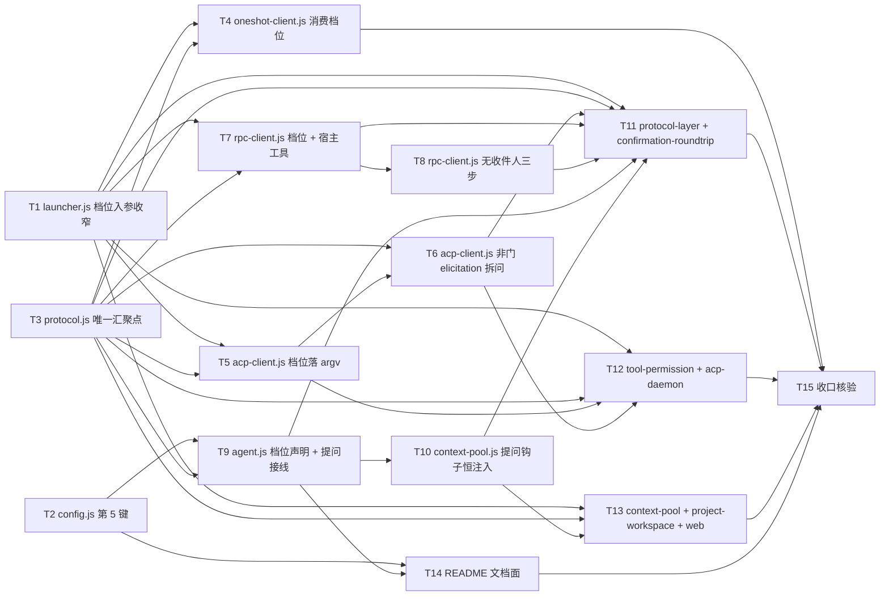

# pr-001-tasks.md — pr-001 内部任务图（档位解析唯一汇聚点 + 提问通路的 agent 侧）

**迭代**: 0023-yolo-approval-and-question-inbox ｜ **阶段**: 5（PR 实现）· 首波 ｜ **PR 文件**: `prs/pr-001-approval-resolution-and-question-channel.md`
**worktree 分支**: `feat/0023-pr-001-approval-resolution-and-question-channel`（base = `4101e0b`，即本任务图落盘前的 worktree HEAD）｜ **任务总数**: **15**（T1~T15）｜ **依赖图**: **无环**（见 §2）
**输入真源**: PR 文件（18 文件 / F01~F13 + F16）+ `architecture.md` **v0.3.0**（§3.3 流 1~6 / §4.1 L1-1~L1-7 / §4.2 L2-1~L2-9 / §5.1~§5.7 / §6 / §7 T-01~T-08 / §9.1~§9.4 / §11 实测 N-1~N-5）+ `prd/F01~F13,F16*.md` + `clarifications/probes/**`（A2 / R2 / R2b / R3 / R3b / R4 实测）+ 代码库实读（下方 §0.3 逐条带 `文件:行号`）

> **主 agent 已裁定的三条 Gate 偏差义务（逐字纳入本任务图，见 §0.4 契约 10~12）**：
> **G2-D1** PR 文件所写 `config.js` 锚点 `:41` 实测应为 **`:49`**（`function readProtocol`）——本任务图与 T2 一律以 **:49** 为准。
> **G2-D2** 补齐迁移点 **`oamp/test/protocol-layer.test.js:535`**（该处 `buildArgv` 调用以 `{mode, appliesWhen}` 合成 approval，签名收窄后必须迁移）——归 T11。
> **G2-D4** `oamp/src/rpc-client.js` 的能力位 `hostTools` 由 `'no'` **同步为已接线**（A1 裁决：默认链路的提问靠宿主工具承载），note 同步改为陈述事实；`approvalGate` 保持**不随档位变**（F11 验收 3 仍成立）——归 T7 + T15 核验。

---

## 0. 范围、文件面与事实锚点

### 0.1 本 PR 文件范围（唯一可写面；18 文件 = 8 生产 + 1 文档 + 9 测试）

| # | 文件 | 动作 | 内容（任务归属） |
|---|---|---|---|
| 1 | `oamp/src/protocol.js` | 修改 | +`resolveApproval(spec)` 纯函数（解析链四条，唯一汇聚点）；`createProtocolLayer` 求值**一次**并写 `spec.approval`；acp 分支把已解析档位与提问钩子传下去（**T3**） |
| 2 | `oamp/src/config.js` | 修改 | +第 5 键 `approval`（值域 `{always-ask, yolo}`，缺省 `yolo`，非法 ⇒ `OAMP 配置错误` 响亮失败）；叶子约束不变（**T2**） |
| 3 | `oamp/src/launcher.js` | 修改 | `PROFILES` 五行删 `approval.mode`、保留 `appliesWhen`；`buildArgv` 的 `approval` 入参 = 已解析档位字符串（未给 ⇒ 响亮失败）；JSDoc + `spawnAgent` 透传位同步（**T1**） |
| 4 | `oamp/src/oneshot-client.js` | 修改 | 删除本文件内的档位自定义合成，改为消费 `spec.approval` 落 argv（**T4**） |
| 5 | `oamp/src/acp-client.js` | 修改 | ① 构造面 +`approval`（经 L1 落 argv）；② `_handleElicitationRequest` 非门分支由 `decline` 改为「拆问 → 逐问调钩子 → 组内暂存 → 齐答**恰一次**回包」（**T5 / T6**） |
| 6 | `oamp/src/rpc-client.js` | 修改 | ① argv 传已解析档位；② 握手后 `set_host_tools([ask_user])` **恰一次**；③ `host_tool_call` 承接 + `host_tool_cancel`；④ `handleApproval` 无收件人分支补三步；⑤ 能力位 `hostTools` 同步为已接线（**T7 / T8**） |
| 7 | `oamp/src/agent.js` | 修改 | ① `--approval-mode` 解析与校验；② resident spec 传 `approval` / `configApproval`；③ `AGENT_START` +`approval` 字段；④ `onQuestionRequest` 接线（与门钩子共用 `raiseConfirmation`）+ 池构造注入；⑤ 信封 +`request_kind` / `multiple`；⑥ `settleConfirmation` 支持 `option_ids`（**T9**） |
| 8 | `oamp/src/context-pool.js` | 修改 | `onQuestionRequest` **恒注入**透传（与 `permission` 解耦）+ 构造面 `opts` 增位；门钩子 `permission === 'allow'` 判定**逐字保留**（**T10**） |
| 9 | `oamp/README.md` | 修改 | 配置面「四键」→「五键」+ `approval` 说明；`--approval-mode` 取值域与默认值说明（**T14**） |
| 10 | `oamp/test/approval-resolution.test.js` | **新建** | `resolveApproval` 四条解析链与优先级、值域外响亮失败、求值一次写 `spec.approval`、`capabilities()` 六键不随档位变（**T3**） |
| 11 | `oamp/test/config-file.test.js` | 修改 | 全对象断言补 `approval` 键 + 该键三档取值与非法值断言（**T2**） |
| 12 | `oamp/test/protocol-layer.test.js` | 修改 | `buildArgv` 调用点补档位（`:278`、`:495-514`、**`:535`**）；+rpc 无收件人三步断言；+宿主工具注册恰一次与 `host_tool_call` 承接断言；+rpc 提问回路（**T11**） |
| 13 | `oamp/test/tool-permission.test.js` | 修改 | acp `buildArgv` / 直接构造 `AcpClient` 的调用点补已解析档位；+非门 elicitation 形状拆问断言（**T12**） |
| 14 | `oamp/test/acp-daemon.test.js` | 修改 | 档位断言（`:559` / `:570` / `:581` / `:588` / `:595`）与 `PROFILES[...].approval.mode` 解耦（**T12**） |
| 15 | `oamp/test/confirmation-roundtrip.test.js` | 修改 | 一次性档位期望值（`:716`）改为已解析档位；+acp 一帧 N 问 ⇒ N 条条目 + 齐答前不推进 + 齐答后恰一次回包；+未作答挂起无超时（**T11**） |
| 16 | `oamp/test/context-pool.test.js` | 修改 | `buildArgv` 调用点补档位（`:540`）；+提问钩子恒注入断言（`deny` 档提问仍上浮 / 工具门仍零注入）（**T13**） |
| 17 | `oamp/test/project-workspace.test.js` | 修改 | `buildArgv` 调用点补档位（`:1013`）（**T13**） |
| 18 | `oamp/test/web.test.js` | 修改 | `buildArgv` 调用点补档位（`:592`）（**T13**） |

> 本阶段产物 `prs/pr-001-tasks.md`（本文件）不计入上方改动面。

### 0.2 非目标（零改动 / 防夹带 —— 越界即 F12 / F13 验收不通过）

- **零改动清单**（PR 文件逐条）：`oamp/src/{web,inbox,transport,persist,router,rpc,node-client,status,task,registry,cluster,cluster-config,role-binding,log}.js`、`oamp/bin/**`、`oamp/package.json`（`dependencies` 仍 `{}`）、`oamp/API.md`、`oamp/llms.txt`、`oamp/web/**`、`oamp/test/helpers/**`、`oamp/test/{confirmation-inbox,inbox-console,api-routes,zero-intrusion,hygiene}.test.js`、`omp/**`。
- **`oamp/test/zero-intrusion.test.js` 保持绿且不得修改**（B-17 三条机械判据：消费层不 import 具体实现 / 不出现协议取值字面 / 换注入配置零 diff）。
- **跨 PR 择一判定（PR 文件「择一判定声明」逐字）**：① F04 验收 1 的「控制台栏内可见」半句归 pr-002 / pr-003（本 PR 只判 `notice` 信封面）；② F07 验收 3 的**主面在 pr-002**（`web.js` 旁路点；本 PR 只判「question 类结算值不含 `optionId`」）；③ F05 验收 2 的「条目允许多选并一并提交」**主面在 pr-003**（栏内控件；本 PR 判信封 `multiple` 承载正确）；④ F15 / F14 判定面归 pr-002（本 PR 不引用）；⑤ pr-002 / pr-003 的文件面（`web.js` / `web/app.js` / `web/style.css`）**不在本任务图**。
- **不新增**：配置键（除 config 第 5 键）/ env 键 / 消息类型 / 通知事件类型 / 审计行类型 / 计时器与超时面 / 第三方依赖 / `oamp/test/helpers/**` 文件。

### 0.3 读码事实锚点（2026-09-14 实读，base `4101e0b`；判据基础）

| # | 事实 | 位置 |
|---|---|---|
| **A1** | `function readProtocol(value, source)` 在 **`:49`**（**非 PR 文件所写的 `:41`** —— G2-D1 裁定以 `:49` 为准）；`loadConfig` 在 `:121`；file 折叠位 `protocol: readProtocol(parsed.protocol, 'protocol')` 在 `:117`；env 折叠链在 `:145` | `oamp/src/config.js` |
| **A2** | `PROFILES` 五行的档位是**静态数据** `approval: {mode, appliesWhen}`：`:22`（omp:rpc）、`:37`（omp:acp）、`:52`（omp:oneshot，`appliesWhen:'always'`）、`:68`（claude:acp）、`:83`（codex:acp）；`buildArgv` JSDoc 在 `:100-107`（`:103-104` 明写 `undefined ⇒ 取 profile.approval`）；`buildArgv` 定义 `:109`，静默回落 `:114`，追加段 `:129-132`；`spawnAgent` `:150`，透传 `:152` | `oamp/src/launcher.js` |
| **A3** | `oneshot-client.js` **自己合成档位**（第三处判定）：`:93-97` 的 `toolsOn ? {mode: permission==='deny' ? 'always-ask' : 'yolo', appliesWhen:'tools-on'} : null`；`:117-121` 传给 `spawnAgent`；能力位 `approvalGate:'no'`（`:22`）与 note 文案（`:30`） | `oamp/src/oneshot-client.js` |
| **A4** | `AcpClient` 构造面现状 = **10 键**（`:107-118` 解构）；`start()` 的 `buildArgv('omp:acp', {model, roleFile, tools})` 在 `:165-169` —— **不传 `approval`**（收窄后会响亮失败）；`_handleElicitationRequest` 定义 `:565`，非门分支 `:569-572`（**`decline` 在 `:570`**），门分支 `:573-574`；`_approvalGateDecision` `:576+`；`_askHook` `:532-543`；拒绝三步 `:485-494`；`_permissionDecision` `:510-528` | `oamp/src/acp-client.js` |
| **A5** | `INTERACTIVE_METHODS` 在 `:24`；能力位表 `:31-38`（**`hostTools:'no'` 在 `:35`**）与 note `:39-41`（**`:40`** = "本迭代不接线宿主工具面…"）；`spawnAgent(PROFILE, {model, roleFile, tools})` 在 `:122` —— **不传 `approval`**；冻结/解冻 `:179-202`（`freezeTurnTimer` `:186`）；`negotiate_protocol` 发出 `:237`、回包分支 `:241-249`；`handleApproval` `:307`、无收件人分支 `:308-312`（现状仅回 `{cancelled:true}` 并 `return`）；`INTERACTIVE_METHODS` 回执 `:341-343`；`handleFrame` switch `:380-406` | `oamp/src/rpc-client.js` |
| **A6** | `raiseConfirmation` `:275`（读 `info.origin` / `info.toolCall.toolName` / `.title` / `info.options`；`fields` 7 键在 `:280-288`）；`settleConfirmation` `:300`（`:302` 只认 `body.option_id`）；`cancelPending` `:315-321`；`AGENT_FLAGS` `:549`（5 flag）；`parseAgentArgs` `:565-`（`parsed` 初值 `:567`）；`AGENT_START` `:660-667`；`makeLayer` `:681`、常驻 spec `:682-691`；`new ContextPool({…})` `:693-703`（`onPermissionRequest` `:699`）；一次性装配 `:717-718` | `oamp/src/agent.js` |
| **A7** | 池构造 `opts` JSDoc `:22-25`；门钩子唯一注入点判定 `:193-196`（`this.pool.permission === 'allow' && …`）；`hooks` 面 `:201-206`（`onPermissionRequest` `:202` / `onApproval` `:203`） | `oamp/src/context-pool.js` |
| **A8** | `CAPABILITY_KEYS` `:23`（六键）；`resolveProtocol` `:59-64`；`createProtocolLayer` 定义 `:73`；`new AcpClient({` `:93`、`onPermissionRequest` 装配位 `:112-113` | `oamp/src/protocol.js` |
| **A9** | 测试面计数：`oamp/test/*.test.js` = **31**；`oamp/test/helpers/` 存在（不新增/不修改）。测试内引用 `PROFILES[*].approval.mode` 的断言点 = `acp-daemon.test.js:559` / `:581`、`tool-permission.test.js:577` / `:583`、`confirmation-roundtrip.test.js:716` | 实测 |
| **A10** | **无档位**调用 `buildArgv` 的调用点（收窄后必迁）= `protocol-layer.test.js:278` / `:495` / `:508` / `:509` / `:513` / **`:535`**、`context-pool.test.js:540`、`project-workspace.test.js:1013`、`web.test.js:592`、`acp-daemon.test.js:570`、`tool-permission.test.js:343` / `:352` / `:359` / `:374` | 实测 |
| **A11** | `protocol-layer.test.js:535-541` 以 `{mode: item.expectedApproval, appliesWhen: 'tools-on'}` **合成** approval（**G2-D2**）；`rpcSession` / `oneshotSession` 辅助函数默认 `hooks = null`（`:230` / `:241`） | `oamp/test/protocol-layer.test.js` |
| **A12** | **全仓不存在**「rpc 无收件人（`hooks === null`）⇒ 该轮照常收尾」的既有断言：rpc 门用例一律传入 `onApproval`（`:404-455`），`confirmation-roundtrip.test.js` 为 **acp-only** 面（`createProtocolLayer({resident:{protocol:'acp'}})` `:322` / `:358` / `:390`） | 实测（见 §5 口径澄清 ①） |
| **A13** | 直接构造 `AcpClient` 的测试调用点（构造面变更后必迁）= `tool-permission.test.js` 的 `startClient(...)` 系列（`:571` / `:580` / `:586` / `:592`） | 实测 |
| **A14** | 能力位断言面：`tool-permission.test.js:389-404` 对 **acp** 六键做 `deepEqual`（含 `hostTools:'no'`，**属 acp 侧，G2-D4 不改**）；`protocol-layer.test.js:245-267` 对 rpc/oneshot 只做逐键循环与三条逐字断言，**未** `deepEqual` rpc 六键 ⇒ G2-D4 的改动在既有断言面**不产生冲突** | 实测 |
| **A15** | README 锚点：`:4`（"…常驻协议**四键**"）、`:216`（一次性 argv 说明含 `[--approval-mode M]`）、`:302`（`agent start … [--protocol rpc\|acp]` 用法行）、`:313-314`（JSON 示例，4 键）、`:317`（逐键优先级）；`## 协议速览` 的方法面清单由 `project-workspace.test.js:972-980` 逐字断言 | `oamp/README.md` |
| **A16** | `oamp/package.json` 的 `dependencies` = `{}`（实测） | 实测 |
| **A17** | 探针原始输出在 worktree 内可读：`r2-host-tools-output.txt`（S1 挂起期无终态帧 / **S3 注册为替换** / S4 `--no-tools` 下可用）、`r2b-host-tool-persistence-output.txt`（跨轮存活）、`r3-deny-autoreject-output.txt`（D1 仅拒工具、轮次照常 `stopReason:'stop'`）、`r3b-abort-semantics-output.txt`（abort 为轮次级、同会话可续）、`r4-yolo-gate-output.txt`（Y1 零门 + 工具产生后果 / Y2 用户策略偶发门）、`a2-acp-ask-form-output.txt`（一帧多问 / 一次回包 / 单选+文本时选项被上游丢弃） | `clarifications/probes/` |
| **A18** | `set_host_tools` 帧形（R2 实测）：请求 `{id, type:'set_host_tools', tools:[{name, label, description, parameters}]}`，回包 `{command:'set_host_tools', success:true, data:{toolNames:[…]}}`；`host_tool_call{id, toolCallId, toolName, arguments}`；回包 `{type:'host_tool_result', id, result:{content:[{type:'text', text}]}}` | `probe-r2-host-tools.mjs:14-23` / `:105` / `:125` + 原始输出 |

### 0.4 本 PR 内的冻结契约（每个任务都必须遵守；跨任务接口在此一次定死）

1. **档位入参契约（T1 定义）**：`buildArgv(profileKey, {model, roleFile, tools, prompt, approval})` 的 `approval` ∈ **`{已解析档位字符串（`'always-ask'` \| `'yolo'`）, null}`**；`undefined`（未给）⇒ **响亮失败**（体例同 `requireProfile` 的 `OAMP 配置错误`，不得静默取 profile 值）；`null` ⇒ 不追加档位段；追加位置与次序**逐位不变**。
2. **档位解析契约（T3 定义）**：`resolveApproval(spec)` 输入键 = `spec.permission` / `spec.approval`（显式 `--approval-mode`，未给 ⇒ `null`）/ `spec.configApproval`（config 第 5 键）；输出 = `'always-ask' | 'yolo'`；`createProtocolLayer` **就地写入** `spec.approval = <解析结果>`（全仓唯一赋值点）；三实现**只读**，不判定。
3. **提问钩子契约（T3 装配 / T6·T7 调用 / T9 生产 / T10 透传）**：`hooks.onQuestionRequest(payload)`；`payload` = `{requestKind:'question', question, options, multiple, chatId, agentId, origin}`（字段名取自 architecture §3.3 流 2 + §4.2 L2-3 的 `requestKind`；`options` 元素形态见 §5 `[model_inferred]` 1）；返回**未结算 Promise** ⇒ 结算值 = `{optionIds: string[], text: string}`（§5.3 question 类）。
4. **两型钩子并存契约**：门钩子（`onPermissionRequest` / `onApproval`）注入条件仍是 `permission === 'allow'`（**逐字保留**，`context-pool.js:193-196`）；提问钩子**恒注入**（与 `permission` 解耦）。二者复用同一 pending 表与同一 `raiseConfirmation`。
5. **信封契约（T9 定义）**：9 字段 = 既有 7 + `request_kind`（`'permission'|'question'`，缺省兜底 `'permission'`）+ `multiple`（boolean）；通知判别键 `kind` 恒为 `'confirmation_request'`（**不得**被信封字段覆盖）。
6. **结算值契约（T9 定义）**：question 类 ⇒ `resolve({optionIds, text})`；permission 类 ⇒ `resolve({optionId})`（**逐字不变**）；两类不并存于同一条目。
7. **宿主工具契约（T7 实现）**：命名 `ask_user` / label `Ask User`；参数 schema 逐字取自 architecture §5.4；注册时机 = `negotiate_protocol` 回包成功之后、`ready` 结算之前，**恰一次**（R2 S3 为**替换**语义 ⇒ 重复即自覆盖）；`tools` 开关**不参与**（`--no-tools` 下仍注册，R2 S4）；帧形见 A18。
8. **acp 表单映射契约（T6 实现）**：识别与回包形状逐字取自 architecture §5.5 六行表（门 / askDialog / select / confirm / input / 未知 ⇒ `decline`）；组内暂存 = **本帧处理函数内的局部状态**（L1-5：无新模块、无跨帧状态、无清理定时器）。
9. **零依赖与测试面**：`oamp/package.json` 零改动；测试只用 `node:*`（`node:test` + `node:assert/strict`）；**不新增 / 不修改 `oamp/test/helpers/**`**。
10. **G2-D1（主 agent 裁定）**：`config.js` 的 `readProtocol` 锚点 = **`:49`**；T2 与 §0.3/A1 一律以此为准。
11. **G2-D2（主 agent 裁定）**：`oamp/test/protocol-layer.test.js:535` 是**必然迁移点**（`{mode, appliesWhen}` 合成写法必须消失），归 T11。
12. **G2-D4（主 agent 裁定）**：`oamp/src/rpc-client.js` 的 `RPC_CAPABILITY_VALUES.hostTools` 同步为 **已接线**（`'yes'`），note 文案同步改为**陈述事实**（不得残留"不接线"表述）；`approvalGate` 保持 `'yes'` 且**不随档位变**；`CAPABILITY_KEYS` 六键与 `capabilities()` / `capabilityNotes()` **签名不变** ⇒ 归 T7 实现、T15 核验。

---

## 1. 任务列表

### T1: `oamp/src/launcher.js` —— profile 去档位取值 + `buildArgv` 档位入参收窄

- **验收标准**:
  1. **`PROFILES` 五行的 `approval.mode` 删除**（`:22` / `:37` / `:52` / `:68` / `:83`），`appliesWhen` 键**保留**；`omp:oneshot` 行的 `appliesWhen` 由 `'always'` 改为 `'tools-on'`（L2-2）。判据 = `PROFILES['omp:acp'].approval.mode === undefined` 且五行 `approval` 键集 = `{appliesWhen}`（一次性脚本逐行读表）。
  2. **入参语义收窄为已解析档位字符串**：传 `'always-ask'` / `'yolo'`（工具开）⇒ argv 含 `['--approval-mode', <该值>]`，段位仍在 `--append-system-prompt` 之后、位置参数之前（次序不变）。判据 = 一次性脚本两组输入逐位比对。
  3. **`null` ⇒ 不追加档位段**（调用层显式关闭该段）；**`undefined`（未给）⇒ 响亮失败**（抛错，体例同 `requireProfile` 的 `OAMP 配置错误`）——现行「`undefined ⇒ 取 profile.approval`」的静默回落通路（`:114`）**不存在**（L2-1）。判据 = 一次性脚本：`buildArgv('omp:rpc', {…})` 抛错、`buildArgv('omp:rpc', {…, approval: null})` 无 `--approval-mode`。
  4. **工具关 ⇒ 不追加**：`tools: {mode:'off'}` 时即使传档位串也不追加（`appliesWhen==='tools-on'` 形态 + `toolsOn` 判定，§5.1 argv 面）；`omp:oneshot` 亦然（L2-2 后五行为统一形态）。判据 = 一次性脚本 tools off 两组。
  5. **无档位字面以外的新知识**：`approval` 的**取值域不在本模块校验**（校验面 = config.js / agent.js，§5.1 校验列）；本模块只做「给值即落段」。
  6. **JSDoc 与注释同步**：`:100-107` 的签名说明、`:103-104` 的「`undefined` ⇒ 取 `profile.approval`」描述必须改写；`grep -n "profile.approval" oamp/src/launcher.js` 零命中。
  7. `spawnAgent`（`:150-152`）的透传位原样转发新语义，行为不改。
  8. **零越界**：本任务 diff 只含 `oamp/src/launcher.js`；既有测试面的调用点迁移归 T11 / T12 / T13（**本任务落地后相关断言的失败属计划内迁移期**，PR 收口由 T15 判）。
- **前置依赖**: 无
- **优先级**: P0
- **追溯**: PR 文件「文件范围」第 3 项（①~④）+ 验收「默认档 = `yolo`」「档位可配」「非法值响亮失败」的 argv 面；architecture §5.1（argv 面）/ §4.2 **L2-1 / L2-2** / §9.1 launcher 行；prd/F01 验收 1 / 3、F02 验收 1 / 2；既有代码 A2

### T2: `oamp/src/config.js` 第 5 键 `approval` + `oamp/test/config-file.test.js` 迁移

- **验收标准**:
  1. **`loadConfig()` 恰多一键 `approval`**：配置文件缺该键 / 无配置文件 ⇒ `'yolo'`（内置默认；F01 验收 3 / E8）；`{"approval":"always-ask"}` ⇒ `'always-ask'`（F02 验收 1）。
  2. **取值域恰 `{always-ask, yolo}`**：`"write"` / `"tier"` / 其它串 / 非字符串（含空串）⇒ **响亮失败**，文案 = `OAMP 配置错误: approval 仅支持 always-ask/yolo（当前值 …）`（**点名该值**；MI-01 / F02 验收 4；体例同 A1 的 `readProtocol`）。判据 = 逐值输入 ⇒ 抛错 + 文案含该值。
  3. **不新增 env 键**（L1-2 ①）：`grep -n "OAMP_APPROVAL" oamp/src oamp/README.md` 零命中。
  4. **叶子约束不变**：`oamp/src/config.js` 的 import 面仍不含 `./` 相对模块（不 import `src/` 内任何模块；A1 体例）。
  5. **既有键零改动**：其余四键（`dbPath` / `defaultModel` / `contextMax` / `protocol`）取值与折叠链（`:117` / `:145`）**逐字不变**。
  6. **测试迁移**：`oamp/test/config-file.test.js` 的全对象断言（`:34-48`）补 `approval: 'yolo'`；+该键三档断言（缺省 / 显式 `always-ask` / 非法值抛错且文案点名）。同文件其它用例零改动。
  7. **零越界**：本任务 diff 只含 `oamp/src/config.js` + `oamp/test/config-file.test.js`。
- **前置依赖**: 无
- **优先级**: P0
- **追溯**: PR 文件「文件范围」第 2 项 + 验收「档位可配 + 取值域两值」「非法值响亮失败」；architecture §5.1（配置面 + MI-01 校验）/ §4.1 **L1-2** / §9.1 config.js 行；prd/F01 验收 3、F02 验收 1~4、F16 验收 1；既有代码 A1（**锚点以 `:49` 为准 — G2-D1**）

### T3: `oamp/src/protocol.js` —— 档位唯一汇聚点（`resolveApproval` + 求值一次 + 装配传递）+ 新建 `oamp/test/approval-resolution.test.js`

- **验收标准**:
  1. **`resolveApproval(spec)`**：具名导出的**纯函数**，解析链四条**按优先级**逐条成立 —— ① `spec.permission === 'deny'` ⇒ `'always-ask'`（**优先于**显式档位；F03 验收 1）；② `spec.approval`（显式 `--approval-mode`）⇒ 该值；③ `spec.configApproval`（config 第 5 键）⇒ 该值；④ 否则 ⇒ `'yolo'`（内置默认；F01 验收 3）。判据 = 四组输入 + 「①与②冲突 ⇒ `always-ask`」共五组。
  2. **值域外响亮失败**：`spec.approval` / `spec.configApproval` 传入域外值（`'write'` / 非字符串 / 空串）⇒ **抛错并点名该值**，**不得回落 `'yolo'`**（F02 验收 4 的体例）。
  3. **求值恰一次 + 唯一赋值点**：`createProtocolLayer` 装配时调用**一次**，结果**就地写入** `spec.approval`；`grep -rn "resolveApproval" oamp/src` 命中集合 = `{oamp/src/protocol.js}`；对已解析档位的**赋值**（`spec.approval = …`）只在 `protocol.js`（三个实现模块内**零**赋值、**零**档位判定）。判据 = 两条 grep + 一次性脚本（同一 spec 对象传入后 `spec.approval` = 解析值）。
  4. **`capabilities()` 六键不随档位变**：同一协议在 `'yolo'` / `'always-ask'` 两档下 `capabilities()` **深度相等**；`CAPABILITY_KEYS`（`:23`）与 `capabilities()` 的键集与签名**零改动**（F11 验收 1 / L1-7；acp 侧声明面归 T12）。判据 = 两档 `deepEqual`。
  5. **acp 分支装配面 +2 位**（§0.4 契约 3）：`new AcpClient({…})`（`:93`）增 `approval`（已解析档位字符串）与 `onQuestionRequest`（← `hooks.onQuestionRequest` 透传，缺省 `null`）；既有 10 键的装配语义**逐键不变**（含 `auditContext.context_id` 的惰性 getter 与 `onExit` / `onPermissionRequest` 透传体例）。
  6. **`createEphemeral` 分支**：装配 oneshot 时把已解析 `spec.approval` 一并带入（不经解析链再算一次）。
  7. **新建测试文件 `oamp/test/approval-resolution.test.js`** 覆盖 ①~④：四条解析链与优先级、值域外响亮失败、求值一次并写 `spec.approval`、`capabilities()` 六键不随档位变。零第三方依赖；不新增 `test/helpers/**`。
  8. **零越界**：本任务 diff 只含 `oamp/src/protocol.js` + `oamp/test/approval-resolution.test.js`；三个实现模块**本任务不动**（其消费面归 T4 / T5 / T7）。
- **前置依赖**: 无
- **优先级**: P0
- **追溯**: PR 文件「文件范围」第 1 项 + 测试面第 1 项 + 验收「唯一汇聚点（F03 验收 4 / L1-1）」；architecture §5.1（解析链 = 唯一汇聚点）/ §4.1 **L1-1 / L1-7** / §4.2 **L2-1 / L2-3** / §5.6 / §9.1 protocol.js 行；prd/F03 验收 4、F11 验收 1 / 3、F02 验收 4；既有代码 A8

### T4: `oamp/src/oneshot-client.js` —— 删除自定义档位合成，消费 `spec.approval`

- **验收标准**:
  1. **合成面消失**：`:93-97` 的 `toolsOn ? {mode: permission==='deny' ? 'always-ask' : 'yolo', appliesWhen:'tools-on'} : null` **删除**；`grep -n "always-ask\|'yolo'\|合成" oamp/src/oneshot-client.js` 零命中（含注释与 note 文案——被本次删除的语义不得以文字残留）。
  2. **消费形态**：`spawnAgent(PROFILE, {…, approval})`（`:117-121`）的 `approval` 值 = `toolsOn ? spec.approval : null`（§0.4 契约 1；tools 关 ⇒ 显式 `null`，argv 无档位段）。
  3. **argv 行为面**：tools 开 + 缺省档位 ⇒ `['-p', …, '--approval-mode', 'yolo']`；tools 开 + `permission:'deny'` ⇒ `'always-ask'`（解析链①）；tools 关 ⇒ 无档位段。判据 = 一次性脚本（假 bin + `createEphemeral`）三组 argv。
  4. **能力位零改动**：六键与取值（`approvalGate:'no'` + 非空 note）不变；note 文案若提及档位来源，须与「消费已解析档位」的实现一致（措辞自定，不得残留"按 permission 档合成"）。
  5. **本文件不出现档位判定**：无 `permission === 'deny'` 分支、无 `permission`-based 档位选择（`grep -n "permission" oamp/src/oneshot-client.js` 仅允许出现在与档位无关处；若有命中须逐条说明）。
  6. **零越界**：本任务 diff 只含 `oamp/src/oneshot-client.js`。
- **前置依赖**: T1、T3
- **优先级**: P0
- **追溯**: PR 文件「文件范围」第 4 项；architecture §3.3 流 1（oneshot 消费已解析档位）/ §4.1 L1-1 / §4.2 L2-1 / §5.1（档位对三路径统一生效）/ §9.1 oneshot-client 行；prd/F03 验收 4、F12 验收 1；既有代码 A3

### T5: `oamp/src/acp-client.js` —— 构造面 +`approval` 并落 argv（工具开）

- **验收标准**:
  1. **构造面 +`approval` 位**（`:107-118` 解构面 + JSDoc）：值为**已解析档位字符串**（缺省 `null`）。
  2. **落 argv**：`start()` 的 `buildArgv('omp:acp', {…})`（`:165`）补传 `approval`：`this.tools === true` ⇒ 传 `this.approval`；工具关 ⇒ 传 **`null`**（§0.4 契约 1；既有「工具关不追加档位段」口径逐字保留）。
  3. **档位面行为可核**：工具开时 argv 的 `--approval-mode` 值**跟随入参**（`'yolo'` ⇒ `yolo`、`'always-ask'` ⇒ `always-ask`）⇒ 不再是 A4 注释所描述的「工具可用时恒 `always-ask`」不变式（该注释属 T5 验收 4 的改写面）。
  4. **本文件零档位判定与零档位字面**：`grep -n "always-ask\|'yolo'" oamp/src/acp-client.js` 零命中（含 `:162-164` 的状态注释须改写）；`:186-189` 的 `elicitation.form` 能力声明与其余行为零改动。
  5. **门路径零改动**：`_approvalGateDecision` / `_consumeApprovalGrant` / 拒绝三步 / `_permissionDecision` 逐字不变（本任务不触碰）。
  6. **零越界**：本任务 diff 只含 `oamp/src/acp-client.js`；与 T6 **同文件 ⇒ 串行**（T6 在本任务之后）。
- **前置依赖**: T1、T3
- **优先级**: P0
- **追溯**: PR 文件「文件范围」第 5 项 ①；architecture §3.3 流 1 / §5.1（argv 面）/ §4.2 L2-1 / §9.1 acp-client 行 ①；prd/F02 验收 1、F10 验收 1（该档门必须实际跑通）；既有代码 A4

### T6: `oamp/src/acp-client.js` —— 非门 `elicitation/create` 改「逐问登记 → 齐答恰一次回包」

- **验收标准**:
  1. **门分支零改动**：判据 `properties.value.enum ⊇ {Approve,Deny}`（`:567-569`）⇒ 既有 `_approvalGateDecision` + grant 抵扣 + `{action:'accept', content:{value}}`（`:573-574`）**逐字保留**。
  2. **非门分支按 §5.5 六行表分流**（`decline` 仅保留给「其余未知形状」）：
     - **askDialog（多问）**：判据「有 `q0` 且无 `value`」；**N 条**条目（`q0..q{N-1}`，每问一条）；`title` = `q{i}.title`；`options` = `q{i}.oneOf[].const/title`（单选）或 `q{i}.items.anyOf[]`（数组型 ⇒ `multiple:true`，反之 `false`）；`message`（`Answer N questions`）**不进**条目。
     - **select**：`properties.value.enum` 不含 `Approve|Deny` ⇒ 1 条；`options` = enum 值；`multiple:false`；`title` = `message`。
     - **confirm**：`properties.value.type === 'boolean'` ⇒ 1 条；`options` = `[{option_id:'是',label:'是'},{option_id:'否',label:'否'}]`（**MI-3 已确认**）；`multiple:false`。
     - **input**：`properties.value.type === 'string'` 且无 enum ⇒ 1 条；`options: []`；`multiple:false`。
  3. **一问一条**：每问**恰一次** `hooks.onQuestionRequest`（§0.4 契约 3；`requestKind:'question'`）；N 问 ⇒ N 次调用、N 条独立条目（无 `questions[]` 大信封；L1-5 / F06 验收 4）。
  4. **组内暂存 = 本帧处理函数内的局部状态**（帧 id + 每题一个未结算 Promise + 答案聚合；`Promise.all`）；**齐答后恰一次** `_respond(id, {action:'accept', content: …})`：多问形状 ⇒ `{q{i}: const|const[], q{i}__other: text}`；单值形状 ⇒ `{value: <选项 ?? 文本>}`（`confirm` ⇒ `true|false`；单选+文本并存时**选项优先**，§5.5 的承载上限 + Q-2 裁定）。
  5. **未齐答前不推进**：任一问未结算 ⇒ 不回包、该轮不推进（挂起语义复用 `_pauseTurnTimer` / `_resumeTurnTimer`；R1 / T-08）。
  6. **未知形状仍 `decline`**（**逐字保留** `:570` 的保守口径 L2-6）；无新增模块 / 无跨帧状态 / 无清理定时器。
  7. **能力位零改动**：`ACP_CAPABILITY_VALUES` / notes 与 `capabilities()` / `capabilityNotes()` 签名逐字不变（六键不随档位变；F11 验收 1 / 3；A14 的既有 `deepEqual` 断言保持绿）。
  8. **零越界**：本任务 diff 只含 `oamp/src/acp-client.js`（与 T5 同文件 ⇒ 串行）。
- **前置依赖**: T3、T5（T5 = 同文件串行；T3 = `onQuestionRequest` 的装配位与钩子契约）
- **优先级**: P0
- **追溯**: PR 文件「文件范围」第 5 项 ②；architecture §5.5（映射表六行）/ §3.3 流 3 / §4.1 **L1-5** / §4.2 **L2-3 / L2-6** / §5.2（`request_kind` / `multiple`）/ §5.7（挂起与收尾）/ §9.1 acp-client 行 ②；prd/F04 验收 2 / 5、F05 验收 1~4、F06 验收 1~4、F09 验收 2；实测 A2 / A17；既有代码 A4

### T7: `oamp/src/rpc-client.js` —— argv 档位 + 宿主工具通路（注册恰一次 / 承接 / 撤销）+ 能力位 `hostTools` 同步

- **验收标准**:
  1. **argv 传已解析档位**：`spawnAgent(PROFILE, {…})`（`:122`）补传 `approval`：工具开 ⇒ `spec.approval`；工具关 ⇒ `null`（§0.4 契约 1）。本文件零档位字面：`grep -n "always-ask\|'yolo'" oamp/src/rpc-client.js` 零命中。
  2. **注册恰一次**：握手完成（`negotiate_protocol` 回包 `success:true` 且版本匹配，`:241-249`）、**返回会话对象之前**，发**恰一次** `{type:'set_host_tools', tools:[<ask_user 描述符>]}`（帧形见 A18 / §0.4 契约 7）；重复 `ready` 帧 / 重复握手不得二次发送。判据 = 假 bin 帧日志：一次会话内 `set_host_tools` 帧数 = 1，且该帧在 `negotiate_protocol` 回包之后、首个 `prompt` 之前。
  3. **`ask_user` 描述符逐字**：`name='ask_user'`、`label='Ask User'`、`parameters` = §5.4 的 schema（`{question, options?: string[], multiple?: boolean}`，`required:['question']`，`additionalProperties:false`）；`tools` 开关**不参与**注册条件（R2 S4 / N-1 ⇒ 匿名实例同样具备提问能力）。
  4. **`host_tool_call` 承接**（`handleFrame` 的 `switch`，`:380-406`）：`type==='host_tool_call'` 且 `toolName==='ask_user'` ⇒ ① `freezeTurnTimer()`（挂起期不计入轮次预算）② 调 `hooks.onQuestionRequest({requestKind:'question', question, options, multiple, chatId?, agentId?, origin?})` 等未结算 Promise ③ `thawTurnTimer()` ④ 回 `{type:'host_tool_result', id, result:{content:[{type:'text', text}]}}`，文本按 **L2-5 模板**（仅选项 ⇒ `选项：A, B`；选项+文本 ⇒ `选项：A, B\n文本：<逐字>`；仅文本 ⇒ `<逐字>`）。判据 = 假 bin 帧级夹具逐帧断言（含挂起时长 > `timeoutMs` 仍不超时）。
  5. **非法输入不吊死**：未知 `toolName` / `ask_user` 缺 `question` 或非字符串 ⇒ 回 `isError:true` + 说明文本，**该轮继续**（§5.4）；不代答（N12）。
  6. **`host_tool_cancel` 撤销**：`type==='host_tool_cancel'`（`targetId`）⇒ 撤在途条目、**不回包**；轮次死 / SIGINT 的既有清扫面不变。
  7. **能力位同步（G2-D4，主 agent 裁定）**：`RPC_CAPABILITY_VALUES.hostTools = 'yes'`；`grep -n "不接线\|不注册\|零触发" oamp/src/rpc-client.js` 零命中（note 文案若保留须**陈述已接线的事实**）；其余五键逐字不变（`approvalGate` 仍 `'yes'`、**不随档位变**）；`CAPABILITY_KEYS` 六键与 `capabilities()` / `capabilityNotes()` 签名不变（非 `yes` 键必带非空 note 的既有约束不破）。
  8. **零改动面**：`INTERACTIVE_METHODS` 的 `{cancelled:true}` 回执（`:341-343`）、展示类不回执、`freezeTurnTimer` / `thawTurnTimer`（`:179-202`）、`prompt` / `cancel` / `close` 语义**逐字保留**。
  9. **零越界**：本任务 diff 只含 `oamp/src/rpc-client.js`；与 T8 **同文件 ⇒ 串行**（T8 在本任务之后）。
- **前置依赖**: T1（`buildArgv` 收窄）、T3（`spec.approval` 与钩子契约）
- **优先级**: P0
- **追溯**: PR 文件「文件范围」第 6 项 ①②③ + 验收「提问上浮」「两条链路承载与零上游改动」「能力位与档位声明分离」；architecture §5.4（宿主工具六项）/ §3.3 流 2 / §4.1 **L1-6** / §4.2 **L2-1 / L2-3 / L2-5** / §5.7 / §9.1 rpc-client 行；prd/F04 验收 1~5、F05 验收 1 / 2、F07 验收 1 / 2、F08 验收 1 / 2、F09 验收 1 / 3 / 4、F11 验收 1 / 3、F12 验收 1；实测 A17（R2 S1 / S3 / S4、R2b）+ A18；**G2-D4**

### T8: `oamp/src/rpc-client.js` —— `handleApproval` 无收件人分支补三步（拒绝 + abort + `permission_denied` 结算）

- **验收标准**:
  1. **三步俱在**：`hooks.onApproval` 缺失（`:308-312` 现状仅回 `{cancelled:true}` 并 `return`）⇒ ① 回执拒绝 `{type:'extension_ui_response', id, cancelled:true}`（**既有回执保留**）⇒ ② 发 `{type:'abort'}`（**无参**：无 `id` / 无其它字段，与 `cancel()` 同形）⇒ ③ 以 `ProtocolError('permission_denied')` **结算该轮**（`failTurn`）。
  2. **观测面**：该轮 Promise **reject** 且 `err.code === 'permission_denied'`；`turn` 无残留（结算后 `turn === null`）⇒ 该会话**下一轮可正常起**（`prompt()` 不再 `context_busy`）；**不杀子进程、不弃会话**（R3b：abort 为**轮次级**）。
  3. **复用既有码值**：不新增 `ProtocolError` 码值、**不新增审计行类型 / 载体**（F13 验收 1；rpc 侧**不**补审批行）。
  4. **有收件人路径逐字不变**：`onApproval` 在场时的裁决路径（含 `readDecidedOptionId` 兜底与 `{cancelled:true}` 回执分支）**零改动**。
  5. **abort 幂等自洽**：一次门拒绝 ⇒ **恰一帧** `abort`（沿用既有 `abortSent` 幂等位；与 `prompt()` 的 `abortSent = false` 重置、`onTurnTimeout` 的 abort 路径不互相产生第二帧）。
  6. **零越界**：本任务 diff 只含 `oamp/src/rpc-client.js`（与 T7 同文件 ⇒ 串行）。
- **前置依赖**: T7（同一文件，必须串行落地）
- **优先级**: P0
- **追溯**: PR 文件「文件范围」第 6 项 ④ + 验收「`deny` 强制 `always-ask` 且优先」的 rpc 观测面；architecture §3.3 流 5 / §5.1（离线边界登记）/ §11 **N-4 / N-5** / §9.1 rpc-client 行；prd/F03 验收 2 / 3（MI-02）、F13 验收 1；实测 A17（R3 D1、R3b）；既有代码 A5

### T9: `oamp/src/agent.js` —— `--approval-mode` 解析 + 档位声明三处同源 + 提问钩子接线 + 信封与结算扩展

- **验收标准**:
  1. **参数面**：`AGENT_FLAGS`（`:549`）+`--approval-mode`；`parseAgentArgs`（`:565-`）校验取值域 `{always-ask, yolo}`：非法 ⇒ `{ok:false, reason}` ⇒ `agent start` **退出 2 且 stderr 点名该值**；缺取值 ⇒ 既有「`${flag} 缺少取值`」体例；未给该 flag ⇒ 交解析链（不得注入 `'yolo'` 字面作为解析结果——默认档的真源是 `resolveApproval` 第 4 条）。判据 = 一次性脚本 / CLI 三组输入（合法两值 + 非法一值）的退出码与 stderr。
  2. **resident spec 承载**：`makeLayer` 的常驻 spec（`:682-691`）传 `approval`（显式档位，未给 ⇒ `null`）与 `configApproval`（= `config.approval`，config 第 5 键）；一次性装配（`:717-718`）同样承载（F01 验收 3 / F02 验收 1）。
  3. **档位声明三处同源**：`AGENT_START`（`:660-667`）+`approval` 字段 = **本次生效档位**（= `spec.approval` = argv `--approval-mode` 值，tools-on 实例上三者相等；F11 验收 2 / L1-7 / L2-9）；既有字段（含 `permission`）零改动。
  4. **提问钩子接线**：`onQuestionRequest` 经 `ContextPool` 构造面（`:693-703`）注入，钩子体**与门钩子共用** `raiseConfirmation`（同一 pending 表）；注入面**不按 `permission` 判定**（`permission === 'deny'` 实例的提问钩子**仍须注入**；档位判定属池侧，§0.4 契约 4）。
  5. **`raiseConfirmation` 扩展**（`:275-293`）：支持 `request_kind:'question'` 字段集 —— 信封 **9 字段**（既有 7 + `request_kind` + `multiple`）；question 类：`request_kind:'question'`、`title` = 问题文本（沿用既有截断体例）、`options` = `[{option_id,label?}]`（`option_id` = `label`，L2-4）、`multiple` = 布尔；permission 类：`request_kind` **缺省兜底 `'permission'`**、`multiple = false` ⇒ 既有投递形状零改动。`grep -n "kind: 'confirmation_request'" oamp/src/agent.js` 命中数不变（通知判别键不得被信封字段覆盖）。
  6. **`settleConfirmation` 扩展**（`:300-308`）：支持 question 类载荷 `{option_ids, text}` ⇒ `resolve({optionIds, text})`；permission 类 `{option_id}` ⇒ `resolve({optionId})` **逐字不变**；两类不并存（question 类结算值**不含 `optionId`**）。
  7. **零改动面**：`cancelPending` / 信封 3（`:315-321`）、`runShellTask`、心跳两档、重连自愈；`oamp/test/zero-intrusion.test.js` 的 B-17② 不因本任务变红（本文件不出现 `'rpc'|'acp'|'oneshot'` 协议取值字面）。
  8. **零越界**：本任务 diff 只含 `oamp/src/agent.js`。
- **前置依赖**: T2（`config.approval` 存在）、T3（spec 键语义与解析链契约）
- **优先级**: P0
- **追溯**: PR 文件「文件范围」第 7 项 ①~⑥ + 验收「非法值响亮失败」「提问上浮」「提问形状与回传」「能力位与档位声明分离」；architecture §5.1（配置面 + 解析链 + 能力位面）/ §5.2（信封 9 字段 + 共存证明）/ §5.3（结算值）/ §3.3 流 1 / 流 4 / §4.2 **L2-3 / L2-4 / L2-9** / §9.1 agent.js 行；prd/F02 验收 4、F04 验收 1 / 3 / 4 / 5、F05 验收 1 / 2 / 4、F11 验收 2；既有代码 A6

### T10: `oamp/src/context-pool.js` —— 提问钩子恒注入透传

- **验收标准**:
  1. **构造面 +`onQuestionRequest`**：`opts`（`:22-27`）增收该键并同步 JSDoc（注明**恒注入**、与 `permission` **解耦**、会话身份附加后透传）。
  2. **恒注入**：`_ensureClient` 的 `hooks` 面（`:201-206`）新增 `onQuestionRequest`：**只要 `pool.onQuestionRequest` 是函数即注入**（**不**受 `pool.permission` 影响）；`permission === 'deny'` 实例下提问钩子**仍在**且被调用，并附加会话身份（`chatId` / `agentId` / `origin`，与门钩子同一附加体例）。
  3. **门钩子判定逐字保留**：`:193-196` 的 `this.pool.permission === 'allow' && typeof … === 'function'` **零改动** ⇒ `deny` 实例的工具门**仍零注入**（F03 验收 2 的机械判据）。
  4. **两型并存形态**：同一 `deny` 实例上「工具门零注入」与「提问钩子在位」**同时成立**（§5.1 的两型并存说明）。
  5. **零改动面**：键 `chatId::agentId`、FIFO 串行、LRU 淘汰、`_failSession` 收尾分类、`sentTurns`、`onExit` / `contextId` getter；`zero-intrusion.test.js` B-17①② 不因本任务变红。
  6. **零越界**：本任务 diff 只含 `oamp/src/context-pool.js`。
- **前置依赖**: T9（注入点由 `agent.js` 生产；池的透传面在其后可端到端观测）
- **优先级**: P0
- **追溯**: PR 文件「文件范围」第 8 项；architecture §5.1（钩子注入面两型分开 — ★）/ §3.3 流 2 / §4.2 **L2-3** / §9.1 context-pool 行；prd/F03 验收 2、F04 验收 4、F10 验收 5；既有代码 A7

### T11: 测试面（默认链路 + 双链路集成）—— `oamp/test/protocol-layer.test.js` + `oamp/test/confirmation-roundtrip.test.js`

- **验收标准**:
  1. **`protocol-layer.test.js` 迁移**：全部 `buildArgv` 调用点补传**已解析档位**（`:278`、`:495`、`:508`、`:509`、`:513`、**`:535`** —— **G2-D2**：以 `{mode: expectedApproval, appliesWhen:'tools-on'}` 合成 approval 的写法**必须消失**）；期望值真源 = 唯一汇聚点（不得读 `PROFILES[*].approval.mode`，该键已删）或该模块的显式入参。
  2. **rpc 无收件人三步断言**（T8）：`rpcSession(t, {resident, hooks: null, env:{FAKE_SCRIPT:'gate'}})` ⇒ 该轮以 `permission_denied` reject、门回执 `{cancelled:true}` 仍在、abort 帧**恰一帧**、结算后同会话可起新一轮。**注**：全仓不存在该分支的既有断言（A12）⇒ 本项是**新增断言**（PR 文件的检索式指向 `confirmation-roundtrip.test.js`，该文件为 acp-only 面 ⇒ 本任务图把它落在 rpc 链路的单元面所在文件，见 §5 口径澄清 ①）。
  3. **宿主工具断言**（T7）：`set_host_tools` **恰一次**（帧数 = 1，且晚于 `negotiate_protocol` 回包）；`host_tool_call{ask_user}` ⇒ 钩子入参形状 + `host_tool_result` 文本（L2-5 三形态）+ 该轮继续；`--no-tools`（`resident.tools=false`）下仍注册并可调用；能力位 `rpc.session.capabilities.hostTools === 'yes'`（**G2-D4** 落点）。
  4. **`confirmation-roundtrip.test.js` 迁移**：一次性路径档位期望值（`:716`）改为已解析档位（不得读 `PROFILES['omp:oneshot'].approval.mode`）。
  5. **acp 提问回路**（T6）：新增假 acp 形态（如 `FAKE_ACP_MODE:'question'`，`elicitation/create` 携 `q0..q{N-1}`）⇒ **一帧 N 问 ⇒ N 条独立条目**（各 `confirmation_id` 不同）+ **齐答前该轮不推进** + **齐答后恰一次** `_respond({action:'accept', content:{…}})` + 该轮继续；未作答时保持挂起且**无超时**（放置时长 > 轮次预算仍不 cancel / 不 kill）。
  6. **rpc 提问回路**（T7 / T9 / T10）：假 rpc 剧本（如 `FAKE_SCRIPT:'host-tool'`）吐 `host_tool_call{ask_user}` ⇒ `notice{kind:'confirmation_request'}` 的 body 含 `request_kind:'question'` + `title` = 问题文本 + `options` + `multiple`；作答 ⇒ `host_tool_result` ⇒ 该轮 `agent_end{isTerminal:true}`；**通知事件类型恒 `confirmation_required`**（零新类型；F04 验收 3）。
  7. **信封与结算断言**：permission 类条目缺 `request_kind` 时按 `'permission'` 兜底（既有投递兼容）；question 类结算值**不含 `optionId`**（F07 验收 3 的本 PR 判定面）。
  8. **测试面约束**：零新增依赖（`node:*` only）；**不新增 / 不修改 `test/helpers/**`**；本任务 diff 只含这两个测试文件。
  9. **判据命令**：`node --test oamp/test/protocol-layer.test.js oamp/test/confirmation-roundtrip.test.js` 全绿。
- **前置依赖**: T1、T3、T6、T7、T8、T9、T10
- **优先级**: P0
- **追溯**: PR 文件测试面第 2 / 6 项 + 验收「提问上浮」「提问形状与回传」「一问一条与组内暂存」「挂起无上限」「不新增审计面」「命令全绿」；architecture §5.2 / §5.3 / §5.4 / §5.5 / §5.7 / §9.4 / §11 N-2 / N-3；prd/F04 验收 1~5、F05 验收 1~5、F06 验收 1~4、F07 验收 1~4、F08 验收 1~4、F10 验收 4；实测 A17 / A18；既有代码 A11 / A12；**G2-D2 / G2-D4**

### T12: 测试面（acp 链路）—— `oamp/test/tool-permission.test.js` + `oamp/test/acp-daemon.test.js`

- **验收标准**:
  1. **`tool-permission.test.js` 迁移**：① 全部 `buildArgv('omp:acp', …)` 期望值调用点补已解析档位（`:343` / `:352` / `:359` / `:374`）——**期望值不得再取 `PROFILES['omp:acp'].approval.mode`**（`:577` / `:583`）；② 直接构造 `AcpClient` 的调用点（`startClient(...)` 系列，A13）按新构造面补 `approval`（已解析档位），且断言 `'--approval-mode'` 段随档位变（`'yolo'` ⇒ `yolo`、`'always-ask'` ⇒ `always-ask`）；③ 工具关 / 匿名实例「无档位段」的回归断言**保持**。
  2. **非门 elicitation 四形状断言**（T6）：askDialog 多问 ⇒ N 次钩子调用 + N 条条目 + 齐答**恰一次** `accept`（`content` 键 = `q{i}` / `q{i}__other`）；`select` / `confirm` / `input` 各 ⇒ 1 条 + 单值回包承载（`confirm` ⇒ `value: true|false`；单选+文本 ⇒ 选项优先）；**未知形状仍 `decline`**。
  3. **能力位断言零改动**：`:389-404` 的 acp 六键 `deepEqual`（含 `hostTools:'no'`）**逐字不变**（G2-D4 只改 rpc 侧；F11 验收 1 / 3 的 acp 面在此保持）。
  4. **`acp-daemon.test.js` 迁移**：档位断言与 `PROFILES[...].approval.mode` **解耦**（`:559` / `:581` / `:595`），改为按已解析档位值 + `buildArgv` 推导；`buildArgv('omp:acp', {model})` 调用点（`:570`）补档位入参；匿名实例（tools off）**无档位段**的回归断言（`:588`）**保持**；`:595` 的 deny 一次性用例期望仍 `always-ask`（解析链①）。
  5. **测试面约束**：零新增依赖；**不新增 / 不修改 `test/helpers/**`**；本任务 diff 只含这两个测试文件。
  6. **判据命令**：`node --test oamp/test/tool-permission.test.js oamp/test/acp-daemon.test.js` 全绿。
- **前置依赖**: T1、T3、T5、T6
- **优先级**: P0
- **追溯**: PR 文件测试面第 4 / 5 项 + 验收「门通路保留」「deny 强制 `always-ask`」「能力位与档位声明分离」的 acp 面；architecture §5.5 / §5.6 / §9.4；prd/F03 验收 3（acp `TOOL_DENIED` 既有行）、F10 验收 1 / 3 / 4、F11 验收 1 / 3；实测 A2 / A17；既有代码 A4 / A13 / A14

### T13: 测试面（argv 迁移 + 提问钩子恒注入）—— `oamp/test/context-pool.test.js` + `oamp/test/project-workspace.test.js` + `oamp/test/web.test.js`

- **验收标准**:
  1. **三处 `buildArgv` 调用点补已解析档位**：`context-pool.test.js:540`（`--no-*` 派生集，补档位后不得改变该用例的判定意图）、`project-workspace.test.js:1013`（一次性末位 argv 推导）、`web.test.js:592`（acp argv 全序）。期望值真源 = 唯一汇聚点 / `buildArgv` 的显式入参（不手抄档位字面作为**推导源**）。
  2. **提问钩子恒注入断言**（T10）：以 `permission:'deny'` 构造 `ContextPool` 并注入 `onQuestionRequest` ⇒ ① 该钩子**被注入且被调用**（提问仍上浮）；② 同一实例的 `onPermissionRequest` / `onApproval` **恒为 `null`**（工具门零注入）——两型解耦的机械判据（F04 验收 4 / F03 验收 2）。
  3. **`web.test.js` 的 ACP argv 用例**在补档位后仍断言「argv 全序 = `buildArgv` 推导值」（判定强度不变）。
  4. **测试面约束**：零新增依赖；**不新增 / 不修改 `test/helpers/**`**；本任务 diff 只含这三个测试文件。
  5. **判据命令**：`node --test oamp/test/context-pool.test.js oamp/test/project-workspace.test.js oamp/test/web.test.js` 全绿。
- **前置依赖**: T1、T3、T10
- **优先级**: P0
- **追溯**: PR 文件测试面第 7 / 8 / 9 项 + 验收「两条链路承载」「提问上浮（F04 验收 4）」；architecture §5.1（钩子注入面）/ §9.4；prd/F03 验收 2、F04 验收 4、F09 验收 1；既有代码 A7 / A10

### T14: 文档面 —— `oamp/README.md`（配置面五键 + `--approval-mode` 说明）

- **验收标准**:
  1. **配置面「四键」→「五键」**：`:4` 的正文表述改五键（`数据 db` / `默认模型` / `上下文上限` / `常驻协议` / **`档位 approval`**）；`:313-314` 的 JSON 示例补 `"approval"`（示例值取 `"yolo"`）。
  2. **`approval` 键说明**：取值域 `{always-ask, yolo}`、缺省 `yolo`、非法值 ⇒ 启动即报错退出（不静默回落）；与 `:317` 的「逐键优先级 env > 配置文件 > 内置默认」说明保持自洽（**注意：本迭代不新增 env 键** ⇒ `approval` 只有配置文件一处；该行现有 env 清单不得被改动为含档位 env）。
  3. **`--approval-mode` 说明**：`:302` 的 `agent start` 用法行补 `[--approval-mode always-ask|yolo]`；`:216` 一次性路径 argv 说明补取值域与默认值（`yolo`）。
  4. **零改动面**：`## 协议速览` 的方法面清单**不得改动**（`oamp/test/project-workspace.test.js:972-980` 逐字断言其 7 项）；本任务 diff 只含 `oamp/README.md`。
  5. **判据** = 读码 + `node --test oamp/test/project-workspace.test.js` 中「协议速览」断言组不因本任务变红。
- **前置依赖**: T2、T9
- **优先级**: P1
- **追溯**: PR 文件「文档面」项（`:4` / `:309-314` / `:216` / `:302`）；architecture §5.1（配置面与 argv 面）/ §9.5；prd/F02 验收 1 / 2；既有代码 A15

### T15: 收口核验（命令全绿 / 改动面封闭 / 唯一汇聚点 / 能力位与档位声明 / 零依赖 / 审计面）

- **验收标准**:
  1. **命令全绿**：`node --test oamp/test/approval-resolution.test.js oamp/test/config-file.test.js oamp/test/protocol-layer.test.js oamp/test/tool-permission.test.js oamp/test/acp-daemon.test.js oamp/test/confirmation-roundtrip.test.js oamp/test/context-pool.test.js oamp/test/project-workspace.test.js oamp/test/web.test.js` 零失败；`node --test oamp/test/*.test.js`（32 = 31 既有 + 1 新建）零失败——若存在失败，须逐条证明其**先于本 PR 存在**并附基线证据（PR 验收末条「无非本 PR 引入的失败」）。
  2. **改动面封闭**：`git -C <PR worktree> diff --stat 4101e0b..HEAD` 只含 §0.1 的 18 个文件（本阶段产物 `prs/pr-001-tasks.md` 不计入）；§0.2 的零改动清单**逐条核对**（`omp/**` 零命中）。
  3. **唯一汇聚点（F03 验收 4 / L1-1）机械判据**：`grep -rn "resolveApproval" oamp/src` 命中集合 = `{oamp/src/protocol.js}`；`grep -rn "\.approval\s*=" oamp/src` 的命中 ⊆ `{protocol.js}`；`rpc-client.js` / `acp-client.js` / `oneshot-client.js` 内 `'always-ask'|'yolo'` **零命中**（不存在「某条链路忘记覆写」的通路）；`grep -rn "approval\.mode" oamp/` **零命中**（旧真源已结构性消灭）。
  4. **能力位与档位声明分离（F11）**：`CAPABILITY_KEYS` 六键与 `capabilities()` 签名不变；`approvalGate` 两档同值（rpc / acp `'yes'`、oneshot `'no'` + 非空 note）；**rpc `hostTools === 'yes'`**（G2-D4）；档位声明三处同源（tools-on 实例上 `AGENT_START.approval` = `spec.approval` = argv `--approval-mode` 值三者相等）。
  5. **零依赖（F16）**：`oamp/package.json` diff 为空（`dependencies` 仍 `{}`）；`node --test oamp/test/hygiene.test.js` 全绿。
  6. **静态面**：`node --test oamp/test/zero-intrusion.test.js` 全绿（消费层三条机械判据）；该文件本身零改动。
  7. **审计面（F13）**：`grep -rn "TOOL_DENIED\|TOOL_APPROVED" oamp/src` 命中集合与基线一致（**无新增行类型 / 无新增载体**；rpc 拒绝路径不补审批行）。
  8. **提交卫生**：未使用 `--no-verify`；`git status --porcelain` 为空（改动已提交）。
- **前置依赖**: T1~T14（全部）
- **优先级**: P0
- **追溯**: PR 文件验收「唯一汇聚点」「默认档 = `yolo`」「非法值响亮失败」「`deny` 强制 `always-ask`」「能力位与档位声明分离」「不新增审计面与零依赖」「命令全绿且改动面封闭」+「零改动（防夹带）」段；architecture §3.3（三条机械判据）/ §9.1~§9.4 / §11 N-1~N-5；prd/F03 验收 4、F11 验收 1~3、F12 验收 1~2、F13 验收 1 / 3、F16 验收 1~2；既有代码 A9 / A14 / A16；**G2-D1 / G2-D4**

---

## 2. 依赖图（无环）

**拓扑序（合法执行序）**
`{T1 ‖ T2 ‖ T3}` → `{ T4 ‖ T5 ‖ T7 ‖ T9 }` → `{ T6（承 T5）‖ T8（承 T7）‖ T10（承 T9）}` → `{ T11 ‖ T12 ‖ T13 ‖ T14 }` → `T15`

- **最长依赖链**：**4 跳 / 5 个任务** —— `T3 → T5 → T6 → T11 → T15`（同长度的另有 `T1 → T5 → T6 → T11 → T15`、`T2 → T9 → T10 → T13 → T15`、`T3 → T9 → T10 → T13 → T15`）。
- **关键路径任务**（取其一）：**T3、T5、T6、T11、T15**。
- **旁支**：`T1 → {T4, T7 → T8, T12, T13}`、`T2 → {T9 → T10, T14}`、`T3 → T4`（汇入 T12）、`T14`（文档旁支）。
- **无环**：边集与各任务「前置依赖」逐条对齐（**42 条显式前置边**；mermaid 绘制 **33 条** = 全部 28 条非 T15 边 + T15 的 5 条入边示意，其余 9 条入边由传递可达性覆盖，并已在上表逐条声明），全部单向递增、无回边。反证：源点 = `{T1, T2, T3}`（无前置），其余任务的前置集合只含编号更小者或已声明源点，不存在「A 依赖 B 且 B 依赖 A」的对（Kahn 拓扑排序已跑通，见文末「机械化核验」）。
- **依赖方向说明（为何 T1 / T3 需要在最前）**：① `buildArgv` 的签名收窄（T1）是三个实现模块与 6 个测试文件迁移的**共同前置**（A10）；② `spec.approval` 的唯一赋值点（T3）是 T4 / T5 / T7 消费面的**共同前置**。两者互为独立（T1 是 argv 面、T3 是解析面），故可并行。

**可并行面（不同文件、无互斥）**

| 波次 | 可并行集合 |
|---|---|
| 1 | `T1` ‖ `T2` ‖ `T3` |
| 2 | `T4` ‖ `T5` ‖ `T7` ‖ `T9` |
| 3 | `T6` ‖ `T8` ‖ `T10` |
| 4 | `T11` ‖ `T12` ‖ `T13` ‖ `T14` |
| 5 | `T15` |

**同文件串行约束（必须；不得并发派发）**

| 文件 | 写入任务 | 约束 |
|---|---|---|
| `oamp/src/launcher.js` | T1 | 单任务独占 |
| `oamp/src/config.js` + `oamp/test/config-file.test.js` | T2 | 单任务独占 |
| `oamp/src/protocol.js` + `oamp/test/approval-resolution.test.js` | T3 | 单任务独占（**新建**测试文件） |
| `oamp/src/oneshot-client.js` | T4 | 单任务独占 |
| `oamp/src/acp-client.js` | **T5 → T6** | **串行**（先档位入参、后 elicitation 改写） |
| `oamp/src/rpc-client.js` | **T7 → T8** | **串行**（先宿主工具通路、后无收件人三步） |
| `oamp/src/agent.js` | T9 | 单任务独占 |
| `oamp/src/context-pool.js` | T10 | 单任务独占 |
| `oamp/README.md` | T14 | 单任务独占 |
| 测试文件（9 个） | `protocol-layer`+`confirmation-roundtrip`=**T11**；`tool-permission`+`acp-daemon`=**T12**；`context-pool`+`project-workspace`+`web`=**T13**；`config-file`=T2；`approval-resolution`=T3 | **三个测试任务的文件面两两不相交** ⇒ T11 ‖ T12 ‖ T13 可并行 |

---

## 3. PR 验收标准逐条对位表

| PR 验收 # | 验收摘要 | 承接任务 | 对位说明 |
|---|---|---|---|
| 1 | **唯一汇聚点**（F03 验收 4 / L1-1）：`resolveApproval` 实现与调用各恰一处；三实现只读不判定 | **T3**（验收 1~3）/ **T4**（验收 1、5）/ **T5**（验收 4）/ **T7**（验收 1）/ **T15**（验收 3） | 定义与赋值点在 T3；「只读不判定」按三个实现各自判（T4 / T5 / T7）；机械 grep 在 T15 收口 |
| 2 | **默认档 = `yolo`**（F01 验收 1 / 3 / 4）：无配置 ⇒ argv = `yolo`；yolo 下零上浮 + 工具产生后果 | **T3**（验收 1 ④）/ **T1**（验收 2）/ **T9**（验收 2）/ **T15**（验收 4） | 解析链第 4 条（T3）+ argv 落段（T1）+ 端到端装配（T9）；R4 Y1 形态的复跑属阶段 5/6 的证据面 |
| 3 | **档位可配 + 取值域两值**（F02 验收 1 / 2 / 3） | **T2**（验收 1、2、5）/ **T9**（验收 1、2）/ **T15** | config 面（T2）+ CLI 面（T9）；`write` / `tier` 不入域由 T2 验收 2 逐值判 |
| 4 | **非法值响亮失败**（F02 验收 4 / MI-01）：参数面退出 2 点名 + 配置面退出 1 报 `OAMP 配置错误` | **T2**（验收 2）/ **T9**（验收 1）/ **T15** | 两条面各判一次，均须「不出现启动成功且档位落到 yolo」 |
| 5 | **`deny` 强制 `always-ask` 且优先**（F03 验收 1 / 2 / 3）：argv 仍 `always-ask`；收件箱零新增；该轮 `permission_denied` 中止（rpc 三步 / acp 既有三步）；零新增拒绝载体 | **T3**（验收 1 ①）/ **T7**（验收 1）/ **T8**（验收 1~3、5）/ **T6**（验收 1 门路径零改动）/ **T12**（验收 4）/ **T15**（验收 7） | 解析优先（T3）+ argv（T7）+ rpc 三步（T8）+ acp `TOOL_DENIED` 既有行保持（T6 / T12） |
| 6 | **门通路保留**（F10 验收 1~5）：`always-ask` 恰一条可裁条目；yolo 偶发门可裁；`deny` 零条目；permission 形状逐字不变 | **T6**（验收 1）/ **T10**（验收 3、4）/ **T12**（验收 1、3）/ **T13**（验收 2）/ **T15** | 门钩子注入判定零改动（T10）+ acp 门路径零改动（T6）+ 断言（T12 / T13） |
| 7 | **提问上浮**（F04 验收 1~5）：`request_kind:'question'` 条目；不再 `cancelled` / `decline`；事件类型恒 `confirmation_required`；`deny` 档同样上浮 | **T6**（验收 2、3）/ **T7**（验收 2~6）/ **T9**（验收 4、5）/ **T10**（验收 2、4）/ **T11**（验收 2、6、7）/ **T13**（验收 2） | 两条链路承载（T6 / T7）+ 信封与钩子（T9）+ 恒注入（T10）+ 断言（T11 / T13） |
| 8 | **提问形状与回传**（F05 / F07 / MI-03）：9 字段齐备；`title` / `options` / `multiple` 承载；作答回传；`option_ids` 与 `text` 皆空不解锁；不追加 chat 输入 | **T6**（验收 2、4）/ **T7**（验收 4）/ **T9**（验收 5、6）/ **T11**（验收 7） | 服务端必填校验（MI-03）与「文本 → chat 输入」旁路**主面在 pr-002**（择一判定②）；本 PR 判「question 类结算值不含 `optionId`」（T9 验收 6 + T11 验收 7） |
| 9 | **一问一条与组内暂存**（F06 / L1-5）：N 问 ⇒ N 条；齐答后恰一次回包；无 `questions[]` 大信封 | **T6**（验收 2~5）/ **T7**（验收 4）/ **T11**（验收 5、6） | acp 拆问（T6）+ rpc 天然逐问（T7）+ 断言（T11） |
| 10 | **挂起无上限**（F08 / T-08）：挂起期计时冻结；无新增计时器 / 超时面 / `ask.timeout`；不自动选、不代答拒绝 | **T6**（验收 5）/ **T7**（验收 4）/ **T11**（验收 5）/ **T15**（验收 2、7） | 冻结复用 R1 原语；`grep -rn "setTimeout" oamp/src` 的新增命中不含提问路径（T15 验收 2 的改动面约束 + 阶段 6 复核） |
| 11 | **两条链路承载与零上游改动**（F09 / F12）：默认链路 argv 首段仍 `['--mode','rpc']`；`--no-tools` 下 `ask_user` 可用；`omp/**` 零改动；注册恰一次 | **T7**（验收 1~3）/ **T9**（验收 3）/ **T11**（验收 3）/ **T15**（验收 2） | 会话形态不变（T7 不动 `modeArgs` 面）+ R2 S4（T7 验收 3）+ diff 面（T15 验收 2） |
| 12 | **能力位与档位声明分离**（F11 验收 1 / 2 / 3）：六键与签名不变；`approvalGate` 两档同值；三处同源；能力位定义不含档位取值 | **T3**（验收 4）/ **T6**（验收 7）/ **T7**（验收 7）/ **T9**（验收 3）/ **T15**（验收 4) | 声明面三处（T9）+ 不随档位变（T3 / T6）+ rpc `hostTools` 同步（T7，**G2-D4**）+ 收口核验（T15） |
| 13 | **不新增审计面与零依赖**（F13 / F16）：无新增行类型 / 载体；`TOOL_CALL` 不受影响；`dependencies` 仍 `{}` | **T8**（验收 3）/ **T15**（验收 5、7) | T8 拒绝路径复用既有码值、不补审批行；`hygiene.test.js` 全绿在 T15 收口 |
| 14 | **命令全绿且改动面封闭**：9 个测试文件全绿；全量无非本 PR 失败；`zero-intrusion` 保持绿；`git diff --stat` 只含本 PR 文件 | **T2**（验收 6、7）/ **T11**（验收 9）/ **T12**（验收 6）/ **T13**（验收 5）/ **T15**（验收 1、2、6、8） | 各测试任务先跑自己的命令面；全量与 diff 面在 T15 单点收口 |

**覆盖检查**：PR 文件 14 条验收标准 → **全部有任务承接**（无遗漏）；T1~T15 每条均可追溯到 PR 文件 / architecture / prd 的具名条目（见 §6）；**无任务超出 PR 文件范围**（择一判定声明的四项跨 PR 归属已在 §0.2 显式排除）。
**粒度检查**：每任务均 ① ≤2 天；② 可独立验收（判据命令或一次性脚本不依赖未完成任务的产物）；③ 验收标准可在不运行完整产品的前提下回答「通过 / 不通过」。

---

## 4. 关键实现约束（判据口径，供实现者遵守）

1. **档位解析只有一处判定**：解析链四条（含 `deny` 优先与内置默认 `yolo`）**只**在 `protocol.js::resolveApproval`；`config.js` / `agent.js` 只做**各自输入面**的取值域校验（§5.1 校验列，与解析是两件事 —— 见 §5 口径澄清 ②）。
2. **argv 面不复制推导**：三个实现模块把**已解析档位**交给 L1，不在模块内做 `permission`-based 档位选择（T1 收窄后 `undefined` 直接响亮失败 ⇒ 「忘记覆写」不可能静默）。
3. **两型钩子注入条件不同**：门钩子 = `permission === 'allow'`（**逐字保留**）；提问钩子 = **恒注入**。二者复用同一 pending 表 / 同一 `raiseConfirmation` / 同一附加身份体例。
4. **信封字段不与通知判别键同 key**：类别字段是 `request_kind`（**不是** `kind`）；`kind` 恒为 `'confirmation_request'`（§5.2.1 的逐 key 不相交证明）。
5. **挂起语义复用既有原语**：rpc `freezeTurnTimer` / `thawTurnTimer`；acp `_pauseTurnTimer` / `_resumeTurnTimer`。**不新增**计时器 / 超时值 / `ask.timeout` / 自动裁决策略面。
6. **组内暂存不引入模块**：acp 的 N 问聚合 = 该帧处理函数内的局部状态（L1-5）；**无跨帧状态、无清理定时器**。
7. **上游零改动**：本 PR 不出现 `omp/**`、`harness` 的任何 diff（F12 验收 1 / 2）。
8. **真实进程证据不在本任务图的验收面**：本 PR 的形态判据全部可回指 `clarifications/probes/**` 实测（A17）；真实 omp 进程的端到端复跑属阶段 5/6 的证据产出面。
9. **验收方式**：T1 / T4 / T5 / T7 / T8 / T9 / T10 用**一次性核对 / 一次性脚本**（`node --input-type=module -e …` 或 `/tmp` 下的临时 `.mjs`，**不入库**）；入库断言集中在 T2 / T3 / T11 / T12 / T13 的测试文件（**不新增 `oamp/test/helpers/**`**）。
10. **三条 Gate 义务为硬约束**：G2-D1（`:49` 锚点）/ G2-D2（`:535` 迁移点）/ G2-D4（rpc `hostTools` 同步 + note 陈述事实 + `approvalGate` 不随档位变）。

---

## 5. 边界与疑问（提请主 agent）

### `[model_inferred]` 清单（需主 agent 确认；未确认前不作为生效契约）

1. **提问钩子入参的 `options` 元素形态**：architecture §3.3 流 2 只给字段名序列 `{requestKind, question, options, multiple, chatId, agentId, origin}`，**未给 `options` 的元素形态**。本任务图按「与门钩子**同形**：`[{optionId, label?}]`」写 T6 / T7 的验收标准。依据：① 同形是 L2-3「与门钩子**同形**」的字面；② L2-4「question 类条目的 `option_id` = `label`」说明两侧都是字符串对；③ 既有消费面 `agent.js::readConfirmationOptions`（A6）读 `raw.optionId` / `name|label` ⇒ 同形可让 T9 的信封组装零额外映射层。**备选**：`options: string[]`（rpc `ask_user` 参数原形直传，acp 侧另转）。**不确认的后果**：T6 / T7 的钩子入参断言写法无定式，**但信封字段面（`options: [{option_id,label?}]`，§5.2）不受影响**。**请在 T6 / T7 落地前裁决。**
2. **提问钩子的问题文本键名**：本任务图按 architecture §3.3 流 2 的 `question`（camelCase，钩子面）与信封的 `title`（§5.2，一对一映射，无映射层之外的语义变化）写 T6 / T7 / T9 的验收标准；`requestKind` 字段名由 L2-3 明文钉死（`'permission' | 'question'`）。若要求钩子面也沿用既有 `toolCall.title` 承载问题文本，则与 §3.3 流 2 字面不一致 ⇒ 需主 agent 统一。
3. **`--approval-mode` 取值域校验的机制**：architecture §5.1 把校验判给 `parseAgentArgs`（退出 2），**未规定机制**（模块内字面集合 vs 委托唯一汇聚点）。本任务图只约束**可观测结果**（退出 2 + 点名该值 + 不静默回落），机制自由（与 §5 口径澄清 ② 配套）。
4. **`buildArgv` 在工具关时的追加语义**：L2-1 保留 `appliesWhen` 形态、L2-2 把 `omp:oneshot` 的 `appliesWhen` 由 `'always'` 改为 `'tools-on'` ⇒ 五行统一为 `'tools-on'`，追加条件退化为「`toolsOn` 且入参非 `null`」。本任务图按此写 T1 验收 4；若 L2-2 的改动面仅限 oneshot 行而其余行语义另有所指，需主 agent 澄清。
5. **`hostTools` 的 note 处置（G2-D4 的落点形式）**：G2-D4 要求「note 同步改为陈述事实」，而既有 `capabilityNotes()` 只为**非 `yes`** 键产出 note（`rpc-client.js:52-58`）⇒ `hostTools:'yes'` 后该 note **不再被产出**。本任务图只要求「无残留『不接线』表述 + 六键 / 签名不变 + 非 `yes` 键必带 note 的约束不破」，**具体处置**（删除 note 常量键 / 保留文本但不产出）为实现自由。若要求 note 对 `yes` 键也产出，则须改 `capabilityNotes()` 语义 ⇒ 触及「签名与键集不变」的边界，**需主 agent 明确**。

### 判据口径澄清（非矛盾；提请主 agent 统一读法）

① **「rpc 无收件人分支」的断言归属**：PR 文件把它列在 `oamp/test/confirmation-roundtrip.test.js` 的迁移项下（检索式 `FAKE_ACP_MODE: 'permission'` / `notices('confirmation_request')`），但**实读结论**：该文件是 **acp-only** 面（A12），且**全仓不存在**「rpc `hooks === null` ⇒ 该轮照常收尾」的既有断言（rpc 门用例一律传 `onApproval`，A11）⇒ 该项是**新增断言而非迁移**。本任务图把它落在 **`oamp/test/protocol-layer.test.js`**（rpc 链路的单元面所在，且与 `:535` 的迁移同文件）。两个文件同属 T11，**不影响任务图边与文件面**；如要求仍放 `confirmation-roundtrip.test.js`，在 T11 内挪位即可。

② **「档位取值域字面」与「唯一汇聚点」是两件事**：PR 验收 1 的机械判据是「对**已解析档位值**的写入面恰一处」（`spec.approval` 的赋值只在 `protocol.js`）；而 architecture §5.1 的「校验」列**显式把输入面校验分派给 `config.js` 与 `parseAgentArgs`**。因此 `config.js` / `agent.js` 内出现取值域字面（`'always-ask'` / `'yolo'`）**不违反**「唯一汇聚点」（它们不参与 `deny` 优先与内置默认的解析）；本任务图按此写 T2 验收 2 / T9 验收 1，把「三实现零档位字面」的机械判据限定在 `rpc-client.js` / `acp-client.js` / `oneshot-client.js`（T4 / T5 / T7 / T15 验收 3）。建议主 agent 以该读法统一 §5.1 与 PR 验收 1 的口径。

③ **`acp-daemon.test.js` 的「两处档位断言」是计数口径**：PR 文件写「两处档位断言（`:559`、`:581`、`:595`）」，实际该文件涉及档位的行 = `:559`（常驻 always-ask）/ `:570`（匿名 `buildArgv` 期望值）/ `:581`（一次性 yolo）/ `:588`（匿名工具关回归）/ `:595`（deny 一次性 always-ask）。T12 验收 4 已**逐行枚举**，避免漏迁。

### 登记（非缺口 / 非本任务图判据面）

① **PR 文件锚点 `config.js:41` 已由 G2-D1 修正为 `:49`**（本任务图与 §0.3/A1 以 `:49` 为准）。
② **F04 验收 1 的「控制台栏内可见」半句**归 pr-002 / pr-003（本 PR 只判 `notice` 信封面）⇒ 本任务图不写任何前端断言。
③ **F07 验收 3（停掉「文本 → chat 输入」旁路）主面在 pr-002**（`web.js` 的旁路点）⇒ 本 PR 只判「question 类结算值不含 `optionId`」（T9 验收 6 / T11 验收 7）。
④ **F05 验收 2 的「多选并一并提交」主面在 pr-003**（栏内控件）⇒ 本 PR 判「信封 `multiple` 承载正确」（T6 / T9）。
⑤ **真实 omp 进程证据**（R2 / R3 / R3b / R4 / A2 的复跑）属阶段 5/6 的证据面，不构成任务图的验收前置（A17 的原始输出已在 worktree 内可读）。
⑥ **`oamp/test/helpers/**` 零改动**：本 PR 的假 bin / 帧级夹具一律在既有测试文件内自包含（或复用既有 fake 形态），不新增 / 不修改 helper 文件。

---

## 6. 追溯总表（任务 → 输入）

| 任务 | PR 文件追溯 | architecture 追溯 | prd 追溯 | 既有代码 / 实测事实 |
|---|---|---|---|---|
| T1 | 文件范围 3（①~④）；验收「默认档」「档位可配」「非法值」的 argv 面 | §5.1（argv 面）、§4.2 L2-1 / L2-2、§9.1 launcher | F01 验收 1 / 3；F02 验收 1 / 2 | A2 |
| T2 | 文件范围 2；验收「档位可配 + 取值域两值」「非法值响亮失败」 | §5.1（配置面 + MI-01）、§4.1 L1-2、§9.1 config.js | F01 验收 3；F02 验收 1~4；F16 验收 1 | A1（`:49`，**G2-D1**） |
| T3 | 文件范围 1；测试面 1；验收「唯一汇聚点」 | §5.1（解析链）、§4.1 L1-1 / L1-7、§4.2 L2-1 / L2-3、§5.6、§9.1 protocol.js | F03 验收 4；F11 验收 1 / 3；F02 验收 4 | A8 |
| T4 | 文件范围 4 | §3.3 流 1、§4.1 L1-1、§4.2 L2-1、§5.1、§9.1 oneshot-client | F03 验收 4；F12 验收 1 | A3 |
| T5 | 文件范围 5 ① | §3.3 流 1、§5.1（argv 面）、§4.2 L2-1、§9.1 acp-client ① | F02 验收 1；F10 验收 1 | A4 |
| T6 | 文件范围 5 ② | §5.5（映射表）、§3.3 流 3、§4.1 L1-5、§4.2 L2-3 / L2-6、§5.2、§5.7、§9.1 acp-client ② | F04 验收 2 / 5；F05 验收 1~4；F06 验收 1~4；F09 验收 2 | A2 实测（A17）、A4 |
| T7 | 文件范围 6 ①②③；验收「提问上浮」「两条链路承载」「能力位分离」 | §5.4、§3.3 流 2、§4.1 L1-6、§4.2 L2-1 / L2-3 / L2-5、§5.7、§9.1 rpc-client | F04 验收 1~5；F05 验收 1 / 2；F07 验收 1 / 2；F08 验收 1 / 2；F09 验收 1 / 3 / 4；F11 验收 1 / 3；F12 验收 1 | A5、A17、A18、**G2-D4** |
| T8 | 文件范围 6 ④；验收「`deny` 强制 `always-ask`」 | §3.3 流 5、§5.1（离线边界）、§11 N-4 / N-5、§9.1 rpc-client | F03 验收 2 / 3；F13 验收 1 | A5、A17（R3 D1 / R3b） |
| T9 | 文件范围 7 ①~⑥；验收「非法值」「提问上浮」「提问形状与回传」「能力位分离」 | §5.1、§5.2、§5.3、§3.3 流 1 / 流 4、§4.2 L2-3 / L2-4 / L2-9、§9.1 agent.js | F02 验收 4；F04 验收 1 / 3 / 4 / 5；F05 验收 1 / 2 / 4；F11 验收 2 | A6 |
| T10 | 文件范围 8 | §5.1（钩子注入面 ★）、§3.3 流 2、§4.2 L2-3、§9.1 context-pool | F03 验收 2；F04 验收 4；F10 验收 5 | A7 |
| T11 | 测试面 2 / 6；验收「提问上浮」「提问形状与回传」「一问一条与组内暂存」「挂起无上限」「不新增审计面」「命令全绿」 | §5.2 / §5.3 / §5.4 / §5.5 / §5.7、§9.4、§11 N-2 / N-3 | F04 验收 1~5；F05 验收 1~5；F06 验收 1~4；F07 验收 1~4；F08 验收 1~4；F10 验收 4 | A11、A12、A17、A18、**G2-D2 / G2-D4** |
| T12 | 测试面 4 / 5；验收「门通路保留」「`deny` 强制」的 acp 面 | §5.5、§5.6、§9.4 | F03 验收 3；F10 验收 1 / 3 / 4；F11 验收 1 / 3 | A2 实测（A17）、A4、A13、A14 |
| T13 | 测试面 7 / 8 / 9；验收「两条链路承载」「提问上浮」 | §5.1（钩子注入面）、§9.4 | F03 验收 2；F04 验收 4；F09 验收 1 | A7、A10 |
| T14 | 文档面（`:4` / `:309-314` / `:216` / `:302`） | §5.1、§9.5 | F02 验收 1 / 2 | A15 |
| T15 | 验收 1（后半）/ 7 / 8 / 9 / 10 / 11 / 12 / 13 / 14 + 零改动段 | §3.3（三条机械判据）、§9.1~§9.4、§11 N-1~N-5 | F03 验收 4；F11 验收 1~3；F12 验收 1~2；F13 验收 1 / 3；F16 验收 1~2 | A9、A14、A16、**G2-D1 / G2-D4** |
---

## 7. 机械化核验（任务图自证）

以 §1 各任务「前置依赖」为输入跑 Kahn 拓扑排序与最长链计算（一次性脚本，不入库）：

- **节点** = 15；**显式前置边** = 42（`T15` 单点依赖 `T1~T14` 共 14 条）。
- **拓扑排序**：跑通（输出 15/15 节点）⇒ **无环**。源点 = `{T1, T2, T3}`（三者互不依赖，可同波次启动）。
- **最长依赖链** = 4 跳 / 5 个任务；`T15` 的入边深度 = 4（最晚收口）。
- **mermaid 图 ↔ 前置声明一致性**：机械比对通过 —— 图中 33 条边与「42 条显式前置 + 传递可达性」等价（无 `extra`、无未覆盖的 `declared` 边）；汇点唯一 = `T15`，源点 = `{T1, T2, T3}`。
- **可并行面**（不同文件、无互斥）：波次 1 = `{T1, T2, T3}`；波次 2 = `{T4, T5, T7, T9}`；波次 3 = `{T6, T8, T10}`；波次 4 = `{T11, T12, T13, T14}`；波次 5 = `{T15}`。波次内任务的文件面两两不相交（见 §2「同文件串行约束」表）。
- **粒度自查**：15 个任务均通过三条件（≤2 天 / 可独立验收 / 验收标准可测试）；同文件多面（`acp-client.js` 的 T5→T6、`rpc-client.js` 的 T7→T8）以**显式前置**表达串行，未把调度约束伪装成设计边。
