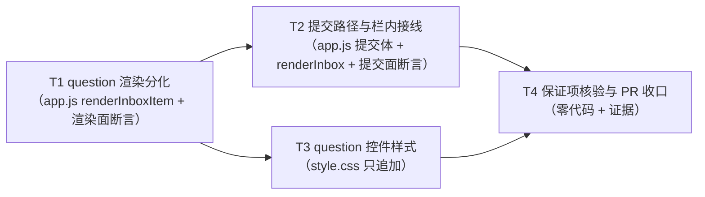

# pr-003-tasks.md — pr-003 内部任务图（控制台第三栏 question 条目渲染与提交载荷分化）

**迭代**: 0023-yolo-approval-and-question-inbox ｜ **阶段**: 5（PR 实现）· **末波** ｜ **PR 文件**: `prs/pr-003-inbox-question-item-frontend.md`
**worktree 分支**: `feat/0023-pr-003-inbox-question-item-frontend` ｜ **工作区地址**: `.pb-agents/worktrees/0023-yolo-approval-and-question-inbox/.pb-agents/worktrees/0023-pr-003-inbox-question-item-frontend`（本文件内一切 git 写操作用 `git -C <该地址>`）
**任务总数**: **4**（T1~T4）｜ **依赖图**: **无环**（见 §2）｜ **架构基线**: `architecture.md` **v0.3.0**（§3.3 流 4 / §5.2 信封 / §5.3 回传载荷 / §5.5 映射 / §6 F05·F06·F07·F10·F15 / §9.2 前端 2 文件 / §9.3 零改动清单）
**已解锁前提（实测）**: pr-002 已合并进迭代分支（merge `6dedd23`，本 worktree `git log` 可见）⇒ `oamp/src/web.js` 的 9 字段白名单（`:1616-1627`，`request_kind` `:1619` / `multiple` `:1625`）与 question 类裁决分支（`:1305-1318`）**已在本 worktree 可读、可依赖**；PR 文件的 `depends_on`（pr-003 → pr-002）已满足，本任务图**不重复写跨 PR 前置**。

---

## 0. 范围、文件面与事实锚点

### 0.1 本 PR 文件范围（唯一可写面；`git diff --name-only` 超出即 PR 验收 10 不通过）

| 文件 | 动作 | 内容 |
|---|---|---|
| `oamp/web/app.js` | 修改 | ① `renderInboxItem`（`:671-681`）按 `entry.request_kind` 分化（question 类：每选项一个可勾选控件 + 自由文本 + 一个「提交」按钮；permission 类保持既有「每选项一个按钮 + 单行文本框」）；② **新增** question 提交路径（收集勾选项 → 提交 `{option_ids, text}`，提交中控件 `disabled`，`200`/`404` ⇒ 移出、其余失败 ⇒ 保留重绘）；③ `renderInbox`（`:684-696`）的接线按条目类型分派。**零改动（防夹带）**：`state.inbox`（`:37`）、`inboxSource`（`:646-649`）、`loadConfirmations`（`:653-661`）、`inboxRequest`（`:665-668`）、`syncInboxLabels`（`:701-706`）、`dropInboxItem`（`:709-712`）、`decide`（`:717-732`）、`focusFromNotify`（`:735` 起）、`confirmation` 帧分支（`:170-182`）、`:167`（`open → loadConfirmations`）；**不得出现** `POLL_MS` / `setTimeout(tick` 形态 |
| `oamp/web/style.css` | 修改 | question 类多选控件与提交按钮的样式——在既有类名体系内**只追加**（零新框架 / 零新文件 / 零构建） |
| `oamp/test/inbox-console.test.js` | 修改 | ① 扩展 `renderInboxItem` 静态契约（`:331-336`）；② 提交 body 逐字锁与手势入口计数（`:338-347`、`:379-380`）；③ 用既有 `fnBody` + `vm` 沙箱体例（`:59-99`、`:86-91`）执行渲染 / 提交路径；④ 既有 CSS 只追加判据（`:284-311`）保持绿 |

### 0.2 非目标（由其它 PR 承担 / 本 PR 明令不碰）

- **pr-001 面（已合并）**：档位解析（`protocol.js` / `launcher.js` / `config.js` / `oneshot-client.js`）、`agent.js` 的信封生产与 `settleConfirmation`、`onQuestionRequest` 接线、rpc 宿主工具与 `deny` 三步、acp 非门 elicitation 承接、`context-pool.js` 钩子透传。
- **pr-002 面（已合并）**：`oamp/src/web.js`（白名单与裁决分化）、`oamp/API.md`、`oamp/llms.txt`、`oamp/test/confirmation-inbox.test.js`。**本 PR 只读**。
- **PR 文件零改动清单（防夹带，逐条不得出现在 diff）**：`oamp/web/index.html`（第三栏静态骨架 `:60-66` 不变）、`oamp/web/notify.js`（事件类型集合与投递面不变）、`oamp/web/{docs,debug,calls}.js` 与 `oamp/web/api-pages.css`、`oamp/src/**`、`oamp/API.md`、`oamp/llms.txt`、`oamp/package.json`、`oamp/test/{api-pages,confirmation-inbox,web,project-workspace,hygiene}.test.js`、`oamp/test/helpers/**`、`omp/**`。
- **本任务图自身**（`prs/pr-003-tasks.md`）不计入代码面：`git diff` 的**代码文件集合** = §0.1 的三个文件。

### 0.3 读码事实锚点（判据基础；2026-09-14 本 worktree 实读，逐条带 `文件:行号`）

| # | 事实 | 位置 |
|---|---|---|
| **A1** | `renderInboxItem(entry)` 现状 = 三个拼接段：`inbox-source`（来源标识）/ `inbox-request`（第二行）/ `inbox-actions`（**每个选项一个 `<button class="inbox-option" data-option=…>`**，文本 = `label \|\| o.option_id`）+ `<input class="inbox-text" placeholder="拒绝理由 / 补充说明（可不填）">`；**纯字符串产出、零 DOM 访问** | `web/app.js:671-681` |
| **A2** | `renderInbox()` = 唯一渲染路径（重建面与增量帧共用）：写 `inbox-count` / 切 `.open` / 整体 `innerHTML`，再对每个 `.inbox-item` 找 entry、取 `.inbox-text`，把每个 `.inbox-option` 绑 `onclick = () => decide(entry, btn, text)` | `web/app.js:684-696` |
| **A3** | `decide(entry, button, textInput)`：`oampNotify.requestPermission()` → 禁用该条 `.inbox-option` → `button.textContent = '提交中…'` → `POST …/decision`，**body = `{ option_id: button.dataset.option, text: textInput.value }`**（`:725`）→ `200` ⇒ `dropInboxItem`；`404` ⇒ 同样 `dropInboxItem`；其余失败 ⇒ `renderInbox()` 保留；**零 `alert(`/`confirm(`** | `web/app.js:717-732` |
| **A4** | `dropInboxItem(confirmationId)` = 按 id 过滤 + 重绘（**按 id 独立移出**的既有承载）；`state.inbox.items` 形状 = 条数组，零额外状态 | `web/app.js:709-712`、`:37` |
| **A5** | 数据来源两条：`GET /api/confirmations`（boot `loadConfirmations()` + `es.addEventListener('open', loadConfirmations)`）与全局 `confirmation` 帧入列（按 id 去重后追加） | `web/app.js:167`、`:653-661`、`:170-182` |
| **A6** | 栏内三行的后两行由 `inboxRequest`（`tool · title` 逐段转义拼接）与 `inboxSource`（左栏标题缺失回落 `chat_id`）产出 | `web/app.js:646-649`、`:665-668` |
| **A7** | 手势入口基线计数 = **2**（`decide` 内 `:718`、开合内 `:1156`）；`oampNotify.dispatch(` 基线 = **2**；`app.js` 零 `localStorage` / `sessionStorage`、零 `POLL_MS` / `setTimeout(tick` | `web/app.js`；`test/inbox-console.test.js:366`、`:379` |
| **A8** | pr-002 已落地的服务端口径（**前端须同向**）：条目 `request_kind: body.request_kind === 'question' ? 'question' : 'permission'`（`:1619`）、`multiple: body.multiple === true`（`:1625`）⇒ **非 `'question'` 即 permission；非 `true` 即 `false`** | `src/web.js:1616-1627` |
| **A9** | pr-002 已落地的裁决路由：question 类读 `body.option_ids`（键**缺失** ⇒ `[]`，`:1311`）；成立条件 = `option_ids.length > 0 \|\| text !== ''`（`text` 经 `trim`，`:1300`/`:1312`）；不满足 ⇒ `400 INVALID_PARAM` + `inbox.add(entry)` **回填**（`:1313-1315`）；`take()` 未命中 ⇒ `404`（`:1297-1300`） | `src/web.js:1296-1327` |
| **A10** | 既有测试体例：`fnBody(src, name)` 用正则抽取**顶层函数体**（`:59-64`）；`loadInboxRequest` = 拼 `escapeHtml` + `inboxRequest` 两段函数体在 `vm.runInNewContext` 里执行（`:86-91`）⇒ **渲染 / 提交路径须可被同法执行** | `test/inbox-console.test.js:59-99` |
| **A11** | 不得弱化的既有断言面：`renderInboxItem` 六条静态契约（`:331-336`，含 `class="inbox-option"` / `label \|\| o.option_id` / 既有 `placeholder` 原文）；`decide` 的 body 逐字锁（`:342`）+ disabled / `提交中…` / `dropInboxItem` / `err.status === 404` / 零弹窗（`:343-347`）；手势入口计数 = 2（`:379`）+ `decide` 内含手势点（`:380`） | `test/inbox-console.test.js` |
| **A12** | 既有 CSS 只追加判据：`.layout` / `.detail` / `.sidebar` 三条规则逐字在场 + 三条真隐藏规则 + `.inbox` 定宽 + 窄屏断点五条（`:284-311`）；对应既有规则块 | `test/inbox-console.test.js:284-311`；`web/style.css:417-497` |
| **A13** | 第三栏静态骨架（`<section id="inbox">` / `btn-inbox-toggle` / `inbox-count` / `inbox-list`）与脚本加载顺序（`notify.js` 先于 `app.js`）为既有面；不新增 `nav-item`（3）/ `filter`（4）/ 页面 | `web/index.html:60-66`；`test/inbox-console.test.js:129-134` |
| **A14** | 前端零依赖 / 零构建：`app.js` / `notify.js` 为经典脚本（无 `import` / `export` / `require`）；`package.json.dependencies = {}` | `web/app.js` 顶部；`oamp/package.json`；`prd/F16` |

### 0.4 现状缺口（本 PR 的靶点，实读复核）

pr-002 合入后，question 条目已能入栏（9 字段齐备），但前端仍按 permission 形状渲染与提交（A1/A3 未分化）⇒ 三条可复现的失败链：

| # | 现状行为（实读推导，逐条可复现） | 违反 |
|---|---|---|
| ① | 条目渲染为「每选项一个按钮 + 点选即裁决」⇒ **无「提交」入口**，「多选取舍 + 选项与文本一并提交」在 DOM 上不可能构造 | F05 验收 2/3（PR 验收 1/3） |
| ② | 提交体恒为 `{option_id, text}`，而服务端 question 分支只读 `option_ids`（A9）⇒ 用户勾选/点选的选项被服务端静默丢弃（落成 `option_ids: []`），文本却已构成一次作答 | F05 验收 3 / F07 验收 1（PR 验收 3） |
| ③ | 点选选项且文本为空 ⇒ 命中服务端「全空提交」（A9 `:1313`）⇒ `400` + 条目回填保留 ⇒ 栏内该条**永远答不动**（点选即空操作） | F05 验收 5（PR 验收 4） |

**本 PR 的落点** = 关掉 ①②③：渲染分化（T1）+ 提交载荷分化（T2）+ 样式补齐（T3）+ 保证项收口（T4）。

### 0.5 承接（前一 PR 的「下一迭代候选」提示）

- **来源（原文）**：`prs/pr-002-tasks.md` **§5 疑问 7**——「question 类前端可用性归 pr-003：`web/app.js:725` 恒提交 `{option_id, text}` 且被 `inbox-console.test.js:342` 逐字锁定 ⇒ 本 PR 落地后，question 条目的**前端**提交仍是旧形态（将命中 question 类的 400 分支）；本 PR 的 question 类判定一律经**直接 HTTP** 构造，不依赖前端。」
- **事实复核（2026-09-14）**：body 行确在 `web/app.js:725`（`decide` 内）；`:342` 的逐字锁确在（A11）；pr-002 已合入 ⇒ §0.4 的 ③ 已可复现。
- **承接方式**：T2 验收 1~4（提交载荷分化 + 一次提交语义）与 T2 验收 3 / T4 验收 3（**既有 body 逐字锁不得弱化**）；「旁路停掉」的服务端半已由 pr-002 交付（`web.js:1333` 的 `!question && text !== ''` 条件），**本 PR 不重复判定**，只判前端提交体形态。

---

## 1. 任务列表

### T1：question 类条目渲染分化（含渲染面测试断言）

- **验收标准**:
  1. **question 类控件形状（PR 验收 1 / F05 验收 1/2/3/4）**：给定条目 `{confirmation_id, request_kind:'question', chat_id, agent_id, tool:'ask_user', title:'优先保证哪一点？', options:[{option_id:'思考过程可见'},{option_id:'工具调用可审批'}], multiple:false, created_at}` ⇒ `renderInboxItem(entry)` 产出 ①**来源对话标识**（既有首行）②**问题文本行**（既有第二行，`tool · title` 拼接口径不变）③**每个选项一个可勾选控件**（不再渲染 `.inbox-option` 按钮）④**一个自由文本输入**⑤**一个「提交」按钮**；选项文本与 `option_id` 均经 `escapeHtml`（既有体例，`web/app.js:1077-1079`）。判据：按 A10 体例在 `vm` 内执行 `renderInboxItem`（沙箱提供 `escapeHtml` / `inboxSource` / `state` 桩），断言产出字符串 —— **可执行**。
  2. **多选 / 单选分化（PR 验收 1 后半 / F05 验收 2 / MI-02）**：`multiple === true` ⇒ 控件允许**同时选中多项**；`multiple !== true`（`false` / 缺失 / 非布尔键）⇒ **同一组内至多单值**（「单选即取舍」，第二次选择替换第一次）。判据：两态产物**可区分**且各自单值 / 多值语义可判——优先取原生控件形态（多值 = `type="checkbox"`；单值 = 同 `name` 的单值控件），若实现取等价形态，须交付**等价可执行判据**（见 §7 MI-1）；**不得**两态产出同一形态（否则单选提问会允许双选，F05 验收 2 判定失败）。与 A8 的 `multiple === true` 兜底同向。
  3. **自由文本恒在（F05 验收 3 / `architecture.md` §5.2「是否允许自由文本由 `request_kind:'question'` 蕴含」）**：question 类**恒**渲染文本输入（带选项与无选项两态都在），**不设**「是否允许文本」的字段判断分支。
  4. **无选项纯自由文本（PR 验收 2 / F05 验收 4）**：`options: []` ⇒ 条目仍**完整**渲染（选项区为空、无悬空标记 / 空容器残渣），文本输入与「提交」按钮在场，渲染不降级、不抛错、不因空集合走 permission 分支。判据：沙箱执行 + 产出断言（可勾选控件计数 = 0；提交按钮在场）。
  5. **permission 类零退化（PR 验收 5 / F10 验收 3 / N11）**：`request_kind` 缺失 / `'permission'`（A8 的口径）⇒ 渲染产物与 0021 **逐字一致**：`class="inbox-option"` 按钮（`data-option` + 文本 `label || o.option_id`）+ `placeholder="拒绝理由 / 补充说明（可不填）"` 的单行文本；`inbox-console.test.js:331-336` 的六条静态断言**原文不改且全绿**；另加沙箱执行 permission 条目，断言三类标记与既有 `placeholder` 原文**同时**出现在同一产出中。判据：既有断言（零改动）+ 沙箱产出断言。
  6. **三行结构与公共面不变（N11 / F15 验收 2 的界面半）**：`inboxSource`（`:646-649`）与 `inboxRequest`（`:665-668`）**函数体零改动**；question 类第二行仍为 `tool · title`（`title` = 问题文本、`tool` = 承载名 `ask_user` / `ask`，`architecture.md` §5.2 语义表）；条目容器 / 三行层级不新增行。判据：`fnBody(appJs, 'inboxSource'/'inboxRequest')` 与改动前逐字对比 + `git diff` 中不出现在这两函数体内。
  7. **渲染面零 DOM 依赖（可执行性前提）**：`renderInboxItem` 仍是**纯字符串产出**（不触碰 `document` / 不查 DOM / 不读数除入参外的全局）⇒ 可在 A10 的沙箱内直接执行。判据：沙箱执行成功（无需 DOM 桩）——这是 T1/T2 全部运行期判据的前提。**形态约束**：`renderInboxItem` / `renderInbox` 等被断言的函数须保持**顶层 `function <name>(…) {` 声明**（A10 的 `fnBody` 正则按该形态抽取；若把逻辑拆到新函数，新函数亦须为顶层声明，否则沙箱无法提取 ⇒ 判据不可执行）。
  8. **零夹带**：本任务 diff 只含 `oamp/web/app.js`（`renderInboxItem` 及其内部辅助）与 `oamp/test/inbox-console.test.js`（渲染面断言）；`renderInbox` 接线（`:684-696`）与 question 提交路径属 T2，本任务不动。
- **前置依赖**: 无
- **优先级**: P0
- **追溯**: PR 验收 1、2、5（渲染面）；`architecture.md` **§5.2**（字段表：`title` = 问题文本 / `options` 承载 / `multiple` 承载 + M3 可表达性对照）、**§5.5**（各形状条目一律 `request_kind:'question'`）、§9.2 `web/app.js` 前段；`prd/F05` 验收 1/2/3/4、`prd/F10` 验收 3、`prd/F15` 验收 1
- **交付物**: `oamp/web/app.js`（`renderInboxItem`）+ `oamp/test/inbox-console.test.js`（渲染面断言组）

### T2：question 提交载荷分化与一次提交语义（含提交面测试断言）

- **验收标准**:
  1. **提交体分化（PR 验收 3 / F05 验收 3 / F07 验收 1 / T-04）**：question 类提交 ⇒ 请求 body = `{ option_ids: [...], text: '...' }`；`option_ids` 与**勾选集同值同序**（不排序、不去重、不筛选）；未勾选 ⇒ `option_ids` 为**空数组**（不是缺键）；`text` 取该条文本输入当前值（原样，前端不 trim、不校验）。判据：按 A10 体例在沙箱内执行提交体构造后 `deepEqual` 断言 —— **可执行**（与 PR 文件「文件范围」③「提交 body 为 `{option_ids, text}`」同口径）。
  2. **三种作答形态走同一路径（PR 验收 3 / F05 验收 5 / MI-03）**：仅勾选项（文本空）/ 仅文本（无勾选）/ 两者皆有 ⇒ 三者由**同一个** question 提交路径产出 body，**不**回落到 `{option_id, text}`；全空提交仍**发请求**（前端不做权威必填校验，L2-7「权威判定在服务端」）⇒ 由服务端 `400` 拒绝并保留条目（验收 4）。判据：三态各一次 body 断言 + 全空态一次（`{option_ids: [], text: ''}`）。
  3. **permission 类提交体逐字不变（PR 验收 3 后半 / PR 验收 5 / F10 验收 3 / N11）**：`decide(entry, button, textInput)`（`:717-732`）**函数体逐字不变**（含 `:725` 的 `body: { option_id: button.dataset.option, text: textInput.value }`）⇒ `inbox-console.test.js:338-347` 的既有断言（含 `:342` 的 body 逐字锁）**原文不改且全绿**（零适配、零削弱）。判据：`fnBody(appJs,'decide')` 与改动前逐字对比 + 既有断言全绿。**若**实现选择把两类 body 收进同一个函数，则 `:342` 必须适配为**两类 body 各自的逐字锁**（不得改为子集 / 通配 / `assert.ok`）——见 §7 MI-5。
  4. **一次提交即一次裁决（PR 验收 4 / MI-02 / L2-8）**：提交中该条**相关控件全 `disabled`**（勾选控件 + 文本输入 + 「提交」按钮）；`200` ⇒ 该条**立即**移出栏内（不等 SSE）；`404` ⇒ 同样移出、不重放；**非 200/404** ⇒ 条目保留（重绘复位控件），零新增弹窗（不出现 `alert(` / `confirm(`）。判据：`fnBody` 静态断言（`disabled = true` / `提交中…` / `dropInboxItem(entry.confirmation_id)` / `err.status === 404` / 无 `alert(|confirm(`）+ 与 `decide`（A3）**同一体例**（同类分支结构，不另造失败语义）。
  5. **多问题独立（PR 验收 6 / F06 验收 1/2）**：栏内 N 条 question ⇒ 每条**各自**的控件与提交入口（各自 `entry`、URL 用各自的 `entry.confirmation_id`，`:340` 的表达式体例）；只提交一条 ⇒ 该条移出、其余条目**仍在**且仍可提交。判据：`dropInboxItem`（A4）**零改动**（按 id 过滤即已满足独立移出）+ 沙箱内以两条 question 条目执行移出路径（`renderInbox` 以桩替代）断言仅被提交者移出，或等价可执行判据（§7 MI-4）。**不得**引入跨条目共享状态（如把「正在提交」标志挂到 `state.inbox`）⇒ `state.inbox` 形状零改动（A4）。
  6. **栏内接线按类型分派（PR 文件「文件范围」③）**：`renderInbox`（`:684-696`）的接线循环按 `entry.request_kind === 'question'`（A8 口径）分派：question 条目把勾选控件 + 「提交」按钮绑到 question 提交路径；permission 条目**仍**绑既有 `btn.onclick = () => decide(entry, btn, text)`（既有表达式在场）。判据：`fnBody(appJs,'renderInbox')` 静态断言两分支俱在；`decide` 的既有调用式未消失。
  7. **手势入口第三处且落点正确（PR 文件「文件范围」② / T-11）**：question 提交入口调用 `oampNotify.requestPermission()` ⇒ 全文件计数由 **2**（A7）变 **3**，且新调用点落在**第三栏交互回调内**（不落在加载期 / 事件派发 / 其他视图）；`test/inbox-console.test.js:379` 的既有计数断言**适配为 3**（保留断言，不得删除或改弱）、`:380`（`decide` 内含手势点）保持绿。判据：计数断言 + 落点上下文断言（§7 MI-6）。
  8. **零夹带**：本任务 diff 只含 `oamp/web/app.js`（question 提交路径 + `renderInbox` 接线 + 手势点）与 `oamp/test/inbox-console.test.js`（提交面断言 + `:379` 计数适配）；`decide` / `dropInboxItem` / `state.inbox` / `loadConfirmations` / SSE 分支零改动。
- **前置依赖**: T1（question 提交路径消费 T1 产出的控件类名与结构；`renderInbox` 接线须按同一分派判据；同文件 `app.js` 与同 `test/inbox-console.test.js` **串行**）
- **优先级**: P0
- **追溯**: PR 验收 3、4、5、6；`architecture.md` **§3.3 流 4**（`POST decision {option_ids, text}` → 服务端校验 → 回传/旁路）、**§5.3**（回传载荷分化 + 校验 + 旁路停掉 + 方向区分注）、**§5.5**、**L2-8**（question 类 = 取舍 + 提交）、§9.2 `web/app.js` 后段；`prd/F05` 验收 2/3/5、`prd/F06` 验收 1/2、`prd/F07` 验收 1、`prd/F10` 验收 3
- **交付物**: `oamp/web/app.js`（question 提交路径 + `renderInbox` 接线）+ `oamp/test/inbox-console.test.js`（提交面断言组）

### T3：question 控件样式（`style.css` 只追加）

- **验收标准**:
  1. **只追加（PR 验收 9 / api-pages 体例）**：`git -C <工作区地址> diff oamp/web/style.css` **只含新增行**（零删除行、零改写行）；既有 `style.css:417-497` 的 `.inbox` 规则体逐字在场；既有判据 `test/inbox-console.test.js:284-311` 逐条绿且**断言原文不改**。判据：`git diff` 行级检查 + 既有断言全绿。
  2. **覆盖 question 控件（PR 验收 9）**：新增规则的选择器**命中 T1 产出的控件类名**（可勾选控件 / 自由文本输入 / 「提交」按钮），使三类控件在既有视觉体系内**可辨**（至少：可勾选控件的选中态与「提交」按钮的可点击态有可见样式）；**不**对既有 `.inbox-option` / `.inbox-text` / `.inbox-item` / `.inbox-actions` 的规则体做任何改写或删除。判据：`grep` 新增选择器清单 × T1 交付说明的类名清单（逐名命中）+ diff 只增不改。
  3. **零新框架 / 零新文件 / 零构建（F16 / PR 验收 9）**：不新增 CSS 文件、不引 `@import` / 外链字体 / 第三方 CSS、不改 `package.json`；`index.html` 的 `<link>` 集合零改动（A13）。判据：`git diff --name-only` + `grep` 命中集合。
  4. **三栏几何与窄屏折叠零退化（PR 验收 9 / F15 验收 2）**：`.layout` 三栏规则、`.inbox` 定宽、`@media (max-width: 1100px)` 内的 `.inbox` / `.inbox .inbox-list` / `.inbox.open` / `.inbox.open .inbox-list` 四条**逐字在场**（既有断言 `:293-311` 不受影响）。判据：既有断言全绿。
  5. **交付说明（供 T4 与阶段 6 复核）**：交付物中列出**新增选择器清单**与其对应控件（类名 ↔ 控件对照），供 T4 验收 4 与阶段 6 端到端复核。判据：交付说明在场且与 CSS 实际选择器一致。
- **前置依赖**: T1（CSS 选择器只能针对**已存在**的类名；类名由 T1 定义并在其交付说明中列出。若实现者选择与 T2 **并行**，必须先固定类名契约再并行——本任务图不代定类名）
- **优先级**: P1（功能面绿后补齐；缺失 ⇒ PR 验收 9 不通过）
- **追溯**: PR 验收 9；`architecture.md` §9.2「`web/style.css`：question 类多选控件的样式（既有类名体系内新增，不引框架）」；`prd/F16` 验收 1/2（零依赖）
- **交付物**: `oamp/web/style.css`

### T4：保证项核验与 PR 收口（零代码改动 + 可复核证据）

> **本任务零代码改动**：F15 / F16 / 零改动清单的承载形态是「不改」（`architecture.md` §9.3）。任务产出 = **可复核的验收证据**。若核验发现需要改代码 ⇒ 说明 T1~T3 越界，按 §5 上报主 agent，**不得**就地扩面。

- **验收标准**:
  1. **命令全绿（PR 验收 10）**：`node --test oamp/test/inbox-console.test.js` **全绿**（含既有 permission 类用例与 F05/F06/F07/F10/F15 的新增断言，零削弱）；`node --test oamp/test/*.test.js` **无非本 PR 引入的失败**（既有失败若有，须逐条给出「非本 PR 引入」的证据：同一命令在迭代分支基线上同结果）。判据：两次命令的退出码 + 失败清单。
  2. **改动面封闭（PR 验收 10）**：`git -C <工作区地址> diff --name-only <基线>` 的**代码文件集合** = §0.1 的 3 个文件（本任务图 docs 文件不计入代码面）；§0.2 的零改动清单**逐条不出现**（尤其 `oamp/web/index.html`、`oamp/web/notify.js`、`oamp/src/**`）。判据：`git diff --name-only` 集合相等 + 逐条比对。
  3. **F16 零依赖（PR 验收 10 的保证项）**：`oamp/package.json` 的 `dependencies` 仍为 `{}`；`oamp/web/**` 无 `import` / `export` / `require(` 新增命中、无新增 `<script>` 标签；前端仍是零构建经典脚本（A14）。判据：读文件 + `grep` 命中集合。
  4. **不新增面板 / 页面 / SSE 事件类型 / 入口（F15 验收 1/3 / N6 / N7 / §9.3）**：`index.html` 的 `nav-item` 仍 **3** / `filter` 仍 **4** / `projects-view` 仍 **1**（既有断言 `:129-134` 绿）；`notify.js` 事件类型仍冻结 **3** 类；app.js 会话订阅仍 4 类（`message` / `task_update` / `chat_state` / `notice`）且全局分支集合不变；`oampNotify.dispatch(` 仍 **2** 处（`test:366`）；`src/web.js` 零改动。判据：既有断言 + `grep` 命中集合。
  5. **F15 界面无历史面（PR 验收 8 / F15 验收 1/3）**：栏内只出现在途条目——无已裁决列表 / 历史入口 / 筛选 tab / 查询参数；已作答条目移出即不再出现（`dropInboxItem` + 重建面 `GET /api/confirmations` 只含未 `take()` 条目）；**未作答条目刷新 / 断线重连后仍在**（`:167` 的 `open → loadConfirmations` 零改动）。判据：`git diff`（无新增 UI 载体）+ `dropInboxItem` 零改动 + 既有断言。
  6. **F15 数据来源与载体不变（PR 验收 7 / F15 验收 2 / 登记⑧ ②）**：条目仍来自 `GET /api/confirmations`（boot + 每次 `onopen`）与全局 `confirmation` 帧（A5）；`state.inbox`（A4）形状零改动；零前端存储（无 `localStorage` / `sessionStorage`）、零轮询（无 `POLL_MS` / `setTimeout(tick` 形态）、零新 `EventSource`。判据：`git diff` + `grep`（既有断言 `:318-329` 绿）。
  7. **两类条目同栏同态（F09 验收 3 的前端半 / §5.2「不改载体」）**：条目**不因类型分流**到不同容器 / 页面 / 列表；两类共用 `state.inbox.items` 与同一渲染入口 `renderInbox`；`request_kind` 只决定**条目内部**的控件分派（T1/T2）。判据：`git diff`（无第二个列表容器 / 无新 `<section>`）+ 沙箱内两类条目经同一函数产出。
  8. **样式面复核（T3 的对位）**：`style.css` 的改动为**纯新增**且新增选择器命中 question 控件（T3 验收 1/2 的复核）；既有 CSS 判据 `:284-311` 绿。判据：`git diff --numstat`（删除列 = 0）+ 既有断言。
- **前置依赖**: T1、T2、T3（收口核验须在全部改动就位后；命令全绿含 T3 的 CSS 面）
- **优先级**: P0
- **追溯**: PR 验收 5（命令面）、7、8、10；`architecture.md` **§9.3 零改动清单**、**§6** F15 / F16 行、§9.2（前端 2 文件）；`prd/F15` 验收 1/2/3、`prd/F16` 验收 1/2
- **交付物**: 无代码（验收证据 + 必要的零改动声明）

---

## 2. 依赖图（无环）

- **拓扑序（合法执行序之一）**：`T1 → T2 → T3 → T4`（`T2` 与 `T3` 同层，可交换）。
- **无环证明**：边集合 = `{T1→T2, T1→T3, T2→T4, T3→T4}`；存在拓扑序 `T1 < T2 < T3 < T4`（`T3` 亦可置于 `T2` 前）且无回边、无跨层边 ⇒ **无环**。
- **最长依赖链**：`T1 → T2 → T4`（3 跳）；并列第二链 `T1 → T3 → T4`（3 跳）。**关键路径任务** = T1、T2、T4。
- **可并行面**：`T2 ∥ T3`（两者均只依赖 T1）。若并行，须先由 T1 交付**类名清单**（T3 前置依赖的判据）；本任务图不代定类名。
- **同文件串行约束（必须）**：`oamp/web/app.js` 由 **T1 → T2** 顺序修改；`oamp/test/inbox-console.test.js` 同序（T1 渲染面断言 → T2 提交面断言 + `:379` 计数适配）；`oamp/web/style.css` 仅 T3 修改 ⇒ 三条文件面各自单一写者，无并发写冲突。**不得**把 T1 与 T2 拆给不同执行者并行落地。
- **粒度说明（planner 判据 ①1~2 天 ②可独立验收 ③验收可测试）**：T1 / T2 各对应 `app.js` 内一个**独立的可失败面**（渲染产物 vs 提交体与裁决分支），各自带独立断言组 ⇒ 均满足 ②③；T3 单文件纯新增 ⇒ 满足 ①；T4 为「不改」的机械核验面（PR 验收 7/8/10 无其它承接者）。四任务均**不**需要跨任务共享可变状态（唯一共享面 = T1 产出的类名，以「依赖 + 交付说明」传递，非共享写）。
- **`[model_inferred]` 传递约定**：T1 的类名清单是 T3 的**唯一**输入接口；T2 的提交体构造签名是 T1/T2 运行期断言的**唯一**沙箱执行面（A10 体例）——两者均须写入交付说明，否则下游任务无判据。

## 3. 与 PR 验收标准逐条对位表

| PR 验收 # | 验收摘要 | 承接任务 | 对位说明 |
|---|---|---|---|
| 1 | question 类条目形状（`multiple:false` 单选取舍；`multiple:true` 多选；文本 + 提交按钮） | **T1**（验收 1、2、3、4） | 判据 = 沙箱执行渲染函数 + 产出断言（A1 / A10 体例） |
| 2 | 无选项纯自由文本（`options: []` 仍渲染、文本可提交、无「选项必选」阻塞） | **T1**（验收 4）+ **T2**（验收 2 的「仅文本」态） | 渲染半在 T1；提交半在 T2（服务端权威校验见 A9，本 PR 不判定 400 语义） |
| 3 | 提交载荷分化（question `{option_ids, text}` 同值同序；permission 仍 `{option_id, text}`） | **T2**（验收 1、2、3） | 判据 = 沙箱执行提交体构造 + 既有 `decide` body 逐字锁（A11 `:342`） |
| 4 | 一次提交即一次裁决（控件 disabled；200 移出；404 移出；其余失败保留重绘） | **T2**（验收 4） | 判据 = `fnBody` 静态断言组 + 与 `decide` 同体例（A3） |
| 5 | permission 类零退化（三行 + 每选项一按钮 + 点选即裁决，与 0021 逐字一致） | **T1**（验收 5、6）+ **T2**（验收 3）+ **T4**（验收 1、3） | 判据 = 既有断言 `:331-336` / `:338-347` **原文不改** + 命令全绿 |
| 6 | 多问题独立（N 条各自 `confirmation_id`；只作答一条 ⇒ 该条移出、其余仍在可提交） | **T2**（验收 5） | 判据 = `dropInboxItem` 零改动（按 id 过滤）+ 沙箱移出路径断言（`state.inbox` 零新增状态） |
| 7 | 数据来源与载体不变（`GET /api/confirmations` + `confirmation` 帧；刷新 / 重连仍在；零存储 / 零轮询 / 零新入口） | **T4**（验收 5、6）+ **T1/T2**（对该面零改动） | 判据 = `git diff` + 既有断言 `:318-329` + `grep` 命中集合 |
| 8 | 界面无历史面（只出现在途条目；移出即不再出现） | **T4**（验收 5）+ **T2**（验收 4 的移出语义） | 判据 = `git diff`（无新增 UI 载体）+ `dropInboxItem` 语义 + 重建面 |
| 9 | 样式只追加（既有声明原样在场；新增规则为 question 控件样式；零新文件 / 框架 / 构建） | **T3**（验收 1~5）+ **T4**（验收 8） | 判据 = `git diff --numstat`（删除列 = 0）+ 既有断言 `:284-311` 绿 |
| 10 | 命令全绿且改动面封闭 | **T4**（验收 1、2、3、4） | 判据 = 两次命令退出码 + `git diff --name-only` 集合相等 |

**覆盖检查**：PR 的 **10** 条验收标准 → **全部有任务承接**（无遗漏）；T1~T4 的每条验收标准均可在 §6 追溯到 `architecture.md` / `prd/*.md` / PR 文件（无凭空判据）。

## 4. 跨 PR 归属（PR 文件「择一判定声明」对位）

| PR 文件的声明 | 本任务图的对位 |
|---|---|
| ① F05 验收 2 的「条目允许选中多项并一并提交」**主面在本 PR**（栏内控件），pr-001 只判信封 `multiple` 承载 | T1 验收 2（两态控件分化）+ T2 验收 1（勾选集同值同序一并提交）。**本 PR 不判**信封字段生产（pr-001 已合并） |
| ② F07 验收 1 的「答案到达提问方」**主面在 pr-001 + pr-002**；本 PR 只判「提交载荷形态正确」 | T2 验收 1~3 只判**提交体形态**；答案送达（`host_tool_result` / acp `content`）与旁路停掉的服务端半**不判**（A9 / PR 文件 `depends_on`） |
| ③ 端到端（F05 / F07 完整链路）不计入任何单 PR，由阶段 6 覆盖 | T4 验收 1 只跑 `node --test`；浏览器交互实测（点选 / 提交 / 刷新重建）**由阶段 6 端到端验收覆盖**，本任务图不虚设 E2E 任务 |
| PR 文件 `depends_on`：pr-003 → pr-002（单向、无环） | 已满足（merge `6dedd23`，§0.3 A8/A9 逐条可读）；§2 的图**不含**跨 PR 边 |
| 与 pr-001 无直接依赖（不同进程面 / 不同文件） | 本任务图**不写**跨 PR 前置；判定面（渲染产物 + 提交体）用**直接构造的条目对象**在沙箱内产生，不依赖 pr-001 |

## 5. 边界与疑问（提请主 agent）

1. **通知正文模板对 question 不贴切（越界面，非本 PR）**：`notify.js` 的 `confirmation_required` 正文模板为「`<agent> 请求执行 <tool>：<title>`」（模板源 = `web/notify.js:38-42`；逐字锁 = `test/inbox-console.test.js:195`、`:274`）。question 条目的 `tool` = `ask_user` / `ask` ⇒ 通知正文变成「pb-dev 请求执行 ask_user：优先保证哪一点？」，措辞对提问语义不贴切。PR 文件把 `oamp/web/notify.js` 列入**零改动清单**，且无验收标准覆盖通知文案 ⇒ **本任务图不承接**，登记为**下一迭代候选**（与「不改载体 / 不新增事件类型」的边界一致）。
2. **`[model_inferred]` 控件形态未由上游钉死**：PR 文件只写「每个选项一个多选控件」「`multiple === true` 时允许多选」「单选即取舍」，未定控件 tag。T1 验收 2 采取的最小判据 = 两态产物可区分 + 单值 / 多值语义可判，**优先取原生形态**（`type="checkbox"` / 单值控件）；若实现取等价形态，须交付**等价可执行判据**（见 §7 MI-1）。**本任务图不替实现决定控件 tag**。
3. **`[model_inferred]` 前端不做权威必填校验**：`architecture.md` L2-7 写「`MI-03` 必填性在服务端判定，前端只做**可用性提示**」，未钉死「可用性提示」的强度。T2 验收 2 的口径 = ① 前端**不**把空提交短路成「不发请求」（否则 PR 验收 4 的「其余失败 ⇒ 条目保留」分支不可达）；② 允许实现加视觉提示（如未填时按钮置灰），但**不是**验收要求。若主 agent 另有口径（如要求前端硬性阻止空提交），T2 按其口径执行——**届时 PR 验收 4 的失败分支判据须替换为等价可达的失败路径**。
4. **既有 body 逐字锁的适配口径二选一（§7 MI-5）**：PR 文件写「`decide`（permission 类 `{option_id, text}`）**逐字不变**」（`app.js:717-732`），而本 PR 的「下一迭代候选」提示又要求 `inbox-console.test.js` 中逐字锁定该 body 的断言「相应适配（不得弱化）」。二者在**实现取独立 question 提交路径**时并不冲突（`:342` 原文保留、另增 question body 的逐字锁）；若实现选择把两类 body 收进同一函数，则 `:342` 必须适配为两类逐字锁。**任务图允许两条路径，但要求：两类的提交体各有逐字锁、断言强度不降**；具体取哪条由实现者按落地形态定，主 agent 无须预先裁定。
5. **`multiple` 的口径无误歧**（登记以备复核）：前端 `entry.multiple === true` 才多选，其余（`false` / 缺失 / 非布尔）一律单选——与 A8 的服务端兜底 `body.multiple === true` 同向，**非 `[model_inferred]`**。
6. **阶段 6 的浏览器实测面（本任务图的判据面边界）**：T1/T2 的运行期判据一律在 `vm` 沙箱内以**产出字符串 / body 对象**为判据（A10 体例，无 DOM）；「点击勾选 → 点提交 → 条目消失」的**真实交互链**属阶段 6 端到端验收（PR 文件「择一判定声明」③）。T2 验收 5 的多问题独立判据取「沙箱内移出路径」或等价可执行判据（§7 MI-4），**不虚设 DOM 仿真**。

## 6. 追溯总表（任务 → 输入）

| 任务 | `architecture.md` | `prd/*.md` | PR 文件 |
|---|---|---|---|
| **T1** | §5.2（字段表：`title` / `options` / `multiple`；自由文本由 `request_kind:'question'` 蕴含）、§5.5（非门形状一律 question 类）、§9.2 `web/app.js` 前段、§9.3（`index.html` / `notify.js` 零改动） | F05 验收 1/2/3/4、F10 验收 3、F15 验收 1 | 验收 1、2、5；文件范围 `web/app.js` ① |
| **T2** | §3.3 流 4、§5.3（回传载荷分化 + 校验 + 旁路停掉 + 方向区分注）、§5.5、L2-8、§9.2 `web/app.js` 后段 | F05 验收 2/3/5、F06 验收 1/2、F07 验收 1、F10 验收 3 | 验收 3、4、5、6；文件范围 `web/app.js` ②③ |
| **T3** | §9.2 `web/style.css`、§9.3（零新文件 / 零框架） | F16 验收 1/2 | 验收 9；文件范围 `web/style.css` |
| **T4** | §9.3 零改动清单、§6 F15 / F16 行、§9.2 | F15 验收 1/2/3、F16 验收 1/2 | 验收 5、7、8、10 |

## 7. `[model_inferred]` 清单（需主 agent 确认）

| # | 位置 | 推断内容 | 依据 |
|---|---|---|---|
| MI-1 | T1 验收 2 | question 控件的**形态判据**取「两态产物可区分 + 单值 / 多值语义可判，优先原生控件」（`type="checkbox"` / 单值控件）；等价形态须交付等价可执行判据 | PR 文件只要求「多选控件 / 单选即取舍」，未定 tag；F16 零依赖下原生控件是唯一零成本形态；判据须可执行（planner 契约） |
| MI-2 | T1 验收 1 / T2 验收 1 | question 分支的自由文本输入**可**复用既有 `.inbox-text` 类名，但**文案可不同于** permission 的 `placeholder="拒绝理由 / 补充说明（可不填）"`（后者必须逐字保留在 permission 分支） | PR 文件要求既有 `placeholder` 文案「逐字仍在」（permission 面）；question 面文案未被上游指定 |
| MI-3 | T1 验收 1 / T2 验收 5 | 两条 question 条目的**控件类名清单**与**提交体构造签名**须写入交付说明，作为 T3（CSS 选择器）与沙箱判据（A10）的接口 | §2 传递约定：类名与提交体是跨任务 / 跨文件的唯一接口，未定则 T3 与运行期断言无判据 |
| MI-4 | T2 验收 5 | 多问题独立的**可执行判据**取「沙箱内以两条 question 条目执行移出路径（`renderInbox` 以桩替代）」或等价判据 | `dropInboxItem`（A4）按 id 过滤 + PR 文件③ 的 `fnBody` + `vm` 体例；无 DOM 时须给等价判据（planner 契约） |
| MI-5 | T2 验收 3 | 既有 body 逐字锁（`test:342`）的适配：**允许**两条路径（`decide` 逐字不变 ⇒ 原文保留 + 新增 question body 逐字锁；或两类 body 合一 ⇒ `:342` 适配为两类逐字锁），**但不得弱化** | PR 文件「`decide` 逐字不变」× 承接提示「既有断言需相应适配（不得弱化）」；两者在「各有逐字锁」下相容 |
| MI-6 | T2 验收 7 | 手势入口计数断言（`:379`）由 2 适配为 3 时，须**保留**「落点在第三栏交互回调内」的断言强度（可加落点上下文断言） | PR 文件「调用点由 2 处变 3 处并断言落点仍在第三栏交互回调内」；既有断言原文含该语义（`:379` 的 title 文案） |
| MI-7 | T4 验收 2 | 「改动面封闭」的**代码文件集合** = §0.1 三文件，**本任务图 docs 文件不计入代码面** | PR 文件验收 10 写「只含本 PR 列出的 3 个文件」，而任务图自身由 planner 在 worktree 内提交（`prs/pr-003-tasks.md`）；两者须并行成立，故明确区分「代码面 / docs 面」 |
