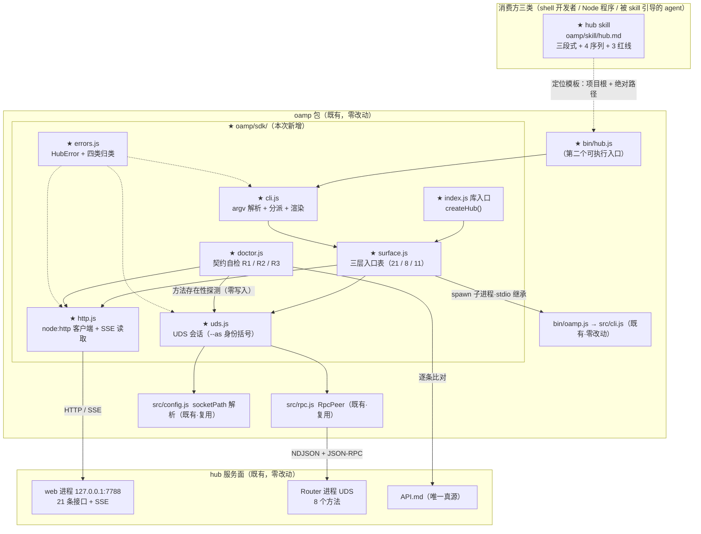

# architecture.md — 0025-hub-sdk-and-skill

**版本**: 1.0.0（**阶段 3 · 首轮全量落盘**：T-01~T-09 九项全落定；17 张卡逐卡有技术路径）
**迭代**: 0025-hub-sdk-and-skill
**阶段**: 3（技术架构）
**创建日期**: 2026-09-15
**工作区地址**: `/Users/chenchiyuan/projects/agents/.pb-agents/worktrees/0025-hub-sdk-and-skill`（本阶段全部写入为该地址下的绝对路径）
**输入**: `docs/iterations/0025-hub-sdk-and-skill/prd.md` v0.1.0 + `prd/{F01~F14,G01~G03}*.md`（17 卡，架构维度 `[架构待填]` T-01~T-09 全部待填）
**只读代码基线**: `<工作区地址>/oamp/**`（**只读，本阶段零写入**）——重点核对：`oamp/API.md`（§3 的 21 条清单 / §4 事件流 / §5 示例）、`oamp/package.json`（零依赖 / `bin` / `engines`）、`oamp/src/{cli,rpc,config,status,task,cluster,node-client,transport,web,launcher,oneshot-client,rpc-client}.js`、`oamp/test/**`
**本方案的对象**: **hub SDK**（同一份代码的 CLI 面 + 库面）与 **`hub` skill**——落点在 `oamp/` 包内；**不改 hub 自身的接口面**（G01）

> 阅读顺序建议：§1 现状基线（30 秒建立心智模型）→ §3 决策清单（**L1 一条待拍板** + 四处规格口径）→ §5 三张全表（可直接对照实现）→ §7 逐卡技术路径。

---

## 0. 本文件状态（阶段 3 · 全量落盘）

| 章节 | 状态 |
|---|---|
| §1 现状架构基线（as-is：进程 / 技术栈 / 缺口 / 可复用原语 / 硬约束） | ✅ |
| §2 目标架构（to-be：组件图 / 数据流 / 接缝 / 明确不引入） | ✅ |
| §3 关键技术决策（L1 清单 + L2 清单 + 四处规格口径待拍板） | ✅ |
| §4 出现点 / 改动面清单（新建 / 修改 / 零改动 / 顺序约束） | ✅ |
| §5 接口与契约（T-01 三层子命令全表 / T-03 库 API / T-09 输出 / T-04 NDJSON / T-08 退出码 / T-02 doctor / T-05·T-06 skill） | ✅ |
| §6 T-01~T-09 逐项落定汇总 | ✅（9/9） |
| §7 逐卡技术路径（17 张卡 = F01~F14 + G01~G03） | ✅（17/17） |
| §8 内部一致性自查 | ✅ |
| §9 风险与已知代价（含与功能规格的四处张力） | ✅ |
| §10 测试组织（T-07） | ✅ |
| §11 本阶段未做的事 / 越界与疑问 | ✅ |

---

## 1. 现状架构基线（as-is）

### 1.1 三个进程与两条接入路径

```
┌─ 消费方（本次迭代要服务的三类）────────────────────────────────────────────────┐
│ ① shell 前的开发者  ② Node 侧程序  ③ 被 skill 引导的 agent（经 shell）          │
└───────────────┬──────────────────────────────┬────────────────────────────────┘
                │ 手拼 HTTP / curl              │ 手写 socket + JSON-RPC 帧
                ▼（**今天没有统一入口**）        ▼（**今天没有统一入口**）
┌─ oamp web 进程（127.0.0.1:7788）─┐        ┌─ oamp Router 进程（UDS .runtime/router.sock）─┐
│ src/web.js   路由表 21 条 / SSE   │◀──UDS──│ src/router.js  8 个方法 + 注册表 + 任务表       │
│ src/transport.js  四组订阅键      │        │ src/rpc.js     NDJSON 帧 + JSON-RPC 2.0        │
│ src/persist.js    SQLite（对话）  │        │ src/registry.js 租约判活                      │
└──────────────────────────────────┘        └───────────────────────────────────────────────┘
┌─ oamp CLI（bin/oamp.js → src/cli.js）───────────────────────────────────────────┐
│ router start / agent start / status / task send·status·list·watch / web start  │
│ cluster up·down·status                                                          │
└────────────────────────────────────────────────────────────────────────────────┘
```

**关键事实**：三条既有接入路径**各自可用、但互不统一**——Web 面只有 HTTP/SSE（`API.md` 是唯一规范真源）、Router 面只有 UDS + JSON-RPC（`README.md` §协议速览）、CLI 面只有人类文本 + 既有退出码。消费方要跨三方协作，只能自己拼三种通道。**本次迭代补的正是这些入口的 1:1 直通面**，不是新通道。

### 1.2 既有技术栈（本方案不得新增）

| 面 | 现状 | 证据 |
|---|---|---|
| 运行时 | Node ≥ 22 ESM，**零第三方依赖** | `oamp/package.json`（`dependencies` 为 `{}`、`engines.node >= 22`、`type: module`） |
| 包入口 | 单一 bin：`oamp` → `bin/oamp.js` → `src/cli.js` 的 `main(argv)` 顶层分发 | `oamp/package.json`、`oamp/bin/oamp.js`、`oamp/src/cli.js` |
| Web 接入面 | HTTP/1.1 + JSON；SSE（`text/event-stream`）；21 条接口 | `oamp/API.md` §3；`oamp/src/web.js` 路由表 21 项（逐条实测计数） |
| Router 接入面 | UDS 长连接 + 逐行 NDJSON + JSON-RPC 2.0；8 个方法 | `oamp/src/rpc.js`（`RpcPeer`）、`oamp/src/router.js:108` 的 `dispatch` 分支 |
| 地址解析 | Web：`--port` > `OAMP_WEB_PORT` > `7788`；Router：`OAMP_SOCKET` > `<包根>/.runtime/router.sock` | `oamp/API.md` §1.1；`oamp/src/config.js` 的 `loadConfig` |
| CLI 退出码 | 既有语义：`0` 成功 / `1` 失败 / `2` 用法错误 | `src/cli.js:usageError` 返回 `2`；`src/status.js` 失败返回 `1` |
| 测试 | `node --test test/*.test.js`（零依赖 runner）+ `test/helpers/harness.js`（真起 Router / agent 子进程） | `oamp/package.json` scripts.test；`oamp/test/helpers/harness.js` |

### 1.3 与本次需求相关的现状（**现状事实，非缺陷指控**）

| # | 现状 | 位置 | 与本次需求的关系 |
|---|---|---|---|
| G1 | Web 面 21 条接口**无任何客户端实现**（`API.md` 只给 `curl` 示例与一段最小 Node 订阅示例） | `oamp/API.md` §5；全仓无 HTTP 客户端模块 | W2① → F02 需 21 条 1:1 入口 |
| G2 | Router 的 8 个方法**只有进程内客户端**（`NodeClient` 面向"oamp 自己拉起的节点"） | `oamp/src/node-client.js` | W2② → F03 需 8 个方法的通用入口（非 oamp 启动的进程也能用） |
| G3 | 既有 CLI 的 6 个顶层命令（含 `cluster` 三动作）**只能经 shell 调用** | `oamp/src/cli.js` | W2③ → F04 需零语义变更的封装（**不改既有 CLI 本身**） |
| G4 | 既有退出码只有 `0/1/2`，**无"连接失败"这一类** | `src/status.js`（Router 不可达 → `1`） | W4 → F07/F08 需 `3` 这一类；**cli 层如何归类**见 §5.4 |
| G5 | `POST /api/calls` 的阻塞形态**无服务端上限**，且终态才回响应 | `oamp/API.md` §3.14、§5.13 | W4/C-2 → F10 的 `--wait` 是**本地**等待上限（§5.4、§9.1） |
| G6 | `GET /api/docs` 每次请求**从路由登记现算**（不缓存、不预快照），产出的 `path` 用 `:param` 形态 | `oamp/src/web.js:1265` `projectRoutes`；API.md §3.11 | W5 → F11 的"运行中接口面清单"**现成**，无需第二份定义（§5.5） |
| G7 | `API.md` §3 的清单是 markdown 表格（`\| n \| \`METHOD /path\` \|`），路径用 `<param>` 形态 | `oamp/API.md:157-186` | W5 → doctor 的文档侧解析基准（形态差异需归一，§5.5） |
| G8 | 全仓**零 skill 落在 `oamp/` 内**（既有 skill 均在 `.claude/skills/`） | 仓库事实 | W6/D-1 → skill 落点 `oamp/` 内是本迭代**新增约定**（G03 验收 4 明禁改动 `.claude/skills/**`） |

### 1.4 既有可复用原语（**奥卡姆剃刀：优先复用，不重建**）

| 原语 | 位置 | 本方案如何复用 |
|---|---|---|
| `RpcPeer`（NDJSON 帧 + JSON-RPC 2.0 请求/响应/通知/错误） | `src/rpc.js` | **层 B 直接复用**：SDK 不重写帧编解码，只包会话 |
| `loadConfig(env)` 的 socket 路径解析链（`OAMP_SOCKET` > 包根默认） | `src/config.js` | **层 B 直接复用**：与 `status.js` / `task.js` 同一条解析链（无第二处定义） |
| `queryNodes` / `renderTable`（padEnd 对齐表格手法） | `src/status.js` | **`--human` 的呈现体例先例**（同手法、零新样式） |
| `renderTask` 的 `键: 值` padEnd 手法、`renderList` 的表头 + 数据行手法 | `src/task.js` | 同上（`--human` 的两条渲染路径直接沿用既有手法） |
| `bin/oamp.js` + `main(argv)` 顶层分发约定（`default` 导出启动函数、返回数字 = 退出码） | `bin/oamp.js`、`src/cli.js` | **层 C 的被透传对象**（SDK 以子进程调用它，零语义变更） |
| `spawn(process.execPath, [BIN, ...])` 起 oamp 子进程的手法 | `oamp/test/web.test.js:126`；`src/cluster.js` 的 `BIN` 常量 | **层 C 的实现先例**（同一手法，`BIN` 同样按模块位置推导、与 cwd 无关） |
| `projectRoutes`（登记 → 投影，不缓存） | `src/web.js:1265` | **doctor 的运行侧清单来源**（`GET /api/docs`） |
| 既有 CLI 的退出码语义（`0/1/2`） | `src/cli.js` | 层 C 透传（`0/1/2` ⊂ 四类分类表，天然不冲突，§5.4） |
| 测试进程级 harness（真起 Router、临时 socket、`waitFor`） | `oamp/test/helpers/harness.js` | **T-07 的组织载体**（不新增测试基建） |

### 1.5 硬约束（本方案不得违反）

| # | 约束 | 来源 | 本方案的落地方式 |
|---|---|---|---|
| C1 | **零第三方依赖**（`dependencies` 为 `{}`） | F01 验收 5 / §3 | 层 A 用 `node:http`；层 B 复用 `src/rpc.js`（`node:net`）；层 C 用 `node:child_process`；CLI 解析手写 |
| C2 | **`API.md` 是接口唯一真源**，SDK 是严格 1:1 薄封装（不代做跨端点语义） | W3 / A-4 | 每条入口 = 单一端点 / 单一方法 / 单条既有命令；**无编排命令** |
| C3 | **不改 hub 自身**（Router / Web / `API.md` 的语义与路径不变） | N1 → G01 | §4.3 零改动清单（`src/**` 除新增目录外零改动） |
| C4 | **不改 `roles/**`、`.claude/skills/**`、分发脚本** | W8 / N6 → G03 | skill 落 `oamp/` 内；不新增副本 / 转发（§5.6） |
| C5 | 既有两条漂移锁（`llms.txt` 逐字节快照、`API.md` ↔ 路由登记双向覆盖） | `oamp/test/api-routes.test.js:278`、`:303` | **不新增任何路由**（未触碰登记面）⇒ 两把锁零影响（§4.3） |
| C6 | CLI **无状态**（不跨调用缓存） | W4 / N9 → F09 | 每命令一次连接、结束即关；零本地文件写；库面无全局可变状态 |
| C7 | 默认 JSON → stdout；`--human` 切换；错误 → stderr；退出码 `0/1/2/3` | W4 → F05/F07 | §5.3 / §5.4 |

---

## 2. 目标架构（to-be）

> 一句话：**在 `oamp/` 包内新增一个 `sdk/` 目录与第二个可执行入口 `bin/hub.js`，用一张"三层入口表"同时驱动库方法与 CLI 子命令——层 A 用 `node:http` 打 Web 的 21 条接口，层 B 用既有 `src/rpc.js` 打 Router 的 8 个方法，层 C 用子进程原样透传既有 CLI 的 11 个叶子命令；另加一个 `doctor` 自检，把"运行中的接口面"与 `API.md` 逐条对齐。零新依赖、零新进程、零既有模块改动。**

### 2.1 组件图（★ = 新增）



### 2.2 三条核心数据流

**流 1 · 层 A（Web 面）一次调用**（F02 / F05 / F07）

```
consumer（shell 或库）
  → hub api <子命令> [位置参数] [--flag 值] [--human] [--port n]
  → sdk/cli.js：argv 解析（失败即 exit 2，**不发出请求**）
  → sdk/surface.js 的入口项 → sdk/http.js：method+path（:param 已替换）+ query/body 原样
  → node:http 请求 http://127.0.0.1:<port>
  → 2xx：响应体原样 → stdout（JSON 一行或 --human 渲染）→ exit 0
  → 4xx/5xx：{error, code} 原样进 stderr 的错误对象 + 归类 → exit 1（UPSTREAM_UNAVAILABLE → 3）
  → 连接级错误（ECONNREFUSED 等）→ stderr 单一明确错误 → exit 3
```

**流 2 · 层 B（Router 面）一次方法调用**（F03）

```
consumer（库：hub.uds.connect() 持会话 ／ shell：hub uds <方法> --params '<json>'）
  → sdk/uds.js：net.connect(loadConfig().socketPath)（连接建立上限 2000ms）
  → [--as <id>] ⇒ 先 agent.register（取得 session_id）
  → RpcPeer.request(<方法>, <params 原样>) ／ 通知型方法（agent.heartbeat）走 notify
  → 响应 result 原样 → stdout JSON ／ 库面返回同一对象
  → [--as] ⇒ best-effort agent.deregister → 关连接（每命令一次连接，无跨调用状态）
  → JSON-RPC 错误：data.code 原样进错误对象（-32601/-32000）→ 归类（UNREGISTERED 等 → 1）
```

**流 3 · 订阅类命令（NDJSON）**（F06）

```
hub api stream chat <id> ／ stream events ／ stream calls --chat <id> ／ stream call <call_id>
  → http.js 建立 SSE 连接（GET，Accept: text/event-stream）
  → 逐帧解析：event: <名> / data: <JSON>（忽略 `: keepalive` 注释行与 retry 帧）
  → 每帧一行 NDJSON：{"event":"<名>","data":<帧 data 原样>} → stdout
  → 下游关闭管道（EPIPE on stdout）→ 结束进程、exit 0（F06 验收 3）
  → 服务端异常断开 → stderr 单一明确错误 → exit 3
```

### 2.3 与既有组件的接缝（**复用了什么 / 不新建什么**）

| 接缝 | 复用 | 不新建 |
|---|---|---|
| Router 协议面 | `src/rpc.js` 的 `RpcPeer`（帧 + JSON-RPC 全套） | 不写第二套帧编解码 |
| Router 地址 | `src/config.js` 的 `loadConfig(env).socketPath` | 不新增 socket 配置项 |
| 既有 CLI | `bin/oamp.js`（子进程、`stdio: inherit`、退出码透传） | 不改 `src/cli.js`、不重写任一命令 |
| Web 接口面 | `API.md` §3 的 21 条（路径 / 参数 / 响应体逐条对齐） | 不做 HTTP 框架、不做第二份 schema |
| 接口面清单（doctor 运行侧） | `GET /api/docs`（既有登记投影） | 不在 SDK 里存一份端点表用于比对 |
| 输出人读形态 | `status.js:renderTable` / `task.js:renderTask` 的 `padEnd` 手法 | 不引颜色库 / 表格库 / 不引 ANSI |
| 测试基建 | `node --test` + `test/helpers/harness.js` | 不新增测试框架 / 不新增 CI 脚本 |

### 2.4 明确**不引入**的东西（奥卡姆剃刀 / YAGNI）

第三方依赖（含 CLI 解析库 / HTTP 客户端库 / 断言库）、新进程与新端口、新配置文件与新配置键、新的服务端端点或方法、本地缓存 / 快照 / 断点续传、自动重试 / 自动重连 / 守护 / 心跳循环、跨端点编排命令（`dispatch` / `await`）、各宿主专属适配器（MCP / 插件 / 扩展）、包管理器发布与全局安装步骤、第二份接口定义或字段 schema、`.claude/skills/**` 下的转发或副本、`roles/**` 与分发脚本的任何改动。

---

## 3. 关键技术决策

### 3.1 L1 决策清单（**1 条，待主 agent 拍板；未拍板前不实施**）

| # | 决策 | 为什么够 L1 | 备选 | 影响面 / 可逆性 |
|---|---|---|---|---|
| **L1-1** | **`oamp` 包新增第二个可执行入口 `hub`**（`oamp/bin/hub.js` + `package.json` 的 `bin.hub`） | 对外**命令面边界**从"1 个入口"变为"2 个入口"——这是本包首次出现两套 CLI 契约（既有 CLI = 人类文本 + `0/1/2`；新 CLI = JSON/`--human` + `0/1/2/3`） | ① 并入既有 `oamp` CLI 顶层（**否决**：会改动既有 CLI 的命令面，撞 F04 边界"既有 CLI 保持原样"）② 独立包（`oamp-sdk/`，**否决**：撞 B-1 落点 + F01 验收 1"不另起独立包管理形态"） | 影响面 = 包对外可寻址入口 + skill 的定位模板；**可逆**（改 bin 名与模板一处即可回退，无协议影响） |

> **未列入 L1 的（附理由）**：
> - 新增 `oamp/sdk/` 目录、新增 `oamp/skill/hub.md`：**零新技术栈、零既有模块职责变更**，落点由 W1 / D-1 直接指定 ⇒ 不构成 L1。
> - 层 C 用**子进程透传**（而非进程内 import 既有模块）：改变的是**新代码的耦合方式**，既有模块职责零变更 ⇒ L2-1。
> - `doctor` 具备"对运行中的 Router 发探测请求"能力：探测全为**参数非法 / 未注册 / 只读**请求，零写入；Router 的既有契约本就允许任意连接调用 `router.status` 一类只读方法 ⇒ L2-5（若主 agent 认为"SDK 主动探测 Router"仍属越界，可只保留 R1/R2 段，见 §9.3）。

### 3.2 L2 决策清单（**自主决定**，每条附一句话理由）

| # | 决策 | 理由 |
|---|---|---|
| L2-1 | 层 C 实现 = `spawn(process.execPath, [<包根>/bin/oamp.js, ...args], { stdio })` **透传**（CLI 面 `inherit`、库面捕获），退出码透传 | "零语义变更"由**同一入口、同一进程模型、同一 TTY 语义**结构性保证；进程内 import 会让长驻命令（`router start` / `agent start` / `web start`）劫持调用方进程，并与 F09 无状态相冲 |
| L2-2 | 三层用**显式层前缀**命名空间 `api` / `uds` / `cli`，flag 名由 `API.md` 字段名机械推导（`_`→`-`） | F14 验收 1/2/4 要"从命令结构即可判定层次、无同名同形"；机械推导消除"命名需要解释" |
| L2-3 | 库入口 `createHub({ port, socketPath })` 返回**层命名空间对象**，路径参数走位置参数、query/body 走对象原样透传 | 1:1 映射靠形状本身可读；调用方无须记忆任何新词汇 |
| L2-4 | `--wait <ms>` **只**被 `api calls create` 接受；其他条目给出该选项 = 用法错误（2）；缺省值 `1800000` ms | 只有 `POST /api/calls`（`mode: block`）会阻塞；"静默忽略参数"是脚本事故温床；默认值沿用既有 `DEFAULT_OMP_TIMEOUT_MS = 1800000`（`src/rpc-client.js` / `src/oneshot-client.js` 同值） |
| L2-5 | `doctor` 三段：R1 文档↔登记清单比对 / R2 非流式只读 GET 可达性探测 / R3 8 个 UDS 方法存在性探测（探测请求全为参数非法或只读） | R1 是 E2 的机制本体（改 `API.md` 即转 fail 并点名）；R2/R3 让"对着运行中的 hub"落在**实测**而非只读文档；探测集经逐方法核对，**零状态改变**（见 §5.5 表） |
| L2-6 | 库面错误统一 `HubError`（`.code` / `.exitCode` / `.httpStatus` / `.upstream`），CLI 面把 `exitCode` 落进程码 | 库面没有进程退出码，需要等价物；同一张归类表供两面共用，避免两套判定 |
| L2-7 | `--human` = 对齐文本（列表类 padEnd 表格 / 对象类 `键: 值`），**不做时间本地化、不做颜色、不做字段语义解释** | 时间/字段的语义知识会构成第二份 schema（撞 F11 验收 5 / G01 验收 5）；排版对齐已满足"不再需要解析才能读懂" |
| L2-8 | NDJSON 行形态 = `{"event": <事件名>, "data": <SSE 帧 data 原样>}` | 与 `API.md` §4 的事件表**逐字可对照**，零信息损失、零二次解释；每行独立可解析（F06 验收 2） |
| L2-9 | 不提供自动心跳循环 / 自动重试 / 自动重连（库面只暴露 1:1 的 `heartbeat()` 单次方法） | N3 / G02 验收 3 封死"自动性"；F03 的值由"8 个方法可寻址"达成，消费方的循环由消费方写（若后续确有需要，独立迭代加 helper） |
| L2-10 | `--as <instance-id>` = 层 B 的身份括号（连接 → register → 单次方法 → best-effort deregister） | UDS 的身份是**连接级**的，而 CLI 面每次调用是新连接；括号化是既有 `oamp task send` 的既有做法（临时注册 `main`），不改变被调用方法的入参与返回值 |
| L2-11 | 包内一切路径按 `import.meta.url` 推导（`BIN` / `API.md` / skill 文件），**不依赖 cwd** | 与 `src/config.js`、`src/cluster.js` 的既有口径一致（`PKG_ROOT` 按模块位置推导）；也是 F13 验收 2 成立的前提 |
| L2-12 | 测试沿用 `oamp/test/*.test.js` + `node --test` + 既有 harness | 零新工具；既有 `web.test.js` 已提供"起 web 子进程 + 随机端口 + 临时 DB"的可用做法 |

### 3.3 需主 agent 拍板的**四处规格口径**（不是架构选择，是验收口径的收窄）

| # | 张力 | 事实 | 本方案的处置（待拍板） |
|---|---|---|---|
| **P-1** | **F10 验收 4（超时后可用调用标识取终态）× W3（严格 1:1，不代做跨端点语义）** | `API.md` §3.14：`mode: "block"` = "响应挂起至终态，**不设人为上限**"——响应体是唯一携带 `call_id` 的载体，而它在终态才到达。因此**本地 `--wait` 超时后，SDK 手里没有调用标识**；要拿到标识，只能再发一次 `GET /api/calls` 反查（跨端点 + 启发式，撞 W3/F02 验收 2） | **落 F10-4 于 background 形态**：`calls create` 缺省 `--mode background` **立即返回 `call_id`**，消费方随后 `calls get <id>` / `transcript <id>` 取回（**不丢任务**成立）；`--mode block --wait` 超时后**不保证**标识可见（服务端语义使然，报 `WAIT_TIMEOUT` 并说明"调用仍在后台进行"）。skill 的序列 1（派发→取终态）按 background 形态固化。**若主 agent 要求 block 路径也必须可取回，请裁决（那需要 SDK 反查 roster，属跨端点语义）** |
| **P-2** | **F04 验收 2（"输出与直接执行 CLI 一致"）× F04 验收 4（"既有命令的入口同样遵循统一调用契约"）** | 层 C 若把既有命令的输出包成 JSON 信封，就**不再是逐字一致**（验收 2 直判输出一致）；反之若透传，则 CLI 层不出现 JSON 默认输出与 `3 连接失败`（既有 CLI 不可达时返回 `1`，`src/status.js`） | **取"透传"**：`hub cli ...` 之后一切 token 原样交既有 CLI，stdout/stderr/退出码（`0/1/2`）逐字透传；**统一契约（JSON/`--human`/`0-1-2-3`）的适用面 = SDK 自有的 `api` / `uds` 两层 + `cli` 层的"入口存在性与参数透传"**。理由：验收 2 是 N4 的零语义变更（用户可见的硬保证），验收 4 的括号内指向 F05/F07/F08 三条**输出与错误形态**，而这些形态对"原样透传的既有命令"没有可改写的余地——改了就不再一致。**若主 agent 要求 cli 层也走 JSON 契约，请裁决（那会与验收 2 直接冲突，二选一）** |
| **P-3** | **F07 验收 3（"非法取值 → 退出码 2"）× W3 薄封装 / F11 验收 5（不自带第二份 schema）** | 要在**本地**判出"取值非法"，SDK 就必须知道每个参数的合法域（范围 / 枚举 / 跨字段约束）——那是 `API.md` 各接口的参数表，等于在 SDK 侧复制一份需要同步维护的 schema | **取"只校验构造请求所必需的部分"**（§5.1 规则 4）：位置参数齐否 / flag 缺值 / 数值型是否整数 / JSON 型可否解析 / 入口表声明的必填 flag 齐否 ⇒ 用法错误 `2`；**服务端可判的取值非法（`limit ≤ 200`、`archived ∈ {0,1}`、枚举等）⇒ 服务端 `400 INVALID_PARAM` ⇒ 业务失败 `1`**（原文与 `code` 原样透出）。**若主 agent 要求"所有非法取值一律 2"，请裁决**（那需要在 SDK 内建参数域表，与薄封装 / 单一真源相冲） |
| **P-4** | **F14 验收 1（"清单里每条都能判层"）× F11 的 `doctor`（它不对应三层中的任何一层）** | `doctor` 是新能力（自检）：既不是端点、也不是方法、也不是既有命令 ⇒ "40 条三层入口"之外还有第 4 个顶层入口 | **取"分层判定面 = 三层封装的 40 条覆盖入口"**：`hub doctor` 单列为**自检面**（skill 清单里标注"自检（不属于三层封装）"），不参与 F14 验收 1 的分层判定。**若主 agent 要求 `doctor` 也须归入某一层，请裁决**（唯一可选形态是挂到 `api` 层下，但那会让 F02 验收 1 的 21 行双向对照多出一个非端点条目） |

---

## 4. 出现点 / 改动面清单

> 路径均相对 `oamp/`（包根）。逐行给出服务卡号。

### 4.1 新建（11 项）

| # | 路径 | 规模（估） | 内容 | 卡号 |
|---|---|---|---|---|
| N-1 | `bin/hub.js` | ~10 行 | 第二个 bin 入口：`import { main } from '../sdk/cli.js'; process.exitCode = await main(process.argv.slice(2))`（形态逐字沿用 `bin/oamp.js`） | F01 |
| N-2 | `sdk/index.js` | ~60 行 | 库入口：`createHub({ port, socketPath })` → `{ api, uds, cli, doctor }`；层命名空间由 `surface.js` 装配 | F01 / T-03 |
| N-3 | `sdk/surface.js` | ~300 行 | **三层入口表**（层 A 21 条 / 层 B 8 条 / 层 C 11 条）——每条含 `{ id, cmd, args, run(ctx, params) }`；表是 CLI 分派与库方法的**单点定义** | F01~F04 / F14 |
| N-4 | `sdk/http.js` | ~180 行 | `node:http` 客户端（method/path/query/body 原样）+ SSE 读取器（逐帧 → `{event, data}`）+ 连接/响应上限 | F02 / F06 |
| N-5 | `sdk/uds.js` | ~120 行 | UDS 会话：`connect()` → 8 个方法 + `close()`；复用 `src/rpc.js` 与 `src/config.js` | F03 |
| N-6 | `sdk/cli.js` | ~200 行 | argv 解析（层/子命令/位置参数/选项）→ 分派入口表 → 渲染 → 进程退出码；层 C 走子进程透传 | F04 / F05 / F07 / F14 |
| N-7 | `sdk/doctor.js` | ~150 行 | 契约自检三段（R1 / R2 / R3）+ 逐项依据 | F11 |
| N-8 | `sdk/errors.js` | ~50 行 | `HubError` + 四类归类表（`0/1/2/3`）+ 错误对象序列化 | F07 / F08 / F10 |
| N-9 | `skill/hub.md` | 三段式 | `hub` skill（何时用 / 怎么用 + 4 序列 / 红线），自包含、不复制 schema | F12 / F13 |
| N-10 | `test/sdk-*.test.js` | 6 文件 | 见 §10（surface 覆盖 / api / uds / cli 契约 / doctor / skill 内容） | 全局（T-07） |
| N-11 | `test/helpers/hub-harness.js`（**仅在前项确有复用时才建**） | ~40 行 | 起 `hub` 子进程 + 收集 stdout/stderr/退出码的小工具 | 全局（T-07） |

### 4.2 修改（1 项）

| # | 路径 | 落点 | 改动内容 | 卡号 |
|---|---|---|---|---|
| M-1 | `package.json` | `bin` 字段 | 追加一行 `"hub": "./bin/hub.js"`（**只加键**：`dependencies` / `engines` / `type` / `scripts` 逐字不变） | F01 验收 1、验收 5 |

### 4.3 零改动（**明确不动**，含理由）

| # | 路径 / 面 | 理由 | 卡号 |
|---|---|---|---|
| Z-1 | `src/**`（全部既有模块，含 `cli.js` / `web.js` / `router.js` / `rpc.js` / `config.js` / `status.js` / `task.js` / `cluster.js`） | 本迭代只在**接入侧**加东西；`src/rpc.js`、`src/config.js` 被 SDK **按既有导出复用**，不需要为 SDK 加任何钩子 | G01 / G02 |
| Z-2 | `API.md`（全文） | 唯一规范真源，接口语义与路径零变更（doctor 只**读**它） | G01 验收 1 |
| Z-3 | `llms.txt` | 路由登记零新增 ⇒ 逐字节快照不变（漂移锁零影响） | G01 / C5 |
| Z-4 | `README.md` | 本迭代未要求文档改动（如需在 README 提一句 SDK，属"未要求即不做"） | N8 精神 |
| Z-5 | `roles/**`、`tools/**`（含分发脚本）、`.claude/skills/**` | W8 / N6 / D-1：零改动、零副本、零转发 | G03 全卡 |
| Z-6 | `web/**`（控制台前端） | 本迭代不涉及前端面 | G01 |
| Z-7 | `test/**`（既有 32 个测试文件） | 本迭代不改既有行为 ⇒ 既有断言不需修改（`hygiene.test.js` 的扫描面是 `bin/` + `src/` + `package.json`：`bin/hub.js` 会被扫到，故实现中不得出现凭据类字段名——见 §8 C7） | G01 验收 3 |

### 4.4 改动面的顺序约束（供阶段 4 PR 拆分直接使用）

1. **入口表先行**（N-3 `surface.js`）：CLI 分派与库方法共用它 ⇒ 它先于 `cli.js` / `index.js` 定稿。
2. **错误与输出契约次之**（N-8 `errors.js` + N-6 的渲染段）：三层共用同一张归类表与同一套渲染。
3. **三条通道各自独立**（N-4 `http.js` / N-5 `uds.js` / N-6 的层 C 段）——**互不依赖**，可并发。
4. **`doctor` 依赖层 A 与层 B**（R1/R2 走 HTTP、R3 走 UDS）⇒ 排在那两者之后。
5. **skill 依赖三层子命令名定稿**（F12 的清单只到子命令名）⇒ 排在入口表之后；skill 与 `bin/hub.js` 无相互依赖，可并发。
6. **`package.json` 的 bin 一行**与 `bin/hub.js` **同一提交**（否则 bin 指向不存在的文件）。

---

## 5. 接口与契约

### 5.1 三层子命令结构（**T-01 落定**）

**入口形态**：`node <项目根>/oamp/bin/hub.js <层> <子命令> [位置参数] [选项]`（bin 名 `hub`，见 L1-1）

**层前缀（三个，互不为前缀、语义各自可辨）**：

| 层 | 前缀 | 覆盖面 | 判层依据（F14 验收 1/2） |
|---|---|---|---|
| A（Web 开放接口面） | `api` | `API.md` §3 的 **21 条** | `hub api …` ⇒ 走 `127.0.0.1:7788` 的 HTTP/SSE |
| B（Router UDS） | `uds` | Router 的 **8 个方法** | `hub uds …` ⇒ 走 UDS + JSON-RPC |
| C（oamp 既有命令） | `cli` | 既有 CLI 的 **11 个叶子命令** | `hub cli …` ⇒ 透传既有 `oamp` 命令 |

**通用选项**：`--human`（层 A / B 生效；层 C 不解析）、`--help`（打印用法并 exit 0）。
**层 A 选项**：`--port <n>`（缺省 = `OAMP_WEB_PORT` → `7788`，与 `API.md` §1.1 同一条覆盖链）。
**层 B 选项**：`--params '<json 对象>'`（方法参数**原样**透传）、`--as <instance-id>`（身份括号，见 L2-10）。
**层 C**：`hub cli` 之后的**一切 token 原样交给既有 CLI**（SDK 不解析、不重排、不加默认值）。

#### 层 A · 21 条（`hub api …` ↔ `API.md` 端点，一表两用）

| # | `API.md` §3 端点 | SDK 子命令 | 库调用 | 选项（`--` 前缀） |
|---|---|---|---|---|
| 1 | `GET /api/agents` | `api agents` | `api.agents(q)` | `--state` |
| 2 | `GET /api/chats` | `api chats list` | `api.chats.list(q)` | `--project-id`（必填）、`--q`、`--agent`、`--state`、`--from`、`--to`、`--archived`、`--limit`、`--offset` |
| 3 | `GET /api/chats/<chat_id>` | `api chats get <chat_id>` | `api.chats.get(id)` | — |
| 4 | `POST /api/chats/<chat_id>/close` | `api chats close <chat_id>` | `api.chats.close(id)` | — |
| 5 | `POST /api/chats/archive` | `api chats archive` | `api.chats.archive()` | — |
| 6 | `POST /api/chats/<chat_id>/activate` | `api chats activate <chat_id>` | `api.chats.activate(id)` | — |
| 7 | `POST /api/chats/<chat_id>/rename` | `api chats rename <chat_id>` | `api.chats.rename(id, body)` | `--title`（必填） |
| 8 | `POST /api/messages` | `api messages send` | `api.messages.send(body)` | `--chat-id`、`--project-id`、`--agent-id`（必填）、`--text`（必填）、`--model`、`--one-shot` |
| 9 | `GET /api/stream?chat_id=<id>` | `api stream chat <chat_id>` | `api.stream.chat(id)` | — |
| 10 | `GET /api/events` | `api stream events` | `api.stream.events()` | — |
| 11 | `GET /api/docs` | `api docs` | `api.docs()` | — |
| 12 | `GET /api/projects` | `api projects list` | `api.projects.list()` | — |
| 13 | `POST /api/projects` | `api projects create` | `api.projects.create(body)` | `--repo-url`（必填）、`--name` |
| 14 | `POST /api/calls` | `api calls create` | `api.calls.create(body, { waitMs })` | `--chat-id`、`--agent`（必填）、`--task` 或 `--tasks`（互斥）、`--context`、`--output-schema`、`--schema-mode`、`--mode`、`--model`、**`--wait`** |
| 15 | `GET /api/calls` | `api calls list` | `api.calls.list()` | — |
| 16 | `GET /api/calls/stream?chat_id=<id>` | `api stream calls` | `api.stream.calls(q)` | `--chat-id`（必填） |
| 17 | `GET /api/calls/<call_id>/stream` | `api stream call <call_id>` | `api.stream.call(id)` | — |
| 18 | `GET /api/calls/<call_id>/transcript` | `api calls transcript <call_id>` | `api.calls.transcript(id)` | — |
| 19 | `GET /api/calls/<call_id>` | `api calls get <call_id>` | `api.calls.get(id)` | — |
| 20 | `GET /api/confirmations` | `api confirmations list` | `api.confirmations.list()` | — |
| 21 | `POST /api/confirmations/<confirmation_id>/decision` | `api confirmations decide <confirmation_id>` | `api.confirmations.decide(id, body)` | `--option-id`、`--option-ids`、`--text` |

**规则（机械可核查，供 F02 验收 1 的 21 行对照清单直接生成）**：
1. 每个端点**恰一个**入口：21 行 ↔ 21 个子命令双向无缺项；
2. 路径参数 → 位置参数（按路径中出现的顺序）；
3. query / body 字段 → `--<字段名>`（`_` → `-`；数组字段以逗号分隔，对象字段以 JSON 字符串传入）；
4. **本地校验的范围（P-3）**：SDK 只校验"**构造请求所必需**"的部分 —— 位置参数是否给齐、flag 是否缺值、数值型 flag 是否为整数、JSON 型 flag（`--tasks` / `--output-schema`）是否可解析、**入口表声明的必填 flag 是否给齐**（必填性与 `API.md` 各接口的「必填」列一致）；命中任一 ⇒ 用法错误 `2`（**不发请求**）。**其余取值合法性（业务范围 / 枚举 / 跨字段约束，如 `limit ≤ 200`、`archived ∈ {0,1}`）交服务端判** ⇒ `400 INVALID_PARAM` ⇒ 业务失败 `1`（`error` / `code` 原样透出，提示仍指向具体错误点）；
5. 订阅类 4 条（#9/#10/#16/#17）输出 NDJSON（§5.3），其余 17 条输出单个 JSON 文档。

**`doctor` 的层归属（P-4）**：`hub doctor` 是**第四个顶层入口**，**不属于三层封装中的任何一层** —— 它不对应单一端点 / 单一方法 / 单一条既有命令，而是对三个面做自检的独立能力（F11）。因此：F14 验收 1 的"分层判定面"= **三层封装的 40 条覆盖入口**（`api` / `uds` / `cli`）；skill 的子命令清单里 `doctor` **单列**并标注"自检（不属于三层封装）"。

#### 层 B · 8 条（`hub uds …` ↔ 8 个方法）

| # | Router 方法 | SDK 子命令 | 库调用 | `--as` | 探测面（doctor R3 用） |
|---|---|---|---|---|---|
| 1 | `agent.register` | `uds agent.register` | `s.register(id)` | ✗（自身即注册） | `{}` → `INVALID_PARAMS`（校验先于副作用） |
| 2 | `agent.heartbeat` | `uds agent.heartbeat` | `s.heartbeat(params)` | ✓ | `{}` → 静默（通知语义、未注册） |
| 3 | `agent.deregister` | `uds agent.deregister` | `s.deregister(...)` | ✓ | `{}` → `UNREGISTERED` |
| 4 | `message.send` | `uds message.send` | `s.send(params)` | ✓ | `{}` → `UNREGISTERED` |
| 5 | `message.ack` | `uds message.ack` | `s.ack(params)` | ✓ | `{}` → `UNREGISTERED` |
| 6 | `router.status` | `uds router.status` | `s.status()` | ✗（任意连接可用） | `{}` → `ok`（只读） |
| 7 | `router.task_get` | `uds router.task_get` | `s.taskGet(id)` | ✗ | `{}` → `INVALID_PARAMS` |
| 8 | `router.task_list` | `uds router.task_list` | `s.taskList(q)` | ✗ | `{"state":"__probe__"}` → `INVALID_PARAMS` |

**规则**：`--params '<json>'` 是唯一入参通道（**对象原样透传**，SDK 不做字段级搬运）；返回值（JSON-RPC `result`）原样输出；`--as` 只对 5 个身份相关方法有效，其余 4 个给出即用法错误 2（避免"给了却不生效"）。
**注册闭环（F03 验收 3）的两条可照做路径**：
- 库面（首选，面向"非 oamp 启动的进程"）：`s = await hub.uds.connect()` → `register` → `heartbeat`（消费方自定周期）→ `send`/`ack` → `deregister` → `close`；
- shell 面（零手写 socket / 零手写帧）：`hub uds agent.register --params '{"instance_id":"x-1"}'` → `hub uds agent.heartbeat --as x-1 --params '{"next_interval_ms":10000}'` → `hub uds message.send --as x-1 --params '{"message":{…}}'` → `hub uds agent.deregister --as x-1 --params '{}'`。**每次调用是独立连接**（F09 无状态）："持续在线"须由消费方自己维持连接（库面），shell 面每次调用期间该实例在线、调用结束即注销。

#### 层 C · 11 条（`hub cli …` ↔ 既有 CLI 叶子命令）

| # | 既有命令（逐字） | SDK 入口 | 备注 |
|---|---|---|---|
| 1 | `oamp router start` | `hub cli router start` | 长驻；`stdio: inherit` |
| 2 | `oamp agent start <instance-id>` | `hub cli agent start <instance-id>` | 长驻 |
| 3 | `oamp status` | `hub cli status` | 只读 |
| 4 | `oamp task send <instance-id> '<json>'\|@file [--as <id>]` | `hub cli task send …` | 透传 |
| 5 | `oamp task status <task_id>` | `hub cli task status <task_id>` | 只读 |
| 6 | `oamp task list [--state <state>]` | `hub cli task list …` | 只读 |
| 7 | `oamp task watch <task_id> [--interval <ms>]` | `hub cli task watch …` | 长驻（轮询至终态） |
| 8 | `oamp web start [--port <n>]` | `hub cli web start …` | 长驻 |
| 9 | `oamp cluster up [--config <path>] [--wait <ms>]` | `hub cli cluster up …` | 写（拉起 tmux 会话） |
| 10 | `oamp cluster down [--config <path>]` | `hub cli cluster down …` | 写（收口） |
| 11 | `oamp cluster status [--config <path>]` | `hub cli cluster status …` | 只读 |

**规则**：`hub cli` 之后**不解析、不重排、不补默认值**；stdout/stderr 继承（CLI 面）或捕获（库面），退出码透传（既有 `0/1/2`）。**这 11 条是"既有命令面"的完整叶子集**（`src/cli.js` 的 6 个顶层命令展开后的全部可执行形态）。

**跨层无歧义的三处样例（F14 验收 2 的判定样本）**：

| 同一资源 | 层 A | 层 B | 层 C |
|---|---|---|---|
| 实例拓扑 | `hub api agents --state online` | `hub uds router.status` | `hub cli status` |
| 任务/调用清单 | `hub api calls list` | `hub uds router.task_list` | `hub cli task list` |
| 单任务/调用终态 | `hub api calls get <id>` | `hub uds router.task_get --params '{"task_id":"…"}'` | `hub cli task status <id>` |

三条命令名面互不相同、层前缀唯一确定归属（F14 验收 4：无同名同形条目）。
**无编排命令（F14 验收 3）**：21 + 8 + 11 = 40 条入口**逐条对应单一端点 / 单一方法 / 单一既有命令**；多步闭环（派发→取终态 / 截断恢复 / 事件订阅 / 状态盘点）**只以 skill 文本的序列表达**（§5.6），不落成命令。

### 5.2 库 API（**T-03 落定**）

```js
import { createHub } from '<项目根>/oamp/sdk/index.js';

const hub = createHub();                    // 可选 { port }（Web 层）/ { socketPath }（UDS 层）
                                            // 缺省：port = OAMP_WEB_PORT || 7788；socketPath = loadConfig(env).socketPath

// 层 A（21 条；路径参数走位置参数，query/body 走对象原样透传）
await hub.api.agents({ state: 'online' });            // → 响应体原对象
await hub.api.chats.list({ project_id });
await hub.api.chats.get(chatId);  await hub.api.chats.close(chatId);
await hub.api.chats.archive();    await hub.api.chats.activate(chatId);
await hub.api.chats.rename(chatId, { title });
await hub.api.messages.send({ chat_id, agent_id, text });
for await (const { event, data } of hub.api.stream.calls({ chat_id })) { /* 帧 */ }
await hub.api.docs();  await hub.api.projects.list();  await hub.api.projects.create({ repo_url });
await hub.api.calls.create({ chat_id, agent, task }, { waitMs: 60000 });
await hub.api.calls.list();  await hub.api.calls.get(callId);  await hub.api.calls.transcript(callId);
await hub.api.confirmations.list();  await hub.api.confirmations.decide(id, { option_id });

// 层 B（8 个方法；会话显式持有）
const s = await hub.uds.connect();
await s.register('x-1');  s.heartbeat({ next_interval_ms: 10000 });
await s.send({ message });  await s.ack({ message_id, status: 'accepted' });
await s.status();  await s.taskGet(taskId);  await s.taskList({ state: 'completed' });
await s.deregister();  s.close();

// 层 C（既有命令；库面捕获输出）
const r = await hub.cli.run(['status']);              // → { exit_code, stdout, stderr }

// 自检
const d = await hub.doctor.check();                   // → { pass, items: [{ id, ok, expected, actual }] }
```

**规则**：
1. **命名空间 = 层**；入口名与 CLI 子命令**同源**（同一张 `surface.js` 表驱动两面）——F01 验收 2 的"改一处两处同时体现"由结构保证；
2. **返回值原样**：层 A 的 17 条返回响应体对象、4 条订阅入口返回**异步可迭代**的 `{ event, data }`（与 NDJSON 行同形）；层 B 返回 JSON-RPC `result`；层 C 返回 `{ exit_code, stdout, stderr }`——**不加信封、不改字段名**；
3. **失败抛 `HubError`**：`.code`（上游 `code` / JSON-RPC `data.code` / SDK 侧 `HUB_UNREACHABLE`·`REQUEST_TIMEOUT`·`WAIT_TIMEOUT`·`USAGE`·`CONFIG_ERROR`）、`.exitCode`（`1/2/3`）、`.httpStatus`（层 A 有）、`.upstream`（上游错误对象原样）；
4. **无跨调用状态**（F09）：`createHub()` 返回新对象；连接按次建立与关闭；除调用方显式持有的 UDS 会话外无任何句柄；
5. **三宿主一致的等价物**（E4 / F01 验收 4）：库面无进程退出码 ⇒ 其等价物 = `HubError.exitCode` + 成功返回；CLI 面 = 进程退出码。两面共用同一张归类表（`errors.js`），一致性由结构而非约定保证。

### 5.3 输出契约（**T-09 落定** + **T-04 落定**）

**默认（无 `--human`）**：

| 条目类型 | stdout | stderr |
|---|---|---|
| 单结果（17 条 + 层 B 8 条 + `doctor`） | **一个可被 `JSON.parse` 的 JSON 文档** + 换行（层 A = 服务端响应体原样；层 B = JSON-RPC `result` 原样） | 空 |
| 订阅（4 条） | **NDJSON**：每帧一行 `{"event":"<事件名>","data":<SSE 帧 data 原样>}` | 空（正常流）；断开时单一错误对象 |
| 失败（任意层） | 空或不含可解析残片 | **一个 JSON 对象**：`{"code":…, "error":…, "exit_code":…}`（+ 层 A 的 `http_status`） |

**`--human`（T-09 落定）**：

| 结果形态 | 渲染 |
|---|---|
| 数组（如 `agents` / `chats` / `calls` / `projects` / `confirmations`） | 取数组，**表头行 + 数据行**，列宽 = `max(表头, 各单元格)`，两空格分隔（逐字沿用 `src/status.js:renderTable` / `src/task.js:renderList` 的既有手法） |
| 对象（详情 / 单结果 / 错误对象） | `键: 值` 逐行，键 `padEnd(12)`（沿用 `src/task.js:renderTask` 的既有手法）；值为对象 / 数组时 `JSON.stringify` 单行内联 |
| 订阅帧 | 一帧一行：`<事件名>  key=value key=value …`（data 的顶层键值内联） |
| 不做的 | 颜色 / ANSI、时间戳本地化、字段语义解释、分页 / 截断美化——**均属"第二份字段知识"，会与 `API.md` 分叉**（L2-7） |

**`--human` 只改呈现不改事实**（F05 验收 3）：两面共用同一个结果对象，`--human` 只是换渲染器。

### 5.4 错误与退出码（**T-08 落定**）

**归类表（首条命中者生效）**：

| 退出码 | 类 | 判定规则 | 错误对象 `code`（示例） |
|---|---|---|---|
| `2` | 用法错误 | **本地 argv 解析失败**：未知层 / 未知子命令 / 缺必填位置或选项 / 位置参数多余 / 选项取值非法（如 `--port abc`）/ 给该条目不接受的选项（如 `--wait` 给非阻塞条目、`--as` 给非身份方法）——**未发出任何连接或请求** | `USAGE` |
| `3` | 连接失败 | ① 连接建立失败（`ECONNREFUSED` / `ENOENT` / `ECONNRESET` / `EPIPE`，或连接建立超 2000ms）；② 非阻塞条目在 **5000ms** 内未收到响应（`REQUEST_TIMEOUT`）；③ 已建立的订阅流被**服务端**异常终止；④ 收到 `UPSTREAM_UNAVAILABLE`（502：hub 明示其上游 Router 不可达） | `HUB_UNREACHABLE` / `REQUEST_TIMEOUT` / `UPSTREAM_UNAVAILABLE` |
| `1` | 业务失败 | ① 收到 4xx/5xx 且非 `UPSTREAM_UNAVAILABLE`（上游 `error` / `code` 原样透出）；② 可阻塞条目在 `--wait` 内未见终态（**超时**）；③ 本地配置错误（`loadConfig` 抛错）；④ 层 C 子进程退出码为 `1` 时透传 | `NOT_FOUND` / `CONFLICT` / `INVALID_PARAM` / `UNREGISTERED` / …；`WAIT_TIMEOUT`；`CONFIG_ERROR` |
| `0` | 成功 | 其余：层 A 2xx；层 B 收到 `result`；层 C 子进程退出 `0`；**订阅被下游管道截断**（stdout `EPIPE`，属预期用法 B-3） | — |

**要点（逐条对应卡的验收）**：
- **超时是单独一类**（F10 验收 3/5）：`WAIT_TIMEOUT` 与业务失败同为退出码 `1`，但 `code` 不同 ⇒ "仅凭退出码 + 输出即可区分"成立；**另有一个不同名的超时**（`REQUEST_TIMEOUT`，非阻塞条目的服务不可用）落在 `3`——两者语义不同、文案不同、不会混淆。
- **`--wait` 的默认值**：缺省 `1800000` ms（30 分钟，逐字沿用既有 `DEFAULT_OMP_TIMEOUT_MS`）；"未给出时行为可预期且不无限等待"由此成立。
- **层 C 的退出码透传**（P-2）：既有 CLI 只会产出 `0/1/2`，⊂ 四类分类表；**既有命令不可达（现状返回 `1`）不做重分类**——重分类需要 SDK 自己判断"是不是连不上"，那是改写既有语义（撞 N4）。
- **不可达的文案**：单一明确错误，形如 `{"code":"HUB_UNREACHABLE","error":"无法连接 hub（<地址>；服务未运行？）","exit_code":3}`；**不含堆栈**（F08 验收 1）。
- **订阅被打断的细则**（F07 边界项）：下游截断 ⇒ `0`；服务端断开 ⇒ `3`（单一明确错误）；订阅命令**不做**自动重连（N9 / G02）。

### 5.5 `doctor` 契约（**T-02 落定**）

**入口**：`hub doctor [--human]`（库面 `hub.doctor.check()`）。
**比对基准**：**`API.md`（唯一真源）** —— 文档侧 = `oamp/API.md` §3 的 21 行表格；运行侧 = `GET /api/docs` 的 `routes[]`（每次请求现算的登记投影）。

| 段 | 判据 | 逐项输出 | 依据能点名 |
|---|---|---|---|
| **R1 清单比对** | 文档侧 `{method, path}` 集合 ↔ 运行侧 `{method, path}` 集合：**双向**比对（文档有运行无 ⇒ `登记缺失`；运行有文档无 ⇒ `文档未覆盖`） | 每行一个 `pass`/`fail` + 期望值 / 实际值 | 该端点的 `METHOD /path` |
| **R2 只读可达性** | 对 **9 个非流式 GET 端点**各发一次**空参** GET；判定 = "响应**不是**路由兜底"（路由兜底形态 = `404` + `error: "not found: <方法> <路径>"`） | 每行 `pass`/`fail`/`skip（流式端点，不探）` | 该端点路径 |
| **R3 UDS 方法存在性** | 对 8 个方法各发一次"参数非法 / 未注册 / 只读"请求（探针逐条见 §5.1 层 B 表）；判定 = 响应**不是** `-32601 METHOD_NOT_FOUND`（通知型方法 1000ms 静默也算存在；其余方法无响应 ⇒ fail） | 每行 `pass`/`fail` + 观察到的 `code` | 方法名 |

**端点分类（21 条全覆盖，无静默跳过项）**：9 条非流式 GET（探）＋ 4 条 SSE GET（不探，理由 = 探测会建立长连接，存在性由 R1 覆盖）＋ 8 条 POST（不探，**写端点按 MI-02 不产生任何写副作用**）。

**归一化**：文档侧 `<chat_id>` → `:chat_id`（与运行侧 `projectRoutes` 的形态一致）——**只做这一处机械归一，不引入第二份路径表**。

**无写副作用（MI-02）的机制**：探测集全部落在"参数校验先于副作用"或"只读方法"上——`agent.register` 用非法 `instance_id`（`src/router.js:109-113`：校验失败直接返回，不注册）、`agent.heartbeat` 未注册（`registry.heartbeat` 无匹配会话 ⇒ 静默）、`message.send` / `message.ack` / `agent.deregister` 未注册（`UNREGISTERED`）、`router.status` / `router.task_get` / `router.task_list` 只读；**R2 只发 GET**。

**漂移判定（E2 / F11 验收 2）**：改 `API.md` 的任一路径 → R1 的文档侧集合变化 → 该行转 `fail` 并点名端点 + 打印期望/实际。
**未漂移时稳定（F11 验收 4）**：三段判据均不依赖时间 / 随机 / 顺序（R1 是集合比对，R2/R3 是确定性探针）⇒ 连跑两次结论一致。
**hub 不可达**：R1/R2 立即降级为 F08 的统一错误（exit 3），不半跑。
**不做的**：自动修复 / 自动改文档 / 定时任务 / 常驻服务 / 目录级扫描（F11 边界）。

### 5.6 skill 契约（**T-05 / T-06 落定**）

**T-05 · 具体路径**：`oamp/skill/hub.md`（**单一文件、自包含**）。
- 为什么是单文件而非目录：F12 验收 1 只要求"该文件本身可被路径寻址消费、不加外部信息即可照做"（D-1 的代价用户已知情）；N8 禁止复制参数表与 schema ⇒ **没有需要随附的资产**；`oamp/skill/<name>.md` 与既有 `.claude/skills/<name>/SKILL.md` 的区别只在"是否进入宿主 skill 目录"，不影响可寻址性（G03 验收 4 要求**不改** `.claude/skills/**`、**不新增副本 / 转发**）。
- 内容面（F12 验收 2~7）：① 何时用（可判定的触发条件）② 怎么用（**只到子命令名**的三层清单 + 4 条典型序列：派发→取终态 / 截断恢复 / 事件订阅 / 状态盘点）③ 红线（不裸写 HTTP、不复制 schema、退出码语义）——**不出现参数表 / 字段定义清单 / 端点路径表**。

**T-06 · 跨 skill 引用机制**：**路径引用模板**（与 F13 同一条模板），机制 = "写法"而非"登记"：
```
① 解析项目根：<调用方自行提供其项目的绝对根路径>（不由 cwd 推导）
② 读取：<项目根>/oamp/skill/hub.md
```
- **不引入**：skill 注册表 / 索引 / 加载器 / 软链 / 副本 / 转发文件（G03 验收 4 明禁后两者；其余属"未要求即不做"）。
- **本迭代不实施任何引用实体**：`roles/**` 与 `.claude/skills/**` diff 为空（W8 / A-5：角色接入留独立迭代）。
- 与 F13 的定位模板**同源**（同一段"项目根 + 绝对路径"表述），因此"引用 skill"与"调用 SDK"在文本上共用一处写法，不会漂移。

**入口定位模板（F13 验收 1~5 的落定形态）**：
```sh
# ① 解析项目根（调用方自行确定，不是 cwd）
# ② SDK 入口
node "<项目根>/oamp/bin/hub.js" api agents --state online
```
```js
// 库面（同一条模板）
const { createHub } = await import('<项目根>/oamp/sdk/index.js');
```
**约束自检**（对应 F13 验收 1~5）：模板不含 `/Users/...` `/home/...` 一类本机字面量；不含 `cd` 前置；不含 `~`、不含环境变量前置；SDK 内部一切路径按 `import.meta.url` 推导（L2-11）⇒ 从任意目录执行结果一致。

---

## 6. T-01~T-09 逐项落定（汇总）

| 编号 | 待填内容 | **落定** | 级别 | 关联卡 |
|---|---|---|---|---|
| **T-01** | 子命令拼写与命名空间组织 | 层前缀 `api` / `uds` / `cli`；bin = `oamp/bin/hub.js`；层 A 21 / 层 B 8 / 层 C 11 逐条见 §5.1；flag 名由 `API.md` 字段名机械推导 | L2（L2-2）+ L1-1（bin 名） | F01 / F02 / F03 / F04 / F14 |
| **T-02** | `doctor` 校验判据与只读端点范围 | 三段：R1 `API.md` §3 ↔ `GET /api/docs` 双向清单比对；R2 9 个非流式 GET 空参探测（判"非路由兜底"）；R3 8 个 UDS 方法存在性探测（判"非 `-32601`"）；**写端点一律不探**（MI-02）；探针表见 §5.5 | L2-5 | F11 |
| **T-03** | 三层封装在库 API 上的表达 | `createHub()` → `{ api, uds, cli, doctor }`；层 A 21 个方法、层 B 会话 8 方法、层 C `run(args)`；与 CLI 同一张入口表；签名规则见 §5.2 | L2-3 | F01（+F02/F03/F04） |
| **T-04** | NDJSON 流字段形态 | 每帧一行 `{"event":"<事件名>","data":<SSE 帧 data 原样>}`；忽略 `:` 注释行与 `retry` 帧；`--human` 下换行内联键值 | L2-8 | F06 |
| **T-05** | skill 具体路径 | `oamp/skill/hub.md`（单文件自包含；不进 `.claude/skills/`、不建副本） | L2 | F12 / F13 |
| **T-06** | 跨 skill 引用机制 | 路径引用模板（项目根 + `oamp/skill/hub.md`）；零注册表 / 零副本 / 零转发；本迭代不实施任何引用实体 | L2 | F12 / F13 |
| **T-07** | 测试组织 | 沿用 `oamp/test/*.test.js` + `node --test` + 既有 harness；新增 6 个 `sdk-*.test.js`（§10） | L2-12 | 全局 |
| **T-08** | 错误分类与超时的可区分表达 | 四类归类表（§5.4）：`2` 本地 argv / `3` 连接与不可达（含 `UPSTREAM_UNAVAILABLE`、订阅异常终止）/ `1` 上游业务错误 + `WAIT_TIMEOUT` + `CONFIG_ERROR` + 层 C 透传 / `0` 其余（含下游截断）；超时默认 `1800000`ms；文案形态 = stderr 单行 JSON `{code,error,exit_code}` | L2-4 / L2-6 | F07 / F08 / F10 |
| **T-09** | `--human` 呈现形态 | 数组 → padEnd 对齐表；对象 → `键: 值`；订阅 → 一行事件 + 键值；**不做颜色 / 时间本地化 / 字段语义**（§5.3） | L2-7 | F05 |

---

## 7. 逐卡技术路径（17 / 17）

| 卡 | 技术路径（具体到组件与接口） | 落点 | 验收可满足性 |
|---|---|---|---|
| **F01** | `oamp/bin/hub.js`（第二入口）+ `oamp/sdk/`（7 文件）+ `package.json` 加 `bin.hub`；**单点入口表**（`sdk/surface.js`）同时驱动 CLI 与库 ⇒ 同一份代码两消费面；零依赖（仅 `node:http` / `node:net` / `node:child_process` / `node:fs`）；`engines` 沿用 | `bin/hub.js`、`sdk/**` | 验收 1（入口存在）✓；2（一面改动两面体现）✓ 结构保证；3（库 import）✓ `createHub()`；4（三宿主一致）✓ §5.2 规则 5；5（零依赖）✓ 只加 `bin` 键 |
| **F02** | 层 A 21 条（§5.1 表），每条 = 一次 `node:http` 请求；响应体原样输出；4 条 SSE 走 NDJSON；**无跨端点组合**（`truncated` 不重建） | `sdk/surface.js`（层 A 表）、`sdk/http.js` | 验收 1（21 行对照清单）✓ 表可机械导出；2（透传）✓ 原样；3（上游错误可见）✓ `code`/`error` 原样进 stderr 对象；4（SSE 可达）✓ 4 条；5（闭环可完成）✓ 序列 1 在 skill |
| **F03** | 层 B 8 条（§5.1 表）；库面 `hub.uds.connect()` 会话；shell 面 `--params` 原样 + `--as` 身份括号；复用 `src/rpc.js` 与 `src/config.js` | `sdk/uds.js`、`sdk/surface.js`（层 B 表） | 验收 1（8 行清单）✓；2（请求响应透传）✓ params/result 原样；3（注册闭环）✓ 库面 + shell 面两条路径；4（拓扑盘点）✓ `uds router.status` + `api agents` |
| **F04** | 层 C 11 条（§5.1 表）；`spawn(process.execPath, [<包根>/bin/oamp.js, ...args], { stdio })`；CLI 面 `inherit`、库面捕获；退出码透传 | `sdk/cli.js`（层 C 段）、`sdk/surface.js`（层 C 表） | 验收 1（"既有命令 → SDK 入口"清单）✓ 11 行；2（零语义变更）✓ 同一入口同一进程；3（只读/写各自原样）✓ 透传；4（契约一致）**按 P-2 口径**（透传 0/1/2 ⊂ 分类表） |
| **F05** | `sdk/cli.js` 的渲染段 + `sdk/surface.js` 的结果对象：默认 `JSON.stringify(result)` → stdout；`--human` → 两个渲染器；错误 → stderr | `sdk/cli.js`、`sdk/errors.js` | 验收 1（默认 JSON 单文档）✓ 17+8 条；2（`--human` 形态不同）✓；3（不改事实）✓ 同一结果对象；4（失败不污染 stdout）✓ 分离写入 |
| **F06** | `sdk/http.js` 的 SSE 读取器（按 `\n\n` 切帧、取 `event:`/`data:`、忽略 `:` 注释与 `retry`）+ NDJSON 写出 + stdout `EPIPE` → exit 0 | `sdk/http.js`、`sdk/cli.js` | 验收 1（前台流）✓；2（逐行可解析）✓；3（管道截断即退出）✓ EPIPE 处理；4（三种作用域）✓ #9/#10/#16/#17 |
| **F07** | `sdk/errors.js` 的四类归类表 + `bin/hub.js` 的 `process.exitCode`（逐字沿用 `bin/oamp.js` 形态） | `sdk/errors.js` | 验收 1~5 ✓ 归类表逐条可核（§5.4）；库面等价物 = `HubError.exitCode` |
| **F08** | `sdk/http.js` / `sdk/uds.js` 的连接错误映射（`ECONNREFUSED`/`ENOENT` → `HUB_UNREACHABLE`，exit 3）；连接建立上限 2000ms（沿用 `src/node-client.js:DEFAULT_CONNECT_TIMEOUT_MS`）；无重试 | `sdk/http.js`、`sdk/uds.js`、`sdk/errors.js` | 验收 1（单一明确错误、无堆栈）✓；2（exit 3）✓；3（不挂起）✓ 2000ms 上限；4（两条路径）✓ Web 连接失败 + UDS `ENOENT`；5（恢复后无状态残留）✓ 无本地状态 |
| **F09** | 零本地写、零全局可变状态：`createHub()` 每次返回新对象；层 A 每请求一连接、层 B 每会话一连接（调用方显式 `close()`）、层 C 每命令一子进程 | `sdk/index.js`、`sdk/http.js`、`sdk/uds.js` | 验收 1~4 ✓（无状态载体；磁盘零写；订阅不补发=服务端既有语义） |
| **F10** | `api calls create` 的 `--wait <ms>`（默认 `1800000`）+ 本地中止（`req.destroy()`）+ `WAIT_TIMEOUT`（exit 1） | `sdk/surface.js`（层 A #14）、`sdk/http.js`、`sdk/errors.js` | 验收 1（上限生效）✓；2（上限内返回终态）✓；3（超时可区分）✓；4 **按 P-1 口径**（background 形态持标识）；5（三类可区分）✓ |
| **F11** | `sdk/doctor.js` 三段（R1/R2/R3，§5.5）；文档侧读 `oamp/API.md`（按模块位置推导的绝对路径）；运行侧走 `sdk/http.js` 与 `sdk/uds.js` | `sdk/doctor.js` | 验收 1（逐项 + 依据）✓；2（漂移转 fail 点名）✓ E2 机制；3（无写副作用）✓ 探针表；4（稳定）✓ 确定性判据；5（无第二份 schema）✓ 只读 `API.md` + `GET /api/docs` |
| **F12** | `oamp/skill/hub.md`：三段式 + 4 序列（全部由 §5.1 的 40 条入口组合）+ 3 红线；清单只到子命令名 | `skill/hub.md` | 验收 1~7 ✓（序列逐条可照做；无参数表 / 字段清单；截断恢复 = 多条子命令组合） |
| **F13** | 同一"项目根 + 绝对路径"模板（CLI 面 `node <root>/oamp/bin/hub.js`、库面 `import(<root>/oamp/sdk/index.js)`）；SDK 内部路径全按 `import.meta.url` | `skill/hub.md`、`sdk/**` | 验收 1~5 ✓（零本机字面量、零 cwd 依赖、零 `~`、三宿主同模板） |
| **F14** | 三层前缀命名空间 + flag 机械推导 + 40 条入口逐条单一目标；跨层同资源三处样例见 §5.1；**分层判定面 = 三层封装的 40 条**（`doctor` 单列为自检面 —— P-4） | `sdk/surface.js` | 验收 1（分层可判定）✓ 前缀即层；2（跨层无歧义）✓ 三样例；3（无编排命令）✓ 40 条逐条单一；4（无同名同形）✓ |
| **G01** | §4.3 零改动清单：`src/**`（除新增 `sdk/`）、`API.md`、`llms.txt`、`web/**`；doctor 只**读** `API.md`；不新增路由 ⇒ 两把漂移锁零影响 | 改动面 | 验收 1~5 ✓（`API.md` diff 为空即验收 1/5；8 方法名零改动；无新路由 ⇒ 既有断言不需改） |
| **G02** | 层 C 透传（不补默认值、不改行为）；不提供自动重试 / 自动重连 / 心跳循环（L2-9）；HTTP 面零改动 | `sdk/cli.js`、`sdk/uds.js` | 验收 1~4 ✓（接口清单无启停条目；启停仍只在既有 CLI；失败即失败） |
| **G03** | §4.3：`roles/**`、`tools/**`（分发脚本）、`.claude/skills/**` 零改动、零副本、零转发；skill 落 `oamp/` 内 | 改动面 | 验收 1~4 ✓（diff 为空；引用机制只定义写法，不落实体） |

**覆盖结论**：17 张卡逐张有技术路径；`[架构待填]` T-01~T-09 九项全部落定（§6）；无 `demand.md` / `prd.md` 之外新增的功能点。

---

## 8. 内部一致性自查

| # | 检查项 | 结论 | 依据 |
|---|---|---|---|
| C1 | 每个新增组件都能追溯到至少一个功能点（奥卡姆检验） | ✅ | `bin/hub.js`→F01；`surface.js`→F01~F04/F14；`http.js`→F02/F06；`uds.js`→F03；`cli.js`→F04~F07；`doctor.js`→F11；`errors.js`→F07/F08/F10；`skill/hub.md`→F12/F13 |
| C2 | 无凭空引入的技术组件 / 技术栈 | ✅ | 零第三方依赖；四条通道全是 `node:` 内置（`http` / `net` / `child_process` / `fs`）；协议面复用 `src/rpc.js`、地址面复用 `src/config.js` |
| C3 | 所有功能卡有技术路径 | ✅ | §7 的 17 行 |
| C4 | 无架构内部冲突 | ✅ | 见 C5~C9 的逐面核对；四处**跨条款张力**（P-1~P-4）已在 §3.3 显式登记为待拍板口径，未以任一单方口径静默实施 |
| C5 | 零依赖约束与实现手段 | ✅ | 层 A `node:http`；层 B `node:net`（经 `src/rpc.js`）；层 C `node:child_process`；argv 手写解析（沿用 `src/cli.js` 既有手法） |
| C6 | G01（不改 hub 自身）与 doctor | ✅ | doctor **只读** `API.md`、只调既有 21 条接口与既有 8 方法；R1/R2/R3 均不触碰写端点；不新增路由 |
| C7 | 既有测试影响 | ✅ | 不新增路由 ⇒ `api-routes.test.js` 两把漂移锁零影响；`hygiene.test.js` 会扫描 `bin/` 与 `src/` 的 `*.js`（**新增的 `bin/hub.js` 在扫描面内**）⇒ 实现中不得出现凭据类字段名；`zero-intrusion.test.js` 的适用范围是 `src/{context-pool,agent,web}.js` ⇒ 不受影响；`cli.test.js` 断言的是 `src/cli.js` 的分发表 ⇒ 不受影响 |
| C8 | 无状态（F09）× 层 B 会话 | ✅ | 会话只在**调用方显式持有**期间存在（一次调用内持有，C-D 的口径）；CLI 面每命令一连接、结束即关；无任何磁盘写入 |
| C9 | 1:1 薄封装（W3）× 4 条序列（F12） | ✅ | 40 条入口逐条单一目标（无编排命令）；4 条多步闭环**只在 skill 文本**；`truncated` 重建不由 SDK 代做 |
| C10 | 落点约束 | ✅ | 新建文件全部在 `oamp/` 内（`bin/` `sdk/` `skill/` `test/`）；零 `.claude/skills/**`、零 `roles/**`、零 `tools/**` |
| C11 | 与 `demand.md` 的 N 项边界 | ✅ | N1（零改动 hub）→ §4.3；N2（不跨机/鉴权）→ 仅 `127.0.0.1` + UDS 本机路径，无凭据字段；N3/N4（不新增生命周期 / 不迁移启停）→ L2-9 + 层 C 透传；N5（无编排命令）→ F14 验收 3；N6（不进分发面）→ §4.3；N7（无宿主适配器）→ 只有 shell 面 + 库面；N8（skill 不复制 schema）→ §5.6；N9（无跨调用状态）→ C8 |

---

## 9. 风险与已知代价

### 9.1 四处**跨条款张力**（已在 §3.3 登记为待拍板口径）

| # | 张力 | 本方案的处置 | 若被推翻，改动面 |
|---|---|---|---|
| P-1 | F10 验收 4 × W3 | `--mode block --wait` 超时后不保证给出调用标识（服务端 block 语义决定）；"不丢任务、可取回"落在 **background 形态** | 若要求 block 超时也回传标识 ⇒ 需在 `sdk/surface.js` 的 #14 增加"超时后反查 roster"逻辑（跨端点语义，撞 W3/F02 验收 2） |
| P-2 | F04 验收 2 × 验收 4 | 层 C 取**原样透传**（输出/退出码逐字一致）；统一输出契约的适用面 = `api`/`uds` 两层 + `cli` 层的入口存在性与参数透传 | 若要求 cli 层也 JSON 化 ⇒ 需在层 C 加结果包装（与验收 2 直接冲突，须二选一） |
| P-3 | F07 验收 3 × W3 / F11 验收 5 | SDK 只校验"构造请求所必需"的部分（§5.1 规则 4）；服务端可判的取值非法 ⇒ 业务失败 `1` | 若要求所有非法取值一律 `2` ⇒ 需在 SDK 内建参数域表（复制一份 `API.md` 的参数表，撞单一真源 / 薄封装） |
| P-4 | F14 验收 1 × `doctor` 的层归属 | 分层判定面 = 三层封装的 **40 条**覆盖入口；`doctor` 单列为自检面 | 若要求 `doctor` 归入某层 ⇒ 只能挂 `api` 层，但会让 F02 验收 1 的 21 行双向对照多出一个非端点条目 |

### 9.2 本方案新增的**明示代价**（诚实登记）

| # | 代价 | 触发条件 | 为什么接受 |
|---|---|---|---|
| K1 | 层 C 每条命令多一个 `node` 子进程 | 使用 `hub cli …` 时 | 换取"零语义变更"的结构性保证 + 长驻命令不劫持调用方进程；进程开销只在 cli 层发生 |
| K2 | `hub uds …` 从 shell 用时每次调用都注册/注销 | `--as` 路径 | 无状态（F09）与连接级身份（协议事实）的唯一交集；"持续在线"由库面承担 |
| K3 | 库面不一致的缺口：无自动心跳循环 | 消费方写长驻节点时 | N3/G02 封死"自动性"；消费方自写 3 行循环即可（回退口：独立迭代加 helper） |
| K4 | `--human` 不做时间本地化 | 读时间戳 | 时间字段知识 = 第二份 schema（撞 F11 验收 5 / G01 验收 5）；留原始 epoch ms 更诚实 |
| K5 | 入口表声明了 flag 级元数据（必填性 / 形态），与 `API.md` 各接口的「必填」列存在**受控重复** | 参数变更时 | F07 验收 3 要求"缺必填参数 → 2"，本地判定必须知道必填性；重复面收窄到**必填性 + 形态**两项，且由 T1 用例与 `API.md` 双向比对、服务端仍对一切取值兜底（漂移表现为一次 `400`，不是静默错行为） |

### 9.3 假设与未验证项

| # | 假设 | 状态 | 若被推翻的后果 |
|---|---|---|---|
| A1 | MI-01（F14 立卡）| **未确认**，本方案按成立设计 | F14 撤卡 ⇒ 只影响 §5.1 的命名规则叙述（三层前缀与表结构不变，仍是 F01~F04 的实现形态）——**无需撤除任何架构内容** |
| A2 | MI-02（doctor 无写副作用） | **未确认**，本方案按成立设计 | 若允许写探测 ⇒ R2 可扩到 POST（本方案不会这么做：无必要） |
| A3 | MI-03（无状态的观测口径） | **未确认**，本方案按成立设计 | 只影响验收判定方式，不影响实现结构 |
| A4 | `doctor` 的"方法存在性探测"依赖 `src/router.js` 的**校验先于副作用**这一实现事实（`agent.register` 校验失败即返回） | **已核对源码**（`router.js:109-113`、`:161-184`、`:186-199`、`:201-204`、`:348-351`） | 若 Router 未来调整校验顺序，R3 的探针可能产生副作用 ⇒ 阶段 5 实现时应以"探针零状态改变"为硬约束并用测试锁住（T-07 的 `sdk-doctor` 用例） |
| A5 | 既有 CLI 的退出码恒 ⊂ `{0,1,2}` | **已核对**（`usageError` 返回 2；各命令失败返回 1） | 若既有多出别的码，透传后可能落在分类表外 ⇒ 届时按"透传即契约"处理（不重分类） |

### 9.4 与既有架构结论的关系

本方案**只新增接入侧**，不扩张任何既有语义：
1. **零服务端改动**：Router / Web / `API.md` / 路由登记 / SSE 键空间逐字不变（G01）；
2. **零既有模块改动**：`src/**` 无 diff，`src/rpc.js` / `src/config.js` 仅被 import；
3. **唯一对外边界变化** = 包的第二个可执行入口（L1-1，待拍板）。

---

## 10. 测试组织（**T-07 落定**）

**载体**：`oamp/test/` 既有目录 + `oamp/package.json` 既有 `scripts.test`（`node --test test/*.test.js`）+ `oamp/test/helpers/harness.js`（真起 Router / agent、临时 socket、`waitFor`）。**零新测试框架、零新脚本、零新 CI 配置。**

| # | 文件 | 覆盖 | 关键判据 |
|---|---|---|---|
| T1 | `test/sdk-surface.test.js` | 三层入口表 ↔ 覆盖面**双向比对**（层 A 21 ↔ `API.md` §3 解析结果 / 层 B 8 ↔ 方法名清单 / 层 C 11 ↔ `src/cli.js` 的命令分发表） | 无缺项、无多出项（F02/F03/F04 验收 1 的对照清单由本用例机械产出）；无同名同形（F14 验收 4） |
| T2 | `test/sdk-api.test.js` | 起真实 Router + `web start`（随机端口 + 临时 `OAMP_DB`，沿用 `web.test.js:126` 的做法）后跑层 A：只读端点逐条 + 写端点各一例 + 4 条 SSE 的"起流即得帧" | 响应体与直连 HTTP 一致（F02 验收 2）；错误 `code` 原样（验收 3）；NDJSON 逐行可解析（F06 验收 2） |
| T3 | `test/sdk-uds.test.js` | 层 B：8 方法各一例 + 注册闭环（库面）+ 不可达（UDS 不存在）| 8 行对照（F03 验收 1）；闭环后拓扑可见上下线（验收 3）；`ENOENT` → exit 3（F08 验收 4） |
| T4 | `test/sdk-cli-contract.test.js` | 退出码四类（`0/1/2/3`）各一例 + `--human` 两态 + stdout/stderr 分离 + `--wait` 超时（`WAIT_TIMEOUT`）+ 管道截断（`hub api stream events --port <p> \| head -1` 后无残留进程）+ 层 C 透传（`hub cli status` 与直跑 `oamp status` 输出逐字节比对） | F05/F06/F07/F08/F10/G02 验收的可观察面 |
| T5 | `test/sdk-doctor.test.js` | R1：正常 pass；**制造漂移**（临时改写 `API.md` 副本？→ **不写仓库文件**：以注入 `API.md` 路径的方式制造漂移，测试用临时目录内的副本）+ R3 探针零副作用 | E2 的"漂移→转 fail 并点名"（F11 验收 2）；探针前后拓扑/任务表零变化（验收 3 / MI-02） |
| T6 | `test/sdk-skill.test.js` | skill 文本的机械核对：三段标题齐备、4 条序列齐备、无参数表/字段清单、无本机路径字面量、无 `cd` 前置 | F12 验收 2/6/7；F13 验收 1/4 |

**测试基建约束**：不修改既有 `test/helpers/harness.js`（如需 `hub` 子进程辅助，新建 `test/helpers/hub-harness.js`，N-11）；不写仓库内 `.runtime/` 与 `data/`（临时目录）；不依赖真实 omp / 外网。

---

## 11. 本阶段未做的事 / 越界与疑问

### 11.1 本阶段未做的事（边界自陈）

- **未修改任何功能卡的产品维度**（用户价值 / 验收标准 / 边界）——17 张卡的 `[架构待填]` 段**只填架构维度**；
- **未修改** `demand.md` / `status.md` / `history.md` / `clarifications/**`；
- **未写入** `oamp/**`（代码基线**只读**）、`roles/**`、`.claude/skills/**`、`tools/**`——全部读操作为只读核对；
- **未运行**任何测试、构建、格式化或服务；**未执行**任何 git 写命令；
- **未实施任何 L1 决策**（L1-1 只列出，等主 agent 拍板）。

### 11.2 疑问 / 需主 agent 拍板

1. **P-1（F10 验收 4 × W3）**：block + `--wait` 超时后无法回传调用标识（服务端 block 语义使然）。本方案把"可取回"落在 background 形态。**请裁决**（§3.3 / §9.1）。
2. **P-2（F04 验收 2 × 验收 4）**：层 C 取原样透传 ⇒ 统一输出契约不覆盖 cli 层。**请裁决**（§3.3 / §9.1）。另有 **P-3（F07 验收 3 × W3 / F11 验收 5：本地校验的范围）** 与 **P-4（F14 验收 1 × `doctor` 的层归属）**，同样请裁决（§3.3 / §9.1）。
3. **L1-1**：包新增第二个可执行入口 `hub`（bin 名 + 第二套 CLI 契约）——**待确认后实施**（§3.1）。
4. **`doctor` 的 UDS 段（R3）是否保留**：它是"SDK 主动对 Router 发探测请求"这一新行为的唯一来源（零写入）。若主 agent 判为越界，**只删 R3 段**即可，R1/R2 与其余架构不受影响（回退成本 = 一个函数段）。
5. **MI-01 若被否决**：F14 整卡撤除 ⇒ 本方案只需撤下 §5.1 中"跨层无歧义三处样例"的叙述与 §6 的 F14 行，**§5.1 的三层前缀与 40 条入口表不动**（它们是 F01~F04 的实现形态）。
6. **L2-9（不提供自动心跳循环）**：这是"价值 vs 边界"的一次取舍（F03 的用户价值面向长驻节点）。本方案取"守 N3/G02 的边界"，并在 §9.2 K3 登记了回退口。
7. **未发现 `prd.md` 内部矛盾**：17 张卡的验收 / 边界 / 追溯三表相互一致；唯一的四处张力是**卡与卡之间 / 卡内**（P-1 = F10 验收 4 与 W3 口径；P-2 = F04 卡内两条验收；P-3 = F07 验收 3 与 W3 / F11 验收 5；P-4 = F14 验收 1 与 `doctor` 的层归属），均已在 §3.3 显式登记，**未擅自修改任何卡**。

---

## 附：本阶段写入清单（全部为工作区地址下的绝对路径）

| # | 文件 | 改动 |
|---|---|---|
| 1 | `docs/iterations/0025-hub-sdk-and-skill/architecture.md` | 新建（本文件） |
| 2 | `docs/iterations/0025-hub-sdk-and-skill/prd/F01~F14*.md`、`prd/G01~G03*.md` | `## 架构待填（阶段 3）` → `## 架构落定（阶段 3）`（**只填架构维度**；产品维度逐字不动；G01~G03 / F09 本无待填项，追加一行"架构维度无待填项"的落定说明） |
| 3 | `docs/iterations/0025-hub-sdk-and-skill/prd.md` | 「架构待填」节 → 「架构落定（阶段 3）」节（T-01~T-09 逐项落定）；功能点索引的「架构维度」列由 `待填 · …` 改为 `已落定 · …`（**未触碰任何产品维度文字**） |
