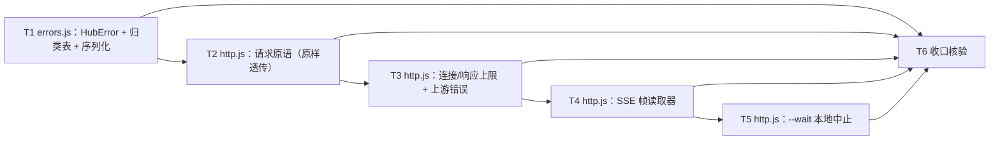

# pr-001-tasks.md — pr-001 内部任务图（SDK 错误契约 + Web 通道原语）

**迭代**: 0025-hub-sdk-and-skill ｜ **阶段**: 5（PR 实现）· 首波 ｜ **PR 文件**: `prs/pr-001-sdk-error-contract-and-web-channel.md`
**worktree**: 本 PR worktree（分支 `feat/0025-pr-001-sdk-error-contract-and-web-channel`；base = `4d162d7`，= 迭代分支 tip，落盘时零 diff）｜ **任务总数**: **6**（T1~T6）｜ **依赖图**: **无环**（见 §2）
**输入真源**: PR 文件（2 文件 / F02·F06·F07·F08·F09·F10·G01 七卡）+ `architecture.md` v1.0.0（§2.2 流 1 / 流 3、§4.1 N-4·N-8、§4.2 M-1、§4.3 Z-1~Z-7、§4.4 顺序约束 2~3、§5.2 规则 2~5、§5.3、§5.4、§6 T-04·T-08·T-09、§8 C6·C8、§9.1 P-1/P-3、§9.2 K5、§10 T2）+ `prd/{F02,F06,F07,F08,F09,F10,G01}*.md` + 代码库实读（§0.3 逐条带 `文件:行号`）

> **本 PR 无任何可执行入口**（`bin/hub.js` 在 pr-004；`sdk/index.js` / `surface.js` / `cli.js` 在 pr-003）⇒ **全部验收以模块级实测判定**（一次性脚本 import 两模块 + 起既有 `oamp web start` 子进程），**不新增测试文件**（测试面归 pr-006~pr-010；新增测试会破坏本 PR 的 diff 封闭判据）。

---

## 0. 范围、文件面与事实锚点

### 0.1 本 PR 文件范围（唯一可写面；2 文件，均为新建）

| # | 文件 | 动作 | 内容（任务归属） |
|---|---|---|---|
| 1 | `oamp/sdk/errors.js` | **新建**（~50 行，impl `N-8`） | `HubError`（`.code` / `.exitCode` / `.httpStatus` / `.upstream`）+ 四类退出码归类表（`0/1/2/3`，首条命中者生效）+ 错误对象序列化（**T1**） |
| 2 | `oamp/sdk/http.js` | **新建**（~180 行，impl `N-4`） | `node:http` 请求原语（method/path/query/body 原样）+ 连接 2000ms / 响应 5000ms 上限 + 上游错误对象原样 + SSE 帧读取器 + `--wait` 本地中止（**T2~T5**） |

> 本阶段产物 `prs/pr-001-tasks.md`（本文件）不计入改动面。

### 0.2 非目标（零改动 / 防夹带）

- **零改动清单**（PR 文件「文件范围」+ architecture §4.3 Z-1~Z-7）：`oamp/src/**`、`oamp/bin/**`、`oamp/package.json`、`oamp/API.md`、`oamp/llms.txt`、`oamp/web/**`、`oamp/test/**`（既有 32 个 `.test.js` + `helpers/` 2 文件）、`roles/**`、`.claude/skills/**`、`tools/**`。
- **不新增**：路由 / 端点 / 方法 / 配置键 / env 键 / 配置文件 / 第三方依赖 / 测试文件 / harness 文件 / 目录（除 `oamp/sdk/`）。
- **不实现**（属其他 PR）：`sdk/index.js` / `surface.js` / `cli.js` / `doctor.js`（pr-003、pr-004）、`bin/hub.js` + `package.json` 的 `bin.hub` 一行（pr-004）、`sdk/uds.js`（pr-002）、`skill/hub.md`（pr-005）、测试文件（pr-006~pr-010）。
- **不做跨端点语义**（W3 / F02 验收 2 / P-1）：不重建 `truncated` 正文、不做 roster 反查、不做分页续取、不做批量编排、不做自动重试 / 重连 / 心跳循环。
- **不做进程面**：argv 解析（`USAGE` 的**生产者**）、`--human` 渲染、进程退出码落点、`--wait` 的**接受面**与默认值 `1800000`（入口表 `L2-4`）——均归 pr-003 / pr-004。

### 0.3 读码事实锚点（2026-09-15 实读，base `4d162d7`；判据基础）

| # | 事实 | 位置 |
|---|---|---|
| **A1** | `oamp/package.json`：`bin` 仅 `oamp`；`dependencies` = `{}`；`engines.node >= 22`；`type: module`；`scripts.test` = `node --test test/*.test.js` —— 本 PR **零 diff**（`bin.hub` 一行归 pr-004） | `oamp/package.json` |
| **A2** | SSE 写出形态（唯一真源）：帧 = `` `event: ${type}\ndata: ${JSON.stringify(data)}\n\n` ``（`:88`）；订阅建立即写头 `200` + `content-type: text/event-stream; charset=utf-8` + `cache-control: no-store` + `connection: keep-alive`（`:46-50`）后**立即**写首帧 `retry: ${RETRY_MS=1000}\n\n`（`:12` / `:57`）；每 15s 写 `: keepalive\n\n`（`:11` / `:31`） | `oamp/src/transport.js` |
| **A3** | 连接建立上限先例 = **2000ms**：`DEFAULT_CONNECT_TIMEOUT_MS = 2000`（`:10`，`NodeClient` 构造默认值 `:21`） | `oamp/src/node-client.js` |
| **A4** | 同值先例第二处：`REQUEST_TIMEOUT_MS = 2000`（`:17`）、`CONNECT_TIMEOUT_MS = 2000`（`:18`，"连接防悬挂定时器"），用法 `:64` | `oamp/src/status.js` |
| **A5** | Web 侧错误与兜底面：`sendJson(res, status, body)`（`:107`）；`ERR_CODE.UPSTREAM_UNAVAILABLE`（`:121`）；`createApiRoutes(...)` 纯构造（`:475`，不读磁盘不起定时器）；`projectRoutes`（`:1384`，请求时投影）；路由兜底 `404` + `not found: <方法> <路径>`（`:1749`）；Router 不可达兜底 `502` + `router 不可达或请求失败: …`（`:1751`）；`DEFAULT_PORT = 7788`（`:46`）、端口链 `OAMP_WEB_PORT` → `--port`（`:1431-1437`）、非法端口退出 `2`（`:1439`）、就绪信号 `WEB_READY url=…`（`:1759`） | `oamp/src/web.js` |
| **A6** | 既有"起 web 子进程 + 随机端口 + 临时库"做法：`startWeb(socketPath, port, envExtra)` 定义 `:125`（`spawn(process.execPath, [BIN, 'web', 'start', '--port', String(port)])` 在 `:126`，`stdio: ['ignore','pipe','pipe']`）、等 `WEB_READY` `:137`、`pickPort()` `:118`、临时 `OAMP_DB` `:259-268`、SSE 手工解析（fetch + `reader.read()` + 缓冲切帧）`:153-178` | `oamp/test/web.test.js` |
| **A7** | `hygiene.test.js` 扫描面 = `bin/` + `src/` **平铺** `*.js` + `package.json`（`:26-39`）；凭据词断言 `:47`；零依赖断言 `:61-63`（读 `package.json` 的 `dependencies`）⇒ **`oamp/sdk/**` 不在凭据扫描面**，但零依赖断言覆盖 `package.json`（本 PR 零 diff ⇒ 仍绿） | `oamp/test/hygiene.test.js` |
| **A8** | `API.md` §3 = **21 条**清单（`:157`）；§2.1 成功响应 = **资源对象本身、不含 `code` 字段**（`:72-76`）；§2.2 统一错误契约 = **每一个 4xx/5xx 响应体形态完全一致** `{error, code}`，`code` 取封闭枚举 `INVALID_PARAM`(400) / `NOT_FOUND`(404) / `CONFLICT`(409) / `PAYLOAD_TOO_LARGE`(413) / `UPSTREAM_UNAVAILABLE`(502)（`:77-120`）；§1.1 端口链 `--port` > `OAMP_WEB_PORT` > `7788`（`:16`）；§1.2 SSE 帧格式 / 15s keepalive / `retry: 1000` 首帧 / 请求体上限 64 KiB（`:34-70`）；§4.3 不补发、不重放（`:1021`）；§5.13 `mode: "block"` **不设人为上限**、客户端中途断连**不终止**调用（`:1402`） | `oamp/API.md` |
| **A9** | 测试面计数：`oamp/test/*.test.js` = **32**；`oamp/test/helpers/` = 2 文件（`harness.js` / `fake-node.js`）——本 PR 零改动零新增 | 实测 |
| **A10** | `oamp/sdk/` 目录当前**不存在**（本 PR 新建）；worktree HEAD = `4d162d7`，`git diff --stat 4d162d7..HEAD` 为空 | 实测 |
| **A11** | 全仓 `src/**` 无任何 **HTTP 客户端**（唯一 `node:http` 使用点是 `web.js:30` 的**服务端** import）⇒ 本 PR 的客户端是新面，无既有实现可复用（对比：UDS 侧有 `src/rpc.js` 的 `RpcPeer` 可复用 = pr-002） | 实测 |
| **A12** | SSE 订阅"起流可观测"：服务端在 `writeHead(200)` 之后**立即**写 `retry` 首帧（A2）⇒ 客户端在订阅瞬间即收到响应头（5000ms 响应上限对 SSE 不构成障碍；"起流"判据 = 收到响应头且读取器不抛错） | A2 + A5 |

### 0.4 本 PR 内冻结契约（每个任务都必须遵守；跨 PR 接缝在此一次定死）

1. **`errors.js` 导出面**〔`[model_inferred]` MI-1〕：`HubError`（构造入参 = 单个对象 `{ code, error, exitCode, httpStatus = null, upstream = null }`，`instanceof Error`，`.message = error`）、`classify(observation)`（纯函数，实现 §5.4 四类归纳，首条命中者生效，返回 `{ code, exitCode }`）、`serializeError(err)`（→ `{code, error, exit_code}`，`.httpStatus !== null` 时附 `http_status`）。
2. **`http.js` 导出面**〔`[model_inferred]` MI-1〕：`request(spec)`（→ 成功时返回响应体**原对象**）、`stream(spec)`（→ 异步可迭代，逐帧产出 `{event, data}`）；`spec = { port, method, path, query, body, waitMs }`。
3. **端口不落本 PR**〔`[model_inferred]` MI-1〕：`http.js` 只接受**显式** `port`；**不读 `process.env`、不调 `loadConfig`、不实现 `OAMP_WEB_PORT` 缺省链**（该链的唯一落点 = `architecture §5.2` 的 `createHub()`，归 pr-003 / pr-004）。
4. **归类表行序即优先级**（`architecture §5.4`，逐字）：`2 用法错误`（本地 argv 解析失败，**未发出任何连接或请求**）→ `3 连接失败`（① 连接建立失败 `ECONNREFUSED`/`ENOENT`/`ECONNRESET`/`EPIPE` 或超 2000ms；② 非阻塞条目 5000ms 内未响应；③ 订阅被服务端异常终止；④ 收到 `UPSTREAM_UNAVAILABLE`(502)）→ `1 业务失败`（① 上游 4xx/5xx 且非 502；② `WAIT_TIMEOUT`；③ `CONFIG_ERROR`）→ `0 其余`（含订阅被下游管道截断）。
5. **层 C 不在本 PR 的表内**：`architecture §5.4` 的 `1` 类第 ④ 项（层 C 子进程退出码 `1` **透传、不重分类**）由 pr-003 的 `cli.js` 承担；`errors.js` 不出现子进程相关 import / 调用。
6. **错误对象字段名逐字**（`architecture §5.3`）：`{code, error, exit_code}`（+ 层 A 的 `http_status`）；**snake_case**；**不含 `stack`**（F08 验收 1"不输出堆栈"的构造面；实际写 stderr 归 pr-003）。
7. **三态上限语义不同、不混淆**（`§5.4` 要点 / F10 验收 5）：连接建立 `2000ms`（沿用 A3/A4 先例值）｜非阻塞条目响应 `5000ms`（`REQUEST_TIMEOUT` / `3`）｜可阻塞条目 `--wait <ms>`（`WAIT_TIMEOUT` / `1`）；**`--wait` 默认值 `1800000` 不在本 PR**（`L2-4`，归入口表）。
8. **原样透传 / 薄封装**（W3 / `§5.2` 规则 2 / F02 验收 2）：一条入口 = 恰好一次请求；method / path（**路径参数已由调用方替换**）/ query / body 原样下行；响应体 / 上游错误体**原样**上行；不加信封、不改字段名、不做默认值/裁剪/重排/续取。
9. **零状态**（F09 / `§8 C8`）：零本地写入、零模块级可变状态、每请求一连接且结束即关、无跨调用缓存 / 断点 / 重试队列。
10. **上层消费者约定**：pr-002（`uds.js` 构造 `HubError` + 用同一张归类表）与 pr-003（`surface.js` 调 `request` / `stream`、`cli.js` 用 `serializeError` 与 `exitCode`）**按本条冻结的导出面接入**；若下游另有既定命名，以主 agent 裁决为准（改动 = 两个导出名，见 §5 MI-1）。

---

## 1. 任务列表

### T1: `oamp/sdk/errors.js` —— `HubError` + 四类退出码归类表 + 错误对象序列化

- **验收标准**:
  1. **文件与依赖面**：`oamp/sdk/errors.js` 存在；import 集合 ⊆ `node:*`（可零 import）；`oamp/package.json` 零 diff（`dependencies` 仍 `{}`）。判据 = 文件头逐条核对 + `git diff --stat` 不含 `oamp/package.json`。
  2. **`HubError` 字段面**：实例携带 `.code`（非空 string）/ `.exitCode`（number）/ `.httpStatus`（number \| null）/ `.upstream`（object \| null）；`instanceof Error` 为真；`.message` 为人类可读文案（可直接充当错误对象的 `error` 字段）。判据 = 一次性脚本逐字段 `typeof` / 值断言（四字段各一例，含 `httpStatus`/`upstream` 为 `null` 与为非 `null` 两态）。
  3. **`exitCode` 恒 ∈ {1,2,3}**：归类表**全部失败行**产出的 `HubError.exitCode ∈ {1,2,3}`（恒不为 `0`）；成功行归类结果为 `0` 且**不产出** `HubError`（§5.2 规则 3 + 规则 5）。判据 = 表逐行驱动 `classify`，断言失败行的 exitCode 集合 ⊆ `{1,2,3}`、成功行 `exitCode === 0` 且无 `HubError`。
  4. **归类表逐行覆盖 `architecture §5.4`（首条命中者生效）**——九行，逐字对本表：

     | 序 | 观测（判定规则原文） | `code` | `exitCode` |
     |---|---|---|---|
     | 1 | 本地 argv 解析失败（未知层 / 未知子命令 / 缺必填位置或选项 / 位置参数多余 / 选项取值非法 / 给该条目不接受的选项）；**未发出任何连接或请求** | `USAGE` | `2` |
     | 2 | 连接建立失败：`ECONNREFUSED` / `ENOENT` / `ECONNRESET` / `EPIPE`，或连接建立超 **2000ms** | `HUB_UNREACHABLE` | `3` |
     | 3 | 非阻塞条目在 **5000ms** 内未收到响应 | `REQUEST_TIMEOUT` | `3` |
     | 4 | 已建立的订阅流被**服务端**异常终止 | `HUB_UNREACHABLE`〔MI-2〕 | `3` |
     | 5 | 收到 `UPSTREAM_UNAVAILABLE`（502） | `UPSTREAM_UNAVAILABLE` | `3` |
     | 6 | 上游 4xx/5xx 且**非**序 5 情形（`error` / `code` 原样透出） | 上游 `code` 原文 | `1` |
     | 7 | 可阻塞条目在 `--wait` 内未见终态（超时） | `WAIT_TIMEOUT` | `1` |
     | 8 | 本地配置错误（`loadConfig` 抛错） | `CONFIG_ERROR` | `1` |
     | 9 | 其余：层 A 2xx / 层 B 收到 `result` / 订阅被**下游管道截断**（stdout `EPIPE`，预期用法 B-3） | —（无错误对象） | `0` |

     判据 = 每行一次驱动并断言 `{code, exitCode}` 逐字；**序 5 必须先于序 6 命中**（同一观测量 502 时不得落 `1`）；**序 2 必须先于序 3**（连接建立超时归 `HUB_UNREACHABLE`，不是 `REQUEST_TIMEOUT`）。
  5. **层 C 行不在本表**：`errors.js` 不含"子进程退出码透传"判定（归 pr-003，§0.4 契约 5）。判据 = 文本检索（无 `node:child_process`、无 `spawn`）。
  6. **序列化形态**：`serializeError(err)` 产出 `{code, error, exit_code}`；`.httpStatus !== null` 时**附加** `http_status`（键序不限，键集合恰为 4 或 5 键）；`error` = 上游 `error` 原文（若 `upstream` 有）否则 `.message`；**键集合不含 `stack`**。判据 = 一次性脚本对两种 `HubError`（有 / 无 `httpStatus`）序列化后 `deepEqual` 键集合 + 断言无 `stack`。
  7. **零越界**：本任务 diff 只含 `oamp/sdk/errors.js`。
- **前置依赖**: 无
- **优先级**: P0
- **追溯**: PR 文件「文件范围」第 1 项 + 验收 1 / 2 / 5 / 6 / 9；architecture §5.2 规则 3 / §5.2 规则 5 / §5.3（stderr 单行 JSON）/ §5.4 全表（含要点"超时是单独一类"、"两条上限语义不同"、不可达文案）/ §6 **T-08** / §9.2 K5 / §8 C6；prd/F07 验收 1~5、F08 验收 1~2、F10 验收 3·5；事实 A5 / A8

### T2: `oamp/sdk/http.js` —— 请求原语：原样透传 + 每请求一连接 + 零本地写

- **验收标准**:
  1. **文件与依赖面**：`oamp/sdk/http.js` 存在；import ⊆ `node:*` + `./errors.js`（零第三方、**不 import `src/**`**）；`oamp/package.json` 零 diff。判据 = 文件头逐条核对 + `git diff --stat`。
  2. **method + path 原样**：调用给出的 method 与 path（**路径参数已由调用方替换**，本模块不做替换、不做拼装）原样成为请求行。判据 = 一次性脚本内起 `node:http` echo 服务（记录 `{method, url, headers, body}`），经本模块调用后比对记录值与调用入参逐字一致（`GET /api/agents` 与 `POST /api/chats/<chat_id>/close` 两形态）。
  3. **query 原样**〔MI-5〕：`query` 对象 → 查询串，**字段名与值不改写、不增删、不排序、不发明默认值**（`--flag` 名的机械推导归 pr-003 的入口表）；`undefined` / `null` 值的键不发出。判据 = echo 服务记录的 `url` 与入参 query 逐键往返一致（含 `{state:'online'}` 与空对象两态）。
  4. **body 原样**：对象 body → 原样序列化发送（**不改字段名、不裁剪、不补默认值**）并带 `content-type: application/json`（`API.md` §1.2）；无 body 的请求不带 `content-type`、不带非零 `content-length`。判据 = echo 服务记录的 `body` 与 `headers` 逐字核对（含"未声明的字段不被剔除"一例）。
  5. **成功返回原对象**：2xx ⇒ 返回响应体 JSON 解析后的**原对象**（不加信封、不改字段名；`API.md` §2.1"成功响应就是资源对象本身"）。判据 = echo 服务回嵌套对象 `{agents:[{instance_id:'demo-1',…}]}` ⇒ 返回值与该对象 `deepEqual`。
  6. **每请求一连接、结束即关**：不 keep-alive 复用、不共享 agent / socket（`agent: false` 或等价的 `connection: close`）；连续两次请求后无活动句柄残留。判据 = ① 一次性脚本**自然退出**（无 `process.exit()`、无 `setTimeout` 兜底）；② echo 服务的连接计数 = 请求次数；③ 并发两次调用两组响应各自正确、不串。
  7. **零本地写**：不含任何 `node:fs` 写 API（`writeFile` / `appendFile` / `mkdir` / `createWriteStream` / `rm`），不含 `.runtime` / `data/` 路径字面量，不新增 `oamp/.gitignore` 规则。判据 = 文本检索零命中 + diff 面。
  8. **零跨调用状态**：模块顶层无可变状态（无模块级 `let`、无缓存、无计数器、无单例 agent、无定时器）；每次调用新建连接。判据 = 文本核对 + 跨调用对象同一性断言（两次返回值不共享同一对象引用）。
  9. **端口与 env 边界**（§0.4 契约 3）：不出现 `process.env`、不 import `./../src/config.js`。判据 = 文本检索零命中。
  10. **零越界**：本任务 diff 只含 `oamp/sdk/http.js`。
- **前置依赖**: T1（`http.js` import `./errors.js` —— 模块边；本任务的成功路径不触错误分支，故断言面不重叠）
- **优先级**: P0
- **追溯**: PR 文件「文件范围」第 2 项 + 验收 3 / 4 / 11 / 12 前半；architecture §2.2 流 1（`method+path（:param 已替换）+ query/body 原样`）/ §4.1 **N-4** / §4.2 M-1（`bin.hub` 一行归 pr-004）/ §5.2 规则 2 / §5.2 规则 4 / §8 C8 / §9.2 K5；prd/F02 验收 2、F09 验收 1·3；事实 A1 / A5 / A8 / A11

### T3: `oamp/sdk/http.js` —— 失败路径：连接/响应上限 + 上游错误归类

- **验收标准**:
  1. **未监听端口 ⇒ `HUB_UNREACHABLE` / `3`**：`code === 'HUB_UNREACHABLE'`、`exitCode === 3`、`httpStatus === null`、`upstream === null`；`.message` 含目标地址（`127.0.0.1:<port>`）与"服务未运行"一类说明；**无堆栈**。判据 = 一次性脚本对未监听端口调用（`assert.rejects` + 逐字段断言）。
  2. **不挂起**：连接级失败在可感知短时间（≤ 3000ms）内结束、不永久等待；连接建立上限 = **2000ms**（与 A3 / A4 先例同值），超限同样归 `HUB_UNREACHABLE` / `3`。判据 = ① 未监听端口 ② 连接被黑洞（echo 服务不 `accept` 响应 / 或 `net` 层丢弃）两态计时；两态 exitCode 均 `3`。
  3. **非阻塞条目 5000ms 无响应 ⇒ `REQUEST_TIMEOUT` / `3`**：响应**头**未在 5000ms 内到达 ⇒ `code === 'REQUEST_TIMEOUT'`、`exitCode === 3`；文案明确表达"等待响应超时"且含 `5000`，与 T5 的 `WAIT_TIMEOUT` 文案**不同**。判据 = echo 服务在 6000ms 后才写头 ⇒ 断言 `{code, exitCode}` 与耗时 ∈ (5000, 6200)。
  4. **收到响应头即清除 5000ms 定时器**〔MI-3〕：长响应体（分块慢发、总时长 > 5000ms）不被判超时。判据 = echo 服务立即写头、随后每 1000ms 写一块共 3 块 ⇒ 正常拿到完整响应体。
  5. **上游 4xx/5xx（非 502）⇒ exitCode `1` 且原样**：`.code` = 上游 `code` 原文、`.httpStatus` = 实际状态码、`.upstream` = 上游错误体**原对象**（键集合 `{error, code}`，A8）、`.message` = 上游 `error` 原文。判据 = echo 服务回 `404 {error:'chat 不存在: chat-x', code:'NOT_FOUND'}` 与 `400 {error:'…', code:'INVALID_PARAM'}` 两态，逐字段断言。
  6. **502 `UPSTREAM_UNAVAILABLE` ⇒ exitCode `3`**（首条命中者生效的序 5 优先于序 6）：`.code === 'UPSTREAM_UNAVAILABLE'`、`.exitCode === 3`、`.httpStatus === 502`、`.upstream` 原样。判据 = echo 服务回 502 + 该 `code` ⇒ 断言**未**落 `1`；同时断言该例的 `upstream.code` 与 `.code` 同值而非被改写。
  7. **不重试 / 不重连**：任一失败路径的连接建立尝试**恰一次**，无退避、无第二次请求、无自动重连。判据 = echo 服务记录到的请求/连接计数 = 1（超时态亦然）。
  8. **上游体按 §2.2 契约处理**：只按"4xx/5xx 恒 `{error, code}`"（A8）解析，不实现契约外兜底形态。判据 = 断言面只覆盖契约内两态（不外扩）。
  9. **零越界**：本任务 diff 只含 `oamp/sdk/http.js`（与 T2 同文件 ⇒ 串行）。
- **前置依赖**: T1（`HubError` / 归类表）、T2（同一文件的请求管线；串行）
- **优先级**: P0
- **追溯**: PR 文件「文件范围」第 2 项 + 验收 5 / 6 / 7；architecture §2.2 流 1（`4xx/5xx → 归类`、`连接级错误 → exit 3`）/ §5.2 规则 3 / §5.3（错误对象）/ §5.4（`3` 类 ①②④ 与 `1` 类 ①）/ §6 T-08 / §9.2 K5；prd/F02 验收 3、F07 验收 2、F08 验收 1·2·3·4；事实 A2 / A3 / A4 / A5 / A8

### T4: `oamp/sdk/http.js` —— SSE 帧读取器

- **验收标准**:
  1. **按空行切帧**：以空行（`\n\n`）为帧界；**跨 chunk 半帧**正确缓存（帧在任意位置被切断都能拼回）。判据 = 自建 SSE 服务（`node:http`）把一帧**逐字节**慢发 ⇒ 仍得到 1 条完整条目。
  2. **取 `event:` / `data:`**：`event:` 行 = 事件名原文；`data:` 行 = JSON 载荷（服务端恒单行写出 `JSON.stringify`，A2）；产出形态 `{event, data}`，`data` = **JSON 解析值**（非字符串包裹）。判据 = 自建服务发 `event: x\ndata: {"a":1}\n\n` ⇒ 条目 `deepEqual({event:'x', data:{a:1}})`。
  3. **忽略项逐条**：`:` 开头的注释行（15s keepalive，A2）**不产出条目**；`retry:` 帧（订阅首帧 `retry: 1000`，A2）**不产出条目**——订阅后第一条产出不得是它。判据 = 自建服务先发 `retry: 1000\n\n` + `: keepalive\n\n` 再发 1 条真帧 ⇒ 迭代器只产出 1 条且为真帧。
  4. **真实服务起流**：订阅 `GET /api/events`（`API.md` §3 第 10 条）⇒ 响应头到达即建立流（A12）、**不因"暂无事件"报错或退出**：静置 > 5000ms 不抛错、零条目、连接保持。判据 = 一次性脚本订阅真实服务后静置并断言三态。
  5. **真实服务逐帧产出**〔见 §5 登记 ⑤〕：任选其一并在报告中写明——① 用既有 `src/rpc.js` 的 `RpcPeer`（**只读复用**，不修改该文件）连 `oamp router start` 的 socket 发 `agent.register` ⇒ web 的 2s 拓扑轮询随后在 `/api/events` 推 `agent_online`；② 以自建 SSE 服务的帧产出为判据（真实服务侧"有事件时逐帧产出"的固化归 pr-007 的 `sdk-api.test.js`，`architecture §10 T2`）。判据 = 条目 `{event, data}` 且 `data` 为该事件的原始载荷（逐字对照 `API.md` §4.2 的 `data` 字段表）。
  6. **服务端异常终止 ⇒ `3`**：连接在**消费者未主动停止**时被服务端结束 ⇒ 抛 `HubError{code:'HUB_UNREACHABLE', exitCode:3}`（`§5.4` 序 ③；`code` 取值见 §5 **MI-2**）。判据 = 自建服务发 1 帧后 `res.destroy()` / `end()` ⇒ 迭代该流时 reject 该错。
  7. **消费者主动停止 ⇒ 正常收尾**：`break`（触发 `return()`）后连接关闭、**不抛错**、无残留句柄（脚本自然退出）。此条是 `§5.4`"订阅被下游管道截断 ⇒ `0`"在 pr-003 侧可实现的接缝（stdout `EPIPE` 的进程级处置归 pr-003）。判据 = `for await … { break }` 后断言零异常 + 进程自然退出。
  8. **不加工 / 不重连 / 不补发**：不做聚合、去重、进度换算、自动重连、断点续订；帧 `data` 原样下行（C-1 / N9 / G02 验收 3）。判据 = 文本检索（无重连/重试逻辑）+ 条目内容与帧逐字一致。
  9. **零本地写 / 每流一连接**：不写任何文件；一条流一次连接、结束即关（同 T2 验收 6·7 的判据口径）。判据 = 文本检索 + 句柄自退。
  10. **零越界**：本任务 diff 只含 `oamp/sdk/http.js`（同文件串行）。
- **前置依赖**: T2（同一文件的连接与读取管线）、T3（同文件串行）
- **优先级**: P0
- **追溯**: PR 文件「文件范围」第 2 项 + 验收 8；architecture §2.2 流 3（逐帧解析 → NDJSON 形态；`EPIPE` → 0；服务端断开 → 3）/ §4.1 **N-4** / §5.3（NDJSON 行形态与忽略项）/ §5.4（`3` 类 ③ 与 `0` 类"下游截断"）/ §6 **T-04** / §9.2 K5；prd/F06 验收 1·2·3·4、F07 验收 4、F09 验收 1·4、G01 验收 1；事实 A2 / A6 / A8 / A12

### T5: `oamp/sdk/http.js` —— `--wait` 本地中止（`WAIT_TIMEOUT`）

- **验收标准**:
  1. **上限生效**：调用方显式给出等待上限（`spec.waitMs`）⇒ 到达上限即**本地中止**在途请求（销毁该请求，不等待服务端）并抛 `HubError{code:'WAIT_TIMEOUT', exitCode:1}`。判据 = echo 服务延迟 > 上限 ⇒ 断言 `{code, exitCode}` + 耗时 ∈ (上限, 上限 + 200ms)。
  2. **文案形态**（`architecture` F10 落定逐字）：`.message` 形如 `等待超时（<ms>ms）：调用仍在进行` —— 含上限值与该事实；**无堆栈**。判据 = 断言 message 含 `<ms>ms` 与"仍在进行"两处。
  3. **上限内返回终态 ⇒ 正常返回**：延迟 < 上限 ⇒ 返回响应体原对象（不抛错、不中止）。判据 = 两态并列（小上限先返回 / 大上限后返回 —— F10 验收 1 的裸判据）。
  4. **中止只结束本次等待**（P-1 口径）：**不发第二个请求**（不重发、不轮询、不反查 roster）；SDK **不**为 block 路径代做调用标识反查。判据 = ① 服务端观察到恰好 1 次请求；② 本次调用结束后到脚本结束期间服务端零新增请求；③ 文本检索：本模块不含 `/api/calls` 字面量与 `roster` / `truncated` 相关逻辑。
  5. **服务端不受影响**：客户端中止不产生第二个连接 / 请求，且服务端进程在中止后仍可正常响应（`API.md` §5.13 的"客户端断连不终止调用"是既有服务端契约，不在本 PR 重复证）。判据 = 中止后对同一 echo 服务再发一次请求成功返回。
  6. **与 5000ms 不混淆**（F10 验收 5 / `§5.4` 要点）：未给 `waitMs` ⇒ 走 T3 的 `REQUEST_TIMEOUT` / `3`（**不是** `WAIT_TIMEOUT` / `1`）；两类 `code` / `exitCode` / 文案三者皆不同。判据 = 两态并列断言表。
  7. **默认值不在本模块**（`L2-4`）：`http.js` 不内置 `1800000`；`grep -n "1800000" oamp/sdk/http.js` 零命中。判据 = 文本检索。
  8. **零越界**：本任务 diff 只含 `oamp/sdk/http.js`（同文件串行）。
- **前置依赖**: T1（`WAIT_TIMEOUT` 归类行）、T3（同一上传的失败路径）、T4（同文件串行）
- **优先级**: P0
- **追溯**: PR 文件「文件范围」第 2 项 + 验收 9；architecture §2.2 流 1 / §5.2 规则 3 / §5.4（`1` 类 ② 与要点"超时是单独一类"）/ §6 **T-08** / §9.1 **P-1**；prd/F10 验收 1·2·3·4·5、F09 验收 2；事实 A5 / A8（§5.13）

### T6: 收口核验（模块级实测 / 改动面封闭 / 契约面自检）

- **验收标准**:
  1. **模块级实测（PR 验收第 4 条逐字）**：起既有 `oamp web start`（随机端口 + 临时 `OAMP_DB`，做法沿用 `oamp/test/web.test.js:125` 的 `startWeb`）后经 `sdk/http.js` 调 `GET /api/agents`（`API.md` §3 第 1 条），返回体与 `node:http` 直连结果**逐字段一致**（`deepEqual`）；另对照 `GET /api/agents?state=online`（query 透传面）。判据 = 一次性脚本输出两份结果 + `deepEqual` 通过。
  2. **失败面复跑与无残留（F08 验收 5）**：未监听端口 ⇒ `HUB_UNREACHABLE` / `3` 且 ≤ 3000ms 结束；停服 → 失败（`3`）→ 重启服务 → 重跑**同一请求成功**（无需清理任何本地状态）。判据 = 三段脚本化实测。
  3. **SSE 实测**：订阅真实服务 `GET /api/events` 起流（响应头到达、`retry` 首帧被忽略、静置 > 5s 不抛错、零条目）；**帧产出**按 T4 验收 5 的两条路径择一执行并在报告中写明采用者。判据 = 产出条目 `{event, data}` 且 `data` 与 `API.md` §4.2 事件表逐字可对照（真服务路径）或与自建帧逐字一致（自建路径）。
  4. **改动面封闭**：`git -C <本 PR worktree> diff --stat 4d162d7..HEAD` 的源码面**只含** `oamp/sdk/errors.js` + `oamp/sdk/http.js`（本阶段产物 `prs/pr-001-tasks.md` 不计入）；零命中 `oamp/src/**` / `oamp/bin/**` / `oamp/package.json` / `oamp/API.md` / `oamp/llms.txt` / `oamp/web/**` / `oamp/test/**` / `roles/**` / `.claude/skills/**` / `tools/**`（G01 验收 1·2·4·5 + PR 验收 13）；`oamp/test/*.test.js` 仍 **32** 个、`oamp/test/helpers/` 仍 2 文件（零新增零改动）；`git status --porcelain` 为空。判据 = diff 逐条核对。
  5. **零新增依赖**：`oamp/package.json` diff 为空（`dependencies` 仍 `{}`）；两文件的 `import` 只命中 `node:*` 与 `./errors.js`。判据 = 检索 + diff（F01 验收 5 / C1）。
  6. **无跨端点组合 / 无跨调用状态**：两文件不含 roster 反查、`truncated` 重建、分页续取、批量编排、自动重试 / 重连 / 心跳循环；无模块级可变状态、零文件写。判据 = 文本检索（`/api/calls` 字面量、`truncated`、`writeFile|appendFile|createWriteStream|mkdir`、模块级 `let` 逐项零命中）。
  7. **错误面可区分且无堆栈**（F08 验收 1 / F10 验收 5）：`HUB_UNREACHABLE` / `REQUEST_TIMEOUT` / `WAIT_TIMEOUT` 三类文案各含可辨识事实且**互不相同**；三类序列化对象键集合均不含 `stack`。判据 = 三态并列断言表。
  8. **提交卫生**：未使用 `--no-verify`（`git log --format=%B` 无绕过痕迹，提交钩子全过）。
- **前置依赖**: T1、T2、T3、T4、T5（全部）
- **优先级**: P0
- **追溯**: PR 文件「验收标准」全部 13 条的收口面（重点第 4 条逐字 + 第 10~13 条）；architecture §4.3 Z-1~Z-7（零改动清单）/ §8 C6·C8·C9·C10 / §9.1 P-1·P-3 / §10 T2；prd/F02 验收 2、F07 验收 4·5、F08 验收 1~5、F09 验收 1~4、G01 验收 1·2·3·4·5；事实 A1 / A6 / A7 / A9 / A10 / A12

---

## 2. 依赖图（无环）

- **拓扑序（合法执行序）**：`T1 → T2 → T3 → T4 → T5 → T6`（单链）。
- **最长依赖链**：`T1 → T2 → T3 → T4 → T5 → T6`（5 跳）。
- **关键路径任务**：**T3、T4、T5**（T6 的三条硬前置全在其后；T1 / T2 是链首，前移即整体前移）。
- **无环**：全部边单向递增，无回边、无自环。
- **本 PR 不可并发的原因（诚实登记）**：两条边类型决定了链式依赖 —— ① **模块边**：`http.js` import `./errors.js`（T1 → T2），故 T1 与 T2 不可真正并行验收；② **同文件串行**：`http.js` 的四个面（请求原语 / 失败归类 / SSE / `--wait`）在**同一文件**（T2 → T3 → T4 → T5），并发写同一文件不保证合并。本 PR 的并发价值由**第一波 PR 级并发**（pr-001 ‖ pr-005）承担，不在 PR 内部。

---

## 3. 与 pr-001 验收标准逐条对位表

| PR 验收 # | 验收摘要 | 承接任务 | 对位说明 |
|---|---|---|---|
| 1 | `errors.js` 导出 `HubError`，四字段齐备，`exitCode` 恒 ∈ {1,2,3}（F07 验收 4） | **T1**（验收 2、3） | 字段面与值域面分两条判据；值域按归类表全行枚举判定 |
| 2 | 归类表逐条覆盖 §5.4 四类（首条命中者生效） | **T1**（验收 4、5）；产生点 = **T3**（序 2·3·5·6）、**T4**（序 4）、**T5**（序 7）、T6（序 9 的下游截断面） | 表覆盖判在 T1；每行的**实际产生**判在对应通道任务 |
| 3 | `http.js` 用 `node:http` 发请求，method/path/query/body 原样，成功返回原对象 | **T2**（验收 1~5） | 原样性用 echo 服务的记录值往返比对 |
| 4 | 模块级实测：`oamp web start`（随机端口 + 临时库）后 `GET /api/agents` 与直连逐字段一致 | **T6**（验收 1）；前置口径 = **T2**（验收 5） | 真服务一致性在收口跑；T2 用 echo 服务做原样性判据 |
| 5 | 上游 4xx/5xx ⇒ `HubError`（`code` 原文 / `httpStatus` / `upstream` 原样） | **T3**（验收 5、6） | 502 与非 502 两态分列，含"序 5 优先于序 6" |
| 6 | 连接级失败 ⇒ `HUB_UNREACHABLE` / `3`；超 2000ms 归 `3`；不挂起 | **T3**（验收 1、2） | 两态计时 + 值域断言 |
| 7 | 非阻塞条目 5000ms 无响应 ⇒ `REQUEST_TIMEOUT` / `3` | **T3**（验收 3、4） | 含"响应头到达即清除"的达成面（否则长体误判） |
| 8 | SSE 读取器：切帧 / `event:`·`data:` / 忽略注释与 `retry:` / 真服务起流逐帧产出 | **T4**（验收 1~5） | 自建服务的机械判据 + 真服务起流；帧产出二选一路径见登记 ⑤ |
| 9 | `--wait` 到上限本地中止并抛 `WAIT_TIMEOUT` / `1`，服务端调用不因此终止 | **T5**（验收 1~5） | 中止的本地性用"恰好一次请求"判；服务端语义以既有契约为前提 |
| 10 | 一层一次请求（无跨端点组合逻辑） | **T6**（验收 6）+ **T2/T3/T4** 的边界约束（T5 验收 4） | 收口做文本级机械核验 |
| 11 | 无跨调用状态：每请求建连、结束即关；不写任何本地文件 | **T2**（验收 6~8）+ **T4**（验收 9）+ **T6**（验收 6） | 每任务自判 + 收口复核 |
| 12 | 零新增依赖（仅 `node:` 内置模块） | **T1**（验收 1）+ **T2**（验收 1）+ **T6**（验收 5） | `package.json` 零 diff + import 面检索 |
| 13 | diff 不含 `oamp/src/**` / `API.md` / `llms.txt` / `web/**`，不新增路由 | **T6**（验收 4） | 逐目录命中核对 + 测试面计数不变 |

**覆盖检查**：PR 文件 13 条验收 → 全部有任务承接，无遗漏；T1~T6 每条均可追溯到 PR 文件 / architecture / prd 的具名条目（见 §6）；**无任务超出 PR 文件范围**（不含 `surface.js` / `cli.js` / `bin/hub.js` / `uds.js` / doctor / skill / 测试文件）。

---

## 4. 关键实现约束（判据口径，供实现者遵守）

1. **两文件与既有模块零耦合**：`sdk/errors.js` / `sdk/http.js` **不 import `oamp/src/**`**（UDS 侧的复用面 —— `src/rpc.js` / `src/config.js` —— 属 pr-002 的 `uds.js`）。一次性验证脚本可只读复用 `src/rpc.js`（不修改）。
2. **原样透传是硬口径**：不加信封、不改字段名、不裁剪未声明字段、不补默认值、不做 `truncated` 重建 / 分页续取 / 批量编排。
3. **三条上限语义互斥**（§0.4 契约 7）：连接 `2000ms`（→ `HUB_UNREACHABLE` / 3）｜响应头 `5000ms`（→ `REQUEST_TIMEOUT` / 3）｜`--wait <ms>` 显式（→ `WAIT_TIMEOUT` / 1）；`--wait` 默认值 `1800000` **不在本 PR**。
4. **归类表首条命中者生效**：行序即优先级（502 先于其余 4xx/5xx；连接建立超时先于响应超时）；不得出现"同一成因在不同调用下落不同码"。
5. **零状态**：零本地写入、零模块级可变状态、每请求一连接且结束即关、无重试 / 重连 / 队列 / 缓存。
6. **错误对象字段名逐字**：`code` / `error` / `exit_code`（+ `http_status`）；含 `stack` 即失败。
7. **验收方式不入库**：全部判据用一次性脚本 / 一次性 `node:http` 服务（`node --input-type=module -e …` 或 `/tmp` 下的临时 `.mjs`），**不得**在 `oamp/test/**` 新增或修改任何文件（否则破坏 T6 验收 4 的改动面封闭判据）。
8. **新目录的卫生面**：`oamp/sdk/**` 不在 `hygiene.test.js` 的凭据词扫描面内（A7），但零依赖断言仍读 `package.json` ⇒ 本 PR 保持其零 diff 即不破坏该断言。
9. **不引入架构外决策**：不新增 env 键 / 配置文件 / 目录（除 `oamp/sdk/`）/ 第三方依赖 / 路由；不实现 `USAGE` 与 `CONFIG_ERROR` 的**生产者**（表行覆盖即可，见 §5 MI-6）。

---

## 5. 边界与疑问（提请主 agent）

**`[model_inferred]` 清单（需主 agent 确认；未确认前不作为生效契约）**

1. **MI-1 · 两模块的导出面（函数名与签名）**：`architecture §4.1 N-4` 只给**内容清单**（"`node:http` 客户端（method/path/query/body 原样）+ SSE 读取器（逐帧 → `{event, data}`）+ 连接/响应上限"），`§5.2` 钉的是**库入口** `createHub()` 的层命名空间，**未给 `http.js` / `errors.js` 的函数名与签名**；而 pr-002（`uds.js` 用 `HubError` 与同一张归类表）与 pr-003（`surface.js` 调 `http.js` 的请求与 SSE 读取函数、`cli.js` 用错误对象序列化与 `exitCode`）是**跨 PR 消费者**。本任务图按最小需要冻结（§0.4 契约 1·2·3）：`HubError` / `classify` / `serializeError` 与 `request(spec)` / `stream(spec)`（`spec = {port, method, path, query, body, waitMs}`）。**请确认，并转达 pr-003 的 planner（其任务图尚未落盘；若有既定命名，本 PR 改为下游口径，改动 = 两个导出名）**。
2. **MI-2 ·"订阅被服务端异常终止"的 `code`**：`§5.4` 的 `3` 类只钉 exitCode 与三个候选 `code`（`HUB_UNREACHABLE` / `REQUEST_TIMEOUT` / `UPSTREAM_UNAVAILABLE`），**未逐项指派** ③ 项。本任务图取 `HUB_UNREACHABLE`（语义唯一匹配者）。若 pr-009 的契约用例另有口径，请裁决（改动点 = 归类表一行）。
3. **MI-3 · 5000ms 上限覆盖到哪一步**：`§5.4` 原文 = "非阻塞条目在 5000ms 内未收到响应"。本任务图取"覆盖到**响应头**到达为止，收到头即清除定时器"（T3 验收 4）——依据：SSE 与 `block` 形态都会立即写响应头（A2 / A5），若覆盖到**响应体结束**则长响应体与 SSE 长流会被误判超时。若主 agent 另有口径（如覆盖到 body 首字节），改动点 = 一个清除位。
4. **MI-4 · `waitMs` 的归属层**：`F10` 落定为"本地中止（`req.destroy()`）"，`L2-4` 把 `--wait` 的**接受面**限定在 `api calls create`（入口表 = pr-003）并把默认值 `1800000` 归入口层。本任务图把"到上限即中止并抛 `WAIT_TIMEOUT`"实现在 `http.js`（`spec.waitMs`），默认值**不下沉**到本 PR。若要求默认值下沉，请裁决。
5. **MI-5 · `query` 的序列化细节**：架构只钉"query 原样"，**未给**序列化实现与边界（数组 / 对象字段的编码形态由 `API.md` 各接口入参决定，`--flag` 名的机械推导归 `surface.js`）。本任务图只钉"调用方给出的键值原样进查询串、不改名、不增删、不发明默认值、`undefined`/`null` 键不发出"（T2 验收 3）。
6. **MI-6 · `USAGE`（2）与 `CONFIG_ERROR`（1）的生产者不在本 PR**：PR 验收要求归类表**覆盖**这两行，而 argv 解析归 pr-003（`cli.js`）、`loadConfig` 调用归 pr-003 / pr-004（`index.js`）。本任务图把"表行覆盖 + 可由观测归类"判在 T1，**不**在本 PR 实现那两个生产者。

**登记（非缺口 / 非本 PR 判据面）**

① **进程级退出码与渲染不在本 PR**：`exit 0/1/2/3`、`--human`、stderr 写出分别归 pr-003（`cli.js`）与 pr-004（`bin/hub.js`）；本 PR 只交付 `exitCode` 值与错误对象构造（库面等价物，`§5.2` 规则 5）。
② **21 条对照清单（F02 验收 1）不在本 PR**：子命令拼写与入口表归 pr-003，机械双向比对归 pr-006（`sdk-surface.test.js`，`architecture §10 T1`）。本 PR 只交付"一次调用 = 一次请求"的原语。
③ **P-1 口径的下游承载**：`--mode background` 持 `call_id` 的取值路径（skill 序列 1）归 pr-005 / pr-003；本 PR 的中止**只**保证"本地等待结束、不代做 roster 反查"（T5 验收 4）。
④ **P-3 口径不在本 PR**：本地校验范围（"只校验构造请求所必需的部分"）属入口表的 argv 解析，归 pr-003；本 PR 不实现任何参数校验。
⑤ **T4 验收 5 / T6 验收 3 的验收手段二选一**（`src/rpc.js` 触发 `agent_online` ‖ 自建 SSE 服务 + 真服务仅验起流）属**手段选择**，不改变契约；采用者须在阶段 6 验证报告中写明，且真实服务侧"有事件时逐帧产出"的固化归 pr-007（`architecture §10 T2`，本 PR 的传递依赖）。
⑥ **PR 文件引用的 `oamp/test/web.test.js:126`** 实为 `startWeb` 的 `spawn` 行；函数定义在 `:125` —— 与 PR 文件同指一处，无偏差需上报。

---

## 6. 追溯总表（任务 → 输入）

| 任务 | PR 文件追溯 | architecture 追溯 | prd 追溯 | 既有代码事实 |
|---|---|---|---|---|
| T1 | 文件范围 1；验收 1 / 2 / 5 / 6 / 9 | §5.2 规则 3·5、§5.3、§5.4 全表、§6 T-08、§8 C6、§9.2 K5 | F07 验收 1~5；F08 验收 2；F10 验收 3·5 | A5、A8 |
| T2 | 文件范围 2；验收 3 / 4 / 11 / 12（前半） | §2.2 流 1、§4.1 N-4、§4.2 M-1、§5.2 规则 2·4、§8 C8、§9.2 K5 | F02 验收 2；F09 验收 1·3 | A1、A5、A8、A11 |
| T3 | 文件范围 2；验收 5 / 6 / 7 | §2.2 流 1、§5.2 规则 3、§5.3、§5.4（3 类 ①②④ / 1 类 ①）、§6 T-08 | F02 验收 3；F07 验收 2；F08 验收 1~4 | A2、A3、A4、A5、A8 |
| T4 | 文件范围 2；验收 8 | §2.2 流 3、§4.1 N-4、§5.3、§5.4（3 类 ③ / 0 类）、§6 T-04 | F06 验收 1~4；F07 验收 4；F09 验收 1·4；G01 验收 1 | A2、A6、A8、A12 |
| T5 | 文件范围 2；验收 9 | §2.2 流 1、§5.2 规则 3、§5.4（1 类 ② + 要点）、§6 T-08、§9.1 P-1 | F10 验收 1~5；F09 验收 2 | A5、A8（§5.13） |
| T6 | 验收 4 逐字 + 10 / 11 / 12 / 13 的收口面 | §4.3 Z-1~Z-7、§8 C6·C8·C9·C10、§9.1 P-1·P-3、§10 T2 | F02 验收 2；F07 验收 4·5；F08 验收 1~5；F09 验收 1~4；G01 验收 1~5 | A1、A6、A7、A9、A10、A12 |
