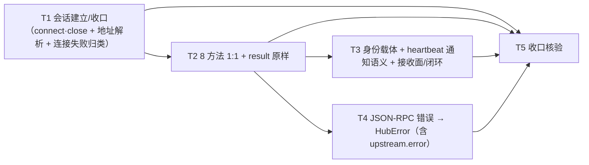

# pr-002-tasks.md — pr-002 内部任务图（Router UDS 通道 / `oamp/sdk/uds.js`）

**迭代**: 0025-hub-sdk-and-skill ｜ **阶段**: 5（PR 实现）· 第二波 ｜ **PR 文件**: `prs/pr-002-sdk-router-uds-channel.md`
**worktree**: 本 PR worktree（分支 `feat/0025-pr-002-sdk-router-uds-channel`；base = `4be4661`，= 迭代分支 tip，落盘时零 diff）｜ **任务总数**: **5**（T1~T5）｜ **依赖图**: **无环**（见 §2）
**输入真源**: PR 文件（1 文件 / F03·F08·F09·G01·G02 五卡）+ `architecture.md` v1.0.0（§2.1 组件图 `UDS --> RP` / `UDS --> CF`、§2.2 流 2、§2.3、§4.1 **N-5**、§4.4 顺序约束 3、§5.1 层 B 全表、§5.2 规则 2~5、§5.4、§7 F03 行、§8 C8、§10 T3）+ `prd/{F03,F08,F09,G01,G02}*.md` + **已合并的 pr-001 产物**（`oamp/sdk/errors.js` / `oamp/sdk/http.js`）+ 代码库实读（§0.3 逐条带 `文件:行号`）

> **本 PR 无任何可执行入口**（`bin/hub.js` 在 pr-004；`sdk/index.js` / `surface.js` / `cli.js` / `doctor.js` 在 pr-003）⇒ **全部验收以模块级实测判定**（一次性脚本 import `oamp/sdk/uds.js` + 复用既有 `oamp router start` 子进程），**不新增测试文件**（测试面归 pr-008；新增测试会破坏本 PR 的 diff 封闭判据）。
> **交付物**: `docs/iterations/0025-hub-sdk-and-skill/prs/pr-002-tasks.md`（本文件，阶段产物，不计入 PR 改动面）。

---

## 0. 范围、文件面与事实锚点

### 0.1 本 PR 文件范围（唯一可写面；1 文件，新建）

| # | 文件 | 动作 | 内容（任务归属） |
|---|---|---|---|
| 1 | `oamp/sdk/uds.js` | **新建**（~120 行，impl `N-5`） | UDS 会话：`connect()` → 8 个方法 1:1 + `close()`；帧编解码复用既有 `src/rpc.js` 的 `RpcPeer`、地址复用既有 `src/config.js` 的 `loadConfig(env).socketPath`；失败统一构造 `HubError`（`ENOENT` → `3`、`data.code` → `1`）（**T1~T4**） |

### 0.2 非目标（零改动 / 防夹带）

- **零改动清单**（PR 文件验收 10 + architecture §4.3 Z-1~Z-7）：`oamp/src/**`、`oamp/bin/**`、`oamp/package.json`、`oamp/API.md`、`oamp/llms.txt`、`oamp/web/**`、`oamp/test/**`（既有 32 个 `.test.js` + `helpers/` 2 文件）、`roles/**`、`.claude/skills/**`、`tools/**`；**`oamp/sdk/errors.js` 与 `oamp/sdk/http.js` 是 pr-001 已合并产物，本 PR 只消费不修改**。
- **不新增**：路由 / 端点 / 方法 / 配置键 / env 键 / 配置文件 / 第三方依赖 / 测试文件 / 目录。
- **不实现**（属其他 PR）：`sdk/index.js` / `surface.js` / `cli.js` / `doctor.js`（pr-003）、`bin/hub.js` + `package.json` 的 `bin.hub` 一行（pr-004）、`skill/hub.md`（pr-005）、测试文件（pr-006~pr-010）。
- **不做跨端点语义 / 无编排**（W3 / F02 验收 2 / N5）：不代做 `--as` 身份括号的 argv 解析（pr-003）、不做 roster 反查、不做批量编排。
- **不做自动性**（L2-9 / G02 验收 3）：无自动心跳循环、无自动重连、无自动重试、无失败自动重派。
- **不做进程面**：argv 解析（`USAGE` 的**生产者**）、`--human` 渲染、进程退出码落点、`--params` / `--as` 的接受面——均归 pr-003 / pr-004。

### 0.3 读码事实锚点（2026-09-15 实读，base `4be4661`；判据基础）

| # | 事实 | 位置 |
|---|---|---|
| **A1** | `RpcPeer(socket, { onRequest = null, idPrefix = 'rpc' })`（`:57` 类 / 构造）：`request(method, params, {timeoutMs = 0})` → `Promise<result>`（`:221`）；`notify(method, params)`（`:243`，发无 `id` 的帧、**不建 pending**）；`_onClose()`（`:247`）；`close()`（`:257`，= `_onClose()` + `socket.destroy()`，`_closed` 后幂等 return）；**不传 `onRequest` 时对服务端反向请求回 `-32601`**（`:147-153`） | `oamp/src/rpc.js` |
| **A2** | `RpcError extends Error`，字段 = `.code`（数值 JSON-RPC 码）+ `.dataCode`（`error.data.code` 机器码）（`:33-39`）；码表 `JSONRPC_CODE`（`:23-29`，`METHOD_NOT_FOUND = -32601` / `APP_ERROR = -32000` / `PARSE_ERROR = -32700` / `INVALID_PARAMS = -32602`）；机器码 `ERR`（`:8-20`，含 `UNREGISTERED` / `AGENT_OFFLINE` / `AGENT_NOT_FOUND` / `STALE_SESSION` / `INVALID_MESSAGE` / `INVALID_PARAMS` / `LIMIT_EXCEEDED`） | `oamp/src/rpc.js` |
| **A3** | 连接断开 ⇒ `_onClose()` 把所有 pending reject 为 `RpcError('connection closed', -32000, 'AGENT_OFFLINE')`；`request` 超时 ⇒ reject `RpcError('request timeout (<method>)', -32000, 'REQUEST_TIMEOUT')`（`:221-245`） | `oamp/src/rpc.js` |
| **A4** | Router `dispatch`（`:104`）8 个分支与返回值：`agent.register`（`:109-160`）→ `respond.ok({instance_id, session_id, state, lease_timeout_ms, last_heartbeat, lease_follows_interval})`；**`agent.heartbeat`（`:161-185`）→ 无任何 respond（通知语义，带 `id` 的请求也不回）**；`agent.deregister`（`:186-199`）→ `respond.ok({removed:true})`；`message.send`（`:201-346`）→ `respond.ok({accepted:true, message_id, status, [task_id]})`；`message.ack`（`:348-377`）→ `respond.ok({acked:true, status})`；`router.status`（`:379-382`）→ `respond.ok({nodes})`；`router.task_get`（`:384-393`）→ `respond.ok({task})`；`router.task_list`（`:395-404`）→ `respond.ok({tasks})`；`default`（`:406-408`）→ `-32601 method not found: <method>` | `oamp/src/router.js` |
| **A5** | 身份来源事实：`identityOf(connId)`（registry `:52`）——**`message.send` 的身份取自连接**；`registry.heartbeat({instanceId, sessionId, …})`（`:84-92`）要求 `entry.session_id === sessionId` 否则**静默返回 false**；`registry.deregister`（`:96-105`）→ 无条目 `AGENT_NOT_FOUND` / session 不匹配 `STALE_SESSION`；`resolvePendingAck({messageId, instanceId, sessionId, status})`（`:179-187`）→ `pend.toInstance !== instanceId || pend.toSession !== sessionId` ⇒ `STALE_SESSION`。⇒ **heartbeat / ack / deregister 的身份取自 params，不是连接** | `oamp/src/registry.js` |
| **A6** | **既有先例 `NodeClient`（本 PR 的身份合成与传输应答的照做样本）**：`register(instanceId)`（`:145-151`）→ request `{instance_id}`，随后**持有** `result.instance_id` / `result.session_id`；心跳 = `peer.notify('agent.heartbeat', {instance_id, session_id, next_interval_ms})`（`:174-178`）；`deregister()` → request `{instance_id, session_id}`；`ack(messageId,{status})`（`:223-238`）→ request `{message_id, instance_id, session_id, status, received_at}`；`send(toInstanceId, message)` → request `{message:{…, to}}`；`DEFAULT_CONNECT_TIMEOUT_MS = 2000`（`:10`）；**`message.deliver` 的传输应答 = `respond.ok({received:true, message_id})`，随后自动 `ack(accepted)`**（`:85-124`）；**`startHeartbeat` 是自动定时器链（`:160-196`）——SDK 不得复用该自动性** | `oamp/src/node-client.js` |
| **A7** | 连接先例：`connectSocket(socketPath)`（`:55-76`）= `net.connect` + **2000ms** 上限（`CONNECT_TIMEOUT_MS = 2000`，`:18`）+ 超时 `destroy()` + `error` 一次收敛；`REQUEST_TIMEOUT_MS = 2000`（`:17`）；不可达文案含 socket 路径与"未运行"提示（`:84-90`） | `oamp/src/status.js` |
| **A8** | 地址解析链：`loadConfig(env = process.env)`（`:136`）→ `socketPath: env.OAMP_SOCKET \|\| path.join(PKG_ROOT, '.runtime', 'router.sock')`（`:144`，`PKG_ROOT` 按模块位置推导，`:10`）；**`config.js` 顶层 `export default loadConfig()`（`:166`）⇒ import 该模块即执行一次 loadConfig（坏配置会在 import 期抛错，不经 `classify`）** | `oamp/src/config.js` |
| **A9** | 目录/文件现状：`oamp/sdk/` 已存在，含 pr-001 已合并的 `errors.js` + `http.js`；**`oamp/sdk/uds.js` 不存在**（本 PR 新建）；worktree HEAD = `4be4661`，`git diff --stat 4be4661..HEAD` 为空 | 实测 |
| **A10** | 已合并的 pr-001 契约（消费面，**不得改名**）：`errors.js` 导出 `HubError{code, error, exitCode, httpStatus, upstream}` / `classify(observation)`（判别式 `kind`：`usage` / `connect` / `response-timeout` / `stream-ended` / `response{status,body}` / `wait-timeout` / `config` / `success`，**未知 kind 抛错**）/ `serializeError(err)` → `{code, error, exit_code}`（`.httpStatus !== null` 时加 `http_status`）；**`serializeError` 在 `upstream !== null` 时取 `upstream.error`** | `oamp/sdk/errors.js` |
| **A11** | 起真 Router 的既有做法：临时 socket 目录 + `OAMP_SOCKET` + `spawn(process.execPath, [BIN,'router','start'])` + 等 `ROUTER_READY socket=` 就绪行（`BIN = <包根>/bin/oamp.js`）；Router 侧就绪事件 = `ROUTER_READY` | `oamp/test/helpers/harness.js:16,26,30,106-119`；`oamp/src/router.js:483` |
| **A12** | 测试面现状：`oamp/test/*.test.js` = 32 个，`oamp/test/helpers/` = 2 文件；`test/sdk-uds.test.js` 归 pr-008 ⇒ 本 PR 零测试文件改动 | 实测（父工作区）+ PR 文件 §10 T3 |
| **A13** | 本 PR 只产出 `HubError.exitCode ∈ {1,3}`：连接 / 响应超时 → `3`；JSON-RPC 业务错误 / 本地配置错误 → `1`。`2`（用法）归 pr-003 的 argv 解析；层 C 的 `1` 透传归 pr-003（§5.4 的 `1` 类 ④） | `architecture.md` §5.4 |
| **A14** | 消息信封校验（闭环取证用）：`validateSendMessage` 要求 `protocol='oamp/1'`、合法 `message_id`、`to.instance_id` 合法、`payload.{content_type,body}` 齐备（`content_type ∈ {text/plain, text/markdown, application/json}`）；`VALID_TYPES = {task.request, task.update, task.result, notice}` | `oamp/src/router.js:24-35` |
| **A15** | 投递是**服务端→客户端的 request**：`deliverTo` = `peer.request('message.deliver', {message}, {timeoutMs:5000})`（`:101`）⇒ 收件方**必须应答**，否则 `message.send` 侧判投递失败（回滚 pending + 发件方收 `AGENT_OFFLINE`，`:271-273` / `:335-341`） | `oamp/src/router.js` |

### 0.4 本 PR 内冻结契约（每个任务都必须遵守；跨 PR 接缝在此一次定死）

1. **`uds.js` 导出面**〔见 §5 **MI-1**〕：导出 `connect(opts)`（async）→ 会话对象；会话方法名逐字 = `register(instanceId)` / `heartbeat(params)` / `send(params)` / `ack(params)` / `status()` / `taskGet(id)` / `taskList(query)` / `deregister()` / `close()`（`architecture §5.2` 库 API 例子逐字，pr-003 的 `index.js` 层命名空间与 pr-008 的库面闭环按此接入）。`opts` 至少含 `{ socketPath, env }`（+ 接收面钩子，见 MI-2）：`socketPath` 显式优先；缺省 = `loadConfig(env || process.env).socketPath`（PR 文件验收 1 + A8）。
2. **消费 `errors.js`，不修改它**：全部失败路径构造 `HubError` 并用 `classify()`（A10）；`uds.js` 的 diff 不得触碰 `oamp/sdk/errors.js` / `oamp/sdk/http.js`。
3. **`upstream` 必带 `error` 键**（主 agent 登记的跨 PR 风险，本 PR 显式职责）：JSON-RPC error 体 = `{code, message, data?:{code}}`（A2）——**无 `error` 键**；而 `serializeError` 在 `upstream !== null` 时取 `upstream.error`（A10）。⇒ `uds.js` 构造 `.upstream` 时必须写成带 `error` 键的对象（`{error: 上游 message, code: …}`），否则 `serializeError(err).error` 会产出 `undefined`。**不改 pr-001 的 `errors.js`**。
4. **两条上限，语义互斥**（§5.4 / F08 落定）：连接建立 **2000ms** → `{kind:'connect'}` → `HUB_UNREACHABLE` / `3`；请求响应 **5000ms** → `{kind:'response-timeout'}` → `REQUEST_TIMEOUT` / `3`（〔见 §5 **MI-6**〕）。
5. **分类观测只用三行**（A10 的判别式）：连接失败 / 超时 → `{kind:'connect'}`；请求无响应 → `{kind:'response-timeout'}`；`loadConfig` 抛错 → `{kind:'config'}`。收到 `result` 即成功返回**不经 `classify`**。**不用** `usage` / `response` / `stream-ended` / `wait-timeout`（层 A / 层 C 的事）。
6. **原样性**（F03 验收 1/2 / §5.2 规则 2）：返回值 = JSON-RPC `result` **原对象**（不加信封、不改字段名、不裁剪）；调用方给出的 params **原样**进帧，唯一例外是会话身份字段的合成（〔见 §5 **MI-3**〕，按 A6 先例）。
7. **零自动性**（L2-9 / G02 验收 3 / F09）：无自动心跳循环、无自动重连（不读 `config.reconnect`）、无自动重试、无失败自动重派；连接与会话不跨调用复用（调用方显式 `connect()` / `close()`）。
8. **零状态 / 零本地写**（F09 验收 1/4）：模块级无可变状态；除会话显式持有的 socket + peer（+ 注册身份）外无句柄、无定时器；不写任何文件；`close()` 后进程可自然退出。

---

## 1. 任务列表

### T1: `oamp/sdk/uds.js` — 会话建立与收口（`connect()` / `close()` + 地址解析 + 连接失败归类）

- **验收标准**:
  1. **文件与依赖面**：`oamp/sdk/uds.js` 存在；import 集合 ⊆ `node:*` + `./../src/rpc.js` + `./../src/config.js` + `./errors.js`（零第三方；**不 import `./http.js`**、不 import 其它既有模块）；`oamp/package.json` 零 diff。判据 = 文件头逐条核对 + `git diff --stat 4be4661..HEAD` 不含 `oamp/package.json`（PR 验收 9）。
  2. **`connect()` 形态**：`connect()` 返回 Promise，resolve 出**会话对象**，其自有可调用方法名集合恰为 `{register, heartbeat, send, ack, status, taskGet, taskList, deregister, close}`（9 项，逐字；PR 验收 1）。判据 = 一次性脚本 `typeof` 逐项断言 + 方法名集合 `deepEqual`。
  3. **地址解析复用（无第二处定义）**（PR 验收 1 / §2.3 / A8）：`connect({socketPath})` 用**显式路径**（不读 env、不调 `loadConfig`）；`connect()` 缺省经 `loadConfig(env || process.env).socketPath` —— `OAMP_SOCKET` 非空时取之，否则 `<包根>/.runtime/router.sock`。判据 = ① 显式路径（临时 socket）连通；② 仅设 `OAMP_SOCKET`（不传参）连通；③ 文本检索：`uds.js` 内零 `path.join(...'.runtime'...)` 字面量（默认路径不在 SDK 内重建）。
  4. **帧编解码复用 `RpcPeer`**（PR 验收 1 / §2.3 / A1）：连接建立后由 `new RpcPeer(socket, {…})` 承载一切收发；`uds.js` **不含任何自建帧编解码**（零 `socket.write`、零按 `\n` 切帧、零 `JSON.parse` 处理入帧）。判据 = 文本检索零命中 + 真 Router 往返实测（T5 验收 1）。
  5. **不可达 ⇒ `HUB_UNREACHABLE` / `3`**（PR 验收 5 / F08 验收 1·2·4）：① socket 不存在（`ENOENT`）② socket 文件在但无人监听（`ECONNREFUSED`）两态均抛 `HubError{code:'HUB_UNREACHABLE', exitCode:3, httpStatus:null, upstream:null}`；`.message` 含目标 socket 路径与"未运行"一类说明（A7 文案先例）；**无堆栈**（`.stack` 不出现在 `serializeError` 结果里）。判据 = 两态 `assert.rejects` 逐字段断言 + `serializeError(err)` 键集合断言。
  6. **连接建立上限 2000ms**（PR 验收 5 / §5.4 `3` 类 ①）：上限常量 = **2000ms**（与 A7 / A6 同值先例），到限即 `socket.destroy()` 并归 `HUB_UNREACHABLE` / `3`；**连通后该定时器必须被清除**（否则长会话会被误杀）。判据 = ① 实现面逐条核对（常量值 + 超时分支 = destroy + 同一条归类）；② 对照面：连通成功后静置 > 2000ms，会话仍可用（另一次调用成功）——证明定时器已在 `connect` 事件上清除。**"连接被黑洞"的时序用例不在本 PR 制造**（见 §5 登记 ⑨，可复现判据归 pr-008）。
  7. **不挂起**（PR 验收 5 / F08 验收 3）：两态失败均在可感知短时间内结束（≤ 3000ms），无永久等待。判据 = 两态计时断言。
  8. **配置错误归类**（§5.4 `1` 类 ③ / 〔见 §5 **MI-5**〕）：`loadConfig` 抛错（如 `OAMP_CONFIG` 指向非法 JSON）⇒ `HubError{code:'CONFIG_ERROR', exitCode:1}`，**不逃逸未归类异常**（含 A8 的 import 期副作用面）。判据 = 一次性脚本以坏配置 env 连接 → 逐字段断言。
  9. **零重试 / 零重连**（PR 验收 7 / G02 验收 3）：连接失败路径的连接尝试**恰一次**；不读 `config.reconnect`；无退避、无第二次 `net.connect`、无排队。判据 = 文本检索（零 `reconnect` 字面量、零重试循环）+ 自建 UDS 服务端记录到的连接尝试数 = 1。
  10. **`close()` 释放连接且幂等**（PR 验收 8 / A1）：`close()` 走 `peer.close()`（`_onClose()` + `socket.destroy()`）；重复 `close()` 不抛错；`close()` 后进程**自然退出**（无残留句柄、无未清定时器）。判据 = 脚本自然退出（无 `process.exit()` / 无 `unref()` 兜底）+ 两次 `close()` 零异常。
  11. **零本地写**（PR 验收 8 / F09 验收 4）：不含任何 `node:fs` 写 API（`writeFile` / `appendFile` / `mkdir` / `createWriteStream` / `rm`），不含 `.runtime` / `data/` 路径字面量，不新增 `.gitignore` 规则。判据 = 文本检索零命中 + diff 面。
  12. **零越界**：本任务 diff 只含 `oamp/sdk/uds.js`。
- **前置依赖**: 无
- **优先级**: P0
- **追溯**: PR 文件「文件范围」+ 验收 1（前半）/ 5 / 7（连接面）/ 8 / 9 / 10；architecture §2.1（`UDS --> RP` / `UDS --> CF`）/ §2.3 接缝表（复用 `RpcPeer`、复用 `loadConfig`，不新建帧编解码与 socket 配置项）/ §4.1 **N-5** / §4.4 顺序约束 3 / §5.2 规则 3·4 / §5.4（`3` 类 ①、`1` 类 ③）/ §8 C8 / §10 T3；prd/F08 验收 1·2·3·4·5、F09 验收 1·4、G02 验收 3、G01 验收 2；事实 A1 / A3 / A6 / A7 / A8 / A9 / A10 / A11

### T2: `oamp/sdk/uds.js` — 8 个方法 1:1 暴露与 `result` 原样返回

- **验收标准**:
  1. **8 名逐条 1:1、总数恰 8**（PR 验收 1 / F03 验收 1）：`register`→`agent.register`｜`heartbeat`→`agent.heartbeat`｜`send`→`message.send`｜`ack`→`message.ack`｜`status`→`router.status`｜`taskGet`→`router.task_get`｜`taskList`→`router.task_list`｜`deregister`→`agent.deregister`。判据 = 自建 UDS 服务端记录每帧的 `method`（或对真 Router 侧观察），8 条逐条等值断言、且无第 9 个方法名（`architecture §5.1` 层 B 表逐行 ↔ 本表双向无缺项）。
  2. **返回值 = `result` 原对象**（PR 验收 2 / F03 验收 2 / §5.2 规则 2）：7 个请求型方法（除 `heartbeat`）返回 JSON-RPC `result` 原对象——不加信封、不改字段名、不裁剪；例：`register` → 6 字段对象（A4）、`status` → `{nodes:[…]}`、`taskGet` → `{task}`、`taskList` → `{tasks}`、`deregister` → `{removed:true}`、`ack` → `{acked:true, status}`、`send` → `{accepted:true, message_id, status, …}`。判据 = 与**直接经 `src/rpc.js` 的 `RpcPeer`** 发出的同一方法返回 `deepEqual`。
  3. **入参原样透传**（PR 验收 2）：调用方给出的 params 逐键进入帧的 `params`——不改名、不裁剪、不补默认值、不剔除未声明字段；params 缺省时发 `{}`。判据 = 自建 UDS 服务端记录的 `params` 与调用入参逐键往返一致（含"未声明字段不被剔除"一例）。含 5 个身份相关方法时的差异见 T3 验收 1（〔MI-3〕）。
  4. **单参数便捷形态**（`architecture §5.2` 库 API 例子逐字）：`register('x-1')` → `{instance_id:'x-1'}`；`taskGet('task-1')` → `{task_id:'task-1'}`；`taskList({state:'completed'})` → `{state:'completed'}`；`status()` → `{}`。判据 = 自建服务端记录的 params 逐例断言。
  5. **真 Router 逐方法实测**（PR 验收 2）：对既有 `oamp router start` 起的真 Router（A11 做法）8 个方法各成功调用一次；`send` / `ack` 的"成功"需满足 A14 的信封校验与 A5 的合法前置（收件方在线、pending 归属该会话）——取证路径按 §5 登记 ⑤ 择一并在报告中写明。判据 = 一次性脚本输出 8 行对照表（SDK 结果 vs 直连 `RpcPeer` 结果）+ `deepEqual`。
  6. **会话即身份、不代替调用方编排**（PR 验收 4 / L2-10）：模块内**无**自动注册、无自动心跳调度、无自动注销；8 方法的调用序列完全由调用方决定（对照 A6 的 `startHeartbeat` 是**不得复用**的自动循环）。判据 = ① 文本检索：`uds.js` 零 `setTimeout` / `setInterval` / 定时器链；② 连接后不调用任何方法 ⇒ 服务端在 2000ms 内零请求帧。
  7. **单向 1:1**：每条方法调用恰好发出 **1 帧**（无重发、无补偿帧、无额外探测帧）。判据 = 自建服务端的帧计数与调用次数相等。
  8. **零越界**：本任务 diff 只含 `oamp/sdk/uds.js`（与 T1 同文件 ⇒ 串行）。
- **前置依赖**: T1（会话建立、地址解析与归类面；同文件串行）
- **优先级**: P0
- **追溯**: PR 文件验收 1（后半）/ 2 / 4；architecture §2.2 流 2（`RpcPeer.request(<方法>, <params 原样>)` ／ `result 原样 → 库面返回同一对象`）/ §4.1 **N-5** / §5.1 层 B 全表 8 行（含"`--params` 是唯一入参通道、对象原样透传、SDK 不做字段级搬运"）/ §5.2 规则 1·2 / §7 F03 行 / §10 T3；prd/F03 验收 1·2·4、G01 验收 2、G02 验收 3；事实 A1 / A4 / A5 / A6 / A14

### T3: `oamp/sdk/uds.js` — 会话身份载体、`heartbeat` 的通知语义、消息接收与闭环

- **验收标准**:
  1. **身份来源与合成**（〔见 §5 **MI-3**〕；A5 校验事实 + A6 先例形态）：`register(id)` 成功后会话**持有** `result.instance_id` / `result.session_id`；身份型方法的 params 由会话合成 —— `heartbeat(params)` → `{…params, instance_id, session_id}`、`deregister()` → `{instance_id, session_id}`、`ack(params)` → `{…params, instance_id, session_id}`（**会话身份值优先**，调用方自报的同名字段被覆盖）；`send` / `status` / `taskGet` / `taskList` **不做**身份合成（A5：`message.send` 的身份取自连接，`router.*` 不需身份）。判据 = 自建 UDS 服务端记录的 params 逐例断言（含"调用方自报身份被会话值覆盖"一例）。
  2. **`heartbeat` 走 `notify`，不是 `request`**（PR 验收 1·2 + §2.2 流 2 + A1/A4）：Router 的 `agent.heartbeat` 分支**不产生任何响应**（带 `id` 的请求也不回）⇒ 发出的帧**无 `id` 键**（通知帧）、调用**不返回 Promise / 立即完成**、不建 pending、不设响应定时器；若误用 `request` 会挂到 5000ms 并误报 `REQUEST_TIMEOUT`（属失败面）。判据 = 自建服务端收到的帧 `deepEqual({jsonrpc:'2.0', method:'agent.heartbeat', params:{…}})` 且**无 `id` 键**；调用返回后会话继续可用。
  3. **不挂起**（PR 验收 5 的通知面）：`heartbeat` 后无待决状态（无 5000ms 定时器残留），静置 > 5000ms 无异常、无未处理 rejection。判据 = 静置 5500ms 后断言零未处理 rejection + 进程可自然退出。
  4. **消息接收面**（〔见 §5 **MI-2**〕，架构缺口项；A15/A6）：会话对服务端反向请求 `message.deliver` **必须应答**（`respond.ok({received:true, message_id})`，与既有 `NodeClient` 的传输应答同形）——否则 Router 侧判投递失败（回滚 pending、发件方收 `AGENT_OFFLINE`），本会话永远收不到消息；**不做自动 `ack`**（守 L2-9 / G02 验收 3：受理须由调用方显式 `ack()`）。调用方经 `opts` 的接收钩子取得消息。判据 = 自建 UDS 服务端对会话发 `message.deliver` ⇒ 收到 `{received:true, message_id}` 应答，且**此后无自动发出的 `message.ack` 帧**；真 Router 侧则以收件方 `send` 成功取证（验收 5）。
  5. **注册闭环（库面）全程可完成**（PR 验收 3 / F03 验收 3）：`connect()` → `register(id)` → `heartbeat({next_interval_ms})` → `send({message})` → `ack({message_id, status})` → `deregister()` → `close()` 逐步走通（含**一次真实消息往返**），全程零手写 socket、零自建帧。判据 = 一次性脚本的逐步输出 + 每步无 `HubError`。
  6. **拓扑侧可见上线 / 消息到达 / 下线**（PR 验收 3 / F03 验收 3·4）：① `register` 后拓扑盘点（`status()` 的 `nodes` 与既有 `oamp status` 输出）含该实例；② `send` 到在线收件方时 result `status:'delivered'`（A4/A6：`oamp agent start <id>` 节点会自动受理并 ack），回收件方 `ack` 也可由本会话对自己收到的消息显式执行（A5 的前置：pending 的 `toInstance`/`toSession` = 本会话）；③ `deregister()` 后拓扑**不含**该实例（A5：`registry.deregister` 删除条目）。判据 = 三步拓扑快照对比（脚本输出 + `oamp status` 旁证）。
  7. **无自动心跳循环**（PR 验收 7 / L2-9 / G02 验收 3）：`heartbeat` 是**单次**方法；模块内无调度循环、无间隔档位、无 `unref()` 定时器链（对照 A6 的 `startHeartbeat` 明令不复用）。判据 = 文本检索；闭环中 `agent.heartbeat` 帧计数 = 显式调用次数。
  8. **身份不跨会话**（F09 验收 1·3 / §0.4 契约 7·8）：两个并发 `connect()` 会话各自独立（临时 socket 上分别注册不同 `instance_id`，拓扑两条目；一个 `close()` 不影响另一个）。判据 = 两会话并列实测。
  9. **零越界**：本任务 diff 只含 `oamp/sdk/uds.js`（同文件串行）。
- **前置依赖**: T2（8 方法暴露与 params 通道；同文件串行）
- **优先级**: P0
- **追溯**: PR 文件验收 1 / 3 / 4 / 7；architecture §2.2 流 2（`通知型方法（agent.heartbeat）走 notify`、身份括号与注销）/ §2.3 / §5.1 层 B 表（`--as` 身份括号说明 + 8 行探测面）/ §5.2 库 API 例子（`s.register(id)` → `s.heartbeat(params)` → `s.send` / `s.ack` → `s.deregister()` / `s.close()`）/ §6 **T-03** / §7 F03 行 / §8 C8 / §10 T3；prd/F03 验收 2·3·4、F09 验收 1·3、G02 验收 3、G01 验收 2；事实 A4 / A5 / A6 / A14 / A15

### T4: `oamp/sdk/uds.js` — JSON-RPC 错误 → `HubError` 映射（含 `upstream.error` 键）

- **验收标准**:
  1. **`data.code` 原样进 `.code`、退出码 `1`**（PR 验收 6 / §5.4 `1` 类 ①）：上游 `{code:-32000, message:'…', data:{code:'UNREGISTERED'}}`（A2/A4 形态）⇒ `HubError{code:'UNREGISTERED', exitCode:1, httpStatus:null}`，`.message` = 上游 `message` 原文。判据 = 真 Router 上未注册即 `send`（Router 回 `UNREGISTERED`，A4/A5）逐字段断言；自建服务端另复现 `AGENT_NOT_FOUND` / `STALE_SESSION` / `INVALID_MESSAGE` / `INVALID_PARAMS` 各一例。
  2. **`upstream` 带 `error` 键**（§0.4 契约 3；主 agent 登记的跨 PR 风险，本 PR 显式职责）：`.upstream` = `{error: <上游 message>, code: <data.code ?? 数字码>}` ⇒ `serializeError(err)` 产出 `{code, error, exit_code:1}` 且 **`error` 为字符串、不为 `undefined`**、键集合不含 `stack`。判据 = 对上述 ≥ 4 例逐例 `serializeError` 并断言。**反例判据**：若实现直接把 `{code,message,data}` 塞进 `.upstream`，`serializeError().error` 必为 `undefined` ⇒ 该断言必须能抓到。
  3. **`-32601` 不被语义改写**（PR 验收 6 / §5.4）：对真 Router 发**不存在的方法** ⇒ `HubError.exitCode === 1`、文案 = 上游 `message`（`method not found: <method>`，A4），`.code` 见〔§5 **MI-4**〕；**不得**被改写为 `UNREGISTERED` / `HUB_UNREACHABLE` / `REQUEST_TIMEOUT` 一类其它语义。判据 = 断言 `.code` 与 `.message` 逐字 + 与 `router.js` 的 `default` 分支（A4）对照。
  4. **连接断开不被误判为响应超时**（§5.4 首条命中者生效 / A3）：请求在途时服务端断开 ⇒ pending 被 `RpcError('connection closed', -32000, 'AGENT_OFFLINE')` 拒绝 ⇒ 映射后**不得**落 `REQUEST_TIMEOUT`（归类口径见〔§5 **MI-4**〕）。判据 = 自建服务端收到请求后 `destroy()` ⇒ 断言实际 `{code, exitCode}` 并写入报告。
  5. **`REQUEST_TIMEOUT` 与 `HUB_UNREACHABLE` 可区分**（§5.4 要点 / F08 验收 2）：请求响应超 5000ms（〔§5 **MI-6**〕）⇒ `HubError{code:'REQUEST_TIMEOUT', exitCode:3}`，`code` 与文案均不同于连接失败态。判据 = 自建服务端 accept 后不回帧 ⇒ 断言 `{code, exitCode}` + 耗时 ∈ (5000, 6200)；与 T1 验收 5 并列成表。
  6. **无重试 / 无重连**（PR 验收 7）：任一错误路径**不发第二次请求、不重连**。判据 = 自建服务端记录的连接数与请求帧数 = 1。
  7. **错误对象形态**（§5.3 / A10 / A13）：`.exitCode` 恒 ∈ {1,3}（本 PR 不产出 `0` / `2`）；`.message` 可读、无堆栈；`errors.js` / `http.js` **零 diff**（A9）。判据 = 逐例字段断言 + diff 面核对。
  8. **零越界**：本任务 diff 只含 `oamp/sdk/uds.js`（同文件串行）。
- **前置依赖**: T1（`HubError` 与连接面）、T2（请求面；同文件串行）
- **优先级**: P0
- **追溯**: PR 文件验收 6 + 主 agent 登记的精确补强（"把 RPC 错误映射成带 `error` 键的对象"）；architecture §2.2 流 2（`JSON-RPC 错误：data.code 原样进错误对象（-32601/-32000）→ 归类（UNREGISTERED 等 → 1）`）/ §5.2 规则 3（`.code` / `.exitCode` / `.upstream` 字段面）/ §5.3 / §5.4（`1` 类 ①、`3` 类 ②、首条命中者生效 + 要点）/ §6 **T-08** / §7 F08 行（`ENOENT → HUB_UNREACHABLE，exit 3`）；prd/F07 验收 2、F08 验收 1·2、G01 验收 2；pr-001 产物 `oamp/sdk/errors.js`（`HubError` / `classify` 判别式 / `serializeError` 的 `upstream.error` 取值）；事实 A1 / A2 / A3 / A4 / A5 / A10 / A13

### T5: 收口核验（真 Router 端到端 / 不可达与恢复 / 无自动性 / 改动面封闭）

- **验收标准**:
  1. **真 Router 端到端**（PR 验收 2·3）：按 A11 起真 Router 后跑通 T2 的 8 方法各一次 + T3 的注册闭环；输出"SDK 结果 ↔ 直连 `RpcPeer` 结果"对照表（逐字段 `deepEqual`）与闭环前后拓扑快照。判据 = 一次性脚本输出 + 断言。
  2. **不可达与恢复**（PR 验收 5 / F08 验收 1·2·3·5）：① socket 不存在（`ENOENT`）② 起 Router 后停掉（连接被拒）两态 ⇒ `HUB_UNREACHABLE` / `3` / ≤ 3000ms 结束 / 输出无堆栈；随后重启 Router ⇒ **同一调用成功**（无需清理任何本地状态）。判据 = 四段脚本化实测。
  3. **无自动性复跑**（PR 验收 7 / G02 验收 3）：失败态后**无自动重连**（失败后到脚本结束服务端零新增连接尝试）；闭环中 `agent.heartbeat` 帧数 = 显式调用次数；`uds.js` 零 `setInterval` / 零退避 / 零 `reconnect` 读取。判据 = 帧与连接计数 + 文本检索。
  4. **改动面封闭**（PR 验收 10 / G01 验收 2·4·5）：`git -C <本 PR worktree> diff --stat 4be4661..HEAD` 的源码面**只含** `oamp/sdk/uds.js`（本阶段产物 `prs/pr-002-tasks.md` 不计入）；零命中 `oamp/src/**` / `oamp/bin/**` / `oamp/package.json` / `oamp/API.md` / `oamp/llms.txt` / `oamp/web/**` / `oamp/test/**` / `roles/**` / `.claude/skills/**` / `tools/**`；`oamp/test/*.test.js` 仍 **32** 个、`oamp/test/helpers/` 仍 2 文件（A12）；`router.js` 的 8 个 `dispatch` 分支方法名零改动（不新增路由与方法）；`git status --porcelain` 为空。判据 = diff 逐条核对。
  5. **零新增依赖**（PR 验收 9 / F01 验收 5 / C1）：`oamp/package.json` diff 为空（`dependencies` 仍 `{}`）；`uds.js` 的 import 只命中 `node:*`（如需 `node:net`）+ `./../src/rpc.js` + `./../src/config.js` + `./errors.js`。判据 = 检索 + diff。
  6. **零状态残留**（PR 验收 8 / F09 验收 1·4）：零本地写入（无 `node:fs` 写 API、无仓库内运行态路径写入）；会话外句柄为零（脚本**自然退出**，无 `process.exit()` / 无 `unref()` 兜底）；同一脚本连跑两次结果一致、互不影响（F09 验收 1 的层 B 面）。判据 = 文本检索 + 自然退出 + 双跑对照。
  7. **错误面可区分且无堆栈**（F08 验收 1 / F10 验收 5 的层 B 面）：连接失败（`HUB_UNREACHABLE`）/ 响应超时（`REQUEST_TIMEOUT`）/ 配置错误（`CONFIG_ERROR`）/ 上游业务码（`data.code`）四类，`code` 与文案互不相同；四类 `serializeError` 结果键集合均不含 `stack`、`error` 均为可读字符串。判据 = 四态并列断言表。
  8. **提交卫生**：未使用 `--no-verify`（`git log --format=%B` 无绕过痕迹，提交钩子全过）。
- **前置依赖**: T1、T2、T3、T4（全部）
- **优先级**: P0
- **追溯**: PR 文件「验收标准」全部 10 条的收口面；architecture §4.3 Z-1~Z-7（零改动清单）/ §8 C6·C8 / §10 T3；prd/F03 验收 1~4、F08 验收 1~5、F09 验收 1~4、G01 验收 1~5、G02 验收 3；事实 A9 / A11 / A12

---

## 2. 依赖图（无环）

- **拓扑序（合法执行序）**：`T1 → T2 → (T3 ‖ T4) → T5`。
- **最长依赖链**：`T1 → T2 → T3 → T5` 与 `T1 → T2 → T4 → T5`，**并列 3 跳**。
- **关键路径任务**：**T2**（全部路径的必经点）、**T5**（唯一汇合点）。
- **无环**：全部边单向递增，无回边、无自环。
- **同文件串行的诚实登记**：T3（身份/通知/接收面）与 T4（错误映射）**语义上互不依赖**，但两者都改同一文件 `oamp/sdk/uds.js` ⇒ **写入必须串行，不得并发编辑**（并发写同一文件不保证合并）。本 PR 的并发价值由 **PR 级并发**（pr-002 ‖ 其它 PR）承担，不在 PR 内部。

---

## 3. 与 pr-002 验收标准逐条对位表

| PR 验收 # | 验收摘要 | 承接任务 | 对位说明 |
|---|---|---|---|
| 1 | `connect()` 返回会话，8 方法 1:1 + `close()`；帧经 `RpcPeer`、地址经 `loadConfig(env).socketPath` | **T1**（验收 2·3·4）；**T2**（验收 1） | 会话形态与复用面判在 T1；8 名逐条判在 T2 |
| 2 | 真 Router 上 8 方法各成功一次，返回值 = `result` 原对象；入参原样 | **T2**（验收 1~5）；**T3**（验收 2·5）；**T5**（验收 1） | 逐方法在原样性与真服务两侧分别判；`heartbeat` 无 `result` 由 T3 的口径承接 |
| 3 | 注册闭环（库面）可完成，拓扑侧可见上线 / 消息到达 / 下线 | **T3**（验收 4·5·6）；**T5**（验收 1） | 闭环逐步 + 拓扑三步快照；"消息到达"依赖接收面（MI-2） |
| 4 | 身份由连接承载；不代替调用方做身份编排 | **T2**（验收 6）；**T3**（验收 1·7·8）；**T1**（验收 9） | "会话即身份"由 T3 的身份载体判；"无编排"由 T2/T3 的无自动性判 |
| 5 | 不可达 `ENOENT` → 3；连接建立超 2000ms 归 3；立即结束、不挂起、不重试 | **T1**（验收 5·6·7·9）；**T5**（验收 2·3） | 两态归类 + 计时；2000ms 上限的实现面对照见 T1 验收 6 与其登记 |
| 6 | JSON-RPC 错误：`data.code` 原样进 `.code`、退出码 1；`-32601` 不改写 | **T4**（验收 1·2·3） | 含 `upstream.error` 键的显式判据（主 agent 登记的跨 PR 风险） |
| 7 | 无自动性（心跳循环 / 重连 / 重试 / 自动重派） | **T1**（验收 9）；**T2**（验收 6）；**T3**（验收 3·7）；**T5**（验收 3） | 每条通道自判 + 收口复跑 |
| 8 | `close()` 释放连接；除会话外无句柄；不写本地文件 | **T1**（验收 10·11）；**T5**（验收 6） | `close()` 幂等 + 自然退出 + 文本检索 |
| 9 | 零新增依赖（仅 `node:net`（经 `src/rpc.js`）与既有模块） | **T1**（验收 1）；**T5**（验收 5） | `package.json` 零 diff + import 面检索 |
| 10 | diff 不含 `oamp/src/**` / `API.md` / `llms.txt` / `web/**`，不新增路由与方法 | **T5**（验收 4） | 逐目录命中核对 + 测试面计数 + `dispatch` 分支名不变 |

**覆盖检查**：PR 文件 10 条验收 → 全部有任务承接，无遗漏；T1~T5 每条追溯见 §6；**无任务超出文件范围**（不含 `index.js` / `surface.js` / `cli.js` / `doctor.js` / `bin/hub.js` / skill / 测试文件）。

---

## 4. 关键实现约束（判据口径，供实现者遵守）

1. **唯一文件面**：只写 `oamp/sdk/uds.js`；**不改** pr-001 已合并的 `oamp/sdk/errors.js` / `oamp/sdk/http.js`。
2. **复用而非重建**（§2.3）：帧与 JSON-RPC 全经 `src/rpc.js`；地址全经 `src/config.js` 的 `loadConfig`；SDK 内不得出现第二份帧编解码或第二处 socket 路径解析。
3. **两条上限互斥**（§0.4 契约 4）：连接 **2000ms** → `HUB_UNREACHABLE` / `3`｜请求响应 **5000ms** → `REQUEST_TIMEOUT` / `3`；两者都**不重试**。
4. **分类观测只落三行**（§0.4 契约 5）：`{kind:'connect'}` / `{kind:'response-timeout'}` / `{kind:'config'}`；其余 `kind` 在本模块不出现（`classify` 遇未知 kind 会抛错，A10）。
5. **`upstream` 必带 `error` 键**（§0.4 契约 3）：层 B 的 error 体是 `{code,message,data}`（无 `error` 键），而 `serializeError` 取 `upstream.error` ⇒ 不加工就会序列化出 `error: undefined`。
6. **`heartbeat` 走 `notify`**（A4）：Router 对 `agent.heartbeat` 不回帧；用 `request` 会挂 5000ms 后误报 `REQUEST_TIMEOUT`。
7. **身份合成按 A6 先例**：只合 `heartbeat` / `ack` / `deregister`；`send` 与 `router.*` 不加身份字段。
8. **零自动性**：不读 `config.reconnect`、不注册 `setInterval`、不做重连 / 重试队列、不做自动 ack（接收面只回**传输应答**，见 MI-2）。
9. **验收方式不入库**：全部判据用一次性脚本（`/tmp` 下临时 `.mjs` 或 `node --input-type=module -e`），**不得**在 `oamp/test/**` 新增或修改任何文件（否则破坏 T5 验收 4 的 diff 封闭判据）；测试面归 pr-008。
10. **不引入架构外决策**：不新增 env 键 / 配置文件 / 目录 / 第三方依赖 / 路由；不实现 `--params` / `--as` 的 argv 解析（pr-003）。
11. **起真 Router 只读复用既有做法**（A11）：临时 socket 目录 + `OAMP_SOCKET` env + 子进程 `node <包根>/bin/oamp.js router start` + 等 `ROUTER_READY socket=`；不修改 `oamp/test/helpers/harness.js`（可只读参考其 `startRouter` 写法）。

---

## 5. 边界与疑问（提请主 agent）

**`[model_inferred]` 清单（需主 agent 确认；未确认前不作为生效契约）**

1. **MI-1 · `uds.js` 的导出面与 `connect()` 签名**：`architecture §4.1 N-5` 只给**内容清单**（"UDS 会话：`connect()` → 8 个方法 + `close()`"），`§5.2` 钉的是库入口 `hub.uds.connect()` 与 8 个方法名，**未给模块导出名与 `opts` 形状**；而 pr-003（`index.js` 层命名空间 / 层 B 的 `run()` / `doctor` R3）与 pr-008（库面闭环 `hub.uds.connect()`）是**跨 PR 消费者**。本任务图按最小需要冻结（§0.4 契约 1）：`export async function connect(opts)` + 会话方法名逐字（与 `§5.2` 例子、pr-008 的闭环序列一致）；`opts` 至少 `{ socketPath, env }`（+ 接收面钩子，见 MI-2）。**请确认并转达 pr-003 的 planner**（若有既定命名，改动点 = 一个导出名 + `opts` 一两个键）。
2. **MI-2 · 消息接收面（`message.deliver` 的应答与消息获取钩子）—— 本 PR 唯一的架构缺口**：`F03` 验收 3 要求"注册 → 心跳 → **消息收发** → 注销"这一闭环**经 SDK 完成**（判定含"一次消息往返"），而协议事实是：投递是**服务端→客户端的 request**，`RpcPeer` 不传 `onRequest` 时对反向请求一律回 `-32601`（A1）⇒ 投递被 Router 判失败（回滚 pending、发件方收 `AGENT_OFFLINE`，A15）；且 `ack` 的身份必须与 pending 的 `toInstance`/`toSession` 一致（A5）⇒ **收不到消息就不可能有成功的 `ack`**。另一方面 `§5.2` 的会话清单只有"8 个方法 + `close()`"，`L2-9` / `G02` 验收 3 又封死"自动性"。**推荐口径**：`connect({ …, onDeliver })` 给 `RpcPeer` 传 `onRequest`，对 `message.deliver` 恒回 `{received:true, message_id}`（= 既有 `NodeClient` 的**传输应答**，A6；这是"收到消息"的协议前提，**不是**生命周期/自愈类的自动性），**不做自动 ack**；调用方在 `onDeliver(message)` 钩子里拿到消息后自行 `ack()`（零自动性不变）；未给钩子时只回传输应答并丢弃。**备选**：(a) 不传 `onRequest` ⇒ SDK 实例**不能作为收件人**（投递恒失败），F03 验收 3 的"收发"只剩发送半侧，"消息到达"改由 `oamp agent start` 节点承担；(b) 会话直接暴露接收面（如 `s.received` / `s.onDeliver(...)`）⇒ 超出"8 方法 + `close()`"清单，撞 PR 验收 1 的 1:1。**请裁决**（这是本 PR 唯一会改变对外 API 形状的未定项）。
3. **MI-3 · 会话身份合成规则**（身份型方法哪个字段由会话补）：`§5.2` 的库 API 例子写的是 `s.heartbeat({ next_interval_ms: 10000 })` / `s.ack({ message_id, status })` / `s.deregister()`（**均无 `instance_id` / `session_id`**），而协议侧要求：`heartbeat` 需 `session_id` 匹配（否则**静默无效**，A5）、`ack` / `deregister` 需 `instance_id` + `session_id`（否则 `STALE_SESSION` / `AGENT_NOT_FOUND`，A5）。**推荐口径**：会话持有 `register` 结果的身份，对 `heartbeat` / `ack` / `deregister` 合成 `{…params, instance_id, session_id}`（会话值优先）；`send` / `router.*` 不加（A6 先例逐条同形）。**备选**：严格"params 原样"（身份由调用方自备）⇒ `§5.2` 的例子形态会静默失效（heartbeat 无效、ack/deregister 报 `STALE_SESSION`），与 PR 验收 2 的"各成功调用一次"冲突。**请确认**（改动点 = 一个合成函数与它的调用点）。
4. **MI-4 · 无 `data.code` 的 JSON-RPC 错误的 `.code` 取值 + 连接断开的归类**：`§5.4` 只钉"`data.code` 原样进 `HubError.code`"，**未规定** `-32601` / `-32700` / `-32602` / 无 `data` 的 `-32000`（以及连接断开被拒的 `AGENT_OFFLINE`）如何落 `.code`。**推荐口径**：`.code` = `data.code ?? String(上游数值码)`（如 `'UNREGISTERED'` / `'-32601'` / `'-32000'`），`exitCode` 均为 `1`，`.upstream = {error: message, code: <同值>}`；不引入第二份"数字码 → 具名码"映射表（薄封装 / 单一真源）。**备选**：为四个数值码建具名映射（`METHOD_NOT_FOUND` 等）⇒ 等于在 SDK 内建一份协议码表。**请裁决**（改动点 = 一行取值表达式）。本任务图的 T4 验收 3·4 按推荐口径写，但已把实际取值登记为"须在报告中写明"。
5. **MI-5 · `loadConfig` 的调用点与 `CONFIG_ERROR` 归类归属（跨 PR 口径冲突）**：PR 文件验收 1 明确要求"socket 路径经既有 `src/config.js` 的 `loadConfig(env).socketPath`"，而 pr-001 的任务图 **MI-6** 曾登记"`loadConfig` 调用归 pr-003 / pr-004（`index.js`）"。**推荐口径**：本 PR 按文件范围实现 —— `connect({socketPath})` 缺省时经 `loadConfig(env || process.env).socketPath` 解析，并把配置错误按 `{kind:'config'}` 归为 `HubError{code:'CONFIG_ERROR', exitCode:1}`（T1 验收 8）；pr-003 传显式 `socketPath` 时即走显式值（不重复解析）。**附带风险登记**：`config.js` 顶层有 `export default loadConfig()`（A8）⇒ **静态 import 该模块即执行一次 loadConfig，坏配置会在 import 期抛错并绕过 `classify`**；实现者须择一（延迟解析如动态 import ‖ 接受 import 期抛出并登记），T1 验收 8 的判据以"`connect()` 调用面不逃逸未归类异常"为准。**请裁决跨 PR 归属**（本任务图按 PR 文件口径写）。
6. **MI-6 · 请求响应上限 5000ms 在层 B 的适用**：`§5.4` 的 `3` 类 ② 写的是"**非阻塞条目**在 5000ms 内未收到响应"（措辞面向 CLI 条目），F08 落定则写"非阻塞条目响应上限 5000 ms —— **两个上限都在 SDK 侧**"，未逐层指派。**推荐口径**：`uds.js` 的 7 个请求型方法一律带 `{timeoutMs: 5000}`（A1 的既有参数），超时 → `{kind:'response-timeout'}` → `REQUEST_TIMEOUT` / `3`。**备选**：层 B 不给响应上限（只受连接上限约束）⇒ 服务端故障时命令会挂住，撞 F08 验收 3 的"不挂起"。**请确认**（改动点 = 一个默认值常量）。

**登记（非缺口 / 非本 PR 判据面）**

① **`--params` / `--as` 的解析与身份括号不在本 PR**：`hub uds <方法> --params '<json>' --as <id>` 的分词、`--as` 的接受面（仅 5 个身份相关方法）与括号序列（连接 → `register` → 单次方法 → best-effort `deregister` → `close`）归 pr-003 的 `surface.js` / `cli.js`；本 PR 只交付库面会话，其 API 须足以让 pr-003 实现括号（MI-1 / MI-3 即为此冻结）。
② **层 B 的输出渲染与进程退出码不在本 PR**：stdout 单 JSON 文档 / `--human` 渲染 / stderr 错误对象 / `process.exitCode` 落点归 pr-003（`cli.js`）与 pr-004（`bin/hub.js`）；本 PR 只交付"返回值 = `result` 原对象"与 `HubError`（库面等价物 `exitCode`）。
③ **`doctor` 的 R3 段不在本 PR**：8 方法存在性探测（探针表见 `architecture §5.5`）归 pr-003 的 `doctor.js`，它**消费**本 PR 的 `connect()`；本 PR 不实现探测、也不为探测加任何专用开关。
④ **测试面不在本 PR**：`test/sdk-uds.test.js`（`architecture §10 T3`）归 pr-008；本 PR 的验收手段 = 一次性脚本（§4 约束 9），以保证 diff 封闭判据（T5 验收 4）不被测试文件污染。
⑤ **闭环取证的两条路径**（T2 验收 5 / T3 验收 5·6 共用）：① 双 SDK 会话（收件会话带 `onDeliver` 钩子，发件会话 `send`）+ 显式 `ack`；② 一名既有 `oamp agent start <id>` 节点作收件方（**自动受理 + 自动 ack**，A6）+ 本会话观察 `send` 的 `status:'delivered'`。两者都要真实消息往返；**采用者须在阶段 6 验证报告中写明**（手段选择不改变契约）。
⑥ **与 pr-001 的接缝（主 agent 已登记）**：`serializeError` 在 `upstream !== null` 时取 `upstream.error`；层 B 的 JSON-RPC error 形态是 `{code,message,data}`（A2）——**不带 `error` 键**。本 PR 的 T4 验收 2 显式承接"把 RPC 错误映射成带 `error` 键的对象"，**不修改** pr-001 的 `errors.js`。
⑦ **层 B 与 Router `deliverTo` 的等值 seam**：Router 向目标投递用的是 `peer.request('message.deliver', {message}, {timeoutMs: 5000})`（A15），与 MI-6 的 SDK 侧 5000ms 响应上限**同值**⇒ 若一次投递恰好耗时接近 5000ms，SDK 侧可能先报 `REQUEST_TIMEOUT`（`3`），而 Router 本会回 `AGENT_OFFLINE`（`1`）。属**既有取值同值的边界**，不改变归类口径；在此登记，供阶段 6 观察（如实际出现，按 `REQUEST_TIMEOUT` / `3` 的既有语义呈现，不做特例）。
⑧ **F09 验收 2 / 3 的层 B 面落点**：层 B 无跨调用状态（会话由调用方显式持有、结束即关）；"两个互不相干的新进程可各自续查"由层 A（pr-001 / pr-003）承载，本 PR 的可判面 = 身份不跨会话、并发两会话互不影响（T3 验收 8）+ 零本地写（T1 验收 11 / T5 验收 6）。
⑨ **T1 验收 6 的验收手段限制（诚实登记）**：本机可**确定性**复现的连接失败是 `ENOENT` / `ECONNREFUSED`（T1 验收 5）；"连接建立**被黑洞**（既不成功也不失败）"在 Node 的 UDS 上难以确定性构造（libuv 自动 accept，backlog 不可控）⇒ 本 PR 以"常量与超时分支的实现面核对 + 连通后定时器被清除的对照面"判定该上限，**可复现的时序用例归 pr-008**（本 PR 不制造不可复现的时序断言）。

---

## 6. 追溯总表（任务 → 输入）

| 任务 | PR 文件追溯 | architecture 追溯 | prd 追溯 | 既有代码事实 |
|---|---|---|---|---|
| T1 | 文件范围 1；验收 1（前半）/ 5 / 7（连接面）/ 8 / 9 / 10 | §2.1、§2.3、§4.1 **N-5**、§4.4 顺序约束 3、§5.2 规则 3·4、§5.4（`3` 类 ①、`1` 类 ③）、§8 C8、§10 T3 | F08 验收 1~5；F09 验收 1·4；G02 验收 3；G01 验收 2 | A1、A3、A6、A7、A8、A9、A10、A11 |
| T2 | 文件范围 1；验收 1（后半）/ 2 / 4 | §2.2 流 2、§4.1 **N-5**、§5.1 层 B 全表、§5.2 规则 1·2、§7 F03 行、§10 T3 | F03 验收 1·2·4；G01 验收 2；G02 验收 3 | A1、A4、A5、A6、A14 |
| T3 | 文件范围 1；验收 1 / 3 / 4 / 7 | §2.2 流 2、§2.3、§5.1 层 B 表、§5.2 库 API 例子、§6 **T-03**、§7 F03 行、§8 C8、§10 T3 | F03 验收 2·3·4；F09 验收 1·3；G02 验收 3；G01 验收 2 | A4、A5、A6、A14、A15 |
| T4 | 文件范围 1；验收 6（+ 主 agent 登记的 `upstream.error` 补强） | §2.2 流 2、§5.2 规则 3、§5.3、§5.4（`1` 类 ①、`3` 类 ②、首条命中者生效 + 要点）、§6 **T-08**、§7 F08 行 | F07 验收 2；F08 验收 1·2；G01 验收 2 | A1、A2、A3、A4、A5、A10、A13 |
| T5 | 验收 2·3·5 逐字 + 4 / 6 / 7 / 8 / 9 / 10 的收口面 | §4.3 Z-1~Z-7、§8 C6·C8、§10 T3 | F03 验收 1~4；F08 验收 1~5；F09 验收 1~4；G01 验收 1~5；G02 验收 3 | A9、A11、A12 |
