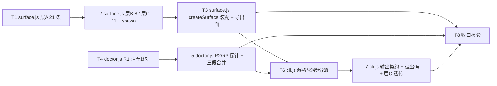

# pr-003-tasks.md — pr-003 内部任务图（三层入口表 / CLI 分派与输出契约 / doctor 自检）

**迭代**: 0025-hub-sdk-and-skill ｜ **阶段**: 5（PR 实现）· 第三波 ｜ **PR 文件**: `prs/pr-003-sdk-entry-surface-cli-and-doctor.md`
**worktree**: 本 PR worktree（分支 `feat/0025-pr-003-sdk-entry-surface-cli-and-doctor`；HEAD = `14ca2cf` = 迭代分支 tip，含已合并 pr-001 / pr-002 / **pr-005**；落盘时 `git status` 为空）｜ **任务总数**: **8**（T1~T8）｜ **依赖图**: **无环**（见 §2）
**输入真源**: PR 文件（3 文件 / F01·F02·F03·F04·F05·F06·F07·F08·F09·F10·F11·F13·F14·G01·G02 十五卡）+ `architecture.md` v1.0.0（§2.1 组件图、§2.2 流 1~3、§2.3 接缝、§3.3 P-1~P-4、§4.1 N-3/N-6/N-7、§4.4 顺序约束、§5.1 三层全表 40 条、§5.2、§5.3、§5.4、§5.5、§6 T-01~T-09、§7 逐卡行、§8 C6~C11、§10 T1~T6）+ `prd/*.md` 十五卡 + **已合并前序产物**（`oamp/sdk/errors.js` / `http.js` / `uds.js`、`oamp/skill/hub.md`、`oamp/test/sdk-skill.test.js`）+ 代码库实读（§0.3 逐条带 `文件:行号`）

> **本 PR 仍无任何可执行入口**（`oamp/bin/hub.js` 与 `oamp/sdk/index.js` 在 pr-004）⇒ 全部判据以**模块级实测 + 真服务实测**判定（一次性脚本 import `sdk/{surface,cli,doctor}.js`，或 `node --input-type=module -e` 直调；真服务用既有做法：临时 socket + 真 Router + `web start` 随机端口 + 临时 `OAMP_DB`），**零测试文件改动**（〔§0.4 契约 14〕）。
> **交付物**: `docs/iterations/0025-hub-sdk-and-skill/prs/pr-003-tasks.md`（本文件，阶段产物，不计入 PR 改动面）。

---

## 0. 范围、文件面与事实锚点

### 0.1 本 PR 文件范围（唯一可写面；3 文件，全部新建）

| # | 文件 | 动作 | 内容（任务归属） |
|---|---|---|---|
| 1 | `oamp/sdk/surface.js` | **新建**（~300 行，impl `N-3`） | 三层入口表**单点定义**：层 A 21 条 / 层 B 8 条 / 层 C 11 条（每条 `{ id, layer, cmd, args, flags, kind, run }`）+ 层 C 的 `spawn` 透传原语 + `createSurface()` 三层命名空间装配 + 导出面（**T1~T3**） |
| 2 | `oamp/sdk/cli.js` | **新建**（~200 行，impl `N-6`） | `main(argv)`：argv 解析 → P-3 口径本地校验 → 查表分派 → 默认 JSON / `--human` 渲染 → stderr 错误对象 → 进程退出码；层 C 透传面（**T6~T7**） |
| 3 | `oamp/sdk/doctor.js` | **新建**（~150 行，impl `N-7`） | 契约自检三段：R1 文档↔登记双向清单比对 / R2 9 个非流式 GET 可达性 / R3 8 个 UDS 方法存在性；`check({ apiDocPath, port })`（**T4~T5**） |

### 0.2 非目标（零改动 / 防夹带）

- **零改动清单**（PR 文件验收 22 / architecture §4.3 Z-1~Z-7）：`oamp/src/**`（含 `cli.js` / `web.js` / `router.js` / `status.js` / `task.js` / `cluster.js` / `config.js` / `rpc.js`）、`oamp/bin/**`、`oamp/package.json`、`oamp/API.md`、`oamp/llms.txt`、`oamp/README.md`、`oamp/web/**`、`oamp/test/**`、`roles/**`、`tools/**`、`.claude/skills/**`。
- **已合并产物只消费不修改**（A14 / A15 / A16）：`oamp/sdk/errors.js`、`oamp/sdk/http.js`、`oamp/sdk/uds.js`、`oamp/skill/hub.md`、`oamp/test/sdk-skill.test.js` 五个文件 **diff 必须为空**。
- **不实现**（属其他 PR）：`oamp/bin/hub.js` + `package.json` 的 `bin.hub` 一行 + `oamp/sdk/index.js` + `test/helpers/hub-harness.js`（pr-004）；`test/sdk-{surface,api,uds,cli-contract,doctor}.test.js`（pr-006~pr-010）；任何 README / 文档改动（未要求即不做）。
- **不新增**：路由 / 端点 / 方法 / 配置键 / env 键 / 配置文件 / 目录 / 第三方依赖 / 测试文件；**不新增 errors.js 的 observation kind**（〔§0.4 契约 10〕）。
- **不做跨端点语义 / 无编排命令**（W3 / F02 验收 2 / N5）：表内零跨端点组合（`truncated` 重建、分页续取、批量编排、roster 反查、`--wait` 超时后的标识反查 —— P-1 口径）。
- **不做自动性**（L2-9 / G02 验收 3）：无自动重试 / 自动重连 / 退避 / 失败重派 / 心跳循环（层 B 的 `heartbeat` 是**单次**方法调用）。
- **不做生命周期**（N3 / N4）：不在 SDK 内启停 agent；层 C 只原样透传既有 CLI（P-2 口径）。

### 0.3 读码事实锚点（2026-09-15 实读，HEAD `14ca2cf`；判据基础）

| # | 事实 | 位置 |
|---|---|---|
| **A1** | 既有 CLI 分发表：`main(argv)` 顶层 6 分支（`router` / `agent` / `status` / `web` / `cluster` / `task`）；`usageError(message)` 写 stderr 并**返回 `2`**；`loadAndRun` 的切片差异：`router` / `agent` / `web` 传 `argv.slice(2)`，`status` / `cluster` / `task` 传 `argv.slice(1)`（后者**保留子命令**在 restArgs 首位）；`cluster` 的 `validSubs = ['up','down','status']`、`task` 的 `validSubs = ['send','status','list','watch']` | `oamp/src/cli.js:30`、`:62`、`:71`、`:82`、`:92`、`:96`、`:106`、`:116` |
| **A2** | 既有 11 个叶子命令（= 层 C 的覆盖对象）：`router start` / `agent start <instance-id>` / `status` / `task send|status|list|watch` / `web start` / `cluster up|down|status`；`cli.test.js` 断言上述分发表 | `oamp/src/cli.js:71-133`；`oamp/test/cli.test.js` |
| **A3** | 层 C 的被透传对象形态：`import { main } from '../src/cli.js'; process.exitCode = await main(process.argv.slice(2));`（`default` 导出启动函数、**返回数字 = 退出码**的既有约定） | `oamp/bin/oamp.js`（全文 4 行）；`oamp/src/cli.js:50-60`（`loadAndRun` 的 `typeof result === 'number' ? result : 0`） |
| **A4** | 既有 `--human` 体例先例（**逐字沿用**）：`renderTable(nodes)` = 表头行 + 数据行、列宽 `max(表头, 各单元格)`、两空格分隔、末列不 pad、按 `instance_id` 排序；`renderTask(task)` = `键: 值` 逐行、键 `padEnd(12)`；`renderList(tasks)` = 表头 + 数据行、空态 `（无任务）` | `oamp/src/status.js:40-52`；`oamp/src/task.js:79-84`、`:113-120` |
| **A5** | 层 C 的不可达口径：`oamp status` 在 Router 不可达时 **stderr 明确报错 + 返回 `1`**（不是 `3`）⇒ 透传后仍是 `1`，**不重分类**（P-2 / §5.4 要点） | `oamp/src/status.js:111-146`；`oamp/src/config.js:136-165` |
| **A6** | 文档侧真源：`API.md` §3 标题在 `:157`，21 行在 `:161-181`，行形态 `\| n \| \`METHOD /path\` \| 用途 \|`，路径用 `<param>` 形态；§2.2 兜底形态 = `404` + `code:"NOT_FOUND"` + `error: "not found: <方法> <路径>"`；§1.1 端口链 = `--port` 优先 `OAMP_WEB_PORT`，默认 `7788` | `oamp/API.md:157-183`、`:77-105`、`:16-32` |
| **A7** | SSE 帧格式（读法基准）：每帧以空行分隔、`event: <名>` + `data: <单行 JSON>`；首帧 `retry: 1000`；15s 注释心跳 `: keepalive`；**事件不补发**；四类对话事件（§4.1）、四类全局事件（§4.2）、三类调用事件（§4.4） | `oamp/API.md:34-59`、`:992-1056` |
| **A8** | `POST /api/calls` 的形态：`mode` 缺省 `background`（立即受理）/ `block`（挂起至终态、**不设人为上限**、客户端断连不终止调用）；`task` 与 `tasks` **互斥**；成功恒 `{ calls: [...] }`（§3.14 / §5.13） | `oamp/API.md:630-711`、`:1402-1416` |
| **A9** | 运行侧真源：`GET /api/docs` → `{ routes: projectRoutes(routes) }`，投影含 `{method, path, kind, summary, params, response, errors, danger, docLink}`，**每次请求现算、不缓存**；路由兜底在 `:1749`（`404` + `not found: ${req.method} ${p}`）；`DEFAULT_PORT = 7788`、`Number(process.env.OAMP_WEB_PORT \|\| DEFAULT_PORT)`、非法端口 → `2` | `oamp/src/web.js:894`、`:1384-1396`、`:1749`、`:46`、`:1431-1441` |
| **A10** | Router 侧事实：8 个方法分支 + `default` → `-32601 method not found: <method>`；`agent.register` 的 `instance_id` 校验**先于副作用**（非法即返回、不注册）；`agent.heartbeat` **通知语义（不回帧）**、未注册静默；`agent.deregister` / `message.send` / `message.ack` 无身份 → `UNREGISTERED`；`router.status` / `router.task_get` / `router.task_list` 只读，后两者缺参 / 非法 `state` → `INVALID_PARAMS` | `oamp/src/router.js:109-113`、`:161-184`、`:186-199`、`:201-346`、`:348-377`、`:379-382`、`:384-393`、`:395-404`、`:405-408` |
| **A11** | 包内路径推导的既有先例：`PKG_ROOT = path.resolve(path.dirname(fileURLToPath(import.meta.url)), '..')` 与 `BIN = path.join(PKG_ROOT, 'bin', 'oamp.js')`（与 cwd 无关，L2-11 的同口径先例）；socket 链 = `env.OAMP_SOCKET \|\| <包根>/.runtime/router.sock` | `oamp/src/cluster.js:19-20`；`oamp/src/config.js:10`、`:144` |
| **A12** | 已合并 pr-001 契约（消费面，**不得改名**）：`errors.js` 导出 `HubError{code, error, exitCode, httpStatus, upstream}` / `classify(observation)`（判别式 `kind`：`usage` / `connect` / `response-timeout` / `stream-ended` / `response{status,body}` / `wait-timeout` / `config` / `success`；**未知 kind 抛错**）/ `serializeError(err)` → `{code, error, exit_code}`（`.httpStatus !== null` 时加 `http_status`；`upstream !== null` 时取 `upstream.error`）；`http.js` 导出 `request(spec)` / `stream(spec)`，`spec = { port, method, path, query, body, waitMs }`，连接上限 2000ms、响应上限 5000ms、`agent:false` 每请求一连接、`waitMs` 到限 → `WAIT_TIMEOUT`；**`http.js` 注释把 `OAMP_WEB_PORT` 缺省链的唯一落点归 `createHub()`（pr-003 / pr-004）** | `oamp/sdk/errors.js`（84 行）、`oamp/sdk/http.js`（199 行） |
| **A13** | 已合并 pr-002 契约（消费面，**不得改名**）：`uds.js` 导出 `connect(opts)`（`opts` 可含 `socketPath` / `env` / `onDeliver`）→ 会话 = `register(instanceId)` / `heartbeat(params)` / `send(params)` / `ack(params)` / `status()` / `taskGet(id)` / `taskList(query)` / `deregister()` / `close()`；`heartbeat` 走 `notify`（无 `id`、不建 pending）；**身份合成只在 `register` 成功后生效**（会话身份值优先）；`data.code` 原样落 `.code`、`.upstream = {error, code}`、exitCode `1`；连接失败 / `ENOENT` → `HUB_UNREACHABLE` / `3` | `oamp/sdk/uds.js`（180 行） |
| **A14** | 已合并 pr-005 契约（**已生效的机械锁**）：`oamp/skill/hub.md` 钉死 40 条入口的**名面**（层 A 21 / 层 B 8 / 层 C 11，逐字）+ `doctor` 单列「自检（不属于三层封装）」+ 退出码四值；`oamp/test/sdk-skill.test.js` 对上述名面逐条断言 ⇒ **`surface.js` 的 `cmd` 名面必须与之一致**（多一条 / 少一条 / 改一字即让已合并用例转红） | `oamp/skill/hub.md`；`oamp/test/sdk-skill.test.js:19-115` |
| **A15** | 既有测试面：`oamp/test/*.test.js` = **33** 个；`helpers/` = 3 文件（`harness.js` / `fake-node.js`）；真服务做法：临时 socket 目录（`mkdtemp`）+ `OAMP_SOCKET` + `spawn(process.execPath, [BIN, 'router','start'])` + 等 `ROUTER_READY socket=`；`web start` 子进程 = 随机端口 + 临时 `OAMP_DB` + 等 `WEB_READY`；`hygiene.test.js` 的扫描面 = `bin/` + `src/` + `package.json`（**不含 `sdk/`** ⇒ cli.js 不被凭据字段扫描约束；pr-004 的 `bin/hub.js` 受约束） | `oamp/test/helpers/harness.js:16`、`:25-31`、`:106-119`、`:159`；`oamp/src/router.js:483`；`oamp/test/web.test.js:126`；`oamp/test/hygiene.test.js:37`、`:47` |
| **A16** | 归一化手法先例（doctor R1 可直接参照，不引入第二套）：`shapePath(p) = p.split(/[?#]/)[0].replace(/<[^>]*>/g, ':').replace(/:[^/]*/g, ':')`；文档签名抽取 = 反引号包裹的 `METHOD /api/…` | `oamp/test/api-routes.test.js:292-303` |
| **A17** | 本 worktree 现状：分支 `feat/0025-pr-003-sdk-entry-surface-cli-and-doctor`；`oamp/sdk/` 现有 `errors.js` / `http.js` / `uds.js`；**`oamp/sdk/{surface,cli,doctor}.js` 不存在**（本 PR 新建）；`oamp/skill/hub.md` 与 `test/sdk-skill.test.js` 已存在（pr-005 已合并）；`oamp/bin/hub.js` / `oamp/sdk/index.js` / `package.json` 的 `bin.hub` 尚不存在（pr-004） | 实测（`git rev-parse` / `git status` / 目录列举） |
| **A18** | `errors.js` 的归类表覆盖面与本 PR 的分工：`2`（`usage`）/ `3`（`connect` / `response-timeout` / `stream-ended` / `response` 的 502）/ `1`（`response` 其余 4xx·5xx / `wait-timeout` / `config`）/ `0`（`success`）；**层 C 的子进程退出码透传不在该表内**（`errors.js` 注释明言"归 pr-003"） | `oamp/sdk/errors.js`（`classify` 注释与实现） |

### 0.4 本 PR 内冻结契约（每个任务都必须遵守；跨 PR 接缝在此一次定死）

1. **`surface.js` 导出面**〔见 §5 **MI-1**〕：
   - `export const LAYERS = ['api', 'uds', 'cli']`（层前缀；顺序即 architecture §5.1 表序）；
   - `export const ENTRIES`：**恰 40 条**，顺序 = 层 A（`API.md` §3 行序 1..21）‖ 层 B（§5.1 层 B 表序）‖ 层 C（§5.1 层 C 表序）；每条 `{ id, layer, cmd, args, flags, kind, run }`：
     - `id`：`<layer>.<cmd.join(' ')>`（唯一，用于 doctor / 测试点名）；
     - `layer`：`'api' | 'uds' | 'cli'`（**单点分层依据**，F14 验收 1/2）；
     - `cmd`：层前缀之后的子命令 token 数组（**名面逐字 = `oamp/skill/hub.md` 的 40 条**，A14）；
     - `args`：位置参数声明（顺序 = 路径中 `:param` 出现序；含必填性）；
     - `flags`：选项声明 `{ name, kind: 'string'|'int'|'json'|'bool', required }`（`name` 由 `API.md` 字段名机械推导，`_` → `-`）；
     - `kind`：`'result' | 'stream'`；
     - `run(ctx, params)`：一次调用（层 A 走 `http.js`、层 B 走 `uds.js`、层 C 走 `spawn`）；
   - `export function createSurface(opts)` → `{ ctx, api, uds, cli }`（**三层**命名空间 + 已解析 ctx；`doctor` 命名空间由 pr-004 的 `index.js` 组合，见 MI-1）。
   **pr-006 的覆盖面用例消费** `ENTRIES` / `LAYERS`；**pr-004 的 `index.js` 消费** `createSurface` 与 `doctor.check`。
2. **层 C 的 `spawn` 落点（本 PR 内定案）**〔见 §5 **MI-2**〕：`spawn(process.execPath, [<包根>/bin/oamp.js, ...args], { stdio })` 的原语落在 `surface.js` 的层 C 条目 `run(ctx, params)` 内（= architecture §2.1 的 `SUR -->|"spawn 子进程·stdio 继承"| OCLI` 边）；`cli.js` 只做「token 原样交付 + 选择 `ctx.stdio` + 退出码落点」。`ctx.stdio ∈ {'inherit', 'capture'}`：CLI 面 `inherit`、库面 `capture`。
3. **端口缺省链的唯一落点**〔见 §5 **MI-3**〕：`port = 显式 port ?? Number(env.OAMP_WEB_PORT || 7788)` 只在 `createSurface` / `createHub` 处解析一次（与 `API.md` §1.1、`web.js:46`·`:1431` 同一条链）；`http.js` 只接受显式 `port`（A12）⇒ SDK 内**无第二处**解析。pr-004 的 `createHub({ port })` 委托此链。
4. **`doctor.check(opts)` 签名（与 pr-010 的跨 PR 接口契约，不得改名）**：`opts = { apiDocPath?, port? }`；`apiDocPath` 缺省 = `<包根>/API.md`（按 `import.meta.url` 从 `sdk/` 位置 `..` 推导）；`port` 由调用方提供（CLI 面 = `cli.js` 的 ctx；库面 = pr-004 的 `createHub` 绑定）；返回 `{ pass, items: [{ id, ok, expected, actual, reason? }] }`；**基础设施不可达 ⇒ 抛 `HubError`（`exitCode: 3`），不返回部分 `items`**。
5. **`cli.js` 导出 `main(argv)`**（pr-004 的 `bin/hub.js` 逐字 `import { main } from '../sdk/cli.js'`；`main` 返回**数字**，落 `process.exitCode` —— 与 A3 同约定）。
6. **`--wait` 只被 `api calls create` 接受，缺省 `1800000` ms**（L2-4 / F10 验收 1），作为 `waitMs` 传入 `request(spec)`；其余 39 条给出 `--wait` ⇒ 本地 `2`。
7. **`--as` 接受面 = 4 条**（`uds agent.heartbeat` / `agent.deregister` / `message.send` / `message.ack`）；`agent.register` 与 `router.*` 三条**不接受**（给出即 `2`）〔见 §5 **MI-6**〕。`--as` 的括号序列 = connect → `register` → 单次方法 → best-effort `deregister` → `close`（L2-10），每命令一连接。
8. **层 C 之后一切 token 不解析**（含 `--human` / `--help`）⇒ 原样透传；`hub cli` 后**零 token** ⇒ 本地 `2`（不起子进程）〔见 §5 **MI-5**〕。
9. **层 B 的 CLI 面不做身份合成**：无 `--as` 时 `heartbeat` / `ack` / `deregister` 不带身份 ⇒ 服务端如实回 `UNREGISTERED` / `STALE_SESSION` ⇒ `1`（依据：A13 的会话身份只在 `register` 后生效 + L2-10 + G02 验收 3"零自动性"）。SDK **不**为 CLI 面自动注册（那会撞 N3/L2-9）。
10. **分类观测只落既有 8 个 `kind`**（A12）；**不得新增 kind**（改 `errors.js` 即越界）。层 C 的 `0/1/2` 透传**不经** `classify`（A18）。
11. **零自动性**（L2-9 / G02 验收 3）：无重试、无重连、无退避、无失败重派、无自动心跳循环、无自动 ack。
12. **零状态 / 零本地写**（F09）：模块级无可变值；层 A 每命令一 HTTP 连接（`http.js` 的 `agent:false`）、层 B 每命令一连接（结束即 `close()`）、层 C 每命令一子进程；无 `node:fs` 写 API、不写仓库内 `.runtime/` 与 `data/`。
13. **路径一律按 `import.meta.url` 推导**（`<包根>` = `oamp/`，从 `oamp/sdk/*.js` 位置 `..`，与 A11 同口径）；不依赖 cwd、零本机路径字面量、不要求 `cd` 前置（F13 验收 2/3/4）。
14. **验收方式不入库（硬约束）**：本 PR **零测试文件改动**（`oamp/test/**` 零 diff）。T1~T8 的判据用一次性脚本（`/tmp/**.mjs` 或 `node --input-type=module -e`）+ 真服务实测；测试面归 pr-006~pr-010。理由：`git diff` 封闭判据（G01 验收 3 / PR 验收 22）与本迭代"测试文件按 PR 归属"的编排。

---

## 1. 任务列表

### T1: `oamp/sdk/surface.js` — 层 A 21 条入口项（flag 机械推导 + 本地校验元数据）

- **验收标准**:
  1. **文件与依赖面**：`oamp/sdk/surface.js` 存在；import 集合 ⊆ `node:*` + `./http.js` + `./errors.js`（层 A 段；零第三方、零 `src/**` 直接 import、不 import `./uds.js` 之外的同目录模块）；**无循环 import**（`http.js` / `errors.js` 均不 import surface）。判据 = 文件头逐条核对 + 加载即成功（无 TDZ / 循环报错）。
  2. **层 A 恰 21 条、名面逐字**（PR 验收 1 / F02 验收 1 / F14 验收 4）：`ENTRIES` 的层 A 段恰 21 条；`cmd` 名面与**已合并的** `oamp/skill/hub.md` 层 A 清单（A14）逐条等值、顺序一致、无缺项无多出项（`api agents` / `api chats list|get|close|archive|activate|rename` / `api messages send` / `api stream chat|events|calls|call` / `api docs` / `api projects list|create` / `api calls create|list|get|transcript` / `api confirmations list|decide`）。判据 = 脚本对两处清单做 `deepEqual`（名面集合 + 顺序）。
  3. **21 条逐条绑定单一端点**（F02 验收 1 / F14 验收 3 / W3）：每条 `{method, path}` 与 `API.md` §3 的 21 行逐条一致（13 条 GET，其中 **4 条 SSE** = `/api/stream` `/api/events` `/api/calls/stream` `/api/calls/:call_id/stream`；8 条 POST）；`method` 分布 = 13 GET + 8 POST。判据 = 脚本解析 `API.md:161-181` 后双向比对（`<param>` → `:param` 归一）。
  4. **路径参数 → 位置参数**（§5.1 规则 2）：`args` 顺序 = 路径中 `:param` 出现序；逐条样例：`api chats get` 1 个（`chat_id`）、`api docs` 0 个、`api confirmations decide` 1 个（`confirmation_id`）、`api stream chat` 1 个、`api stream call` 1 个。判据 = 逐条断言 `args.length` 与 `arg.name`。
  5. **flag 名机械推导（`_` → `-`），无第二份命名**（§5.1 规则 3 / F02 验收 2 / F14 验收 3 / W3）：逐条 flag 面与 §5.1 层 A 表「选项」列逐条一致 —— `--state`｜`--project-id`（必填）`--q --agent --state --from --to --archived --limit --offset`｜（无）｜（无）｜（无）｜（无）｜`--title`（必填）｜`--chat-id --project-id --agent-id`（必填）`--text`（必填）`--model --one-shot`｜`--repo-url`（必填）`--name`｜`--chat-id --agent`（必填）`--task --tasks --context --output-schema --schema-mode --mode --model --wait`｜`--chat-id`（必填）｜`--option-id --option-ids --text`。**表内零跨端点编排逻辑**（每条只描述自身端点）。
  6. **必填性元数据与 `API.md`「必填」列一致**（§5.1 规则 4 / K5 的受控重复）：`flags[].required` 与 `args[]` 的必填性逐条对齐 —— `chats list` 的 `project_id`、`chats rename` 的 `title`、`messages send` 的 `chat_id`+`agent_id`+`text`、`projects create` 的 `repo_url`、`calls create` 的 `chat_id`+`agent`+（`task`‖`tasks`）、`stream calls` 的 `chat_id`。判据 = 逐条断言（与 `API.md` 各接口「必填」列对照）。
  7. **形态元数据**（§5.1 规则 4 / P-3）：数值型（`--limit` / `--offset` / `--wait`）标 `kind:'int'`；JSON 型（`--tasks` / `--output-schema`）标 `kind:'json'`；布尔（`--one-shot`）标 `kind:'bool'`；其余 `'string'`。**不含任何取值域信息**（枚举 / 范围 / 跨字段约束**不在表内** —— 那是服务端的事，P-3）。
  8. **订阅条目与单结果条目分流**（F06 验收 1/4 / §5.3）：4 条 SSE 条目 `kind:'stream'`（走 `http.js` 的 `stream()`）；其余 17 条 `kind:'result'`（走 `request()`）；`stream chat` 的 `chat_id` 走 query（`?chat_id=`）、`stream calls` 的 `chat_id` 走 query、`stream call` 的 `call_id` 走路径段。
  9. **`--wait` 的接受面与缺省值**（L2-4 / F10 验收 1）：仅 `api calls create` 的 `flags` 含 `name:'wait'`，缺省值 `1800000`（缺省解析归 T6，表内只声明"接受"）；`run()` 把 `waitMs` 传给 `request(spec)`。
  10. **每条 `run()` 恰一次请求、零跨端点组合**（W3 / N5 / F02 验收 2）：`run()` 内不含第二次 `request()` / `stream()` 调用、不含 roster 反查、不含分页续取、不含正文重建（`truncated` 只透传）。
  11. **零状态**（F09）：模块级零可变值（只有 `const` 表与纯函数）；`run()` 不缓存任何响应、不复用连接。
  12. **零越界**：本任务 diff 只含 `oamp/sdk/surface.js`。
- **前置依赖**: 无
- **优先级**: P0
- **追溯**: PR 文件「文件范围」1 + 验收 1 / 3 / 6 / 8 / 9 / 13 / 21 的层 A 面；architecture §2.1（`SUR --> HTTP`）/ §2.2 流 1 / §2.3 接缝表 / §4.1 **N-3** / §4.4 顺序约束 1 / §5.1 层 A 全表 + 规则 1~5 / §5.2 规则 1·2 / §5.3 / §7 F02·F05·F06·F10·F14 行 / §8 C5·C9；prd/F02 验收 1·2·5、F05 验收 1、F06 验收 1·4、F10 验收 1·2、F14 验收 1·2·3·4、G01 验收 1·5；事实 A6 / A7 / A8 / A12 / A14 / A17

### T2: `oamp/sdk/surface.js` — 层 B 8 条 + 层 C 11 条 + 层 C 的 `spawn` 透传原语

- **验收标准**:
  1. **层 B 恰 8 条、名面逐字**（PR 验收 1 / F03 验收 1）：`cmd` 名面 = `uds agent.register` / `agent.heartbeat` / `agent.deregister` / `message.send` / `message.ack` / `router.status` / `router.task_get` / `router.task_list`，与 `oamp/skill/hub.md` 层 B 清单（A14）及 §5.1 层 B 表逐条等值、无多出项。
  2. **层 B 每条单方法、`result` 原样**（F03 验收 1/2 / §5.2 规则 2）：8 条各绑定**一个** Router 方法名（与 A10 的 `dispatch` 方法名逐条等值）；`run()` 经 `uds.connect()` 拿会话、调**单一方法**、把 JSON-RPC `result` **原对象**返回（不加信封、不改字段名、不裁剪）；方法映射 = `register→agent.register`｜`heartbeat→agent.heartbeat`｜`send→message.send`｜`ack→message.ack`｜`status→router.status`｜`taskGet→router.task_get`｜`taskList→router.task_list`｜`deregister→agent.deregister`。
  3. **`--params` 是唯一入参通道**（§5.1 层 B 规则）：入参对象**原样**进入方法参数（零字段级搬运、零默认值注入）；`--params` 的解析与校验归 T6。
  4. **`--as` 的接受面元数据 = 4 条**（〔§0.4 契约 7〕/ L2-10）：`heartbeat` / `deregister` / `send` / `ack` 标"接受 `--as`"；`agent.register` / `router.status` / `router.task_get` / `router.task_list` 标"不接受"（执行归 T6 判 `2`）。依据 F03 卡明文 + §5.1 层 B 表 `--as` 列（4 ✓ / 4 ✗）〔见 §5 **MI-6**〕。
  5. **层 C 恰 11 条、名面逐字**（PR 验收 1 / F04 验收 1）：`cmd` 名面 = `cli router start` / `agent start` / `status` / `task send|status|list|watch` / `web start` / `cluster up|down|status`，与 `oamp/skill/hub.md` 层 C 清单（A14）及 §5.1 层 C 表逐条等值；11 条 = `src/cli.js` 分发表展开的全部叶子（A2），双向无缺项无多出项。
  6. **`spawn` 形态与包内路径推导**（PR 验收 4·5 / F04 验收 2 / F13 验收 2·3·4 / L2-1 / L2-11）：层 C 的 `run()` = `spawn(process.execPath, [<包根>/bin/oamp.js, ...args], { stdio })`；`<包根>` 按 `import.meta.url` 从 `sdk/` 位置推导（与 A11 同口径）；不依赖 cwd、不含本机路径字面量；`args` 为调用方给出的 token 数组**原样**（不解析、不重排、不补默认值、不插入子命令）。
  7. **两模式 stdio**（§5.1 层 C 规则 / L2-1 / §5.2 库 API）：`ctx.stdio === 'inherit'` ⇒ `stdio: 'inherit'`（CLI 面：TTY 语义与直跑一致，长驻命令不劫持调用方进程）；`ctx.stdio === 'capture'` ⇒ 捕获 stdout/stderr 并返回 `{ exit_code, stdout, stderr }`（库面）；`capture` 下 stdout/stderr **原样字符串**（逐字节保留，含结尾换行）。
  8. **退出码透传、不重分类**（P-2 / §5.4 要点 / A5）：`exit_code` = 子进程退出码原样（既有 `0/1/2`）；**不经** `classify`、不加 `3`、不改写；子进程被信号终止时按 Node 的 `code === null` 原样呈现（不发明新码、不抛 `HubError`）。
  9. **零自动性 / 零兜底**（L2-9 / G02 验收 3）：层 C **不重试**、不做第二次 spawn、不排队、不因非零退出码再试一次。
  10. **每命令一子进程、结束即清**（F09 / §0.4 契约 12）：调用返回后无残留子进程（不 `detach`、不 `unref` 后放任）；`capture` 模式下两个输出流都被消费到 `close`（不留未读 buffer）。
  11. **层 B 会话按次建立与关闭**（F09 / A13）：`run()` 内 `connect()` → 方法 → `close()`（`finally` 语义保证，成功与失败都关）；会话不跨调用复用、模块级不持有会话。
  12. **零越界**：本任务 diff 只含 `oamp/sdk/surface.js`（与 T1 同文件 ⇒ 串行）。
- **前置依赖**: T1（同文件的表结构与 `ENTRIES` 容器；串行）
- **优先级**: P0
- **追溯**: PR 文件「文件范围」1 + 验收 1 / 3 / 4 / 5 / 21 的层 B·层 C 面；architecture §2.1（`SUR --> UDS` / `SUR -->|spawn| OCLI`）/ §2.2 流 2 / §2.3 接缝表（复用 `src/rpc.js` 经 `uds.js`、不写第二套帧编解码；层 C 不重写既有命令）/ §4.1 **N-3**·**N-5** / §4.4 顺序约束 3·4 / §5.1 层 B 全表 + 层 C 全表 + 两条规则 / §5.2 库 API（`hub.cli.run(['status'])` → `{exit_code,stdout,stderr}`）/ §6 **T-01** / §7 F03·F04·F13·G02 行 / §8 C8·C10；prd/F03 验收 1·2、F04 验收 1·2·3、F09 验收 1、F13 验收 2·3·4、G02 验收 1·2·3；事实 A1 / A2 / A3 / A5 / A10 / A11 / A13 / A14

### T3: `oamp/sdk/surface.js` — `createSurface()` 装配与导出面冻结（pr-004 / pr-006 的接缝）

- **验收标准**:
  1. **三层命名空间装配**（§4.1 N-2 / §5.2 / F01 验收 2·3）：`createSurface({ port, socketPath, env, stdio })` → `{ ctx, api, uds, cli }`；`api` 的成员名逐字 = §5.2 例子（`agents` / `chats.{list,get,close,archive,activate,rename}` / `messages.send` / `stream.{chat,events,calls,call}` / `docs` / `projects.{list,create}` / `calls.{create,list,get,transcript}` / `confirmations.{list,decide}`）；层 B = `uds.connect()`（会话，A13）；层 C = `cli.run(args)`（`capture` 模式）。
  2. **单点定义由结构保证**（F01 验收 2 / §5.2 规则 1）：三层命名空间**由同一份 `ENTRIES` 装配**（不写第二份方法表）；可核对判据 = 改 `ENTRIES` 一条的 `cmd` / 行为 ⇒ CLI 面（查表分派）与库面（命名空间）**同时**体现，不存在"改一处另一处没变"。
  3. **返回值原样、失败抛 `HubError`**（§5.2 规则 2·3）：层 A 返回响应体原对象、层 B 返回 `result` 原对象、层 C 返回 `{ exit_code, stdout, stderr }`；失败**不吞不包装**（`HubError` 直接向上抛，库面消费者读 `.exitCode`）。
  4. **端口缺省链唯一落点**（〔§0.4 契约 3〕/ A9 / A12）：`port = 显式 port ?? Number(env.OAMP_WEB_PORT || 7788)`；`ctx.port` 为解析后的整数；非法 `--port` 的判定归 T6（`2`），本任务只保证"链只此一处"。判据 = ① 不传 `port` 且 `OAMP_WEB_PORT` 未设 ⇒ 7788；② 设 `OAMP_WEB_PORT=1xxxx` ⇒ 取该值；③ 显式 `port` 覆盖 env；④ 文本检索：`surface.js` 内 `7788` 字面量**恰一处**，`http.js` 内零处（A12 只收显式入参）。
  5. **导出面冻结**（〔§0.4 契约 1〕/ pr-006 + pr-004 的跨 PR 契约）：`LAYERS` 恰 `['api','uds','cli']`；`ENTRIES` 恰 40 条且每条含 §0.4 契约 1 的七个字段（`id` / `layer` / `cmd` / `args` / `flags` / `kind` / `run`），`id` 全局唯一；`ENTRIES` 的 `cmd` 名面 40 条与 `oamp/skill/hub.md` **逐字一致**（A14）。判据 = 脚本对 `ENTRIES` 做结构与计数断言 + 与 skill 文本 40 条 `deepEqual`。
  6. **零状态、零本地写**（F09 验收 1/3/4 / §5.2 规则 4）：`createSurface()` 每次返回新对象；模块级零可变值；不见 `node:fs`、不见 `.runtime` / `data` 路径字面量（写面）。
  7. **包内路径推导不依赖 cwd**（F13 验收 2/3/4 / L2-11）：层 C 的 `<包根>` 与（T4 的）`<包根>/API.md` 均由 `import.meta.url` 推导；在 `oamp/` 之外目录调用同一入口结果一致。判据 = 从系统临时目录 `import('<包根>/oamp/sdk/surface.js')` 并读 `ENTRIES` / 调一条 `capture` 模式层 C 命令均成功。
  8. **零越界**：本任务 diff 只含 `oamp/sdk/surface.js`（与 T1/T2 同文件 ⇒ 串行）。
- **前置依赖**: T2（40 条表定稿；同文件串行）
- **优先级**: P0
- **追溯**: PR 文件「文件范围」1 + 验收 1 / 2 / 5 / 21；architecture §2.1（`SUR` 为装配点）/ §4.1 **N-2**·**N-3** / §4.4 顺序约束 1 / §5.2 全节（`createHub` → 四命名空间、规则 1~5）/ §5.6（入口定位模板：`<项目根>/oamp/sdk/index.js`）/ §7 F01·F13 行 / §8 C8；prd/F01 验收 1·2·3·4·5、F09 验收 1·3·4、F13 验收 2·3·4·5、G01 验收 5；事实 A9 / A11 / A12 / A14 / A17

### T4: `oamp/sdk/doctor.js` — R1 双向清单比对（含 `apiDocPath` 注入）

- **验收标准**:
  1. **`check(opts)` 签名与注入面**（PR 验收 19 / §10 T5 / pr-010 的跨 PR 契约〔§0.4 契约 4〕）：导出 `async function check({ apiDocPath, port } = {})`；`apiDocPath` **显式入参优先**、缺省 = `<包根>/API.md`（按 `import.meta.url` 推导）；`port` 由调用方提供；返回 `{ pass: boolean, items: [{ id, ok, expected, actual, reason? }] }`。判据 = 以临时目录内的 `API.md` 副本调用 ⇒ 文档侧基准随之改变（不含硬编码仓库路径）；不传 `apiDocPath` ⇒ 落在 `<包根>/API.md`。
  2. **文档侧解析 = `API.md` §3 的 21 行**（§5.5 R1 / A6）：解析形态 = 表格行 `| n | \`METHOD /path\` | …`（`API.md:161-181`），得 21 条 `{method, path}`。
  3. **归一化只做一处**（§5.5 归一化 / F11 验收 5）：`<param>` → `:param`（**全模块仅此一处归一**，建议逐字参照 `test/api-routes.test.js:292` 的 `shapePath` 手法，A16）；不引入第二份路径表、不做其它形式改写。
  4. **运行侧 = `GET /api/docs` 的 `routes[]`**（§2.3 接缝表 / A9）：经 `http.js` 的 `request({port, method:'GET', path:'/api/docs'})` 取 `{routes:[…]}`，读每条 `{method, path}`；**SDK 内不存端点表用于比对**（F11 验收 5 / G01 验收 5）。
  5. **双向比对与逐项输出**（PR 验收 16 / F11 验收 1·2）：① 文档有、运行无 ⇒ 该行 `ok:false` + `reason:'登记缺失'`；② 运行有、文档无 ⇒ 追加一行 `ok:false` + `reason:'文档未覆盖'`；③ 两侧都有 ⇒ `ok:true`；每项带 `expected` / `actual`（期望值 / 实际值，形态 `METHOD /path`）。判据 = 正常态 21 行全 `ok:true`；两个方向各有可复现样本（前者 = 注入副本里改掉一条路径；后者 = 注入副本里删掉一行）。
  6. **漂移即转 fail 并点名**（F11 验收 2 / E2 裸判据）：以**注入临时副本**的方式改掉一条端点路径重跑 ⇒ 该行由 `pass` 转 `fail`，且 `items[]` 里**点名该端点**（`expected` 为文档侧值、`actual` 为运行侧值），`pass` 整体为 `false`。**不改仓库内 `oamp/API.md`**（副本落系统临时目录）。
  7. **稳定性**（F11 验收 4）：R1 是**集合比对**——不依赖时间 / 随机 / 顺序；同一状态连跑两次 `items` 逐项结论一致（含顺序一致）。
  8. **端点分类全覆盖**（PR 验收 18 / §5.5）：21 条**每条**都有条目，且形态 ∈ {`ok:true`（pass）, `ok:false`（fail）, `skipped:true` + `reason`（skip 附理由）}，**无静默跳过项**；21 条的 `id` 与 `ENTRIES` 层 A 的 `id` 同源（不另造命名）。
  9. **hub 不可达 ⇒ 降级、不半跑**（PR 验收 20 / F08 验收 1·2 / §5.5）：`GET /api/docs` 失败（端口无监听 / 502 / 超时）⇒ `check()` **抛 `HubError`**（`exitCode === 3`，文案含目标地址、无堆栈）、**不返回部分 `items`**、不返回 `pass:false` 的伪结果。判据 = 无监听端口调用 ⇒ `assert.rejects` 逐字段断言。
  10. **零写副作用**（F11 验收 3 / MI-02）：R1 只发 1 次只读 `GET /api/docs`；不含任何 POST / 写请求。
  11. **零状态**（F09）：每命令一连接（`http.js` 的 `agent:false`）、无缓存、无模块级可变值、零本地写（除测试侧注入副本归测试方，SDK 不写盘）。
  12. **零越界**：本任务 diff 只含 `oamp/sdk/doctor.js`。
- **前置依赖**: 无（只消费已合并的 `errors.js` / `http.js`）
- **优先级**: P0
- **追溯**: PR 文件「文件范围」3 + 验收 16 / 18 / 19 / 20 / 21；architecture §2.1（`DOC --> APIDOC` / `DOC --> HTTP`）/ §2.3 接缝表（运行侧复用 `GET /api/docs`，不在 SDK 存第二份端点表）/ §4.1 **N-7** / §4.4 顺序约束 4 / §5.5（R1 段 + 归一化 + 漂移判定 + 未漂移稳定 + 不可达降级 + "不做的"）/ §6 **T-02** / §7 F11 行 / §9.3 A4 / §10 T5 / §8 C6·C11；prd/F11 验收 1·2·4·5、F08 验收 1·2、G01 验收 5；事实 A6 / A9 / A12 / A16

### T5: `oamp/sdk/doctor.js` — R2 只读可达性（9 条非流式 GET）+ R3 UDS 方法存在性（8 条探针）+ 三段合并

- **验收标准**:
  1. **R2 覆盖恰 9 条非流式 GET**（§5.5 / PR 验收 17）：`/api/agents`、`/api/chats`、`/api/chats/:chat_id`、`/api/docs`、`/api/projects`、`/api/calls`、`/api/calls/:call_id`、`/api/calls/:call_id/transcript`、`/api/confirmations` —— 与 21 条中"GET 且非 SSE"的集合**双向一致**（13 GET − 4 SSE = 9）。
  2. **R2 探针形态与判定界**（〔§5 **MI-7**〕/ §5.5 / A6）：每条发**一次空参 GET**（无 query、无 body；路径参 `:param` 替换为固定占位字面量，如 `probe`）；判定 = 响应**不是路由兜底** —— 兜底形态 = `status === 404` 且 `body.error === 'not found: <METHOD> <请求路径>'`（A9 的 `web.js:1749`）。因此：`400 INVALID_PARAM`（如缺 `project_id` 的 `/api/chats`）、`404 NOT_FOUND`（对象不存在，文案为 `chat 不存在: …`）、`200`（如 `/api/docs` / `/api/agents` / `/api/confirmations`）**一律算 pass**。判据 = 9 条逐条实测 + 一条"人为打错的路径"作反例（= 兜底 ⇒ fail 判据成立）。
  3. **4 条 SSE 与 8 条 POST 一律不探、附理由**（PR 验收 18 / §5.5 / MI-02）：4 条 SSE ⇒ `skipped:true` + 理由含"流式端点，不探"（探测会建立长连接，存在性由 R1 覆盖）；8 条 POST ⇒ `skipped:true` + 理由含"写端点不探，零写副作用"。**21 条无一静默跳过**。
  4. **R3 覆盖恰 8 个方法、探针逐条按表**（§5.5 + §5.1 层 B 表「探测面」列 / A10）：`agent.register {}` ⇒ `INVALID_PARAMS`（校验先于副作用）｜`agent.heartbeat {}` ⇒ **通知型，1000ms 静默计存在**｜`agent.deregister {}` ⇒ `UNREGISTERED`｜`message.send {}` ⇒ `UNREGISTERED`｜`message.ack {}` ⇒ `UNREGISTERED`｜`router.status {}` ⇒ `ok`（只读）｜`router.task_get {}` ⇒ `INVALID_PARAMS`｜`router.task_list {"state":"__probe__"}` ⇒ `INVALID_PARAMS`。判据 = 起真 Router 后 8 条逐条实测，每项 `ok:true` 且 `actual` 记录观察到的 `code` / `ok`。
  5. **R3 判定 = "响应不是 `-32601`"**（§5.5）：收到 `-32601 METHOD_NOT_FOUND` ⇒ `ok:false`；通知型方法在 **1000ms** 窗口内无响应 ⇒ `ok:true`（存在），有响应但为 `-32601` ⇒ `ok:false`；其余请求型方法在窗口内无响应 ⇒ `ok:false`。判据 = 逐条断言 + 一条反例（对不存在的方法发探针 ⇒ `-32601` ⇒ 判 fail 逻辑成立）。
  6. **R3 走 pr-002 的 `connect()`，每探针一连接一关闭**（F09 / A13 / 〔§0.4 契约 12〕）：每条探针 `connect()` → 单方法 → `close()`（`finally` 保证）；**零身份合成**（不 `register`）、**复用会话不跨方法**、模块级不持有会话；不为探测新增任何开关 / 参数。
  7. **零状态改变（MI-02 的机制面）**（PR 验收 18 / F11 验收 3 / §9.3 A4）：探针集全部落在"参数校验先于副作用"或只读方法上；判据 = 探针前后对照 hub 可观察状态**零新增** —— ① `GET /api/chats?project_id=<已有>` 条数不变；② `GET /api/calls` roster 行数不变；③ `GET /api/confirmations` 条数不变；④ `uds router.status` 的 `nodes` 集合不变（含探针自身不注册）；⑤ `router.task_list` 不变。
  8. **三段合并形态**（§5.5 / 〔§0.4 契约 4〕）：R1 / R2 / R3 的结果合并为**一个** `{ pass, items }`；`pass = items.every(i => i.ok !== false)`；每项 `id` 唯一、`expected` / `actual` 齐备、`skipped` 项带 `reason`；`--human` 渲染归 T7（本任务只保证结果对象）。
  9. **不可达 ⇒ 统一错误、不半跑**（PR 验收 20 / F08 验收 1·2）：Web 面不可达（R1/R2 用的 `GET /api/docs` 或探针）⇒ 抛 `HubError{exitCode:3}`；UDS 面不可达（R3 的 `connect()` → `ENOENT`）⇒ 同一形态（`3`）；**任一基础设施失败都不返回已跑完的那部分 items**。判据 = ① 只停 web 不停 Router；② 只停 Router 不停 web；两态各断言 `assert.rejects` 的 `{code, exitCode}`。
  10. **确定性 / 稳定**（F11 验收 4）：R2 / R3 均为确定性探针（无重试、无并发、无随机、无时间依赖）；同一状态下连跑两次逐项结论一致。
  11. **零自动性**（L2-9 / G02 验收 3）：探针不重试、不重连、不补发、不改 hub 状态。
  12. **零越界**：本任务 diff 只含 `oamp/sdk/doctor.js`（与 T4 同文件 ⇒ 串行）。
- **前置依赖**: T4（同文件的结果形态 / 归一化 / `check()` 骨架；串行）、消费已合并的 A12 / A13
- **优先级**: P0
- **追溯**: PR 文件「文件范围」3 + 验收 17 / 18 / 20 / 21；architecture §2.1（`DOC --> UDS` 的"方法存在性探测（零写入）"）/ §2.3 接缝表 / §4.1 **N-7** / §4.4 顺序约束 4（`doctor` 依赖层 A 与层 B）/ §5.1 层 B 表「探测面」列（8 条探针）/ §5.5（R2/R3 段 + 端点分类全覆盖 + 无写副作用机制 + 稳定 + 不可达）/ §6 **T-02** / §7 F11 行 / §9.3 A4 / §10 T5；prd/F11 验收 1·3·4、F08 验收 1·2·3、G02 验收 3；事实 A6 / A7 / A9 / A10 / A12 / A13

### T6: `oamp/sdk/cli.js` — argv 解析、P-3 本地校验、分派与 `2`（未发请求）

- **验收标准**:
  1. **导出与形态**（〔§0.4 契约 5〕/ A3 / A1）：导出 `async function main(argv)`（`argv` 已去掉 `node` / 脚本两项，与 `bin/oamp.js` 的 `process.argv.slice(2)` 对齐）；返回**数字**（进程退出码）；`main` 本身不调用 `process.exit`。判据 = `import { main }` 存在 + 逐例断言返回值为数字。
  2. **层归属 = 第一个 token**（F14 验收 1 / §5.4 `2` 类）：`api` / `uds` / `cli` 三层 + `doctor`（第四顶层入口，不入 40 条）；**未知层 / 缺层** ⇒ `2`。判据 = `main([])` / `main(['bogus'])` ⇒ `2`；四层各一条正例可解析。
  3. **分派 = 查 `ENTRIES` 表，零第二份命令表**（F01 验收 2 / §5.2 规则 1）：层 A / 层 B 的 `<子命令>` 解析为 `ENTRIES` 中的**唯一**条目（`layer` + `cmd` 前缀最长匹配）；**未知子命令** ⇒ `2`（含"层 A 给了 `uds` 才有的子命令"一类）。判据 = 逐条正例可解析 + 反例（`api bogus` / `uds agents`）⇒ `2`。
  4. **本地校验只判"构造请求所必需"的部分**（PR 验收 6 / F07 验收 3 / §5.1 规则 4 / P-3）：以下**逐类** ⇒ `2` 且提示指向具体错误点（含缺哪一项）：① 位置参数缺（按 `args[].required`）；② 位置参数多余（超出 `args.length`）；③ flag 缺值（`--port` 后无值）；④ 数值型 flag 非整数（`--port abc` / `--limit 1.5`）；⑤ JSON 型 flag 不可解析（`--tasks '{'` / `--output-schema 'x'`）；⑥ 入口表声明的必填 flag 缺失（按 `flags[].required`）；⑦ `--params` 缺值 / 非合法 JSON / 非对象；⑧ 未知选项（不在该条目 `flags` ∪ 通用选项内）。判据 = 八类各一例 ⇒ `2`。
  5. **`2` 的零副作用**（F07 验收 3 / §5.4 `2` 类"未发出任何连接或请求"）：所有 `2` 路径**不建立任何连接、不发任何请求、不起子进程**。判据 = ① 在 hub 完全不可达的环境下跑上述反例，仍全部得 `2`（不是 `3`）；② 自建记录型 HTTP / UDS 服务端在同一批反例下**零连接**；③ 层 C 的 `2` 路径子进程计数为零。
  6. **服务端可判的取值非法不本地判**（PR 验收 8 / P-3 口径）：`limit ≤ 200` / `archived ∈ {0,1}` / 枚举 / 跨字段约束**一律不在本地判**，照发请求；由服务端 `400 INVALID_PARAM` ⇒ `1`，`error` / `code` 原样透出。判据 = `api chats list --project-id x --limit 999` ⇒ 起真 web 后得 `1` + `code === 'INVALID_PARAM'`（**不得**是 `2`）。
  7. **给该条目不接受的选项 ⇒ `2`**（PR 验收 7 / L2-4 / L2-10 / §5.4 `2` 类）：① `--wait` 给非 `api calls create` 的任一条目；② `--as` 给 `agent.register` 与 `router.*` 三条（〔§0.4 契约 7〕）；③ `--port` 给非层 A 条目（〔§5 **MI-5**〕(c)）；④ `--params` 给层 A 条目。判据 = 四类各一例 ⇒ `2`。
  8. **`--wait` 只被 `api calls create` 接受且缺省 `1800000`**（L2-4 / F10 验收 1 / 〔§0.4 契约 6〕）：显式 `--wait <int>` 覆盖缺省；缺省值作为 `waitMs` 进入 `request(spec)`。判据 = ① 传 `--wait 1000` ⇒ 上游挂起时约 1000ms 后得 `WAIT_TIMEOUT` / `1`；② 不传 ⇒ 传出的 `waitMs === 1800000`（自建记录型 HTTP 服务端核对）。
  9. **层 B 的 `--params` / `--as` 面**（§5.1 层 B 规则 / L2-10）：`--params` 对象原样进入方法参数；`--as <id>` ⇒ 括号序列 = `connect` → `register` → 单次方法 → best-effort `deregister` → `close`（每命令一连接）；无 `--as` ⇒ 不做身份合成（〔§0.4 契约 9〕：`heartbeat` / `ack` / `deregister` 由服务端如实回 `UNREGISTERED` / `STALE_SESSION` ⇒ `1`）。判据 = 真 Router 上 ① `--as x-1 uds message.send --params '{…}'` 闭环成功（拓扑侧可见上线/下线）；② 无 `--as` 的 `uds message.ack --params '{}'` ⇒ `1` + `code === 'UNREGISTERED'`。
  10. **`hub doctor` 可被顶层分派**（PR 验收 15 / P-4）：`main(['doctor'])` 走 `doctor.check`（第四入口），**不并入三层**、不出现在 `ENTRIES` 的 40 条内；`doctor` 之后的 token 超出接受面（除通用选项外）⇒ `2`。判据 = `main(['doctor'])` 对运行中 hub 返回 `0`；`main(['doctor','bogus'])` ⇒ `2`。
  11. **`--help` 口径**（〔§5 **MI-5**〕(b) / §5.1 通用选项）：`--help` 在层 A / 层 B 的解析面内任意位置被识别 ⇒ 打印 hub 用法（三层清单 + `doctor`）到 **stdout** 并 exit `0`，**不发出任何连接**；层 C 之后的 `--help` 不识别（原样透传，见 T7）。
  12. **层 C 的 token 交付**（P-2 / §5.1 层 C 规则）：`hub cli` 之后的一切 token（含 `--human` / `--help` / `--as` / 未知选项）**原样**交付层 C 的 `run()`；`hub cli` 后**零 token** ⇒ 本地 `2`（不起子进程，〔§5 **MI-5**〕(a)）。
  13. **零状态**（F09 验收 1/3）：解析段模块级零可变值；解析结果不落盘、不缓存；同一 argv 连跑两次结果一致。
  14. **零越界**：本任务 diff 只含 `oamp/sdk/cli.js`。
- **前置依赖**: T3（`ENTRIES` / `createSurface` / `ctx`）、T5（`doctor.check` 签名；`cli.js` 需 import 它）
- **优先级**: P0
- **追溯**: PR 文件「文件范围」2 + 验收 2 / 3 / 6 / 7 / 8 / 13 / 15 / 21；architecture §2.1（`CLI --> SUR` / `BIN --> CLI`）/ §2.2 流 1 的"argv 解析（失败即 exit 2，**不发出请求**）"段 / §2.2 流 2 的 `--as` 括号段 / §4.1 **N-6** / §4.4 顺序约束 1·2 / §5.1 通用选项 + 层 A 选项 + 层 B 选项 + 层 C 规则 + 规则 4（P-3）/ §5.2 规则 1 / §5.4 `2` 类（首条命中者生效）/ §6 **T-01**·**T-08** / §7 F01·F04·F07·F10·F14 行 / §8 C5；prd/F07 验收 3、F10 验收 1、F14 验收 1·2·3、F01 验收 2、F04 验收 1·4、F03 验收 2、G02 验收 3；事实 A1 / A2 / A10 / A12 / A13 / A14

### T7: `oamp/sdk/cli.js` — 输出契约（默认 JSON / `--human` / NDJSON）与退出码落点（含层 C 透传面）

- **验收标准**:
  1. **默认输出 = 单结果一个 JSON 文档**（PR 验收 9 / F05 验收 1 / §5.3）：17 条层 A + 8 条层 B + `doctor` ⇒ stdout **一个可 `JSON.parse` 的 JSON 文档 + 换行**（层 A = 服务端响应体原样、层 B = JSON-RPC `result` 原样、`doctor` = `{pass, items}`）；stderr 空。判据 = 逐类各一例：`JSON.parse(stdout)` 成功且深度等于直连结果（不加信封、不改字段名）。
  2. **订阅输出 = NDJSON**（PR 验收 9 / F06 验收 2 / §5.3 / T-04）：4 条订阅条目 ⇒ 每帧一行 `{"event":"<事件名>","data":<SSE 帧 data 原样>}` + 换行；**逐行**独立 `JSON.parse` 成功（不是一整份大 JSON 数组）；帧 `data` 原样（不聚合、不去重、不换算进度）；`retry:` / `: keepalive` 帧不产出条目（`http.js` 已保证，A12）。
  3. **`--human` = 两个渲染器 + 订阅行形态**（PR 验收 10 / F05 验收 2·3 / §5.3 / L2-7 / T-09）：数组 ⇒ 表头行 + 数据行、列宽 `max(表头, 各单元格)`、**两空格分隔**、末列不 pad（逐字沿用 A4 的 `renderTable` / `renderList` 手法）；对象 ⇒ `键: 值` 逐行、键 `padEnd(12)`（沿用 `renderTask` 手法；值为对象 / 数组时 `JSON.stringify` 单行内联）；订阅帧 ⇒ 一行 `<事件名>  key=value key=value …`；**不做**颜色 / ANSI、时间戳本地化、字段语义解释、分页截断美化。
  4. **`--human` 只换渲染器、不改事实**（F05 验收 3 / §5.3 末段）：加 / 不加开关时承载的事实逐项一致（清单条数、每条 `instance_id`/`state`、对象键值）；判据 = 同一命令两态输出做结构对照（解析 `--human` 结果时以 JSON 面为基准逐项比对）。
  5. **失败面 = stderr 单行 JSON，stdout 干净**（PR 验收 11 / F05 验收 4 / §5.3 / §5.4）：失败 ⇒ stderr **恰一行** `JSON.stringify(serializeError(err))`（`{code, error, exit_code}`，层 A 另带 `http_status`）、**不含堆栈**；stdout 为空或不含可解析残片（**不出现半截 JSON / 人话混合体**）。判据 = 四类失败各一例逐字段断言（含 `Object.keys` 无 `stack`）。
  6. **进程退出码 = 归类表 `exitCode`**（PR 验收 14 / F07 验收 1~5 / §5.4）：成功 `0`；上游业务失败 `1`；本地用法错误 `2`；连接失败 `3`；四类各有**可复现样本**（① 成功 = `api docs`；② 业务失败 = `api chats get <不存在的 id>` ⇒ `1` + `code:'NOT_FOUND'`；③ 用法错误 = 未知子命令 ⇒ `2`；④ 连接失败 = 无监听端口 ⇒ `3` + `code:'HUB_UNREACHABLE'`）。判据 = 四类并列实测表 + **仅凭退出码（丢弃 stdout）即可区分**。
  7. **`WAIT_TIMEOUT` 与另外两类可区分**（PR 验收 13 / F10 验收 3·5 / §5.4 要点）：`api calls create --wait <小值>` 对未完成调用 ⇒ `WAIT_TIMEOUT` / `1`（与上游业务失败**同码不同 `code`**）；与连接失败 `3`、用法错误 `2` 码本身不同；文案含上限与"调用仍在进行"这一事实。判据 = 三态并列断言 `{code, exit_code}`。
  8. **订阅的下游截断与异常断开**（PR 验收 12 / F06 验收 3 / §5.4 `0` 类·`3` 类 ③ / G02 验收 3）：stdout `EPIPE`（下游 `head -1` 一类截断）⇒ 结束进程、退出码 **`0`**、**无残留进程**；服务端异常断开 ⇒ stderr 单一明确错误 + 退出码 **`3`**；**不做自动重连**。判据 = ① `hub api stream events`（经一次性脚本 import `main` 或临时入口）管道接到只取 1 行的下游 ⇒ 退出码 `0` 且进程列表无残留；② 订阅建立后杀掉 web 进程 ⇒ `3` + 单一错误。
  9. **层 C 透传面（零语义变更）**（PR 验收 4 / F04 验收 2·3 / G02 验收 2 / P-2）：`cli` 层以 `ctx.stdio = 'inherit'` 执行 —— stdout / stderr **逐字节**等于直跑 `oamp`、退出码**原样透传**（`0/1/2` ⊂ 分类表，**不重分类、不改写、不补默认值**）。判据 = ① `hub cli status` 与 `oamp status` 的 stdout/stderr/退出码逐字节比对（Router 不可达态 ⇒ 两侧都是 `1`，A5）；② `hub cli task list --state bogus` 与直跑同参一致；③ 一条启停类只读对照（`hub cli cluster status` 与直跑）。〔本 PR 无 `bin/hub.js`，判据经一次性脚本以 `main(['cli','status'])` 驱动，`stdio:'inherit'` 面以子进程包装脚本核对。〕
  10. **长驻命令不劫持调用方进程**（F04 验收 2 / L2-1 / §5.1 层 C 规则）：层 C 的 `router start` / `agent start` / `web start` / `task watch` 以**子进程**运行（调用方进程不被占用、可继续收尾）；判据 = 起 `hub cli web start --port <随机>` ⇒ 就绪后调用方进程仍能返回 / 继续执行，且该子进程可被独立停止。
  11. **`doctor` 的输出**（§5.3 / F11 验收 1 / 〔§5 **MI-4**〕）：`hub doctor` ⇒ stdout 单 JSON 文档 `{pass, items}`（`--human` 走对象渲染器）、**进程退出码 `0`**（含存在 fail 项时；结论由 `pass` / `items` 承载，不占用 stderr 错误通道 —— 依据 §5.3 的"doctor 属单结果 → stdout JSON"与 §5.4 四类未含"自检失败"行）；hub 不可达 ⇒ `3` + stderr 统一错误。判据 = 正常态 / 漂移态（注入副本）两例：两例均 `0`，`pass` 分别为 `true` / `false`。
  12. **零状态 / 零本地写**（F09 验收 1·2·3 / §0.4 契约 12）：本模块零 `node:fs`、模块级零可变值；同一命令在两个互不相干的新进程中并发执行 ⇒ 各自输出完整正确结果、无互相覆盖。判据 = 并发双进程实测 + 文本检索。
  13. **零越界**：本任务 diff 只含 `oamp/sdk/cli.js`（与 T6 同文件 ⇒ 串行）。
- **前置依赖**: T6（同文件的解析与分派面；串行）
- **优先级**: P0
- **追溯**: PR 文件「文件范围」2 + 验收 4 / 9 / 10 / 11 / 12 / 13 / 14 / 21；architecture §2.1（`CLI --> SUR`、`ERR -.-> CLI`）/ §2.2 流 1（`2xx → stdout → exit 0` / `4xx·5xx → stderr + 归类` / 连接级 → `3`）/ §2.2 流 3（NDJSON + `EPIPE` → exit 0）/ §4.1 **N-6** / §4.4 顺序约束 2 / §5.2 规则 2·3·5（库面 `HubError.exitCode` 与 CLI 面进程码共用同一张表）/ §5.3 全节 / §5.4 全节 / §6 **T-08**·**T-09** / §7 F04·F05·F06·F07·F08·F10 行 / §8 C7；prd/F05 验收 1·2·3·4、F06 验收 2·3·4、F07 验收 1·2·4·5、F08 验收 1·2、F10 验收 2·3·5、F04 验收 2·3·4、F09 验收 3、G02 验收 1·2·3、G01 验收 3；事实 A3 / A4 / A5 / A12 / A13 / A18

### T8: 收口核验（三文件协同 / diff 封闭 / 既有测试面零回归 / 无状态）

- **验收标准**:
  1. **四条路径端到端可跑**（PR 验收 1·2·15·16·17）：起真 Router（临时 socket，A15 做法）+ `web start`（随机端口 + 临时 `OAMP_DB`）后：① `api` 层至少 3 条成功（含 1 条订阅起流即得帧）；② `uds` 层至少 3 条成功（含一次 `--as` 括号闭环）；③ `cli` 层 2 条（1 只读 + 1 用法错误路径）；④ `doctor` 三段全部产出逐项结果。判据 = 一次性脚本输出 + 断言。
  2. **退出码四类并列表**（PR 验收 14）：`0/1/2/3` 各有可复现样本，且"仅凭退出码可区分"；`WAIT_TIMEOUT` 与业务失败同码不同 `code`。
  3. **层 C 逐字节一致**（PR 验收 4 / P-2）：`hub cli status` vs `oamp status`（可达态 + 不可达态）、`hub cli task list` vs `oamp task list` 的 stdout / stderr / 退出码**逐字节**比对一致（不可达态两侧均为 `1`）。
  4. **改动面封闭**（PR 验收 22 / G01 验收 1·2·4·5）：`git -C <本 PR worktree> diff --stat 14ca2cf..HEAD` 的源码面**只含 3 个新文件**（`oamp/sdk/surface.js` / `cli.js` / `doctor.js`；本阶段产物 `prs/pr-003-tasks.md` 不计入）；零命中 `oamp/src/**` / `oamp/bin/**` / `oamp/package.json` / `oamp/API.md` / `oamp/llms.txt` / `oamp/README.md` / `oamp/web/**` / `oamp/test/**` / `roles/**` / `tools/**` / `.claude/skills/**`；**已合并产物零 diff**：`oamp/sdk/{errors,http,uds}.js`、`oamp/skill/hub.md`、`oamp/test/sdk-skill.test.js`；`oamp/test/*.test.js` 仍 **33** 个、`helpers/` 仍 3 文件（A15）；`git status --porcelain` 为空。判据 = diff 逐条核对。
  5. **既有测试面零回归**（G01 验收 3 / §8 C7）：`node --test test/*.test.js`（既有 33 个文件）**全绿且零修改**；两把漂移锁（`api-routes.test.js` 的 `llms.txt` 逐字节快照 :280 与 `API.md` ↔ 登记双向覆盖 :305）保持通过（本 PR 不新增路由 ⇒ 零影响）；`cli.test.js` / `hygiene.test.js` / `sdk-skill.test.js` 均未改。判据 = 全量跑 + 逐文件零 diff。
  6. **40 条名面与已合并 skill 一致**（〔§0.4 契约 1〕/ A14）：`ENTRIES` 的 40 条 `cmd` 名面 + `doctor` 单列口径与 `oamp/skill/hub.md` 逐字一致（`sdk-skill.test.js` 是同一名面的另一侧断言）。
  7. **零新增依赖**（PR 验收 22 / F01 验收 5 / C1）：`oamp/package.json` 零 diff（`dependencies` 仍 `{}`）；三新文件的 import 面只命中 `node:*` + 同目录 `sdk/*.js`（`http.js` / `uds.js` / `errors.js`），**零 `oamp/src/**` 直接 import**、零第三方。
  8. **零状态 / 零本地写**（PR 验收 21 / F09 验收 1~4）：无 `node:fs` 写 API、无 `.runtime` / `data` 写入、无模块级可变状态（文本检索）；同一命令连跑两次结果一致；两进程并发无互相污染；命令结束无残留子进程 / socket（进程列表与连接数快照）。
  9. **零自动性复跑**（G02 验收 3 / L2-9）：失败态后无自动重连 / 重试 / 重派（记录型服务端的连接与请求计数 = 调用次数）；订阅断开后无自动重连；`uds heartbeat` 帧数 = 显式调用次数。
  10. **提交卫生**：未使用 `--no-verify`（`git log --format=%B` 无绕过痕迹，提交钩子全过）；提交信息与"为什么"相关。
- **前置依赖**: T1、T2、T3、T4、T5、T6、T7（全部）
- **优先级**: P0
- **追溯**: PR 文件「验收标准」全部 22 条的收口面；architecture §4.3 Z-1~Z-7（零改动清单）/ §8 C6·C7·C8 / §9.2 K5 / §10 T1~T6（本 PR 不自带测试文件，判据用一次性脚本 + 真服务）；prd/F01 验收 1~5、F02 验收 1~5、F03 验收 1~4、F04 验收 1~4、F05 验收 1~4、F06 验收 1~4、F07 验收 1~5、F08 验收 1~5、F09 验收 1~4、F10 验收 1~5、F11 验收 1~5、F14 验收 1~4、G01 验收 1~5、G02 验收 1~4；事实 A1~A18

---

## 2. 依赖图（无环）

- **拓扑序（合法执行序）**：`(T1 ‖ T4) → (T2 ‖ T5) → T3 → T6 → T7 → T8`。
- **最长依赖链**：`T1 → T2 → T3 → T6 → T7 → T8`（**6 跳**）；并列链 `T1 → T2 → T3 → T8`（3 跳）与 `T4 → T5 → T6 → T7 → T8`（5 跳）。
- **关键路径任务**：**T3**（surface 导出面是 CLI 与 pr-004/pr-006 的唯一接缝）、**T6 / T7**（`cli.js` 是本 PR 行为面最宽的一环）、**T8**（唯一汇合点）。
- **无环**：全部边单向递增（按任务编号与波次一致），无回边、无自环。
- **同文件串行的诚实登记**：`surface.js`（T1→T2→T3）、`cli.js`（T6→T7）、`doctor.js`（T4→T5）三组各自**必须串行写入**（并发写同一文件不保证合并）。**真正的并行价值在"三文件之间"**：surface 链与 doctor 链**互不依赖**（§2.1 的 `DOC --> HTTP` / `DOC --> UDS` 直接消费 pr-001/pr-002 产物，不经 surface），可并发执行。
- **一处刻意不设的边**：`T3 → T4/T5`（若让 `createSurface` 一并装配 `doctor` 命名空间，会引入 `surface.js → doctor.js` 的 import 边，使 surface 链等待 doctor 链）—— 本任务图按〔§5 **MI-1**〕的定案（`doctor` 由 pr-004 的 `index.js` 组合）避免该边。

---

## 3. 与 pr-003 验收标准逐条对位表

| PR 验收 # | 验收摘要 | 承接任务 | 对位说明 |
|---|---|---|---|
| 1 | 入口表单点定义：21 ↔ `API.md` §3 / 8 ↔ 方法名 / 11 ↔ 既有 CLI 叶子，双向无缺无多 | **T1**（验收 2·3）、**T2**（验收 1·2·5）、**T3**（验收 5） | 三层各自的名面与端点/方法/命令绑定判在 T1/T2；"单点定义 + 导出面"判在 T3 |
| 2 | 层前缀唯一、层归属 = 第一个 token、40 条无同名同形、`doctor` 不入 40 条 | **T1/T2**（`layer` 元数据 + 名面唯一）、**T3**（验收 5）、**T6**（验收 2·10） | 结构属性由表承担，可达性由 T6 的分派承担 |
| 3 | flag 名机械推导、路径参数走位置参数、逐条单一目标、零跨端点编排 | **T1**（验收 4·5·10）、**T2**（验收 2·5） | 机械推导与单一目标在表内判 |
| 4 | 层 C 透传：不解析 / 不重排 / 不补默认值；`spawn` + `stdio`；退出码透传 | **T2**（验收 6·7·8）、**T6**（验收 12）、**T7**（验收 9·10）、**T8**（验收 3） | spawn 原语判在 T2；token 交付判在 T6；输出与退出码逐字节判在 T7/T8 |
| 5 | `import.meta.url` 推导包内路径、不依赖 cwd | **T2**（验收 6）、**T3**（验收 7）、**T4**（验收 1 的默认基准面） | 层 C 的 `<包根>/bin/oamp.js`、`doctor` 的 `<包根>/API.md` 各判一次 |
| 6 | 本地校验只判"构造请求所必需"的部分 | **T6**（验收 4·5） | 八类 `2` + 零副作用 |
| 7 | 给该条目不接受的选项 ⇒ `2` | **T6**（验收 7） | `--wait` / `--as` / `--port` / `--params` 四类 |
| 8 | 服务端可判的取值非法不本地判 ⇒ `400` ⇒ `1` | **T6**（验收 6）、**T7**（验收 5·6） | 本地不判 + 上游原文透出 |
| 9 | 默认单结果 JSON / 订阅 NDJSON | **T7**（验收 1·2） | 逐行可解析 |
| 10 | `--human` 两渲染器 + 订阅行；只换渲染器不改事实 | **T7**（验收 3·4） | 逐字沿用 A4 手法 |
| 11 | 失败 stderr 单行 JSON、stdout 干净 | **T7**（验收 5） | 键集合与无堆栈 |
| 12 | 订阅 `EPIPE` ⇒ `0`；服务端异常断开 ⇒ `3`；不重连 | **T7**（验收 8） | 管道截断 + 无残留进程 |
| 13 | `--wait` 缺省 `1800000`、到限 `WAIT_TIMEOUT`/`1` | **T1**（验收 9）、**T6**（验收 8）、**T7**（验收 7） | 声明 / 传参 / 可区分性三面 |
| 14 | 退出码 = 归类表；四类各有可复现样本 | **T7**（验收 6·7）、**T8**（验收 2） | 四类并列表 + 仅凭退出码可区分 |
| 15 | `hub doctor` 第四入口可被顶层分派、不入三层 | **T6**（验收 10） | 与 40 条清单解耦 |
| 16 | R1 双向比对 + 逐行 `pass`/`fail` + 期望/实际 | **T4**（验收 2~8） | 含两个方向的可复现样本 |
| 17 | R2 9 条非流式 GET 判"非兜底"；R3 8 探针判"非 `-32601`" | **T5**（验收 1~5） | 探针逐条按 §5.1 层 B 表 |
| 18 | 端点分类全覆盖 + 8 POST / 4 SSE 不探并说明 + 零状态改变 | **T4**（验收 8）、**T5**（验收 3·7） | 分类在 T4 汇总、探针零副作用在 T5 |
| 19 | `check({ apiDocPath })` 可注入（与 pr-010 的跨 PR 契约） | **T4**（验收 1·6） | 漂移注入面 |
| 20 | hub 不可达 ⇒ R1/R2 降级 `3`、不半跑 | **T4**（验收 9）、**T5**（验收 9） | 两条通道各判一次 |
| 21 | 无状态：每命令一连接 / 一子进程、零模块级可变状态、零本地写 | **T2**（验收 10·11）、**T3**（验收 6）、**T4**（验收 11）、**T6**（验收 13）、**T7**（验收 12）、**T8**（验收 8） | 逐层判 + 收口复跑 |
| 22 | 零新增依赖；diff 不含 `src/**`、`API.md`、`llms.txt`、`web/**`；不新增路由 | **T8**（验收 4·5·6·7） | diff 逐目录命中核对 |

**覆盖检查**：PR 文件 22 条验收 → 全部有任务承接，无遗漏；T1~T8 的 15 张卡（F01~F11 / F13 / F14 / G01 / G02）对位见各任务「追溯」与 §6；**无任务超出文件范围**（不含 `index.js` / `bin/hub.js` / `package.json` / skill / 任何测试文件 / 任何 `src/**` 改动）。

---

## 4. 关键实现约束（判据口径，供实现者遵守）

1. **唯一可写面 = 3 个新文件**：`oamp/sdk/surface.js` / `cli.js` / `doctor.js`；**不改**任何已合并产物（`errors.js` / `http.js` / `uds.js` / `skill/hub.md` / `test/sdk-skill.test.js`）与任何既有文件。
2. **复用而非重建**（§2.3）：HTTP 与 SSE 全经 `sdk/http.js`；UDS 会话与帧编解码全经 `sdk/uds.js`（其内复用 `src/rpc.js` / `src/config.js`）；层 C 全经子进程调用既有 `bin/oamp.js`；SDK 内**零第二套** HTTP 客户端、帧编解码、socket 路径解析、argv 解析库。
3. **入口表是唯一真源**（§5.2 规则 1）：CLI 分派与库命名空间都从 `ENTRIES` 派生；任何"某条命令的行为"只写一处。
4. **40 条名面与已合并 skill 逐字一致**（A14）：这是已生效的机械锁，改名 = 让 `test/sdk-skill.test.js` 转红 + 撞 `hub.md`。
5. **分类观测只落既有 8 个 `kind`**（A12/A18）：`2` → `{kind:'usage'}`；连接 / 订阅被服务端终止 → `{kind:'connect'}` / `{kind:'stream-ended'}`；非阻塞无响应 → `{kind:'response-timeout'}`；上游响应 → `{kind:'response', status, body}`；`--wait` 到限 → `{kind:'wait-timeout'}`；配置错误 → `{kind:'config'}`；成功（含下游截断）→ `{kind:'success'}`。**不改 `errors.js`**（新增 kind 属越界）。
6. **`2` 必须零副作用**（§5.4 `2` 类）：所有本地校验先于任何连接 / 请求 / spawn；判据含"不可达环境下仍得 `2`"。
7. **层 C 的 `spawn` 用 `process.execPath` + `bin/oamp.js` 绝对路径**（L2-1 / L2-11 / A11）：`stdio` 两模式；`capture` 下两个流都消费到 `close`。
8. **`--human` 只做对齐，不做知识**（L2-7）：无颜色 / 无时间本地化 / 无字段语义解释 —— 时间字段保留 epoch ms 原样（A7 的"展示时由客户端自行本地化"不构成例外）。
9. **零自动性**（L2-9 / G02 验收 3）：不重试、不重连、不退避、不重派、无心跳循环、无自动 ack。
10. **零状态 / 零本地写**（F09）：层 A 每命令一连接、层 B 每命令一连接、层 C 每命令一子进程；不写 `.runtime/` / `data/`；不缓存响应。
11. **验收方式不入库**（〔§0.4 契约 14〕）：一次性脚本写 `/tmp`（或 `node --input-type=module -e`）；**不得**在 `oamp/test/**` 新增或修改任何文件（否则破坏 T8 验收 4 的 diff 封闭判据）；真服务实测复用既有做法（A15），**不修改** `test/helpers/harness.js`（可只读参考其写法）。
12. **不引入架构外决策**：不新增 env 键 / 配置文件 / 选项 / 参数 / 目录 / 第三方依赖；`doctor` 不为探测新增任何开关；层 A 的必填性只落 `flags[].required` 一项（K5 的受控重复）。

---

## 5. 边界与疑问（提请主 agent）

**`[model_inferred]` 清单（需主 agent 确认；未确认前不作为生效契约）**

1. **MI-1 · `surface.js` 的导出面与 `doctor` 命名空间的装配归属**：`architecture §4.1 N-2` 只写"层命名空间由 `surface.js` 装配"，`§5.2` 钉的是 `createHub()` → `{ api, uds, cli, doctor }`（`index.js` 属 **pr-004**），**未规定 `surface.js` 的导出名与 `createSurface` 的返回形状**；而 pr-004（`index.js`）与 pr-006（`test/sdk-surface.test.js`）是本 PR 的两处跨 PR 消费者。**本任务图的定案**（〔§0.4 契约 1〕）：`surface.js` 导出 `LAYERS` / `ENTRIES`(40) / `createSurface(opts)` → `{ ctx, api, uds, cli }`（**三层**），`doctor` 命名空间由 **pr-004 的 `index.js`** 用 `doctor.js` 的 `check` + `ctx` 组合（`§5.2` 的 `createHub` 四命名空间不变）。**备选**：`createSurface` 一并装配 `doctor`（改动点 = 一个 import + 一行展开；代价 = `surface.js → doctor.js` 的 import 边使 surface 链等待 doctor 链，本 PR 内部并行度下降）。**请确认并转达 pr-004 / pr-006 的 planner**。
2. **MI-2 · 层 C 的 `spawn` 落点（本 PR 内定案）**：`architecture §2.1` 的组件图把 `spawn` 画在 `SUR -->|"spawn 子进程·stdio 继承"| OCLI` 边上，而 `§7` 的 F04 行写「`sdk/cli.js`（层 C 段）」。两读法都在本 PR 的三个文件内 ⇒ 主 agent 已登记"歧义在本 PR 内自消化"。**定案**：`spawn` **原语**落 `surface.js` 的层 C 条目 `run(ctx, params)`（与 `§2.1` 的边逐字一致，也与 PR 文件对 `surface.js` 的"层 C 的 `spawn` 段"描述一致）；`cli.js` 的"层 C 段"= token 原样交付 + `ctx.stdio` 选择 + 退出码落点（`§7` 读法仍成立：层 C 的分派确在 `cli.js`）。**备选**：把 spawn 移进 `cli.js`（代价 = 库面 `hub.cli.run(args)` 的实现被迫绕回 `cli.js`，撞 `§5.2` 的"库面不经过 CLI 面"）。
3. **MI-3 · 端口缺省链的唯一落点**（`--port` > `OAMP_WEB_PORT` > `7788`）：`sdk/http.js` 的注释明言"端口只接受显式入参——`OAMP_WEB_PORT` 缺省链的唯一落点在 `createHub()`（`§5.2`，归 pr-003 / pr-004）"，而 `createHub` 在 **pr-004**。**定案**：链落 `surface.js` 的 `createSurface`（pr-003），pr-004 的 `createHub` **委托**它（保持"唯一落点"）。判据见 T3 验收 4（含"`7788` 字面量在 `surface.js` 恰一处、`http.js` 零处"）。**请确认**（改动点 = 一行来源）。
4. **MI-4 · `doctor` 的进程退出码**：`§5.3` 把 `doctor` 归入"单结果 → stdout 一个 JSON 文档"，`§5.4` 的四类归类表**没有"自检失败"这一行**，`§5.5` 只显式规定"hub 不可达 ⇒ R1/R2 降级为 `exit 3`"，F11 的验收标准**不含退出码**。**定案**：`hub doctor` 的进程退出码 **`0`**（含存在 fail 项），结论由 stdout 的 `pass` / `items` 承载；不可达 ⇒ `3` + stderr 统一错误。**备选**：有 fail 项 ⇒ `1` + 错误走 stderr（与 F11 验收 1/2 的"逐项给依据 + 点名端点"相冲 —— stderr 的单行错误对象无法承载逐项期望/实际；若主 agent 选备选，需同时裁决"逐项结果仍走 stdout"这一例外）。**请裁决**。
5. **MI-5 · argv 面的三处细口径**：(a) `hub cli` 后零 token ⇒ 本地 `2`（不起子进程；备选 = 交给 oamp 无参路径，同样得 `2`，但会多一个子进程）；(b) `--help` 在层 A / 层 B 解析面内任意位置被识别 ⇒ 打印 hub 用法到 stdout + exit `0` + 不发连接，**层 C 之后不识别**（原样透传，与"层 C 不解析"一致）；(c) `--port` 给非层 A 条目 ⇒ `2`（与 `--wait` / `--as` 同规则，`§5.4` `2` 类的"给该条目不接受的选项"）。依据 = `§5.1` 通用选项 / 层 A·B·C 选项面 + `§5.4` `2` 类 + P-2。**请确认**（改动点 = 三处分支）。
6. **MI-6 · `--as` 的接受面 = 4 条**（`agent.register` **不接受**）：`prd/F03` 卡明文"身份相关的 5 个方法接受 `--as`……`router.*` 三条与 `agent.register` 不接受该选项（给出即用法错误 2）"，`§5.1` 层 B 表的 `--as` 列也是 **4 ✓ / 4 ✗**（`agent.register` 标 ✗"自身即注册"）；但 `§5.1` 层 B 的**规则句**写"`--as` 只对 5 个身份相关方法有效，其余 4 个给出即用法错误 2"——**该规则句与同节表及 F03 卡不一致**。**定案**：以**卡 + 表**为准（4 条接受）。两者对"非身份方法给出 ⇒ `2`"完全一致，故**不改变任何产品维度**；`agent.register` 的取舍只影响一处元数据与一条反例。**请确认**（此为架构内部措辞冲突，已登记，不自行改上游产物）。
7. **MI-7 · R2 探针的路径占位值与判定界**：`§5.5` 只写"对 9 个非流式 GET 端点各发一次**空参** GET，判定 = 响应不是路由兜底"，**未规定** `:param` 位置放什么。**定案**：占位值 = 固定字面量（如 `probe`，不新增任何选项/参数）；判定界 = `status === 404` **且** `body.error === 'not found: <METHOD> <请求路径>'`（`web.js:1749` 的兜底形态，A9）；因此 `400 INVALID_PARAM`（缺 `project_id` 的 `/api/chats`）、`404 NOT_FOUND`（对象不存在，文案为 `chat 不存在: …`）、`200`（`/api/docs` 等）**一律 pass**。**请确认**（改动点 = 一个占位常量 + 一条判定表达式）。

**登记（非缺口 / 非本 PR 判据面）**

① **`--params` 的本地校验面**（缺值 / 非合法 JSON / 非对象 ⇒ `2`）属 P-3 的"JSON 型 flag 是否可解析"（`§5.1` 规则 4 明列 `--tasks` / `--output-schema`；`--params` 是层 B 的唯一入参通道）；不新增"参数域表"。
② **已合并的 `test/sdk-skill.test.js` 是本 PR 的机械锁之一**（A14）：它断言 40 条名面与 `doctor` 单列口径 ⇒ T1/T2 的名面验收与它同源，任一改名即双向转红。本 PR **不修改**该用例。
③ **R3 走 pr-002 的 `uds.connect()`**：fresh 会话无身份 ⇒ `UNREGISTERED`（A10/A13）；**不新增**任何探测专用开关或参数（"探测用具"不进 CLI 面）。
④ **`doctor` 的 `--human`** 复用 T7 的对象渲染器（`键: 值`）；`doctor` 不在 40 条内 ⇒ 不参与分层判定（P-4）。
⑤ **层 A 的 query 面**：`stream chat` / `stream calls` 的 `chat_id` 与 `chats list` 的一组过滤项走 query，`stream call` 的 `call_id` 走路径段（`§5.1` 层 A 表 #9/#16/#17 + `API.md` §3）；`--archived` / `--limit` 等的值一律**原样**成串（不本地转类型，`queryString` 语义见 A12）。
⑥ **K5 的受控重复**（`§9.2`）：必填性只落 `flags[].required` / `args[].required` 一项元数据，取值域信息零落点；漂移表现为一次服务端 `400`（不是静默错行为）。
⑦ **`hub doctor` 的 CLI 面与库面共用 `check`**（单点）：`cli.js` 与 pr-004 的 `index.js` 都只调 `doctor.check`，不在任一处重写判据。
⑧ **与 pr-004 的三处接缝**（供 pr-004 的 planner 消费）：`bin/hub.js` 消费 `main(argv)`（〔§0.4 契约 5〕）；`index.js` 消费 `createSurface(opts)` 的 `{ctx, api, uds, cli}` + `doctor.check`（〔§0.4 契约 1·4〕+ MI-1）；`test/helpers/hub-harness.js` 的 `runHub(args, {env, input, timeoutMs})` 起子进程后，本 PR 的所有 CLI 面判据即可在同一签名下复用。
⑨ **P-1~P-4 四处口径**：本任务图**逐字按 architecture §3.3 的落定口径**编写（P-1 = background 形态持标识、不反查 roster；P-2 = 层 C 原样透传；P-3 = 只校验"构造请求所必需"；P-4 = 分层判定面 = 40 条、`doctor` 单列），**未改任何卡的产品维度**。
⑩ **无阻塞疑问**：T1~T8 的每条验收标准均可追溯到 `architecture.md` 的具体条款或 `prd/*.md` 的具体验收行（见各任务「追溯」）；需要主 agent 确认的只有上面 7 条 `[model_inferred]`，且每条都已给出定案与备选（不阻塞实现启动）。

---

## 6. 追溯总表（任务 → 输入）

| 任务 | PR 文件追溯 | architecture 追溯 | prd 追溯 | 既有代码 / 已合并产物事实 |
|---|---|---|---|---|
| T1 | 文件范围 1；验收 1 / 3 / 6 / 8 / 9 / 21（层 A 面） | §2.1、§2.2 流 1、§2.3、§4.1 **N-3**、§4.4 顺序约束 1、§5.1 层 A 全表 + 规则 1~5、§5.2 规则 1·2、§5.3、§7 F02·F05·F06·F10·F14 行、§8 C5·C9 | F02 验收 1·2·5；F05 验收 1；F06 验收 1·4；F10 验收 1·2；F14 验收 1~4；G01 验收 1·5 | A6、A7、A8、A12、A14、A17 |
| T2 | 文件范围 1；验收 1 / 3 / 4 / 5 / 21（层 B·层 C 面） | §2.1、§2.2 流 2、§2.3、§4.1 **N-3**·**N-5**、§4.4 顺序约束 3·4、§5.1 层 B / 层 C 全表 + 两条规则、§5.2、§6 **T-01**、§7 F03·F04·F13·G02 行、§8 C8·C10 | F03 验收 1·2；F04 验收 1·2·3；F09 验收 1；F13 验收 2·3·4；G02 验收 1·2·3 | A1、A2、A3、A5、A10、A11、A13、A14 |
| T3 | 文件范围 1；验收 1 / 2 / 5 / 21 | §2.1、§4.1 **N-2**·**N-3**、§4.4 顺序约束 1、§5.2 全节、§5.6、§7 F01·F13 行、§8 C8 | F01 验收 1~5；F09 验收 1·3·4；F13 验收 2~5；G01 验收 5 | A9、A11、A12、A14、A17 |
| T4 | 文件范围 3；验收 16 / 18 / 19 / 20 / 21 | §2.1、§2.3、§4.1 **N-7**、§4.4 顺序约束 4、§5.5（R1 + 归一化 + 漂移 + 稳定 + 不可达）、§6 **T-02**、§7 F11 行、§9.3 A4、§10 T5 | F11 验收 1·2·4·5；F08 验收 1·2；G01 验收 5 | A6、A9、A12、A16 |
| T5 | 文件范围 3；验收 17 / 18 / 20 / 21 | §2.1、§2.3、§4.1 **N-7**、§4.4 顺序约束 4、§5.1 层 B 表「探测面」列、§5.5（R2/R3 + 分类全覆盖 + 零副作用 + 不可达）、§6 **T-02**、§7 F11 行、§9.3 A4、§10 T5 | F11 验收 1·3·4；F08 验收 1·2·3；G02 验收 3 | A6、A7、A9、A10、A12、A13 |
| T6 | 文件范围 2；验收 2 / 3 / 6 / 7 / 8 / 13 / 15 / 21 | §2.1、§2.2 流 1·流 2、§4.1 **N-6**、§4.4 顺序约束 1·2、§5.1（选项面 + 规则 4）、§5.2 规则 1、§5.4 `2` 类、§6 **T-01**·**T-08**、§7 F01·F04·F07·F10·F14 行、§8 C5 | F07 验收 3；F10 验收 1；F14 验收 1·2·3；F01 验收 2；F04 验收 1·4；F03 验收 2；G02 验收 3 | A1、A2、A10、A12、A13、A14 |
| T7 | 文件范围 2；验收 4 / 9 / 10 / 11 / 12 / 13 / 14 / 21 | §2.1、§2.2 流 1·流 3、§4.1 **N-6**、§4.4 顺序约束 2、§5.2 规则 2·3·5、§5.3、§5.4、§6 **T-08**·**T-09**、§7 F04~F10 行、§8 C7 | F05 验收 1~4；F06 验收 2·3·4；F07 验收 1·2·4·5；F08 验收 1·2；F10 验收 2·3·5；F04 验收 2·3·4；F09 验收 3；G02 验收 1·2·3；G01 验收 3 | A3、A4、A5、A12、A13、A18 |
| T8 | 验收 1~22 的收口面 | §4.3 Z-1~Z-7、§8 C6·C7·C8、§9.2 K5、§10 T1~T6 | F01~F11 / F13 / F14 / G01 / G02 各卡验收 | A1~A18（含 A15 的测试面计数与真服务做法、A17 的 worktree 现状） |
