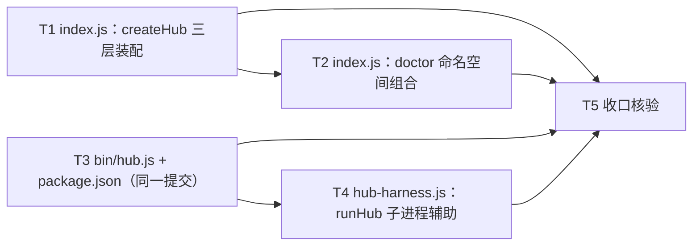

# pr-004-tasks.md — pr-004 内部任务图（双消费入口 `bin/hub.js` + 库入口 `sdk/index.js` + `hub-harness.js`）

**迭代**: 0025-hub-sdk-and-skill ｜ **阶段**: 5（PR 实现）· 第四波 ｜ **PR 文件**: `prs/pr-004-sdk-dual-entry-and-hub-harness.md`
**worktree**: 本 PR worktree（分支 `feat/0025-pr-004-sdk-dual-entry-and-hub-harness`；HEAD = `453326c` = 迭代分支 tip，含已合并 pr-001 / pr-002 / pr-003 / pr-005；落盘时 `git status --porcelain` 为空）｜ **任务总数**: **5**（T1~T5）｜ **依赖图**: **无环**（见 §2）
**输入真源**: PR 文件（4 文件 / F01·F09·F13·G01 四卡，11 条验收）+ `architecture.md` v1.0.0（§2.1 组件图、§2.2 流 1~3、§2.3 接缝表、§3.1 L1-1、§3.2 L2-1/L2-3/L2-11、§3.3 P-1~P-4、§4.1 **N-1·N-2·N-11**、§4.2 **M-1**、§4.3 Z-1~Z-7、§4.4 **顺序约束 6**、§5.2 库 API、§5.4、§5.5、§5.6 入口定位模板、§6 T-03、§7 F01·F09·F13·G01 行、§8 C7、§10 测试基建约束）+ `prd/{F01,F09,F13,G01}*.md` + **已合并前序产物**（`oamp/sdk/{errors,http,uds,surface,cli,doctor}.js`、`oamp/skill/hub.md`、`oamp/test/sdk-skill.test.js`）+ 代码库实读（§0.3 逐条带 `文件:行号`）

> **本 PR 是"两面合一"的落点**：`bin/hub.js`（CLI 面第二入口）+ `sdk/index.js`（库面入口）都**只做装配 / 转发**，一切通道与行为面已在 pr-003 的 `surface.js` / `cli.js` / `doctor.js` 落定 ⇒ 本 PR 的判据以**真入口实测**（子进程 + 库 import）为主，**零 `.test.js` 新增或修改**（新增的 `hub-harness.js` 是**交付物本身**（跨 PR 契约），不是本 PR 的验收脚本 —— 〔§0.4 契约 9 / §5 登记 ①〕）。
> **流程口径（用户 2026-09-15 指令）**：中间 PR **不跑仓库级全量套件** ⇒ T5 只跑与本 PR 改动面最近的两条既有面（`hygiene` / `sdk-skill`），全量集中在所有开发完成后跑一次（驱动收口修复 PR）。
> **交付物**: `docs/iterations/0025-hub-sdk-and-skill/prs/pr-004-tasks.md`（本文件，阶段产物，不计入 PR 改动面）。

---

## 0. 范围、文件面与事实锚点

### 0.1 本 PR 文件范围（唯一可写面；**恰 4 个文件**）

| # | 文件 | 动作 | 内容（任务归属） |
|---|---|---|---|
| 1 | `oamp/sdk/index.js` | **新建**（~30 行，impl `N-2`） | 库入口 `createHub({ port, socketPath })` → `{ api, uds, cli, doctor }`：三层命名空间**委托** `surface.js` 的 `createSurface`（同一张入口表），`doctor` 命名空间由**本文件组合** `doctor.js` 的 `check`（**T1** 三层装配 / **T2** doctor 组合） |
| 2 | `oamp/bin/hub.js` | **新建**（~4 行，impl `N-1`） | 第二个可执行入口，形态**逐字沿用** `bin/oamp.js`：`import { main } from '../sdk/cli.js'; process.exitCode = await main(process.argv.slice(2));`（**T3**） |
| 3 | `oamp/package.json` | **修改**（`bin` 字段追加 `"hub": "./bin/hub.js"`；**只加这一个键**，impl `M-1`） | 与 `bin/hub.js` **同一提交**（§4.4 顺序约束 6）（**T3**） |
| 4 | `oamp/test/helpers/hub-harness.js` | **新建**（~50 行，impl `N-11`） | 起 `node <包根>/bin/hub.js` 子进程 + 收集 stdout/stderr/退出码 + 限时退出；导出 `runHub(args, { env, input, timeoutMs })` → `{ code, stdout, stderr }`（**跨 PR 接口契约**：pr-007 / pr-008 / pr-009 / pr-010 直接消费）（**T4**） |

> 本阶段产物 `prs/pr-004-tasks.md`（本文件）不计入改动面。

### 0.2 非目标（零改动 / 防夹带）

- **零改动清单**（PR 文件验收 11 / architecture §4.3 Z-1~Z-7）：`oamp/src/**`（全部既有模块）、`oamp/API.md`、`oamp/llms.txt`、`oamp/README.md`、`oamp/web/**`、`oamp/test/*.test.js`（既有 **33** 个）、`oamp/test/helpers/{harness,fake-node}.js`、`roles/**`、`tools/**`、`.claude/skills/**`。
- **已合并产物只消费不修改**（diff 必须为空）：`oamp/sdk/{errors,http,uds,surface,cli,doctor}.js`（6 个模块）、`oamp/skill/hub.md`、`oamp/test/sdk-skill.test.js`。
- **不实现**（属其他 PR）：`test/sdk-{surface,api,uds,cli-contract,doctor}.test.js`（pr-006~pr-010）；`skill/hub.md`（pr-005，已合并）；任何 README / 文档改动（未要求即不做）。
- **不新增**：路由 / 端点 / 方法 / 配置键 / env 键 / 配置文件 / 目录 / 第三方依赖 / 测试文件 / 测试框架 / CI 脚本。
- **不新增 `createHub` 的公开选项**（`{ port, socketPath }` 恰两个；`env` / `stdio` 不透传 —— 〔§0.4 契约 1〕/ §5 **MI-4**）。
- **不做通道实现**：HTTP / SSE / UDS / 层 C `spawn` 全在 pr-003 的 `surface.js` / `http.js` / `uds.js`；本 PR 的两文件**零连接逻辑、零端点数据**。
- **不做自动性 / 生命周期 / 跨端点语义**（L2-9 / N3 / N5 / G02 验收 3）：无重试 / 重连 / 心跳循环 / 编排命令。

### 0.3 读码事实锚点（2026-09-15 实读，HEAD `453326c`；判据基础）

| # | 事实 | 位置 |
|---|---|---|
| **A1** | `oamp/package.json` 全文 8 行：`name: oamp` / `private: true` / `type: module` / `bin: {"oamp": "./bin/oamp.js"}`（**无 `hub` 键**）/ `engines.node: ">=22"` / `scripts.test: "node --test test/*.test.js"` / `dependencies: {}` | `oamp/package.json` |
| **A2** | 被逐字沿用的形态：`bin/oamp.js` 全文 **4 行** = shebang `#!/usr/bin/env node` + 单行注释 + `import { main } from '../src/cli.js';` + `process.exitCode = await main(process.argv.slice(2));`；git 索引 mode = **`100755`** | `oamp/bin/oamp.js`；`git ls-files -s` |
| **A3** | `sdk/cli.js` 导出 `main(argv)`（**返回数字**，不自行 `process.exit`）：`:311-327`；`head === '--help'` ⇒ 打印用法 + 返回 `0`（不建连接）；`head === 'doctor'` / `'cli'` / 层前缀分派；未知层 ⇒ `usageError`（`2`） | `oamp/sdk/cli.js:311-327` |
| **A4** | CLI 面的失败面与退出码：`fail(err)` 写 stderr **恰一行** `JSON.stringify(serializeError(...))` 并返回 `exitCode`（`:178-182`）；`usageError` 恒 `2`（`:185-188`）；层 A / 层 B 分派时 `createSurface({ port: parsed.port, stdio: 'inherit' })`（`:248`）；层 C `createSurface({ stdio: 'inherit' })`（`:273`） | `oamp/sdk/cli.js:178-188`、`:248`、`:273` |
| **A5** | CLI 面的本地选项面：`--human`（层 A/B 通用）、`--port`（**仅层 A**）、`--params`（仅层 B）、`--as`（仅 `acceptsAs` 4 条）；其余 ⇒ `2`；位置参数与必填 flag 的齐否 ⇒ `2`（P-3 口径） | `oamp/sdk/cli.js:27-35`、`:56-96` |
| **A6** | `sdk/surface.js` 的导出面（pr-003 冻结契约，**只能消费、不得改名**）：`LAYERS`（`:37`）、`ENTRIES`（**:344**，恰 40 条）、`createSurface(opts)`（`:377-395`）→ `{ ctx, api, uds, cli }`；`opts = { port, socketPath, env, stdio }` | `oamp/sdk/surface.js:37`、`:344`、`:377-395` |
| **A7** | 端口缺省链的**唯一落点**：`const port = opts.port ?? Number(env.OAMP_WEB_PORT \|\| DEFAULT_PORT)`（`DEFAULT_PORT = 7788`）；`ctx = { port, socketPath: opts.socketPath ?? null, env, stdio: opts.stdio === 'inherit' ? 'inherit' : 'capture' }` | `oamp/sdk/surface.js:34`、`:377-391` |
| **A8** | 库面三层命名空间的装配：`buildApiNamespace(ctx)`（`:357-372`）遍历**同一份** `ENTRIES` 建层 A 方法树；`uds: { connect: (o) => connectWithCtx(ctx, o) }`（`:392`）→ `connectUds({ socketPath: ctx.socketPath ?? undefined, env: ctx.env, ...opts })`（`:225-227`）；`cli: { run: (args) => CLI_ENTRIES[0].run(capture, { tokens: args }) }`（`:393`，**capture** ⇒ 返回 `{ exit_code, stdout, stderr }`） | `oamp/sdk/surface.js:225-227`、`:357-372`、`:392-393` |
| **A9** | 层 C 的 `spawn` 原语：`spawn(process.execPath, [OAMP_BIN, ...tokens], { stdio: inherit ? 'inherit' : ['ignore','pipe','pipe'] })`；`OAMP_BIN = path.join(PKG_ROOT, 'bin', 'oamp.js')`、`PKG_ROOT` 按 `import.meta.url` 推导（与 cwd 无关）；`inherit` ⇒ `{ exit_code }`、`capture` ⇒ `{ exit_code, stdout, stderr }`（用 `StringDecoder` 逐字节保真） | `oamp/sdk/surface.js:32-33`、`:290-303` |
| **A10** | 「同一份入口表驱动两面」的**结构事实**：CLI 面 `matchEntry(layer, rest)` 按 `entry.cmd` 前缀最长匹配后调 **`entry.run`**（`cli.js:100-108`、`:242`）；库面 `buildApiNamespace` 的闭包同样在**调用时刻**取 `entry.run`（`surface.js:363`）⇒ 两面对**同一个条目对象**的改动同时生效（`apiEntry` 把 `cmd` / `args` / `flags` 数组与 `spec` **共享同一引用**，唯 `method` / `path` / `kind` 是字符串拷贝，`runApi` 读的是闭包里的 `spec`） | `oamp/sdk/cli.js:100-108`、`:242`；`oamp/sdk/surface.js:49-77`、`:81-93`、`:357-372` |
| **A11** | `sdk/doctor.js` 导出 `check({ apiDocPath = <包根>/API.md, port } = {})`（`:193`）；`PKG_ROOT` / `API_DOC_PATH` 按 `import.meta.url` 推导（`:21-22`）；R3 探针 `await connect({})`（`:160`，**无 `socketPath` 入参** ⇒ 走 `src/config.js` 的 env 链）；R2/R1 走 `request({port, method:'GET', path:'/api/docs', ...})`（`:195`） | `oamp/sdk/doctor.js:21-22`、`:160`、`:193-196` |
| **A12** | `sdk/uds.js` 的 socket 解析：显式 `socketPath` 优先，否则**惰性** `import('../src/config.js')` 的 `loadConfig(opts.env \|\| process.env).socketPath`（`:34-42`）；失败归 `CONFIG_ERROR` / `1` | `oamp/sdk/uds.js:34-42`、`:97-98` |
| **A13** | 默认路径一律按**包根**推导、与 cwd 无关：`socketPath = env.OAMP_SOCKET \|\| <包根>/.runtime/router.sock`（`:144`）；`dbPath = path.resolve(PKG_ROOT, env.OAMP_DB \|\| 配置 \|\| 'data/sql.db')`（**:154**，相对值基准 = 包根 ⇒ **相对 `OAMP_DB` 也会写进仓库**）；`CONFIG_FILE = <包根>/config.json`（`:11`）；模块顶层 `export default loadConfig()`（`:166`，import 期即执行） | `oamp/src/config.js:10-11`、`:136-166` |
| **A14** | 静态卫生面的**扩容**：`test/hygiene.test.js` 的扫描面 = `bin/` 与 `src/` 的 `*.js` **平铺** + `package.json`（`:26-39`）；7 个凭据词（`:16-25`）；`.gitignore` 含 `.runtime/`（`:41-44`）；`dependencies` 为空（`:61-63`）⇒ **新增 `bin/hub.js` 进入扫描面**，`oamp/sdk/**` 不在凭据面 | `oamp/test/hygiene.test.js:16-25`、`:26-39`、`:41-44`、`:61-63` |
| **A15** | 可复用的既有测试手法（供 T4 / T5 判据照做）：`helpers/harness.js` 的 `OAMP_ROOT` / `BIN` 按 `import.meta.url` 推导（`:15-16`）、`SHORT_ENV`（`:19-23`）、`makeTempSocketDir()`（`:25-27`）、`buildEnv(socketPath, extra)`（`:29-31`）、`waitFor`（`:34-42`）、`collectStream`（`:44-77`，按行切分 + `waitNth`）、`startRouter` 的 `spawn(process.execPath, [BIN,'router','start'], { cwd: OAMP_ROOT, env, stdio: ['ignore','pipe','pipe'] })`（`:106-112`）、`stopAll`（`:193`）；`web.test.js` 的 `ROOT` / `BIN`（`:20-21`）、`pickPort()`（`:118-120`）、`LEASE_ENV`（`:123`）、`startWeb`（`:125-130`，等 `WEB_READY`） | `oamp/test/helpers/harness.js`；`oamp/test/web.test.js:20-21`、`:118-130` |
| **A16** | 测试面计数：`oamp/test/*.test.js` = **33**（含已合并 `sdk-skill.test.js`）；`oamp/test/helpers/` = **2**（`harness.js` / `fake-node.js`）；`scripts.test = node --test test/*.test.js` ⇒ 只拾取 `*.test.js`，新增 `hub-harness.js` **不改变用例拾取面** | 实测 + A1 |
| **A17** | 本 worktree 现状：分支 `feat/0025-pr-004-sdk-dual-entry-and-hub-harness`；HEAD `453326c`；`git status --porcelain` 为空；`oamp/sdk/` = 6 文件；`oamp/bin/` = 1 文件（`oamp.js`）；`oamp/test/helpers/` = 2 文件；**`oamp/bin/hub.js` / `oamp/sdk/index.js` / `oamp/test/helpers/hub-harness.js` 均不存在**（本 PR 新建）；`oamp/.runtime` 与 `oamp/data` **均不存在**；`oamp/.gitignore` = `.runtime/` + `data/` 两行（无 `config.json`） | 实测（目录列举 + `git status`） |
| **A18** | 已合并 pr-005 的**机械锁**：`oamp/skill/hub.md` 钉死 40 条入口名面（层 A 21 / 层 B 8 / 层 C 11，逐字）+ `doctor` 单列「自检（不属于三层封装）」+ 退出码四值；`oamp/test/sdk-skill.test.js` 逐条断言 ⇒ **`bin/hub.js` 是同一名面的另一侧**，本 PR 不得改变任何入口名面 | `oamp/skill/hub.md`；`oamp/test/sdk-skill.test.js` |

### 0.4 本 PR 内冻结契约（每个任务都必须遵守；跨 PR 接缝在此一次定死）

1. **`createHub` 的签名与返回面**〔§5 **MI-3**/**MI-4**〕：`export function createHub({ port, socketPath } = {})` → **恰四键** `{ api, uds, cli, doctor }`：
   - `api` / `uds` / `cli` = `createSurface({ port, socketPath })` 的**同名返回值原样**（不重建、不包装、不改名）；
   - `doctor` = `{ check: (opts = {}) => doctorCheck({ port: ctx.port, ...opts }) }` —— `port` 由 `ctx` **绑定**、`apiDocPath` 原样透传、显式 `opts.port` 可覆盖；
   - **不新增第三个公开选项**（不透传 `env` / `stdio`）；`createHub()` 的 port 缺省链由 `createSurface` 承担（A7）⇒ `index.js` 内**零** `OAMP_WEB_PORT` / `7788` 字面量。
2. **`bin/hub.js` 的形态**（跨 PR 契约，A2）：4 行、逐字沿用 `bin/oamp.js`，唯二差异 = 注释文案与 `import` 路径（`'../sdk/cli.js'`）；**不**解析 argv、**不**包 try/catch、**不**自行 `process.exit()`。
3. **`package.json` 的改动面**（A1 / M-1）：语义改动**恰一处键** = `bin` 新增 `"hub": "./bin/hub.js"`；`bin.oamp` 值不变；`name` / `private` / `type` / `engines.node` / `scripts.test` / `dependencies` 逐字不变。
4. **`runHub` 的签名（跨 PR 接口契约，pr-007~pr-010 已按此编写）**：`export async function runHub(args, { env, input, timeoutMs } = {})` → `Promise<{ code, stdout, stderr }>`（**键恰三个**）；被执行对象 = `node <包根>/bin/hub.js`；`stdout` / `stderr` = 完整字符串，`code` = 退出码（信号终止时 `null`）。
5. **`runHub` 语义细节**〔§5 **MI-1**〕：`env` = `{ ...process.env, ...(opts.env ?? {}) }`（调用方只给增量，harness **不补**任何默认路径）；`input` 给出 ⇒ 写 stdin 后 `end()`，未给 ⇒ `stdin: 'ignore'`；`timeoutMs` 到限 ⇒ SIGKILL + 等退出后返回（`code === null`），缺省 `10000` ms；`cwd` 缺省 = `os.tmpdir()`（**结构性证明 cwd 无关** —— F13 验收 2/3）。
6. **零 cwd 依赖**（L2-11 / A9 / A13）：包内一切路径按 `import.meta.url` 推导；`bin/hub.js` 的 `../sdk/cli.js`、harness 的 `<包根>` 推导均如此；判据含"从系统临时目录执行"。
7. **临时状态一律落系统临时目录**（§10 测试基建约束）：`OAMP_SOCKET` / `OAMP_DB` 必须是**绝对**临时路径（A13：相对 `OAMP_DB` 的基准是包根 ⇒ 会写进仓库）；harness 自身不创建任何目录 / 文件。
8. **零自动性**（L2-9 / G02 验收 3）：无重试、无重连、无退避、无失败重派、无心跳循环。
9. **验收方式不入库**（硬约束）：本 PR **零 `.test.js` 新增 / 修改**（`oamp/test/*.test.js` 仍 33 个，A16）；判据 = 一次性脚本（`/tmp/*.mjs` 或 `node --input-type=module -e`）+ 真服务实测 + 两条 **scoped** 既有用例（T5 验收 5）。`hub-harness.js` 是**交付物**（跨 PR 契约），不是本 PR 的验收脚本。
10. **分类与生命周期不入本 PR**：`errors.js` 的 8 个 observation `kind`、退出码归类表、`--human` 渲染均在 pr-001 / pr-003；本 PR 只**消费**（`main` 的返回值 / `createSurface` 的命名空间 / `check` 的返回值）。

---

## 1. 任务列表

### T1: `oamp/sdk/index.js` —— `createHub({ port, socketPath })` 的三层装配（`api` / `uds` / `cli`）

- **验收标准**:
  1. **文件与依赖面**：`oamp/sdk/index.js` 存在；import 集合 ⊆ `./surface.js`（T2 后加 `./doctor.js`），**零** `node:*` 副作用 import、零第三方、**零 `../src/**` 直接 import**、零 `./http.js` / `./uds.js` / `./errors.js` / `./cli.js` 直接 import（通道与行为面全在 pr-003）。判据 = 文件头逐条核对 + 加载即成功（无 TDZ / 循环 import）。
  2. **可被绝对路径 import 消费**（PR 验收 5 / F01 验收 3 / F13 验收 4）：从**系统临时目录**执行 `await import('<包根>/oamp/sdk/index.js')` 得 `createHub`（函数）；`createHub()` 返回对象的键集合**含** `api` / `uds` / `cli`（`doctor` 由 T2 补齐 ⇒ 该条只判前三键，四键齐备判在 T2 验收 1）；不需 `cd`、不依赖 cwd、零本机路径字面量。判据 = 一次性脚本（cwd = `os.tmpdir()`）import 后断言 + `typeof createHub === 'function'`。
  3. **三层命名空间来自同一张入口表**（PR 验收 5 / §5.2 规则 1 / A6 / A8）：`api` = 层 A 21 方法（含二级 `chats.*` / `messages.send` / `stream.*` / `projects.*` / `calls.*` / `confirmations.*`）、`uds` = `{ connect }`（会话含 8 方法 + `close`）、`cli` = `{ run }`；`hub.api.agents({ state: 'online' })` 对**运行中** hub 返回**服务端响应体原对象**（与 `node:http` 直连结果 `deepEqual`、不加信封 / 不改字段名 —— §5.2 规则 2）；`hub.cli.run(['status'])` 返回 **`{ exit_code, stdout, stderr }` 三键**，与直跑 `oamp status` 的输出 / 退出码逐字节一致。判据 = 起真 Router（临时 socket，A15 做法）+ `web start`（随机端口 + **绝对**临时 `OAMP_DB`，A15 的 `startWeb` 做法）后逐一实测。
  4. **port 的缺省链委托**（PR 验收 5 / A7 / 〔§0.4 契约 1〕）：`createHub({ port: <运行中端口> })` 的 port 生效（同一条 `api.agents()` 打中该端口）；**`index.js` 内不重复实现缺省链** —— 文本检索 `OAMP_WEB_PORT` 与 `7788` 在 `index.js` 内**零命中**。判据 = 两态实测（显式 port / `OAMP_WEB_PORT` 环境变量态）+ 文本检索。
  5. **socketPath 委托**（§5.2 / A8 / A12）：`createHub({ socketPath: <临时 socket> })` ⇒ `hub.uds.connect()` 连到该 socket（显式优先、不读 env、不解析默认）；不传时由 `uds.js` 的既有链解析（A12）。判据 = 临时 socket + 真 Router 下一例成功（`await s.status()` 返回对象）+ 一例不传 socketPath（经 `OAMP_SOCKET` 环境变量）成功。
  6. **每次新对象 / 无模块级可变状态 / 零本地写**（PR 验收 7 / F09 验收 1·3 / §5.2 规则 4）：`createHub() !== createHub()`、`h1.api !== h2.api`、`h1.uds !== h2.uds`、`h1.cli !== h2.cli`，且 `h1.api.agents = <stub>` 一类就地改动**不污染** `h2`；模块级零可变绑定（无模块级 `let` / 缓存 / 单例）、零 `node:fs`（含只读 API 亦不必要）、零 `.runtime` / `data` 字面量。判据 = 脚本断言 + 文本检索 + 实测前后 `oamp/.runtime` 与 `oamp/data` 仍不存在（A17 基线）。
  7. **零越界**：本任务 diff 只含 `oamp/sdk/index.js`。

- **前置依赖**: 无（消费已合并 pr-003 的 `createSurface` / A6；`bin/hub.js` 不参与本任务判据）
- **优先级**: P0
- **追溯**: PR 文件「文件范围」1 + 验收 5 / 6 / 7 / 10；architecture §2.1（`IDX --> SUR`）/ §2.2 流 1·流 2 的库面表述 / §3.2 **L2-3**·**L2-11** / §4.1 **N-2** / §4.4 顺序约束 3 / §5.2 全节（尤其规则 1·2·4）/ §6 **T-03** / §7 F01 行·F09 行 / §8 C8；prd/F01 验收 2·3·5、F09 验收 1·3、F13 验收 4；事实 A6 / A7 / A8 / A9 / A12 / A13 / A17

### T2: `oamp/sdk/index.js` —— `doctor` 命名空间由本文件组合（不并入 `surface.js`）

- **验收标准**:
  1. **四键齐备、恰四键**（PR 验收 5 逐字 / 〔§0.4 契约 1〕/ §5 **MI-3**）：`createHub()` 返回对象的键集合 `deepEqual(['api','uds','cli','doctor'])`（**顺序不限、不得多键**）；`doctor.check` 为函数；`createHub({port}).doctor` 与 `createHub({port}).api` 互不共享可变状态。
  2. **`port` 由本文件绑定**（§5.2 库面示例 / §5.5 / A11）：对**运行中** hub，`createHub({ port: <运行中端口> }).doctor.check()` 返回 `{ pass, items }`（`items` 每项含 `id` / `ok` / `expected` / `actual`）；对**未监听端口** ⇒ **抛 `HubError` 且 `exitCode === 3`**（不返回部分 `items`，与 CLI 面 `hub doctor` 的失败面同源 —— §5.5「hub 不可达 ⇒ R1/R2 立即降级、不半跑」）。判据 = 两态实测 + `assert.rejects` 逐字段断言。
  3. **`apiDocPath` 注入透传**（**跨 PR 契约**，pr-010 消费 / A11）：`hub.doctor.check({ apiDocPath: <临时目录内的 API.md 副本> })` 的注入面生效 —— 用一份**人为制造漂移**的副本（临时目录内，**不写仓库文件**）⇒ `pass === false` 且失败项**点名端点**；用 `API.md` 原文副本 ⇒ `pass === true`。判据 = 两副本对照实测。
  4. **不重写判据、不二次包装**（§5.2 规则 2 / §5.5）：`index.js` 内**零** `API.md` 字面量、零 `/api/docs` 字面量、零 404 / 路由兜底判据、零 items 合并 / 改名；`doctor` 命名空间只做「绑定 port + 转发 `apiDocPath`」。判据 = 文本检索 + `check()` 返回值与直调 `doctorCheck({port})` 的结果 `deepEqual`。
  5. **零状态 / 零本地写**（F09 验收 1·3 / §5.2 规则 4）：两次 `check()` 返回对象不共享引用（无缓存）；`index.js` 零 `node:fs`；实测前后仓库内零新增文件（`oamp/.runtime` / `oamp/data` 不存在、`git status --porcelain` 为空）。
  6. **零越界**：本任务 diff 只含 `oamp/sdk/index.js`（与 T1 同文件 ⇒ **串行**；任务边界 = T1 只装配三层、T2 只加 `doctor` 键）。

- **前置依赖**: T1（同一文件的装配骨架与 `ctx`；**串行写同一文件**）
- **优先级**: P0
- **追溯**: PR 文件「文件范围」1 + 验收 5；architecture §2.1（`IDX --> SUR` 与 `DOC` 的装配归属）/ §3.1 L1-1 附带说明 / §4.1 **N-2** / §4.4 顺序约束 4 / §5.2 规则 1·2·4 / §5.5 全节 / §6 **T-02**·**T-03** / §7 F01 行·F11 行 / §8 C6；prd/F01 验收 3；事实 A6 / A7 / A11 / A12

### T3: `oamp/bin/hub.js`（新建）+ `oamp/package.json`（追加一行）—— 第二可执行入口（**同一提交**）

- **验收标准**:
  1. **与 `bin/oamp.js` 同形**（PR 验收 2 / architecture §4.1 **N-1** / A2）：`oamp/bin/hub.js` 全文 4 行 = `#!/usr/bin/env node` + 单行注释 + `import { main } from '../sdk/cli.js';` + `process.exitCode = await main(process.argv.slice(2));`；**不**解析 argv（除 `process.argv.slice(2)` 这一处外零 argv 处理）、**不**包 try/catch、**不**自行 `process.exit()`、**不** import `../src/**`。判据 = 与 `bin/oamp.js` 逐行 diff（唯二差异 = 注释文案与 import 路径）+ 文本检索零命中 `process.exit(` / `try {`。
  2. **可执行位 = `100755`**（与 `bin/oamp.js` 的 git 索引 mode 一致）〔§5 **MI-2**〕。判据 = `git ls-files -s oamp/bin/hub.js`。
  3. **`package.json` 的语义改动恰一处键**（PR 验收 1 / §4.2 **M-1** / A1 / 〔§0.4 契约 3〕）：`bin` 新增 `"hub": "./bin/hub.js"`；`name` / `private` / `type` / `engines.node` / `scripts.test` / `dependencies` **逐字不变**，`bin.oamp` 值不变。判据 = ① `JSON.parse` 后逐键与本任务「事实 A1」的原值 `deepEqual`；② `git diff` 逐行核对 —— **由 JSON 语法必然产生的行尾逗号追加不计为第二处改动**（原文最后一件 `"oamp": "./bin/oamp.js"` 因追加键而在行尾多一个 `,`），`dependencies` 仍 `{}`。
  4. **从仓库之外的任意目录执行正常且结果一致**（PR 验收 3 / F13 验收 2·3·4）：在**系统临时目录**（cwd 在仓库外）执行 `node <包根>/oamp/bin/hub.js --help` 与 `node <包根>/oamp/bin/hub.js api docs --port <运行中端口>` **均正常**，stdout / stderr / 退出码与在仓库根执行**逐字节一致**；**不需要 `cd` 前置**、不依赖 `~`、除显式 `--port` 外无环境变量前置。判据 = 两个 cwd（仓库根 ‖ 系统临时目录）各跑两条命令，三面（stdout / stderr / 退出码）逐字节比对。
  5. **真实入口的退出码与输出契约成立**（§5.3 / §5.4 / F07 / A3 / A4 / A5）：经 `bin/hub.js` 子进程实测 —— ① `hub api docs --port <运行中端口>` ⇒ `0` + stdout 单 JSON 文档 + stderr 空；② `hub api bogus` ⇒ `2` + stdout 空 + stderr **恰一行** JSON（`code: 'USAGE'`）；③ `hub api docs --port <未监听端口>` ⇒ `3` + `code: 'HUB_UNREACHABLE'`（无堆栈）；④ `hub cli status` ⇒ 与直跑 `oamp status` 的 stdout / stderr / 退出码**逐字节一致**（Router 不可达态两侧同为 `1`，**透传不重分类** —— P-2 / §5.4 要点 / A4）。判据 = 四态并列表。
  6. **零凭据类字段名**（PR 验收 4 / G01 验收 3 / §8 **C7** / A14）：`bin/hub.js` 内 7 个词（`token` / `api_key` / `secret` / `password` / `credential` / `authorization` / `private_key`，词边界、大小写不敏感）**零命中** —— `bin/*.js` 已进入 `test/hygiene.test.js` 的扫描面。判据 = 文本检索 + T5 验收 5 的该用例。
  7. **零新增依赖**（PR 验收 10 / F01 验收 5 / C1）：`dependencies` 仍 `{}`；`bin/hub.js` 零第三方 import、只 import `../sdk/cli.js`。
  8. **同一提交**（§4.4 **顺序约束 6**）：`oamp/bin/hub.js` 与 `oamp/package.json` 的 bin 一行**落在同一 commit**（否则 bin 指向不存在的文件）。判据 = `git log -1 --name-only` 同时列出两文件（或该 commit 的 diff 同时含两者）。
  9. **零越界**：本任务 diff 只含 `oamp/bin/hub.js` + `oamp/package.json`（两者构成一个原子交付单元 ⇒ **不拆成两个任务**，因为拆开会制造"bin 指向不存在文件"的中间坏态）。

- **前置依赖**: 无（`../sdk/cli.js` 的 `main(argv)` 由已合并 pr-003 提供 —— A3；`sdk/index.js` 不被 `bin/hub.js` 依赖）
- **优先级**: P0
- **追溯**: PR 文件「文件范围」2·3 + 验收 1 / 2 / 3 / 4 / 10 / 11；architecture §2.1（`BIN --> CLI`、`SK -.-> BIN`）/ §3.1 **L1-1**（待拍板项的唯一实施点）/ §4.1 **N-1** / §4.2 **M-1** / §4.3 Z-7（`bin/hub.js` 在 hygiene 扫描面）/ §4.4 **顺序约束 6** / §5.1 入口形态 / §5.3 / §5.4 / §5.6 入口定位模板 / §6 **T-01** / §7 F01 行·F13 行 / §8 C7；prd/F01 验收 1·5、F13 验收 1·2·3·4、G01 验收 3；事实 A1 / A2 / A3 / A4 / A5 / A13 / A14 / A18

### T4: `oamp/test/helpers/hub-harness.js`（新建）—— `runHub` 子进程辅助（**跨 PR 接口契约**）

- **验收标准**:
  1. **导出签名逐字**（PR 验收 8 —— **跨 PR 接口契约**，pr-007 / pr-008 / pr-009 / pr-010 直接消费）：`export async function runHub(args, { env, input, timeoutMs } = {})` → `Promise<{ code, stdout, stderr }>`（**键恰三个**、不得改名、不得改返回形状、不得加必需参数）。判据 = 文本核对 + 一致性实测（返回对象 `Object.keys` 排序后 `deepEqual(['code','stderr','stdout'])`）。
  2. **被执行对象 = `node <包根>/bin/hub.js`**（PR 验收 8 逐字）：`<包根>` 按 `import.meta.url` 从本文件位置 `..`/`..` 推导（与 A15 的 `OAMP_ROOT` 同口径），**不依赖 cwd**、零本机路径字面量、零 `~`。判据 = 文本核对 + 从系统临时目录调用成功。
  3. **输出收集完整**：`stdout` / `stderr` 为完整字符串（同一进程的多次写入不丢、不截断，含**未以换行结尾的尾部**），`code` 为退出码 `number`（信号终止时 `null`）。判据 = ① `runHub(['--help'])` 的 stdout 覆盖全部三层清单（含末行）；② `runHub(['api','bogus'])` 的 stderr 恰一行 JSON 且可 `JSON.parse`。
  4. **`input` 语义**〔§5 **MI-1**〕：给出 `input` ⇒ 写入子进程 stdin 后 `end()`；未给 ⇒ stdin 关闭（`'ignore'`）——任何路径下子进程都**不因等待 stdin 而挂起**。判据 = ① 不给 `input` 跑 `runHub(['--help'])` 正常返回；② 给 `input: ''` 跑 `runHub(['cli','status'], {env})` 正常返回（层 C 的既有命令不受 stdin 影响）。
  5. **`timeoutMs` 语义**（PR 验收 8「限时退出」/ §5 MI-1）：到限 ⇒ SIGKILL 该子进程并**等其退出**后返回（**不留残留进程**）；超时态 `code === null`、`stdout` / `stderr` 为已收集部分；缺省上限 = `10000` ms（订阅类用例显式传更大值）。判据 = 对一条**必然长驻**的命令（如 `runHub(['cli','web','start','--port',<随机>], {timeoutMs: 1500})`，env 指向临时库）实测：① 返回耗时 ∈ (1500, 3000)ms；② `code === null`；③ 该 PID 已消失（`process.kill(pid, 0)` 抛 `ESRCH`）。
  6. **`env` 语义**〔§5 MI-1〕：`{ ...process.env, ...(opts.env ?? {}) }`（调用方只给增量）；harness **不补**任何默认路径（不注入 `OAMP_SOCKET` / `OAMP_DB` / `OAMP_WEB_PORT`）。判据 = 文本核对 + 一例"只给 `OAMP_SOCKET` 即连上临时 Router"（`runHub(['uds','router.status','--params','{}'], {env:{OAMP_SOCKET:<临时>}})` ⇒ `0` + stdout 可解析）。
  7. **零本地写 / 不写仓库内运行态**（PR 验收 9 / §10 测试基建约束 / A13）：harness 自身**零 `node:fs` 写 API**（无 `writeFile` / `appendFile` / `mkdir` / `mkdtemp` / `createWriteStream` / `rm`）、零 `.runtime` / `data` 字面量；临时 socket / 临时库**一律由调用方经 `env` 传入**（可选**只读** import A15 的 `makeTempSocketDir()` / `buildEnv()`，**不得修改 `harness.js`**）。判据 = 文本检索 + 冒烟实测前后 `oamp/.runtime` 与 `oamp/data` 仍不存在、`git status --porcelain` 为空。
  8. **零新依赖 / 零新工具**（C1 / §2.3）：import 面 ⊆ `node:*`（+ 可选 `./harness.js`）；不引入测试框架、不新增 CI 脚本、**不改** `package.json` 的 `scripts`。
  9. **不修改既有测试面**（§10 / A16）：`oamp/test/helpers/harness.js` 与 `fake-node.js` **零 diff**；不新增任何 `*.test.js`（`oamp/test/*.test.js` 仍 **33**）；`hub-harness.js` 不被 `node --test test/*.test.js` 拾取为用例（只作 helper 被 `import`）。
  10. **冒烟可用**（PR 验收 8 / 供 pr-007~pr-010 消费的可用性）：经 `runHub` 实测四态 —— ① `['--help']` ⇒ `code 0` + 非空 stdout（零连接）；② `['api','bogus']` ⇒ `code 2` + 空 stdout + 单行 JSON stderr；③ `['api','docs','--port','<未监听端口>']` ⇒ `code 3`；④ `['api','docs','--port','<运行中端口>']` ⇒ `code 0` + stdout 可 `JSON.parse` 且含 `routes` 键。判据 = 四态并列表 + 与「不经 harness 的直接 `spawn`」结果逐字节一致（证明 harness 不加工输出）。
  11. **零越界**：本任务 diff 只含 `oamp/test/helpers/hub-harness.js`。

- **前置依赖**: T3（被执行的 `bin/hub.js` 必须存在 —— 验收 10 的四态冒烟全部经它）
- **优先级**: P0
- **追溯**: PR 文件「文件范围」4 + 验收 8 / 9；architecture §4.1 **N-11**（「仅在前项确有复用时才建」——本迭代 pr-007~pr-010 四个用例消费）/ §4.4 顺序约束 3 / §5.3 / §5.4 / §10 测试基建约束（不修改既有 `harness.js`、临时目录、不依赖真实 omp / 外网）/ §6 **T-07** / §7（全局）；prd/F09 验收 1·3、G01 验收 3；事实 A1（`scripts.test`）/ A13 / A14 / A15 / A16 / A17

### T5: 收口核验（两面同源 / 跨宿主一致 / 改动面封闭 / scoped 回归 / 无状态）

- **验收标准**:
  1. **同一份入口表驱动两面**（PR 验收 6 / F01 验收 2 / §5.2 规则 1 / A10）：三面判据 ——
     ① **结构**：`sdk/index.js` 内**零端点数据 / 零路径 / 零 flag 名**（文本零命中 `/api/`、零 `agents` / `chats` / `calls` 一类端点名、零 `--` 选项名字面量）；两面同源由 `cli.js` 的 `matchEntry`（`:100-108`）与 `surface.js` 的 `buildApiNamespace`（`:357-372`）都从**同一 `ENTRIES`** 派生证明。
     ② **行为（一次性脚本，零文件改动、零落盘）**：就地改动**一个**条目对象（用其**共享引用**的字段：`cmd` 数组与 `run`）—— 例：取 `ENTRIES` 中 `api docs` 的条目，把 `cmd[0]` 改为新名并让 `run` 返回哨兵值 ⇒ (a) CLI 面 `main(['api','<新名>'])` **派发成功**并把该哨兵写到 stdout；(b) 库面 `createHub().api.<新名>()` 返回**同一哨兵**；(c) **旧名在两面同时消失**（`main(['api','docs'])` ⇒ `2`；`createHub().api.docs === undefined`）；(d) 全程 `git status --porcelain` 为空、`surface.js` / `cli.js` zero-diff（**不得为验证而改已合并产物**）。
     ③ **端到端对照**：对同一运行中 hub，`bin/hub.js` 子进程的 CLI 面（`hub api agents --state online --port 
`）与库面（`createHub({port: p}).api.agents({state:'online'})`）返回**同一结果对象**（`deepEqual`）。
  2. **跨宿主一致（E4 / F01 验收 4 的可核对面）**：同一条命令在 ①shell（`node <包根>/oamp/bin/hub.js api docs --port 
`）②Node `import`（`createHub({port: p})` + `hub.api.docs()`）③另一个 agent 经 shell（**同一 shell 命令、cwd 在仓库外**）三处 ⇒ **退出码与 stdout 的 JSON 结构一致**（第 ③ 处与第 ① 处逐字节一致）。判据 = 三处并列表。
  3. **改动面封闭**（PR 验收 11 / G01 验收 1·4·5）：`git -C <本 PR worktree> diff --stat 453326c..HEAD`（本阶段产物 `prs/pr-004-tasks.md` 不计入）**只含 4 个文件** —— `oamp/sdk/index.js`（新）/ `oamp/bin/hub.js`（新）/ `oamp/package.json`（1 键）/ `oamp/test/helpers/hub-harness.js`（新）；**零命中** `oamp/src/**` / `oamp/API.md` / `oamp/llms.txt` / `oamp/README.md` / `oamp/web/**` / `oamp/test/*.test.js` / `roles/**` / `tools/**` / `.claude/skills/**`；**已合并产物零 diff**：`oamp/sdk/{errors,http,uds,surface,cli,doctor}.js`、`oamp/skill/hub.md`、`oamp/test/sdk-skill.test.js`、`oamp/test/helpers/{harness,fake-node}.js`；测试面计数 = `oamp/test/*.test.js` 仍 **33**、`oamp/test/helpers/` 由 **2 → 3**（A16 / A17）。判据 = diff 逐条核对。
  4. **不新增路由 / 不新增端点与方法**（G01 验收 1·2）：`oamp/API.md` 与 `src/web.js` 的路由登记**零 diff**（两把漂移锁零影响）；`llms.txt` 逐字节快照未变。
  5. **scoped 回归（用户 2026-09-15 口径）**：只跑与本 PR 改动面最近的两条既有面 —— `node --test test/hygiene.test.js`（`bin/hub.js` 新入扫描面 + `package.json` 一行改动 + `dependencies` 仍 `{}` —— A14）与 `node --test test/sdk-skill.test.js`（40 条入口名面 / `doctor` 单列 / 退出码四值的既有机械锁 —— A18）；两者**全绿且零修改**。**明示不跑**仓库级全量 `node --test test/*.test.js`（全量集中在所有开发完成后跑一次，驱动收口修复 PR）。
  6. **零新增依赖**（PR 验收 10 / F01 验收 5 / C1）：`dependencies` 仍 `{}`；`package.json` 除 `bin` 一键外零 diff；4 个文件的 import 面只命中 `node:*` + 同目录 `sdk/*.js` + 可选 `./harness.js`（`../src/**` 仅由既有 `uds.js` 间接 import）。
  7. **零状态 / 零本地写复跑**（PR 验收 7 / F09 验收 1·3 / §8 C8）：全部核验结束后 `oamp/.runtime` 与 `oamp/data` **仍不存在**、`git status --porcelain` 为空；同一命令连跑两次结果一致；**两个互不相干的新进程并发**执行同一命令各自完整正确、不互相污染（MI-03 观测口径）。
  8. **零自动性 / 零残留进程**（G02 验收 3 / L2-9 / PR 验收 9）：失败态后无自动重连 / 重试 / 重派；T4 的超时路径与层 C 的长驻命令核验后**无残留子进程**（进程列表快照对照）；不依赖真实 omp / 外网。
  9. **提交卫生**：未使用 `--no-verify`（提交钩子全过）；**同一提交**含 `oamp/bin/hub.js` + `oamp/package.json`（承接 T3 验收 8）。
- **前置依赖**: T1、T2、T3、T4（全部）
- **优先级**: P0
- **追溯**: PR 文件「验收标准」全部 11 条的收口面（重点 6 / 7 / 11）；architecture §2.1 组件图 / §2.2 流 1~3 / §3.2 L2-11 / §3.3 **P-2**（层 C 透传口径）/ §4.3 Z-1~Z-7（零改动清单）/ §5.2 规则 1·4·5 / §5.6 入口定位模板 / §6 T-03 / §8 C6·C7·C8 / §9.2 K1 / §10 测试基建约束；prd/F01 验收 1~5、F09 验收 1~4、F13 验收 1~5、G01 验收 1~5；事实 A2 / A6 / A10 / A13 / A14 / A15 / A16 / A17 / A18

---

## 2. 依赖图（无环）

- **拓扑序（合法执行序）**：`(T1 ‖ T3) → (T2 ‖ T4) → T5`。
- **最长依赖链**：`T1 → T2 → T5` 与 `T3 → T4 → T5`（并列，**3 节点 / 2 跳**）。
- **关键路径任务**：**T1 / T2**（库面接缝：`createHub` 是 F01 验收 3 的唯一入口）、**T3 / T4**（可执行入口与**跨 PR 契约**：pr-007~pr-010 全部压在 `runHub` 与 `bin/hub.js` 上）、**T5**（唯一汇合点）。
- **无环**：全部边单向递增（按任务编号与波次一致），无回边、无自环。
- **可并发性的诚实登记**：两条链**互不依赖**，可并发执行 —— `index.js` 链（T1→T2）只消费 pr-003 的 `createSurface` / `doctor.check`；`bin/hub.js` 链（T3→T4）只消费 pr-003 的 `main` 与 `package.json`。**同文件串行只有一处**：`oamp/sdk/index.js`（T1 → T2，并发写同一文件不保证合并）。`bin/hub.js` 与 `package.json` **刻意不拆成两个任务**：§4.4 顺序约束 6 要求两者同一提交，拆开会产生"bin 指向不存在文件"的中间坏态。
- **一处刻意不设的边**：`T3 → T1/T2`（`bin/hub.js` 只 import `../sdk/cli.js`，**不经** `index.js`；若设该边，会把可并发的两条链串成单链而无可验证收益）。

---

## 3. 与 pr-004 验收标准逐条对位表

| PR 验收 # | 验收摘要（PR 文件原文要点） | 承接任务 | 对位说明 |
|---|---|---|---|
| 1 | `package.json` 的 `bin` 只追加 `"hub": "./bin/hub.js"`；`dependencies` 逐字仍 `{}`、`engines.node` 沿用、`type` / `scripts` 逐字不变（F01-1/5、§4.2 M-1） | **T3**（验收 3） | 判据 = 逐键 `deepEqual` 原值 + diff 逐行（逗号追加不计为第二处改动） |
| 2 | `bin/hub.js` 与 `bin/oamp.js` 同形（F01-1） | **T3**（验收 1·2） | 4 行逐行对照 + 可执行位 `100755` |
| 3 | 在 `oamp/` 之外的任意目录执行 `--help` 与 `api docs`（hub 运行中）均正常、结果与仓库内一致；不需 `cd`（F13-2/3） | **T3**（验收 4）、**T4**（验收 2·10）、**T5**（验收 2） | 两 cwd 逐字节比对；harness 的包根推导与 `cwd = os.tmpdir()` 结构性佐证 |
| 4 | `bin/hub.js` 内不出现凭据类字段名（G01-3、§8 C7） | **T3**（验收 6）、**T5**（验收 5） | 7 词词边界检索 + `hygiene.test.js` 用例（`bin/` 已在扫描面） |
| 5 | `import` 得 `createHub`；`createHub()` → 四命名空间；`api.agents({state:'online'})` 返回服务端响应体原对象、`cli.run(['status'])` → `{exit_code, stdout, stderr}`（F01-3、§5.2） | **T1**（验收 2·3·4·5）、**T2**（验收 1·2·3） | 三层装配判在 T1，`doctor` 键与端口绑定判在 T2 |
| 6 | 同一份入口表驱动两面：改一条入口定义 ⇒ CLI 面与库面同时体现（F01-2、§5.2 规则 1） | **T5**（验收 1） | 结构判据 + 就地改一个共享字段的双面行为判据 + 端到端对照（零落盘） |
| 7 | `createHub()` 每次返回新对象、无模块级可变状态、零本地写（F09-1/3、§5.2 规则 4） | **T1**（验收 6）、**T2**（验收 5）、**T5**（验收 7） | 每任务自判 + 收口复跑（并发 + 仓库内零新增文件） |
| 8 | `hub-harness.js` 导出 `runHub(args, { env, input, timeoutMs })` → `{ code, stdout, stderr }`：起 `node <包根>/bin/hub.js`、收集两流、限时退出（**跨 PR 契约**） | **T4**（验收 1·2·3·4·5·6·10） | 签名逐字 + 四态冒烟 + 超时不留残留进程 |
| 9 | harness 及自测不写仓库内 `.runtime/` / `data/`（临时 socket / 库落系统临时目录）、不依赖真实 omp / 外网（§10） | **T4**（验收 7·8·10）、**T5**（验收 7·8） | harness 自身零 fs 写；核验前后 `.runtime` / `data` 仍不存在 |
| 10 | 零新增依赖（F01-5） | **T3**（验收 7）、**T4**（验收 8）、**T5**（验收 6） | `dependencies` 仍 `{}` + 4 文件 import 面检索 |
| 11 | 本 PR 的 diff 不含 `oamp/src/**`、`oamp/API.md`、`oamp/llms.txt`、`oamp/web/**`，不新增任何路由（G01-1/4/5） | **T5**（验收 3·4） | diff 逐目录命中 + 测试面计数不变 |

**覆盖检查**：PR 文件 11 条验收 → 全部有任务承接，无遗漏；T1~T5 的 4 卡（F01 / F09 / F13 / G01）对位见各任务「追溯」与 §6；**无任务超出文件范围**（不含 `src/**` / `API.md` / `web/**` / 任何 `*.test.js` / skill / `roles/**` / `tools/**` / `.claude/skills/**`）；**无 PR 文件之外的功能**。

---

## 4. 关键实现约束（判据口径，供实现者遵守）

1. **唯一可写面 = 4 个文件**（3 新建 + 1 只加一键）：`oamp/sdk/index.js` / `oamp/bin/hub.js` / `oamp/package.json` / `oamp/test/helpers/hub-harness.js`；**不改**任何已合并产物（`oamp/sdk/{errors,http,uds,surface,cli,doctor}.js`、`oamp/skill/hub.md`、`oamp/test/sdk-skill.test.js`）与任何既有文件（含 `test/helpers/harness.js`）。
2. **装配而非实现**（§2.3 / §5.2 规则 1）：`index.js` 与 `bin/hub.js` 内**零通道逻辑** —— HTTP / SSE / UDS / 层 C `spawn` 全在 pr-003；`index.js` 内不得出现端点数据、路径、flag 名、端口缺省值；`bin/hub.js` 内不得出现 argv 解析、渲染、退出码判定。
3. **单一真源**（A6 / A10）：`createHub` 的 `api` / `uds` / `cli` **原样**取自 `createSurface(...)`；`doctor` 只组合 `doctor.js` 的 `check`；不建第二份方法表 / 判据表。
4. **`runHub` 是跨 PR 契约**（A18 同级的机械面）：签名与返回形状一经落定不得改（pr-007~pr-010 已按此编写）；`bin/hub.js` 同理不得改名（`hub.md` 的 40 条名面与 `sdk-skill.test.js` 是同一名面的另一侧）。
5. **零 cwd 依赖**（§0.4 契约 6 / L2-11）：包内一切路径按 `import.meta.url` 推导；判据含"从系统临时目录执行 / 调用"。
6. **临时状态一律落系统临时目录**（§0.4 契约 7 / A13）：`OAMP_SOCKET` 与 `OAMP_DB` 必须是**绝对**临时路径（相对 `OAMP_DB` 的基准是包根 ⇒ 会写进仓库 `oamp/data/`）；核验前后 `oamp/.runtime` 与 `oamp/data` 必须仍不存在。
7. **零新增依赖 / 零新工具**（C1 / §2.3）：只用 `node:*`；不引入测试框架、不新增 CI 脚本、不改 `scripts`。
8. **验收方式不入库**（§0.4 契约 9）：本 PR 零 `.test.js` 新增或修改；判据 = 一次性脚本（`/tmp/*.mjs` 或 `node --input-type=module -e`）+ 真服务实测 + T5 的两条 scoped 既有用例。
9. **不引入架构外决策**：不新增 env 键 / 配置键 / 目录 / 端点 / 方法 / 路由；不新增 `createHub` 的公开选项（§0.4 契约 1）；不为"验证方便"改动已合并产物（T5 验收 1 的改动**只在内存中**）。
10. **层 C 的口径按 P-2 原样透传**（§3.3 / §5.4 要点）：`hub cli …` 的 stdout / stderr / 退出码（既有 `0/1/2`）逐字透传，**不重分类**（不可达态仍是 `1`，不是 `3`）；统一输出契约（JSON / `--human` / `0-1-2-3`）的适用面 = `api` / `uds` 两层 + `cli` 层的入口存在性与参数透传。

---

## 5. `[model_inferred]` 清单与登记（提请主 agent）

**`[model_inferred]` 清单（需主 agent 确认；未确认前不作为生效契约；每条已给定案 + 备选，不阻塞实现启动）**

1. **MI-1 · `runHub` 的三处语义细节**（`env` 合并 / `input` / `timeoutMs` + `cwd` 缺省）。PR 文件只钉了签名与返回形状（`args, { env, input, timeoutMs }` → `{ code, stdout, stderr }`）与"起子进程 / 收集两流 / 限时退出"，architecture `N-11` 只给一句话（"起 `hub` 子进程 + 收集 stdout/stderr/退出码的小工具"）。本任务图定案（§0.4 契约 5）：`env` = `{...process.env, ...opts.env}`；`input` 给出即写 stdin 并 `end()`、未给即 `'ignore'`；`timeoutMs` 到限 SIGKILL 后返回 `code === null`、缺省 `10000` ms；`cwd` 缺省 = `os.tmpdir()`。**备选**：`cwd` = 包根（沿用 `harness.js:110` 的做法，但失去"结构性证明 cwd 无关"的收益）；`env` 不合并（强迫调用方重建 `process.env`，与真实 node 的启动环境不符）。**请确认**。
2. **MI-2 · `bin/hub.js` 的可执行位 = `100755`**（与 `bin/oamp.js` 的 git mode 一致 —— A2）。F13 的调用模板用 `node <绝对路径>`（与 mode 无关），PR 文件未提 mode；本任务图按"形态逐字沿用 `bin/oamp.js`"取 `100755`。**备选**：`0644`（仅 `node <路径>` 调用，功能等价）。**请确认**。
3. **MI-3 · `doctor` 在 `index.js` 里的绑定方式**：`{ check: (opts = {}) => doctorCheck({ port: ctx.port, ...opts }) }`（port 由 `ctx` 绑定、`apiDocPath` 透传、显式 `opts.port` 可覆盖）。依据：§5.2 的库面示例写 `hub.doctor.check()` **无入参**、§5.5 的 CLI 面用 `doctorCheck({port: ctx.port})`，而 pr-010 要求 `hub.doctor.check({ apiDocPath })`（A11 的签名 `check({apiDocPath = ..., port} = {})` 恰好两者兼容）。**备选**：不绑 port（要求调用方每次显式传），但那会让 `createHub({port})` 的 port 对 `doctor` 无效，撞 F01 验收 3 的"一次 `createHub` 得四命名空间"。**请确认**。
4. **MI-4 · `createHub` 的公开选项面恰 `{ port, socketPath }`**（不透传 `env` / `stdio`）。依据：§5.2 的签名原文只列这两项；`env` 由 `createSurface` 缺省取 `process.env`（A7）。**备选**：透传 `env`（测试侧更省事），但那会新增一个 architecture 未列的公开选项（撞"不引入架构外决策"）。**请确认**。

**登记（非缺口 / 非本 PR 判据面）**

① **`hub-harness.js` 是交付物而非验收脚本**：本 PR 零 `.test.js` 新增 / 修改；用例面归 pr-006~pr-010（`architecture §10 T1~T6`），其消费方式已在各 PR 文件写明（`runHub()` + `createHub()`）。
② **全量套件不在本 PR 跑**（用户 2026-09-15 口径）：T5 只跑 `hygiene` 与 `sdk-skill` 两条最近面；仓库级 `node --test test/*.test.js` 集中在所有 PR 落盘后跑一次（驱动收口修复 PR）。
③ **`createHub({ socketPath })` 不影响 `doctor` 的 R3 段**：`doctor.check({apiDocPath, port})` 是 pr-003 的**冻结签名**（A11），其 R3 探针 `connect({})`（`doctor.js:160`）走 `src/config.js` 的 env 链 —— 故以**库面**验证 `doctor` 时须在进程 `env` 设 `OAMP_SOCKET`（或接受包根默认 socket）。这是已落定签名的既定后果、**不是本 PR 的缺口**；pr-010 的库面用例需据此安排（经 `runHub` 的 env 或进程 env）。
④ **`oamp/test/helpers/` 的文件数偏差已消解**：`architecture §4.1 N-11` 记的"3 文件"在本 PR 落盘后成立（`harness.js` + `fake-node.js` + `hub-harness.js`）；PR 文件「参考资料」所列的现况 2 文件是落盘前的实测，二者不矛盾（登记备查）。
⑤ **`hub.cli.run` 的实现细节属 pr-003**：库面层 C 固定走 `CLI_ENTRIES[0].run`（`surface.js:393`；11 条共用同一 `runOampCli` 原语 ⇒ 取任一条等价）；本 PR 只消费 `{ exit_code, stdout, stderr }` 的返回面，不感知该细节。
⑥ **P-1~P-4 口径逐字沿用**：本任务图按 `architecture §3.3` 的落定口径编写（P-2 与本 PR 直接相关：层 C 原样透传 ⇒ 不可达态两侧同为 `1`），**未改任何卡的产品维度**，也未替主 agent 裁决任何一处张力。
⑦ **无阻塞疑问**：T1~T5 的每条验收标准均可追溯到 PR 文件 / `architecture.md` / `prd/*.md` 的具名条目（见各任务「追溯」与 §6）；需确认的只有上面 4 条 `[model_inferred]`，且每条都已给定案与备选。

---

## 6. 追溯总表（任务 → 输入）

| 任务 | PR 文件追溯 | architecture 追溯 | prd 追溯 | 既有代码事实 |
|---|---|---|---|---|
| T1 | 文件范围 1；验收 5 / 6 / 7 / 10 | §2.1（`IDX --> SUR`）、§2.2 流 1·2、§3.2 **L2-3**·**L2-11**、§4.1 **N-2**、§4.4 顺序约束 3、§5.2 规则 1·2·4、§6 **T-03**、§7 F01·F09 行、§8 C8 | F01 验收 2·3·5；F09 验收 1·3；F13 验收 4 | A6、A7、A8、A9、A12、A13、A17 |
| T2 | 文件范围 1；验收 5 | §2.1（装配归属）、§3.1 L1-1 附带说明、§4.1 **N-2**、§4.4 顺序约束 4、§5.2 规则 1·2·4、§5.5 全节、§6 **T-02**·**T-03**、§7 F01·F11 行、§8 C6 | F01 验收 3 | A6、A7、A11、A12 |
| T3 | 文件范围 2·3；验收 1 / 2 / 3 / 4 / 10 / 11 | §2.1（`BIN --> CLI`、`SK -.-> BIN`）、§3.1 **L1-1**、§4.1 **N-1**、§4.2 **M-1**、§4.3 Z-7、§4.4 **顺序约束 6**、§5.1 入口形态、§5.3、§5.4、§5.6 入口定位模板、§6 **T-01**、§7 F01·F13 行、§8 C7 | F01 验收 1·5；F13 验收 1~4；G01 验收 3 | A1、A2、A3、A4、A5、A13、A14、A18 |
| T4 | 文件范围 4；验收 8 / 9 | §4.1 **N-11**、§4.4 顺序约束 3、§5.3、§5.4、§6 **T-07**、§10 测试基建约束 | F09 验收 1·3；G01 验收 3 | A1、A13、A14、A15、A16、A17 |
| T5 | 验收 1~11 的收口面（重点 6 / 7 / 11） | §2.1、§2.2 流 1~3、§3.2 L2-11、§3.3 **P-2**、§4.3 Z-1~Z-7、§5.2 规则 1·4·5、§5.6、§6 **T-03**、§8 C6·C7·C8、§9.2 K1、§10 测试基建约束 | F01 验收 1~5；F09 验收 1~4；F13 验收 1~5；G01 验收 1~5 | A2、A6、A10、A13、A14、A15、A16、A17、A18 |

---

## 附：本任务图的报告口径（供阶段 5 实现者与阶段 6 验证者对齐）

- **写入纪律**：本 PR 的一切写入以本 PR worktree 为根、以**绝对路径**落盘；git 写操作用 `git -C <本 PR worktree>`；不得写入仓库主工作区 / 会话工作区 / 另一个 PR 的 worktree。
- **验收证据**：T1~T4 的每条判据用**一次性脚本 + 真入口实测**产出可复现证据；T5 额外产出改动面 diff 与两条 scoped 用例结果。
- **不做的事**：不跑仓库级全量套件、不跑格式化 / lint（非本 PR 面）、不改任何已合并产物、不写 `*.test.js`。
