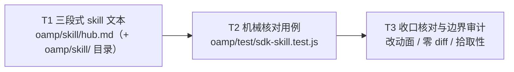

# pr-005-tasks.md — pr-005 内部任务图（`hub` skill 文本与内容核对 · F12/F13/G03）

**迭代**: 0025-hub-sdk-and-skill ｜ **阶段**: 5（PR 实现）｜ **PR 文件**: `prs/pr-005-hub-skill-and-content-check.md`
**worktree 分支**: `feat/0025-pr-005-hub-skill-and-content-check`（worktree 地址 `…/.pb-agents/worktrees/0025-pr-005-hub-skill-and-content-check`，HEAD `4d162d7` = 迭代分支 tip）｜ **任务总数**: **3**（T1~T3）｜ **依赖图**: 无环（见 §2）

---

## 0. 范围、文件面与事实锚点

**本 PR 文件范围（唯一可写面，2 条）**

| 文件 | 动作 | 内容 |
|---|---|---|
| `oamp/skill/hub.md` | **新建**（含父目录 `oamp/skill/`） | 三段式自包含 skill 文本：① 何时用 ② 怎么用（入口定位模板 + 只到子命令名的三层清单 + 4 条典型序列）③ 红线 |
| `oamp/test/sdk-skill.test.js` | **新建** | 对 `oamp/skill/hub.md` 文本的机械核对用例（只读该文件文本，不 import SDK） |

**非目标（明确不写）**：`oamp/sdk/**`、`oamp/bin/**`（pr-001~pr-004 的文件面）、`oamp/package.json`（`bin.hub` 一行属 **pr-004** 文件面，本 PR **零改动**）、`oamp/API.md`、`oamp/src/**`、`oamp/web/**`、其余 `oamp/test/*.js`、`roles/**`、`tools/**`、`.claude/skills/**`、`architecture.md` / `prd/**` / `demand.md` / `status.md` / `history.md`、其它 `prs/*.md`。

**读码 / 文档事实锚点（判据基础；行号为 worktree `4d162d7` 实测）**

| # | 事实 | 位置 / 依据 |
|---|---|---|
| A1 | `oamp/skill/` 目录**当前不存在**（`test -d oamp/skill` 为假）⇒ T1 须连父目录一起创建；`oamp/` 下既有条目 = `API.md` `README.md` `bin` `llms.txt` `package.json` `scripts` `src` `test` `web` | worktree 实测 |
| A2 | 测试拾取面 = `package.json` 的 `scripts.test = node --test test/*.test.js` ⇒ `test/sdk-skill.test.js` **自动被拾取**，无需改 `package.json` | `oamp/package.json:11-13` |
| A3 | 三层清单素材（40 条）**唯一来源** = `architecture.md` §5.1 的三张表：层 A 表取「SDK 子命令」列（**21 行**）、层 B 表取「SDK 子命令」列（**8 行**）、层 C 表取「SDK 入口」列（**11 行**）；`doctor` 的层归属口径（"单列 + 标注'自检（不属于三层封装）'"）同节 | `architecture.md:311-408`（§5.1；三表小节起于 `:328` / `:363` / `:381`；P-4 口径在 `:361`、`:256`） |
| A4 | 「4 条多步闭环**只在 skill 文本**、40 条入口逐条单一目标、无编排命令」= 架构明文 | `architecture.md:408`（§5.1 末尾"无编排命令（F14 验收 3）"） |
| A5 | skill 契约（T-05 单文件自包含 + T-06 路径引用模板 + 入口定位模板原文块 + "模型不含 `/Users/` `/home/`、不含 `cd` 前置、不含 `~`、不含环境变量前置"约束自检） | `architecture.md:513-540`（§5.6；模板块 `:528-538`） |
| A6 | 退出码语义真值（红线 ③ 的唯一来源）：`2` 用法错误 / `3` 连接失败 / `1` 业务失败 / `0` 成功 | `architecture.md:473-500`（§5.4 归类表） |
| A7 | 4 条序列的**来源现场**（0021 实跑）：通道 = `POST /api/calls`；取终态 = `GET /api/calls/<call_id>`；**截断场景** = 信封 `truncated=true` 时 `text` 不完整，靠 `GET /api/calls/<call_id>/transcript` 的 `entries[]` 重建全文 | `docs/iterations/0021-confirmation-inbox-and-event-push/clarifications/hub-execution-log.md:11-13`、`:19-20`、`:30` |
| A8 | E1 裸判据（序列清单里出现 `curl` / socket 手写 / 自建 HTTP 客户端即不通过） | `demand.md:219`（§4 结论 E1）；`prd.md:111`、`:116`（E1 落在 F12 验收 4） |
| A9 | F13 验收 5 的跨宿主判据（shell / Node `import` / 另一 agent 经 shell），模板须在三种宿主下成立 | `prd/F13-skill-sdk-entry-addressing.md:24` |
| A10 | G03 的核对面 = `roles/**`、分发脚本（`tools/**`）、`.claude/skills/**` 三处 diff 为空；`.claude/skills/` 既有落点为 `create-role` `pb-v1-ascii` `pb-v1-talk` `workflow-pb`（本 PR 零触碰） | `prd/G03-roles-and-distribution-untouched.md:16-22`；`architecture.md` §4.3 Z-5；worktree 实测 |
| A11 | 本 PR **无 `depends_on`**：skill 文本与所描述代码之间无 import / 符号引用边；40 条子命令名与两个入口路径已在 §5.1 / §5.6 定稿 ⇒ 编写与核对都不等待任何代码 PR | `prs/pr-005-…md` 的 `depends_on` 段（原文） |
| A12 | `hygiene.test.js` 的扫描面 = `bin/` + `src/` 的 `*.js` + `package.json`（**不含** `skill/`、`test/`）⇒ 本 PR 新增文件不进入该扫描面 | `oamp/test/hygiene.test.js:26-39` |

---

## 1. 任务列表

### T1: 落 `oamp/skill/hub.md` —— 三段式自包含 skill 文本（入口定位模板 + 只到子命令名的三层清单 + 4 条序列 + 三条红线）

- **验收标准**:

  1. **落点与自包含**（PR 验收 1 / F12 验收 1 / T-05）：文件位于 `oamp/skill/hub.md`（父目录随文件创建，A1）；消费方**只读该文件**即可拿到完整三段式内容——正文不要求读者先打开别的文件。允许出现的**唯一**外部指路是 `oamp/API.md`（红线 ② 要求它作为参数与字段的真源）与模板中的 `<项目根>` 占位。判定：通读全文，按"何时用 / 怎么用 / 红线"三段照做不需要其他文件作为必读前置。
  2. **三段标题齐备且各自成段**（PR 验收 2 / F12 验收 2）：正文含下列 **H2 标题字面量各恰一次**，且三者为文档顶层结构（其下的小节一律为 H3）：
     `## 何时用` ／ `## 怎么用` ／ `## 红线`。
  3. **"何时用"给出 6 条可判定触发条件**（PR 验收 3 / F12 验收 3）：逐条列出——① 需要**派发角色任务** ② 需要**取调用终态** ③ 需要**取过程记录（转录）**（含正文被截断的场景）④ 需要**订阅事件** ⑤ 需要**盘点实例状态** ⑥ 需要**走既有运维命令**。判定：每条都能对具体场景回答"算不算"；正文**检索不到**"需要与 hub 交互时用它"式循环表述。
  4. **入口定位模板在 `## 怎么用` 段内**（PR 验收 9 / F13 验收 1）：以 `### 入口定位` 小节给出，含 **shell 面**与**库面**两条同源模板，字面量分别为
     `node "<项目根>/oamp/bin/hub.js" <层> <子命令> [选项]` 与 `await import('<项目根>/oamp/sdk/index.js')`；
     并写明「**项目根由调用方自行解析**（不由 cwd 推导）」。判定：两处字面量存在 + 该句存在 + 不新增第四段顶层标题（三段式保持可判定）。
  5. **模板约束自检**（PR 验收 10 / F13 验收 1/3/4）：正文**零** `/Users/`、`/home/` 一类本机路径字面量；**零** `cd` 前置（不出现行首 / `&&` / `;` 之后的 `cd ` 形态）；定位段**零** `~` 与**零**环境变量前置（不出现 `$VAR=` 式赋值或 `$VAR` 拼接项目根）。判定：逐项检索零命中。
  6. **三层清单：只到子命令名，条目数 21 / 8 / 11，名面逐字与 §5.1 一致**（PR 验收 4 / F12 验收 4 / F14 验收 1·3 / P-4）：在 `## 怎么用` 段内以三个 H3 小节承载，标题字面量为
     `### 层 A · api（21 条）`／`### 层 B · uds（8 条）`／`### 层 C · cli（11 条）`；
     每小节内**一行一条**子命令名（层 A 取 `architecture.md` §5.1 层 A 表「SDK 子命令」列的 21 条、层 B 取层 B 表「SDK 子命令」列的 8 条、层 C 取层 C 表「SDK 入口」列的 11 条，A3）；条目内**不含选项、不含位置参数占位符、不含字段**。
     `doctor` **不在**上述三小节内，单列且同处出现标注字面量 `自检（不属于三层封装）`。判定：三小节条目数分别 == 21 / 8 / 11（合计 40）；逐条与 §5.1 对应列字面比对无缺项 / 无多出项。
  7. **4 条典型序列齐备且各给可照做的命令顺序**（PR 验收 5 / F12 验收 4）：在 `## 怎么用` 段内以四个 H3 承载，标题字面量为
     `### 序列 1：派发 → 取终态`／`### 序列 2：截断恢复`／`### 序列 3：事件订阅`／`### 序列 4：状态盘点`；
     每条给出**有序步骤**，每步 = 一条 `node "<项目根>/oamp/bin/hub.js" <层> <子命令> [位置参数占位符]` 形态的命令；步骤只用 §5.1 的 40 条入口组合（A4），**不写选项**（选项与字段留 `API.md`）。四条序列的骨架（实现可调整措辞，但步骤面必须覆盖）：
     - **序列 1 · 派发 → 取终态**：`api calls create`（派发，得 `call_id`）→ `api calls get <call_id>`（取终态信封）。
     - **序列 2 · 截断恢复**：`api calls get <call_id>`（信封 `truncated` 为真 ⇒ 正文被截断）→ `api calls transcript <call_id>`（取过程条目，**由消费方自行拼接**重建全文）。
     - **序列 3 · 事件订阅**：`api stream events`（全局事件流，前台 NDJSON）／`api stream chat <chat_id>`（单对话）／`api stream call <call_id>`（单调用）——按作用域择一。
     - **序列 4 · 状态盘点**：`api agents`（实例清单）＋ `uds router.status`（Router 侧拓扑）＋ `cli status`（既有命令面）。
  8. **"截断恢复"是序列不是命令**（PR 验收 6 / F12 验收 5 / W3·C-A）：该序列步骤**恰为两条已有子命令的组合**（`api calls get <call_id>` + `api calls transcript <call_id>`）；清单（21+8+11+`doctor`）中**不存在**"一步恢复全文"的专用命令；正文**不宣称** SDK 代做正文重建（检索不到"SDK 自动重建 / 自动恢复全文 / 自动拼接"式表述），且明确写出"由消费方自行拼接"。
  9. **红线三条齐备且可核**（PR 验收 7 / F12 验收 6）：`## 红线` 段含三条——① **不裸写 HTTP**（应经 SDK）；② **不复制 schema**（参数与字段以 `API.md` 为准）；③ **退出码语义**，逐字与 §5.4 一致：`0` 成功 / `1` 业务失败 / `2` 用法错误 / `3` 连接失败（A6）。
  10. **不成为第二份文档**（PR 验收 8 / F12 验收 7 / N8）：正文**零**参数表、**零**字段定义清单、**零**端点路径表——机械判据 = 零 markdown 表格分隔行（`|---|` 形态）、零 `--` 选项字面量、零端点路径字面量（`/api/`）、零字段类型标注（`字段: string|number|boolean|integer|object|array` 式）。
  11. **4 条序列全程零手写 HTTP**（PR 验收 11 / F12 验收 4 / E1 裸判据 A8）：正文**零** `curl`、**零** `http://` / `https://` URL 字面量、**零** socket 手写与自建 HTTP 客户端式示例；4 条序列每一步都是 `hub` 子命令。
  12. **蓝本同源性**：正文中出现的每条 `hub` 子命令名都能在 §5.1 的 40 条中找到（A3），无自造子命令、无编排命令（A4）。
- **前置依赖**: 无
- **优先级**: P0
- **追溯**: PR 文件 验收 1~11、13 + 文件范围（`oamp/skill/hub.md` 新建）；`prd/F12-hub-skill-three-sections.md:16-28`（验收 1~7）、`:40-48`（架构落定 T-05 / T-06 / 内容面 / 截断恢复口径）、`:50-58`（`model_inferred: 无`、越界自查）；`prd/F13-skill-sdk-entry-addressing.md:16-24`（验收 1~5）、`:35-42`（模板落点 / cwd 无关 / 三宿主）；`prd/G03-roles-and-distribution-untouched.md:22`（验收 4：不落 `.claude/skills/`、不建副本 / 转发）；`architecture.md:513-540`（§5.6 T-05 / T-06 + 模板块）、`:311-408`（§5.1 三表 + P-4）、`:473-500`（§5.4）；`demand.md:188-190`（W6 / W7 / W8）、`:199-203`（N5 / N6 / N7 / N8）、`:219`（E1）；`prd.md:61`（F12+F13 口径）；代码 / 文档锚点 A1 / A3 / A4 / A5 / A6 / A7 / A8 / A9

### T2: 落 `oamp/test/sdk-skill.test.js` —— 对 skill 文本的机械核对用例（只读文本，不 import SDK）

- **验收标准**:

  1. **只读文本、零 SDK 依赖**（PR 验收 13 / §10 T6）：用例只读 `oamp/skill/hub.md` 文本（路径按 `import.meta.url` 从用例位置推导，A2/A5 同口径），**不 import** `../sdk/**`、**不**起子进程 / 不起 Router / 不连端口、**不写**任何文件。判定：文件内检索不到指向 `sdk/` 的 import，检索不到 `child_process` / 网络调用。
  2. **核心机械核对 4 项**（PR 验收 13 逐条）——每项一条 `test(...)`，断言以**字面量集合**表述：
     - **三段标题齐备**：上列 3 个 H2 字面量各命中恰一次；
     - **4 条序列标题齐备**：上列 4 个 H3 字面量各命中恰一次；
     - **无参数表与字段清单特征**：markdown 表格分隔行、`--` 选项字面量、端点路径字面量 `/api/`、字段类型标注 四类**各零命中**；
     - **无本机路径字面量与 `cd` 前置**：`/Users/`、`/home/`、`cd ` 前置形态**各零命中**。
  3. **追加机械检查 4 项**（`[model_inferred]`：PR 只列 4 项机械核对，这 4 项是 F12 验收 4/5/6 的机械投影，见 §5-1）：
     - 正文**零** `curl`（+ 零 `http://` / `https://`）（E1 裸判据，A8）；
     - `doctor` 单列标注字面量 `自检（不属于三层封装）` 存在（P-4 口径）；
     - 三个层小节的条目数分别 == **21 / 8 / 11**（逐条与 §5.1 名面一致的可判形态，A3）；
     - `## 红线` 段内含退出码四值语义：`0`+成功、`1`+业务失败、`2`+用法错误、`3`+连接失败（A6）。
  4. **断言落在稳定字面量上，不依赖实现措辞**：只断言 T1 验收 2/4/6/7 已钉死的字面量与上述模式；**不得**断言段落的行号、段落长度、字词顺序或具体命令示例的措辞（除 T1 钉死的标题字面量与 4 条序列骨架的命令名）。判定：把 T1 正文的非钉死措辞改写一遍，用例仍应通过。
  5. **失败时可定位**：每条断言的消息点名"期望字面量 / 未命中或误命中"，使失败能直接回答"缺哪一项"。
  6. `node --test test/sdk-skill.test.js` 全绿（用例自身无 skipped、无 todo 占位）。
- **前置依赖**: **T1**（用例断言的是 T1 落盘文本的实际字面量；T1 未落盘时该用例必然红）
- **优先级**: P0
- **追溯**: PR 文件 验收 13、14 + 文件范围（`oamp/test/sdk-skill.test.js` 新建）+ 验收 2 / 4 / 6 / 7 / 9 / 10 / 11 的可核面；`architecture.md:653`（§10 T6 行的四项核对）与 `:642-650`（§10 测试组织：沿用 `test/*.test.js` + `node --test`、零新框架 / 零新脚本）；`prd/F12:18`（验收 2）、`:22`（验收 4）、`:26`（验收 6）、`:28`（验收 7）；`prd/F13:16`（验收 1）、`:22`（验收 4）；锚点 A2 / A3 / A5 / A6 / A8

### T3: 收口核对与边界审计（改动面恰两条新增路径 / `roles`·`tools`·`.claude/skills` 零 diff / 用例被既有拾取面拾取并通过）

- **验收标准**:

  1. **改动面恰为本 PR 文件范围的两条新增路径**（PR 验收 12 的正面形态）：`git -C <worktree> diff --name-only <base> -- oamp/` 恰为 `oamp/skill/hub.md`、`oamp/test/sdk-skill.test.js`（均为新增）。判据面限定为**代码面** `-- oamp/`：`docs/**`（PR 契约文件 + 本任务图）是工作流产物，不参与该条判定。`[model_inferred]`（PR 验收 12 只写"不含哪些面"，未区分代码面与工作流产物面，见 §5-1）。
  2. **G03 三处零 diff**（PR 验收 12 / G03 验收 1~4）：`git -C <worktree> diff --name-only <base> -- roles/ tools/ .claude/skills/` 为**空**；`oamp/package.json` 亦不在 diff 中（`bin.hub` 一行属 pr-004 文件面）。判定：diff 命令输出为空 + 本 PR 未新增任何指向 `oamp/skill/hub.md` 的副本 / 转发文件（`.claude/skills/**` 无新目录 / 新文件）。
  3. **用例被既有拾取面拾取**（PR 验收 14 / §10 T6）：`cd oamp && node --test test/*.test.js` 的 TAP 输出中**出现 `test/sdk-skill.test.js` 的用例名**（证明它落在 `package.json` 的 `scripts.test` 拾取面内，A2），且该文件的相关用例**全绿**。
  4. **无因本 PR 引起的新增失败**（PR 验收 14）：`node --test test/*.test.js` 中与本 PR 两文件无关的失败一律不计入（阶段 5 并行 PR 的文件面可能处于 mid-flight 状态，且 `sdk-*.test.js` 的其余 5 个文件由 pr-006~pr-010 各自落盘）；判定 = `test/sdk-skill.test.js` 全绿 **且** 其余失败项在 `git -C <worktree> stash` 本 PR 两文件后**同样复现**（即与本 PR 无因果）。`[model_inferred]`（口径由阶段 5 并发事实推得，见 §5-1）。
  5. **PR 14 条验收逐条对位**（见 §3）并有可复现证据（命令 + 输出摘要），逐条 pass；未能实测的条目（如 F13 验收 2/5 的"仓库外目录执行"与三宿主）须**显式标注为「文本面已核 / 运行面属 pr-004 与 pr-007~pr-010 的用例面」**，不得以"看起来没问题"结案。
- **前置依赖**: T1、T2
- **优先级**: P0
- **追溯**: PR 文件 验收 12、13、14 与「文件范围」「非目标」；`prd/G03-roles-and-distribution-untouched.md:16-22`（验收 1~4）、`:32-39`（架构落定：本迭代改动面 = `oamp/{bin,sdk,skill,test}` 新增 + `package.json` 加一行）、`:41-43`（`model_inferred: 无`）；`architecture.md:642-653`（§10 T6 / 测试基建约束）、`:286-296`（§4.3 Z-5）、`:297-309`（§4.4 顺序约束 6）；`prd.md:75`（N8 追溯）；锚点 A1 / A2 / A10 / A11 / A12

---

## 2. 依赖图（无环）

拓扑序（合法执行序）：`T1 → T2 → T3`（单链，无并行支路；粒度理由见 §5-4）

- **最长依赖链**：`T1 → T2 → T3`（2 跳）。
- **关键路径任务**：**T1、T2、T3**（三者全在关键路径上；本 PR 无第二条支路）。
- **无环**：边方向单调（T1 → T2 → T3），无回边、无自环；无隐式反向依赖——T1 不消费 T2 / T3 的任何产物，T2 只读 T1 的产出文本，T3 只读两者的落盘结果与 diff。
- **与 PR 间依赖图的关系**：本 PR `depends_on` 为空（A11）。本任务图的 `T1 → T2 → T3` 是 **PR 内部**的产物依赖（用例断言的是文本的实际字面量），**不是**跨 PR 依赖——它不改变 `prs/pr-005-…md` 的依赖图，也不要求等待任何代码 PR 合并。

**同文件串行约束（必须）**

| 文件 | 写入任务 | 串行要求 |
|---|---|---|
| `oamp/skill/hub.md` | **T1（唯一）** | — |
| `oamp/test/sdk-skill.test.js` | **T2（唯一）** | 须待 T1 落盘后定稿（断言锚在 T1 实际字面量上）；只读 `oamp/skill/hub.md` |
| `oamp/package.json` | **无**（零改动） | 只读：T3 验收 3 以既有 `scripts.test` 为拾取面判据（A2） |
| `roles/**`、`tools/**`、`.claude/skills/**` | **无**（零改动） | 只读：T3 验收 2 以"diff 为空 + 零副本 / 零转发"为判据 |

---

## 3. 与 pr-005 验收标准逐条对位表

| PR 验收 # | 验收摘要 | 承接任务 | 对位说明 / 判据面 |
|---|---|---|---|
| 1 | 位于 `oamp/skill/hub.md`、单文件自包含 | **T1**（验收 1） + **T3**（验收 1） | 落点 = 文件存在（连父目录）；自包含 = 通读即可照做 |
| 2 | 三段式标题齐备且各自成段 | **T1**（验收 2） + **T2**（验收 2） | 3 个 H2 字面量各恰一次（机械） |
| 3 | "何时用"可判定触发条件（6 类场合） | **T1**（验收 3） | 6 条逐条可判定；循环表述零命中 |
| 4 | "怎么用"= 只到子命令名的三层清单（21/8/11）+ `doctor` 单列标注 | **T1**（验收 6） + **T2**（验收 3） | 条目数 21/8/11 + 名面逐字对齐 §5.1（A3）+ 标注字面量 |
| 5 | 4 条典型序列齐备、各给可照做的命令顺序 | **T1**（验收 7） + **T2**（验收 2、4） | 4 个 H3 字面量齐备 + 每条序列的步骤骨架覆盖 |
| 6 | "截断恢复"是序列不是命令 | **T1**（验收 8） | 步骤 = `api calls get` + `api calls transcript` 组合；清单无专用命令；不宣称 SDK 代做 |
| 7 | 红线三条齐备（不裸写 HTTP / 不复制 schema / 退出码 0/1/2/3） | **T1**（验收 9） + **T2**（验收 3） | 三条齐备；退出码四值语义与 §5.4 一致（A6） |
| 8 | 正文不含参数表、字段定义清单、端点路径表 | **T1**（验收 10） + **T2**（验收 2） | 表格分隔行 / `--` 选项 / `/api/` / 字段类型标注 四类零命中 |
| 9 | 入口定位模板形态正确（CLI 面 + 库面 + 项目根自解析） | **T1**（验收 4） | 两处模板字面量 + "项目根由调用方自行解析"句 |
| 10 | 模板约束自检（零本机字面量 / 零 `cd` 前置 / 零 `~` / 零环境变量前置） | **T1**（验收 5） + **T2**（验收 2） | 四类零命中（机械） |
| 11 | 4 条序列全程零手写 HTTP | **T1**（验收 11） + **T2**（验收 3） | `curl` / URL / socket 手写 零命中（E1 裸判据，A8） |
| 12 | 改动面不含 `roles/**`、`tools/**`、`.claude/skills/**` | **T3**（验收 1、2） | `git diff --name-only <base> -- roles/ tools/ .claude/skills/` 为空 |
| 13 | `oamp/test/sdk-skill.test.js` 机械核对四项、只读文本不 import SDK | **T2**（验收 1~6） | 4 项核心 + 4 项追加（标注 `[model_inferred]`） |
| 14 | 用例经 `node --test test/*.test.js` 被拾取并通过 | **T3**（验收 3、4） | 拾取面 = 既有 `scripts.test`（A2）；无因本 PR 引起的新增失败 |

**覆盖检查**：PR 14 条验收 → 全部有任务承接，无遗漏、无扩范围（未新增 PR 文件之外的功能面）；T1~T3 逐条可追溯到 PR 文件 / `prd/F12`·`F13`·`G03` / `architecture.md` §5.1·§5.4·§5.6·§10 / 文档锚点（见 §6）。

---

## 4. 关键实现约束（C 系列，全部为硬约束）

1. **C1 落点红线**：skill 文件落 `oamp/skill/hub.md`，**不得**落 `.claude/skills/**`、**不得**在任何位置建副本 / 转发 / 软链（G03 验收 4 / D-1）。
2. **C2 三段式是结构契约**：H2 只有 `何时用` / `怎么用` / `红线` 三段；入口定位、清单、序列一律在其下作 H3——**不得**新增第四段顶层标题（否则"三段式齐备"的机械核对失去判据面）。
3. **C3 只到子命令名（N8 的实现面）**：清单条目内只有子命令名；序列步骤只有子命令名 + 位置参数占位符；**全文不出现 `--` 选项字面量、不出现参数表 / 字段清单 / 端点路径表**。参数与字段的指路**只经红线 ②**（"以 `API.md` 为准"）。
4. **C4 序列只用既有 40 条入口**（A4）：4 条序列的每一步都必须能在 §5.1 的 40 条中找到；**不得**出现 `dispatch` / `await` / 工作流专用命令等编排命令（N5 / F14 验收 3）。
5. **C5 截断恢复不得升格为命令、不得代做**（F12 验收 5 / W3·C-A）：序列 2 只有两条既有子命令 + "消费方自行拼接"的说明；不出现"一步恢复全文"的命令名，不宣称 SDK 重建正文。
6. **C6 退出码口径逐字对齐 §5.4**（A6）：`0` 成功 / `1` 业务失败 / `2` 用法错误 / `3` 连接失败——不得自造第五类、不得改变归类语义（改语义 = 改 T-08 落定，超出本 PR）。
7. **C7 模板与宿主无关**（F13 验收 1~5）：模板只用"项目根 + 相对位置"表达；不含本机路径字面量、不含 `cd` 前置、不含 `~`、不含环境变量前置；库面写法用 `await import('<项目根>/oamp/sdk/index.js')`（A5 / A9 的三宿主同一条模板）。
8. **C8 用例自足且零副作用**：`sdk-skill.test.js` 只读 `oamp/skill/hub.md` 一个文件，不 import SDK、不起进程 / 不连端口 / 不写盘、不依赖 cwd（路径按 `import.meta.url` 推导，A2/A5 同口径）；沿用 `node:test` + `node:assert/strict` 既有体例（`architecture.md:642-650`：零新框架 / 零新脚本 / 零新 CI）。
9. **C9 机械断言锚在钉死字面量上**：只断言 §1-T1 验收 2/4/6/7 钉死的字面量与 C3/C7 的模式；**不得**断言行号、段落长度、措辞顺序或其他实现自由度内的文本（见 §1-T2 验收 4）。
10. **C10 改动面恰两文件**：本 PR 的代码面 diff 恰为 `oamp/skill/hub.md` + `oamp/test/sdk-skill.test.js`（均新增）；`oamp/package.json`、`oamp/API.md`、`oamp/src/**`、`oamp/sdk/**`、`oamp/bin/**`、`roles/**`、`tools/**`、`.claude/skills/**` 一律零 diff。
11. **C11 零构建 / 零依赖**：skill 是纯文本；用例只用 Node 内置（`node:test` / `node:assert` / `node:fs` / `node:url` / `node:path`）；不新增 npm 依赖、不改 `package.json`。
12. **C12 与并行 PR 的文件面不重叠**：`oamp/sdk/**`（pr-001~pr-004）、`oamp/bin/**`（pr-004）、其余 5 个 `test/sdk-*.test.js`（pr-006~pr-010）不在本 PR 写入面内；本 PR 的用例**不**断言那些文件的存在性（否则会在并行 PR 落盘前制造假失败）。

---

## 5. 边界与疑问（提请主 agent；均不阻塞执行，按工作流 v0.12.0 阶段 4/5 口径）

1. **`[model_inferred]` 项共 7 条**（需主 agent 确认，均不引入 `demand.md` / `prd` / `architecture.md` 之外的新决策）：
   ① **标题字面量钉死**（3 个 H2 + 3 个层小节 H3 + 4 个序列 H3）——PR 只要求"标题齐备 / 4 条序列齐备"，未给文案；钉字面量是 T2 机械断言的唯一锚点（跨 T1↔T2 契约）。
   ② **入口定位模板归属 `## 怎么用` 段（`### 入口定位`）**——PR 未规定归属段；钉在 `怎么用` 内以避免出现第四段顶层标题（C2）。
   ③ **"无参数表与字段清单特征"的判据集**（表格分隔行 / `--` 选项 / `/api/` / 字段类型标注 四类零命中）——PR 未给判据集；其中"`--` 选项零命中"是**收紧点**（见疑问 2）。
   ④ **序列步骤不含选项**（只有子命令名 + 位置参数占位符）——由 F12 验收 4 的"只到子命令名" + N8 + `architecture.md:408`（序列只由 40 条入口组合）推得。
   ⑤ **T2 的 4 项追加机械检查**（`curl`/URL 零命中 / `doctor` 标注字面量 / 三层条目数 21·8·11 / 红线退出码四值）——PR 只列 4 项机械核对，这 4 项是 F12 验收 4/5/6 的机械投影（不新增内容要求，只把人工核对变成机械核对）。
   ⑥ **T3 验收 1 的判据面收敛为 `-- oamp/`**——PR 验收 12 写"改动面不含 `roles/**` …"，未区分代码面与 `docs/**` 工作流产物面。
   ⑦ **T3 验收 4 的回归口径**——"无因本 PR 引起的新增失败"（阶段 5 并行 PR mid-flight，全量绿不是本 PR 可独立负责的判据）。
2. **"`--` 选项零命中"是收紧点，请裁决**：`architecture.md` §5.1 的层 A #16 `api stream calls` **必填 `--chat-id`**、层 A #14 `api calls create` 需 `--agent` / `--task` 等选项，故在本口径下序列 3 只能示例 `api stream events` / `api stream chat <chat_id>` / `api stream call <call_id>`（均无必填选项，可照做），`api stream calls` 只出现在清单中。**若主 agent 要求序列里给出可运行的选项**，则放宽点 = 判据集 ③ 改为"**清单条目内**零 `--`、表格分隔行零命中"（序列允许写选项）——**本图取前者**（保守收紧，理由：N8 + F12 验收 4 的"只到子命令名"，且序列的语义是**顺序**而非参数）。
3. **三层条目数的机械核对依赖 T1 的排布形态**：计数断言要求三层小节内"一行一条子命令名"（已钉为 T1 验收 6）。若实现者改为内联逗号排布，计数断言需同步调整——**该排布是跨任务契约，不由实现者自由选择**。
4. **粒度决策（为何 3 个任务而非更细 / 更粗）**：T1 是一份必须自洽的单文件文本（清单 ↔ 序列 ↔ 红线相互引用），拆成"清单"与"序列"两个任务会在同一文件上产生重叠写入且失去自洽性 ⇒ 合并；T2 是独立的可验证单元（机械核对）且须在 T1 之后对齐实际字面量 ⇒ 独立；T3 的核对面（改动面 / 零 diff / 拾取性）与 T1·T2 的产物面对立（前者只读 diff 与运行结果）⇒ 独立。三者合计远低于 1-2 天，不为凑并行度而拆。
5. **工作区与分支核对**：worktree = `…/.pb-agents/worktrees/0025-pr-005-hub-skill-and-content-check`，分支 `feat/0025-pr-005-hub-skill-and-content-check`，HEAD `4d162d7`（= `iteration/0025-hub-sdk-and-skill` tip，即简报给定的 base），与 PR 文件 `batch: 3` 及本图假设一致，**无偏差**。
6. **F13 验收 2 / 5 的运行面归属**：验收 2（仓库外目录执行结果一致）与验收 5（三宿主一致）需要**可执行的入口**（`oamp/bin/hub.js` / `oamp/sdk/index.js`）——那是 pr-004 的产物、其运行面用例在 pr-007~pr-010。本 PR 只能保证**文本面**（模板形态 + 零本机字面量 + 零 `cd` / `~` / 环境变量前置），T3 验收 5 已要求把该边界显式标注，**不主张本 PR 独力闭合 F13 验收 2/5**。
7. **`oamp/skill/` 是否需一并考虑 `hygiene.test.js` 扫描**：不需要——该用例扫描面 = `bin/` + `src/` 的 `*.js` + `package.json`（A12），本 PR 新增的 `.md` 与 `test/*.js` 均不在面内；本 PR 亦不修改该用例（属"未要求即不做"）。

---

## 6. 追溯总表（任务 → 输入）

| 任务 | PR 文件追溯 | prd 追溯 | architecture 追溯 | 文档 / 代码锚点 |
|---|---|---|---|---|
| T1 | 验收 1~11、13；文件范围（`oamp/skill/hub.md` 新建）；非目标 | F12 `:16-28`、`:40-48`；F13 `:16-24`、`:35-42`；G03 `:22`；`prd.md:61` | §5.1（`:311-408`：三表 + P-4 + 无编排命令）；§5.4（`:473-500`）；§5.6（`:513-540`：T-05 / T-06 / 模板块）；§4.4 顺序约束 5（`:304`） | A1 / A3 / A4 / A5 / A6 / A7 / A8 / A9；`demand.md:188-190`、`:199-203`、`:219` |
| T2 | 验收 13、14 与验收 2 / 4 / 6 / 7 / 9 / 10 / 11 的可核面；文件范围（`oamp/test/sdk-skill.test.js` 新建） | F12 `:18`、`:22`、`:26`、`:28`；F13 `:16`、`:22` | §10 T6（`:653`）、§10 测试基建约束（`:642-650`） | A2 / A3 / A5 / A6 / A8 |
| T3 | 验收 12、13、14；文件范围 / 非目标 | G03 `:16-22`、`:32-43`；`prd.md:75` | §10（`:642-653`）；§4.3 Z-5（`:286-296`）；§4.4 顺序约束 6（`:305`；§4.4 = `:298-305`） | A1 / A2 / A10 / A11 / A12 |
