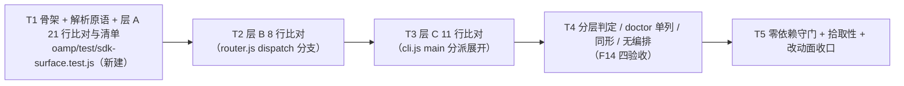

# pr-006-tasks.md — pr-006 内部任务图（三层覆盖面对照用例 · F02/F03/F04/F14）

**迭代**: 0025-hub-sdk-and-skill ｜ **阶段**: 5（PR 实现）｜ **PR 文件**: `prs/pr-006-sdk-surface-coverage-test.md`
**worktree 分支**: `feat/0025-pr-006-sdk-surface-coverage-test`（worktree 地址 `…/.pb-agents/worktrees/0025-pr-006-sdk-surface-coverage-test`，HEAD `453326c` = 迭代分支 tip）｜ **任务总数**: **5**（T1~T5）｜ **依赖图**: 无环（单链，见 §2）

---

## 0. 范围、文件面与事实锚点

**本 PR 文件范围（唯一可写面，1 条）**

| 文件 | 动作 | 内容 |
|---|---|---|
| `oamp/test/sdk-surface.test.js` | **新建** | 三层入口表（`sdk/surface.js` 的 `LAYERS` / `ENTRIES`）与三个既有只读面的**双向比对** + 分层判定 + 同形检查（F02/F03/F04/F14；`architecture.md` §10 T1） |

**非目标（明确不写）**：`oamp/sdk/**`（pr-001~pr-004 产物，含本 PR 的直接 import 对象 `surface.js`）、`oamp/bin/**`、`oamp/package.json`、`oamp/API.md`、`oamp/skill/hub.md`、`oamp/src/**`、`oamp/web/**`、`oamp/test/sdk-skill.test.js`（pr-005 已合并的锁）与 pr-007~pr-010 的 `test/sdk-*.test.js`、`oamp/test/helpers/**`、`roles/**`、`tools/**`、`.claude/skills/**`、`architecture.md` / `prd/**` / `demand.md` / `status.md` / `history.md`、其它 `prs/*.md`。

**读码 / 文档事实锚点（判据基础；行号为 worktree `453326c` 实测）**

| # | 事实 | 位置 / 依据 |
|---|---|---|
| A1 | 目标文件 `oamp/test/sdk-surface.test.js` **当前不存在**；`oamp/test/sdk-*.test.js` 中**仅有** `sdk-skill.test.js`（pr-005 产物） | worktree `453326c` 实测 |
| A2 | 测试拾取面 = `package.json` 的 `scripts.test = node --test test/*.test.js` ⇒ 新建 `test/sdk-surface.test.js` **自动被拾取**，无需改 `package.json` | `oamp/package.json:11-13` |
| A3 | 被核对对象（pr-003 已合并，本 PR **只 import 不改**）：`export const LAYERS = ['api','uds','cli']`（`:37`）、`export const ENTRIES`（`:344` = `API_ENTRIES` `:103` ‖ `UDS_ENTRIES` `:269` ‖ `CLI_ENTRIES`（由 `CLI_LEAF_COMMANDS` `:316` 映射））、`export function createSurface`（`:377`）；条目字段契约 = `{ id, layer, cmd, args, flags, kind, method, path, acceptsAs, run }`（`:8-17`） | `oamp/sdk/surface.js` |
| A4 | `API.md` §3 = 「接口清单（21 条）」，表体为 21 行 markdown 表格，行形态 `| n | \`METHOD /path\` | 用途 |`（`<param>` 占位 + `#9`/`#16` 带 `?chat_id=<id>` 查询串）；**整个 `API.md` 另有大量反引号签名**（§2 / §4 / §5 / §7 的正文引用）⇒ 解析**必须限定 §3 表区段**（从 `## 3. 接口清单（21 条）` 起、到 `### 3.1 ` 前止）。实测：限定区段后解析出的行数恰 **21**、编号 1..21 齐全，且行序与 `ENTRIES` 层 A 顺序**逐条一致** | `oamp/API.md:157`（§3 标题）、`:161-181`（21 行表体）、`:187`（`### 3.1`）；PR 文件「代码锚点」给的是 `oamp/API.md:157-186` |
| A5 | `src/router.js` 的 8 个方法 = `dispatch` 的 `switch (method)` 分支：`async function dispatch(` 起（`:104`）、`switch`（`:108`）、`case '<方法>'`（`:109` / `:161` / `:186` / `:201` / `:348` / `:379` / `:384` / `:395`）、`default:`（`:405`，`METHOD_NOT_FOUND`）。实测：取区段 = `async function dispatch(` … 其后首个 2 空格缩进的 `\n  }\n`，从中抽 `case '<名>':` ⇒ 恰 **8** 条，且顺序与 `ENTRIES` 层 B 顺序**一致** | `oamp/src/router.js`；PR 文件「代码锚点」给的 8 个行号与实测一致 |
| A6 | `src/cli.js`：`main(argv)` = `:62-133`；`const [cmd, sub] = argv`（`:66`）；6 个顶层分支形态 `if (cmd === '<顶层命令>') {`（`router` / `agent` / `status` / `web` / `cluster` / `task`）；`const validSubs = ['up','down','status']`（`:107`）、`['send','status','list','watch']`（`:117`）；单子命令分支用 `sub !== 'start'` 表达。实测：分块展开后叶子恰 **11** 条、**集合**与 `ENTRIES` 层 C 一致（**顺序不同**：cli.js 分支序 vs §5.1 层 C 表序）；`if (cmd === '-h' || cmd === '--help')` 因分块锚要求 `) {` 紧邻而被自然排除 | `oamp/src/cli.js`；PR 文件「代码锚点」给的 `:59-133` 与实测 `:62-133` 相容 |
| A7 | §5.1 规则 5（`architecture.md:358`）：订阅类 **4 条**（#9/#10/#16/#17）输出 NDJSON，其余 **17 条**输出单个 JSON 文档。实测：§3 用途列含 `SSE` 的行恰为 **#9/#10/#16/#17**，与 `ENTRIES` 中 `kind === 'stream'` 的 4 条（`api.stream chat` / `api.stream events` / `api.stream calls` / `api.stream call`）一致 | `architecture.md:354-360`（§5.1 规则 1~5） |
| A8 | §5.1 规则 2（`architecture.md:355`）：路径参数 → 位置参数（按出现序）。实测 21 条全部满足「`args[i].name` ∈ 该端点的路径参数 ∪ 查询参数，且路径参数按出现序」。**唯一需要注意的形态**：#9 `api stream chat` 的位置参数 `chat_id` 取自端点**查询串**（端点路径 `/api/stream` 无参数），#16 `api stream calls` 的同名查询参数按 §5.1 层 A 表定形为 `--chat-id`（必填）⇒ 位置参数为空。两条形态均由 §5.1 表定（`architecture.md:328-352`），非实现偏差 | `architecture.md:355`；实测 21 条零违例 |
| A9 | 归一先例（既有漂移锁的同一手法）：`shapePath`（截断 `?` / `#`、`<…>` 与 `:name` 归一）与 `docSignatures`（从 `API.md` 抽反引号 `METHOD /api/…` 签名）；本 PR 需其变体：`<name>` → `:name`（**保留参数名**，便于与 `args` 对齐），**只做这一处归一、不引第二份路径表** | `oamp/test/api-routes.test.js:292`（`shapePath`）、`:297-303`（`docSignatures`）、`:305`（漂移锁③ test；PR 文件「代码锚点」的 `:250` 已过期，见 §5-8）；§5.5 归一化要求见 `architecture.md:504` |
| A10 | 既有用例体例：`import { test } from 'node:test'` + `import assert from 'node:assert/strict'`，被核文件路径按 `import.meta.url` 从用例位置推导（与 SDK 内部同口径、不依赖 cwd）；失败消息须点名期望 / 实际，读不到文件时 `assert.fail` 而非静默跳过 | `oamp/test/sdk-skill.test.js:8-16`（import 面 + `OAMP_ROOT` 于 `:14` 按 `import.meta.url` 推导）、`:124-130`（`skillText()` 读不到即 `assert.fail` 并点名路径）；`oamp/test/api-routes.test.js`；`architecture.md:642-655`（§10 测试基建约束） |
| A11 | `import { ENTRIES, LAYERS } from '../sdk/surface.js'` 会**连带加载** `sdk/http.js` 与 `sdk/uds.js`（`surface.js` 的模块级 import），但两者模块级只有 `node:` import 与函数 / 常量定义 ⇒ **零连接、零子进程、零写盘**；实测 import 后进程立即退出（0.06s） | `oamp/sdk/surface.js:25-31`（`:29` = `./http.js`、`:30` = `./uds.js`）；实测（只读探测，未跑用例） |
| A12 | `hygiene.test.js` 的扫描面 = `bin/` + `src/` 的 `*.js` + `package.json`（**不含** `test/`）⇒ 本 PR 新增文件不进该扫描面；本 PR 亦不改动该用例 | `oamp/test/hygiene.test.js:26-39` |
| A13 | 本 PR `depends_on = pr-003`，**已合并**（`surface.js` / `skill/hub.md` 均在 `453326c`）；本 PR **不 import** `sdk/index.js`（pr-004 产物）⇒ 与 pr-004/pr-007~pr-010 无文件面与产物依赖 | PR 文件「depends_on」；worktree `453326c` 实测 |
| A14 | 流程口径（用户 2026-09-15 指令）：中间 PR **不跑仓库级全量套件**；全量集中到全部开发完成后跑一次。⇒ 本 PR 的验证方式 = **scoped 跑** `node --test test/sdk-surface.test.js`（`§10 T1` / `T-07` 的载体不变） | 简报「流程口径」段 |

---

## 1. 任务列表

### T1: 文件骨架 + 共享解析原语 + 层 A（21 行）双向比对与对照清单产出

- **验收标准**:

  1. **落点与体例**（PR 验收 1、9 / §10 T1）：新建 `oamp/test/sdk-surface.test.js`；仅用 Node 内置 + 被核对象——直接 import 面 = `node:test` / `node:assert/strict` / `node:fs` / `node:url` / `node:path` + `../sdk/surface.js`（A3）；包根按 `import.meta.url` 推导（A10 同口径），不依赖 cwd；**不** import `sdk/index.js` / `sdk/http.js` / `sdk/uds.js` / `sdk/cli.js` / `node:net` / `node:http` / `node:child_process`（A13）；不起服务、不连端口、不 spawn、不写盘。
  2. **读取面恰四个文件**（PR 验收 8 / §10 T1）：`oamp/sdk/surface.js`（import 取表，A11）、`oamp/API.md`、`oamp/src/router.js`、`oamp/src/cli.js`（`readFileSync` 取文本）；任一路径不可读 ⇒ `assert.fail` 并点名路径（A10），不得静默跳过。
  3. **解析面不静默通过**（PR 验收 1 的可信前提 / A4）：§3 表区段（`## 3. 接口清单（21 条）` 起、`### 3.1 ` 前止）解析出的行数**恰 21**、编号 1..21 严格递增且齐全；同时解析出每行的用途单元格（供验收 6）与路径原文（供验收 5、7）。行数 ≠ 21 ⇒ 失败并点名实际行数与首个异常行。
  4. **层 A 双向比对**（PR 验收 1 / F02 验收 1）：归一（`<name>` → `:name`；截断 `?…`；A9）后，`ENTRIES` 中 `layer === 'api'` 的条目与 §3 解析结果**逐条对应**：① 条数 21 ↔ 21；② **双向无缺项 / 无多出项**（缺项与多出项分列并点名签名）；③ **顺序一致**（§3 第 n 行 ↔ 第 n 条层 A 条目，A4 实测成立；surface.js 亦声明表序 = 行序）。
  5. **21 行对照清单机械产出**（PR 验收 2 / F02 验收 1）：在验收 4 的同一循环内逐行输出，形如 `#<n>\t<METHOD> <路径原文（含 <param> / 查询串）>\t↔\thub api <子命令名面>`；**由表数据与文档解析结果生成**，不是手写常量（C11）；该 21 行在 scoped 跑的 stdout 中可见（`t.diagnostic(...)`，Node ≥ 18.17 / 本机 22.15.0；spec 与 tap reporter 均以注释形式呈现）⇒ 可与 `API.md` §3 逐行核对。
  6. **订阅面 kind 与文档一致**（[model_inferred] 见 §5-1①；判据来源 A7）：§3 用途列含 `SSE` 的行（实测 4 行：#9/#10/#16/#17）↔ `kind === 'stream'` 的条目**逐条对应**；其余 17 行 ↔ `kind === 'result'`；计数断言 4 / 17。
  7. **位置参数 ↔ 端点参数**（[model_inferred] 见 §5-1③；判据来源 A8 / §5.1 规则 2）：21 条逐条 —— 每个 `args[i].name` ∈ 该端点的「路径参数 ∪ 查询参数」（均从该行原文解析），且路径参数按出现序即为 `args` 名序的子序列。`api stream chat` 的 `chat_id` 属查询参数形态（A8），**不得**因此判失败；#16 `api stream calls` 的 `chat_id` 是 `--chat-id` 选项、`args` 为空。
  8. **scoped 跑绿**（PR 验收 9 / 用户口径 A14）：`cd oamp && node --test test/sdk-surface.test.js` 中本 PR 的用例全部通过、无 `skipped` / `todo`；**不**触发仓库级全量套件。

- **前置依赖**: 无
- **优先级**: P0
- **追溯**: PR 文件 验收 1、2、8、9 + 文件范围（`oamp/test/sdk-surface.test.js` 新建）；`prd/F02-web-api-surface-coverage.md:16`（验收 1）、`:22`（验收 4 的"各有可寻址入口"面）；`prd/F14-layered-command-structure.md:16`（验收 1 的判定面）、`:36-40`（架构落定：分层判定面 = 40 条 / P-4）；`architecture.md:328-360`（§5.1 层 A 表 + 规则 1~5）、`:355`（§5.1 规则 2：路径参数 → 位置参数）、`:504`（§5.5 归一化单一处）、`:642-655`（§10 T1 + 测试基建约束）；锚点 A1 / A2 / A3 / A4 / A7 / A8 / A9 / A10 / A11 / A14

### T2: 层 B（8 行）双向比对 —— `router.js` 的 `dispatch` 分支

- **验收标准**:

  1. **解析面自证**（PR 验收 3 的可信前提 / A5）：从 `async function dispatch(` 起、到其后首个 2 空格缩进的函数收尾 `\n  }\n` 止取区段，抽 `case '<方法>':` 字面量 ⇒ 恰 **8** 条；数量 ≠ 8 ⇒ 失败并点名实际条数。
  2. **层 B 双向比对**（PR 验收 3 / F03 验收 1）：与 `ENTRIES` 中 `layer === 'uds'` 的条目**逐条对应**：① 条数 8 ↔ 8；② 双向无缺项 / 无多出项（分列点名）；③ **顺序一致**（router.js 分支序 ↔ 层 B 表序，A5 实测一致）；④ 每条 `method === <解析出的方法名>`、`cmd` 名面 = `[方法名]`（§5.1 层 B 表「SDK 子命令」列形态）。
  3. **单方法形态与 `--as` 接受面**（PR 验收 7 的"单一方法"面 + [model_inferred] 见 §5-1⑥）：8 条逐条 —— `method` 形如 `ns.name`、`path === null`、`args.length === 0`（§5.1 层 B 表：`--params '<json>'` 是唯一入参通道）；`acceptsAs === true` **恰 4 条**且为 `agent.heartbeat` / `agent.deregister` / `message.send` / `message.ack`（§5.1 层 B 表「`--as`」列：`agent.register` / `router.status` / `router.task_get` / `router.task_list` 为 ✗）。
  4. **8 行对照清单机械产出**（[model_inferred] 见 §5-1②；判据来源 F03 验收 1「一张 8 行的对照清单」/ `architecture.md:564` F03 行）：逐行输出形如 `uds <方法名>\t↔\toamp/src/router.js dispatch 分支 <方法名>`，由解析结果生成，且在 scoped 跑 stdout 中可见。
  5. **scoped 跑绿**：`node --test test/sdk-surface.test.js` 含本任务用例且全绿（口径同 T1 验收 8）。

- **前置依赖**: **T1**（同文件串行写入 + 复用 T1 的 import 面 / 路径推导 / 断言消息体例）
- **优先级**: P0
- **追溯**: PR 文件 验收 3；`prd/F03-router-uds-method-coverage.md:16`（验收 1）；`architecture.md:363-379`（§5.1 层 B 表：8 方法 + `--params` 唯一入参 + `--as` 列）、`:564`（§7 F03 行「验收 1（8 行清单）✓」）、`:648`（§10 T1 行：层 B 8 ↔ 方法名清单）；锚点 A3 / A5 / A10

### T3: 层 C（11 行）双向比对 —— `cli.js` 的 `main(argv)` 分派展开

- **验收标准**:

  1. **解析面自证**（PR 验收 4 的可信前提 / A6）：从 `main(argv)` 函数体（`export async function main(` 起、到末尾 `\n}\n` 止）按 `if (cmd === '<顶层命令>') {` 分块，逐块展开：有 `const validSubs = [...]` 者按其元素展开；有 `sub !== '<x>'` 者取该值；两者皆无者按单 token 命令（`status`）计 ⇒ 叶子**恰 11** 条；数量 ≠ 11 ⇒ 失败并点名实际条数与解析到的分支数。
  2. **层 C 双向比对（集合口径）**（PR 验收 4 / F04 验收 1）：与 `ENTRIES` 中 `layer === 'cli'` 的条目比对：① 条数 11 ↔ 11；② **双向无缺项 / 无多出项**（分列点名）；③ 顺序**不断言**（cli.js 分支序 ≠ §5.1 层 C 表序，A6；同理不得为对齐顺序而改 `surface.js`）。
  3. **名面与条目形态**（PR 验收 4、7）：11 条名面 = §5.1 层 C 表的 11 个叶子（`router start` / `agent start` / `status` / `task send` / `task status` / `task list` / `task watch` / `web start` / `cluster up` / `cluster down` / `cluster status`）；逐条 `method === null && path === null && args.length === 0 && flags.length === 0`（§5.1 层 C：`hub cli` 之后不解析、不重排、不补默认值）。
  4. **11 行对照清单机械产出**（[model_inferred] 见 §5-1②；判据来源 F04 验收 1「一份『既有命令 → SDK 入口』对照清单」/ `architecture.md:565` F04 行）：逐行输出形如 `cli <叶子命令>\t↔\toamp <叶子命令>`，由解析结果生成，且在 scoped 跑 stdout 中可见。
  5. **scoped 跑绿**：`node --test test/sdk-surface.test.js` 含本任务用例且全绿（口径同 T1 验收 8）。

- **前置依赖**: **T1**（同文件串行写入 + 复用 T1 的 import 面 / 路径推导 / 断言消息体例）
- **优先级**: P0
- **追溯**: PR 文件 验收 4；`prd/F04-oamp-cli-command-coverage.md:16`（验收 1）；`architecture.md:381-397`（§5.1 层 C 表：11 叶子 + 三条规则）、`:565`（§7 F04 行「验收 1（"既有命令 → SDK 入口"清单）✓ 11 行」）、`:648`（§10 T1 行：层 C 11 ↔ `src/cli.js` 的命令分发表）；锚点 A3 / A6 / A10

### T4: 分层判定 / `doctor` 单列 / 无同名同形 / 无编排条目（F14 四验收）

- **验收标准**:

  1. **分层可判定**（PR 验收 5 / F14 验收 1、2）：`LAYERS` deepEqual `['api','uds','cli']`；`ENTRIES` 恰 **40** 条；每条的 `layer ∈ LAYERS`、且 = 其完整名面 `[layer, ...cmd].join(' ')` 的第一个 token（"层归属 = 第一个 token"的可判形态）；每条 `id` 以 `${layer}.` 开头；三层计数**恰 21 / 8 / 11**（A3 / §5.1 三表行数）。
  2. **`doctor` 单列，不进 40 条分层判定**（PR 验收 5 / P-4，判据来源 `architecture.md:361`）：`ENTRIES` 中**零**条 `cmd[0] === 'doctor'`、**零**条 `id` 含 `doctor`；且 `40 === 21 + 8 + 11`（分层判定面 = 三层封装的覆盖入口，自检面不计入）。
  3. **无同名同形**（PR 验收 6 / F14 验收 4）：40 个完整名面（`layer + ' ' + cmd`）互不相同；40 个 `id` 互不相同；**同一 `cmd` 名面（去层前缀）不出现在两个不同层**（"层前缀唯一确定归属"的可判形态）；单条内位置参数名不重复、`flags` 名不重复（同一条目内重名会让形面歧义）。
  4. **跨层近名三处样例**（PR 验收 6 / F14 验收 2、4，判据来源 `architecture.md:399-407`）：逐行核 §5.1 的三处样例 —— **(实例拓扑)** `api agents` / `uds router.status` / `cli status`；**(任务清单)** `api calls list` / `uds router.task_list` / `cli task list`；**(单任务终态)** `api calls get` / `uds router.task_get` / `cli task status` —— 每组的三个名面在 `ENTRIES` 中**都存在**、组内两两不同、且各自首 token 分别 = `api` / `uds` / `cli`。
  5. **无编排条目**（PR 验收 7 / F14 验收 3、N5，判据来源 `architecture.md:408`）：以"每条恰一个目标"为判据 —— ① 层 A：单 `method`（∈ `{GET, POST}`）+ 单 `path`（字符串、以 `/api/` 开头、不含空白 / `|` / `?` / `#`）；② 层 B：单 `method`（`ns.name` 形态）+ `path === null`；③ 层 C：`method === null && path === null`；④ 三个双射（T1/T2/T3 的覆盖率比对）⇒ "无一条覆盖两个目标"；⑤ 每条 `kind ∈ {result, stream}`，且条目字段集**恰为** `[id, layer, cmd, args, flags, kind, method, path, acceptsAs, run]`（A3 的字段契约；多出字段即失败 —— 见 [model_inferred] §5-1④）。
  6. **scoped 跑绿**：`node --test test/sdk-surface.test.js` 含本任务用例且全绿（口径同 T1 验收 8）。

- **前置依赖**: **T1**（同文件串行写入；本任务的判据面只用 `LAYERS` / `ENTRIES`，与 T2/T3 的解析器无逻辑依赖，但**写入必须串行**）
- **优先级**: P0
- **追溯**: PR 文件 验收 5、6、7；`prd/F14-layered-command-structure.md:16`（验收 1）、`:18`（验收 2）、`:20`（验收 3）、`:22`（验收 4）、`:36-40`（架构落定四条 + P-4 口径）；`architecture.md:311-327`（§5.1 层前缀与判层依据）、`:361`（P-4）、`:399-407`（跨层三处样例）、`:408`（无编排命令）、`:575`（§7 F14 行）；锚点 A3 / A7 / A8 / A10

### T5: 零依赖结构守门 + 拾取性 + 改动面收口与 PR 验收逐条对位

- **验收标准**:

  1. **零依赖守门用例**（PR 验收 8 / §10 T1；[model_inferred] 见 §5-1⑤）：以静态扫描**本用例文件自身**源文本的形态落地"只读、不起服务、不联网络、不写仓库内 `.runtime/` / `data/`"：断言其 import 说明符**仅**落在白名单内（`node:test` / `node:assert/strict` / `node:fs` / `node:url` / `node:path` / `../sdk/surface.js`），且**零命中** `node:net` / `node:http` / `node:https` / `node:child_process` / `node:dgram` / `node:tls` 与写盘 API（`writeFileSync` / `appendFileSync` / `mkdirSync` / `createWriteStream` / `rmSync`）；体例先例 = `hygiene.test.js` 的静态扫描（A12，本 PR 不改该文件）。同时断言 `readFileSync` 的调用点只指向 A2 的三个文档 / 源码路径（`API.md` / `src/router.js` / `src/cli.js`，路径由包根推导）。
  2. **拾取性**（PR 验收 9 / §10 T1·T-07）：文件名 = `oamp/test/sdk-surface.test.js`（匹配既有 `scripts.test` 的 `test/*.test.js` glob，A2）；以 **scoped** 跑 `cd oamp && node --test test/sdk-surface.test.js` 全绿为证 —— 按用户口径（A14）**不**在本 PR 触发仓库级全量套件，拾取性由"文件名落在 glob 内 + scoped 跑可执行"两点闭合。
  3. **改动面恰一条新增路径**（PR 文件范围）：`git -C <worktree> diff --name-only <base> -- oamp/` 恰为 `oamp/test/sdk-surface.test.js`（新增）；对 `oamp/sdk/**`、`oamp/API.md`、`oamp/skill/hub.md`、`oamp/src/**`、`oamp/package.json`、`oamp/test/sdk-skill.test.js`、`oamp/test/helpers/**` **零改动**。（`docs/**` 是工作流产物面，不参与该条判定。）
  4. **失败可定位**（A10）：三处"缺项 / 多出项"断言的失败消息**分别列出**缺失签名与多出签名（不是笼统 `assert.ok(false)`）；解析面行数异常的失败消息点名实际行数 / 实际条数；清单产出不因失败而丢失（对齐信息随失败消息一并给出）。
  5. **PR 9 条验收逐条对位**（见 §3）并有可复现证据（命令 + 输出摘要），逐条 pass；无法在本 PR 面闭合的条目（层 A/B/C 的**行为面**= 真起服务后的可达性与语义透传）须显式标注"属 pr-007~pr-010 的用例面；本 PR 只证**表面覆盖**（入口表 ↔ 三份既有定义的双向比对）"，不得以"看起来没问题"结案。

- **前置依赖**: **T1、T2、T3、T4**（收口判定以四者的用例齐备且 scoped 全绿为前提；同文件串行写入）
- **优先级**: P0
- **追溯**: PR 文件 验收 8、9 + 文件范围 + 「非目标」；`architecture.md:642-655`（§10 测试组织与测试基建约束："不写仓库内 `.runtime/` 与 `data/`（临时目录）；不依赖真实 omp / 外网"）、`:646-653`（§10 表 T1 行与 T2~T6 的归属边界）；`oamp/test/hygiene.test.js:26-39`（静态扫描体例先例）；锚点 A1 / A2 / A10 / A12 / A13 / A14

---

## 2. 依赖图（无环）

拓扑序（合法执行序）：`T1 → T2 → T3 → T4 → T5`

- **最长依赖链**：`T1 → T2 → T3 → T4 → T5`（4 跳）。
- **关键路径任务**：**T1 / T2 / T3 / T4 / T5**（五个全在关键路径上；本 PR 无第二条支路）。
- **无环**：边方向严格单调（T1→T2→T3→T4→T5），无回边、无自环。逻辑依赖真实成立的有两条：① T2/T3/T4 复用 T1 落定的 import 面、包根推导与断言消息体例；② T5 的收口判定以 T1~T4 的用例齐备与 scoped 全绿为前提。T2→T3→T4 之间的边**不是**逻辑必需（T4 的判据只读 `ENTRIES` / `LAYERS`），而是**同文件写入的串行化**（下表的硬约束）——**不得**把 T2/T3/T4 当并行支路执行。
- **与 PR 间依赖图的关系**：本 PR `depends_on = pr-003`（**已合并**，A13）。本任务图的链是 **PR 内部**的文件写入顺序与产物依赖，不新增跨 PR 依赖，也不要求等待 pr-004 / pr-007~pr-010。

**同文件串行约束（必须）**

| 文件 | 写入任务 | 串行要求 |
|---|---|---|
| `oamp/test/sdk-surface.test.js` | **T1（骨架 + 层 A）→ T2（层 B）→ T3（层 C）→ T4（F14）→ T5（守门 + 收口）** | **唯一一个新文件**且被五个任务依次追加 ⇒ 必须单链串行、不得并行写入 |
| `oamp/sdk/surface.js` | **无**（零改动） | 只读：T1~T4 以 `import { ENTRIES, LAYERS }` 消费（A3，A11） |
| `oamp/API.md` / `oamp/src/router.js` / `oamp/src/cli.js` | **无**（零改动） | 只读：`readFileSync` 取文本后解析（A4 / A5 / A6） |
| `oamp/skill/hub.md`、`oamp/test/sdk-skill.test.js` | **无**（零改动） | pr-005 的机械锁保持原样 |
| pr-007~pr-010 的 `test/sdk-*.test.js`、`test/helpers/hub-harness.js` | **无**（零改动） | 本 PR **不断言**这些文件的存在性（否则会在并行 PR 落盘前制造假失败） |

---

## 3. 与 pr-006 验收标准逐条对位表

| PR 验收 #（PR 文件 `:20-28`） | 验收摘要 | 承接任务 | 对位说明 / 判据面 |
|---|---|---|---|
| 1 | 层 A 双向比对（21 行，`<param>` / `:param` 归一） | **T1**（验收 3、4） | §3 表区段解析恰 21 行（A4）+ 集合双缺项检查 + 顺序一致；归一只一处（A9） |
| 2 | 机械产出 21 行对照清单 | **T1**（验收 5） | 同一循环内由表数据生成并输出，含 §3 行号 ⇒ 可逐行核对 |
| 3 | 层 B 双向比对（8 个 `dispatch` 分支） | **T2**（验收 1、2） | dispatch 区段取 `case` 恰 8 条（A5）+ 集合双向 + 顺序一致 |
| 4 | 层 C 双向比对（`main(argv)` 分派展开 11 叶子） | **T3**（验收 1、2、3） | 分块展开恰 11 叶子（A6）+ **集合**双向（顺序不断言） |
| 5 | 分层可判定 + `doctor` 单列不入 40 条（P-4） | **T4**（验收 1、2） | `LAYERS` / 首 token / 层计数 21·8·11 / 零 doctor 条目 |
| 6 | 无同名同形 + 跨层近名三处样例无歧义 | **T4**（验收 3、4） | 名面 / id 唯一 + 同 `cmd` 不跨层 + §5.1 三处样例逐行核 |
| 7 | 无编排条目（单一端点 / 单一方法 / 单一条既有命令） | **T4**（验收 5）+ **T1**（验收 7）+ **T2**（验收 3）+ **T3**（验收 3） | 单目标形态 + 三个双射 + 字段集 + 位置参数归属端点 |
| 8 | 用例零依赖（只读四文件；不起服务 / 不联网络 / 不写 `.runtime/`、`data/`） | **T5**（验收 1）+ **T1**（验收 1、2） | 静态白名单扫描（守门）+ 用例实现面只有 `readFileSync` 与 import |
| 9 | 经 `node --test test/*.test.js` 被拾取并通过 | **T5**（验收 2）+ **T1/T2/T3/T4**（各自的 scoped 跑绿） | 文件名匹配既有 glob（A2）+ scoped 全绿（用户口径 A14，不跑全量） |

**覆盖检查**：PR 9 条验收 → 全部有任务承接（无遗漏）；**未新增** PR 文件范围之外的功能面（唯一文件 = `oamp/test/sdk-surface.test.js`）；T1~T5 逐条可追溯到 PR 文件 / `prd/F02`·`F03`·`F04`·`F14` / `architecture.md` §5.1·§7·§10 / 事实锚点（见 §6）。

---

## 4. 关键实现约束（C 系列，全部为硬约束）

1. **C1 落点唯一**：本 PR 只新建 `oamp/test/sdk-surface.test.js`；不得新建 `test/helpers/**`（本用例纯文本解析，`N-11` 的创建条件不满足）、不得改 `package.json`。
2. **C2 零新框架 / 零新依赖**：`node:test` + `node:assert/strict` + `node:fs` / `node:url` / `node:path`；不引第三方断言 / 表格 / 解析库；不改 `scripts.test`。
3. **C3 只读与零副作用**：被核对象只经 `import`（surface.js）与 `readFileSync`（`API.md` / `src/router.js` / `src/cli.js`）触达；不起服务、不连端口、不起子进程、不写盘（含仓库内 `.runtime/` / `data/`）；不 import `sdk/index.js` / `sdk/http.js` / `sdk/uds.js` / `sdk/cli.js`（A11 / A13）。
4. **C4 解析面限定区段 + 行数自证**（A4 / A5 / A6）：§3 **表区段**（不是整个 `API.md`——全文另有大量反引号签名，直接全文抽取会得到 > 21 条）；dispatch **函数体**；`main(argv)` **函数体**。三处各断言行数 / 条数 = 21 / 8 / 11，**不得静默通过**（形态漂移必须变成一次点名失败）。
5. **C5 归一只有一处**：`<name>` → `:name` + 截断 `?…`（A9）；**不引第二份路径表**，不把 `API.md` 的 21 行手抄进用例（C11）。
6. **C6 断言锚在稳定符号上，不锚行号**：以 `## 3. 接口清单（21 条）`、`### 3.1 `、`async function dispatch(`、`export async function main(` 一类**结构字面量**定位区段；**不得**把 `API.md:157` / `router.js:104` 一类行号写进断言（§0 的 A 表行号只用于定位事实，不构成判据）。
7. **C7 失败可定位**：缺项 / 多出项 / 行数异常分别点名期望与实际；读不到文件 `assert.fail` 并点名路径（A10）。
8. **C8 清单产出的写法**：用 `t.diagnostic(...)` 输出（不写文件、不污染 stdout 语义）；**requirement 是结果**——21 / 8 / 11 行在 scoped 跑输出中可见、可直接与真源逐行核对；若某 reporter 不呈现 diagnostic，改 `console.log` 亦满足要求（不得改为"写进临时文件再声明可核对"）。
9. **C9 顺序 vs 集合的口径**：层 A **断顺序**（表序 = §3 行序，A4）；层 B **断顺序**（表序 = 分支序，A5）；层 C **只断集合**（`cli.js` 分支序 ≠ §5.1 层 C 表序，A6）。**不得**为对齐层 C 顺序而改 `surface.js`（改上游 = 越界）。
10. **C10 零上游改动**：`oamp/sdk/surface.js`、`oamp/skill/hub.md`、`oamp/API.md`、`oamp/src/**`、`oamp/package.json`、`oamp/test/sdk-skill.test.js` 一律零 diff；本 PR 不改既有测试（含 `hygiene.test.js`）。
11. **C11 不复制真源**：用例内不得出现 21 / 8 / 11 行名面的**手抄清单**（否则"双向比对"退化为"与自己抄的常量比对"）；一切判据从 `surface.js` 的表与三份既有定义的解析结果**现算**。
12. **C12 与并行 PR 的文件面不重叠、不断言其存在性**：`sdk/index.js` / `bin/hub.js` / `test/helpers/hub-harness.js`（pr-004）、`test/sdk-{api,uds,cli-contract,doctor}.test.js`（pr-007~pr-010）不在本 PR 写入面，也不作为本 PR 的断言对象。

---

## 5. 边界与疑问（提请主 agent；均不阻塞执行）

1. **`[model_inferred]` 清单共 7 条**（均为"判据形态"选择，不引入 `demand.md` / `prd` / `architecture.md` 之外的新决策；确认后可原样执行）：
   ① **`kind` 与文档 SSE 行一致**（T1 验收 6）——判据来源 = §5.1 规则 5（`architecture.md:358`）+ 实测 §3 用途列含 `SSE` 的 4 行（A7）；PR 验收未列此项，它是"层 A 条目与端点语义一致"的机械投影。
   ② **层 B / 层 C 也产出对照清单**（T2 验收 4 / T3 验收 4）——PR 验收 2 只显式要求层 A 的 21 行清单；此处两份清单的判据来源是 `prd/F03:16`「一张 8 行的对照清单」与 `prd/F04:16`「一份『既有命令 → SDK 入口』对照清单」，以及 `architecture.md:564`·`:565` 的 §7 行。
   ③ **位置参数 ↔ 端点参数检查**（T1 验收 7）——§5.1 规则 2 的机械投影；收紧点是"位置参数必须属于该端点"（防跨端点入参混入 = 编排味道）。A8 已登记 `api stream chat` 的查询参数形态，避免误判。
   ④ **条目字段集恰 10 项**（T4 验收 5⑤）——字段契约来源 = `oamp/sdk/surface.js:8-17`（已合并的核对对象自身声明）。若 pr-004 落地时给条目加字段，本断言会失败——**请确认该字段集为封闭契约**（pr-004 的文件范围不含 `surface.js`，风险低）。
   ⑤ **"零依赖"以静态白名单扫描本用例文件落地**（T5 验收 1）——PR 验收 8 表述的是行为（不起服务 / 不联网络 / 不写盘），未给判据形态；取"扫自身 import 面 + 写盘 API"是唯一可机械核对的形式（体例先例 `hygiene.test.js`）。
   ⑥ **层 B 的 `acceptsAs` 恰 4 条为真**（T2 验收 3）——§5.1 层 B 表「`--as`」列的机械投影（表列：register ✗ / heartbeat ✓ / deregister ✓ / message.send ✓ / message.ack ✓ / router.status ✗ / task_get ✗ / task_list ✗）。
   ⑦ **层 A 顺序断言**（T1 验收 4③）——来源 = `surface.js:343` 的表序声明（表序 = `API.md` §3 行序）+ A4 实测；顺序一致让 21 行清单"可直接逐行核对"，否则清单与文档需人工配序。
2. **`API.md` / `router.js` / `cli.js` 形态漂移的处置**：本图取"**严格解析 + 点名失败**"（C4）。若形态变化导致解析失败，用例应报"解析到 N 行 / N 条"而非静默通过——这正是把 G01（`API.md` 零变更 / `src/**` 零改动）变成静态锁的手段。**若主 agent 希望解析更宽容（如允许加列），请裁决**（本图不预留宽容度，理由是宽容会掩盖真源漂移）。
3. **层 C 只断集合（C9）**：`cli.js` 的驱动顺序（router → agent → status → web → cluster → task）与 §5.1 层 C 表序（router → agent → status → task → web → cluster）不同。本图不动 `surface.js`（改上游 = 越界），因此不主张顺序一致。**若要求顺序一致，唯一回退口 = 调整 `surface.js` 的表序**（属 pr-003 已合并产物，需另立改动）。
4. **`api stream chat` 的位置参数取自查询参数（A8）**：本图按 §5.1 表形态核（#9 位置参数 `chat_id` / #16 `--chat-id` 必填），**不要求两条形式统一**（统一 = 改 §5.1 表 = 改已合并产物）。
5. **全量套件不在本 PR 跑**（用户口径，A14）：PR 验收 9 的"被拾取并通过"以"文件名落在 `test/*.test.js` glob（A2）+ scoped 跑绿"闭合；全量跑留待全部开发完成后的收口修复 PR。
6. **粒度决策（为何 5 个任务、为何单链）**：本 PR 只有**一个**新文件，任何"更细"的拆分会把同一文件切成多段并行写入（planner 红线："不要在同一个文件上制造并行写入"），故取单链；又因为四张卡（F02 / F03 / F04 / F14）的判据面对立（三个不同真源 + 表结构性质）、各自可独立验收（各自 scoped 跑可见其用例名），故不合并为"一个大任务"。T5 的核对面（本文件自身 import 面 / 拾取性 / 改动面 diff / 逐条对位）与 T1~T4 的产物面对立 ⇒ 独立成任务。
7. **工作区与分支核对**：worktree = `…/.pb-agents/worktrees/0025-pr-006-sdk-surface-coverage-test`，分支 `feat/0025-pr-006-sdk-surface-coverage-test`，HEAD `453326c`（= `iteration/0025-hub-sdk-and-skill` tip，即简报给定 base）；PR 文件 `batch: 4` 与 `depends_on = pr-003`（已合并）一致，**无偏差**。
8. **PR 文件「代码锚点」的一处行号已过期（事实更正）**：PR 文件写 `oamp/test/api-routes.test.js:250`（`shapePath` 归一手法）——worktree `453326c` 实测该文件 `shapePath` 在 **`:292`**（`:289` 为「漂移锁③」段标题、`:297-303` 为 `docSignatures`、`:305` 为其用例）。本图 A9 按**实测行号**引用；其余 PR 文件锚点（`oamp/API.md:157-186`、`oamp/src/router.js` 的 8 个分支行号、`oamp/src/cli.js:59-133`）经实测**相容**（A4 / A5 / A6），不影响任何验收口径。
9. **本任务图未做的事**：未写实现代码、未跑任何测试 / lint / 格式化、未执行任何 git 写命令、未修改任何上游产物（含 `surface.js` / `hub.md` / `API.md`）。

---

## 6. 追溯总表（任务 → 输入）

| 任务 | PR 文件追溯（`prs/pr-006-…md`） | prd 追溯 | architecture 追溯 | 事实锚点 |
|---|---|---|---|---|
| T1 | 验收 1、2、8、9；文件范围（`oamp/test/sdk-surface.test.js` 新建）；「代码锚点」 | `F02:16`（验收 1）、`F02:22`（验收 4 的入口面）、`F14:16`、`F14:36-40` | §5.1 层 A 表 + 规则 1~5（`:328-360`）；§5.1 规则 2（`:355`）；§5.5 归一化（`:504`）；§10 T1（`:648`）+ 测试基建约束（`:642-655`）；§7 F02 行（`:563`） | A1 A2 A3 A4 A7 A8 A9 A10 A11 A14 |
| T2 | 验收 3；「代码锚点」（`router.js` 8 分支） | `F03:16`（验收 1） | §5.1 层 B 表（`:363-379`）；§7 F03 行（`:564`）；§10 T1（`:648`） | A3 A5 A10 |
| T3 | 验收 4；「代码锚点」（`cli.js:59-133`） | `F04:16`（验收 1） | §5.1 层 C 表（`:381-397`）；§7 F04 行（`:565`）；§10 T1（`:648`） | A3 A6 A10 |
| T4 | 验收 5、6、7 | `F14:16`、`:18`、`:20`、`:22`；`F14:36-40`（四条落定 + P-4） | §5.1 层前缀与判层依据（`:311-327`）；P-4（`:361`）；跨层三处样例（`:399-407`）；无编排命令（`:408`）；§7 F14 行（`:575`） | A3 A7 A8 A10 |
| T5 | 验收 8、9；文件范围；「非目标」 | `F02:16`（验收 1 的核对面边界） | §10 T1 行（`:648`）+ 测试基建约束（`:642-655`）；§10 T6 的并行边界（`:653`） | A1 A2 A10 A12 A13 A14 |
