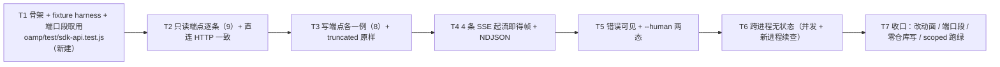

# pr-007-tasks.md — pr-007 内部任务图（层 A 行为用例 · F02/F05/F06/F09）

**迭代**: 0025-hub-sdk-and-skill ｜ **阶段**: 5（PR 实现）｜ **PR 文件**: `prs/pr-007-sdk-api-behavior-test.md`
**worktree 分支**: `feat/0025-pr-007-sdk-api-behavior-test`（worktree 地址 `…/.pb-agents/worktrees/0025-pr-007-sdk-api-behavior-test`，HEAD `3ba06dd` = `iteration/0025-hub-sdk-and-skill` tip）｜ **任务总数**: **7**（T1~T7）｜ **依赖图**: 无环（单链，见 §2）

---

## 0. 范围、文件面与事实锚点

**本 PR 文件范围（唯一可写面，1 条）**

| 文件 | 动作 | 内容 |
|---|---|---|
| `oamp/test/sdk-api.test.js` | **新建** | 起真实 Router + `oamp web start`（随机端口 + 临时 `OAMP_DB`）后经 `bin/hub.js` 跑层 A：只读端点逐条 + 写端点各一例 + 4 条 SSE 起流即得帧 + NDJSON 逐行可解析 + 服务端错误可见 + `--human` 两态 + 跨进程无状态（F02/F05/F06/F09；`architecture.md` §10 T2） |

**非目标（明确不写）**

- 上游产物零改动：`oamp/sdk/**`（pr-001~pr-004：`errors` / `http` / `uds` / `surface` / `cli` / `doctor` / `index`）、`oamp/bin/hub.js`、`oamp/test/helpers/hub-harness.js`（**只 import**）、`oamp/package.json`、`oamp/API.md`、`oamp/skill/hub.md`；`oamp/src/**` 与 `oamp/web/**`（零改动）。
- 既有测试零改动：`oamp/test/helpers/harness.js`、`oamp/test/helpers/fake-node.js`（**只 import**）、已合并的 `oamp/test/sdk-skill.test.js`（pr-005）与 `oamp/test/sdk-surface.test.js`（pr-006）、其余既有 `test/*.test.js`（含 `hygiene.test.js`）。
- 并行 PR 的产物面：`test/sdk-{uds,cli-contract,doctor}.test.js`（pr-008~pr-010）**不在本 PR 写入面，也不作为断言对象**（不断言其存在性 —— 否则会在其落盘前制造假失败）。
- 层 B / 层 C / `doctor` / skill 文本的行为面（分别属 pr-008 / pr-009 / pr-010 / pr-005·pr-006）；库面 `createHub().api.*` 的行为覆盖（PR 文件未列，本 PR 一律经 `bin/hub.js` 子进程 —— 见 §5-1）。
- `docs/**` 除本文件（`pr-007-tasks.md`）之外的一切；`roles/**`、`tools/**`、`.claude/skills/**`。

**读码 / 文档事实锚点（判据基础；行号为 worktree `3ba06dd` 实测）**

| # | 事实 | 位置 / 依据 |
|---|---|---|
| A1 | 目标文件 `oamp/test/sdk-api.test.js` **当前不存在**（`test/sdk-*.test.js` 中已存在的只有 `sdk-skill.test.js`（pr-005）与 `sdk-surface.test.js`（pr-006）） | worktree `3ba06dd` 实测 |
| A2 | 测试拾取面 = `package.json` 的 `scripts.test = node --test test/*.test.js` ⇒ 新建 `test/sdk-api.test.js` **自动被拾取**，无需改 `package.json` | `oamp/package.json:12-13` |
| A3 | **跨 PR 接口契约（pr-004，只消费不改）**：`runHub(args, { env, input, timeoutMs })` → `{ code, stdout, stderr }`；`env = { ...process.env, ...opts.env }`（调用方只给增量）；`cwd = os.tmpdir()`；`detached` 进程组，到限 SIGKILL **整组** ⇒ `code === null`；缺省上限 10000ms；`input` 给出才写 stdin | `oamp/test/helpers/hub-harness.js:22`（上限）、`:30-37`（签名 / cwd / env / detached）、`:49-74`（收口与 settle） |
| A4 | 层 A 地址链的唯一落点 = `--port` > `OAMP_WEB_PORT` > `7788`；CLI 面把 `parsed.port` 传给 `createSurface` | `oamp/sdk/cli.js:248`；`oamp/sdk/surface.js:377-380` |
| A5 | 层 A 每条目 = 单 `method` + 单 `path`，`run` 由同一工厂产出并走 `http.js` 的 `request` / `stream`；`kind` 恰两种：`'result'` / `'stream'`（4 条订阅 = `stream chat` / `stream events` / `stream calls` / `stream call`） | `oamp/sdk/surface.js:38-70`（`runApi`）、`:81-101`（`apiEntry`）、`:103-244`（`API_ENTRIES`）、`:344`（`ENTRIES` 拼装） |
| A6 | **只读端点（非流式 GET）恰 9 条**（`GET /api/agents`、`GET /api/chats`、`GET /api/chats/:chat_id`、`GET /api/docs`、`GET /api/projects`、`GET /api/calls`、`GET /api/calls/:call_id/transcript`、`GET /api/calls/:call_id`、`GET /api/confirmations`）＝ 21 条中的「9 条非流式 GET」分类 | `architecture.md:501-503`（§5.5 端点分类：9 GET + 4 SSE + 8 POST）；`oamp/API.md:157-186`（§3 表） |
| A7 | **写端点（POST）恰 8 条**：`#4 close` / `#5 archive` / `#6 activate` / `#7 rename` / `#8 messages send` / `#13 projects create` / `#14 calls create` / `#21 confirmations decide` | 同上（§5.5 分类）；`oamp/sdk/surface.js:103-244`（层 A 表条目逐条） |
| A8 | **运行侧路由登记是可比对的真源**：`GET /api/docs` → `{ routes: projectRoutes(routes) }`，每行含 `{ method, path, kind, summary, params, response, errors, docLink }`（`kind ∈ {'json','sse'}`）⇒ 只读集 / 订阅集 / 写集可由**运行侧一次投影**机械导出（`method==='GET' && kind==='json'` / `kind==='sse'` / `method==='POST'`） | `oamp/src/web.js:438-439`（`ROUTE_META_FIELDS`）、`:891-894`（`/api/docs` 处理器）、`:1384-1395`（`projectRoutes` 投影含 `kind`）、`:736`·`:756`·`:1166`·`:1188`（4 条 `kind: 'sse'`） |
| A9 | **前置 fixture 的可达性事实**（均由实读源码得出，非假设）：① `GET /api/chats` 的 `project_id` 必填（缺 → 400）；② 对话由 `POST /api/messages` 自动新建（`chat_id` 省略即生成 `chat-<uuid>`）；③ `POST /api/calls` 要求 `chat_id` **已存在**（否则 400）且 `agent` 角色名可解析到**在线**实例（不可解析 / 离线 → 404）；④ `GET /api/calls/:call_id{,/transcript}` 不存在 → 404（数据源 = Router `task_get`）；⑤ `POST /api/chats/archive` 无参、服务端算范围（未归档且非进行中的**全部**对话）；⑥ `POST /api/chats/:chat_id/activate` 需已归档对话；⑦ `POST /api/confirmations/:id/decision` 的唯一数据源 = web 进程内 inbox，登记入口 = 节点向 `web` 投递 `notice{kind:'confirmation_request'}` | `oamp/src/web.js:529-530`（chats 列表按 project 收口）+ `oamp/src/persist.js:146-149`（`project_id` 必填缺失即抛错 → 既有 catch 转 400）、`oamp/src/web.js:810`（`chat_id` 缺省生成）、`:980-1000`（calls 归属 + 角色解析）、`:1096-1105`（派发失败 → 404）、`:605-612`（archive 无参）、`:1213-1250`（calls get / transcript 404）、`:1266`·`:1287-1325`（confirmations）；`oamp/test/confirmation-inbox.test.js:147-156`（`sendNotice`）、`:176-190`（`ENVELOPE`） |
| A10 | **`truncated === true` 的既有可达路径（不改上游、不写实现）**：Router 任务表 1000 条封顶 ⇒ `updatesTruncated`；web 侧 `callTruncated(task)` 为 OR 口径（`updatesTruncated === true \|\| updates 含 detail.event === 'truncated'`）；既有用例已给出可达 fixture：桩按 `#chunks=1001` 推 1001 片 | `oamp/src/registry.js:47`（`MAX_TASK_UPDATES = 1000`）；`oamp/src/web.js:281-283`（`callTruncated`）；`oamp/test/call-protocol.test.js:341-348`（`overCapCall`，注释点名 1000 条封顶；等待上限 90000ms） |
| A11 | **SSE 无缓存、不补发**：订阅键上的 `publishTo` 无订阅者即丢弃；按调用订阅需要 call 已存在，且**不补发**已过去的事件 ⇒ 4 条 SSE 的"起流即得帧"必须**在订阅建立之后**触发事件 | `oamp/src/transport.js:74-77`（`handleCallStream` = `subscribe`）、`:79-82`（`handleChatCallStream`，注释点名"先订阅、再发起"）、`:84-89`（`publishTo` 无订阅者直接丢弃）；`oamp/API.md:747`（"先订阅、再发起"的载体）、`:1021-1056`（§4.3 不补发 / §4.4 序列） |
| A12 | **事件名白名单（断言取值来源）**：§4.1 对话流四类 `message` / `task_update` / `chat_state` / `notice`；§4.2 全局四类 `agent_online` / `agent_offline` / `confirmation` / `chat_state`；§4.4 调用面三类 `call_state` / `call_update` / `call_result` | `oamp/API.md:994-1004`、`:1005-1020`、`:1032-1057` |
| A13 | **NDJSON 行形态** = 每帧一行 `JSON.stringify({event, data})`（`data` 为帧 `data:` 的 JSON 解析值）；帧解析忽略 `:` 注释行（keepalive）与 `retry` 帧 | `oamp/sdk/cli.js:231-233`（逐帧写出）；`oamp/sdk/http.js:157-168`（`parseFrame`）；`architecture.md:452-472`（§5.3）、`:549`（§6 T-04 行） |
| A14 | **失败面形态** = stderr **恰一行** JSON `{code, error, exit_code}`（层 A 另带 `http_status`），stdout 保持干净；4xx/5xx 且非 `UPSTREAM_UNAVAILABLE` ⇒ 业务失败 `1`，上游 `error` / `code` **原样** | `oamp/sdk/cli.js:176-182`（`fail`）、`:144-148`（`http.js` 上游错误对象原样进 `upstream`）；`architecture.md:473-490`（§5.4） |
| A15 | **`--human` 两态 = 同一结果对象两个渲染器**：数组 ⇒ 表头 + 数据行；对象（或恰含一个数组载荷）⇒ 数组走表、其余键 `键: 值`；不做颜色 / 时间本地化 | `oamp/sdk/cli.js:110-154`（`renderTable` / `renderObject` / `renderHuman`）、`:163-166`（`writeResult`）；`architecture.md:452-472`（§5.3） |
| A16 | **端口段（主 agent 2026-09-15 冻结）**：pr-007 独占 **51000–51999**（pr-008 = 52000–52999、pr-009 = 53000–53999、pr-010 = 54000–54999）；既有用例占用止于 50999：41000-42999（`web.test.js` / `project-workspace`）、43000-44999（`api-pages`）、45000-46999（`api-routes`）、47000-48999（`acp-daemon` / `confirmation-inbox`）、48000-49499（`inbox-console`）、49000-50999（`notification-scope`）、49500-49999（`call-protocol`）。段只是**约束上界**：端口必须**运行时探测为空闲**后再用 | 主 agent 冻结指令；各文件 `pickPort()` 实测（见 `test/call-protocol.test.js:165-172` 的段 + `USED_PORTS` 去重体例） |
| A17 | **端到端 fixture 先例（局部复制体例，不抽公共 helper）**：`startWeb`（`spawn(process.execPath, [BIN, 'web', 'start', '--port', String(port)])` + `buildEnv` + 等 `WEB_READY`）、局部 fake ACP 桩（`OAMP_OMP_BIN` 注入；支持 prompt 内指令 `#chunks=<n>` / `#sleep=<ms>`）、`setup`（Router + 真实 agent `pb-dev` + 临时 `OAMP_DB` + 项目 / 对话）、`waitTerminal`、`overCapCall`、`openSse`（fetch + reader 手工切帧） | `oamp/test/call-protocol.test.js:41-155`（桩 + 指令）、`:165-172`（`pickPort` + `USED_PORTS`）、`:181-200`（`startWeb`）、`:237-276`（`openSse`）、`:279-292`（`createChat`）、`:295-318`（`setup`）、`:330-348`（`waitTerminal` / `overCapCall`）；`oamp/test/web.test.js:118-150`（`pickPort` / `startWeb`，PR 文件「代码锚点」的 `:126` 即此处 `spawn` 行）、`:247-272`（`setup`）；`oamp/test/confirmation-inbox.test.js:76-84`（`OAMP_WEB_TOPOLOGY_POLL_MS: '200'`）、`:147-156` / `:176-190`（`sendNotice` / `ENVELOPE`）；`oamp/test/hygiene.test.js:26-33`（静态扫描 `scanTargets` 体例，本 PR 不改该文件） |
| A18 | **只 import 不改动既有辅助**：`buildEnv` / `waitFor` / `startRouter` / `startAgent` / `stopAll`（`test/helpers/harness.js`）、`startFakeNode`（`test/helpers/fake-node.js`）、`runHub`（`test/helpers/hub-harness.js`，pr-004） | `oamp/test/helpers/harness.js:29`·`:34`·`:106`·`:159`·`:193`；`oamp/test/helpers/fake-node.js:26` |
| A19 | **流程口径（用户 2026-09-15 指令）**：中间 PR **不跑仓库级全量套件**；全量集中到全部开发完成后跑一次并驱动收口修复 PR ⇒ 本 PR 的验证方式 = scoped 跑 `node --test test/sdk-api.test.js` | 简报「流程口径」段 |
| A20 | **缺省端口 7788 当前被活进程实占**：主工作区有 `oamp/bin/oamp.js web start --port 7788` 在跑（pr-004 verifier 2026-09-15 实测）⇒ 任何走缺省链的层 A 调用会连到一个**外部 hub**，制造假绿 / 污染其它观测 | pr-004 verifier 的实测回报（2026-09-15） |
| A21 | **跨 PR 约束两条（pr-004 独立验收报出，必须带进本图）**：① `createHub({ socketPath })` **不达** `doctor` 的 R3 段（`doctor.check` 在进程 env 缺 `OAMP_SOCKET` 时抛 `HUB_UNREACHABLE/3`，即使显式 `socketPath` 指向活 Router）——该面属 **pr-010** 的范围；② 库面的层 C 与 `doctor` 读的是**调用方进程的 env**（`createHub` 没有 env 选项，唯一 env 来源 = `process.env`） | pr-004 独立验证报告（简报「Contract」段）；`oamp/sdk/index.js:20-21`（`createHub({port, socketPath})` → `createSurface`）；`oamp/sdk/surface.js:377-380`（`opts.env ?? process.env`） |
| A22 | **零仓库写（§10 测试基建约束）**：`OAMP_DB` / socket 一律临时目录；不写仓库内 `.runtime/` 与 `data/`；不依赖真实 omp / 外网 | `architecture.md:655`（§10 测试基建约束）；`oamp/src/config.js:154`（`OAMP_DB` 覆盖链） |

---

## 1. 任务列表

### T1: 文件骨架 + 局部 fixture harness + 端口段取用（层 A 一切用例的地基）

- **验收标准**:

  1. **落点与体例**（PR 验收 9 / §10 T2；A1 / A2）：新建 `oamp/test/sdk-api.test.js`；import 面**仅**为 `node:test`、`node:assert/strict`、`node:os`、`node:path`、`node:fs`、`node:url`、`node:child_process`（`spawn`，供 web 子进程）+ `./helpers/harness.js`（`startRouter` / `startAgent` / `waitFor` / `stopAll` / `buildEnv`）+ `./helpers/fake-node.js`（`startFakeNode`）+ `./helpers/hub-harness.js`（`runHub`）（A3 / A18）；**不 import `../sdk/**` 任何模块**、不新增 helper 文件、不改 `package.json`（C1~C4）。
  2. **端口段 + 运行时探测**（主 agent 冻结口径，A16 / A20）：文件内 `pickPort()` 产出**必落在 `51000..51999`**（段端以两个具名常量声明，如 `PORT_MIN = 51000` / `PORT_MAX = 51999`）；候选端口先经**运行时空闲探测**（`node:net` 起临时 server `listen(候选, '127.0.0.1')` 成功即 `close` 并采用；`EADDRINUSE` 则换下一个候选）再返回；文件内 `USED_PORTS` 去重；返回前 `assert.ok(port >= PORT_MIN && port <= PORT_MAX)`。**与 pr-008 / pr-009 / pr-010 的段（52000-52999 / 53000-53999 / 54000-54999）零交集**（以常量取值即可判）。
  3. **栈 fixture（局部实现，不抽公共 helper）**（A17）：`startRouter()`（harness，`envExtra` 取长租约 `{ OAMP_HEARTBEAT_TIMEOUT_MS: '3000' }` —— web 是常驻发送方，短租约会让它被判 offline）；本文件局部 `startWeb(socketPath, port, envExtra)`（`spawn(process.execPath, [BIN, 'web', 'start', '--port', String(port)])`，`env: buildEnv(socketPath, { OAMP_HEARTBEAT_TIMEOUT_MS: '3000', OAMP_DB: <临时库>, OAMP_WEB_TOPOLOGY_POLL_MS: '200', ...envExtra })`，等 `WEB_READY` 行，提前退出即抛错并带上 stderr）；本文件局部 **fake ACP 桩**（写进 `fs.mkdtempSync(os.tmpdir())` 并 `OAMP_OMP_BIN` 注入；至少支持 prompt 内指令 `#chunks=<n>` 与 `#sleep=<ms>`，体例同 `call-protocol.test.js:41-155`）；`startAgent('pb-dev', { socketPath, envExtra: { OAMP_PROTOCOL: 'acp', OAMP_OMP_BIN: FAKE_BIN, OAMP_OMP_MODEL: 'fake/model' } })` 并等 `REGISTERED instance=pb-dev`。全部句柄 `t.after` 回收（`stopAll([router])` / `agent.stop()` / `web.stop()` / `fs.rmSync(临时目录)`）。
  4. **临时状态零落仓库**（A22，PR 验收 10）：`OAMP_DB`、socket 目录、fake 桩目录**一律** `os.tmpdir()` 下的绝对路径；本文件内**零**仓库内 `.runtime/` / `data/` 字面量；零外网、零真实 omp / 真实 LLM（`OAMP_OMP_BIN` 恒指向本文件桩）。
  5. **`runHub` 调用面包装**（A3 / A4 / A20，PR 验收 10）：本文件内一个薄包装（如 `hub(argv, { env = {}, input, timeoutMs } = {})`）把 `{ OAMP_SOCKET: <router socket 绝对路径>, OAMP_WEB_PORT: String(<port>) }` 合并进 `env` 后调用 pr-004 的 `runHub`；**每一处调用都必须带端口**，禁止走 `7788` 缺省链（A20 的活 hub 会污染观测）。
  6. **共享断言原语**：`jsonDoc(stdout)`（去尾换行后 `JSON.parse`，失败消息点名原文片段）；`direct(method, path, payload?)`（测试进程 `fetch(http://127.0.0.1:<port><path>)`，返回 `{ status, text, body }`，供「SDK ↔ 直连 HTTP」比对）；`routeSet(kindSelector)`（从 `hub api docs` 的 `routes[]` 现算运行侧集合 —— A8，供 T2/T3/T4 的集合双向核对）。
  7. **冒烟**：`cd oamp && node --test test/sdk-api.test.js` 下本任务的最小用例（起栈 → `hub(['api','docs'])` → `code === 0` + `stderr === ''` + `jsonDoc(stdout).routes` 为数组）通过。

- **前置依赖**: 无
- **优先级**: P0
- **追溯**: PR 文件 验收 9、10、11 + 文件范围；「上下文摘要」（真实 Router + `oamp web start` 随机端口 + 临时库 + 经 `bin/hub.js`）；`architecture.md:642-658`（§10 T2 + 测试基建约束）、`:278`（§4.1 N-11：`hub-harness` 复用）；`prd/F09:36`（零本地写入）；锚点 A1 A2 A3 A4 A16 A17 A18 A19 A20 A22

### T2: 层 A 只读端点逐条（9 条）+ 与直连 HTTP 一致

- **验收标准**:

  1. **9 条只读端点逐条至少成功一次**（PR 验收 1 / F02 验收 1·2）：`api agents`（无参与 `--state online` 各一次）、`api chats list --project-id <id>`、`api chats get <chat_id>`、`api docs`、`api projects list`、`api calls list`、`api calls transcript <call_id>`、`api calls get <call_id>`、`api confirmations list`（集合定义 = A6 的 9 条非流式 GET）：每条 `code === 0` + `stderr === ''` + `jsonDoc(stdout)` 得到 JSON **对象**（含数组载荷的端点其载荷为数组），且 stdout 是**单个** JSON 文档（不是多行 / 不是数组包裹）。
  2. **集合双向核对（无缺项 / 无多出项）**（PR 验收 1 的机械形式，A8）：用例内声明 9 行调用 fixture（每行 = `{ argv, method, path }`），与 `hub api docs` 的 `{ method === 'GET' && kind === 'json' }` 集合比对：① 条数 9 ↔ 9；② 每行的 `{method, path}` ∈ 运行侧集合；③ 行间 `{method, path}` 两两不同 ⇒ 三者合起来即双射（缺项 / 多出项任一出现即点名具体签名）。**调用 fixture 只是"要调哪些入口"的清单，名面 ↔ 文档的权威锁在 pr-006 的 `test/sdk-surface.test.js`**（本 PR 不建第二份权威，见 C8）。
  3. **前置 fixture 由 SDK 写入口与既有辅助真实建立**（A9）：项目 ← `api projects create --repo-url <唯一地址>`；对话 ← `api messages send --project-id <id> --agent-id pb-dev --text <marker>`（`chat_id` 取自响应）；调用 ← `api calls create --chat-id <id> --agent dev --task '<marker> #sleep=<ms>'`（默认 background 形态；`call_id` 取自响应 `calls[0].call_id`，A9③ 的在线实例前提由 T1 的 `pb-dev` 满足）。每步断言响应字段形态（字段名来自 `API.md` §5 示例），不手写期望取值。
  4. **与直连 HTTP 一致**（PR 验收 2 / F02 验收 2）：对上述 9 条各做「SDK 面调用」+「测试进程直连 `fetch` 同一端点」两次观察，比对规则 = **递归键集合逐层相等** + **稳定字段取值相等**；易变键白名单（`session_id` / `last_heartbeat` / `created_at` / `updated_at` / `closed_at` / `archived_at` / `started_at` / `ended_at` / `duration_ms` / `at`）必须**存在且类型相同**，取值不强等（[model_inferred] 见 §5-2）。
  5. **只读面零写副作用**（可核形态）：9 条调用前后各取一次 `api chats list --project-id <id>` 的 `total` 与 `api calls list` 的 `calls.length`，两次取值相等（失败消息点名前后取值）。
  6. **对照清单机械产出**（PR 验收 1 的"可逐条核对"面）：同一循环内逐行 `t.diagnostic('#<n>\t<METHOD> <path>\t↔\t<hub 子命令 argv>\texit=<code>')`，由 fixture 行与实测结果生成（不是手写常量），在 scoped 跑的输出中可见。
  7. **scoped 跑绿**（A19 / PR 验收 11）：`node --test test/sdk-api.test.js` 中本任务用例全绿、零 `skipped` / `todo`。

- **前置依赖**: **T1**（同一文件串行写入 + 复用 fixture / 端口取用 / `hub()` / `jsonDoc` / `direct`）
- **优先级**: P0
- **追溯**: PR 文件 验收 1、2、11；`prd/F02-web-api-surface-coverage.md:16-19`（验收 1 / 验收 2）、`:22`（验收 4 的入口面）；`architecture.md:328-360`（§5.1 层 A 21 条 + 规则 1~5）、`:649`（§10 T2 行）、`:501-503`（§5.5 端点分类：9 非流式 GET）；`oamp/API.md:157-186`（§3 表）、`:1078-1103`（§5.2 项目）、`:1104-1130`（§5.3 列对话）、`:1145-1184`（§5.5 发消息）;锚点 A5 A6 A8 A9 A13 A15 A17

### T3: 写端点各一例（8 条 POST）+ 字段形态与 `API.md` §5 一致 + `truncated` 原样透传

- **验收标准**:

  1. **8 条写端点各一例走通**（PR 验收 3 / F02 验收 2）：`api projects create --repo-url <唯一地址>` → `{project:{…}}`；`api messages send --project-id <id> --agent-id pb-dev --text <marker>` → `{chat_id,task_id,message_id,warning}`；`api calls create --chat-id <id> --agent dev --task <marker>` → `{calls:[信封]}`（10 键信封，A10 同源）；`api chats rename <chat_id> --title <新标题>` → `{chat_id,title}`；`api chats close <chat_id>` → `{chat_id,state}`；`api chats archive`（无参）→ `{archived,failed,failed_ids}`；`api chats activate <已归档 chat_id>` → `{chat_id,state}`；`api confirmations decide <confirmation_id> --option-id allow_once` → `{confirmation_id,accepted:true}`。每条 `code === 0` + `stderr === ''` + stdout 为单个可解析 JSON 文档，且**字段名集合与该端点 `API.md` §5 示例一致**（断字段集，不断取值）。
  2. **集合双向核对**（同 T2 验收 2 的形态）：8 行写 fixture 与 `hub api docs` 的 `{ method === 'POST' }` 集合双向比对（条数 8 ↔ 8、逐行 ∈ 运行侧、两两不同）。
  3. **顺序约束（由 A9⑤ 决定，不是风格偏好）**：`chats archive` 的服务端范围 = **全部**未归档且非进行中的对话 ⇒ 归档步骤排在 rename / close 之后；`activate` 紧随 `archive`（需已归档对话）；`confirmations decide` 的在途项由 `startFakeNode` 向 `web` 投递 `notice{kind:'confirmation_request'}` 建立（A9⑦，体例 `test/confirmation-inbox.test.js:147-190`），裁决后 `api confirmations list` 中该 id 消失（同一进程内的可观察后果）。
  4. **`truncated` 为真时的原样透传（未做正文重建）**（PR 验收 3 / F02 验收 2 / C-A）：以既有可达路径制造 `truncated === true` —— `api calls create --chat-id <id> --agent dev --task '<marker> #chunks=1001'`（background，A10 的 1000 条封顶），轮询 `api calls get <call_id>` 至终态（上限 90000ms，逐字沿用既有 `overCapCall` 的等待上限）后断言：① 终态信封 `truncated === true`、`state` ∈ `{completed, failed}`；② SDK 的 `api calls get <call_id>` 输出与**测试进程直连** `GET /api/calls/<call_id>` 的输出在键集合与稳定字段上一致，且 `text` 逐字相同；③ SDK 的 `api calls transcript <call_id>` 输出的 `entries.length` ≤ 1000 且与直连同端点一致 ⇒ "仍是标记为截断的那份结果"，SDK 未做正文重建 / 未追加第二次请求（若 SDK 自行拼接，字段或取值必与单次直连结果分叉 —— 该分叉即失败）。
  5. **写端点各一例的效果可见**（可核形态）：rename 后 `api chats get <id>` 的 `chat.title` = 新标题；close 后 `state === 'closed'`；archive 后 `api chats list --project-id <id> --archived 1` 的 `total ≥ 1`；decide 后该 confirmation 不在 `api confirmations list` 中。
  6. **scoped 跑绿**：`node --test test/sdk-api.test.js` 含本任务用例且全绿（口径同 T2 验收 7）。

- **前置依赖**: **T2**（同一文件串行写入；复用其 fixture 建立的项目 / 对话 / `pb-dev` 实例与 `hub()` / `direct` 原语）
- **优先级**: P0
- **追溯**: PR 文件 验收 3、11、「上下文摘要」（写端点各一例）；`prd/F02:18-19`（验收 2 含 `truncated` 口径收窄 C-A）；`architecture.md:328-360`（层 A 表 21 条 / 规则 4）、`:501-503`（§5.5 分类）、`:596`（§8 C9：`truncated` 重建不由 SDK 代做）；`oamp/API.md:602-628`（§3.13）、`:630-712`（§3.14）、`:745-801`（§3.x）、`:953-990`（§3.21）、`:1254-1282`（§5.8 归档 / 激活 / 改名）、`:1374-1428`（§5.12~5.14 调用示例）；锚点 A7 A8 A9 A10

### T4: 4 条 SSE「起流即得帧」+ NDJSON 逐行可解析

- **验收标准**:

  1. **4 条订阅入口各起流即得帧**（PR 验收 4 / F02 验收 4 / F06 验收 1·4）：`api stream chat <chat_id>`、`api stream events`、`api stream calls --chat-id <chat_id>`、`api stream call <call_id>` 各一次：进程**不立即退出**（`runHub({ timeoutMs: 6000 })` 到限整组 SIGKILL ⇒ `code === null`）+ stderr 为空（**不出现**用法错误 / `未实现` 一类字样）+ 至少 1 帧落在 stdout。
  2. **触发必须发生在订阅之后**（A11 的硬约束；[model_inferred] 见 §5-5）：以"先启流、后触发、再收敛"的形态落地 —— `const pending = hub([...], { timeoutMs: 6000 })`（不 await）→ 触发 → `await pending`；四次触发表 = ① `stream chat`：`api messages send --chat-id <id> --project-id <id> --agent-id pb-dev --text <marker>` 连发 3 次（间隔 ~300ms）；② `stream events`：`startFakeNode({ instanceId: 'pb-pr007-stream' })` → `stop()` 循环 3 次（拓扑轮询 `OAMP_WEB_TOPOLOGY_POLL_MS: '200'` 已在 T1 设定）；③ `stream calls`：`api calls create --chat-id <id> --agent dev --task '<marker> #sleep=1500'`；④ `stream call <call_id>`：先 `api calls create … '#sleep=2000'` 拿 `call_id`，再启流、再等待该调用推进（**该入口要求 call 已存在**，A11）。
  3. **帧的事件名落在文档白名单内**（A12）：①③④ 的帧 `event` ∈ 该作用域的事件表；② 的 `event` ∈ `{agent_online, agent_offline, confirmation, chat_state}`；出现表外事件名即点名 `event` 与实际来源。
  4. **NDJSON 逐行可解析、行分隔**（PR 验收 5 / F06 验收 2 / T-04）：把 stdout 按 `\n` 切分（丢弃末尾空行）后**每一行单独** `JSON.parse` 得到对象，且该对象键集合**恰** `['event','data']`（`typeof event === 'string'`、`data` 为对象）；整份 stdout **不是**一整份 JSON 数组（首行首字符为 `{`），**无半截行**（末行可解析）。四条的形态一致（同一写出路径，A13 / A15）。
  5. **流的内容不加工**（F06 边界 / C-1）：帧的 `data` 与直连 SSE 同名帧的 `data` 同形（对 ② 或 ① 至少一条做直连对照：测试进程 `fetch` 同一 SSE 路径手工切帧，两侧 `event` 名序列是子序列关系且同形字段逐一相同）；不得出现聚合 / 去重 / 进度换算字段。
  6. **scoped 跑绿**：`node --test test/sdk-api.test.js` 含本任务用例且全绿（口径同 T2 验收 7）。

- **前置依赖**: **T3**（同一文件串行写入；复用其对话 / 调用 fixture 与 `pb-dev`；`stream calls` / `stream call` 的触发面来自 T3 建立的 `api calls create` 形态）
- **优先级**: P0
- **追溯**: PR 文件 验收 4、5；`prd/F02:22`（验收 4 SSE 可达）；`prd/F06-subscription-ndjson-stream.md:16-23`（验收 1~4）、`:37-40`（架构落定：帧形态 / 忽略注释行与 retry / 4 条作用域）；`architecture.md:452-472`（§5.3 NDJSON）、`:542-556`（T-04）、`:567`（F06 行）、`:649`（§10 T2 行）；`oamp/API.md:992-1056`（§4 事件流全景）；锚点 A5 A11 A12 A13 A17

### T5: 服务端错误可见（`code` 原样 / 退出码 1 / stdout 干净）+ `--human` 两态

- **验收标准**:

  1. **上游错误标识原样可见**（PR 验收 6 / F02 验收 3 / F05 验收 4）：至少两例 —— ① `api chats get <不存在的 chat_id>`（上游 404 `NOT_FOUND`）；② `api calls create --chat-id <不存在的 chat_id> --agent dev --task <t>`（上游 400 `INVALID_PARAM`，A9③）。两例均：`code === 1`；stderr 为**恰一行** JSON 且键集合含 `['code','error','exit_code']`（层 A 另带 `http_status`）；其中的 `code` 与测试进程直连同一请求所得上游错误体的 `code` **逐字相同**、`error` 文本逐字相同、`http_status` = 上游 HTTP 状态码（A14）。
  2. **stdout 无残片**（PR 验收 6 / F05 验收 4）：两例的 `stdout` 去空白后为空（`stdout.trim() === ''`），且不含可 `JSON.parse` 的残片 / 人话混排。
  3. **用法错误与业务失败的边界不混淆**（口径对照，不扩面）：至少一例本地用法错误（如 `api chats get` 缺位置参数，或给某条目不接受的选项）落 `code === 2` 且**同样**写 stderr 单行 JSON、stdout 为空 —— 用来证明"退出码 + 输出即可区分"（`2` 与 `1` 不同）；该例**不得**要求任何连接（本地校验先于请求，`sdk/cli.js:246-248`）。
  4. **`--human` 两态形态明显不同**（PR 验收 7 / F05 验收 2）：同一只读命令（取 `api agents` 与 `api projects list` 两例）分别不加 / 加 `--human`：不加 ⇒ stdout 可 `JSON.parse` 且为**单个**文档；加 ⇒ stdout **不可**整份 `JSON.parse`（形态明显不同），且为表头 + 数据行（数组载荷）或多行 `键: 值` 的文本形态（A15）。
  5. **开关不改事实**（PR 验收 7 / F05 验收 3）：两态承载的事实逐项一致 —— ① 行数：`--human` 表体数据行数 = 默认 JSON 的数组长度（`api agents` 的 `agents.length`；`api projects list` 的 `projects.length`）；② 实例名 / 项目名：默认 JSON 中每一行的 `instance_id` / `project_id`（或 `name`）都出现在 `--human` 文本中；③ 状态字段：`state` 取值同样出现。任一项缺失即点名具体字段与两侧形态。
  6. **scoped 跑绿**：`node --test test/sdk-api.test.js` 含本任务用例且全绿（口径同 T2 验收 7）。

- **前置依赖**: **T4**（同一文件串行写入；复用 `hub()` / `jsonDoc()` / `direct()` 与已建立的 fixture）
- **优先级**: P0
- **追溯**: PR 文件 验收 6、7；`prd/F02:20-21`（验收 3 服务端错误可见）；`prd/F05-json-output-and-human-flag.md:15-22`（验收 1~4）、`:35-38`（架构落定：`--human` 形态 / 默认输出 / 开关不改事实）；`architecture.md:452-490`（§5.3 / §5.4）、`:568`（F07 行）、`:569`（F08 行）；`oamp/API.md:1283-1316`（§5.9 错误样例）；锚点 A14 A15

### T6: 跨进程无状态（并发互不影响 + 互不相干的新进程续查）

- **验收标准**:

  1. **同一命令并发执行互不影响**（PR 验收 8 / F09 验收 3 / MI-03(b)）：`Promise.all` 同时跑两条 `hub(['api','docs'])`（或一条 `api docs` + 一条 `api projects list`）：两者均 `code === 0`、各自 stdout 均为完整可解析文档；两条 `api docs` 的 `routes[]` 签名集合逐字相同，且与"单独跑一次"的签名集合逐字相同（无半截、无互相污染 / 不串结果）。
  2. **互不相干的新进程可直接续查**（PR 验收 8 / F09 验收 2 / MI-03(a)）：进程 A 执行 `api messages send …`（拿 `chat_id`，不阻塞等终态）→ 进程 B（**新的 `runHub` 调用 = 新进程**）执行 `api chats get <chat_id>`：`code === 0`、`chat.chat_id` 与该标识相同、`messages.length ≥ 1`（B 未参与 A 的调用）；强形态：进程 A `api calls create … --mode background` 拿 `call_id` → 进程 B（新进程）`api calls get <call_id>`：`code === 0` 且 `call_id` 相同、信封 10 键齐备（状态取 `submitted` / `working` / `completed` / `failed` 之一**均可**，不断言具体状态 —— 断言的是"不依赖此前任何调用的上下文即可取到"）。
  3. **无跨调用本地记忆**（F09 验收 1 的可核形态）：同一只读命令连跑两次（独立进程）结果一致（除易变键白名单取值）；两次之间插入一次写操作（如 `api chats rename`），第二次只反映服务端真实状态（不被第一次的本地快照影响）——即第二次的 `chats get` 里 `title` 已是新值。
  4. **不产生可复用的本地状态载体**（F09 验收 1 的机制面）：本任务全部 hub 调用结束后，仓库包目录 `<pkg>/data` 与 `<pkg>/.runtime` 的相对快照（存在性 + `readdirSync` 结果）与用例开始前**逐项相同**（不存在则仍不存在）——与 C7 的临时目录机制互为印证。
  5. **scoped 跑绿**：`node --test test/sdk-api.test.js` 含本任务用例且全绿（口径同 T2 验收 7）。

- **前置依赖**: **T5**（同一文件串行写入；复用 `hub()` / `jsonDoc()` / `direct()` 与对话 / 调用 fixture）
- **优先级**: P0
- **追溯**: PR 文件 验收 8；`prd/F09-stateless-cli.md:15-22`（验收 1~4）、`:36`（架构落定：零本地写 / 零全局可变状态；MI-03 观测口径的承载）、`:41`（MI-03 观测口径）；`architecture.md:410-450`（§5.2 规则 4：无跨调用状态）、`:595`（§8 C8）；锚点 A3 A19 A22

### T7: 收口 —— 改动面 / 端口段守门 / 零仓库写 / scoped 跑绿 / PR 验收逐条对位

- **验收标准**:

  1. **改动面恰一条新增路径**（PR 文件范围）：`git -C <worktree> diff --name-only <base> -- oamp/` 恰为 `oamp/test/sdk-api.test.js`（新增）；对 `oamp/sdk/**`、`oamp/bin/**`、`oamp/package.json`、`oamp/API.md`、`oamp/src/**`、`oamp/skill/hub.md`、`oamp/test/helpers/**`（含 `hub-harness.js`）、已合并的 `oamp/test/sdk-skill.test.js` 与 `oamp/test/sdk-surface.test.js` **零改动**。
  2. **端口段守门（可机械核对）**（A16，主 agent 冻结）：静态扫本文件 —— 出现的端口段字面量**只有** `51000` 与 `51999` 两个界值（且 `PORT_MIN < PORT_MAX`）；运行时断言 `pickPort()` 返回值 ∈ `[51000, 51999]`；本 PR 段与 pr-008 / pr-009 / pr-010 段（`52000-52999` / `53000-53999` / `54000-54999`）**零交集**；**无任何调用走 7788 缺省链**（静态扫：每处 `hub(...)` 都经 T1 的包装注入 `OAMP_WEB_PORT`，或显式 `--port <段内端口>`）。
  3. **零仓库内运行态写入**（§10 测试基建约束，A22）：本文件零 `.runtime/` / `data/` 字面量；用例跑完后 `<pkg>/data` 与 `<pkg>/.runtime` 快照不变（T6 验收 4 的同一机制在此以文件级守门用例复述，避免误用仓库库文件）；临时目录全部位于 `os.tmpdir()` 且在 `t.after` 中回收。
  4. **scoped 跑绿 + 拾取性**（PR 验收 11 / §10 T2·T-07；A2 / A19）：`cd oamp && node --test test/sdk-api.test.js` 全绿、零 `skipped` / `todo`；文件名落在既有 `test/*.test.js` glob 内 ⇒ 拾取性成立；**不**在本 PR 触发仓库级全量套件（全量留待全部开发完成后的收口修复 PR）。
  5. **失败可定位**（体例要求，A14 / A17）：集合核对失败的失败消息**分别列出**缺项签名与多出签名；两侧比对失败的消息点名 `endpoint` / 键路径（如 `agents[0].state`）与两侧取值；订阅用例失败时把已收到的原始 stdout（截断到可读长度）一并给出。
  6. **PR 11 条验收逐条对位**（见 §3）并有可复现证据（命令 + 输出摘要），逐条 pass；无法在本 PR 面闭合的条目（仓库级全量拾取）显式标注"留收口修复 PR"，不得以"看起来没问题"结案。

- **前置依赖**: **T1、T2、T3、T4、T5、T6**（收口判定以六者用例齐备且 scoped 全绿为前提；同文件串行写入）
- **优先级**: P0
- **追溯**: PR 文件 验收 9、10、11 + 文件范围 +「非目标」；`architecture.md:642-658`（§10 T2 行 + 测试基建约束）、`:278`（N-11）、`:594`（§8 C7 既有测试影响）；`oamp/test/hygiene.test.js:26-33`（静态扫描体例先例，本 PR 不改该文件）；锚点 A1 A2 A16 A19 A20 A22

---

## 2. 依赖图（无环）

拓扑序（合法执行序）：`T1 → T2 → T3 → T4 → T5 → T6 → T7`

- **最长依赖链**：`T1 → T2 → T3 → T4 → T5 → T6 → T7`（6 跳）。
- **关键路径任务**：**T1~T7 全部在关键路径上**（本 PR 只有一条链，无支路）。
- **无环**：边方向严格单调递增，无回边、无自环。
- **逻辑依赖 vs 写入串行**：真实的**逻辑**依赖有两条 —— ① T2~T7 复用 T1 落定的 fixture / 端口取用 / `hub()` / `jsonDoc` / `direct` / 运行侧路由集合原语；② T4 的两条调用面订阅需要 T3 建立的 `api calls create` 形态与调用 fixture；③ T6 的续查依赖 T3/T5 建立的对话与调用标识。其余相邻边主要是**同文件写入的串行化**，**不得**把 T2~T6 当并行支路执行。

**同文件串行约束（必须）**

| 文件 | 写入任务 | 串行要求 |
|---|---|---|
| `oamp/test/sdk-api.test.js` | **T1 → T2 → T3 → T4 → T5 → T6 → T7** | **唯一一个新文件**且被七个任务依次追加 ⇒ 必须单链串行、不得并行写入（planner 红线：不在同一文件上制造并行写入） |
| `oamp/test/helpers/hub-harness.js` | **无**（零改动） | 只读 import：`runHub`（A3） |
| `oamp/test/helpers/harness.js` / `fake-node.js` | **无**（零改动） | 只读 import：`startRouter` / `startAgent` / `waitFor` / `stopAll` / `buildEnv` / `startFakeNode`（A18） |
| `oamp/sdk/**`、`oamp/bin/hub.js`、`oamp/API.md`、`oamp/package.json`、`oamp/src/**` | **无**（零改动） | 只读：`bin/hub.js` 作为**被执行对象**（子进程）；`/api/docs` 作为**运行侧真源**（HTTP 观察，不读文件） |
| pr-008~pr-010 的用例文件 | **无**（零改动） | 本 PR **不断言**这些文件的存在性，也不与其共享端口段（A16 的四段互斥） |

---

## 3. 与 pr-007 验收标准逐条对位表

| PR 验收 #（PR 文件 `:20-30`，11 条） | 验收摘要 | 承接任务 | 对位说明 / 判据面 |
|---|---|---|---|
| 1 | 只读端点逐条至少成功调用一次 | **T2**（验收 1、2、6） | 9 条 = A6 分类；逐条 `code 0` + 单文档 JSON；集合与 `/api/docs` 双向核对（A8） |
| 2 | 响应体与直连 HTTP 一致 | **T2**（验收 4） | 递归键集合 + 稳定字段取值比对（易变键白名单见 §5-2）；直连 = 测试进程 `fetch` 同端点 |
| 3 | 写端点各一例 + 字段与 `API.md` §5 一致；`truncated` 为真时仍是截断的那份 | **T3**（验收 1~5） | 8 条 POST 逐条；`#chunks=1001` → 1000 条封顶（A10）⇒ `truncated === true` 且与单次直连结果同形同值 |
| 4 | 4 条 SSE 起流即得帧（不立即退出、不报未实现、有事件即逐帧） | **T4**（验收 1~3） | `code === null`（到限整组 SIGKILL）+ stderr 无用法错误 + ≥1 帧且 `event` ∈ 文档白名单（A11 / A12） |
| 5 | 订阅输出为 NDJSON，逐行独立可解析 | **T4**（验收 4） | 每行 `JSON.parse` ⇒ 键集恰 `['event','data']`；整份非数组；无半截行（A13） |
| 6 | 服务端错误可见：`code` 原样、退出码 `1`、stdout 无残片 | **T5**（验收 1~3） | 两例上游错误（404 `NOT_FOUND` / 400 `INVALID_PARAM`）与直连上游错误体逐字比对；stdout 空；`2` 与 `1` 可区分（A14） |
| 7 | `--human` 两态形态不同且事实逐项一致 | **T5**（验收 4、5） | 两例（`api agents` / `api projects list`）；行数 / 实例名 / 状态三项核对（A15） |
| 8 | 跨进程无状态：两新进程各得完整正确结果，不互相覆盖 / 不串结果 | **T6**（验收 1~4） | 并发同命令 + 新进程续查（chat_id / call_id）+ 无本地记忆 + 仓库运行态快照不变（A22） |
| 9 | 用例经 `hub-harness.js` 的 `runHub(args, {env,input,timeoutMs})` 起子进程（不自建第二套） | **T1**（验收 5）+ T2~T6 全体的调用面 | 单一薄包装 `hub()` 恒经 pr-004 的 `runHub`（A3）；零第二个子进程辅助文件 |
| 10 | 不写仓库内 `.runtime/` / `data/`；不依赖真实 omp / 外网；不改 `helpers/harness.js` | **T1**（验收 3、4）+ **T7**（验收 3） | `OAMP_DB` / socket / 桩全在 `os.tmpdir()`；`OAMP_OMP_BIN` 恒指向本文件桩；既有 helper 只 import（A17 / A18 / A22） |
| 11 | 经 `node --test test/*.test.js` 被拾取并通过 | **T7**（验收 4）+ T2~T6 各自的 scoped 跑绿 | 文件名落在 `test/*.test.js` glob（A2）+ scoped 跑绿（A19，不跑全量） |

**覆盖检查**：PR 11 条验收 → 全部有任务承接（无遗漏）；未新增 PR 文件范围之外的功能面（唯一新文件 = `oamp/test/sdk-api.test.js`）；T1~T7 逐条可追溯到 PR 文件 / `prd/{F02,F05,F06,F09}` / `architecture.md` §5.1·§5.3·§5.4·§5.5·§10 / 事实锚点（见 §6）。

---

## 4. 关键实现约束（C 系列，全部为硬约束）

1. **C1 落点唯一**：只新建 `oamp/test/sdk-api.test.js`；不新建 `test/helpers/**`（`hub` 子进程辅助已由 pr-004 落地，A3）；不改 `package.json`。
2. **C2 零新框架 / 零新依赖**：`node:test` + `node:assert/strict` + `node:{os,path,fs,url,child_process,net}`；不引第三方断言 / HTTP / 表格库；不改 `scripts.test`。
3. **C3 不 import `../sdk/**`**（本 PR 的结构性选择，见 §5-1）：一切层 A 行为经 `bin/hub.js` 子进程观察；直连侧用测试进程的 `fetch`。**跨 PR 契约保留**（A21②）：若后续确需库面调用，`createHub` 无 env 选项 ⇒ 必须在**调用方进程 env** 里设 `OAMP_WEB_PORT` / `OAMP_SOCKET`（例：`process.env.OAMP_WEB_PORT = String(port)` 后再 `createHub()`），不得依赖"把 env 传进 createHub"。
4. **C4 只用 pr-004 的 `runHub` 起 hub 子进程**（PR 验收 9）：不写第二套 hub 子进程辅助；不重新实现 stdout/stderr 收集与进程组收口；`env` 只给增量（`OAMP_SOCKET` / `OAMP_WEB_PORT` / web fixture 的 env 旋钮）。
5. **C5 零上游改动**：`oamp/sdk/**`、`oamp/bin/**`、`oamp/API.md`、`oamp/package.json`、`oamp/src/**`、`oamp/skill/hub.md`、`oamp/test/helpers/**`、已合并的 `sdk-skill` / `sdk-surface` 用例、其余既有 `test/*.test.js` 一律零 diff；**发现上游缺陷时上报，不在本 PR 修**（收口修复 PR 承接）。
6. **C6 端口纪律**（A16 / A20）：本 PR 段 = `51000-51999`，且端口必须**运行时探测为空闲**（段是上界，不是硬编码列表）；文件内 `USED_PORTS` 去重；**任何调用不得走 7788 缺省链**。
7. **C7 临时状态纪律**（A22）：`OAMP_DB` / socket / 桩文件全在 `os.tmpdir()`；本文件零仓库内 `.runtime/` / `data/` 字面量；`t.after` 回收进程与临时目录。
8. **C8 fixture 表 ≠ 第二份真源**：T2/T3/T4 的调用表只回答"要调哪些入口"；**覆盖集合的权威来自运行侧 `/api/docs`（A8）**，名面 ↔ `API.md` 的权威锁在 pr-006 的 `test/sdk-surface.test.js`（本 PR 不比对 `API.md` 文本、不手抄 21 条路径清单当权威，只做"集合双向 + 双射"）。改 `API.md` / 路由登记导致的漂移，由 pr-006 与 pr-010 的锁点名；本 PR 的表若与之分叉，会在集合核对处直接失败并点名。
9. **C9 与并行 PR 的边界**（同 pr-006 的 C12 口径）：`test/sdk-{uds,cli-contract,doctor}.test.js`（pr-008~pr-010）与本 PR 无文件面交集，也**不作为断言对象**（不断言其存在性）；端口段四段互斥（A16）。
10. **C10 `truncated` 场景只用既有可达路径**（A10）：`#chunks=1001`（Router 任务表 1000 条封顶）；不改上游、不写实现、不新造 fixture 语义；等待上限逐字沿用既有 `overCapCall` 的 90000ms。
11. **C11 跨 PR 已报约束的登记**（A21）：① `createHub({socketPath})` 不达 `doctor` R3 —— 属 **pr-010** 的范围，本 PR **零 doctor 断言**；② 库面读调用方进程 env —— 见 C3。
12. **C12 scoped 验收口径**（A19）：验证方式 = `cd oamp && node --test test/sdk-api.test.js`；**不跑仓库级全量**（全量集中在全部开发完成后一次跑 + 收口修复 PR）。
13. **C13 时长上限**：单文件内每条订阅用例 ≤ 6s（到限整组收口，A3）；`truncated` 用例 ≤ 90s（既有先例同值）；其余用例以 `waitFor` 轮询代替裸 sleep（体例 A17）。
14. **C14 失败可定位**（A14 / A17）：集合核对分别列出缺项 / 多出项；两侧比对点名 `endpoint` / 键路径与两侧取值；订阅失败附已收到的原始 stdout 片段。

---

## 5. 边界与疑问（提请主 agent；均不阻塞执行）

1. **本 PR 不覆盖库面（`createHub().api.*`）**：PR 文件的「上下文摘要」「文件范围」「代码锚点」与验收 9 一致指向 `bin/hub.js` 子进程（`runHub`），故本图把库面层 A 的行为面**显式列为非目标**（C3）。若主 agent 认为库面层 A 也需行为锁（A21② 的 env 陷阱即由此而来），应**另立任务或另立 PR**——本图不擅自扩面（planner 红线：发现信息不足时报告，不自己填）。**请确认**。
2. **`[model_inferred]` 清单共 5 条**（均为"判据形态"选择，不引入 `demand.md` / `prd` / `architecture.md` 之外的新决策；确认后可原样执行）：
   - ① **T2/T3/T4 用"声明 fixture 行 + 与运行侧 `/api/docs` 集合双向核对"表达覆盖**（T2 验收 2 / T3 验收 2）——PR 验收 1/3 要求"逐条至少一次 + 无缺项"，但没有指定判据形态；取运行侧路由登记（`kind`/`method` 可导三集合，A8）作唯一集合真源，避免手抄 21 条清单当权威（C8）。
   - ② **"字段与取值一致"的比对规则**（T2 验收 4）——PR 验收 2 只说"字段与取值一致"，未给易变字段处置；本图取"递归键集合相等 + 稳定字段取值相等 + 易变键白名单（时间戳 / 会话 id / 时长）存在且同型"。先例：`duration_ms` / `last_heartbeat` 每次运行不同（`API.md:1063-1064` 明确"看结构即可"）。
   - ③ **只读面的范围 = 9 条非流式 GET**（A6）——来自 `architecture.md:501-503` 的端点分类；PR 验收 1 说"只读端点逐条"，本图把"只读"钉在 §5.5 的分类上（4 条 SSE 归 T4、8 条 POST 归 T3）。
   - ④ **写端点"各一例"= 8 条 POST 各至少一次成功调用**（T3 验收 1）——PR 验收 3 的措辞是"写端点各一例"（`各` = 每一条），本图按最强读法落地；若主 agent 的原意是"写面取一例示范"，则 T3 可缩到 2~3 条（范围收窄需显式裁决，本图不擅自缩）。
   - ⑤ **4 条 SSE 的触发时序与触发手段**（T4 验收 2）——PR 验收 4 只要求"起流即得帧"，但 `transport` 无缓存、不补发（A11）⇒ 事件必须发生在订阅之后；本图取"先启流（不 await）+ 触发 + 收敛"形态，触发手段 = `api messages send` / `startFakeNode` 注册与注销 / `api calls create`（含 `#sleep` 拉长在飞窗口）。三条手段均有既有先例（A17）。
3. **`truncated` 用例的成本（明示）**：制造 `truncated === true` 需桩推 1001 片、等待上限 90000ms（A10 的既有先例同值）。本图把它放在 T3，单文件总时长因此略高；若主 agent 要求本 PR 更短，可将其移入收口修复 PR 的"全量跑 + 收口"环节——**但那就脱离了 PR 验收 3 的原文范围**，故本图默认保留。
4. **端口获取方式的字面口径**：简报要求"沿用既有 `oamp/test/helpers/harness.js` 的取端口方式"，但实测 `helpers/harness.js` **不含** `pickPort`（它只提供 `startRouter` / `startAgent` / `buildEnv` / `waitFor`，socket 走临时目录）。既有取端口体例在**各用例文件内**（`test/call-protocol.test.js:165-172` 等），本次主 agent 另要求"运行时探测空闲端口"。本图因此取**两者叠加**：文件内 `pickPort`（既有体例）+ `node:net` bind 探测（主 agent 新增要求）+ 段约束（51000-51999）。**请确认该叠加口径**（若不要求探测，删掉探测段即可，段约束与去重照旧）。
5. **依赖图结论**：无环（单链 `T1→…→T7`，6 跳）；**无循环依赖需上报**。全图无一条边要求等待 pr-008 / pr-009 / pr-010（四者同 wave、互相独立，只共享已合并的 pr-004 与已冻结的端口段）。
6. **本任务图未做的事**：未写实现代码、未跑任何测试 / lint / 格式化、未执行任何 git 写命令、未修改任何上游产物（含 `hub-harness.js` / `harness.js` / `fake-node.js` / `sdk/**` / `bin/hub.js`）。

---

## 6. 追溯总表（任务 → 输入）

| 任务 | PR 文件追溯（`prs/pr-007-…md`） | prd 追溯 | architecture 追溯 | 事实锚点 |
|---|---|---|---|---|
| T1 | 验收 9、10、11；文件范围；「上下文摘要」 | `F09:36`（零本地写） | §10 T2（`:649`）+ 测试基建约束（`:655`）；§4.1 N-11（`:278`） | A1 A2 A3 A4 A16 A17 A18 A19 A20 A22 |
| T2 | 验收 1、2、11 | `F02:16`（验收 1）、`:18`（验收 2）、`:22`（验收 4 的入口面） | §5.1 层 A 全表 + 规则 1~5（`:328-360`）；§5.5 端点分类（`:501-503`）；§10 T2（`:649`） | A5 A6 A8 A9 A13 A15 A17 |
| T3 | 验收 3、11；「上下文摘要」 | `F02:18`（验收 2 / C-A `truncated`） | §5.1 层 A 表 + 规则 4（`:328-360`）；§8 C9（`:596`）；§5.5（`:501-503`） | A7 A8 A9 A10 |
| T4 | 验收 4、5 | `F02:22`（验收 4）；`F06:16-23`（验收 1~4）、`:37-40`（落定） | §5.3（`:452-472`）；§6 T-04（`:549`）；§7 F06 行（`:567`）；§10 T2（`:649`） | A5 A11 A12 A13 A17 |
| T5 | 验收 6、7 | `F02:20-21`（验收 3）；`F05:15-22`（验收 1~4）、`:35-38`（落定） | §5.3 / §5.4（`:452-490`）；§7 F07/F08 行（`:568-569`） | A14 A15 |
| T6 | 验收 8 | `F09:15-22`（验收 1~4）、`:36`（落定）、`:41`（MI-03） | §5.2 规则 4（`:410-450`）；§8 C8（`:595`） | A3 A19 A22 |
| T7 | 验收 9、10、11；文件范围；「非目标」 | `F02:16-22`（全部判据面的边界自陈） | §10 T2 + 测试基建约束（`:642-658`）；§8 C7（`:594`） | A1 A2 A16 A19 A20 A22 |
