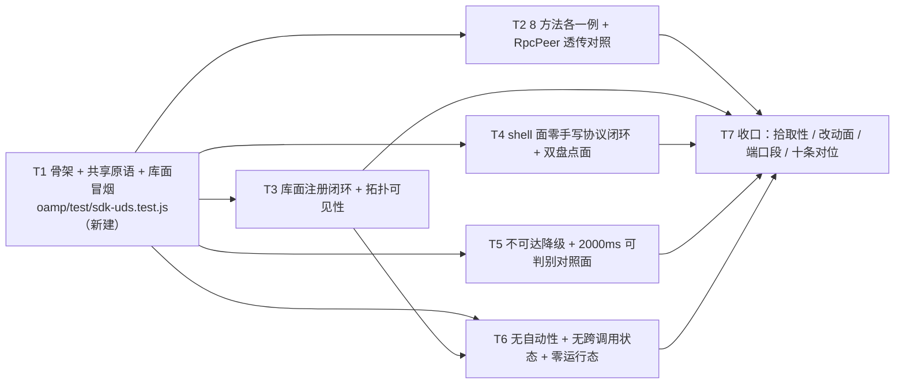

# pr-008-tasks.md — pr-008 内部任务图（层 B 行为用例 · F03/F08/F09/G02）

**迭代**: 0025-hub-sdk-and-skill ｜ **阶段**: 5（PR 实现）· wave 5 ｜ **PR 文件**: `prs/pr-008-sdk-uds-behavior-test.md`
**worktree**: 本 PR worktree（分支 `feat/0025-pr-008-sdk-uds-behavior-test`；HEAD `3ba06dd` = 迭代分支 tip，含已合并 pr-001~pr-005；落盘时 `git status --porcelain` 为空）｜ **任务总数**: **7**（T1~T7）｜ **依赖图**: **无环**（见 §2）
**输入真源**: PR 文件（F03/F08/F09/G02 四卡，10 条验收）+ `architecture.md` v1.0.0（§2.2 流 2、§2.3 接缝表、§3.2 L2-9/L2-10、§4.1 **N-5**、§4.3 Z-1/Z-7、§5.1 层 B 全表（含注册闭环两条路径）、§5.2 库 API、§5.4 错误与退出码、§7 F03/F08/F09/G02 行、§8 C8、§10 T3 + 测试基建约束）+ `prd/{F03,F08,F09,G02}*.md` + **已合并前序产物**（`oamp/sdk/{errors,http,uds,surface,cli,doctor,index}.js`、`oamp/bin/hub.js`、`oamp/skill/hub.md`、`oamp/test/{sdk-skill,sdk-surface}.test.js`、`oamp/test/helpers/hub-harness.js`）+ **代码库实读 + 运行期实测**（§0.3 逐条带 `文件:行号` 或 `[实测]`）
**交付物**: `docs/iterations/0025-hub-sdk-and-skill/prs/pr-008-tasks.md`（本文件，阶段产物，不计入 PR 改动面）

> **流程口径（用户 2026-09-15 指令）**：中间 PR **不跑仓库级全量套件**；全量集中在全部开发完成后跑一次并驱动收口修复 PR ⇒ 本 PR 的验证面 = **scoped** `node --test test/sdk-uds.test.js`（A22）。
> **两处上游裁决必须带进本图**：① 端口段冻结（pr-008 = **52000–52999**，A20）；② pr-004 独立验收登记的两条跨 PR 约束（A23）。

---

## 0. 范围、文件面与事实锚点

### 0.1 本 PR 文件范围（唯一可写面；**恰 1 个文件**）

| # | 文件 | 动作 | 内容（任务归属） |
|---|---|---|---|
| 1 | `oamp/test/sdk-uds.test.js` | **新建** | 层 B 行为用例：8 方法各一例 + 与 `RpcPeer` 直连结果的透传对照（**T2**）；库面注册闭环与拓扑可见性（**T3**）；shell 面零手写协议闭环 + 双盘点面（**T4**）；不可达降级与连接上限的可判别对照面（**T5**）；无自动性 / 无跨调用状态 / 零仓库运行态（**T6**）；文件骨架与共享原语（**T1**）、收口对位（**T7**） |

> 本阶段产物 `prs/pr-008-tasks.md`（本文件）不计入改动面。

### 0.2 非目标（零改动 / 防夹带）

- **零改动**（PR 文件「文件范围」的补集）：`oamp/sdk/**`（pr-001~pr-004 已合并产物，本 PR **只消费**）、`oamp/bin/**`、`oamp/package.json`、`oamp/src/**`、`oamp/API.md`、`oamp/skill/hub.md`、`oamp/web/**`、`oamp/test/helpers/**`（含 `harness.js` —— PR 验收 9 明令不改）、既有 `oamp/test/*.test.js`（含已合并 `sdk-surface.test.js` / `sdk-skill.test.js`）、`roles/**`、`tools/**`、`.claude/skills/**`。
- **不实现**（属并行 PR）：`test/sdk-{api,cli-contract,doctor}.test.js`（pr-007 / pr-009 / pr-010）。**本 PR 不断言这三者与 `sdk/index.js` 的实现细节共存关系**，也不断言其存在性。
- **不新增**：第三方依赖、新测试框架、新 npm script、新 CI 配置、新 helper 文件、新目录、任何 `.runtime/` / `data/` 产物。
- **不做**：Web 面不可达（→ pr-009 的退出码契约面）、`doctor` R3/R1/R2（→ pr-010）、层 A 21 条与层 C 11 条的行为覆盖（→ pr-007 / pr-009）、入口表覆盖面对照（→ pr-006 已合并）。本 PR 只用层 A 的 `hub api agents` 作为 PR 验收 3 指定的**拓扑盘点面**。

### 0.3 读码 / 实测事实锚点（本图全部判据的基础）

| # | 事实 | 位置 / 证据 |
|---|---|---|
| **A1** | worktree 状态：分支 `feat/0025-pr-008-sdk-uds-behavior-test`、HEAD `3ba06dd`、`git status --porcelain` 为空；`oamp/test/sdk-uds.test.js` **不存在**（本 PR 新建）；`oamp/sdk/index.js` / `oamp/bin/hub.js` / `oamp/test/helpers/hub-harness.js` **已存在**；`oamp/.runtime` 与 `oamp/data` **均不存在** | 实测（worktree 列举 + `git status`） |
| **A2** | 拾取面：`package.json` 的 `scripts.test = node --test test/*.test.js`；`bin = {"oamp":"./bin/oamp.js","hub":"./bin/hub.js"}` ⇒ 新建 `test/sdk-uds.test.js` **自动被拾取**，无需改 `package.json` | `oamp/package.json`（实测） |
| **A3** | `runHub` 契约（pr-004 交付、**跨 PR 冻结**）：`runHub(args, { env, input, timeoutMs })` → `{ code, stdout, stderr }`；包根按 `import.meta.url` 推导（`:20-21`）；`DEFAULT_TIMEOUT_MS = 10000`（`:22`）；`cwd: os.tmpdir()`（`:33`）；`detached` 自成进程组 + 一次调用结束即 SIGKILL 整组（`:36`）；**超时被强杀 ⇒ `code === null`** ⇒ 断言 `code === 3` 同时证明"命令自行结束、未被强杀" | `oamp/test/helpers/hub-harness.js:2`、`:20-22`、`:30`、`:33`、`:36`、`:49-60` |
| **A4** | 库面入口：`createHub({ port, socketPath })`（`sdk/index.js:20`）→ **恰四键** `{api,uds,cli,doctor}`（实测 `Object.keys`）；`uds = { connect }`（`surface.js:392`）；`connect` → `createSurface` 的 `ctx` 感知封装（`surface.js:225-227`）。**`createHub` 无 `env` 选项** ⇒ 缺省链读 `process.env`（`uds.js:34-42` **惰性** `import('../src/config.js')`）。实测：`process.env.OAMP_SOCKET = <活 Router socket>` 后 `createHub().uds.connect()` 成功；**不设 env** ⇒ 落 `<包根>/.runtime/router.sock` → `ENOENT` → `HUB_UNREACHABLE` / `exitCode 3`（该目录在 worktree 内不存在）；显式 `createHub({socketPath})` 与 `connect({socketPath})` 均实测可用 | `oamp/sdk/index.js:20`、`oamp/sdk/surface.js:225-227/392`、`oamp/sdk/uds.js:34-42`；[实测] |
| **A5** | 会话面（层 B 库 API，**8 方法 + close**）：`register(instanceId)` `:141`、`heartbeat(params)` `:147`（`peer.notify`，**通知语义无 result**）、`send(params)` `:151`、`ack(params)` `:155`、`status()` `:159`、`taskGet(taskId)` `:163`、`taskList(query)` `:167`、`deregister()` `:170`、`close()` `:175`；`identity` 由 `register` 成功后持有（`:129`、`:143`），`heartbeat`/`ack`/`deregister` 的 params 合成时**会话身份优先**（`:148`、`:156`、`:171`）；返回值 = **JSON-RPC `result` 原对象**（不加信封、不改字段名、不裁剪，`:3`）；请求上限 `REQUEST_TIMEOUT_MS = 5000`（`:16`、`:133`）；连接建立上限 `CONNECT_TIMEOUT_MS = 2000`（`:15`、`:52`） | `oamp/sdk/uds.js:3`、`:15-16`、`:129-177` |
| **A6** | **`message.send` 的 params 形态 = `{ message: <信封> }`**（信封**不**在顶层）：`router.js:207` `const m = params.message \|\| {}`。信封必填（`validateSendMessage`，`router.js:25-36`）：`protocol === 'oamp/1'`、`message_id` 可打印 ASCII ≤64、`type ∈ {task.request,task.update,task.result,notice}`（可省）、`to.instance_id` 合法、`payload.{content_type ∈ {text/plain,text/markdown,application/json}, body: string}`；**`from` 不得自报**（`router.js:213` 起）。实测：顶层直接放信封 ⇒ `INVALID_MESSAGE` / `exitCode 1` | `oamp/src/router.js:25-36`、`:207`、`:213`；[实测] |
| **A7** | 8 方法的真实返回值形态（**实测**）：`register` → `{instance_id, session_id, state:'online', lease_timeout_ms, last_heartbeat, lease_follows_interval:true}`；`heartbeat` → **无 result**（CLI 面渲染 `null`）；`deregister` → `{removed:true}`；`send`（目标 live）→ `{accepted:true, message_id, status:'delivered'}`；`ack` → `{acked:true, status:'accepted'}`；`status` → `{nodes:[{instance_id, session_id, state, last_heartbeat}]}`（`registry.js:153` 的 4 字段投影，按 `instance_id` 排序）；`task_get` 未知 id → `{task:null}`、非法 id → `INVALID_PARAMS`；`task_list {}` → `{tasks:[]}`、`{state:'__probe__'}` → `INVALID_PARAMS`（与 `architecture §5.1` 的 doctor R3 探针口径一致） | `oamp/src/router.js:109-…/348-…`、`oamp/src/registry.js:153`；[实测] |
| **A8** | **ack 的会话绑定**：`resolvePendingAck` 要求 `pend.toInstance === instanceId && pend.toSession === sessionId`（`registry.js:179-187`）⇒ 受理必须由**收到该投递的那个会话**发出。shell 面每次调用都是新会话（F09）⇒ **shell 面 `message.ack` 的成功路径结构性不可达**（实测：对属另一会话的 pending 得 `STALE_SESSION`）。成功路径只能在**库面**（会话自己收 + 自己 ack）闭合 | `oamp/src/registry.js:179-187`；[实测] |
| **A9** | **投递的传输层应答 ≠ 应用层受理**：`uds.js` 的 `onRequest` 对 `message.deliver` 恒回 `{received:true, message_id}`，**不自动 ack**（`uds.js:104-121`）；受理 = 调用方显式 `ack()`。实测：显式 ack 成功后再 ack → `UNKNOWN_MESSAGE`（证前一次受理是**唯一**一次 ⇒ 无自动 ack）。**对照**：真实 agent 子进程**会**自动 ack（`node-client.js:86-110`）⇒ pr-008 **不得**用 `startAgent` 充当"未受理"的接收方 | `oamp/sdk/uds.js:104-121`、`oamp/src/node-client.js:86-110`；[实测] |
| **A10** | 租约事实：`harness.js` 的 `SHORT_ENV` = interval 50ms / **timeout 300ms** / 窗口 300ms（`:19-23`），`startRouter()` 默认带上它。库面会话**无心跳** 300ms 后 Router 判 offline（`registry.js:126` `findExpired`、`:141` `markOffline`）**并销毁该连接** ⇒ 该会话后续调用抛 HubError `connection closed`（`AGENT_OFFLINE`）。既有放长租约手法 = `web.test.js:123` 的 `LEASE_ENV`（`OAMP_HEARTBEAT_TIMEOUT_MS:'3000'`） | `oamp/test/helpers/harness.js:19-23`、`oamp/src/registry.js:126/141`、`oamp/test/web.test.js:123`；[实测] |
| **A11** | 拓扑侧可见性（Router **stdout 事件行**，格式 `[ISO] router EVENT k=v`，实测）：`AGENT_REGISTERED instance=… session=… state=online`、`MESSAGE_DELIVERED message_id=… from=… to=…`、`MESSAGE_ACKED message_id=… instance=… status=accepted`、`AGENT_DEREGISTERED instance=…`；`startRouter` 返回 `stdout.waitNth(re)` / `waitRouterLine(re)`（`harness.js`）⇒ 拓扑判据**无需手写 socket** | `oamp/src/log.js:29-32`、`oamp/test/helpers/harness.js:130-140`；[实测] |
| **A12** | CLI 面不可达（实测）：`hub uds router.status`（`OAMP_SOCKET` 指向不存在路径）→ **退出码 `3`**、stdout 空、stderr **恰一行** JSON `{"code":"HUB_UNREACHABLE","error":"无法连接 oamp router（socket=…，ENOENT；router 未运行？先执行 oamp router start）","exit_code":3}`、用时 ~40ms（远小于 2000ms 上限） | `oamp/sdk/cli.js:177-182`；[实测] |
| **A13** | **库面错误对象含 `.stack`**（`HubError extends Error`，`errors.js:12`）；"无堆栈"是 **CLI 渲染面**属性 —— `serializeError` 只取 `{code, error, exit_code}`（+ 层 A 的 `http_status`）（`errors.js:76-84`），`cli.js:178-182` 落 stderr。实测：库面 ENOENT 的 `err.stack` 有 5 行 ⇒ **不得**断言 `err.stack === undefined`（该断言必然失败），"无堆栈"只能断言在 stdout/stderr 文本面 | `oamp/sdk/errors.js:12/76-84`、`oamp/sdk/cli.js:177-182`；[实测] |
| **A14** | **连接上限的可注入对照面（实测可用）**：`uds.js:52` 是**调用时**的 `net.connect(...)` 属性访问 ⇒ 用例进程内替换 `net.connect` 即被观察到。桩（记录 opts、永不 `connect`、随后触发 `timeout`）⇒ `connect()` 以 `HubError{code:'HUB_UNREACHABLE', exitCode:3}` 拒绝、文案含 `connect timeout (>2000ms)`、用时 12ms；**记录到 opts = `{path, timeout:2000}`** | `oamp/sdk/uds.js:50-63`；[实测] |
| **A15** | **清零点可观测（实测）**：以"透传包装真实 `net.connect` 并记录 `setTimeout` 调用"的方式 ⇒ 连通后记录到 **`[0]`**（对应 `uds.js:61-63` 的 `socket.setTimeout(0)`）。行为面：会话空闲 **2400ms（> 2000ms 上限）后 `status()` 仍成功** ⇒ 上限只约束**建立阶段** | `oamp/sdk/uds.js:60-63`；[实测] |
| **A16** | **UDS 连接黑洞不可确定性构造（实测，与 pr-002 的登记一致）**：`net.createServer({backlog:1})` 且从不 accept + 30 条已建连接后，第 31 条连接**瞬时 `connected`**（libuv 在 listen 队列完成连接）⇒ 真实等待 2000ms 的用例不可复现。2000ms 上限只能取 A14/A15 的**可判别对照面**（注入 + 上限值观测 + 清零点） | [实测]；pr-002 验收登记的同一条限制 |
| **A17** | 零仓库运行态（实测）：Router 起在临时目录时该目录**仅 `router.sock`**；`oamp/.runtime` 与 `oamp/data` 在 worktree 内**均不存在**；**web 子进程必须显式给绝对临时 `OAMP_DB`**，否则落 `<包根>/data/sql.db`（`config.js` 的相对路径基准 = 包根） | `oamp/src/config.js:136-154`；[实测] |
| **A18** | `hub api agents` 面（实测）：需真起 `oamp web start`（**段内随机端口 + 绝对临时 `OAMP_DB` + 同一 `OAMP_SOCKET`**）；`hub api agents --port 
 --state online` → `{agents:[{instance_id,session_id,state,last_heartbeat,role}]}`；**CLI 注册的实例**（命令结束、连接已关，但租约未过）在快照中 `state:'online'` 且**可见**（实测 `x-2` 在线） | `oamp/src/web.js:478-499`；[实测] |
| **A19** | 既有 `startWeb` 体例：`web.test.js:125-130`（等 `WEB_READY`）、`api-routes.test.js:93-110`、`api-pages.test.js:5`（**明写**"startWeb 为文件局部辅助（同 web.test.js 体例）：既有 web.test.js 内的同名辅助不可导出、且该文件禁止任何字节改动"）、`call-console.test.js:97-98`、`notification-scope.test.js:61-77` ⇒ web 启动辅助**必须是文件局部**的，**不是**"第二套 hub 子进程辅助" | 上述文件；`oamp/test/api-pages.test.js:5` |
| **A20** | **端口段（主 agent 2026-09-15 冻结分配）**：pr-007 = 51000–51999、**pr-008 = 52000–52999**、pr-009 = 53000–53999、pr-010 = 54000–54999；既有套件占用段止于 **49999**（41000-42999 / 43000-44999 / 45000-46999 / 47000-48999 / 48000-49499 / 49000-50999 / 49500-49999）。要求：**运行时探测的空闲端口**，段只是**上界约束**而非硬编码列表 | 主 agent 简报 + `0025-pr007-planner` 的占用段清单 |
| **A21** | CLI 面 `--as` 语义（实测）：`hub uds agent.heartbeat --as x-1 --params '{"next_interval_ms":10000}'` → 退出 `0`、stdout **`null`**（notify 无 result）；`hub uds agent.register --params '{"instance_id":"cli-1"}'` → 退出 `0` + result；**命令结束连接关闭，但条目在租约内保持 `state:'online'`**（实测：register 后立刻 `router.status` 可见 `cli-1:online`）；`--as` 给非身份条目 → `USAGE` / 退出 `2` | `oamp/sdk/cli.js:29`、`oamp/sdk/surface.js:212-252`；[实测] |
| **A22** | 流程口径：中间 PR **不跑仓库级全量套件**（用户 2026-09-15 指令）⇒ 本 PR 的"被拾取并通过"以 **文件名落在 `test/*.test.js` glob（A2）+ scoped `node --test test/sdk-uds.test.js` 全绿**闭合 | 简报「流程口径」段 |
| **A23** | **pr-004 独立验收登记的两条跨 PR 约束**：① `createHub({socketPath})` **不达** `doctor` R3 段 —— `doctor.check` 在进程 env 缺 `OAMP_SOCKET` 时抛 `HUB_UNREACHABLE/3`，即使显式 `socketPath` 指向活 Router；② 库面的**层 C 与 doctor 读调用方进程 env**（`createHub` 无 `env` 选项）⇒ 库面用例必须在**进程 env** 里设 `OAMP_SOCKET` | 简报「Contract」+ pr-004 独立验收报告 |

### 0.4 本 PR 内冻结契约（每个任务都必须遵守）

1. **C1 落点唯一**：只新建 `oamp/test/sdk-uds.test.js`。**不**新建 `test/helpers/**`（`runHub` 由 pr-004 提供，A3）、不改 `package.json`、不改 `oamp/test/helpers/harness.js`（PR 验收 9 明令）。
2. **C2 依赖面白名单**：`node:test` / `node:assert/strict` / `node:fs` / `node:os` / `node:path` / `node:url` / `node:net` / `node:child_process`（**仅**供文件局部 `startWeb`，`spawn` 不得用于 hub 入口 —— hub 入口一律 `runHub`）；`./helpers/harness.js`（`startRouter` / `stopAll` / `waitFor`）；`./helpers/hub-harness.js`（`runHub`）；`../sdk/index.js`（`createHub`）；`../src/rpc.js`（`RpcPeer` —— **对照 oracle / 假对端**，PR 验收 1 明写"与经 `RpcPeer` 直连得到的 JSON-RPC `result` 一致"，先例 `harness.js:12`）。**不** import `src/router.js` / `src/config.js` / `src/registry.js` / `src/web.js` / `sdk/uds.js`（已由 `index.js` 装配；避免第二份真源）。
3. **C3 库面 env 纪律（A4 / A23②）**：凡走**缺省链**的库面用例（`createHub()` 无 `socketPath`），必须**先**把 `process.env.OAMP_SOCKET` 设为该用例 Router 的**绝对临时 socket 路径**，并在 `t.after` 恢复（用例开始时保存原值）；显式 `createHub({socketPath})` / `connect({socketPath})` 的用例不依赖 env，但仍**同设**进程 env 以防误连真实 `<包根>/.runtime/router.sock`。
4. **C4 租约纪律（A10）**：库面会话用例的 Router 必须用**放长租约** env（`OAMP_HEARTBEAT_TIMEOUT_MS:'3000'`，先例 `web.test.js:123`）或对会话显式心跳；否则 `SHORT_ENV` 的 300ms 租约会让 Router 判 offline **并销毁连接**，用例会拿到 `connection closed` 假失败。**唯一**故意依赖短租约的用例 = T6 的"无自动心跳"（独立 Router + 显式短租约，判据是 **offline 墓碑**）。
5. **C5 临时状态纪律（A17）**：socket 一律 `fs.mkdtempSync(path.join(os.tmpdir(), '…'))`（**绝对路径**）；**web 子进程必须给绝对临时 `OAMP_DB`**；不写仓库 `.runtime/` / `data/`；子进程 env 一律 `{...process.env, OAMP_SOCKET, …}` 增量（`runHub` 的既有口径）。临时目录在 `t.after` 清理。
6. **C6 端口纪律（A20）**：本 PR 一切子进程端口 ∈ **[52000, 52999]**，且必须**运行时探测空闲**（段内随机候选 → bind 探测 → 有限重试 → 全忙则点名失败）；段边界常量集中一处（`PORT_SEGMENT = { min: 52000, max: 52999 }`）；与兄弟三段及既有占用段（止于 49999）**零交集**（以区间比较断言，不写空话）。**不**用 `OAMP_WEB_PORT` 缺省链（属 pr-007/pr-009 面）。
7. **C7 判据形态**：断言锚在**可观察行为**上（返回值 / Redis 面 stdout 事件行 / CLI 的 stdout+stderr+退出码 / 目录快照），**不**断言行号与源码文本；唯一例外 = T4 的"零手写协议"静态守门，且**只扫本用例文件自身**（先例 `hygiene.test.js` 的静态扫描体例）。8 行方法清单 / 参数形态**不得手抄**为常量判据 —— 透传判据必须与 `RpcPeer` 直连结果**现算对比**（C8）。
8. **C8 透传判据的形态（[model_inferred] 见 §5-MI-1）**：① **键集逐字一致**（递归比较，含嵌套信封）；② **恒定取值字段逐字一致**（`state` / `removed` / `accepted` / `status` / `acked` / `lease_follows_interval` / `lease_timeout_ms` 等）；③ **易变字段只核形态**（`session_id` = 非空字符串、`last_heartbeat` = 正整数、时间戳类字段 = 可解析 ISO 串）；④ **显式否定"加信封"**：SDK 返回值**不得**含 `result` / `jsonrpc` / `id` 键。
9. **C9 零自动性判据（G02 验收 3 / L2-9）**：失败后 ① **调用计数不增长**（注入桩计数在观察窗内恒为 1）；② **无重试文案**（CLI stderr **恰一行**）；③ **进程已收口**（`runHub` 返回且 `code === 3`，非 `null`）；④ **无自动心跳**（短租约 → offline 墓碑）；⑤ **无自动 ack**（pending 仍在：显式 ack 成功、二次 ack `UNKNOWN_MESSAGE`）；⑥ **无自动拉起**（用例前后无新增运行态目录；子进程树由 `runHub` 收口语义保证）。
10. **C10 事实优先**：任何断言落地前先按 §0.3 核对实测形态，尤其 **A6**（`send` 的信封嵌套）、**A13**（库面错误**有** `stack`）、**A12**（stderr 恰一行 JSON）、**A8**（shell 面 ack 成功路径不可达）——不得据"看起来合理"改口径。
11. **C11 与并行 PR 的文件面不重叠、不断言其存在性**：`test/sdk-{api,cli-contract,doctor}.test.js`（pr-007/009/010）不在本 PR 写入面，也**不作为断言对象**。

---

## 1. 任务列表

### T1: 文件骨架 + 共享原语（临时目录 / 进程 env 接管 / Router 生命周期 / 假对端 / 段内取端口）+ 库面冒烟

- **验收标准**:

  1. **落点与体例**（PR 验收 8、9）：新建 `oamp/test/sdk-uds.test.js`；`import { test } from 'node:test'` + `import assert from 'node:assert/strict'`；被核路径按 `import.meta.url` 推导（不依赖 cwd）；文件头注释点明四卡归属（F03/F08/F09/G02）与"零仓库运行态"口径。
  2. **依赖面恰为 C2 白名单**（PR 验收 8）：`import` 说明符逐条 ∈ C2 名单；`node:child_process` 的 `spawn` **仅**出现在 `startWeb` 辅助内（静态守门：hub 入口的 `runHub` 调用点与 `spawn` 调用点不共函数）。
  3. **共享原语齐备且各只一处**（可独立验收的判据面）：
     - `tempSocketDir()` —— `fs.mkdtempSync(path.join(os.tmpdir(), 'oamp-sdk-uds-'))`（绝对路径，C5）；
     - `startRouterFor(t, { leaseMs })` —— 经 `harness.startRouter({ envExtra: { OAMP_HEARTBEAT_TIMEOUT_MS: String(leaseMs) } })` 起真 Router，`t.after(() => stopAll([router]))` + 临时目录清理（C4）；
     - `useProcessSocket(t, socketPath)` —— 保存/设/恢复 `process.env.OAMP_SOCKET`（C3 / A23②）；
     - `rawPeer(socketPath, idPrefix)` —— **唯一**使用 `net.connect` + `new RpcPeer` 的辅助（对照 oracle + 假对端，C8/§0.4-2）；
     - `PORT_SEGMENT` + `pickFreePortInSegment()` —— 段常量 + 段内**运行时探测**空闲端口（C6）。
  4. **库面冒烟**（PR 验收 1 的可达性面）：`useProcessSocket` 设好 env 后 `const hub = createHub(); const s = await hub.uds.connect();` → `await s.status()` 返回对象且 `Array.isArray(result.nodes)`；`s.close()` 后用例正常结束（进程无残留句柄 —— 文件跑完能自然退出）。
  5. **不使用 `harness.queryStatus`**（拓扑读取一律走 SDK 面 `hub uds router.status` / 库面 `status()` / Router stdout 事件行，A11）——静态守门：文件中零 `queryStatus` 字样。
  6. **scoped 跑绿**：`cd oamp && node --test test/sdk-uds.test.js` 含本任务用例且全绿；**不**触发仓库级全量（A22）。

- **前置依赖**: 无
- **优先级**: P0
- **追溯**: PR 文件 验收 8、9、「文件范围」；`prd/F03-router-uds-method-coverage.md:16`（验收 1 的可达性面）；`architecture.md:410-450`（§5.2 库 API：`createHub` 装配 + `uds.connect`）、`:642-655`（§10 测试基建约束："不写仓库内 `.runtime/` 与 `data/`；不依赖真实 omp / 外网"）、`:642-650`（§10 T3 载体）；锚点 A1 A2 A3 A4 A5 A11 A17 A19 A22 A23

### T2: 层 B 8 方法各一例 + 与 `RpcPeer` 直连结果的透传对照（F03 验收 1/2）

- **验收标准**:

  1. **8 方法逐条可达、各成功调用一次**（PR 验收 1 / F03 验收 1）：库面会话**逐条**调用 `register` / `heartbeat` / `send` / `ack` / `status` / `taskGet` / `taskList` / `deregister`，每条均有可判定的成功证据（返回值或 Router stdout 事件行，A7/A11）；**对照清单恰 8 行**（每方法一行；假对端注册、前置 setup 一类辅助调用**不计入**该清单）。
  2. **逐条透传对照**（PR 验收 1 / F03 验收 2，判据形态 = C8），按方法面分两档：
     - **可同参数面**（`router.status` / `router.task_get` / `router.task_list`）：SDK 结果 vs `rawPeer(...).request(<方法>, <同一参数>)` 的 JSON-RPC `result` 比较到**值级**（`last_heartbeat` 除外，MI-1）；
     - **身份绑定面**（`agent.register` / `agent.heartbeat` / `agent.deregister` / `message.send` / `message.ack`）：两条路径**不共享实例 id / `message_id`**（同 id 会触发 latest-wins 替换与连接销毁，A7/A8）⇒ 比较**键集逐字一致（递归）+ 恒定字段取值一致**（`state` / `removed` / `accepted` / `status` / `acked` / `lease_follows_interval` / `lease_timeout_ms`），身份与时间字段只核形态（MI-1）；
     - 两条路径的共同断言：SDK 返回值**不含** `result` / `jsonrpc` / `id` 键（"不加信封"的否定断言）；`heartbeat` 两条路径**均无返回值**（notify 语义），且 Router stdout 出现对应 `HEARTBEAT instance=…` 事件行（A11）。
  3. **8 行对照清单机械产出**（F03 验收 1「一张 8 行的对照清单」/[model_inferred] §5-MI-2）：以 `t.diagnostic(...)` 逐行输出 `uds <方法名>\t↔\tRpcPeer 直连 result 键集 <键集>`，**由现算结果生成**（不得手抄 8 行方法常量），且在 scoped 跑的 stdout 中可见。
  4. **信封形态的对照面**（A6 的机械投影）：`send({ message: <信封> })` 成功（`status:'delivered'`）；同一信封**放顶层**（`send(<信封>)`）→ 与 `rawPeer` 直连同形调用**同样**得 `INVALID_MESSAGE` / `exitCode 1`（证 SDK 未做字段搬运或字段级"修正"）。
  5. **边界样本**（确定性，A7）：`taskGet('<不存在的合法 id>')` → `{task: null}`；`taskGet(非法形态)` → `HubError{ code:'INVALID_PARAMS', exitCode:1 }` 且 `upstream` 带 `error` 键；`taskList({})` → `{ tasks: [] }`；`taskList({ state: '__probe__' })` → `INVALID_PARAMS`（与 `architecture §5.1` 的 R3 探针口径一致）；`ack` **二次**（同一 `message_id`）→ `UNKNOWN_MESSAGE`。
  6. **scoped 跑绿**（口径同 T1 验收 6）。

- **前置依赖**: **T1**（同文件串行写入 + 复用其原语）
- **优先级**: P0
- **追溯**: PR 文件 验收 1；`prd/F03-router-uds-method-coverage.md:16`（验收 1）、`:18`（验收 2："字段与 UDS 面的字段一致"）；`architecture.md:363-379`（§5.1 层 B 表：8 方法 + `--params` 唯一入参 + 返回值原样输出）、`:410-450`（§5.2 会话 API）、`:564`（§7 F03 行）、`:648`（§10 T3 行："8 行对照（F03 验收 1）"）；`oamp/src/router.js:25-36/109-…/348-…`、`oamp/src/registry.js:153`；锚点 A5 A6 A7 A10

### T3: 库面注册闭环（connect → register → heartbeat → send → ack → deregister → close）+ 拓扑侧上下线与消息到达

- **验收标准**:

  1. **闭环全程走通、顺序可核**（PR 验收 2 / F03 验收 3）：单会话内依次 `connect` → `register` → `heartbeat` → `send` → `ack` → `deregister` → `close`，每步的返回值/事件行按 A7/A11 断言（闭环结束前**不得**出现 `connection closed`）。
  2. **上线 → 消息到达 → 下线在拓扑侧可见**（F03 验收 3）：Router stdout 依次等到 `AGENT_REGISTERED instance=<x> … state=online` → `MESSAGE_DELIVERED message_id=<m> …` → `MESSAGE_ACKED message_id=<m> … status=accepted` → `AGENT_DEREGISTERED instance=<x>`（`waitRouterLine`，A11）；并在闭环中 `status()` 显示 `<x>: 'online'`、`deregister()` 后 `status()` **不含** `<x>`。
  3. **两个投递方向**（"消息到达"的非退化覆盖）：(a) **自投递** —— `send` 的 `to.instance_id` = 会话自身实例，RPC `result.status === 'delivered'`，会话 `onDeliver` 钩子收到该信封（`from`/`to` 由 Router 代填，`to.instance_id` = 自身）；(b) **假对端投递** —— `rawPeer` 注册为 live 实例后向会话实例 `message.send`，会话 `onDeliver` 收到并可显式 `ack` → `{acked:true,status:'accepted'}`。
  4. **传输层应答 ≠ 应用层受理**（A9 / G02 验收 3 的"无自动 ack"面）：断言会话在未显式 `ack` 前 pending **仍在** —— 即随后显式 `ack({message_id})` 得 `{acked:true}`，再次 `ack` 得 `UNKNOWN_MESSAGE`；且 `message.deliver` 的传输应答形态 `{received:true, message_id}` 由 Router 侧投递成功（`status:'delivered'`）反证。
  5. **`close()` 后零后续动作**（G02 验收 3 / F09）：`close()` 后 200ms 观察窗内 Router stdout **零新增**事件行（无自动重连/重注册/自动心跳）。
  6. **scoped 跑绿**（口径同 T1 验收 6）。

- **前置依赖**: **T1**（同文件串行写入 + 原语）
- **优先级**: P0
- **追溯**: PR 文件 验收 2；`prd/F03-router-uds-method-coverage.md:20`（验收 3："注册 → 心跳 → 消息收发 → 注销…拓扑侧可见该实例上线、消息到达、实例下线"）、`:22`（验收 4 的盘点面）；`prd/G02-lifecycle-boundary-preserved.md:22`（验收 3：不新增生命周期能力）；`architecture.md:376-379`（§5.1 层 B 注册闭环**库面**路径）、`:163-200`（§2.2 流 2）、`:648`（§10 T3 行："闭环后拓扑可见上下线（验收 3）"）；`oamp/src/registry.js:179-187`、`oamp/src/router.js:98/207/348`；锚点 A5 A6 A8 A9 A10 A11

### T4: shell 面零手写协议闭环（`hub uds … --as`）+ 双拓扑盘点（`hub uds router.status` / `hub api agents`）

- **验收标准**:

  1. **五条命令逐条经 `runHub(['uds', …])` 真实执行**（PR 验收 4 / F03 验收 3 的 shell 路径）：`uds agent.register --params '{"instance_id":"…"}'`（退出 `0` + result `state:'online'`）→ `uds agent.heartbeat --as <id> --params '{"next_interval_ms":10000}'`（退出 `0`，notify 无 result）→ `uds message.send --as <id> --params '{"message":<信封>}'`（目标 = `rawPeer` 假对端 live 实例；退出 `0` + `{accepted:true,status:'delivered'}`）→ `uds message.ack --as <id> --params '{"message_id":"…"}'`（**真实调用一次**，见验收 3）→ `uds agent.deregister --as <id> --params '{}'`（退出 `0` + `{removed:true}`）。
  2. **双盘点面含在线实例清单**（PR 验收 3 / F03 验收 4）：① `hub uds router.status` 的输出（JSON 原样）中 `nodes` 含该实例且 `state:'online'`；② 起 **web 子进程**（C6 段内端口 + 绝对临时 `OAMP_DB`，A17/A18）后 `hub api agents --port 
 --state online` 的 `agents` 含该实例；③ `agent.deregister` 后**两面均不含**该实例（实测：register 后条目在租约内 online 可见，A18/A21）。
  3. **shell 面 ack 的两条确定性样本 + 结构性限制登记**（[model_inferred] §5-MI-8）：① `--as <id>` 对属**另一会话**的 pending → `STALE_SESSION` / 退出 `1`，且与 `rawPeer` 直连**同参数**调用所得应答**逐字一致**（透传判据）；② 从未投递过的 `message_id` → `UNKNOWN_MESSAGE` / 退出 `1`。任务图登记：**shell 面 ack 的成功路径结构性不可达**（A8：`resolvePendingAck` 校验 `toSession`），成功路径由 T3 库面闭合。
  4. **零手写协议守门（静态，只扫本文件自身）**（PR 验收 4）：`net.connect` 与 `new RpcPeer` 在本文件中**各恰 1 处**（`rawPeer` 辅助内）；零 `readline` / 零 `net.createServer`（`pickFreePortInSegment` 的端口探测除外）/ 零 `socket.write` / 零手写 NDJSON 帧拼接；shell 面闭环用例的命令清单**全部**来自 `runHub`（hub 入口零自建 spawn）。
  5. **端口段可判**（C6 / A20）：本任务起的 web 子进程端口 ∈ [52000, 52999]，且与 `[51000,51999]` / `[53000,53999]` / `[54000,54999]` 及既有占用段（≤ 49999）**两两不交**（区间比较断言）；端口取自 `pickFreePortInSegment()` 的运行时探测结果（非硬编码列表）。
  6. **scoped 跑绿**（口径同 T1 验收 6）。

- **前置依赖**: **T1**（同文件串行写入 + 原语 + 段常量）
- **优先级**: P0
- **追溯**: PR 文件 验收 3、4；`prd/F03-router-uds-method-coverage.md:20`（验收 3 的判定面）、`:22`（验收 4）；`architecture.md:363-379`（§5.1 层 B 表 + `--as` 规则 + shell 路径）、`:399-407`（跨层三处样例：`hub api agents` ↔ `hub uds router.status`）、`:648`（§10 T3 行）；`oamp/src/web.js:478-499`、`oamp/src/registry.js:179-187`、`oamp/test/api-pages.test.js:5`（文件局部 `startWeb` 先例）；锚点 A6 A8 A11 A18 A19 A20 A21

### T5: 不可达降级（ENOENT 主面）+ 连接上限 2000ms 的可判别对照面

- **验收标准**:

  1. **CLI 面单一明确错误 + 无堆栈**（PR 验收 5 / F08 验收 1，A12/A13）：`hub uds router.status` 指向**不存在**的 socket 路径 → stdout **空**；stderr **恰一行**、可 `JSON.parse`、字段 `{code:'HUB_UNREACHABLE', exit_code:3}` 且 `error` 非空含该 socket 路径与 `ENOENT`；文本中**零** `"stack"` 键、零 `    at ` 栈帧（A13：库面错误**有** `stack`，此处只判渲染面）。
  2. **退出码固定 3 且不挂起**（F08 验收 2/3）：同场景退出码 `=== 3`；用时 **< 1500ms**（"立即结束"的可判上界）；`runHub` **未超时**（`code !== null` ⇒ 进程自行结束，未被 SIGKILL）。
  3. **库面同类错误**（F08 验收 4 的 UDS 面）：`connect({ socketPath: <死路径> })` 以 `HubError` 拒绝：`code === 'HUB_UNREACHABLE'`、`exitCode === 3`、`upstream === null`、`message` 含该路径；**不得**断言 `err.stack === undefined`（A13）。
  4. **2000ms 上限的可判别对照面**（[model_inferred] §5-MI-4；A14/A15/A16）：
     - **注入桩模式**：替换 `net.connect` 为"记录 opts、永不 connect、随后触发 `timeout`"的桩 ⇒ ① 记录到 opts 的 `timeout === 2000`（上限**数值**的唯一落点，`architecture §5.4` 同值）；② `connect()` 以 `HUB_UNREACHABLE` / `exitCode 3` 拒绝，文案含 `connect timeout (>2000ms)`（与 ENOENT 路径**同一类**单一错误）；③ 桩的 `destroy()` 被调用（无残留句柄）；④ 用例内**恢复** `net.connect`（`t.after` 兜底）。
     - **透传记录模式**：包装真实 `net.connect` 并记录 `setTimeout` 调用 ⇒ 连通后记录到 **`0`**（`uds.js:61-63` 的清零点）；行为面：会话**空闲 2400ms（> 2000ms）后 `status()` 仍成功** ⇒ 上限只约束**建立阶段**。
     - **不得**以"真实等待 2000ms 的黑洞连接"为判据（A16：libuv 在 listen 队列即完成连接 ⇒ 不可确定性构造；pr-002 已登记同一限制）。
  5. **恢复后无需额外动作**（F08 验收 5 的 UDS 面）：同一用例内先对死路径失败（`3`）、再对**同一 Router 的活 socket** 调用成功（退出 `0`）；两次之间**无**本地状态清理动作（无删文件、无环境重置）。
  6. **scoped 跑绿**（口径同 T1 验收 6）。

- **前置依赖**: **T1**（同文件串行写入 + 原语）
- **优先级**: P0
- **追溯**: PR 文件 验收 5；`prd/F08-disconnect-degradation.md:16`（验收 1）、`:18`（验收 2）、`:20`（验收 3）、`:22`（验收 4 的 UDS 面）、`:24`（验收 5）；`architecture.md:473-489`（§5.4 归类表 + `HUB_UNREACHABLE` 文案 + 2000ms 上限 + "不含堆栈"）、`:363-379`（§5.1 层 B）；`oamp/sdk/uds.js:15/34-63/97-103`、`oamp/sdk/errors.js:12/76-84`、`oamp/sdk/cli.js:177-182`；锚点 A12 A13 A14 A15 A16 A21

### T6: 无自动性（失败后零后续动作）+ 无跨调用状态 + 零仓库运行态

- **验收标准**:

  1. **无自动重试 / 自动重连**（PR 验收 6 / G02 验收 3 / L2-9，C9①②③）：注入桩的调用计数在拒绝后 **600ms 观察窗内恒为 1**（不增长）；CLI 面失败调用 stderr **恰一行**（无"正在重试 / 重连"类后续输出）、stdout 空、进程已收口（`code === 3`，非 `null`）。
  2. **无自动心跳循环**（A10 的机械投影）：**独立 Router**（显式短租约 `OAMP_HEARTBEAT_TIMEOUT_MS:'300'`，C4 的唯一例外）→ 库面会话 `register` 后**不调** `heartbeat` → 观察窗内 `hub uds router.status` 的输出中出现该实例且 `state:'offline'`（墓碑）；随后窗口内该实例**不再**回到 `online`（无自动重连 / 自动重注册）。
  3. **无自动 ack（承接 T3，不重复实现）**（A9 / G02 验收 3）：判据面 = **T3 验收 4** 的 pending 观测（未显式 ack 前 pending 仍在：显式 `ack` 得 `{acked:true}`、二次 `ack` 得 `UNKNOWN_MESSAGE`）——本条以"该用例存在且 scoped 跑绿"为承接判据，**不新增**第二套 ack 观测；本任务不复述其断言。
  4. **无跨调用状态**（PR 验收 7 / F09 验收 1/2/4，[model_inferred] §5-MI-9）：① 进程 A `hub uds agent.register --params '{…}'` → **另一个互不相干的进程 B** `hub uds router.status` 的输出**含**该实例（续查靠重调，不靠本地记忆，A21 实测）；② 进程 C `hub uds agent.deregister --as <id>` → 进程 D `hub uds router.status` 的输出**不含**该实例（无本地快照复用）；③ 注销后**新会话** `send`（无身份）→ `UNREGISTERED` / 退出 `1`（服务端事实，无本地态伪装）；④ 同一只读命令在两个独立进程各跑一次 → 两次输出均为完整 JSON（各自独立取得结果，无半截/无互相污染）。
  5. **零仓库运行态**（PR 验收 9 / §10 测试基建约束，A17）：临时 socket 目录条目**前后一致**（仅 `router.sock`，无状态文件）；`<包根>/.runtime` 与 `<包根>/data` 的**存在性 + 目录条目**在用例前后**一致**（不新增、不修改）；web 子进程（T4）一律携带绝对临时 `OAMP_DB`。
  6. **scoped 跑绿**（口径同 T1 验收 6）。

- **前置依赖**: **T1**、**T3**（T3 落定"无自动 ack"的判据面与库面会话原语；本条**引用**而非重写该判据）
- **优先级**: P0
- **追溯**: PR 文件 验收 6、7、9；`prd/G02-lifecycle-boundary-preserved.md:22`（验收 3）；`prd/F09-stateless-cli.md:16`（验收 1）、`:18`（验收 2 + MI-03 观测口径）、`:20`（验收 3）、`:22`（验收 4）；`architecture.md:443-450`（§5.2 规则 4：零状态 / 每次调用新建连接）、`:584-601`（§8 C8）、`:642-655`（§10 T3 + 测试基建约束："不写仓库内 `.runtime/` 与 `data/`（临时目录）"）；`oamp/src/registry.js:126/141`、`oamp/src/node-client.js:86-110`；锚点 A8 A9 A10 A17 A21

### T7: 收口 —— 拾取性 + scoped 跑绿 + 改动面 + 端口段 + PR 十条验收逐条对位

- **验收标准**:

  1. **拾取性**（PR 验收 10 / §10 T-07）：文件名 = `oamp/test/sdk-uds.test.js`（匹配既有 `test/*.test.js` glob，A2）；以 **scoped** `cd oamp && node --test test/sdk-uds.test.js` **全绿、无 `skipped` / `todo`** 为证；按用户口径（A22）**不**在本 PR 触发仓库级全量套件。
  2. **改动面恰一条新增路径**（PR 文件「文件范围」）：`git -C <worktree> diff --name-only <base> -- oamp/` 恰为 `oamp/test/sdk-uds.test.js`（新增）；对 `oamp/sdk/**`、`oamp/bin/**`、`oamp/package.json`、`oamp/test/helpers/**`、既有 `oamp/test/*.test.js`（含已合并 `sdk-surface` / `sdk-skill`）、`oamp/src/**`、`oamp/skill/hub.md`、`oamp/API.md` **零 diff**。（`docs/**` 是工作流产物面，不参与该条判定。）
  3. **端口段可判**（C6 / A20）：本 PR 起的**每一个**子进程端口逐条断言 ∈ [52000, 52999]；段与兄弟三段（51000–51999 / 53000–53999 / 54000–54999）及既有占用段（≤ 49999）**零交集**（区间比较）。
  4. **PR 10 条验收逐条对位**（见 §3）并有可复现证据（命令 + 输出摘要），逐条 pass；无法在本 PR 面闭合的（Web 面不可达 → pr-009；`doctor` R3 → pr-010；层 A/C 行为 → pr-007/pr-009）**显式标注归属**，不得以"看起来没问题"结案。
  5. **失败可定位**：透传比对失败的断言消息**逐键列出**差异（缺键 / 多键 / 值不符，格式化实际值），不得 `assert.ok(false)` 笼统失败；路径不可读 / 端口段内全忙 / web 未就绪一类前置失败均**点名**路径、端口与实测值。
  6. **零真实 omp / 零外网可判**（PR 验收 9 后半句 / §10 测试基建约束）：用例**不设** `OAMP_OMP_BIN`（不注入假 omp）、**不派发**任何 `task.request` / 调用面请求（层 A 只用到 `hub api agents` 这一条只读端口，T4 验收 2）、**不发起**任何非本机连接（零外网）；以"文件内零 `OAMP_OMP_BIN` / 零 `POST /api/calls` / 零外部 host 字面量"为静态判据（同 T4 守门体例）。

- **前置依赖**: **T1、T2、T3、T4、T5、T6**（收口以六者用例齐备且 scoped 全绿为前提）
- **优先级**: P0
- **追溯**: PR 文件 验收 8、9、10 + 「文件范围」+「非目标」；`architecture.md:642-655`（§10 测试组织 T3 行 + 测试基建约束）、`:646-653`（§10 表 T3/T4 的归属边界）；主 agent 端口段冻结（A20）；锚点 A1 A2 A18 A19 A22

---

## 2. 依赖图（无环）

拓扑序（合法执行序）：`T1 → T2 → T3 → T6 → T4 → T5 → T7`（亦接受任何满足上述边的序）。

- **最长依赖链**：`T1 → T3 → T6 → T7`（3 跳）。
- **关键路径任务**：**T1**（全部支路的唯一根）、**T3**（T6 的实际前提）、**T7**（收口）。
- **无环**：边方向严格从 T1 向外、向 T7 收敛，无回边、无自环。**逻辑依赖真实成立的有两条**：① 全部任务复用 T1 落定的 import 面、包根推导、原语与断言消息体例；② T6 的"无自动 ack"判据面**引用** T3 已落定的 pending 观察与库面会话（不重写）。
- **T2 / T4 / T5 之间无逻辑依赖**（判据面各自独立：透传对照 / shell 面命令链 / 不可达注入），它们之间的次序**不是**逻辑必需，而是**同文件写入的串行化**（见下表）——**不得**把它们当并行支路执行。

**同文件串行约束（必须）**

| 文件 | 写入任务 | 串行要求 |
|---|---|---|
| `oamp/test/sdk-uds.test.js` | **T1 → T2 → T3 → T4 → T5 → T6 → T7** | **唯一一个新文件**且被七个任务依次追加 ⇒ 必须单链串行、不得并行写入 |
| `oamp/sdk/**`、`oamp/bin/**`、`oamp/package.json`、`oamp/test/helpers/**`、`oamp/src/**`、`oamp/API.md`、`oamp/skill/hub.md` | **无**（零改动） | 只读消费：`createHub`（`sdk/index.js`）、`runHub`（`helpers/hub-harness.js`）、`startRouter`（`helpers/harness.js`）、`RpcPeer`（`src/rpc.js`）；C1/C11 明令零 diff |
| `test/sdk-{api,cli-contract,doctor}.test.js`（pr-007/009/010） | **无**（本 PR 不写、不断言其存在性） | C11：并行 PR 的文件面不进本 PR 判据 |

**端口段分配（主 agent 2026-09-15 冻结；C6 / A20）**

| PR | 段 | 本 PR 的用法 |
|---|---|---|
| pr-007 | 51000–51999 | 兄弟段（只作"零交集"断言的对照区间） |
| **pr-008（本 PR）** | **52000–52999** | **本 PR 一切子进程端口的唯一允许区间**；段内**运行时探测**空闲端口（非硬编码） |
| pr-009 | 53000–53999 | 兄弟段（同上） |
| pr-010 | 54000–54999 | 兄弟段（同上） |
| 既有套件 | ≤ 49999 | 已占用（同上） |

---

## 3. 与 pr-008 验收标准逐条对位表

| PR 验收 #（PR 文件「验收标准」段） | 验收摘要 | 承接任务 | 对位说明 / 判据面 |
|---|---|---|---|
| 1 | 起真实 Router 后 8 方法各成功一次，返回值与经 `RpcPeer` 直连的 JSON-RPC `result` 一致（不改名 / 不加信封） | **T2**（验收 1、2、4、5）+ **T1**（验收 4 的可达性面） | 逐条现算对照（C8 四判据）+ 信封嵌套对照（A6）+ 边界样本（A7）；"不加信封"以否定断言落地 |
| 2 | 库面注册闭环全程走通 + 拓扑侧可见上下线与消息到达 | **T3**（验收 1、2、3、5） | 单会话闭环（A5）+ Router 事件行四连（A11）+ 双方向投递（自投递 / 假对端）+ 租约纪律（C4 / A10） |
| 3 | 拓扑盘点：`hub uds router.status` 与 `hub api agents` 输出含在线实例清单 | **T4**（验收 2） | CLI 双面（A18/A21：register 后条目在租约内 online 可见）；web 子进程 = 文件局部辅助（A19）+ 段内端口（C6） |
| 4 | shell 面零手写协议：注册 / 心跳 / 收发 / 注销均经 `hub uds …` | **T4**（验收 1、3、4） | 五条命令逐条经 `runHub`；ack 两变体真实调用（A8 结构性限制登记）；静态守门扫本文件（`net.connect`/`new RpcPeer` 各 1 处） |
| 5 | 不可达降级：单一明确错误（无堆栈）+ 退出码 3 + 立即结束；超 2000ms 同归 3 | **T5**（验收 1~5） | CLI stderr 单行 JSON（A12）+ 退出码/时限断言；2000ms 取注入桩 + 上限值观测 + 清零点（A14/A15/A16，MI-4） |
| 6 | 无自动性：一次不可达失败后无自动重连 / 重试 / 心跳循环产生后续动作或进程 | **T5**（验收 1、4 的注入计数）+ **T6**（验收 1、2、3） | 计数不增长 + stderr 恰一行 + 进程已收口（C9①②③）+ 短租约 offline 墓碑（A10） |
| 7 | 无跨调用状态：注销后新进程再调用不依赖此前上下文、无本地状态文件残留 | **T6**（验收 4、5） | 进程 A/B/C/D 四点观测 + 临时目录/仓库目录快照（MI-9 / A21 / A17） |
| 8 | 用例经 `hub-harness.runHub()` 起子进程，经 `sdk/index.js` 走库面，不自建第二套子进程辅助 | **T1**（验收 2、3）+ **T4**（验收 4）、**T6**（验收 1） | 依赖面白名单（C2）+ hub 入口一律 `runHub`（`spawn` 仅限 web 服务端，MI-5 / A19） |
| 9 | 不写仓库内 `.runtime/` / `data/`；不改既有 `harness.js` | **T6**（验收 5）+ **T1**（验收 1、3）+ **T7**（验收 2） | 临时目录 + 绝对 `OAMP_DB`（A17）+ 目录快照；`helpers/**` 零 diff |
| 10 | 经 `node --test test/*.test.js` 被拾取并通过（§10 T3 / T-07） | **T7**（验收 1）+ T1~T6 各自的 scoped 跑绿 | 文件名落在既有 glob（A2）+ scoped 全绿（A22，不跑全量） |

**覆盖检查**：PR 10 条验收 → 全部有任务承接（无遗漏）；**未新增** PR 文件范围之外的功能面（唯一文件 = `oamp/test/sdk-uds.test.js`）；T1~T7 逐条可追溯到 PR 文件 / `prd/{F03,F08,F09,G02}` / `architecture.md` §5.1·§5.2·§5.4·§10 / 事实锚点（见 §6）。

---

## 4. 关键实现约束（C 系列，全部为硬约束）

> C1~C11 已逐条落在 **§0.4**（本 PR 内冻结契约），本表只标出**最容易被写错**的五处，供实现时对照。

| # | 陷阱 | 正确口径 | 依据 |
|---|---|---|---|
| **P1** | 把 `message.send` 的信封放在 params **顶层** | params = `{ message: <信封> }`；顶层信封 ⇒ `INVALID_MESSAGE`（这本身是要断言的对照样本） | A6（`router.js:207`）+ [实测] |
| **P2** | 断言库面错误的 `stack === undefined` | 库面 `HubError` **有** `stack`；"无堆栈"只判 **CLI stderr 文本**（恰一行 JSON，无 `stack` / 无 `at ` 帧） | A13 + [实测] |
| **P3** | 库面用例忘记在**进程 env** 设 `OAMP_SOCKET` | 会落到 `<包根>/.runtime/router.sock` → `ENOENT` / `HUB_UNREACHABLE 3`（假失败或误连真实实例）；`createHub` **无 env 选项** ⇒ 必须在 `process.env` 设并 `t.after` 恢复 | A4 / A23② / C3 |
| **P4** | 库面会话用例沿用 `SHORT_ENV` 的 300ms 租约 | 无心跳 300ms 后 Router 判 offline **并销毁连接** ⇒ 后续调用 `connection closed` 假失败；须用 `OAMP_HEARTBEAT_TIMEOUT_MS:'3000'`（唯一例外 = T6 的短租约墓碑用例） | A10 / C4 |
| **P5** | 用 `startAgent` 当"未受理"的接收方 / 用真实黑洞等 2000ms | agent 子进程**自动 ack**（`node-client.js:86-110`）⇒ 必须用库面会话或 `rawPeer` 假对端；UDS 黑洞不可确定性构造（backlog 饱和仍瞬时 connected）⇒ 2000ms 走注入桩 + 上限值 + 清零点 | A9 / A16 / MI-4 / MI-8 |

---

## 5. 边界与疑问（提请主 agent；均不阻塞执行）

1. **`[model_inferred]` 清单共 9 条**（均为"判据形态"选择，不引入 `demand.md` / `prd` / `architecture.md` / 已合并产物之外的新决策；确认后可原样执行）：
   - **MI-1**（T2 验收 2）：透传对照中**易变字段只核形态**的清单（`session_id` / `last_heartbeat` / 时间戳）。来源 = F03 验收 2「形态简化不算改语义，多了/少了语义字段才算」+ A7 实测形态。
   - **MI-2**（T2 验收 3）：8 行对照清单以 `t.diagnostic` 逐行输出。来源 = F03 验收 1「一张 8 行的对照清单」（未给输出形态）。
   - **MI-3**（T4 验收 4）：零手写协议以**静态扫本文件**落地（计数 + 禁用手法清单）。来源 = F03 验收 3 判定面（"消费方记录的命令清单里不出现 socket 手写或自建帧编解码"）+ `hygiene.test.js` 的静态扫描体例。
   - **MI-4**（T5 验收 4）：2000ms 上限取"注入桩 + 上限值观测 + 清零点"三面，**不**以真实等待为判据。来源 = pr-002 已登记的限制 + A16 实测（backlog 饱和仍瞬时 connected）。
   - **MI-5**（T1 验收 2 / T4 验收 2）：web 服务端用**文件局部** `startWeb`（`spawn bin/oamp.js web start`），不改 `helpers/**`、不建第二套 hub 子进程辅助。来源 = PR 验收 8 措辞 + A19（五个既有文件的同一先例）。
   - **MI-6**（T4 验收 5 / T7 验收 3）：端口段以"段常量 + 段内运行时探测 + 与四段区间不交"落地。来源 = 主 agent 冻结分配（A20）+ 既有 `pickPort()` 先例。
   - **MI-7**（T3 验收 2）：拓扑侧"消息到达 / 上下线"以 **Router stdout 事件行 + SDK 面 `status()`** 双判据。来源 = F03 验收 3「拓扑侧可见该实例上线、消息到达、实例下线」+ A11（事件行形态实测）。
   - **MI-8**（T4 验收 3）：**shell 面 ack 成功路径结构性不可达**的登记与替代样本（`STALE_SESSION` / `UNKNOWN_MESSAGE` 两变体 + 与直连应答逐字一致）。来源 = A8（`registry.js:179-187` 的 `toSession` 校验）+ F09 每次调用独立会话；PR 验收 4 未区分成功 / 失败路径。
   - **MI-9**（T6 验收 4）：无跨调用状态的观测口径 = 进程 A/B/C/D 四点 + "两次独立进程输出均为完整 JSON"。来源 = F09 验收 1/2 的判定 + `prd/F09` 已登记的 MI-03。
2. **shell 面 ack 成功路径不可达（A8）—— 请确认接受本图口径**：T4 只核 `message.ack` 的**可寻址性 + 透传**（真调用一次并与直连应答逐字比对），成功路径归 T3 库面。**唯一回退口** = 放宽 `registry.resolvePendingAck` 的会话校验，属 `oamp/src/**` 改动（本迭代 Z-1 明令零改动）⇒ 需主 agent 另立裁决；本图**不**自行越界。
3. **"无堆栈"的作用面（A13）**：本图把它落在 **CLI 渲染面**（`serializeError` 不含 `stack`）。若要求**库面错误对象**也去 `stack`，则属 `oamp/sdk/errors.js` 改动（已合并产物，本 PR 不可改）⇒ 需另立改动。
4. **跨 PR 约束① 的作用面（A23①）**：`createHub({socketPath})` 不达 `doctor` R3 段（pr-010 的面）。本图只把"显式 `socketPath`"当**层 B（`uds.connect`）自身**的行为断言（T1 验收 3 的原语 + T2/T3 主路径用**进程 env**），**不**推广为"库面处处尊重显式 socketPath"；若主 agent 要把它升格为跨 PR 统一契约，需 pr-010 一并对齐口径（本 PR 不改）。
5. **端口段（A20）**：本图采纳主 agent 冻结分配 `52000–52999`，并要求**运行时探测**（非硬编码列表）；兄弟段只作为"零交集"断言的对照区间。`OAMP_WEB_PORT` 缺省链**不在**本 PR 面（属 pr-007 / pr-009）。
6. **粒度决策（为何 7 个任务、为何单链写入）**：本 PR 只有**一个**新文件，任何"更细"的拆分会把同一文件切成多段并行写入（planner 红线）；又因为四个卡（F03 / F08 / F09 / G02）的判据面**互不重叠**（透传对照 vs 注册闭环 vs shell 命令链 vs 不可达注入 vs 缺失性观测），各自可独立验收（各自 scoped 跑可见其用例名），故不合并为"一个大任务"。T7 的核对面（拾取性 / 改动面 diff / 端口段 / 逐条对位）与 T1~T6 的产物面对立 ⇒ 独立成任务。
7. **PR 文件「代码锚点」的两处偏差（事实更正，不影响任何验收口径）**：① PR 文件写 `oamp/src/router.js:109/161/186/201/348/379/384/395`（8 个方法分支）—— 实测 8 个 `case` 标称位置相容（`agent.register` `:109`、`message.ack` `:348` 已逐一核对）；② PR 文件写 `oamp/src/config.js:136`（`loadConfig`）与 `oamp/src/rpc.js:57`（`RpcPeer`）—— 实测 `loadConfig` 定义在 `config.js:136`、`RpcPeer` 类声明在 `rpc.js` 内（本图判据**不锚行号**，C7）。另：PR 文件的 `oamp/test/helpers/harness.js`（`startRouter` / `makeTempSocketDir` / `buildEnv` / `waitFor`）经实测**存在且形态相容**（`harness.js:25/29/34/…`）。
8. **全量套件不在本 PR 跑**（用户口径，A22）：PR 验收 10 的"被拾取并通过"以"文件名落在 `test/*.test.js` glob（A2）+ scoped 跑绿"闭合；全量跑留待全部开发完成后的收口修复 PR。
9. **本任务图未做的事**：未写实现代码、未跑任何测试 / lint / 格式化、未执行任何 git 写命令、未修改任何上游产物；全部实测均在系统临时目录内进行（`oamp/.runtime` 与 `oamp/data` 实测前后均不存在）。

---

## 6. 追溯总表（任务 → 输入）

| 任务 | PR 文件追溯 | prd 追溯 | architecture 追溯 | 事实锚点 |
|---|---|---|---|---|
| T1 | 验收 8、9；「文件范围」 | `F03:16`（可达性面） | §5.2 库 API（`:410-450`）；§10 T3 + 测试基建约束（`:642-655`） | A1 A2 A3 A4 A5 A11 A17 A19 A22 A23 |
| T2 | 验收 1；「代码锚点」（`router.js` 8 分支 / `rpc.js` `RpcPeer` / `config.js` `loadConfig`） | `F03:16`（验收 1）、`F03:18`（验收 2） | §5.1 层 B 表（`:363-379`）；§5.2 会话 API（`:410-450`）；§7 F03 行（`:564`）；§10 T3（`:648`） | A5 A6 A7 A10 |
| T3 | 验收 2；`depends_on` 的库面路径 | `F03:20`（验收 3）、`F03:22`（验收 4）；`G02:22`（验收 3） | §5.1 层 B 注册闭环（库面路径，`:376-379`）；§2.2 流 2（`:163-200`）；§10 T3（`:648`） | A5 A6 A8 A9 A10 A11 |
| T4 | 验收 3、4 | `F03:20`（验收 3 判定面）、`F03:22`（验收 4） | §5.1 层 B 表 + `--as` 规则（`:363-379`）；§5.1 跨层三处样例（`:399-407`）；§10 T3（`:648`） | A6 A8 A11 A18 A19 A20 A21 |
| T5 | 验收 5 | `F08:16/18/20/22/24`（验收 1~5） | §5.4 归类表与要点（`:473-489`）；§5.1 层 B（`:363-379`） | A12 A13 A14 A15 A16 A21 |
| T6 | 验收 6、7、9 | `G02:22`（验收 3）；`F09:16/18/20/22`（验收 1~4 + MI-03） | §5.2 规则 4（`:443-450`）；§8 C8（`:584-601`）；§10 T3 + 测试基建约束（`:642-655`） | A8 A9 A10 A17 A21 |
| T7 | 验收 8、9、10；「文件范围」；「非目标」 | `F03:16`（覆盖面的边界） | §10 T3 行与归属边界（`:642-653`） | A1 A2 A18 A19 A20 A22 |
