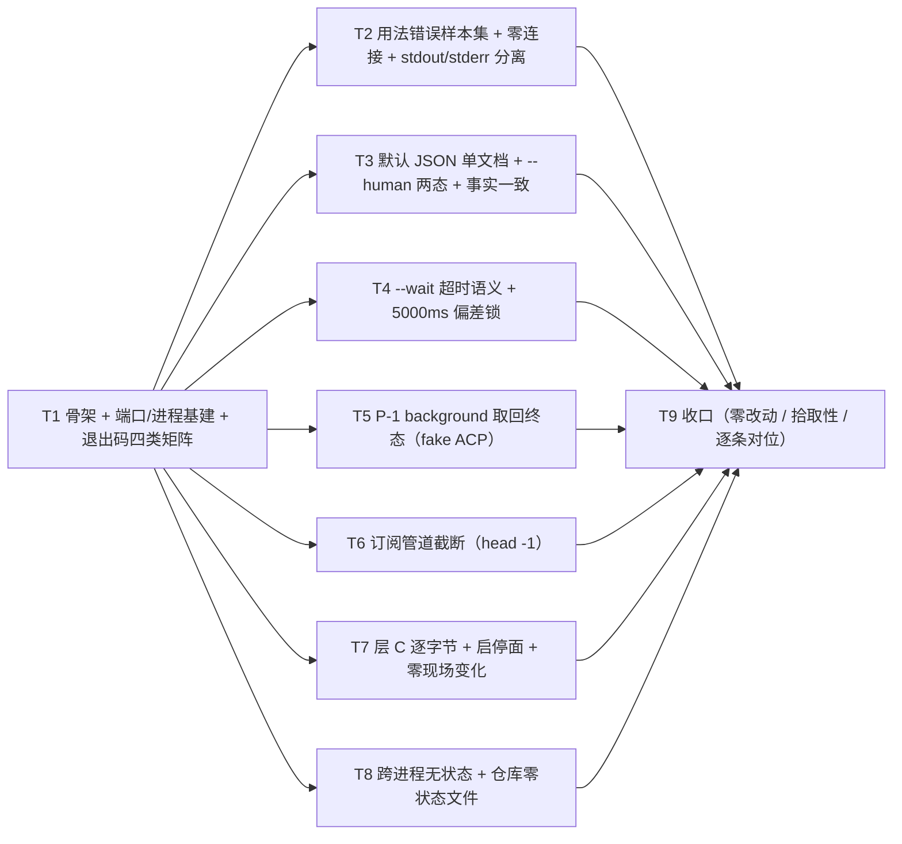

# pr-009-tasks.md — pr-009 内部任务图（统一调用契约用例 · F04/F05/F06/F07/F08/F09/F10/G01/G02）

**迭代**: 0025-hub-sdk-and-skill ｜ **阶段**: 5（PR 实现）｜ **PR 文件**: `prs/pr-009-sdk-cli-contract-test.md`
**worktree 地址**: `<worktree>`（= `/Users/chenchiyuan/projects/agents/.pb-agents/worktrees/0025-hub-sdk-and-skill/.pb-agents/worktrees/0025-pr-009-sdk-cli-contract-test`）｜ **worktree 分支**: `feat/0025-pr-009-sdk-cli-contract-test`（HEAD `3ba06dd` = 迭代分支 `iteration/0025-hub-sdk-and-skill` tip）｜ **任务总数**: **9**（T1~T9）｜ **依赖图**: 无环（单链 + 两条逻辑边，见 §2）

---

## 0. 范围、文件面与事实锚点

### 0.1 本 PR 文件范围（唯一可写面，1 条）

| 文件 | 动作 | 内容 |
|---|---|---|
| `oamp/test/sdk-cli-contract.test.js` | **新建** | 统一调用契约的**进程面**用例：退出码四类（`0/1/2/3`）+ 用法错误样本集（含零连接零副作用）+ 默认 JSON / `--human` 两态 + stdout/stderr 分离 + `--wait` 超时（`WAIT_TIMEOUT`）与其 5000ms 上限偏差锁 + P-1 口径的 background 取回 + 订阅管道截断 + 层 C 逐字节透传 + 跨进程无状态（`architecture.md` §10 T4） |

**非目标（明确不写）**：`oamp/sdk/**`（pr-001~pr-004 已合并产物，**只读消费**）、`oamp/bin/**`、`oamp/package.json`、`oamp/API.md`、`oamp/llms.txt`、`oamp/src/**`、`oamp/web/**`、`oamp/skill/hub.md`、`oamp/test/helpers/**`（既有三个 helper 只 import 不改）、既有 `oamp/test/*.test.js`（含 `sdk-skill.test.js` / `sdk-surface.test.js` / `api-routes.test.js` / `hygiene.test.js`）、pr-007/pr-008/pr-010 的 `test/sdk-*.test.js`、`roles/**`、`tools/**`、`.claude/skills/**`、`docs/**` 内除本文件外的任何产物。

### 0.2 事实锚点（判据基础；行号为 worktree `3ba06dd` 实测）

| # | 事实 | 位置 / 依据 |
|---|---|---|
| **A1** | 目标文件 `oamp/test/sdk-cli-contract.test.js` **当前不存在**；`oamp/test/` 下已有 **33** 个 `*.test.js`（含 pr-005/pr-006 产物）；worktree HEAD = `3ba06dd`、分支 `feat/0025-pr-009-sdk-cli-contract-test`、工作区干净 | 实测 |
| **A2** | 测试拾取面 = `package.json:13` 的 `"test": "node --test test/*.test.js"`；`package.json:15` 的 `dependencies` 为空 ⇒ 新建 `test/sdk-cli-contract.test.js` **自动被拾取**，无需改 `package.json` | `oamp/package.json:12-15` |
| **A3** | `oamp/bin/hub.js` = 5 行：`import { main } from '../sdk/cli.js';` + `process.exitCode = await main(process.argv.slice(2))`；`main(argv)` 返回**数字**（不自行 `process.exit`，唯一例外见 A22） | `oamp/bin/hub.js`；`oamp/sdk/cli.js:311-327` |
| **A4** | 跨 PR 冻结契约（pr-004 产物，**不得改名/不得改返回形状**）：`runHub(args, { env, input, timeoutMs = 10000 }) → { code, stdout, stderr }`；`cwd` = `os.tmpdir()`；`env = { ...process.env, ...opts.env }`；`detached: true` ⇒ 子进程自成进程组，**正常与超时两条路径都** `process.kill(-pid,'SIGKILL')` 收口；超时 ⇒ 返回 `code: null`；超时路径等 `exit`、正常路径等 `close` | `oamp/test/helpers/hub-harness.js` |
| **A5** | `sdk/cli.js` 的 argv 分派与用法错误文案（**逐字**，T2 的期望子串来源）：`缺少层前缀（api / uds / cli / doctor）`（`main` 首 token 缺失）、`未知层: <head>`、`未知子命令: <layer tokens…>`、`该条目不接受选项: --<name>`、`选项缺值: --<name>`、`选项取值非法: --<name> 需为整数（当前值 <v>）`、`选项取值非法: --<name> 不是合法 JSON`、`选项取值非法: --<name> 需为 JSON 对象`、`位置参数多余: <tokens>`、`缺少位置参数: <name>`、`缺少必填选项: --<name>`；`--help` ⇒ 用法到 stdout + 退出 `0` | `oamp/sdk/cli.js:25-100`（`builtinOption` / `parseValue` / `parseTail`）、`:173-193`（`fail` / `usageError`）、`:311-327`（`main`） |
| **A6** | 层 C 入口：`runCli(tokens)` —— `tokens` 为空 ⇒ `hub cli 后缺少既有命令（如 hub cli status）`（**不起子进程**）；否则 `spawn(process.execPath, [<包根>/bin/oamp.js, ...tokens], { stdio: 'inherit' })`，**不解析、不重排、不补默认值**，退出码 `typeof result.exit_code === 'number' ? result.exit_code : 1` 原样透传（不重分类） | `oamp/sdk/cli.js:268-285`；`oamp/sdk/surface.js:290-305`（`runOampCli`） |
| **A7** | 三条上限语义互斥：连接建立 `CONNECT_TIMEOUT_MS = 2000`（`http.js:14`）｜非阻塞条目响应头 `RESPONSE_TIMEOUT_MS = 5000`（`http.js:15`，响应头到达即清除两个定时器）｜`--wait <ms>` 本地上限（`http.js:132-137` 的 `waited` / `waitTimer`：到限 `req.destroy()`，`catch` 覆盖为 `WAIT_TIMEOUT`）；`--wait` 缺省 `1800000`（`cli.js:18`），**只有** `api calls create` 声明 `wait` flag（`surface.js:167-168`），其余条目给 `--wait` ⇒ 用法错误 `2` | `oamp/sdk/http.js`、`oamp/sdk/cli.js`、`oamp/sdk/surface.js` |
| **A8** | 错误对象形态 = stderr **单行** JSON `{code, error, exit_code}`（层 A 另带 `http_status`，键序不限、**无 `stack`**）；四类归类表（首条命中者生效）：`USAGE`→`2`｜`HUB_UNREACHABLE`·`REQUEST_TIMEOUT`·`UPSTREAM_UNAVAILABLE`→`3`｜上游 `code` 原文·`WAIT_TIMEOUT`·`CONFIG_ERROR`→`1`｜其余→`0` | `oamp/sdk/errors.js:6-8`、`:12-45`、`:51-84` |
| **A9** | 层 A 条目形态（T2/T3/T4 的样本真源）：`chats get <chat_id>`（位置参数必填，`surface.js:122`）、`chats list`（`--project-id` **必填**，`:106-120`）、`messages send`（必填**仅** `--text`；`--chat-id` / `--agent-id` 为条件必填 ⇒ 交服务端，`:131-141`）、`docs`（无参无 flag，`:144`）、`agents`（`--state` 可选）、`stream events`（无参无 flag，`kind: 'stream'`，`:143`）、`calls create`（`--chat-id`+`--agent` 必填、`--task`/`--tasks` 条件必填、`--wait` 唯一接受面，`:154-169`）；层 B `router.status` 的 `acceptsAs === false`（给 `--as` ⇒ `2`） | `oamp/sdk/surface.js` |
| **A10** | 既有服务端行为（样本的确定性来源）：`GET /api/agents` → `{agents: [...]}`（零节点 = 空数组）；`GET /api/docs` → `{routes: [...]}`（21 条，请求时投影、不缓存）；`GET /api/chats/<id>` 不存在 → `404 {error, code:'NOT_FOUND'}`；`POST /api/calls` 后台项 → `200 {calls:[{call_id, state:'submitted', …}]}`，派发时 agent 不可用 → `404 NOT_FOUND`（首项失败分支）；`GET /api/events` = 全局 SSE（`agent_online` / `agent_offline` / `confirmation` / `chat_state`），订阅**不**回放历史、订阅时**不**发首帧（事件由 `topologyWatch` 轮询 topology 差异产生，周期受 `OAMP_WEB_TOPOLOGY_POLL_MS` 控制）；`/api/calls` 的 payload executor = `omp-daemon` | `oamp/src/web.js`（`/api/agents`、`/api/docs`、`/api/calls` 的 `composeCallEnvelope` 与派发分支 `:1086-1122`）、`oamp/src/transport.js` |
| **A11** | `oamp status` 的确定性：Router 不可达 ⇒ 仅 stderr 明确报错 + 返回 `1`、stdout 零输出；**零节点** ⇒ 表头无数据行 + 返回 `0`（输出 = 表头单行，逐字节确定） | `oamp/src/status.js:120-132` |
| **A12** | 既有测试基建（只 import 不改）：`harness.js` 导出 `SHORT_ENV`（`OAMP_HEARTBEAT_INTERVAL_MS: 50`…，`:19-23`）、`makeTempSocketDir()`（`:25`）、`buildEnv(socketPath, extra)`（`:29`）、`waitFor(pred, {timeoutMs, intervalMs, what})`（`:34`）、`queryStatus(socketPath)`（`:86`）、`startRouter({envExtra, readyTimeoutMs})`（`:106`）、`startAgent(id, {socketPath, envExtra})`（`:159`）、`stopAll(handles)`（`:193`）、`OAMP_ROOT`/`BIN`（`:15-16`）；`fake-node.js` 导出 `startFakeNode({socketPath, instanceId, heartbeatMs, onDeliver})`（进程内假节点，复用 `src/node-client.js`，零子进程）；`startWeb(socketPath, port, envExtra)` 的既有体例见 `web.test.js:125-149` / `api-routes.test.js:70-92`（`spawn <BIN> web start --port 
` → 等 `WEB_READY` → 提前退出抛错；stop = SIGINT → 限时 → SIGKILL），临时 `OAMP_DB` 见 `api-routes.test.js:104-108` | `oamp/test/helpers/{harness,fake-node}.js`、`oamp/test/{web,api-routes}.test.js` |
| **A13** | 端口段（**主 agent 2026-09-15 IRC 冻结，四个测试 PR 的并行全量约定**）：pr-007 = `51000-51999`、pr-008 = `52000-52999`、**pr-009 = `53000-53999`**、pr-010 = `54000-54999`；既有套件占用段止于 `49999`（`41000-42999` web/project-workspace、`43000-44999` api-pages、`45000-46999` api-routes、`47000-48999` acp-daemon/confirmation-inbox、`48000-49499` inbox-console、`49000-50999` notification-scope、`49500-49999` call-protocol）⇒ 本 PR 段与其余**全部零交集**。段是**上界约束**，端口取值必须是**运行时探测的空闲端口**（不是硬编码列表） | 主 agent IRC（2026-09-15）+ 既有 `pickPort()` 体例（`web.test.js:118`、`api-routes.test.js:60`） |
| **A14** | `OAMP_OMP_BIN` 注入面 = `src/agent.js:34` / `src/launcher.js:147`；fake ACP 体例（同脚本两形态：`acp` 常驻 JSON-RPC / `-p` 一次式）见 `web.test.js:24-100`；`startAgent` 的既有用法 `startAgent('dev-1', { socketPath, envExtra: { OAMP_PROTOCOL: 'acp', OAMP_OMP_BIN: FAKE_BIN } })`（`acp-daemon.test.js:253`）⇒ **不依赖真实 omp / 外网** | `oamp/test/web.test.js`、`oamp/test/acp-daemon.test.js`、`oamp/src/launcher.js` |
| **A15** | 既有漂移锁与卫生面：`api-routes.test.js:277` 的 `llms.txt` 逐字节快照、`:303` 的 `API.md` ↔ 路由登记路径级双向覆盖；`hygiene.test.js:26-39` 的扫描面 = `bin/` + `src/` **平铺** `*.js` + `package.json`（**不含** `test/`），`:50-53` 断言 `.gitignore` 含 `.runtime/` | `oamp/test/api-routes.test.js`、`oamp/test/hygiene.test.js` |
| **A16** | 流程口径（用户 2026-09-15）：中间 PR **不跑仓库级全量套件**；全量集中到全部开发完成后跑一次并驱动收口修复 PR `pr-011`。⇒ 本 PR 的验证方式 = **scoped** `cd oamp && node --test test/sdk-cli-contract.test.js`（`§10 T4` / `T-07` 的载体不变） | 简报「流程口径」段 |
| **A17** | **已知偏差（必须带进任务图，本 PR 只登记不修）**：`--wait ≥ 5000ms`（含缺省 `1800000`）对 `--mode block` 调用**不可达** —— `sdk/http.js` 的响应头 **5000ms** 上限先行终止，按「连接失败 `3` / `REQUEST_TIMEOUT`」收场，而非规格的「等待超时 `1` / `WAIT_TIMEOUT`」。实测：`--wait 8000` + 服务端 6s 响应 ⇒ `5042ms` / `3` / `REQUEST_TIMEOUT`；真实 hub + 真实 block 调用 ⇒ `5048ms` / `3`；对照 background ⇒ `51ms` / `0` + `call_id`，随后 `calls get` 取到 `completed`。**归因**：上限落在 pr-001 冻结模块 `oamp/sdk/http.js` ⇒ pr-009 不得改 `oamp/sdk/**`；**主 agent 裁决：由收口修复 PR `pr-011` 修**，pr-009 只把当前行为写成**已知偏差断言**（当下必须通过），并标注修复后应翻转的期望值 | `clarifications/verify-pr-003-20260915-165755.md`（§4-1 偏差 #1、§5 偏差表 #1、§8 判定）；`clarifications/verify-pr-004-20260915-175157.md`（§7 第 4 项） |
| **A18** | **跨 PR 约束（库面 env，pr-004 独立验收登记）**：`createHub({ socketPath })` **不达** `doctor` 的 R3 段（`doctor.check` 走 `src/config.js` 的 env 链 ⇒ 进程 env 缺 `OAMP_SOCKET` 时抛 `HUB_UNREACHABLE/3`）；库面的层 C（`hub.cli.run`）与 `doctor` 读的是**调用方进程 env**（`createHub` 无 env 选项）⇒ 涉及库面必须在**进程 env** 设 `OAMP_SOCKET` | `clarifications/verify-pr-004-20260915-175157.md` §6 偏差 #1/#2 |
| **A19** | harness 收口纪律（pr-004 独立验收 §6 偏差 #7）：`detached: true` ⇒ 若用例进程被强杀，内核**不**向该独立进程组传播信号 ⇒ 对长驻命令（订阅 / `web start` / `router start`）**务必显式传 `timeoutMs`**；`runHub` 的 `settle()` 在正常路径同样 `killGroup()` | `oamp/test/helpers/hub-harness.js`、`clarifications/verify-pr-004-20260915-175157.md` §6 偏差 #7 |
| **A20** | 层 C 与直跑可比性：`hub cli <…>` 经 `spawn(<包根>/bin/oamp.js, tokens, { stdio: 'inherit' })`，直跑 = 同一 `bin/oamp.js`、同 env、同 cwd ⇒ stdout/stderr/退出码**逐字节可比**；pr-003 独立验收已做 **16 组逐字节一致**（含不可达态 `1` 双侧相同）作为先例 | `oamp/sdk/surface.js:290-305`；`clarifications/verify-pr-003-20260915-165755.md`（§3 §3.3 P-2 行） |
| **A21** | 订阅截断的收尾落点：`runStream` 注册 `process.stdout.on('error')` ⇒ `EPIPE` 时 `process.exit(0)`（注释明示"管道语义下 EPIPE 只在**写入**时到达 ⇒ 本分支在下一次写帧时收尾"）⇒ 判据须保证 `head` 关闭管道后 hub **还有一次写入机会**（即订阅侧至少产生 2 帧）；pr-003 独立验收已用 `PIPESTATUS[0]` 实测 `HUB_EXIT=0` 且无残留 | `oamp/sdk/cli.js:219-236`；`clarifications/verify-pr-003-20260915-165755.md`（第 12 项） |
| **A22** | `main` 只返回数字（A3），唯一直接触发 `process.exit` 的位置 = 层 A/B 的 `api messages` 无（`cli.js` 全文仅 `runStream` 的 EPIPE 分支调用 `process.exit(0)`，`cli.js:226`）⇒ 进程退出码恒来自 `bin/hub.js` 的 `process.exitCode`（层 C 走子进程退出码透传） | `oamp/sdk/cli.js:226`、`:311-327` |

---

## 1. 任务列表

### T1: 文件骨架 + 端口/进程基建原语 + 退出码四类矩阵

- **验收标准**:

  1. **落点与体例**（PR 验收 1、9 / `§10 T4`）：新建 `oamp/test/sdk-cli-contract.test.js`；import 面仅 = `node:test` / `node:assert/strict` / `node:child_process` / `node:net` / `node:http` / `node:fs` / `node:os` / `node:path` / `node:url` + `./helpers/hub-harness.js`（`runHub`，A4）+ `./helpers/harness.js`（`startRouter` / `buildEnv` / `waitFor` / `stopAll` / `SHORT_ENV`，A12）+ `./helpers/fake-node.js`（`startFakeNode`，A12，供 T6 用）；包根 / `bin/oamp.js` 路径按 `import.meta.url` 从用例位置推导（与既有用例同口径，**不依赖 cwd**）；零第三方 import。
  2. **临时状态一律绝对临时路径**（PR 验收 9 / `§10` 测试基建约束）：临时目录一律 `fs.mkdtempSync(path.join(os.tmpdir(), 'oamp-sdk-cli-contract-'))`；`OAMP_DB` 指向该目录下绝对路径；**零仓库内写**（不写 `.runtime/` / `data/`）。
  3. **端口段约束（A13，主 agent 冻结）**：文件内声明 （[model_inferred] 见 §5-1①） `const PORT_SEGMENT = [53000, 53999];` 与既有/其余三 PR 段（`51000-51999` / `52000-52999` / `54000-54999`）的**零交集断言**（段端点比较，机械可判）；实现 `pickFreePort()` = **运行时探测的空闲端口**——在段内取候选 → `net.createServer().listen(port)` 成功即空闲（记录后 `close()` 并用它）、`EADDRINUSE` ⇒ 段内换候选重试（最多 40 次）、全失败 ⇒ `assert.fail` 点名段与尝试次数；每次返回值必须 ∈ `PORT_SEGMENT`（断言）；用例内**所有**起监听 / 传 `--port` 的子进程端口均来自 `pickFreePort()`（文本面：文件内除 `PORT_SEGMENT` 外无端口数字字面量）。
  4. **设备面原语**：本地 `startWeb(socketPath, port, envExtra)`（逐字沿用 A12 的既有体例：spawn `bin/oamp.js web start --port 
`、等 `WEB_READY`、提前退出抛错、stop = SIGINT → 限时 → SIGKILL）+ `setupHub(t)`（`startRouter({envExtra})` → 临时 `OAMP_DB` → `startWeb(router.socketPath, pickFreePort(), { OAMP_DB, OAMP_WEB_TOPOLOGY_POLL_MS })` → 返回 `{ socketPath, port }`；`t.after` 依次 web.stop / `stopAll([router])` / 删临时目录）；端口取自 `pickFreePort()`。
  5. **退出码四类各一例且固定**（PR 验收 1 / F07 验收 1~5、F08 验收 1/2）：表驱动四行，逐行断言 `code` / `code 字段` / stdout 形态 / stderr 形态 / 耗时上界：
     | 类 | 命令（经 `runHub`） | 期望 |
     |---|---|---|
     | `0` 成功 | `api docs --port <web>` | `code === 0`、stdout 可 `JSON.parse` 且顶层键 = `{routes}`（A10）、stderr === `''` |
     | `1` 业务失败 | `api chats get chat-does-not-exist --port <web>` | `code === 1`、stdout === `''`、stderr 单行 JSON `{code:'NOT_FOUND', exit_code:1, http_status:404}` 且 `error` 非空 |
     | `2` 用法错误 | `api nope`（`env.OAMP_WEB_PORT` 指向段内已释放端口） | `code === 2`、stdout === `''`、stderr 单行 JSON `{code:'USAGE', exit_code:2}`（键集合**恰 3 项**、无 `http_status`） |
     | `3` 连接失败（Web 面） | `api agents --port <段内已释放端口>` | `code === 3`、`code === 'HUB_UNREACHABLE'`、键集合无 `http_status`、耗时 ≤ 3000ms（不挂起） |
     | `3` 连接失败（UDS 面） | `uds router.status` + `env.OAMP_SOCKET = <tmp>/nonexistent.sock` | 同上（`ENOENT` ⇒ `HUB_UNREACHABLE/3`），耗时 ≤ 3000ms （[model_inferred] 见 §5-1④） |
  6. **仅凭退出码即可区分四类**（F07 验收 5）：丢弃 stdout/stderr 后按上表断言 `{0,1,2,3}` 四值齐全、每类固定落同一码（同一样本连跑两次同码）、不存在"一码两义"（`1` 只由业务失败样本命中、`2` 只由本地解析失败命中、`3` 只由连接失败命中）。
  7. **不可达态的形状与恢复**（F08 验收 1/3/5）：两个 `3` 类样本的 stderr **恰 1 行**、不含 `\n    at ` / 不含 `Error:` 前缀（**无堆栈**）、`error` 含目标地址；且"恢复后无需额外动作"——在 Router + web 起来后对**同一命令**（`api agents --port <web>`）重跑 ⇒ `code === 0`（F08 验收 5）。
  8. **scoped 跑绿 + 失败可定位**（PR 验收 10 / A16）：`cd oamp && node --test test/sdk-cli-contract.test.js` 中本任务的用例全部通过、无 `skipped` / `todo`；失败消息点名"命令 + 期望 + 实际"（不笼统 `assert.ok(false)`）；**不**触发仓库级全量套件。
  9. 本任务为后续任务提供：`pickFreePort()` / `setupHub(t)` / `startWeb()` / `runHubJson()`（把 stdout 解析为对象并断言 stderr 为空的薄封装）/ 逐字节比对工具（T7 用）——后续任务只**追加**用例，不重写这些原语。

- **前置依赖**: 无
- **优先级**: P0
- **追溯**: PR 文件 验收 1、9、10 + 文件范围；`prd/F07-exit-code-semantics.md:16-24`（验收 1~5）、`:36-46`（架构落定：四类归类表 / 错误对象形态）；`prd/F08-disconnect-degradation.md:16-24`（验收 1~5）、`:36-46`（两条路径 + 2000ms 上限 + 无残留）；`architecture.md:473-489`（§5.4 归类表 + 要点）、`:642-655`（§10 T4 行 + 测试基建约束）、`:566-567`（§7 F07/F08 行）；`prs/pr-004-sdk-dual-entry-and-hub-harness.md`（`runHub` 冻结契约）；锚点 A1 A2 A3 A4 A5 A8 A9 A10 A11 A12 A13 A16 A17 A19 A22

### T2: 用法错误样本集（7 类）+ 零连接零副作用 + 失败面 stdout/stderr 分离

- **验收标准**:

  1. **七类样本各 ≥1 例**（PR 验收 2 / F07 验收 3 / L2-4 / L2-10）：逐例断言 `code === 2`、stdout === `''`、stderr **恰一行** JSON 且键集合恰 `{code, error, exit_code}`（`code === 'USAGE'`、`exit_code === 2`、**无** `http_status`、**无** `stack`）、`error` 含下表**逐字子串**（子串真源 = A5 的实现文案）：
     | # | 类别 | 命令 | 期望子串 |
     |---|---|---|---|
     | 1 | 未知层 | `bogus` | `未知层: bogus` |
     | 2 | 未知子命令 | `api nope` / `uds nope` | `未知子命令: api nope` / `未知子命令: uds nope` |
     | 3 | 缺必填位置参数 | `api chats get` | `缺少位置参数: chat_id` |
     | 4 | 位置参数多余 | `api agents extra` | `位置参数多余: extra` |
     | 5 | 缺必填选项 | `api chats list` | `缺少必填选项: --project-id` |
     | 6 | 选项缺值 | `api messages send --agent-id a --text` | `选项缺值: --text` |
     | 7 | 取值非法 | `api agents --port abc`；`api calls create --chat-id c --agent a --tasks not-json`；`uds router.status --params []` | `选项取值非法: --port` ／ `--tasks 不是合法 JSON` ／ `--params 需为 JSON 对象` |
     | 8 | 给该条目不接受的选项 | `api agents --wait 100`（L2-4）；`uds router.status --as x-1`（L2-10） | `该条目不接受选项: --wait` ／ `该条目不接受选项: --as` |
     | 9 | 层 C 缺命令 | `cli` | `hub cli 后缺少既有命令` |
  2. **零连接零副作用**（PR 验收 2 / `§5.4` `2` 类"未发出任何连接或请求"）；[model_inferred] 见 §5-1③：全部样本在 `--port <counting>`（无 `--port` 的样本改以 `env.OAMP_WEB_PORT = <counting>`）+ `env.OAMP_SOCKET = <tmp>/nonexistent.sock` 下执行；`counting` = 本用例起的 `node:http` 服务器（记录 `connections` 与 `requests`，若被连则计数并回 `200 {}`）⇒ 断言全部样本后 `connections === 0 && requests === 0`（**未连接、未发请求**的可判形态）；另断言 `cli` 样本**不起子进程**的可观测替代：无 stdout、无 stderr 追加、快速返回（< 1000ms）且不触碰计数服务器。
  3. **"2 不是因不可达而成"的对照**（F07 验收 4 的互斥面）：同一 argv 去掉用法错误成分（`api docs --port <已释放端口>`）⇒ `code === 3`（与 `2` 不同），证明 `2` 只由本地解析命中。
  4. **失败不污染 stdout**（PR 验收 4 / F05 验收 4 / `§5.3`）：全部失败样本（本任务 2 类 + T1 的 `1` / `3` 类）stdout === `''`（或至少不含可解析残片）；**成功样本** stderr === `''`（分离写入的双向断言）。
  5. **错误对象可读且不泄露堆栈**（F08 验收 1 的构造面）：全部失败样本 `error` 为非空可读字符串、单行 JSON（`stderr.split('\n').filter(Boolean).length === 1`）、不含 `\n    at `。
  6. **scoped 跑绿 + 失败可定位**：口径同 T1 验收 8；表驱动样本的失败消息须点出"样本编号 + 命令 + 期望 vs 实际"。

- **前置依赖**: **T1**（同文件串行写入 + 复用 `pickFreePort()` / 计数服务器落地所需的体例与断言消息形式）
- **优先级**: P0
- **追溯**: PR 文件 验收 2、4；`prd/F07-exit-code-semantics.md:20`（验收 3）、`:26-28`（架构落定：`2` 类判定规则 + 本地校验范围 P-3）、`:36-46`（四类归类表）；`prd/F05-json-output-and-human-flag.md:22`（验收 4）、`:40-44`（失败 = stderr 单行 JSON、stdout 保持干净）；`architecture.md:355`（§5.1 规则 4）、`:463-471`（§5.3 输出契约表）、`:479-489`（§5.4 `2` 类 + 要点）、`:249-258`（§3.3 P-3）；锚点 A5 A6 A8 A9 A10 A13

### T3: 输出契约两态 —— 默认 JSON 单文档 + `--human` 形态切换 + 事实逐项一致

- **验收标准**:

  1. **默认输出 = 单个可解析 JSON 文档且只走 stdout**（PR 验收 3 / F05 验收 1）：三条只读命令各断言 `code === 0`、stderr === `''`、stdout **恰一个** JSON 文档 + 单个尾换行（`JSON.parse(stdout)` 成功，且 `stdout.trim().split('\n').length === 1`）、顶层键与既有响应形态一致（`api docs` ⇒ `{routes}`；`api agents` ⇒ `{agents}`；`api chats list --project-id <pid>` ⇒ 顶层含 `chats`）：`api docs --port <web>`、`api agents --port <web>`、`api chats list --project-id <uuid> --port <web>`。
  2. **`--human` 切换为人类可读**（PR 验收 3 / F05 验收 2）：同一命令加 / 不加 `--human` 两跑 ⇒ ① 两 stdout **不同**；② `--human` 版 `JSON.parse(该 stdout)` **抛错**（形态非 JSON）；③ `--human` 版行数 ≥ 数据行数 + 1（数组类含表头行，§5.3）；④ 不加开关时仍是 JSON（回到验收 1 的断言）。
  3. **开关不改变事实，逐项一致**（F05 验收 3）：以 `api docs` 为主断言面 —— 取 JSON 的 `routes` 数组，**逐项**断言每条 `method` 与 `path` 出现在 `--human` 的 stdout 文本中（逐项、不抽样），且 `--human` 的**表头行**含 `routes` 的键名（`method` / `path` 等），行数 = `routes.length + 1`；两侧 `routes.length` 相等。
  4. **渲染分支符合 `§5.3`**（[model_inferred] 见 §5-1②；判据来源 `architecture.md:463-471` + pr-003 验证 §4-4 登记的第三分支）：`api docs` 的响应**恰含一个数组键** ⇒ `--human` = 表头 + N 行（该分支下不出现 `键: 值` 段）；`api agents`（`{agents:[...]}`）复核同一分支；`api chats list`（顶层含额外标量键）⇒ `--human` 含 `键: 值` 段落且该标量键名逐字出现（分页/汇总元数据不丢）。
  5. **不给 `--human` 时零诊断混入**（F05 验收 1 的"不混入"面）：stdout 不含用法文案（`hub —` / `用法:`）与任何非 JSON 行；层 A/B 的诊断只经 stderr。
  6. **scoped 跑绿 + 失败可定位**：口径同 T1 验收 8。

- **前置依赖**: **T1**（同文件串行写入 + 复用 `setupHub` / `runHubJson`）；与 T2 无逻辑依赖（判据面不同：T2 = 失败面与用法，T3 = 成功面与渲染）
- **优先级**: P0
- **追溯**: PR 文件 验收 3；`prd/F05-json-output-and-human-flag.md:16`（验收 1）、`:18`（验收 2）、`:20`（验收 3）、`:22`（验收 4）；`architecture.md:452-471`（§5.3 输出契约 + `--human` 渲染表）、`:573-574`（§7 F05 行）、`:309-327`（§5.1 通用选项 `--human`）；锚点 A9 A10

### T4: `--wait` 超时语义（`WAIT_TIMEOUT` / `1`）+ 5000ms 上限**已知偏差锁**

- **验收标准**:

  1. **驱动面（本地，零真实 hub、零真实 omp）**：`startBlackhole(t)` = `node:http` 服务器**永不写响应头**（记录 `connections` / `requestCount`）；`startDelayed(t, delayMs, body)` = `delayMs` 后写 `200` + JSON 体的服务器（记录 `connections` / `requestCount`）；端口一律 `pickFreePort()`（**段内**，A13）；两者均在 `t.after` 收口。
  2. **`WAIT_TIMEOUT` 形态**（PR 验收 5 前半 / F10 验收 3 / `§5.4` `1` 类 ②）：`api calls create --chat-id c --agent a --task t --mode block --wait 1000 --port <blackhole>` ⇒ `code === 1`、stdout === `''`、stderr **单行** JSON `{code:'WAIT_TIMEOUT', exit_code:1}` 且 `error` 同时含上限值与"仍在进行"事实（子串 `1000` 与 `调用仍在进行`）、耗时 ∈ `(1000, 1800)` ms；**且 blackhole 的 `requestCount === 1`**（[model_inferred] 见 §5-1⑤；本地中止、不重发、不轮询、不反查 roster —— G02 验收 3 的可观测面）。
  3. **上限由调用方给出且有序**（F10 验收 1）：同一 blackhole 上 `--wait 600` 与 `--wait 1500` 两跑 ⇒ 两者均 `WAIT_TIMEOUT`/`1`，耗时分别 ∈ `(600, 1400)` 与 `(1500, 2300)`，且 600 的耗时 **<** 1500 的耗时（"较小上限先返回"）。
  4. **上限内拿到终态即返回**（F10 验收 2）：`--wait 8000` + `startDelayed(300, {ok:true})` ⇒ `code === 0`、stdout = 服务端响应体**原样**（`JSON.parse` 后 `deepEqual {ok:true}`）、耗时 ∈ `(300, 1500)`（响应头到达即清除 5000ms 定时器，A7）。
  5. **与其它三类可区分**（PR 验收 5 / F10 验收 5）：并列断言表 —— `WAIT_TIMEOUT`/`1`（本任务）vs 上游业务失败 `NOT_FOUND`/`1`（T1 样本）**同码不同 `code`**；vs `HUB_UNREACHABLE`/`3`（T1）与 `USAGE`/`2`（T2）**退出码与 `code` 皆互异**；四者 `error` 文案互异（`等待超时（…）：调用仍在进行` ≠ `等待响应超时（5000ms；…）`）。
  6. **已知偏差锁（A17；主 agent 已裁决归 `pr-011`，本 PR 只登记不修）**（[model_inferred] 见 §5-1⑥）：`--wait 8000` + blackhole（永不响应）⇒ **当前实现**在 ~5000ms 返回 `REQUEST_TIMEOUT`/`3`（响应头 5000ms 上限先行），而**不是**规格的 `WAIT_TIMEOUT`/1。断言必须**锁当前行为**：`code === 'REQUEST_TIMEOUT'`、`exit_code === 3`、`error` 含 `5000`、stdout === `''`、耗时 ∈ `(4900, 5400)`；用例名与注释必须显式登记：`[已知偏差 · 归 pr-011 收口修复]`，写明"规格期望 = `WAIT_TIMEOUT`/`1`；修复点 = `oamp/sdk/http.js` 的响应头上限与 `--wait` 的先后关系；修复后本断言应改为期望 `WAIT_TIMEOUT`/`1`"。**禁止**：写成当下必然失败的断言、使用 `skip`/`todo`、在本 PR 改 `oamp/sdk/**`。
  7. **缺省上限的界内观察**（F10 验收 1 后半）：不给 `--wait` 时对 `startDelayed(300)` 的调用 ⇒ `code === 0` 且耗时 < 2000ms（不无限等待的界内观察）；**不构造** `1800000` ms 实测 —— 显式登记为"不可实测项"，由 A7 的常量面（缺省 `1800000`）+ 本条界内观察闭合。
  8. **scoped 跑绿 + 失败可定位**：口径同 T1 验收 8；偏差锁用例的失败消息须同时打印"当前观察值"与"pr-011 修复后的期望值"，便于修复后一眼定位。

- **前置依赖**: **T1**（同文件串行写入 + `pickFreePort()`）；判据面与 T2/T3 无逻辑依赖
- **优先级**: P0
- **追溯**: PR 文件 验收 5（前半）；`prd/F10-wait-timeout-limit.md:16-24`（验收 1~5）、`:36-46`（架构落定：`--wait` 接受面 / 缺省值 / `WAIT_TIMEOUT`→`1` / 本地中止 / P-1 口径）；`architecture.md:475-489`（§5.4 归类表 + "超时是单独一类"要点）、`:249-258`（§3.3 P-1）、`:606-611`（§9.1 P-1）、`:578`（§7 F10 行）；`clarifications/verify-pr-003-20260915-165755.md` §4-1（偏差 #1 复现表）；`clarifications/verify-pr-004-20260915-175157.md` §7-4；锚点 A7 A9 A13 A17

### T5: P-1 口径的 background 形态取回终态（跨进程 + 本地 fake ACP 夹具）

- **验收标准**:

  1. **夹具（不依赖真实 omp / 外网）**（A14 / `§10`"不依赖真实 omp"约束）；[model_inferred] 见 §5-1⑦：本文件内定义最小 fake omp 脚本（写临时目录、`chmod 0o755`、内容逐字沿用既有 `web.test.js:24-100` 的 `FAKE_ACP_SOURCE` 体例：`acp` 常驻 JSON-RPC 形态 + `-p` 一次式形态；**不新建 helper 文件**）；agent 经 `startAgent('dev-1', { socketPath, envExtra: { OAMP_PROTOCOL: 'acp', OAMP_OMP_BIN: FAKE_BIN, ...LEASE_ENV } })` 上线（`/api/calls` 的 payload executor = `omp-daemon`，A10）；`OAMP_HEARTBEAT_TIMEOUT_MS` 用既有长租约体例（`3000`，避免 `SHORT_ENV` 的 300ms 租约把常驻发送方判 offline）。
  2. **background 受理即返回调用标识**（F10 验收 4 / `§3.3` P-1）：先备好已存在 chat（`api messages send --agent-id dev-1 --text '<唯一标记>' --port <web>` ⇒ `code === 0` 且 stdout 含 `chat_id`）→ `api calls create --chat-id <c> --agent dev --task 'ok' --mode background --port <web>` ⇒ `code === 0`、stdout `JSON.parse` 后 `calls[0].call_id` 为非空字符串、`calls[0].state === 'submitted'`、耗时 < 3000ms（"立即返回"）。
  3. **新进程取回终态**（P-1 的核心观测 / F10 验收 4）：以该 `call_id` 在**另一个新进程**（重新 `runHub`）中 `api calls get <call_id> --port <web>` ⇒ `code === 0` 且回传 `call_id` 与创建时**逐字相同**（首次即不 `NOT_FOUND`）；随后以 `waitFor` 有界轮询（≤ 10s，每次轮询 = 一次**独立新进程**调用）直到 `state ∈ {completed, failed}`；`completed` 时断言 `text` 非空（fake ACP 的固定答复）、`duration_ms` 为数字或 `null`、`truncated` 为布尔。
  4. **超时只结束本次等待，不丢任务**（PR 验收 5 后半 / F10 验收 4 的 P-1 口径）：以 T4 的超时例作对照叙述性断言面 —— `--wait` 超时**不终止**服务端调用（本地中止），恢复取回靠**重新调用**；并在用例注释里逐字登记 P-1 的边界：`--mode block` 超时后**不保证**标识可见（服务端 block 语义使然），故"可取回"落在 background 形态，**不**做 roster 反查（跨端点语义，撞 W3 / F02 验收 2）。
  5. **不产生 SDK 侧的自动重派**（G02 验收 3 / `§9.2` K3）：断言 `api calls list --port <web>` 中与本次实验相关的行数 = 创建请求携带的 calls 条目数（`1`），不出现 SDK 自动重试 / 自动重派产生的额外调用行；`calls transcript <call_id>` 可取（`code === 0`）作为第二取回面。
  6. **收口**：`t.after` 收口 agent（`stop()`）/ web / router / fake 脚本临时目录；临时 `OAMP_DB` 绝对路径（`os.tmpdir()`）；端口一律 `pickFreePort()`。
  7. **scoped 跑绿 + 失败可定位**：口径同 T1 验收 8。

- **前置依赖**: **T1**（同文件串行写入 + `setupHub` / `pickFreePort` / 断言体例）；与 T4 无逻辑依赖（不同驱动面：T4 = 本地黑障/延迟服务，T5 = 真 hub + fake agent）
- **优先级**: P0
- **追溯**: PR 文件 验收 5（后半）+ 验收 8；`prd/F10-wait-timeout-limit.md:20`（验收 4）、`:40-44`（架构落定：P-1 口径 = background 形态、block 不保证标识、不反查 roster）；`prd/F09-stateless-cli.md:18`（验收 2 的"独立新进程取回"）；`architecture.md:249-258`（§3.3 P-1）、`:606-611`（§9.1 P-1）、`:578`（§7 F10 行）、`:642-655`（§10：不依赖真实 omp）；锚点 A9 A10 A12 A13 A14 A16 A19

### T6: 订阅管道截断 —— `| head -1` 自行退出、退出码 0、无残留进程、NDJSON 单行

- **验收标准**:

  1. **设备面与事件驱动**：`setupHub(t)`（Router + web，`OAMP_WEB_TOPOLOGY_POLL_MS` 取短周期）→ 用 `startFakeNode({ socketPath, instanceId })`（进程内假节点，A12）产生**至少 2 次**拓扑事件（`register` ⇒ `agent_online`，`stop()` ⇒ `agent_offline`）—— 依据 A21：`head -1` 关闭管道后 hub 需**再有一次写入机会**才会走 `EPIPE` 收尾，故 `≥ 2` 帧是判据的前提条件（不得靠超时强杀代替）。
  2. **管道形态与自退出**（PR 验收 6 / F06 验收 3）：以 `bash -c 'set -o pipefail; exec <node> <绝对>/bin/hub.js api stream events --port 
 | head -1'` 起（本用例自建 spawn，`detached: true` ⇒ 自成进程组，`timeoutMs` 显式给足 ≤ 15s）；断言：管道**自行**退出（有界等待，**不**得靠超时强杀——超时即判失败）；退出码 **`=== 0`**（`pipefail` 下该码即 hub 的退出码 ⇒ 证 `EPIPE` 路径 `process.exit(0)`，A21/A22，而非被 SIGPIPE 杀死）。
  3. **NDJSON 单行形态**（F06 验收 2 的单帧面 / `§5.3`）：管道捕获的 stdout **恰 1 行**、以 `\n` 结尾、`JSON.parse` 成功、顶层键集合 = `{event, data}` 且 `event` 为字符串、`data` 为对象。
  4. **无残留进程**（PR 验收 6 / F06 验收 3）：管道退出后断言其**进程组已不存在**（`process.kill(-pgid, 0)` 抛 `ESRCH`）；并断言该 hub 端点端口在退出后 ≤ 1s 内不可连（端口已释放）；断言失败消息须打印"残留的 pgid / 仍可连的端口"以便定位。
  5. **收口纪律**（A19）：凡经 `runHub` 的**长驻**命令（订阅）必须显式传 `timeoutMs`；本任务的判据**不**以 `runHub` 返回值代替（判据 = 管道退出码 + 进程组 + 端口释放）；`t.after` 收口 web / router / fake node / 临时目录。
  6. **scoped 跑绿 + 失败可定位**：口径同 T1 验收 8。

- **前置依赖**: **T1**（同文件串行写入 + import 面 `startFakeNode` + `setupHub` / `pickFreePort`）
- **优先级**: P0
- **追溯**: PR 文件 验收 6；`prd/F06-subscription-ndjson-stream.md:20`（验收 3）、`:36-44`（架构落定：NDJSON 行形态 / stdout `EPIPE` ⇒ 结束进程、退出码 `0` / 不做 SIGPIPE 特判、不做自动重连）；`architecture.md:465-471`（§5.3 订阅行 + 失败行）、`:482`（§5.4 `0` 类"订阅被下游管道截断"）、`:570`（§7 F06 行）、`:642-655`（§10 T4 行：`hub api stream events --port 
 \| head -1` 后无残留进程）；`clarifications/verify-pr-003-20260915-165755.md` 第 12 项（`PIPESTATUS[0]` 先例）；锚点 A10 A12 A13 A19 A21

### T7: 层 C 零语义变更（逐字节）+ 启停类用法面对照 + 零现场变化 + 无自动拉起

- **验收标准**:

  1. **对照裁决面**（A20 / P-2）：两侧 = ① `hub cli <…>`（经 `runHub`，`env` 显式给 `OAMP_SOCKET`，`cwd` = `os.tmpdir()`，与 A4 同口径）与 ② 直跑 `node <绝对>/bin/oamp.js <…>`（本用例自建 spawn，**同 cwd、同 env 键值、同 stdio 形态**，`cwd` = `os.tmpdir()`）；逐组比对 **stdout / stderr / 退出码逐字节**（`Buffer.compare(Buffer.from(a), Buffer.from(b)) === 0` 且 `code` 相等）。
  2. **只读类对照**（PR 验收 7 / F04 验收 2/3）：`status` 一组 —— live Router **零节点**，两侧 stdout = 表头单行（断言非空，防"空 vs 空"的虚假相等）、stderr === `''`、`code === 0`；`task list` 一组（加固项）—— 零任务拓扑，同样逐字节一致。
  3. **不可达态对照**（P-2 的边界，先例 A20）：`env.OAMP_SOCKET = <tmp>/nonexistent.sock` 下 `status` 两侧 ⇒ `code` 均 `1`、stdout 均 `''`、stderr **逐字节相同** ⇒ 证既有 `1` **不**被重分类为 `3`（`§5.4` 要点）。
  4. **启停类命令的用法面对照**（PR 验收 7 括号内明示可接受的面 / G02 验收 2）；[model_inferred] 见 §5-1⑧：`agent start`（缺 `instance-id`）两侧 ⇒ `code` 均 `2`、stdout 均 `''`、stderr **逐字节相同**。
  5. **零现场变化**（F04 验收 3 / G02 验收 2）：每组对照**前后**以 `queryStatus(socketPath)`（A12）取 Router 拓扑快照 ⇒ 逐字段 `deepEqual`（零变化）；只读组另断言任务面零变化（`uds router.task_list` 或 `api calls list --port <web>` 前后相等）。
  6. **无自动拉起 / 无自愈**（G02 验收 3）：① 上条的启停类样本后，500ms 观察窗内拓扑零新增注册（无守护 / 无自动拉起）；② 独立驱动 —— agent 不在线时 `api calls create --chat-id <已有的> --agent dev --task t --port <web>` ⇒ `code === 1` + `code === 'NOT_FOUND'`（**明确失败**，不重试、不拉起），同窗内拓扑零新增（`queryStatus` 前后相等）。
  7. **scoped 跑绿 + 失败可定位**：口径同 T1 验收 8；逐字节失败消息须以**首个差异字节偏移 + 两侧该处上下文**呈现（沿用 `api-routes.test.js:270-276` 的 `describeSnapshotDiff` 手法）。

- **前置依赖**: **T1**（同文件串行写入 + `setupHub` / `pickFreePort` / 逐字节工具 / 断言体例）
- **优先级**: P0
- **追溯**: PR 文件 验收 7；`prd/F04-oamp-cli-command-coverage.md:18`（验收 2）、`:20`（验收 3）、`:22`（验收 4）、`:36-44`（架构落定：层 C = 子进程透传 / 退出码透传不重分类 / P-2）；`prd/G02-lifecycle-boundary-preserved.md:18`（验收 2）、`:20`（验收 3）；`architecture.md:381-397`（§5.1 层 C 表 + 规则）、`:475-489`（§5.4 层 C 退出码透传 + 不可达不重分类）、`:565`（§7 F04 行）、`:579`（§7 G02 行）、`:249-258`（§3.3 P-2）、`:607`（§9.1 P-2）；`clarifications/verify-pr-003-20260915-165755.md`（§3.3 P-2 行：16 组逐字节）；锚点 A6 A9 A10 A11 A12 A20

### T8: 跨进程无状态 —— 并发两进程 + 新进程续查 + 仓库零新增状态文件

- **验收标准**:

  1. **并发执行互不影响**（PR 验收 8 / F09 验收 3 / MI-03(b)）：`Promise.all([runHub(args), runHub(args)])` 两跑 `api docs --port <web>` ⇒ 两者 `code === 0`、各自 stdout 可 `JSON.parse`、两 stdout **逐字节相等**；另一组 `api chats list --project-id <pid> --port <web>` 并发两跑同样相等（无半截、无互相污染、无内容串台）。
  2. **续查靠新进程而非本地记忆**（F09 验收 2 / MI-03(a)）：进程 A `api messages send --agent-id dev-1 --text '<唯一标记>' --port <web>` ⇒ `code === 0`、stdout 含 `chat_id`；进程 B（**新 `runHub`**）`api chats get <chat_id> --port <web>` ⇒ `code === 0` 且 `chat_id` 与 A 的**逐字相同**（B 未参与 A 的调用、零共享本地状态）；两侧间隔可拉长/缩短不影响结果（至少一组两次不同间隔的重复观察）。
  3. **仓库零新增状态文件**（PR 验收 8 / F09 验收 1 / `§10` 测试基建约束 / [model_inferred] 见 §5-1⑨）：以 `oamp/` 的**递归文件路径集合**（排除 `node_modules`，用 `fs.readdirSync(dir, { recursive: true })` 或等价递归）为快照，在本任务全部调用**前后**比较 ⇒ 集合**完全相等**（零新增、零删除）；另断言 `oamp/.runtime` 与 `oamp/data` 的**存在性**前后一致（A15：当前仓库不存在这两个目录，且 `.gitignore` 已含 `.runtime/`）。
  4. **临时状态结构性保证**：本用例全部 spawn 的 env 中 `OAMP_DB` 指向 `os.tmpdir()` 下的**绝对路径**、`OAMP_SOCKET` 指向临时目录（断言 `!path.isAbsolute(路径) === false` 且不含包根前缀）⇒ 与验收 3 的"零仓库写"互为结构面与观测面。
  5. **可选加固（不补发，F09 验收 4；[model_inferred]，见 §5-1⑩）**：以唯一事件标记 + 固定观察窗构造负向断言（订阅 1 窗口内的唯一事件在订阅 2 窗口内**不出现**）。**若无法稳定判定，本条不写进用例** —— 改为在 §5 登记"由服务端既有语义（`API.md` §1.2 不补发 / N9）+ 零本地写闭合"，**禁止**写成 flaky 断言或 `skip`。
  6. **scoped 跑绿 + 失败可定位**：口径同 T1 验收 8；并发组的失败消息须分别打印两跑的 `code` 与 stdout 前 200 字节。

- **前置依赖**: **T1**（同文件串行写入 + `setupHub` / `pickFreePort` / 断言体例）；与 T5 无逻辑依赖（T5 聚焦调用标识的跨进程取回终态，T8 聚焦并发性与仓库零状态面）
- **优先级**: P0
- **追溯**: PR 文件 验收 8；`prd/F09-stateless-cli.md:16`（验收 1）、`:18`（验收 2）、`:20`（验收 3）、`:22`（验收 4）、`:36-44`（架构落定：零本地写 / 零全局可变状态 / MI-03 观测口径）；`architecture.md:447-451`（§5.2 规则 4）、`:596-600`（§8 C8）、`:642-655`（§10 测试基建约束）、`:579`（§7 F09 行）；`clarifications/verify-pr-004-20260915-175157.md` §6 偏差 #2（库面/层 C 读进程 env）；锚点 A10 A12 A15 A18

### T9: 收口 —— 零上游改动 / 拾取性 / 既有锁静态面 / PR 验收逐条对位 / 失败可定位

- **验收标准**:

  1. **改动面恰一条新增**（PR 文件「文件范围」+ 简报硬约束）：`git -C <worktree> status --porcelain` 与 `git -C <worktree> diff --name-status 3ba06dd` 交叉核对 ⇒ 代码面**仅** `A oamp/test/sdk-cli-contract.test.js`；对 `oamp/sdk/**`、`oamp/bin/**`、`oamp/package.json`、`oamp/API.md`、`oamp/llms.txt`、`oamp/src/**`、`oamp/web/**`、`oamp/test/helpers/**`、既有 `oamp/test/*.test.js`（含 `sdk-skill.test.js` / `sdk-surface.test.js` / `api-routes.test.js` / `hygiene.test.js`）**零 diff**（后者即"未改既有断言"/G01 验收 3 的静态面）。（`docs/**` 是工作流产物面，不参与该条判定。）
  2. **既有锁与卫生面的静态判据**（PR 验收 9 的零回归条 / G01 验收 3/4）：两把漂移锁的**输入**（`API.md`、`llms.txt`、`src/web.js` 的路由登记）零 diff ⇒ 锁不受影响；**可选 scoped 复核**（既有文件、只读、非仓库级全量）：`node --test test/hygiene.test.js` 与 `node --test test/api-routes.test.js` 全绿（若执行须记录输出摘要）。
  3. **拾取性**（PR 验收 10 / `§10 T-07` / A2）：文件名匹配 `test/*.test.js`（`package.json:13`）⇒ **不改** `package.json`；以 **scoped** `cd oamp && node --test test/sdk-cli-contract.test.js` 全绿为证；按用户口径（A16）**不**在本 PR 触发仓库级全量套件（全量留收口修复 PR）。
  4. **零 `skip` / 零 `todo`**：全部用例（含 T4 的**偏差锁**用例）状态为**正常通过**；偏差锁不是 `skip` / `todo` / 条件跳过。
  5. **零 flaky 与零污染**（C11）：全部等待均为 `waitFor` 有界轮询（关键路径**不**裸 `sleep`）；无跨用例共享的端口 / 临时目录 / 环境变量（`env` 一律经 `runHub` 的 `opts.env` 或子进程 `env` 传入，**不** `Object.assign(process.env, …)`）；用例不写 stdout/stderr 之外的文件（`t.diagnostic` 允许）。
  6. **§3 逐条对位表逐项有可复现证据**（命令 + 输出摘要），不得以"看起来没问题"结案；无法在本 PR 面闭合的条目（如三宿主等价面的 Node import 一侧、`doctor` 面、全量套件）须**显式标注归属 PR**（见 §5）。
  7. **PR 文件 10 条验收逐条 pass 或显式标注归属**（见 §3），其中第 5 条的偏差锁以"当前行为已锁 + 未来翻转点已登记"结案（A17）。

- **前置依赖**: **T1~T8**（收口判定以八者的用例齐备且 scoped 全绿为前提；同文件串行写入）
- **优先级**: P0
- **追溯**: PR 文件 验收 9、10 + 「文件范围」+ 「非目标」；`prd/G01-hub-interface-unchanged.md:20`（验收 3）、`:22`（验收 4）；`architecture.md:642-655`（§10 测试组织 + 测试基建约束）、`:286-296`（§4.3 Z-7：既有测试面不改）、`:584-600`（§8 C7 既有测试影响）；`oamp/test/api-routes.test.js:277` / `:303`（两把锁）、`oamp/test/hygiene.test.js:26-39` / `:50-53`（扫描面与 `.runtime/` 规则）；锚点 A1 A2 A15 A16 A17

---

## 2. 依赖图（无环）

拓扑序（合法执行序）：`T1 → (T2‖T3‖T4‖T5‖T6‖T7‖T8 的**写入**必须串行，见下) → T9`

- **最长依赖链**：`T1 → T2 → T9`（2 跳）；逻辑上 `T1 → T9` 亦成立，T2~T8 之间的边**不存在**（判据面各自独立）。
- **关键路径任务**：**T1**（提供全部基建原语与 import 面）与 **T9**（收口）。
- **无环**：边方向严格单调（T1 → 七条支路 → T9），无回边、无自环。真实逻辑依赖只有两类：① T2~T8 复用 T1 落定的 import 面、`pickFreePort()`、`setupHub(t)`、`startWeb()`、逐字节工具与断言消息体例；② T9 的收口判定以 T1~T8 用例齐备且 scoped 全绿为前提。
- **与 PR 间依赖图的关系**：本 PR `depends_on = pr-004`（**已合并**，A4 的 `runHub` 与 `bin/hub.js` 均已在 `3ba06dd`）；本任务图是 **PR 内部**的写入顺序与产物依赖，不新增跨 PR 依赖，也不要求等待 pr-007 / pr-008 / pr-010。**跨 PR 唯一硬约束 = 端口段（A13）**：本 PR 只用 `53000-53999`，与其它三 PR 段零交集（T1 验收 3 的机械断言）。

**同文件串行约束（必须）**

| 文件 | 写入任务 | 串行要求 |
|---|---|---|
| `oamp/test/sdk-cli-contract.test.js` | **T1（骨架 + 基建 + 退出码）→ T2 → T3 → T4 → T5 → T6 → T7 → T8 → T9** | **唯一一个新文件**，被九个任务依次追加 ⇒ 必须单链串行、**不得并行写入**；建议按 T1→T9 顺序落盘，每个任务结束跑一次 scoped 用例 |
| `oamp/sdk/**`、`oamp/bin/**`、`oamp/package.json`、`oamp/API.md`、`oamp/llms.txt`、`oamp/src/**`、`oamp/web/**` | **无**（零改动） | 只读：`runHub` 起子进程 + 直跑 `bin/oamp.js` 对照 + `fs.readFileSync`（若需） |
| `oamp/test/helpers/{hub-harness,harness,fake-node}.js` | **无**（零改动） | 只 import（A4 / A12）；**不得**为方便而改 helper |
| pr-007 / pr-008 / pr-010 的 `test/sdk-*.test.js` | **无**（零改动） | 本 PR **不断言**这些文件的存在性或其行为（否则会在并行 PR 落盘前制造假失败） |

---

## 3. 与 pr-009 验收标准逐条对位表

| PR 验收 #（PR 文件 `:20-27`） | 验收摘要 | 承接任务 | 对位说明 / 判据面 |
|---|---|---|---|
| 1 | 退出码四类各一例且固定；仅凭退出码可区分四类 | **T1**（验收 5、6、7） | 表驱动五行（`0` / `1` / `2` / `3`×2）+ 丢弃 stdout 后的码集合断言；不可达态两路径（Web `ECONNREFUSED` / UDS `ENOENT`） |
| 2 | 用法错误样本覆盖 7 类且均落 `2`（零连接） | **T2**（验收 1、2、3） | 九行样本表（含 `--wait` 给非阻塞条目、`--as` 给非身份方法）+ 计数服务器 `connections/requests === 0`；对照 `--port <已释放>` ⇒ `3` |
| 3 | `--human` 两态：形态不同 + 事实逐项一致 + 不加开关仍是 JSON | **T3**（验收 1、2、3、4） | 同命令两跑 + `JSON.parse` 两态 + `routes` 逐项出现在 human 文本 + 行数关系 |
| 4 | stdout/stderr 分离；失败为 stderr 单行 JSON（层 A 带 `http_status`） | **T2**（验收 1、4、5）+ **T1**（验收 5 的表内形态列） | 失败样本 stdout === `''` + 单行 JSON 键集合恰 `{code,error,exit_code}`（层 A 另含 `http_status`）+ 成功样本 stderr === `''` + 无 `stack` |
| 5 | `--wait` 超时 → `WAIT_TIMEOUT`/`1`，与业务失败同码不同 `code`、与 `3`/`2` 可区分；随后新进程取回终态（background 形态，P-1） | **T4**（验收 2、3、4、5、6、7）+ **T5**（验收 2、3、4、5） | T4 = 超时形状 / 有序 / 上限内成功 / 同码不同 `code` / 偏差锁（A17）；T5 = background 受理即返回标识 + 新进程取回终态 + 不自动重派 |
| 6 | 管道截断：`hub api stream events --port 
 \| head -1` ⇒ 自行退出、码 `0`、无残留进程 | **T6**（验收 2、3、4） | `bash -c 'set -o pipefail; … \| head -1'` ⇒ 退出码 `0`（= hub 的码）+ 单行 NDJSON + 进程组 `ESRCH` + 端口释放 |
| 7 | 层 C 零语义变更：`hub cli status` ↔ 直跑 `oamp status` 逐字节一致；启停类命令对照现场一致 | **T7**（验收 1、2、3、4、5、6） | 四组逐字节（`status` 零节点 / `task list` / `status` 不可达态 / `agent start` 用法面）+ `queryStatus` 前后相等 + 无自动拉起 |
| 8 | 跨进程无状态：并发两进程各自完整正确；执行前后不新增状态文件 | **T8**（验收 1、2、3、4） | 并发两跑逐字节相等 + 新进程续查 `chat_id` 一致 + `oamp/` 递归路径集合前后相等 + 临时绝对路径结构性断言 |
| 9 | 经 `runHub()` 起子进程；不写仓库内 `.runtime/` / `data/`（临时目录） | **T1**（验收 1、2）+ **T8**（验收 3、4）+ **T4/T5/T6/T7** 的收口条 | `runHub` 为唯一进程入口（T6 的 shell 管道为**例外**，理由见 §5-2）；零仓库写由 `mkdtemp` + 绝对临时路径 + 状态文件集合快照闭合 |
| 10 | 经 `node --test test/*.test.js` 被拾取并通过 | **T9**（验收 3、4、7）+ **T1~T8** 各自的 scoped 跑绿 | 文件名匹配 glob（不改 `package.json`）+ scoped 全绿（A16：不跑仓库级全量） |

**覆盖检查**：PR 10 条验收 → 全部有任务承接（无遗漏）；**未新增** PR 文件范围之外的功能面（唯一文件 = `oamp/test/sdk-cli-contract.test.js`）；T1~T9 逐条可追溯到 PR 文件 / `prd/F04~F10·G01·G02` / `architecture.md` §3.3·§5.1·§5.3·§5.4·§7·§8·§10 / 事实锚点（见 §6）。

---

## 4. 关键实现约束（C 系列，全部为硬约束）

1. **C1 落点唯一**：本 PR 只新建 `oamp/test/sdk-cli-contract.test.js`；**不得**新建 helper（`hub-harness.js` 已由 pr-004 提供、fake ACP 夹具落在本文件内）、不得改 `package.json`、不得改既有任何文件。
2. **C2 零新框架 / 零新依赖**：`node:test` + `node:assert/strict` + `node:` 内置（`child_process` / `net` / `http` / `fs` / `os` / `path` / `url`）+ 既有三个 helper；不引第三方断言 / HTTP / 管道库；不改 `scripts.test`。
3. **C3 端口段（A13）**：`PORT_SEGMENT = [53000, 53999]` 是**上界约束**；端口一律来自 `pickFreePort()`（**运行时探测空闲**：`net.createServer().listen(candidate)` 成功即用）；文件内除段常量外**零端口数字字面量**；断言与 `51000-51999` / `52000-52999` / `54000-54999` 零交集。
4. **C4 进程与临时态收口**：`runHub` 调用凡**长驻**命令（订阅 / 层 C 的 `router start` / `web start`）**必须显式 `timeoutMs`**（A19）；自建 spawn 一律 `detached: true` 并在结束后 SIGKILL 整组（吞 `ESRCH`）；`t.after` 收口（web.stop → `stopAll` → agent.stop → 删临时目录）；临时态用 `mkdtemp(os.tmpdir())` 的**绝对路径**；**零仓库写**（C9 由 T8 的集合快照证明）。
5. **C5 断言锚在稳定符号上，不锚行号**：期望值取自**既有实现的逐字文案与 `code` 名**（A5/A6/A8 的 `USAGE` / `HUB_UNREACHABLE` / `REQUEST_TIMEOUT` / `WAIT_TIMEOUT` / `NOT_FOUND`）、`API.md` 的响应形态（A10）、以及命令的**名面**；**不得**把 `sdk/*.js:NNN` 一类行号写进断言（§0.2 的行号只用于定位事实）。
6. **C6 逐字节对比口径**（T7）：两侧使用**同一 bin、同一 env 键值、同一 cwd**；比较 `Buffer.compare` 与退出码；失败消息以**首个差异字节偏移 + 上下文**呈现（沿用 `api-routes.test.js` 的 `describeSnapshotDiff` 手法）；只读组须先断言 stdout 非空（防空 vs 空的虚假相等）。
7. **C7 失败可定位**：缺项 / 多出项 / 解析异常 / 逐字节差异分别点名"命令 + 期望 + 实际"；容器（服务器 / 子进程）启动失败须打印其 stderr 摘要；不得静默跳过。
8. **C8 零上游改动**：`oamp/sdk/**`、`oamp/bin/**`、`oamp/package.json`、`oamp/API.md`、`oamp/llms.txt`、`oamp/src/**`、`oamp/web/**`、`oamp/test/helpers/**`、既有 `oamp/test/*.test.js`、`docs/**`（除本 PR 自身产物）一律零 diff。
9. **C9 已知偏差锁的写法**（A17）：偏差用例**正常通过**、用例名与注释显式带 `[已知偏差 · 归 pr-011 收口修复]`、注释写明"规格期望 = `WAIT_TIMEOUT`/1；修复点 = `oamp/sdk/http.js`；修复后本断言应改为期望 `WAIT_TIMEOUT`/1"；**禁止** `skip` / `todo` / 条件跳过 / 当下必然失败的断言 / 为本条改 `oamp/sdk/**`。
10. **C10 不重复其它 PR 的用例面**：不 import `sdk/index.js`（库面归 pr-007/pr-008；若追加库面对照，**必须**按 A18 设**进程 env**）；不断言 `hub doctor` 的行为（归 pr-010）；不断言 pr-007/pr-008/pr-010 文件的存在性或内容。
11. **C11 零 flaky**：关键路径一律 `waitFor` 有界轮询（不裸 `sleep`）；负向断言（"不出现"类）只允许在"唯一标记 + 固定观察窗"构造下使用（T8 的可选加固）；端口 / 临时目录 / env 一律**按用例独立**（不 `Object.assign(process.env, …)`）；并发用例只在**独立进程**层面并发（不共享句柄）。
12. **C12 收口纪律**：scoped 跑 `cd oamp && node --test test/sdk-cli-contract.test.js`；**不跑**仓库级全量（A16）；T9 的可选 scoped 复核（`hygiene.test.js` / `api-routes.test.js`）若执行须记录输出摘要。

---

## 5. 边界与疑问（提请主 agent；均不阻塞执行）

### 5.1 `[model_inferred]` 清单（共 10 条；均为"判据形态"选择，不引入 `demand.md` / `prd` / `architecture.md` 之外的新决策）

1. **端口段的落地形态**（T1 验收 3）：主 agent IRC 冻结了段（A13），但未给判据形态；本图取"段常量 + `net` 探测空闲 + 段内断言 + 与其余三段零交集 + 零端口字面量"。
2. **`--human` 的渲染分支断言**（T3 验收 4）：`§5.3` 字面只给"数组 ⇒ 表格 / 对象 ⇒ `键: 值`"两分支，实现存在**第三分支**（对象恰含一个数组键 ⇒ 该数组走表格 + 其余键逐行，见 `verify-pr-003` §4-4 登记）⇒ 本图按实现分支断言，并显式区分 `api docs`（无额外键）与 `api chats list`（含额外标量键）两态。
3. **"零连接零副作用"的判据形态**（T2 验收 2）：`§5.4` 只写"未发出任何连接或请求"，未给观测手段；本图取"计数服务器（`connections`/`requests`）恒 0"。
4. **UDS 不可达样本的构造**（T1 验收 5 第五行）：PR 验收只写"连接失败 `3`"；`§5.4` 序 2 含 `ENOENT` ⇒ 本图以 `OAMP_SOCKET` 指向不存在的 socket 路径构造（`uds router.status`）。
5. **"不重试"的观测面**（T4 验收 2）：F10 未逐字要求，但 G02 验收 3 / N3 封死自动性 ⇒ 本图以"服务端 `requestCount === 1`"判"本地中止 + 不重发 + 不反查"。
6. **偏差锁的可执行形态**（T4 验收 6）：主 agent 已裁决"只登记不修、断言当前实际行为"（A17）；本图落成"正常通过 + 用例名标注 + 注释写明翻转点"，并禁止 skip/todo。
7. **P-1 取回终态的夹具**（T5 验收 1）：`§10` 要求"不依赖真实 omp / 外网"；本图取既有 fake ACP 体例（`OAMP_PROTOCOL=acp` + `OAMP_OMP_BIN`，A14）+ `startAgent('dev-1')`；`/api/calls` 的 executor = `omp-daemon` ⇒ 夹具必须支持 daemon 形态。
8. **"启停类命令对照"的取样**（T7 验收 4）：PR 文件括号内明示"`cluster status` 或 `agent start` 的用法面"；本图取后者的**用法面**（可零现场副作用地做逐字节对照：`code 2` + stderr 逐字节）——取 `cluster status` 会引入 tmux / 配置面，不在本 PR 范围。
9. **"仓库零新增状态文件"的判据形态**（T8 验收 3）：PR 只写"执行前后仓库内不新增状态文件"；本图取"`oamp/` 递归路径集合前后相等 + `.runtime`/`data` 存在性不变"。（未采用全仓库根快照：`docs/**` 与 `.pb-agents/**` 由工作流自身写入，会成为噪声源。）
10. **"不补发"是否写进用例**（T8 验收 5）：F09 验收 4 未给观测形态（MI-03 只覆盖验收 2/3）；本图把它列为**可选加固**并要求"稳定才写、否则登记不写"，禁止 flaky 断言。

### 5.2 边界与疑问

1. **三宿主等价（F05 验收 1 / F07 验收 1 的判定明文含"三宿主"）**：本 PR 的「文件范围」只列**进程/CLI 契约面**，故本图覆盖 ①shell 与 ③"另一 agent 经 shell 调用"（两者同形：同一 `bin/hub.js` 入口），**不**覆盖 ②Node `import` 一侧（库面归 pr-007 / pr-008；其一致性由 `§5.2` 规则 5 的结构性保证 —— 同一 `ENTRIES` 表 + 同一 `errors.js` 归类表）。**若主 agent 要求 pr-009 也覆盖 import 面，请裁决**（改动点 = 在 T1 增一组 `createHub()` 对照，且必须按 A18 设**进程 env**）。
2. **T6 不使用 `runHub`（PR 验收 9 的唯一例外）**：`hub api stream events | head -1` 是**管道**形态，`runHub` 的 `spawn` 无 shell ⇒ 本图以本用例自建 `bash -c` + `detached` 进程组实现（仍是 `bin/hub.js` 子进程，仍零仓库写）；该例外已在 T6 验收 2 与 C4 中显式登记。
3. **库面 env 约束（A18）**：本图不使用 `createHub()`（C10）⇒ 无需 `Object.assign(process.env, …)`；**若** dev 追加库面对照，必须设**进程 env**（否则库面的层 C / `doctor` 读不到 socket —— `createHub` 没有 env 选项）。
4. **`doctor` 的用例面归 pr-010**：本图不写 `hub doctor` 的任何用例（含其用法错误样本），仅在 T9 的零改动面覆盖它。A18 的前半（pr-004 独立验收 §6 偏差 #1）在此登记为**不触发**：`createHub({ socketPath })` 的显式 `socketPath` **不达** `doctor.check` 的 R3 段（R3 的 `connect({})` 走 `src/config.js` 的 env 链，进程 env 缺 `OAMP_SOCKET` 时抛 `HUB_UNREACHABLE/3`）⇒ **任何**以库面验证 `doctor` 的用例都必须改设**进程 env**；pr-009 不写 doctor 用例 ⇒ 该约束在本 PR 面不触发，但其零改动面（`oamp/sdk/doctor.js`）已由 T9 判定覆盖。
5. **偏差锁与 `pr-011` 的衔接**：`pr-011` 修复 `oamp/sdk/http.js` 的响应头上限与 `--wait` 先后关系后，T4 验收 6 的期望值须**翻转**为 `WAIT_TIMEOUT`/1 —— 该翻转点已在用例注释中登记，属**已知的未来变更**（不在本 PR 处理）。
6. **全量套件不在本 PR 跑**（A16）：PR 验收 10 的"被拾取并通过"以"文件名落在 `test/*.test.js`（A2）+ scoped 全绿"闭合；全量跑留待全部开发完成后的收口修复 PR。
7. **粒度决策（为何 9 个任务、为何单链）**：本 PR 只有**一个**新文件 ⇒ 任何拆分都只能是**串行追加**（planner 红线：不得在同一文件上制造并行写入），因此依赖图天然是"T1 提供基建 → 七条判据支路 → T9 收口"。七条支路之所以不合并：它们的**驱动面互不相同**（进程退出码矩阵 / 本地 argv 解析 / live web 渲染 / 本地黑障与延迟服务 / fake ACP agent + 跨进程取回 / shell 管道 + 进程组 / 双入口逐字节对照 + live 拓扑快照 / 并发与文件系统快照），且各自对应 PR 验收的**不同条款**（§3 对位表 1:1），合并会让"独立验收"退化为"一个大用例"。
8. **工作区与分支核对**：worktree = `<worktree>`，分支 `feat/0025-pr-009-sdk-cli-contract-test`，HEAD `3ba06dd`（= `iteration/0025-hub-sdk-and-skill` tip = 简报给定 base）；PR 文件 `batch: 4` 与 `depends_on = pr-004`（已合并）一致，**无偏差**。
9. **本任务图未做的事**：未写实现代码、未跑任何测试 / lint / 格式化、未执行任何 git 写命令、未修改任何上游产物（含 `oamp/sdk/**` 与既有用例）。

---

## 6. 追溯总表（任务 → 输入）

| 任务 | PR 文件追溯（`prs/pr-009-sdk-cli-contract-test.md`） | prd 追溯 | architecture 追溯 | 事实锚点 |
|---|---|---|---|---|
| T1 | 验收 1、9、10；文件范围；「参考资料」代码锚点 | `F07:16-24`、`F07:36-46`；`F08:16-24`、`F08:36-46` | §5.4 归类表 + 要点（`:473-489`）；§10 T4 + 测试基建约束（`:642-655`）；§7 F07/F08 行（`:566-567`） | A1 A2 A3 A4 A5 A8 A9 A10 A11 A12 A13 A16 A17 A19 A22 |
| T2 | 验收 2、4 | `F07:20`、`F07:26-28`、`F07:36-46`；`F05:22`、`F05:40-44` | §5.1 规则 4（`:355`）；§5.3 输出契约（`:452-471`）；§5.4 `2` 类 + 要点（`:479-489`）；§3.3 P-3（`:249-258`） | A5 A6 A8 A9 A10 A13 |
| T3 | 验收 3 | `F05:16-22`、`F05:36-42` | §5.3 输出契约 + `--human` 渲染表（`:452-471`）；§5.1 通用选项（`:309-327`）；§7 F05 行（`:573-574`） | A9 A10 |
| T4 | 验收 5（前半） | `F10:16-24`、`F10:36-46` | §5.4 归类表 + "超时是单独一类"（`:475-489`）；§3.3 P-1（`:249-258`）；§9.1 P-1（`:606-611`）；§7 F10 行（`:578`） | A7 A9 A13 A17 |
| T5 | 验收 5（后半）、验收 8 | `F10:20`（验收 4）、`F10:40-44`（P-1 落定）；`F09:18`（验收 2） | §3.3 P-1（`:249-258`）；§9.1 P-1（`:606-611`）；§5.1 #14（`:328-352`）；§10（`:642-655`） | A9 A10 A12 A13 A14 A16 A19 |
| T6 | 验收 6 | `F06:20`（验收 3）、`F06:36-44` | §5.3 订阅行 + 失败行（`:465-471`）；§5.4 `0` 类（`:482`）；§7 F06 行（`:570`）；§10 T4 行（`:651`） | A10 A12 A13 A19 A21 |
| T7 | 验收 7 | `F04:18-22`、`F04:36-44`；`G02:18-20` | §5.1 层 C 表 + 规则（`:381-397`）；§5.4 层 C 退出码透传（`:486-487`）；§3.3 P-2（`:249-258`）；§9.1 P-2（`:607`）；§7 F04/G02 行（`:565`、`:579`） | A6 A9 A10 A11 A12 A20 |
| T8 | 验收 8 | `F09:16-22`、`F09:36-44`（MI-03） | §5.2 规则 4（`:447-451`）；§8 C8（`:596-600`）；§7 F09 行（`:579`）；§10 测试基建约束（`:642-655`） | A10 A12 A15 A18 |
| T9 | 验收 9、10；「文件范围」；「非目标」 | `G01:20-22` | §10 测试组织（`:642-655`）；§4.3 Z-7（`:286-296`）；§8 C7（`:584-600`） | A1 A2 A15 A16 A17 |
