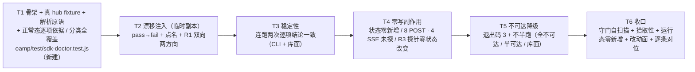

# pr-010-tasks.md — pr-010 内部任务图（`doctor` 自检用例 · F11 / G01）

**迭代**: 0025-hub-sdk-and-skill ｜ **阶段**: 5（PR 实现）· wave 5 ｜ **PR 文件**: `prs/pr-010-sdk-doctor-test.md`
**worktree 分支**: `feat/0025-pr-010-sdk-doctor-test`（worktree 地址 `…/.pb-agents/worktrees/0025-pr-010-sdk-doctor-test`，HEAD `3ba06dd` = 迭代分支 tip）｜ **任务总数**: **6**（T1~T6）｜ **依赖图**: 无环（单链，见 §2）

---

## 0. 范围、文件面与事实锚点

**本 PR 文件范围（唯一可写面，1 条）**

| 文件 | 动作 | 内容 |
|---|---|---|
| `oamp/test/sdk-doctor.test.js` | **新建** | R1 正常 / 漂移两态（漂移经 `check({ apiDocPath })` 注入临时副本）+ 稳定性（连跑两次逐项一致）+ 零写副作用（hub 可观察状态零新增、8 POST / 4 SSE 未探、R3 探针零状态改变）+ 端点分类全覆盖 + 不可达降级（F08 退出码 `3`，不半跑）（F11 / G01；`architecture.md` §5.5 / §10 T5） |

**非目标（明确不写）**：`oamp/sdk/**`（pr-001~pr-004 已合并产物，含本 PR 的被测对象 `doctor.js` / `index.js`）、`oamp/bin/**`、`oamp/package.json`、`oamp/API.md`、`oamp/src/**`、`oamp/web/**`、`oamp/skill/hub.md`、`oamp/test/helpers/**`（`harness.js` / `hub-harness.js` / `fake-node.js`）、`oamp/test/sdk-skill.test.js`、`oamp/test/sdk-surface.test.js`、既有 `oamp/test/*.test.js`、pr-007~pr-009 的 `test/sdk-{api,uds,cli-contract}.test.js`、`roles/**`、`tools/**`、`.claude/skills/**`、`architecture.md` / `prd/**` / `demand.md` / `status.md` / `history.md`、其它 `prs/*.md`。

**读码 / 文档事实锚点（判据基础；行号为 worktree `3ba06dd` 实测）**

| # | 事实 | 位置 / 依据 |
|---|---|---|
| A1 | 目标文件 `oamp/test/sdk-doctor.test.js` **当前不存在**；`oamp/test/sdk-*.test.js` 现有 `sdk-skill.test.js`（pr-005）与 `sdk-surface.test.js`（pr-006） | worktree `3ba06dd` 实测 |
| A2 | 测试拾取面 = `package.json:13` `"test": "node --test test/*.test.js"` ⇒ 新建 `test/sdk-doctor.test.js` **自动被拾取**，无需改 `package.json` | `oamp/package.json:13` |
| A3 | 被测导出面：`export async function check({ apiDocPath = API_DOC_PATH, port } = {})`（`:193`）；`:194` 读文档侧；`:195` 只读一次 `GET /api/docs`；`:197-201` `items = R1 ‖ R2 ‖ R3`；`:202` `return { pass: items.every((item) => item.ok !== false), items }` | `oamp/sdk/doctor.js` |
| A4 | R1 双向语义与项形态（`:45-68`）：文档侧每行一项（`id = R1 <归一签名>`、`expected = 文档侧原文`、`actual = 运行侧原文 / null`，缺失 ⇒ `reason: '登记缺失'`（`:56`））；运行侧多出项 ⇒ `expected: null`、`reason: '文档未覆盖'`（`:66`）⇒ **一次路径注入同时命中两方向** | `oamp/sdk/doctor.js:45-68` |
| A5 | 文档侧解析口径（`:34` + 正则 `:38`）：`/^\|\s*\d+\s*\|\s*`(GET\|POST)\s+(\/api\/[^`]*)`/`，逐行匹配「编号表格行 + 反引号签名」，**不限区段**。`oamp/API.md` §3 = 标题 `:157`、21 行表体 `:161-181`、`### 3.1` `:187`、`## 4.` `:992` | `oamp/sdk/doctor.js`、`oamp/API.md` |
| A6 | R2 分类与 skip 文案（`probeHttpGet`，`:92-107`）：非 GET ⇒ `skipped: true`、`reason: '写端点不探，零写副作用'`（`:97`）；`kind !== 'json'` ⇒ `skipped: true`、`reason: '流式端点，不探（存在性由 R1 覆盖）'`（`:101`）；其余各发一次空参 GET，判定 = 响应不是路由兜底（`:82-84`） | `oamp/sdk/doctor.js` |
| A7 | R3 探针面：`R3_PROBES`（`:121-130`，恰 8 条 = 8 个 Router 方法）；`probeUdsMethods`（`:154` 起）每探针 `connect({})`（**无 `socketPath` / `env` 入参**）→ 单方法 → `close()` | `oamp/sdk/doctor.js` |
| A8 | **跨 PR 约束 ①（必须带进用例）**：`oamp/sdk/uds.js:34-42` `resolveSocketPath`：`opts.socketPath` 非空即用，否则 `loadConfig(opts.env \|\| process.env).socketPath`。A7 的 `connect({})` 两个入参都没给 ⇒ **R3 只认调用方进程 env**。层 B 的 CLI / 库面入口另走 `surface.js:225-227` `connectWithCtx(ctx)`（传 `ctx.socketPath` / `ctx.env`），**doctor 不走它**。实证 = pr-004 独立验证报告 §6 偏差 #1：`createHub({ port, socketPath: <活 Router socket> }).doctor.check()` 在进程 env 无 `OAMP_SOCKET` 时**抛 `HubError{HUB_UNREACHABLE, exitCode: 3}`** | `sdk/uds.js`、`sdk/doctor.js`、`clarifications/verify-pr-004-20260915-175157.md:§6-#1` |
| A9 | **跨 PR 约束 ②**：库面 `createHub({ port, socketPath })`（`sdk/index.js:22-29`）**无 `env` 选项**；`:27` `doctor: { check: (opts = {}) => doctorCheck({ port: ctx.port, ...opts }) }` ⇒ 库面 doctor 的**端口**来自本次装配、**socket** 来自调用方进程 env。实证 = pr-004 报告 §6 偏差 #2（层 C 与 doctor 都读调用进程 env） | `sdk/index.js`、同上报告 §6-#2 |
| A10 | **跨 PR 约束 ③**：长驻命令显式传 `timeoutMs`（pr-004 报告 §6 偏差 #7）。`hub doctor` **非常驻**（自行退出）⇒ 用 `runHub` 缺省上限即可；本文件的常驻子进程（Router / web）不经 `runHub` 起（走 `startRouter` / 局部 `startWeb` + SIGINT 收口） | 同上报告 §6-#7、`test/helpers/harness.js`、`test/api-routes.test.js` |
| A11 | CLI 面接受面：`runDoctor`（`sdk/cli.js:282-303`）**只接受 `--human`（`:287`）与 `--help`（`:290`）**，其余 token ⇒ `usageError`（`:293`，退出码 `2`）；端口来自 `createSurface` 缺省链 `opts.port ?? Number(env.OAMP_WEB_PORT \|\| 7788)`（`surface.js:380`）⇒ **CLI 面把端口指到测试 web 的唯一通道 = 子进程 env `OAMP_WEB_PORT`**；含 fail 项仍 `return 0`（`:300`）；`check` 抛错 ⇒ `fail(err)`（`:302`） | `sdk/cli.js`、`sdk/surface.js` |
| A12 | 不可达与错误形态：`errors.js` 归类表 —— `{kind:'connect'}` ⇒ `{code:'HUB_UNREACHABLE', exitCode:3}`；`{kind:'response', status:502}` ⇒ `{code:'UPSTREAM_UNAVAILABLE', exitCode:3}`；`serializeError` ⇒ `{code, error, exit_code}`（+ 层 A 的 `http_status`），**不含 stack** | `oamp/sdk/errors.js` |
| A13 | harness 导出面（pr-004 未改，8 项）：`SHORT_ENV`（`:19-23`：interval 50 / timeout 300 / hb-log 300）、`makeTempSocketDir`（`:25`）、`buildEnv`（`:29`）、`waitFor`（`:34`）、`queryStatus`（`:86`）、`startRouter`（`:106`）、`startAgent`（`:159`）、`stopAll`（`:193`）；**无 `startWeb`、无端口辅助** ⇒ 本文件的 web 子进程与端口探测须在本文件内自建（体例先例 = `test/api-routes.test.js:64-87` 的局部 `startWeb`、`:60-62` 的 `pickPort`） | `oamp/test/helpers/harness.js`、`oamp/test/api-routes.test.js` |
| A14 | hub-harness 接缝：`runHub(args, {env, input, timeoutMs = 10000})` → `{code, stdout, stderr}`（`:22`、`:30`）；`env = {...process.env, ...opts.env}`；`cwd = os.tmpdir()`；`detached` + 进程组收口（正常路径也杀透孙进程） | `oamp/test/helpers/hub-harness.js` |
| A15 | 读写面形态（实测）：`GET /api/agents` ⇒ `{agents: [...]}`（`web.js:500` / `:503`，元素 = `registry.snapshot()` 4 字段 + `role`）；`GET /api/chats` ⇒ `{chats, total, limit, offset}`（`:538`）；`GET /api/confirmations` ⇒ `{confirmations: [...]}`（`:1266`）；`GET /api/calls` ⇒ `{calls: [...]}`（`:1137`）；`POST /api/projects` ⇒ `{project: {...}}`；`router.status` ⇒ `{nodes: registry.snapshot()}`（`router.js:381`，4 字段、按 `instance_id` 排序）；`router.task_list` ⇒ `{tasks: [...]}`（`router.js:401`） | `oamp/src/web.js`、`oamp/src/router.js` |
| A16 | 库面调用形态（`sdk/surface.js`）：flag 名带**连字符**（`str('project-id')` 等，`API_ENTRIES`）；`libParams`（`:341-347`）= 位置参数在前、其后 flags 对象 ⇒ 读数形如 `hub.api.chats.list({'project-id': pid})`、`hub.api.projects.create({'repo-url': url})`；UDS 会话 = `hub.uds.connect({ socketPath })`（`:392` → `connectWithCtx` `:225-227`） | `oamp/sdk/surface.js` |
| A17 | 端点分类（§5.5 + 实测）：21 = **9 条非流式 GET**（agents / chats / chats/:chat_id / docs / projects / calls / calls/:call_id/transcript / calls/:call_id / confirmations）+ **4 条 SSE GET**（stream / events / calls/stream / calls/:call_id/stream）+ **8 条 POST**；`API.md` §3 用途列含 `SSE` 的行恰 `#9 / #10 / #16 / #17` | `oamp/src/web.js`（`kind: 'sse'` 4 处）、`oamp/API.md:161-181` |
| A18 | **主 agent 端口段冻结指令（2026-09-15，IRC）**：既有套件占用段止于 `49999`；**pr-010 = `54000–54999`**（pr-007 = `51000–51999` / pr-008 = `52000–52999` / pr-009 = `53000–53999`）；端口必须**运行时探测的空闲端口**，段是**约束上界而非硬编码列表** | 主 agent 指令；既有段实测（`test/{web,project-workspace,api-pages,api-routes,acp-daemon,confirmation-inbox,inbox-console,notification-scope,call-console,call-protocol}.test.js`） |
| A19 | 流程口径（用户 2026-09-15 指令）：中间 PR **不跑仓库级全量套件**；全量集中到全部开发完成后跑一次并驱动收口修复 PR ⇒ 本 PR 的验证方式 = **scoped** `node --test test/sdk-doctor.test.js` | 简报「流程口径」段 |
| A20 | 既有体例：`node:test` + `node:assert/strict`；被核 / 被测路径按 `import.meta.url` 推导（`test/sdk-skill.test.js:8-16`）；读不到文件即 `assert.fail` 并点名路径（`:124-130`）。`hygiene.test.js` 的扫描面 = `bin/` + `src/` + `package.json`（**不含 `test/`**）⇒ 本 PR 新文件不进该扫描面 | `oamp/test/sdk-skill.test.js`、`oamp/test/hygiene.test.js:26-39` |
| A21 | pr-004 的实测基线（可复用的对照事实）：健康 hub 上 `check()` ⇒ **`{pass: true, items: 50}`**（21 R1 + 21 R2 + 8 R3），每项含 `{id, ok, expected, actual}` | pr-004 报告 §2-T2-② |
| A22 | `.runtime/` 的唯一写入方是 cluster（`src/cluster.js:21`：`OAMP_CLUSTER_LOG_DIR \|\| <包根>/.runtime/cluster`）⇒ 本 PR 涉及的 Router / web / doctor **三面都不写仓库运行态**；`.gitignore` 含 `.runtime/` 与 `data/` | `oamp/src/cluster.js:21`、`oamp/.gitignore` |

**跨 PR 硬约束（pr-004 独立验收报出的偏差 #1 / #2 / #7；必须落进用例，不是"注意事项"）**

| # | 约束 | 落到哪个任务 |
|---|---|---|
| K1 | `createHub({ socketPath })` **不达** doctor 的 R3 段（`connect({})` 只走 `loadConfig(process.env)`）⇒ **库面验证 doctor 必须在调用方进程 env 里设 `OAMP_SOCKET`**（A8） | **T1 验收 3**（fixture 设 / 还原 `process.env.OAMP_SOCKET`）、T3 / T4 的库面用例经此生效 |
| K2 | 库面无 `env` 选项（公开选项面恰 `{port, socketPath}`）⇒ 库面 doctor 与层 C 读**调用方进程 env**（A9）；CLI 面则必须经 `runHub` 的 `env` 与 `OAMP_WEB_PORT` 传端口与 socket（A11、A14） | **T1 验收 3、5**；T2 / T3 / T4 / T5 的两种宿主面 |
| K3 | 常驻命令必须显式 `timeoutMs`（A10）⇒ 本文件的常驻子进程一律走 SIGINT + 限时退出（不裸 `runHub` 起常驻命令） | **T1 验收 2**、T5 验收 2 |

---

## 1. 任务列表

### T1: 文件骨架 + 真 hub fixture + 文档侧解析原语 + 正常态逐项依据（含 21 条全覆盖与端点分类）

- **验收标准**:

  1. **落点与体例**（PR 验收 9、10 / §10 测试基建约束 / A20）：新建 `oamp/test/sdk-doctor.test.js`（唯一新文件）；import 面 = `node:test` / `node:assert/strict` / `node:fs` / `node:os` / `node:path` / `node:url` / `node:child_process` / `node:net`（**仅**用于端口探测）+ `../helpers/harness.js` + `../helpers/hub-harness.js` + `../sdk/index.js` + `../sdk/surface.js`；包根按 `import.meta.url` 推导（不依赖 cwd）；零第三方包、零 `../src/**`、零 `node:http` / `node:https` / `node:tls`。
  2. **真 hub fixture**（PR 验收 1 的"hub 运行中"前提 / A13 / K3）：顶层 `before` 起真 Router（`startRouter()`，临时 socket）+ 真 `oamp web start`（本文件局部 `startWeb`，spawn `bin/oamp.js web start --port <探测所得端口>` + 等 `WEB_READY`）+ 临时 `OAMP_DB`（`fs.mkdtempSync(os.tmpdir())` 下）；web 子进程 env 含 `OAMP_HEARTBEAT_TIMEOUT_MS: '5000'`（租约放长，防 `SHORT_ENV` 的 300ms 把 web 判 offline 造成快照抖动）；`after` 收口 = `stopAll([router])` + web SIGINT（限时未退即 SIGKILL）+ 临时目录 `rmSync`；**不写仓库内 `.runtime/` / `data/`**（A22）。
  3. **进程 env 约束落地（K1 / K2）**：`before` 记录并设置 `process.env.OAMP_SOCKET = router.socketPath`（库面 doctor 的 R3 只认进程 env，A8），`after` **原值还原**（含原本不存在的情形）；`process.env` 的其它键不改。不得改 `createHub` 的公开选项面来"绕过"该约束（改已合并产物 = 越界）。
  4. **文档侧解析原语**（PR 验收 8 / A5 / C11）：以 `## 3. 接口清单（21 条）` 起、`## 4. ` 前止**限定区段**，按 A5 的正则形态解析 §3 表行 ⇒ `{ method, path（原文）, signature（`<METHOD> <path 原文>`）}`；断言行数**恰 21**、编号 1..21 连续齐全；行数异常 ⇒ 失败并点名**实际行数**与首个异常行；`API.md` 读不到 ⇒ `assert.fail` 点名路径（A20）。**解析结果即本用例唯一的端点清单来源**（不得手抄清单）。
  5. **CLI 面正常态**（PR 验收 1 / A11 / A14）：`runHub(['doctor'], { env: { OAMP_SOCKET, OAMP_WEB_PORT: String(port) } })` ⇒ `code === 0`、stdout 为**单行可 `JSON.parse`** 的文档、`pass === true`；**端口只能经 `OAMP_WEB_PORT` 传**（`hub doctor` 不接受 `--port` —— 多给一个 token 会得到用法错误 `2`，A11）；该用例同时断言的"反例"：给 `runHub(['doctor', '--port', String(port)])` ⇒ `code === 2` 且 stderr 单行 JSON `code === 'USAGE'`（把 A11 的接受面钉成事实，避免后续用例误用 `--port`）。
  6. **逐项依据**（PR 验收 1 的判定面 / F11 验收 1 判定）：items 每项含 `{ id, ok, expected, actual }`（`skipped === true` 的项另含非空 `reason`）；`expected` / `actual` **不得双双为空**（"只报总结果"的形态被否）；`items.length > 0`；每项 `id` 可指认到端点 / 方法名（`R1 <签名>` / `R2 <METHOD> <path>` / `R3 <方法名>` 三形态之一）。
  7. **R1 逐条对位 + 计数自证**（PR 验收 1 / A4 / A21）：对 §3 解析出的**每一行原始签名**，断言 items 中存在 `R1` 项其 `expected` 与该签名**逐字相等**、`ok === true`、`actual` 非空 ⇒ 21 条无一缺项；断言 `R1` 项数 === 21。**在测试侧不复制 doctor 的归一化**（以 `expected`（文档侧原文）对位，避免引入第二份 `shapePath` 实现）。
  8. **端点分类全覆盖 + 无静默跳过**（PR 验收 6 / §5.5 分类 / A17）：断言 `R2` 项数 === 21 === §3 行数（运行侧与文档侧同数 ⇒ 双向零多出 / 零缺项）；`R2` 中 `skipped === true` 且 `reason` 含「写端点」的项数 === §3 中 `POST` 行数（**8**）；`reason` 含「流式」的项数 === §3 中用途列含 `SSE` 的行数（**4**）；`skipped !== true` 的项数 === 余下（**9**）；凡 `skipped === true` 的项**必带非空 `reason`**（无静默跳过）；`R3` 项数 === **8** 且其 `id` 集合 === `ENTRIES` 中 `layer === 'uds'` 的 8 个 `method` 映射为 `R3 <method>` 的集合（§5.5 R3「8 个方法」的覆盖锁）；items 总数 === `21 + 21 + 8 = 50`（A21）。
  9. **21 行对照清单可见**（F11 验收 1 的判定面；[model_inferred] 见 §5-1①）：以 `t.diagnostic(...)` 逐行输出 21 条 `R1` 项的 `id / expected / actual` 与三段计数（R1 / R2 / R3），使 scoped 跑的 stdout 可直接与 `API.md` 逐行核对；**不写文件**、不改 stdout 语义。
  10. **端口段（A18，主 agent 冻结指令）**：本文件所有 web 子进程端口经**运行时探测**获得，且落在 `54000–54999`：探测 = 在段内取候选端口 → `net.createServer().listen({ port: candidate, host: '127.0.0.1' })` 成功即空闲 → `close()` 后使用；候选耗尽 ⇒ `assert.fail`（**不得放宽到段外**，也不得退回 `listen(0)` 的随机临时端口）；本文件记录启动过的所有端口（`USED_PORTS`）供 T6 断言；web 子进程 env 的 `OAMP_WEB_PORT` 必须等于同一端口（同一值既喂子进程、也供 `runHub` 的 env 与库面 `createHub({ port })`）。
  11. **scoped 跑绿**（PR 验收 10 / A19）：`cd oamp && node --test test/sdk-doctor.test.js` 本任务用例全绿、无 `skipped` / `todo`；**不**触发仓库级全量。

- **前置依赖**: 无
- **优先级**: P0
- **追溯**: PR 文件 验收 1、6、9 + 文件范围（`oamp/test/sdk-doctor.test.js` 新建）；`prd/F11-doctor-contract-selfcheck.md:16`（验收 1）、`:22`（验收 4）的第一判据面；`prd/G01-hub-interface-unchanged.md:24`（验收 5）；`architecture.md:491-520`（§5.5 R1 / R2 表与端点分类）、`:642-655`（§10 T5 行 + 测试基建约束）；锚点 A2 / A3 / A4 / A5 / A6 / A11 / A13 / A14 / A15 / A16 / A17 / A18 / A19 / A20 / A21 / A22；跨 PR 约束 K1 / K2 / K3

### T2: 漂移注入（临时副本）⇒ `pass` 转 `fail` + 点名端点 + R1 双向两方向

- **验收标准**:

  1. **副本落系统临时目录**（PR 验收 2 / `architecture.md:645` 的括注）：`fs.mkdtempSync(os.tmpdir())` 下写 `API.md` 副本（原文逐字复制）；断言副本路径位于系统临时目录（`path.resolve(copy).startsWith(path.resolve(os.tmpdir()))`）；**仓库内 `oamp/API.md` 零触碰** —— 断言注入前后**仓库 `API.md` 内容逐字不变**（前后各读一次并比较）。
  2. **注入手法**（PR 验收 2 / A4 / C11）：以 §3 表**首行**（`#1`）为靶：取该行原文，把**已解析出的签名子串**（`<METHOD> <path 原文>`）替换为「签名 + 固定后缀常量」；断言行数仍为 21（只改路径，不增删行）；实现中**不得出现任何端点路径字面量**（由 T6 的自扫描机械核对）—— 靶点与断言值一律从解析结果与后缀常量**现算**。
  3. **`pass` 转 `fail`（E2 裸判据）**（PR 验收 2）：以库面 `hub.doctor.check({ apiDocPath: <副本路径> })` 重跑 ⇒ `pass === false`；**对照臂**：同一 fixture 上以**未注入的原文副本**跑 ⇒ `pass === true` ⇒ 「由 pass 转 fail」成立且归因于注入本身（不是环境噪声）。
  4. **点名端点 + 期望 / 实际**（PR 验收 2 / A4）：注入态下"非 `ok`"的 `R1` 项**恰两条**，且与靶逐字对位 —— ① **文档有运行无**：`expected` === 注入后签名（含后缀）、`actual === null`、`reason === '登记缺失'`、`id === 'R1 ' + 注入后归一签名`；② **运行有文档无**：`expected === null`、`actual` === 靶的**运行侧原文**、`reason === '文档未覆盖'`。（靶 = §3 第 1 行，其路径无参数 ⇒ 归一前后同形，两向 `id` / `expected` / `actual` 可逐字对位；这三个字符串全部由解析结果 + 后缀常量现算。）
  5. **R1 双向比对两方向均被覆盖**（PR 验收 6 / §5.5 R1）：断言一次注入**同时**产出「登记缺失」与「文档未覆盖」两类项（各恰一条，见上条），其余 `R1` 项仍 `ok === true`（20 条）；断言 `R2` 段不受漂移影响（仍 21 项、9 探 / 4 流式 skip / 8 写 skip）—— R1 是清单比对、R2 是可达性探测，两类判据不互相掩盖。
  6. **真源唯一**（PR 验收 8 / G01 验收 5）：断言"结论随注入副本变化"这一因果（原文副本 pass / 注入副本 fail）即 F11 验收 5 与 G01 验收 5 的机械形态；用例内不得出现与 `API.md` 并存的第二份端点清单（T6 自扫描核对）。
  7. **scoped 跑绿**（口径同 T1 验收 11）。

- **前置依赖**: **T1**（同文件串行写入；复用 T1 的 fixture、解析原语、库面调用形态与断言消息体例）
- **优先级**: P0
- **追溯**: PR 文件 验收 2、6（双向方向面）、8；`prd/F11-…md:18`（验收 2，判定逐字取自 `demand.md` §4 **E2**）；`prd/G01-…md:24`（验收 5）；`architecture.md:491-520`（§5.5「漂移判定（E2 / F11 验收 2）」段）、`:645`（§10 T5 行"以注入 `API.md` 路径的方式制造漂移，测试用临时目录内的副本"）；锚点 A4 / A5 / A19 / A20 / A21；跨 PR 约束 K1

### T3: 稳定性 —— 连跑两次逐项结论一致（CLI 面 + 库面）

- **验收标准**:

  1. **CLI 面两次**（PR 验收 3 / A11 / A14）：同一状态下 `runHub(['doctor'], { env })` 连跑两次 ⇒ 两次 `code` 均 `0`、两次 stdout 解析出的 `pass` 相等、`items.length` 相等。
  2. **逐项结论一致（CLI 面）**（PR 验收 3 / [model_inferred] §5-1②）：以 `id` 为键建映射后逐项比对 `{ ok, skipped, reason }` —— 每一项在两次之间**结论相等**；**不对 items 顺序做断言**（§5.5「三段判据均不依赖时间 / 随机 / 顺序」）；不存在任何一项 `ok` 翻转。
  3. **库面两次**（PR 验收 3 / A9、K1）：`createHub({ port })` 的 `hub.doctor.check()` 连跑两次 ⇒ `pass` 相等 + 逐项结论一致（同上口径）；两次返回的 `items` **不是同一引用**（无缓存；顺带锁 `§5.2 规则 4`「无跨调用状态」，[model_inferred] §5-1③）。
  4. **不出现随机 pass/fail**（PR 验收 3 / F11 验收 4 判定）：未漂移状态下两次 `pass` 均 `true`；用例内零 `sleep` / 零重试 / 零轮询（判据本身不得依赖等待）。
  5. **scoped 跑绿**（口径同 T1 验收 11）。

- **前置依赖**: **T1**（同文件串行写入；复用 fixture、库面 / CLI 面调用形态）
- **优先级**: P0
- **追溯**: PR 文件 验收 3；`prd/F11-…md:22`（验收 4）；`architecture.md:509`（§5.5「未漂移时稳定」段）、`:502`（§5.2 规则 4 无跨调用状态）；锚点 A3 / A9 / A11 / A14 / A21；跨 PR 约束 K1

### T4: 零写副作用 —— hub 可观察状态零新增 + 8 POST / 4 SSE 未探 + R3 探针零状态改变

- **验收标准**:

  1. **基线 + 读数面**（F11 验收 3 / A15 / A16）：fixture 内先经**库面**建立非空基线（`hub.api.projects.create({ 'repo-url': <固定测试地址> })` ⇒ 1 个项目）；**不建对话**（[model_inferred] §5-1④：`POST /api/messages` 会派发任务，异步状态变化会污染快照判据）；随后取 5 个读数：`projects.list()` / `chats.list({ 'project-id': pid })` / `agents()` / `calls.list()` / `confirmations.list()`（分别对应 `GET /api/projects` / `/api/chats` / `/api/agents` / `/api/calls` / `/api/confirmations`）。
  2. **前后对照零新增**（PR 验收 4 / F11 验收 3 / MI-02）：以库面 `hub.doctor.check()` 跑一次，前后两次 5 元读数逐个 `deepEqual`；断言基线**非空**（`projects` 项数 ≥ 1）以证明读数通道有效（不是空对空的等价）。
  3. **8 条 POST 与 4 条 SSE 未被探测**（PR 验收 4 / §5.5 分类 / A6 / A17）：从 items 断言 `R2` 的 8 条 POST 项与 4 条 SSE 项均 `skipped === true` 且 `reason` 为对应文案（`写端点不探，零写副作用` / `流式端点，不探（存在性由 R1 覆盖）`）——"零写请求发出"的**结构证据**；与验收 2 的**行为证据**（读数零变化）合起来闭合 MI-02。
  4. **R3 探针零状态改变**（PR 验收 5 / `architecture.md:§9.3 A4`）：以库面 UDS 会话（`hub.uds.connect({ socketPath })` → `status()` / `taskList({})`，A16）在 doctor **前后**各取注册表与任务表快照，比较**投影** `nodes.map((n) => [n.instance_id, n.state])` 与 `tasks.map((t) => [t.task_id, t.state])`（[model_inferred] §5-1⑤：排除 `last_heartbeat` 等时序字段，因 web 常驻心跳会让它们抖动）；断言投影 `deepEqual`、条数不增（零新增节点 / 零新增任务）。该断言**非空转**：`agent.register` 探针（缺 `instance_id`，A7）若泄漏注册（= 校验未先于副作用），注册表投影会立即变化。
  5. **探针集完整**（PR 验收 5 / §5.5 R3）：断言 `R3` 项 `id` 集合 === 8 个 Router 方法的 `R3 <method>` 集合（覆盖前提），且每项 `ok === true`（存在性判定全部通过）。
  6. **CLI 面同口径抽检**（PR 验收 4 的"全程"面 / [model_inferred] §5-1⑥）：以 `runHub(['doctor'], { env })` 跑一次，前后再取一次 5 元读数并 `deepEqual`；两宿主（CLI / 库面）共用同一 `doctor.js`，但调用宿主不同 ⇒ 各证一次。
  7. **scoped 跑绿**（口径同 T1 验收 11）。

- **前置依赖**: **T1**（同文件串行写入；复用 fixture、库面读数与 UDS 观测形态）
- **优先级**: P0
- **追溯**: PR 文件 验收 4、5；`prd/F11-…md:20`（验收 3 + `MI-02`）；`architecture.md:491-520`（§5.5「写操作端点的处置」与「无写副作用（MI-02）的机制」段）、`:602-608`（§9.3 **A4**：以"探针零状态改变"为硬约束并用测试锁住）、`:646-653`（§10 T5 行"R3 探针零副作用"）；锚点 A6 / A7 / A15 / A16 / A17 / A21 / A22；跨 PR 约束 K1

### T5: 不可达降级 —— F08 统一错误（退出码 `3`）+ 不半跑

- **验收标准**:

  1. **全不可达（CLI 面）**（PR 验收 7 / F08 验收 1、2 / A11 / A12 / A14）：`runHub(['doctor'], { env: { OAMP_SOCKET: <系统临时目录下**不存在**的 socket 路径>, OAMP_WEB_PORT: <本段内探测所得、**未监听**的端口> } })` ⇒ `code === 3`；stderr **恰一行**可 `JSON.parse` 的 JSON，含 `code === 'HUB_UNREACHABLE'`、`exit_code === 3`、`error` 非空**单行**文案；**不含堆栈**（stderr 无 `\n    at ` 形态、`error` 值内无换行）；stdout **不含任何可解析的 `items`**（不半跑）。
  2. **半可达（Router 停、web 在）＝"跑了一半也不输出半份"**（PR 验收 7 / §5.5「hub 不可达：R1/R2 立即降级 … 不半跑」）：本用例**自建一对独立 fixture**（手法同 T1 验收 2，端口仍取本段内探测值；不污染共享 fixture），先跑一次 `hub doctor` 确认 `pass === true`（"降级前可用"的对照），再停掉 Router，重跑 ⇒ `code === 3` 且 stdout 无 `items`（[model_inferred] §5-1⑦：此时**不锁死 `code`** —— `R2` 首遇上游 502（`UPSTREAM_UNAVAILABLE`）与 `R3` 连接失败（`HUB_UNREACHABLE`）同属 §5.4 的 `3` 类，判据取 `exit_code === 3` + stderr 单行 JSON 形态）。
  3. **库面同判（等价物）**（PR 验收 7 / §5.5 / `§5.2 规则 5`）：`createHub({ port: <未监听端口> }).doctor.check()` ⇒ **reject**；错误对象 `code === 'HUB_UNREACHABLE'`、`exitCode === 3`、`httpStatus === null`、`upstream === null`，且**无部分 items**（错误对象上无 `items` 键）—— 库面 `HubError.exitCode` 与 CLI 面进程码 `3` 同源同值。
  4. **"未监听端口"的取法**（A18 / [model_inferred] §5-1⑧）：端口从 `54000–54999` 段内**运行时探测**（同 T1 验收 10 的探测手法）取得后**不起任何服务** ⇒ 连接被拒是确定性事实；不使用固定"死端口"字面量、不引入 `sleep` 轮询。
  5. **scoped 跑绿**（口径同 T1 验收 11）。

- **前置依赖**: **T1**（同文件串行写入；复用端口探测 / fixture 手法 / CLI 与库面调用形态）
- **优先级**: P0
- **追溯**: PR 文件 验收 7；`prd/F08-disconnect-degradation.md`（验收 1、2：单一明确错误 + 退出码 `3`）；`architecture.md:491-520`（§5.5「hub 不可达」段）、`:452-489`（§5.3 失败形态：stderr 单行 JSON `{code,error,exit_code}`）、`:460-489`（§5.4 归类表 `3` 类 ① 与 ④）；锚点 A10 / A11 / A12 / A14 / A18 / A19；跨 PR 约束 K1 / K3

### T6: 收口 —— 守门自扫描 + 拾取性 + 仓库运行态零新增 + 改动面 + PR 验收逐条对位

- **验收标准**:

  1. **导入白名单守门**（[model_inferred] §5-1⑨；体例先例 = `hygiene.test.js` 的静态扫描，A20）：静态扫描**本用例文件自身**源文本（逐行剔除 `//` 之后的注释段后再匹配），断言：import 说明符**仅**落在 T1 验收 1 的白名单内（`node:test` / `node:assert/strict` / `node:fs` / `node:os` / `node:path` / `node:url` / `node:child_process` / `node:net` + `../helpers/harness.js` / `../helpers/hub-harness.js` / `../sdk/index.js` / `../sdk/surface.js`）；**零命中** `node:http` / `node:https` / `node:tls` / `../src/**` / 任何裸包名（`node:` 前缀与相对路径之外的形式）。
  2. **"不引入第二份接口定义"守门**（PR 验收 8 / G01 验收 5 / C11）：对 §3 解析出的**每一条**签名，断言其**路径字符串**在本用例源文本中**零命中** ⇒ 用例内不存在与 `API.md` 并存的端点清单，比对真源只有 `API.md`（或其注入副本）+ doctor 自报的 items；同时断言源文本零 `/api/` 路径字面量（同一判据的收紧形态 —— 若主 agent 判定过紧，可只保留"逐条签名零命中"，见 §5-2）。
  3. **仓库运行态零新增**（PR 验收 9 / §10 测试基建约束 / A22）：模块级记录 `oamp/.runtime` 与 `oamp/data` 的**存在性基线**（文件加载时求值，早于任何子进程），在末位守门用例里断言"与基线一致" ⇒ 本文件全部子进程与写盘均未在仓库内创建运行态；此形态对"环境本来就有这两个目录"也不产生假失败。
  4. **拾取性**（PR 验收 10 / A2 / A19）：文件名 `oamp/test/sdk-doctor.test.js` 落在既有 `scripts.test` 的 `test/*.test.js` glob 内 ⇒ 无需改 `package.json`；以 **scoped** `cd oamp && node --test test/sdk-doctor.test.js` **全绿**为证（按用户口径**不**在本 PR 触发仓库级全量套件）。
  5. **端口段自证（A18）**：断言本文件记录过的所有端口（`USED_PORTS`，含 T5 自建 fixture 的端口）**每一个**都落在 `54000–54999`；断言端口均经探测（探测函数是唯一取端口入口）。**跨 PR 零交集**（51000–51999 / 52000–52999 / 53000–53999 / 54000–54999 四段互斥）为任务图与评审面的核对项，**不在用例内硬编码兄弟 PR 的段**（避免把跨 PR 协调写进被测文件）。
  6. **改动面恰一条新增**（PR 文件范围）：`git -C <worktree> diff --name-only <base> -- oamp/` 恰为 `oamp/test/sdk-doctor.test.js`（新增）；对 `oamp/sdk/**`、`oamp/bin/**`、`oamp/package.json`、`oamp/API.md`、`oamp/src/**`、`oamp/skill/hub.md`、`oamp/test/helpers/**`、既有 `oamp/test/*.test.js`（含 `sdk-skill.test.js` / `sdk-surface.test.js`）**零改动**。（`docs/**` 是工作流产物面，不参与该条判定。）
  7. **PR 10 条验收逐条对位**（见 §3）并有可复现证据（命令 + 输出摘要），逐条 pass；无法在本 PR 面闭合的条目须显式标注边界（例：CLI 面**不可**注入漂移 ⇒ 漂移态只在库面闭合，见 §5-1②/§5-2），不得以"看起来没问题"结案。
  8. **失败可定位**（A20）：条数 / 缺项 / 多出项三类断言的失败消息**分列**期望与实际；`API.md` 读不到 ⇒ `assert.fail` 点名路径；守门扫描失败 ⇒ 点名命中的说明符 / 字面量。

- **前置依赖**: **T1、T2、T3、T4、T5**（收口判定以五者的用例齐备且 scoped 全绿为前提；同文件串行写入）
- **优先级**: P0
- **追溯**: PR 文件 验收 8、9、10 + 文件范围 + 「非目标」；`prd/G01-…md:24`（验收 5）；`architecture.md:642-655`（§10 测试组织 + 测试基建约束："不写仓库内 `.runtime/` 与 `data/`（临时目录）；不依赖真实 omp / 外网"）、`:646-653`（§10 T5 行）；`oamp/test/hygiene.test.js:26-39`（静态扫描体例先例）；锚点 A1 / A2 / A5 / A18 / A19 / A20 / A22

---

## 2. 依赖图（无环）

拓扑序（合法执行序）：`T1 → T2 → T3 → T4 → T5 → T6`

- **最长依赖链**：`T1 → T2 → T3 → T4 → T5 → T6`（5 跳）。
- **关键路径任务**：**T1 / T2 / T3 / T4 / T5 / T6**（六个全在关键路径上；本 PR 无第二条支路）。
- **无环**：边方向严格单调（`T1→T2→T3→T4→T5→T6`），无回边、无自环。逻辑依赖真实成立的有两条：① T2~T5 复用 T1 落定的 fixture（含 `process.env.OAMP_SOCKET` 设置与还原）、端口探测入口、`API.md` 解析原语与断言消息体例；② T6 的收口判定以 T1~T5 的用例齐备且 scoped 全绿为前提。`T2→T3→T4→T5` 之间的边**主要**由**同文件写入的串行化**给出（各自判据面对立，见下），**不得**当并行支路执行。
- **与 PR 间依赖图的关系**：本 PR `depends_on = pr-004`（**已合并**，`3ba06dd` 含 `bin/hub.js` + `test/helpers/hub-harness.js` + `sdk/index.js`）与 pr-003（已合并，`sdk/doctor.js` 的 `check({ apiDocPath })` 入参面）。本任务图是 **PR 内部**的写入顺序与产物依赖，**不新增**跨 PR 依赖，也不需要等待 pr-007~pr-009。

**同文件串行约束（必须）**

| 文件 | 写入任务 | 串行要求 |
|---|---|---|
| `oamp/test/sdk-doctor.test.js` | **T1（骨架 + fixture + 解析 + 正常态）→ T2（漂移）→ T3（稳定性）→ T4（零写副作用）→ T5（不可达）→ T6（守门 + 收口）** | **唯一一个新文件**且被六个任务依次追加 ⇒ 必须**单链串行**、不得并行写入 |
| `oamp/sdk/doctor.js` / `sdk/index.js` / `sdk/uds.js` / `sdk/cli.js` / `sdk/surface.js` | **无**（零改动） | 只读：经 `import` 消费被测面（`createHub` / `check` / `ENTRIES`） |
| `oamp/API.md` | **无**（零改动） | 只读：`readFileSync` 取文本后解析 §3；漂移只写**临时副本**（A4 / §10 T5 括注） |
| `oamp/test/helpers/{harness,hub-harness}.js` | **无**（零改动） | 只读消费（A13 / A14） |
| `oamp/{bin/hub.js,bin/oamp.js,src/**,package.json,skill/hub.md}` | **无**（零改动） | 只读：`bin/oamp.js web start` / `router start` 由 harness 机制拉起 |
| pr-007~pr-009 的 `test/sdk-{api,uds,cli-contract}.test.js` | **无**（零改动） | 本 PR **不断言**这些文件的存在性（否则会在并行 PR 落盘前制造假失败）；端口段已按 A18 冻结，互不重叠 |

---

## 3. 与 pr-010 验收标准逐条对位表

| PR 验收 #（PR 文件 `:18-27`） | 验收摘要 | 承接任务 | 对位说明 / 判据面 |
|---|---|---|---|
| 1 | R1 正常态：逐项给 `pass` 与依据（期望 / 实际） | **T1**（验收 5、6、7、9） | CLI 面（`hub doctor`，端口经 `OAMP_WEB_PORT`）与库面（`createHub({port}).doctor.check()`）双宿主；每项 `expected` / `actual` 非空；21 条逐条对位（以 `expected` 面，不复制归一化） |
| 2 | 漂移态：注入 `API.md` 临时副本 → 由 `pass` 转 `fail` 并点名端点、打印期望 / 实际 | **T2**（验收 1~4） | 唯一注入口 = 库面 `check({ apiDocPath })`（CLI 面不接受该入参，见 §5-2）；靶 = §3 首行；两向项逐字对位 |
| 3 | 稳定性：连跑两次逐项结论一致 | **T3**（验收 1~4） | CLI 面两次 + 库面两次；`id` 为键的结论面比对（`ok` / `skipped` / `reason`），不断言顺序、零 sleep |
| 4 | 无写副作用：状态零新增；8 条 POST 与 4 条 SSE 未被探测 | **T4**（验收 1、2、3、6） | 行为证据（5 元读数前后 `deepEqual` + 非空基线）+ 结构证据（`R2` 的 8 / 4 条 `skipped` 及理由） |
| 5 | R3 探针零状态改变（注册表 / 任务表快照不变） | **T4**（验收 4、5） | 库面 UDS 会话前后投影（`[instance_id, state]` / `[task_id, state]`）`deepEqual` + 条数不增；覆盖前提 = 8 探针齐备（`§9.3 A4`） |
| 6 | 端点分类全覆盖：21 条每条 `pass` / `fail` / `skip（附理由）`；R1 双向覆盖两方向 | **T1**（验收 8）+ **T2**（验收 4、5） | 分类判据 = §3 解析（`POST` 行数 8 / 用途含 `SSE` 行数 4 / 余 9）+ `R2` 项 `skipped` 与 `reason`；双向两方向 = 一次路径注入同时产出「登记缺失」与「文档未覆盖」 |
| 7 | hub 不可达：R1/R2 降级为 F08 统一错误（退出码 `3`），不半跑 | **T5**（验收 1~3） | CLI 面全不可达 + 半可达（Router 停、web 在）+ 库面 reject 三角；stdout 无 `items`、stderr 单行 JSON 无堆栈 |
| 8 | 不引入第二份接口定义（一切以 `API.md` / 副本为唯一基准） | **T1**（验收 4）+ **T6**（验收 2） | 清单唯一来源 = §3 解析；自扫描断言 21 条签名路径在源文本零命中（+ 零 `/api/` 字面量） |
| 9 | 经 `runHub()` 执行 `hub doctor`、经 `hub.doctor.check({ apiDocPath })` 走库面；不写仓库内 `.runtime/` / `data/` | **T1**（验收 1、2、3、10）+ **T6**（验收 1、3） | 两宿主皆由用例承载；fixture 全临时（socket / `OAMP_DB` / 漂移副本）；运行态存在性基线与注入前后仓库 `API.md` 逐字不变 |
| 10 | 经 `node --test test/*.test.js` 被拾取并通过 | **T6**（验收 4）+ **T1/T2/T3/T4/T5**（各自的 scoped 跑绿） | 文件名匹配既有 glob（A2）+ scoped 全绿（用户口径 A19，不跑全量） |

**覆盖检查**：PR **10** 条验收 → 全部有任务承接（无遗漏）；**未新增** PR 文件范围之外的功能面（唯一写入 = `oamp/test/sdk-doctor.test.js`）；T1~T6 逐条可追溯到 PR 文件 / `prd/{F11,G01,F08}` / `architecture.md` §5.3·§5.5·§9.3·§10 / 事实锚点（见 §6）。

---

## 4. 关键实现约束（C 系列，全部为硬约束）

1. **C1 落点唯一**：本 PR 只新建 `oamp/test/sdk-doctor.test.js`；不得新建 `test/helpers/**`（web 子进程与端口探测在本文件内以局部函数实现，A13）、不得改 `package.json`。
2. **C2 零新框架 / 零新依赖**：`node:test` + `node:assert/strict` + 内置模块（`node:net` **仅**用于端口探测）；不引第三方库；不改 `scripts.test`。
3. **C3 被测面只经受支持的入口触达**：库面 `createHub` / `hub.doctor.check` / `hub.api.*` / `hub.uds.connect`；CLI 面 `runHub`；**不**手写 HTTP / SSE 客户端、不 import `sdk/doctor.js` 的内部函数（未导出）、不改任何 SDK 文件。
4. **C4 真 hub 而非桩**（F11 验收 1 的前提）：R1 / R2 必须对**运行中**的 hub（真 Router + 真 `oamp web start` + 临时 `OAMP_DB`）执行；不得以 mock / 固定 JSON 代替运行侧。
5. **C5 进程 env 是库面 doctor 的唯一 socket 通道（K1 / K2）**：`before` 设 `process.env.OAMP_SOCKET`、`after` 还原；CLI 面经 `runHub` 的 `env`（`OAMP_SOCKET` + `OAMP_WEB_PORT`）。**不得**为让 `socketPath` 生效而改 `check` / `createHub` 契约（改已合并产物 = 越界；若主 agent 要求该联动，属架构外决策，见 §5-2）。
6. **C6 漂移只在临时副本上施加**（§10 T5 括注）：副本落 `fs.mkdtempSync(os.tmpdir())`；断言仓库 `API.md` 内容注入前后逐字不变；**不得**改仓库 `API.md`。
7. **C7 文档侧解析限定 §3 区段 + 行数自证**：区段 = `## 3. 接口清单（21 条）` 起、`## 4. ` 前止；断言行数恰 21（形态漂移必须变成一次点名失败，不得静默通过）。
8. **C8 不复制真源、不复制归一化**（C11 精神 / G01 验收 5）：用例内不得出现 21 条端点清单的手抄、不得出现端点路径字面量、不得在测试侧另写一份 `shapePath`（R1 对位走 `expected`（文档侧原文）与解析结果）。
9. **C9 端点分类判据从真源现算**：`POST` 行数 / `SSE` 行数 / 余数从 §3 解析结果现算（不写死 8 / 4 / 9 之外的清单）；`R3` 的 8 个方法名取自 `sdk/surface.js` 的 `layer === 'uds'` 条目（已合并真源，非第二份定义）。
10. **C10 快照口径**：hub 可观察状态 = 5 元读数 `deepEqual`；注册表 / 任务表 = **投影** `[id, state]` 的 `deepEqual` + 条数不增（排除时序字段）；比较均以 **`id` 为键**做结论面比对，不对 items 顺序做断言。
11. **C11 端口段与探测**（A18）：所有 web 端口经**运行时探测**（段内候选 + `listen` 成功即空闲）取自 `54000–54999`；候选耗尽 ⇒ `assert.fail`；不得放宽到段外、不得退回 `listen(0)`。记录 `USED_PORTS` 供 T6 断言。
12. **C12 常驻子进程的收口**（K3）：Router / web 一律 `stop()`（SIGINT）+ 限时未退即 SIGKILL；web 与 Router 的临时物（socket / db / 端口）在 `after` 释放；不得留后台进程与占用端口。
13. **C13 零仓库运行态**（§10 测试基建约束）：socket / `OAMP_DB` / 漂移副本一律在系统临时目录；末位守门用例断言 `.runtime` / `data` 存在性与模块加载基线一致（A22：本 PR 三面均不写仓库运行态）。
14. **C14 零上游改动**：`oamp/sdk/**`、`oamp/bin/**`、`oamp/src/**`、`oamp/API.md`、`oamp/package.json`、`oamp/skill/hub.md`、`oamp/test/helpers/**`、既有 `oamp/test/*.test.js` 一律零 diff；本 PR 不改既有测试（含 `hygiene.test.js`）。
15. **C15 与并行 PR 的文件面不重叠、不断言其存在性**：`test/sdk-{api,uds,cli-contract}.test.js`（pr-007~pr-009）不在本 PR 写入面，也不作为本 PR 的断言对象。

---

## 5. 边界与疑问（提请主 agent；均不阻塞执行）

1. **`[model_inferred]` 清单共 9 条**（均为"判据形态 / 用例写法"的选择，不引入 `demand.md` / `prd` / `architecture.md` 之外的新决策；确认后可原样执行）：
   ① **21 行对照清单以 `t.diagnostic` 输出**（T1 验收 9）——PR 验收未要求"用例打印清单"；判据来源 = `prd/F11:16` 验收 1 的判定「输出逐项 `pass` / `fail` 与依据」+ `architecture.md:〔§5.5 逐项输出列〕`；目的是让 scoped 跑的 stdout 可人工逐行核对（同 pr-006 的对照清单手法）。
   ② **稳定性以 `id` 为键的结论面比对（`ok` / `skipped` / `reason`）**（T3 验收 2）——PR 验收 3 只说"逐项结论一致"；`actual` / `expected` 属"依据"面而非"结论"面，且 PR 验收 2 才要求打印它们。若主 agent 要求连依据也逐字一致，加一条断言即可（实现确定性支持）。
   ③ **库面两次 `check()` 返回不同引用**（T3 验收 3）——`§5.2 规则 4`（无跨调用状态）的机械投影；PR 验收 3 未显式要求，属"顺带锁住既有契约"。
   ④ **零写副作用基线只建项目、不建对话**（T4 验收 1）——`POST /api/messages` 会派发任务，异步状态变化会污染快照判据（对"零新增"产生假失败）；这是**判据可信度**的取舍，不是缩小 PR 范围。
   ⑤ **注册表 / 任务表快照取 `[id, state]` 投影**（T4 验收 4）——web 常驻心跳会更新 `last_heartbeat`（A15 的 4 字段快照），逐字段比较必然抖动；投影保留"是否有新增 / 移除与状态迁移"这一判据面。
   ⑥ **CLI 面也抽检一次零写副作用**（T4 验收 6）——PR 验收 4 的"全程"未区分宿主；两宿主共用同一 `doctor.js`，但调用宿主不同（进程码 / 返回值），各证一次成本极低。
   ⑦ **半可达场景不锁死 `code`**（T5 验收 2）——`UPSTREAM_UNAVAILABLE`（502）与 `HUB_UNREACHABLE` 同属 §5.4 的 `3` 类；锁死具体码会把"降级为统一错误"的判据误收窄成"必须走某一条错误路径"。
   ⑧ **"未监听端口"= 段内探测所得但不起服务**（T5 验收 4）——主 agent 指令要求端口"运行时探测"（A18）；探测结果同时服务两个用途（可用端口 / 确定性死端口），不引入固定字面量。
   ⑨ **导入白名单自扫描落地"零依赖 / 不手写客户端"**（T6 验收 1）——PR 验收 8/9 表述的是性质，未给判据形态；体例先例 = `hygiene.test.js` 的静态扫描（A20）。`node:net` 因端口探测列入白名单（仅该用途）。
2. **CLI 面无法注入漂移 = 本 PR 的一处能力边界（非缺陷）**：`runDoctor`（`sdk/cli.js:282-303`）只接受 `--human` / `--help`，**没有** `--api-doc` 之类入参（A11）⇒ 「drift → fail」只能在**库面**以 `check({ apiDocPath })` 闭合。若主 agent 要求 CLI 面也覆盖漂移，唯一回退口 = 给 `runDoctor` 增开注入入参（改 pr-003 已合并产物 = 越界，需另立改动）。**本任务图据此把漂移判据单列在 T2（库面），并在 T1 把"CLI 不接受 `--port`"钉成事实**（避免后续用例误用）。
3. **`createHub({ socketPath })` 不达 doctor 的 R3 段（偏差 #1）**：已按 K1 落进 T1 验收 3（进程 env 设 `OAMP_SOCKET`）。若主 agent 希望 `socketPath` 对 doctor 生效，需扩 `check({ socketPath })` 契约（`architecture.md` 未覆盖 ⇒ 属架构外决策，本图不动）。
4. **`items === 50` 的锁**（T1 验收 8）：50 = 21 R1 + 21 R2 + 8 R3 依赖"运行侧登记与 `API.md` 两侧同数"。若未来登记新增端点，本条与 R1 双向断言会同时失败 —— 这正是 `G01` 验收 1 / 验收 5 的机械锁之一；**但该面不在本 PR 的写面内**（本 PR 只加用例），此处仅登记。
5. **端口段的残留风险**（A18 / C11）：四段互斥（`51000–51999` / `52000–52999` / `53000–53999` / `54000–54999`），但段内仍是随机 / 探测取用 ⇒ 同段内两个用例理论上可能撞端口；本图以"探测 + 段内重试"把概率压到与既有套件同量级（既有套件一律裸随机）。若后续出现偶发冲突，回退口 = 本文件内 `USED_PORTS` 去重（同 pr-007 的做法）。
  6. **全量套件不在本 PR 跑**（A19）：PR 验收 10 的"被拾取并通过"以"文件名落在 `test/*.test.js` glob（A2）+ scoped 跑绿"闭合；全量跑留待全部开发完成后的收口修复 PR。
7. **粒度决策（为何 6 个任务、为何单链）**：本 PR 只有**一个**新文件，任何"更细"的拆分会把同一文件切成多段并行写入（planner 红线："不要在同一个文件上制造并行写入"），故取单链；又因为六个判据面（正常态 + 分类全覆盖 / 漂移两方向 / 稳定性 / 零写副作用 / 不可达降级 / 收口守门）**各自可独立验收**（各自 scoped 跑可见其用例名、且失败面互不掩盖），故不合并成"一个大任务"。
8. **工作区与分支核对**：worktree = `…/.pb-agents/worktrees/0025-pr-010-sdk-doctor-test`，分支 `feat/0025-pr-010-sdk-doctor-test`，HEAD `3ba06dd`（= `iteration/0025-hub-sdk-and-skill` tip，即简报给定 base）；PR 文件 `depends_on = pr-004 + pr-003`（**均已合并**）、`batch: 4`（本 PR 属 wave 5）。与简报口径一致，**无偏差**。
9. **本任务图未做的事**：未写实现代码、未跑任何测试 / lint / 格式化、未执行任何 git 写命令、未修改任何上游产物（含 `doctor.js` / `API.md` / `helpers/**`）。
10. **一处事实更正（供评审）**：简报与主 agent 指令提到"沿用既有 `oamp/test/helpers/harness.js` 的取端口方式"——实测该文件**没有**端口辅助（导出面 8 项见 A13，`node:net` 仅用于 `queryStatus`），既有套件的端口取法是**每个测试文件内的局部 `pickPort()` 随机取段**（A13 末条）。本图据此把取端口方式落为"本文件内局部探测函数（段内候选 + `listen` 探活）"，比既有裸随机更强，且满足"运行时探测空闲端口"的指令要求。

---

## 6. 追溯总表（任务 → 输入）

| 任务 | PR 文件追溯（`prs/pr-010-…md`） | prd 追溯 | architecture 追溯 | 事实锚点 |
|---|---|---|---|---|
| T1 | 验收 1、6、9；文件范围（`oamp/test/sdk-doctor.test.js` 新建）；「代码锚点」 | `F11:16`（验收 1）、`F11:22`（验收 4 的第一判据面）、`G01:24`（验收 5） | §5.5 R1 / R2 表 + 端点分类（`:491-520`）；§10 T5 行 + 测试基建约束（`:642-655`）；§7 F11 行 | A2 A3 A4 A5 A6 A11 A13 A14 A15 A16 A17 A18 A19 A20 A21 A22；K1 K2 K3 |
| T2 | 验收 2、6、8；「上下文摘要」（漂移注入依赖 pr-003 的 `check({ apiDocPath })`） | `F11:18`（验收 2，判定逐字取自 `demand.md` E2）、`F11:24`（验收 5）、`G01:24` | §5.5「漂移判定（E2）」段（`:516`）、§10 T5 行括注（`:645`）、§5.2 规则 5（`:502`） | A4 A5 A19 A20 A21；K1 |
| T3 | 验收 3 | `F11:22`（验收 4） | §5.5「未漂移时稳定」段（`:509`）、§5.2 规则 4（`:502`） | A3 A9 A11 A14 A21；K1 |
| T4 | 验收 4、5 | `F11:20`（验收 3 + `MI-02`） | §5.5「写操作端点的处置」与「无写副作用（MI-02）的机制」段（`:491-520`）、§9.3 **A4**（`:602-608`）、§10 T5 行（`:646-653`） | A6 A7 A15 A16 A17 A21 A22；K1 |
| T5 | 验收 7 | `F08`（验收 1、2） | §5.5「hub 不可达」段（`:516`）、§5.3 失败形态（`:452-489`）、§5.4 归类表 `3` 类（`:460-489`）、§5.2 规则 5 | A10 A11 A12 A14 A18 A19；K1 K3 |
| T6 | 验收 8、9；文件范围；「非目标」 | `G01:24`（验收 5） | §10 T5 行 + 测试基建约束（`:642-655`）；§4.3 Z-1~Z-7（零改动面） | A1 A2 A5 A18 A19 A20 A22 |

---

**报告契约回传要点（供 planner 交付核对）**：`tasks.md` 路径 = 本文件；任务总数 = **6**；依赖图 = 单链无环（§2）；`[model_inferred]` = **9 条**（§5-1）；循环依赖 = **无**；越界/疑问 = §5-2（CLI 无漂移注入口）、§5-3（`socketPath` 不达 R3）、§5-10（harness 无端口辅助的事实更正）。
