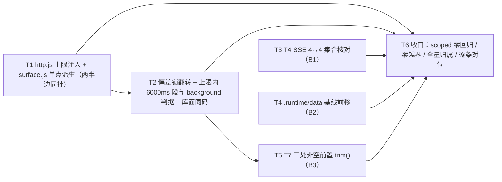

# pr-011-tasks.md — pr-011 内部任务图（收口修复 · block 等待上限可达性 + 三处断言判别力 · F02/F04/F06/F07/F09/F10）

**迭代**: 0025-hub-sdk-and-skill ｜ **阶段**: 5（PR 实现）｜ **PR 文件**: `prs/pr-011-closeout-wait-limit-and-assertion-strength.md`
**worktree 地址**: `/Users/chenchiyuan/projects/agents/.pb-agents/worktrees/0025-hub-sdk-and-skill/.pb-agents/worktrees/0025-pr-011-closeout-wait-limit-and-assertion-strength` ｜ **worktree 分支**: `feat/0025-pr-011-closeout-wait-limit-and-assertion-strength`
**base**: `1d934b7`（= `5dc04c4` + 一次 docs-only 提交；10/10 PR 已合并 ⇒ 本 PR 为末端节点）｜ **任务总数**: **6**（T1~T6）｜ **依赖图**: **无环**（三条源 → 两条继任 → 收口汇点，见 §2）

---

## 0. 范围、文件面与事实锚点

### 0.1 本 PR 文件范围（唯一可写面，5 条 —— **全部是修改既有文件，无新建**）

| 文件 | 动作 | 内容 |
|---|---|---|
| `oamp/sdk/http.js` | **修改** | `RESPONSE_TIMEOUT_MS`（缺省 5000）保持为缺省语义；新增**显式参数** `headerTimeoutMs` 由 `request(spec)` 透传至 `open()`；**两个读取点同源**（响应头定时器 + 错误文案构造）。模块头「三条上限语义不同、不混淆」的声明保持成立 |
| `oamp/sdk/surface.js` | **修改** | `runApi` 在 `flags.mode === 'block'` 时派生并注入 `headerTimeoutMs` = `(waitMs ?? DEFAULT_WAIT_MS) + 余量`（**全仓唯一派生点**；D1 + D8）；`ENTRIES` 40 条与十项字段集不变 |
| `oamp/test/sdk-cli-contract.test.js` | **修改** | ① `T4 [已知偏差 · 归 pr-011 收口修复]` 用例**翻转为规格期望**（`WAIT_TIMEOUT`/`1`/`error` 含 `8000`/耗时窗移到 `--wait` 上限附近），删除失效注释；② 新增 `>5000ms` 段与 `background` 形态判据；③ `T7` 的**三处**非空前置 `length > 0` → `trim().length > 0`（两个只读组的 `stdout` 前置 + 不可达态组的 `stderr` 前置；第三处为主 agent **追认扩范围**，见 D4） |
| `oamp/test/sdk-api.test.js` | **修改** | T4 增一条与 T2/T3 同形的集合核对（运行侧 `kind === 'sse'` ↔ 四条逐字 fixture，4↔4） |
| `oamp/test/sdk-uds.test.js` | **修改** | `.runtime` / `data` 前后一致判据的基线快照由用例体内移到**模块作用域**（任何 `runHub` 调用之前） |

**非目标（明确零 diff）**：`oamp/bin/**`、`oamp/package.json`、`oamp/API.md`、`oamp/llms.txt`、`oamp/src/**`、`oamp/web/**`、`oamp/skill/hub.md`、`oamp/test/helpers/**`、`oamp/test/sdk-surface.test.js`、`oamp/test/api-routes.test.js`、`oamp/test/hygiene.test.js`、`oamp/test/cli.test.js`、`oamp/test/sdk-doctor.test.js`、`oamp/test/sdk-skill.test.js` 以及任何其它未被 §0.1 列入的用例、`docs/**` 内除本文件外的产物。

### 0.2 事实锚点（判据基础；行号为 worktree `1d934b7` 实测 —— 仅用于**定位事实**，断言一律按符号/用例名定位，见 §4 C7）

| # | 事实 | 位置 / 依据 |
|---|---|---|
| **A1** | worktree HEAD = `1d934b7`、分支 `feat/0025-pr-011-closeout-wait-limit-and-assertion-strength`、工作区干净；`1d934b7` 的父提交 = `5dc04c4`（pr-009 合并提交），两者之间**只有一个 docs 文件**（1 file changed, 79 insertions）⇒ 代码面等价；`pr-010` 的合并提交 = `ec7fc84`（早于 `5dc04c4`）⇒ 10/10 PR 产物均在 base 内 | 实测 `git log` / `git diff --stat` |
| **A2** | `oamp/sdk/http.js` 现状：模块头「三条上限语义不同、不混淆（连接建立 2000ms ｜ 响应头 5000ms ｜ `--wait` 显式上限）」`:1-5`；`RESPONSE_TIMEOUT_MS = 5000` `:15`；错误文案构造 `responseTimeout()` **引用模块常量** `:35-36`；`open()` `:69-107`（`settle` + 两道定时器 `:79-95`，响应头定时器 `:92-95`，响应头到达即 `clearTimeout` 两道 `:84-85`）；`request(spec)` `:124-155`（`waited` / `waitTimer` `:132-137`，分类单点 `:151` `throw waited ? waitTimeout(waitMs) : err`）；`stream(spec)` 同经 `open()` `:176+` | `oamp/sdk/http.js` |
| **A3** | **顺序事实（本 PR 的判据根）**：响应头定时器在 `open()`（被 `request()` 同步调用）内部注册，`waitTimer` 在 `open()` **返回之后**才注册 ⇒ 两者延迟相等时响应头定时器**先触发**，此时 `waited === false` ⇒ 按 `REQUEST_TIMEOUT` / 退出码 `3` 收场（A2 的 `:151`）。⇒ 派生预算必须使响应头上限**严格大于** `--wait` 上限，否则 `--wait 1000/600/1500` 会从 `WAIT_TIMEOUT/1` 退化为 `REQUEST_TIMEOUT/3` | `oamp/sdk/http.js:79-95` / `:132-151` 推演 |
| **A4** | **两个读取点**：上限的读取出现在 ① 响应头定时器（`:92-95`）② 错误文案构造（`:35-36`）。只改其一 ⇒ 文案与实际生效上限不符 | `oamp/sdk/http.js` |
| **A5** | `oamp/sdk/surface.js`：`runApi` `:49-77`（选项循环跳过 `--wait` 不进 query/body `:65`；`requestSpec` 六键，`:75` `waitMs: params.waitMs ?? null`）；`calls create` 条目 `:153-170`，`:168` `int('wait')` = **唯一**接受该选项的条目；`kind: 'stream'` 条目 4 条 | `oamp/sdk/surface.js` |
| **A6** | `oamp/sdk/cli.js`：`DEFAULT_WAIT_MS = 1800000` `:18`；`:255` —— **只有**声明了 `wait` flag 的条目被授予 `waitMs`（缺省取 `DEFAULT_WAIT_MS`），其余条目为 `null` | `oamp/sdk/cli.js` |
| **A7** | 库面取值链：`libParams` `:349-353` 取 `options.waitMs ?? null`（`options` = 第二槽）⇒ 库面调用形态 = `createHub().api.calls.create(<flags 对象>, <options 对象>)`。派生只**读**该值，不改取值链 | `oamp/sdk/surface.js:349-353` |
| **A8** | `oamp/test/sdk-cli-contract.test.js`：本地 HTTP 桩 `startStubServer(t, { delayMs = null, status = 200, body = {} })` `:266-276`（`delayMs === null` ⇒ 永不写响应头 = 黑障；`delayMs` 与 `status`/`body` 均已参数化 ⇒ **本 PR 零 helper 改动**即可造 6000ms 响应与 400 响应）；T4 桩组 `:723-725`（黑障 / 300ms / 404）；T4 既有五组（`--wait 1000`、`600`、`1500`、上限内成功、缺省上限）`:720-789`；**偏差锁** `:790-809`；T7 非空前置 `:1072` / `:1077` / `:1086`（第三处 = 不可达态组的 stderr 前置，由主 agent **追认纳入**，见 D4 / §5.2-1；修复后位置 = `:1185`）；三宿主② 库面对照组 `:511-545`（`createHub()` 与进程面比对退出码/结构的既有体例）；全文件内其它 `length > 0` 断言 `:582` / `:644` / `:840` / `:848` / `:862` 均**不在本 PR 范围** | `oamp/test/sdk-cli-contract.test.js` |
| **A9** | `oamp/test/sdk-api.test.js`：`routeSet(hub, selector)` 现算运行侧清单 `:354-357`（读 `hub api docs` 的 `routes[]`）；T2 的 `kind === 'json'` 双向核对 `:551-558`；T3 的 `method === 'POST'` 双向核对 `:669-678`；T4 四条 SSE 用例 `:717` / `:745` / `:766` / `:783`（**当前无任何 SSE 集合断言**）。运行侧 4 条 SSE 签名（实测）= `GET /api/stream`（`web.js:730`）、`GET /api/events`（`:751`）、`GET /api/calls/stream`（`:1159`）、`GET /api/calls/:call_id/stream`（`:1181`） | `oamp/test/sdk-api.test.js`、`oamp/src/web.js` |
| **A10** | `oamp/test/sdk-uds.test.js`：文件头纪律「**不写仓库内 `.runtime/` 与 `data/`**（用例末尾做目录快照比对）」`:5-7`；`OAMP_ROOT` `:34`；`entriesOf(dir)`（不存在 → `null`）`:269-271`（函数声明 ⇒ 可从更早位置前向引用）；`零仓库运行态` 用例 `:883-902` —— 基线 `const before = {...}` 在**用例体内** `:886`（缺陷 DEV-01 的位置）、socket 目录断言 `:894-898`、比较 `:900-901` | `oamp/test/sdk-uds.test.js` |
| **A11** | `oamp/test/sdk-surface.test.js` 是 `ENTRIES` 契约的判据面：`ENTRIES.length === 40` `:396`；`ENTRY_FIELDS` 十项 `:473`；逐条字段集比对 `:479-483` ⇒「40 条 + 字段集不变」由**该文件的 scoped 跑绿**判定（本 PR 不得改该文件） | `oamp/test/sdk-surface.test.js` |
| **A12** | `node --test` 对每个测试文件默认以**独立子进程**隔离运行 ⇒ 模块作用域基线不跨文件共享（若 dev 观察到不同隔离模型，须在回执说明并给出等价保证） | Node test runner 默认行为；T8/T4 的每文件端口段分配与之相容 |
| **A13** | 零依赖约束：`oamp/package.json` 的 `dependencies` = `{}`（实测），`scripts.test` = `node --test test/*.test.js` ⇒ 副本无需装依赖即可跑测试 | 实测 `node -e` 读 `oamp/package.json` |
| **A14** | `ENTRIES` 实测 = **40** 条，其中 `kind === 'stream'` = **4** 条（实测 `import('./oamp/sdk/surface.js')`） | 实测 |
| **A15** | `oamp/src/task.js` 的 `renderList(tasks)` `:113-114`：空态返回 `'（无任务）'`；调用侧 `process.stdout.write(\`${renderList(tasks)}\n\`)` `:197` ⇒ 空态改为 `''` 时 stdout = `"\n"`（1 字节）而**两侧逐字节仍相等** —— 这正是 B3 判别实验要构造的逃逸形态（对照 `verify-pr-009-r2` 偏差 N-01 的实测 `stdoutBytes 1 / stdoutJSON "\n"`） | `oamp/src/task.js`、`clarifications/verify-pr-009-r2-20260915-183218.md` |
| **A16** | 基线数字 `473/473` 的出处 = PR 文件登记的迭代分支 tip `5dc04c4`；本 PR base `1d934b7` 与之**代码面等价**（A1）⇒ 可继承，但**以主 agent 全量实测为准**（§4 C11） | PR 文件「验收标准 · C-零回归」 |

### 0.3 主 agent 已 ratify 的裁决（**写进本图的显式约束，不再重新论证**）

| # | 裁决 | 在本图中的落地 |
|---|---|---|
| **D1** | **按 `mode` 分支派生**（推翻 PR 文件原建议的「条目级派生」）。派生条件 = 本次调用为可阻塞形态 **且 `flags.mode === 'block'`**；`mode` 缺省 / `'background'` / 其它取值 ⇒ **不派生**（沿用 5000ms）。理由（主 agent）：条目级派生会让 `hub api calls create --mode background` 遇挂起服务端时把响应头预算从 5000ms 放大到 1800000ms（CLI 挂 30 分钟），是真实回归。依据：`architecture.md` §5.4 / `prd/F10` 卡「可阻塞条目恒有上限（默认 1800000）；**非可阻塞条目走 5000ms**」；`mode` 已是入口表一等 flag，读它设超时属传输语义 | ①  **显式验收条**：`background` 形态（含 `--mode` 省略）遇挂起服务端仍是 5000ms 级失败、**不随 `--wait` 缺省值放大** → T1 验收 2、T2 验收 5(i)(ii)；② **PR 文件「A-单点派生」括号内「不按 `mode` 取值做语义分支」一句被本裁决取代**（其前半「派生点恰 1 处、不新增第二条上限判定」仍然有效）→ 本图以 T1 验收 6 表达前半、T2 验收 5 表达 D1 |
| **D2** | 文件范围与 5 个已合并 PR 故意重叠：**接受**（那些 PR 已关闭，无并发合并窗口） | T1~T5 直接改 `http.js` / `surface.js` / 三个用例文件；不新增 PR 依赖 |
| **D3** | pr-011 无并发重叠窗口：**接受**，登记为刻意偏离（收口动作） | T6 验收 1 以 diff 面判定，不做跨 PR 端口/文件段协调 |
| **D4** | `status` 组前置一并纳入（同一缺陷类）。**追认扩范围**：`:1086`（不可达态组 stderr 非空前置）同属该缺陷类、同用例内、一行改动 ⇒ 主 agent **已裁决纳入**本 PR 的第三处修复（PR 文件范围③ 原文只列两个只读组，本图按裁决扩写并以本条登记该偏离） | T5 验收 1（三处）+ T5 验收 2（范围边界：除已裁决纳入的第三处外不动）+ §5.2-1（已裁决：纳入） |
| **D5** | 执行期串行约束：`sdk-cli-contract.test.js` 被两类修复共同触及 ⇒ **同一执行者串行**；`http.js` 与 `surface.js` 是一处修复的两个半边 ⇒ **必须同批落地** | §2 的「同文件串行约束」表 + T1 验收 8 + T5 前置依赖 T2 |
| **D6** | 已知缺陷锁的**翻转**是本 PR 的核心交付之一（断言的**形态**判据归 T2，行为判据归 T1） | T2 验收 1、T6 验收 7 |
| **D7** | 不跑仓库级全量（用户口径）；本 PR 为收口 PR 的例外：**全量由主 agent 在合并时跑一次**作为零回归证据 | T6 验收 4（scoped 口径，必须跑）+ T6 验收 5（全量归主 agent，必须明示未跑） |
| **D8** | **库面缺省值（第 2 轮裁决 = 方案 ②）**：`createHub().api.calls.create({ …, mode: 'block' })` **未传 `waitMs`** 时，响应头上限按 `DEFAULT_WAIT_MS`（`1800000`）派生，**不是**落回 5000ms。依据：`architecture.md` §5.4 / `prd/F10` 原文「可阻塞条目恒有上限（默认 1800000）」；且两个消费面（CLI / 库）必须等价（F01）⇒ 派生**闸门**只由 `mode === 'block'` 决定，`waitMs` 只决定**取值**（缺省取 `DEFAULT_WAIT_MS`） | T1 验收 2（闸门 + 取值口径）、T1 验收 4（顺序不变量的空条件分支）、T1 验收 7（常量落点）、T2 验收 6b（库面默认值判据：桩延时必须 > 5000ms）、§5.2-7（常量落点边界） |

---

## 1. 任务列表

### T1: block 等待上限可达 —— `http.js` 上限可按 `spec` 注入 + `surface.js` 单一派生点（**两半边同批**）

- **验收标准**:

  1. **注入面正确且不混淆三条上限**（PR 文件范围①；`architecture.md` §5.4 要点）：`oamp/sdk/http.js` 的 `RESPONSE_TIMEOUT_MS = 5000`（A2 `:15`）保持「非阻塞条目的响应上限」这一**缺省值**语义；新增**显式可选参数** `headerTimeoutMs`，经 `request(spec)` 透传至 `open()`；未给该参数时行为与现状**逐字一致**（5000ms / `REQUEST_TIMEOUT`）。模块头注释（A2 `:1-5`）「三条上限语义不同、不混淆」的表述**保持成立**（新增的是显式参数，不是把两个上限合并成一个）——不得改写成「两条上限」或删掉其中一条。
  2. **派生闸门与取值口径（D1 + D8 的显式验收条）**：`waitMs → headerTimeoutMs` 的派生**只落在** `oamp/sdk/surface.js` 的 `runApi`（A5 `:49-77`）；判据面（可机械判）：
     - **闸门**（是否派生）= `flags.mode === 'block'` —— **单一真值条件，不再附加 `waitMs !== null`**（D8）；
     - **取值**（派生多少）= `(waitMs ?? DEFAULT_WAIT_MS) + 余量`：`waitMs` 不为 `null` 时用它；为 `null`（库面不传第二槽 `options.waitMs`）时取 `DEFAULT_WAIT_MS = 1800000`（A6）—— **不得**落回 5000ms；
     - `--mode block`（含不给 `--wait`）与库面 `{ mode: 'block' }`（含不传 `waitMs`）⇒ **派生**，且取值 ≥ `DEFAULT_WAIT_MS`；
     - `mode` 缺省（flag 未出现）/ `--mode background` / 其它取值 ⇒ **不派生**（沿用 5000ms），**不随 `--wait` 缺省值放大**；
     - `mode` 的判定**不得**下沉到 `oamp/sdk/http.js`（传输层不判业务参数）；`oamp/sdk/cli.js` **零改动**（A6 的授予逻辑不变）。
     > 说明：`mode` 缺省 = 服务端 `background`（`API.md:645`）⇒「非 `block`」这一分支与「显式 background」落在**同一实现分支**，判据只写 `flags.mode === 'block'` 一个真值条件（不做大小写/别名归一）。
  3. **两个读取点同源**（A4；PR 文件范围①）：响应头定时器（A2 `:92-95`）与错误文案构造（A2 `:35-36`）都必须使用**本次生效值** ⇒ 黑障桩下 `error` 内的毫秒数必须等于**实际**终止时刻所依据的上限（`--mode block --wait 8000` ⇒ 文案含 `8000` 而非 `5000`；显式 8000 的响应头上限不得再出现在文案里）。`error` 仍含既有文案形态 `等待响应超时（…ms；<地址>）`（`REQUEST_TIMEOUT` 类）与 `等待超时（…ms）：调用仍在进行`（`WAIT_TIMEOUT` 类）的区分，**两类文案不得互换**。
  4. **顺序保证（A3；PR 文件范围②）**：派生预算必须使 `--wait` 上限**先于**响应头上限触发 —— 即 `headerTimeoutMs` **严格大于** `waitMs`（余量算法不指定，见 §5.1-2；不得大到把 `--wait 8000` 的耗时推出 `(7600, 9000)`ms 窗）。可判形式：`--mode block --wait 1000` / `600` / `1500` 对黑障桩仍全部落 `WAIT_TIMEOUT` / 退出码 `1`（**不得**退化为 `REQUEST_TIMEOUT`/`3`），且每次恰 1 次请求（本地中止、不重发、不换端口）。（D8 的空条件分支：库面不传 `waitMs` ⇒ `waitMs === null` ⇒ `http.js` 不建 `waitTimer`（A2）⇒ 该分支上顺序不变量**空成立**，唯一约束是 D8 的响应头预算，不构成反例。）
  5. **非 `--wait` 条目与订阅条目上限不变**（PR 验收「A-非 `--wait` 条目上限不变」）：不带 `wait` 声明的层 A 条目（如 `hub api docs`）对同一黑障桩仍 ⇒ `REQUEST_TIMEOUT` / 退出码 `3`、耗时 ~5000ms（落 `(4900, 5400)`ms）；层 A 的 4 条 `kind: 'stream'` 条目（A5/A14）`waitMs` 恒为 `null`（A6）⇒ 永不派生、响应头仍 5000ms；SSE 长流不被误判（响应头到达即清两道定时器，A2 `:84-85`）——既有 T4/T6 相关断言保持通过。
  6. **单点派生、不新增第二条上限判定**（PR 验收「A-单点派生」前半，D1 后仍有效）：全仓 `headerTimeoutMs` 的**构造/赋值点恰 1 处**（`surface.js` 的 `runApi`）；`http.js` 只做「取缺省值 / 取本次生效值」的**读取**（形如解构缺省），不得出现第二个「该用多少」的分支；超时**归类**仍只由 `http.js:151` 的 `waited` 决定，`oamp/sdk/errors.js` 的分类表**零改动**（不新增 `code`、不改退出码归属）。
  7. **`ENTRIES` 与库面取值链不变**（PR 验收「C-零越界」相关）：`ENTRIES` 仍 **40 条**、条目字段集仍十项（A11/A14）；`libParams`（A7 `:349-353`）取值链不变、不新增选项、不改库面调用形态。D8 的缺省值（`1800000`）由 `surface.js` 自持 —— dev 现行实现命名为 `BLOCK_WAIT_DEFAULT_MS`，派生式为 `flags.mode === 'block' ? (waitMs ?? BLOCK_WAIT_DEFAULT_MS) + HEADER_TIMEOUT_MARGIN_MS : undefined`（`surface.js:91-92`），与 D8 一致。`cli.js` 不在本 PR 文件范围内（§0.1 / T6 验收 1）⇒ **不得**为共享该常量而改 `cli.js`；由此产生的两处同值字面量及其守卫见 §5.2-7。
  8. **两半边同批落地**（D5；PR 文件「逐文件说明」）：`oamp/sdk/http.js` 与 `oamp/sdk/surface.js` 在**同一任务的同一次落地**内完成（只改一个 ⇒ 要么上限仍先行、要么参数无人派生）；不得拆成两个任务、不得留下半套中间态。
  9. **落地证明**：T2 落地后运行 `cd oamp && node --test --test-name-pattern='T4' test/sdk-cli-contract.test.js` ⇒ 全绿，且 `--mode block --wait 8000` 形态的耗时落在 `(7600, 9000)`ms（不得再落 ~5000ms）；同时 `node --test test/sdk-cli-contract.test.js` 整文件全绿、零 `skip`/`todo`。

- **前置依赖**: 无
- **优先级**: P0
- **追溯**: PR 文件「文件范围」①②、「验收标准」A-主判据 / A-上限内成功 / A-缺省上限可达 / A-小于 5000ms 的原有路径不回归 / A-非 `--wait` 条目上限不变 / A-单点派生、两宿主同享（前半）；`architecture.md:252-258`（§3.3 P-1）、`:480-489`（§5.4 四类归类表 + 「三条上限语义不同、不混淆」要点 + 「可阻塞条目恒有上限（默认 1800000）／非可阻塞条目走 5000ms」）；`prd/F10-wait-timeout-limit.md:16-24`（验收 1/2/3/5）、`:36-44`（架构落定）；`prd/F07-exit-code-semantics.md`（`WAIT_TIMEOUT`/`1` 与 `REQUEST_TIMEOUT`/`3` 的分野）；`oamp/API.md:645`（`mode` 缺省 `background`）、`:1404`（`mode: "block"` 响应挂起至终态）；锚点 A2 A3 A4 A5 A6 A7 A11 A14 A16 + **D1 D5 D8**

### T2: 偏差锁翻转 + `>5000ms` 段与 background 形态判据 + 库面同码与缺省值（`sdk-cli-contract.test.js`）

- **验收标准**:

  1. **偏差锁翻转**（PR 验收「A-偏差锁已翻转」；D6）：`oamp/test/sdk-cli-contract.test.js` 的 `T4 [已知偏差 · 归 pr-011 收口修复]`（A8 `:790-809`）翻转为**规格期望**：
     - 用例名不再含 `[已知偏差 · 归 pr-011 收口修复]`（改为表达规格期望的形态，例如「`--wait 8000` 时 `--wait` 上限先到：`WAIT_TIMEOUT`/1、耗时 ≈ 上限」）；
     - 断言集合 = `code === 'WAIT_TIMEOUT'` + `exit_code === 1` + `error` 含 `8000` + `stdout === ''` + 黑障桩 `requests === 1`；
     - 耗时窗从 `(4900, 5400)` 移到 `--wait` 上限附近 ⇒ 落 `(7600, 9000)`ms；
     - 删除用例内「**本 PR 不改 `oamp/sdk/**`**」「当前行为 = …（pr-011 修复后应为 …）」「修复后本断言应改为…」一类**已失效**的注释与偏差锁措辞，改写为「规格期望 + 本 PR 的修复点（`http.js` 的响应头上限按 `spec` 注入 / `surface.js` 的 `runApi` 单点派生且受 `mode === 'block'` 支配）」。
     - 全仓 `oamp/` 内 `grep -rn '已知偏差 · 归 pr-011'` **零命中**。
  2. **既有 T4 五组零回归**（PR 验收「A-小于 5000ms 的原有路径不回归」的现成判据）：A8 `:720-789` 的 `--wait 1000` / `--wait 600` / `--wait 1500` / 上限内成功（300ms 桩）/ 缺省上限（300ms 桩）五组断言**全部保持通过、期望值不改**（尤其 `WAIT_TIMEOUT`/`1`、耗时单调（600 先于 1500 返回）、每次恰 1 次请求）。
  3. **`>5000ms` 段上限内成功**（PR 验收「A-上限内成功」）：新增 fixture `startStubServer(t, { delayMs: 6000, status: 200, body: <`{"calls":[…]}` 形态> })`（A8：既有桩已参数化 ⇒ **零 helper 改动**）；`--mode block --wait 8000`（`--mode block` 为 [model_inferred]，见 §5.1-1）⇒ 退出码 `0`、stderr === `''`、stdout = 桩响应体**原样**（`JSON.parse(stdout)` 与桩 `body` 深等 —— 不加信封、不改字段名、不裁剪）、耗时落 `(6000, 7000)`ms（**不得**再落 ~5042ms）。
  4. **缺省上限可达（有界观测，不实测 30 分钟）**（PR 验收「A-缺省上限可达」）：同一 6000ms 桩 + `--mode block` + **不给** `--wait` ⇒ 退出码 `0` + 响应体原样 + 耗时 ~6000ms 量级（同一窗 `(6000, 7000)`ms）；用例内以注释登记「缺省 `1800000` ms 的完全可达性**不可实测**，由 `oamp/sdk/cli.js:18` 的 `DEFAULT_WAIT_MS` 常量面（A6）+ 本组『6000ms > 5000ms 仍走等待上限』共同闭合」（沿用既有 T4 用例的登记口径）。
  5. **background 形态不放大（D1 的判据面，三种形态逐条断言）**：以下三形态对挂起服务端（黑障桩）均须 ⇒ `code === 'REQUEST_TIMEOUT'` + 退出码 `3` + `error` 含 `5000` + 耗时落 `(4900, 5400)`ms + 桩 `requests === 1`：
     | # | 形态 | 命令要点 | 判别什么 |
     |---|---|---|---|
     | (i) | 显式 background + 显式 wait | `--mode background --wait 8000` | 「按 `mode` 分支」而非「按 `--wait` 是否显式给出分支」（后者会在此放大到 ~8000ms） |
     | (ii) | `mode` 缺省（flag 不出现）+ 不给 `--wait` | `… --chat-id c --agent a --task t --port 
`（即 0021 事故的最常见形态） | `waitMs` 被授予 `1800000`（A6）但**不得**放大响应头预算 |
     | (iii) | 不带 `wait` 声明的条目 | `hub api docs --port 
` | 非可阻塞条目的 5000ms 缺省未被放大 |
     **可选加固**（判别力与 (ii) 等价，同一实现分支）：`--mode background` 且不给 `--wait`。
  6. **单点派生的行为面：两宿主同码**（PR 验收「A-单点派生、两宿主同享」后半）：库面 `createHub({ port: <黑障桩端口> }).api.calls.create({ 'chat-id': 'c', agent: 'a', task: 't', mode: 'block' }, { waitMs: 8000 })`（A7 的两槽形态；**不是**把 `waitMs` 混进 flags 对象 —— 那会变成请求体字段）与 CLI 面对**同一黑障桩**得到**同一 `code`**（`WAIT_TIMEOUT`）与**同一退出码**（`1`），耗时同样落在 `--wait` 上限附近；落点限于本文件（与 A8 `:511-545` 的 `createHub()` 对照体例同形即可），**不得**改 `sdk-surface.test.js`、**不得** `Object.assign(process.env, …)`（若涉及库面 env，沿用本文件既有的「组内设、用后还原」口径）。
  6b. **库面缺省值不再是 5000ms 死区（D8 的判据面，桩延时必须 > 5000ms 才判得出）**：`createHub({ port: <6000ms 延迟桩端口> }).api.calls.create({ 'chat-id': 'c', agent: 'a', task: 't', mode: 'block' })` —— **只传 flags 槽、不传第二槽 `options`**（即不传 `waitMs`）⇒ 正常拿到响应体（库面不抛错、`body` 与桩 `body` 深等），耗时 ~6000ms 量级。**判别力**：复用验收 3/4 的**同一个 6000ms 桩**；若库面按 5000ms 落回，此处必在 ~5000ms 以 `REQUEST_TIMEOUT`（`exitCode === 3`）失败 ⇒ 本断言即「库面与 CLI 面等价（F01）」的可判形态；对照侧 = CLI 面验收 4（同桩、同形态，不给 `--wait`）。
  7. **上游业务错误优先于本地超时**（PR 验收「A-上游业务错误优先于本地超时」）：既有 `notFound` 桩（A8 `:725`，404 / `NOT_FOUND`）在 `--mode block --wait 8000` 下 ⇒ `code === 'NOT_FOUND'` + 退出码 `1` + `http_status` = 上游真实状态码 + stdout 无残片；**再补一例上游 400**（`startStubServer(t, { delayMs: 0, status: 400, body: { error: …, code: 'INVALID_PARAM' } })`，A8）同形 ⇒ 归类不变（放宽响应头上限**不改变**「上游错误即时归类」的次序）。两例的耗时均应 **<< 4900ms**（verifier 实测两例 43~45ms ⇒ 上游错误即时归类、未被本地超时抢先）。
  8. **scoped 跑绿 + 失败可定位**：`cd oamp && node --test --test-name-pattern='T4' test/sdk-cli-contract.test.js` 与整文件 `node --test test/sdk-cli-contract.test.js` 均全绿、零 `skip`/`todo`；失败消息点名「命令 + 期望 + 实际（含 `elapsedMs` 与 stderr）」，不得笼统 `assert.ok(false)`；**不**触发仓库级全量（§4 C11）。
  9. **零越界**：本任务只改 `oamp/test/sdk-cli-contract.test.js`；`oamp/test/helpers/**` 零 diff（A8 的桩已够用）、`oamp/sdk/**` 归 T1、其它用例文件零 diff；除 T5 已裁决纳入的第三处（`:1086` 的 stderr 前置，见 D4）外，其余 `length > 0` 断言不动（§5.2-1）。

- **前置依赖**: **T1**（翻转后的期望值只有 T1 落地才为绿；本边是硬边，不是偏好序）
- **优先级**: P0
- **追溯**: PR 文件「文件范围」③、「验收标准」A-主判据 / A-上限内成功 / A-缺省上限可达 / A-上游业务错误优先于本地超时 / A-单点派生（后半）/ A-偏差锁已翻转；`prd/F10-wait-timeout-limit.md:16-24`、`:36-44`；`architecture.md:480-489`（§5.4 `3` 类② / `1` 类② 归类与文案分野）、`prd/F07-exit-code-semantics.md`；`clarifications/verify-pr-003-20260915-165755.md`（偏差 #1 的复现表与归因）、`verify-pr-009-r2-20260915-183218.md`（N-06：旧窗上界余量仅 ~356ms）、`verify-pr-009-20260915-181653.md`（翻转点登记原文）；`oamp/API.md:645` / `:1404`；锚点 A2 A3 A6 A7 A8 A13 + **D1 D6 D8**

### T3: B1 —— T4 SSE 4↔4 集合核对（`sdk-api.test.js`）

- **验收标准**:

  1. **集合核对有牙齿**（PR 验收「B1-SSE 集合有牙齿」；偏差 D2）：在 `oamp/test/sdk-api.test.js` 的 T4 段（A9 `:717` / `:745` / `:766` / `:783`）增一条与 T2（`:551-558`）/ T3（`:669-678`）**同形**的双向核对：
     - 运行侧（**现算**）：`routeSet(fx.hub, (route) => route.method === 'GET' && route.kind === 'sse')`（A9 `:354-357`）；
     - 声明侧（**逐字 fixture**，禁止从运行侧反推，否则断言自我满足）：`GET /api/stream`、`GET /api/events`、`GET /api/calls/stream`、`GET /api/calls/:call_id/stream`（A9 实测四条）；
     - 断言四项：`missing === []`、`extra === []`、`declared` 签名两两不同、`declared.length === runtime.length === 4`（`4↔4` 双射）；失败消息点名缺项/多出项（沿用 T2/T3 的消息形态）。
  2. **与 T4 四条用例一一对位**（F02 验收 4 / F06）：4 条 fixture 与四条用例对应并在 `t.diagnostic` 输出「用例号 ↔ `hub api …` 命令 ↔ `METHOD PATH` 签名」：`api stream chat <chat_id>` ↔ `GET /api/stream`；`api stream events` ↔ `GET /api/events`；`api stream calls --chat-id <id>` ↔ `GET /api/calls/stream`；`api stream call <call_id>` ↔ `GET /api/calls/:call_id/stream`。
  3. **判别实验（必须执行，PR 验收 B1 的判别实验）**：在**临时副本**内于运行侧多注册一条 SSE 路由（`oamp/src/web.js` 的 route 表加一条 `kind: 'sse'` 的 GET 条目）⇒ 本断言**必红**，且失败消息点名该多出项（`missing` 非空）。**必须记录**「改动前该文件对 SSE 零集合断言 ⇒ 第 5 条 SSE 不会红」的对照（当前态）与「改动后必红」的实测输出摘要。
  4. **零残留**：实验仅在副本内进行（`mktemp -d` + `cp -a <worktree>`；A13 ⇒ 副本免装依赖）；PR 工作区 `git -C <worktree> status --porcelain` 仅剩本 PR 的 5 个受改文件、无未跟踪残留。
  5. **scoped 跑绿 + 零越界**：`cd oamp && node --test test/sdk-api.test.js` 全绿（本断言与之共存）；只**追加**本集合核对，T4 四条既有用例的断言与 `routeSet` 原语不改；`oamp/src/**`、`oamp/test/helpers/**`、`test/sdk-api.test.js` 以外任何文件零 diff。

- **前置依赖**: 无（与 T1 / T2 / T4 无引用边：本任务的判据面完全在 `sdk-api.test.js` + `api docs` 运行侧）
- **优先级**: P1
- **追溯**: PR 文件「文件范围」④、「验收标准」B1；`prd/F02-web-api-surface-coverage.md`（验收 2/4）、`prd/F06-subscription-ndjson-stream.md`；`architecture.md` §5.1 层 A 表（4 条订阅条目）、§5.3（订阅 NDJSON）、§10 T2/T3/T4 行；`clarifications/verify-pr-007-20260915-181638.md`（偏差 **D2**：只在 T2/T3 做集合比对，无 `kind==='sse'` 的 4↔4 核对）；锚点 A9 A13

### T4: B2 —— `.runtime` / `data` 基线前移至模块作用域（`sdk-uds.test.js`）

- **验收标准**:

  1. **基线位置（无观测盲区）**（PR 验收「B2-运行态判据无观测盲区」；偏差 DEV-01）：`oamp/test/sdk-uds.test.js` 的 `零仓库运行态`（A10 `:883-902`）前后一致判据的**基线快照**从用例体内（`:886`）移到**模块作用域**，并在**任何 `runHub()` 调用之前**采集；落点取文件头常量区（`OAMP_ROOT` `:34` 之后的模块级常量；`entriesOf`（`:269`）是函数声明 ⇒ 前向引用成立）；用例内改为读取该模块级常量，`after` 仍由用例体内现算（`:900`），比较仍为 `deepEqual`（`:901`），失败消息保持两侧快照 + 绝对路径可读（既有 `fmt` 形态）。
  2. **缺陷语义被闭合**（可判形式）：本文件内**任意更早的 hub 调用**向 `<包根>/.runtime` 或 `<包根>/data` 写入 ⇒ 该用例**必红**（基线不再被「后来的写入」重置）；基线在**文件加载时**采集，先于本文件内任何调用与任何用例执行；A12（每文件独立子进程）⇒ 基线不跨测试文件共享（若 dev 观察到不同隔离模型，须在回执说明并给出等价保证）。
  3. **判别实验（必须执行，PR 验收 B2 的判别实验）**：在**临时副本**内给 `oamp/bin/hub.js` 注入一次 `<包根>/.runtime/state.json` 写入（`fs.mkdirSync` + `fs.writeFileSync`）⇒ `node --test test/sdk-uds.test.js`（**全文件跑**）**必红**，且失败消息显示 `after` 比模块基线多出 `state.json`。**必须记录对照**：修复前同一注入「全文件跑为绿（逃逸）」vs「`--test-name-pattern='零仓库运行态'` 隔离跑才红」（DEV-01 / 变异 M12 的实测），以及修复后「全文件跑必红」的实测输出摘要 ⇒ 回执中明示「修复后『全文件跑为绿』不可再出现」。
  4. **零残留 + 零越界**：实验仅在副本内进行（同 T3 验收 4）；PR 工作区仅剩 5 个受改文件；本任务只改 `oamp/test/sdk-uds.test.js`，不改 `entriesOf` 的语义（`:269-271`）、不改 socket 目录断言（`:894-898`）、不改 `oamp/bin/**`。
  5. **scoped 跑绿（两种口径各一次）**：`cd oamp && node --test --test-name-pattern='零仓库运行态' test/sdk-uds.test.js`（隔离跑）与 `node --test test/sdk-uds.test.js`（全文件跑）均全绿、零 `skip`/`todo`。
  6. **无新增 flaky**：本改动不引入任何等待/时序依赖（基线是文件加载期的一次只读快照）；不新增 `sleep`、不依赖用例执行顺序。

- **前置依赖**: 无（与 T1 / T2 / T3 无引用边：判据面独立在 `sdk-uds.test.js`；A12 的每文件隔离使模块级基线与 T1/T2/T3 的改动无耦合）
- **优先级**: P1
- **追溯**: PR 文件「文件范围」⑤、「验收标准」B2；`prd/F09-stateless-cli.md`（零本地状态判据）、`architecture.md` §10（测试基建约束）；`clarifications/verify-pr-008-20260915-181702.md`（偏差 **DEV-01**（唯一确证的实质偏差）+ 变异 M12 对照：全文件跑 19 pass / 0 fail ⇒ 逃逸 vs 隔离跑 ⇒ 检出）；锚点 A10 A12 A13

### T5: B3 —— T7 三处非空前置 `trim()`（`sdk-cli-contract.test.js`）

- **验收标准**:

  1. **判据强度**（PR 验收「B3-载荷丢失可捕获」；偏差 N-01）：`oamp/test/sdk-cli-contract.test.js` 的 T7 **三处**非空前置改为 trim 后判非空（第三处为 **D4 的追认扩范围**）：
     - `:1072` `statusRead.viaHub.stdout.length > 0` → `statusRead.viaHub.stdout.trim().length > 0`；
     - `:1077` `taskList.viaHub.stdout.length > 0` → `taskList.viaHub.stdout.trim().length > 0`；
     - `:1086`（dev 落地后的位置 `:1185`）`unreachable.viaHub.stderr.length > 0` → `unreachable.viaHub.stderr.trim().length > 0` —— 不可达态组的 stderr 非空前置，与上述两处**同属「零判别力前置」缺陷类**、同在 T7 用例内、同为一行改动；主 agent **已裁决纳入**（D4）。
     ⇒ `"\n"` 不再满足该前置（A15：空态改为 `''` 时 stdout 恰为 `"\n"`，而两侧逐字节比较仍相等 ⇒ 旧前置漏判）。注释同步更新为「非空（防『空 vs 空』的虚假相等）」的**trim 口径**。
  2. **范围边界**：`oamp/test/sdk-cli-contract.test.js` 内**除上述已裁决纳入的第三处外**，其余 `length > 0` 断言（A8 `:582` / `:644` / `:840` / `:848` / `:862`）**保持原状**（`:1086` 的纳入决定见 D4 / §5.2-1）；不改 T7 的逐字节比较原语与 `compare()` 的结构。
  3. **判别实验（必须执行，PR 验收 B3 的判别实验）**：在**临时副本**内把 `oamp/src/task.js` 的 `renderList` 空态 `'（无任务）'`（A15 `:114`）改为 `''` ⇒ T7 用例**必红**（trim 后为空）；**必须记录对照**：改动前同一注入下 `stdout.length > 0` 为**绿**（N-01 的实测 `stdoutBytes 1 / stdoutJSON "\n"`）与改动后的**红**输出摘要。
  4. **零残留 + 零越界**：实验仅在副本内进行（同 T3 验收 4）；PR 工作区仅剩 5 个受改文件；本任务只改 `oamp/test/sdk-cli-contract.test.js` 的上述**三处**（该文件另一处修复归 T2 ⇒ 串行）。
  5. **scoped 跑绿**：`cd oamp && node --test --test-name-pattern='T7' test/sdk-cli-contract.test.js` 与整文件 `node --test test/sdk-cli-contract.test.js` 均全绿。

- **前置依赖**: **T2**（同文件串行写入 —— 两类修复共同触及 `sdk-cli-contract.test.js`，D5 要求同一执行者**串行**处理；本边即串行序，不得并行写入该文件）
- **优先级**: P1
- **追溯**: PR 文件「文件范围」③（T7 部分）、「验收标准」B3；`prd/F04-oamp-cli-command-coverage.md`（层 C 逐字节面）；`architecture.md` §10（测试基建约束）、§5.4（层 C 透传）；`clarifications/verify-pr-009-r2-20260915-183218.md`（偏差 **N-01**：`stdout.length > 0` 被 `"\n"` 满足；注入 J4 ⇒ T7 全绿，实测 `stdoutBytes 1 / stdoutJSON "\n"`）；锚点 A8 A15 + **D4 D5**

### T6: 收口 —— scoped 零回归 / 零越界 / 全量归属 / PR 验收逐条对位

- **验收标准**:

  1. **改动面恰 5 条**（PR 文件「文件范围」）：`git -C <worktree> diff --name-status 1d934b7` ⇒ 恰好 `M oamp/sdk/http.js`、`M oamp/sdk/surface.js`、`M oamp/test/sdk-cli-contract.test.js`、`M oamp/test/sdk-api.test.js`、`M oamp/test/sdk-uds.test.js`；**零新增文件、零删除文件**；`git -C <worktree> status --porcelain` 无未跟踪文件（T3/T4/T5 的副本实验零残留）。
  2. **零新增依赖 / 零越界**（PR 验收「C-零新增依赖 / 零越界」）：`oamp/package.json` **零 diff** 且 `dependencies` 仍为 `{}`（A13）；`oamp/src/**`、`oamp/bin/**`、`oamp/API.md`、`oamp/llms.txt`、`oamp/web/**`、`oamp/skill/hub.md`、`oamp/test/helpers/**`、以及 §0.1 未列入的任何 `oamp/test/*.test.js` 零 diff；**不新增任何路由**（`oamp/src/web.js` 零 diff 即证）。
  3. **`ENTRIES` 契约不变**（PR 验收「C-零回归」的字段集条）：`oamp/test/sdk-surface.test.js` 的 `ENTRIES.length === 40`（A11 `:396`）+ `ENTRY_FIELDS` 十项逐条比对（`:473` / `:479-483`）读的正是 `surface.js` 导出的 `ENTRIES` ⇒ scoped 跑 `node --test test/sdk-surface.test.js` 全绿即判「40 条 + 字段集不变」；另以 `node -e "import('./oamp/sdk/surface.js').then(m => console.log(m.ENTRIES.length))"` 复核 = `40`（A14）。
  4. **scoped 零回归（本 PR 的证据面，必须跑）**（PR 验收「C-零回归」）：在 `<worktree>/oamp` 下依次跑并记录每条的 `pass/fail` 摘要：
     `node --test test/sdk-cli-contract.test.js` / `node --test test/sdk-api.test.js` / `node --test test/sdk-uds.test.js` / `node --test test/sdk-surface.test.js`（含 `ENTRY_FIELDS` 契约）/ `node --test test/api-routes.test.js`（两把漂移锁）/ `node --test test/hygiene.test.js` / `node --test test/cli.test.js` ⇒ 全部 `0 fail`。三个测试文件的端口段互不重叠（pr-007 `51000-51999` / pr-008 `52000-52999` / pr-009 `53000-53999`）⇒ 逐文件跑无需并发协调。
  5. **全量归属（必须明示）**（用户口径 + 本 PR 例外，D7）：**不在本 PR 执行** `node --test test/*.test.js`；回执中明示「仓库级全量**未跑**，已按口径归属主 agent 在合并时跑一次作为零回归证据」。基线数字 `473/473` 的出处 = PR 文件登记的 `5dc04c4`，本 PR base `1d934b7` 与之代码面等价（A1/A16）⇒ 可继承引用；若主 agent 的全量实测出现不同数字，**以主 agent 实测为准**，本 PR 不自行声称全量结果。
  6. **13 条 PR 验收逐条对位**（§3 表）：每条有**可复现证据**（命令 + 输出摘要），不得以「看起来没问题」结案；B1/B2/B3 三条的**判别实验证据**（副本注入 ⇒ 必红的失败输出摘要 + 改动前的绿/逃逸对照）必须落在回执内。
  7. **失效标记清零**（PR 验收「A-偏差锁已翻转」的收口面；D6）：`oamp/` 内 `grep -rn '已知偏差 · 归 pr-011'` **零命中**（旧偏差锁用例名与旧注释随翻转消失）；翻转后的用例状态为**正常通过**（不是 `skip` / `todo` / 条件跳过）。
  8. **失败可定位**：任一 red 项须给出「命令 + 期望 + 实际 + 首个差异处（含耗时 / stderr / 两侧快照）」；不得静默跳过、不得以 `skip` 掩盖。

- **前置依赖**: **T1、T2、T3、T4、T5**（收口判定以五者的落地齐备为前提）
- **优先级**: P0
- **追溯**: PR 文件「验收标准」C-零回归 / C-零新增依赖 / C-零越界 与「文件范围」「参考资料」；`prd/F07-exit-code-semantics.md`、`prd/F10-wait-timeout-limit.md`、`prd/F09-stateless-cli.md`；`architecture.md` §8 C7（既有测试影响：`api-routes.test.js` 两把锁、`hygiene.test.js` 扫描面、`cli.test.js` 分发表）、§9.1、§10 T2/T3/T4；`oamp/test/sdk-surface.test.js:396` / `:473` / `:479-483`（ENTRIES 契约）、`oamp/test/api-routes.test.js`（两把漂移锁）；锚点 A1 A11 A13 A14 A16 + **D2 D3 D7**

---

## 2. 依赖图（无环）

拓扑序（合法执行序）：`(T1 → T2 → T5) ‖ T3 ‖ T4 → T6`

- **最长依赖链**：`T1 → T2 → T5 → T6`（3 跳）。次长：`T1 → T2 → T6`、`T1 → T6`、`T3 → T6`、`T4 → T6`（均 1~2 跳）。
- **关键路径任务**：**T1**（唯一的功能缺陷修复点，且是 T2/T5 的唯一上游）与 **T6**（收口门）；T2 次之（偏差锁翻转 + 三态判据的载体）。
- **可并行面**：`T3` 与 `T4` 与 `T1` 之间**无引用边**（判据面分别落在 `sdk-api.test.js` 与 `sdk-uds.test.js`，与 `sdk/**` 改动无耦合），可与 T1 并行落地；`T1 → T2 → T5` 三段必须串行（下表的文件约束 + 期望值依赖）。
- **无环**：边方向严格单调（源 `{T1, T3, T4}` → `T2` → `T5` → 汇点 `T6`），无回边、无自环。真实依赖只有三类：① **期望值依赖**（T2 的翻转断言只有 T1 落地才可能为绿）；② **同文件串行**（T2 与 T5 都写 `sdk-cli-contract.test.js`）；③ **收口依赖**（T6 以 T1~T5 齐备为前提）。**不存在**「顺序偏好冒充依赖」：T3 / T4 未被串到 T1 之后。

**同文件串行约束（必须）**

| 文件 | 写入任务 | 串行要求 |
|---|---|---|
| `oamp/sdk/http.js` | **T1** | 与 `surface.js` 是**一处修复的两个半边** ⇒ 必须同一任务内**同批**落地（D5） |
| `oamp/sdk/surface.js` | **T1** | 同上；本文件另承载唯一派生点 |
| `oamp/test/sdk-cli-contract.test.js` | **T2 → T5** | 两类修复（偏差锁翻转 / T7 前置）共同触及 ⇒ **同一执行者按 T2 → T5 串行**，**不得并行写入**；每个任务结束跑一次 scoped 用例 |
| `oamp/test/sdk-api.test.js` | **T3** | 只**追加** T4 段的集合核对；不改既有断言与 `routeSet` |
| `oamp/test/sdk-uds.test.js` | **T4** | 只改基线位置与用例内引用；不改 `entriesOf` 语义与 socket 目录断言 |
| `oamp/src/**`、`oamp/bin/**`、`oamp/package.json`、`oamp/API.md`、`oamp/llms.txt`、`oamp/web/**`、`oamp/skill/hub.md`、`oamp/test/helpers/**`、其它用例文件 | **无**（零 diff） | 只读；T3/T4/T5 的判别实验一律在**临时副本**内进行，PR 工作区零残留 |

---

## 3. 与 pr-011 验收标准逐条对位表

| PR 验收 # | 验收摘要 | 承接任务 | 对位说明 / 判据面 |
|---|---|---|---|
| A-主判据（block 上限可达） | 黑障桩 + `--mode block --wait 8000` ⇒ `WAIT_TIMEOUT`/`1`/`error` 含 `8000`、stdout 空、耗时 `(7600, 9000)`ms、`requests === 1` | **T1**（实现）+ **T2** 验收 1（判据） | T2 的翻转用例即该条的自动化形态；T1 验收 3 覆盖两处读取点同源 |
| A-上限内成功（>5000ms 段） | 6000ms 桩 + `--wait 8000` ⇒ 退出码 `0` + 响应体原样、耗时 `(6000, 7000)`ms | **T1** + **T2** 验收 3 | `--mode block` 为 [model_inferred]（§5.1-1） |
| A-缺省上限可达（有界观测） | 6000ms 桩 + 不给 `--wait` ⇒ 退出码 `0` + 响应体原样、耗时 ~6000ms | **T1** + **T2** 验收 4 | 缺省 `1800000` 由常量面 + 本组界内观测共同闭合（登记不可实测） |
| A-小于 5000ms 的原有路径不回归 | `--wait 1000` / `600` / `1500` 仍 `WAIT_TIMEOUT`/`1`、耗时单调 | **T1** 验收 4（顺序保证）+ **T2** 验收 2（既有五组零回归） | A3 推演：派生预算须严格大于 `waitMs` |
| A-非 `--wait` 条目上限不变 | `hub api docs` 对黑障桩 ⇒ `REQUEST_TIMEOUT`/`3`、~5000ms、`error` 含 `5000` | **T1** 验收 5 + **T2** 验收 5(iii) | 5000ms 缺省未被放大 |
| —（D1 的显式验收条） | `background` 形态（含 `--mode` 省略）遇挂起服务端仍是 5000ms 级失败、**不随 `--wait` 缺省值放大** | **T1** 验收 2 + **T2** 验收 5(i)(ii) | 主 agent 裁决 D1 的判据面；(i) 判别「按 `mode` 分支」而非「按 `--wait` 显式性分支」 |
| —（D8 的显式验收条） | 库面 `{ mode: 'block' }` **不传 `waitMs`** ⇒ 按 `DEFAULT_WAIT_MS`（`1800000`）派生，与 CLI 面等价（F01） | **T1** 验收 2/7 + **T2** 验收 6b | 桩延时**必须 > 5000ms**（用 6000ms 桩）；库面落回 5000ms ⇒ 该断言必红 |
| A-上游业务错误优先于本地超时 | `--wait` 上限内收到 404 / 400 ⇒ `NOT_FOUND`/`INVALID_PARAM` + `1` + `http_status` 真实 + stdout 无残片 | **T2** 验收 7 | 放宽响应头上限不改变「上游错误即时归类」的次序 |
| A-单点派生、两宿主同享 | 派生点恰 1（`runApi`）；库面与 CLI 面对同一黑障桩同 `code`/`exitCode`；不新增第二条上限判定 | **T1** 验收 2/5/6/7（结构性）+ **T2** 验收 6（行为性） | 库面两槽调用形态见 A7；`mode` 分支的**依据**见 D1，库面缺省取值见 D8 |
| A-偏差锁已翻转 | 用例名去标记；断言 = `WAIT_TIMEOUT` + `1` + `error` 含 `8000`；失效注释删除 | **T2** 验收 1 + **T6** 验收 7（零命中） | 翻转是 D6 的核心交付之一 |
| B1-SSE 集合有牙齿 | `kind === 'sse'` 4↔4；缺项/多出项为空、条数相等、签名互异；判别实验必红 | **T3**（验收 1~5） | 运行侧现算 ↔ 逐字 fixture；注入第 5 条 SSE 必红 |
| B2-运行态判据无观测盲区 | 基线在模块作用域、任何 `runHub` 之前采集；注入 `.runtime` 写入 ⇒ 全文件跑必红 | **T4**（验收 1~6） | DEV-01 的 M12 对照必须留存 |
| B3-载荷丢失可捕获 | T7 非空前置 `trim()` 后判非空（**三处**：两个只读组 `stdout` + 不可达态组 `stderr`，第三处为 D4 追认纳入）；`src/task.js` 空态改 `''` ⇒ 必红 | **T5**（验收 1~5） | N-01 的 `stdoutBytes 1 / "\n"` 逃逸形态 |
| C-零回归 | scoped：五个受改文件所在套件 + `sdk-surface` / `api-routes` / `hygiene` / `cli` 全绿；全量由主 agent 收口 | **T6** 验收 3/4/5 + 各任务自身的 scoped 跑绿 | 全量明示未跑并归属主 agent（D7）；基线 `473/473` 出处 A16 |
| C-零新增依赖 / 零越界 | `dependencies` 仍 `{}`；diff 不含 `src/**` / `API.md` / `llms.txt` / `web/**` / `skill/hub.md`；不新增路由；`ENTRIES` 40 条字段集不变 | **T6** 验收 1/2/3 + **T1** 验收 7 | `sdk-surface.test.js` 的 `ENTRY_FIELDS` 比对是字段集的判据面（A11） |

**覆盖检查**：PR 文件 13 条验收 → 全部有任务承接（无遗漏）；**未新增** PR 文件范围之外的功能面（§0.1 五文件的修改范围内）；每任务逐条可追溯到 PR 文件 / `prd/F02·F04·F06·F07·F09·F10` / `architecture.md` §3.3·§5.1·§5.3·§5.4·§8·§10 / 事实锚点（§6），或主 agent 的 ratify 裁决（§0.3 D1~D7，逐条注明）。

---

## 4. 关键实现约束（C 系列，全部为硬约束）

1. **C1 落点唯一**：本 PR 只修改 §0.1 的 **5 个既有文件**，**不新建任何文件**（含不新建 helper / 不新建用例文件）；不改 `package.json`（`scripts.test` 与 `dependencies` 均不动）。
2. **C2 零新依赖 / 零新框架**：测试只用 `node:test` + `node:assert/strict` + `node:` 内置 + 既有三个 helper（`hub-harness.js` / `harness.js` / `fake-node.js`）；8000/6000ms 桩一律用既有 `startStubServer` 的参数化（A8），**不得**为造延迟改 helper 或引第三方库。
3. **C3 两半边同批**（D5）：`http.js` 的注入面与 `surface.js` 的派生点在同一次落地内完成，不留半套中间态（半套 ⇒ 或上限仍先行、或参数无人派生）。
4. **C4 顺序不变量**（A3）：`headerTimeoutMs` 必须**严格大于** `waitMs`；且不得大到把 `--wait 8000` 的耗时推出 `(7600, 9000)`ms 窗。此约束同时保护「`WAIT_TIMEOUT`/1 优先于 `REQUEST_TIMEOUT`/3」与「上限确实支配耗时」两侧。库面不传 `waitMs` 时无 `--wait` 定时器（D8）⇒ 该不变量在该分支为空条件，唯一约束是响应头预算。
5. **C5 `mode` 判定只在 `surface.js`**（D1）：传输层（`http.js`）不得读取/判断业务参数 `mode`；`cli.js` 零改动（A6 的授予逻辑不变）；派生真值条件单一（`flags.mode === 'block'`），不做大小写/别名/服务端语义的额外推断。
6. **C6 上限语义不合并**（PR 文件范围①）：模块头「连接建立 2000ms ｜ 响应头 5000ms ｜ `--wait` 显式上限」三条并列的声明保持成立；新增的是**显式参数**，不是把两个上限并成一个；`errors.js` 的分类表与 `code` 名零改动。
7. **C7 断言锚在稳定符号上，不锚行号**：期望值取自既有实现的逐字文案与 `code` 名（`WAIT_TIMEOUT` / `REQUEST_TIMEOUT` / `NOT_FOUND` / `INVALID_PARAM`）、`hub api docs` 的运行侧签名、命令名面；§0.2 的行号只用于**定位事实**，不得写进断言或注释当作判据。
8. **C8 判别实验一律在临时副本内**（T3/T4/T5 验收 3）：注入对象是 `oamp/src/web.js` / `oamp/bin/hub.js` / `oamp/src/task.js` —— 三者在本 PR 的 PR 工作区内**必须零 diff**；实验用副本（`mktemp -d` + `cp -a <worktree>`，A13 免装依赖），实验后 PR 工作区不得有残留（T6 验收 1 复核）。
9. **C9 零 flaky / 不用假时钟**：新增长等待用例使用真实的 `delayMs`（6000 / 黑障）计时；耗时窗按 PR 验收给定的区间取（`(7600, 9000)` / `(6000, 7000)` / `(4900, 5400)`），**不得自行收紧**（N-06：旧偏差锁窗上界余量仅 ~356ms，收紧会引入抖动红）；负向/正向判定不引入裸 `sleep` 依赖。
10. **C10 不越界到其它用例面**：不改 `sdk-surface.test.js`（`ENTRY_FIELDS` / `ENTRIES.length`）、`api-routes.test.js`（两把漂移锁）、`hygiene.test.js`、`cli.test.js`、`sdk-doctor.test.js`、`sdk-skill.test.js`、`helpers/**`；T4 四条 SSE 用例的既有断言只**追加不修改**；除 T5 已裁决纳入的第三处（`:1086` 的 stderr 非空前置，见 D4）外，其余 `length > 0` 断言不动（§5.2-1）。
11. **C11 验证口径**：每任务结束跑其**落点文件**的 scoped `node --test <file>`；T6 汇总 7 个 scoped 套件；**不跑**仓库级 `node --test test/*.test.js`（用户口径；该全量由主 agent 在合并时跑一次，本 PR 明示未跑）。
12. **C12 失败可定位**：断言失败消息点名「命令 + 期望 + 实际（含 `elapsedMs` / stderr / 两侧快照 / 缺项或多余项）」；容器（桩 / 子进程）启动失败须打印其摘要；判别实验的失败输出摘要必须留存进回执，不得静默跳过。

---

## 5. 边界与疑问（提请主 agent；均不阻塞执行）

### 5.1 `[model_inferred]` 清单（共 4 条；均为「判据形态」选择，不引入 `demand.md` / `prd` / `architecture.md` 之外的新决策）

1. **`--mode block` 的显式化**（T2 验收 3/4）：PR 验收原文「A-上限内成功」只写「服务端 6000ms 后正常响应、给 `--wait 8000`」，「A-缺省上限可达」只写「不给 `--wait`」，**均未写 `mode`**；按 D1 的 `mode` 分支派生，这两条**只有显式 `--mode block` 才可能为绿**（缺省即 `background` ⇒ 5000ms 预算 ⇒ 6000ms 桩必红）⇒ 本图补 `--mode block`。**若主 agent 要求严格保留 PR 原文（不写 `mode`），则这两条与 D1 直接冲突，需主 agent 重裁**（二者不能同时成立）。
2. **派生余量的取值**（T1 验收 4）：PR 文件只要求「派生预算须保证 `--wait` 上限必先到」，未给余量算法 ⇒ 本图只把**两侧可观测结果**写成验收（严格大于 `waitMs` 且 `--wait 8000` 的耗时 < 9000ms），**不指定**具体余量（示意思路：任何使 `headerTimeoutMs` 略大于 `waitMs` 的余量均可；该示例不作为验收条件，以免锚死实现）。
3. **集合核对的 fixture 形态与落点**（T3 验收 1/2）：PR 要求「与 T2 / T3 同形」，但 T4 段当前**无** `rows` 行表（A9）⇒ 本图取「逐字 4 条签名 fixture + 现算运行侧」并**禁止从运行侧反推 declared**（否则断言自我满足）；落点不指定（可落在 T4-4 用例内或新增一条 T4-5），只要求落在 `sdk-api.test.js` 的 T4 段且复用 `routeSet`。
4. **6000ms 桩的响应体形状与耗时窗**（T2 验收 3/4）：PR 原文未给响应体内容 ⇒ 本图取既有 `startStubServer` 的 `body` 形参并建议沿用 `{"calls":[…]}` 信封形态（可同时判「不加壳、不改字段名」），具体值交 dev；耗时窗 `(6000, 7000)`ms 逐字取自 PR 验收原文，**不自行收紧**。

### 5.2 边界与疑问

1. **`:1086` 的 `unreachable.viaHub.stderr.length > 0`（不可达态组的 stderr 非空前置）—— 已裁决：纳入**：与本 PR 的 B3（只读组 stdout 前置）属同一「零判别力前置」缺陷类（N-01 的同类形态），同在 T7 用例内、同为一行改动 ⇒ 主 agent **裁定纳入**本 PR 的第三处修复（D4），已体现在 T5 验收 1 与 §0.1③ / A8。本图先前按 PR 文件范围③ 收窄（只含 `:1072` / `:1077`）的写法**已由该裁决取代** —— 第三处属**主 agent 追认扩范围**（PR 文件范围③ 的原文未及，是否回写 PR 文件由 pr-planner 决定），在此登记为**已批准的偏离**，不构成越界。
2. **T2 的期望值与 T1 的硬耦合**：T2 的翻转断言在 T1 落地前必然为红。这不是 flaky，也不得用 `skip` 绕过 —— `T1 → T2` 是**硬依赖边**（§2 已登记），dev 必须按序执行。
3. **上游 400 样本需新桩**（T2 验收 7）：既有 `notFound` 桩是 404；400 例需 `startStubServer(t, { delayMs: 0, status: 400, body: { error: …, code: 'INVALID_PARAM' } })`（既有桩支持 `status`，零 helper 改动）。若 dev 判定既有 404 一例已足以闭合「上游错误优先」（PR 原文写「404 / 400」），须在回执说明取舍理由。
4. **本 PR 的时间预算**：`sdk-cli-contract.test.js` 新增的真实等待合计约 30~40s（6000×2 + ~5000×3 + 8000×1）⇒ 该文件整文件跑的时长显著增加。这是「上限可实测」的直接代价（F10 验收 1/2/3/5 的可测化），**不做假时钟替代** —— 假时钟会同时规避掉本 PR 要修的那条真实路径。
5. **判别实验的副本成本**：三个实验各需一份副本（`cp -a` 整个 worktree）；A13（`dependencies = {}`）⇒ 副本免装依赖即可跑 `node --test`。若 dev 采用 `git worktree add` 一类等价手段，须保证**不给 PR 分支引入额外提交、不给工作区留残留**（T6 验收 1 复核）。
6. **`mode` 的分支真值条件不含服务端缺省推断**（D1 的边界）：`flags.mode` 未出现时**不读** `API.md:645` 的缺省值来"补齐"，直接按「非 `block`」走 5000ms —— 与服务端缺省 `background` 的语义一致（`API.md:645`），且避免在 SDK 侧建第二份缺省表（撞 F11 验收 5 / P-3 的薄封装口径）。**若主 agent 认为应显式读缺省值再判**，请裁决（本图按「不补默认值」实现，与 `runApi` 现有 flag 处理手法一致：flag 未给即不参与构造）。
7. **D8 的常量落点（越界边界，提请主 agent）**：`DEFAULT_WAIT_MS = 1800000` 的唯一定义在 `oamp/sdk/cli.js:18`（A6），但 **`cli.js` 不在本 PR 文件范围内**（§0.1 五文件 / T6 验收 1「零越界」），且 `cli.js` 已 `import` `surface.js` ⇒ 反向 import 成环 ⇒ 库面的缺省值只能在 `surface.js` 内**自持一个同值常量**（dev 现行实现 = `BLOCK_WAIT_DEFAULT_MS`）。后果 = `1800000` 在两处各写一次（值必须相等）。**若主 agent 认为需要机械守卫**：可在 T6 增一条**只读**静态比对（`cli.js:18` 的 `DEFAULT_WAIT_MS` 与 `surface.js` 的 `BLOCK_WAIT_DEFAULT_MS` 同值，`cli.js` 仍零 diff）。**若愿意放宽范围**：可改为在 `cli.js` 导出该常量、`surface.js` 直接 import（代价 = §0.1 多一个改动文件）。**当前按「`surface.js` 自持同值常量」执行** —— 是否加守卫 / 是否放宽范围请裁决（不阻塞执行）。

---

## 6. 追溯总表（任务 → 输入）

| 任务 | PR 文件追溯（`prs/pr-011-closeout-wait-limit-and-assertion-strength.md`） | prd 追溯 | architecture 追溯 | 事实锚点 / 裁决 |
|---|---|---|---|---|
| **T1** | 「文件范围」①②；「验收标准」A-主判据 / A-上限内成功 / A-缺省上限可达 / A-小于 5000ms 不回归 / A-非 `--wait` 条目上限不变 / A-单点派生（前半）；「参考资料」的代码锚点段 | `F10:16-24`（验收 1/2/3/5）、`F10:36-44`（架构落定：`--wait` 接受面 / 缺省 1800000 / `WAIT_TIMEOUT`→`1` / 「可阻塞条目恒有上限、非可阻塞条目走 5000ms」）；`F07`（退出码归类）；`F04`（层 C 面零改动） | §3.3 P-1（`:252-258`）；§5.4 归类表与要点（`:480-489`）；§5.1 层 A 入口表；§7 F10 行（`:571`） | A2 A3 A4 A5 A6 A7 A11 A14；**D1 D5 D8** |
| **T2** | 「文件范围」③；「验收标准」A-主判据 / A-上限内成功 / A-缺省上限可达 / A-上游业务错误优先 / A-单点派生（后半）/ A-偏差锁已翻转；「参考资料」的三份验证报告段 | `F10:16-24` / `:36-44`；`F07`（`WAIT_TIMEOUT`/`1` 与 `REQUEST_TIMEOUT`/`3`）；`F09`（跨进程无状态面不改） | §5.4 `1` 类② 与 `3` 类② 的文案分野（`:480-489`）；§3.3 P-1（`:252-258`）；§9.1 P-1（`:606-611`）；§10 T4 行 | A2 A3 A6 A7 A8 A13；**D1 D6 D8** |
| **T3** | 「文件范围」④；「验收标准」B1 + 其判别实验 | `F02`（验收 2/4）、`F06`（SSE 集合锁） | §5.1 层 A 表（4 条订阅条目）；§5.3（NDJSON）；§10 T2/T3/T4 行 | A9 A13；`verify-pr-007` 偏差 **D2** |
| **T4** | 「文件范围」⑤；「验收标准」B2 + 其判别实验 | `F09`（零本地状态判据） | §10（测试基建约束：不写仓库内 `.runtime/` / `data/`） | A10 A12 A13；`verify-pr-008` 偏差 **DEV-01**（M12 对照） |
| **T5** | 「文件范围」③（T7 部分）；「验收标准」B3 + 其判别实验 | `F04`（层 C 逐字节面） | §5.4（层 C 透传）；§10（测试基建约束） | A8 A15；`verify-pr-009-r2` 偏差 **N-01**；**D4 D5** |
| **T6** | 「验收标准」C-零回归 / C-零新增依赖 / C-零越界 +「文件范围」+「参考资料」 | `F07` / `F10` / `F09`（三条验收的收口面） | §8 C7（既有测试影响：两把漂移锁 / 扫描面 / 分发表）、§9.1、§10 | A1 A11 A13 A14 A16；**D2 D3 D7** |
