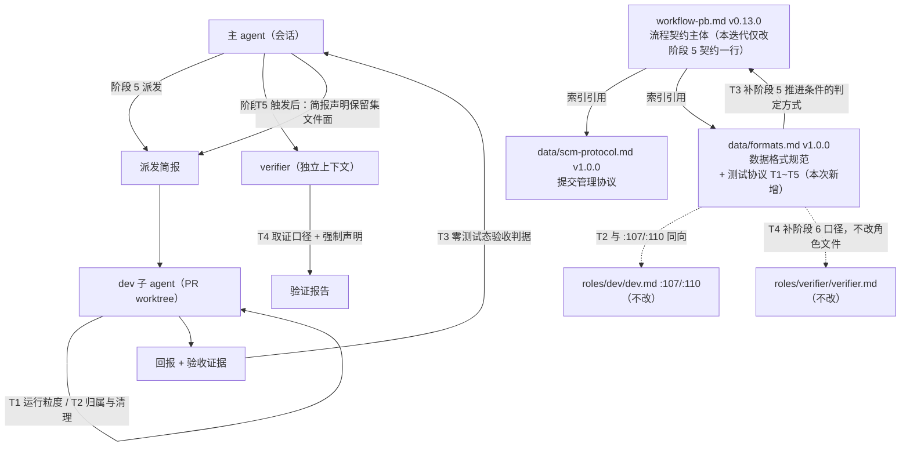

# architecture.md — 0026-test-protocol-and-suite-reset

**版本**: 0.1.0
**迭代**: 0026-test-protocol-and-suite-reset
**创建日期**: 2026-09-15
**阶段**: 技术架构（阶段 3）
**输入**: `prd.md` + `prd/F01~F09.md` + 现有规范体与代码库（基线 `ea8943e`）

---

## 1. 现状分析：本次要接入的架构基线

本迭代**不写任何运行时代码**，不引入技术栈。改动对象只有两类实体：仓库里的测试资产（删除）与工作流规范体的文本（新增一节协议 + 删一行契约 + 加一处失效标注）。因此本文件里的"组件"= **文档实体**，"数据流"= **规则被读取与执行的路径**。

### 1.1 规范体文件结构（基线 `ea8943e` 刚确立）

| 文件 | 职责 | 规模 | 被谁读 |
|---|---|---|---|
| `roles/workflow-pb/workflow-pb.md`（v0.13.0） | 流程契约主体：阶段定义 / 方案确认门 / 调度指南 / 验证目标 / 原则 | 418 行 | 主 agent 调度；执行角色查上下文与归档位置 |
| `roles/workflow-pb/data/scm-protocol.md`（v1.0.0） | 提交管理与工作区隔离协议（规则 A~H + 隔离边界声明 + 角色定义来源） | 165 行 | 启动 / 寻址 / worktree 判断 |
| `roles/workflow-pb/data/formats.md`（v1.0.0） | 各阶段产物的数据格式（PR 七字段 / `status.md` / `history.md`） | 228 行 | 阶段 4 读 PR 格式；阶段 5/6 读状态与历史格式 |

主文件以「索引，权威定义见 `data/xxx.md`」的手法接入两份子协议（`workflow-pb.md:79` / `:101` / `:355`），权威定义各只存在一处。`data/` 目录另有三份**设计期笔记**（`workflow-handshake-and-brief-passing.md`、`status-protocol-and-phase-exit-gaps.md`、`workflow-pb-creation-reflection.md`）与变更历史 `workflow-pb-changelog.md`——即 `data/` 不是纯子协议目录，目录列表不构成"规范"的判据。

**既有惯用手法（本次要复用的）**：新增一份子协议时，仓库在 v0.13.0 已经跑过一次完整动作——新文件 + 主文件加索引段 + **同步引用方**（`.claude/skills/workflow-pb/SKILL.md`、`docs/worktrees/README.md` §2「生效规范与版本」，见 `data/workflow-pb-changelog.md` v0.13.0 第 5 条）。这个动作不是免费的，它的成本就是本次决策必须计入的一项。

### 1.2 现有分区判据（`workflow-pb.md:398`）

> 判断一条内容该不该独立成文件，看它的**变更原因**：变更原因是"git 操作习惯/工作区隔离方式变化"的归 `scm-protocol.md`；变更原因是"字段增减/格式调整"的归 `formats.md`；变更原因是"阶段怎么排/调度算法怎么算"的留在本文件。

本次要落的"测试协议"的变更原因是**测试资产的运行与取证纪律变化**，不属于上述三个桶中的任何一个。这是本次决策的事实起点：这是一处**判据空白**，而不是"按判据应归 `formats.md`"。判据空白意味着本次决策同时要给判据补一条（见 D-6）。

### 1.3 与测试资产邻接的既有条款（新协议必须与它们不自相矛盾）

| 位置 | 既有条款 | 与本协议的接触面 |
|---|---|---|
| `data/scm-protocol.md` §隔离边界声明「临时目录（`/tmp`）」 | 临时产物不得作为最终事实载体；**本协议不新增任何清理动作** | F04 要求"一次性脚本跑完即删"，表面看与"不新增清理动作"相撞 |
| `data/scm-protocol.md` §隔离边界声明「CPU / 负载」 | 受负载影响的偶发失败不得当回归依据 | 零测试态下无套件可跑，该条适用面收窄但不冲突 |
| `data/scm-protocol.md` §约束生效范围 | **上述约束仅从下一个使用本工作流的迭代起生效** | 这条把 `scm-protocol.md` 从承载候选里排除了（见 D-1 方案 C） |
| `roles/dev/dev.md:107` / `:110` | 不写测试用例（除非简报明确要求）／不跑全量测试套件 | F04 验收 4 要求协议与之同向；本迭代**不改该文件** |
| `roles/verifier/verifier.md` | 全文未定义"跑什么测试" | F06 要求协议侧补阶段 6 取证口径；本迭代**不改该文件** |

### 1.4 本次改动面全景（file-face）

| 功能卡 | 文件面 | 动作 |
|---|---|---|
| F01 | `oamp/test/**`（含 `helpers/`）、`oamp/package.json`、`oamp/README.md` | 删除 |
| F02 | `roles/workflow-pb/workflow-pb.md`（阶段定义表阶段 5 行，`:56`） | 删「+ 通过验证标准的测试」 |
| F03 / F04 / F05 / F06 / F07 / F08 | `roles/workflow-pb/data/formats.md`（新增 `## 测试协议（Test Protocol）` 一节） | 新增 |
| F09 | `docs/iteration-time-analysis.md:236`；其余 5 处为登记项（无文件动作） | 就近加失效标注 + 登记 |

**这张表有两个直接后果**（阶段 4 消费）：

1. **PR 文件面无重叠**：四组互不重叠的文件面天然给出 4 个可独立合并的提交单元（F01／F02／F03~F08／F09），不需要在阶段 4 再做取舍。
2. **F03~F08 六张卡必须落在同一个 PR**：它们共享同一文件面（`formats.md`），且逻辑上就是"一份协议"。

---

## 2. 思考：唯一真正的技术缺口是"承载形态"

F01 / F02 / F09 没有架构空间——纯删除、纯删字、纯加注，卡片"无待填项"的判断与代码库核对一致。真正的技术缺口只有一处，就是六张卡共同标注的 `[架构待填]`：**测试协议文本落在哪个文件**。

这一项之所以是缺口，不是因为它难，而是因为**现存方案空间里没有零成本选项**：

- 落在**新文件**：规范体的文件结构与"权威定义位置"集合被改变（2 份权威子协议 → 3 份），主文件的 frontmatter description、`**配套文件**` 行、`:36` 的 CRITICAL（"唯一定义位置"）、`:398` 的分区判据、`:414-416` 的「何时更新本文件」五处都会与实际不符，需要同步；且按 v0.13.0 的先例还要同步两个下游引用方（`SKILL.md`、`docs/worktrees/README.md`）。
- 落在**既有子协议**：被选中的那份文件的职责范围被改写（`formats.md` 从"数据格式规范"扩为"数据格式 + 阶段 5/6 测试纪律"），其自描述的「一句话职责」句必须同步。
- 落在**主文件**：与 Q1/Q7（`demand.md` §1 W-2：本次只改阶段 5 输出契约那一行）直接冲突，且 F02 验收标准 4 明写「`git diff roles/workflow-pb/workflow-pb.md` 只出现这一行」。

**即：承载形态必然是 L1**——不是因为它动技术栈，而是因为任何选项都必须改变 `roles/workflow-pb/` 规范体中某个既有组件的职责边界或结构。这一点是本文件要请主 agent 确认的核心内容（D-1）。

同时，本次接入还有一条**结构性约束**必须显式写下来，它决定了备选方案的取舍：

> **本迭代对 `roles/workflow-pb/workflow-pb.md` 的改动面被 F02 验收标准 4 冻死在一行。**
> 推论：任何"需要主文件新增索引段/更新配套文件行"的承载形态，在本迭代内要么违反 F02 验收标准 4（当索引段与那一行落在同一 PR——而它们必然落在同一 PR，因为阶段 4 的「PR 间文件范围无重叠」不允许两个 PR 同时声明 `workflow-pb.md`），要么使协议文本没有接入点而成为孤文件。**两者都不是可交付的形态。**

这条推论把决策收敛得很干净：在**不改任何产品维度、不申请阶段 4 门禁例外**的前提下，只有"落在既有子协议"是完整可交付的形态。

---

## 3. 关键技术决策

### D-1（L1）协议承载形态

**决策：协议文本落在 `roles/workflow-pb/data/formats.md`，新增一节 `## 测试协议（Test Protocol）`（含规则 T1~T5）。不新增文件、不新增主文件的索引段、不引入版本动作。**

**分级依据**：本项改变 `data/formats.md` 的职责边界（从"各阶段产物的数据格式"扩为"数据格式 + 阶段 5/6 的测试运行与取证纪律"），符合"改变现有核心模块职责"的 L1 判据。它不是"局部模块结构"级别的 L2。

**备选方案对比**：

| 方案 | 落点 | 优点 | 缺点（可核查） | 判定 |
|---|---|---|---|---|
| **A（推荐）** | `data/formats.md` 新增 `## 测试协议` 一节 | ① 零新文件、零新索引、零引用方同步；② 不触碰 `workflow-pb.md`，与 F02 验收标准 4 无冲突；③ 零门禁例外需求；④ 读者路径已存在——主 agent 在阶段 4/5/6 本就要读 `formats.md` | ① `formats.md` 的名称与标题（"数据格式规范"）不精确覆盖新内容；② F03（运行粒度）/F07（重建触发）两组约束的变更原因确实不属"格式"，属判据外的就近安置 | **采用** |
| B | 新增 `data/test-protocol.md`（`demand.md` §7 记录的默认读数）+ 主文件索引段 | ① 与 `scm-protocol.md`/`formats.md` 同构，落点自解释；② 协议更好被陌生人指认 | ① **需要三项前置授权才能完整交付**（见下）；② 新增 1 个文件 + 主文件 5 处自描述 + 2 处下游引用方同步；③ 三项前置全部落在本迭代 9 张卡的改动面之外 | 不采用（不可完整交付） |
| C | 并入 `data/scm-protocol.md` | 零新文件、零新索引 | **硬伤**：`scm-protocol.md` 末节「约束生效范围」规定"上述约束仅从下一个使用本工作流的迭代起生效"——并入后 T3/T4 将无法管住**本迭代自己**的阶段 5/6，而零测试态恰由本迭代 F01 造成，本迭代的 PR 正是首批需要该口径的派发 | 排除（语义冲突） |
| D | 并入 `workflow-pb.md` 主文件新章节 | 零新文件 | 与 Q1/Q7（W-2：本次只改阶段 5 输出契约那一行）直接冲突；与 F02 验收标准 4 直接冲突；与主文件"只定义流程契约、不混入执行细节"的收窄方向相反 | 排除（被上游裁决否决） |

**方案 B 需要的三项前置授权（供主 agent 对照裁决，本架构不申请）**：
1. 放宽 F02 验收标准 4 的判据面（允许 `workflow-pb.md` 出现"该表格行 + 协议索引段"两处改动）——属产品维度，架构不擅自改；
2. 阶段 4 的「PR 间文件范围无重叠」对该文件给出例外（协议索引段与 F02 在同一 PR，或分为两个先后合并的 PR）；
3. 授权同步两个下游引用方（`.claude/skills/workflow-pb/SKILL.md`、`docs/worktrees/README.md` §2）——两者在 `demand.md` §5 的六处影响面清单之外，且无功能卡承载。

**取舍理由（为什么选更"不漂亮"的落点）**：方案 B 的收益只有"落点自解释 + 省一跳"；代价是让本迭代不得不申请三项前置授权，其中一项还是改已确认的功能卡验收标准。而方案 A 的代价只在 `formats.md` 的自描述上多一句职责扩写。按本项目"可测试 > 可读 > 一致 > 简单 > 可逆"的裁决序列，可测试项上 A 明显更优（不需要门禁例外即可通过阶段 4/5 的全部推进条件），简单项上 A 也胜；B 只在可读性上小胜一步。**若 6 个月后要恢复成独立文件，只是"移出+加索引"两步文档操作，可逆性两者相同**，因此不构成保留 B 的理由。

**F08 验收标准 5 的读数**（本决策的前置解释，须写入协议节以防阶段 6 误判）：验收 5 的判据原文是「**协议文本**在仓库内的位置可被指认并可被读到」，「具体落点文件由承载形态决定」。`demand.md` §4 第 3 条的"存在一份测试协议文件"同理读作"存在一份测试协议（文本）"——`demand.md` §7 明示承载形态后置，故 §4 不可能同时锁定"必须是独立文件"。为把这条读数的风险降到零，协议节**自带可被检索的唯一标题与版本行**（见 D-2），使其在被检索面等价于"一份测试协议"。

### D-2（L2）协议节在 `formats.md` 内的位置、标题与自描述

- **位置**：追加在文件**末尾**（既有三节之后），不插在中间——避免打乱既有阅读顺序，不触碰既有内容。
- **标题**：`## 测试协议（Test Protocol）`——唯一、可 `grep` 指认。
- **节内自描述块**：`**版本**: 1.0.0`／`**来源**: 迭代 0026-test-protocol-and-suite-reset（阶段 3 承载形态决策 D-1）`／`**一句话职责**`／非约束性导言。使"协议文本的位置可被指认"有机械判据（`grep -n "^## 测试协议" roles/workflow-pb/data/formats.md`）。
- **导言必须显式声明"本协议的约束仅 T1~T5 各条正文"**——F08 验收 1 要求"每条约束后都跟 `判断方式：`，逐条点数无遗漏"，导言与关系澄清句若不标明非约束，会被点数成"缺判断方式的约束"。
- **`formats.md` 的「一句话职责」扩写**：由"定义 workflow-pb 各阶段产物的具体数据格式……"扩为"……具体数据格式，以及阶段 5/6 的测试运行与取证纪律（见「测试协议」）"。文件名与标题**不改**（改名会牵动全部既有引用）。

### D-3（L2）与 `scm-protocol.md` 相邻条款的关系消解（防架构内部冲突）

T2 的"一次性脚本跑完即删"与 `scm-protocol.md` §隔离边界声明「临时目录（`/tmp`）」的「本协议不新增任何清理动作」是**两个不同对象**，协议导言须写清：

- `scm-protocol.md` 那条约束的是**协议不引入自动化清理机制 / 守卫 / hook**（与"本协议不引入 hook 参与强制"同族）；
- T2 约束的是**执行角色的过程纪律**，其判断方式是事后核查（查派发记录里脚本是否残留），不依赖任何自动门禁。

同理，T4 的"报告必须显式声明「本次无跨迭代回归证据」"也是**人工可执行的事后核查**，不引入 hook / CI / 第三方依赖（F08 验收标准 2、F08 边界）。

### D-4（L2）不引入版本动作、不写变更历史条目

本迭代对规范体有两处内容改动（`workflow-pb.md` 一行、`formats.md` 一节）。按仓库体例，`data/workflow-pb-changelog.md` 的条目以 **workflow-pb 主版本号为标题**组织，而 `workflow-pb.md` 的版本行正是 F02 验收标准 4 冻结面之内——本迭代无法产生一个合规的主版本条目。因此：

- **不升 `workflow-pb.md` 版本**（受 F02 验收标准 4 约束，且副作用是 `SKILL.md:33` 与 `docs/worktrees/README.md` §2 的版本 pin 不发生失效）；
- **不升 `formats.md` 版本、不追加 changelog 条目**，理由：该文件的版本行本就是"（对应 workflow-pb v0.12.0）"式的**对应主版本**标记，而它在 v0.13.0 创建后未同步（既有失准，见 §9）；在没有主版本号可挂的前提下追子文件版本条目会破坏该文件的体例。
- **该项是可一句话改判的**：若主 agent 认为应当留痕，动作 = `formats.md` 版本行 `1.0.0` → `1.1.0` + `data/workflow-pb-changelog.md` 顶部追加一条以子文件版本为标题的条目，追加进 F03~F08 的同一 PR（文件面 +1，不影响任何验收标准）。

### D-5（L2）T1 的运行范围按**文件面**界定，且默认集为空集

F03 验收标准 1 要求协议明确"什么算本 PR 生成的用例（按文件面或用例面界定）"。**选文件面**，理由：文件面是 PR 文件七字段中「文件范围」的既有概念（已在 `formats.md` §PR 文件格式规范 权威定义），不需要在协议里新造"用例面"这一套判定语言；且它与阶段 5 推进条件「无简报外改动」共用同一把尺子。

**必须显式写下的组合后果（Q2 × Q4 的交叉）**：Q2 裁决"只跑本 PR 生成的用例"，Q4 裁决"PR 默认不落测试用例"——两者叠加后，**阶段 5 每次派发的默认运行集是空集**（默认不执行任何测试命令）。协议若不写下这句，执行角色会各自推断"那到底跑不跑"，等于把 Q2 想消灭的临场发挥原地保留。这是 Q2 与 Q4 之间唯一的语义衔接点，属架构侧必须闭合的接口。

### D-6（L2）T5 的"跨迭代契约"判据选引用关系，不选类别白名单

F07 验收标准 1 要求"跨迭代契约"在协议内可判别。两个候选：

| 候选判据 | 形态 | 判定 |
|---|---|---|
| **引用关系（采用）** | 该 PR「文件范围」中的文件，能在**其它已交付迭代**的产物（`docs/iterations/**`）中被检索到引用 | 机械、可重放、不依赖物理指标；直接命中"跨迭代"的语义 |
| 类别白名单（不采用） | 预定义一类"跨迭代共享面"路径（`roles/**`、`principles/**`…） | 需要维护一张会过期的路径清单；且白名单过宽会让触发条件实质失效（本仓库几乎每次迭代都改 `roles/**`） |

选引用关系的另一个理由：它使 F07 的触发条件在**没有任何人做判断**的情况下也可核查——这正是一条"写死"的触发条件应有的性质（Q14 裁决要求写死）。

### D-7（L2）不改任何角色文件

`roles/dev/dev.md` 与 `roles/verifier/verifier.md` **零改动**。F04 验收标准 4 要求的"与 dev.md 一致"通过**同向表述**达成（协议 T2 的例外入口直接锚定 `roles/dev/dev.md:107` 的"除非简报明确要求"），F06 要求的阶段 6 口径通过**协议侧补齐**达成（`verifier.md` 全文未定义跑什么测试，因此不存在需要同步的第二份拷贝）。

### D-8（L3）命名与格式约定

- 规则编号沿用 `scm-protocol.md` 的「规则 X」家族，用 `T1~T5` 与之区分（跨文件引用"规则 T3"不歧义）；映射：T1←F03、T2←F04、T3←F05、T4←F06、T5←F07。
- 每条规则形态 = 条款正文 + 紧随其后的独立一行 `判断方式：…`（与 `scm-protocol.md` 逐条同构）。

---

## 4. 组件图与核心数据流

**核心数据流（规则如何真正被执行到）**：

1. 主 agent 读 `workflow-pb.md`（阶段 5/6 的推进条件）→ 按需读 `data/formats.md`（PR 格式 / 状态 / 历史）——**这条既有阅读路径同时就是新增协议节的读者路径**，不需要新增入口。
2. 阶段 5 派发：简报 → dev 在 PR worktree 内实现 → T1 约束"跑什么"（默认空集）、T2 约束"什么留下"（默认不留）。
3. 验收：主 agent 用 T3 的逐条裸判定 + 机械判据核对 PR 的验收标准，替代已不存在的"套件全绿"信号。
4. 阶段 6：verifier 用 T4 自写临时脚本实测取证，并在报告里强制声明「本次无跨迭代回归证据」。
5. 下一个迭代的阶段 4：若出现第一个跨迭代契约（D-6 判据命中），主 agent 在**该迭代的阶段 5 简报**中显式声明保留集文件面（T5）；此路径复用 `workflow-pb.md` §派发执行角色时的 brief 构建 里既有的"简报显式覆盖值优先"机制，且该节字段列表以"**至少**包含以下字段"起头，附加字段不违反该节（**不需要改主文件**）。

---

## 5. 协议节结构规格（规则 T1~T5）

> 本节是给阶段 5（实现）的**结构规格**：列出每条规则必须写出的要素与判断方式形态，不代替协议正文的撰写。所有"判断方式"必须是**人工可执行的事后核查动作**（查文件是否存在、查检索是否零命中、查 `git diff` 范围、查记录里某动作是否发生），不得依赖 hook / CI / 工具链自动强制。

### 导言（非约束，须显式标注"本协议的约束仅 T1~T5 各条正文"）

协议一句话职责；§7 的落点读数（D-1 末尾）；D-3 的关系消解（与 `scm-protocol.md`「临时目录」条、与"不引入 hook/CI"）；`**版本**` 与 `**来源**` 行。

### 规则 T1 · 运行粒度（← F03）

必须写出的要素：

- 阶段 5 每次派发的**默认运行集为空集**：只运行"本 PR 生成的用例"，而 PR 默认不生成用例（指向 T2）→ 默认不执行任何测试命令（D-5 的 Q2×Q4 交叉结论）。
- 「本 PR 生成的用例」**按文件面界定**：落在该 PR「文件范围」字段所列文件内的用例文件。
- 运行时点与执行者：实现完成后、回报主 agent 之前；由该 PR 的 dev 子 agent 在本 PR worktree 内执行。
- 保留集存在时（T5 触发后）：运行范围 = 简报显式声明的保留集文件面中与本 PR「文件范围」相交的部分；仍不跑全量。
- **全量运行只在迭代交付口执行一次**，触发点 = 阶段 6 独立验证（或迭代分支合并进 `main` 之前），执行者 = 主 agent / verifier；阶段 5 的任何角色不得触发。
- 不以物理指标（单文件行数、运行时长上限）作为运行粒度的约束（Q3）。

`判断方式：`取一次阶段 5 派发的执行记录（`history.md` 派发条目 + 该 PR worktree 内的命令记录），核对①测试命令覆盖的文件是否全部落在"本 PR 文件范围 + 简报显式声明面"之内（默认应为零条测试命令）；②阶段 5 期间是否出现超出该范围的运行（出现即违反）；③全量运行记录是否只出现在阶段 6 / 收口口（阶段 5 出现即违反）。

### 规则 T2 · 归属与一次性脚本处置（← F04，Q5 与 Q4 合成同一条）

必须写出的要素：

- **PR 默认不落测试用例**：PR 交付物不含测试文件。例外**只能由简报显式要求**给出（入口锚定 `roles/dev/dev.md:107` 的既有措辞）；无简报显式要求时即为"无例外"。
- **跑完即清除**：给出清除时点（回报主 agent 之前）与清除范围（本 PR 生成的全部用例文件 + 一次性脚本文件）。
- **一次性验收脚本跑完即删**：落点自便（含 `/tmp`），删除是硬要求；与上一条合为同一条约束（Q5）。
- 与 `roles/dev/dev.md:107` / `:110` 同向，协议不要求改该文件。
- 归属与保留的判据不是物理指标（Q3）。

`判断方式：`取一次阶段 5 派发的交付面（该 worktree 的 `git status --porcelain` / `git diff --stat` 对迭代分支 + 脚本落点残留记录），核对①交付面是否含测试文件（含且无简报显式要求即违反）；②该 PR 生成的一次性脚本在回报前是否已删除（残留即违反）。

### 规则 T3 · 阶段 5 零测试态验收判据（← F05）

必须写出的要素：

- 零测试（无保留集）状态下，「该 PR 验收标准全部通过」的判定方式 = **逐条裸判定 + 机械判据**：逐条对照该 PR 文件的「验收标准」列表；每条给出可被第三者重放的读取/检索/`git diff` 判据；每条结论写 pass / fail + 证据。
- **"套件全绿"不再作为判据**：零测试态下不存在可跑的套件，任何以"等套件绿"为推进前提的行为违反本条。
- 不得以"临时补写测试"作为验收动作（与 T2 的零测试交付冲突）。
- **不改阶段 5 推进条件的三项文字本身**（该文字改动归 F02）：本条只补"怎么判"。

`判断方式：`取一次阶段 5 验收记录（验收结论 + 其证据），核对①是否逐条覆盖该 PR 文件的全部验收标准；②每条的判据是否为可重放的具体命令/读取动作（出现"看起来没问题""应该可以"这类无证据表述即违反）；③是否出现"等套件全绿"或"临时补写测试"的动作（出现即违反）。

### 规则 T4 · 阶段 6 零测试态取证口径（← F06）

必须写出的要素：

- 无保留集时，阶段 6 的独立取证只能靠**自写临时脚本实测**；不得依赖不存在的回归套件。
- 报告**必须显式声明「本次无跨迭代回归证据」**（原文或等价的无歧义表述），不可省略、不可静默为"验证通过"。
- 该声明与结论的关系：**声明本身不改变** pass / fail / partial / blocked 结论（缺回归证据 ≠ fail，零测试交付是既定状态）；**缺声明即报告不合格**。
- 自写临时脚本的落点与删除遵守 T2。
- **不改 `roles/verifier/verifier.md`**：该角色全文未定义跑什么测试，本条由协议侧补口径。

`判断方式：`取一份阶段 6 报告，核对①是否出现「本次无跨迭代回归证据」（或等价表述）；②该声明是否与结论并列出现（缺声明即该报告不合格，判者不需询问作者）；③报告中引用的取证手段是否为自写临时脚本实测（依赖不存在的套件即违反）；④脚本是否已删除。

### 规则 T5 · 保留集重建触发条件（← F07）

必须写出的要素：

- **触发条件（写死）**：下一次迭代在阶段 4 出现第一个"跨迭代契约"时，触发保留集重建。
- **"跨迭代契约"判据**：该 PR「文件范围」中的文件，能在其它已交付迭代的产物（`docs/iterations/**`）中被检索到引用（D-6）。
- **触发后动作**：由**主 agent** 在该迭代的**阶段 5 简报**中显式声明**保留集文件面**——复用 `workflow-pb.md` 既有的"简报显式覆盖值优先"机制，不新增组件、不改主文件。
- 责任方 = 主 agent，不依赖新增角色（Q10）。
- 粒度判据 = 必要性（跨迭代契约意义），**不是**物理指标（行数 / 时长上限）。
- 不规定"现在应保留哪些用例"（`demand.md` §6 被否决路径 1 不得回填）；本迭代不重建保留集本身。

`判断方式：`①取某次迭代的阶段 4 产出（`prs/`），对每个 PR 的文件面执行"被其它迭代产物引用"的检索，命中 ≥1 即该迭代满足触发条件；②满足触发条件的迭代，核对其阶段 5 简报是否含保留集文件面声明（缺即违反）；③责任方是否为主 agent（出现新增角色即违反）。

---

## 6. 功能卡技术路径

| 卡 | 技术路径 | 架构维度 | 依赖边（架构侧判定） |
|---|---|---|---|
| F01 | 整目录删除 `oamp/test/**`；`oamp/package.json` 移除 `scripts.test`（保留其余字段字面不变）；`oamp/README.md:195` 删该句、保留"存在三条漂移锁"的事实描述与「重新生成索引快照」命令。不引入替代机制（无 CI、无 hook、无替代 script）。仓库无 `.github/workflows`，F01 验收标准 4 天然满足 | 无待填项 | — |
| F02 | `roles/workflow-pb/workflow-pb.md:56`（阶段定义表阶段 5 行）输出列删「+ 通过验证标准的测试」；同行其余内容字面不变（含推进条件三项） | 无待填项 | — |
| F03 | 写入 T1（见 §5） | **落 `data/formats.md` 新增 `## 测试协议` 一节**（D-1） | F01（顺序，见下） |
| F04 | 写入 T2（见 §5） | 同上 | F01（顺序） |
| F05 | 写入 T3（见 §5） | 同上 | F01（顺序） |
| F06 | 写入 T4（见 §5） | 同上 | F01（顺序） |
| F07 | 写入 T5（见 §5） | 同上 | F01（顺序） |
| F08 | 协议节的可裁决性形态：导言标注"约束仅 T1~T5"；T1~T5 每条紧随一行 `判断方式：`；判断方式为人工可执行的事后核查；节标题唯一可检索 | 同上（与 F03~F07 同节，不单独占位） | F01（顺序） |
| F09 | ①`docs/iteration-time-analysis.md:236` 在该 bullet **行尾追加同行的失效括注**（点明失效原因：0026 清洗 `oamp/test/`，全量套件不再存在；点明生效迭代），不重写既有分析与数值、不新增章节结构；②其余 5 处为登记项，无文件动作（第 1/2/3 处由 F01/F02 直接改，第 4/5 处由 T3/T4 接管） | 无待填项 | F01、F02（判据依赖：F09 验收标准 1 的第 1/2/3 行判据读的是 F01/F02 的产物状态） |

**依赖边的证据形态（交阶段 4 使用）**：

- **F01 → F03~F08（顺序约束）**：`demand.md` §3 的用户裁决（先清理 → 后定协议）+ 协议 T3/T4 的判据对象是 F01 造成的"零测试态"这一仓库状态。它是**语义前置**，不是共享文件。阶段 4 若登记 `depends_on`，必须把这一证据形态写进 PR 文件的 `depends_on` 理由行——否则会被 §验证目标「依赖正确性验证」判为"把顺序偏好误判成依赖"。**替代做法**（若阶段 4 判定该边不成立）：主 agent 在阶段 5 只能靠派发时机保障顺序（`depends_on` 为空时两 PR 会并发），因此登记该边是保障 `demand.md` §3 的唯一可执行手段。
- **F01、F02 → F09**：F09 验收标准 1 的判据列（V-1/V-2/V-3 零命中）直接读 `oamp/package.json` / `oamp/README.md` / `workflow-pb.md` 三个文件的状态，属可核查的文件引用。
- F02 与 F03~F08 之间**无依赖**（`demand.md` §3：W-2 与二者无依赖关系，顺序自由）；F09 第 6 处的加注与协议无技术依赖，`prd.md` 把它绑定到协议同一交付单元，属交付组织而非技术耦合。

---

## 7. 新增实体登记（奥卡姆检验）

| 实体 | 奥卡姆检验："不引入它，哪个功能无法实现？" | 判定 |
|---|---|---|
| 新增文件（如 `data/test-protocol.md`） | **答不出**：把协议节放进 `formats.md` 后，F03~F08 的全部功能、全部验收标准仍然达成 | **不引入**（D-1 方案 B 被排除的独立理由） |
| 主文件索引段 | 在方案 A 下不需要；在方案 B 下是必需项但被 F02 验收标准 4 冻结 | 不引入 |
| 新角色 / test-keeper | `demand.md` §2 明确不做；T5 把责任放在主 agent，T2 把清除责任放在执行角色自身的规则里 | 不引入 |
| 新版本条目 / 变更历史条目 | 本迭代无合规的主版本号可挂（D-4） | 不引入 |
| CI / git hook / 第三方依赖 | 所有判断方式均为人工可执行的事后核查（F08 验收标准 2、F08 边界） | 不引入 |

**本迭代引入的新增实体总计：0 个文件、0 个新组件。** 全部改动是既有文件的删除与文本新增。

---

## 8. 验证（本方案自检）

- **每个技术路径都能追溯到功能点**：§6 表逐行对应 F01~F09，无凭空添加的技术组件（§7 登记表逐项）。
- **`[架构待填]` 全部填写**：F03/F04/F05/F06/F07/F08 六张卡的「架构维度」均填为"落 `roles/workflow-pb/data/formats.md` 的 `## 测试协议` 一节（D-1）"；F01/F02/F09 无待填项，与代码库核对一致。
- **无架构内部冲突**：与 `scm-protocol.md`「临时目录」条的关系已消解（D-3）；与 `scm-protocol.md`「约束生效范围」条的冲突是排除方案 C 的理由本身；与 `roles/dev/dev.md:107/:110` 同向（D-7）；与 Q1/Q7 不冲突（不碰主文件除 F02 那一行之外的任何位置）。
- **与 F02 验收标准 4 不冲突**：本方案对 `workflow-pb.md` 零改动（除 F02 自身那一行），`git diff roles/workflow-pb/workflow-pb.md` 仍只出现一行。
- **与阶段 4「PR 间文件范围无重叠」相容**：§1.4 的四组文件面天然不重叠，6 张协议卡落在同一 PR。
- **与 `demand.md` §5 六处影响面相容**：第 1/2/3 处由 F01/F02 改，第 4/5 处由 T3/T4 接管（协议内可定位），第 6 处由 F09 加注。
- **L1 决策已列出、未擅自实施**：D-1（L1）未经主 agent / 用户确认前不进入任何实现。

---

## 9. 越界与待裁决

1. **D-1 是 L1，需主 agent / 用户确认**（本文件的核心待裁决项）。裁决点是"是否接受协议并入 `data/formats.md`"；若改判方案 B，需先解决 §3 D-1 列出的三项前置授权。
2. **`roles/workflow-pb/workflow-pb.md:398` 的分区判据存在空白**：测试协议的变更原因不属现有三个桶中的任何一个。补齐它需要改主文件，而主文件本次被 F02 验收标准 4 冻结——**本次只登记，不处置**（清单见 §1.2）。

### 发现的§5 六处清单之外的失效面（只报告、不处置）

| # | 位置 | 现象 | 为什么不在本迭代改动面 |
|---|---|---|---|
| 1 | `oamp/README.md:101-102` | 「**自动化测试将 interval 缩到 30–100ms、timeout 缩到 200–400ms、日志窗口缩到 ~300ms，使全链路秒级完成**」——F01 之后仓库内不再存在自动化测试，该句描述的是一个已不存在的机制（同段 `:116` 的「测试用 socket 与临时库…」属设计性质陈述，适用面收窄） | F01 的处置面只有 `oamp/README.md:195`（§5 第 3 行、F01 验收标准 3 逐字锁定"由 `npm test` 强制"那一句），`demand.md` 未列该行 |
| 2 | `data/formats.md:4` | 版本行标注「对应 workflow-pb v0.12.0」，而该文件是 v0.13.0 拆分时新建的**既有失准** | 既有历史遗留，不借本次需求一并"修复" |
| 3 | `.claude/skills/workflow-pb/SKILL.md:34` | 「完整规范」行把 `formats.md` 标注为「数据格式规范」——方案 A 下该文件职责被扩写后，此处标签只是不精确，不是失效引用（文件名与标题未改） | SKILL.md 不在本迭代改动面（F02 边界已核其全文无"测试"字样） |
| 4 | `roles/dev/dev.md:110`「不跑全量测试套件」 | 零测试后该行为禁令无对象可施加，退化为恒真 | 与 `:108`「不改测试」同类（同一条裁决逻辑覆盖），不属于「指向已删除测试资产的有效引用」；本迭代不改 `dev.md`（F04 边界） |
| 5 | `roles/workflow-pb/data/*.md`（全部子协议） | `tools/install-pb-agents.sh` 只分发 `<role>/<role>.md`，不分发 `data/`——**下游业务项目拿不到任何子协议**，主文件对 `data/xxx.md` 的索引引用在下游断链 | 既有结构性缺口，与本次承载形态选择无关（方案 A/B 落点都在 `data/` 下，下游可见性完全相同） |
| 6 | `roles/workflow-pb/data/workflow-pb-changelog.md` | 本迭代对规范体的两处改动无版本条目可挂（D-4），规范体的变更历史在本迭代出现一段空档 | 主版本号行受 F02 验收标准 4 冻结；是否破例留痕交主 agent 一句话裁决（D-4 已给出具体动作与成本） |
