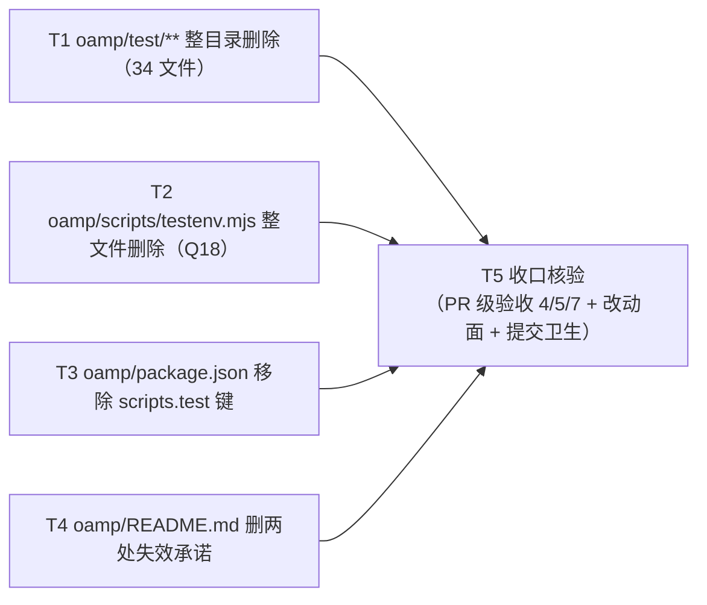

# pr-001-tasks.md — pr-001 内部任务图（存量测试资产清零 / F01）

**迭代**: 0026-test-protocol-and-suite-reset ｜ **阶段**: 5（PR 实现）· 首波 ｜ **PR 文件**: `prs/pr-001-test-assets-zeroing.md`
**worktree 分支**: `feat/0026-pr-001-test-assets-zeroing` ｜ **base**: **`bffc336`**（= 本 worktree 的分支点，已核 `git merge-base HEAD iteration/0026-test-protocol-and-suite-reset` = `bffc336`；迭代分支 tip 已前移至 `7d5c954`，不影响本 PR 的 diff 基准）
**任务总数**: **5**（T1~T5）｜ **依赖图**: **无环**（T1~T4 四条并行边 + 全部汇入 T5，见 §2）
**输入真源**: PR 文件（4 路径 / 验收 1~7）+ `prd/F01-test-assets-zeroing.md`（验收 1~6，V-1/V-2/V-3）+ `architecture.md` **v0.2.0**（§1.2 事实 A~D / §2.1 F01 行 / §3.1 ① 清理组 / §5.4 / §5.5 / §6.1 A=Q18 / §6.1 B=Q19）+ `demand.md` **v1.2.0**（§W-1 五条动作 / §5 第 2、3、3b、7、8 行）+ 代码库一手实读（§0.3 逐条带 `文件:行号`）
**本 PR 性质**: **纯删除**——四处动作全是「删」，零实现代码、零新增文件、零新增机制。因此本任务图的验收标准全部是 **git 面 + 文本检索**的机械判据（无套件可跑，见 §0.4 契约 5）。

---

## 0. 范围、文件面与事实锚点

### 0.1 本 PR 文件范围（唯一可写面；4 路径 = 3 个动作面 + 1 个整目录）

| # | 路径 | 动作 | 规模 | 任务归属 |
|---|---|---|---|---|
| 1 | `oamp/test/**` | **整目录删除** | 34 个受版本控制文件（32 个 `*.test.js` + `helpers/harness.js` + `helpers/fake-node.js`） | **T1** |
| 2 | `oamp/scripts/testenv.mjs` | **整文件删除** | 1 文件 / 192 行（Q18 裁决） | **T2** |
| 3 | `oamp/package.json` | **整块移除 `scripts` 容器**（含 `test` 键；裁决 2） | 3 行（`:11-13`） | **T3** |
| 4 | `oamp/README.md` | **删除两处失效承诺** | `:195` 内片段 + `:102` 整行（+ `:101` 行尾片段） | **T4** |
| — | `prs/pr-001-tasks.md`（本文件） | 阶段 5 流程产物 | — | **不计入本 PR 改动面**（见 T5 判据 6） |

### 0.2 非目标（零改动 / 防夹带 —— 越界即 F01 验收 4 / 5 不通过）

- **冻结面（PR 验收 5，逐字）**：`oamp/src/**`、`oamp/web/**`、`oamp/bin/**` **三目录零改动**。其中 `oamp/src/cluster-config.js:19`（注释指向 `test/hygiene.test.js`）**只登记、不处置**（**Q19**）——本 PR 对它零改动，**不得**因"顺手精确化措辞"而触碰（architecture §5.5 / §6.1 B）。
- **他 PR 的面（本 PR 零改动）**：`roles/workflow-pb/workflow-pb.md:56`（→ pr-002）、`docs/iteration-time-analysis.md:236`（→ pr-003）。
- **不动**：`oamp/scripts/gen-llms-txt.mjs`、`oamp/API.md`、`oamp/llms.txt`、`oamp/cluster.json`、`oamp/README.md` 的两处 env 表行（`:98` / `:99`）与「重新生成索引快照」命令行（`:194`）、`roles/**`、`docs/iterations/0025-*`。
- **不新增任何文件**（PR 验收 4 的硬约束）：无 CI 配置（`.github/**`）、无 git hook（`.githooks/**` / `core.hooksPath`）、无替代 script（`test:legacy` 等）、无 `oamp/test/` 占位文件（`.gitkeep`）、无 `oamp/test/` 之外的替身目录。
- **不引入第三方依赖**（`dependencies` 仍为空对象，prd/F01 验收 2）；不写任何实现代码；不做任何架构新增（architecture §2.2：本迭代 L1/L2/L3 = 无）。

### 0.3 读码事实锚点（2026-09-15 于本 worktree 实读，base `bffc336`；判据基础）

| # | 事实 | 核实方式 |
|---|---|---|
| **A1** | `git ls-files oamp/test` = **34** 行：`helpers/fake-node.js`、`helpers/harness.js` + **32** 个 `*.test.js`（`acp-daemon` / `agent-heartbeat` / `api-pages` / `api-routes` / `approval-resolution` / `call-console` / `call-protocol` / `cli` / `cluster-actions` / `cluster-config` / `config-file` / `confirmation-inbox` / `confirmation-roundtrip` / `context-pool` / `delivery-contract` / `event-log` / `hygiene` / `inbox-console` / `notification-scope` / `omp-executor` / `persist` / `project-workspace` / `protocol-layer` / `reconnect` / `role-binding` / `router-registry` / `status` / `task` / `tool-permission` / `transport` / `web` / `zero-intrusion`） | `git ls-files oamp/test \| wc -l` = 34；`git ls-files 'oamp/test/*.test.js' \| wc -l` = 32 |
| **A2** | `oamp/test/` **磁盘内容 = 索引内容**（34 个文件全被追踪，目录内无未追踪 / 无被忽略的残留；`.gitignore` 无任何 `test` 相关条目）⇒ 整目录删除后目录可真正消失，无需处理落单文件 | `git status --porcelain` 空 + `ls -a oamp/test` 与 A1 逐条一致 + `grep -n test .gitignore` 零命中 |
| **A3** | `oamp/package.json` 共 15 行；`scripts` 块在 `:11-13`（**空对象 `dependencies` 在 `:14`**），`"test"` 键在 **`:12`**（PR 文件已更正架构台账所记 `:13`） | `awk '{printf "%d\|%s\n",NR,$0}' oamp/package.json` |
| **A4** | `oamp/README.md:195` 逐字 = `- **漂移锁**：元数据必填 / 索引快照逐字节 / \`API.md\` 路径登记三条锁由 \`npm test\` 强制`（**全文件唯一**含「漂移」/「三条锁」/「npm test」的行）；`:194` = `- **重新生成索引快照**：…执行 \`node scripts/gen-llms-txt.mjs\`` | `sed -n '194,195p'`；`grep -n "漂移\|三条锁\|npm test" oamp/README.md` 命中集合均 = `{195}` |
| **A5** | `oamp/README.md:101-102` 逐字 = `数值类 env 一律要求正整数，非法值启动即报错退出（快速失败）。自动化测试将 interval 缩到` ⏎ `30–100ms、timeout 缩到 200–400ms、日志窗口缩到 ~300ms，使全链路秒级完成。`（该句**跨两行**，`:101` 还有须保留的前半句） | `awk 'NR>=101&&NR<=102'` |
| **A6** | env 表两行逐字：`:98` `\| \`OAMP_TMUX_BIN\` \| cluster \| \`tmux\` \| tmux 可执行文件路径（测试注入用） \|`、`:99` `\| \`OAMP_CLUSTER_WAIT_MS\` \| cluster \| \`20000\` \| cluster up 就绪等待上限（毫秒）；\`0\` = 不等（测试用） \|` | `sed -n '98,99p'` |
| **A7** | `oamp/scripts/testenv.mjs`：`:3`（「复用 `test/helpers/harness.js` 的真实进程拉起能力」）与 `:7`（「自动化测试载体仍为 `test/*.test.js`」）是**路径引用**注释；**`:11` 是可执行 `import { … } from '../test/helpers/harness.js'`**；另 `:2` / `:5` / `:91` / `:92` / `:95` / `:106` / `:123` 的 `testenv` / `test-sender` / `test environment` 是**名称与文案**、非路径引用（口径精度见 §3-②） | `grep -n "test" oamp/scripts/testenv.mjs` 逐行判读 |
| **A8** | `git ls-files oamp/scripts` = **2** 行：`gen-llms-txt.mjs`、`testenv.mjs` ⇒ 删后应恰剩 **1** 行 | `git ls-files oamp/scripts` |
| **A9** | 仓库**无 `.github/`**、**无任何非 sample 的 git hook**（`git rev-parse --git-common-dir` = `/Users/chenchiyuan/projects/agents/.git`，其 `hooks/` 只有 `*.sample`）、`core.hooksPath` 未设置 ⇒ PR 验收 4 的「无替代机制」在删除后天然成立，删除不会撞任何自动门禁 | `ls -d .github` 无命中；`ls <common>/hooks \| grep -v '\.sample$'` 无命中；`git config --get core.hooksPath` 空 |
| **A10** | `oamp/` 内指向测试资产的引用共 **5 处**：`package.json:12`（script）、`README.md:195`、`README.md:101-102`、`scripts/testenv.mjs:11`（**可执行 import**）、`src/cluster-config.js:19`（**注释**，Q19 零处置）；仓库内其余 2 处引用均属他 PR（`roles/workflow-pb/workflow-pb.md:56` → pr-002；`docs/iteration-time-analysis.md:236` → pr-003）⇒ **本 PR 的 4 路径面完整，无 Q18/Q19 之外的越界**（复扫证据见 §3-①） | `grep -rn "test/" oamp/src oamp/web oamp/bin oamp/scripts`；`grep -rn "npm test" --exclude-dir={node_modules,.git,.pb-agents} .` |
| **A11** | 本 PR **无任何可运行的验证套件**：`package.json` 的 script 是指向被删目录的入口（T3 删除它），测试文件自身即被删对象 ⇒ 验收手段只能是 git 面 + 文本检索（与 `demand.md` §6.1 空缺 2「阶段 5 失去套件全绿判据」一致） | A1 / A3 |
| **A12** | 本 PR 的 diff 基准 = **`bffc336`**（= `git merge-base HEAD iteration/0026-test-protocol-and-suite-reset`）；预期 diff 面 = **37** 条路径（34 + 1 + 1 + 1） | `git merge-base` / `git diff --name-only bffc336..HEAD` |

### 0.4 本 PR 内的口径与冻结契约（每个任务都必须遵守）

1. **动作只有「删」**：四处动作不得夹杂任何改写、重排、格式化、"顺手修正"。删字之外若需改动，一律停止并报告。
2. **README `:195` 的口径**（已由主 agent 裁定生效 2026-09-15，裁决 1；见 §4-①）：删除的是「由 `npm test` 强制」这一**承诺片段**；「元数据必填 / 索引快照逐字节 / `API.md` 路径登记三条锁」这一**事实描述逐字保留**。依据 = `prd/F01` 验收 3 原文「删的是"由 npm test 强制"这项承诺，**不是漂移锁本身**」+ `demand.md` §W-1「保留同段"存在三条漂移锁"的事实描述」；PR 文件「文件范围」所写「`:195` 整句」经裁定为**不精确措辞**，以上述两处上游口径为准 ⇒ 落为**片段删除**而非整行删除。
3. **`package.json` 的 `scripts` 容器口径**（已由主 agent 裁定 2026-09-15，裁决 2 —— 已闭合）：**整块移除 `"scripts"` 容器**（文件内不再有 `scripts` 键），**不是**留空对象 `"scripts": {}`。裁定理由 = 只剩 `{}` 的空容器是残留物，与本次「不留悬空」取向相反；且 PR 验收 2 逐字枚举的「其余字段逐字不变」清单 = `name` / `private` / `type` / `bin` / `engines` / `dependencies`，**不含 `scripts`**，故整块移除不违反该条。判据见 T3 验收标准 2 / 5（登记见 §3-③）。
4. **冻结面不动**：`oamp/src` / `oamp/web` / `oamp/bin` 零改动；`src/cluster-config.js:19` 只登记不处置（Q19）。
5. **零机制替代**：不新增 CI / hook / 替代 script / 占位文件；不新增依赖。
6. **本 PR 不含实现代码、不含架构新增**；一切验收判据 = git 面（`ls-files` / `status` / `diff`）+ 文本检索（`grep`）。

---

## 1. 任务列表

### T1: `oamp/test/**` —— 整目录删除（34 个受版本控制文件）

- **一句话描述**：把 `oamp/test/` 整个目录（32 个测试文件 + `helpers/` 两个脚手架）从索引与磁盘一并抹掉，且不留任何替身。
- **验收标准**:
  1. **目录不存在**：`ls oamp/test` 报 `No such file or directory`；`test ! -d oamp/test` 退出 0。
  2. **索引零命中**：`git ls-files oamp/test` **零输出**（`| wc -l` = 0）——F01 验收 1 的 V-1 判据。
  3. **34 个对象全消失**：删除**前**的清单（A1）逐条复核——`git ls-files oamp/test/helpers/harness.js oamp/test/helpers/fake-node.js` 零命中；`git ls-files 'oamp/test/*.test.js'` 零命中（原 32 个）；`helpers/` 目录亦不存在。
  4. **删除的完整性可核**：`git status --porcelain` 的 `D` 条目**恰 34 条**，且每条路径均以 `oamp/test/` 为前缀（既不多删、也不少删）。判据 = `git status --porcelain | grep -c '^D  oamp/test/'` = 34，且 `git status --porcelain | grep '^D ' | grep -vc '^D  oamp/test/'` = 0（本任务执行时点）。
  5. **不留占位**：目录内**不得**新建 `.gitkeep` / `README.md` / 空 `helpers/` 等任何文件；`git status --porcelain` 的 `A` 条目中零命中 `oamp/test/`（PR 验收 4）。
  6. **零越界**：本任务的改动只落在 `oamp/test/**`——不触碰 `oamp/package.json`（T3）、`oamp/README.md`（T4）、`oamp/scripts/**`（T2）、`oamp/src|web|bin`（冻结面）。
- **前置依赖**: 无
- **优先级**: P0
- **追溯**: PR 文件「文件范围」第 1 项 + 验收 1 / 7；`prd/F01` 验收 1（V-1）；`architecture.md` §3.1 ①（清理组）、§1.2 事实 A/B；`demand.md` §W-1 第 1 条；事实锚点 A1 / A2 / A9

### T2: `oamp/scripts/testenv.mjs` —— 整文件删除（Q18）

- **一句话描述**：删掉「最小测试环境」脚本——它的 `:11` 是一行可执行 `import`，直指即将被 T1 删除的 `test/helpers/harness.js`，删 harness 后该脚本在 import 阶段即报错。
- **验收标准**:
  1. **文件不存在**：`ls oamp/scripts/testenv.mjs` 报 `No such file or directory`；`test ! -e oamp/scripts/testenv.mjs` 退出 0。
  2. **索引恰剩一行**：`git ls-files oamp/scripts` 输出**恰 1 行**且 = `oamp/scripts/gen-llms-txt.mjs`（A8 的 2 → 1）。判据 = `git ls-files oamp/scripts | wc -l` = 1 且 `git ls-files oamp/scripts` 零命中 `testenv`。
  3. **删除完整性**：`git status --porcelain` 中恰 1 条 `D  oamp/scripts/testenv.mjs`（本任务执行时点）。
  4. **无替代**：不新建 `oamp/scripts/` 下任何文件（无冒烟替代脚本、无 `.gitkeep`）；`oamp/scripts/gen-llms-txt.mjs` **逐字不变**（`git diff bffc336 -- oamp/scripts/gen-llms-txt.mjs` 零输出）。
  5. **删除依据（登记，不需重复验证）**：`:11` 的 `import { startRouter, startAgent, queryStatus, waitFor, stopAll, buildEnv } from '../test/helpers/harness.js';` 是**可执行引用**（A7）⇒ 删除消解的是**功能性破损**（Q18 分级：import 会报错 ⇒ 处置；注释不报错 ⇒ 只登记），不是"文本失效"。
  6. **零越界**：本任务的改动只落在 `oamp/scripts/testenv.mjs`。
- **前置依赖**: 无（与 T1 之间**不设依赖边**，理由见 §2）
- **优先级**: P0
- **追溯**: PR 文件「文件范围」第 2 项 + 验收 4 / 5；`prd/F01` 验收 6（含"落在冻结面之外、无需开口子"的说明）；`architecture.md` §6.1 A（**Q18**）、§3.1 ①、§6.1「裁决结论与一处代价更正」；`demand.md` §W-1 第 5 条、§5 第 7 行；事实锚点 A7 / A8

### T3: `oamp/package.json` —— 整块移除 `scripts` 容器（裁决 2）

- **一句话描述**：把指向不存在目录的测试入口连同其容器一并删掉——**整块移除 `"scripts"` 容器（含 `test` 键），不是把它改指向空套件、也不留空对象**；文件其余字段逐字不动。裁定来源：主 agent 2026-09-15 **裁决 2**（§0.4 契约 3 / §3-③）。
- **验收标准**:
  1. **`"test"` 零命中**：`grep -n '"test"' oamp/package.json` **零输出**——F01 验收 2 的 V-2 判据。
  2. **容器整块移除**（§0.4 契约 3，裁决 2）：`grep -n '"scripts"' oamp/package.json` **零输出**；`node -e "const j=JSON.parse(require('fs').readFileSync('oamp/package.json','utf8'));console.log(j.scripts===undefined)"` ⇒ `true`（`scripts` 键不存在，script 替代面为空）。
  3. **其余字段逐字不变**：`name` = `"oamp"`、`private` = `true`、`type` = `"module"`、`bin` = `{"oamp":"./bin/oamp.js"}`、`engines` = `{"node":">=22"}`、`dependencies` = `{}`（**空对象，不是缺键**）；判据 = `git diff bffc336 -- oamp/package.json` 的 hunk **恰为 `:11-13` 三行的删除**（`-"scripts": {` / `-"test": "node --test test/*.test.js"` / `-},`），该文件 `+` 行数 = 0、其余行零改动。
  4. **JSON 仍合法**：`node -e "JSON.parse(require('fs').readFileSync('oamp/package.json','utf8'))"` 退出 0（无尾逗号、无残缺括号）。
  5. **不引入替代 script**：文件中不存在任何 script 键——`j.scripts === undefined` ∧ `grep -n '"scripts"' oamp/package.json` 零命中（无 `test:legacy` / `test:unit` / 任何替代键，PR 验收 4）。
  6. **零越界**：本任务的改动只落在 `oamp/package.json`（不触碰同目录的 `README.md`，那属 T4）。
- **前置依赖**: 无
- **优先级**: P0
- **追溯**: PR 文件「文件范围」第 3 项 + 验收 2；`prd/F01` 验收 2（V-2，含"是整体移除，不是把它改指向空套件"）；`architecture.md` §1.2 事实 D、§3.1 ①；`demand.md` §W-1 第 2 条、§5 第 2 行（Q12）；事实锚点 A3；主 agent 2026-09-15 **裁决 2**（整块移除 `scripts` 容器，非留空对象）

### T4: `oamp/README.md` —— 删除两处失效承诺（`:195` 承诺片段 + `:101-102` 整句）

- **一句话描述**：删掉「三条漂移锁由 `npm test` 强制」这项已失效的**承诺**（保留"存在三条漂移锁"这一**事实**）与「自动化测试将 interval 缩到…」这句描述已不存在机制的整句；同段其余内容与 env 表零改动。
- **验收标准**:
  1. **承诺零命中**：`grep -n "由 \`npm test\` 强制" oamp/README.md` 零输出；且 `grep -n "npm test" oamp/README.md` 零输出（全文件不再出现该命令）。
  2. **整句零命中（跨两行）**：`grep -n "自动化测试将 interval 缩到" oamp/README.md` 零输出；`grep -n "30–100ms\|200–400ms\|~300ms" oamp/README.md` 零输出（该句两行**整体**消失，不留半句）。
  3. **`:195` 的事实描述逐字保留**（已由主 agent 确认生效 2026-09-15，裁决 1；见 §0.4 契约 2 / §4-①）：生效判据 = **删掉「由 `npm test` 强制」这段承诺，逐字保留「元数据必填 / 索引快照逐字节 / `API.md` 路径登记」三条锁的事实描述**（上游 `prd/F01` 验收 3 与 `demand.md` §W-1 口径一致；PR 文件「文件范围」的「`:195` 整句」经裁定为不精确措辞）。判据 = `grep -n "元数据必填 / 索引快照逐字节 / \`API.md\` 路径登记三条锁" oamp/README.md` **命中 1 行**（该行最终形如 `- **漂移锁**：元数据必填 / 索引快照逐字节 / \`API.md\` 路径登记三条锁`；除可选补一个句末「。」外不得新增任何文字）。
  4. **`:101` 前半句逐字保留**：`grep -n "数值类 env 一律要求正整数，非法值启动即报错退出（快速失败）。" oamp/README.md` 命中 1 行。
  5. **`:194` 命令行为逐字不变**：`grep -n "重新生成索引快照" oamp/README.md` 命中 1 行，且该行含 `node scripts/gen-llms-txt.mjs`。
  6. **env 表零改动**：`:98` `OAMP_TMUX_BIN` 行与 `:99` `OAMP_CLUSTER_WAIT_MS` 行逐字在场（`git diff bffc336 -- oamp/README.md` 的 hunk **不落在** `:98-:99`）。
  7. **改动面收敛**：`git diff bffc336 -- oamp/README.md` 的 hunk 数 = **2**（`:101-102` 区域、`:195`），改动仅涉及这 3 行（`:101` 行尾片段删、`:102` 整行删、`:195` 行内片段删）；同段其余行（`:191-194`）与其他段落零改动。
  8. **不越界清扫**：`README.md` 中其余含「测试」字样的内容（如 env 表备注 `（测试用）` / `（测试注入用）`）**不得**顺手删除——architecture §5.4 明记 F01 不处置（判据只对上述两条目标字符串零命中负责）。
  9. **零越界**：本任务的改动只落在 `oamp/README.md`。
- **前置依赖**: 无
- **优先级**: P0
- **追溯**: PR 文件「文件范围」第 4 项 + 验收 3；`prd/F01` 验收 3（V-3，含"删的是'由 npm test 强制'这项承诺，不是漂移锁本身"与"与第 3 行同文件同 PR"）；`architecture.md` §1.2 事实 C、§3.1 ①、§3.2 第 3 条、§5.4；`demand.md` §W-1 第 3/4 条、§5 第 3/3b 行（Q12 / Q17）；事实锚点 A4 / A5 / A6；主 agent 2026-09-15 **裁决 1**（片段删除读法确认生效）

### T5: 收口核验 —— PR 级验收（跨 4 路径）+ 改动面封闭 + 零替代机制

- **一句话描述**：把 PR 文件 7 条验收标准里"跨路径"的那几条（4 / 5 / 7）与本 PR 的改动面/提交卫生收敛成一次机械核验，产出可留痕的判据输出。**本任务不改任何文件**（纯证据任务）。
- **验收标准**:
  1. **四条路径面各自成立**（T1~T4 判据的合取重放）：`git ls-files oamp/test` 零命中；`test ! -e oamp/scripts/testenv.mjs`；`git ls-files oamp/scripts` 恰 1 行；`grep -n '"test"' oamp/package.json` 零命中；README 两条目标检索零命中且 `:194` / `:98` / `:99` / `:101` 保留项在场。
  2. **PR 验收 4 — 未引入替代机制**：`git diff --name-only bffc336..HEAD` 与 `git status --porcelain` 中**无任何 `A`（新增）条目**；补充检索 `ls -d .github` 无命中、`<git-common-dir>/hooks` 无非 sample 文件、`git config --get core.hooksPath` 为空、`grep -n '"scripts"' oamp/package.json` 零命中（`scripts` 容器已整块移除，裁决 2）、`git ls-files oamp/test` 零命中（无占位）。
  3. **PR 验收 5 — 冻结面零改动**：`git diff --name-only bffc336..HEAD | grep -E '^oamp/(src|web|bin)/'` **零命中**；并单独核 `git diff bffc336..HEAD -- oamp/src/cluster-config.js` **零输出**（Q19 只登记不处置）。
  4. **PR 验收 7 — 改动面恰为 37 条**：`git diff --name-only bffc336..HEAD` 条数 = **37**，分类 = 34 条 `oamp/test/**`（`D`）+ `oamp/scripts/testenv.mjs` + `oamp/package.json` + `oamp/README.md`；**无第 38 条**（本阶段产物 `prs/pr-001-tasks.md` 属流程产物，若一并提交则单独说明、不计入 PR 改动面——它不在 PR 文件「文件范围」内）。
  5. **与他 PR 零交集**：同一 diff 面**不含** `roles/**`（pr-002）与 `docs/iteration-time-analysis.md`（pr-003）。
  6. **可执行引用零残留（面内机械检索）**：`grep -rn "test/" oamp/src oamp/web oamp/bin oamp/scripts` 的命中集合**恰为** `{oamp/src/cluster-config.js:19}`（Q19 注释，零处置）；`oamp/scripts/` 零命中（A10 的复扫）。
  7. **提交卫生**：改动已提交，`git status --porcelain` 为空；未使用 `--no-verify`（仓库无 hook，A9，但纪律不豁免）；提交信息解释"为什么"。
  8. **验收手段声明（登记）**：本 PR **无套件可跑**（A11）——核验结论以 git 面与文本检索输出为准，不声称"测试全绿"。
- **前置依赖**: T1、T2、T3、T4（四条并行边的汇聚点）
- **优先级**: P0
- **追溯**: PR 文件验收 4 / 5 / 7 + 参考资料（验收 1~6）；`prd/F01` 验收 4 / 5；`architecture.md` §1.2 事实 A/B、§3.1 ①、§6.1 B（Q19）、§7（输出契约自检）；`demand.md` §4 达到什么效果（裸判定）、§6.1 空缺 2；事实锚点 A9 / A10 / A11 / A12

---

## 2. 依赖图

- **无环**（5 节点 / 4 边，全部由 T1~T4 指向 T5，无回边、无互指）——**不存在循环依赖**，无需上报。
- **最长依赖链**：任取一个 `Tn → T5`，长度 = **2 节点 / 1 边**（本 PR 无多级链路）。**关键路径任务** = T1~T4（四条**并行宽度 4** 的可独立执行边）+ T5（汇聚核验）。
- **T1 与 T2 之间不设依赖边**（有意，非遗漏）：Q18 的删除**理由**引用 T1 的产物状态（删 harness 后 `import` 会失败），但 T2 的**动作与判据**不读取 T1 的任何产物（判据只查 `oamp/scripts/` 自身），且本 PR 是一个原子提交单元、不允许部分合并 ⇒ 顺序无关，不把"叙述顺序"伪装成依赖边。
- **T1~T4 之间无判据读取边**：T4 的两条检索只读 `oamp/README.md`；T3 的判据只读 `oamp/package.json`；四条边互不读取对方产物状态（对照 pr-003 的 F09 才是"判据读上游产物状态"的形态）。
- **并行安全性**：四个路径集合两两无交集（`oamp/test/**`、`oamp/scripts/testenv.mjs`、`oamp/package.json`、`oamp/README.md`）⇒ 若 dev 需要并行执行 T1~T4，冲突面为零。

---

## 3. 登记件（本任务图实读带出的事实与口径，供 dev / 主 agent / 阶段 6 取用）

**① 全仓引用复扫（2026-09-15，本 worktree，base `bffc336`）——4 路径面完整性证据**
`oamp/` 内指向测试资产的引用共 5 处，其中 4 处落在本 PR 的 4 路径面内（`package.json:12`、`README.md:195`、`README.md:101-102`、`scripts/testenv.mjs:11` 可执行 import），第 5 处为 `src/cluster-config.js:19` **注释**（**Q19**：只登记、不处置，在冻结面内）。仓库内另 2 处引用均在他 PR 面内（`roles/workflow-pb/workflow-pb.md:56` → pr-002；`docs/iteration-time-analysis.md:236` → pr-003）。**结论：不存在 Q18/Q19 之外的第六处越界引用**，本 PR 无需扩面。

**② `testenv.mjs` 注释的措辞精度（一手实读，与上游台账的差异登记）**
`demand.md` §5 第 7 行与 `prd/F01` 验收 6 记「另 `:3` / `:5` / `:7` 三处注释同指（`test/helpers/harness.js`）」。一手实读：`:3`（「复用 `test/helpers/harness.js`…」）与 `:7`（「…载体仍为 `test/*.test.js`」）**是路径引用**；`:5` 的 `test-sender` 是**实例名**、`:2` 的「最小测试环境」是标题文案，二者不是路径引用。**处置无差异**（整文件删除），此处只登记措辞精度，不构成新的越界项。

**③ `package.json` 的 `scripts` 容器**（已由主 agent 裁定 2026-09-15，裁决 2 —— 已闭合）
原登记：PR 文件命名动作 = 「移除 `scripts.test` **一个 key**」，且两种形态（留空对象 / 整块移除）在既有判据下**均通过**，本任务图不作口径裁决。**裁定结果：整块移除 `"scripts"` 容器**——理由：只剩 `{}` 的空容器是残留物，与本次「不留悬空」的取向相反；PR 验收 2 逐字枚举的「其余字段逐字不变」清单 = `name` / `private` / `type` / `bin` / `engines` / `dependencies`，**不含 `scripts`**，故整块移除不违反该条。落点 = §0.4 契约 3 + T3 验收标准 2 / 5。

**④ 冒烟工具消失的代价（Q18 已裁决，本 PR 不补）**
`oamp/scripts/testenv.mjs` 是仓库里唯一的人工端到端冒烟入口（文件头自述"demo/冒烟"）。删除后仓库无同类工具——代价已随 Q18 裁决登记（`demand.md` §4.4 Q18 行）；**本 PR 不引入替代机制**（PR 验收 4 硬约束），不新建冒烟脚本。

---

## 4. 裁决确认项与粒度自查

**① 原 `[model_inferred]` 项：已由主 agent 确认生效（2026-09-15，裁决 1）——共 1 条**

- **T4 判据 3**（`README.md:195` 保留「元数据必填 / 索引快照逐字节 / `API.md` 路径登记三条锁」这一事实描述 ⇒ 落为**片段删除**而非整行删除）：**`[model_inferred]` 标记已去除，判据生效**。
  - **为什么曾判为推导而非原文**：PR 文件「文件范围」写「`:195` **整句**」删除；而 `prd/F01` 验收 3 写「同段落中"存在三条漂移锁"这一事实描述…**保留不变**：删的是"由 npm test 强制"这项**承诺**，不是漂移锁本身」；`demand.md` §W-1 写「删除「漂移锁…**由 `npm test` 强制**」那一句；**保留**同段"存在三条漂移锁"的事实描述与「重新生成索引快照」命令」。后两者的"保留事实"要求与前者"整句"字面冲突。
  - **生效结论（裁决 1 原文口径）**：生效判据 = **删掉「由 `npm test` 强制」这段承诺，逐字保留「元数据必填 / 索引快照逐字节 / `API.md` 路径登记」三条锁的事实描述**；PR 文件「文件范围」的「`:195` 整句」是**不精确措辞**，以上游 `prd/F01` 验收 3 与 `demand.md` §W-1 的口径为准（二者一致）。
  - **三方交集推导（保留备查）**：`grep "由 \`npm test\` 强制"` 零命中（承诺删除：PR 文件与 prd 同向）∧「元数据必填 / 索引快照逐字节 / `API.md` 路径登记三条锁」在场（事实保留：prd 与 demand 同向）⇒ **唯一同时满足三者的形态 = 删片段**。PR 文件自己的验收标准判据（两条 grep 零命中 + 保留项清单）对此**不构成冲突**（清单里的保留项 = `:194` 命令行 / env 表两行 / 数值类 env 句，均与片段删除相容）。

**② 粒度自查（5 任务全部通过三条件）**

| 任务 | ≤2 天 | 可独立验收（不依赖其他未完成任务） | 验收标准可测试（通过/不通过可机械判定） |
|---|---|---|---|
| T1 | ✅（远低于） | ✅ 判据只读 `oamp/test/**` | ✅ `ls` / `git ls-files` / `git status` 计数 |
| T2 | ✅ | ✅ 判据只读 `oamp/scripts/` | ✅ `ls` / `git ls-files` / `git diff` |
| T3 | ✅ | ✅ 判据只读 `oamp/package.json` | ✅ `grep` / `node -e` 解析 / `git diff` |
| T4 | ✅ | ✅ 判据只读 `oamp/README.md` | ✅ `grep` 命中/零命中 + `git diff` hunk 面 |
| T5 | ✅ | ✅（汇聚核验：依赖 T1~T4 已完成，但**不依赖任何未完成任务**） | ✅ 全部为 git 面与文本检索 |

- **合并/拆分的非显然判断**：`README.md` 的两处失效句**合并为一个任务（T4）**——同文件、同性质（删失效承诺）、同一条 PR 验收标准（验收 3 一个 checkbox 覆盖两处），拆开只会制造同文件串行噪声，无独立验收价值增量；`oamp/test/**` 的 34 个文件**不拆**（一次整目录删除 = 一个原子动作，拆开会让"目录不存在"这条判据分裂到多个任务）。上述两点均为常规拆解，不写 `data/` 决策记录。
- **模型/机制新增 = 0**：本任务图不含任何新增实体、不含实现代码、不含架构决策（与 `architecture.md` §2.2「L1/L2/L3 = 无」一致）。
