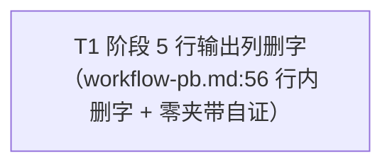

# pr-002-tasks.md — pr-002 内部任务图（阶段 5 输出契约去掉测试产出）

**迭代**: 0026-test-protocol-and-suite-reset ｜ **阶段**: 5（PR 实现）· **首波（3 PR 并发）** ｜ **PR 文件**: `prs/pr-002-stage5-output-contract-drop-tests.md`
**worktree 分支**: `feat/0026-pr-002-stage5-output-contract-drop-tests` ｜ **工作区地址**: `.pb-agents/worktrees/0026-test-protocol-and-suite-reset/.pb-agents/worktrees/0026-pr-002-stage5-output-contract-drop-tests`（本文件内一切写入与 git 写操作以该绝对地址为根，用 `git -C <该地址>`）
**任务总数**: **1**（T1）｜ **依赖图**: **单节点、零边、无环**（§2）｜ **架构基线**: `architecture.md` **v0.2.0**（§1.1 F02 的唯一改动对象 / §2.1 F02 行 / §3.1 ② / §6.2-2 Q16）｜ **功能规格基线**: `prd.md` **v0.3.0** + `prd/F02-stage5-output-contract-drop-tests.md`
**已解锁前提（实测）**: PR 文件的 `depends_on` = **（无）**；`:56` 现状与全部判据锚点已在**本 worktree** 一手核实（§0.3）⇒ 本任务图不含跨 PR 前置。三 PR 文件面两两不重叠（`architecture.md` §3.1），与 pr-001 / pr-003 并发无写冲突。

---

## 0. 范围、文件面与事实锚点

### 0.1 唯一改动面（本 PR 的规范 / 代码面；超出即 PR 验收 3 / 5 不通过）

| 文件 | 动作 | 内容 |
|---|---|---|
| `roles/workflow-pb/workflow-pb.md` | 修改（**仅 `:56`，行内删字**） | 阶段定义表阶段 5 行的「输出」列：`… + 代码 + 通过验证标准的测试` → `… + 代码`（删去 ` + 通过验证标准的测试`，共 30 字节）。**该行其余单元格逐字不变**：输出列仍含 `prs/pr-{NNN}-tasks.md`；推进条件列仍为「该 PR 验收标准全部通过；无简报外改动；对应 PR 文件存在（合并前置）」 |

### 0.2 零改动清单（防夹带；逐条不得出现在 `git diff --name-only`）

- **同文件其它行**：`:25` 版本行（仍 `**版本**: 0.13.0`）、`:50-51` 表头、`:52`（阶段 1）、`:53`（阶段 2）、`:54`（阶段 3）、`:55`（阶段 4）、`:57`（阶段 6）、`:59-61` 表下引用段，以及全文其余章节。
- **PR 验收 5 逐字列举的路径**：`roles/dev/dev.md`、`roles/verifier/verifier.md`、`roles/workflow-pb/data/**`（含 `formats.md` / `scm-protocol.md` / `workflow-pb-changelog.md`）、`.claude/skills/workflow-pb/SKILL.md`、`docs/iterations/**` 的既有历史引文。
- **本迭代其它 PR 的面**：`oamp/**`（pr-001）、`docs/iteration-time-analysis.md`（pr-003）。
- **不新增任何文件、不新增章节或说明文字**（F02 边界：Q1 / Q7「本次只改这一行」）。

### 0.3 读文件事实锚点（判据基础；2026-09-15 本 worktree 一手实读，逐条带 `文件:行号`）

**A1（`:56` 现状全文，逐字；451 字节，md5 = `327ece88c5ccc4a756274b64f97eb09e`）**：

```text
| 5 | PR 实现 | 逐 PR 在独立 **PR worktree** 分支、独立子 agent 中执行：先拆该 PR 内部的任务（子 agent 内部步骤，不产出全局任务图），再实现，产出最小实现 | 单个 `prs/pr-{NNN}.md` 文件 | `prs/pr-{NNN}-tasks.md`（该 PR 内部任务列表，供 dev 消费）+ 代码 + 通过验证标准的测试 | 该 PR 验收标准全部通过；无简报外改动；对应 PR 文件存在（合并前置） |
```

**A9（改后 `:56` 期望全文，逐字；421 字节，md5 = `c1d0f512203ad136f44ef3b2e8fbff89`；机械推导 = A1 删去 ` + 通过验证标准的测试` 这 30 字节）**：

```text
| 5 | PR 实现 | 逐 PR 在独立 **PR worktree** 分支、独立子 agent 中执行：先拆该 PR 内部的任务（子 agent 内部步骤，不产出全局任务图），再实现，产出最小实现 | 单个 `prs/pr-{NNN}.md` 文件 | `prs/pr-{NNN}-tasks.md`（该 PR 内部任务列表，供 dev 消费）+ 代码 | 该 PR 验收标准全部通过；无简报外改动；对应 PR 文件存在（合并前置） |
```

| # | 事实 | 核实方式 / 位置 |
|---|---|---|
| **A2** | 阶段定义表行号映射：`:52`=阶段 1、`:53`=阶段 2、`:54`=阶段 3、`:55`=阶段 4、**`:56`=阶段 5**、`:57`=阶段 6 | `grep -n "^\| [1-6] \| "` |
| **A3** | `通过验证标准的测试` 在 `roles/` 与 `.claude/` 全扫下**仅 1 处命中**，即 `:56` ⇒ 不存在需同步的第二份拷贝（F02 卡「`SKILL.md` 不需要同步」结论成立） | `grep -rn "通过验证标准的测试" roles/ .claude/` |
| **A4** | 该行**当前**含「测试」字样 **1 次**（即在待删短语内）；删后应为 **0 次**（行内其余文字零「测试」） | `sed -n '56p' \| grep -o 测试 \| wc -l`（改后同法复算） |
| **A5** | `roles/dev/dev.md:107` =「- 不写测试用例（除非简报明确要求）」；`:110` =「- 不派发子 agent、不跑全量测试套件、不碰真实 key 或生产资源」——**现行规则，本 PR 零改动** | `awk 'NR==107\|\|NR==110' roles/dev/dev.md` |
| **A6** | `.claude/skills/workflow-pb/SKILL.md` 全文 **415 行**，对 `测试` / `test`（大小写不敏感）**零命中** | `grep -c -i "test\|测试" .claude/skills/workflow-pb/SKILL.md` |
| **A7** | `:25` 版本行 = `**版本**: 0.13.0`；本迭代为**零版本动作**（Q16：不升版本、不追 `data/workflow-pb-changelog.md`） | `awk 'NR==25' roles/workflow-pb/workflow-pb.md`；`architecture.md` §6.2-2 |
| **A8** | 本 PR 的动作面**零代码、零测试产出**：`architecture.md` §2.1 F02 行判定「无架构空间」，§3.1 ② 的动作 = 「行内删字」；F02 卡的「架构维度」= 无待填项、「model_inferred」= 无 | `architecture.md` §2.1 / §3.1 ②；`prd/F02` 同名字段 |

### 0.4 现状缺口（本 PR 的靶点）

阶段 5 行的「输出」列当前向执行角色要求「+ 通过验证标准的测试」，而 `roles/dev/dev.md:107`（不写测试用例）与 `:110`（不跑全量测试套件）已是现行规则（A5）⇒ **同一工作流内两处口径互相矛盾**——这是 `demand.md` F-4 所指「三份文档口径矛盾」中**工作流侧的那一份**。本 PR 的落点 = 删掉工作流侧这一份要求（`dev.md` 侧不动，因其已与 Q4 裁决一致）。

---

## 1. 任务列表

### T1：阶段 5 行「输出」列删去测试产出要求（含零夹带自证）

**动作**：`roles/workflow-pb/workflow-pb.md:56` 行内删去 ` + 通过验证标准的测试`（8 个汉字 + 空格分隔符 = 30 字节），使该行「输出」列读作「`prs/pr-{NNN}-tasks.md`（该 PR 内部任务列表，供 dev 消费）+ 代码」。**行内其余单元格零字节改动**。

- **验收标准**:
  1. **目标短语清零（PR 验收 1 / F02 验收 1 / V-4）**：`grep -n "通过验证标准的测试" roles/workflow-pb/workflow-pb.md` **零命中**（退出码非 0）；`:56` 的「输出」列读作「`prs/pr-{NNN}-tasks.md`（该 PR 内部任务列表，供 dev 消费）+ 代码」。判据 = 本节末「验收命令」第 1 条的输出。
  2. **行级逐字锁（PR 验收 2 / F02 验收 2）**：改后 `sed -n '56p'` 的逐字内容等于 **A9** 的期望行（md5 `c1d0f512203ad136f44ef3b2e8fbff89`，421 字节）——即与 A1 的现状行相比**只少了那 30 字节**；输出列仍含 `prs/pr-{NNN}-tasks.md`；推进条件列仍为「该 PR 验收标准全部通过；无简报外改动；对应 PR 文件存在（合并前置）」。判据 = `md5sum` 相等（**不接受**"目视一致"）。
  3. **diff 面锁死在一行（PR 验收 3 / F02 验收 4）**：`git -C <工作区地址> diff --numstat roles/workflow-pb/workflow-pb.md` 输出为 `1	1	roles/workflow-pb/workflow-pb.md`（该文件仅一减一增、且为同一行 = `:56`）；`:25` 版本行仍为 `**版本**: 0.13.0`；无新增 / 改写章节。判据 = `git diff --numstat` + `awk 'NR==25'`。
  4. **相邻阶段行零改动（PR 验收 4）**：`git diff roles/workflow-pb/workflow-pb.md` 中出现的行号集合 ⊆ {`56`} ⇒ 阶段 2（`:53`）/ 3（`:54`）/ 4（`:55`）/ 6（`:57`）四行的输出列与推进条件列**零改动**。判据 = diff 的 hunk 头与行号。
  5. **改动面封闭（PR 验收 5）**：`git -C <工作区地址> diff --name-only` 的**规范 / 代码文件集合** = {`roles/workflow-pb/workflow-pb.md`}；PR 验收 5 逐字列举的五个路径（`roles/dev/dev.md`、`roles/verifier/verifier.md`、`roles/workflow-pb/data/**`、`.claude/skills/workflow-pb/SKILL.md`）**逐条不出现**；`docs/iterations/**` 的既有历史引文零改动（本文件 `prs/pr-002-tasks.md` 为阶段 5 新增产物，口径见 §4 登记 1）。判据 = `git diff --name-only` 集合比对。
  6. **与 `dev.md` 不再冲突（F02 验收 3）**：改后 `:56` 整行对「测试」**零命中**（A4 由 1 变 0）；`roles/dev/dev.md:107` / `:110` **原文在场且零改动**（A5）⇒ 工作流侧不再向 dev 要求测试产出。判据 = 两条 `grep` + `dev.md` 零改动。**本 PR 不新增任何跨文件判据、不改 `dev.md`**（F02 边界：「现行规则已与 Q4 一致」）。
  7. **零夹带（F02 边界逐条 / PR 验收 3·5 的合并面）**：不新增解释性章节或说明文字；不改阶段 5 的推进条件文字；不改阶段 2~4、阶段 6 的输出契约；不改 `roles/verifier/verifier.md` / `roles/dev/dev.md`；不升 `:25` 版本号；不追 `roles/workflow-pb/data/workflow-pb-changelog.md`（Q16）；不新增文件；**不产出测试**（本 PR 无实现代码可供测试，`architecture.md` §2.1 F02 行）。判据 = `git diff` 全量逐行过一遍 + 上述各条的机械判据。
- **前置依赖**: 无
- **优先级**: P0
- **追溯**: PR 文件「文件范围」（唯一一行）+ 验收标准 1~5；`architecture.md` **§1.1**（`:56` 为 F02 的唯一改动对象）、**§2.1 F02 行**（无架构空间）、**§3.1 ②**（文件面 = 行内删字）、**§6.2-2**（Q16 不留痕）；`prd/F02` 验收 1~4 与「边界（不包含）」全条；`prd.md` v0.3.0 §功能点索引 F02 行、§2「不做」清单第 2 项（不改任何角色文件）
- **交付物**: `roles/workflow-pb/workflow-pb.md`（`:56` 一行内删字）。**无测试产出、无新增文件**。

**验收命令（逐条可复制；`<工作区地址>` 取 §0.1 上方的绝对路径）**:

```bash
cd "<工作区地址>"
# 1) 目标短语清零
grep -n "通过验证标准的测试" roles/workflow-pb/workflow-pb.md; echo "exit=$?"   # 期望：无输出，exit=1
# 2) 行级逐字锁
sed -n '56p' roles/workflow-pb/workflow-pb.md | md5sum                          # 期望：c1d0f512203ad136f44ef3b2e8fbff89
sed -n '56p' roles/workflow-pb/workflow-pb.md | wc -c                           # 期望：421
sed -n '56p' roles/workflow-pb/workflow-pb.md | grep -o 测试 | wc -l            # 期望：0
# 3) / 4) diff 面
git -C . diff --numstat roles/workflow-pb/workflow-pb.md                        # 期望：1	1	roles/workflow-pb/workflow-pb.md
git -C . diff -U0 roles/workflow-pb/workflow-pb.md                              # 期望：仅 :56 一减一增
awk 'NR==25' roles/workflow-pb/workflow-pb.md                                   # 期望：**版本**: 0.13.0
# 5) 改动面封闭
git -C . diff --name-only                                                       # 期望：roles/workflow-pb/workflow-pb.md
# 6) 与 dev.md 同向
awk 'NR==107||NR==110' roles/dev/dev.md                                         # 期望：原文两条在场（本 PR 未改）
```

---

## 2. 依赖图、无环证明与粒度判断



- **依赖边集合** = ∅（空集）。
- **无环证明**：图中只有一个节点、零条边，不存在任何回路 ⇒ **无环**（空真成立，非"感觉没有环"）。图中**不含跨 PR 边**（PR 文件 `depends_on` =（无））。
- **拓扑序**：`T1`（唯一合法执行序）。
- **最长依赖链**：`T1`（单跳、0 条边）。**关键路径任务** = T1。
- **粒度判断（为什么是 1 个任务，而不是拆成「改字」+「收口核验」）**：按 planner 三条判据逐条验——
  ① **1-2 天工作量**：本 PR 的动作是一处 30 字节的文本删除；拆开后的每一片都**明显低于**下限，按「可以合并的任务先合并」应当合并；
  ② **能独立验收**：本 PR 的五条 PR 验收标准（短语清零 / 行级逐字锁 / diff 只一行 / 相邻行零改动 / 改动面封闭）**全部由同一次编辑的产物状态判定**——一个只做核验、不产生新产物的子任务，无法在 T1 完成前独立通过，拆它会造出"每个任务都依赖别的任务、独立验收不可能"的形态（角色定义已将其列为反面）；
  ③ **验收标准可测试**：T1 的 7 条验收标准均给出命令级判据（`grep` 退出码 / `md5sum` 值 / `--numstat` 计数 / diff 行号集合），都能在不运行程序的前提下判"通过 / 不通过"。
  ⇒ **结论：逻辑原子性成立，单任务即合规范**（与 `workflow-pb.md` §PR 粒度判断框架「纯文档变更，行数不是粒度信号，逻辑原子性才是」同向）。**本任务图不虚设"收口任务"**：核验命令已内联为 T1 的验收判据。
- **同文件写者唯一**：`roles/workflow-pb/workflow-pb.md` 仅由 T1 修改 ⇒ 无并发写冲突；本 PR 与 pr-001（`oamp/**`）、pr-003（`docs/iteration-time-analysis.md`）文件面零交集，**可安全并发**（`architecture.md` §3.1）。

---

## 3. 与 PR 验收标准逐条对位表

| PR 验收 # | 验收摘要 | 承接任务 | 对位说明（判据形态） |
|---|---|---|---|
| 1 | `grep -n "通过验证标准的测试"` 零命中；`:56` 输出列读作「…+ 代码」 | **T1** 验收 1 | `grep` 退出码非 0 + 读出文本 |
| 2 | 同行其余内容逐字不变（输出列仍含 `prs/pr-{NNN}-tasks.md`；推进条件列原文） | **T1** 验收 2 | 改后 `:56` 的 `md5sum` = `c1d0f512203ad136f44ef3b2e8fbff89`（421 字节） |
| 3 | `git diff roles/workflow-pb/workflow-pb.md` 只出现这一行（无第 2 行改动、无新增/改写章节、无版本号变更） | **T1** 验收 3（+ 验收 7 零夹带） | `git diff --numstat` = `1	1`；`:25` 版本行原样 |
| 4 | 阶段 2~4、阶段 6 对应行零改动 | **T1** 验收 4 | diff 行号集合 ⊆ {56} |
| 5 | `roles/dev/dev.md`、`roles/verifier/verifier.md`、`roles/workflow-pb/data/**`、`.claude/skills/workflow-pb/SKILL.md`、`docs/iterations/**`（历史引文）零改动 | **T1** 验收 5（+ 验收 7） | `git diff --name-only` 集合比对；`docs/iterations/**` 的口径见 §4 登记 1 |
| （F02 验收 3；PR 验收 1/2 的推论） | 改后与 `roles/dev/dev.md:107` / `:110` 不再冲突：工作流不再向 dev 要求测试产出 | **T1** 验收 6 | 改后该行「测试」计数 = 0 + `dev.md` 两条原文在场且零改动 |

**覆盖检查**：PR 文件的 **5** 条验收标准 → **全部有判据承接**（无遗漏）；F02 卡 4 条验收标准（其 1/2/4 与 PR 验收 1/2/3 同条，其 3 由 T1 验收 6 承接）→ 覆盖 **4/4**。T1 的 7 条验收标准**逐条可追溯到** `prd/F02`、PR 文件或 `architecture.md`（§5 追溯总表）——无凭空判据。

---

## 4. 边界与疑问（登记，提请主 agent）

1. **`docs/iterations/**` 零改动口径与本任务图自身的关系（口径登记，不自行裁断）**：PR 验收 5 的字面是「`docs/iterations/**`（历史引文）零改动」。本文件 `prs/pr-002-tasks.md` 是**阶段 5 的新增产物**（`roles/workflow-pb/workflow-pb.md` §文档路径协议 `:278`），不是历史引文——若阶段 6 用**字面** `git diff --name-only` 复核该条，须把「阶段 5 新增的 `prs/pr-{NNN}-tasks.md`」排除在「历史引文」之外，否则会把本阶段的合法产物判成违规。**本任务图不为该条改判**，仅登记口径供主 agent / 阶段 6 对齐。
2. **决策记录的落点未由工作流定义 ⇒ 不新写记录文件**：角色的决策记录落点是 `data/`（「路径由工作流定义」），而 `roles/workflow-pb/workflow-pb.md` 未定义 planner 的 `data/` 路径；`roles/planner/data/` 现有文件亦不含逐次记录（本 worktree 实查）。本 PR 的文件面被 PR 验收 3 / 5 物理锁死，写任何额外文件都会构成**简报外改动** ⇒ **不写**。§2 的粒度判断（"本可拆、但因独立验收价值为零而不拆"）依据已完整落在本文件内。
3. **Q16 不留痕的边界（两条顺手动作为失败判据）**：`architecture.md` §6.2-2 明记本迭代零版本动作 ⇒ 顺带改 `:25` 版本行属"该行之外的第 2 行改动"、在 `roles/workflow-pb/data/workflow-pb-changelog.md` 追加条目属 `data/**` 非零改动，**两者都直接命中 PR 验收 3 / 5 失败**。T1 验收 3 与 7 已把这两条写成机械判据。
4. **只读对照面（不改，但判据引用它）**：`roles/dev/dev.md:107` / `:110` 与 `.claude/skills/workflow-pb/SKILL.md` 是**一致性对照**（A5 / A6），非改动面——F02 验收 3「不再冲突」与「`SKILL.md` 无需同步第二份拷贝」两项结论，都由「这几处零改动 + `:56` 文本结果」共同判定，不需要新增文件或判据。`roles/verifier/verifier.md` 同理（其取证口径随协议延期，登记归 F09，见 `architecture.md` §6.2 第 1 行）。
5. **F02 验收 3 的判定强度说明（登记）**：该条写「不再冲突」，本任务图把它落成可判据的形态 =「改后该行对『测试』零命中」+「`dev.md:107` / `:110` 原文在场」。**不新增**任何跨文件一致性检查（F02 边界明令不改 `dev.md`，也无权要求 dev 侧新增判据）；若主 agent 认为需要更强判据（例如同时校验 `dev.md` 的版本或措辞），须由主 agent 另行裁决——**本任务图不自行扩面**。

---

## 5. 追溯总表（任务 → 输入）

| 任务 | `architecture.md` v0.2.0 | `prd/*.md`（v0.3.0） | PR 文件 |
|---|---|---|---|
| **T1** | §1.1（`:56` 为 F02 的唯一改动对象）、§2.1 F02 行（无架构空间）、§3.1 ②（文件面 = 行内删字）、§6.2-2（Q16 不留痕）、§7（新增实体 = 0） | `prd/F02` 验收 1~4 + 「边界（不包含）」全条 + 「架构维度：无待填项」；`prd.md` §功能点索引 F02 行、§2「不做」清单第 2 项（不改任何角色文件） | 「上下文摘要」、「文件范围」（唯一一行）、验收标准 1~5、`depends_on`（无） |

---

## 6. `[model_inferred]` 清单（需主 agent 确认）

**无。**

- F02 卡的「model_inferred」字段自述「无」（`prd/F02-stage5-output-contract-drop-tests.md`）；本任务图的全部判据均直接取自上表三份输入的**原文或机械推导**——A9 的期望行 = 现状行删去指定短语，属机械推导，不是架构推断 ⇒ 不存在需要主 agent 确认的推断项。
- 本 PR 无架构决策、无新增实体、无新增判据面（`architecture.md` §2.1 / §7；该文件 L1 = 无、L2 = 无、L3 = 无）。
