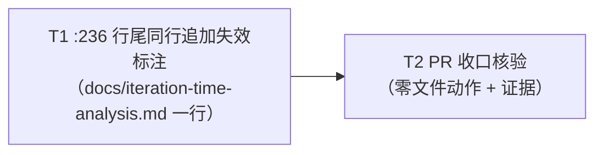

# pr-003-tasks.md — pr-003 内部任务图（影响面闭环登记 + 时延分析失效加注）

**迭代**: 0026-test-protocol-and-suite-reset ｜ **阶段**: 5（PR 实现）· **首波**（3 PR 并发，`depends_on` 全空）｜ **PR 文件**: `prs/pr-003-impact-surface-registration.md`
**worktree 分支**: `feat/0026-pr-003-impact-surface-registration` ｜ **工作区地址**: `.pb-agents/worktrees/0026-test-protocol-and-suite-reset/.pb-agents/worktrees/0026-pr-003-impact-surface-registration`（本文件内一切 git 命令用 `git -C <该地址>`）
**任务总数**: **2**（T1~T2）｜ **依赖图**: **无环**（见 §2）｜ **架构基线**: `architecture.md` **v0.2.0**（§2 无架构决策 / §3.1 ③ / §4.1 / §4.2 / §6.2-1 / §7 新增实体 = 0）
**已解锁前提（实测）**: 本 PR `depends_on` = **空**（Q-PR-1 裁决，记录见 `history.md` 2026-09-15 18:16）⇒ 与 pr-001 / pr-002 并发执行。本任务图**不写**跨 PR 前置，也**不判**其它 PR 的产物状态（见 §4）。

---

## 0. 范围、文件面与事实锚点

### 0.1 本 PR 的文件面（**唯一文件动作 = 1 行**）

| 文件 | 动作 | 内容 | 判据归属 |
|---|---|---|---|
| `docs/iteration-time-analysis.md` | 修改（**仅 `:236` 一行，行尾同行追加**） | `:236` 行尾追加失效标注：点明失效原因（**0026 迭代（F01）** 清洗 `oamp/test/`，该全量套件不再存在）与生效迭代（0026）；该行原有分析文字与数值逐字不变 | 本 PR 验收 1 / 2 / 3；F09 验收 2（V-5） |

**零文件动作面（同为本 PR 的交付面，但不动文件）**

| §5 行 | 位置 | 本 PR 的动作 |
|---|---|---|
| 1 | `roles/workflow-pb/workflow-pb.md:56` | 零动作（归 pr-002 验收 1） |
| 2 | `oamp/package.json`（`scripts.test`） | 零动作（归 pr-001 验收 2） |
| 3 / 3b | `oamp/README.md`（`:195` / `:101-102`） | 零动作（归 pr-001 验收 3） |
| 4 | `workflow-pb.md:56` 同行推进条件 | 零动作（随协议延期，Q15；登记在案） |
| 5 | `roles/verifier/verifier.md` | 零动作（随协议延期，Q15；登记在案） |
| 7 | `oamp/scripts/testenv.mjs` | 零动作（归 pr-001 验收 4 = F01 卡验收 6；编号口径见 §5 疑问 1 的已裁定读法） |
| 8 | `oamp/src/cluster-config.js:19` | 零动作（只登记不处置，Q19） |

**登记载体（三处均已存在 ⇒ 本 PR 只需"登记成立"，不需新写）**：`prs/pr-003-impact-surface-registration.md` 验收 4 的九行表、`prd/F09-impact-surface-registration.md` 验收 1 的九行处置表、`demand.md` §5 表（`:91-99`），另 `architecture.md` §6.2-1（第 4/5 行随协议延期）。

### 0.2 非目标（防夹带；违反即 PR 验收 3 / 5 不通过）

- **不重写既有分析**：`docs/iteration-time-analysis.md` 除 `:236` 行尾追加外**零改动**——不改既有数值、不加新数值、不加新建议、不新增章节、不新增标记段（该文档无版本段、无变更说明节，见 A4 ⇒ 不存在"加注须同步版本 / changelog"的隐含动作）。
- **不为其他历史文档追加失效标注**（F09 边界；§5 只列 `:236` 这一处）。
- **不承载协议内容**：不新增协议节 / 替代卡 / 占位文件 / `roles/workflow-pb/data/**` 改动（协议随 Q15 延期，承载形态是 L1 级决策，本 PR 不涉）。
- **不代行其它 PR 的处置**：`oamp/package.json`、`oamp/README.md`、`oamp/scripts/testenv.mjs`、`roles/workflow-pb/workflow-pb.md` 在本 PR diff 内 **0 hunk**（见 §4）。
- **不回改 0025 迭代产物**（Q6）。

### 0.3 读码事实锚点（判据基础；本 worktree 一手实测）

| # | 事实 | 位置 / 命令 |
|---|---|---|
| **A1** | 目标文件共 **284** 行；`:236` 原文 **91 字符 / 165 字节**，逐字为：`` - **测试执行本身不是瓶颈**：全量测试 `node --test oamp/test/*.test.js` 约 64 秒（0021 收口记录），相对 13 分钟的验收派发可忽略。 `` | `docs/iteration-time-analysis.md` |
| **A2** | 文件 md5 = `31aa70fa18a7834cc3c10f2f39213478`，与 `iteration/0026-test-protocol-and-suite-reset` 版本 **md5 相同** ⇒ 基线无既有改动 | `md5sum docs/iteration-time-analysis.md` |
| **A3** | `:236` 所在邻域 = `## 7. 时间口径之外：产出侧的观察`（`:232`）的三条 bullet（`:234` / `:235` / `:236`）⇒ 只动 `:236` 时上下两条 bullet 与节标题均不动 | 同上 |
| **A4** | 该文档**无版本段、无变更说明节**（`grep -n "变更说明\|版本\|v0\." docs/iteration-time-analysis.md` 零命中）⇒ 不存在"加注须同步文档版本 / changelog"的隐含动作 | 同上 |
| **A5** | 基线 = 本 worktree 分支尖 **`bffc336`**（= 与 `iteration/0026-test-protocol-and-suite-reset` 的 merge-base）；迭代分支另有 `7d5c954`（`+22` 行，**仅** `history.md`，主 agent 的阶段 5 派发记录）⇒ 直接与迭代分支 diff 会带出 `history.md` 噪声，**判据基线一律取 `bffc336`**（见 §7 MI-2） | `git rev-parse HEAD` / `git merge-base` / `git show --stat 7d5c954` |
| **A6** | 本 worktree（base `bffc336`）中 `oamp/test/` 与 `oamp/scripts/testenv.mjs` **仍在场**（pr-001 未合并）⇒ 加注所述"0026 已清洗"的**字面仓库状态**要 pr-001 合并后才为真（见 §5 疑问 2） | `ls oamp/test`、`ls oamp/scripts` |
| **A7** | PR 验收 3 的「同一行的增补」可机械判读为：该文件 diff **恰好一对 `-` / `+`**（单 hunk；`--numstat` 删除列 = 1、新增列 = 1），且 `-` 行 = 基线 `:236` 全文、`+` 行 = `-` 行 + **非空后缀**（前缀逐字相等）；文件总行数仍 **284** | `git diff --unified=0 docs/iteration-time-analysis.md` |
| **A8** | 阶段 5 输出契约**强制** `prs/pr-003-tasks.md` 存在（`workflow-pb.md` §阶段定义 阶段 5 + §文档路径协议）⇒ 该文件本就是本 worktree 内的**新增 docs 文件**；PR 验收 3 / 5 的判定面须区分「实现面」与「阶段 5 计划产物面」（见 §7 MI-3；先例 0023 pr-003-tasks §7 MI-7） | 同上 |
| **A9** | 第 4 行与第 1 行**同文件不同行**（`roles/workflow-pb/workflow-pb.md:56`）：第 1 行归 pr-002 处置、第 4 行零动作 ⇒ 本 PR 对该文件 0 hunk 是第 4 行的判据，pr-002 对该文件的改动属第 1 行的处置，两者不冲突 | `demand.md` §5 表 |
| **A10** | `prd/` 恰有 3 张卡（F01 / F02 / F09）；`prs/` 恰有 3 个 PR 文件 | `ls prd/`、`ls prs/` |

**A7 的判据程序实测（在临时副本上一次性验证，未触碰仓库与任何受版本控制的文件）**：`--numstat` 输出 = `1	1	docs/iteration-time-analysis.md`；`--unified=0` 的 hunk 头 = `@@ -236 +236 @@`（恰一对 `-` / `+`）；文件行数 284 不变；`+` 行前缀比对为真、后缀非空。
**反例（同一次实测）**：把标注写成**另起一行** ⇒ 文件行数变 285、单 hunk 判读失败 ⇒ T1 验收 1 直接判"不通过"（这正是 PR 验收 3「非新增行」的字面含义）。

### 0.4 现状缺口（本 PR 的靶点）

`:236` 的结论「测试执行本身不是瓶颈……相对 13 分钟的验收派发可忽略」建立在"存在一份可跑的全量套件（约 64 秒）"这一前提上。0026 清零 `oamp/test/**`（F01）后该前提消失，而本行文字原样保留 ⇒ 读者（人 / agent）会把"测试耗时可忽略"读成对当前仓库仍然成立的判断。F09 的验收 2（V-5）要求"读到该句即能看到失效标注" ⇒ 本 PR 的落点 = 就地加注，使该行不留悬空承诺。

---

## 1. 任务列表

### T1：`docs/iteration-time-analysis.md:236` 行尾同行追加失效标注（**本 PR 唯一文件动作**）

- **验收标准**:
  1. **加注在场且同行（PR 验收 1 前半 / F09 验收 2 / V-5）**：`docs/iteration-time-analysis.md` 第 236 行**行尾**存在失效标注；文件总行数仍 **284**（未新增行、未删除行）；`git -C <工作区地址> diff --numstat` 对该文件输出 `1	1`（该文件的改动是**同一行的替换式增补**，非新增行、非删除行）。判据：`--numstat` + 行数清点 —— 可执行。
  2. **原句逐字保留（PR 验收 2 / F09 验收 2）**：diff 的 `-` 行**逐字等于**基线 `:236`（A1 原文）；`+` 行以该行为**逐字前缀**（原字符零改写、零插入、零删除，含 `` `node --test oamp/test/*.test.js` `` 的反引号与 `*` 原样）；追加文本非空。判据：`git -C <工作区地址> diff --unified=0 docs/iteration-time-analysis.md` 的 `-` / `+` 逐字对照 + 三条在场检索（`grep -F`）：「`` node --test oamp/test/*.test.js ``」、「约 64 秒」、「0021 收口记录」仍在同一行，且「相对 13 分钟的验收派发可忽略」未被改写。**可执行**（A7 的判读形态，已在临时副本上实跑验证）。
  3. **标注点明两点语义（PR 验收 1 后半 / F09 验收 2；措辞口径 = 主 agent 裁定，见 §5 疑问 2）**：追加文本 ① 点明**失效**并给出**原因**——须以「**0026 迭代（F01）** 清洗 `oamp/test/`」这一措辞点明（「F01」字样与「清洗 `oamp/test/`」在场 ⇒ 指明这是 F01 的动作、不是对既成事实的断言），且"该全量套件不再存在"这一语义在场；② 点明**生效迭代 0026**。判据：读该行追加文本，两点各在场。
  4. **不引入第三点（F09 边界 + PR 验收 5 的直接推导）**：追加文本不含新分析、新数值（如"当前套件耗时 X"）、新建议（"应改为 / 建议 / 需重建"类劝告），也不描述任何替代机制（无 CI / hook / 替代 script 的提及）。判据：读追加文本 + 与 F09 边界句对照。
  5. **文档其余行零改动（PR 验收 2 后半）**：该文件 diff 只有上述一对 `-` / `+`（**单一 hunk**，无第二处）；`:232` 节标题、`:234` / `:235` 两条 bullet 逐字不变；无新增 `##` / `###` 标题（由验收 1 的"行数不变 + 单 hunk"蕴含）。判据：diff 单 hunk + 行数 284 不变。
  6. **落点封闭（PR 验收 3 的 T1 面）**：本任务只写该文件一行；`oamp/**`、`roles/**`、`docs/iterations/**` 在本任务 diff 内 **0 hunk**（`prs/pr-003-tasks.md` 按 §7 MI-3 归计划产物面，不计入实现面）。判据：`git diff --name-only bffc336` 集合。
- **前置依赖**: 无
- **优先级**: P0
- **追溯**: PR 验收 1、2、3、5；`prd/F09` 验收 2 + 边界（不重写分析内容与数值、不为其他历史文档追加标注）+ `model_inferred` 1（加注 = 本迭代交付物）；`architecture.md` §3.1 ③（`:236` 仅一行 / 行尾加注）、§2（无架构决策）、§7（新增实体 = 0）
- **交付物**: `docs/iteration-time-analysis.md`（`:236` 一行）
- **建议形态（非约束，判据只判验收 1~4）**: 追加文本可直接续在句末，例如 `（0026 加注：本结论已失效——0026 迭代（F01）已清洗 oamp/test/，该全量套件不再存在。）`；风格与文档既有体例一致（全角括号 / `——` / 反引号引路径）。**不指定固定标记词或前缀**（主 agent 裁定：形态自由，但必须同时满足 MI-1 的机械化判据）；不得使用换行 / ` ` 实现"追加"（否则验收 1 的"行数不变 + 单 hunk"不成立）。

### T2：PR 收口核验（零文件动作 + 可复核证据）

> **本任务零文件动作**：F09 的第 4/5/8 行与第 1/2/3/3b/7 行的**登记**已由阶段 4 产物承载（§0.1 的三处载体，均已存在），本任务的产出 = **逐条可核查的验收证据**。若核验发现需要改代码或改 `prs/` / `prd/` 产物 ⇒ 说明 T1 越界或上游有缺口，按 §5 上报主 agent，**不得就地扩面、不得修改上游产物**。

- **验收标准**:
  1. **九行归属逐行可核查、四处声明互不否定（PR 验收 4）**：对 1 / 2 / 3 / 3b / 4 / 5 / 6 / 7 / 8 逐行给出「位置 → 归属主体（pr-001 / pr-002 / 本 PR / 随协议延期 / 只登记不处置）→ 处置 → 上位声明」对照，来源四处 = `prs/pr-003-impact-surface-registration.md` 验收 4 表、`prd/F09-*.md` 验收 1 表、`demand.md` §5 表（`:91-99`）、`architecture.md` §6.2-1。**过关条件 = 归属主体在四处表述一致、无相互否定**。第 7 行的验收编号已裁定：**判据编号一律以「F01 卡序号」为准**（卡是验收的上游真源，PR 文件的 bullet 是它的投影）⇒ 第 7 行 = **F01 卡验收 6**（对应 pr-001 PR 文件的验收 bullet 4）；`prs/pr-003-impact-surface-registration.md` 九行表该格已由**主 agent 亲自更正**为「pr-001 验收 4（= F01 卡验收 6；V-1 同族）」，本任务按此口径核读（详见 §5 疑问 1）。判据：逐行读出 + 对照表在场（零文件动作，证据落在本任务的交付说明 / 验证材料）。
  2. **零文件动作行确为零动作（PR 验收 4 后半 / F09 验收 4）**：`git -C <工作区地址> diff --name-only bffc336` **不含** `roles/workflow-pb/workflow-pb.md`、`roles/verifier/verifier.md`、`oamp/src/cluster-config.js` ⇒ 第 1/4/5/8 行所在文件在本 PR 内 0 hunk（第 1 行归 pr-002、第 4/5/8 行只登记）。判据：路径集合比对（本分支 base 早于其它 PR 合并 ⇒ 命中即越界）。
  3. **改动面封闭（PR 验收 3 / F09 验收 4）**：`git -C <工作区地址> diff --name-only bffc336` 的**实现面** = 恰好 `docs/iteration-time-analysis.md` 一个路径；`git status --porcelain -uall` 无未跟踪残留（`prs/pr-003-tasks.md` 按 §7 MI-3 归计划产物面）。判据：集合相等 + 逐条比对。
  4. **零新增实体 / 不承载协议内容（PR 验收 5）**：`prd/` 仍 **3** 张卡（F01 / F02 / F09，无替代卡）；`roles/workflow-pb/data/**` 0 hunk（无协议节 / 无占位文件）；`docs/iterations/**` 内除本 PR 任务图外零新增（不为其他历史文档追加失效标注）。判据：`git diff --name-only` + 路径清点。
  5. **未代行跨 PR 判据（PR 文件「跨 PR 判据归属声明」）**：本 PR diff 对 `oamp/package.json`、`oamp/README.md`、`oamp/scripts/testenv.mjs`、`roles/workflow-pb/workflow-pb.md` 各 **0 hunk** ⇒ 未代行 pr-001 验收 2 / 3 / 4（见 §5 疑问 1）与 pr-002 验收 1 的处置；且本任务图的验收标准**不含**对这四个文件**改动后状态**的任何判定（自检：本文件全文检索这四个路径，只出现在「归属声明 / 不判」上下文）。判据：diff 命中集合 + 全文检索对照。
  6. **证据可复算（供阶段 6 收口）**：T1 的三项证据（`--numstat` 行、`-` / `+` 逐字对照与三条 `grep -F` 在场、文件行数 284）与本任务的四处对照表齐备，逐条可独立复算。判据：证据在场。
- **前置依赖**: T1（收口核验须在唯一文件动作就位后）
- **优先级**: P0
- **追溯**: PR 验收 3、4、5 + 「跨 PR 判据归属声明」；`prd/F09` 验收 1（登记面）、验收 4（改动面与 §5 处置列一致）+ 边界（不承载协议内容）；`architecture.md` §3.1 ③、§4.1 / §4.2（判据读取边）、§6.2-1（第 4/5 行随协议延期）、§7（新增实体 = 0）
- **交付物**: 无代码 / 无文件动作（验收证据）

---

## 2. 依赖图（无环）

- **拓扑序**：`T1 → T2`。
- **无环证明**：边集合 = `{T1→T2}`（单边、无回边、无跨层边）⇒ 存在拓扑序 `T1 < T2` ⇒ **无环**。
- **最长依赖链 / 关键路径**：`T1 → T2`（2 跳）；关键路径任务 = **T1、T2**。
- **可并行面**：无（本 PR 只有一行文件动作与一次收口核验，拆并行无独立验收价值）。
- **同文件串行约束**：`docs/iteration-time-analysis.md` 的**唯一写者 = T1**（T2 零写）；`prs/pr-003-tasks.md` 由 planner 写入，dev 阶段不改（改它即越界）。
- **粒度说明（planner 判据 ①1~2 天 ②可独立验收 ③验收可测试）**：T1 = 单行加注 + 其行级判据，判据全部只依赖 T1 自身产物 ⇒ 满足 ②③，工作量远低于 1 天（不再下拆：拆"写文本"与"验文本"会产生互相依赖的两格，独立验收价值为零）。T2 = "不改"的机械核验面（PR 验收 4/5 无其它承接者；PR 验收 3 需全 PR 面视角）⇒ 满足 ②③；与 T1 合并会失去「内容正确」与「改动面封闭」两个可分别失败的面 ⇒ 拆开的独立验收价值成立（先例 0023 pr-003-tasks T4 同一体例）。
- **传递约定（`[model_inferred]` 传递）**：T1 产出的 **diff 一对 `-` / `+` + 行号 236 + 文件行数 284** 是 T2 验收 6 的唯一输入接口；T2 的四处对照表是阶段 6 复核 §5 登记面的输入。

---

## 3. 与 PR 验收标准逐条对位表

| PR 验收 # | 验收摘要 | 承接任务 | 对位说明 |
|---|---|---|---|
| 1 | `:236` 行尾存在失效标注，点明失效原因与生效迭代 | **T1**（验收 1、3） | 判据 = 基线行 + 非空后缀（同行单 hunk）+ 追加文本含两点语义 |
| 2 | 原句逐字保留；该文档其余行零改动 | **T1**（验收 2、5） | 判据 = `-` 行逐字 + `+` 行前缀逐字 + 三条 `grep -F` 在场 + 单 hunk + 行数 284 |
| 3 | `git diff --name-only` 只含该文件；该文件 diff 为同一行的增补 | **T1**（验收 1、6）+ **T2**（验收 3） | 行级形态在 T1；全 PR 文件集合在 T2（基线 `bffc336`，见 §7 MI-2 / MI-3） |
| 4 | §5 九行逐行有可核查归属结论、与 `prd/*.md` 及三个 PR 文件声明互不冲突 | **T2**（验收 1、2、5） | 判据 = 四处对照表 + 零文件动作行 0 hunk；第 7 行编号按 §5 疑问 1 的已裁定口径（F01 卡序号 = 验收 6）核读 |
| 5 | 不新增文件、不为其他历史文档追加标注、不承载协议内容 | **T1**（验收 4）+ **T2**（验收 4） | 判据 = 追加文本无第三点 + `prd/` 3 卡 + `data/**` 0 hunk + 无占位文件 |

**跨 PR 判据归属声明（PR 文件 4 条）的对位**：全部由 T2 验收 1 / 5 的「只登记、不判定」承载，**不写入任何任务的验收标准**（见 §4）。

**覆盖检查**：PR 的 **5 条**自身可判判据 → **全部有任务承接**（无遗漏）；T1 / T2 的每条验收标准均可在 §6 追溯到 `architecture.md` / `prd/*.md` / PR 文件（无凭空判据）。

---

## 4. 跨 PR 归属（本 PR **不判**的清单，Q-PR-1）

| 上游判据 | 实际判定面 | 承载者 | 本 PR 的动作 |
|---|---|---|---|
| F09 验收 1 第 1 行（V-4 零命中） | `roles/workflow-pb/workflow-pb.md`（pr-002 改动后） | pr-002 验收 1（其 PR 文件第 1 条）= F02 卡验收 1 | 只登记（§0.1） |
| F09 验收 1 第 2 行（V-2 零命中） | `oamp/package.json`（pr-001 改动后） | pr-001 PR 文件验收 bullet 2 = F01 卡验收 2 | 只登记 |
| F09 验收 1 第 3 / 3b 行（V-3 零命中） | `oamp/README.md`（pr-001 改动后） | pr-001 PR 文件验收 bullet 3 = F01 卡验收 3 | 只登记 |
| F09 验收 1 第 7 行（V-1 同族：`ls` / `git ls-files`） | `oamp/scripts/testenv.mjs`（pr-001 删除后） | **F01 卡验收 6**（= pr-001 PR 文件验收 bullet 4；编号口径见 §5 疑问 1） | 只登记 |
| F09 验收 3（可执行引用零命中）、验收 4（改动面逐文件核对） | 三个 PR **合并后**的仓库状态 | **阶段 6** 端到端验证 | 不判（迭代级收口） |

**编号口径（主 agent 裁定 2026-09-15）**：判据编号一律以「**F01 / F02 卡序号**」为准（卡是验收的上游真源，PR 文件的 bullet 是其投影）；本表两列并记，便于交叉核读。

**依据**：Q-PR-1 裁决（`history.md` 2026-09-15 18:16）——「下游判据读上游产物状态」不构成 `depends_on`；本 PR 与 pr-001 / pr-002 文件面两两零交集（`oamp/**` / `roles/workflow-pb/workflow-pb.md` / `docs/iteration-time-analysis.md`），三 PR 依赖图无边 ⇒ 首波并发成立。

---

## 5. 边界与疑问（主 agent 已于 2026-09-15 逐条裁定）

1. **第 7 行的验收编号口径（已裁定 2026-09-15）**：`prs/pr-003-impact-surface-registration.md` 的九行表把第 7 行判据写作「pr-001 验收 6（V-1 同族）」。实测：**pr-001 PR 文件**的验收 bullet 序为 1 `oamp/test/`、2 `package.json`、3 `README`、**4 `oamp/scripts/testenv.mjs`**、5 无替代机制、6 `src`/`web`/`bin` 冻结面、7 diff 面；而 **F01 卡**的验收 6 = `testenv.mjs`。⇒ 该编号在「PR 文件 bullet 序」下不成立、在「F01 卡序号」下成立；**实质归属（归 pr-001）两种读法一致**，故不阻塞本 PR。PR 验收 4 要求「与三个 PR 文件的声明互不冲突」，其判定读法（按 PR 文件编号判 → 视为引用不精确；按卡编号判 → 通过）**主 agent 裁定：判据编号一律以「F01 卡序号」为准**（卡是验收的上游真源，PR 文件的 bullet 是它的投影）⇒ 第 7 行 = **F01 卡验收 6**；`prs/pr-003-impact-surface-registration.md` 九行表该格由主 agent 亲自更正为「pr-001 验收 4（= F01 卡验收 6；V-1 同族）」，**本 PR 不修改 PR 文件**（角色红线：不改上游产物）；本任务图按 F01 卡序号引用。
2. **加注内容与仓库即时状态的时序（登记备查，非本 PR 判据）**：如 A6，本分支 base `bffc336` 上 `oamp/test/` 与 `oamp/scripts/testenv.mjs` **仍在场**（pr-001 未合并）⇒ 加注所述"0026 已清洗 `oamp/test/`"的**字面仓库状态**要到 pr-001 合并后才为真。本 PR 判据只判「标注点明该原因」（PR 验收 1 原文），不判仓库当时状态（跨 PR 状态归阶段 6）。**主 agent 裁定（2026-09-15）**：加注文本必须写「**0026 迭代（F01）清洗 `oamp/test/`**」这一措辞（点明是 F01 的动作、不是对既成事实的断言）⇒ 已落进 T1 验收 3；即便 pr-001 后行也不构成假陈述。风险登记保留：若 pr-001 最终判失败 / 阻塞，需回看本 PR。
3. **任务图自身是否计入 PR 验收 3 / 5 的判定面**：见 §7 MI-3（先例 0023 pr-003-tasks §7 MI-7）。本文件按「实现面 / 阶段 5 计划产物面」二分判读，**已由主 agent 确认生效（2026-09-15）**——与 pr-002 同类问题同一裁决。
4. **加注形态的自由度**：见 §7 MI-1。上游只钉「行尾同行追加 + 点明两点语义」，未钉措辞 / 标记字符；**主 agent 裁定（2026-09-15）**：形态自由，但必须同时满足 MI-1 的机械化判据；**不指定**固定标记词或前缀（那会变成对格式的过度约束）。
5. **「协议延期」的登记边界（仅登记，非本 PR 职责）**：第 4/5 行的处置随协议迭代（Q15），本迭代只要求登记成立（载体见 §0.1，均在阶段 4 产物中）；协议承载形态是 L1 级决策 ⇒ 本 PR 无协议文本、无替代卡、无占位文件（PR 验收 5 / F09 边界）。

---

## 6. 追溯总表（任务 → 输入）

| 任务 | `architecture.md`（v0.2.0） | `prd/*.md` | PR 文件 |
|---|---|---|---|
| **T1** | §3.1 ③（`docs/iteration-time-analysis.md` `:236` **仅一行** / 行尾加注）、§2（无架构决策）、§7（新增实体 = 0） | `F09` 验收 2 + 边界 + `model_inferred` 1 | 验收 1、2、3 前半、5；文件范围 `docs/iteration-time-analysis.md` |
| **T2** | §3.1 ③、§4.1 / §4.2（判据读取边：F01→F09、F02→F09）、§6.2-1（第 4/5 行随协议延期）、§7 | `F09` 验收 1、4 + 边界 | 验收 3 后半、4、5 + 「跨 PR 判据归属声明」 |

---

## 7. 口径裁定记录（原 `[model_inferred]` 清单）

**裁定状态**: **MI-1 / MI-2 / MI-3 / MI-4 四项已于 2026-09-15 由主 agent 逐条确认生效**（无遗留待确认项）；`model_inferred` 标记已按裁定移除。MI-2 另被升级为**迭代级约定**（口径来源写作「主 agent 裁决（全迭代约定）」）。

| # | 位置 | 推断内容 | 依据 |
|---|---|---|---|
| **MI-1**（已由主 agent 确认生效 2026-09-15） | T1 验收 1 / 2 | 「行尾**同行**追加」的机械判读 = 该文件 diff 恰一对 `-` / `+`（`--numstat` = `1 1`）+ `-` 行逐字等于基线 `:236` + `+` 行以基线行为逐字前缀 + 文件行数 284 不变 | PR 验收 1（"行尾存在标注"）/ 2（"逐字保留"）/ 3（"同一行的增补"）未给机械形态；planner 契约要求判据能回答"通过 / 不通过" |
| **MI-2**（已由主 agent 确认生效 2026-09-15；并升级为**迭代级约定**） | T2 验收 3 / 5（及 T1 验收 6） | 改动面判据的**基线取 `bffc336`**（交接点分支尖），**不取** `iteration/0026-test-protocol-and-suite-reset` | A5 实测：迭代分支已被主 agent 追加 `history.md`（`7d5c954`，+22 行、仅该文件）⇒ 与迭代分支直接 diff 会带出 `history.md`，误判 PR 验收 3「只含 `docs/iteration-time-analysis.md`」。口径来源 = **主 agent 裁决（全迭代约定）**：迭代分支会随主 agent 提交 status/history 前进，三个 PR 的改动面判据一律取各自交接点分支尖；本 PR 的基线 = `bffc336`（亦可用「本 PR 的提交范围」等价表达） |
| **MI-3**（已由主 agent 确认生效 2026-09-15） | T2 验收 3 / 4 | `prs/pr-003-tasks.md` 本身**不计入** PR 验收 3（`git diff --name-only` 只含 `docs/iteration-time-analysis.md`）与验收 5（不新增文件）的判定面；判定面二分 = 实现面 / 阶段 5 计划产物面 | A8：阶段 5 输出契约强制该文件存在；先例 0023 pr-003-tasks §7 MI-7（同一体例）。**裁决：判定面二分成立**（实现面 / 阶段 5 计划产物面），与 pr-002 同类问题同一裁决。 |
| **MI-4**（已由主 agent 确认生效 2026-09-15） | T1 验收 4 | 「不引入第三点」（禁新分析 / 新数值 / 新建议 / 替代机制描述） | F09 边界「只加失效标注（外科手术式）」「不重写该文档的既有分析与数值」「不为其他历史文档追加失效标注」+ PR 验收 5（不承载协议内容）的直接推导；上游未逐字列举禁项。**裁决：采纳**。 |
