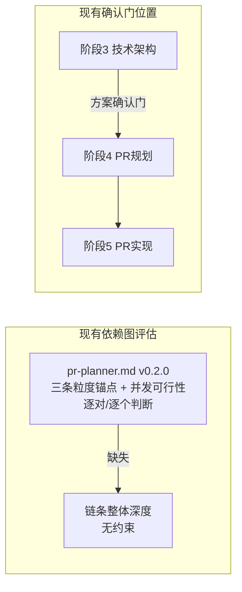

# architecture.md — 0027-pr-planner-wave-cap

**版本**: 0.1.0
**迭代**: 0027-pr-planner-wave-cap
**创建日期**: 2026-09-15
**阶段**: 技术架构（阶段 3）
**输入**: `docs/iterations/0027-pr-planner-wave-cap/prd/F01~F04.md`（已收敛）+ 现有 `roles/pr-planner/pr-planner.md`（v0.2.0）+ `roles/workflow-pb/workflow-pb.md`（v0.13.0）+ `roles/workflow-pb/data/formats.md`（v1.0.0）+ `.claude/skills/workflow-pb/SKILL.md`（v1.14.0，工作区外，只读）

**说明**：本迭代的"代码库"就是上述规范/流程文档本身。本文件只产出**技术路径**（改哪个文件的哪个章节、写成什么内容），不直接执行改动——按 architect 角色边界，实际文本改写是阶段 5（PR 实现）由 `dev` 角色基于阶段 4（`pr-planner`）拆出的 PR 完成。

---

## 现状分析



- `pr-planner.md`（v0.2.0）的三条粒度锚点（逻辑原子性/可审查性/独立性）和 v0.2.0 新增的"并发可行性"检查都是**逐个/逐对判断**：判断一个 PR 该不该拆、判断一对 PR 之间该不该有依赖——但没有一条约束"整条依赖链有多深"。0025 迭代的真实案例（`pr-001→pr-002→pr-003→pr-004→{pr-007,pr-008,pr-009,pr-010}`，链长 5）证明了这一点：每一对局部判断都合理，链条整体却无限累加。
- `workflow-pb.md`（v0.13.0）的"方案确认门"当前位于"阶段3→4之间"，只呈现产品维度 + 架构维度两部分，不含 PR 拆分方案信息——用户对"这次迭代最终要跑几轮"这件事，要等到阶段4完成、甚至阶段5执行中才能感知到。
- `.claude/skills/workflow-pb/SKILL.md`（v1.14.0）是 `workflow-pb.md` 面向 Claude Code 宿主的镜像实现，其中重复了一份"方案确认门"的具体触发/呈现逻辑，需要同步改动，但该文件不在本迭代工作区（`/Users/chenchiyuan/.claude/skills/workflow-pb/SKILL.md`）内，按「跨工作区写入禁止」规则，本文件只给出**同步清单**，由主 agent 在收口时手动执行。

---

## 技术决策总览

| 决策点 | 级别 | 结论 |
|---|---|---|
| 关键路径长度的度量方式 | L2 | 依赖图最长链节点数（复用 `depends_on` 结构），不引入工时估算 |
| "建议拆分为多个迭代"结论的呈现形式 | L2 | 落盘为 `prs/split-suggestion.md`（仅触发时创建），报告契约摘要引用 |
| 阶段4推进条件是否扩展 | L2 | 扩展为六项（新增并发可行性、关键路径压平结果），供确认门直接复用 |
| 结构性自检执行方式 | L2 | 复用阶段4推进条件核查结果，不独立重新执行（对应 F04 `[架构待填]`） |
| 是否新增独立暂停机制 | L2（沿用 demand 决策） | 不新增，确认门挪位后天然覆盖 |

**L1 决策清单：无**——本迭代所有改动都是在既有 `depends_on` 依赖图数据结构和既有阶段推进条件表基础上做的局部扩展，不引入新技术栈，不改变 `pr-planner`/`workflow-pb` 任何一方的核心职责边界（pr-planner 仍只产出 PR 边界和依赖，workflow-pb 仍只做调度不做判断执行）。

---

## F01 · pr-planner 关键路径硬约束与合并压平规则

**技术路径**：改 `roles/pr-planner/pr-planner.md`（版本 0.2.0 → 0.3.0）。

### 1. Strategy 章节新增子章节

位置：插在现有 **PR 粒度判断锚点**（三条）之后、**并发可行性（推进条件）** 之前——顺序对应 demand D-4 "关键路径检查在 Work 阶段做、并发可行性检查维持在 Verify 阶段做"，Work 先于 Verify，Strategy 里的呈现顺序应反映这个先后关系。

新增内容（原文建议）：

```markdown
### 关键路径长度（Work 阶段硬约束）

**定义**：依赖图中最长依赖链上的 PR 数（从入度为 0 的 PR 起，沿 `depends_on`
反向边计算的最长路径节点数）。

**硬上限**：3。关键路径长度 > 3 判定为不合格——不是"建议压缩"，是必须处理的
强制条件。

**检查时机**：Work（分组）阶段，`depends_on` 依赖图初步构建完成后，作为硬约束
参与分组决策——不是仅在 Verify 阶段事后核查。

**超限处理规则（合并循环）**：
1. 计算当前依赖图的关键路径长度。≤3 → 结束循环，进入后续 Verify（并发可行性
   检查等）。
2. >3 → 在关键路径上找出全部相邻依赖对（A→B，A、B 均在关键路径上），按以下
   规则排序取最优候选：
   - **合并排序规则**：优先合并"B 的验收标准必须等 A 的产出才能判断"（即 B
     的独立验收价值最低）的相邻对——这类对本来就没有独立提交的价值，合并零
     信息损失。
3. 对排序最优的候选对，做**合并前置检查**：这次合并是否会违反"逻辑原子性/
   可审查性"锚点（例如被迫把互不相关的功能揉进一个 PR，reviewer 需要切换
   心智模型）？
   - 不违反 → 执行合并（文件范围取并集、验收标准取并集、depends_on 按合并
     后的图重新计算），回到步骤 1 重新计算关键路径
   - 违反 → 立即停止合并循环，转出"建议拆分为多个迭代"结论（见下方「合并
     受阻：建议拆分为多个迭代」），不得为了凑够关键路径 ≤3 而强行合并
4. 不设合并次数上限——每次合并都要过步骤 3 的原子性/可审查性关卡，天然收敛。

**决策理由（L2，已选定）**：用"依赖图最长链节点数"而不是"预估工时求和"衡量
关键路径——前者直接复用 pr-planner 已有的 `depends_on` 图结构，后者需要新增
工时估算字段（现有七字段格式之外的新数据），属于不必要的实体膨胀，与「并发
可行性」维度 v0.2.0 已经做出的同一选择保持一致。

#### 合并受阻：建议拆分为多个迭代

当步骤 3 的合并前置检查判定"违反锚点"、合并循环被迫停止、且此时关键路径仍
>3 时：

- **停止动作**：立即停止合并循环——不得为了让数字达标而强行合并两个逻辑不
  相关的功能。
- **转出结论**：产出"建议拆分为多个迭代"结论，必须包含具体拆分建议——哪些
  功能点（F-ID）归第一个迭代、哪些归下一个迭代，不能只说"建议拆分"而不给出
  具体归属。
- **拆分边界算法**：以触发违反的相邻对 (A→B) 为分割点——B 及其在依赖图中的
  全部下游（依赖 B 的 PR，递归）划入"迭代 2"；其余全部 PR（B 的祖先链、以及
  与该分割点无依赖关系的独立分支）划入"迭代 1"。这保证迭代 1 不依赖迭代 2
  的任何产出，两个迭代可先后独立执行。据此把每个 PR 的"涉及功能点"字段
  （F-ID）汇总，即为具体拆分建议。
- **落盘位置**：写入 `prs/split-suggestion.md`（仅当转出该结论时创建；未触发
  合并受阻则该文件不存在，文件是否存在本身就是判断信号，供主 agent 和
  workflow-pb 消费）。
- **性质**：这是"建议"，不是 pr-planner 自行执行的动作——不自行创建新迭代
  目录、不改动 demand.md，只落盘该建议供主 agent 在方案确认门里呈现给用户
  做最终选择（见 workflow-pb.md §方案确认门）。
```

### 2. `prs/split-suggestion.md` 格式定义（新产物，本次新增）

```markdown
# 建议拆分为多个迭代

**触发原因**：合并循环在关键路径长度 {N} 处停止——继续合并候选对
{pr-A} → {pr-B} 会违反 {逻辑原子性/可审查性} 锚点：{具体说明}

## 拆分建议

### 迭代 1（本迭代继续处理）
- 功能点：{F-ID 列表}
- 覆盖 PR：{pr 文件名列表}

### 迭代 2（建议发起新迭代）
- 功能点：{F-ID 列表}
- 覆盖 PR：{pr 文件名列表}

## 依据
分割点：{pr-A} → {pr-B} 依赖边。{pr-B} 及其全部下游 PR 划入迭代 2；其余 PR
（{pr-B} 的祖先链 + 与分割点无依赖关系的独立分支）划入迭代 1。
```

### 3. Workflow 章节改动

**Step 4（工作/Work）**：在现有 Thought-Action-Observation 循环之后追加一段：

```markdown
**关键路径压平（Work 阶段硬约束，循环收尾前必做）**：全部 PR 文件的
`depends_on` 写定后，计算依赖图关键路径长度（定义与合并规则见 Strategy
「关键路径长度」小节）。>3 时执行合并循环——合并会改变已写 PR 文件的文件
范围/验收标准/depends_on，需回到本步骤重新执行 Action（改写受影响的 PR
文件）。循环直到关键路径 ≤3，或合并前置检查判定违反锚点转出"建议拆分为
多个迭代"结论为止，才进入 Verify。
```

（对应 F01 验收标准 2："该维度…明确写在 Work 阶段章节，不是仅出现在 Verify
阶段"。）

**Step 5（验证/Verify）**：新增检查项：

```markdown
- 关键路径长度 ≤3，或合并受阻已转出"建议拆分为多个迭代"结论
  （`prs/split-suggestion.md` 存在）——二者必居其一，不能关键路径 >3 且没有
  转出结论就直接交付
```

### 4. 成功标准 / 报告契约 / 红线 / Tools 边界 / 决策记录 同步改动

- **成功标准**新增一条：`关键路径长度 ≤3，或已转出"建议拆分为多个迭代"结论（\`prs/split-suggestion.md\`）`
- **报告契约**新增第 5 项：`关键路径压平结果：最终关键路径长度；是否发生合并（合并了哪些 PR）；若转出"建议拆分为多个迭代"结论，附 \`prs/split-suggestion.md\` 路径与摘要` —— 这是 workflow-pb 方案确认门呈现"PR 拆分方案摘要"（PR 数/依赖图/关键路径长度/拆分建议）的直接数据来源。
- **红线（绝不）**新增：`绝不为了让关键路径数字达标而强行合并违反原子性/可审查性的候选对`
- **Tools and capability boundaries · 不做什么**新增：`不自行创建新迭代目录或修改 demand.md——合并受阻时只产出"建议拆分"结论`
- **决策记录**判断标准新增一条：`触发过合并受阻转出"建议拆分"结论 → 记`
- 版本头：`0.2.0` → `0.3.0`，新增"v0.3.0 变更说明"章节（格式参照现有 v0.2.0 章节：新增了什么/目的/不改变的部分），变更历史写入 `data/pr-planner-changelog.md`

---

## F02 · pr-planner 合并受阻转出"建议拆分为多个迭代"结论

**技术路径**：内容已并入上方 F01 的「合并受阻：建议拆分为多个迭代」小节与 `prs/split-suggestion.md` 格式定义——F01/F02 在 demand.md 中本就是同一判断树的两个分支（继续合并 vs 停止转出建议），不拆成两处不同的文件位置。

**`[架构待填]` 解答**（prd/F02 边界项第三条："拆分建议"具体呈现形式）：

落盘为 `prs/split-suggestion.md`，不是仅存在于 pr-planner 的口头报告文本中。比较过两个方案：

- **仅报告文本**：pr-planner 在报告契约里描述拆分建议，不落盘独立文件。
- **落盘独立文件**（采纳）：写入 `prs/split-suggestion.md`。

选择落盘的理由不是"哪个实现更省事"，而是与 workflow-pb 全篇贯穿的"文件系统是唯一真相，不采信口头自称"��则保持一致——阶段4→5之间的方案确认门本身就是要靠文件内容呈现给用户判断的，如果拆分建议只存在于一次性的报告文本里，一旦会话中断或上下文被压缩，这条对"要不要拆迭代"这一关键决策至关重要的信息就会丢失，且无法被独立验证（verifier）或恢复后的新会话读取。落盘为独立文件后，"文件是否存在"本身还能作为一个无歧义的判断信号（不存在 = 未触发合并受阻），比解析报告文本判断"是否提到了拆分建议"更可靠。

---

## F03 · workflow-pb 方案确认门位置迁移与呈现内容扩展

**技术路径**：改 `roles/workflow-pb/workflow-pb.md`（版本 0.13.0 → 0.14.0）+ `roles/workflow-pb/data/formats.md`（1 处措辞同步）+ `.claude/skills/workflow-pb/SKILL.md`（工作区外，列同步清单，不直接改）。

### 1. `workflow-pb.md` §阶段定义表，阶段 4 行「推进条件」列扩展

原文：
```
每个 PR 文件满足格式规范；prd/*.md 中每个功能点被某个 PR 引用；PR 间文件范围无重叠；依赖图无环
```

改为（新增后两项，对应 F04 的四项结构性自检中此前未进表的两项）：
```
每个 PR 文件满足格式规范；prd/*.md 中每个功能点被某个 PR 引用；PR 间文件范围
无重叠；依赖图无环；并发可行性检查全部通过（见 pr-planner.md §并发可行性）；
关键路径长度 ≤3，或合并受阻已转出"建议拆分为多个迭代"结论
（`prs/split-suggestion.md` 存在，见 pr-planner.md §关键路径长度）
```

这一步是 F03/F04 两张卡的共同技术基础：阶段4推进条件从四项扩展为六项后，「方案确认门」的触发条件（阶段4推进条件全部通过）天然就把"结构性自检"包含在内，不需要为确认门单独定义一次检查动作——这就是 F04 `[架构待填]` 的解答，见下方「F04」节。

### 2. `## 方案确认门（阶段3→4之间）` 整节替换

原章节（第 65-77 行）替换为：

```markdown
## 方案确认门（阶段4→5之间）

**触发时机**：阶段4（PR 规划）推进条件全部通过后、阶段5（PR 实现）开始前。

**触发条件**：`status.md` 头部 `**方案确认门**` 字段为 `enabled`（默认值）。

**前置说明**：阶段4推进条件（六项，见 §阶段定义表）已包含依赖图无环、文件
范围不重叠、并发可行性、关键路径压平结果四项结构性检查——这些检查在阶段4
推进条件核查时已经完成，方案确认门只做结果汇总呈现，不重新执行一遍。

**呈现内容**：主 agent 向用户整体呈现三部分方案内容，不能只呈现其中部分：
- 产品维度：`prd.md` + `prd/*.md`
- 架构维度：`architecture.md`
- PR 拆分方案摘要：PR 数、依赖图、关键路径长度；若 `prs/split-suggestion.md`
  存在（pr-planner 转出了"建议拆分为多个迭代"结论），该文件内容也必须一并
  呈现，不能省略

**通过条件**：用户明确确认方案后，方可进入阶段5；不确认则停在原地，不得由
主 agent 自行判定"方案没问题"而跳过。

**关闭情况**：若 `**方案确认门**` 字段为 `disabled`，阶段4推进条件满足后
直接进入阶段5，不触发此门。
```

### 3. §调度指南「启动工作流」启动前询问措辞同步

原文：
```
询问用户"是否开启方案确认门（默认开启，阶段3→4之间会暂停呈现完整方案等你确认）？"
```
改为：
```
询问用户"是否开启方案确认门（默认开启，阶段4→5之间会暂停呈现完整方案等你确认）？"
```

### 4. `roles/workflow-pb/data/formats.md` 第 104 行同步

原文：
```
**方案确认门**: enabled / disabled（默认 enabled，见 `workflow-pb.md` §启动工作流 的启动前询问；供阶段3→4推进逻辑查询）
```
改为：
```
**方案确认门**: enabled / disabled（默认 enabled，见 `workflow-pb.md` §启动工作流 的启动前询问；供阶段4→5推进逻辑查询）
```

### 5. `.claude/skills/workflow-pb/SKILL.md` 同步清单（工作区外，只读，主 agent 手动同步）

**越界说明**：`SKILL.md` 路径为 `/Users/chenchiyuan/.claude/skills/workflow-pb/SKILL.md`，不在本迭代工作区
（`/Users/chenchiyuan/projects/agents/.pb-agents/worktrees/0027-pr-planner-wave-cap`）之下。按 `scm-protocol.md`
§规则 F「跨工作区写入禁止」，本次不直接写入，改为在此列出需要同步的具体位置，供主 agent 在阶段 5 收口或独立于本迭代
worktree 之外的时机手动同步（demand.md 已 `user_confirmed`：只需口径一致，不要求逐字相同）：

| 位置 | 原文 | 同步方向 |
|---|---|---|
| frontmatter `description` 字段 | "阶段3→4之间的方案确认门（默认开启，可关闭）" | 改为"阶段4→5之间的方案确认门（默认开启，可关闭）" |
| `### Step 0: 启动` 第 4 步「方案确认门开关询问」 | "阶段3→4之间会暂停呈现完整方案" | 改为"阶段4→5之间会暂停呈现完整方案" |
| `### Gate: 阶段3→4方案确认门` 章节标题 | 见原文 | 改为 `### Gate: 阶段4→5方案确认门` |
| 同章节「触发条件」「验证内容」「关闭情况」文字 | 见原文 | 同步为上方 `workflow-pb.md` 新版「方案确认门」章节内容（三部分呈现 + 前置说明） |
| **该章节的文档位置** | 当前位于 `### Step 1~4: 线性阶段推进` 末尾、既有 `### Gate: 阶段 4 → 5 入口` 之前 | **迁移**到既有 `### Gate: 阶段 4 → 5 入口` 章节**之后**、`### Step 5: 依赖解锁式并发 PR 派发` **之前**——理由见下 |

**位置迁移的理由**：迁移后阶段4→5之间的执行顺序为：阶段4推进条件核查通过 →（既有）`Gate: 阶段 4 → 5 入口`
（触发阶段6独立验证，依赖图有环则暂停）→（新位置）`Gate: 阶段4→5方案确认门`（呈现三部分方案，等用户确认）→
`Step 5` 并发派发。这个顺序让"结构正确性由独立验证先把关，业务判断最后由用户拍板"，与 F04 "用户在确认门里看到的
已经是结构正确的方案"这一验收标准一致。`workflow-pb.md` 本身不需要类似的物理章节顺序调整——`workflow-pb.md` 里
"方案确认门"和"验证目标§验证触发时机"是两个独立小节，顺序关系由"触发时机"文字本身表达，不依赖章节前后顺序；
SKILL.md 用的是线性 Workflow 步骤式排版（`Step 0` → `Step 1~4` → `Gate` → `Step 5` → `Step 6`），顺序即执行顺序，
所以必须挪动物理位置。

§ 用户决策点与暂停格式表格**不需要改动**——方案确认门是独立机制（呈现方案等确认），不是该表定义的五种"用户决策点/
暂停"场景之一，两者并列、互不吸收，这也是 demand D-6 "不新增独立的暂停触发类型"的直接体现：确认门本身也不是新增的
暂停类型，只是搬了个位置。

---

## F04 · workflow-pb 阶段4结构性自检前置于确认门

**技术路径**：无独立文本改动——F04 的验收标准通过 F03 第 1 步（阶段4推进条件表扩展为六项）与 F03 第 2 步（方案确认门章节新增"前置说明"段）共同满足，不需要在 `workflow-pb.md` 里另开一个"结构性自检"章节或定义一次独立的检查执行动作。

**`[架构待填]` 解答**（prd/F04 边界项第四条：结构性自检是否复用阶段4既有推进条件检查结果，还是独立重新执行一遍）：

**复用，不独立重新执行**。具体机制：

1. 阶段4推进条件本来就是主 agent 在核查 `pr-planner` 报告时逐项核对的内容（"每个 PR 文件满足格式规范"等）——本次把 F04 要求的四项结构性检查中此前未进表的两项（并发可行性、关键路径压平结果）补进同一张推进条件表（见 F03 第 1 步），使得"阶段4推进条件全部通过"这一句话天然覆盖 F04 要求的全部四项。
2. 方案确认门的触发条件本来就是"阶段4推进条件全部通过"（见 F03 第 2 步新增的"前置说明"段），不需要新增一个独立的"确认门前置检查"步骤去重新跑一遍——检查动作只在阶段4推进条件核查时执行一次，确认门只是把已经核查过的结果汇总呈现给用户。
3. 这与 demand.md 的 model_inferred（已 `user_confirmed`）"结构性自检复用阶段4/pr-planner 已有检查结果做汇总呈现，不在确认门前独立重新执行一遍"完全对应。

---

## prd/*.md 中 `[架构待填]` 补全记录

以下 3 处 `[架构待填]` 已在本文件对应章节给出结论，并已同步写回 `prd/*.md` 原文：

1. **F02 边界项第三条**："拆分建议"呈现形式 → 落盘为 `prs/split-suggestion.md`（见上方「F02」节）
2. **F03 验收标准 3**：SKILL.md 需要同步的具体位置清单 → 见上方「F03」节第 5 点的同步清单表格
3. **F04 边界项第四条**：结构性自检执行方式 → 复用阶段4推进条件核查结果，不独立重新执行（见上方「F04」节）

---

## 新引入技术组件

无新技术栈。唯一的新增"实体"是文档产物类型 `prs/split-suggestion.md`（条件性产出，仅合并受阻时存在）——这是
`pr-planner` 既有产出目录（`prs/`）内的一个新文件类型，不是新组件/新技术，已在 F02 节说明取舍理由。`workflow-pb.md`
§文档路径协议的 `prs/` 目录注释需要在实现阶段同步补充这一条（"`split-suggestion.md`（阶段4：合并受阻时的拆分建议，
pr-planner 条件性产出）"），本文件在此一并标注，供阶段5 dev 实现时不遗漏。

---

## 疑问/越界

1. **`.claude/skills/workflow-pb/SKILL.md` 位于本迭代工作区之外**：按 architect 角色边界（`scm-protocol.md` §规则 F
   「跨工作区写入禁止」），本次只读取该文件、给出同步清单（见「F03」节第 5 点），未直接修改。需要主 agent 在阶段5
   收口时手动同步，或另行确认由谁在什么时机同步。
2. 其余无发现 prd.md/demand.md 与现有代码库（规范文档现状）之间的根本冲突，四张功能卡均已给出明确技术路径。

---

## 决策记录

本次架构决策中，F02 的落盘位置选择（`prs/split-suggestion.md` 独立文件 vs 仅报告文本）属于"对比过两个方案、有非
显然选择判断"的情形，已记录到 `roles/architect/data/0027-pr-planner-wave-cap-decision-notes.md`。其余决策（阶段4
推进条件表扩展、确认门章节位置迁移）是常规架构接入，未见奥卡姆剃刀与需求的真实冲突，不单独记录。
