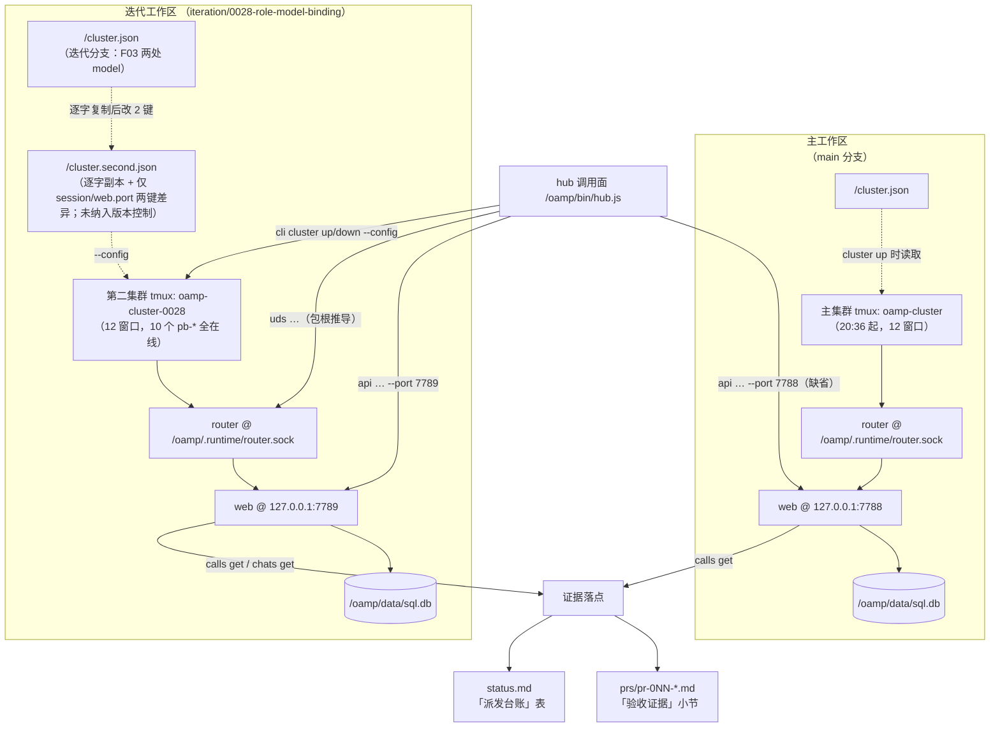

# architecture.md — 0028-role-model-binding

**版本**: 1.0.0
**迭代**: 0028-role-model-binding
**阶段**: 3（技术架构）
**创建日期**: 2026-09-15
**输入**: `prd.md` v0.2.0 + `prd/F01~F13*.md`（13 卡）+ 现有代码库（仓库根 `oamp/`）与既有文档（`oamp/README.md` §集群、`oamp/API.md`、`oamp/src/cluster.js` / `cluster-config.js` / `config.js` / `role-binding.js`、`oamp/sdk/*`）
**产出**: 本文档 + `prd/F01~F13*.md` 的 `[架构待填]`（A-01 / A-02 / A-04 / A-05）逐条补全
**未读**（按角色契约）: `demand.md`

---

## 0. 一句话方案

**本迭代不新增任何运行时代码组件。** 全部落地由既有面承担：

- **改动面** = 仓库根 `cluster.json` 的两处 `roles.<role>.model` 取值（F03，阶段 5 落盘）；
- **实证面** = 从迭代工作区启动一个**只用既有启动路径、与工作区配置仅两键差异**的第二集群 + 用**既有 hub 调用面**取证 + 证据落 `prs/*.md` 的「验收证据」小节与 `status.md` 的「派发台账」；
- **隔离面** = socket / 日志 / 对话库三项**由既有包根推导免费获得**，唯一需要人工区分的是 tmux session 名与 web 端口两项（前者是 tmux 全局命名空间、后者是本机 TCP 端口——两者既有实现都不做隔离）。

奥卡姆检验的结论：本方案新增的实体只有「一份两键差异的运行态配置副本」与「PR 文件里的一个证据小节」，**没有新增模块、没有新增技术栈、没有改动任何既有模块的职责**。

---

## 1. 架构基线（实测，非推断）

### 1.1 既有面（逐条带证据位置）

| 面 | 现状 | 证据 |
|---|---|---|
| 运行时 | 零第三方依赖 Node ≥ 22 ESM；`oamp/` = Router + agent 节点 + Web + 集群编排 + hub 调用面 | `oamp/package.json`；`oamp/src/*.js` |
| 集群编排 | `oamp cluster up\|down\|status [--config <path>] [--wait <ms>]`：一个 tmux session，一进程一窗口（`router` / `web` / `pb-<role>`），窗口命令 = `node <包根>/bin/oamp.js <argv> 2>&1 \| tee -a <包根>/.runtime/cluster/<name>.log` | `oamp/src/cluster.js`（`planWindows` / `windowCommand` / `LOG_DIR`） |
| 配置真源 | 仓库根 `cluster.json`；读取优先级 `--config` > `OAMP_CLUSTER_CONFIG` > `<角色根>/cluster.json` | `oamp/src/cluster-config.js:loadClusterConfig` |
| 配置归一 | `root = dirname(configPath)`；**角色文件预检 = `<root>/roles/<role>/<role>.md` 必须存在**；角色 `cwd` 相对路径基准 = `root`；`model` 未配置即不填（保持隐式默认） | `cluster-config.js:normalizeRoleSection` / `assertEnabledRolePrerequisites` |
| 生效链 | `roles.<role>.model` → `planWindows` 追加 `--model <取值>` → agent 进程 → 解析链 `payload.model > OAMP_OMP_MODEL > --model(角色级) > config 默认 > 内置` → 执行侧**实报** → 调用信封 `model` | `cluster.js:planWindows`；`README.md` §集群「模型与工具开关的解析」 |
| 路径基准 | socket / 集群日志按**包根**（`oamp/` 的物理位置）推导：`<包根>/.runtime/router.sock`、`<包根>/.runtime/cluster/*.log`；Web 库 `<包根>/data/sql.db`（`OAMP_DB` 可覆盖） | `src/config.js:PKG_ROOT`、`src/cluster.js:PKG_ROOT`、`src/web.js:1431` |
| 取证面（层 A） | `hub api calls get <call_id>` = `GET /api/calls/<call_id>` = `router.task_get`（**不按来源过滤**，任何 `task_id` 可查，含 `messages` 入口派发的任务） | `oamp/src/web.js:1232-1256` |
| roster | `GET /api/calls` 只列 `from === 'web'` 的调用（调用面 + 既有对话入口同源） | `oamp/src/web.js:1137-1139` |
| 端口解析 | Web：`OAMP_WEB_PORT \|\| 7788`，`--port` 覆盖之（`cluster up` **恒显式传** `--port <config.web.port>`）；hub 层 A：`--port` 内建选项 / `OAMP_WEB_PORT` / 7788 | `src/web.js:1430-1437`；`sdk/surface.js:397`；`sdk/cli.js:builtinOption` |
| 层 C 透传 | `hub cli <token…>` 之后的 token **原样**交给既有 CLI（不解析） | `sdk/cli.js:runCli`；`sdk/surface.js:CLI_ENTRIES` |
| 信封 | 终态信封 = 封闭 **10 键**（`call_id` / `agent` / `state` / `duration_ms` / `model` / `truncated` / `text` / `structured_output` / `error` / `exit_code`），**不含 `chat_id`** | `API.md` §3.19；`web.js:composeCallEnvelope` |
| 建 chat | 无独立端点：对话只由 `POST /api/messages` 新建（新建必带 `project_id`）；`calls create` 强制要求**已存在**的 `chat_id` | `API.md` §3.8 / §3.14；G-3 |

### 1.2 本次只读实测（2026-09-15，供阶段 5 直接复用）

| 事实 | 实测值 |
|---|---|
| 主集群在场 | tmux session `oamp-cluster`（12 窗口 = `router` + `web` + 10 个 `pb-<role>`），创建于 20:36 |
| 主集群 socket | `/Users/chenchiyuan/projects/agents/oamp/.runtime/router.sock`（20:36） |
| 主集群 Web | `127.0.0.1:7788`（LISTEN，pid 36284） |
| 主集群库 | `/Users/chenchiyuan/projects/agents/oamp/data/sql.db`（21:07 写入） |
| 主集群拓扑 | `hub api agents` 返回 **12 个实例全部 `online`** = 10 个 `pb-<role>`（F04 验收 1 的判定对象）+ 2 个固有非角色节点 `web` / `main`（判定时排除） |
| 迭代工作区运行态 | `<WS>/oamp/.runtime/` **不存在**、`<WS>/oamp/data/` **不存在** ⇒ 第二集群将从零建立，与主集群零共享 |
| 第二集群端口候选 | `7789` 无监听（实测空闲） |
| 角色目录一致性 | 工作区与主工作区的 `roles/**` 逐字节同源（工作区 base = `main@162682d`，F13 验收 1 又锁死 `roles/**` 零改动） |

> `<WS>` = `/Users/chenchiyuan/projects/agents/.pb-agents/worktrees/0028-role-model-binding`；`<MAIN>` = `/Users/chenchiyuan/projects/agents`。

---

## 2. 组件与拓扑

第二集群**不是新组件**——它就是既有 `oamp cluster` 起出来的同一套进程，只是换了一份配置副本、从另一个工作区启动。



**组件清单（1~5 条）**：

1. **第二集群实例**（既有 `oamp cluster` 起的第 2 个 session）——承载 F04 与 F05/F06/F07 的取证。
2. **第二集群配置副本** `<WS>/cluster.second.json`（运行态，不纳入版本控制）——唯一新增的实体文件，只回答"session 与非默认端口取什么值"。
3. **hub 调用面**（既有，`oamp/sdk/*`）——派发、取证、集群运维三条命令面，一个入口。
4. **PR 文件「验收证据」小节**（`prs/pr-0NN-*.md`，七字段之后追加）——一次性回执 / 常驻探针回执 / 第二集群启动记录 / 三条实报 / 收口证据的统一载体（D-9 禁独立探针文件）。
5. **`status.md` 的「派发台账」表**（R-5 已定形态）——阶段 2~6 每次角色派发一行。

**无新增**：无新模块、无新进程类型、无新端点、无新字段、无新依赖、无启动脚本。

---

## 3. 核心数据流

### 3.1 配置 → 启动 → 生效（第二集群，F04 → F05/F06/F07）

1. **复制**：`<WS>/cluster.json`（迭代分支版本，含 F03 的两处 `model`）逐字复制为 `<WS>/cluster.second.json`，**只改两处取值**：
   - `session`: `"oamp-cluster"` → `"oamp-cluster-0028"`
   - `web.port`: `7788` → `7789`
   - `router.socket` **保持 `null`**（理由见 §4 A-01 的"被否方案②"）。
2. **启动**：`node <WS>/oamp/bin/hub.js cli cluster up --config <WS>/cluster.second.json --wait 120000`
   —— 层 C 原样透传既有 `oamp cluster up`；窗口命令与日志落点全部由**工作区包根**推导。
3. **就绪**：`node <WS>/oamp/bin/hub.js api agents --port 7789` ⇒ 10 个 `pb-<role>` 全部 `online`（排除固有节点 `web`）。
4. **生效**：`planWindows` 对 `roles.dev` / `roles.verifier` 追加 `--model openai/gpt-5.6-luna` / `--model powerby/grok-4.6`；其余 8 角色**不追加** `--model`（`normalizeRoleSection` 未配置即 `undefined`）⇒ 落到全局默认链。

### 3.2 取证链（三条绑定实报，F05 / F06 / F07）

第二集群的对话库是**空库**，chat 必须从零建立（G-3：建 chat 无独立端点）：

1. **建项目**：`node <WS>/oamp/bin/hub.js api projects create --repo-url https://github.com/chenchiyuan/agents --port 7789` → `project_id`
2. **建 chat**（一条 **shell 形态**消息，无模型参与）：
   `node <WS>/oamp/bin/hub.js api messages send --chat-id chat-0028-second-cluster --project-id <prj> --agent-id pb-workflow-pb --text '!echo second-cluster-chat-ready' --port 7789`
   —— 目标节点选 `pb-workflow-pb`：与三条实报的三个节点**不相交**，避免在对照表里出现"同一节点一条 `model: null`"的噪声。
3. **三条实报**（同一 chat、形态逐字一致，唯一变量是 `--agent`）：

   | 卡 | 命令 | 期望实报（判据 = 解析到同一后端，MI-3） |
   |---|---|---|
   | F05 | `hub api calls create --chat-id chat-0028-second-cluster --agent dev --task "<…>" --mode block --port 7789` | `openai/` 前缀 |
   | F06 | `hub api calls create --chat-id chat-0028-second-cluster --agent verifier --task "<…>" --mode block --port 7789` | `powerby/` 前缀 |
   | F07 | `hub api calls create --chat-id chat-0028-second-cluster --agent prd --task "<…>" --mode block --port 7789` | 默认链路（deepseek 系） |

4. **终态留证**：`--mode block` 已直接返回终态信封；复核用 `hub api calls get <call_id> --port 7789`（10 键，含 `state` / `model` / `error` / `exit_code` / `truncated`）。
5. **chat 归属核对**：`hub api chats get chat-0028-second-cluster --port 7789` ⇒ `messages[].meta.task_id` 与三条 `call_id` 逐条对上（信封不含 `chat_id`，归属只能走这一条）。

### 3.3 派发链（阶段 2~6，F09 / F10 / F11，主集群）

- 通道：`node <MAIN>/oamp/bin/hub.js api calls create --chat-id chat-6c89902c-0a9f-4513-a299-90a7f98ae611 --agent <role> --task "$(cat <brief>)" --mode block`（**不带** `--model`——真源唯一；`--wait` 单独不阻塞，见 G-7）。
- 并发取证（F11 验收 3，阶段 5 首次派发）：同轮发起 ≥2 条 **`--mode background`**（缺省形态）调用，各自用 `hub api stream call <call_id>` 等终态；两条须属不同角色节点或不同 PR（MI-5）。
- 台账：每次受理拿到 `call_id` 即时在 `status.md`「派发台账」追加一行（§4 A-03）。

### 3.4 收口链（F08）

1. 全部 PR 合入迭代分支 → 迭代分支合入 main（工作流收口三步，`merge: iteration 0028-role-model-binding … into main`）。
2. 主集群**一次**重启：`node <MAIN>/oamp/bin/hub.js cli cluster down --config <MAIN>/cluster.json` → `… cli cluster up --config <MAIN>/cluster.json`（写明 `--config` 是为了让重启记录自证"加载的是合并后的 main 配置"，F08 验收 3；这是**唯一一次**触碰主集群的动作，迭代期内为零次，F04 验收 3）。
3. 主集群两条实报：`hub api calls get <call_id>`（缺省端口 7788，主工作区 hub 入口）——`pb-dev` 与 `pb-verifier` 各一条，判据口径同 F05 验收 4。
4. 证据落盘：写入 F08 所在 PR 的「验收证据」小节 + `status.md` 的收口登记（`迭代分支` 字段改 `iteration/0028-role-model-binding（已合并）`），并作为 main 上合并提交**之后**的一次 `chore(0028): 收口登记` 提交落盘（先例见 §4 A-04）。

---

## 4. A-01 ~ A-05：具体技术路径

### A-01 · 第二集群的配置副本形态与落点（F04）

**决策（L2）**：第二集群用 `<WS>/cluster.second.json` —— 工作区根 `cluster.json` 的**逐字副本 + 仅两键差异**：

```jsonc
{ "session": "oamp-cluster-0028",   // 原 "oamp-cluster"
  "web": { "port": 7789 },          // 原 7788
  "router": { "socket": null },     // 原样保持 null（不改）
  "roles": { /* 与 <WS>/cluster.json 逐字相同 */ } }
```

- **落点**：迭代工作区根（`<WS>/cluster.second.json`）。**必须在这一级**：`cluster-config.js` 的 `root = dirname(configPath)` 同时决定 ① 角色文件预检路径 `<root>/roles/<role>/<role>.md` ② 角色 `cwd` 缺省基准。工作区根是"既有 `roles/` 子树所在的那一级"。
- **副本从哪来**：工作区根 `cluster.json`（迭代分支版本）。
- **何时刷新**：仅在 `cluster.json` 发生变化时需要重新生成 + 重启第二集群。本迭代的时点 = **F03 的 PR 合入迭代分支之后、第二集群启动之前**（这是"副本携带合入后的绑定"的唯一保证）。判据 = `diff <WS>/cluster.json <WS>/cluster.second.json` 输出**恰 2 行差异**（`session` 一行、`web.port` 一行），其余逐字一致。
- **启动落点**：`node <WS>/oamp/bin/hub.js cli cluster up --config <WS>/cluster.second.json --wait 120000`。
- **收口落点**：F04 边界不要求 `down` 或清理 ⇒ 保留现场（便于复核）；需要释放时用同 `--config` 的 `cluster down`。
- **三项隔离取值（F04 验收 2，逐项可核对）**：
  | # | 项 | 第二集群取值 | 主集群取值 | 核对方式 |
  |---|---|---|---|---|
  | ① | session | `oamp-cluster-0028` | `oamp-cluster` | 副本文件 + `tmux ls` 两个 session 并存 |
  | ② | web 端口 | `7789` | `7788` | 副本文件 + `lsof -nP -iTCP:7789 -sTCP:LISTEN` |
  | ③ | socket / 日志 | `<WS>/oamp/.runtime/` 下（`router.sock`、`cluster/*.log`） | `<MAIN>/oamp/.runtime/` 下 | 两条绝对路径的包根不同（`config.js:PKG_ROOT` / `cluster.js:PKG_ROOT`） |
- **未纳入版本控制的性质（显式登记）**：该副本是**运行态产物**（与 socket、集群日志同类），不是迭代分支的改动路径。F13 验收 1 的判据面 = `git diff --name-only`（副本不出现）；但 `git status --porcelain` 会显示它为 untracked —— 这一点登记在承载 F13 的 PR 证据小节里，供复核者一眼对上，不靠隐瞒。
- **被否方案**：
  1. 顺手把 session/port 写进 `cluster.json` → 撞 **F03 验收 4**（diff 恰两处新增行、无其它变更行）。
  2. 在副本里显式写 `router.socket` → `cluster.js` 的就绪等待用 `queryNodes(runtimeConfig)`（socket 走**包根**推导），与子进程收到的 `OAMP_SOCKET` 不一致 ⇒ `up` 的就绪判定报废。包根推导已足够隔离，**不需要**这一项。
  3. 用 `TMUX_TMPDIR` 另起一个 tmux server 以复用同名 session → 端口仍撞 7788（主集群 web 已监听），且引入了既有启动路径之外的机制。**否决**。
  4. 把副本放进 `docs/iterations/0028-…/`（在 F13 允许的 diff 面内）→ `root` 变成该目录，角色文件预检与角色 `cwd` 基准同时失效（需再造 `roles/` 子树或逐角色写绝对 `cwd`，纯增复杂度）。**否决**。
  5. 绕开 `oamp cluster`、逐进程手起 router/web/agent → 撞 F04 边界（"只使用既有字段与既有启动路径"）。

### A-02 · 探针与一次性回执的承载形态与字段（F01 / F02）

**决策（L2）**：载体 = **承载该功能点的 PR 文件的「验收证据」小节**（`docs/iterations/0028-role-model-binding/prs/pr-0NN-*.md`，在七字段之后追加一个二级小节）。**不新建独立探针文件**（D-9），不写 `status.md`（其表头已被 R-5 锁死为台账七列，放不下"命令 + 原始输出"两块长文本），不写 `clarifications/**`（那是阶段 6 独立验证报告的落点，回执的产出方是执行角色而非 verifier）。

**字段形态**（每条回执一个三级标题条目，字段名逐字如下，值为原文照录）：

| 卡 | 条目字段 | 说明 |
|---|---|---|
| **F01**（一次性 3 条：deepseek / gpt / grok） | `命令`（逐字可复制） / `原始输出`（逐字，含观测结果） / `观测结果`（成功 \| 失败 + 现象） / `时点` / `耗时`（如实记录，**不入判据**，MI-1） | 命令形态 = **omp 一次性路径**（`-p` 且 `--no-session`；不出现 `hub`、不出现 `api messages`/`calls create`）。三条除 `--model` 取值外**逐字相同**（F01 验收 2）。失败者按 F01 验收 3 如实记失败并交 F12。 |
| **F02**（常驻 2 条：gpt @ `pb-dev` / grok @ `pb-verifier`） | `派发命令`（逐字，含 per-call `--model`）/ `call_id` / `终态字段`（`state` / `model` / `error` / `exit_code` 逐字）/ `chat_id` / `时点` / `耗时`（如实记录，不入判据） | 另附 **MI-2 事实补记**：取证时目标集群配置（当时 `main` 的 `cluster.json`）**无任何 `model` 键**。两条同属迭代 chat `chat-6c89902c-0a9f-4513-a299-90a7f98ae611`（首条即由 gpt 探针建立，D-21）。 |

同一条规则覆盖 F04 验收 5 的**启动记录**（命令 / 时间 / 三项隔离取值）与 F05~F07、F08 的证据——即"本迭代所有证据的落点 = 承载该功能点的 PR 文件的验收证据小节"，一处约定、全迭代复用。

- **被否方案**：`status.md`（列宽不足 + 该文件的表头形态已由 R-5 冻结）；独立探针文件（D-9 明禁）；`clarifications/`（阶段 6 报告专用）。

### A-03 · 派发台账的落点与维护时点（F09 / F10；形态已由 R-5 定）

**落点（不引入新载体）**：`status.md` 的「派发台账」表 —— 表头逐字保持 R-5 的七列（`时点 / 角色（节点）/ 用途 / call_id / 终态 / 实报 model / truncated`），**不增列、不改列**。

**维护时点（三拍）**：

1. **受理即追加**：每次派发拿到 `call_id` 后立即追加一行，`终态 / 实报 model / truncated` 三列填 `—`（时点、角色（节点）、用途、`call_id` 四列即时可得）。
2. **终态即回填**：终态到达后回填三列（值取自 `hub api calls get` 信封的 `state` / `model` / `truncated`，原文照录）。
3. **截断即聚合**：`truncated: true` 时除在本行标 `true` 外，按 D-16 把现象聚合到 `deferred-demand-changes.md` §执行方式差距 的对应条目（本迭代为 **G-5**）。

**范围与维护者**：阶段 2~6 的**每一次**角色派发（D-17 全阶段覆盖）——含第二集群的三条绑定实报（`用途` 列写明"第二集群绑定实报"以区别于主集群派发）。维护者 = 主 agent（唯一持有派发动作的一方）。

**不受本表覆盖的项**：chat 归属核对走 `hub api chats get` 的 `messages[].meta.task_id`（F10 验收 1）；第二集群那条**建 chat 用的 shell 消息**不是角色派发（无模型、无产出），记一行并在 `用途` 列注明其性质，不进 F09 验收 3 的判据面。

### A-04 · 收口证据的落点与时点（F08）

**决策（L2）**：证据落 **F08 所在 PR 文件的「验收证据」小节 ∪ `status.md` 的收口登记**，并作为 main 上合并提交**之后**的一次 `chore(0028): 收口登记` 提交落盘。

- **时点**（严格顺序）：① 合并进 main（F08 验收 1）→ ② 主集群 `down` + `up`（验收 2）→ ③ 两条实报（验收 4）→ ④ 证据与收口登记同批写入并提交（验收 5）。
- **落点**：`docs/iterations/0028-role-model-binding/**`（在 F13 验收 1 的允许路径内），不触碰 `main` 上的任何其它路径。
- **先例（本仓库既有事实，非本方独创）**：0025 的 `162682d`（`chore(0025): 收口登记…`，晚于 merge `5839e9d`）与 0026 的 `8d897a9`（`docs(0026): 收口落盘——迭代分支已合并 main…`，晚于 merge `d8c2cb6`）——两者都只改 `docs/iterations/{迭代}/**`，且都发生在各自 merge 提交之后。工作流本身也要求合并后回写 `status.md` 的 `迭代分支` 字段（`workflow-pb.md` §迭代分支合并进 main）。
- **被否方案**：
  1. 写**迭代分支** → 收口第 3 步已 `git branch -d iteration/0028-role-model-binding`，分支不存在；且写 detached HEAD 的提交不可达。
  2. 只在 main 工作区**留未提交修改** → 留下脏工作区，且证据不在 main 历史里（不可核对）。
  3. **新开一个证据 PR** → 收口已完成、迭代分支已删，工作流没有"收口后 PR"这一步；引入新机制的成本远大于收益。
  4. 把收口证据落在 main 之外的其它文件系统位置 → 撞 F08 验收 5（"存在于**迭代产物**中"）。

### A-05 · 第二集群的对话存储归属（`OAMP_DB`，F05 / F06 / F07）

**决策（L2）：不共享。** 第二集群与主集群各用各自包根下的 `data/sql.db`（`<WS>/oamp/data/sql.db` 对 `<MAIN>/oamp/data/sql.db`）——这是既有包根推导的**默认行为**，不需要设 `OAMP_DB`、不需要任何配置。

**理由（四条，逐条可核对）**：

1. 读法 (b) 明确**不要求**同源（prd.md §术语口径 + R-1 落地项）。
2. 共享的唯一可行方式 = 给主集群的 web 注入 `OAMP_DB` 并**重启它** → 直接撞 **F04 验收 3**（迭代期间对主集群零启停、零配置改动）。
3. 两库若合一，第二集群的三条实报对话会出现在主集群的 `api chats list` 面，给 F10 验收 1 的"阶段 2~6 单一 chat 唯一性"判据引入**噪声**（原本判据只依赖两个既有字段，不该再引入新的区分维度）。
4. 零新增机制：不共享 = 什么都不做（YAGNI）。

**若不同源，三条实报的 chat 如何被定位与留证**（这是本项必须给出的具体路径）：

1. **定位**：第二集群自己的 `api chats get` —— `node <WS>/oamp/bin/hub.js api chats get chat-0028-second-cluster --port 7789`，取 `messages[].meta.task_id`，与三条 `call_id` 逐条对上（调用信封封闭 10 键、**不含 `chat_id`**，归属核对只能走这一条，F10 验收 1 同源判据）。
2. **留证**：`chat_id`（`chat-0028-second-cluster`）与 `project_id`（`api projects create` 的返回值）记入承载 F05/F06/F07 的 PR「验收证据」小节，同一处并列三条 `call_id` 与终态字段；`status.md` 台账的 `用途` 列注明"第二集群绑定实报"。
3. **边界**：主集群的迭代 chat（`chat-6c89902c-…`）与本 chat 分属两库、互不可见——这是**预期形态**，不是缺口；两侧各自有独立的失败面（F10 验收 1 与验收 2）。

---

## 5. 架构决策清单

| # | 决策 | 级别 | 理由（可维护性 / 奥卡姆） |
|---|---|---|---|
| D-01 | 第二集群 = 既有 `oamp cluster` + 两键差异配置副本 | L2 | 复用既有启动路径；新增实体仅一份运行态副本 |
| D-02 | 副本落 `<WS>/cluster.second.json`（工作区根、不纳入版本控制） | L2 | 只有工作区根同时满足角色文件预检与角色 `cwd` 基准；不纳入版本控制 = 不进入 F13 判据面 |
| D-03 | 副本**不**显式设 `router.socket`（保持 `null`） | L2 | 包根推导已提供 socket/日志隔离；显式值会与 `cluster.js` 自身的就绪探针不一致 |
| D-04 | 第二集群端口取 `7789`、session 取 `oamp-cluster-0028` | L2 | 唯一两项既有实现不做隔离的状态（tmux 全局名 / 本机 TCP）；实测 7789 空闲 |
| D-05 | 建 chat 用一条 shell 消息（`!echo`）打头，三条实报统一 `calls create --mode block` | L2 | G-3 下建 chat 必须由一次真实调用完成；选 shell 形态使"建 chat"与"模型判据"解耦，且三条实报命令形态逐字一致（对照更硬） |
| D-06 | 三条实报的目标节点 = `dev` / `verifier` / `prd`，建 chat 节点 = `workflow-pb` | L3 | 让对照表里三个节点各恰一条调用 |
| D-07 | 对话存储不共享（`OAMP_DB` 不动） | L2 | 共享须改主集群并重启（撞 F04 验收 3）；不共享是零动作 |
| D-08 | 证据载体 = 承载该卡的 PR 文件「验收证据」小节；收口证据 = merge **之后**的一次 `chore(0028)` 提交 | L2 | 单一约定覆盖全迭代；与 D-9（禁独立探针文件）相容；与 0025/0026 既有先例一致 |

**L1 决策清单：无。** 本方案不引入新技术栈、不改变任何既有模块的职责、不改变系统整体边界（`oamp/**` 与 `roles/**` 逐字节不动）。

> 本迭代 `roles/**` 属 F13 验收 1 的冻结面，故架构决策记录**不写入** `roles/architect/data/`，而是就地落在本文档 §5 与 §4 的"被否方案"段（这与角色惯例的落点不同，原因是本迭代的功能卡把 `roles/**` 锁成了零改动面——取舍已在 §6 登记）。

---

## 6. 边界（本迭代新增 / 不新增）

**新增（全部为运行态或迭代产物，均不进入运行时代码面）**：

- `<WS>/cluster.second.json`（运行态副本，未纳入版本控制；性质已在 §4 A-01 显式登记）
- `<WS>/oamp/.runtime/**` 与 `<WS>/oamp/data/sql.db`（既有 `.gitignore` 覆盖的运行态：socket / 集群日志 / 对话库）
- `prs/pr-0NN-*.md` 的「验收证据」小节、`status.md` 台账行与收口登记（迭代产物）

**不新增**：运行时代码（`oamp/src|web|bin|sdk`）、角色定义（`roles/**`）、集群配置的字段集合（只用既有 `session` / `web.port` / `router.socket` / `roles.<role>.model`）、端点、参数、依赖、脚本、测试框架。

**与产品边界的对齐**：本方案不触碰任何 `demand.md`「不做什么」条目——不做动态切换、不做 UI、不做可插拔后端、不做启动期模型预检、不改 per-call `model` 语义、不写其余 8 角色、不清理 0027 现场、不把多轮上下文纳入等价性判据。

---

## 7. 验证（自检）

**① 奥卡姆检验（每个新实体：不引入它，哪个功能点无法实现？）**

| 新实体 | 不引入它的后果 |
|---|---|
| `<WS>/cluster.second.json` | 第二集群与主集群**同 session 名**（tmux 全局命名空间 ⇒ `cluster up` 幂等空转）且**同端口**（7788 已被主集群 web 占用）⇒ F04 无法成立，F05/F06/F07 失去取证场所 |
| PR 文件「验收证据」小节 | F01 验收 4 / F02 验收 5 明禁独立探针文件；无载体则"可核对"无处落 |
| 第二集群的独立对话库（默认行为） | ——（**不是**新实体：什么都不做即得，属 0 成本） |

**② 组件 → 功能点追溯**

| 组件 / 机制 | 承载的功能点 |
|---|---|
| 第二集群实例 + 两份契约取值 | F04（1~5） |
| 配置副本（两键差异 = 携带 F03 的两处 `model`） | F04 验收 4；F05/F06/F07 的生效前提 |
| 独立 socket / 日志 / 对话库（包根推导） | F04 验收 2 ③；F10 验收 2（R-1 读法 (b)）；A-05 |
| hub 层 A（`calls create --mode block` / `calls get` / `chats get` / `agents` / `projects create` / `messages send`） | F01（一次性除外）、F02、F04、F05~F08、F09、F11 |
| hub 层 C（`cluster up/down`） | F04 验收 5、F08 验收 2 |
| omp 一次性路径 | F01 |
| PR「验收证据」小节 | F01 / F02 / F04 验收 5 / F05~F08 的证据落点 |
| `status.md` 派发台账 | F09 验收 4、F10 验收 1、F11 验收 1 |
| 迭代 chat（主集群，既有） | F10 验收 1~5 |
| 第二集群 chat（独立库） | F05 / F06 / F07 验收 1；F10 验收 2 |

**③ 内部冲突检查**：无。逐项对照 —— ① 隔离取值（D-04）与 F04 验收 2 逐项对应；② 副本携带绑定（A-01 的刷新时点）与 F03 的落盘时点、F04 验收 4 同序；③ 三条实报的取证位置（第二集群 chat）与 F10 验收 2 的读法 (b) 一致；④ 收口证据落点（A-04）不触碰 F13 验收 1 的路径集合；⑤ `--model` 只出现在 F02 的两条探针命令里（F09 验收 3 / F13 验收 2 的真源唯一）。

**④ YAGNI**：不预先设计第二集群的复用机制、不抽象"集群副本生成器"、不预留多集群编排、不给探针加自动化——将来需要时再加，成本远低于现在引入的理解成本。

**⑤ 可推翻性（本方案最薄的一环，如实登记）**：`cluster.second.json` 是 untracked 文件，`git status --porcelain` 会显示它。F13 验收 1 的判据是 `git diff --name-only`（副本不出现），本方案据此判定为合规，并在承载 F13 的证据小节里显式登记该文件的存在与性质。若主 agent 或阶段 6 的 verifier 认为"改动面"应取 `git status` 口径，则本项需回退为"取证完成后删除副本、其逐字内容只留在 PR 证据里"——该回退**不影响任何其他决策**（删除副本不改变第二集群的运行态，也不影响三条实报的可核对性）。

---

## 8. prd 补全记录

| 待填项 | 卡片 | 落成内容 | 本文章节 |
|---|---|---|---|
| A-01 | F04 | 副本形态（逐字副本 + 仅 `session` / `web.port` 两键差异）、落点（工作区根）、刷新时点（F03 合入迭代分支后）、启动命令落点、三项隔离取值与核对方式、收口处置 | §3.1 / §4 A-01 |
| A-02 | F01 / F02 | 载体 = 承载该卡的 PR 文件「验收证据」小节；F01 五字段、F02 六字段的逐字形态；不新建探针文件 | §4 A-02 |
| A-03 | F09 / F10 | 落点 = `status.md` 「派发台账」表（七列不变）；维护三拍（受理即追加 / 终态即回填 / 截断即聚合）；维护者与范围 | §4 A-03 |
| A-04 | F08 | 落点 = F08 所在 PR 的「验收证据」小节 ∪ `status.md` 收口登记；时点 = merge 之后的一次 `chore(0028): 收口登记` 提交；先例 `162682d` / `8d897a9` | §3.4 / §4 A-04 |
| A-05 | F05 / F06 / F07 | 判定 = **不共享**（各用包根下 `data/sql.db`）+ 四条理由 + 不同源时三条实报的定位与留证路径 | §4 A-05 |
