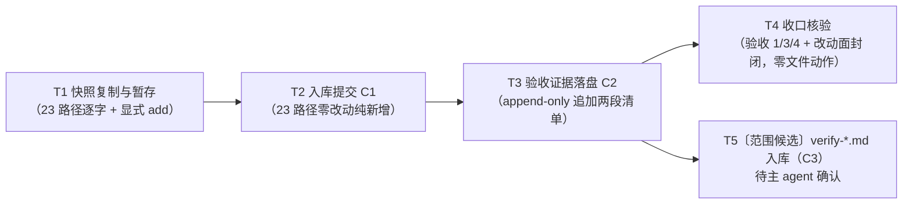

# pr-001-tasks.md — pr-001 内部任务图（迭代产物入库 / F08 + F13）

**迭代**: 0028-role-model-binding ｜ **阶段**: 5（PR 实现）· 首波 ｜ **PR 文件**: `prs/pr-001-iteration-artifacts-commit.md`
**worktree 分支**: `feat/0028-pr-001-iteration-artifacts` ｜ **base**: **`162682d`**（已核：`git -C <本 worktree> merge-base HEAD iteration/0028-role-model-binding` = `162682d`；迭代分支 tip 亦 = `162682d`，即本迭代在迭代分支上尚无任何提交，本 PR 是该分支的第一次提交）
**任务总数**: **5**（T1~T5，其中 T5 为**范围候选·待主 agent 确认**，未确认前不执行）｜ **依赖图**: **无环**（T1→T2→T3，T3 分出 T4 / T5 两条边，见 §2）
**输入真源**: PR 文件（文件范围 23 路径 / 验收 1~4）+ `prd/F08-post-merge-activation-evidence.md`（验收 1）+ `prd/F13-existing-surface-unchanged.md`（验收 1）+ `architecture.md` §6（边界）· §4 A-02 / A-04（证据载体）+ 迭代工作区一手实读（§0.5，逐条带命令）
**本 PR 性质**: **纯入库**——唯一动作是「把迭代工作区里已落盘的正文逐字复制进本 worktree 并提交」，零正文改写、零新增机制、零实现代码。因此全部验收判据都是 **git 面 + 逐字比对**（无套件可跑，见 §0.4 契约 6）。

---

## 0. 范围、文件面与事实锚点

### 0.1 本 PR 文件范围（23 路径；唯一可写面）

| # | 组 | 路径（相对本 worktree 根） | 份数 | 动作 |
|---|---|---|---|---|
| 1 | 阶段 1 产物 | `demand.md` | 1 | 复制 + 提交（零改动） |
| 2 | 阶段 2 产物 | `prd.md` + `prd/F01-one-shot-backend-receipts.md` … `prd/F13-existing-surface-unchanged.md` | 14 | 同上 |
| 3 | 阶段 3 产物 | `architecture.md` | 1 | 同上 |
| 4 | 澄清记录（阶段 1~3 期） | `clarifications/round-1-kickoff.md` / `round-2-verification-and-execution.md` / `round-3-probe-and-equivalence.md` / `round-4-final-boundaries.md` | 4 | 同上 |
| 5 | 流程台账 | `history.md` / `status.md` | 2 | 同上（**滚动文件**，以执行时点读数为准，见 §0.5） |
| 6 | 本 PR 文件 | `prs/pr-001-iteration-artifacts-commit.md` | 1 | 同上（C1 零改动版；证据在 C2 追加，见 §0.4 契约 3/4） |
| | **合计** | | **23** | |

> 全部 23 条的**源**都在**迭代工作区**：`/Users/chenchiyuan/projects/agents/.pb-agents/worktrees/0028-role-model-binding/docs/iterations/0028-role-model-binding/**`（该目录在本 worktree 中**不存在**——阶段 1~4 产物在迭代工作区全部为 `??` untracked，`git ls-files docs/iterations | grep 0028` 零命中；这是本 PR 存在的理由）。

### 0.2 目标路径清单（逐字，23 行；T1 的 `git add` 与 T4 的集合比对以此为准）

```
docs/iterations/0028-role-model-binding/demand.md
docs/iterations/0028-role-model-binding/prd.md
docs/iterations/0028-role-model-binding/prd/F01-one-shot-backend-receipts.md
docs/iterations/0028-role-model-binding/prd/F02-resident-backend-probes.md
docs/iterations/0028-role-model-binding/prd/F03-role-model-binding.md
docs/iterations/0028-role-model-binding/prd/F04-second-cluster-full-roster.md
docs/iterations/0028-role-model-binding/prd/F05-dev-binding-evidence.md
docs/iterations/0028-role-model-binding/prd/F06-verifier-binding-evidence.md
docs/iterations/0028-role-model-binding/prd/F07-unbound-control-evidence.md
docs/iterations/0028-role-model-binding/prd/F08-post-merge-activation-evidence.md
docs/iterations/0028-role-model-binding/prd/F09-dispatch-channel-and-source-of-truth.md
docs/iterations/0028-role-model-binding/prd/F10-single-chat-attribution.md
docs/iterations/0028-role-model-binding/prd/F11-dispatch-equivalence-criteria.md
docs/iterations/0028-role-model-binding/prd/F12-execution-gap-record.md
docs/iterations/0028-role-model-binding/prd/F13-existing-surface-unchanged.md
docs/iterations/0028-role-model-binding/architecture.md
docs/iterations/0028-role-model-binding/clarifications/round-1-kickoff.md
docs/iterations/0028-role-model-binding/clarifications/round-2-verification-and-execution.md
docs/iterations/0028-role-model-binding/clarifications/round-3-probe-and-equivalence.md
docs/iterations/0028-role-model-binding/clarifications/round-4-final-boundaries.md
docs/iterations/0028-role-model-binding/history.md
docs/iterations/0028-role-model-binding/status.md
docs/iterations/0028-role-model-binding/prs/pr-001-iteration-artifacts-commit.md
```

### 0.3 非目标（防夹带；触碰即 PR 验收 3 / F13 验收 1 不通过）

- **他 PR 的面（本 PR 零触碰）**：`docs/iterations/0028-role-model-binding/deferred-demand-changes.md`（pr-007）、`prs/pr-002-role-model-binding.md` ~ `prs/pr-010-post-merge-activation-evidence.md`（各自 PR 提交各自文件）、`cluster.json`（pr-002）——PR 文件「文件范围」的排除清单逐字。
- **冻结面（F13 验收 1）**：`oamp/src/**`、`oamp/web/**`、`oamp/bin/**`、`oamp/sdk/**`、`oamp/README.md`、`oamp/API.md`、`roles/**` 零改动。本 PR 不碰运行时代码，也不在 worktree 里生成任何文件。
- **迭代工作区（源）只读**：本 PR 一切写入落在本 worktree；**不得**回写迭代工作区（`data/scm-protocol.md` §规则 F）。含 `status.md` / `history.md` / 本 PR 文件的**迭代工作区副本**——证据只追加在 worktree 副本（§0.4 契约 4）。
- **不入库**：`docs/iterations/0028-role-model-binding/clarifications/verify-20260915-221935.md`（阶段 4 Gate 验证报告）——不在 PR 文件「文件范围」的 4 份 `clarifications/*.md` 枚举内，列为 **T5 范围候选**（§4-①），未获主 agent 确认前**不执行**。
- **不新增**：无新脚本、无 CI、无 hook、无 `.gitkeep`、无目录占位、无第三方依赖。

### 0.4 本 PR 内的契约（每个任务都必须遵守）

1. **零改写**：23 份入库内容与源**逐字一致**（判据 = 逐文件 `shasum -a 256` 相等，23/23）。任何"顺手修正/格式化/补尾换行"都是越界 ⇒ 停止并报告。
2. **唯一动作 = 复制 + 提交**：不解析、不转换、不重排、不新增。路径 `git add` **逐条显式列出**（禁 `git add -A` / `git add .` / `git add docs/`）。
3. **两次提交结构 C1 / C2**（非显然，见 §3-④）：`C1` = 23 路径的**零改动**入库提交；`C2` = 仅在 worktree 副本的 `prs/pr-001-iteration-artifacts-commit.md` 的「验收证据」小节**追加**两段清单。理由 = PR 文件要求证据含「提交的 `--name-only` 清单」（自引用：该清单只有 C1 落定后才存在）+ 验收 2 要求"入库内容与入库前工作区逐字一致"（C1 必须整体逐字，证据不得混入 C1）。
4. **证据追加为 append-only**：**保留**「验收证据」小节原有的括注行（`（本 PR 执行时填写：…）`），证据内容追加在其后；C2 的 diff 中**零 `-` 行**（PR 验收 2「不修改任何正文」的逐字读法）。
5. **本任务图文件（`prs/pr-001-iteration-artifacts-commit-tasks.md`）是阶段 5 流程产物，不在 PR 文件「文件范围」内**：若要提交，必须**独立成一次提交**（先例 `9abdba6 docs(0026): pr-001 阶段5 任务图…`），**不得**混入 C1 / C2（否则 PR 验收 3 的 `--name-only` 集合不通过）；也可不提交。
6. **无套件可跑**：本 PR 的验收手段 = git 面（`ls-files` / `show` / `diff` / `status`）+ 逐字哈希比对。不得声称"测试全绿"。

### 0.5 读码事实锚点（2026-09-15 实测，判据基础）

| # | 事实 | 核实方式（规划时点） |
|---|---|---|
| **A1** | 迭代工作区 `docs/iterations/0028-role-model-binding/` 下 untracked 共 **34** 条：本 PR 目标 23 条 + 排除 11 条（`deferred-demand-changes.md`、`clarifications/verify-20260915-221935.md`、`prs/pr-002~pr-010` 共 9 份）。**目录内无隐藏文件 / 无 `.DS_Store` 等杂项**（依此说明"整树复制"不会夹带，但仍按 §0.4 契约 2 逐条显式 `add`） | `git -C <迭代工作区> status --porcelain -uall docs/iterations/0028-role-model-binding \| wc -l` = 34；`find … -type f \| sort \| wc -l` = 34（两者逐条一致） |
| **A2** | 本 worktree **不含** `docs/iterations/0028-role-model-binding/` 子树；`docs/iterations/` 最新目录为 `0026-…`；本 worktree `git status --porcelain` 为空（干净） | `read` 本 worktree `docs/iterations`；`git -C <本 worktree> status --porcelain` 空 |
| **A3** | 本 worktree HEAD = 分支点 = 迭代分支 tip = `162682d`（= main tip）⇒ 迭代分支上**尚无**本迭代提交，`git diff --name-only iteration/0028-role-model-binding...HEAD` 的基线即 `162682d..HEAD` | `git merge-base HEAD iteration/0028-role-model-binding`；`git rev-parse iteration/0028-role-model-binding` |
| **A4** | 迭代工作区检出的是 `iteration/0028-role-model-binding` **本身**，且其中目标路径均为 untracked ⇒ **本 PR 合并进迭代分支时，该分支正被迭代工作区检出，而那 23 个路径以 untracked 形态躺在同一位置**（git 会拒绝）——**实测**（git 2.39.5，/tmp 最小复现）：`error: The following untracked working tree files would be overwritten by merge: … Aborting`（**即使 untracked 内容与将检出的内容逐字相同，仍 abort**） | `git -C <迭代工作区> branch --show-current` = `iteration/0028-role-model-binding`；/tmp 复现脚本见 §3-① |
| **A5** | 本 worktree 的 `.gitignore` 仅含 `.idea/` / `.pb-agents/` / `.DS_Store` / `.pb-agents/worktrees/` ⇒ 目标 23 路径**均不被忽略**，`git add` 与 `git status` 判定正常；`.pb-agents/` 被忽略说明本 worktree 的物理位置（`.pb-agents/worktrees/…`）不产生额外噪声 | `read` 本 worktree `.gitignore` |
| **A6** | `status.md`（10061 字节，规划时点）与 `history.md`（21209 字节，规划时点）由**主 agent 滚动维护**——两次取读之间 `status.md` 已从 9434 → 10061 字节 ⇒ 二者的字节数与 sha256 是**滚动量**，T1 的逐字判据只认"目的地 == 同一次执行读到的源" | 规划期两次 `ls -la` / `wc -c` 差异 |
| **A7** | 源目录总字节 = **156295**（23 份之和，规划时点；含 A6 两个滚动量）；排除面合计 90084 = `deferred-demand-changes.md` 21623 + `verify-20260915-221935.md` 30269 + 9 份他 PR 文件 38192 | `find … -type f \| xargs wc -c` 汇总 |
| **A8** | 判据全为只读命令；本 PR **不需要**第二集群、不需要 `oamp` 运行时、不需要网络 | 本 PR 性质（§0.4 契约 6） |

**规划时点 sha256 参照表**（T1 复制后应立即复核；A6 两行以执行时点读数为准，其余 21 行为正常应命中的冻结值）：

| 路径（`docs/iterations/0028-role-model-binding/` 下） | 字节 | sha256 |
|---|---|---|
| `demand.md` | 10769 | `5df7dea2a564e85d3229d8bd15d9818e7b6b0aeb4f32b0db03c700d90eb86eb0` |
| `prd.md` | 26499 | `a8b6f885e55e78ca56d622e35527330bf1b2929413526379300e8fbadc3e0a27` |
| `prd/F01-one-shot-backend-receipts.md` | 3244 | `3fe64a630b737c0dcb30c8c60b4a1083d834f24eb520b71c3120a4271b31e17d` |
| `prd/F02-resident-backend-probes.md` | 4190 | `132e8d226d41deb5f442f31e0d600651db259ae0b15a598fae109bfbbd797d5a` |
| `prd/F03-role-model-binding.md` | 2540 | `f36a702653bb782a3893e8484d2816ce4208fc8241f9ee911c2ad890dca7e631` |
| `prd/F04-second-cluster-full-roster.md` | 4395 | `3feecc56684c8e5604e9d1a4e38f9af9524903190864629340d504b8a00c3e30` |
| `prd/F05-dev-binding-evidence.md` | 3537 | `09854fd43de7d532049ec8ef977219ddfe70dc61d185f61f91652234b1bc24be` |
| `prd/F06-verifier-binding-evidence.md` | 3003 | `7c58960e29b3eef08335720e31b77af1acba9673c06375f994f612db1dc559ec` |
| `prd/F07-unbound-control-evidence.md` | 3091 | `2d231159b416f3f4d3fb7e5da85d44cfe20d91d60f25471c519fb4d4f79ebb3f` |
| `prd/F08-post-merge-activation-evidence.md` | 3646 | `0ac2e035ef6f5f69e4e09ef58409c873cc8dc984afa6f17db31b3ae5646a5144` |
| `prd/F09-dispatch-channel-and-source-of-truth.md` | 3359 | `f6e8b1d90c61291ff17a77562f0224a7d275a2383157acd605c20582c799eb78` |
| `prd/F10-single-chat-attribution.md` | 3128 | `4411ff614d970b0537a8ea878ed98fe00a2d328425f0d41d3ce431e240ac7f5b` |
| `prd/F11-dispatch-equivalence-criteria.md` | 3539 | `b353a0d347ea3521c85b50b442482114ba2b72f5f137a67a1a479cfa9af9010d` |
| `prd/F12-execution-gap-record.md` | 2981 | `30e0829ffe4bce69a0a55150828b1362d040ba35f9122a367780d96d7148e859` |
| `prd/F13-existing-surface-unchanged.md` | 2301 | `5cf840bc56bb306e0ee41b1c7d00d1de5178df351817b540845d0ebf07876030` |
| `architecture.md` | 30829 | `f202bdcb07ff5f7567ccf90c57da8de27982e24aac60b1debb0f54f198481c56` |
| `clarifications/round-1-kickoff.md` | 3931 | `526b1e1de1d191d9138356e8194d9e08fa525dad1b53e41e33785708810e2a3f` |
| `clarifications/round-2-verification-and-execution.md` | 2327 | `9b4df64a7ce2910bc2d570caccd6fc9b44f4e4d63628e87576a7180eac1212d0` |
| `clarifications/round-3-probe-and-equivalence.md` | 1835 | `259491fabe0d7d2b70da56562d97f3ef4b8ddef36cf81265e2f70d3b3b611e88` |
| `clarifications/round-4-final-boundaries.md` | 2358 | `b910d6051b7541e955a12278e4e973eef66ea3173bbca2df118960b4135f8785` |
| `history.md` ⚠️滚动 | 21209 | `1770dc5569bb219b7d24f872292513db76308cc0d9afa6a69a0d5481fe4446ca` |
| `status.md` ⚠️滚动 | 10061 | `82434ec4f47f872dcdefddf44d7dc7d8c3aae6580a48c1df3e344b27b3e4f525` |
| `prs/pr-001-iteration-artifacts-commit.md` | 3523 | `fe3a12477a08bd70fd681e32feb1a70d5b50fadca7dd3093c02b9f3e6917177a` |

---

## 1. 任务列表

### T1: 快照复制与暂存 —— 23 路径逐字复制进本 worktree

- **一句话描述**：从迭代工作区把 23 份已落盘正文逐字复制到本 worktree 的对应路径（目录骨架按需创建），**逐条显式 `git add`**，不夹带任何其它路径。
- **验收标准**:
  1. **23 份到位**：`cd <本 worktree> && while read -r p; do test -f "$p" || echo "MISSING $p"; done < §0.2 清单` ⇒ 零 `MISSING`。
  2. **逐字一致（PR 验收 2 的执行时点判据）**：对 23 条逐条比对 `shasum -a 256`（源 = 迭代工作区绝对路径，目的地 = 本 worktree）⇒ **23/23 相等**；其中 `history.md` / `status.md` 以**同一执行时点**读到的源为准（A6），其余 21 条应与 §0.5 表的规划时点值相同。
  3. **暂存面恰为 23**：`git diff --cached --name-only | sort` 与 §0.2 清单 `sort` 的输出 **diff 为空**；条数 = 23。
  4. **排除面零暂存**：`git diff --cached --name-only | grep -E 'deferred-demand-changes\.md|clarifications/verify-|prs/pr-(00[2-9]|010)'` ⇒ **零命中**；`cluster.json` 零命中。
  5. **无多余记录**：`git status --porcelain` 的记录集合 = 23 条 `A  docs/iterations/0028-role-model-binding/…` ∪ {本任务图文件（§0.4 契约 5，允许未提交）}；出现第 24 条其它路径 ⇒ 停止并报告。
  6. **零改写痕迹**：`git diff --cached --numstat` 的 **删除列全为 0**（23 条均纯新增）。
  7. **零越界**：本任务不创建除目标目录骨架（`docs/iterations/0028-role-model-binding/{prd,clarifications,prs}`）之外的任何文件；不触碰迭代工作区（只读）。
- **前置依赖**: 无
- **优先级**: P0
- **追溯**: PR 文件「文件范围」（23 路径）+ 验收 1 / 2 / 4；`prd/F08` 验收 1（迭代产物可在 main 上读到）；`prd/F13` 验收 1（改动面 = `docs/iterations/0028-role-model-binding/**`）；`architecture.md` §6（迭代产物清单）；事实锚点 A1 / A2 / A5 / A6 / A7

### T2: 入库提交 C1 —— 23 路径零改动纯新增

- **一句话描述**：把 T1 的 23 条暂存内容提交成一次**零改动入库提交**（C1）：内容逐字等于迭代工作区，且**不含**验收证据（证据留给 C2）。
- **验收标准**:
  1. **提交面恰为 23**：`git show --name-only --format= C1 | sort` 与 §0.2 清单 `sort` 的 diff **为空**（PR 验收 3 前半）。
  2. **纯新增**：`git show --numstat C1 | awk '{s+=$2} END{print s+0}'` = **0**（零删除行）；`git show --stat C1` 首行 = `23 files changed, … insertions(+)` 且**无 `deletions(-)`**（PR 验收 2 前半）。
  3. **pr-001 文件在 C1 中仍是零改动版**：`git show C1:docs/iterations/0028-role-model-binding/prs/pr-001-iteration-artifacts-commit.md | shasum -a 256` = `fe3a12477a08bd70fd681e32feb1a70d5b50fadca7dd3093c02b9f3e6917177a`（= §0.5 源值）⇒ 证明证据追加**未混入** C1（§0.4 契约 3）。
  4. **全程 `--name-only` 无越界路径**：`git show --name-only C1 | grep -E 'cluster\.json|oamp/|roles/|deferred-demand-changes|verify-2026|prs/pr-00[2-9]|prs/pr-010'` ⇒ **零命中**（PR 验收 3 后半 + F13 验收 1）。
  5. **提交卫生**：提交后 `git status --porcelain` 除本任务图文件外为空；提交信息以 `docs(0028)` 开头且含 `pr-001`，正文说明"零改动入库 + 动机（F08/F13 判据面不在 git 里）"；未使用 `--amend` 覆盖既有提交、未使用 `--no-verify`（仓库无 hook，纪律不豁免）。
  6. **C1 短哈希记录**：把 C1 的短哈希与提交信息原文写入 T3 的证据内容（T3 判据 3 的输入）。
- **前置依赖**: T1
- **优先级**: P0
- **追溯**: PR 文件验收 2 / 3；`prd/F13` 验收 1（改动面）；事实锚点 A3

### T3: 验收证据落盘 C2 —— append-only 追加两段清单

- **一句话描述**：把「入库路径清单（`git ls-files` 输出）」与「提交的 `--name-only` 清单（C1）」**追加**到本 worktree 副本的 `prs/pr-001-iteration-artifacts-commit.md` 的「验收证据」小节（保留原括注行），单独提交为 C2。
- **验收标准**:
  1. **改动面恰为 1 条**：`git show --name-only --format= C2` = `docs/iterations/0028-role-model-binding/prs/pr-001-iteration-artifacts-commit.md`（唯一一行）。
  2. **append-only**：`git show --numstat C2 | awk '{s+=$2} END{print s+0}'` = **0**（PR 验收 2「无删改行」的逐字读法）。
  3. **两段清单逐字可核对**（PR 文件「验收证据」小节的填写要求；形态见 `architecture.md` §4 A-02）：
     - 段 1 = `git ls-files docs/iterations/0028-role-model-binding` 的输出（**23 行**，含本 PR 文件），与证据文本逐字一致；
     - 段 2 = `git show --name-only --format= C1` 的输出（**23 行**）+ C1 短哈希；
     - 判据 = 把证据段落中的两个清单块各自与上述命令输出 `diff` ⇒ **零差异**；两段条数各 = 23。
  4. **原括注行仍在场**：`grep -c '本 PR 执行时填写'` 于该文件 = **1**（§0.4 契约 4：不替换、只追加）。
  5. **七字段零改动**：`git diff C1 C2 -- <该路径>` 的 hunk **全部位于文件末尾的「验收证据」小节内**（即改动起点行号 > 七字段末行），标题与七字段（上下文摘要 / 涉及功能点 / 文件范围 / 验收标准 / 参考资料 / depends_on / batch）逐字未动。
  6. **提交卫生**：提交信息以 `docs(0028)` 开头且含 `pr-001`；提交后 `git status --porcelain` 除本任务图文件外为空；记录 C2 短哈希。
- **前置依赖**: T2
- **优先级**: P0
- **追溯**: PR 文件「验收证据」小节 + 验收 2；`architecture.md` §4 A-02（证据载体 = 承载该卡的 PR 文件「验收证据」小节）

### T4: 收口核验 —— PR 级验收 1 / 3 / 4 + 改动面封闭（**零文件动作**）

- **一句话描述**：把 PR 文件 4 条验收标准里"跨路径/跨提交"的那几条收敛成一次机械核验，产出可留痕的判据输出；**本任务不改任何文件**（纯证据任务）。
- **验收标准**:
  1. **PR 验收 1 — 全部路径 tracked**：`git ls-files docs/iterations/0028-role-model-binding` 输出**恰 23 行**且集合 = §0.2 清单（`diff <(git ls-files … | sort) <(§0.2 清单 | sort)` 为空）；逐项点名在场：`demand.md` / `prd.md` / `architecture.md` / `history.md` / `status.md` / 4 份 `clarifications/round-*.md` / 13 份 `prd/*.md` / 本 PR 文件。
  2. **PR 验收 2 — 逐字一致（提交面复核）**：对 23 条逐条核 `git show C1:<path> | shasum -a 256` 与 T1 记录的源哈希 ⇒ **23/23 相等**（其中 `history.md` / `status.md` 比 T1 执行时点读数；关键路径复核取 21 条冻结件与 C1 的 §0.5 表值相等）；并核 `git show --stat C1` 无删除行。
  3. **PR 验收 3 — 改动面封闭**：`git diff --name-only iteration/0028-role-model-binding...HEAD` 的路径集合 ⊆ §0.2 清单 ∪ {本任务图文件（若单独提交）}；`grep -E 'cluster\.json|^oamp/|^roles/|deferred-demand-changes|clarifications/verify-|prs/pr-00[2-9]|prs/pr-010'` ⇒ **零命中**（不含 `cluster.json` 与 `prs/` 下其它文件）。
  4. **PR 验收 4 — 无 `??` 残留**：`git status --porcelain docs/iterations/0028-role-model-binding` ⇒ 除本任务图文件（若未提交）外**零输出**，特别地**无任何 `??` 行**。
  5. **他 PR 零预占（面内检索）**：`git ls-files docs/iterations/0028-role-model-binding` 对 `deferred-demand-changes.md` 与 `prs/pr-002`~`pr-010` **零命中** ⇒ 未替他 PR 预占文件面（PR 文件「排除」清单）。
  6. **源未被回写**：迭代工作区的 `git status --porcelain -uall docs/iterations/0028-role-model-binding` 仍为 untracked 形态、**新增无本 PR 造成的改动**（规则 F：本 PR 不回写源工作区）；本任务图文件未落在迭代工作区。
  7. **验收手段声明（登记）**：本 PR **无套件可跑**（§0.4 契约 6）——结论以 git 面与哈希比对输出为准，不声称"测试全绿"。
- **前置依赖**: T1、T2、T3（汇聚点）
- **优先级**: P0
- **追溯**: PR 文件验收 1 / 2 / 3 / 4 + 「验收证据」；`prd/F08` 验收 1；`prd/F13` 验收 1；`data/scm-protocol.md` §规则 F；事实锚点 A3 / A7

### T5: 〔范围候选·待主 agent 确认〕第 5 份澄清产物入库 —— `clarifications/verify-20260915-221935.md`

> **未获主 agent 确认前不执行**（§4-① 的 `[model_inferred]` 项）。执行与否**不影响** T1~T4 的验收结论。

- **一句话描述**：把阶段 4 Gate 验证报告（30 KB，与 round-1~4 同属 `clarifications/`）逐字入库，作为独立第三次提交 C3——理由 = PR-010 的 F08 验收 1 列举的"合并后可在 main 上读到"集合含 `clarifications/*.md` 全量，而 PR 文件「文件范围」仅枚举了 4 份 `round-*.md`，两者不一致。
- **验收标准**:
  1. **单路径入库**：`git show --name-only --format= C3` = `docs/iterations/0028-role-model-binding/clarifications/verify-20260915-221935.md`（唯一一行）。
  2. **逐字一致**：`git show C3:<该路径> | shasum -a 256` = 源执行时点哈希（规划时点参照值 `4801460838203c3f572ae0da70372fcf217ee3bfababfe3888e01fb69cb9bdd2`，30269 字节）。
  3. **纯新增**：`git show --numstat C3 | awk '{s+=$2} END{print s+0}'` = 0。
  4. **零越界**：`git diff --name-only iteration/0028-role-model-binding...HEAD` 仍 ⊆ {§0.2 清单 ∪ 本路径 ∪ 本任务图文件}；`cluster.json` / `oamp/**` / `roles/**` 零命中。
  5. **T4 判据 1 / 4 复跑**：入库后重跑 T4 判据 1（条数 23 → **24**）与判据 4（仍无 `??`）⇒ 通过。
- **前置依赖**: T3（必须落在 C1/C2 之后，保持线性提交序）
- **优先级**: P1（条件项）
- **追溯**: PR 文件验收 1 的括注名单（**不含**该文件）；`prs/pr-010-post-merge-activation-evidence.md` 验收 1（列举 `clarifications/*.md` 全量）；`architecture.md` §4 A-02（`clarifications/**` 的用途界定：阶段 6 报告落点）——**冲突点见 §4-①**

---

## 2. 依赖图



- **无环**（5 节点 / 4 边，全部为单向链 + T3 的两条出边；无回边、无互指）——**不存在循环依赖**，无需上报。
- **最长依赖链**：`T1 → T2 → T3 → T4`（4 节点 / 3 边）；`T1 → T2 → T3 → T5` 同长。**关键路径任务** = **T1、T2**（唯一的"内容 + 提交"串行段，任何后续判据都建立在它们之上）；T3 亦为关键路径（T4 的两段清单判据以 C1/C2 为输入），故关键路径 = **T1 → T2 → T3 → T4**。
- **T1 ↔ T2、T2 ↔ T3 之间为真依赖**（非叙述顺序）：T2 的判据读 T1 的暂存面（§0.4 契约 3 的 C1 内容 = T1 的 23 条），T3 的判据读 T2 的提交（`git show --name-only C1` 自引用，§3-④）。
- **T4 与 T5 并行**：T4 只读 git 面，T5 只写 1 路径的逐字副本 ⇒ 若主 agent 确认 T5，二者可并发；T5 完成后按 T5 判据 5 复跑 T4 的判据 1 / 4。
- **并行安全性**：本 PR 是"文件复制 + 提交"的串行单元，不存在多分支并行写入；T5 若执行，其路径与 T1~T4 的写入面无交集（新增而非修改）。

---

## 3. 登记件与风险（主 agent 决策输入，非本任务图的执行项）

**① 合并动作会撞 untracked 覆盖（实测，需主 agent 在 merge 前处置）**
迭代工作区检出的是 `iteration/0028-role-model-binding` 本身（A4），其中 23 个目标路径以 untracked 形态存在；而"同一分支不能在两处同时检出"（`data/scm-protocol.md` §隔离边界声明）意味着 merge 必须在该工作区内执行。**实测（git 2.39.5，/tmp 最小复现）**：`git merge` 对这些将被检出的 untracked 文件报
`error: The following untracked working tree files would be overwritten by merge: … Aborting`，且**内容与将检出者逐字相同也照 abort**。
⇒ 主 agent 在把本 PR 合入迭代分支前，须先移走/备份迭代工作区的这些 untracked 副本（内容已在 C1 里，属可弃；但 `status.md` / `history.md` 是滚动文件，见 ②）。这是**主 agent 的 merge 步骤**，不在本 PR 的写入面内（规则 F 禁跨工作区写入），故不列为任务。

**② `status.md` / `history.md` 的滚动写入与入库快照的时序**
主 agent 在阶段 5 全程滚动维护这两个文件（A6：规划期已从 9434 → 10061 字节）。本 PR 入库的是**执行时点快照**；合并进迭代分支后，迭代工作区里更新的正文会以 **tracked 文件的 `M` 形态**出现，需主 agent 在收口登记（`chore(0028)` 提交，`architecture.md` §4 A-04 / `prs/pr-010` 验收 5）中一并落盘，否则 F08 验收 1 的"迭代产物可在 main 上读到"将落在旧快照上。

**③ `clarifications/verify-20260915-221935.md` 的范围归属** —— 见 §4-①（`[model_inferred]`，待确认）。

**④ 证据自引用的解法（非显然口径，登记备查）**
PR 文件要求验收证据含"提交的 `--name-only` 清单"，而该清单只有 C1 落定后才存在 ⇒ 证据必须晚于 C1，故拆 C1 / C2 两次提交（§0.4 契约 3）。另一候选是"单提交 + 用 `git diff --cached --name-only` 代替提交面清单"，被否：证据将与实际提交面存在漂移风险（staged 与 commit 不一致时无法自证），且 PR 文件点名的是"提交的 `--name-only`"。

**⑤ 本工作区的外部前提**
第二集群（`cluster.second.json`）与 `oamp` 运行时与本 PR 无关（A8）；本 PR 不写迭代工作区、不碰 `main`。

---

## 4. 口径确认项与粒度自查

**① `[model_inferred]` 项 —— 共 2 条，需主 agent 确认**

1. **T5 的存在本身（范围扩展候选）**：PR 文件「文件范围」只枚举 4 份 `clarifications/round-*.md`，其验收 1 亦写"4 份 `clarifications/*.md`"；但同文件「上下文摘要」写"`clarifications/*.md`"，且 `prs/pr-010` 的 F08 验收 1 列举的"合并后可在 main 上读到"集合含 `clarifications/*.md` 全量——若第 5 份留作 untracked，**没有任何其它 PR 的写入面覆盖它**（pr-007 明确排除 `clarifications/**`，pr-009/010 只写自己的 PR 文件）⇒ F08 验收 1 的 `clarifications/*.md` 项在合并后不成立。本任务图**不自行扩面**：列为 T5 条件项，未确认前不执行。
2. **提交信息格式（T2 判据 5 / T3 判据 6）**：`docs(0028)` 前缀 + 含 `pr-001` + 正文说明动机——PR 文件未规定提交信息，取值依据仓库既有先例（`9abdba6 docs(0026): pr-001 阶段5 任务图…`、`bffc336 docs(0026): 阶段4 PR规划完成…`）。

> **§0.4 契约 4（append-only 追加证据、保留原括注行）**：非上游原文，而是 PR 验收 2「diff 中无删改行（本 PR 不修改任何正文）」的逐字读法推导出的唯一相容形态——替换括注行会在 C2 的 diff 中产生 `-` 行。如主 agent 取"可替换括注行"读法，则 T3 判据 2 / 4 需同步改写（**其余任务不受影响**）。

**② 粒度自查（5 任务全部通过；本迭代执行约束 = 单次派发 ≤30 分钟）**

| 任务 | ≤30 分钟 | 可独立验收（不依赖其他未完成任务跑判据） | 验收标准可测试（通过/不通过可机械判定） |
|---|---|---|---|
| T1 | ✅（23 次 `cp` + 1 轮哈希） | ✅ 判据只读"源 vs worktree + 暂存面" | ✅ `test -f` / `shasum` / `git diff --cached --name-only` |
| T2 | ✅（1 次提交 + 2 条只读核验） | ✅ 判据只读 C1 自身 | ✅ `--name-only` 集合比对 + `--numstat` 求和 = 0 |
| T3 | ✅（追加 2 段文本 + 1 次提交） | ✅ 判据只读 C2 自身与 C1 输出 | ✅ 行数与 `diff` 零差异、`-` 行数 = 0 |
| T4 | ✅（纯只读核验） | ✅ 汇聚点，不依赖**未完成**任务 | ✅ 全部为 git 面集合/计数与哈希比对 |
| T5 | ✅（1 次 `cp` + 1 次提交） | ✅ 判据只读 C3 自身 | ✅ 同上 |

- **合并/拆分的非显然判断**：21 份"冻结件"与 2 份"滚动件"的复制**合并为一个任务（T1）**——同一动作、同一判据形态（逐字一致）、拆开只会制造同目录串行噪声；**拆分出 T2 / T3 两次提交**的非显然理由见 §3-④（证据自引用 + C1 必须整体逐字）。其中 T3 与 T2 的拆分**有独立验收价值**（C1 要证"零改动"，C2 要证"仅追加证据"），不是叙述顺序产物。
- **本任务图不含**：任何新增技术决策、任何实现代码、任何对 `architecture.md` / `prd/*.md` / PR 文件正文的修改（与 `roles/planner` 边界纪律一致）；因此不写 `roles/planner/data/` 决策记录（该路径亦不在本 PR 工作区边界内）。
