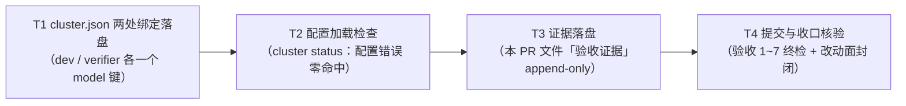

# pr-002-tasks.md — pr-002 内部任务图（角色级模型绑定落盘 / F03）

**迭代**: 0028-role-model-binding ｜ **阶段**: 5（PR 实现）· 首波 ｜ **PR 文件**: `prs/pr-002-role-model-binding.md`
**worktree 分支**: `feat/0028-pr-002-role-model-binding` ｜ **base**: **`162682d`**（已核：`git -C <本 worktree> merge-base HEAD iteration/0028-role-model-binding` = `162682d`；迭代分支 tip 亦 = `162682d`，即 `git diff main -- cluster.json` 与 `git diff iteration/0028-role-model-binding -- cluster.json` 在本 PR 内等价）
**任务总数**: **4**（T1~T4）｜ **依赖图**: **无环**（线性链 T1→T2→T3→T4，见 §2）
**输入真源**: PR 文件（文件范围 2 路径 / 验收 1~7）+ `prd/F03-role-model-binding.md`（验收 1~6 与边界）+ `architecture.md` §1.1（生效链）· §3.1 步骤 4（`planWindows` 追加 `--model`）· §4 A-01（副本形态；本 PR 是它的输入）· §5 D-01/D-02 + 代码库一手实读（§0.5，逐条带 `文件:行号` 或命令）
**本 PR 性质**: **纯配置两键新增**——唯一内容改动是在 `cluster.json` 的 `roles.dev` / `roles.verifier` 各写一个 `model` 键，其余逐字不动。因此全部验收判据 = **文件内容（JSON 取值 + diff 形态）+ 既有加载路径可解析**（无套件可跑，见 §0.4 契约 6）。**本 PR 不证明绑定生效**（F05/F06/F08 承担）。

---

## 0. 范围、文件面与事实锚点

### 0.1 本 PR 文件范围（2 路径；唯一可写面）

| # | 路径（相对本 worktree 根） | 动作 | 归属任务 | 说明 |
|---|---|---|---|---|
| 1 | `cluster.json` | 两处新增 `model` 键（其余逐字不动） | **T1** | 本 PR 唯一内容改动面 |
| 2 | `docs/iterations/0028-role-model-binding/prs/pr-002-role-model-binding.md` | 从**迭代工作区**复制入库 + 追加「验收证据」 | **T3** | 本 PR 自己的 PR 文件（本 worktree 中不存在该子树） |
| — | `prs/pr-002-role-model-binding-tasks.md`（本文件） | 阶段 5 流程产物 | — | **不计入本 PR 改动面**（§0.4 契约 4） |

### 0.2 目标改动面（逐字；T1 的完成形态）

`cluster.json` 共 26 行、UTF-8、末尾带换行（A1）。改动后**只有**下列 2 行发生变化：

```json
    "dev": {
      "enabled": true,
      "model": "openai/gpt-5.6-luna",     // ← 新增行（插在 "enabled": true, 之后；README 字段表顺序）
      "tools": true,
      "permission": "allow",
      "cwd": "."
    },
    ...
    "verifier": { "model": "powerby/grok-4.6" },   // ← 替换原 "verifier": {},
```

`git diff main -- cluster.json` 的**期望形态（口径 B，本任务图所取）**——逐字：

```diff
@@ -11,6 +11,7 @@
     "demand": {},
     "dev": {
       "enabled": true,
+      "model": "openai/gpt-5.6-luna",
       "tools": true,
       "permission": "allow",
       "cwd": "."
@@ -20,7 +21,7 @@
     "prd": {},
     "progress-observer": {},
     "retrospective": {},
-    "verifier": {},
+    "verifier": { "model": "powerby/grok-4.6" },
     "workflow-pb": {}
```

`git diff --numstat main -- cluster.json` = `2	1	cluster.json`（2 行新增 / 1 行删除，2 个 hunk）。**口径的由来与另一候选（口径 A：verifier 多行展开，4 增 1 删）见 §3-① / §4-①**——两者都通过功能面验收，差别只在 diff 形态，需主 agent 裁决（`[model_inferred]`）。

### 0.3 非目标（防夹带；触碰即 F03 边界 / F13 验收 1 不通过）

- **零改动面（逐字不变）**：`session` / `web` / `router` 三段；8 个未绑定角色段（`architect` / `demand` / `planner` / `pr-planner` / `prd` / `progress-observer` / `retrospective` / `workflow-pb`）；`roles.dev` 的 `enabled` / `tools` / `permission` / `cwd` 四行；文件整体缩进风格（2 空格）与键序。
- **他 PR 的面**：`oamp/**`、`roles/**`（F13 冻结面）、`status.md`（主 agent 维护）、`deferred-demand-changes.md`（pr-007）、其它 `prs/*.md`、`docs/iterations/` 下其它产物（含 pr-001 负责入库的 23 路径）。
- **不做**（F03 边界）：运行中动态切换角色模型、web 控制台模型选择 UI、非 omp 后端可插拔抽象、集群启动期模型存在性预检。
- **不做**：启动/重启任何集群（第二集群归 pr-005）、执行任何 hub 派发（F04 验收 3 / F13 边界）；不生成 `cluster.second.json`（归 pr-005）。

### 0.4 本 PR 内的契约（每个任务都必须遵守）

1. **只改两处**：`cluster.json` 的改动 = §0.2 的两行；其余 24 行逐字不动（含行尾逗号形态与末尾换行）。任何"顺手整理"（键序、缩进、注释、空行）一律停止并报告。
2. **diff 形态口径 B**（§0.2）：dev 处 = 1 行纯新增（插在 `"enabled": true,` 之后）；verifier 处 = 原单行 `{}` 被替换为**单行内联对象**。理由与另一候选见 §3-①；若主 agent 裁决为口径 A，**只改 T1 判据 3 与 T3 证据内容**，其余任务不变。
3. **证据 append-only**：`prs/pr-002-role-model-binding.md` 的「验收证据」小节**保留**原括注行（`（本 PR 执行时填写：…）`），证据内容追加在其后（与 pr-001 同体例；不替换、不删行）。
4. **本任务图文件不混入本 PR 的提交**：若要提交，独立成一次提交（先例 `9abdba6 docs(0026): pr-001 阶段5 任务图…`），或在本次不提交。
5. **命令基准**：一切配置加载命令以本 worktree 为基准（`cluster-config.js:184`：`root = dirname(configPath)` 同时决定角色文件预检路径 `<root>/roles/<role>/<role>.md` 与角色 `cwd` 缺省基准）⇒ `--config` 必须指向 `<本 worktree>/cluster.json` 的**绝对路径**，命令的工作目录 = 本 worktree。
6. **无套件可跑**：验收手段 = JSON 取值/形态核验 + `git diff` 面 + `oamp cluster status`（既有加载路径）。不得声称"测试全绿"（与 `architecture.md` §7 一致）。
7. **不新增机制**：不加校验脚本、不加探针文件、不改 `oamp/**` 的校验逻辑（`model` 的校验与注入链全是既有事实，A3）。

### 0.5 读码事实锚点（2026-09-15 实测，判据基础）

| # | 事实 | 核实方式（规划时点） |
|---|---|---|
| **A1** | 本 worktree `cluster.json` 与 main 版本**逐字节相同**：26 行、10 个角色段、`dev` 是**唯一非空段**（`:12-17`：`enabled`/`tools`/`permission`/`cwd`）、`verifier` = `{}`（`:23`）、`roles` 起于 `:9`、`workflow-pb` = `{}`（`:24`）、末尾带换行 | `diff <worktree>/cluster.json <main>/cluster.json` = 无输出；`shasum -a 256` = `7eaa38ef71db9794e3e8464469b0bdae8bdab5685ef76dca9d4431807cd5a258`；`grep -n` 逐行 |
| **A2** | 本 PR 的 base = `162682d` = main tip = 迭代分支 tip ⇒ `git diff main -- cluster.json` 与 `git diff iteration/0028-role-model-binding -- cluster.json` 同值，PR 验收 4 的判据在 PR 内即可执行 | `git merge-base` / `git rev-parse` 三个引用 |
| **A3** | **校验与注入链（既有、不改）**：`cluster-config.js:148-150`（`section.model === undefined → undefined`；否则 `requireNonEmptyString`，仅要求非空字符串——**不校验模型是否存在**）；`:4`（任一校验不成立 ⇒ `oamp cluster: 配置错误: <原因>` + **退出码 2**）；`:107-111`（凭据类字段扫描，命中即抛错）；`:132-137`（`instance_id`/`instanceId` 为不受支持的键）；`cluster.js:200-201`（`if (entry.model !== undefined) argv.push('--model', entry.model)`） | `sed -n` 逐段实读 |
| **A4** | **字段顺序的文档先例**：`oamp/README.md:253-259` 的角色字段表顺序 = `enabled` → **`model`** → `tools` → `permission` → `cwd` ⇒ 本 PR 把 `model` 插在 `enabled` 之后（T1 判据 3 的位置依据）；`README.md:295` 记模型链：请求 `model` > `OAMP_OMP_MODEL` > 角色级 `--model` > 全局默认 > 内置；`README.md:87` 已登记 `openai/gpt-5.6-luna` 为既有可选值 | `sed -n '253,259p'` / `grep -n` |
| **A5** | **baseline 实跑（改动前，本 worktree）**：`node <本 worktree>/oamp/bin/hub.js cli cluster status --config <本 worktree>/cluster.json` ⇒ **退出码 1**、输出四段（`[集群]` / `[窗口]` / `[Router 拓扑]` / `[日志]` / `[角色实例]`）、`配置错误` **零命中**、末段列出 10 个 `pb-<role>` 行、stderr 一行 `oamp cluster: Router 不可达（socket=<本 worktree>/oamp/.runtime/router.sock）：…`。⇒ 命令可用、判据形态已知（PR 验收 6 / F03 验收 6 的"预期"即此形态） | 实跑，命令与输出见 §3-③ |
| **A6** | `cluster status` **只读无副作用**：`statusAction`（`cluster.js:502-589`）只做 `loadClusterConfig` + `tmux has-session` / `list-windows` + `queryNodes`（socket 探测）+ 读日志目录，**无 `mkdirSync` / 无写文件 / 无 session 创建**；`oamp/.gitignore` 覆盖 `.runtime/` 与 `data/`；实测命令后本 worktree `git status --porcelain` 仍为空 | 代码实读 + 命令前后 `git status --porcelain` |
| **A7** | 本机 tmux 存在 **`oamp-cluster`（主集群）**：12 个窗口（`router` / `web` / 10 个 `pb-<role>`），创建于 `Tue Sep 15 20:36:29 2026`。因第二集群尚未启动、session 名与主集群相同，`[窗口]` 段读到的是**主集群**窗口（只读，不改） ⇒ 本 PR 的判据**不依赖**该段内容，仅用作"未触碰集群"的对照 | `tmux list-windows -t oamp-cluster -F '#{window_name}'` |
| **A8** | 本 PR **无套件可跑**：仓库无测试套件（0026 已清零），F03 的通过条件是文件内容 + 可加载 | 事实 A5（唯一可跑的运行时命令 = `cluster status`） |
| **A9** | `grok` / `powerby` 在 `oamp/README.md` 中**零命中**（未登记为文档样例值）——**不影响本 PR**（本 PR 只判文件内容；"解析到同一后端"的判据由 F06 / MI-3 承担），仅登记以免复核者误判为笔误 | `grep -n "powerby\|grok" oamp/README.md` 零命中 |

---

## 1. 任务列表

### T1: `cluster.json` 两处绑定落盘（唯一内容改动）

- **一句话描述**：在 `dev` 段 `enabled` 之后插入 `"model": "openai/gpt-5.6-luna",`，把 `verifier` 段的 `{}` 替换为 `{ "model": "powerby/grok-4.6" }`——**只此两处，其余 24 行逐字不动**。
- **验收标准**:
  1. **两处取值（PR 验收 1 / 2；F03 验收 1 / 2）**：`node -e "const j=require('<worktree>/cluster.json'); console.log(j.roles.dev.model, '|', j.roles.verifier.model)"` ⇒ 逐字 `openai/gpt-5.6-luna | powerby/grok-4.6`（两项分别严格 `===` 该字符串）。
  2. **其余 8 角色零绑定（PR 验收 3；F03 验收 3）**：`node -e` 对 `roles` 全部键做 `Object.hasOwn(r,'model')` 判定 ⇒ 命中集合恰 = `{dev, verifier}`，8 个未绑定角色**均不含** `model` 键。
  3. **diff 形态（PR 验收 4；口径 B，§0.2 与 §3-①）**：`git diff main -- cluster.json` 恰 **2 个 hunk**——hunk ①（dev）**1 行新增**、`+      "model": "openai/gpt-5.6-luna",` 位于 `"enabled": true,` 之后；hunk ②（verifier）1 行新增 `+    "verifier": { "model": "powerby/grok-4.6" },` + 1 行删除 `-    "verifier": {},`；`git diff --numstat main -- cluster.json` ⇒ `2	1	cluster.json`。
  4. **非目标面逐字不变**：`git diff main -- cluster.json` 的改动**只落在** `roles.dev`（`:12-17`）与 `roles.verifier`（原 `:23`）两处；`session` / `web` / `router` / 8 个未绑定角色段的既有行零改动；`dev` 的 `enabled` / `tools` / `permission` / `cwd` 四行在 diff 中以**上下文行**出现（`-`/`+` 零命中）；无键序重排、无缩进风格改写。
  5. **取值形态合法（F03 验收 5）**：两个取值均匹配 `^[A-Za-z0-9._/-]{1,128}$`（`node -e` 逐值 `test`）；且未引入其它键/字段——`dev` 段的键集合 = `{enabled, model, tools, permission, cwd}`（原 4 键 + `model`）、`verifier` 段的键集合 = `{model}`（原 0 键 + `model`）。
  6. **JSON 合法且文件形态不变**：`node -e "JSON.parse(require('fs').readFileSync('<worktree>/cluster.json','utf8'))"` 退出 0；行数 26 → **27**（仅 +1 行）；无 `\ No newline at end of file` 提示（末尾换行保留）；无 BOM。
  7. **零越界**：`git status --porcelain` 的记录集合 = {`M cluster.json`}（T3 尚未执行时）∪ {本任务图文件（若未提交）}；`oamp/**` / `roles/**` / `status.md` 等零命中。
- **前置依赖**: 无
- **优先级**: P0
- **追溯**: PR 文件「文件范围」第 1 项 + 验收 1 / 2 / 3 / 4 / 5；`prd/F03` 验收 1 / 2 / 3 / 4 / 5；`architecture.md` §3.1 步骤 4（该配置是 `planWindows` 追加 `--model` 的唯一真源）· §4 A-01（副本逐字复制的不动面）；事实锚点 A1 / A3 / A4

### T2: 配置加载检查（既有加载路径可解析）

- **一句话描述**：用既有入口把改后的配置跑一遍加载：`cluster status` 的输出中**不出现** `配置错误`（配置加载失败的唯一出口，退出码 2），输出形态与 baseline 一致。
- **验收标准**:
  1. **命令与退出码（PR 验收 6 / F03 验收 6）**：`cd <本 worktree> && node oamp/bin/hub.js cli cluster status --config <本 worktree>/cluster.json` ⇒ 退出码**恰为 1**（= `Router 不可达` 分支，`cluster.js:589`）；**不得为 2**（= 配置错误/参数错误）。
  2. **`配置错误` 零命中**：`node … cluster status … 2>&1 | grep -c '配置错误'` ⇒ **0**（这是配置加载失败的唯一出口：`cluster.js:342 / 440 / 507` + `cluster-config.js:4`）。
  3. **十角色段全部通过归一与预检**：输出 `[角色实例]` 段含**恰 10 行** `pb-<role>`（`architect` / `demand` / `dev` / `planner` / `pr-planner` / `prd` / `progress-observer` / `retrospective` / `verifier` / `workflow-pb`）——即 10 个角色段都通过了 `normalizeRoleSection` 与 `assertEnabledRolePrerequisites`（F03 验收 6 的"能加载"）。
  4. **四段结构在场**：输出含 `[集群]` / `[窗口]` / `[Router 拓扑]` / `[日志]` / `[角色实例]`；stderr 含 `Router 不可达`（属预期，不计失败）。
  5. **只读无副作用（对照 A6 / A7）**：命令**前后** ① `git -C <本 worktree> status --porcelain` 输出相同；② `tmux list-windows -t oamp-cluster -F '#{window_name}'` 的窗口名序列相同（12 个，未新增/未减少）——证明本任务未创建、未重启、未改动任何集群。
  6. **输出留证**：把命令（含 `--config` 绝对路径）与完整输出（stdout + stderr）原文照录，供 T3 写入证据；记录退出码。
- **前置依赖**: T1
- **优先级**: P0
- **追溯**: PR 文件验收 6 + 参考资料（代码锚点）；`prd/F03` 验收 6（"集群能加载该配置即可，不因这两个取值报错"）；代码锚点 `oamp/src/cluster.js:502-589`（`statusAction`）· `:342/440/507`（配置错误出口）· `oamp/src/cluster-config.js:4`（退出码 2）；事实锚点 A5 / A6 / A7

### T3: 证据落盘 —— 本 PR 文件「验收证据」小节（append-only）

- **一句话描述**：把本 PR 自己的 `prs/pr-002-role-model-binding.md` 从迭代工作区复制进本 worktree，并在其「验收证据」小节**追加**三块内容（改动后的两行原文 / `git diff main -- cluster.json` 原始输出 / 加载检查命令与输出），保留原括注行。
- **验收标准**:
  1. **入库面恰 1 条**：`git status --porcelain` 中出现 `docs/iterations/0028-role-model-binding/prs/pr-002-role-model-binding.md`（相对 T1 后状态为新增）；该 PR 文件在工作区的形态 = 迭代工作区原文**逐字** + 追加的证据块（判据 = 去掉追加块后与源逐字相同，或：追加块之前的全文 `diff` 为零）。
  2. **三块内容齐备且逐字可核对**（PR 文件「验收证据」小节的填写要求；形态见 `architecture.md` §4 A-02）：
     - 块 1「改动后的两行原文」：`+      "model": "openai/gpt-5.6-luna",` 与 `+    "verifier": { "model": "powerby/grok-4.6" },` 两条（可机械核对：`grep -F` 于 `cluster.json` 均命中 1 次）；
     - 块 2「`git diff main -- cluster.json` 原始输出」：与实时命令输出 `diff` **零差异**（含两个 `@@` 头与 `+`/`-` 行）；
     - 块 3「配置加载检查命令与输出」：T2 的命令（含绝对 `--config` 路径）、完整输出、退出码 1、`配置错误` 零命中说明。
  3. **原括注行仍在场**：`grep -c '本 PR 执行时填写' <该文件>` = **1**（§0.4 契约 3：不替换、只追加）。
  4. **七字段与标题零改动**：`git diff -- <该文件>` 的 hunk **全部位于文件末尾的「验收证据」小节内**（改动起点行号 > `## batch` 段末行）；`上下文摘要` / `涉及功能点` / `文件范围` / `验收标准` / `参考资料` / `depends_on` / `batch` 七字段逐字未动。
  5. **零越界**：本任务不触碰 `cluster.json`（内容已在 T1 定稿）、不触碰 `oamp/**` / `roles/**` / `status.md` / 其它 `prs/*.md`。
- **前置依赖**: T2（证据里的 diff 与命令输出以 T1 定稿 + T2 实跑结果为准）
- **优先级**: P0
- **追溯**: PR 文件「文件范围」第 2 项 + 「验收证据」小节；`architecture.md` §4 A-02（证据载体 = 承载该功能点的 PR 文件「验收证据」小节）

### T4: 提交与收口核验（PR 验收 1~7 终检 + 改动面封闭；**不再改内容**）

- **一句话描述**：把 `cluster.json` 与补写后的本 PR 文件提交成一次提交，然后跑完 PR 的 7 条验收与改动面封闭核验，产出可留痕的判据输出。
- **验收标准**:
  1. **提交内容恰 2 条路径**：`git show --name-only --format= HEAD | sort` ⇒ `cluster.json`、`docs/iterations/0028-role-model-binding/prs/pr-002-role-model-binding.md`（唯一例外 = 本任务图文件，若按 §0.4 契约 4 单独提交则不计入本提交）。
  2. **越界零命中（PR 验收 7 / F03 边界 / F13 验收 1）**：`git show --name-only HEAD | grep -E '^oamp/|^roles/|^status\.md|cluster\.second\.json|deferred-demand-changes|^docs/iterations/0028-role-model-binding/(demand|prd|prd/|architecture|history|clarifications/|prs/pr-00[13456789]|prs/pr-010)'` ⇒ **零命中**。
  3. **验收 1~6 在提交后重放通过**：T1 判据 1 / 2 / 3 / 4 / 5 / 6 与 T2 判据 1 / 2 在提交后逐条重跑，结论与提交前一致（尤其 `git diff main -- cluster.json` 的 `--numstat` 仍为 `2	1	cluster.json`）。
  4. **提交卫生**：提交后 `git status --porcelain` 除本任务图文件外为空；提交信息以 `feat(0028)` 开头且含 `pr-002`，正文说明动机（"把 dev=gpt / verifier=grok 从会话决定变成仓库里可 diff 的两行"）；未使用 `--amend` 覆盖既有提交、未使用 `--no-verify`（仓库无 hook，纪律不豁免）。
  5. **未触碰集群（F04 验收 3 / F13 边界）**：本 PR 全程未执行 `cluster up` / `cluster down`；判据 = ① `<本 worktree>/cluster.second.json` **不存在**（`test ! -e`）；② `tmux list-windows -t oamp-cluster` 窗口名序列与 T2 判据 5 记录一致（12 个，主集群未被改动）；③ 无任何 `hub api calls create` 调用记录（本 PR 无派发动作）。
  6. **改动面 = 2 路径 + 流程产物**：`git diff --name-only main...HEAD` = {`cluster.json`} ∪ {本 PR 文件}（∪ {本任务图文件，若已提交}）——不含任何其它路径。
  7. **验收手段声明（登记）**：本 PR **无套件可跑**（§0.4 契约 6）——结论以 JSON/diff 面与 `cluster status` 输出为准，不声称"测试全绿"。
- **前置依赖**: T1、T2、T3（汇聚点）
- **优先级**: P0
- **追溯**: PR 文件验收 1~7 + 「验收证据」；`prd/F03` 验收 1~6 与边界；`prd/F13` 验收 1（改动面）；`architecture.md` §4 A-01（副本由 pr-005 生成，不在本 PR 面内）· §7③（`--model` 只出现在 F02 探针命令里，本 PR 不派发）；事实锚点 A5 / A6 / A7

---

## 2. 依赖图



- **无环**（4 节点 / 3 边，单向链，无回边、无互指）——**不存在循环依赖**，无需上报。
- **最长依赖链** = `T1 → T2 → T3 → T4`（4 节点 / 3 边）；**关键路径任务 = T1、T2**（内容与可加载性是全部下游判据的输入，T3/T4 只是留证与终检）。
- **真依赖（非叙述顺序）**：T2 的判据读 T1 产出的配置文件内容（改前 baseline 见 A5，改后必须重跑）；T3 的证据块 2 / 3 以 T1 的 diff 与 T2 的输出为输入；T4 的判据 3 是 T1/T2 判据在提交面（`HEAD`）上的重放。
- **并行安全性**：本 PR 只有一条写入面（`cluster.json`）+ 一个 PR 文件，天然串行；若 dev 想并行，唯一可并行的是 T3 的"文本整理"与 T2 的"命令实跑"，但 T3 的证据块 3 依赖 T2 输出 ⇒ 不设并行边。

---

## 3. 登记件与风险（主 agent 决策输入，非本任务图的执行项）

**① `verifier` 段的 diff 形态：PR 验收 4 的字面口径对 `"verifier": {}` 不可达（核心登记项）**
`roles.verifier` 的现值是**单行空对象** `"verifier": {},`（A1）。要给它加 `model` 键，必然**既要新增行、也要改动这一行本身**——"纯新增"在物理上不可达。两种可得形态（均已在 /tmp 以真实 base 文件实跑出 diff）：

| 口径 | verifier 段形态 | `git diff --numstat` | 满足的判据 | 违反的判据 |
|---|---|---|---|---|
| **B（本任务图所取）** | `"verifier": { "model": "powerby/grok-4.6" },` | `2	1` | 「恰含 **2 行新增**」✅；只有目标段那一行被替换 | 「无其它变更行」的字面（存在 1 行删除，且该行属目标绑定处） |
| A（另一候选） | 多行展开（与 `dev` 段同形） | `4	1` | 「无其它变更行」的非字面读法（改动集中在目标段） | 「恰含 2 行新增」❌（4 行新增） |

两者**功能面完全等价**（JSON 取值、"8 角色无 `model`"、"`dev` 既有 4 键逐字不变"、可加载性均通过）；差别仅在 diff 行数。**取舍理由**：口径 B 是唯一能同时满足「恰含 2 行新增」且在两个目标处各只留 1 行新增的形态，且改动行数最少（3 vs 5）；代价是文件内出现"`dev` 多行 / `verifier` 单行"的形态不一致（`README.md:243-249` 的样例本身即用单行对象，故不算风格越界）。**口径 A 的完整 diff**（若裁决改 A，仅 T1 判据 3 与 T3 证据块 2 需替换）：

```diff
@@ -20,7 +21,9 @@
-    "verifier": {},
+    "verifier": {
+      "model": "powerby/grok-4.6"
+    },
```

**② `grok` / `powerby` 未出现在 `oamp/README.md`（登记，不影响本 PR）**
README 只登记了 `openai/gpt-5.6-luna`（`:87`）。本 PR 的验收面是**文件内容**（F03 验收 6 明写"本卡的通过条件是文件内容，不是运行时行为"），后端名是否可解析由 F06 / MI-3 承担 ⇒ 不需要在本 PR 改文档（改 `oamp/README.md` 反而撞 F13 验收 1 的冻结面）。

**③ baseline 实跑记录（改动前，2026-09-15，本 worktree）**——T2 判据形态的来源
命令：`node <本 worktree>/oamp/bin/hub.js cli cluster status --config <本 worktree>/cluster.json`
结果：**退出码 1**、`配置错误` 零命中；stdout 首行 `[集群] session=oamp-cluster  运行中`，其后 `[窗口]` 列出 12 行（`router` / `web` / 10 个 `pb-<role>`，路径均为 `/Users/chenchiyuan/projects/agents` = **主集群**的窗口，A7）；`[Router 拓扑]` 段为 `（不可达，未取到拓扑）`；stderr 一行 `oamp cluster: Router 不可达（socket=<本 worktree>/oamp/.runtime/router.sock）：…`；`[角色实例]` 段 10 行（`window=yes alive=yes state=unknown`，`cwd=<本 worktree>`）。
**注意**：该 baseline 的 session 名与主集群同名（`oamp-cluster`），窗口行读的是主集群 ⇒ **判据 3 只数 `pb-<role>` 行数，不判窗口归属**；真正证明隔离的是 pr-005 的第二集群（session `oamp-cluster-0028`）。

**④ 本 PR 是下游三个 PR 的输入（登记，供调度参考）**
`pr-005`（第二集群副本逐字复制本配置）、`pr-009`（F13 改动面判据面显式含 `cluster.json`）、`pr-010`（收口后主集群两条实报的唯一来源）均 `depends_on: pr-002`（各 PR 文件原文口径）⇒ **本 PR 的 merge 是它们解锁的前提**；本 PR 自己不依赖任何 PR。

---

## 4. 口径确认项与粒度自查

**① `[model_inferred]` 项 —— 共 2 条，需主 agent 确认**

1. **`git diff main -- cluster.json` 的形态口径（B：`2	1`）**：PR 验收 4 与 F03 验收 4 字面要求"恰含 2 行新增、无其它变更行"，但 `"verifier": {}` 是单行空对象 ⇒ 该条**物理上不可满足**，必须二选一（§3-① 的两方案）。本任务图取 **B**（满足"2 行新增"、改动行数最少），并把 A 作为可替换候选。**裁决影响面**：仅 T1 判据 3 与 T3 证据块 2 的期望文本。
2. **提交信息格式（T4 判据 4）**：`feat(0028)` 前缀 + 含 `pr-002` + 正文说明动机——PR 文件未规定；取值依据仓库既有先例（`feat(0012/pr-002): 集群配置加载与校验 + 仓库根 cluster.json`、`docs(0026): pr-001 阶段5 任务图…`）。

> **§0.4 契约 3（证据 append-only、保留原括注行）**：与 pr-001 同体例的约定，非上游原文；PR-002 的验收标准**不含**"PR 文件零删改行"条款，故替换括注行亦不违反本 PR 自身验收（此处从约定从严）。若主 agent 取"可替换"读法，仅 T3 判据 3 失效，其余不受影响。

**② 粒度自查（4 任务全部通过；本迭代执行约束 = 单次派发 ≤30 分钟）**

| 任务 | ≤30 分钟 | 可独立验收（不依赖其他未完成任务跑判据） | 验收标准可测试（通过/不通过可机械判定） |
|---|---|---|---|
| T1 | ✅（改 2 行 + 4 条 `node -e`/`git diff` 核验） | ✅ 判据只读 `cluster.json` 与 `git diff` | ✅ 取值 `===`、键集合、`--numstat` 数值、hunk 位置 |
| T2 | ✅（1 条命令 + 3 条只读核验） | ✅ 判据只读命令输出与退出码 | ✅ 退出码、`grep -c 配置错误` = 0、行数 = 10 |
| T3 | ✅（复制 1 文件 + 追加 3 段文本） | ✅ 判据只读该文件与实时命令输出 | ✅ `grep -c` 计数、`diff` 零差异、hunk 行号范围 |
| T4 | ✅（1 次提交 + 重放 8 条只读核验） | ✅ 汇聚点，不依赖**未完成**任务 | ✅ `--name-only` 集合、`git status` 空、`test ! -e`、窗口序列比对 |

- **合并/拆分的非显然判断**：**T1 与 T2 拆开**（虽然都能在一次操作里顺手做完）——T1 的判据是"文件写对了"（静态），T2 的判据是"既有加载路径能解析它"（动态，且是 F03 验收 6 的独立条款）；合并会让后者失去独立验收位。**T3 与 T4 拆开**——T3 的产物是证据文本（内容面），T4 的产物是提交与终检（git 面）；两者判据不重叠，且 T4 的"提交后重放"必须以 T3 定稿为前提。**21 项核验不另立任务**：全部作为 T1/T2/T4 的验收判据就地内联，不设"核验任务"（避免核验自身变成第二个写入面）。
- **本任务图不含**：任何新增技术决策、任何实现代码、任何对 `architecture.md` / `prd/*.md` / PR 文件正文的修改；不新增校验脚本或探针文件（F03 明禁独立探针载体之外的新增）。因此不写 `roles/planner/data/` 决策记录（该路径不在本 PR 工作区边界内）。
