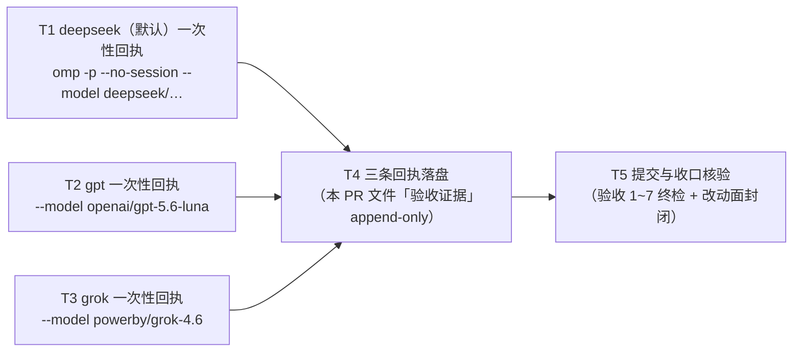

# pr-003-tasks.md — pr-003 内部任务图（一次性后端可用性回执 / F01）

**迭代**: 0028-role-model-binding ｜ **阶段**: 5（PR 实现）· 首波 ｜ **PR 文件**: `prs/pr-003-one-shot-backend-receipts.md`
**worktree 分支**: `feat/0028-pr-003-one-shot-receipts` ｜ **base**: **`162682d`**（已核：`git -C <本 worktree> merge-base HEAD iteration/0028-role-model-binding` = `162682d`）
**任务总数**: **5**（T1~T3 三条实跑并行 + T4 落证 + T5 提交收口）｜ **依赖图**: **无环**（T1/T2/T3 → T4 → T5，见 §2）
**输入真源**: PR 文件（文件范围 1 路径 / 验收 1~7）+ `prd/F01-one-shot-backend-receipts.md`（验收 1~5、边界、A-02）+ `architecture.md` §4 A-02（载体与五字段形态）· §0（"不新建独立探针文件"）+ 阶段 1 取证先例（`clarifications/round-1-kickoff.md:14-16`）+ 本机一手实跑（§0.5，逐条带命令）
**本 PR 性质**: **纯取证 + 落证**——跑 3 条 `omp` 一次性命令，把「命令 + 原始输出 + 观测结果 + 时点 + 耗时」写进本 PR 文件的「验收证据」小节；**零代码改动、零集群动作、零 hub 派发**。验收面 = 命令形态（`-p` + `--no-session`、三条除 `--model` 取值逐字相同）+ 输出原文照录（无套件可跑，见 §0.4 契约 8）。

---

## 0. 范围、文件面与事实锚点

### 0.1 本 PR 文件范围（**1 路径**；唯一可写面）

| # | 路径（相对本 worktree 根） | 动作 | 归属任务 |
|---|---|---|---|
| 1 | `docs/iterations/0028-role-model-binding/prs/pr-003-one-shot-backend-receipts.md` | 从**迭代工作区**复制入库（本 worktree 无该子树，A5）+ 在「验收证据」小节追加三条回执 | **T4** |
| — | `prs/pr-003-one-shot-backend-receipts-tasks.md`（本文件） | 阶段 5 流程产物 | **不计入本 PR 改动面**（§0.4 契约 6） |

> 本 PR **不产生任何其它文件**：不新建探针文件/探针目录（F01 验收 4 / D-9）、不写 `status.md`、不写 `clarifications/**`、不碰 `oamp/**` / `roles/**` / `cluster.json`（PR 验收 6 / 7）。

### 0.2 三条命令（逐字；T1~T3 各自唯一变量 = `--model` 取值）

| 回执 | 后端 | 命令（**逐字**，cwd = 本 worktree 根，`<WS>` 见 §0.4 契约 1） |
|---|---|---|
| ① | deepseek（**默认**，取值 = `~/.omp/agent/config.yml` 的默认 id，见 A1/C-1） | `omp -p --no-session --model deepseek/deepseek-v4-flash:high "只回复: OK"` |
| ② | gpt | `omp -p --no-session --model openai/gpt-5.6-luna "只回复: OK"` |
| ③ | grok | `omp -p --no-session --model powerby/grok-4.6 "只回复: OK"` |

**形态约束（PR 验收 2 / 3）**：三行**除 `--model` 取值外逐字相同**（同一 `-p`、同一 `--no-session`、同一 prompt 文本 `只回复: OK`、同一旗标顺序）；文本中**不出现** `hub`、`api messages`、`calls create`。三条命令的来源 = 阶段 1 已实测的同形探针（A1）——本 PR 把它们**重跑一遍**并落成可核对回执（不是转抄阶段 1 的旧数值：`时点`/`耗时` 必须是本次执行实测）。

### 0.3 非目标（防夹带；触碰即 F01 边界 / PR 验收 6 / 7 不通过）

- **不做**：常驻路径探针（F02 → pr-004）、hub 派发（`api calls create`）、建 chat、落对话、集群启动/重启（pr-005 起）、后端质量或延迟优劣的判定、集群启动期模型存在性预检（F01 边界逐条）。
- **不写**：`status.md`（主 agent 维护）、`clarifications/**`（阶段 6 报告落点）、独立探针文件/目录（D-9）、`deferred-demand-changes.md`（失败条目由 pr-007 / F12 收录，本 PR 只登记"待 F12 收录"）。
- **不改**：`cluster.json` 的绑定取值（属于 pr-002；某后端失败也不改绑定，F01 边界）；`oamp/**`、`roles/**`。
- **不加旗标**：三条命令不得新增 `--no-tools` / `--max-time` / `--mode` 等任何阶段 1 形态之外的旗标（加了就破坏"三条除 `--model` 取值外逐字相同"的可比性与先例一致性）。

### 0.4 本 PR 内的契约（每个任务都必须遵守）

1. **执行位置**：三条命令的 cwd **均为本 worktree 根**（`<WS>` = `/Users/chenchiyuan/projects/agents/.pb-agents/worktrees/0028-role-model-binding/.pb-agents/worktrees/0028-pr-003-one-shot-receipts`）。cwd 不写进回执（§0.4 契约 3 限定字段集合），由本任务图统一登记。
2. **硬时限包裹（不改命令文本）**：实跑一律用 `timeout 720 <命令>` 包裹（本机 `timeout` 可用，A4）；**回执的 `命令` 字段只记 omp 命令本体**（逐字可复制重跑），包裹时长只体现在 `观测结果` 的现象里。理由 = 节点单次执行硬上限 30 分钟，而 gpt 首 token 可能数分钟（`oamp/README.md:87`）。
3. **字段名逐字、恰好五字段**：每条回执一个**三级标题**条目，字段名逐字为 `命令` / `原始输出` / `观测结果` / `时点` / `耗时`（`architecture.md` §4 A-02）。**不加第六字段**——退出码、cwd、包裹方式等写进 `观测结果` 的"现象"里。
4. **`原始输出` = stdout 与 stderr 两段原文照录**（分段标注来源）：**`Working...` 驻 stderr，属原文一部分，不得省略**（A3 实测）；不得润色、不得只留 `OK` 一行。
5. **失败如实记**：任一条后端失败（含超时）⇒ 该条 `观测结果` 记"失败 + 现象"，**不隐藏、不用另一次成功替代**，且在本 PR 证据小节登记一行"待 F12 收录：<后端> + 现象"（F01 验收 3 / PR 验收 5）。
6. **证据 append-only**：保留「验收证据」小节原有的括注行（`（本 PR 执行时填写：…）`），回执内容追加在其后；七字段与标题零改动。
7. **本任务图文件不混入本 PR 的提交**：若要提交，独立成一次提交（先例 `9abdba6 docs(0026): pr-001 阶段5 任务图…`），或本次不提交。
8. **无套件可跑**：验收手段 = 命令实跑 + 文件内容核验（与 `architecture.md` §7 一致）；不得声称"测试全绿"。

### 0.5 事实锚点（2026-09-15 实测，判据基础）

| # | 事实 | 核实方式 |
|---|---|---|
| **A1** | **阶段 1 取证先例就是这三条命令**：`clarifications/round-1-kickoff.md:14-16` 记 ① `omp -p --no-session --model deepseek/deepseek-v4-flash:high "只回复: OK"` → `OK`（2.3s）② `… --model openai/gpt-5.6-luna …` → `OK`（5.1s）③ `… --model powerby/grok-4.6 …` → `OK`（3.7s）。⇒ ① 的"deepseek（默认）"是**带 `--model` 的默认取值**（不是省掉旗标），否则会直接违反 PR 验收 3「三条除 `--model` 取值外逐字相同」 | `grep -n "omp -p" clarifications/round-1-kickoff.md` |
| **A2** | 本机 `omp` = `/Users/chenchiyuan/.bun/bin/omp`，`omp/18.2.0`；`--help` 确证三个旗标存在：`-p, --print`（非交互：处理完退出）、`--no-session`（不落会话）、`--model=<value>`（fuzzy 匹配）；另有 `--no-tools` / `--max-time` 等**本 PR 不使用**的旗标 | `which omp` / `omp --version` / `omp --help` |
| **A3** | **规划时点三条命令实跑（cwd = 本 worktree 根）**：① deepseek ⇒ exit 0 / **2s** ② gpt ⇒ exit 0 / **5s** ③ grok ⇒ exit 0 / **8s**；**stdout 逐字 = `OK`（3 字节，含换行）**；**stderr 逐字 = `Working...`（进度行）**；命令后 `git -C <本 worktree> status --porcelain` 仍为空（`--no-session` 未落会话、无其它副作用）。⚠️ 这三个数值是**规划期验证**，不作回执数据；回执的 `时点`/`耗时`/`原始输出` 必须是 dev 本次执行的实测 | 实跑 + 分流重定向 + `wc -c` + `git status` |
| **A4** | 硬时限工具可用：`timeout` = `/opt/homebrew/bin/timeout`（`gtimeout` 亦在） | `which timeout` |
| **A5** | 本 worktree 分支 = `feat/0028-pr-003-one-shot-receipts`、HEAD = base = `162682d`、`git status --porcelain` 为空；**无** `docs/iterations/0028-role-model-binding/` 子树（`docs/iterations/` 最新 = `0026-…`）⇒ PR 文件须从迭代工作区复制 | `git rev-parse` / `read` 目录 |
| **A6** | PR 文件（迭代工作区源）sha256 = `0df7b406f9c121d24a5612859a5a9950f401748222b5c2a2010e58995fba3f2b`；`F01` 卡 sha256 = `3fe64a630b737c0dcb30c8c60b4a1083d834f24eb520b71c3120a4271b31e17d`；PR 文件「验收证据」小节现值 = 一行括注 `（本 PR 执行时填写：三条回执，逐条一个三级标题条目，字段名逐字为 …）`，为文件末行 | `shasum -a 256` / `tail -3` |
| **A7** | **本 PR 与 hub / 集群面完全无关**：命令文本零 `hub`（A1），不建 chat、不落对话；本 PR 只依赖本机 `omp` 与 `~/.omp/agent/*` 配置 ⇒ 与 F04/F13 的集群面、与 `cluster.second.json` 均无交集 | A1 的命令文本 + F01 边界 |
| **A8** | **无套件可跑**：仓库无测试套件（0026 已清零）；F01 的通过条件 = 回执内容（命令形态 + 原始输出） | 事实 A3（唯一可执行物 = 这三条命令） |

---

## 1. 任务列表

### T1: deepseek（默认）一次性回执 —— 实跑与留证

- **一句话描述**：以本 worktree 根为 cwd 实跑 `omp -p --no-session --model deepseek/deepseek-v4-flash:high "只回复: OK"`，逐字记录 stdout / stderr / 观测结果 / 时点 / 耗时。
- **验收标准**:
  1. **命令形态（PR 验收 2/3）**：命令逐字 = §0.2 行 ①；含 `-p` 与 `--no-session`；文本中 `hub` / `api messages` / `calls create` **零命中**。
  2. **实跑记录四要素**：`原始输出` = stdout 段逐字 + stderr 段逐字（**含 `Working...`**，§0.4 契约 4）；`时点` = 本次执行的开始时间（本地时间戳）；`耗时` = 实测墙钟秒数并标注"不入判据"（MI-1）；退出码写入 `观测结果` 的现象里（§0.4 契约 3）。
  3. **观测结果判定（F01 验收 3）**：stdout 文本含 `OK` ⇒ `成功`（现象写"后端返回预期文本 `OK`，exit=0，耗时 N s"）；否则 ⇒ `失败` + 现象逐字记录，并注明"待 F12 收录"（PR 验收 5）。
  4. **硬时限**：以 `timeout 720 <命令>` 包裹执行（§0.4 契约 2）；达 720s 未返回 ⇒ 如实记失败（现象 = "720s 硬时限内未返回"），**不得重跑替换、不得改命令形态**。
  5. **零副作用**：命令前后 `git -C <本 worktree> status --porcelain` 输出相同；无 session 文件落盘（`--no-session`）。
  6. **零越界**：本任务**不写任何文件**（落证归 T4）——`git status --porcelain` 在本任务结束后仍为空（除本任务图文件）。
- **前置依赖**: 无
- **优先级**: P0
- **追溯**: PR 文件「验收证据」小节 + 验收 1 / 2 / 4 / 5；`prd/F01` 验收 1（命令 + 原始输出为验收字段、耗时不入判据 MI-1）/ 验收 2（一次性路径形态）/ 验收 3（失败如实记并交 F12）；`architecture.md` §4 A-02（五字段形态）；事实锚点 A1 / A2 / A3 / A4

### T2: gpt 一次性回执 —— 实跑与留证

- **一句话描述**：同 T1，唯一变量 = `--model openai/gpt-5.6-luna`（§0.2 行 ②），其余旗标、prompt、cwd 逐字相同。
- **验收标准**: T1 判据 1~6 同构适用（命令替换为 §0.2 行 ②），另加：
  7. **慢后端处置（风险项，§3-①）**：`openai/gpt-5.6-luna` 的**首 token 可能数分钟**（`oamp/README.md:87` 既有登记）——达 720s 硬时限即如实记失败 + 现象，**不得**因此改用更短 prompt、去掉 `--no-session`、或换用常驻路径（那会撞 F01 验收 2 的可比性判据）。
  8. **耗时数值不构成任何通过/不通过判据**：不得因"本次比阶段 1 的 5.1s 慢"而判定失败（MI-1 逐字口径）。
- **前置依赖**: 无（与 T1 / T3 并行，互不读取对方产物）
- **优先级**: P0
- **追溯**: 同 T1 + `oamp/README.md:87`（首 token 提示）；事实锚点 A1 / A3

### T3: grok 一次性回执 —— 实跑与留证

- **一句话描述**：同 T1，唯一变量 = `--model powerby/grok-4.6`（§0.2 行 ③），其余旗标、prompt、cwd 逐字相同。
- **验收标准**: T1 判据 1~6 同构适用（命令替换为 §0.2 行 ③）；另加：
  7. **三条形态自证**：本任务与 T1 / T2 的 `命令` 文本在把 `--model` 取值替换为同一占位符后**逐字相同**（该跨任务比对在 T4 判据 3 统一执行；本任务只需保证自身命令逐字 = §0.2 行 ③）。
- **前置依赖**: 无（与 T1 / T2 并行）
- **优先级**: P0
- **追溯**: 同 T1；事实锚点 A1 / A3

### T4: 三条回执落盘 —— 本 PR 文件「验收证据」小节（append-only）

- **一句话描述**：把本 PR 自己的 `prs/pr-003-one-shot-backend-receipts.md` 从迭代工作区复制进本 worktree，并按其「验收证据」小节要求**追加**三条三级标题回执（每条五字段）。
- **验收标准**:
  1. **入库面恰 1 条**：该文件出现在本 worktree 的 `docs/iterations/0028-role-model-binding/prs/` 下；**除追加块外与源逐字一致**（源 sha256 = `0df7b406…`，A6）——判据 = 删除追加块后的前缀文本与源 `diff` 零差异（或 `head -c <源字节数>` 的 sha256 等于源 sha256）。
  2. **三条回执齐备（PR 验收 1）**：`grep -c '^### '` 于「验收证据」小节 ≥ 3，三条标题分别点名 `deepseek`（含"默认"字样）、`gpt`、`grok`；每条含五字段且**字段名逐字**：`命令` / `原始输出` / `观测结果` / `时点` / `耗时`（每条 `grep -c` 五字段各命中 1 次；无第六字段）。
  3. **命令形态与可比性（PR 验收 2/3）**：抽出的三条 `命令` 文本 ⇒ ① 均含 `-p` 与 `--no-session`；② `hub` / `api messages` / `calls create` 零命中；③ 把 `--model <值>` 归一为 `--model <M>` 后三行 `diff` **零差异**（这是"同路径同形态可比"的机械判据）。
  4. **原始输出与判定（PR 验收 4 / MI-1）**：三条 `原始输出` 均为 stdout/stderr 两段原文照录（含 stderr 的 `Working...`）；`观测结果` 形如 `成功｜失败 + 现象`；`耗时` 在场且标注"如实记录、不入判据"。
  5. **原括注行仍在场**：`grep -c '本 PR 执行时填写' <该文件>` = **1**；七字段（上下文摘要 / 涉及功能点 / 文件范围 / 验收标准 / 参考资料 / depends_on / batch）与标题零改动——判据 = `git diff -- <该文件>` 的 hunk 全部位于文件末尾「验收证据」小节内。
  6. **失败登记（PR 验收 5）**：若 T1~T3 中任一条为失败，证据小节含恰一行 `待 F12 收录：<后端> + 现象`（差距条目正文由 pr-007 写入 `deferred-demand-changes.md`，本 PR **不写**该文件）；三条全成功时该行**不出现**，并注明"三条均成功"。
  7. **零越界**：本任务不触碰 `cluster.json`（绑定归 pr-002）、`oamp/**`、`roles/**`、`status.md`、`clarifications/**`、其它 `prs/*.md`；未新建任何探针文件/目录（F01 验收 4 / D-9）。
- **前置依赖**: T1、T2、T3（汇聚点；三条回执的原始输出以此三者执行结果为唯一来源）
- **优先级**: P0
- **追溯**: PR 文件「文件范围」+「验收证据」小节 + 验收 1 / 4 / 5 / 6；`prd/F01` 验收 1 / 4；`architecture.md` §4 A-02（载体与五字段形态）· §0（不新建独立探针文件）；事实锚点 A6

### T5: 提交与收口核验（PR 验收 1~7 终检；**不再改内容**）

- **一句话描述**：把补写后的本 PR 文件提交成一次提交，然后跑完本 PR 的验收与改动面封闭核验，产出可留痕的判据输出。
- **验收标准**:
  1. **提交面恰 1 条路径**：`git show --name-only --format= HEAD` ⇒ `docs/iterations/0028-role-model-binding/prs/pr-003-one-shot-backend-receipts.md`（唯一例外 = 本任务图文件，若按 §0.4 契约 7 单独提交则不计入本提交）。
  2. **禁区零命中（PR 验收 6/7 / F01 验收 4 与边界）**：`git diff --name-only main...HEAD | grep -E '^oamp/|^roles/|^cluster\.json|^status\.md|deferred-demand-changes|clarifications/|prs/pr-00[12456789]|prs/pr-010'` ⇒ **零命中**；本 worktree 内 `git status --porcelain` 无未预期的 `??`（尤其**无新建探针文件/目录**）。
  3. **验收 1~4 在提交后重放通过**：T4 判据 1 / 2 / 3 / 4 于提交面（`HEAD`）逐条重跑 ⇒ 结论与提交前一致（`git show HEAD:<路径>` 的内容与工作区一致）。
  4. **提交卫生**：提交后 `git status --porcelain` 除本任务图文件外为空；提交信息以 `docs(0028)` 开头且含 `pr-003`，正文说明动机（"三条一次性回执：命令 + 原始输出为验收字段，耗时如实记录不入判据"）；未 `--amend`、未 `--no-verify`（仓库无 hook，纪律不豁免）。
  5. **未触碰集群面（F01 边界 / F04 验收 3）**：本 PR 全程未执行 `cluster up|down`、未执行任何 `hub api calls create`；判据 = ① `<本 worktree>/cluster.second.json` **不存在**（`test ! -e`）；② `tmux list-windows -t oamp-cluster -F '#{window_name}'` 窗口名序列与执行前一致（12 个，主集群未被改动）。
  6. **三条命令的形态自证在提交面成立**：从 `git show HEAD:<路径>` 提取三条 `命令` ⇒ T4 判据 3 的三项（`-p`/`--no-session` 在场、`hub` 等零命中、归一 `--model` 后三行一致）全部通过。
  7. **验收手段声明（登记）**：本 PR **无套件可跑**（§0.4 契约 8）——结论以命令实跑与文件内容核验为准，不声称"测试全绿"。
- **前置依赖**: T4（汇聚点；T1~T3 通过 T4 间接依赖）
- **优先级**: P0
- **追溯**: PR 文件验收 1~7 + 「验收证据」；`prd/F01` 验收 2 / 4 与边界；`architecture.md` §4 A-02；事实锚点 A5 / A7

---

## 2. 依赖图

- **无环**（5 节点 / 4 边；三条并行边汇入 T4，T4 单向指向 T5；无回边、无互指）——**不存在循环依赖**，无需上报。
- **最长依赖链**：`Tn → T4 → T5`（3 节点 / 2 边，`n ∈ {1,2,3}`）。**关键路径任务 = T4**（唯一写入者与唯一的三条命令一致性核验点）；**并行宽度 = 3**（T1/T2/T3 三条**可独立验收、可并行执行**的实跑边）。
- **真依赖（非叙述顺序）**：T4 判据 1~6 全部读 T1/T2/T3 的**执行结果**（原始输出、时点、耗时、成败）⇒ 必须后置；T5 判据 3 / 6 读 T4 落定的文件内容 ⇒ 必须后置。
- **并行安全性**：T1/T2/T3 各自只跑一条命令、不写任何文件（§0.4 契约：实跑任务零文件动作）⇒ 三条并行无资源冲突；唯一共享资源是 `~/.omp` 的会话/缓存面，而 `--no-session` 使其不可见（A3 实测无副作用）。
- **粒度隔离的有意设计（§4-②）**：三条实跑**拆成三个任务**而非合并为一个"跑三条"任务——① gpt 首 token 可能数分钟（§3-①），合并后一个慢后端会吃掉整次派发的 30 分钟预算；② 每条回执的判据（命令 + 原始输出 + 成败）**只读自身**，天然可独立验收；③ 三条并行还能把总耗时压到最长单条的量级。

---

## 3. 登记件与风险（主 agent 决策输入，非本任务图的执行项）

**① `gpt` 首 token 的时长风险（唯一实质执行风险）**
`oamp/README.md:87` 既有登记：`openai/gpt-5.6-luna` "首 token 可能数分钟"（阶段 1 实测 5.1s、规划期实测 5s，A3，但该值受机器/负载摆动，**不得**据此认为慢=失败）。处置：① 单条命令用 `timeout 720` 包裹（§0.4 契约 2，命令文本不变）；② T1/T2/T3 拆成独立派发 ⇒ 三条互不拖累；③ 达硬时限即按"失败 + 现象"如实记录并登记"待 F12 收录"（PR 验收 5 明确允许），**不重跑替换**。

**② `stderr` 属原文的一部分（易漏项）**
本机实测：`omp -p` 的进度行 `Working...` 走 **stderr**，结果 `OK` 走 **stdout**（A3）。若执行者只捉 stdout，`原始输出` 将丢失 `Working...` ⇒ T4 判据 4 显式要求两段并录。另一处易错：`观测结果` 要求"成功｜失败 + 现象"，**不要把退出码单列成第六字段**（§0.4 契约 3）。

**③ 阶段 1 的旧数值不得直接转抄**
阶段 1 记录（A1）只有 `→ OK（2.3s）` 形态，缺"原始输出原文"与本次 `时点`；本 PR 的判据要求**逐字可复制的命令 + 原文照录的输出 + 本次实测时点/耗时**⇒ 必须重跑。阶段 1 记录的作用 = 证明这三条命令的选择有先例（尤其 ① 的 `--model` 取值是**默认 id** 而非省旗标，§4-① 第 2 条）。

**④ 失败条目的下游归属（登记，不扩面）**
若某后端失败：条目正文由 **pr-007（F12）** 写入 `deferred-demand-changes.md`；本 PR 只在证据小节留一行"待 F12 收录：<后端> + 现象"，**不写** `deferred-demand-changes.md`（该文件不在本 PR 文件范围）。

**⑤ 与其它 PR 的关系（登记，供调度参考）**
本 PR `depends_on` 为空（PR 文件原文），不依赖任何 PR；但它与 pr-004（常驻探针）、pr-006（第二集群三条实报）共同构成"5 条探针回执"的整体判据（F01 验收 5）；本 PR **不承担**常驻路径（F02）与集群面（F04 起）。本 PR 的产物**不被**任何 PR 依赖 ⇒ 解锁面为空。

---

## 4. 口径确认项与粒度自查

**① `[model_inferred]` 项 —— 共 4 条，需主 agent 确认**

1. **`原始输出` 的覆盖口径 = stdout + stderr 两段并录（含 `Working...`）**：上游只写"原始输出（含观测结果）"（A-02 / F01 验收 1），未规定流的分割。依据 = 本机实测两流分流（A3）+"原文照录"的从严读法（漏掉 stderr 就等于漏了原文）。
2. **① 的"deepseek（默认）"命令仍带 `--model`，取值 = 默认 id `deepseek/deepseek-v4-flash:high`**：依据 = 阶段 1 同形先例（A1 第一行）+ PR 验收 3 的硬约束"三条除 `--model` 取值外逐字相同"（省掉旗标会直接违反）；该默认 id 与 provider 清单不同名、靠 fuzzy 匹配（C-1 既有登记）。
3. **执行用 `timeout 720` 包裹、回执 `命令` 只记 omp 命令本体**：上游未规定执行包裹；为满足"节点单次派发 ≤30 分钟"的必要手段，且不改变命令文本（§0.4 契约 2）。
4. **提交信息格式（T5 判据 4）**：`docs(0028)` 前缀 + 含 `pr-003` + 正文说明动机——PR 文件未规定；依据仓库先例（`docs(0026): pr-001 阶段5 任务图…`、`bffc336 docs(0026): 阶段4 PR规划完成…`）。

> **§0.4 契约 6（证据 append-only、保留原括注行）**：与 pr-001 / pr-002 同体例的约定，非上游原文；本 PR 的验收标准不含"PR 文件零删改行"条款，故替换括注行亦不违反本 PR 自身验收（此处从约定从严）。

**② 粒度自查（5 任务全部通过；本迭代执行约束 = 单次派发 ≤30 分钟）**

| 任务 | ≤30 分钟 | 可独立验收（不依赖其他未完成任务跑判据） | 验收标准可测试（通过/不通过可机械判定） |
|---|---|---|---|
| T1 | ✅（实测 2s；硬时限 720s 封顶） | ✅ 判据只读自身命令与输出 | ✅ 命令文本 grep、stdout/stderr 逐字、含 `OK` 判定 |
| T2 | ✅（实测 5s；硬时限 720s 封顶） | ✅ 同上（唯一变量 = `--model`） | ✅ 同上 + 慢≠失败的 MI-1 口径 |
| T3 | ✅（实测 8s；硬时限 720s 封顶） | ✅ 同上 | ✅ 同上 |
| T4 | ✅（复制 1 文件 + 追加 3 段文本 + 机械比对） | ✅ 判据只读该文件与三条命令文本 | ✅ 标题/字段 `grep -c`、归一化 `--model` 后 `diff` 零差异 |
| T5 | ✅（1 次提交 + 重放 8 条只读核验） | ✅ 汇聚点，不依赖**未完成**任务 | ✅ `--name-only` 集合、`git status` 空、`test ! -e`、窗口序列比对 |

- **拆分的非显然判断**：三条实跑**拆为 T1/T2/T3** 的三条理由见 §2 末（超时隔离 + 独立验收 + 并行压缩总时长）；**T4 与 T5 拆开**——T4 判据在"文件内容面"（回执字段与命令可比性），T5 判据在"git 面"（提交面与改动面封闭），两者不重叠且 T5 的提交后重放以 T4 定稿为前提。
- **本任务图不含**：任何实现代码、任何对 `architecture.md` / `prd/*.md` / PR 文件正文的修改、任何集群或 hub 动作；不新增探针文件（D-9）。因此不写 `roles/planner/data/` 决策记录（该路径亦不在本 PR 工作区边界内）。
