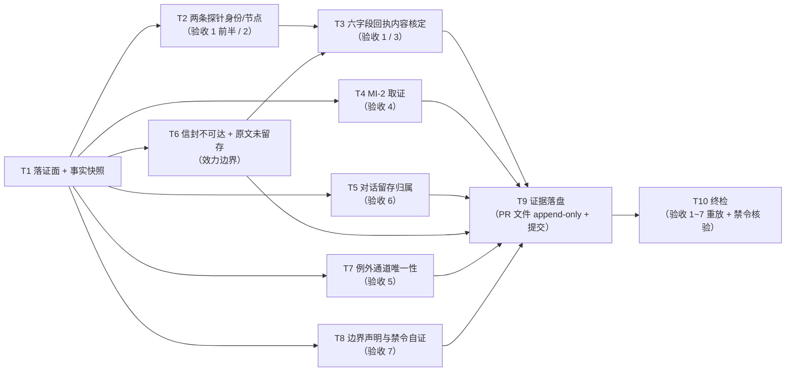

# pr-004-tasks.md — pr-004 内部任务图（常驻后端探针回执与例外通道唯一性 / F02）

**迭代**: 0028-role-model-binding ｜ **阶段**: 5（PR 实现）· 补位波 ｜ **PR 文件**: `prs/pr-004-resident-backend-probes.md`
**worktree 分支**: `feat/0028-pr-004-resident-probes` ｜ **base**: **`b61092a`**（已核：`git -C <WT> merge-base HEAD iteration/0028-role-model-binding` = `b61092aa2f68beb7b0c15df85e2771af6815f2fc` = 迭代分支 HEAD，**已含 pr-008 合并**）⇒ **`depends_on`（pr-008）已满足**（pr-008 的 PR 文件已随迭代分支入库，本 worktree 内可读）
**任务总数**: **10**（T1 落证面与快照 → T2 两条探针身份/节点 → T6 信封不可达与来源穷尽检索 → T3 六字段回执内容核定 → T4 MI-2 取证 / T5 对话留存归属 / T7 例外通道唯一性 / T8 边界声明与禁令自证 → T9 证据落盘 → T10 终检）｜ **依赖图**: **无环**（见 §2）
**输入真源**: PR 文件（文件范围 1 路径 / 验收 1~7 / 「验收证据」括注）+ `prd/F02-resident-backend-probes.md`（验收 1~6、边界、架构维度 A-02、MI-2）+ `architecture.md` §4 A-02（F02 六字段形态与 MI-2 事实补记）+ `prd/F09` 验收 3（与 F02 验收 4 同源判据）+ `status.md` §派发台账 62/63 行 + `history.md` 既有登记（信封不可达 / 对话留存 / 日志不可用）+ `deferred-demand-changes.md` **G-1**（探针例外与真源唯一冲突）+ **已合并的 pr-008 产物**（`prs/pr-008-dispatch-contract-audit.md` 的「真源唯一」块）+ 代码锚点（§0.6）
**本 PR 性质**: **纯只读 + 落证**——把阶段 1（2026-09-15 20:52 / 20:56）两条既成常驻探针落成六字段回执，并把"per-call `--model` 例外只存在于探针期"这一侧事实落盘。**零 hub 写动作、零集群启停、零代码/配置改动、严禁重跑探针**；唯一版本控制写入 = 本 worktree 内的本 PR 文件。

---

## 0. 范围、判据口径与效力边界

### 0.1 本 PR 文件范围（**1 路径**；唯一可写面）

| # | 路径 | 动作 | 归属任务 |
|---|---|---|---|
| 1 | `docs/iterations/0028-role-model-binding/prs/pr-004-resident-backend-probes.md` | 从**迭代工作区**复制入库（本 worktree 内不存在该文件——已核：`ls <WT>/…/prs/` = pr-001 / pr-002 / pr-003 / pr-005 / pr-006 / pr-007 / pr-008，**无 pr-004**）+ 在「验收证据」小节追加两条回执 + MI-2 补记（append-only） | **T1**、**T9** |
| — | `prs/pr-004-resident-backend-probes-tasks.md`（本文件） | 阶段 5 流程产物（**不进本 PR 提交面**，契约 9） | — |

**只读核对对象（不得改写）**：`status.md`（台账 62/63 行，归主 agent）、`history.md`、`clarifications/**`、`prd/**`、`architecture.md`、`deferred-demand-changes.md`（pr-007）、`prs/pr-008-*.md`（**消费其结论**）、`<MAIN>/cluster.json`（事实面）+ `<MAIN>` 的 git 只读面、`oamp/**`、`roles/**`。

### 0.2 判据口径（上游原文，逐条可回溯）

| PR 验收 | 上游依据 | 落点 |
|---|---|---|
| 1 两条回执（gpt / grok），每条六字段 `派发命令` / `call_id` / `终态字段` / `chat_id` / `时点` / `耗时`（字段名逐字） | F02 验收 1 / 5；`architecture.md` §4 A-02（F02 行） | T2、T3、T9 |
| 2 两条落在**两个不同角色节点**（`pb-dev` / `pb-verifier`） | F02 验收 1 后半 + 边界 | T2 |
| 3 两条实报 `model` 分别解析到 gpt / grok 后端（判定 = 同一后端，不要求逐字相等；实报字符串**原文照录**） | F02 验收 2；MI-3（已确认）；F02 架构维度 A-02 | T3-4 |
| 4 **MI-2 事实补记**：取证时目标集群配置（当时 `main` 的 `cluster.json`）**无任何 `model` 键** | F02 验收 3；MI-2（已确认）；`architecture.md` §4 A-02「随附事实补记」 | T4 |
| 5 **例外通道唯一性**：阶段 2~6 全部派发命令中携带 `--model` 的恰为这 2 条（判据与 F09 验收 3 同源；全量逐条结论取自 **pr-008**；本 PR 只落盘"这 2 条带 `--model`"这一侧） | F02 验收 4；F09 验收 3；PR 文件 `depends_on` | T7 |
| 6 两条探针**同属迭代 chat** `chat-6c89902c-0a9f-4513-a299-90a7f98ae611`（唯一性与建 chat 来源归 F10 / pr-008） | F02 验收 6；D-21 | T5 |
| 7 不新建独立探针文件（D-9）；不覆盖 deepseek 常驻探针（D-15）；不把该通道保留为长期可用能力 | F02 边界；D-9 / D-15 | T8 |
| 「验收证据」括注：两条回执（逐条三级标题，六字段逐字）+ MI-2 事实补记 | PR 文件「验收证据」小节原文；`architecture.md` §4 A-02 | T9 |
| 与真源唯一冲突的登记 | `deferred-demand-changes.md` **G-1**（探针期例外与 D-5 真源唯一的机制互斥） | T3-5、T7-3 |

### 0.3 非目标（防夹带；触碰即越界 ⇒ T10-4 不通过）

- **不做**（最高优先）：**重跑探针**——重跑会在阶段 2~6 内新增携带 `--model` 的调用，**直接破坏** F02 验收 5 / F09 验收 3 的「例外通道唯一性」（恰为这 2 条）；本 PR 只落盘既有事实。
- **不做**：任何写动作——`calls create` / `messages send` / `projects create` / `cluster up|down`（契约 1）；不启停集群。
- **不做**：新建独立探针文件 / 探针目录（D-9）；不覆盖 deepseek 的常驻探针（D-15：只做 gpt / grok 两个后端）；不把该通道写成长期可用能力（F02 边界）。
- **不做**：把 `派发命令` 伪装成"当时的命令原文"（原文未留存，见 §3-①）；不编造 `error` / `exit_code` 等台账未记录的字段值。
- **不做**：改 `status.md`（台账归主 agent）、`deferred-demand-changes.md`（pr-007）、`history.md`、`prd/**`、`architecture.md`、`oamp/**`、`roles/**`、`cluster.json`。
- **不做**：三条绑定实报（F05/F06/F07 / pr-006）、第二集群启动（F04 / pr-005）、集群启动期模型预检（`demand.md` 明确不做）。

### 0.4 本 PR 内契约（每个任务都必须遵守）

1. **纯只读 + 单写面**：除本 PR 文件外零写入；`calls create` / `messages send` / `projects create` / `cluster up|down` / 重跑探针 **零次**。
2. **字段名逐字**：两条回执字段名逐字为 `派发命令` / `call_id` / `终态字段` / `chat_id` / `时点` / `耗时`（`architecture.md` §4 A-02 的 F02 行）；`派发命令` **必须含 per-call `--model` 取值**；实报 `model` 字符串**原文照录**（不改写、不归一化）。
3. **两个不同节点**：`pb-dev`（gpt）与 `pb-verifier`（grok）——"不同节点"这一要求不因实际记录而放宽（F02 验收 1）。
4. **证据形态 = 可复制执行的命令 + 原样输出**：交给读者的每一条核对命令都必须**可直接粘贴执行**（无未绑定占位符、无以中文散文充当管道阶段、无手工归纳代替输出）——这是本迭代已发生两次验收 FAIL 的教训（pr-006 证据块缺陷；pr-008 复核）。对**历史事实的登记**（`派发命令` 原文未留存、`error`/`exit_code` 台账未记录）不受此条约束，但必须**单独标注为登记面内容并给出效力边界**（契约 5）。
5. **效力边界必须登记**：凡不是"当场复核得到的活体信封值"的内容，逐条写明"来源 + 可得性 + 为何不可得"，**不得**表述为"当场复核了信封"（brief 关键事实 4）。
6. **证据 append-only**：PR 文件「验收证据」小节保留原括注行（`本 PR 执行时填写…`，执行时点计数须仍为 1）；七字段与标题零改动（hunk 全落在末节）。
7. **不引入技术决策**：新增文本只能取自 PR 文件、`prd/F02`、`architecture.md` §4 A-02、`status.md` 62/63 行、`history.md` 既有登记、pr-008 的「真源唯一」块、只读命令原始输出；发现上游表述与实测不一致 ⇒ 记录并上报。
8. **本任务图不进提交面**：提交面恰 1 路径（本 PR 文件），不得含 `pr-004-resident-backend-probes-tasks.md`。

### 0.5 执行环境事实（供 dev 直接引用，**无需重新调研**）

| # | 事实 | 值 / 判据 |
|---|---|---|
| **E1** | **两条探针的身份**（F02 验收 1 / 2）：① `call_id` = `task-bfd83f28-2078-434b-8a16-eac455d2e999`，节点 `pb-dev`，实报 `openai/gpt-5.6-luna`，`时点` = 20:52（2026-09-15），`耗时` = 3607ms；② `call_id` = `task-39204abd-38ab-4971-b785-3eed6b0bb835`，节点 `pb-verifier`，实报 `powerby/grok-4.6`，`时点` = 20:56，`耗时` = 4885ms | `status.md` §派发台账**第 62、63 行**原文（`sed -n '62,63p'`） |
| **E2** | **两条同属迭代 chat**（F02 验收 6 / D-21）：`chat_id` = `chat-6c89902c-0a9f-4513-a299-90a7f98ae611` | `status.md` §执行方式「chat_id（阶段 2~6）」+ E4 |
| **E3** | **两条信封已不可达**（登记面限制的来源）：`api calls list` / `api calls get` 对这两个 `call_id` **均无返回**——它们是**集群重建前**（2026-09-16 08:47 重建）的调用，调用面被清空（与 **G-15** 同类） | `history.md` 既有登记原文（「两条 F02 探针（20:52 / 20:56）的**信封不可达**…」） |
| **E4** | **对话记录留存**：`api chats get chat-6c89902c-…` 中可命中 **2 条消息**，其 `meta` **只有 `task_id` 一个键**（无 `agent` / `model` / `state` / 时间），**正文 = 该次派发的探针提示词** | `history.md` 既有登记原文 |
| **E5** | **角色日志不可用**：`<MAIN>/oamp/.runtime/cluster/pb-dev.log` / `pb-verifier.log` 首行时间戳均为 `2026-09-16T00:47:43Z`（= 本地 08:47，重建时被重建/截断）⇒ **无 20:52 痕迹** | `history.md` 既有登记 + 首行 `head -1` |
| **E6** | ⇒ **`终态字段`（`state`/`model`/`error`/`exit_code`）与 `耗时` 只能来自「20:52 / 20:56 时点当时的活体信封记入台账的记录」**，属**登记面判据**。台账可得的：`state = completed`（由「终态」列 `completed（3607ms）`/`completed（4885ms）` 得）、`model` = 两实报值、`耗时` = 3607ms / 4885ms；台账**未记录** `error` / `exit_code` ⇒ 二者标"不可得" | `status.md:62,63` 七列原文 |
| **E7** | **MI-2 的事实面**（F02 验收 3）：取证时目标集群配置 = `<主工作区>/cluster.json` **无任何 `model` 键**；该文件最后一次提交 = `e6da668`（2026-09-11 12:22:47）**早于** 20:52 探针，且 `<主工作区>` 工作树对该文件**干净** ⇒ 探针时点与现文一致 | `grep -c '"model"' <MAIN>/cluster.json` ⇒ `0`；`git -C <MAIN> log -1 --format='%h %ad' --date=iso -- cluster.json` ⇒ `e6da668 2026-09-11 12:22:47 +0800`；`git -C <MAIN> status --porcelain -- cluster.json` ⇒ 空 |
| **E8** | **例外通道唯一性的既有结论**（F02 验收 4 的判据面，取自 pr-008）：pr-008「真源唯一」块（`prs/pr-008-dispatch-contract-audit.md` **第 150 行起**）给出 A/B/C 三组与汇总结论——**A 组** = 这 2 条探针「**含 `--model`**（per-call 例外）」（依据 `status.md:62,63` 用途列 + §执行方式）；**B 组** = 3 条第二集群实报「不含 `--model`」（pr-006 命令原文逐字，`grep -c -- '--model'` = 0）；**C 组** = 台账其余 36 行「不含」（**登记面判据**）；**汇总结论**（第 181 行）=「除 2 条探针外零命中 `--model`」，并注明效力边界 = 登记面（本迭代**未逐条留存派发命令原文**） | 已合并的 `prs/pr-008-dispatch-contract-audit.md:150-181` |
| **E9** | **pr-008 的既有偏差 D0**：`per-call model 例外` 字面在台账**命中 1 而非 2**（仅第 62 行用途列含该短语；第 63 行写的是「同 chat 第二条」）⇒ 第 2 条探针的例外属性由 G-1 / 实报值 / 例外通道定义佐证，而非短语字面；本条须在证据中如实标注 | `prs/pr-008-dispatch-contract-audit.md:585`（D0）+ `status.md:62,63` |
| **E10** | **探针派发命令原文未留存**：全迭代产物检索（`grep -rn`）未发现 20:52 / 20:56 两条 `calls create` 的命令原文；`history.md` 的 `calls create` 记录（命令形态出现处）不含这两条；`clarifications/round-1-kickoff.md:15-16` 记的是**一次性路径**（`omp -p --no-session --model …`）命令，属 F01 而非 F02 | 见 T6 的检索命令与零命中输出 |
| **E11** | **代码锚点**：`oamp/src/cluster.js:200-201` = `if (entry.model !== undefined) { argv.push('--model', entry.model); }`（角色级 `--model` 的追加点，佐证"探针期配置无模型键 ⇒ 两条实报只能来自 per-call 参数"的机制链） | 文件原文 |
| **E12** | **无套件可跑**：本 PR 的通过条件 = 只读命令原始输出 + 文件内容核验（契约 10） | 同左 |

### 0.6 工具锚点（规划期只读核对，逐条带出处）

- `status.md` §派发台账 **第 62、63 行** = 两条探针行（七列原文）；§执行方式「chat_id（阶段 2~6）」= 迭代 chat id。
- `hub api chats get chat-6c89902c-0a9f-4513-a299-90a7f98ae611` ⇒ `messages[].meta.task_id`（E4：仅 `task_id` 一键）。
- `hub api calls list` / `hub api calls get <call_id>` ⇒ 两条探针**零返回**（E3；重建前调用，与 G-15 同类）。
- `prs/pr-008-dispatch-contract-audit.md`：`#### 真源唯一｜PR 验收 3（F09 验收 3；结论供 **pr-004 验收 4** 消费）`（第 150 行起），A/B/C 组（第 175~177 行）、汇总结论（第 181 行）、D0（第 585 行）。
- `oamp/src/cluster.js:200-201`（E11）；`<MAIN>/cluster.json`（E7）。

---

## 1. 任务列表

### T1: 落证面准备与事实快照（基线冻结）

- **一句话描述**：把本 PR 文件从迭代工作区复制进 worktree，并冻结本 PR 全部判据所依赖的只读快照。
- **验收标准**:
  1. **入库面恰 1 条**：`docs/iterations/0028-role-model-binding/prs/pr-004-resident-backend-probes.md` 出现在 `<WT>` 内；`git -C <WT> diff --no-index <WS>/…/pr-004-…md <WT>/…/pr-004-…md` **零输出**；源 sha256 + 字节数 + 行数记录；`grep -c '本 PR 执行时填写'` = 1（原括注行在场）。
  2. **台账快照**：`sed -n '62,63p' <WS>/docs/iterations/0028-role-model-binding/status.md` 原文 + `shasum -a 256` 该文件 + 台账小节行号区间（对照 E1：两条探针行 = 62/63；sha 以执行时点为准并登记）。
  3. **pr-008 结论快照**：`sed -n '150,181p' <WT>/docs/iterations/0028-role-model-binding/prs/pr-008-dispatch-contract-audit.md` 原文（A/B/C 组 + 汇总结论）+ `sed -n '585p'`（D0）；并记录该文件 sha256。
  4. **零写入**：本任务只读；`git -C <WT> status --porcelain` 仅新增 PR 文件（+本任务图文件）；`<WS>` / `<MAIN>` 零写入。
- **前置依赖**: 无
- **优先级**: P0
- **追溯**: PR 文件「文件范围」；`architecture.md` §4 A-02（载体约定）；事实锚点 E1 / E8 / E9

### T2: 两条探针的身份与节点核对（PR 验收 1 前半 / 2）

- **一句话描述**：把两条探针的 `call_id`、角色节点、实报值、时点、耗时逐条从台账原文取定，并核对"两个不同节点"。
- **验收标准**:
  1. **逐条身份（PR 验收 1 / F02 验收 1）**：两条各给出 `call_id`（E1 两个值，原文照录）+ 角色名 + 实例 id（`pb-dev` / `pb-verifier`）+ 实报 `model` 字符串**原文照录**。
  2. **两个不同节点（PR 验收 2 / F02 验收 1）**：判据 = 两条的实例 id 互不相同（`pb-dev` ≠ `pb-verifier`）；给出该判据的机械形式（两个字符串比对）+ 台账行号。
  3. **来源可点（契约 4/5）**：每条字段标注来源 = `status.md:62` / `status.md:63`（七列原文），并声明"该行的 `终态` 列即当时活体信封的登记面记录"。
  4. **不越界**：**不**对两个 `call_id` 发起 `calls create`；本任务对调用面的唯一动作是 T6 的只读探测。
- **前置依赖**: T1
- **优先级**: P0
- **追溯**: PR 验收 1 / 2；F02 验收 1 与边界；事实锚点 E1

### T3: 六字段回执内容核定（PR 验收 1 / 3 / 4 的字段面）

- **一句话描述**：逐字段给出两条回执的取值、来源与效力边界，含 `派发命令` 的重建形与"可确定 / 不可确定"清单。
- **验收标准**:
  1. **字段名逐字（PR 验收 1 / `architecture.md` §4 A-02）**：六字段为 `派发命令` / `call_id` / `终态字段` / `chat_id` / `时点` / `耗时`；缺字段或多字段即判不合格；**不得**新增第七字段（如把"来源"单列——来源写在字段值内的括注里）。
  2. **`派发命令` 的重建形 + 边界（契约 5 / §3-①）**：给出两条的命令形，其中 **确定项** = 通道入口（`node <主工作区>/oamp/bin/hub.js api calls create`）、`--chat-id chat-6c89902c-0a9f-4513-a299-90a7f98ae611`、`--agent dev|verifier`、`--model openai/gpt-5.6-luna|powerby/grok-4.6`（后者取自台账实报值，标注为"实报值回填请求取值"这一限定的）、`--task "<对话正文原文>"`（正文可由 `chats get` 取得，见 T5）；**不可确定项**逐条列出（旗标顺序 / 是否带 `--mode block` 或 `--wait` / 是否带 `--tools` 等）并**声明该形为按登记面重建、非当时的命令原文**（E10）。
  3. **`终态字段`（PR 验收 1 / E6）**：`state` = `completed`（依据台账 `终态` 列 `completed（3607ms）` / `completed（4885ms）`）；`model` = 两个实报值原文；`error` / `exit_code` = **台账未记录 ⇒ 明确写"不可得（台账未记录，信封已不可达）"**，**不得留空、不得编造**。
  4. **后端口径判定（PR 验收 3 / F02 验收 2 / MI-3）**：`dev` ⇒ 解析到 gpt 后端（`openai/` 前缀）；`verifier` ⇒ 解析到 grok 后端（`powerby/` 前缀）；判定**只判"同一后端"**，并声明"实报字符串只作可复核原始事实、不作比较判据"；任一指向不同后端 ⇒ 本卡判失败并如实登记。
  5. **与 G-1 的关系（`deferred-demand-changes.md` G-1）**：写明本回执是 G-1「探针期例外与 D-5 真源唯一互斥」的事实侧落点（例外已关闭），并引用 G-1 的条目位置；**不**在 `deferred-demand-changes.md` 内写入任何内容（该文件归 pr-007）。
  6. **`时点` / `耗时`**：`时点` = 20:52 / 20:56（日期 = 2026-09-15，来源 `history.md` 当日记录）；`耗时` = 3607ms / 4885ms（来源台账 `终态` 列括号值，标注"如实记录、不入判据"——`architecture.md` §4 A-02 原文）。
- **前置依赖**: T2、T6（重建形的边界依赖 T6 的穷尽检索结论）
- **优先级**: P0
- **追溯**: PR 验收 1 / 3 / 5；F02 验收 1 / 2 / 5；MI-3；`architecture.md` §4 A-02；`deferred-demand-changes.md` G-1；事实锚点 E1 / E6 / E10

### T4: MI-2 事实补记取证（PR 验收 4 / F02 验收 3）

- **一句话描述**：以只读方式取到"探针取证时目标集群配置无任何 `model` 键"的三条判据。
- **验收标准**:
  1. **无 `model` 键**：`grep -c '"model"' <MAIN>/cluster.json` ⇒ `0`（命令 + 原样输出留证）。
  2. **时点早于探针**：`git -C <MAIN> log -1 --format='%h %ad %s' --date=iso -- cluster.json` ⇒ `e6da668 2026-09-11 12:22:47 +0800 …`（**早于** 2026-09-15 20:52）⇒ 探针时点该文件已是此版本；`git -C <MAIN> status --porcelain -- cluster.json` ⇒ 空（当时无未提交改动的最佳可得证据）。
  3. **机制链**：引 `oamp/src/cluster.js:200-201`（角色级 `--model` 的追加点）+ 配置无 `model` 键 ⇒ 两条实报**只能**来自 per-call `--model` 参数（F02 验收 3 / MI-2 的口径原文）；写明这是**静态面 + 登记面**判据，不是活体信封复核（契约 5）。
  4. **补记文本形态**：给出可直接写入 PR 文件「验收证据」小节的 MI-2 补记段（含上述三条命令与输出），并注明"该口径已由 20:52 两条既成探针事实满足，无需重跑"（F02 验收 3 原文）。
  5. **零写入**：对 `<MAIN>` 只读（`grep` / `git log` / `git status` 均为只读）；`oamp/**` / `roles/**` / `cluster.json` 零改动。
- **前置依赖**: T1
- **优先级**: P0
- **追溯**: PR 验收 4；F02 验收 3 与 MI-2；`architecture.md` §4 A-02「随附事实补记」；事实锚点 E7 / E11

### T5: 对话记录留存的 chat 归属取证（PR 验收 6 / F02 验收 6）

- **一句话描述**：以留存下来的对话消息面证明两条探针同属迭代 chat，并取出可作为 `--task` 正文的原文。
- **验收标准**:
  1. **两条同属该 chat（PR 验收 6 / D-21）**：`node <MAIN>/oamp/bin/hub.js api chats get chat-6c89902c-0a9f-4513-a299-90a7f98ae611` ⇒ 在 `messages[].meta.task_id` 中逐条命中 `task-bfd83f28-…` 与 `task-39204abd-…` **各恰一处**；给出两行对照（`call_id` ↔ 命中位置）与原始输出片段。
  2. **`meta` 仅含 `task_id`（E4）**：如实登记该面**不提供** `agent` / `model` / `state` / 时间 ⇒ 两条探针的节点与实报值**只能**走台账（T2 / E1），不得表述为"从对话记录复核了节点与模型"（契约 5）。
  3. **`--task` 正文来源**：取两条消息的**正文原文**（探针提示词）作为 T3-2 的 `--task` 取值来源；正文原文照录，并注明"该正文是当时 `--task` 取值的留存证据（推定），非命令原文的全部"。
  4. **首条调用留痕（旁证，不重复判定）**：`messages[0].meta.task_id` 是否为 `task-bfd83f28-…`（gpt 探针）如实记录——该判定的**归属权在 F10 / pr-008**（本 PR 只留旁证，不做结论）。
  5. **零写动作**：只用 `chats get`（层 A GET）；不得用 `messages send` 制造任何消息。
- **前置依赖**: T1
- **优先级**: P0
- **追溯**: PR 验收 6；F02 验收 6 与 D-21；事实锚点 E2 / E4

### T6: 信封不可达与命令原文未留存的穷尽检索（效力边界的事实面）

- **一句话描述**：以可复制执行的只读命令证明"两条信封不可达、命令原文未留存"，为 T3 的效力边界提供判据。
- **验收标准**:
  1. **信封不可达（E3）**：逐条 `node <MAIN>/oamp/bin/hub.js api calls get task-bfd83f28-…` 与 `… task-39204abd-…` ⇒ 记录**原样输出**（预期无返回/不存在）+ `api calls list` 中检索两 id（`grep -c` 判据 ⇒ `0`）；结论按 G-15 同类现象标注。
  2. **命令原文未留存（E10）**：给出**可复制执行**的检索命令（如 `grep -rn 'calls create' <WS>/docs/iterations/0028-role-model-binding` 与对两条 `call_id` 的检索）⇒ 输出中**不含**这两条的完整命令原文；列出全部命中处并逐处说明其性质（模板/约定/其它 PR 的命令），判据 = 逐处排除后的零命中结论。
  3. **日志不可用（E5）**：`head -1 <MAIN>/oamp/.runtime/cluster/pb-dev.log` 与 `pb-verifier.log` ⇒ 时间戳 `2026-09-16T00:47:43Z` 原文留证 ⇒ 无 20:52 痕迹。
  4. **边界声明文本**：产出一段可直接写入证据的"效力边界"声明（三句）：① 回执的 `终态字段` / `耗时` 来自 20:52 / 20:56 时点记入台账的活体信封记录（登记面判据）；② `派发命令` 原文未留存、为按登记面重建；③ 上述限制**不等于**证据无效——判据面 = 登记面 + 对话留存 + 配置事实三者的交叉。
  5. **零写动作**：全部命令只读；**零次** `calls create`（严禁重跑探针，契约 1）。
- **前置依赖**: T1
- **优先级**: P0
- **追溯**: PR 验收 1 / 3（效力边界）；F02 验收 1 与边界；`deferred-demand-changes.md` G-15；brief 关键事实 1~4；事实锚点 E3 / E5 / E10

### T7: 例外通道唯一性（PR 验收 5 / F02 验收 4；消费 pr-008 结论）

- **一句话描述**：落盘"这 2 条带 `--model`"一侧的事实，并引用 pr-008 的全量结论，不重复产出全量核对。
- **验收标准**:
  1. **本侧事实（PR 验收 5 前半）**：明确写出在这 2 条探针上 **per-call `--model` 处于例外状态**，逐条给出 `call_id` + 实报 `model` 原文 + 出处（`status.md:62,63` 用途列 + §执行方式「模型真源 / 探针专用例外」）。
  2. **消费 pr-008 结论（PR 验收 5 后半 / `depends_on`）**：直接引用已合并的 `prs/pr-008-dispatch-contract-audit.md` 「真源唯一」块的 **A / B / C 组 + 汇总结论**（含行号 = 150 / 175~177 / 181）⇒ 本 PR **不重复**做全量逐条核对，只做引用与一致性确认（引用段落原文摘录）。
  3. **D0 偏差如实转记（E9）**：写明 `per-call model 例外` 字面在台账**命中 1 而非 2**（第 63 行写作「同 chat 第二条」）⇒ 第 2 条探针的例外属性由 G-1（例外通道定义）+ 实报值 + §执行方式佐证；**不**改写台账、**不**把它说成"字面命中 2"。
  4. **效力边界继承**：引用 pr-008 的效力边界（本迭代未逐条留存派发命令原文 ⇒ C 组为**登记面判据**）⇒ 本 PR 的结论不得超出该边界（不得声称"命令原文逐字核对通过"）。
  5. **本 PR 的落盘职责边界**：写明"本 PR 只落盘这 2 条带 `--model` 这一侧；全量结论与去向归 pr-008 / F12"，并给出该表述的上游出处（PR 文件验收 5 原文）。
- **前置依赖**: T1
- **优先级**: P0
- **追溯**: PR 验收 5 与 `depends_on`；F02 验收 4；F09 验收 3；`deferred-demand-changes.md` G-1；事实锚点 E8 / E9

### T8: 边界声明与禁令自证（PR 验收 7）

- **一句话描述**：落盘三条边界（不新建探针文件 / 不覆盖 deepseek / 通道非长期能力）并自证零写动作与未重跑。
- **验收标准**:
  1. **不新建独立探针文件（D-9）**：判据 = `git -C <WT> status --porcelain` 的未跟踪项**不含**任何探针文件/目录（仅本 PR 文件 + 本任务图文件）；证据中写入该命令原文与输出。
  2. **不覆盖 deepseek 常驻探针（D-15）**：证据中**不出现** deepseek 的常驻探针回执；并写明 D-15 的理由面（deepseek 有现行集群持续运行事实 + F01 的一次性回执，`prd/F02` 边界原文）。
  3. **不把该通道保留为长期可用能力（F02 边界）**：写明"例外已于探针完成后关闭"（`status.md` §执行方式「模型真源」原文）+ "不修改 per-call `model` 的既有语义"（F02 边界原文）。
  4. **禁令自证**：列出本 PR 全程命令清单并标注性质 ⇒ `calls create` / `messages send` / `projects create` / `cluster up|down` / 重跑探针 **零次**；`git -C <WT> diff --name-only b61092a...HEAD` ⇒ 仅本 PR 文件（代码/配置面零改动）。
  5. **一句话结论**：本 PR 只落盘既有事实、未产生任何新的运行态副作用（判据 = 上述命令清单 + `hub api calls list` 中不出现本 PR 新产生的调用）。
- **前置依赖**: T1
- **优先级**: P0
- **追溯**: PR 验收 7；F02 边界（D-9 / D-15）；`status.md` §执行方式；契约 1

### T9: 证据落盘（PR 文件「验收证据」append-only）

- **一句话描述**：把两条回执 + MI-2 补记 + 效力边界 + 例外通道唯一性 + 边界声明写入本 PR 文件的「验收证据」小节并提交。
- **验收标准**:
  1. **两条回执（PR 验收 1 / 括注原文）**：小节内 **2 条**三级标题条目（gpt 一条、grok 一条），各含六字段且字段名**逐字**（`派发命令` / `call_id` / `终态字段` / `chat_id` / `时点` / `耗时`）；判据 = 每条六字段 `grep -c` = 1、条目标题可点名 `gpt` / `grok` 或 `pb-dev` / `pb-verifier`。
  2. **MI-2 补记（PR 验收 4）**：随附段在场（含 T4 的三条命令与输出 + "无需重跑"声明）。
  3. **效力边界段（契约 5 / T6-4）**：三段声明在场，且**逐条**标注其判据来源（T6 的检索输出 / 台账行号 / 对话留存输出）。
  4. **例外通道唯一性段（PR 验收 5）**：含 T7 的四项内容（本侧事实 / pr-008 引用 + 行号 / D0 偏差 / 效力边界继承）。
  5. **边界声明段（PR 验收 7）**：含 T8 的五项内容。
  6. **可执行性（契约 4）**：交付给读者的**每一条核对命令**都可直接粘贴执行（无未绑定占位符、无以散文充当管道阶段、无手工归纳代替输出）；仅"历史事实登记"类内容（`派发命令` 重建形、`error`/`exit_code` 不可得）允许为登记面表述，且必须带效力边界标注。
  7. **append-only 与提交**：原括注行仍在（`grep -c '本 PR 执行时填写'` = 1）；七字段与标题零改动（hunk 头行号 > 「## 验收证据」小节行号）；`git -C <WT> show --name-only --format= HEAD` ⇒ **恰 1 路径**（本 PR 文件，本任务图文件不在其中）；提交信息以 `docs(0028/pr-004)` 开头且含 `常驻探针回执`。
- **前置依赖**: T3、T4、T5、T6、T7、T8（全部结论的落盘动作）
- **优先级**: P0
- **追溯**: PR 文件「验收证据」小节原文 + 验收 1~7；`architecture.md` §4 A-02；契约 4 / 5 / 6 / 8

### T10: 终检（7 条验收逐条重放 + 禁区与禁令核验）

- **一句话描述**：在提交面对 7 条验收标准逐条重放判据，核对改动面封闭与零写动作。
- **验收标准**:
  1. **覆盖矩阵逐条有判据**：PR 验收 1~7 各给出"判据 + 结论"，其中 1 / 2 / 3 / 5 / 6 / 7 的机械判据在**提交面**（`git -C <WT> show HEAD:<路径>`）重放一次 ⇒ 与工作区结论一致。
  2. **六字段形态在提交面成立**：从提交面提取两条回执 ⇒ 六字段各命中 1 次、字段名逐字、`派发命令` 含 `--model` 取值、实报 `model` 原文在场。
  3. **改动面封闭**：`git -C <WT> diff --name-only b61092a...HEAD | grep -E '^(oamp/|roles/|cluster\.json|cluster\.second\.json|docs/iterations/0028-role-model-binding/(status\.md|history\.md|demand\.md|prd\.md|architecture\.md|prd/|clarifications/|deferred-demand-changes\.md|prs/pr-00[1235678]|prs/pr-01))'` ⇒ **零输出**。
  4. **禁令零命中（PR 验收 7 / 契约 1）**：本 PR 全程 `calls create` / `messages send` / `projects create` / `cluster up|down` / 重跑探针 **零次**；未新建任何探针文件（`git -C <WT> status --porcelain` 未跟踪项仅本 PR 文件 + 本任务图文件）。
  5. **台账与上游零改动**：`shasum -a 256 <WS>/docs/iterations/0028-role-model-binding/status.md` 与 T1-2 快照对照 ⇒ 若期间有变更，须说明由主 agent 更新且本 PR 未写入（判据 = `<WS>` 内本 PR 零文件写入）。
  6. **验收手段声明**：本 PR 无套件可跑（E12）——结论以只读命令原始输出与文件内容核验为准，不声称"测试全绿"。
- **前置依赖**: T9
- **优先级**: P0
- **追溯**: PR 文件验收 1~7 与「验收证据」；F02 验收 1~6 与边界；契约 4 / 5 / 6 / 8

---

## 2. 依赖图与覆盖矩阵

- **无环**（10 节点 / 13 边）：T1 扇出到 T2 / T4 / T5 / T6 / T7 / T8；T2 与 T6 汇入 T3（字段取值 + 效力边界）；T3 / T4 / T5 / T6 / T7 / T8 汇入 T9（落盘）；T9 → T10。**无回边、无互指** ⇒ 不存在循环依赖，无需上报。
- **最长依赖链**：`T1 → T6 → T3 → T9 → T10`（5 节点 / 4 边）；同长度另有 `T1 → T2 → T3 → T9 → T10`。
- **关键路径任务**：**T6**（效力边界的事实面——它决定 T3 的重建形与"不可得"字段怎么写）、**T3**（六字段内容的唯一收敛点）、**T7**（例外通道唯一性，本 PR 的对外契约面）、**T9**（落盘 + 可执行性要求）。
- **真依赖（非叙述顺序）**：T2 必须先于 T3（身份与节点是字段值的第一来源）；T6 必须先于 T3（`派发命令` 的重建形与 `terminal fields` 的"不可得"标注依赖"信封不可达 + 原文未留存"的穷尽检索结论）；T9 必须先于 T10（提交面重放以定稿为前提）。
- **并行宽度**：T4 ∥ T5 ∥ T6 ∥ T7 ∥ T8（五条互不读对方产物，均只依赖 T1）。
- **串行点（写者唯一）**：T9 是本 PR 唯一写文件（PR 文件）的任务；其余 9 个任务**全部只读**（10 个任务里 1 个写文件、0 个写运行态——与"纯只读 + 落证"性质一致）。

### 覆盖矩阵（PR 验收 1~7 → 任务）

| PR 验收 | 主判据任务 | 落盘 | 复判 |
|---|---|---|---|
| 1 两条回执 + 六字段逐字（含 `派发命令` 的 `--model`） | T2（身份）、T3（字段内容） | T9-1 / T9-2 | T10-1 / T10-2 |
| 2 两条落在两个不同角色节点 | T2-2 | T9-1 | T10-1 |
| 3 两条实报解析到 gpt / grok 后端（MI-3 口径 + 原文照录） | T3-4 | T9-1 | T10-2 |
| 4 MI-2 事实补记（取证时配置无 `model` 键） | T4-1/2/3 | T9-2 | T10-1 |
| 5 例外通道唯一性（2 条带 `--model`；全量结论取 pr-008） | T7-1/2/3/4 | T9-4 | T10-1 |
| 6 两条同属迭代 chat | T5-1/2/3 | T9-1（`chat_id` 字段 + 归属对照） | T10-1 |
| 7 不新建探针文件 / 不覆盖 deepseek / 非长期能力 | T8-1/2/3/4 | T9-5 | T10-4 |
| （效力边界，非编号验收） | T6-1/2/3/4 | T9-3 | T10-1 |

---

## 3. 风险与效力边界

### 3.1 效力边界（本 PR 的核心诚实性约束）

| # | 面 | 可得性 | 处置 |
|---|---|---|---|
| ① | **`派发命令` 原文** | **不可得**（E10：全迭代产物检索零命中；`history.md` 无这两条的通道记录；`clarifications/round-1-kickoff.md:15-16` 是一次性路径 F01 的命令，不是本卡的） | T3-2 给**重建形**：确定项逐条列明、不可确定项逐条列明，并声明"非当时的命令原文"；**禁止**把重建形表述为原文（契约 5） |
| ② | **`终态字段` / `耗时`** | **仅登记面可得**（E3 / E6：信封不可达；`error` / `exit_code` 台账未记录） | T3-3 逐字段标注来源与"不可得"；T6-4 产出效力边界三段声明 |
| ③ | **节点与实报值** | 仅台账可得（E4：对话记录 `meta` 仅 `task_id`） | T5-2 显式登记"不得表述为从对话记录复核了节点与模型" |
| ④ | **例外通道唯一性的全量侧** | 由 pr-008 提供，其效力边界 = **登记面**（本迭代未逐条留存命令原文） | T7-4 继承该边界，不越界声称"命令原文逐字核对通过" |
| ⑤ | **规则字面 vs 事实** | `per-call model 例外` 字面命中 1 而非 2（E9 / pr-008 的 D0） | T7-3 如实转记，不改台账、不改上游表述 |

> **判据面结论（供 dev 在证据中复述）**：本卡的可核对性由**三面交叉**成立——① 台账 62/63 行的活体登记（时点 / call_id / 节点 / 终态 / 实报 model / 耗时）；② 对话留存的 2 条消息（`meta.task_id` 对上两条 `call_id` + 正文即提示词）；③ 配置与代码事实（`<MAIN>/cluster.json` 无 `model` 键 + 该文件的提交时点早于探针 + `cluster.js:200-201` 的追加点）。**任一面单独都不足以支撑回执**；三者并列 + 效力边界登记才是本 PR 的交付形态。

### 3.2 风险（按影响面排序）

**① 重跑探针会自毁本卡的判据面（最高优先）**
重跑会在阶段 2~6 内新增携带 `--model` 的调用 ⇒ 直接破坏 F02 验收 5 / F09 验收 3 的「例外通道唯一性」（恰为这 2 条）⇒ 本 PR 的落盘内容与 pr-008 的汇总结论同时失效。处置：契约 1 的零写动作禁令 + T8-4 / T10-4 的禁令自证；证据中的命令一律为 `calls get` / `calls list` / `chats get` / `git` / `grep` 只读形态。

**② 把"登记面判据"写成"当场复核"（诚实性风险）**
本卡最容易发生的失败不是数据错，而是**表述越界**：把台账登记面写成活体信封复核、把重建的命令形写成原文、把 `meta` 只有 `task_id` 的对话记录写成"复核了节点/模型"。处置：契约 5 + T3-2/T3-3/T5-2/T6-4 逐处标注；T10-1 的提交面重放以文字形态为判据。

**③ 证据可执行性（本迭代已两次 FAIL 的教训）**
pr-006 曾因证据块含未绑定占位符、以中文散文充当管道阶段、结论为手工归纳而被判 FAIL；pr-008 的复核也据此收紧。处置：契约 4 要求交付给读者的每条命令可粘贴执行；T9-6 以"零占位符 / 零散文管道 / 输出非手工归纳"为判据；对确实只能登记的内容（①②）单独标注为登记面。

**④ 台账会随迭代演进而变（上游活文档）**
`status.md` 由主 agent 滚动维护（规划期已见 sha 变化：`9278d3ad…` → `a183ee4a…`），两条探针行的行号（62/63）与内容可能移动。处置：T1-2 冻结快照；T3-1 的字段取值以**快照**为准并记录 sha；若执行时点行号/内容变化 ⇒ 以执行时点值重取并登记两次快照。

**⑤ 与 pr-008 的结论不可重复产出**
本 PR 只落盘"2 条带 `--model`"这一侧（PR 文件验收 5 原文），全量逐条结论归 pr-008。处置：T7-2 只做引用与一致性确认，**不**重做全量核对（避免两份互相漂移的结论）。

**⑥ 只读纪律**：唯一写面 = 本 worktree 内的本 PR 文件；`status.md` / `history.md` / `deferred-demand-changes.md` / `prd/**` / `architecture.md` / `oamp/**` / `roles/**` / `cluster.json` 零写入（T10-3/5 的判据）。

**⑦ 无套件可跑**：本 PR 的验收手段 = 只读命令原始输出 + 文件内容核验（E12），不得声称"测试全绿"。

---

## 4. 口径确认项与粒度自查

**① `[model_inferred]` 项 —— 共 4 条，需主 agent 确认**

1. **`派发命令` 字段的落地形态**：原文不可得（E10）⇒ 取"重建形 + 确定项/不可确定项两栏 + 非原文声明"（T3-2）。这是对 PR 验收 1"`派发命令`（含 per-call `--model` 取值）"在事实面不可得时的最小诚实落地；若主 agent 要求更严格（例如只写"可确定的片段"），按主 agent 口径执行。
2. **`error` / `exit_code` 的填法**：台账未记录 ⇒ 写"不可得（台账未记录，信封已不可达）"而非留空（T3-3）。依据 = 契约 4/5 的"不许编造 + 必须标注"双向约束。
3. **第二条探针例外属性的佐证路径**：`per-call model 例外` 字面仅命中 1 次（E9）⇒ 第二条以 G-1 + 实报值 + §执行方式佐证（T7-3）。
4. **提交形态**：一次提交、`docs(0028/pr-004)` 前缀且含 `常驻探针回执`（T9-7，依仓库先例与本迭代既有 PR 的提交句式）；本任务图文件不进提交面（契约 8）。

**② 粒度自查（10 任务全部通过；执行约束 = 节点侧单次执行 ≤30 分钟）**

| 任务 | ≤30 分钟 | 可独立验收（判据只读自身输入） | 验收标准可测试 |
|---|---|---|---|
| T1 | ✅ 1 次复制 + 4 条快照命令 | ✅ 只读，无前置 | ✅ `diff --no-index` 零输出、行号 62/63 原文、括注计数 = 1 |
| T2 | ✅ 台账 2 行取数 + 比对 | ✅ 只读 `status.md` | ✅ 两实例 id 互异、字段值原文照录 |
| T3 | ✅ 六字段 × 2 条逐项落定 | ✅ 只读 T2/T6 结论 + 台账 | ✅ 字段名逐字、确定/不可确定两栏非空、后端判定二值 |
| T4 | ✅ 3 条只读命令 | ✅ 只读 `<MAIN>/cluster.json` 与 git | ✅ `grep -c` = 0、提交时点早于探针、工作树干净 |
| T5 | ✅ 1 条 `chats get` + 集合比对 | ✅ 只读对话面 | ✅ 两 `call_id` 各命中恰一处、`meta` 键集合登记 |
| T6 | ✅ 3 组检索命令（`calls get` ×2 / `grep` / `head -1` ×2） | ✅ 只读 | ✅ 零返回、零命中、时间戳原文 |
| T7 | ✅ pr-008 块引用 + D0 转记 | ✅ 只读 pr-008 与台账 | ✅ 行号可点、四项内容在场、边界继承声明 |
| T8 | ✅ 3 条声明 + 2 条自证命令 | ✅ 只读 git 与调用面 | ✅ 未跟踪项集合、命令清单零写动作 |
| T9 | ✅ 追加 5 段文本 + 1 次提交 | ✅ 只读 PR 文件与 git | ✅ 六字段计数、括注计数 = 1、提交面恰 1 路径 |
| T10 | ✅ 7 条重放 + 4 条核验 | ✅ 提交面自证 | ✅ 覆盖矩阵 7/7、禁区零输出、禁令零命中 |

- **拆分的非显然判断**：① **T6 与 T3 拆开**——T6 判"什么不可得"（事实面检索），T3 判"字段怎么写"（内容面），合并会把效力边界埋进字段值里，导致越界表述不易被发现；② **T6 与 T1 拆开**——快照是机械取数，穷尽检索是判据生产（含排除与结论），失败面不同；③ **T4 / T5 / T7 / T8 四者互不合并**——分别对应 MI-2 配置事实、对话留存归属、例外通道唯一性、边界声明四类不重叠判据，且各自的上游依据不同（F02 验收 3 / 6 / 4 / 边界）；④ **T2 与 T3 拆开**——身份取数（可机械核对）与字段成形（含重建与边界）性质不同，且 T3 额外依赖 T6。
- **本任务图不含**：任何代码 / 配置 / 迭代文档的改动、任何集群启停、任何 hub 写动作、任何探针重跑、任何新探针文件。故不写 `roles/planner/data/` 决策记录（该路径亦不在本 PR 工作区边界内）。
