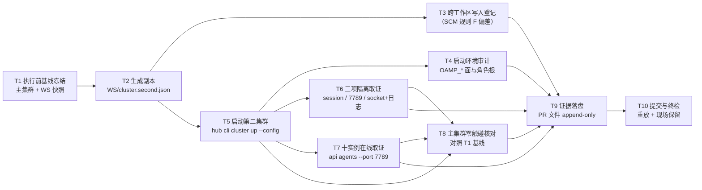

# pr-005-tasks.md — pr-005 内部任务图（第二集群全角色启动就绪 / F04）

**迭代**: 0028-role-model-binding ｜ **阶段**: 5（PR 实现）· 补位波 ｜ **PR 文件**: `prs/pr-005-second-cluster-bring-up.md`
**worktree 分支**: `feat/0028-pr-005-second-cluster` ｜ **base**: **`44588d8`**（已核：`git -C <WT> merge-base HEAD iteration/0028-role-model-binding` = `44588d810b6ca6fa32241be2eb4969aec89ffa7f` = 迭代分支 HEAD「merge: pr-002 角色级模型绑定 into iteration/0028-role-model-binding」⇒ **本 PR 的 `depends_on`（pr-002）已满足**）
**任务总数**: **10**（T1 执行前基线 → T2 副本生成 → T3 跨工作区写入登记 / T5 启动 → T4 环境审计 / T6 三项隔离 / T7 十实例在线 → T8 主集群零触碰核对 → T9 证据落盘 → T10 提交终检）｜ **依赖图**: **无环**（见 §2）
**输入真源**: PR 文件（文件范围 2 路径 / 验收 1~8 / depends_on / batch）+ `prd/F04-second-cluster-full-roster.md`（验收 1~5、边界、架构维度 A-01）+ `architecture.md` §3.1（配置→启动→生效四拍）· §4 A-01（副本形态/落点/刷新时点/三项隔离取值表/未纳入版本控制的性质/五条被否方案）· §4 A-05（对话库不共享）+ `status.md` §派发台账（主集群既有事实）+ 代码锚点（§0.5 A7）+ 规划期只读实测（§0.5）
**本 PR 性质**: **运行态操作 + 取证 + 落证**——生成一份配置文件副本、用既有启动路径把 10 个角色的第二集群拉起来、逐项取证三项隔离与主集群零触碰，并把启动记录写进本 PR 文件的「验收证据」小节。**零代码改动、零 hub 派发、不收口 `down`（现场保留）**。

---

## 0. 范围、文件面与事实锚点

### 0.1 本 PR 文件范围（**2 路径**，一在 worktree 外）

| # | 路径 | 落点 | 动作 | 归属任务 |
|---|---|---|---|---|
| 1 | `<WS>/cluster.second.json`（`<WS>` = 迭代工作区根，§0.4 契约 1） | **本 PR worktree 之外**（跨工作区写入 ⇒ T3 显式登记） | 新建：`<WS>/cluster.json` 的逐字副本 + 仅两键差异 | **T2** |
| 2 | `docs/iterations/0028-role-model-binding/prs/pr-005-second-cluster-bring-up.md` | 本 worktree 内（由 `<WS>` 复制入库，A10） | 在「验收证据」小节追加启动记录六块（append-only） | **T9** |
| — | `prs/pr-005-second-cluster-bring-up-tasks.md`（本文件） | 本 worktree 内 | 阶段 5 流程产物 | **不计入本 PR 改动面**（契约 9） |

> 排除（零触碰）：`<WS>/cluster.json`（pr-002 的产物，只读源）、`<MAIN>/cluster.json`（主集群，只读）、`deferred-demand-changes.md`（pr-007）、`status.md` / `history.md`（主 agent）、`oamp/**`、`roles/**`、其它 `prs/pr-0NN-*.md`、`clarifications/**`、`prd/**`、`architecture.md`。
> **`<WS>` 下除 `cluster.second.json` 外不得写任何路径**（PR 边界硬约束 1）；判据 = T3-4。

### 0.2 判据口径（上游原文，逐条可回溯）

| 口径 | 来源 | 落点 |
|---|---|---|
| 副本 = 工作区根 `cluster.json` 的逐字副本 + 仅两键差异（`session` / `web.port`），`router.socket` 保持 `null`；`diff` 输出恰 2 行差异 | PR 验收 1；F04 验收 2；`architecture.md` §3.1-1 / §4 A-01 | T2 |
| 副本落点 = **迭代工作区根**（`root = dirname(configPath)` 同时决定角色文件预检路径与角色 `cwd` 基准） | `architecture.md` §4 A-01「落点」；`cluster-config.js:184` | T2-1 / T3 |
| 副本携带 pr-002 的两处 `model`，取值逐字一致；启动不因取值报错（输出与日志无 `配置错误`） | PR 验收 2；F04 验收 4 | T2-4、T5-3 |
| 三项隔离：① session 不同（`tmux ls` 两个 session 并存）② web 端口不同（`lsof … :7789`）③ socket / 集群日志不在同一包根 | PR 验收 3 / 5 / 6；F04 验收 2；`architecture.md` §4 A-01 三项取值表 | T6 |
| 10 个 `pb-<role>` 实例全部在线（排除固有节点 `web`） | PR 验收 6；F04 验收 1 | T7 |
| 迭代期内主集群零启停、零配置改动（`up`/`down`/改配置三类动作零次） | PR 验收 7；F04 验收 3；D-13 | T1、T8 |
| 启动命令 + 启动时间 + 三项隔离取值写成可复核记录；**不要求收口 `down`（现场保留）** | PR 验收 8；F04 验收 5 / 边界 | T9、T10 |
| 副本未纳入版本控制 ⇒ 不进 F13 的 `git diff --name-only` 判据面，但其存在与性质须**显式登记** | `architecture.md` §4 A-01「未纳入版本控制的性质」 | T3-2、T9-③ |
| 只用既有字段与既有启动路径；不新增/改动运行时代码、启动脚本、配置字段集合 | F04 边界；F13 验收 1 | T2、T5、T10-2 |
| 不做启动期模型存在性预检 | F04 边界 | T5-3（只在失败时如实记现象，不新增预检） |

### 0.3 非目标（防夹带；触碰即越界 ⇒ T10-2 不通过）

- **不做**：对 `<MAIN>/cluster.json` 的任何 `cluster up` / `cluster down`；主集群 session / 端口 / 配置的任何改动（F04 验收 3 / PR 边界硬约束 2）。
- **不做**：收口时的 `down`、副本删除、第二集群清理（F04 边界；PR 边界硬约束 3）——现场保留是**要求**，不是遗漏。
- **不做**：三条绑定实报的取证与建 chat / 建 project（F05 / F06 / F07 归 pr-006）；`hub api calls create` / `messages send`（PR 边界：不得执行 hub 派发）。
- **不做**：把 `session` / `web.port` 写进 `<WS>/cluster.json`（撞 F03 验收 4）；在副本里显式写 `router.socket`（`architecture.md` §4 A-01 被否方案②：会与就绪等待的包根推导不一致）；用 `TMUX_TMPDIR` 另起 tmux server（被否方案③）；把副本放进 `docs/iterations/…`（被否方案④）；绕开 `oamp cluster` 手起进程（被否方案⑤）。
- **不做**：启动期模型存在性预检（`demand.md` 明确不做）；任何 `oamp/**` / `roles/**` 的改动。

### 0.4 本 PR 内契约（每个任务都必须遵守）

1. **路径记号**：`<WT>` = 本 worktree 根（`/Users/chenchiyuan/projects/agents/.pb-agents/worktrees/0028-role-model-binding/.pb-agents/worktrees/0028-pr-005-second-cluster`）；`<WS>` = 迭代工作区根（`/Users/chenchiyuan/projects/agents/.pb-agents/worktrees/0028-role-model-binding`）；`<MAIN>` = 主工作区（`/Users/chenchiyuan/projects/agents`）。**副本与第二集群一律以 `<WS>` 为根**，命令中的路径必须写绝对路径（不得依赖 cwd 推导）。
2. **副本落点的唯一例外**：本 PR 的写入面有一个在 worktree 之外的路径（§0.1-1）——这是 `architecture.md` §4 A-01 的既有约定与 SCM 规则 F（写入限本工作区）之间的**已知偏差**，按 T3 显式记录，**不得静默处理**；除该路径外 `<WS>` 零写入。
3. **`<WS>/cluster.json` 只读**：副本的生成不得改动源文件（判据 = 源 sha256 前后一致）。
4. **命令逐字留证**：启动命令、核对命令、只读命令全部按原文照录（含 `--config` / `--port` / `--wait` 取值）；输出按 stdout/stderr 原文照录，不润色。
5. **失败如实记**：启动失败或超时 ⇒ 记「失败 + 现象 + 相关日志摘要」，**不得**改配置取值、不得换启动形态、不得重跑掩盖（F04 验收 4 只要求"不因取值报错"）。
6. **证据 append-only**：PR 文件「验收证据」小节保留原括注行（`本 PR 执行时填写…`，执行时点计数须仍为 1）；七字段与标题零改动（hunk 全落在末节）。
7. **不引入技术决策**：新增文本只能取自 PR 文件、`prd/F04`、`architecture.md` §3.1/§4 A-01、`status.md` 既有事实、只读命令与启动命令的原始输出；发现事实与上游表述不一致时**记录并上报**，不自行补写方案。
8. **hub 动作白名单**：仅只读面 `api agents`（缺省与 `--port 7789` 各一次）与 `cli cluster up --config <WS>/cluster.second.json`（本 PR 唯一写运行态的动作）；禁 `calls create`、`messages send`、对 `<MAIN>` 的 `cluster up|down`。
9. **提交约定**：本 PR 一次提交，信息以 `docs(0028)` 开头且含 `pr-005`；本任务图文件不混入该提交（独立提交或不提交）。
10. **无套件可跑**：仓库无测试套件（A12）；通过条件 = 文件内容核验 + 命令实跑原始输出。

### 0.5 规划期事实锚点（2026-09-16 规划时点只读实测，**dev 须以执行时点重取**）

| # | 事实 | 核实命令 / 原始输出 |
|---|---|---|
| **A1** | 本 worktree 分支 = `feat/0028-pr-005-second-cluster`，HEAD = base = `44588d8`（迭代分支 HEAD，pr-001 / pr-003 / pr-002 均已合并） | `git -C <WT> rev-parse --abbrev-ref HEAD`；`git -C <WT> merge-base HEAD iteration/0028-role-model-binding` → `44588d810b6ca6fa32241be2eb4969aec89ffa7f` |
| **A2** | `<WS>/cluster.json` **已含** pr-002 的两处绑定，与 `<WT>/cluster.json` 逐字一致：sha256 = `4d8e476a05e48f4ad428d87810b6bd8dbf6bb4e7a297c0a63b84515c20743bd0`；`"model": "openai/gpt-5.6-luna"`（第 14 行，`roles.dev`）、`"verifier": { "model": "powerby/grok-4.6" }`（第 24 行） | `shasum -a 256 <WS>/cluster.json <WT>/cluster.json`；`grep -n model <WS>/cluster.json` |
| **A3** | `<WS>/cluster.second.json` **尚不存在**；`<WS>/oamp/.runtime/` **尚不存在**（第二集群从未以 `<WS>` 为根启动过） | `ls -l <WS>/cluster.second.json` → `No such file or directory`；`ls -la <WS>/oamp/.runtime/` → 同上 |
| **A4** | 主集群现状（= T8 的比对基线）：`tmux ls` → `oamp-cluster: 12 windows (created Wed Sep 16 08:47:42 2026)`；`127.0.0.1:7788` LISTEN（`node`，PID 64314）；**7789 无监听**；`<MAIN>/oamp/.runtime/` 下有 `router.sock` 与 `cluster/` | `tmux ls`；`lsof -nP -iTCP:7788 -sTCP:LISTEN`；`lsof -nP -iTCP:7789 -sTCP:LISTEN`（空）；`ls -la <MAIN>/oamp/.runtime/` |
| **A5** | **执行环境的 `OAMP_*` 面**：本 shell `OAMP_ROLE_ROOT=/Users/chenchiyuan/projects/agents`（**主工作区**）；主集群 tmux session env 亦带同名值；`OAMP_SOCKET` / `OAMP_WEB_PORT` / `OAMP_CLUSTER_LOG_DIR` **未设** | `printenv \| grep -i '^OAMP'`；`tmux show-environment -t oamp-cluster OAMP_ROLE_ROOT` |
| **A6** | **隔离面未覆盖"角色文件来源"**：角色文件根受 `OAMP_ROLE_ROOT` 覆盖（`role-binding.js:16-22`：`env.OAMP_ROLE_ROOT` 优先于包根推导），故该变量若被 `tmux new-session` 继承，第二集群的角色文件仍解析到主工作区；规划期实测 `<MAIN>/roles` 与 `<WS>/roles` **逐字一致**（`diff -rq` 零输出）⇒ 内容面无差异，但该事实须留证（T4） | `diff -rq <MAIN>/roles <WS>/roles`（空）；`sed -n '16,22p' oamp/src/role-binding.js` |
| **A7** | 代码锚点逐条核对通过：① `cluster-config.js:184` `const root = path.dirname(configPath);` ② `cluster.js:188-190` web 窗口 argv `['web','start','--port',String(config.web.port)]` ③ `cluster.js:18-21` `PKG_ROOT` → `LOG_DIR = <pkg>/.runtime/cluster` ④ `config.js:144` `socketPath: env.OAMP_SOCKET \|\| path.join(PKG_ROOT, '.runtime', 'router.sock')` ⑤ `cluster.js:177-184` `socketEnvPrefix`（`router.socket === null` ⇒ **不**注入 `OAMP_SOCKET=` 前缀）⑥ `cluster.js:200-201` `if (entry.model !== undefined) argv.push('--model', entry.model)` ⑦ `sdk/cli.js:320` `if (head === 'cli') return runCli(tokens.slice(1))`（层 C 逐字透传）⑧ `sdk/surface.js:121` `apiEntry({ cmd: ['agents'], method: 'GET', path: '/api/agents' … })` | 逐文件 `sed -n` 原文 |
| **A8** | `cluster up` 的就绪语义 = 等 Router socket 可连 + 全部 enabled 实例 online，共享同一 `--wait` 预算；超时输出 `oamp cluster: 等待超时（Nms）：以下实例未 online: …`；未就绪输出 `Router 未就绪（socket=<path>，等待 Nms）` | `cluster.js:236/394/399/418` 原文 |
| **A9** | 本 PR worktree **已有** 0028 子树（pr-001/002 已合并：`demand.md` / `prd/**` / `architecture.md` / `prs/pr-001~003` / `status.md` / `history.md` / `clarifications/**`），但**没有** `prs/pr-005-second-cluster-bring-up.md`（在 `<WS>` 为 `??`）⇒ 该文件须由 dev 从 `<WS>` 复制入库 | `git -C <WT> ls-files docs/iterations/0028-role-model-binding`；`git -C <WS> status --porcelain` |
| **A10** | `oamp/package.json` 的 `dependencies` 为 **空**（无需 `node_modules`）；`<WS>/oamp/{bin,src,sdk,web,scripts,skill}` 齐备，`<WS>/roles/**` 齐备（10 角色 + `_template` + `cdp-debug-skill`） | `cat oamp/package.json`；`ls <WS>/oamp`、`ls <WS>/roles` |
| **A11** | `<WS>` 当前为**脏工作区**（主 agent 的在途写入）：` M history.md`、` M status.md`，另有 `??` 若干阶段 5 产物 ⇒ T3-4 的"零新增写入"判据必须以此为**执行前基线**逐行比对，不得要求 `<WS>` 全干净 | `git -C <WS> status --porcelain` |
| **A12** | **无套件可跑**：仓库无测试套件；本 PR 的通过条件 = 启动命令实跑结果 + 文件内容核验 | 契约 10 |

---

## 1. 任务列表

### T1: 执行前基线冻结（主集群 + `<WS>` 状态快照）

- **一句话描述**：在动任何东西之前，把主集群与 `<WS>` 的可核对状态取成一份基线，作为 T8「主集群零触碰」的比对基准。
- **验收标准**:
  1. **主集群基线**（原始输出逐字留证）：`tmux ls`（含 `oamp-cluster: 12 windows (created …)` 的创建时点原文）、`lsof -nP -iTCP:7788 -sTCP:LISTEN`（PID）、`shasum -a 256 <MAIN>/cluster.json`、`stat` 取 `<MAIN>/oamp/.runtime/router.sock` 的 inode 与 mtime（**F04 验收 3 / PR 验收 7**）。
  2. **`<WS>` 基线**：`shasum -a 256 <WS>/cluster.json`（对照 A2 = `4d8e476a…`）、`git -C <WS> status --porcelain` 逐行快照（对照 A11，作为 T3-4 的前置基线）、`<WS>` 是否有 `cluster.second.json` 与 `oamp/.runtime/`（对照 A3：均无）。
  3. **端口基线**：`lsof -nP -iTCP:7789 -sTCP:LISTEN` **无输出**（7789 空闲，F04 验收 2 ② 的前置条件）；若已有监听 ⇒ 立即停止并上报（说明第二集群已存在或端口被占，不得覆盖现场）。
  4. **执行环境快照**：`printenv | grep -i '^OAMP'` 逐行原文（对照 A5），供 T4 审计与失败归因。
  5. **零写入**：本任务只读；`git -C <WT> status --porcelain` 不变。
- **前置依赖**: 无
- **优先级**: P0
- **追溯**: PR 验收 7；F04 验收 3；事实锚点 A2 / A3 / A4 / A5 / A11

### T2: 生成副本 `<WS>/cluster.second.json`（逐字副本 + 仅两键差异）

- **一句话描述**：以 `<WS>/cluster.json` 为源生成副本，仅把 `session` 改为 `oamp-cluster-0028`、`web.port` 改为 `7789`，其余逐字不变。
- **验收标准**:
  1. **落点正确**：文件为 `<WS>/cluster.second.json`（**迭代工作区根**，绝对路径逐字写出）；`ls -l` 的路径原文留证（**PR 验收 1 / `architecture.md` §4 A-01 落点**）。
  2. **差异恰两处**：`git diff --no-index --numstat <WS>/cluster.json <WS>/cluster.second.json` ⇒ **`2	2`**（2 行增 2 行删 = 恰 2 个取值发生变化）；两条变化行分别含 `"session"` 与 `"port"`；其余行零差异（**PR 验收 1 / F04 验收 2**）。
  3. **结构等价（机械判据）**：以 node/python 解析两文件并深比较 ⇒ 唯一差异 = `.session`（`oamp-cluster` → `oamp-cluster-0028`）与 `.web.port`（`7788` → `7789`）；两文件 `.router.socket` 均严格为 `null`（**PR 验收 1 / 被否方案②**）。
  4. **绑定逐字一致**：副本 `.roles.dev.model` = `openai/gpt-5.6-luna`、`.roles.verifier.model` = `powerby/grok-4.6`，与 `<WS>/cluster.json` 取值**逐字相等**（判据 = 深比较输出 + `grep -n model` 原文）；`roles` 其余 8 角色与源逐字一致（**PR 验收 2 / F04 验收 4**）。
  5. **源文件零改动**：`shasum -a 256 <WS>/cluster.json` 与 T1 基线相同（契约 3）。
  6. **未纳入版本控制**：`git -C <WS> status --porcelain` 中 `cluster.second.json` 呈 `??`（untracked）；`git -C <WT> status --porcelain` 中**不出现**该文件（它在 worktree 之外）——两条输出留证（`architecture.md` §4 A-01「未纳入版本控制」；T3-2 的登记对象）。
- **前置依赖**: T1
- **优先级**: P0
- **追溯**: PR 验收 1 / 2；F04 验收 2 / 4；`architecture.md` §3.1-1 / §4 A-01（落点、两键差异、`router.socket` 保持 `null`、未纳入版本控制）；事实锚点 A2 / A3

### T3: 跨工作区写入的显式登记（SCM 规则 F 偏差，不得静默）

- **一句话描述**：把"写入 `<WS>/cluster.second.json`（本 PR worktree 之外）"这一与 SCM 规则冲突的偏差写成可核对的登记段。
- **验收标准**:
  1. **偏差登记段在场**（写入 PR 文件证据小节，T9 落盘）：含 ① 写入的**绝对路径**与写入时点；② "该路径在本 PR worktree 之外"的事实与判据（`ls <WT>/cluster.second.json` **失败** + `git -C <WT> status --porcelain` 不含该文件）；③ 与 SCM 规则（写入限本工作区）冲突的原文描述；④ 该偏差的**上游依据**（`architecture.md` §4 A-01 明确副本落点为迭代工作区根 + 本 PR 文件范围的 `<工作区>/cluster.second.json`）——依据须逐条可点（**PR 边界硬约束 1**）。
  2. **性质登记**：副本 = 运行态产物（未纳入版本控制，与 socket / 集群日志同类）⇒ 不出现在 F13 验收 1 的 `git diff --name-only` 判据面；但其存在与性质显式登记，不靠隐瞒（`architecture.md` §4 A-01「未纳入版本控制的性质」；F04 架构维度原文要求"在承载 F13 证据的小节里显式登记"——本 PR 只登记于自己的证据小节，F13 侧的登记归 pr-009）。
  3. **写入物留痕**：副本 sha256 + 字节数 + 行数（写入后实测）。
  4. **除该路径外 `<WS>` 零写入**：`git -C <WS> status --porcelain` 与 T1 基线逐行比对 ⇒ 除主 agent 的既有在途行（` M history.md` / ` M status.md` / 既有 `??`）外**无新增行、无新增文件**（尤其 `cluster.json` 未出现在 `M` 列、`<WS>/roles/**` 与 `<WS>/oamp/**` 未变）；`shasum -a 256 <WS>/cluster.json` = T1 基线。
  5. **零越界**：本任务不写 `<WT>` 内任何文件（PR 文件的写入归 T9）；`oamp/**` / `roles/**` / `cluster.json` 的 `git -C <WT> diff --name-only` 为空。
- **前置依赖**: T2
- **优先级**: P0
- **追溯**: PR 边界硬约束 1（brief 原文"把跨工作区写入被显式记录进证据列为一步"）；PR 文件「文件范围」第 1 行括号注；`architecture.md` §4 A-01（落点 + 未纳入版本控制的性质）；事实锚点 A2 / A3 / A11

### T4: 启动环境审计（`OAMP_*` 面 + 角色文件实际解析根）

- **一句话描述**：核对启动环境里的 `OAMP_*` 变量是否会破坏"第二集群以 `<WS>` 为根"的假设，并留证。
- **验收标准**:
  1. **启动前环境**：`printenv | grep -i '^OAMP'` 逐行原文（对照 A5：规划期仅 `OAMP_ROLE_ROOT=<MAIN>`，`OAMP_SOCKET` / `OAMP_WEB_PORT` / `OAMP_CLUSTER_LOG_DIR` 未设）。
  2. **启动后新 session 的环境**：`tmux show-environment -t oamp-cluster-0028` 中 `OAMP_*` 逐行原文 ⇒ 判明第二集群的窗口进程实际继承的变量集合。
  3. **结论二选一并给出判据**：① **无泄漏**（新 session 的 `OAMP_*` 集合不改变三项隔离的落点）；② **有泄漏** ⇒ 逐条列出泄漏变量、其影响面（`OAMP_ROLE_ROOT` ⇒ 角色文件解析到 `<MAIN>/roles/**`，依据 `role-binding.js:16-22`；`OAMP_SOCKET` ⇒ socket 落点偏离包根，依据 `config.js:144`），并给出内容面差异实测（`diff -rq <MAIN>/roles <WS>/roles`；规划期为空，A6 ⇒ 内容一致、隔离面未覆盖此项）。
  4. **不得擅改启动形态**：判为"有泄漏"时**不改命令、不加 `env -u`、不重启**，只记录 + 上报（该项是否改用净化环境启动 = §4-② 的 `[model_inferred]` 决策项，需主 agent 确认）。
  5. **原始输出留证**：三条命令（启动前 env、`tmux show-environment`、`diff -rq`）的输出逐字进证据块。
- **前置依赖**: T1、T5（新 session 存在后才可读其环境）
- **优先级**: P1（登记性任务：不直接承载 F04 五条验收，但决定"隔离事实"的可解释性——见 §3-②）
- **追溯**: F04 验收 2 ③（socket / 日志落点的判据面）；`architecture.md` §4 A-01 三项取值表；代码锚点 A6 / A7④⑤；事实锚点 A5

### T5: 启动第二集群（既有启动路径 `hub cli cluster up --config`）

- **一句话描述**：用既有启动路径把第二集群按副本配置拉起来，并逐字记录启动命令、时点、退出码与原始输出。
- **验收标准**:
  1. **命令逐字**：`node <WS>/oamp/bin/hub.js cli cluster up --config <WS>/cluster.second.json --wait 120000`（绝对路径、`--config` 指向副本、层 C 透传既有 `oamp cluster up`；`architecture.md` §3.1-2 / §4 A-01 启动落点；A7⑦ 层 C 透传判据）——命令原文写进证据块（**PR 验收 8**）。
  2. **启动时间**：记录发起时点与返回时点（本地时间戳，秒级即可）+ 实测耗时（**PR 验收 8**）。
  3. **成功判据（F04 验收 4）**：退出码 = 0 且输出含就绪证据（`cluster up` 的拓扑表/就绪行；就绪语义见 A8）；**启动输出中 `配置错误` 零命中**；对 `<WS>/oamp/.runtime/cluster/*.log`（本任务启动后新生成的日志）执行 `grep -n '配置错误'` ⇒ 零命中（**PR 验收 2**）。
  4. **失败处置（契约 5）**：若超时/失败 ⇒ 如实记「失败 + 现象」+ 关键日志摘要（`router.log` / `web.log` / 对应角色日志）、并按需复跑**同一条命令**（不得改配置取值、不得改启动形态、不得换端口）；复跑亦失败 ⇒ 记录并上报，不掩盖。
  5. **零派发**：全程未出现 `api calls create` / `api messages send`（契约 8）；未对 `<MAIN>` 执行任何 `cluster` 动作。
  6. **现场保留**：本任务**不停集群**（PR 验收 8 / 边界硬约束 3）。
- **前置依赖**: T2
- **优先级**: P0
- **追溯**: PR 验收 2 / 8；F04 验收 4 / 5；`architecture.md` §3.1-2（启动落点）+ §4 A-01（启动落点、收口不要求 `down`）；事实锚点 A7⑥ / A8 / A10

### T6: 三项隔离取证（session / web 端口 / socket + 集群日志）

- **一句话描述**：逐项取到并留证三项隔离的实际取值与核对命令。
- **验收标准**:
  1. **① session**：`tmux ls` 同时含 `oamp-cluster`（主）与 `oamp-cluster-0028`（新），两个 session 的创建时点并列留证；主集群窗口数与 T1 基线一致（12）（**PR 验收 3 / F04 验收 2 ①**）。
  2. **② web 端口**：`lsof -nP -iTCP:7789 -sTCP:LISTEN` 有 `node` 监听，且该 PID ≠ T1 基线里 `7788` 的 PID；`127.0.0.1:7788` 仍由原 PID 监听（**PR 验收 5 / F04 验收 2 ②**）。
  3. **③ socket / 集群日志**：`<WS>/oamp/.runtime/router.sock` 与 `<WS>/oamp/.runtime/cluster/*.log` 存在（`ls -la` 原文），且与 `<MAIN>/oamp/.runtime/...` 的**绝对路径不同、包根不同**；给出两侧路径对照表（`config.js:144` / `cluster.js:19-21` 的包根推导为判据）（**PR 验收 6 / F04 验收 2 ③**）。
  4. **副本取值与实测取值一致**：① session 名 = 副本 `.session`；② 端口 = 副本 `.web.port`；两项逐字对上（判据 = 副本取值原文 + 命令输出两行并列）。
  5. **未显式设 `router.socket`**：副本中该项为 `null`，且启动命令文本中不出现 `OAMP_SOCKET=`（`cluster.js:177-184` `socketEnvPrefix` 只在非 null 时注入；被否方案②）；判据 = 副本取值行 + 命令原文。
- **前置依赖**: T5
- **优先级**: P0
- **追溯**: PR 验收 3 / 5 / 6；F04 验收 2（三项逐项可核对）；`architecture.md` §4 A-01 三项取值表 + 被否方案②；代码锚点 A7②③④⑤

### T7: 10 角色在线取证（`api agents --port 7789`）

- **一句话描述**：取第二集群的拓扑快照，核对 10 个 `pb-<role>` 实例全部在线。
- **验收标准**:
  1. **命令逐字**：`node <WS>/oamp/bin/hub.js api agents --port 7789`（只读层 A；`sdk/surface.js:121` 的 `api agents` = `GET /api/agents`）；命令原文留证（**PR 验收 6**）。
  2. **10/10 在线**：输出中 `instance_id` ∈ {`pb-architect`, `pb-demand`, `pb-dev`, `pb-planner`, `pb-pr-planner`, `pb-prd`, `pb-progress-observer`, `pb-retrospective`, `pb-verifier`, `pb-workflow-pb`} 的实例**全部 `online`**；给出在线表（10 行，逐行含 `instance_id` + `state`）；判定时**排除固有节点 `web`**（**F04 验收 1**）。
  3. **与非在线状态的处理**：若存在未 `online` 的 `pb-*` 实例 ⇒ 如实记「失败 + 现象（哪个未在线）」+ 该实例日志摘要 + 报告的 `missing` 列表（若 `cluster up` 输出已给，A8）；**不得**通过重启主集群或改配置取值补救。
  4. **口径留痕**：注明本次输出是否含 `offline` 墓碑（`API.md:1505`：无参含墓碑，`?state=online` 只返回在线）；若使用 `--state online` 之类的过滤，须写出实际命令并说明判据等价性。
  5. **零派发**：本任务不产生任何调用（`calls create` / `messages send` 零次）。
- **前置依赖**: T5
- **优先级**: P0
- **追溯**: PR 验收 6；F04 验收 1（10 实例在线 + 排除 `web`）；代码锚点 A7⑧ / A8；`architecture.md` §3.1-3

### T8: 主集群零触碰核对（执行后，对照 T1 基线）

- **一句话描述**：以 T1 基线为准逐项比对，证明本 PR 对主集群零启停、零配置改动。
- **验收标准**:
  1. **配置零改动**：`shasum -a 256 <MAIN>/cluster.json` = T1 基线值（**F04 验收 3 / PR 验收 7**）。
  2. **session 原样**：`tmux ls` 中 `oamp-cluster` 的窗口数与**创建时点**与 T1 基线逐字一致（无重建迹象）；新出现的只有 `oamp-cluster-0028`。
  3. **端口原样**：`127.0.0.1:7788` 的监听 PID 与 T1 基线相同；无 7788 上的进程抖动迹象（判据 = PID 与监听状态两项）。
  4. **socket 原样**：`<MAIN>/oamp/.runtime/router.sock` 的 inode 与 T1 基线一致（未被重建；mtime 允许因运行时心跳变化，判据以 inode 为准并注明该口径）。
  5. **命令面自证**：本 PR 命令清单中，涉及 `cluster up` / `cluster down` 的**只有** `cli cluster up --config <WS>/cluster.second.json` 一条；`grep` 判据 = 命令清单里 `<MAIN>/cluster.json` 仅以只读形式（`shasum` / `cat`）出现，**零次**作为 `--config` 取值（**F04 验收 3**：`up`/`down`/改配置三类动作零次）。
  6. **`<WS>` 面同源核对**：`shasum -a 256 <WS>/cluster.json` 仍 = T1 基线（副本生成未回写源）。
- **前置依赖**: T5、T6、T7（执行后核对；基线来自 T1）
- **优先级**: P0
- **追溯**: PR 验收 7；F04 验收 3（三类动作零次 + 主集群配置与 session 原样）；D-13；事实锚点 A4 / A11

### T9: 启动记录与证据落盘（PR 文件「验收证据」小节，append-only）

- **一句话描述**：把本 PR 文件从 `<WS>` 复制进 worktree，并按其「验收证据」小节要求追加六块记录 + 两块登记。
- **验收标准**:
  1. **入库面恰 1 条**：`docs/iterations/0028-role-model-binding/prs/pr-005-second-cluster-bring-up.md` 出现在本 worktree 内；除追加块外与源**逐字一致**（判据 = 源 sha256 于复制时点取值并记录；删除追加块后与源 `diff` 零差异）。**只复制这一条**（A9：worktree 内其它 0028 文件已在库，不重复搬动；`cluster.second.json` 不在 worktree 内，契约 2）。
  2. **六块齐备**（PR 文件括注原文列出的清单）：① 「副本与 `cluster.json` 的 `diff` 输出（恰 2 行差异）」（T2）② 「启动命令逐字」（T5-1）③ 「启动时间」（T5-2）④ 「三项隔离取值与核对命令」（T6）⑤ 「`api agents --port 7789` 的 10 实例在线表」（T7）⑥ 「`cluster.second.json` 的 untracked 性质登记」（T3-2）——六块逐块在场（`grep` 六个标题 + 内容非空）。**PR 验收 1~8 各自在证据中可点名**。
  3. **两块附加登记**（本 PR 硬约束要求，不属括注列举但不得缺）：⑦ 跨工作区写入登记段（T3-1）；⑧ 启动环境审计段（T4-1~T4-3）。
  4. **append-only**：`grep -c '本 PR 执行时填写'` = 1；七字段与标题零改动 —— 判据 = `git -C <WT> diff` 的全部 hunk 头行号 > `## 验收证据` 小节行号。
  5. **逐块可追溯**：每块首行标注其对应条款（`F04 验收 N` / PR 验收 N / `architecture.md` §4 A-01）；每块内的结论附判据命令或原始输出片段。
  6. **零越界**：本任务不写 `<WS>` 下任何路径；不写 `cluster.json`（两侧）、`status.md`、`history.md`、`deferred-demand-changes.md`、其它 PR 文件（判据 = `<WT>` 内 `git status --porcelain` 仅本 PR 文件与本任务图文件）。
- **前置依赖**: T3、T4、T6、T7、T8
- **优先级**: P0
- **追溯**: PR 文件「验收证据」小节原文；`architecture.md` §4 A-01（未纳入版本控制的性质）+ §4 A-02（载体约定）；F04 验收 5；契约 6

### T10: 提交与终检（F04 验收 1~5 在提交面重放 + 现场保留核对）

- **一句话描述**：把补写后的本 PR 文件提交成一次提交，重放本 PR 的验收判据并核对"第二集群仍在运行、主集群仍原样"。
- **验收标准**:
  1. **提交面恰 1 路径**：`git -C <WT> show --name-only --format= HEAD` ⇒ `docs/iterations/0028-role-model-binding/prs/pr-005-second-cluster-bring-up.md`（本任务图文件若单独提交则不计入，契约 9；`cluster.second.json` **不在** worktree 内 ⇒ 不出现在提交面，T3-2 已登记该性质）。
  2. **禁区零命中**：`git -C <WT> diff --name-only 44588d8...HEAD | grep -E '^(oamp/|roles/|cluster\.json|cluster\.second\.json|docs/iterations/0028-role-model-binding/(status\.md|history\.md|demand\.md|prd\.md|architecture\.md|prd/|clarifications/|deferred-demand-changes\.md))'` ⇒ **零输出**（F04 边界：不新增/改动运行时代码、启动脚本、配置字段集合；F13 验收 1 的冻结面）。
  3. **验收在提交面重放**：从 `git -C <WT> show HEAD:<路径>` 取内容后重跑 T2-2/3/4（副本与源的差异与绑定取值，以当前 `<WS>` 文件为准复核一次）、T6-1~3、T7-2、T8-1/3/5 的判据 ⇒ 结论与执行时一致。
  4. **现场保留（终检）**：提交后 `tmux ls` 仍**同时**含 `oamp-cluster` 与 `oamp-cluster-0028`；`lsof -nP -iTCP:7789 -sTCP:LISTEN` 仍有监听；`<WS>/cluster.second.json` 仍在 —— 即**未执行 `down`、未删除副本**（PR 验收 8 / F04 边界；硬约束 3）。
  5. **提交卫生**：提交后 `git status --porcelain` 除本任务图文件外为空；信息以 `docs(0028)` 开头且含 `pr-005`，正文写明动机（"第二集群全角色启动就绪：副本两键差异 + 三项隔离取证 + 主集群零触碰"）；未 `--amend`、未 `--no-verify`。
  6. **验收手段声明**：无套件可跑（A12 / 契约 10）——结论以命令实跑与文件内容核验为准，不声称"测试全绿"。
- **前置依赖**: T9
- **优先级**: P0
- **追溯**: PR 验收 1~8；F04 验收 1~5 与边界；契约 9 / 10；事实锚点 A4 / A12

---

## 2. 依赖图

- **无环**（10 节点 / 12 边）：T1 → T2 单链；T2 扇出到 T3（登记）与 T5（启动）；T5 扇出到 T4 / T6 / T7；T5+T6+T7 汇入 T8（执行后核对）；T3/T4/T6/T7/T8 汇入 T9；T9 → T10。**无回边、无互指** ⇒ 不存在循环依赖，无需上报。
- **最长依赖链**：`T1 → T2 → T5 → T6 → T8 → T9 → T10`（7 节点 / 6 边）；另有同长度的 `T1 → T2 → T5 → T7 → T8 → T9 → T10`。
- **关键路径任务**：**T2**（副本正确性，判据面最宽：差异恰两处 + 结构等价 + 绑定逐字）、**T5**（启动，唯一能失败并阻塞 T4/T6/T7/T8 的动作）、**T9**（六块证据成形）、**T10**（提交面重放 + 现场保留）。
- **真依赖（非叙述顺序）**：T2 必须先于 T5（启动读副本文件，且副本必须在 pr-002 已合并的 `<WS>/cluster.json` 之上生成——A1/A2 已满足该前置）；T4/T6/T7 必须先有 T5 起的 session 与监听（session env 读取、`lsof`、`api agents` 三者的对象都只在启动后存在）；T8 必须在 T5/T6/T7 之后（"零触碰"是执行后比对，且要覆盖到全部已发生的动作）；T9 必须后置 T3/T4/T6/T7/T8（证据块取材于它们的原始输出）。
- **并行宽度**：T3 与 T5 可并行（互不读取对方产物）；T4 / T6 / T7 三条可并行（同读启动后的现场，互不写文件）；T6 / T7 与 T8 之间存在真依赖（T8 要覆盖它们的动作）。
- **粒度隔离的有意设计**：① **T3 与 T2 拆开**——T2 是"造物"（可机械判定），T3 是"跨工作区写入的记录义务"（brief 硬约束 1 要求独立成步），失败面不同（前者判据是文件差异，后者判据是登记段与 `<WS>` 零写入）；② **T4 与 T6 拆开**——T6 判 F04 验收 2 的三项隔离（session / 端口 / socket+日志），T4 判的是**第四类事实**（`OAMP_ROLE_ROOT` 会不会把角色文件根指到 `<MAIN>`），后者不属三项隔离、不因 T6 通过而消失；③ **T8 与 T1 拆开**——基线冻结（T1）必须在任何写入之前发生，零触碰核对（T8）必须在全部动作之后，两者中间隔着一整条启动链，合并会导致基线被污染。
- **串行点**：T5 是本 PR 唯一改变运行态的写动作 ⇒ 全链在此串行；T9 与 T10 各只有一个写者（PR 文件），无同文件并发写。

---

## 3. 登记件与风险（主 agent 决策输入，非本任务图的执行项）

**① 跨工作区写入 = 本迭代已登记的已知偏差（T3 的登记对象）**
副本落 `<WS>/cluster.second.json`（worktree 之外）与 SCM 规则 F（写入限本工作区）冲突。上游依据两条：`architecture.md` §4 A-01 的"落点必须在工作区根"（`root = dirname(configPath)` 同时决定角色文件预检与角色 `cwd` 基准，被否方案④已论证放进 `docs/iterations/…` 会同时失效）与 PR 文件范围第 1 行。本任务图按 brief 硬约束 1 把它列为独立任务（T3），并要求除该路径外 `<WS>` 零写入。

**② `OAMP_ROLE_ROOT` 继承 ⇒ 隔离面出现第四类事实（T4 的登记对象，规划期实测）**
执行环境的 shell 带 `OAMP_ROLE_ROOT=/Users/chenchiyuan/projects/agents`（A5），而主集群的 tmux session env 同样带该值；`cluster up` 用 `tmux new-session -d` 建 session（`cluster.js:383`）⇒ 新 session 的窗口会继承客户端环境，角色文件根因此指向**主工作区**（`role-binding.js:16-22`）。规划期实测 `<MAIN>/roles` 与 `<WS>/roles` 逐字一致（A6）⇒ **内容面无差异**，但"第二集群以 `<WS>` 为根"这句话在"角色文件来源"这一维上不成立。是否改用净化环境启动（`env -u OAMP_ROLE_ROOT …`）= §4-② 决策项，需主 agent 确认；本任务图禁止 dev 自决。

**③ 副本刷新时点（A-01 规则）**：副本仅在 `<WS>/cluster.json` 变化时需要重新生成 + 重启第二集群。执行时点该前置已满足（A1 = pr-002 的合并提交 `44588d8`、A2 = 源已含两处绑定），故 T2 无额外前置；若执行时点发现 `<WS>/cluster.json` 与 T1 基线不同 ⇒ 以执行时点值为源并登记（不得用 A2 值顶替）。

**④ 主集群零触碰的可核对形态**：以 T1 的四项基线（配置 sha256 / session 创建时点与窗口数 / 7788 监听 PID / socket inode）为准；mtime 类指标不作判据（心跳会改动运行态文件的 mtime），该口径已在 T8-4 写明。

**⑤ 失败面与不掩盖**：`cluster up` 失败/超时的唯一合法处置 = 如实记录 + 同命令复跑一次 + 读 `<WS>/oamp/.runtime/cluster/*.log`；**不得**改端口、改 session 名、改 `router.socket`、改配置取值、绕开既有启动路径（被否方案②③⑤）。

**⑥ 无套件可跑**：本 PR 的验收手段 = 命令实跑原始输出 + 文件内容核验（A12）。

**⑦ 与后续 PR 的接口（登记，不扩面）**：本 PR 的产物（运行中的第二集群 + 空对话库）是 pr-006（F05/F06/F07 三条绑定实报）的前置；建 project / 建 chat / 三条实报命令与 `chat_id` 取值见 `architecture.md` §3.2 / §4 A-05。本 PR **不**做这些动作（PR 边界：不得执行 hub 派发）。

---

## 4. 口径确认项与粒度自查

**① `[model_inferred]` 项 —— 共 4 条，需主 agent 确认**

1. **"差异恰 2 行"的机械判据取 `git diff --no-index --numstat` = `2	2`（2 增 2 删 = 恰 2 个取值变化）+ 结构深比较**：上游只写"`diff` 输出恰 2 行差异"（PR 验收 1 / F04 验收 2 判据句），未规定命令形态；直接用 `diff` 的默认输出会把每个变化行渲染成 4 行（`NcN` + `<` + `---` + `>`），故本任务图取"变化**取值**数 = 2"的读法并附结构等价判据（T2-2/3）。
2. **`OAMP_ROLE_ROOT` 继承是否需要在启动命令上做环境净化** = 待确认决策项（§3-②）：本任务图选择"记录 + 上报，不擅自改变启动形态"（T4-4），因为这是执行环境策略而非 F04 三项隔离的判据面。
3. **T4（启动环境审计）的优先级取 P1**：它不直接承载 F04 验收 1~5，但决定"以 `<WS>` 为根"的可解释性；本任务图把它列为独立任务而非并入 T6，理由是它判的是"第四类事实"。
4. **`api agents` 输出的判定口径**：F04 验收 1 要求"排除固有节点 `web`"，但未规定是用无参（含 `offline` 墓碑）还是 `--state online`（`API.md:1505`）；本任务图要求写明实际命令并说明判据等价性（T7-4），不指定其一。

**② 粒度自查（10 任务全部通过；本迭代执行约束 = 单次派发 ≤30 分钟）**

| 任务 | ≤30 分钟 | 可独立验收（判据只读自身输入） | 验收标准可测试 |
|---|---|---|---|
| T1 | ✅ 5 条只读命令 + 快照落字 | ✅ 只读，无前置 | ✅ 输出留证 + 7789 无监听 |
| T2 | ✅ 1 次复制 + 3 条静默判据 | ✅ 只读两文件与 git | ✅ numstat `2 2`、深比较差集恰两键、`.router.socket = null` |
| T3 | ✅ 1 段登记 + 2 条比对 | ✅ 只读 git 状态与副本 | ✅ 登记四要素在场、`<WS>` 无新增行 |
| T4 | ✅ 3 条命令 + 判定 | ✅ 只读 env 与角色目录 | ✅ 泄漏清单可点名 + 影响面依据行号 |
| T5 | ✅ 启动 ≤120s + 观察（失败则复跑一次 ≤120s） | ✅ 只读命令与日志 | ✅ 退出码 0、`配置错误` 零命中 |
| T6 | ✅ 4 条命令 + 对照表 | ✅ 只读 tmux/lsof/ls | ✅ 两 session 并存、7789 监听 PID ≠ 7788 PID、包根不同 |
| T7 | ✅ 1 条命令 + 10 行表 | ✅ 只读 API | ✅ 10 个 `pb-*` 全 `online` |
| T8 | ✅ 6 条比对 | ✅ 只读，对照 T1 基线 | ✅ 四项基线逐项一致 + 命令面零次 |
| T9 | ✅ 1 次复制 + 追加 8 段 | ✅ 只读 PR 文件与 git | ✅ 六块 + 两登记在场、括注计数 = 1 |
| T10 | ✅ 1 次提交 + 6 条重放 | ✅ 提交面自证 | ✅ 路径集合、禁区零命中、两 session 仍在 |

- **拆分的非显然判断**：T3 vs T2（造物 vs 记录义务，brief 硬约束 1 要求独立成步）；T4 vs T6（第四类事实 vs F04 三项隔离判据面）；T8 vs T1（写入前基线 vs 写入后核对，中间隔着整条启动链）。
- **本任务图不含**：任何 `oamp/**` / `roles/**` / `cluster.json` 的改动；任何对主集群的启停；任何收口 `down` 或副本删除；任何 hub 派发（`calls create` / `messages send`）。故不写 `roles/planner/data/` 决策记录（该路径亦不在本 PR 工作区边界内）。
