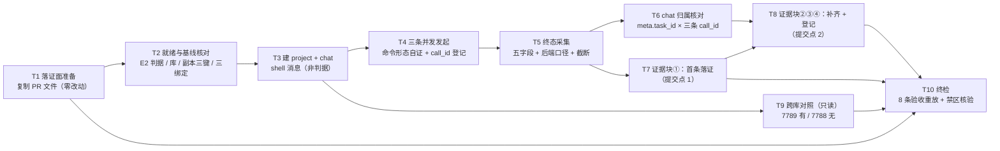

# pr-006-tasks.md — pr-006 内部任务图（第二集群三条绑定实报 / F05·F06·F07）

**迭代**: 0028-role-model-binding ｜ **阶段**: 5（PR 实现）· 补位波 ｜ **PR 文件**: `prs/pr-006-second-cluster-binding-evidence.md`
**worktree 分支**: `feat/0028-pr-006-binding-evidence` ｜ **base**: **`1974f41`**（已核：`git -C <WT> merge-base HEAD iteration/0028-role-model-binding` = `1974f41c8a8645d94775d00525bca24250673e91` = 迭代分支 HEAD）⇒ **`depends_on`（pr-005）已满足**（pr-005 的 PR 文件已随迭代分支入库，本 worktree 内可读）
**任务总数**: **10**（T1 落证面 → T2 就绪与基线 → T3 建 project/chat → T4 三条并发发起 → T5 终态采集 → T6 归属核对 ／ T7 首条落证（中间提交点）→ T8 补齐三条+登记（第二提交点）／ T9 跨库对照（P1）／ T10 终检）｜ **依赖图**: **无环**（见 §2）
**输入真源**: PR 文件（文件范围 1 路径 / 验收 1~8 / depends_on / batch / 「验收证据」括注）+ `prd/F05`（验收 1~5、边界、MI-3）· `prd/F06`（验收 1~6，含"异源可核对"）· `prd/F07`（验收 1~5）· `prd/F10`（验收 1~5，R-1 读法 (b) 已收窄）+ `prd/F11`（验收 1~4：三信号 / D-16 缺口 / D-17 全阶段覆盖）+ `architecture.md` §3.2（取证链五拍）· §4 A-05（不共享 + 三条实报的定位与留证）· §5 D-05 / D-06 · §4 A-03 第 3 拍（`truncated: true` 即聚合）+ `demand.md` D-05 / D-06（D-16 见 G-5）+ `deferred-demand-changes.md` **G-17**（第二集群启动与就绪判据的事实）+ 工具锚点（§0.6）
**本 PR 性质**: **运行态取证 + 落证**——在第二集群自己的 chat 内取三条终态实报（dev→gpt / verifier→grok / prd→默认），核对命令形态、终态字段与 chat 归属，写进本 PR 文件的「验收证据」小节。**零代码改动、零配置改动、只写本 worktree 内的本 PR 文件**；对第二集群的运行态写入（project / chat / 三条调用与其过程记录）须**显式登记**为运行态副作用（契约 6）。

---

## 0. 范围、判据口径与执行环境事实

### 0.1 本 PR 文件范围（**1 路径**；唯一可写面）

| # | 路径 | 动作 | 归属任务 |
|---|---|---|---|
| 1 | `docs/iterations/0028-role-model-binding/prs/pr-006-second-cluster-binding-evidence.md` | 从**迭代工作区**复制入库（本 worktree 内不存在该文件——已核：`ls <WT>/docs/iterations/0028-role-model-binding/prs/` = pr-001/pr-002/pr-003/pr-005/pr-007，无 pr-006）+ 在「验收证据」小节追加实报记录（append-only，分两次落） | **T1**、**T7**、**T8** |
| — | `prs/pr-006-second-cluster-binding-evidence-tasks.md`（本文件） | 阶段 5 流程产物（**不进本 PR 提交面**，契约 9） | — |

**运行态副作用面（非版本控制写入，须登记不须提交）**：第二集群的对话库 `<WS>/oamp/data/sql.db`（project 记录 + chat 记录 + 一条 shell 消息 + 三条调用及其过程记录）、scratch 日志目录 `/tmp/0028-pr-006/**`（并发发起的 stdout 落盘）。
**零触碰**：`cluster.second.json`（pr-005）、`status.md`（主 agent；三条实报的台账行由主 agent 追加）、`deferred-demand-changes.md`（pr-007）、`oamp/**`、`roles/**`、`demand.md`、`prd/**`、`architecture.md`、其它 `prs/pr-0NN-*.md`、主集群的一切写动作。

### 0.2 判据口径（上游原文，逐条可回溯）

| PR 验收 | 上游依据 | 落点 |
|---|---|---|
| 1（建 project + shell 消息建 chat；该消息非判据） | F07 架构维度（取证命令形态括注）；`architecture.md` §3.2-1/2；§5 D-05（建 chat 用 shell 消息）/ D-06（目标节点 `pb-workflow-pb`）；`demand.md` D-05 | T3 |
| 2（三条命令除 `--agent` 外逐字一致；均不带 `--model`） | `demand.md` D-05（真源唯一）；F09 验收 3；F13 验收 2；`architecture.md` §3.2-3 表 | T4-2/3、T10-3 |
| 3（三条 `model` 解析到 gpt / grok / 默认；MI-3 只判同一后端 + 原文照录） | F05 验收 1/4、F06 验收 1/4、F07 验收 1/4；MI-3（已确认） | T5-3、T8-2 |
| 4（终态字段逐字留存；三 `call_id` 互不相同；`state` 为终态） | F05 / F06 验收 2；F07 验收 3；`architecture.md` §3.2-4（信封 10 键） | T5-1/2/4 |
| 5（归属核对走 `chats get` 的 `messages[].meta.task_id`） | F10 验收 2；`architecture.md` §4 A-05「定位」（信封封闭 10 键、**不含 `chat_id`**）；§3.2-5 | T6-1/2 |
| 6（三条彼此同属该 chat；**不要求**与迭代 chat `chat-6c89902c-…` 同源） | F10 验收 2（R-1 读法 (b) 落定）；F05/F07 架构维度 A-05 | T6-3/4 |
| 7（`--port 7789`；对话库 `<WS>/oamp/data/sql.db`；不设 `OAMP_DB`） | `architecture.md` §4 A-05（判定 = 不共享；零配置）；代码锚点 `config.js:154`（`dbPath` 按包根推导）/ `cluster.js:190`（web 端口取 `config.web.port`） | T2-2/3、T9 |
| 8（不携带 `--model`；绑定生效前的既有调用不纳入判据） | F05 / F06 验收 3 与 5；F13 验收 2 | T4-3、T2-4、T5-5 |
| 「验收证据」括注清单（`project_id` / `chat_id` + 三条逐条三级标题（`命令` / `call_id` / `终态字段` / `实报 model 原文`）+ 归属核对输出） | PR 文件「验收证据」小节原文；`architecture.md` §4 A-02（载体约定） | T7、T8 |
| 等价性判据的覆盖（D-17 全阶段）与截断去向（D-16） | F11 验收 1/2/4；`architecture.md` §4 A-03 第 3 拍（`truncated: true` ⇒ 聚合到 F12 的 G-5） | T5-1、T8-4 |
| 运行态副作用显式登记 | brief 硬约束 6；PR 文件「文件范围」排除面 | T8-5 |

### 0.3 非目标（防夹带；触碰即越界 ⇒ T10-4 不通过）

- **不做**：对**主集群**（缺省端口 7788）的任何写动作——`calls create` / `messages send` / `projects create` / `chats rename|close|archive|activate`；不得因漏 `--port 7789` 把调用落到主集群（**最高优先风险**，§3-①）。
- **不做**：`--model` 的任何携带（含建 chat 的 shell 消息；F09 验收 3 / F13 验收 2）；不通过派发参数制造本卡证据（F05 / F06 / F07 边界）。
- **不做**：改 `cluster.second.json`（含再起/重启第二集群、改端口或 socket）、改 `oamp/**`、改 `roles/**`、改 `status.md` / `deferred-demand-changes.md`。
- **不做**：F04（pr-005，集群启动与三项隔离）、F08（pr-010，收口重启）、F09/F10/F11 的判定（pr-008）、F12 的差距条目正文（pr-007）——本 PR 只在证据里留"待 F12 收录"的行。
- **不做**：对 8 个未绑定角色逐一取证（D-12 只抽 1 个 `pb-prd`）；把抽样结论外推（F07 边界）。
- **不做**：自建调度/包装脚本替代 `--mode block`（G-4：等待终态用实现面既有能力；轮询只用于观察状态与取 `call_id`，见契约 5）。

### 0.4 本 PR 内契约（每个任务都必须遵守）

1. **路径记号**：`<WT>` = 本 worktree 根（`/Users/chenchiyuan/projects/agents/.pb-agents/worktrees/0028-role-model-binding/.pb-agents/worktrees/0028-pr-006-binding-evidence`）；`<WS>` = 迭代工作区根（`/Users/chenchiyuan/projects/agents/.pb-agents/worktrees/0028-role-model-binding`）；`<MAIN>` = 主工作区（`/Users/chenchiyuan/projects/agents`）。命令中的 hub 入口 = `node <WS>/oamp/bin/hub.js`。
2. **端口纪律**：对第二集群的**每一条** hub 命令都必须带 `--port 7789`（缺省 7788 = 主集群）；命令原文留证时 `--port 7789` 必须在场。
3. **命令形态（PR 验收 2 的硬判据）**：三条实报命令除 `--agent` 取值外**逐字一致**（含同一 `--task` 文本、同一 `--mode block`、同一 `--port 7789`），且三条**都不含** `--model`。归一判据：把 `--agent <值>` 替换为 `--agent <A>` 后三条文本 `diff` 零差异。
4. **写边界**：本 PR 只写 `<WT>` 内的本 PR 文件；运行态副作用面（§0.1）与 scratch 目录（`/tmp/0028-pr-006/`）须登记，不进提交面。
5. **等待形态（brief 硬约束 2）**：三条实报以 `&` **并发发起**、各自 stdout/stderr 落独立日志文件，随后轮询 `api calls list --port 7789` 与逐条 `api calls get <call_id> --port 7789` 采集终态；**每条命令自身仍逐字含 `--mode block`**（轮询不替代实现面的阻塞语义，G-4）。
6. **分步提交点（brief 硬约束 2）**：证据分两次落、两次提交——**先落首条实报**（T7），**再补其余两条 + 归属 + 登记**（T8）；中间任何一次会话中断都不得导致"已取到的证据全部丢失"。
7. **失败如实记**：任一条调用失败/超时（节点侧 30 分钟上限，G-9）⇒ 记「失败 + 现象（`state` / `error` / `exit_code` / 耗时）」+ 该条的 `call_id`，**不得**用另一次调用替换、不得改命令形态（F05 / F06 / F07 验收 3 与边界）。
8. **证据 append-only**：PR 文件「验收证据」小节保留原括注行（`本 PR 执行时填写…`，执行时点计数须仍为 1）；七字段与标题零改动（hunk 全落在末节）。
9. **本任务图不进提交面**：两次提交的路径集合都不得含 `pr-006-second-cluster-binding-evidence-tasks.md`。
10. **不引入技术决策**：新增文本只能取自 PR 文件、`prd/F05`·`F06`·`F07`·`F10`·`F11`、`architecture.md` §3.2/§4 A-05/§5 D-05·D-06、`demand.md` D-05·D-06 与命令原始输出；发现事实与上游表述不一致 ⇒ 记录并上报，不自行补方案。

### 0.5 执行环境事实（供 dev 直接引用，**无需重新调研**）

| # | 事实 | 值 / 判据 |
|---|---|---|
| **E1** | **第二集群已就绪并在运行** | tmux session `oamp-cluster-0028`（12 窗口全活）；web 监听 **7789** |
| **E2** | **唯一就绪判据** | `node <WS>/oamp/bin/hub.js api agents --port 7789` ⇒ 10 个 `pb-*` 全 `online`。**不得**用 `cluster up` 的 exit code：`cluster.js:415` 的 online 等待用 `runtimeConfig.socketPath`（包根推导），而 `:393` 的 router 等待用 `config.router.socket`（副本已设为短路径）⇒ 两侧不同源，就绪后 `up` 仍返回 1（`deferred-demand-changes.md` **G-17 ④**；核对原文 `cluster.js:393` / `:415`） |
| **E3** | **包根与对话库** | 第二集群包根 = `<WS>/oamp`；对话库 = `<WS>/oamp/data/sql.db`（`config.js:154`：`dbPath` 按包根推导，**不设 `OAMP_DB`**）；主集群对应 `<MAIN>/oamp/data/sql.db`（**两库不共享**，`architecture.md` §4 A-05） |
| **E4** | **副本形态** | `<WS>/cluster.second.json` = `<WS>/cluster.json` 的副本 + **三键差异**：`session` = `oamp-cluster-0028`、`web.port` = `7789`、`router.socket` = `/tmp/oamp-0028-router.sock`（用户裁决方案 A，G-17 ②；与 pr-005 证据小节的记录一致——**本 PR 不改它**） |
| **E5** | **三条绑定取值**（pr-002 产物，已随第二集群启动生效） | `roles.dev.model` = `openai/gpt-5.6-luna`；`roles.verifier.model` = `powerby/grok-4.6`；`prd` **无** `model` 键（走默认链路，deepseek 系） |
| **E6** | **chat 命名与建法** | `chat-0028-second-cluster`；由一条 **shell 形态**消息建立（`--agent-id pb-workflow-pb`、`--text '!echo second-cluster-chat-ready'`、无 `--model`）⇒ 该消息**不是角色派发、不产生调用记录**，不构成对照判据（§5 D-05 / D-06） |
| **E7** | **命令模板（逐字；唯一变量 = `--agent`）** | `node <WS>/oamp/bin/hub.js api calls create --chat-id chat-0028-second-cluster --agent <dev\|verifier\|prd> --task "<…>" --mode block --port 7789` |
| **E8** | **判据口径（MI-3）** | 只判"解析到**同一后端**"（provider 前缀：`openai/` / `powerby/` / deepseek 系）；实报 `model` 字符串**原文照录**，只作事实不作比较判据（F05 / F06 / F07 验收 4） |
| **E9** | **终态信封形态** | `api calls get <call_id> --port 7789` 返回 10 键 `{ call_id, agent, state, duration_ms, model, truncated, text, structured_output, error, exit_code }`（`web.js:1232-1256`）；`call_id` 不存在（含重启后）⇒ `404 NOT_FOUND`（G-15） |
| **E10** | **归属核对面** | 调用信封**不含** `chat_id`（封闭 10 键）⇒ 归属只能走 `api chats get chat-0028-second-cluster --port 7789` 的 `messages[].meta.task_id`（§4 A-05「定位」） |
| **E11** | **写面** | 本 worktree 的 0028 子树已在库（pr-001/002/003/005/007 与 `deferred-demand-changes.md` 等）；**缺** `prs/pr-006-second-cluster-binding-evidence.md`（在 `<WS>` 为 untracked）⇒ T1 复制该文件 |

### 0.6 工具锚点（规划期只读核对，逐条带出处）

- `oamp/sdk/surface.js`：`api agents` = `GET /api/agents`（`:121`）；`api chats get` = `GET /api/chats/:chat_id`（`:139`）；`api messages send` 可选项 `chat-id` / `project-id` / `agent-id` / `text`(必填) / `model` / `one-shot`（`:151-157`）；`api projects create` = `POST /api/projects`，`repo-url` **必填**（`:164-169`）；`api calls create` = `POST /api/calls`，可选项 `chat-id`(必填) / `agent`(必填) / `task` / `mode` / `model` / `wait`（`:171-187`）；`api calls list` = `GET /api/calls`（`:188`）；`api calls get` = `GET /api/calls/:call_id`（`:212`）。
- `oamp/sdk/cli.js:25`：`--port` 是**层 A（api）专属**选项 ⇒ 本 PR 全部命令（层 A）都可带 `--port 7789`；`--port` 给非层 A 即用法错误。
- `oamp/src/cluster.js:190`：web 窗口 argv 的端口唯一来源 = `config.web.port` ⇒ 7789 来自副本（PR 验收 7 的代码判据）。
- `oamp/src/config.js:154`：`dbPath: path.resolve(PKG_ROOT, readNonEmptyString(env.OAMP_DB) || file.db || DB_DEFAULT)` ⇒ 库落包根（PR 验收 7）。
- `oamp/src/web.js:1232-1256`：`calls get` 走 `router.task_get`、不按来源过滤（E9）。

---

## 1. 任务列表

### T1: 落证面准备 —— 把本 PR 文件从迭代工作区复制进 worktree（零改动）

- **一句话描述**：复制 `<WS>/docs/iterations/0028-role-model-binding/prs/pr-006-second-cluster-binding-evidence.md` 到 `<WT>` 同路径，记录源 sha256 与复制时点。
- **验收标准**:
  1. **入库面恰 1 条**：文件出现在 `<WT>/docs/iterations/0028-role-model-binding/prs/` 下；`ls` 该目录**新增且仅新增**这一份（对照 E11）。
  2. **逐字一致**：`git -C <WT> diff --no-index <WS>/…/pr-006-second-cluster-binding-evidence.md <WT>/…/pr-006-second-cluster-binding-evidence.md` **零输出**；源 sha256 + 字节数 + 行数记录在案。
  3. **原括注行在场**：`grep -c '本 PR 执行时填写'` = 1；七字段与标题零改动（契约 8）。
  4. **零越界**：本任务不触碰 §0.3 的任何路径；`git -C <WT> status --porcelain` 仅新增该文件（+本任务图文件）；执行 `<WS>` 内一切读取均为只读。
- **前置依赖**: 无
- **优先级**: P0
- **追溯**: PR 文件「文件范围」；`architecture.md` §4 A-02（载体约定）；brief「本 PR 文件在迭代工作区，worktree 内不存在」；事实锚点 E11

### T2: 执行前就绪与基线核对（含绑定取值与"生效前调用"边界）

- **一句话描述**：以只读面确认第二集群就绪、库与端口落点、副本三键取值，并冻结"三条实报之前"的调用/对话基线。
- **验收标准**:
  1. **就绪判据（E2）**：`node <WS>/oamp/bin/hub.js api agents --port 7789` 输出中 10 个 `pb-*` 全 `online`（排除固有节点 `web`）⇒ 原文留证；**不使用** `cluster up` 的 exit code 作判据（判据依据 = G-17 ④：`cluster.js:415` 与 `:393` socket 不同源）。
  2. **库与端口落点（PR 验收 7）**：`ls -l <WS>/oamp/data/sql.db`（存在、字节数、mtime）+ `lsof -nP -iTCP:7789 -sTCP:LISTEN`（有 node 监听）；并记录 `printenv | grep -i '^OAMP_DB'`（**零输出** ⇒ 未设 `OAMP_DB`，`config.js:154` 的包根推导生效）。
  3. **副本三键取值（E4）**：从 `<WS>/cluster.second.json` 取 `session` / `web.port` / `router.socket` 三键原值（只读，`grep -n` 或 node 解析），与 E4 对照 ⇒ 与"第二集群实际跑在 7789 / `oamp-cluster-0028`"一致。
  4. **绑定取值与"生效后"时点（PR 验收 8 / F05·F06 验收 3、5）**：从 `<WS>/cluster.second.json` 取 `roles.dev.model` = `openai/gpt-5.6-luna`、`roles.verifier.model` = `powerby/grok-4.6`、`prd` 无 `model` 键（三条原文留证）；并以 pr-005 证据小节的**启动时间**（`<WT>/docs/iterations/0028-role-model-binding/prs/pr-005-second-cluster-bring-up.md`，本 worktree 内已可读）作为"绑定生效时点"的锚点，声明三条实报后于该时点 ⇒ 满足"绑定生效之前的既有调用不纳入判据"。
  5. **调用/对话基线（零基线的证明）**：`api calls list --port 7789` 与 `api chats list --port 7789` 的原始输出留证 ⇒ 记录当前是否已有 `chat-0028-second-cluster` 与既有调用；**若 `chat-0028-second-cluster` 已存在** ⇒ 停止并上报（不得复用或覆盖：会破坏 PR 验收 1 的"建 chat 由本 PR 的 shell 消息完成"与 F10 的归属判定）。
  6. **零写入**：本任务全部命令为只读；`git -C <WT> status --porcelain` 不变；对 7788（主集群）**零命令**。
- **前置依赖**: T1
- **优先级**: P0
- **追溯**: PR 验收 7 / 8；F05 验收 3/5、F06 验收 3/5、F07 验收 1；`architecture.md` §3.2-1 / §4 A-05 / §5 D-05；事实锚点 E1~E5、E9、G-17 ④

### T3: 建立 `project` 与 `chat-0028-second-cluster`（shell 形态消息，非判据）

- **一句话描述**：在第二集群建 project 与 chat，建 chat 只用一条无模型参与的 shell 消息。
- **验收标准**:
  1. **建 project（PR 验收 1）**：`node <WS>/oamp/bin/hub.js api projects create --repo-url https://github.com/chenchiyuan/agents --port 7789` ⇒ 退出码 0，输出中的 `project_id` 原文照录（`projects create` 的 `repo-url` 为必填，§0.6）。
  2. **建 chat（PR 验收 1）**：`node <WS>/oamp/bin/hub.js api messages send --chat-id chat-0028-second-cluster --project-id <prj> --agent-id pb-workflow-pb --text '!echo second-cluster-chat-ready' --port 7789` ⇒ 命令逐字留证（含 `--port 7789`）；`chat_id` = `chat-0028-second-cluster` 原文照录。
  3. **该消息非角色派发、无模型参与**：命令**不含** `--model`；执行后 `api calls list --port 7789` 中**不出现**由该消息产生的调用（调用数不增）；判据 = 该命令前后 `calls list` 原始输出对照（**F07 架构维度**："该消息非角色派发、无模型参与，不构成对照判据"）。
  4. **目标节点选择符合 D-06**：`--agent-id pb-workflow-pb`（与三条实报的三个节点不相交 ⇒ 不在对照表里引入"同节点一条 `model: null`"的噪声）。
  5. **失败处置**：建 project 或建 chat 失败 ⇒ 记「失败 + 现象 + 原始输出」，**不得**改用非 shell 形态（不得让角色参与建 chat）、不得换 chat_id 重来而不登记。
- **前置依赖**: T2
- **优先级**: P0
- **追溯**: PR 验收 1；F07 架构维度（取证命令形态括注）；`architecture.md` §3.2-1/2、§5 D-05 / D-06；§0.6（`messages send` / `projects create` 选项面）

### T4: 三条实报并发发起（命令形态自证 + `call_id` 登记）

- **一句话描述**：以完全同形（除 `--agent`）的三条 `--mode block` 命令并发发起 dev / verifier / prd 三条调用，各自落独立日志，并登记三个 `call_id`。
- **验收标准**:
  1. **三条命令齐备且逐字**：三条命令原文写进证据块，取值分别 = E7 模板中的 `dev` / `verifier` / `prd`；三条**均含** `--mode block` 与 `--port 7789`。
  2. **形态自证（PR 验收 2 的机械判据）**：把三条命令的 `--agent <值>` 归一为 `--agent <A>` 后 `diff` ⇒ **零差异**（同一 `--task` 文本、同一旗标顺序、同一端口）；三条中 `--model` **零命中**。
  3. **无 `--model`（PR 验收 8 / F13 验收 2）**：三条命令的 `grep -c -- '--model'` = 0；并声明模型取值**只能**来自第二集群的角色级绑定（E5）。
  4. **并发发起（契约 5）**：三条以 `&` 并发、各自 stdout/stderr 落 `/tmp/0028-pr-006/<agent>.log`（三个不同文件名）；给出该并发形态的**命令原文**与三个日志路径（scratch 路径在 T8-5 登记）。
  5. **`call_id` 登记（A-03 第 1 拍精神）**：并发发起后立即 `api calls list --port 7789`，取三条调用（`agent` 分别 = dev / verifier / prd）的 `call_id` 原文，验证**三个 `call_id` 互不相同**；该输出留证（**PR 验收 4** 的前半）。
  6. **零污染**：三条命令全部带 `--port 7789`；本任务结束后 `api calls list --port 7788`（只读对照，可选）中不出现本 PR 的三条调用——若出现 ⇒ 立即上报（说明端口纪律被破坏，契约 2）。
- **前置依赖**: T3
- **优先级**: P0
- **追溯**: PR 验收 2 / 4 / 7 / 8；`demand.md` D-05；F09 验收 3；`architecture.md` §3.2-3 表、§4 A-03 第 1 拍；契约 2 / 5；事实锚点 E7 / E8 / E9

### T5: 三条终态采集（终态字段逐字 + 截断标记）

- **一句话描述**：等三条调用到达终态，逐条采集 `state` / `model` / `error` / `exit_code` / `truncated` 原文，并按 MI-3 判后端口径。
- **验收标准**:
  1. **终态可得（F11 验收 1 ②；PR 验收 4）**：逐条 `api calls get <call_id> --port 7789` ⇒ `state` ∈ {`completed`, `failed`}；五字段（`state` / `model` / `error` / `exit_code` / `truncated`）与 `duration_ms` **原文照录**（信封 10 键，E9）。
  2. **等待预算（G-9 处置）**：等待总墙钟以节点侧 30 分钟单次上限为准（三条并发 ⇒ 总墙钟 ≈ 最慢一条）；**不用**自建调度替代 `--mode block`（每条命令自身已是 block 形态）；轮询只用于观察状态与取 `call_id`（契约 5）。达 30 分钟仍无终态 ⇒ 按失败记（`state` 原文 + 现象 + `call_id`），**不重跑替换**（契约 7）。
  3. **后端口径判定（MI-3 / PR 验收 3）**：三条实报 `model` 分别判定 —— `dev` ⇒ provider 前缀 `openai/`；`verifier` ⇒ `powerby/`；`prd` ⇒ 默认链路（deepseek 系）；判定写明"解析到同一后端"，并**同时**原文照录实报字符串（不作比较判据）。任一指向不同后端 ⇒ 本 PR 判失败并如实记。
  4. **三 `call_id` 互不相同**：三个 `call_id` 并列可核（PR 验收 4）。
  5. **生效时点声明（PR 验收 8）**：每条实报的 `call_id` 与 T2-4 的启动时点并列 ⇒ 声明三条均发生在绑定生效之后，且命令不含 `--model`（与 F05/F06 验收 3、5 互为对照）。
  6. **旁证（日志）**：三条后台进程的 `/tmp/0028-pr-006/<agent>.log` 的终态段与 `calls get` 输出**一致**（不一致 ⇒ 以 `calls get` 为准并登记差异）。
- **前置依赖**: T4
- **优先级**: P0
- **追溯**: PR 验收 3 / 4 / 8；F05 / F06 验收 1~5、F07 验收 3/4；F11 验收 1 ②、验收 2 ①（截断）；`architecture.md` §3.2-4；契约 5 / 7；事实锚点 E8 / E9；`deferred-demand-changes.md` G-9 / G-15

### T6: chat 归属核对（`messages[].meta.task_id` × 三条 `call_id`）

- **一句话描述**：用对话消息面把三条实报的归属逐条对上，并确认三条彼此同属第二集群这一个 chat。
- **验收标准**:
  1. **核对面正确（PR 验收 5）**：`node <WS>/oamp/bin/hub.js api chats get chat-0028-second-cluster --port 7789` 原始输出留证；归属核对**只能**走该输出的 `messages[].meta.task_id`（调用信封封闭 10 键、不含 `chat_id`，E10）。
  2. **逐条对上**：三条 `call_id`（T4-5 / T5-1）各能在 `messages[].meta.task_id` 中找到**恰好一处**对应；给出三行对照表（`call_id` ↔ 命中位置 + 该消息的 `agent_id` 原文）。任一条对不上 ⇒ 判失败并记录差异（不得改用其它字段"推断"归属）。
  3. **同址判定（PR 验收 6 / F10 验收 2）**：三条实报**彼此同属** `chat-0028-second-cluster` ⇒ 判定成立；**不要求**与迭代 chat `chat-6c89902c-0a9f-4513-a299-90a7f98ae611` 同源（R-1 读法 (b) 已落定）——本任务**不**对主集群发起任何查询之外的写动作（只读对照见 T9）。
  4. **排除建 chat 消息**：shell 消息在 `messages[]` 中有记录，但其 `meta.task_id` **不参与**三条实报的归属判据（F07 架构维度；T3-3 已证其不产生调用）；对照表须显式标注该行"非判据"。
  5. **chat 唯一性（局部）**：`api chats list --port 7789` 中含 `chat-0028-second-cluster`；第二集群侧不出现第二个承载三条实报的 chat（判据 = 三条 `call_id` 全部落在同一 `chat_id` 下）。
- **前置依赖**: T5
- **优先级**: P0
- **追溯**: PR 验收 5 / 6；F10 验收 1/2；`architecture.md` §3.2-5、§4 A-05「定位 / 留证」；事实锚点 E10

### T7: 证据块 ① —— 首条实报落盘（**分步提交点 1**）

- **一句话描述**：把最先取得终态的那一条实报按括注字段写进本 PR 文件的「验收证据」小节，并立即提交一次。
- **验收标准**:
  1. **字段齐备**：该条一个三级标题条目，字段名逐字含 `命令` / `call_id` / `终态字段` / `实报 model 原文`（PR 文件「验收证据」括注原文）；`终态字段` 内 `state` / `model` / `error` / `exit_code`（+ `truncated` / `duration_ms`）原文照录。
  2. **命令与形态**：该条 `命令` 逐字 = T4-1 中对应的一条（含 `--mode block` / `--port 7789` / 无 `--model`）。
  3. **append-only**：原括注行仍在（`grep -c '本 PR 执行时填写'` = 1）；七字段与标题零改动（hunk 全落在末节）。
  4. **提交点 1**：`git -C <WT> add` 仅本 PR 文件并提交一次，信息以 `docs(0028/pr-006)` 开头且含 `首条实报`；`git -C <WT> show --name-only --format= HEAD` ⇒ **恰 1 路径**（本任务图文件不在其中，契约 9）。
  5. **不谎报进度**：此时证据块只含 1 条（不得把尚未取到终态的另两条写成"已完成"）；若三条均已终态，仍按本任务只落首条，其余归 T8。
- **前置依赖**: T5
- **优先级**: P0
- **追溯**: PR 文件「验收证据」小节原文；`architecture.md` §4 A-02；契约 6 / 8 / 9

### T8: 证据块 ②③④ —— 其余两条 + 归属核对输出 + 运行态副作用登记（**分步提交点 2**）

- **一句话描述**：补齐另两条实报与 `project_id` / `chat_id` / 归属核对输出，登记运行态副作用与截断去向，并完成本 PR 的最终提交。
- **验收标准**:
  1. **三条齐备**：「验收证据」小节中三条实报各一个三级标题条目（`dev` / `verifier` / `prd` 可点名），且 `project_id` 与 `chat_id` 在场（PR 文件括注清单逐项覆盖）。
  2. **三后端并排可读（F06 验收 5 / F07 验收 5）**：三条实报 `model` 并排给出 ⇒ 分别落在 gpt / grok / 默认三个不同取值上，形成"绑定生效且未绑定不受影响"的完整对照组；判据口径写明 = "解析到同一后端"（MI-3），原文照录另列。
  3. **归属核对输出落盘**：`chats get` 输出的**相关片段原文**（三条 `meta.task_id` 命中处）+ 三行对照表（T6-2）写进证据；标注 shell 消息行"非判据"。
  4. **截断去向（D-16 / `architecture.md` §4 A-03 第 3 拍）**：三条的 `truncated` 取值逐条记录；**任一为 `true`** ⇒ 证据中含恰一行"待 F12 收录：第二集群绑定实报 + `<call_id>` + 现象"，正文由 **pr-007** 写入 `deferred-demand-changes.md`（本 PR **不写**该文件）；三条全 `false` ⇒ 显式写"三条 `truncated` 均为 `false`"（不留空）。
  5. **运行态副作用登记（brief 硬约束 6）**：一段登记含 —— ① 写入面 = 第二集群对话库 `<WS>/oamp/data/sql.db`（project 1 条 / chat 1 条 / shell 消息 1 条 / 调用 3 条及其过程记录），判据 = 库文件字节数 before（T2-2）→ after 对照 + `calls list --port 7789` 的 3 条；② scratch = `/tmp/0028-pr-006/*.log`（三个路径 + 用途）；③ **未写入**清单与判据 —— `<WS>/cluster.second.json`（sha256 前后一致）、`oamp/**` / `roles/**`（`git -C <WS> status --porcelain` 无新增）、`status.md` / `deferred-demand-changes.md`（同前）；④ 声明本 PR 的唯一版本控制写入 = 本 PR 文件。
  6. **提交点 2**：`git -C <WT> show --name-only --format= HEAD` ⇒ **恰 1 路径**（本 PR 文件）；本任务图文件不在提交面（契约 9）；提交信息以 `docs(0028/pr-006)` 开头且含 `三条实报`。
  7. **append-only 复核**：原括注行计数 = 1；两次提交的 hunk 均落在「验收证据」小节内（判据 = hunk 头行号 > 该小节行号）。
- **前置依赖**: T7、T6（T6 提供归属输出；T5 经 T7 间接依赖）
- **优先级**: P0
- **追溯**: PR 文件「验收证据」括注 + 验收 3 / 4 / 5 / 6；F05 验收 4、F06 验收 4/5、F07 验收 4/5；F11 验收 2（D-16）+ `architecture.md` §4 A-03 第 3 拍；brief 硬约束 6；契约 6 / 8 / 9

### T9: 跨库对照加固（只读：7789 有、7788 无）

- **一句话描述**：以只读面加固"chat 存储落在第二集群、不与主集群共享"这一判据。
- **验收标准**:
  1. **两条只读命令原文留证**：`api chats list --port 7789` 与 `api chats list --port 7788`（缺省端口 = 主集群）；两者输出原文照录。
  2. **对照结论**：`chat-0028-second-cluster` 出现在 7789 的输出中、**不出现**在 7788 的输出中 ⇒ 与 `architecture.md` §4 A-05「不共享」一致，且是"本 PR 的对话确实落在第二集群库"的旁证（PR 验收 7）。
  3. **零写动作（硬性）**：对本任务的两条命令均为 `chats list`（`:123` 的层 A GET）；**不得**因缺 `--port` 或缺省端口把任何写命令指向主集群；本任务结束后 `api calls list --port 7788` 中不出现本 PR 的任何 `call_id`。
  4. **不构成通过条件声明**：若 7788 侧因主集群 chat 数量多而不便逐条比对，给出 `grep` 判据原文（`grep -c 'chat-0028-second-cluster'` ⇒ 7788 侧为 `0`、7789 侧为 `1`）即可，无需列举主集群全部对话。
- **前置依赖**: T3（chat 建立后）
- **优先级**: P1（加固项：PR 验收 7 的主判据是 `--port 7789` 与库路径〔T2-2、T8-5〕；本项是只读旁证，失败不改判但须登记）
- **追溯**: PR 验收 7；`architecture.md` §4 A-05（不共享的四条理由之 ③：两库合一会给 F10 判据添噪声）；§0.6（`chats list` = `GET /api/chats`）

### T10: 终检（8 条验收逐条重放 + 提交面与禁区核验）

- **一句话描述**：对本 PR 的 8 条验收标准逐条重放判据，核对提交面与零越界，产出可留痕的终检输出。
- **验收标准**:
  1. **验收 1~8 覆盖矩阵逐条有判据**：8 条各给出"判据命令/字段 + 结论"，其中验收 2/3/4/5/7 的判据须在**提交面**（`git show HEAD:<本 PR 文件>`）重放一次 ⇒ 与工作区结论一致。
  2. **形态自证在提交面成立**：从提交面提取三条 `命令` ⇒ 归一 `--agent` 后 `diff` 零差异、`--mode block` ×3 在场、`--model` 零命中（PR 验收 2 / 8）。
  3. **禁区零命中**：`git -C <WT> diff --name-only 1974f41...HEAD | grep -E '^(oamp/|roles/|cluster\.json|cluster\.second\.json|docs/iterations/0028-role-model-binding/(status\.md|history\.md|demand\.md|prd\.md|architecture\.md|prd/|clarifications/|deferred-demand-changes\.md|prs/pr-00[1235789]|prs/pr-01))'` ⇒ **零输出**（F13 验收 2 / 本 PR 文件范围排除面）。
  4. **提交面恰 1 路径 × 两次提交**：`git -C <WT> log --name-only 1974f41..HEAD` ⇒ 两次提交，每次恰 1 路径（均为本 PR 文件）；本任务图文件为零命中。
  5. **主集群零污染终检**：`api calls list --port 7788`（只读）中不出现本 PR 的三条 `call_id`；`shasum -a 256 <MAIN>/cluster.json` 与执行前一致（无配置改动）；第二集群侧 `api agents --port 7789` 仍 10 个 `pb-*` `online`（现场保留，本 PR 不 `down`）。
  6. **验收手段声明**：本 PR 无套件可跑——结论以命令实跑原始输出与文件内容核验为准，不声称"测试全绿"。
- **前置依赖**: T1、T7、T8、T9
- **优先级**: P0
- **追溯**: PR 文件验收 1~8 与「验收证据」；F05 / F06 / F07 验收全条；F10 验收 2；F11 验收 2；契约 9 / 10

---

## 2. 依赖图

- **无环**（10 节点 / 11 边）：主链 T1 → T2 → T3 → T4 → T5 → {T6, T7} → T8 → T10；旁支 T3 → T9 → T10；T1 → T10。**无回边、无互指** ⇒ 不存在循环依赖，无需上报。
- **最长依赖链**：`T1 → T2 → T3 → T4 → T5 → T6 → T8 → T10`（8 节点 / 7 边）；另有同长度支线（T6 换 T7）。
- **关键路径任务**：**T4**（命令形态与并发发起：PR 验收 2/8 的判据面在最脆弱处——命令文本与端口纪律）、**T5**（终态五字段与后端口径：PR 验收 3/4）、**T6**（归属：PR 验收 5/6）、**T8**（补齐 + 登记 + 截断去向）。
- **真依赖（非叙述顺序）**：T3 必须先于 T4（`--chat-id` 必须已存在，G-3）；T5 必须后置 T4（终态对象是三条已发起的调用）；T6 必须后置 T5（核对对象是三条 `call_id`，且需终态已定以便区分"已派发"与"已受理"）；T7 与 T6 相互独立（同读 T5 的产物）；T8 后置 T6 与 T7（承接首条已落盘的状态与归属输出）；T9 只依赖 T3；T10 后置全部落盘任务。
- **并行宽度**：T6 ∥ T7 ∥ T9（三条互不写同一文件：T7 写 PR 文件，T6/T9 只读）。
- **串行点（写者唯一）**：PR 文件的两个写者 T7 / T8 **严格串行**（T7 → T8），中间以提交点 1 分界；运行态写动作集中在 T3（建 project/chat）与 T4（三条调用），其余任务全为只读。
- **粒度隔离的有意设计**：① **T4 与 T5 拆开**——T4 是"发起 + 形态自证 + 取 `call_id`"（秒级、失败面在命令文本与端口），T5 是"等终态 + 判后端口径"（墙钟受 G-9 的 30 分钟上限支配）；合并会让一个受外部时限支配的任务吞掉形态判据的失败信号。② **T6 与 T7 拆开**——T6 判归属（PR 验收 5/6），T7 判证据面（括注四字段 + append-only + 提交点 1），两者的失败面与修复手段完全不同。③ **T8 单列**——它是"补齐 + 跨面登记"的汇聚点（其余两条 + 归属输出 + 运行态副作用 + 截断去向），四项的共同前提是提交点 1 已成立。④ **T9 取 P1**——PR 验收 7 的主判据（`--port 7789` + 库路径）在 T2/T8 已判，本项只是只读旁证，避免把"加固"混入主判据。

### 覆盖矩阵（PR 验收 1~8 → 任务）

| PR 验收 | 主判据任务 | 复判/落证 |
|---|---|---|
| 1 建 project + shell 消息建 chat | T3-1/2/3/4 | T8-1、T10-1 |
| 2 三条命令除 `--agent` 外逐字一致、不带 `--model` | T4-1/2/3 | T7-2、T8-2、T10-2 |
| 3 三条 `model` 解析到 gpt / grok / 默认（MI-3） | T5-3 | T8-2、T10-1 |
| 4 终态字段逐字 + 三 `call_id` 互不相同 + `state` 终态 | T5-1/2/4 | T7-1、T8-1、T10-1 |
| 5 归属核对走 `messages[].meta.task_id` | T6-1/2 | T8-3、T10-1 |
| 6 三条彼此同属该 chat（不要求与迭代 chat 同源） | T6-3/4/5 | T8-3 |
| 7 `--port 7789` + 库 `<WS>/oamp/data/sql.db` + 不设 `OAMP_DB` | T2-2/3 | T9、T8-5、T10-5 |
| 8 不携带 `--model` + 绑定生效前的调用不纳入判据 | T4-3、T2-4 | T5-5、T10-2 |

---

## 3. 风险与分步提交点

### 3.1 风险（按影响面排序）

**① 端口纪律：漏 `--port 7789` 即污染主集群（最高优先）**
所有 hub 层 A 命令的缺省端口 = **7788（主集群）**（`architecture.md` §3.3 与 §4 A-05 的事实面）。一旦漏 `--port 7789`：`projects create` / `messages send` / `calls create` 会写进**主集群**的库与 chat，直接造成"对主集群发起调用"（本 PR 绝对禁止）并使三条实报的证据面作废。处置：① 契约 2（每条命令必须带 `--port 7789`）在 T3/T4/T9/T10 各设独立判据；② T4-6 与 T10-5 用 `api calls list --port 7788` 反查本 PR 的三条 `call_id`（零命中即通过）；③ 只读对照（`chats list --port 7788`）是唯一允许出现的 7788 命令形态。

**② G-9 时间预算：三条 `--mode block` 的串行会逼近 30 分钟节点侧上限**
节点侧单次执行硬上限 = 30 分钟（`G-9`；`oamp/src/agent.js:31-32`），且超时后角色报告信封不可得（G-15）。若三条实报**串行**执行，墙钟 ≈ 三条之和，极易触顶。处置（brief 硬约束 2，已落进 T4-4 / T5-2）：
- **并发发起**：三条 `calls create --mode block` 以 `&` 同轮发起、各自落 `/tmp/0028-pr-006/<agent>.log` ⇒ 总墙钟 ≈ **最慢一条**（不是三者之和）；
- **每条命令自身仍逐字含 `--mode block`**（不改成 `background` 后再自建调度：`--mode block` 是实现面既有的等待语义，G-4 明确禁止"把已实现的等待能力重新包一层"）；
- **轮询只承担观察职责**：`api calls list --port 7789` 取 `call_id` 与状态、`api calls get <call_id> --port 7789` 取终态；不写调度脚本、不 `kill` 后台进程；
- **超时即如实记**：达 30 分钟仍无终态 ⇒ 按失败记（`call_id` + `state` 原文 + 现象），不重跑替换（契约 7）。

**③ 分步提交点（分步生存能力）**

| 提交点 | 时点 | 内容 | 中断后果的上限 |
|---|---|---|---|
| **提交点 1** | T7（首条实报终态到手后立即） | 首条实报一个三级标题条目（`命令` / `call_id` / `终态字段` / `实报 model 原文`） | 已取到的首条证据在库；剩余两条可在同一会话内补 |
| **提交点 2** | T8（补齐 + 归属 + 登记后） | 其余两条 + `project_id` / `chat_id` + 归属核对输出 + 运行态副作用登记 + 截断去向 | 本 PR 证据面完整，`git status` 干净 |

两次提交均只含本 PR 文件（契约 9：本任务图文件不进提交面）。

**④ 归属判据的单一通道（`meta.task_id`）**
调用信封封闭 10 键、**不含 `chat_id`**（E10）⇒ 归属只能走 `chats get` 的 `messages[].meta.task_id`。若三条中任一条在该面找不到对应 ⇒ 不得改用"时间顺序近似"或"agent 字段推断"（那是另造判据），按失败记录（T6-2）。

**⑤ `call_id` 事后查不回（G-15）**
`calls get` 对不存在的 `call_id`（含重启后）返回 `404 NOT_FOUND`（E9）。三条实报的终态采集必须在**同一会话内**完成（T5），不得推迟到"以后再看"；若确实取不回 ⇒ 按 F11 验收 2 ③ 记缺口并在 T8-4 留"待 F12 收录"行。

**⑥ 截断（D-16）**：三条实报的 `truncated` 取值必须逐条记录；`true` 者按 `architecture.md` §4 A-03 第 3 拍聚合到 F12 的 **G-5**，但**正文由 pr-007 写**（本 PR 不碰 `deferred-demand-changes.md`），本 PR 只留一行"待 F12 收录"。

**⑦ 运行态副作用的登记义务**：本 PR 会在第二集群的空库里真实留下 project / chat / shell 消息 / 三条调用与其过程记录（库文件增长）。这不是版本控制写入，但必须显式登记（T8-5），并给出"未写入清单"的反向判据（`cluster.second.json` sha256 不变、`oamp/**` / `roles/**` / `status.md` / `deferred-demand-changes.md` 零改动）。

**⑧ 与其它 PR 的接口（登记，不扩面）**
- `status.md` 的三条台账行由**主 agent** 追加并在 `用途` 列注明"第二集群绑定实报"（PR 文件「文件范围」排除面已写明）⇒ 本 PR 只提供 `call_id` 与三字段原文，便于主 agent 回填。
- F11 的判据面（三信号 / D-16 缺口 / D-17 全阶段覆盖）归 **pr-008**；本 PR 只按 D-17 提供三条的第二集群侧原始事实（含 `truncated`）。
- F04（pr-005）与 F08（pr-010）分别承担集群启动与收口重启；本 PR **不**启停任何集群（现场保留）。

---

## 4. 口径确认项与粒度自查

**① `[model_inferred]` 项 —— 共 4 条，需主 agent 确认**

1. **并发形态的具体落地方式**：brief 给的是"例如三条以 `&` 并发落入独立日志文件后轮询 `api calls list --port 7789`"；本任务图把 scratch 落点定为 `/tmp/0028-pr-006/<agent>.log`（两边工作区之外 ⇒ 不进任何 SCM 判据面），并把"轮询"限定为**观察职责**（不替代 `--mode block`，G-4）。
2. **分步提交点的次数与粒度**：本任务图落为 **2 次提交**（首条 / 补齐），依据是 brief 硬约束 2 的"先落一条证据、再补其余"；提交信息前缀取 `docs(0028/pr-006)`（与 pr-003 / pr-005 先例同族）。
3. **T9（跨库对照）取 P1 且列为"旁证"**：PR 验收 7 的字面判据是"取证命令形态与 chat 存储均落在第二集群"，`chats list --port 7788` 的对照是**加强**而非字面要求；本任务图把它列为独立任务并声明"失败不改判但须登记"，避免把"加强项"与主判据混为一谈。
4. **`--task` 文本的取值**：PR 验收 2 要求"除 `--agent` 外逐字一致"，隐含三条 `--task` 文本相同；本任务图不指定文本内容（只规定"三条逐字相同、不含 `--model`、不引用 `--model` 相关措辞"），由 dev 选一条中性的固定文本并在证据中原文照录。

**② 粒度自查（10 任务全部通过；执行约束 = 节点侧单次执行 ≤30 分钟）**

| 任务 | ≤30 分钟 | 可独立验收（判据只读自身输入） | 验收标准可测试 |
|---|---|---|---|
| T1 | ✅ 1 次复制 + 3 条比对 | ✅ 只读两文件与 git | ✅ `diff --no-index` 零输出、括注计数 = 1 |
| T2 | ✅ 6 条只读命令 + 对照 | ✅ 只读（无需任何前置产物） | ✅ 10 实例 online、7789 LISTEN、`OAMP_DB` 零输出、副本三键原值 |
| T3 | ✅ 2 条命令 | ✅ 只读命令输出 | ✅ 退出码 0、存 `project_id`、`calls list` 不增 |
| T4 | ✅ 三条并发发起（秒级）+ 取 `call_id` | ✅ 只读命令文本与 `calls list` | ✅ 归一后 `diff` 零差异、`--model` 零命中、三 `call_id` 互异 |
| T5 | ✅（墙钟 = 最慢一条 ≤30 分钟，与 G-9 上限对齐；超时即记失败） | ✅ 只读 `calls get` 与日志 | ✅ `state` 终态、五字段原文、三后端口径判定 |
| T6 | ✅ 1 条命令 + 3 行对照 | ✅ 只读 `chats get` | ✅ 三条 `call_id` 各命中恰一处、shell 行标注非判据 |
| T7 | ✅ 追加 1 段 + 1 次提交 | ✅ 只读 PR 文件与 git | ✅ 四字段齐备、括注计数 = 1、提交面恰 1 路径 |
| T8 | ✅ 追加 3 段 + 1 次提交 | ✅ 只读 PR 文件、git、库大小 | ✅ 三条齐备、登记四项在场、截断去向非空 |
| T9 | ✅ 2 条只读命令 + grep 判据 | ✅ 只读 | ✅ 7788 侧计数 = 0、7789 侧 = 1 |
| T10 | ✅ 8 条重放 + 3 条核对 | ✅ 提交面自证 | ✅ 覆盖矩阵 8/8、禁区零输出、7788 无本 PR 调用 |

- **拆分的非显然判断**：T4 vs T5（形态自证 vs 受外部时限支配的终态采集）；T6 vs T7（归属判据 vs 证据面与提交点）；T8 单列（四项跨面登记的汇聚点）；T9 取 P1（旁证 ≠ 主判据）。理由分别见 §2 末。
- **本任务图不含**：任何代码 / 配置改动、任何集群启停、任何对主集群的写动作、任何 `deferred-demand-changes.md` / `status.md` 的写入、任何对 8 个未绑定角色的额外取证。故不写 `roles/planner/data/` 决策记录（该路径亦不在本 PR 工作区边界内）。
