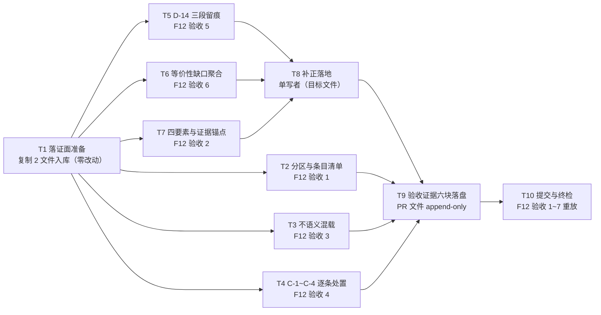

# pr-007-tasks.md — pr-007 内部任务图（执行方式差距记录 / F12）

**迭代**: 0028-role-model-binding ｜ **阶段**: 5（PR 实现）· 补位波 ｜ **PR 文件**: `prs/pr-007-execution-gap-record.md`
**worktree 分支**: `feat/0028-pr-007-execution-gap-record` ｜ **base**: **`6115f2a`**（已核：`git -C <本 worktree> merge-base HEAD iteration/0028-role-model-binding` = `6115f2a4e4ff9e0198ba9c216bcc759954107668` = 迭代分支 HEAD「merge: pr-003 一次性后端回执 into iteration/0028-role-model-binding」）
**任务总数**: **10**（T1 落证面准备 → T2~T7 六路核对（并行）→ T8 单写者补正 → T9 六块证据落盘 → T10 提交与终检）｜ **依赖图**: **无环**（见 §2）
**输入真源**: PR 文件（文件范围 2 路径 / 验收 1~8）+ `prd/F12-execution-gap-record.md`（验收 1~7、边界、MI-6）+ `prd/F11-dispatch-equivalence-criteria.md`（验收 2 的缺口三信号与 G-5 登记）+ `demand.md` §三 D-7/D-11/D-14/D-16 · §四 C-1~C-4 + `architecture.md` §4 A-02（证据载体）/ §4 A-03 第 3 拍（`truncated: true` 聚合）/ §5 D-08 + `status.md` §派发台账 + 规划期只读实测（§0.5）
**本 PR 性质**: **核对 + 补齐 + 落证**——核对 `deferred-demand-changes.md` 的「执行方式差距」分区是否满足 F12 验收 1~6，按判据做最小补正，并把核对结论写进本 PR 文件的「验收证据」小节。**零代码改动、零集群动作、零 hub 派发**（只读 `api calls get|list|transcript` 除外，契约 8）。

---

## 0. 范围、文件面与判据口径

### 0.1 本 PR 文件范围（**2 路径**；唯一可写面）

| # | 路径（相对本 worktree 根） | 动作 | 归属任务 |
|---|---|---|---|
| 1 | `docs/iterations/0028-role-model-binding/deferred-demand-changes.md` | 从**迭代工作区**复制入库（A2）+ 按补正清单做最小补齐 | **T1**、**T8** |
| 2 | `docs/iterations/0028-role-model-binding/prs/pr-007-execution-gap-record.md` | 从**迭代工作区**复制入库 + 在「验收证据」小节追加六块（append-only） | **T1**、**T9** |
| — | `prs/pr-007-execution-gap-record-tasks.md`（本文件） | 阶段 5 流程产物 | **不计入本 PR 改动面**（契约 9） |

> 只读外部输入（**不复制、不写入**）：迭代工作区的 `demand.md`（§三 D-7/D-11/D-14/D-16、§四 C-1~C-4）、`status.md`（§派发台账）、`prd/F12-*.md`、`prd/F11-*.md`、`architecture.md`；主工作区的 `oamp/**`（只读核对路径锚点）。

### 0.2 判据口径（上游原文，逐条可回溯）

| 口径 | 来源 | 本任务图的落点 |
|---|---|---|
| 三分区 + 二级标题并列；「执行方式差距」四要素（现象/差异/证据/影响） | F12 验收 1、2；D-11；MI-6（已确认） | T2、T7、T9-① ② |
| 「证据」含可复核路径/命令/`call_id`；不接受"见上文""同上"式指代 | F12 验收 2；效果#5 | T7 |
| 两类条目不语义混载；「需求变更」含"为什么判定为需求层面问题"字段 | F12 验收 3；MI-6 | T3 |
| C-1~C-4 逐条收录，或给出"不成立"理由且逐条可核对；内容以 `demand.md` §四 为准 | F12 验收 4；效果#6 | T4 |
| D-14 例外留痕：范围（只探针期）/ 时点 / 关闭状态各一条可核对表述 | F12 验收 5；D-14 原文"探针后关闭并记入差距记录" | T5 |
| 等价性缺口按 D-16 逐次（同类可聚合）收录；无缺口时以"无缺口"明确表述 | F12 验收 6；F11 验收 2（三信号）+验收 4（D-17 全阶段覆盖） | T6 |
| 不修改 `demand.md`（红线） | F12 验收 7；PR 验收 7 | T9-⑥、T8-5、T10-2 |
| 证据载体 = 承载该卡的 PR 文件「验收证据」小节 | `architecture.md` §4 A-02；§5 D-08 | T9 |
| `truncated: true` 除行内标注外，聚合到差距记录对应条目 | `architecture.md` §4 A-03 第 3 拍 | T6-2/3 |
| 边界：不要求为每条差距给出解决方案/修复计划 | F12 边界；PR 验收 8 | T8-3（补正不得引入方案） |

### 0.3 非目标（防夹带；触碰即越界 ⇒ T10-2 不通过）

- **不写**：`demand.md`（红线，且不复制进本 worktree）、`status.md`（主 agent 滚动维护）、`history.md`、`clarifications/**`、`prd/**`、`architecture.md`、`oamp/**`、`roles/**`、`cluster.json`、其它 `prs/pr-0NN-*.md`。
- **不做**：把差距改写成需求变更申请；给任意条目补解决方案/修复计划/技术选型（F12 边界）；为 F11 验收 1/3/4 做判定（那属 pr-008）；追补历史调用记录或改动 hub 存储（T6 只登记现象）；重跑阶段 2~4 的派发。
- **不改**：「需求变更」分区既有格式（PR 文件范围原文）；本 PR 文件七字段与标题；既有差距条目的证据原文（补正只增不删）。

### 0.4 本 PR 内契约（每个任务都必须遵守）

1. **执行位置**：所有命令的 cwd = 本 worktree 根（`<WT>` = `/Users/chenchiyuan/projects/agents/.pb-agents/worktrees/0028-role-model-binding/.pb-agents/worktrees/0028-pr-007-execution-gap-record`）；迭代工作区（`<WS>` = `/Users/chenchiyuan/projects/agents/.pb-agents/worktrees/0028-role-model-binding`）内的一切访问**绝对路径只读**。
2. **证据 append-only**：PR 文件「验收证据」小节保留原有括注行（`本 PR 执行时填写…`，执行时点计数须仍为 1）；七字段（上下文摘要 / 涉及功能点 / 文件范围 / 验收标准 / 参考资料 / depends_on / batch）与标题零改动。
3. **写入面恰 2 路径**（§0.1）；任何第三路径的写入即越界。
4. **`demand.md` 只读且不入 worktree**：worktree 内不存在该文件（`git diff -- demand.md` 为空属**空真**，须在证据块 ⑥ 显式声明），"未修改"的可核对证据 = 迭代工作区侧 `shasum -a 256` 前后一致。
5. **条目写入形态**：新增条目沿用 `### G-N · <标题>` 三级标题 + 四要素字段名逐字（`- **现象**` / `- **差异**` / `- **证据**` / `- **影响**`），编号续接（规划时点最大 = G-13）；聚合写入既有条目的「影响」段并沿用 `**聚合记录**：` 形态（G-5 现有写法）。
6. **证据禁指代**：任一条目的「证据」不得以"见上文""同上""本次执行记录"作为**唯一**锚点；每条至少 1 个可复核锚点（路径[含行号] / 命令原文 / `call_id` 形态 ID）。
7. **不引入技术决策**：补正文本只能取自 `demand.md` D-/C- 条款、`prd/F12`·`F11` 验收项、`architecture.md` 既有决策、`status.md` 台账既有事实、只读命令的原始输出。
8. **hub 动作白名单**：仅 `api calls get` / `api calls list` / `api calls transcript`（只读）；禁 `calls create`、`messages send`、`cluster up|down`、自建轮询或包装脚本（G-4）。
9. **提交约定**：本 PR 一次提交，信息以 `docs(0028)` 开头且含 `pr-007`；本任务图文件**不混入**该提交（独立提交或不提交，先例 `9abdba6 docs(0026): pr-001 阶段5 任务图…`）。
10. **无套件可跑**：仓库无测试套件（0026 已清零）；通过条件 = 文件内容核验 + 只读命令实跑，不得声称"测试全绿"。

### 0.5 规划期事实锚点（2026-09-16 规划时点只读实测，**dev 须以执行时点重取**）

| # | 事实 | 核实命令 / 原始输出 |
|---|---|---|
| **A1** | 本 worktree 分支 = `feat/0028-pr-007-execution-gap-record`，HEAD = base = `6115f2a`（迭代分支 HEAD，其上已有 pr-003 的一次性回执合并） | `git -C <WT> rev-parse --abbrev-ref HEAD` → `feat/0028-pr-007-execution-gap-record`；`git -C <WT> merge-base HEAD iteration/0028-role-model-binding` → `6115f2a4e4ff9e0198ba9c216bcc759954107668` |
| **A2** | 本 worktree 内 `docs/iterations/0028-role-model-binding/` **只有** `prs/pr-003-one-shot-backend-receipts.md`（tracked）⇒ 本 PR 的两文件均须从 `<WS>` 复制 | `git -C <WT> ls-files docs/iterations/0028-role-model-binding` → `docs/iterations/0028-role-model-binding/prs/pr-003-one-shot-backend-receipts.md`（唯一一行） |
| **A3** | `<WS>` 内本 PR 的两文件均为 **untracked**（G-12 现象在阶段 5 仍在场） | `git -C <WS> status --porcelain` → `?? docs/iterations/0028-role-model-binding/deferred-demand-changes.md`、`?? docs/iterations/0028-role-model-binding/prs/pr-007-execution-gap-record.md` |
| **A4** | 规划期源快照 sha256（**仅供对照，不作为执行期证据**）：目标文件 `5a166e3825eb51c616705b072eab48ea35af84bbf956048baa861ee55930162a`（23787 B / 136 行）；本 PR 文件 `cebea203660b046013eabd5abf65c8801fcdc152e9790d79547d361eee825060`（3540 B / 48 行）；`demand.md` `5df7dea2a564e85d3229d8bd15d9818e7b6b0aeb4f32b0db03c700d90eb86eb0`（10769 B）；`status.md` `e0cdaa3b161a3131e16b94ae25830f6c6709f75cdbc9e0427c42ff89dc62ef6c`；`prd/F12` `30e0829ffe4bce69a0a55150828b1362d040ba35f9122a367780d96d7148e859`；`prd/F11` `b353a0d347ea3521c85b50b442482114ba2b72f5f137a67a1a479cfa9af9010d`；`architecture.md` `f202bdcb07ff5f7567ccf90c57da8de27982e24aac60b1debb0f54f198481c56` | `shasum -a 256`（逐个） |
| **A5** | 目标文件现状 = **三分区**（`## 需求变更` / `## 执行方式差距` / `## 澄清期登记的冲突`）；「执行方式差距」= **G-1 ~ G-13**（13 条）；「澄清期登记的冲突」= **C-1 ~ C-4**；「需求变更」= **0 条**（仅一行括注） | `grep -n '^#\+ '` 输出与上列一致；全文四要素字段各 **15** 次 = 13 条 G + C-1 + C-4 |
| **A6** | 四要素覆盖：13 条 G **全部**齐备；C-1、C-4 亦含四要素；**C-2 / C-3 为交叉引用形态**（无四要素、无 `证据` 字段，指向 G-1 / G-3，处置指向 `demand.md` D-14 / D-21） | 逐条抽取字段行统计 |
| **A7** | 「证据」锚点审计：13 条 G 均有至少一个可复核锚点；唯一弱项 = **G-4** 证据段的"本次执行记录（`subprocess` + `poll()` 自建循环，随后被用户指出）"（同段另有 `oamp/sdk/cli.js:18/254`）；全文 `见上文\|同上\|不重复` 仅 1 处（C-2 的"此处不重复现象描述"） | 逐条锚点抽取脚本输出 |
| **A8** | **等价性缺口聚合严重滞后**：`status.md` §派发台账 共 **20** 行，其中 `truncated = true` **12 行**（阶段 2 ×2、阶段 3 ×1〔`architect` 超时行，终态信封不可得〕、阶段 4 ×1〔`pr-planner` 22:03〕、阶段 5 ×8〔planner ×3 / dev ×3 / verifier ×2〕）、`—`/`submitted` **5 行**、`false` **3 行**；而 G-5 的「聚合记录」**只覆盖 1 行**（`task-ad4c21ee-3bff-45ba-9b20-b2d7c1dc8edb`，21:06 阶段 2 修订轮） | 台账逐行解析（脚本输出：`true=12 submitted/无终态=5 false/其它=3`） |
| **A9** | **历史 `call_id` 在执行时点可能查不回**：规划期实测 `hub api calls get task-8e84f95f-b783-4477-8054-abf0b36f31ec` → `{"code":"NOT_FOUND","error":"call 不存在: task-8e84f95f-b783-4477-8054-abf0b36f31ec","exit_code":1,"http_status":404}`；同期 `hub api calls list` 只余 4 条（`task-05e21d21…` completed、`task-07508a08…` working、`task-b5bb2d23…` working、`task-c0acdd24…` working）⇒ 调用面只保留当前批次，**F12 验收 6 的"`call_id` 可核对"在回读面可能不成立** | `timeout 60 node /Users/chenchiyuan/projects/agents/oamp/bin/hub.js api calls get task-8e84f95f-…`；`… api calls list` |
| **A10** | 本 PR 文件「验收证据」小节现状 = **1 行括注**（`本 PR 执行时填写：「分区与条目清单」+…），为文件末行；括注计数 = 1 | 文件尾 6 行原文；`grep -c '本 PR 执行时填写'` = 1 |
| **A11** | **无套件可跑**：仓库无测试套件；F12 的通过条件 = 目标文件的条目形态与 PR 文件证据内容 | 契约 10（与 `architecture.md` §7 一致） |

---

## 1. 任务列表

### T1: 落证面准备 —— 两文件从迭代工作区复制入库（零内容改动）

- **一句话描述**：把 `<WS>/docs/iterations/0028-role-model-binding/{deferred-demand-changes.md, prs/pr-007-execution-gap-record.md}` 复制进本 worktree 的同名路径，并记录执行时点源 sha256 与复制时点。
- **验收标准**:
  1. **两文件在场且与源逐字一致**：`shasum -a 256` 于 `<WT>` 与 `<WS>` 两侧取值相等（规划期对照值见 A4；**执行时点值不等则以后者为准并在证据块登记差异**）。
  2. **快照留痕**：登记两文件的执行时点 sha256 + 字节数 + 行数（供后续分块判据与合并规程参照）。
  3. **零内容改动**：复制动作不修改任何字节；判据 = `git -C <WT> diff --no-index <WS>/… <WT>/…` 于两文件均**零输出**。
  4. **只复制这 2 条路径**：`ls <WT>/docs/iterations/0028-role-model-binding/prs/` = `pr-003-one-shot-backend-receipts.md`（tracked）+ `pr-007-execution-gap-record.md`（新增）+ 本任务图文件；未复制 `demand.md` / `status.md` / `prd/**` / `architecture.md` / 其它 `prs/pr-0NN-*.md`（契约 3、4）。
  5. **未触碰 `<WS>`**：`git -C <WS> status --porcelain` 于本任务前后逐行相同（A3 的 `??` 集合不变）。
- **前置依赖**: 无
- **优先级**: P0
- **追溯**: PR 文件「文件范围」2 路径；brief「结构事实（G-12）」执行规范；事实锚点 A1 / A2 / A3 / A4

### T2: 分区与条目清单核对（F12 验收 1 / MI-6）

- **一句话描述**：核对目标文件的二级分区与条目编号，产出「分区与条目清单」块。
- **验收标准**:
  1. **三分区并列**：`grep -n '^## '` 输出恰 3 行，逐字为 `## 需求变更` / `## 执行方式差距` / `## 澄清期登记的冲突`；三者同层级（均为 `## `）、无嵌套（不存在 `### 执行方式差距` 形态）；原始输出逐字留证（**F12 验收 1**）。
  2. **条目清点**：`grep -c '^### G-'` = G 条目数（规划期 = 13），编号连续无缺号（`G-1…G-N`）；同理清点 `^### C-` = 4（规划期）；清单逐条含 ID + 标题原文。
  3. **产出块 ①**（T9 证据块「分区与条目清单」的内容）：三分区名 + 各分区条目 ID 表 + 每条标题原文 + 一行「混载判定」（取自 T3 判据 1~3 的结论）。
  4. **不合格即登记补正项**：分区缺失、层级错误或编号跳号 ⇒ 写入补正清单（T8 输入），不得就地静默修复。
- **前置依赖**: T1
- **优先级**: P0
- **追溯**: PR 文件验收 1；`prd/F12` 验收 1；MI-6（已确认）；`architecture.md` §5 D-08（载体）

### T3: 分区不语义混载核对（F12 验收 3）

- **一句话描述**：逐条判定 G 类条目是否被写成需求变更，并核对「需求变更」分区的既有格式条款。
- **验收标准**:
  1. **G 类字段集合恰为四要素**：每条 G 的四字段各出现 1 次、无第六字段；全文 `grep -c '为什么判定为需求层面问题'` = 0（规划期实测 0）⇒ 无一条 G 携带需求变更特有字段（**F12 验收 3**）。
  2. **「需求变更」分区**：条目数 = 0 时须**明确登记为"空真"**（不得默示通过——该分区既有格式条款〔含"为什么判定为需求层面问题"字段〕在本 PR 执行时点无对照物）；条目数 > 0 时逐条核对字段齐备，缺失即登记补正项。
  3. **标题可分辨**：`G-` 前缀仅出现在「执行方式差距」分区（判据 = 前缀集合与前缀所在分区集合双射）。
  4. **预判项须给理由**（dev 以执行时点内容重判）：G-9 / G-10 / G-11 / G-12 / G-13 的「影响」段含"下迭代候选 / 下一迭代"表述，**判定为不构成混载**，理由必须写明（这些是差距条目的影响描述，字段集合仍恰为四要素、不含需求变更字段）。
  5. **补正上限**：若确判混载，补正手段只允许把该 G 条目改写回四要素形态；**不得改「需求变更」分区既有格式**（PR 文件范围原文）。
- **前置依赖**: T1
- **优先级**: P0
- **追溯**: PR 文件验收 3；`prd/F12` 验收 3；MI-6

### T4: C-1 ~ C-4 逐条核对与处置（F12 验收 4）

- **一句话描述**：逐条把澄清期冲突条目与 `demand.md` §四 对齐，给出处置表并登记补正项。
- **验收标准**:
  1. **四条在场且连续**：`grep -n '^### C-'` 输出恰 4 行（`C-1`~`C-4`），无缺号（**F12 验收 4**）。
  2. **逐条与 §四 一一对应**：C-1 默认 id 靠 fuzzy 解析 / C-2 前置验证（D-8）与真源唯一（D-5）机制互斥 / C-3 建 chat 无独立端点 / C-4 主工作区集群与迭代改动可见性错位；每条给出 §四 侧的可核对锚点（`demand.md` §四 表格行）。`demand.md` 执行时点 sha256 与 A4 不等 ⇒ 以执行时点值为准并登记。
  3. **处置表述可核对**：每条含处置（D-14 / D-21 / D-13+D-20 / "记录，不在本次迭代修"），且指向的决策/条目**存在**（判据 = 指向的 `D-` 编号在 `demand.md` §三 表内、指向的 `G-` 编号在目标文件内）。
  4. **已知形态须重判**（规划期 A6）：C-1、C-4 含四要素；C-2、C-3 为交叉引用形态（无四要素、无 `证据` 字段）。dev 须判定其是否满足"逐条可核对"；**判不合规时**补正 = 在该两条目内补一行与 `demand.md` §四 逐字对应的冲突表述 + 处置（仍不得改「需求变更」分区）。
  5. **产出块 ③**（「C-1~C-4 逐条处置」表）：C 编号 / 条目在场 / 与 §四 对应锚点 / 处置表述 / 判定（合格｜补正｜不成立 + 理由）。判定"不成立"时理由必须逐条写明（F12 验收 4 允许的分支），不得留空。
- **前置依赖**: T1
- **优先级**: P0
- **追溯**: PR 文件验收 4；`prd/F12` 验收 4；`demand.md` §四原文（事实锚点 A4 提供 `demand.md` 快照值）

### T5: D-14 例外三段留痕核对与补齐（F12 验收 5）

- **一句话描述**：核对探针期 per-call `model` 例外的**范围 / 时点 / 关闭状态**是否各有可核对表述，缺项按最小手段补齐。
- **验收标准**:
  1. **三维护各有表述且可核对**（**F12 验收 5**）：① **范围** = 例外只覆盖探针期（`demand.md` D-14 / D-15：仅 gpt 与 grok 两条常驻探针）；② **时点** = 该两条探针的发生时点，与 `status.md` §派发台账的 20:52 / 20:56 两行及其 `call_id`（`task-bfd83f28-2078-434b-8a16-eac455d2e999` / `task-39204abd-38ab-4971-b785-3eed6b0bb835`）逐条对得上；③ **关闭状态** = 例外已关闭（后续正式派发不含 `--model`，D-5 真源唯一恢复）。三条各须指明落点（条目 ID + 行号或原文片段）。
  2. **规划期预判须重判**（A5/A7）：G-1 现象段点名 D-5/D-8/D-14、证据段列两条探针 `call_id`、影响段有"已关闭的例外"一句；但**「范围 = 只探针期」与「时点」无独立可核对表述** ⇒ 预判为补正项；dev 以执行时点内容重判并把判定写进块 ④。
  3. **补正手段（若判缺）**：在「执行方式差距」分区内新增条目或补显式段落，内容只能取自 `demand.md` D-14 / D-15 / D-5 与台账既有事实；**不得推断探针关闭的具体时点**——台账无该事实时写"以两条探针为界、无独立关闭时点记录"并登记为已知留白，不得编造数值。
  4. **产出块 ④**（「D-14 三段留痕」）：维度 / 表述原文或落点 / 可核对锚点 / 判定（合格｜补正）。
- **前置依赖**: T1
- **优先级**: P0
- **追溯**: PR 文件验收 5；`prd/F12` 验收 5；`demand.md` D-14 / D-15 / D-5；`status.md` §派发台账（前两行）

### T6: 等价性缺口核对与聚合补齐（F12 验收 6 / D-16 / F11 验收 2）

- **一句话描述**：以执行时点台账为输入逐行核对缺口，把 `truncated: true` 行与"信封不可得"类按 D-16 聚合到 G-5（或新增条目），并对 G-5 的 `call_id` 做回读探针。
- **验收标准**:
  1. **G-5 在场且事实齐备**：含 `call_id` = `task-8e84f95f-b783-4477-8054-abf0b36f31ec`、`truncated: true`、`text` 3632 字符、转录拼回 7078 字符，且标明按 D-16 判定为等价性缺口（**F12 验收 6**；`prd/F11` 验收 2 已登记的 G-5）。
  2. **台账逐行核对、覆盖率 100%**：对 `status.md` §派发台账执行时点的**每一行**（规划期 20 行；A8）判定其缺口状态；凡 `truncated = true` 的行，必须在 G-5 的「聚合记录」（`architecture.md` §4 A-03 第 3 拍形态）或独立条目中有对应点（时点 + 角色 + `call_id`）；**不得抽样**。规划期基线 = 12 行 true vs G-5 现覆盖 1 行 ⇒ dev 须按执行时点台账重建聚合列表。
  3. **阶段 5 同类现象必须逐行落入**：PR 文件验收 6 原文要求"阶段 5 出现的同类现象有对应条目"；规划期阶段 5 的 true 行为 planner ×3 / dev ×3 / verifier ×2（A8），逐行可点名。
  4. **无终态行**：终态列为 `—` / `submitted` 的行（规划期 5 行），逐条 `hub api calls get <call_id>` 取执行时点终态与 `truncated`，原始输出逐字留证；**取不回者**按 `prd/F11` 验收 2 ③（`call_id` 查不回）判定并给出条目归属（同类可聚合）。
  5. **"信封不可得"类须有显式判定**：阶段 3 `architect`（`task-191d2e14-e852-412d-ab90-e6fc00092928`，终态 `failed` / `error: timeout` / 角色报告信封不可得）须有一处显式表述按 `prd/F11` 验收 2 ③ 判为等价性缺口，并给出 `call_id` 与条目落点；**不得以 G-9 的叙述代替判定**——除非明确写出"该判定 = G-9 影响段第 N 行"。
  6. **`call_id` 回读探针（必跑，不得转抄规划期输出）**：`hub api calls get task-8e84f95f-…` 的命令 + 原始输出逐字留证，结论二选一：「可复核」（输出含 `truncated: true` 与 `text` 长度）或「查不回」；后者按 `prd/F11` 验收 2 ③ 给出登记（规划期实测为 404，见 A9）。
  7. **无缺口分支**：若执行时点台账无 `true` 行且回读可用 ⇒ 以「**无缺口**」明确表述，不留空（F12 验收 6 末句）。
  8. **产出块 ⑤**（「等价性缺口条目」）：台账逐行表（时点 / 角色 / `call_id` / `truncated` / 对应条目或判定）+ 全部探针原始输出 + 判定与聚合位置。
- **前置依赖**: T1
- **优先级**: P0
- **追溯**: PR 文件验收 6；`prd/F12` 验收 6；`prd/F11` 验收 2（三信号 ①②③）与验收 4（D-17 全阶段覆盖）；`demand.md` D-16；`architecture.md` §4 A-03 第 3 拍；事实锚点 A8 / A9

### T7: 四要素与证据锚点逐条自检（F12 验收 2）

- **一句话描述**：逐条核对「执行方式差距」条目的四要素与证据锚点，抽验路径与 `call_id` 的可复核性。
- **验收标准**:
  1. **四要素齐备**：每条 G 的四字段各出现 1 次、字段名逐字（`- **现象**` / `- **差异**` / `- **证据**` / `- **影响**`）、无第六字段；产出逐条计数（规划期 13 条全通过；全文四类各 15 次 = 13 G + C-1 + C-4，A5）（**F12 验收 2**）。
  2. **证据锚点**：每条「证据」至少 1 个可复核锚点（路径含行号 / 命令原文 / `call_id` 形态 ID），且不以"见上文""同上""本次执行记录"为**唯一**锚点；逐条列出锚点集合。规划期唯一弱项 = **G-4**（A7）⇒ 预判为补正项；补正 = **增补**可复核锚点（例如 `status.md:49` 行"不自建轮询或包装脚本（G-4）"或执行记录的可核对落点），**不得删除原句**。
  3. **路径锚点抽验 ≥5 条**（原始输出留证）：含 `oamp/sdk/cli.js`（含 `:18/254`）、`oamp/src/agent.js:31-32`、`oamp/src/web.js`、`oamp/sdk/surface.js`、`src/cli.js:10`；任一条 `test -e` / `grep` 未命中 ⇒ 登记补正项（改路径或补锚点）。
  4. **`call_id` 抽验 ≥3 条**（原始输出留证）：必含 G-5 的 `task-8e84f95f-…`，另 ≥2 条取自台账现存行；404 不判本任务失败，但必须转交 T6 判据 4 / 6 处置（同一现象只在 G-5 / 对应条目登记一次，不重复建条）。
  5. **产出块 ②**（「四要素逐条自检表」）：条目 / 四要素齐备 / 证据锚点集合 / 抽验结果 / 判定（合格｜补正）。
- **前置依赖**: T1
- **优先级**: P0
- **追溯**: PR 文件验收 2；`prd/F12` 验收 2（"不接受见上文/同上式指代"）；事实锚点 A5 / A7 / A9

### T8: 补正落地（单写者；只在既有判据范围内做最小改动）

- **一句话描述**：按 T5 / T6 / T7 产出的补正清单，逐条在 `deferred-demand-changes.md` 上做最小补正。
- **验收标准**:
  1. **清单逐条落地**：每条补正附落点（条目 ID + 行号）与内容来源锚点（`demand.md` D-/C- 条款 / `prd/F12`·`F11` 验收项 / 台账行 / 只读命令原始输出）；未落地的条目须写明"判定为无需改动"的理由。
  2. **形态合规**：新增条目用 `### G-14 · …` 起续号（若 T8 判定无需新增则说明理由）；聚合写入既有条目的「影响」段并沿用 `**聚合记录**：` 形态；四要素字段名逐字（契约 5）。
  3. **最小改动 + 无新增决策**：`git diff` 逐 hunk 复核；新增文本不得出现 `architecture.md` / `demand.md` 未覆盖的技术结论，也不得为任何差距补解决方案/修复计划（F12 边界）；来源缺锚点的 hunk 必须删除或改写为纯事实陈述（契约 7）。
  4. **改动面封闭**：`git -C <WT> status --porcelain` 中 `deferred-demand-changes.md` 为 `M`，无其它非预期条目（本任务图文件另计）。
  5. **上游/下游零触碰**：`git -C <WT> diff --name-only` 不含 `demand.md`、`status.md`、`history.md`、`prd.md`、`prd/**`、`architecture.md`、`clarifications/**`、`oamp/**`、`roles/**`、`cluster.json`、其它 `prs/pr-0NN-*.md`。
  6. **既有证据不缩水**：补正后目标文件的四要素字段总计数 ≥ 补正前（规划期 15），既有条目的「证据」原文零删除（判据 = 逐条 diff 只出现新增行或段内追加）。
- **前置依赖**: T5、T6、T7（三个核对任务的结论是其唯一输入）
- **优先级**: P0
- **追溯**: PR 文件「文件范围」+ 验收 2 / 4 / 5 / 6 / 8；`prd/F12` 边界（不要求方案）；`architecture.md` §4 A-03 第 3 拍；契约 5 / 7

### T9: 「验收证据」六块落盘（append-only）

- **一句话描述**：把 T2 / T7 / T4 / T5 / T6 的结论与 `demand.md` 未改证明写入本 PR 文件的「验收证据」小节。
- **验收标准**:
  1. **六块齐备**（PR 文件「验收证据」括注原文列出的清单）：① 分区与条目清单（T2 + T3 的混载判定行）② 四要素逐条自检表（T7）③ C-1~C-4 逐条处置（T4）④ D-14 三段留痕（T5）⑤ 等价性缺口条目（T6）⑥ `git diff -- demand.md` 为空的原始输出（本任务）。判据 = 六个三级标题 + 各自内容在场。
  2. **append-only**：`grep -c '本 PR 执行时填写'` = 1（A10）；七字段与标题零改动 —— 判据 = `git -C <WT> diff` 的全部 hunk 头行号 > `## 验收证据` 小节行号（契约 2）。
  3. **块 ⑥ 内容 = 两条原始输出 + 一条哈希对照**：① `git -C <WT> diff -- docs/iterations/0028-role-model-binding/demand.md`（空输出，逐字留证）并注明"worktree 内该路径不存在 ⇒ 该空属**空真**，非可核对证据"（契约 4）；② `<WS>` 侧 `shasum -a 256 …/demand.md` 于本 PR 执行前 / 后的两次取值**相同**（基线以执行时点前值记，不得用 A4 值顶替）；③ 结论行 = "`demand.md` 零修改"（**F12 验收 7**）。
  4. **逐块可追溯**：每块首行标注其对应的 `F12 验收 N` 或 PR 文件条款；块内每条结论附其判据命令或锚点。
  5. **本任务不写目标文件**：补正已在 T8 完成；若发现遗漏 ⇒ 回到 T8 补，随后重跑本任务（不得在本任务内补写 `deferred-demand-changes.md`）。
- **前置依赖**: T8、T2、T3、T4（T5 / T6 / T7 经 T8 间接依赖）
- **优先级**: P0
- **追溯**: PR 文件「验收证据」小节原文；`architecture.md` §4 A-02 / §5 D-08（载体）；`prd/F12` 验收 7（不改 `demand.md`）；事实锚点 A10

### T10: 提交与终检（F12 验收 1~7 在提交面重放）

- **一句话描述**：把两文件的改动提交成一次提交，并在提交面重放本 PR 的验收判据与改动面封闭核验。
- **验收标准**:
  1. **提交面恰 2 路径**：`git -C <WT> show --name-only --format= HEAD` ⇒ `docs/iterations/0028-role-model-binding/deferred-demand-changes.md` + `docs/iterations/0028-role-model-binding/prs/pr-007-execution-gap-record.md`（本任务图文件若单独提交则不计入，契约 9）。
  2. **禁区零命中**：`git -C <WT> diff --name-only 6115f2a...HEAD | grep -E '^(oamp/|roles/|cluster\.json|docs/iterations/0028-role-model-binding/(demand\.md|status\.md|history\.md|prd\.md|architecture\.md|prd/|clarifications/))'` ⇒ **零输出**（`demand.md` 零命中即 F12 验收 7 的提交面判据）。
  3. **验收在提交面重放**：从 `git -C <WT> show HEAD:<路径>` 取内容后重跑 T2-1、T3-1~3、T4-1、T5-1~2、T6-1/2/8、T7-1~2 ⇒ 结论与工作区一致（`git show HEAD:<path>` 与工作区 `diff` 为空）。
  4. **提交卫生**：提交后 `git status --porcelain` 除本任务图文件外为空；信息以 `docs(0028)` 开头且含 `pr-007`，正文写明动机（"核对并补齐执行方式差距分区；D-14 三段留痕；等价性缺口按 D-16 聚合"）；未 `--amend`、未 `--no-verify`（仓库无 hook，纪律不豁免）。
  5. **零集群/零派发**：本 PR 全程未执行 `cluster up|down`、未执行 `calls create`、未执行 `messages send`、未自建轮询脚本（契约 8）；判据 = 证据块内命令清单 + `hub api calls list` 中不含本 PR 新产生的调用（只读命令不产生调用）。
  6. **验收手段声明**：无套件可跑（A11 / 契约 10）——结论以文件内容核验与只读命令实跑为准，不声称"测试全绿"。
- **前置依赖**: T9
- **优先级**: P0
- **追溯**: PR 文件验收 1~8；`prd/F12` 验收 1~7 与边界；事实锚点 A1 / A11

---

## 2. 依赖图

- **无环**（10 节点 / 12 边）：T1 单向扇出到 T2~T7；T5/T6/T7 汇入 T8；T8 → T9 → T10；T2/T3/T4 作为结论输入汇入 T9。**无回边、无互指** ⇒ 不存在循环依赖，无需上报主 agent。
- **最长依赖链**：`T1 → T6 → T8 → T9 → T10`（5 节点 / 4 边）；同长度链另有 `T1 → T5 → T8 → T9 → T10` 与 `T1 → T7 → T8 → T9 → T10`。
- **关键路径任务**：**T8**（唯一写者；三个核对任务的结论在此汇聚，改动面封闭判据也在此）、**T6**（补正量最大：12 行 true vs 现覆盖 1 行，A8）、**T9**（六块证据的全部内容在此成形）。三者共同决定本 PR 的通过与否。
- **真依赖（非叙述顺序）**：T2~T7 必须读 T1 复制后的 worktree 副本（`<WT>` 是提交面，`<WS>` 是活文档、随时可能被主 agent 更新，A3）；T8 必须后置于 T5/T6/T7（其补正清单是 T8 的唯一输入，且 T8 对 T2/T3/T4 无写动作故不构成依赖）；T9 必须后置于 T8（证据块 ①②③⑤ 分别引用 T8 定稿后的分区形态、字段计数与条目行号）；T10 必须后置于 T9（提交面重放以定稿内容为前提）。
- **并行宽度 = 6**（T2/T3/T4/T5/T6/T7 六条只读核对边，互不读取对方产物）；**写面串行**：目标文件唯一写者 = T8，PR 文件唯一写者 = T9 ⇒ 无同文件并发写冲突。
- **粒度隔离的有意设计**：T5 与 T6 拆开——两者判据来源不同（D-14 例外留痕 vs D-16 缺口聚合）、补正落点不同（例外条目 vs G-5 聚合段），合并后单个任务同时承担两套锚点核对，超出 30 分钟粒度且失败面无法区分；T2 与 T3 拆开——T2 是机械清点（行数/编号），T3 是逐条语义判定（13 条 × "是否被写成需求变更"），后者的判定成本与失败模式与前者不重叠。

---

## 3. 登记件与风险（主 agent 决策输入，非本任务图的执行项）

**① 本 PR 的实质补正量 = G-5 聚合缺口（12 行 vs 1 行）**
`status.md` §派发台账执行时点共 12 行 `truncated: true`（A8），而 G-5 的「聚合记录」只写了阶段 2 修订轮 1 行。PR 文件验收 6 只**硬性**要求"G-5 + 阶段 5 同类现象"（规划期 = 阶段 5 的 8 行），但 `prd/F11` 验收 4 的 D-17 口径是"阶段 2~6 全部角色派发"。**阶段 2~4 的 4 行（含阶段 3 `architect` 超时行）是否一并强制入库** = 口径确认项（§4-①），dev 须按主 agent 确认口径执行；未确认前按从严处理（覆盖率 100%，逐行可点名）。

**② 历史 `call_id` 的回读面可能已不可用（影响验收 6 的"可核对"读法）**
规划期实测 A9：`hub api calls get task-8e84f95f-…` → 404；`api calls list` 只剩当前批次 4 条。⇒ "`call_id` 可核对"的实际可达形态是"条目文本载明 `call_id`（可追溯）"或"回读面当时可用"，两者在执行时点可能不一致。本任务图的口径：T6-6 必跑回读探针并留原始输出，404 亦不判本 PR 失败，但须按 `prd/F11` 验收 2 ③ 给出登记（不追补 hub 存储、不改 `status.md`）。

**③ 目标文件是活文档，且与 PR worktree 副本同路径并存（G-13 在阶段 5 仍在场）**
`deferred-demand-changes.md` 在 `<WS>` 为 untracked 且由主 agent 持续追加；本 PR 在 worktree 内改动同名文件 ⇒ 合并时撞 G-13 ① 的"incoming 覆盖 untracked"面。本 PR 只负责：复制时点 sha256 留痕（T1-2）+ 只在 worktree 内改（契约 1/3）；**合并规程不在本 PR 内**（G-13 已登记，归主 agent 执行）。

**④ C-2 / C-3 的交叉引用形态是否满足"逐条可核对"** = §4-③ 口径确认项。

**⑤ G-4 证据段的弱锚点**：`本次执行记录（subprocess + poll() 自建循环，随后被用户指出）` 无路径/命令/`call_id`（A7）。T7-2 按"不得以指代作为唯一锚点"判定（该段另有 `oamp/sdk/cli.js:18/254`，故不必然失败）；补正只增不删。

**⑥ 无套件可跑**：本 PR 的验收手段 = 文件内容核验 + 只读命令实跑（A11）。

---

## 4. 口径确认项与粒度自查

**① `[model_inferred]` 项 —— 共 5 条，需主 agent 确认**

1. **缺口覆盖口径取"台账 100% 全覆盖"而非"仅 G-5 + 阶段 5"**：`prd/F12` 验收 6 字面只点名 G-5 与阶段 5 同类现象，本任务图按 `prd/F11` 验收 4（D-17 全阶段覆盖）+ D-16"逐次记录"从严，要求台账每一行 `true` 均有对应点（T6-2）。
2. **"终态信封不可得 / `call_id` 查不回"须有显式判定与条目归属**：`prd/F12` 验收 6 未单列该信号（它在 `prd/F11` 验收 2 ③），本任务图把它纳入 T6-4/5/6 的必检项。
3. **C-2 / C-3 的交叉引用形态判定口径**：`prd/F12` 验收 4 要求"逐条可核对"但未规定条目自身必须含四要素；本任务图把"是否补正"交由 dev 判定并留痕，仅规定补正上限（T4-4）。
4. **「需求变更」分区为空时的格式条款以"空真 + 显式登记"处理，不补写字段约定**：依据 = PR 文件范围的"不改「需求变更」分区既有格式"（T3-2）。
5. **G-4 弱锚点判定为"补正而非失败"**：依据 = 该条证据段同时含 `oamp/sdk/cli.js:18/254` 路径锚点；从严只补不删（T7-2）。

**② 粒度自查（10 任务全部通过；本迭代执行约束 = 单次派发 ≤30 分钟）**

| 任务 | ≤30 分钟 | 可独立验收（判据只读自身输入） | 验收标准可测试 |
|---|---|---|---|
| T1 | ✅ 复制 2 文件 + 4 条比对 | ✅ 只读两侧文件与 git 状态 | ✅ sha256 相等、`diff --no-index` 零输出 |
| T2 | ✅ 3 条 grep + 清单落字 | ✅ 只读目标文件 | ✅ 二级标题逐字、编号连续 |
| T3 | ✅ 13 条逐条判定（字段集合机械判据） | ✅ 只读目标文件 | ✅ 字段计数、前缀互斥、全文 0 命中 |
| T4 | ✅ 4 条 × 4 列核对 + 表 | ✅ 只读目标文件 + `demand.md` §四 | ✅ 条目在场、指向存在、判定列非空 |
| T5 | ✅ 3 维度核对（+ 可能的最小补正） | ✅ 只读目标文件 + 台账前两行 | ✅ 三维各有表述 + 锚点行号 |
| T6 | ✅ 20 行逐行 + ≥5 条只读 `calls get` 探针 | ✅ 只读台账 + G-5 + 只读命令 | ✅ 覆盖率 100%、探针原始输出在场 |
| T7 | ✅ 13 条字段 + 锚点集合 + ≥5 路径 / ≥3 `call_id` 抽验 | ✅ 只读目标文件 + 只读命令 | ✅ 逐条锚点集合、抽验原始输出 |
| T8 | ✅ 按清单改 1 文件（1~3 处） | ✅ 只读 diff 与清单 | ✅ hunk 来源可追溯、改动面封闭 |
| T9 | ✅ 追加六块文本 + 4 条核验 | ✅ 只读 PR 文件与 git | ✅ 六块在场、括注计数 = 1、hunk 全在末节 |
| T10 | ✅ 1 次提交 + 6 条重放 | ✅ 提交面（`HEAD`）自证 | ✅ 路径集合、禁区零命中、重放结论一致 |

- **拆分的非显然判断**：T2 vs T3（机械清点 vs 语义判定，见 §2 末）；T5 vs T6（D-14 留痕 vs D-16 聚合，锚点体系不同）；T8 单列（把"核对"与"写入"分离，使 T2~T7 全部成为只读任务，从而并行安全且失败面可区分）。
- **本任务图不含**：任何实现代码、任何对 `demand.md` / `status.md` / `history.md` / `prd/**` / `architecture.md` / `oamp/**` / `roles/**` / `cluster.json` 的修改、任何集群或派发动作。故不写 `roles/planner/data/` 决策记录（该路径亦不在本 PR 工作区边界内）。
