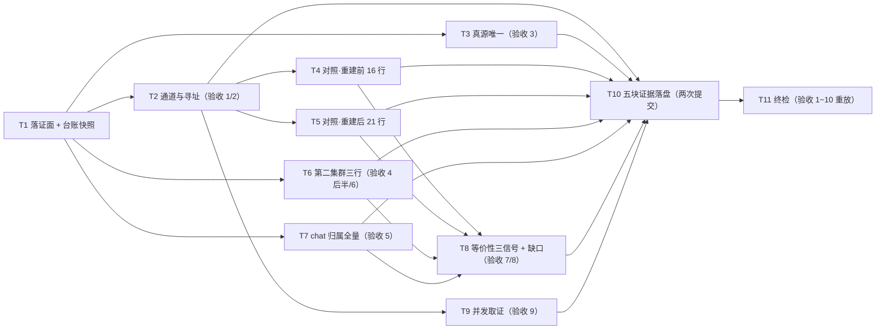

# pr-008-tasks.md — pr-008 内部任务图（全量派发契约核对 / F09·F10·F11）

**迭代**: 0028-role-model-binding ｜ **阶段**: 5（PR 实现）· 补位波 ｜ **PR 文件**: `prs/pr-008-dispatch-contract-audit.md`
**worktree 分支**: `feat/0028-pr-008-dispatch-audit` ｜ **base**: **`b8c7cf7`**（已核：`git -C <WT> merge-base HEAD iteration/0028-role-model-binding` = `b8c7cf7db92cf5e2ecf0c2f875d5ddfff1eb26de` = 迭代分支 HEAD，**已含 pr-006 合并**）⇒ **`depends_on`（pr-006）已满足**（pr-006 的 PR 文件已随迭代分支入库，本 worktree 内可读）
**任务总数**: **11**（T1 落证面与快照 → T2 通道/寻址 → T3 真源唯一 → T4/T5 台账逐行 vs 调用面（前段 16 行 / 后段 21 行）→ T6 第二集群三行 → T7 chat 归属全量 → T8 等价性三信号与缺口 → T9 并发取证 ／ T10 五块证据落盘（两次提交）→ T11 终检）｜ **依赖图**: **无环**（见 §2）
**输入真源**: PR 文件（文件范围 1 路径 / 验收 1~10 / 「验收证据」括注五块）+ `prd/F09`（验收 1~5、MI-4；验收 3 的结论被 **pr-004 验收 4** 消费）· `prd/F10`（验收 1~5；验收 2 已按 R-1 读法 (b) 收窄）· `prd/F11`（验收 1~4：三信号 / D-16 缺口 / D-18 并发 / D-17 全阶段覆盖）+ `architecture.md` §3.3（派发链）· §4 A-03（台账三拍）· §4 A-05（两库互不可见为预期）· §4 A-02（证据载体）+ `status.md` §执行方式 与 §派发台账（**核对对象**）+ `deferred-demand-changes.md` G-5 / G-9 / G-14 / G-15 / G-17 + 代码锚点（§0.6）+ 规划期只读实测（§0.5）
**本 PR 性质**: **纯只读核对 + 落证**——把阶段 2~6 的每一次角色派发按三条契约（通道/寻址/真源）、chat 归属、等价性三信号与并发取证逐条核对并落证。**零代码改动、零集群启停、零 hub 写动作（`calls create` / `messages send` / `projects create` 一律禁止）、不写 `status.md`**；唯一版本控制写入 = 本 worktree 内的本 PR 文件。

---

## 0. 范围、判据口径与执行环境事实

### 0.1 本 PR 文件范围（**1 路径**；唯一可写面）

| # | 路径 | 动作 | 归属任务 |
|---|---|---|---|
| 1 | `docs/iterations/0028-role-model-binding/prs/pr-008-dispatch-contract-audit.md` | 从**迭代工作区**复制入库（本 worktree 内不存在该文件——已核：`ls <WT>/…/prs/` = pr-001 / pr-002 / pr-003 / pr-005 / pr-006 / pr-007）+ 在「验收证据」小节追加五块（append-only，分两次落） | **T1**、**T10** |
| — | `prs/pr-008-dispatch-contract-audit-tasks.md`（本文件） | 阶段 5 流程产物（**不进本 PR 提交面**，契约 9） | — |

**只读核对对象（不得改写）**：`status.md`（§执行方式 + §派发台账；台账归主 agent，本 PR 只登记差异不留痕回写）、`deferred-demand-changes.md`（pr-007）、`history.md`、`prd/**`、`architecture.md`、`cluster.json` / `cluster.second.json`、`oamp/**`、`roles/**`、其它 `prs/pr-0NN-*.md`。

### 0.2 判据口径（上游原文，逐条可回溯）

| PR 验收 | 上游依据 | 落点 |
|---|---|---|
| 1 通道：全部角色派发逐一有 `call_id` 且 `calls get` 可读；无"实际发生但无 `call_id`" | F09 验收 1（"本地子代理不产生 `call_id`，台账覆盖全量即排除本地派发路径"） | T2 |
| 2 寻址：每条调用 `agent` = 角色名（→ `pb-<role>`），不出现 `null` | F09 验收 2 | T2 |
| 3 真源唯一：除 F02 的 2 条探针外命令不含 `--model`；逐条形态结论列明（**供 pr-004 验收 4 消费**） | F09 验收 3；`demand.md` D-05 / D-14；`status.md` §执行方式「模型真源」 | T3 |
| 4 台账可核对：七列逐行与调用面一致（`call_id` 查得回；`终态`/`实报 model`/`truncated` 与信封原文一致）；第二集群三条实报行的 `用途` 列注明"第二集群绑定实报" | F09 验收 4；F10 验收 1；`architecture.md` §4 A-03（台账三拍 / 落点与维护归主 agent） | T4、T5、T6 |
| 5 chat 归属：阶段 2~6 全部 `call_id` 落在迭代 chat；无归属其它 chat 的阶段 2~6 派发；首条调用 = 常驻探针；chat 内无需求收敛派发；`status.md` 的 `chat_id` 与之一致 | F10 验收 1 / 3 / 4 / 5；`architecture.md` §4 A-05「定位」 | T7 |
| 6 同址：pr-006 三条实报彼此同属 `chat-0028-second-cluster`；与迭代 chat **分属两库、互不可见即预期** | F10 验收 2（R-1 读法 (b) 落定）；`architecture.md` §4 A-05 | T6 |
| 7 等价性三信号：① `call_id` 可读 ② 终态信封可得（`state` ∈ {`completed`,`failed`}）③ 产出可无人工搬运连续读出且下游产物直接引用；不适用者如实标注 | F11 验收 1（D-10 三信号）；F11 验收 4（D-17 全阶段覆盖，不得豁免）；MI-5 | T8 |
| 8 缺口登记：`truncated: true` / 需两步拼接 / 终态信封不可得 三类逐次（或同类聚合）判定，并核对 pr-007 有对应条目（**G-5**） | F11 验收 2（D-16）；`architecture.md` §4 A-03 第 3 拍 | T8 |
| 9 并发取证：阶段 5 首次派发同轮 ≥2 条 `call_id` + 各自终态；两条属**不同角色节点或不同 PR** | F11 验收 3（D-18）；MI-5 | T9 |
| 10 不改 hub 调用面、不改 per-call `model` 语义；不要求宿主侧非派发动作走 hub | F09 边界；F13 验收 2 | T10-6、T11-3 |
| 「验收证据」括注五块（对照表 / 三条实报 chat 归属 / 迭代 chat 全量归属清单 / 等价性三信号与缺口清单 / 并发取证） | PR 文件「验收证据」小节原文；`architecture.md` §4 A-02 | T10 |

### 0.3 非目标（防夹带；触碰即越界 ⇒ T11-3 不通过）

- **不做**：任何写动作——`calls create` / `messages send` / `projects create` / `chats rename|close|archive|activate`（契约 2）；不启停任何集群（`cluster up|down` 零次）。
- **不做**：替主 agent 修正 `status.md`（台账七列、重复行、缺行、未终态行一律**只登记**；F09 验收 4 的形态与维护权归主 agent / `architecture.md` §4 A-03）。
- **不做**：为缺口补条目正文——`truncated: true` 等三类现象**只判定与登记**，条目正文归 **pr-007**（本 PR 不碰 `deferred-demand-changes.md`）。
- **不做**：改 hub 调用面（不加校验/开关/字段）、改 per-call `model` 语义、改 `oamp/**` / `roles/**` / `cluster*.json`。
- **不做**：以本地子代理或会话记忆代替调用面核对（契约 1：逐条实际执行 + 原始输出）；不把"排除本地派发路径"写成超出台账可枚举面的更强结论（F09 验收 1 的判据面 = 台账覆盖全量）。
- **不做**：对第二集群发起任何非只读查询（`--port 7789` 只用于 `calls list` / `calls get` / `chats get` / `agents`）。

### 0.4 本 PR 内契约（每个任务都必须遵守）

1. **路径记号**：`<WT>` = 本 worktree 根（`/Users/chenchiyuan/projects/agents/.pb-agents/worktrees/0028-role-model-binding/.pb-agents/worktrees/0028-pr-008-dispatch-audit`）；`<WS>` = 迭代工作区根（`/Users/chenchiyuan/projects/agents/.pb-agents/worktrees/0028-role-model-binding`）；`<MAIN>` = 主工作区（`/Users/chenchiyuan/projects/agents`）。hub 入口 = `node <MAIN>/oamp/bin/hub.js`（主集群）与 `node <WS>/oamp/bin/hub.js`（第二集群）。
2. **逐条实执行**：每一条判定都必须有命令 + 原始输出（`hub api calls get|list` / `hub api chats get` / `git` / `shasum` / `grep` 只读面）；**禁止**以台账文本或会话记忆代替调用面核对（brief 硬约束 1）。
3. **端口纪律**：主集群查询用缺省端口（7788）；第二集群查询**必须**带 `--port 7789`；两者不得混用（混用会让"两库互不可见"的判定失效）。
4. **只登记不修正**：台账与调用面不一致（重复行 / 未终态 / 三列不符 / 缺行）⇒ 在证据中逐条登记差异（行号 + 两个来源的原文），**不改台账**（brief 硬约束 4）。
5. **回读不确定时复探**：同一 `call_id` 在批量探针与单独探针之间出现不一致时（G-15 复核段已实测过一次）⇒ 逐条复探并**同时**记录两次原始输出；不得只留结果较好的一次。
6. **缺口不豁免**：三类现象（`truncated: true` / 两步拼接 / 终态信封不可得或 `call_id` 查不回）逐条判定并按类聚合并对照 pr-007 的条目（G-5 / G-15）；F11 验收 4 明禁以"某阶段已取证"为由豁免。
7. **证据 append-only**：PR 文件「验收证据」小节保留原括注行（执行时点计数须仍为 1）；七字段与标题零改动（hunk 全落在末节）。
8. **快照口径**：台账基线（T1）的 sha256 与行数是全部"执行时点"判定的时间锚；核对期间台账若被主 agent 改动 ⇒ 以**新快照**重取并登记两次 sha256（不符的行以最终快照为准，并在证据中注明）。
9. **分步提交点**：两次落盘两次提交——提交点 1 = 契约三表（通道/寻址、真源、对照表）；提交点 2 = 归属 / 同址 / 等价性与缺口 / 并发 / 边界声明。本任务图文件不进任何一次提交面。
10. **不引入技术决策**：新增文本只能取自 PR 文件、`prd/F09`·`F10`·`F11`、`architecture.md` §3.3/§4 A-02·A-03·A-05、`status.md` 与 `history.md` 既有记载、命令原始输出；发现上游表述与实测不一致 ⇒ 记录并上报，不自行补方案。

### 0.5 执行环境事实（供 dev 直接引用，**无需重新调研**）

| # | 事实 | 值 / 判据（规划期 2026-09-16 只读实测） |
|---|---|---|
| **E1** | **迭代 chat** = `chat-6c89902c-0a9f-4513-a299-90a7f98ae611`（主集群，缺省端口 7788）；`status.md` §执行方式 记录的 `chat_id` 与之一致（F10 验收 4 的对照物） | `status.md` §执行方式「chat_id（阶段 2~6）」 |
| **E2** | **第二集群 chat** = `chat-0028-second-cluster`（库 = `<WS>/oamp/data/sql.db`；端口 7789）；与迭代 chat **分属两库、互不可见即预期**（`architecture.md` §4 A-05） | 同左 |
| **E3** | **台账现状（快照）**：`status.md` §派发台账 共 **37 行**（表内 `task-*` 行），唯一 `call_id` **36** 个（**1 个重复**：`task-92f31d55-3789-4184-a850-a43df30e54be` 出现两行——一行 `working`、一行 `❌失败(超时)`）；`truncated = true` **26** 行、`truncated = —` **8** 行；**未终态行 2 行**（`09:06 task-92f31d55… working`、`10:12 task-8e419773… submitted`）；台账 sha256 = `9278d3ad72f3cb230ca5bbbfc43aeac6cd34decd8baf36c759626b7b57b0cbaa`；台账小节行号区间 = 57~99 | `grep -n '^## '`；逐行解析脚本 |
| **E4** | **时点分段**：**集群重建前**（20:52~23:15）**16 行**、**重建后**（08:48~10:12）**21 行**；重建后唯一 `call_id` = **20** 个 | 同 E3 的解析 |
| **E5** | **回读面实测（规划期）**——① 历史调用**查不回**：`calls get task-8e84f95f-b783-4477-8054-abf0b36f31ec` ⇒ `{"code":"NOT_FOUND","error":"call 不存在: …","exit_code":1,"http_status":404}`；`calls get task-def5a04f-85a6-42b8-8dd5-c5f261e5171a` ⇒ 同上 404；② 重建后调用**可读**：`calls get task-e595808c-e497-412d-90a2-7a2a57680144` ⇒ `{"state":"completed","duration_ms":174072,"model":"deepseek/deepseek-v4-flash","truncated":true,…}`；③ `task-92f31d55-…` 现读回 `{"state":"failed","duration_ms":2111305,"error":"timeout","model":null,"truncated":true,"text":"轮次超时（1800000ms）"}`（**注意**：G-15 登记它在早前执行时点曾为 `working`，本条说明回读面随状态演进——以**本次执行时点**取值为准） | 四条 `calls get` 原始输出 |
| **E6** | **`calls list` 条数 = 20**（主集群，缺省端口），与"重建后唯一 `call_id` = 20"**一致** | `hub api calls list` 解析 |
| **E7** | **`calls list` 不是全量枚举面**：`GET /api/calls` 只列 `from === 'web'` 的调用（`web.js:1137-1139`；CLI（`from='main'`）派发的任务不进调用面）⇒ **枚举面以台账为准**，`calls list` 只作交叉核对 | `web.js:1137-1139` 原文 |
| **E8** | **台账中不存在"第二集群绑定实报"标注行**：精确短语 `第二集群绑定实报` 在 `status.md` 中命中 **0** 次（"第二集群"仅出现在 §执行方式 chat 粒度段与 pr-005 相关的两行 `用途` 里）⇒ PR 验收 4 后半（三条实报行注明）在当前台账**不成立**，须如实登记为差异（**不替主 agent 补行**，契约 4）；三条实报的 `call_id` / `chat_id` 以 pr-006 的 PR 文件证据块为来源（本 worktree 内已可读：`prs/pr-006-second-cluster-binding-evidence.md`） | `grep -c '第二集群绑定实报' status.md` ⇒ `0` |
| **E9** | **命令形态的证据面存在**：`history.md` 有 **23** 处 `calls create` 记录（其中 **4** 行含 `--model` 字样，含探针例外与说明）；`status.md` §执行方式 明写「正式派发不带 `model`（探针专用例外已于探针完成后关闭）」；台账两条探针行的 `用途` 列逐字写明 `per-call model 例外` | `grep -c 'calls create' history.md` ⇒ `23`；`grep -c -- '--model' history.md` ⇒ `4`；`status.md` §执行方式 |
| **E10** | **并发取证的事实来源**：阶段 5 首次派发 = 22:32 同轮三条 `planner`（pr-001 / pr-002 / pr-003，**不同 PR**）⇒ 满足 MI-5 的并发形态下限；23:13~23:15 同轮三条 `verifier`、08:48 同轮两条、09:06 同轮三条亦为同类事实；台账与 `history.md` 均有记载（`status.md` 更新日志 22:32 / 22:41 / 23:13） | 台账 + `history.md` 更新日志段 |
| **E11** | **`calls get` 的语义**：`web.js:1232-1256` 走 `router.task_get`，**不按来源过滤**；信封封闭 10 键、**不含 `chat_id`**（`API.md` §3.19）；`state` 词表 ∈ {`submitted`,`working`,`completed`,`failed`} | `web.js:1232-1256`、`API.md` §3.19 |

### 0.6 代码锚点（规划期只读核对，逐条带出处）

- `oamp/src/web.js:1137-1139`：`GET /api/calls` 的 `rows = (r.tasks||[]).filter((t) => t.from === SENDER_ID)`（`SENDER_ID='web'`）⇒ E7。
- `oamp/src/web.js:1232-1256`：`GET /api/calls/:call_id` ⇒ `queryOnce(config.socketPath,'router.task_get',{task_id})`；`!task` ⇒ `404 NOT_FOUND` ⇒ E11。
- `oamp/API.md` §3.19（`:842` 起）：终态信封 10 键与 `state` 词表；`:1583` 第 ⑧ 条（信封键集合不含 usage/tokens/成本/`aborted`）；`:842` 段内两条 `state` 真源说明 ⇒ E11。
- `oamp/sdk/cli.js:25`：`--port` 为**层 A（api）专属**选项 ⇒ 本 PR 全部只读命令（层 A）都可带 `--port 7789`。

---

## 1. 任务列表

### T1: 落证面准备与台账快照（基线冻结）

- **一句话描述**：把本 PR 文件从迭代工作区复制进 worktree，并冻结台账与调用面的执行前基线。
- **验收标准**:
  1. **入库面恰 1 条**：`docs/iterations/0028-role-model-binding/prs/pr-008-dispatch-contract-audit.md` 出现在 `<WT>` 内；`git -C <WT> diff --no-index <WS>/…/pr-008-…md <WT>/…/pr-008-…md` **零输出**；源 sha256 + 字节数 + 行数记录（原括注行 `grep -c '本 PR 执行时填写'` = 1）。
  2. **台账快照**：`shasum -a 256 <WS>/docs/iterations/0028-role-model-binding/status.md` + 台账小节行号区间 + 行数（对照 E3 = 37 行 / sha256 `9278d3ad…`）；与 E3 不一致 ⇒ 以执行时点值为基线并登记差异（契约 8）。
  3. **调用面快照**：`hub api calls list`（缺省端口）条数与 `call_id` 列表（对照 E6 = 20）；`hub api calls list --port 7789` 条数（第二集群侧，供 T6 对照）。
  4. **零写入**：本任务只读；`git -C <WT> status --porcelain` 仅新增 PR 文件（+本任务图文件）；`<WS>` / `<MAIN>` 零写入。
- **前置依赖**: 无
- **优先级**: P0
- **追溯**: PR 文件「文件范围」；`architecture.md` §4 A-02（载体约定）；契约 1 / 8；事实锚点 E3 / E6

### T2: 通道与寻址核对（PR 验收 1 / 2）

- **一句话描述**：逐条核对台账全部派发都有 `call_id`、且每条调用按角色名寻址（`agent` = 角色名，非 `null`）。
- **验收标准**:
  1. **通道覆盖（PR 验收 1 / F09 验收 1）**：台账 37 行的 `call_id` 单元格逐行为空检查 ⇒ **零空值**，且形态全部匹配 `task-<uuid>`；结论写明"台账覆盖全量即排除本地派发路径"的判据（F09 验收 1 原文口径），**不**外推为更强结论。
  2. **`call_id` 可读性分类（PR 验收 1 的后半）**：对全部 **36 个唯一 `call_id`** 逐条 `hub api calls get <call_id>`（缺省端口）⇒ 输出二值分类（可读 / 404）并**逐条附原始输出**；**不在此任务判"三列一致"**（归 T4 / T5）。
  3. **寻址（PR 验收 2 / F09 验收 2）**：对**可读**行，信封 `agent` 字段必须等于台账「角色（节点）」列去掉 `pb-` 后的角色名，且**不出现 `null`**；不一致或 `null` ⇒ 逐条登记差异。对**查不回**行，写明"以台账角色列为据、回读面不可用"，不判 `null`。
  4. **枚举面口径声明**：写明枚举面 = 台账（E7：`calls list` 只列 `from==='web'`，不作为全量枚举面），并给出 `calls list` 与台账的条数交叉对照（E6：20 vs 重建后唯一 `call_id` 20）。
  5. **零写动作**：本任务全部命令为只读；对第二集群**零命令**（第二集群侧在 T6 单独核对）。
- **前置依赖**: T1
- **优先级**: P0
- **追溯**: PR 验收 1 / 2；F09 验收 1 / 2（含 MI-4）；事实锚点 E5 / E6 / E7 / E11；`web.js:1232-1256`

### T3: 真源唯一核对（PR 验收 3；结论供 pr-004 消费）

- **一句话描述**：逐条给出派发命令形态结论（是否含 `--model`），把 F02 的 2 条探针例外独立列明，其余判"不含"。
- **验收标准**:
  1. **例外识别（F09 验收 3 / D-14）**：从台账中识别 F02 的 **2 条探针**行（`用途` 列含 `per-call model 例外`：20:52 `task-bfd83f28-…`、20:56 `task-39204abd-…`）⇒ 列出其 `call_id` + 用途原文 + 实报 model 原文；**例外只此 2 条**的判据写明（`grep -c 'per-call model 例外'` 命中数 = 2）。
  2. **逐条形态结论表（PR 验收 3）**：39 条（37 台账行 + pr-006 的 3 条第二集群实报，去重后逐条）各给一列"命令形态：含 `--model` / 不含 `--model` / 不可核对（原因）"；证据面逐条点名（`history.md` 的 `calls create` 记录行号、`status.md` §执行方式「模型真源」、pr-003 / pr-005 / pr-006 证据块的命令原文、台账 `用途` 列）——**不得**以"看起来没带"作结论。
  3. **汇总结论**：除 2 条探针外**零命中** `--model` ⇒ 结论行写明"其余 N 条不含 `--model`"；出现 `/ 不可核对` 的行必须逐条给出原因与已穷尽的核对面（E9 的三个来源）。
  4. **供 pr-004 消费（PR 验收 3 原文）**：结论段显式标注"本结论被 **pr-004 验收 4** 消费"，并给出可直接引用的形态（2 条例外 + 其余不含）。
  5. **边界声明（F09 验收 5 / 边界）**：写明本条只约束"本迭代的正式派发不使用 per-call `model`"，**未**改写 per-call `model` 的既有优先级语义（其实证归 F13 验收 2 / F02 探针回执）。
- **前置依赖**: T1
- **优先级**: P0
- **追溯**: PR 验收 3 / 10；F09 验收 3 / 5 与边界；`demand.md` D-05 / D-14；`status.md` §执行方式；事实锚点 E9

### T4: 台账逐行 vs 调用面对照 · 重建前 16 行（PR 验收 4 前半）

- **一句话描述**：对 20:52~23:15 的 16 行逐条探针，登记"查不回"或三列不一致的差异。
- **验收标准**:
  1. **逐行执行**：16 行的每一个 `call_id` 逐条 `hub api calls get <call_id>`（缺省端口）⇒ 每行附**原始输出**（行号 + `call_id` + 输出）。
  2. **三列比对（对可读行）**：`终态`（`state` + 括号内耗时）/ `实报 model` / `truncated` 三列与信封 `state` / `model` / `truncated` **原文一致**（PR 验收 4）；不一致 ⇒ 登记差异（两侧原文并列），**不改台账**（契约 4）。
  3. **查不回行（预期为主）**：按 `prd/F11` 验收 2 ③ 判定为"终态信封不可得 / `call_id` 查不回"类缺口，逐条给出 `call_id` + 404 原始输出；对照 `deferred-demand-changes.md` 的 **G-15** 说明其归属（G-15 已登记该现象与"历史调用不可回读"的结论）——**不豁免**（F11 验收 4）。
  4. **复探纪律（契约 5 / G-15 复核段）**：若某行在批量探针与单独探针之间结果不一致 ⇒ 记录**两次**原始输出并注明；不得只留较好的一次。
  5. **错峰口径**：16 行的分段判据（时点 < 08:00）与行号区间写明，供 T5 无缝衔接。
- **前置依赖**: T2
- **优先级**: P0
- **追溯**: PR 验收 4 前半 / 7 ①；F09 验收 4；F11 验收 2 ③ / 验收 4；`architecture.md` §4 A-03；事实锚点 E3 / E4 / E5；`deferred-demand-changes.md` G-15

### T5: 台账逐行 vs 调用面对照 · 重建后 21 行（PR 验收 4 前半）

- **一句话描述**：对 08:48~10:12 的 21 行逐条探针并完成三列比对，含重复行与未终态行的单独处置。
- **验收标准**:
  1. **逐行执行**：21 行的每一个 `call_id` 逐条 `calls get` ⇒ 每行附原始输出（行号 + `call_id` + 输出）。
  2. **三列比对**：同上 T4-2（对可读行逐列原文一致）；不一致逐条登记。
  3. **重复行单独处置**：`task-92f31d55-3789-4184-a850-a43df30e54be` 的两行（一行 `working`、一行 `❌失败(超时)`）逐行列出，与调用面现值（E5 ③：`state=failed` / `error=timeout` / `duration_ms=2111305` / `truncated=true`）对照 ⇒ 给出"哪一行与调用面一致、哪一行已失效"的判定 + 差异登记；**不合并、不删行**。
  4. **未终态行**：执行时点仍非终态的行（E3 = 2 行：`task-92f31d55…` 的 `working` 行、`task-8e419773…` 的 `submitted` 行——后者是 pr-008 任务拆解自身的派发）逐行标注"未终态（执行时点 + 实测 `state` 原文）"，并按 F11 验收 1 ② 标注该行三信号 ② 的判定为"不适用 / 未终态"（PR 验收 7 的"如实标注"条款）。
  5. **条数交叉核对**：台账重建后行数（21）vs 唯一 `call_id`（20）vs `calls list` 条数（E6 = 20）三者对照 ⇒ 差异恰为 1 行重复，给出算式原文。
- **前置依赖**: T2
- **优先级**: P0
- **追溯**: PR 验收 4 前半 / 7 ②；F09 验收 4；F11 验收 1 ②；事实锚点 E3 / E4 / E5 / E6

### T6: 第二集群三条实报的台账行与归属核对（PR 验收 4 后半 / 6）

- **一句话描述**：从 pr-006 证据块取三条实报的 `call_id` / `chat_id`，核对台账标注与第二集群侧归属。
- **验收标准**:
  1. **数据来源**：三条实报的 `call_id` 与 `chat_id`、终态字段取自 `<WT>/docs/iterations/0028-role-model-binding/prs/pr-006-second-cluster-binding-evidence.md` 的「验收证据」小节（原文摘录，含 source 行号）。
  2. **台账标注核对（PR 验收 4 后半）**：对三条逐个在 `status.md` 台账中查找 ⇒ 给出"存在 / 不存在"判定；**当前事实（E8）= 精确短语 `第二集群绑定实报` 命中 0 次** ⇒ 如实登记差异（台账缺三行或缺 `用途` 标注），**不替主 agent 补行**（契约 4）。
  3. **第二集群侧核对（`--port 7789`）**：`node <WS>/oamp/bin/hub.js api calls list --port 7789` 与逐条 `calls get <call_id> --port 7789` ⇒ 三条的 `agent` / `state` / `model` / `truncated` 原文照录；`api chats get chat-0028-second-cluster --port 7789` ⇒ 三条 `call_id` 在 `messages[].meta.task_id` 中各命中恰一处（PR 验收 6 / F10 验收 2）。
  4. **两库互不可见的预期形态**：同一条 `call_id` 在主集群 `calls get`（缺省端口）⇒ 预期 404/不存在，与第二集群侧可读形成对照；结论写明"分属两库、互不可见即预期"（`architecture.md` §4 A-05），**不**判为缺口。
  5. **零写动作**：本任务只用 `calls list` / `calls get` / `chats get`（层 A GET）；三条实报**不重新发起**（那是 pr-006 的产物）。
- **前置依赖**: T1（`--port 7789` 侧与台账无关，但需 T1 的台账快照作对照基线）
- **优先级**: P0
- **追溯**: PR 验收 4 后半 / 6；F10 验收 2（R-1 读法 (b)）；`architecture.md` §4 A-05「定位 / 留证」；事实锚点 E2 / E8

### T7: chat 归属全量核对（PR 验收 5）

- **一句话描述**：把阶段 2~6 的全部 `call_id` 与迭代 chat 的 `messages[].meta.task_id` 集合逐条对齐，并核对首条调用、无需求收敛派发、`status.md` 的 `chat_id`。
- **验收标准**:
  1. **全量归属清单（括注块 ③）**：`node <MAIN>/oamp/bin/hub.js api chats get chat-6c89902c-0a9f-4513-a299-90a7f98ae611` ⇒ 取出 `messages[].meta.task_id` 全集；与**阶段 2~6 的全部 `call_id`**（台账 37 行 + 其唯一化后的 36 个）逐条比对 ⇒ 输出"命中 / 未命中"清单（含 `call_id` + 命中位置）；**零**未命中为通过；任一未命中 ⇒ 登记差异并列出该 `call_id` 的台账行号与用途（F10 验收 1）。
  2. **无越界归属**：清单中不存在"阶段 2~6 的 `call_id` 落在其它 chat"——判据 = 迭代 chat 的 `task_id` 集合覆盖全部台账 `call_id`（该 chat 的其它 `task_id`（若有）须逐条标注其来源与是否属阶段 2~6）。
  3. **首条调用 = 常驻探针（F10 验收 3）**：`messages[0].meta.task_id` = `task-bfd83f28-2078-434b-8a16-eac455d2e999`（gpt 常驻探针）⇒ 原文留证；不一致 ⇒ 登记差异。
  4. **无需求收敛派发（F10 验收 5 / D-6）**：该 chat 内不存在 demand 阶段的派发调用（判据 = 全量清单中不含 demand 阶段派发；台账内亦无）。
  5. **`status.md` 的 `chat_id` 一致（F10 验收 4）**：§执行方式 记录的 `chat_id` = 迭代 chat id（E1）⇒ 原文并列留证。
- **前置依赖**: T1
- **优先级**: P0
- **追溯**: PR 验收 5；F10 验收 1 / 3 / 4 / 5；`architecture.md` §4 A-05「定位」；事实锚点 E1 / E3

### T8: 等价性三信号逐条结论与缺口清单（PR 验收 7 / 8）

- **一句话描述**：逐条判定三信号并把三类缺口按类聚合对照 pr-007 的条目。
- **验收标准**:
  1. **三信号矩阵（PR 验收 7 / F11 验收 1）**：对全部派发逐条给出 ① `call_id` 可读（T2-2 / T4 / T5 的结论直接复用，不重复探针）② 终态信封可得（`state` ∈ {`completed`,`failed`}）③ 产出可无人工搬运连续读出且**下游产物直接引用**（逐条给下游产物路径，如 `demand.md` / `prd/*.md` / `architecture.md` / `prs/*.md`；`truncated: true` 的行按 `architecture.md` §4 A-03 第 3 拍注明"需两步拼接：`calls get` 信封 + `calls transcript`"）⇒ 每条信号给出"满足 / 不满足 / 不适用（附理由）"，**不适用亦须逐条标注**（F11 验收 4：不得豁免任何阶段）。
  2. **缺口三分类（PR 验收 8 / D-16）**：把不满足项归入三类 —— ① `truncated: true` ② 需两步拼接 ③ 终态信封不可得 / `call_id` 查不回；每类给出**个数 + 逐条 `call_id`**（同类可聚合为一条，但 `call_id` 必须逐条可点名）。
  3. **对照 pr-007 的记录**：三类各指出 `deferred-demand-changes.md` 中的对应条目（**① ② ⇒ G-5**；**③ ⇒ G-15**），给出条目 ID 与行号；若某类在 pr-007 中**无对应条目** ⇒ 登记为差异（正文归 pr-007，本 PR 不写该文件）。
  4. **与 pr-007 已有结论的一致性**：G-5 的聚合范围（截至提交时点）与本次清单的差异逐条列出（只列差异，不要求相等——pr-007 的执行时点早于本 PR）。
  5. **不计入判据的口径声明**：写明 F11 边界（"多轮上下文连续"不纳入等价性判据），避免把"常驻会话连续性"写进矩阵。
- **前置依赖**: T4、T5、T6、T7（三信号矩阵复用其结论）
- **优先级**: P0
- **追溯**: PR 验收 7 / 8；F11 验收 1 / 2 / 4 与边界；MI-5；`architecture.md` §4 A-03 第 3 拍；`deferred-demand-changes.md` G-5 / G-15

### T9: 并发取证落盘（PR 验收 9）

- **一句话描述**：落盘阶段 5 首次派发同轮 ≥2 条调用的 `call_id` 与各自终态，并核对其属不同角色节点或不同 PR。
- **验收标准**:
  1. **对象识别**：阶段 5 **首次**派发 = 22:32 同轮三条 `planner`（`task-d76732bb-…` / `task-ece7344d-…` / `task-b7d6686d-…`，分别对应 pr-001 / pr-002 / pr-003）⇒ 给出三条的 `call_id` + 台账行号 + 用途原文（事实来源 E10：台账 + `history.md` 更新日志）。
  2. **终态字段**：各条的 `state` / `model` / `truncated` 逐条落盘（来源：台账原文 + 可读性探针结果（T2-2）；**已确认这些行在重建前** ⇒ 若执行时点 404，则按"以台账 + `history.md` 为据、回读面不可用"标注，并给出 404 原始输出）。
  3. **并发形态下限核对（MI-5）**：三条**属不同 PR**（pr-001 / pr-002 / pr-003）⇒ 满足"不同角色节点或不同 PR"；须写明判据原文（避免用"同一角色的两次调用"充数）。若另取 23:13 三条 `verifier` 或 09:06 三条作为补充样本，须注明其**不同 PR**的对应关系。
  4. **≥2 条硬性**：落盘条目 **≥2** 条 `call_id` 且**互不相同**（PR 验收 9 的形态要求）。
  5. **落盘归属说明**：写明该取证"由主 agent 在派发时发起"（PR 验收 9 原文），本 PR 只负责落盘与核对；**不**为凑证据重新发起任何调用（契约 2）。
- **前置依赖**: T2（复用可读性结论）；T1（台账快照）
- **优先级**: P0
- **追溯**: PR 验收 9；F11 验收 3（D-18）+ MI-5；事实锚点 E10

### T10: 五块证据落盘（PR 文件 append-only；两次提交）

- **一句话描述**：把五块证据写进本 PR 文件的「验收证据」小节并分两次提交。
- **验收标准**:
  1. **五块齐备**（PR 文件括注原文逐项）：① 「台账逐行 vs 调用面对照表」（T4 + T5）② 「三条实报的 chat 归属核对输出」（T6）③ 「迭代 chat 全量 `call_id` 归属清单」（T7）④ 「等价性三信号逐条结论与缺口清单」（T8）⑤ 「并发取证的两条 `call_id` 与终态」（T9）——五块逐块在场（标题 + 内容非空）。
  2. **附加段的必要内容**：通道与寻址结论（T2-1/2/3）、真源唯一结论表（T3，含"供 pr-004 消费"标注）、边界声明（PR 验收 10：未改造 hub 调用面 / 未改 per-call `model` 语义，判据 = `git diff --name-only b8c7cf7...HEAD` 仅本 PR 文件）、差异登记汇总（契约 4：重复行 / 未终态行 / 缺三行 / 三列不符逐条）。
  3. **逐块可追溯**：每块首行标注其对应条款（`F09 验收 N` / `F10 验收 N` / `F11 验收 N` / PR 验收 N / `architecture.md` 条款）；每块内结论附判据命令或原始输出片段。
  4. **append-only**：原括注行仍在（`grep -c '本 PR 执行时填写'` = 1）；七字段与标题零改动（hunk 头行号 > 「## 验收证据」小节行号）。
  5. **零越界**：本任务不写 `status.md` / `history.md` / `deferred-demand-changes.md` / `prd/**` / `architecture.md` / `oamp/**` / `roles/**` / 其它 PR 文件（判据 = `git -C <WT> status --porcelain` 仅本 PR 文件 + 本任务图文件）。
  6. **两次提交（分步提交点）**：**提交点 1** = ① + 通道/寻址 + 真源表（信息量最大、最易返工的部分先入库）；**提交点 2** = ②③④⑤ + 边界声明 + 差异登记。每次 `git -C <WT> show --name-only --format= HEAD` ⇒ **恰 1 路径**（本 PR 文件）；信息以 `docs(0028/pr-008)` 开头，分别含 `派发契约核对` 与 `归属与等价性` 关键词；本任务图文件不进任何一次提交面（契约 9）。
- **前置依赖**: T2、T3、T4、T5、T6、T7、T8、T9（全部结论的落盘动作）
- **优先级**: P0
- **追溯**: PR 文件「验收证据」小节原文；`architecture.md` §4 A-02；契约 7 / 9；PR 验收 10

### T11: 终检（10 条验收逐条重放 + 禁区与只读核验）

- **一句话描述**：在提交面对本 PR 的 10 条验收标准逐条重放判据，核对改动面封闭与只读纪律。
- **验收标准**:
  1. **覆盖矩阵逐条有判据**：PR 验收 1~10 各给出"判据 + 结论"，其中 1 / 2 / 3 / 4 / 5 / 7 的机械判据在**提交面**（`git -C <WT> show HEAD:<路径>`）重放一次 ⇒ 与工作区结论一致。
  2. **证据块完整性**：五块 + 附加段在场；括注计数 = 1；两次提交的 hunk 均落在「验收证据」小节内。
  3. **改动面封闭（PR 验收 10 / F13 验收 2）**：`git -C <WT> diff --name-only b8c7cf7...HEAD | grep -E '^(oamp/|roles/|cluster\.json|cluster\.second\.json|docs/iterations/0028-role-model-binding/(status\.md|history\.md|demand\.md|prd\.md|architecture\.md|prd/|clarifications/|deferred-demand-changes\.md|prs/pr-00[1234567]|prs/pr-01))'` ⇒ **零输出**；`oamp/sdk/**` / `oamp/src/**` 零改动（PR 验收 10 的代码面判据）。
  4. **只读纪律自证**：列出本 PR 全程命令清单并标注性质（全部为 `calls get|list` / `chats get` / `git` / `shasum` / `grep` 只读）⇒ `calls create` / `messages send` / `projects create` / `cluster up|down` **零次**；且 `hub api calls list` 中不出现本 PR 新产生的调用（与 T1-3 快照条数对比，仅本 PR 自身任务拆解那条为在途）。
  5. **台账未被改动**：`shasum -a 256 <WS>/docs/iterations/0028-role-model-binding/status.md` 与 T1-2 基线对照 ⇒ 若主 agent 期间有更新，须说明"由主 agent 更新"且本 PR 未写入（判据 = `<WS>` 内本 PR 零文件写入）。
  6. **验收手段声明**：本 PR 无套件可跑——结论以只读命令原始输出与文件内容核验为准，不声称"测试全绿"。
- **前置依赖**: T10
- **优先级**: P0
- **追溯**: PR 文件验收 1~10 与「验收证据」；F09 / F10 / F11 验收全条；契约 2 / 9 / 10

---

## 2. 依赖图

- **无环**（11 节点 / 17 边）：T1 扇出到 T2 / T3 / T6 / T7；T2 扇出到 T4 / T5 / T9；T4 / T5 / T6 / T7 汇入 T8（三信号矩阵复用其结论）；全部结论汇入 T10（落盘）；T10 → T11。**无回边、无互指** ⇒ 不存在循环依赖，无需上报。
- **最长依赖链**：`T1 → T2 → T4 → T8 → T10 → T11`（6 节点 / 5 边）；同长度另有 `T1 → T2 → T5 → T8 → T10 → T11`。
- **关键路径任务**：**T2**（可读性分类是 T4/T5/T8/T9 的共同输入）、**T4/T5**（逐行三列一致性——PR 验收 4 的主体，且是回读面限制的承接点）、**T8**（三信号与缺口，判定面最宽）、**T10**（五块落盘 + 两次提交）。
- **真依赖（非叙述顺序）**：T4/T5/T6/T7 只有在 T1 的台账快照之后才可判"执行时点"；T8 必须后置 T4/T5/T6/T7（其 ① ② ③ 三列直接复用对照结论，避免重复探针与结论漂移）；T10 必须后置全部结论（它是纯落盘）；T11 必须后置 T10。
- **并行宽度**：T3 ∥ T6 ∥ T7（互不读对方产物，均只依赖 T1）；T4 ∥ T5 ∥ T9（同读 T2 的分类结论）。
- **串行点（写者唯一）**：本 PR 的唯一版本控制写者是 T10（PR 文件，两次提交严格前后）；其余 10 个任务**全部只读**（这是"纯只读核对 + 落证"这一性质的直接体现：11 个任务里只有 1 个写文件、0 个写运行态）。
- **粒度隔离的有意设计**：① **T4 / T5 按重建前后切分**——两段的判定性质不同（重建前预期"查不回"、重建后是真正的三列比对），且 16 / 21 行的逐条探针 + 表格各自接近 30 分钟上限；② **T2 与 T4/T5 拆开**——T2 只判"可读性与寻址"（一次性分类，供四处复用），T4/T5 判"三列一致性"（逐行比对），合并会让 T2 的分类结论被埋在表格里无法复用；③ **T3 与 T2 拆开**——真源唯一判的是"命令形态"，其证据面是 `history.md` / §执行方式 / 各 PR 证据块（**不是**调用面），与寻址判据的证据面完全不同；④ **T6 与 T7 拆开**——T6 判第二集群侧的孤立事实（含"台账缺三行"的差异），T7 判主集群迭代 chat 的全量归属，两者的核对面（`--port 7789` vs 缺省端口）与失败模式不重叠；⑤ **T9 单列**——并发取证的形态下限（不同 PR / 不同角色节点，MI-5）是独立判据，不因 T8 的等价性矩阵成立而自动满足。
- **只读性说明**：T1~T9、T11 对集群只有 `calls get|list` / `chats get` 三类只读命令（层 A GET），T10 只写本 PR 文件 ⇒ 与 PR 文件「文件范围」的"纯只读核对 + 落证"一致。

### 覆盖矩阵（PR 验收 1~10 → 任务）

| PR 验收 | 主判据任务 | 落证块 | 复判 |
|---|---|---|---|
| 1 通道（全部派发有 `call_id` 且可读；无"无 `call_id`"） | T2-1/2 | T10-②（附加段：通道结论） | T11-1 |
| 2 寻址（`agent` = 角色名、非 `null`） | T2-3 | T10-② | T11-1 |
| 3 真源唯一（除 2 条探针外不含 `--model`；形态结论供 pr-004） | T3-1/2/3/4 | T10-②（真源表） | T11-1 |
| 4 台账七列逐行与调用面一致；第二集群三行注明 | T4、T5（三列）、T6-2（标注） | T10-①、T10-②（差异汇总） | T11-1 |
| 5 chat 归属（全量落在迭代 chat；首条 = 探针；无需求收敛；`chat_id` 一致） | T7-1~5 | T10-③ | T11-1 |
| 6 同址（三条实报同属第二集群 chat；两库互不可见为预期） | T6-3/4 | T10-② | T11-1 |
| 7 等价性三信号逐条（不适用须标注） | T8-1 | T10-④ | T11-1 |
| 8 缺口三类逐次/聚合 + 对照 pr-007（G-5） | T8-2/3/4 | T10-④ | T11-1 |
| 9 并发取证（阶段 5 首次派发 ≥2 条 + 不同节点/PR） | T9-1~4 | T10-⑤ | T11-2 |
| 10 不改 hub 调用面 / 不改 per-call `model` 语义 / 不要求宿主侧非派发走 hub | T3-5、T10-2 | T10-②（边界声明） | T11-3 |

---

## 3. 风险与分步提交点

### 3.1 风险（按影响面排序）

**① 回读面的物理限制：重建前的 16 行**在规划期实测**查不回**（E5 ①②：`task-8e84f95f…`、`task-def5a04f…` 均 404），而 PR 验收 4 的字面判据含"`call_id` 查得回"。处置（T4-3 / T8-2）：逐行如实分类，查不回者按 `prd/F11` 验收 2 ③ 判为等价性缺口并对照 **G-15**；**不得**把它改写成"台账不可核对"就收口，也**不得**豁免（F11 验收 4）。该限制的解释权归主 agent / 阶段 6，本 PR 只给事实与判定。

**② 回读面在同一 `call_id` 上可能不一致（G-15 复核段已实测一次）**
同一 `task-92f31d55-…` 曾在批量探针中返回 404、紧随其后的单独探针返回 `working`；规划期实测其现值为 `failed`（E5 ③）。处置（契约 5 / T4-4）：出现不一致 ⇒ 复探并**同时**保留两次原始输出；所有判定以**执行时点**取值为准并在证据中标注时点。

**③ 台账侧的三处已实测异常（`status.md` 归主 agent，只登记不修正）**
(a) **重复行**：`task-92f31d55-…` 两行（`working` / `❌失败(超时)`）——T5-3 单独处置；(b) **未终态行 2 行**（`task-92f31d55… working`、`task-8e419773… submitted`，后者是本 PR 任务拆解自身的派发）——T5-4 标注为"未终态（执行时点）"并按 F11 验收 1 ② 记"不适用"；(c) **第二集群三条实报行缺失**：精确短语 `第二集群绑定实报` 在台账中命中 **0** 次（E8），而 PR 验收 4 要求其 `用途` 列注明 ⇒ T6-2 如实登记差异。

**④ 枚举面口径**：`GET /api/calls` 只列 `from === 'web'`（E7 / `web.js:1137-1139`）⇒ 不能当作"全部角色派发"的枚举面。处置（T2-4）：枚举面 = 台账；`calls list` 仅作交叉核对（E6：20 vs 重建后唯一 `call_id` 20）。若把 `calls list` 当枚举面，会漏掉所有 CLI 侧的派发并得出错误的"覆盖全量"结论。

**⑤ 端口纪律**：主集群用缺省端口、第二集群必须 `--port 7789`；混用会让"两库互不可见"的判定与"三条实报归属"同时失真（T6-4）。本 PR 无写动作 ⇒ 无污染风险，但**读错端口**仍会导致错误结论。

**⑥ 「执行时点」漂移**：本 PR 执行期间台账仍由主 agent 更新（例如本 PR 自身那条 10:12 的派发、以及后续 PR 的派发行）⇒ T1-2 的快照是判定的时间锚；核对期间台账变更 ⇒ 按契约 8 重取快照并登记两次 sha256。

**⑦ 只读纪律**：本 PR 唯一写面 = 本 worktree 内的本 PR 文件；`status.md` / `deferred-demand-changes.md` / `history.md` / `oamp/**` / `roles/**` 零写入（T11-3/5 的判据）。

### 3.2 分步提交点

| 提交点 | 时点 | 内容 | 依据 / 价值 |
|---|---|---|---|
| **提交点 1** | T10 前半（对照表完成之后） | ① 台账逐行 vs 调用面对照表（T4 + T5）+ 通道与寻址结论（T2）+ 真源唯一表（T3，含"供 pr-004 消费"） | 信息量最大、最易返工的部分先入库：PR 验收 1 / 2 / 3 / 4 的证据在库，返工成本被限制在"表格修订"这一层 |
| **提交点 2** | T10 后半（归属 / 等价性 / 并发完成后） | ② 三条实报 chat 归属输出 ③ 迭代 chat 全量归属清单 ④ 等价性三信号与缺口清单 ⑤ 并发取证的 `call_id` 与终态 + 边界声明 + 差异登记汇总 | PR 验收 5~10 的证据齐备；此时 `git status` 干净（除本任务图文件） |

两次提交均只含本 PR 文件（契约 9）；提交信息分别为 `docs(0028/pr-008): 派发契约核对——台账逐行 vs 调用面 + 真源唯一` 与 `docs(0028/pr-008): 归属与等价性——chat 全量归属 + 三信号与缺口 + 并发取证`（句式随仓库先例，前缀与关键词为硬性）。

---

## 4. 口径确认项与粒度自查

**① `[model_inferred]` 项 —— 共 4 条，需主 agent 确认**

1. **PR 验收 4 在"查不回"行上的落地读法**：字面写"`call_id` 查得回、三列与信封原文一致"，但重建前的 16 行物理上查不回（E5）。本任务图取"逐行给出可读性分类 + 对可读行做三列比对 + 对查不回行按 F11 验收 2 ③ 登记（对照 G-15）"（T4-1/2/3、T5-1/2），**不**把"查不回"等同"验收不通过"由本 PR 裁断（那是阶段 6 / 主 agent 的判定面）。
2. **第二集群三条实报行的核对来源**：台账缺该三行（E8）⇒ T6-1 取 pr-006 的 PR 文件证据块为 `call_id` / `chat_id` 来源（`architecture.md` §4 A-05 第 2 条正是约定该落点）。
3. **T9 并发取证的样本选择**：取 22:32 同轮三条 `planner`（pr-001 / pr-002 / pr-003，不同 PR）为**主样本**（阶段 5 **首次**派发，直击 F11 验收 3 的字面），23:13 / 08:48 / 09:06 的同轮样本为可选补充。
4. **提交点次数与提交信息句式**：两次提交、`docs(0028/pr-008)` 前缀（依仓库先例与本迭代既有 PR 的提交句式）。

**② 粒度自查（11 任务全部通过；执行约束 = 节点侧单次执行 ≤30 分钟）**

| 任务 | ≤30 分钟 | 可独立验收（判据只读自身输入） | 验收标准可测试 |
|---|---|---|---|
| T1 | ✅ 1 次复制 + 4 条快照命令 | ✅ 只读，无前置 | ✅ `diff --no-index` 零输出、sha256/行数对照 |
| T2 | ✅ 36 条只读探针 + 分类表 | ✅ 只读台账与调用面 | ✅ 零空 `call_id`、可读/404 二值、`agent` 名逐条对上 |
| T3 | ✅ 39 行形态表（3 个证据面） | ✅ 只读 `history.md` / `status.md` / PR 证据块 | ✅ 例外恰 2 条、其余零命中、不可核对逐条给原因 |
| T4 | ✅ 16 条探针 + 三列比对 | ✅ 只读调用面 | ✅ 每行原始输出、三列原文一致或差异登记 |
| T5 | ✅ 21 条探针 + 重复/未终态处置 | ✅ 只读调用面 | ✅ 同上 + 重复行判定 + 三条数算式 |
| T6 | ✅ 3+1 条 `--port 7789` 只读命令 | ✅ 只读 pr-006 证据块与台账 | ✅ 命中/不命中判定 + 两条路径对照 |
| T7 | ✅ 1 条 `chats get` + 集合比对 | ✅ 只读迭代 chat | ✅ 未命中数 = 0、首条 `task_id` 逐字 |
| T8 | ✅ 矩阵汇总（复用 T4/T5/T6/T7 结论，无新探针） | ✅ 只读既有结论与 `deferred-demand-changes.md` | ✅ 每条三信号判定 + 三类缺口 `call_id` 逐条可点名 |
| T9 | ✅ 台账 + `history.md` 取数 + 少量探针 | ✅ 只读 | ✅ ≥2 条互异 `call_id` + 不同 PR 判据 |
| T10 | ✅ 五块文本落盘 + 2 次提交 | ✅ 只读 PR 文件与 git | ✅ 五块在场、括注计数 = 1、提交面恰 1 路径 |
| T11 | ✅ 10 条重放 + 4 条核验 | ✅ 提交面自证 | ✅ 覆盖矩阵 10/10、禁区零输出、写动作零次 |

- **拆分的非显然判断**：T4 / T5 按重建前后切分（判定性质不同 + 各占 16 / 21 行探针）；T2 与 T4/T5 拆开（分类结论被四处复用，不宜埋在表格里）；T3 与 T2 拆开（证据面不同：`history.md` 等文本面 vs 调用面）；T6 与 T7 拆开（核对面与端口不同）；T9 单列（形态下限是独立判据）。理由详见 §2 末。
- **本任务图不含**：任何代码 / 配置 / 迭代文档的改动、任何集群启停、任何 hub 写动作（`calls create` / `messages send` / `projects create`）、任何对台账的修正。故不写 `roles/planner/data/` 决策记录（该路径亦不在本 PR 工作区边界内）。
