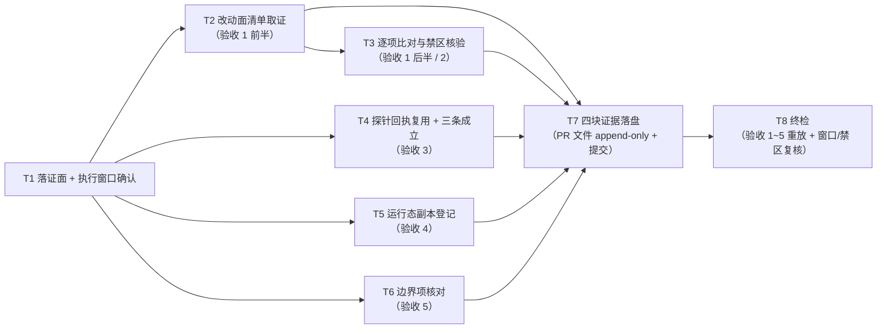

# pr-009-tasks.md — pr-009 内部任务图（既有面零改动与既有语义保持 / F13）

**迭代**: 0028-role-model-binding ｜ **阶段**: 5（PR 实现）· 补位波 ｜ **PR 文件**: `prs/pr-009-existing-surface-freeze.md`
**worktree 分支**: `feat/0028-pr-009-surface-freeze` ｜ **base**: **`46b9dcf`**（已核：`git -C <WT> merge-base HEAD iteration/0028-role-model-binding` = `46b9dcf1b67aedf126b67ab539fada1aa69f5a96` = 迭代分支 HEAD「merge: pr-004 常驻后端探针回执(F02) into iteration/0028-role-model-binding」）⇒ **两个 `depends_on` 均已满足**（pr-002 的 `cluster.json` 两处 `model` 与 pr-004 的两条探针回执都已随迭代分支入库，本 worktree 内可读）
**任务总数**: **8**（T1 落证面与执行窗口确认 → T2 改动面清单取证 → T3 逐项比对与禁区核验 ／ T4 探针回执复用与三条成立条件 ／ T5 运行态副本登记 ／ T6 边界项核对 → T7 四块证据落盘 → T8 终检）｜ **依赖图**: **无环**（见 §2）
**输入真源**: PR 文件（文件范围 1 路径 / 验收 1~5 / 「验收证据」括注四块）+ `prd/F13-existing-surface-unchanged.md`（验收 1~2、边界）+ `architecture.md` §6 边界（`cluster.second.json` 的登记与"不新增"清单）· §7③（内部冲突检查：`--model` 只出现在 F02 两条探针命令里）· §7⑤（可推翻性与回退路径）· §4 A-02（证据载体）+ `demand.md` §不做什么（第 5 条 per-call `model` 语义不改 / 不清理 0027 现场）· §大概怎么做 + `status.md` §派发台账（两条探针行的实报 `model` 原文）+ `deferred-demand-changes.md` C-1 + **已合并的 pr-004 产物**（`prs/pr-004-resident-backend-probes.md` 的两条探针回执）+ 代码锚点（§0.6）
**本 PR 性质**: **纯只读核对 + 落证**——核对"迭代分支相对 main 的改动面只含 `cluster.json` 与迭代产物"，并复用 pr-004 的两条探针回执证明 per-call `model` 的既有优先级语义未被改写。**零代码/配置改动、零集群启停、零 hub 写动作、不删运行态副本**；唯一版本控制写入 = 本 worktree 内的本 PR 文件。

---

## 0. 范围、判据口径与执行窗口

### 0.1 本 PR 文件范围（**1 路径**；唯一可写面）

| # | 路径 | 动作 | 归属任务 |
|---|---|---|---|
| 1 | `docs/iterations/0028-role-model-binding/prs/pr-009-existing-surface-freeze.md` | 从**迭代工作区**复制入库（本 worktree 内不存在该文件——已核：`ls <WT>/…/prs/` = pr-001 / pr-002 / pr-003 / pr-004 / pr-005 / pr-006 / pr-007 / pr-008，**无 pr-009**）+ 在「验收证据」小节追加四块（append-only） | **T1**、**T7** |
| — | `prs/pr-009-existing-surface-freeze-tasks.md`（本文件） | 阶段 5 流程产物（**不进本 PR 提交面**，契约 8） | — |

**只读核对对象（不得改写）**：`cluster.json`（pr-002 的产物）、`cluster.second.json`（**运行态副本，第二集群仍在用**）、`status.md`（主 agent 滚动维护）、`deferred-demand-changes.md`（pr-007）、`oamp/**`、`roles/**`、`prs/pr-004-*.md`（**消费其回执**）、`<MAIN>/cluster.json`（事实面）。

### 0.2 判据口径（上游原文，逐条可回溯）

| PR 验收 | 上游依据 | 落点 |
|---|---|---|
| 1 改动面清单 ⊆ {`cluster.json`, `docs/iterations/0028-role-model-binding/**`}；不含 `oamp/src|web|bin|sdk`、`oamp/README.md`、`oamp/API.md`、`roles/**`（逐项比对、输出原文照录） | F13 验收 1；`architecture.md` §6「不新增」清单 | T2、T3 |
| 2 不新增接口 / 字段 / 参数（判据 = 验收 1 的清单不含 `oamp/**`；**不另立重复条款**） | F13 验收 1 后半（原文：新增面必然要求改 `oamp/**`） | T3-3 |
| 3 per-call `model` 既有优先级语义保持：三条同时成立（① 派发携带 `--model` ② 目标角色在当前集群配置中**无** `model` 绑定 ③ 实报 `model` 与请求值解析到同一后端）；**证据复用 pr-004 的两条常驻探针回执，本卡不重复取证** | F13 验收 2；`prd/F02` 验收 1（六字段形态）；MI-3（判定 = 同一后端） | T4 |
| 4 运行态副本登记：`<WS>/cluster.second.json` 的 untracked 性质 + **回退路径**（若阶段 6 取 `git status` 口径 ⇒ 取证后删除副本、其逐字内容只留在 PR 证据里）+ 不进入验收 1 的 `git diff` 判据面 | PR 验收 4；`architecture.md` §6（副本登记）· §7⑤（可推翻性与回退） | T5 |
| 5 不清理 0027 迭代现场；不修复无关既有缺陷（C-1 只记录）；不新增测试 / CI / hook / 依赖 | PR 验收 5；F13 边界；`demand.md` §不做什么（不清理 0027 现场） | T6 |
| 「验收证据」括注四块（diff 原始输出 / 逐项比对表 / 复用的探针回执引用 / 副本登记） | PR 文件「验收证据」小节原文；`architecture.md` §4 A-02 | T7 |

### 0.3 非目标（防夹带；触碰即越界 ⇒ T8-4 不通过）

- **不做**（最高优先）：**删除运行态副本 `cluster.second.json`** 或停第二集群——第二集群（`oamp-cluster-0028`）仍在运行，副本是其正在使用的配置；本 PR 只登记其性质与**回退路径**（回退动作由阶段 6 / 主 agent 决定，不在本 PR）。
- **不做**：任何写动作——`calls create` / `messages send` / `projects create` / `cluster up|down`（契约 1）；不改 `cluster.json`（含把它与副本对齐）与 `oamp/**` / `roles/**`。
- **不做**：改 `status.md` / `deferred-demand-changes.md` / `history.md` / `prd/**` / `architecture.md`；不改台账两条探针行的「用途」列（**如实转记**其字面缺口，见 §3-③）。
- **不做**：清理 0027 现场（worktree / 分支原样保留）；修复与本迭代无关的既有缺陷（C-1 只记录）；新增测试 / CI / git hook / 第三方依赖。
- **不做**：重新取证探针（F13 验收 2 明写"证据复用 F02 的两条常驻探针回执，本卡不重复取证"）；不重复 F09/F11 的派发契约核对（pr-008）。
- **不做**：把"既有面零改动"扩写成"任何文件都不许动"（F13 边界原文：`cluster.json` 与迭代产物是本迭代的正当改动面）。

### 0.4 本 PR 内契约（每个任务都必须遵守）

1. **纯只读 + 单写面**：除本 PR 文件外零写入；`calls create` / `messages send` / `projects create` / `cluster up|down` **零次**；不删副本、不停集群。
2. **判据命令逐字执行 + 原文照录**：`git diff --name-only main...iteration/0028-role-model-binding` 必须**逐字**执行并**原文**进入证据，**不得**以"结论/摘要/行数"代替输出（PR 硬约束 2）。
3. **证据形态可复制执行**：交付给读者的每条命令可直接粘贴执行——无未绑定占位符、无以中文散文充当管道阶段、无手工归纳代替输出（本迭代已两次因形态判 FAIL：pr-006）；对**历史事实登记**类内容（如副本的逐字内容）须单独标注为登记面。
4. **执行窗口纪律（硬约束）**：判据 `main...iteration/…` 依赖两分支可比 ⇒ 本 PR 必须在「全部 PR 已合入迭代分支之后、迭代分支合入 main 之前」执行。T1 做窗口确认，**窗口已过（迭代分支已删/已合入）⇒ 立即停止并上报主 agent**，不得改换判据面充数；并落**可复现加固**（T2-3：同时记录两个分支 SHA 并给出 SHA 形式的等价命令）。
5. **活文档不漂移**：`status.md` / `deferred-demand-changes.md` 由主 agent 滚动维护；引用它们的行号/内容前先取快照（sha256 + 行号），执行时点与快照不一致 ⇒ 以执行时点为值并登记差异（**不得改写它们**）。
6. **append-only**：PR 文件「验收证据」小节保留原括注行（执行时点计数须仍为 1）；七字段与标题零改动（hunk 全落在末节）。
7. **不引入技术决策**：新增文本只能取自 PR 文件、`prd/F13`、`architecture.md` §6/§7③⑤/§4 A-02、`demand.md` 相关段、`status.md` 台账、`prs/pr-004-*.md` 回执、只读命令原始输出；发现上游表述与实测不一致 ⇒ 记录并上报。
8. **本任务图不进提交面**：提交面恰 1 路径（本 PR 文件），不得含 `pr-009-existing-surface-freeze-tasks.md`。

### 0.5 执行环境事实（供 dev 直接引用，**无需重新调研**）

| # | 事实 | 值 / 判据（规划期 2026-09-16 只读实测） |
|---|---|---|
| **E1** | **执行窗口**：本 PR 必须在「全部 PR 已合入迭代分支之后、迭代分支合入 main 之前」执行；判据 = `git -C <WT> rev-parse main iteration/0028-role-model-binding` 两个 SHA 均可解析、且 `main...iteration/…` 有差异 | PR 文件「上下文摘要」原文（窗口依赖） |
| **E2** | **分支现状**：迭代分支 HEAD = `46b9dcf`（= 本 worktree 的 base）「merge: pr-004 常驻后端探针回执(F02) into iteration/0028-role-model-binding」；其下依次 `1cfd97b`（pr-004 的提交）、`b61092a`（merge: pr-008 …）⇒ 已含 **8 个 PR 的合并**（pr-001 / 002 / 003 / 004 / 005 / 006 / 007 / 008）；**本 PR 之前已无未合并的代码/配置 PR**（pr-010 为收口后实证，不在本卡判据内） | `git -C <WS> log --oneline -3 iteration/0028-role-model-binding` |
| **E3** | **改动面清单现状（规划期实测）**：`git diff --name-only main...iteration/0028-role-model-binding` ⇒ **32 路径** = `cluster.json` 1 条 + `docs/iterations/0028-role-model-binding/**` 31 条（含 `demand.md` / `prd.md` / `prd/F01~F13` / `prs/pr-001~pr-008` / `architecture.md` / `status.md` / `history.md` / `deferred-demand-changes.md` / `clarifications/round-1~4`）；**`^(oamp/\|roles/)` 命中 0** | 两条 grep 命令（T2 / T3 逐字重跑） |
| **E4** | **SHA 形式与符号形式等价**（可复现加固）：`git diff --name-only "$(git rev-parse main)" "$(git rev-parse iteration/…)"` 亦得 **32 行**，与符号形式输出一致 | 两条命令的 `wc -l` 对照（T2-3 复核） |
| **E5** | **per-call `model` 的绑定前提（验收 3 的条件 ②）**：`git -C <WS> show main:cluster.json \| grep -c '"model"'` ⇒ **0**；且 `git diff main...iteration -- cluster.json` **恰两处新增**（`dev` 段 `+      "model": "openai/gpt-5.6-luna",`；`verifier` 段 `-    "verifier": {},` → `+    "verifier": { "model": "powerby/grok-4.6" },`）⇒ 探针时点（20:52 / 20:56）目标集群配置中**无** `model` 绑定，绑定是迭代分支上的新增 | `git show` / `git diff` 原文 |
| **E6** | **两条探针回执已在库（验收 3 的证据来源）**：`<WT>/docs/iterations/0028-role-model-binding/prs/pr-004-resident-backend-probes.md` 的「验收证据」小节含两条回执（六字段 `派发命令` / `call_id` / `终态字段` / `chat_id` / `时点` / `耗时`）；两条 `call_id` = `task-bfd83f28-2078-434b-8a16-eac455d2e999`（`pb-dev`，实报 `openai/gpt-5.6-luna`）/ `task-39204abd-38ab-4971-b785-3eed6b0bb835`（`pb-verifier`，实报 `powerby/grok-4.6`） | 该文件（本 worktree 内已可读） |
| **E7** | **回执的效力边界（必须随引用转记）**：pr-004 的 `派发命令` 为**按登记面重建**（原文未留存；两条信封不可达，与 G-15 同类）；`终态字段` / `耗时` 来自台账登记面 | pr-004 回执的边界段（引用时一并摘录） |
| **E8** | **运行态副本现状（验收 4）**：`<WS>/cluster.second.json` **存在**（518 B，sha256 = `52e971ad5a204de3cce73fc616941f2baf771530f9c8b9145f021a252c207fe9`）；内容 = 工作区根 `cluster.json`（sha256 = `4d8e476a05e48f4ad428d87810b6bd8dbf6bb4e7a297c0a63b84515c20743bd0`）的副本 + **三键差异**：`session` = `oamp-cluster-0028`、`web.port` = `7789`、`router.socket` = `/tmp/oamp-0028-router.sock`（G-17 方案 A）；`git -C <WS> status --porcelain` 中呈 `?? cluster.second.json`；`git diff --name-only main...iteration \| grep -c 'cluster.second.json'` ⇒ **0** | `ls -l` / `shasum` / `cat` / 两条 git 命令 |
| **E9** | **0027 现场保留（验收 5）**：`git worktree list` 含 `…/0027-pr-planner-wave-cap`（`a059c0b [iteration/0027-pr-planner-wave-cap]`）与其下的 `0027-pr-001-critical-path-constraint-and-gate-migration`（`d134abc`）；`git branch --list '*0027*'` 两条均在 | `git worktree list` / `git branch --list` 原文 |
| **E10** | **无套件 / 无新资产可跑**：本 PR 的通过条件 = 只读 git 命令原始输出 + 文件内容核验；改动面清单中 `test|spec|.github|.githooks|package.json` 类路径 **命中 0** | `grep -Eic` 判据 ⇒ `0`；`architecture.md` §6「不新增」清单 |

### 0.6 工具锚点（规划期只读核对，逐条带出处）

- 判据命令面：`git -C <WS> diff --name-only main...iteration/0028-role-model-binding`（**必须在 `<WS>` 内执行**——分支 `iteration/0028-role-model-binding` 在工作区 `<WS>` 中可解析；本 worktree `<WT>` 亦可解析同名分支，但为与 PR 文件一致建议在 `<WS>` 执行并注明 cwd）。
- `git -C <WS> rev-parse main iteration/0028-role-model-binding`（E1/E4 的 SHA）；`git -C <WS> log --oneline -3 iteration/…`（E2）。
- `git -C <WS> show main:cluster.json | grep -c '"model"'`、`git -C <WS> diff main...iteration -- cluster.json`（E5）。
- `status.md` §派发台账第 62/63 行（两条探针的实报 `model` 原文）；`prs/pr-004-resident-backend-probes.md` 的两条回执（E6/E7）。
- `oamp/src/cluster.js:200-201`（`if (entry.model !== undefined) argv.push('--model', entry.model);`——角色级 `model` 的追加点，佐证"配置无绑定 ⇒ 实报只能来自 per-call 参数"）；`oamp/README.md` §集群（`model` 解析链与优先级，`prd.md` 已更正引用位置）。
- `architecture.md` §7③（`--model` 只出现在 F02 的两条探针命令里）、§7⑤（可推翻性与回退路径原文）。

---

## 1. 任务列表

### T1: 落证面准备与执行窗口确认（含快照冻结）

- **一句话描述**：复制本 PR 文件进 worktree，并确认"两分支可比"的执行窗口仍然敞开，冻结全部引用的快照。
- **验收标准**:
  1. **入库面恰 1 条**：`docs/iterations/0028-role-model-binding/prs/pr-009-existing-surface-freeze.md` 出现在 `<WT>` 内；`git -C <WT> diff --no-index <WS>/…/pr-009-…md <WT>/…/pr-009-…md` **零输出**；源 sha256 + 字节数 + 行数记录；`grep -c '本 PR 执行时填写'` = 1。
  2. **窗口确认（契约 4）**：`git -C <WS> rev-parse main iteration/0028-role-model-binding` 两个 SHA 均可解析，且 `git -C <WS> diff --name-only main...iteration/… | wc -l` > 0 ⇒ 窗口敞开；**若任一分支不可解析或差异为空 ⇒ 立即停止并上报主 agent**（窗口已过，判据不可复现），不得改判据面。
  3. **快照冻结**：记录 ① 两个分支的 SHA（`main` = ?、`iteration` = ?，对照 E2 = `46b9dcf`）；② `git -C <WS> log --oneline -1 iteration/…` 原文（证明已含 8 个 PR 合并）；③ `status.md` 与 `deferred-demand-changes.md` 的 sha256 + 台账两条探针行的行号（对照 E6/契约 5）；④ `prs/pr-004-resident-backend-probes.md` 在 `<WT>` 内的 sha256。
  4. **零写入**：本任务只读；`git -C <WT> status --porcelain` 仅新增 PR 文件（+本任务图文件）；`<WS>` / `<MAIN>` 零写入。
- **前置依赖**: 无
- **优先级**: P0
- **追溯**: PR 文件「上下文摘要」（窗口依赖）+「文件范围」；`architecture.md` §4 A-02（载体）；契约 4 / 5；事实锚点 E1 / E2 / E6

### T2: 改动面清单取证（PR 验收 1 前半）

- **一句话描述**：逐字执行判据命令并把 32 行路径清单原文照录，附 SHA 形式的可复现加固。
- **验收标准**:
  1. **逐字执行 + 原文照录（契约 2 / PR 硬约束 2）**：`git -C <WS> diff --name-only main...iteration/0028-role-model-binding` 的**完整输出原文**进入证据（不得截断、不得以"共 32 行"代替）；同时给出 `| wc -l` 的行数。
  2. **清单构成分类**：把清单分为两组并给出计数 —— A 组 = `cluster.json`（**恰 1 条**）；B 组 = `docs/iterations/0028-role-model-binding/**`（其余全部，计数与 `wc -l` 相符：A + B = 总行数）；判据 = 无第三组。
  3. **可复现加固（契约 4）**：记录 `git -C <WS> rev-parse main` 与 `… iteration/…` 两个 SHA，并**逐字执行** SHA 形式的等价命令 `git -C <WS> diff --name-only <mainSHA> <iterSHA>` ⇒ 其输出与符号形式**逐行 diff 零差异**（对照 E4：两者均为 32 行）；给出该 `diff` 命令与原样输出（空 = 一致）。价值：分支删除后判据仍可复现。
  4. **cwd 声明**：命令原文中写明执行位置（`<WS>`）与执行时点，避免"换个 worktree 结果相同"的隐含假设。
- **前置依赖**: T1
- **优先级**: P0
- **追溯**: PR 验收 1 前半；F13 验收 1；契约 2 / 4；事实锚点 E3 / E4

### T3: 逐项比对与禁区核验（PR 验收 1 后半 / 2）

- **一句话描述**：对禁区路径逐项核验零命中，并给出"不新增接口/字段/参数"的推论链。
- **验收标准**:
  1. **逐项比对表（PR 验收 1 / F13 验收 1）**：对以下每一项给出"命中数 + 判据命令原文"：`^oamp/src/`、`^oamp/web/`、`^oamp/bin/`、`^oamp/sdk/`、`^oamp/README\.md`、`^oamp/API\.md`、`^roles/` ⇒ **全部为 `0`**（或给出一次性的 `grep -Ec '^(oamp/|roles/)'` 判据 ⇒ `0`，并说明该一条等价覆盖上述七项）。
  2. **正向比对**：清单中每条路径都落在 {`cluster.json`} ∪ {`docs/iterations/0028-role-model-binding/**`} 内——判据 = 反向 `grep -Evc` 为 `0`（给出命令与输出）。
  3. **不新增接口 / 字段 / 参数（PR 验收 2）**：给出推论链原文 —— "新增端点/参数/字段必然要求改 `oamp/**`；清单不含 `oamp/**` ⇒ 不新增接口/字段/参数"；并**注明本项不另立重复条款**（F13 验收 1 后半原文）。
  4. **配置字段集合的边界（`architecture.md` §6「不新增」原文）**：说明 `cluster.json` 的两处改动**只使用既有字段** `roles.<role>.model`（非新增字段）——判据 = `git -C <WS> diff main...iteration -- cluster.json` 原文（两处新增行的字段名 = `model`）。
  5. **零越界**：本任务不写任何文件；`PR 验收 1` 的清单本身即"禁区零命中"的判据面，无需另跑与结论无关的命令。
- **前置依赖**: T2
- **优先级**: P0
- **追溯**: PR 验收 1 后半 / 2；F13 验收 1；`architecture.md` §6；事实锚点 E3 / E5

### T4: 探针回执复用与三条成立条件核对（PR 验收 3）

- **一句话描述**：引用 pr-004 的两条探针回执，逐条核对"携带 `--model` / 无角色级绑定 / 实报与请求同后端"三条件。
- **验收标准**:
  1. **条件 ① 派发携带 `--model`**：引用 `prs/pr-004-resident-backend-probes.md` 两条回执的 `派发命令` 字段原文（含 `--model openai/gpt-5.6-luna` / `--model powerby/grok-4.6`），并**随引用转记其效力边界**（E7：该形为按登记面重建、原文未留存）；标注"证据复用、本卡不重复取证"（F13 验收 2 原文）。
  2. **条件 ② 目标角色在当前集群配置中无 `model` 绑定**：给出三条判据原文 —— ⓐ `git -C <WS> show main:cluster.json | grep -c '"model"'` ⇒ `0`（探针时点的配置）；ⓑ `git -C <WS> diff main...iteration -- cluster.json` 原文 ⇒ 两处 `model` 是**迭代分支新增**（E5），即探针时点上不存在角色级绑定；ⓒ `<MAIN>/cluster.json` 现文 `grep -c '"model"'` ⇒ `0`（旁证：绑定从未落到主集群配置）。三条并列，注明各自为"当时配置"的判据。
  3. **条件 ③ 实报 `model` 与请求值解析到同一后端**：两条各给一行对照（请求值来自条件 ① 的 `派发命令`；实报值来自 `status.md:62,63` 的台账 `实报 model` 列原文）⇒ `openai/*` ↔ `openai/*`（gpt 后端）、`powerby/*` ↔ `powerby/*`（grok 后端）；判定口径 = **同一 provider 前缀**（MI-3），**不要求字符串逐字相等**，并说明该口径的上游理由（C-1：默认 id 与 provider 清单不同名、靠 fuzzy 解析）。
  4. **三条件同时成立 ⇒ 通过**：给出汇总结论行；**任一不成立 ⇒ 本 PR 判失败并逐条登记**（不得只写结论不列判据）。
  5. **机制链旁证**：引 `oamp/src/cluster.js:200-201`（角色级 `model` → 追加 `--model`）+ 条件 ② ⇒ 两条实报的模型来源只能是 per-call 参数 ⇒ 既有优先级语义（请求参数优先于全局默认）未被改写（F13 验收 2 的 why）。
  6. **零写动作**：不重跑探针（`calls create` 零次）；不新增任何携带 `--model` 的调用。
- **前置依赖**: T1
- **优先级**: P0
- **追溯**: PR 验收 3；F13 验收 2；`prd/F02` 验收 1；MI-3；`deferred-demand-changes.md` C-1；`architecture.md` §7③；事实锚点 E5 / E6 / E7

### T5: 运行态副本登记与回退路径（PR 验收 4）

- **一句话描述**：登记 `cluster.second.json` 的 untracked 性质、内容与回退路径，并说明它不进验收 1 的判据面。
- **验收标准**:
  1. **存在性与摘要**：`ls -l <WS>/cluster.second.json` 原文 + `shasum -a 256`（对照 E8 = `52e971ad…`，518 B）+ 与 `<WS>/cluster.json` 的 sha256 并列。
  2. **逐字内容入证据（回退路径的载体）**：把副本的**完整内容**（518 B，JSON 全文）写入证据；并给出与 `cluster.json` 的**逐键差异表**（恰三键：`session` / `web.port` / `router.socket`，对照 E8 与 G-17 方案 A 的短路径取值）。价值 = 副本若被删除，可据该段逐字复原（`architecture.md` §7⑤ 的回退路径）。
  3. **untracked 性质（PR 验收 4）**：`git -C <WS> status --porcelain` 原文中该文件呈 `??`；并声明其性质 = 运行态产物（与 socket / 集群日志同类，`architecture.md` §6 原文）。
  4. **不进判据面**：`git -C <WS> diff --name-only main...iteration/… | grep -c 'cluster.second.json'` ⇒ **0**（对照 E8）⇒ 该文件不出现在验收 1 的清单中。
  5. **本 PR 不执行回退**：写明"第二集群仍在运行（12 窗口 / 7789 / 10 角色 online），故本 PR **不删除**副本、不停集群；回退动作（若阶段 6 取 `git status` 口径）由主 agent 在取证后执行，其可复原性由本任务 2 的逐字内容保证"（`architecture.md` §7⑤ 原文 + PR 硬约束 4）。
- **前置依赖**: T1
- **优先级**: P0
- **追溯**: PR 验收 4；`architecture.md` §6（副本登记）· §7⑤（可推翻性与回退）；事实锚点 E8

### T6: 边界项核对（PR 验收 5）

- **一句话描述**：核对 0027 现场保留、C-1 只记录、未新增测试/CI/hook/依赖三项边界。
- **验收标准**:
  1. **0027 现场保留（`demand.md` §不做什么 原文）**：`git -C <WS> worktree list` 中含 0027 的两条 worktree（对照 E9：`0027-pr-planner-wave-cap` @ `a059c0b`、其下 `0027-pr-001-critical-path-constraint-and-gate-migration` @ `d134abc`）+ `git -C <WS> branch --list '*0027*'` 的两条分支 ⇒ 原文照录；结论 = 未清理。
  2. **C-1 只记录不修**：判据 = ① 验收 1 的清单不含任何 `~/.omp/**` 或 `models.yml` 类路径；② 本 PR 零写入（`git -C <WT> status --porcelain` 仅本 PR 文件 + 本任务图文件）；③ 结论行写明"C-1 由 `deferred-demand-changes.md` 记录、本迭代不修"（`prd/F13` 边界原文）。
  3. **不新增测试 / CI / hook / 依赖**：`git -C <WS> diff --name-only main...iteration/… | grep -Eic 'test|spec|\.github|\.githooks|package\.json'` ⇒ **0**（对照 E10）；并引 `architecture.md` §6「不新增」清单原文（不含测试框架 / 脚本 / 依赖）。
  4. **正向边界说明**：引用 F13 边界原文说明"本卡不是'任何文件都不许动'——`cluster.json` 与迭代产物是本迭代的正当改动面"，避免读者把本卡误读为更宽约束。
  5. **零写动作**：本任务只读（`git worktree list` / `branch --list` / `grep` / `status`）。
- **前置依赖**: T1
- **优先级**: P0
- **追溯**: PR 验收 5；F13 边界；`demand.md` §不做什么；`architecture.md` §6；事实锚点 E9 / E10

### T7: 证据落盘（PR 文件「验收证据」append-only）

- **一句话描述**：把四块证据写入本 PR 文件的「验收证据」小节并提交。
- **验收标准**:
  1. **四块齐备（PR 文件括注原文逐项）**：① 「`git diff --name-only main...iteration/0028-role-model-binding` 原始输出」（T2，含 SHA 形式等价输出）② 「逐项比对表（含为何不含 `oamp/**`、`roles/**`）」（T3）③ 「复用的两条探针回执引用（指向 pr-004 证据小节）」（T4，含三条成立条件对照与效力边界转记）④ 「`cluster.second.json` 的 untracked 性质登记」（T5，含逐字内容 + 回退路径）。
  2. **附加段的必要内容**：边界项核对结论（T6 的三项 + 正向边界说明）、判据命令的 cwd 与时点声明、执行窗口与两分支 SHA（T1-2/3）。
  3. **可执行性（契约 3 / PR 硬约束 3）**：交付给读者的每一条核对命令可直接粘贴执行（无未绑定占位符、无以散文充当管道阶段、无手工归纳代替输出）；仅"历史事实登记"类内容（副本逐字内容、pr-004 回执的重建形引用）允许为登记面，且必须带来源标注。
  4. **append-only**：原括注行仍在（`grep -c '本 PR 执行时填写'` = 1）；七字段与标题零改动（hunk 头行号 > 「## 验收证据」小节行号）。
  5. **零越界**：本任务不写 `cluster.json` / `cluster.second.json` / `status.md` / `deferred-demand-changes.md` / `history.md` / `prd/**` / `architecture.md` / `oamp/**` / `roles/**` / 其它 PR 文件。
  6. **提交（单路径）**：`git -C <WT> add` 仅本 PR 文件并提交；`git -C <WT> show --name-only --format= HEAD` ⇒ **恰 1 路径**（本任务图文件不在其中，契约 8）；提交信息以 `docs(0028/pr-009)` 开头且含 `既有面零改动`。
- **前置依赖**: T2、T3、T4、T5、T6（全部结论的落盘动作）
- **优先级**: P0
- **追溯**: PR 文件「验收证据」小节原文 + 验收 1~5；`architecture.md` §4 A-02；契约 2 / 3 / 6 / 8

### T8: 终检（5 条验收逐条重放 + 窗口与禁区复核）

- **一句话描述**：在提交面对 5 条验收标准逐条重放判据，复核执行窗口、禁区与零写动作。
- **验收标准**:
  1. **覆盖矩阵逐条有判据**：PR 验收 1~5 各给出"判据命令 + 结论"，其中 1 / 2 / 3 / 5 的机械判据在**提交面**（`git -C <WT> show HEAD:<路径>`）重放一次 ⇒ 与工作区结论一致。
  2. **判据命令仍可执行**：重放 `git -C <WS> diff --name-only main...iteration/0028-role-model-binding | wc -l` 与 SHA 形式 ⇒ 两者仍相等（对照 E4），且**执行窗口仍敞开**（`rev-parse` 两分支均可解析）；若窗口在提交后关闭 ⇒ 说明证据已落盘、判据面可由 SHA 形式复现。
  3. **改动面封闭**：`git -C <WT> diff --name-only <base>...HEAD | grep -E '^(oamp/|roles/|cluster\.json|cluster\.second\.json|docs/iterations/0028-role-model-binding/(status\.md|history\.md|demand\.md|prd\.md|architecture\.md|prd/|clarifications/|deferred-demand-changes\.md|prs/pr-00[12345678]|prs/pr-01))'` ⇒ **零输出**（`<base>` = T1-3 记录的迭代分支 SHA）。
  4. **禁令与边界零命中**：`calls create` / `messages send` / `projects create` / `cluster up|down` **零次**；副本未被删除（`test -f <WS>/cluster.second.json` 且 sha256 = E8 值）；第二集群仍在运行（`tmux ls` 含 `oamp-cluster-0028`）；0027 现场仍在（E9 两条 worktree 与分支）。
  5. **零写面自证**：`<WS>` 内本 PR 零文件写入（判据 = `<WS>` 的 `git status --porcelain` 与 T1 快照逐行比对，差异行须为主 agent 既有在途写入，不得由本 PR 引入）；`<MAIN>` 零写入。
  6. **验收手段声明**：本 PR 无套件可跑（E10）——结论以只读命令原始输出与文件内容核验为准，不声称"测试全绿"。
- **前置依赖**: T7
- **优先级**: P0
- **追溯**: PR 文件验收 1~5 与「验收证据」；F13 验收 1~2 与边界；契约 4 / 8；事实锚点 E1 / E2 / E8 / E9 / E10

---

## 2. 依赖图与覆盖矩阵

- **无环**（8 节点 / 9 边）：T1 扇出到 T2 / T4 / T5 / T6；T2 → T3；T2 / T3 / T4 / T5 / T6 汇入 T7（落盘）；T7 → T8。**无回边、无互指** ⇒ 不存在循环依赖，无需上报。
- **最长依赖链**：`T1 → T2 → T3 → T7 → T8`（5 节点 / 4 边）；另有同长度支线 `T1 → T2 → T7 → T8`（4 节点）与 `T1 → {T4|T5|T6} → T7 → T8`（5 节点）。
- **关键路径任务**：**T1**（窗口确认——窗口一关，本卡判据不可复现，是唯一的"时间敏感闸门"）、**T2**（判据命令的原文照录与 SHA 形式加固）、**T4**（验收 3 的三条件核对）、**T7**（四块落盘 + 可执行性）。
- **真依赖（非叙述顺序）**：T3 必须后置 T2（逐项比对的对象是 T2 取到的清单原文，避免两次执行之间的漂移）；T7 必须后置全部结论（纯落盘）；T8 必须后置 T7（提交面重放以定稿为前提）。
- **并行宽度**：T4 ∥ T5 ∥ T6（三条互不读对方产物，均只依赖 T1）。
- **串行点（写者唯一）**：T7 是本 PR 唯一写文件的任务；其余 7 个任务**全部只读**（8 个任务里 1 个写文件、0 个写运行态——与"纯只读核对 + 落证"性质一致）。

### 覆盖矩阵（PR 验收 1~5 → 任务）

| PR 验收 | 主判据任务 | 落盘块 | 复判 |
|---|---|---|---|
| 1 改动面清单 ⊆ {`cluster.json`, 迭代产物}；禁区七项零命中 | T2（清单原文 + SHA 形式）、T3-1/2（逐项比对） | T7-1 ①② | T8-1 / T8-3 |
| 2 不新增接口 / 字段 / 参数（判据 = 不含 `oamp/**`） | T3-3（推论链）、T3-4（字段集合边界） | T7-2 | T8-1 |
| 3 per-call `model` 语义保持（三条件复用 pr-004 回执） | T4-1/2/3/4（逐条件 + 汇总） | T7-3 | T8-1 |
| 4 运行态副本登记（untracked + 回退路径 + 不进判据面） | T5-1~5 | T7-4 | T8-1 / T8-4 |
| 5 边界三项（0027 现场 / C-1 只记录 / 不新增测试·CI·hook·依赖） | T6-1/2/3 | T7（附加段） | T8-1 / T8-4 |

---

## 3. 风险与分步提交点

### 3.1 风险（按影响面排序）

**① 执行窗口关闭 = 判据面不可复现（最高优先，且不可事后补救）**
本卡的判据依赖 `main...iteration/0028-role-model-binding` 两分支可比；一旦迭代分支合入 main 并被 `git branch -d` 删除，该判据**永久不可复现**（PR 文件明写此点）。处置：① T1-2 做窗口确认，不满足即停止并上报（不得换判据面充数）；② **T2-3 的可复现加固**——同时记录两分支的 SHA 并给出 `git diff --name-only <mainSHA> <iterSHA>` 的等价输出（规划期实测：符号形式与 SHA 形式均为 32 行，逐行一致），使证据在分支消失后仍可由 SHA 复算。

**② 运行态副本被误删（会造成第二集群不可解释的现场变更）**
`<WS>/cluster.second.json` 是**正在运行**的第二集群的配置（12 窗口 / 7789 / 10 角色 online）。F13 的 by-the-letter 判据是 `git diff --name-only`（副本不在其中），但阶段 6 若取 `git status` 口径，回退动作是"删除副本、其逐字内容只留在 PR 证据里"。处置（PR 硬约束 4 / T5-5）：本 PR **只登记不执行**回退；并把副本**逐字内容**（518 B）写入证据，使删除后仍可复原（`architecture.md` §7⑤）。

**③ 探针回执的字面缺口（上游登记，须如实转记）**
台账两条探针行的「用途」列**未都写全** `per-call model 例外`（仅 `status.md:62` 有；第 63 行写作「同 chat 第二条」）⇒ 例外实为 2 条但字面只命中 1 次（pr-006 / pr-008 均已登记同形态）。处置（T4-1）：逐字转记该字面缺口 + 说明第二条的例外属性由 F02/D-14 的例外定义与实报值佐证；**不改写台账**（契约 1）。

**④ 回执的效力边界（引用即继承）**
pr-004 的 `派发命令` 为登记面重建形（原文未留存）、`终态字段`/`耗时` 来自台账登记面（E7）。处置（T4-1）：引用时**一并摘录**其边界段，避免把"复用回执"读成"又复现了一次活体证据"。

**⑤ 活文档漂移**：`status.md` / `deferred-demand-changes.md` 由主 agent 滚动维护（规划期 `status.md` sha 已在多次核对间变化）。处置（契约 5 / T1-3）：冻结快照并记录 sha 与行号；差异时以执行时点为值并登记。

**⑥ 边界误读**：本卡易被读成"任何文件都不许动"（F13 边界明确否掉这种读法）。处置（T6-4）：在证据中写入 F13 边界的正向说明（`cluster.json` 与迭代产物是正当改动面）。

**⑦ 只读纪律**：唯一写面 = 本 worktree 内的本 PR 文件；`cluster.json` / `cluster.second.json` / `status.md` / `history.md` / `deferred-demand-changes.md` / `prd/**` / `architecture.md` / `oamp/**` / `roles/**` 零写入（T8-3/5 的判据）。

**⑧ 无套件可跑**：本 PR 的验收手段 = 只读 git 命令原始输出 + 文件内容核验（E10），不得声称"测试全绿"。

### 3.2 分步提交点

| 提交点 | 时点 | 内容 | 依据 / 价值 |
|---|---|---|---|
| **提交点 1** | T7 前半（改动面清单与比对完成后） | ① diff 原始输出（含 SHA 形式等价输出）+ ② 逐项比对表 | 判据命令的**原文照录**最易因会话中断丢失，且它是验收 1 / 2 的整体判据面；先入库 ⇒ 窗口关闭也不会丢判据 |
| **提交点 2** | T7 后半（探针回执引用 + 副本登记 + 边界核对完成后） | ③ 复用的两条探针回执引用（含三条件对照 + 边界转记）+ ④ 副本 untracked 登记（含逐字内容与回退路径）+ 边界项附加段 + 窗口/时点声明 | 验收 3 / 4 / 5 的证据齐备；此时 `git status` 干净（除本任务图文件） |

两次提交均只含本 PR 文件（契约 8）；提交信息前缀 `docs(0028/pr-009)`，分别含 `改动面清单` 与 `探针回执与副本登记` 关键词（句式随仓库先例，前缀与关键词为硬性）。

---

## 4. 口径确认项与粒度自查

**① `[model_inferred]` 项 —— 共 4 条，需主 agent 确认**

1. **判据命令的执行位置**：`git diff --name-only main...iteration/0028-role-model-binding` 在 `<WS>`（迭代工作区）与 `<WT>`（本 PR worktree）内均可解析同名分支；本任务图取 **`<WS>`**（与 PR 文件"迭代分支"语境一致）并要求**在证据中写明 cwd**（T2-4）。若主 agent 要求以本 worktree 为执行位置，按主 agent 口径执行（输出应一致，但须重取）。
2. **SHA 形式等价命令作为"可复现加固"**：上游未要求，但窗口关闭后符号形式判据不可复现；本任务图把它列为 T2-3 的**必做**项（不是可选），依据 = PR 文件自述的窗口依赖。
3. **副本逐字内容入证据**：`architecture.md` §7⑤ 只说"其逐字内容只留在 PR 证据里"；本任务图据此把**全文**（518 B）写入证据而非只写 sha256（T5-2），以保证删除后可复原。
4. **提交形态**：两次提交（分步提交点 1 / 2）、`docs(0028/pr-009)` 前缀；本任务图文件不进提交面（契约 8，依仓库先例）。

**② 粒度自查（8 任务全部通过；执行约束 = 节点侧单次执行 ≤30 分钟）**

| 任务 | ≤30 分钟 | 可独立验收（判据只读自身输入） | 验收标准可测试 |
|---|---|---|---|
| T1 | ✅ 1 次复制 + 4 组快照命令 | ✅ 只读，无前置 | ✅ `diff --no-index` 零输出、两 SHA 可解析、括注计数 = 1 |
| T2 | ✅ 2 条 diff 命令 + 1 条比对 | ✅ 只读 git | ✅ 输出原文在场、A+B 计数相符、SHA 形式逐行一致 |
| T3 | ✅ 3~4 条 grep + 推论链 | ✅ 只读 T2 的清单原文 | ✅ 禁区七项为 0、反向 grep 为 0、两处新增字段名 = `model` |
| T4 | ✅ 5 条只读命令 + 三条件表 | ✅ 只读 pr-004 回执 / git / 台账 | ✅ 三条件各有判据原文、同后端判定二值、边界转记在场 |
| T5 | ✅ 1 条 `ls`/`shasum` + 逐字内容 + 2 条 git | ✅ 只读 | ✅ 三键差异表、`??` 原文、判据面 grep 为 0 |
| T6 | ✅ 3 条只读命令 + 边界说明 | ✅ 只读 | ✅ 0027 两 worktree + 两分支在场、测试/CI 类路径命中 0 |
| T7 | ✅ 追加 4 块 + 2 次提交 | ✅ 只读 PR 文件与 git | ✅ 四块在场、括注计数 = 1、每次提交面恰 1 路径 |
| T8 | ✅ 5 条重放 + 4 条核验 | ✅ 提交面自证 | ✅ 覆盖矩阵 5/5、禁区零输出、副本未被删除、集群仍在 |

- **拆分的非显然判断**：① **T2 与 T3 拆开**——T2 判"清单原文是什么"（取证），T3 判"清单有没有越界"（比对与推论），且 T3 后置 T2 可避免两次 `git diff` 之间的漂移；② **T1 与 T2 拆开**——窗口确认是**闸门**（不满足就必须停），不应与取证混在一个任务里，否则窗口关闭时仍会产出无判据的"清单"；③ **T4 / T5 / T6 三者互不合并**——分别对应验收 3（复用上游回执 + 三条件）、验收 4（运行态副本 + 回退路径）、验收 5（三项边界），核对面（pr-004 回执 / `<WS>` 文件系统 / 0027 git 现场）与失败模式不重叠。
- **本任务图不含**：任何代码 / 配置 / 迭代文档的改动、任何集群启停或副本删除、任何 hub 写动作、任何新测试 / CI / hook / 依赖、任何 0027 现场的清理。故不写 `roles/planner/data/` 决策记录（该路径亦不在本 PR 工作区边界内）。
