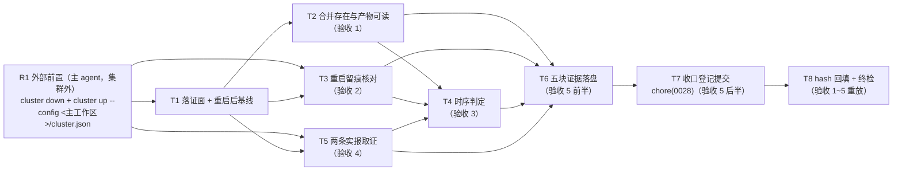

# pr-010-tasks.md — pr-010 内部任务图（收口生效实证 / F08）

**迭代**: 0028-role-model-binding ｜ **阶段**: 5（PR 实现）· **收口时点** ｜ **PR 文件**: `docs/iterations/0028-role-model-binding/prs/pr-010-post-merge-activation-evidence.md`
**执行位置**: **主工作区 `/Users/chenchiyuan/projects/agents`（`main`）**——本 PR **不建 worktree**（迭代分支已合并且已删；`iteration/0028-role-model-binding` was `e66fe1f`）
**base**: **`fb7b8dc`**（已核：`git -C <主工作区> log --oneline -1` = `fb7b8dc merge: iteration 0028-role-model-binding 角色级模型绑定 into main`，committer 时间 `2026-09-16 10:42:01 +0800`）⇒ **两个 `depends_on` 均已满足**（pr-001 的产物入库 + pr-002 的两处 `model` 均在 main 上）
**任务总数**: **8**（T1 落证面与基线 → T2 合并存在与产物可读 ／ T3 重启留痕 ／ T5 两条实报 → T4 时序判定 → T6 五块证据落盘 → T7 收口登记提交 → T8 hash 回填与终检）＋ **1 个外部前置 R1（主 agent 在集群外执行重启）**
**输入真源**: PR 文件（文件范围 1 路径 / 验收 1~5 / 「验收证据」括注五块）+ `prd/F08-post-merge-activation-evidence.md`（验收 1~5、边界、架构维度 A-04）+ `architecture.md` §3.4 收口链 · §4 A-04（落点 / 时点四步 / 被否方案）· §4 A-05（两集群两库互不可见）+ `status.md` §阶段状态 与 §派发台账 + `prd/F05`/`F06` 验收 4（判据口径 MI-3）+ 先例（0025 `162682d` / 0026 `8d897a9`）+ 代码锚点（§0.7）
**本 PR 性质**: **收口时点的运行态实证 + 落证**——主 agent 在集群外完成唯一一次主集群重启后，执行角色取 `pb-dev` / `pb-verifier` 各一条终态实报，把五块证据写入本 PR 文件，并以一次 `chore(0028): 收口登记` 提交落盘。

---

## 0. 范围、外部前置与执行环境事实

### 0.1 文件范围与提交面纪律

| # | 路径（相对主工作区根） | 动作 | 归属任务 |
|---|---|---|---|
| 1 | `docs/iterations/0028-role-model-binding/prs/pr-010-post-merge-activation-evidence.md` | 从**迭代工作区**复制入库（主工作区尚**无**该文件——已核：`ls <主工作区>/docs/iterations/0028-role-model-binding/prs/` = pr-001 ~ pr-009 **9** 个）+ 在「验收证据」小节追加五块（append-only） | **T1**、**T6** |
| 2 | `docs/iterations/0028-role-model-binding/status.md` | **工作流的收口字段回写**（`迭代分支` → `iteration/0028-role-model-binding（已合并）`），随**同一次** `chore(0028): 收口登记` 提交落盘；**归属注明为工作流动作**（PR 文件「文件范围」原文：该回写"不计入本 PR 写入面"） | **T7** |
| — | `docs/iterations/0028-role-model-binding/prs/pr-010-post-merge-activation-evidence-tasks.md`（本文件） | 阶段 5 流程产物（**不进提交面**，契约 7） | — |

**零触碰**：`oamp/**`、`roles/**`、`cluster.json`（pr-002 已定内容，本 PR 只加载）、`cluster.second.json`、`prs/pr-001~pr-009`、`demand.md` / `prd/**` / `architecture.md` / `deferred-demand-changes.md` / `clarifications/**`。

> **实测差异（须登记，不得静默处理）**：主工作区在执行本 PR 前**并非完全干净，且处于主 agent 活跃写入状态**——规划期首次实测（10:43）`git -C <主工作区> status --porcelain` 为 3 行；同一分钟内复测即为 **5 行**：` M docs/iterations/0028-role-model-binding/history.md`、` M docs/iterations/0028-role-model-binding/status.md`（= 工作流的收口记账，本 PR 的 chore 提交按 brief 硬约束 6 承载其 `status.md` 回写）、` M roles/pr-planner/data/pr-planner-changelog.md`、` M roles/pr-planner/pr-planner.md`、` M roles/workflow-pb/workflow-pb.md`（后三者**与本 PR 无关**）。
> ⇒ **提交面纪律的不变式 = "提交面不含 `roles/**` / `oamp/**` / `cluster.json`"，而不是某个固定的文件清单**（脏集合会继续变）；提交必须**按路径显式 `git add`**（契约 3 / T7-2），且执行时点必须以 T1-4 的**实测集合**为准（不得引用本表的静态清单作为判据）。

### 0.2 判据口径（上游原文，逐条可回溯）

| PR 验收 | 上游依据 | 落点 |
|---|---|---|
| 1 合并存在：main 历史含该迭代 merge 提交（message 形如 `merge: iteration 0028-role-model-binding {一句话目标} into main`）；合并后迭代产物可在 main 上读到 | F08 验收 1；`architecture.md` §3.4-1 | T2 |
| 2 重启已发生：`cluster down --config <主工作区>/cluster.json` → `cluster up --config <主工作区>/cluster.json`；命令与时间留痕；重启后 `hub api agents`（缺省 `7788`）列出 10 个 `pb-<role>` 全在线（排除 `web`） | F08 验收 2；`architecture.md` §3.4-2（写明 `--config` 以自证加载的是合并后配置） | T3 |
| 3 加载的是合并后的配置：重启晚于合并提交；不存在"文件已合、集群仍跑旧配置" | F08 验收 3；`architecture.md` §4 A-04「时点」四步 | T4 |
| 4 两条实报：主集群内 `pb-dev` / `pb-verifier` 各一条调用，终态实报 `model` 分别解析到 gpt / grok 后端（MI-3：不要求逐字相等，实报字符串原文照录） | F08 验收 4；`prd/F05`·`F06` 验收 4；`oamp/src/cluster.js:200-201` | T5 |
| 5 证据可核对：重启记录 + 两条 `call_id` + 各自终态字段（`state`/`model`/`error`/`exit_code`）写入「验收证据」小节，并以合并提交**之后**的一次 `chore(0028): 收口登记` 提交落盘 | F08 验收 5；`architecture.md` §4 A-04（落点 / 时点 / 先例 0025·0026） | T6、T7、T8 |
| 边界：不重复证明绑定字段取值正确（F03/F05/F06）；不给其它角色补取证；不要求第二集群 `down`/清理 | F08 边界；PR 文件末条 | T3-4、T5-4、T8-4 |

### 0.3 非目标（防夹带；触碰即越界 ⇒ T8-5 不通过）

- **不做**（最高优先）：**执行角色自行 `cluster down` / `cluster up`**——执行角色本身运行在该集群内，自行 `down` 会**杀死自己**（结构性风险，见 §0.5）。重启**只能**由主 agent 在集群外执行（外部前置 R1）。
- **不做**：改 `oamp/**` / `roles/**` / `cluster.json`（含把 `cluster.json` 与副本对齐）；改 `prs/pr-001~pr-009`、`demand.md`、`prd/**`、`architecture.md`、`deferred-demand-changes.md`。
- **不做**：对第二集群做任何动作（不 `down`、不清理、不查询之外的写）——F08 边界明确不要求；`oamp-cluster-0028` 原样保留。
- **不做**：两条实报携带 `--model`（本 PR 证明的是"集群按合并后的配置自动生效"，不是 per-call 例外通道）；不给 `pb-dev` / `pb-verifier` 之外的角色补取证；不重复证明绑定字段取值正确。
- **不做**：把 0027 的现场（`roles/pr-planner/data/pr-planner-changelog.md` 等）纳入本 PR 提交面或"顺手清理"。

### 0.4 本 PR 内契约（每个任务都必须遵守）

1. **执行位置 = 主工作区（`main`）**：所有命令以 `/Users/chenchiyuan/projects/agents` 为 cwd（或显式 `git -C <主工作区>`）；本 PR **不建 worktree**。
2. **端口纪律**：主集群命令用缺省端口 `7788`（`hub api agents` / `hub api calls get` 等可不写 `--port`，但证据中须写明"缺省端口 = 主集群"）；**不得**对 `--port 7789`（第二集群）发起任何写动作。
3. **提交面按路径显式限定**：`git add <本 PR 文件> docs/iterations/0028-role-model-binding/status.md`；**不得**用 `git add -A` / `git commit -a`；提交后 `git -C <主工作区> show --name-only --format= HEAD` 的路径集合必须 ⊆ {本 PR 文件, `docs/iterations/0028-role-model-binding/status.md`}（+ 若工作流同时回写 `history.md`，须在证据中列明并给出来源），且 `roles/**` / `oamp/**` / `cluster.json` **零命中**。
4. **两条实报命令不带 `--model`**：形态 = `node <主工作区>/oamp/bin/hub.js api calls create --chat-id chat-6c89902c-0a9f-4513-a299-90a7f98ae611 --agent <dev|verifier> --task "<…>" --mode block`（两条除 `--agent` 外逐字一致）；判定口径 = MI-3（同一 provider 前缀即可，实报字符串原文照录）。
5. **重启不可由本 PR 执行**：`cluster down` / `cluster up` 在本 PR 中**零次**（判据 = 命令清单 + T8-5）；重启事实的来源 = R1 的交付物（§0.5）。
6. **只读面外零写入**：除 §0.1 的两条路径外零写入；`git status` 中与本 PR 无关的既有修改**不得**被提交、还原或清理（契约 3）。
7. **append-only**：PR 文件「验收证据」小节保留原括注行（执行时点计数须仍为 1）；七字段与标题零改动（hunk 全落在末节）；本任务图文件不进提交面。
8. **证据形态可复制执行**：交付给读者的每条命令可直接粘贴执行（无未绑定占位符、无以中文散文充当管道阶段、无手工归纳代替输出）——本迭代已两次因形态判 FAIL（pr-006）；对**外部交付**的历史事实（R1 的重启命令与时间）须标注来源与交付形式。
9. **不引入技术决策**：新增文本只能取自 PR 文件、`prd/F08`、`architecture.md` §3.4/§4 A-04/§4 A-05、`status.md`、只读命令原始输出、R1 的交付物；发现上游表述与实测不一致 ⇒ 记录并上报。

### 0.5 外部前置与接力点（**重启由主 agent 在集群外执行**）

> **结构性风险（本 PR 的核心处置对象）**：本 PR 要求 `cluster down` + `cluster up` 重启主工作区集群，而**执行本 PR 的角色（`pb-*` 实例）本身就运行在该集群内**——由执行角色自行 `down` 会杀死自己，任务中断且现场不可控（当前主集群 session `oamp-cluster` 的 12 个窗口里就包含 `pb-dev` / `pb-verifier` 等节点）。

| 项 | 内容 |
|---|---|
| **R1 · 执行者** | **主 agent**（在集群外的会话内核 / shell 中执行），**不是**执行角色 |
| **R1 · 命令（逐字）** | ① `node /Users/chenchiyuan/projects/agents/oamp/bin/hub.js cli cluster down --config /Users/chenchiyuan/projects/agents/cluster.json` ② `node /Users/chenchiyuan/projects/agents/oamp/bin/hub.js cli cluster up --config /Users/chenchiyuan/projects/agents/cluster.json` （写 `--config` 的目的 = 自证加载的是**合并后的 main 配置**，`architecture.md` §3.4-2） |
| **R1 · 时序闸门** | 必须在合并提交 `fb7b8dc`（`2026-09-16 10:42:01 +0800`）**之后**执行；且**只**作用于 `oamp-cluster`（`cluster down` 的实现是 `tmux kill-session -t <session>`，见 §0.7 ⇒ 不触碰 `oamp-cluster-0028`） |
| **R1 · 交付给 dev 的内容（接力点）** | ① 两条命令的**逐字原文**；② **起止时间**（down 完成 / up 完成，秒级）；③ 各自的退出码；④ `up` 的原始输出（拓扑表/就绪行）；⑤（若可得）`tmux ls` 重启前后对照 |
| **R1 · 接力形式** | 主 agent 在**重启完成后**再派发/继续本 PR 的执行角色（执行角色在重启前无法存活到重启后）；该交付内容随派发上下文进入 dev 的证据块 ② |
| **R1 · 失败处置** | `down` 或 `up` 失败 ⇒ 如实记录 + 现象（stderr 原文）+ 不继续取证；不得由执行角色代跑，不得改 `--config` 取值或端口 |
| **R1 的降级（若交付内容不完整）** | 若 R1 未能交付逐字命令/时间 ⇒ dev **不得**编造；改为以可观测事实登记（新 session 创建时间、7788 监听 PID 与进程启动时间、`api agents` 输出），并显式登记"重启命令原文未交付"这一效力边界（同 pr-004 的登记面做法） |

**DAG 中的位置**：R1 是 **T1 / T3 / T5 的前置节点**（执行角色的整个生命周期都在重启之后开始）。

### 0.6 执行环境事实（规划期 2026-09-16 10:43 只读实测，**dev 须以执行时点重取**）

| # | 事实 | 值 / 判据 |
|---|---|---|
| **E1** | **合并已发生**：main HEAD = `fb7b8dc`，message = `merge: iteration 0028-role-model-binding 角色级模型绑定 into main`；committer 时间 `2026-09-16 10:42:01 +0800`；其下为 `18453fb`（0027 合并）与 `e66fe1f`（pr-009 合入迭代分支） | `git -C <主工作区> log --oneline -1` / `git log -1 --format='%ad %cd %s' --date=iso fb7b8dc` |
| **E2** | **迭代产物已在 main 可读**：`docs/iterations/0028-role-model-binding/` 含 `demand.md` / `prd.md` / `prd/` / `architecture.md` / `clarifications/` / `history.md` / `status.md` / `deferred-demand-changes.md` / `prs/`（**9** 个 PR 文件 = pr-001 ~ pr-009）；**`pr-010` 尚不在 main**（由本 PR 的收口提交落盘） | `ls <主工作区>/docs/iterations/0028-role-model-binding/{,prs/}` |
| **E3** | **main 的 `cluster.json` 已含两处绑定**：第 **14** 行 `"model": "openai/gpt-5.6-luna"`（`dev` 段）、第 **24** 行 `"verifier": { "model": "powerby/grok-4.6" }` | `grep -n model <主工作区>/cluster.json` |
| **E4** | **主集群尚未重启（R1 待执行）**：tmux session `oamp-cluster` 创建于 **08:47:42**（早于合并时间 10:42:01）；`127.0.0.1:7788` 监听 PID **64314**，进程启动时间 **Wed Sep 16 08:47:43 2026**（同样早于合并） | `tmux display-message -p -t oamp-cluster '#{session_created}'` → `date -r`；`lsof -nP -iTCP:7788 -sTCP:LISTEN`；`ps -o lstart= -p <PID>` |
| **E5** | **第二集群仍在运行且不在本 PR 动作面**：tmux `oamp-cluster-0028` 创建于 **09:53:43**（12 窗口）；`127.0.0.1:7789` 监听（PID 92023） | `tmux ls`；`lsof -nP -iTCP:7789 -sTCP:LISTEN` |
| **E6** | **主工作区既有脏文件（规划期实测 3 行、复测 5 行——集合在变，故以执行时点实测为准）**：` M docs/iterations/0028-role-model-binding/history.md`、` M …/status.md`、` M roles/pr-planner/data/pr-planner-changelog.md`（13 insertions）、` M roles/pr-planner/pr-planner.md`、` M roles/workflow-pb/workflow-pb.md` ⇒ 提交面纪律的不变式 = **不含 `roles/**` / `oamp/**` / `cluster.json`** | `git -C <主工作区> status --porcelain`；`git diff --stat -- roles/pr-planner/data/pr-planner-changelog.md` |
| **E7** | **重启会清空调用面**：`api calls list` 的范围 = 本 hub 进程派发的调用（`web.js:1137-1139`：只列 `from === 'web'`），进程重启后清空 ⇒ 两条实报必是重启后的**首批**调用；其 `started_at` / `ended_at` 即验收 3 的时序判据来源 | `web.js:1137-1139` + `G-15` 的既往实证（<主工作区> 集群 08:47 重建后调用面清空） |
| **E8** | **两条实报的模型来源 = 角色级绑定**：`cluster.js:200-201` 把 `roles.<role>.model` 追加为角色窗口的 `--model`；重启后常驻池为空（G-11 的探针固化随重启清除，`history.md` 已核）⇒ 重启后**首次**调用即该角色在该 chat 的建键轮，实报值来自角色级绑定 | `cluster.js:200-201`；`status.md`/`history.md` 既有记载；`deferred-demand-changes.md` G-11 |
| **E9** | **迭代 chat 仍在**：`chat-6c89902c-0a9f-4513-a299-90a7f98ae611`（对话记录落在 sqlite，跨重启保留；`status.md` §执行方式「chat_id（阶段 2~6）」） | `status.md` §执行方式；`G-15` 的既往实证（对话记录留存） |
| **E10** | **`cluster down` 的作用域 = 指定 session**：`cluster.js:475` `tmuxOrFail(bin, ['kill-session', '-t', session], 'kill-session')` ⇒ 重启主集群不触碰 `oamp-cluster-0028` | `oamp/src/cluster.js:475` 原文 |
| **E11** | **`cluster up` 的 `--config` 取值在本 PR 是"加载合并后配置"的自证**：`cluster-config.js:184` `root = dirname(configPath)`（工作区根）；`cluster.js:190` web 端口取 `config.web.port` | `oamp/src/cluster-config.js:184`、`oamp/src/cluster.js:190` |
| **E12** | **无套件可跑**：本 PR 的通过条件 = 只读命令原始输出 + 文件内容核验（契约 9） | 同左 |

### 0.7 工具锚点（规划期只读核对，逐条带出处）

- `oamp/src/cluster.js:200-201`：`if (entry.model !== undefined) { argv.push('--model', entry.model); }`（角色级 `model` → 窗口 argv；E8/E11）。
- `oamp/src/cluster.js:190`：`{ name: WEB_WINDOW, cwd: config.root, argv: ['web','start','--port', String(config.web.port)] }`。
- `oamp/src/cluster.js:475`：`down` 的 `kill-session -t <session>`（E10）。
- `oamp/src/cluster-config.js:184`：`const root = path.dirname(configPath);`。
- `oamp/src/web.js:1137-1139`：`GET /api/calls` 只列 `from === SENDER_ID`（`web`）⇒ 重启清空调用面（E7）。
- `oamp/sdk/cli.js:320`：`if (head === 'cli') return runCli(tokens.slice(1))`（层 C 透传 `oamp cluster down|up`）。
- 先例：0025 的 `chore(0025): 收口登记…`（`162682d`，晚于 merge `5839e9d`）、0026 的 `8d897a9`（晚于 merge `d8c2cb6`）——均只改 `docs/iterations/{迭代}/**`。

---

## 1. 任务列表

### T1: 落证面准备与重启后基线快照

- **一句话描述**：把本 PR 文件从迭代工作区复制进主工作区，并冻结重启后的执行基线（session / 端口 / 调用面 / 工作区脏文件）。
- **验收标准**:
  1. **入库面恰 1 条**：`docs/iterations/0028-role-model-binding/prs/pr-010-post-merge-activation-evidence.md` 出现在主工作区；`git -C <主工作区> diff --no-index <迭代工作区>/…/pr-010-…md <主工作区>/…/pr-010-…md` **零输出**；源 sha256 + 字节数 + 行数记录；`grep -c '本 PR 执行时填写'` = 1（原括注行在场）。
  2. **重启后基线（重启事实的可观测面）**：记录 `tmux ls`（`oamp-cluster` 与其创建时间、`oamp-cluster-0028` 与其创建时间）+ `lsof -nP -iTCP:7788 -sTCP:LISTEN` 的 PID + `ps -o lstart= -p <PID>` 的启动时间；与 E4 的重启前值（session `08:47:42` / PID `64314` @ `08:47:43`）并列对照 ⇒ 判定"已重启 / 未重启"。
  3. **调用面基线（E7）**：`node <主工作区>/oamp/bin/hub.js api calls list` 原文（重启后应为空或仅含本批）；若其中仍含重启前的调用 ⇒ 说明进程未重启，**立即停止并上报**（不得在未重启的集群上取证）。
  4. **工作区基线（E6 / 契约 3）**：`git -C <主工作区> status --porcelain` 的**逐行原文 + 行数**（执行时点实测集合，含全部既有 ` M roles/…` / ` M docs/iterations/…` 行）⇒ 作为提交面纪律的前置基线；**不得**引用任务图 E6 的静态清单代替实测；`git -C <主工作区> log --oneline -1` 原文（对照 E1 = `fb7b8dc`）。
  5. **零写入**：本任务只读（复制 PR 文件除外）；不得对集群发起任何写动作。
- **前置依赖**: R1（外部前置：主集群重启已完成）
- **优先级**: P0
- **追溯**: PR 文件「文件范围」；`architecture.md` §4 A-02（载体）；契约 1 / 3 / 6；事实锚点 E1 / E4 / E6 / E7

### T2: 合并存在与产物可读核对（PR 验收 1 / F08 验收 1）

- **一句话描述**：核对 main 历史含该迭代 merge 提交、message 形态合规，且迭代产物在 main 上可读。
- **验收标准**:
  1. **merge 提交在场且形态合规**：`git -C <主工作区> log -1 --format='%H %ad %s' --date=iso fb7b8dc` 原文 ⇒ message = `merge: iteration 0028-role-model-binding 角色级模型绑定 into main`（形态 `merge: iteration 0028-role-model-binding {一句话目标} into main`，F08 验收 1 原文）；`git -C <主工作区> merge-base --is-ancestor fb7b8dc HEAD` 退出码 `0`。
  2. **产物可读清单**：`git -C <主工作区> ls-tree -r --name-only HEAD -- docs/iterations/0028-role-model-binding` 的**完整原文** + 分类计数（`demand.md` / `prd.md` / `prd/*.md`（13 卡）/ `architecture.md` / `clarifications/*.md` / `history.md` / `status.md` / `deferred-demand-changes.md` / `prs/pr-001~pr-009`）⇒ 逐类给出"在场"结论（对照 E2）。
  3. **`pr-010` 的落盘归属**：登记"本 PR 文件尚不在 main，且由本 PR 的 `chore(0028): 收口登记` 提交落盘"（`architecture.md` §4 A-04「时点」④）。
  4. **零越界**：本任务只读 git（`log` / `ls-tree` / `merge-base`）；不改任何文件。
- **前置依赖**: T1
- **优先级**: P0
- **追溯**: PR 验收 1；F08 验收 1；`architecture.md` §3.4-1 / §4 A-04；事实锚点 E1 / E2

### T3: 重启留痕核对（PR 验收 2 / F08 验收 2）

- **一句话描述**：以 R1 交付的重启命令与时间为准，核对重启确已发生、且重启后 10 个角色实例全部在线。
- **验收标准**:
  1. **重启命令逐字留痕（PR 验收 2）**：把 R1 交付的两条命令（`cluster down --config /Users/chenchiyuan/projects/agents/cluster.json` → `cluster up --config /Users/chenchiyuan/projects/agents/cluster.json`）**逐字**写入证据块 ②，并标注来源 = 主 agent 在集群外执行（§0.5 接力点）+ 交付形式（逐字原文 / 起止时间 / 退出码 / `up` 输出）。
  2. **重启时间留痕（PR 验收 2）**：记录 down 完成时间与 up 完成时间（秒级）；并与 T1-2 的可观测面（新 session 创建时间、7788 新 PID 与启动时间）**互相印证**；若 R1 未交付逐字命令或时间 ⇒ 按 §0.5 的降级条款登记效力边界（不得编造）。
  3. **10 实例在线（PR 验收 2 / F08 验收 2）**：`node <主工作区>/oamp/bin/hub.js api agents`（缺省端口 7788）原文 ⇒ `instance_id` ∈ 十个 `pb-*`（`pb-architect` / `pb-demand` / `pb-dev` / `pb-planner` / `pb-pr-planner` / `pb-prd` / `pb-progress-observer` / `pb-retrospective` / `pb-verifier` / `pb-workflow-pb`）**全部 `online`**，判定时**排除固有节点 `web`**；输出在线表（10 行）。
  4. **第二集群零触碰（边界）**：`tmux ls` 中 `oamp-cluster-0028` 仍在，其创建时间与 T1-2 记录一致（未被重启/清理）；本 PR 对 `--port 7789` **零写动作**；结论写明"F08 不要求第二集群 `down` 或清理"（PR 文件末条 / F08 边界）。
  5. **零越界**：本任务不执行 `cluster down|up`（`down`/`up` 在本 PR 中零次）；只读命令（`api agents` / `tmux` / `lsof` / `ps`）。
- **前置依赖**: R1、T1
- **优先级**: P0
- **追溯**: PR 验收 2；F08 验收 2 与边界；`architecture.md` §3.4-2 / §4 A-04；契约 5；事实锚点 E5 / E10

### T5: 两条实报取证（PR 验收 4 / F08 验收 4）

- **一句话描述**：在重启后的主集群内对 `pb-dev` / `pb-verifier` 各发起一条不带 `--model` 的调用并采集终态实报。
- **验收标准**:
  1. **命令形态（契约 4）**：两条命令逐字进入证据，形如 `node <主工作区>/oamp/bin/hub.js api calls create --chat-id chat-6c89902c-0a9f-4513-a299-90a7f98ae611 --agent <dev|verifier> --task "<…>" --mode block`（**除 `--agent` 外逐字一致**）；`grep -c -- '--model'` 于两条命令 = **0**（契约 4 / 边界：本 PR 证明的不是 per-call 例外通道）。
  2. **chat 归属**：两条同属迭代 chat `chat-6c89902c-0a9f-4513-a299-90a7f98ae611`（E9 / D-21 的连续性；若不沿用该 chat，须在证据中写明理由并登记对 F10 唯一性判据的影响）。
  3. **`call_id` 与终态字段（PR 验收 5 的证据面）**：两条各给 `call_id`（**互不相同**）+ 终态字段 `state` / `model` / `error` / `exit_code`（+ `truncated` / `duration_ms`）**原文照录**；`state` 须为终态（∈ {`completed`,`failed`}，`API.md` §3.19 词表）。
  4. **后端口径判定（PR 验收 4 / MI-3）**：`dev` ⇒ 解析到 gpt 后端（provider 前缀 `openai/`）；`verifier` ⇒ 解析到 grok 后端（`powerby/`）；判定写明"解析到**同一后端**、不要求与绑定值逐字相等"，**同时**原文照录实报字符串（只作可复核事实）；任一指向不同后端 ⇒ 本 PR 判失败并如实登记。**不**给其它角色补取证（边界）。
  5. **并发形态（契约 8 / G-9 时间预算）**：两条**同轮并发**发起（各自 stdout/stderr 落独立文件），**每条命令自身仍逐字含 `--mode block`**；并发命令原文与日志路径进入证据；达节点侧上限（30 分钟，G-9）仍无终态 ⇒ 按失败记（`call_id` + 现象），不重跑替换。
  6. **零污染**：两条命令均为缺省端口（主集群）；本任务结束后 `hub api calls list --port 7789` 中不出现这两条 `call_id`。
- **前置依赖**: R1、T1
- **优先级**: P0
- **追溯**: PR 验收 4；F08 验收 4 与边界；`prd/F05` / `F06` 验收 4（MI-3）；`oamp/src/cluster.js:200-201`；`deferred-demand-changes.md` G-9 / G-11；事实锚点 E8 / E9

### T4: 时序判定（PR 验收 3 / F08 验收 3）

- **一句话描述**：以三个时间戳的严格顺序证明"加载的是合并后的配置"。
- **验收标准**:
  1. **三方时间戳并列**：① merge 提交时间 = `2026-09-16 10:42:01 +0800`（`git log -1 --format=%cd` 原文）；② 重启时间（R1 交付的 down/up 起止时间）；③ 两条实报的 `started_at` / `ended_at`（来自调用信封或 `calls list`，E7）。
  2. **严格顺序成立**：merge < 重启 < 实报 —— 逐对给出比较句与判据来源；任一处颠倒或不可比 ⇒ 登记为差异并明确其对验收 3 的影响（不得只写"顺序正常"）。
  3. **状态一致性结论**：给出"不存在『文件已合、集群仍跑旧配置』"的判据链 —— 时序 + T5 的实报值（若集群仍跑旧配置，`pb-dev` 实报应为默认链路 deepseek 系而非 gpt）；引用 `oamp/src/cluster.js:200-201` 说明实报模型的唯一来源是配置文件里的 `roles.<role>.model`。
  4. **旁证并列**：重启前的 session 创建时间与 PID（E4）vs 重启后的（T1-2）⇒ 给出"进程确已换代"的可观测对照。
  5. **零写动作**：本任务只读（`git` / `calls get`）。
- **前置依赖**: T2（merge 时间）、T3（重启时间）、T5（实报时间）
- **优先级**: P0
- **追溯**: PR 验收 3；F08 验收 3；`architecture.md` §4 A-04「时点」四步；事实锚点 E1 / E4 / E7 / E8

### T6: 五块证据落盘（PR 文件「验收证据」append-only）

- **一句话描述**：把 PR 文件括注要求的五块证据写入「验收证据」小节（chore 提交 hash 先留待回填位）。
- **验收标准**:
  1. **五块齐备（PR 文件括注原文逐项）**：① 「merge 提交 hash 与 message」（T2）② 「重启命令逐字与时间」（T3）③ 「重启后 10 实例在线表」（T3-3）④ 「两条实报：`call_id` / 终态字段 / 实报 model 原文」（T5）⑤ 「`chore(0028): 收口登记` 提交 hash」（T7 产出、T8 回填）——其中 ⑤ 在本任务先给出**回填位声明**（"hash 由 T7 提交后回填写入"），不得留空表述。
  2. **附加段的必要内容**：时序判定（T4 的三方时间戳与顺序结论）、外部前置 R1 的来源与接力形式（§0.5）、工作区既有脏文件与提交面纪律声明（E6 / 契约 3）、第二集群保留声明（E5 / 边界）、两条实报的命令形态自证（`--mode block` ×2 在场、`--model` 零命中）。
  3. **可执行性（契约 8）**：交付给读者的每条核对命令可直接粘贴执行（无未绑定占位符、无以散文充当管道阶段、无手工归纳代替输出）；R1 交付的重启命令作为**外部来源**须标注"由主 agent 在集群外执行、逐字转录"。
  4. **append-only**：原括注行仍在（`grep -c '本 PR 执行时填写'` = 1）；七字段与标题零改动（hunk 头行号 > 「## 验收证据」小节行号）。
  5. **零越界**：本任务只写本 PR 文件；不写 `status.md`（其回写归 T7 提交面）、`oamp/**`、`roles/**`、`cluster.json`、其它 PR 文件。
- **前置依赖**: T2、T3、T4、T5
- **优先级**: P0
- **追溯**: PR 文件「验收证据」小节原文 + 验收 5；`architecture.md` §4 A-02 / §4 A-04；契约 7 / 8 / 9

### T7: 收口登记提交（PR 验收 5 / F08 验收 5）

- **一句话描述**：以一次 `chore(0028): 收口登记` 提交把本 PR 文件与 `status.md` 的收口字段回写落盘。
- **验收标准**:
  1. **提交信息与时序**：message 形如 `chore(0028): 收口登记——…`；提交发生在合并提交 `fb7b8dc` **之后**（判据 = `git -C <主工作区> log --oneline -3` 中该 chore 提交位于 `fb7b8dc` 之上）。
  2. **提交面按路径显式限定（契约 3）**：以 `git add` 显式加入 ① 本 PR 文件 ② `docs/iterations/0028-role-model-binding/status.md`（工作流的 `迭代分支` 字段回写）；`git -C <主工作区> show --name-only --format= HEAD` ⇒ 路径集合 ⊆ {本 PR 文件, `status.md`（+ 若工作流同批回写 `history.md`，须在证据中列明并说明来源）}；**`roles/**` / `oamp/**` / `cluster.json` 零命中**（尤其**不得**包含 ` M roles/pr-planner/data/pr-planner-changelog.md`）。
  3. **收口字段回写在场**：`grep -n '迭代分支' docs/iterations/0028-role-model-binding/status.md` 原文 ⇒ 值 = `iteration/0028-role-model-binding（已合并）`；并注明其**归属 = 工作流动作**（PR 文件「文件范围」原文："不计入本 PR 写入面"）。
  4. **`status.md` 快照**：提交前记录 `status.md` 的 sha256（对照 T1-4 的基线），提交后记录提交内版本 sha256（`git show HEAD:docs/…/status.md | shasum -a 256`）⇒ 证明提交的是当时的工作区版本（主 agent 的同批记账一并落盘）。
  5. **提交 hash 记录**：记录该 chore 提交的完整 hash 与 `git show --stat` 摘要（供 T8 回填与终检引用）。
  6. **未还原无关修改（契约 6）**：`git -C <主工作区> status --porcelain` 中 ` M roles/pr-planner/data/pr-planner-changelog.md` **仍在**且未被提交（判据 = 该路径不在 `show --name-only` 中）。
- **前置依赖**: T6
- **优先级**: P0
- **追溯**: PR 验收 5；F08 验收 5；`architecture.md` §4 A-04（落点 / 时点 / 先例 0025·0026）；契约 3 / 6；事实锚点 E6

### T8: hash 回填提交与终检（PR 验收 1~5 重放）

- **一句话描述**：把 T7 的提交 hash 回填进证据块 ⑤ 并提交第二次，随后重放 5 条验收并核验禁区与零写动作。
- **验收标准**:
  1. **回填闭环**：证据块 ⑤ 写入 T7 提交的 hash + 回填提交自身的 hash（后者 = 回填后 `git -C <主工作区> log -1 --format=%H`）⇒ 并写明闭环说明："⑤ 中的第一个 hash 指向承载证据与本 PR 文件的收口提交，第二个 hash 指向本次回填提交，其间无其它提交"（判据 = `git log --oneline -3` 原文）。
  2. **第二次提交形态**：message 形如 `docs(0028): 收口登记 hash 回填`；`git show --name-only --format= HEAD` ⇒ **恰 1 路径**（本 PR 文件）；本任务图文件不在其中（契约 7）。
  3. **5 条验收在提交面重放**：`git -C <主工作区> show HEAD:<本 PR 文件>` 提取内容后重放 —— 验收 1（merge hash + message + 产物清单）、验收 2（重启命令 + 时间 + 10 实例在线表）、验收 3（三方时间戳顺序）、验收 4（两条 `call_id` + 四字段 + 后端口径）、验收 5（五块在「验收证据」小节 + chore 提交 hash）⇒ 逐条给"通过 / 不通过 + 判据"。
  4. **禁区与边界核验**：`git -C <主工作区> diff --name-only fb7b8dc...HEAD | grep -E '^(oamp/|roles/|cluster\.json|docs/iterations/0028-role-model-binding/(prs/pr-00[1-9]|demand\.md|prd\.md|architecture\.md|deferred-demand-changes\.md|clarifications/))'` ⇒ 零命中；第二集群仍在（`tmux ls` 含 `oamp-cluster-0028`，创建时间不变）；`cluster down|up` 本 PR 零次（契约 5）。
  5. **边界声明复核**：证据中写明"未重复证明绑定字段取值正确、未给其它角色补取证、未要求第二集群 `down`/清理"（PR 文件末条 + F08 边界）。
  6. **验收手段声明**：本 PR 无套件可跑（E12）——结论以只读命令原始输出与文件内容核验为准，不声称"测试全绿"。
- **前置依赖**: T7（T1~T6 经 T7 间接依赖）
- **优先级**: P0
- **追溯**: PR 验收 1~5 与「验收证据」；F08 验收 1~5 与边界；`architecture.md` §4 A-04；契约 3 / 5 / 7

---

## 2. 依赖图与覆盖矩阵

- **无环**（1 外部前置 + 8 任务 / 11 边）：R1 是执行角色的**生命周期前置**（执行角色运行在被重启的集群内，重启发生在它开始之前）；R1 + T1 扇出到 T2 / T3 / T5；T2 / T3 / T5 汇入 T4（时序判定需要三方时间戳）；T2 / T3 / T4 / T5 汇入 T6（落盘）；T6 → T7（提交）→ T8（回填 + 终检）。**无回边、无互指** ⇒ 不存在循环依赖，无需上报。
- **最长依赖链**：`R1 → T1 → T5 → T4 → T6 → T7 → T8`（6 任务 + R1 / 6 边）；另有无 T4 的支线 `R1 → T1 → T5 → T6 → T7 → T8`。
- **关键路径任务**：**R1**（外部闸门：不完成则整条链无法开始）、**T3**（重启留痕——验收 2 的唯一证据面，且依赖外部交付）、**T5**（两条实报——验收 4 的核心，时间预算受 G-9 约束）、**T7**（收口提交——提交面纪律与 hash 闭环）。
- **真依赖（非叙述顺序）**：T4 必须后置 T2 / T3 / T5（时序判定的三个输入分别来自合并、重启与实报）；T6 必须后置 T4（证据块含时序结论）；T7 必须后置 T6（提交的是定稿证据）；T8 必须后置 T7（回填对象是 T7 的 hash）。
- **并行宽度**：T2 ∥ T3 ∥ T5（互不写同一文件：T2/T3 只读，T5 只产生运行态调用）。
- **串行点（写者/运行态）**：本 PR 的版本控制写入者只有 T7 / T8（严格串行，且中间以"hash 回填"衔接）；运行态副作用集中在 T5 的两条调用；其余任务为只读。
- **粒度隔离的有意设计**：① **T3 与 T5 拆开**——T3 判"重启已发生且集群健康"（证据来自外部交付 + 只读观测），T5 判"两条实报的后端口径"（本 PR 唯一产生运行态动作的任务）；合并会让外部交付缺失时连取证都无法独立完成。② **T4 单列**——时序判定是验收 3 的独立判据（三个时间戳的严格顺序），且它跨 T2 / T3 / T5 三源，放在任一侧都会与该侧的失败面混淆。③ **T7 与 T8 拆开**——`chore` 提交的 hash 无法写进它自身（自引用问题），必须由第二次提交回填并声明闭环；拆开使"提交面纪律"（T7）与"hash 闭环与终检"（T8）各有独立判据。④ **R1 独立于任务列表之外**——它不是执行角色的任务（执行角色无法执行它），写成 DAG 节点可让"谁是执行者"一目了然。

### 覆盖矩阵（PR 验收 1~5 → 任务）

| PR 验收 | 主判据任务 | 落盘块 | 复判 |
|---|---|---|---|
| 1 合并存在 + 产物可读 | T2-1/2/3 | T6-① | T8-3 |
| 2 重启已发生 + 10 实例在线 | T3-1/2/3（+ R1 交付） | T6-②③ | T8-3 |
| 3 加载合并后的配置（时序） | T4-1/2/3/4 | T6（附加段） | T8-3 |
| 4 两条实报（gpt / grok 后端，MI-3） | T5-1~5 | T6-④ | T8-3 |
| 5 证据可核对 + 收口登记提交 | T6-1/2/3、T7-1/2/3/4/5 | T6-⑤（T7/T8 回填） | T8-1/2/3 |
| 边界（不重复证明绑定取值 / 不补取证 / 第二集群保留） | T3-4、T5-4、T8-5 | T6（边界段） | T8-4/5 |

---

## 3. 风险与分步提交点

### 3.1 风险（按影响面排序）

**① 执行角色自行重启 = 自杀（本 PR 的根因级风险，已被外部前置消解）**
`cluster down` 的实现是 `tmux kill-session -t <session>`（`cluster.js:475`），而执行角色本身就跑在该 session 的窗口里 ⇒ 自行 `down` 会杀死自己，任务中断、现场不可控。处置：**R1 外部化**（主 agent 在集群外执行 down/up，再把命令逐字 + 时间交回，§0.5）；契约 5 与 T3-5 / T8-4 以"`cluster down|up` 在本 PR 零次"为判据。

**② 重启尚未发生（规划期实测）**
实测：主集群 session `oamp-cluster` 创建于 **08:47:42**、7788 监听 PID **64314** 启动于 **08:47:43**，均**早于**合并时间 **10:42:01**（E4）⇒ 在本任务图产出时点，**重启还没做**。处置：T1-3 以 `api calls list` 是否清空 + session/PID 换代作为"是否已重启"的闸门；未重启即在旧集群上取证 ⇒ 验收 3 直接不成立（"文件已合、集群仍跑旧配置"），故 **T1-3 判为未重启时立即停止并上报**。

**③ 主工作区并非完全干净（与 brief 描述的差异，须登记）**
实测 `git status --porcelain` = 3 行：` M history.md`、` M status.md`（工作流收口记账）、` M roles/pr-planner/data/pr-planner-changelog.md`（与本 PR 无关的 0027 现场）。处置：契约 3 要求**按路径显式 `git add`**；T7-2 以 `show --name-only` 的路径集合 ⊆ {本 PR 文件, `status.md`（+`history.md` 若同批）} 为判据、`roles/**` 零命中；契约 6 禁止还原/清理无关修改；T7-6 复验其仍在。

**④ 调用面在重启后清空（时序判据的依赖）**
`GET /api/calls` 只列 `from === 'web'`（`web.js:1137-1139`）且状态存于进程内 ⇒ 重启后清空（E7）。处置：T4 的实报时间取自**新进程内**的信封 `started_at` / `ended_at`；T1-3 用"调用面为空"作为重启已发生的旁证。

**⑤ 常驻池重建语义（实报来源的解释）**
重启清除 G-11 的探针固化；重启后首次调用即该角色在该 chat 的建键轮 ⇒ 实报值来自角色级绑定（`cluster.js:200-201`，E8）。处置：T5-4 的判定只依实报值与 provider 前缀（MI-3），并把这层机制作为**登记件**写入证据；若实报与绑定后端不符 ⇒ 判失败并如实登记（不得解释成"口径差异"）。

**⑥ 外部交付缺失（R1 降级路径）**
若 R1 未交付逐字命令/时间 ⇒ 按 §0.5 降级：以可观测事实（session 创建时间、PID 与进程启动时间、`api calls list` 清空、`api agents` 输出）登记，并**显式标注"重启命令原文未交付"这一效力边界**；不得编造命令或时间。

**⑦ 时间预算（G-9）**：两条 `--mode block` 串行会逼近节点侧 30 分钟上限；处置 = T5-5 同轮并发 + 独立日志 + 每条命令自身仍含 `--mode block`（pr-006 已采纳的形态）。

**⑧ 证据可执行性（pr-006 教训）**：契约 8 要求每条交付命令可粘贴执行；仅"外部交付的历史事实"允许标注来源后登记。

**⑨ 无套件可跑**：本 PR 的验收手段 = 只读命令原始输出 + 文件内容核验（E12）。

### 3.2 分步提交点

| 提交点 | 时点 | 内容 | 依据 / 价值 |
|---|---|---|---|
| **提交点 1** | T7（证据落盘完成、hash 位留占位） | `chore(0028): 收口登记——…`：本 PR 文件（五块证据）+ `status.md` 收口字段回写 | F08 验收 5 的字面要求（一次 chore 提交、晚于 merge、只改 `docs/iterations/…`）；先入库使证据进入 main 历史 |
| **提交点 2** | T8（回填后） | `docs(0028): 收口登记 hash 回填`：把提交点 1 的 hash 写入证据块 ⑤，并声明闭环 | 解决 hash 自引用问题；使验收 5 的"提交 hash 可核对"成立 |

两次提交的路径都按契约 3 显式限定，且**不含 `roles/**` / `oamp/**` / `cluster.json`**（判据面是不变式，不是某个固定清单——主工作区的脏集合会继续变，执行时点以 T1-4 实测集合为准）。

---

## 4. 口径确认项与粒度自查

**① `[model_inferred]` 项 —— 共 5 条，需主 agent 确认**

1. **重启的外部化与接力契约**（§0.5）：上游只说"主集群一次重启"（F08 验收 2 / `architecture.md` §3.4-2），未规定执行者；本任务图按"执行角色自杀"这一结构事实把 R1 划归主 agent，并规定交付物（命令逐字 + 起止时间 + 退出码 + `up` 输出）。
2. **hash 回填需第二次提交**：F08 验收 5 要求"以一次 `chore(0028)` 提交落盘"且证据块含"该提交 hash"；两者在自引用上冲突（提交无法包含自身 hash）。本任务图取"一次 chore 提交（承载证据与登记）+ 一次回填提交"（提交点 1 / 2），并在证据中写明闭环。
3. **两条实报的 chat = 迭代 chat `chat-6c89902c-…`**：上游未指定 chat；取迭代 chat 是为满足 D-6/D-21 的连续性与 F10 验收 1 的唯一性判据。
4. **两条实报并发发起**：上游未规定形态；本任务图按 G-9 的时间预算与 pr-006 已采纳形态取"同轮并发 + 独立日志 + 每条仍含 `--mode block`"（T5-5）。
5. **`status.md` 回写的归属与提交面**：PR 文件说该回写"不计入本 PR 写入面"（工作流动作）；brief 硬约束 6 要求它随同一次 chore 提交落盘。本任务图按"同一提交、归属注明为工作流动作"落地（T7-3）。

**② 粒度自查（8 任务 + 1 外部前置全部通过；执行约束 = 节点侧单次执行 ≤30 分钟）**

| 任务 | ≤30 分钟 | 可独立验收（判据只读自身输入） | 验收标准可测试 |
|---|---|---|---|
| R1（外部） | — （主 agent 在集群外执行，非 dev 任务） | — | 交付物 ×5 逐项在场（T3-1/2 以其为输入） |
| T1 | ✅ 1 次复制 + 5 组只读命令 | ✅ 只读（R1 完成后） | ✅ `diff --no-index` 零输出、session/PID 换代、调用面空 |
| T2 | ✅ 3 条只读 git 命令 + 分类计数 | ✅ 只读 git | ✅ message 逐字、`merge-base --is-ancestor` = 0、九类产物在场 |
| T3 | ✅ 1 条 `api agents` + 3 条观测命令 | ✅ 只读（R1 交付为输入） | ✅ 10 个 `pb-*` 全 online、第二集群未被触碰 |
| T5 | ✅ 两条并发调用（墙钟 ≈ 最慢一条 ≤30 分钟，G-9 上限对齐） | ✅ 只读调用面 + 自身发起 | ✅ `--model` 零命中、两 `call_id` 互异、后端口径二值 |
| T4 | ✅ 3 组时间戳 + 3 条比较 | ✅ 只读（T2/T3/T5 结论为输入） | ✅ 顺序逐对可判、旁证对照在场 |
| T6 | ✅ 追加 5 块 + 附加段 | ✅ 只读 PR 文件与 git | ✅ 五块在场、括注计数 = 1、hunk 全在末节 |
| T7 | ✅ 1 次路径限定提交 + 4 条核验 | ✅ 提交面自证 | ✅ 路径集合 ⊆ 两条、`roles/**` 零命中、字段值逐字 |
| T8 | ✅ 1 次回填提交 + 5 条重放 | ✅ 提交面自证 | ✅ 覆盖矩阵 5/5、闭环说明、禁区零输出 |

- **本任务图不含**：任何 `oamp/**` / `roles/**` / `cluster.json` 改动、任何 `cluster down|up`（外部前置 R1 除外，且不由执行角色执行）、任何对第二集群的动作、任何对 0027 现场的清理、任何新测试 / CI / hook / 依赖。故不写 `roles/planner/data/` 决策记录。
