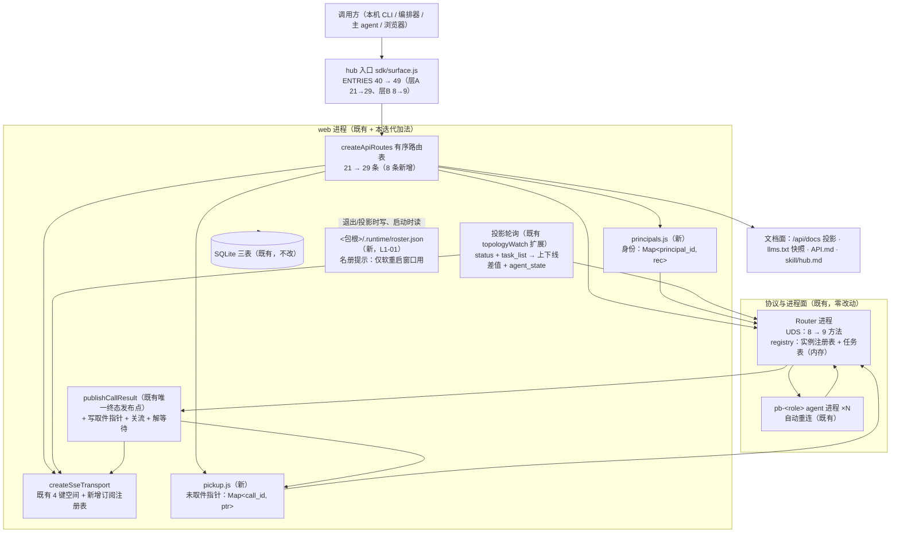

# architecture.md — 0029-hub-client-session-and-duplex

**版本**: 1.0.0
**迭代**: 0029-hub-client-session-and-duplex
**阶段**: 3（技术架构）
**创建日期**: 2026-09-16
**输入**: `prd.md`（v1.0.0，20 卡：F01~F19 + G01）+ `prd/*.md`（产品维度已锁；架构维度本次全部回填）+ **现有代码库实测**（`oamp/src/**`、`oamp/web/**`、`oamp/sdk/**`、`oamp/API.md`、`oamp/README.md`、`oamp/skill/hub.md`、`oamp/llms.txt`、`oamp/scripts/gen-llms-txt.mjs`）
**产出**: 本文档 + `prd.md`「架构待填汇总」14 行回填（A-01~A-14）+ 本角色决策记录
**未读（按角色契约）**: `demand.md`（不作为设计依据；仅其澄清依据的代码实测读数 F-1~F-10 作线索，且**已逐条以代码复核**，见 §1.3）

**本文档回答 prd 的全部 14 条架构待填项（A-01~A-14 逐条落定见 §4）**，给出组件与数据流（§2 / §3）、新增与变更面清单（§5）、**对既有面的零影响声明**（§6）、决策分级（§7）、奥卡姆检验（§8）、已知局限（§9）、风险与未决（§10）、回填与越界声明（§11）。

---

## 0. 一句话方案

**在既有的两个进程（web = HTTP/SSE 面；Router = UDS 面）上做加法，不新增进程、不新增技术栈、不新增依赖、不新增数据库表**：

| 加法项 | 数量 | 落点 |
|---|---|---|
| 新增 HTTP 路由 | **8** | `oamp/src/web.js:createApiRoutes` 的表内就地登记（§5.1） |
| 新增 Router 方法 | **1** | `router.task_cancel`（第 9 个）；复用既有 `registry.finishTask` 单一终态写点 |
| 新增 web 进程内登记表 | **2 个模块** | `src/principals.js`（身份）、`src/pickup.js`（未取件指针）——体例 = 既有 `src/inbox.js` |
| 既有发布链上的补线 | **1 处** | 调用面**唯一终态发布点** `publishCallResult` 补上关流 + 取件指针写入（事实 F-3 的"`closeKey` 0 调用点"在此补上） |
| 追加字段（既有面只加不改） | 见 §5.2 | `/api/agents` 行、`/api/calls` 行、`router.status` 结果、Router 任务条目 |
| 新增运行态产物 | **1 个** | `<包根>/.runtime/roster.json`（名册提示，仅用于"软重启窗口的 reconnecting 可见性"）→ **L1-01 待确认**（§7） |

**既有面（4 条 SSE 推送面 / 既有控制台 / 既有 40 条 hub 入口 / 既有终态词表 / 既有调用信封键集 / 既有错误契约 / 既有 DB 表）逐字不变**（逐条见 §6）。

**唯一有界面改动的既有前端文件**：`oamp/web/calls.js` **一行**（收到 `call_result` 后 `close()` 订阅）——它是 F09「终态即关流」的**必然适配**，不做会变成 1s 一次的无限重连（§6.2 的 S-9）。

---

## 1. 架构基线（实测，非推断）

### 1.1 现状组件与代码位置

| 面 | 现状（实测） | 位置 |
|---|---|---|
| 进程拓扑 | 单机三进程：`Router`（UDS 监听 + 注册表 + 任务表）/ `web`（Node 内建 http + SQLite）/ `pb-<role>` agent 节点（各自 NodeClient 连 Router）；`oamp cluster` 用 tmux 一进程一窗口 | `oamp/src/router.js` / `web.js` / `agent.js` / `cluster.js` |
| HTTP 面 | **21 条路由**，`createApiRoutes(deps)` 返回**有序数组**（项 = 8 个元数据字段 + handler）；`matchRoute` 顺序首个命中；`projectRoutes` → `/api/docs` 投影；`renderLlmsTxt` → `llms.txt` | `src/web.js:createApiRoutes / matchRoute / projectRoutes / renderLlmsTxt` |
| 错误契约 | `ERR_CODE` **封闭 5 码**（`INVALID_PARAM`=400 / `NOT_FOUND`=404 / `CONFLICT`=409 / `PAYLOAD_TOO_LARGE`=413 / `UPSTREAM_UNAVAILABLE`=502）+ `sendError` 唯一构造点；响应体恒为 `{error, code}` | `src/web.js:ERR_CODE / sendError` |
| SSE 面 | `createSseTransport()`：**键 → Set<res>** 的四个键空间（`chat:<id>` / `chat-calls:<id>` / `call:<id>` / `null`=全局）；`publishTo` 无订阅者即丢（不缓存/不排队/不补发）；15s `: keepalive`；首帧 `retry: 1000`；`closeKey()`/`close()`/`closeAll()` **存在** | `src/transport.js` |
| UDS 面 | **8 个方法**：`agent.register / agent.heartbeat / agent.deregister / message.send / message.ack / router.status / router.task_get / router.task_list` | `src/router.js:dispatch` |
| Router 注册表 | 全内存 `Map<instance_id, {instance_id, session_id, state:'online'|'offline', last_heartbeat, connId, next_interval_ms}>`；租约扫描 `findExpired` + `markOffline`（**保留 offline 墓碑**）；`onConnClosed` 只置 `connId=null`（**条目仍 online**）；`snapshot()` 投影 **4 字段**（不含 connId） | `src/registry.js` |
| Router 任务表 | 全内存 `Map<task_id, {task_id, from, to, state:'submitted'|'working'|'completed'|'failed', label, message_id, created_at, updated_at, updates[], updatesTruncated, result}>`；**无淘汰**；`finishTask` 对已终态**幂等拒写**；`listTasks` 投影 10 列 | `src/registry.js` |
| 调用面（HTTP） | `POST /api/calls`（`mode: background|block`；`block` = web 挂起 HTTP 响应至终态，**不设人为上限**）；`GET /api/calls`（roster **6 列**，范围收口 `from === 'web'`）；`/api/calls/stream`、`/api/calls/<id>/stream`、`/api/calls/<id>/transcript`、`GET /api/calls/<id>` | `src/web.js` |
| 调用登记（web 侧） | `tasks: Map<task_id, entry>`（对账/落库/转发）+ `callSchemas: Map<call_id, call>`（**只登记带 `output_schema` 的调用**；同时是调用**终态的单一写点/读点**：`call.terminal`） | `src/web.js:startWeb` |
| 终态发布链 | `handleDeliver(task.result)` → `finishTask(entry)`（落 out + `message` + `chat_state`）→ `queryOnce(router.task_get)` → **`publishCallResult(task, entry)`**（唯一发布点：`call_result` 到 `call:` + `chat-calls:`；`call.published` 幂等）；对账兜底 `reconcileTask`（5s×6 → 30s 续查）走**同一发布点** | `src/web.js:handleDeliver / finishTask / publishCallResult / reconcileTask` |
| 拓扑轮询 | `createTopologyWatch`：**仅在存在全局订阅者时**每 2s（`OAMP_WEB_TOPOLOGY_POLL_MS`）拉 `router.status`，`diffTopology` 纯函数差分成 `agent_online` / `agent_offline` 写全局键；**首个订阅者播种基线不发事件**；无订阅者自停（零常驻轮询） | `src/web.js:createTopologyWatch / diffTopology` |
| 持久层 | `node:sqlite` 三表 `projects / chats / messages`（`openDb` 唯一开库点）；`startupSweep` 把遗留 `working` 置 `failed` | `src/persist.js` |
| 确认面 | `src/inbox.js`（进程内 Map，`add/list/take/remove/size`）+ `GET /api/confirmations` + `POST /api/confirmations/:id/decision` + 全局 `confirmation` 帧 | `src/inbox.js`、`src/web.js` |
| hub 调用面 | `bin/hub.js` → `sdk/cli.js`（三层分派）→ `sdk/surface.js` 的 **`ENTRIES` 恰 40 条**（层 A 21 + 层 B 8 + 层 C 11）+ `doctor` 第四入口；头注声明"名面逐字锁定 = `oamp/skill/hub.md` 的三层清单" | `sdk/surface.js` / `sdk/cli.js` / `sdk/doctor.js` / `skill/hub.md` |
| 文档面 | `API.md`（手写，§3 = **21 条清单表 + 21 个小节**）、`llms.txt`（**生成物**，包根快照 = HTTP `/llms.txt` 响应字节）、`README.md`（HTTP 表，**已与登记不完全对应**——既有遗留） | `API.md` / `llms.txt` / `scripts/gen-llms-txt.mjs` / `README.md` |
| 测试面 | **本仓库无 `oamp/test/`**（0026 已重置测试协议）；现有 `tests/` 仅两个角色结构类 shell 脚本 | 实测 `find`；`docs/iterations/0026-*/status.md` |

### 1.2 可直接复用的既有能力（决定了"本方案少造东西"）

| 既有能力 | 位置 | 本迭代怎么用 |
|---|---|---|
| **`closeKey()` 原语** | `src/transport.js`（**全仓 0 调用点**） | F09 终态关流：新增 `closeCallSubscriptions(callId)` = 只关 `call:<id>`（F-3 的补线） |
| **调用面唯一终态发布点** | `src/web.js:publishCallResult` | 取件指针写入（F07）、终态帧 + 关流（F09）、等待句柄释放（F11）、取消收口（F13）**全部挂在这一个点上**——不产生第二个终态源 |
| **Router 单一终态写点 + 幂等拒写** | `src/registry.js:finishTask` | F13 取消的 Router 侧落点（复用，不新写状态机）；并发取消/晚到结果天然幂等 |
| **`mode:block` 的挂起-释放范式** | `src/web.js`（`call.resolve` 由终态发布点释放） | F11 等待入口的服务端挂起句柄**同构**（不引入事件总线、不引入第二套聚合） |
| **对账兜底 `reconcileTask`** | `src/web.js` + `scheduleReconcile` | 覆盖"投递丢失 / 进程重启"窗口的终态获取（F11 等待的兜底路径；沿用既有机制，不新建轮询） |
| **拓扑轮询 + 纯函数差值** | `src/web.js:createTopologyWatch / diffTopology` | F05 四字段投影的重算与推送**复用同一 tick**（同一处新增 `task_list` 拉取；既有上下线事件行为逐字不变） |
| **`src/inbox.js` 的进程内表体例** | `src/inbox.js`（Map + 小而固定导出面 + "进程内、不持久、重启即丢"注释） | F01 身份表、F07 未取件指针表照抄体例（同寿命、同注释口径） |
| **`router.status` 无参可查** | `src/router.js`（任意连接可用，无需注册身份） | F15 health 的 router 判据、F05 投影、F08 epoch 代次观测 |
| **`hub doctor` 的 R1 双向清单比对** | `sdk/doctor.js:readDocumented / compareSignatures` | F17 的**机械锁**：新增路由若不在 `API.md` §3 登记行里，`hub doctor` 直接判 `文档未覆盖` ⇒ 文档同步不可漏 |
| **`ERR_CODE` 封闭枚举 + `sendError` 唯一出口** | `src/web.js` | 新增一个码（`STALE_EPOCH`）即可承载 F08 的 409；其余新错误全部复用既有 4 码 |
| **`role-binding` 的唯一映射公式** | `src/role-binding.js`（`instanceIdForRole` / `roleFromInstanceId`） | F14 自派发判定与 F03 `agents` 过滤的"实例↔角色"归一（不复制公式） |
| **agent 侧自动重连（指数退避）** | `src/agent.js`（`backoffMs` / `RECONNECT_WAIT`；`OAMP_RECONNECT` 缺省 `'1'`）、`src/config.js` | F16 验收 3 的既有实现（本迭代只补**可观测**，不动重连策略） |
| **生成器 + 快照单产物** | `scripts/gen-llms-txt.mjs` + `renderLlmsTxt`（纯函数） | F17 的第二处可见面：改登记后重跑脚本即刷新快照与 HTTP 响应字节 |

### 1.3 事实复核（prd 输入边界要求的"以代码为准"）

| 线索（demand 事实） | 复核结果 | 证据位置 |
|---|---|---|
| F-1 唯一常驻发送方是 web；`task.from` 由 Router 用投递连接代填、禁止自报 ⇒ 调用面调用 `from` 恒 `'web'` | **成立**（`SENDER_ID = 'web'`；`message.send` 分支对 `m.from` 非空直接 `INVALID_SENDER`） | `src/web.js:SENDER_ID`、`src/router.js:message.send` |
| F-2 层 A 全部 `acceptsAs:false`；只有层 B 有身份载体，`agent.register` 是租约制 | **成立**（层 B 一律走 `--as` 身份括号且需心跳续租；层 A 无身份通道） | `sdk/surface.js` 头注 + `API_ENTRIES`；`src/router.js` 租约扫描 |
| F-3 `closeKey()` 存在但 0 调用点 ⇒ 调用终态不关流 | **成立**（`transport.js` 有 `closeKey/close/closeAll`，`web.js` 无 `closeKey` 调用；`GET /api/calls/<id>/stream` 建立后只等客户端断开） | `src/transport.js`、`src/web.js` |
| F-4 帧无 `id:` 游标；无订阅者即丢、不缓存不排队不补发 | **成立**（`publishTo` 取 `subscribers.get(key)`，无则 return） | `src/transport.js:publishTo` |
| F-5 agent→hub 自动重连已具备（缺省开 + 指数退避 `min(500·2^(n-1), max)`） | **成立**（断线 `CONNECTION_LOST` → `attempt+1` → 退避 → 重连重注册；`agent.replaced` 时退出不重连） | `src/agent.js` 主循环、`src/config.js:reconnect` |
| F-6 `--mode block` 声明"不设人为上限"，客户端给 30 分钟预算 | **成立**（`API.md:645/1404`「不设人为上限」；`sdk/cli.js:DEFAULT_WAIT_MS = 1800000`、`sdk/surface.js:BLOCK_WAIT_DEFAULT_MS` 同值） | `API.md`、`sdk/cli.js`、`sdk/surface.js` |
| F-7 `oamp task watch` 是现成的"轮询到终态"原语，且与调用面共用同一 Router 任务表 | **成立**（`src/task.js:cmdWatch` 默认 500ms；任务表 = `router.task_*`；`call_id` 即 `task_id`） | `src/task.js`、`src/web.js`（`call_id = task-<uuid>`） |
| F-8 `skill/hub.md` 只教"派发 → `calls get`"，未提两条现成等待原语 | **成立**（序列 1 = `api calls create` → `api calls get`；层 C 清单含 `cli task watch` 但无适用场景说明） | `skill/hub.md` |
| F-9 调用登记在内存（重启即丢）；对话消息落 SQLite | **成立**（Router `tasks` Map 与 web `tasks/callSchemas` 均进程内；`persist.js` 三表无调用/任务表） | `src/registry.js`、`src/web.js`、`src/persist.js` |
| F-10 harness 未导出会话身份 | **采信**（本阶段未复跑现场 env 探针；设计上不以任何 harness 导出为前置——D-2 / 不做什么#5） | —（设计约束，非实测项） |

**复核新增的两条既有事实（对设计有直接影响）**：

| # | 事实 | 位置 |
|---|---|---|
| **F-11** | 既有控制台顶栏 agent 列表**按 `state === 'online'` 客户端过滤**，服务端 `?state=online` 也按 `state === 'online'` 过滤（两个过滤都是 `state` 单字段判据）⇒ 给 `state` 加第三取值会**同时**改变这两处既有的可观察行为 | `oamp/web/app.js:renderAgentPanel`、`src/web.js:GET /api/agents` |
| **F-12** | `oamp/web/calls.js`（控制台调用面板）对 `/api/calls/<id>/stream` 建立 EventSource，`onerror` 明确"不自行实现重连，沿用 EventSource 自动重连 + 服务端 `retry: 1000`"，且**收到 `call_result` 后不关闭订阅** ⇒ 终态关流 + 晚订阅补发叠加会让它每秒重连一次 | `oamp/web/calls.js:selectCall / handleCallEvent` |

### 1.4 既有面的硬约束（本迭代必须保持）

1. **4 条推送面的事件类集合与语义逐字不变**（G01 验收 1；不做什么#6）：`chat:<id>`（message / task_update / chat_state / notice）、全局（agent_online / agent_offline / confirmation / chat_state）、`chat-calls:<id>`（call_state / call_update / call_result）、`call:<id>`（同三类）。
2. **既有调用信封封闭键集不增不减**（`composeCallEnvelope` 10 键 + `call_id`；G01 验收 2）⇒ `requester` / `warnings` 一律**不进信封**。
3. **终态词表封闭四值**（`submitted|working|completed|failed`；取消复用 `failed` + `error`）⇒ 不新增第五值。
4. **既有错误响应形态与文案不变**（`{error, code}`；`code` 与状态码一一映射）；`ERR_CODE` 只做**追加**。
5. **既有参数语义不变**：`?state=online` 只接受 `online`；`GET /api/calls` 的 `from === 'web'` 范围与 6 列；`?archived`、`limit/offset`、调用面所有枚举与校验顺序。
6. **既有静态面与文档面映射不变**：`STATIC_FILES` 白名单不新增键；`/llms.txt` 仍是包根快照的字节。
7. **协议面（层 B）既有 8 方法语义不变**；`router.status` 的既有 4 字段节点投影语义不变。
8. **零第三方依赖 / 零新配置键 / 零新 env 变量**（沿用既有取向：`oamp/package.json` `dependencies: {}`；旋钮只在必要时新增，本方案**不新增 env**）。
9. **DB 表结构不变**（不新增表、不改既有三表）。
10. **既有 hub 40 条入口的行为与名面不变**（只追加）。

---

## 2. 组件与拓扑

**组件清单（1~5 条）**

1. **既有 web 进程（HTTP/SSE 面）** —— 承载 8 条新路由、身份表、未取件指针表、订阅注册表、投影轮询扩展；**新增职责 = 客户端会话的易失登记**（与既有 `tasks` / `callSchemas` / `inbox` 同类）。
2. **既有 Router 进程（UDS 面）** —— 新增 1 个方法 `router.task_cancel`（复用 `finishTask`），并在 `router.status` 结果追加两个只读键（`generation`、节点 `connected`）、任务条目追加 `started_at`。
3. **既有 SSE 传输内核** —— 既有 4 键空间**不动**；新增一个**并行**的订阅注册表（携带过滤谓词），由既有发布点统一投喂。
4. **既有 SQLite 持久层** —— **零改动**（不新增表；取件面与身份面按 D-3/D-4 明文为进程内易失）。
5. **既有文档与入口面** —— `API.md` / `llms.txt` / `skill/hub.md` / `sdk/surface.js` 的**追加式同步**（F17 / F19 的交付面）。

---

## 3. 核心数据流

### 3.1 身份：注册 / 查询 / 续声明（F01）

1. 调用方 `POST /api/principals {principal_id, kind?, instance_id?}`；
2. `requesterOf()` 校验形态（非空 / ≤64 / 可打印 ASCII，规则与 `registry.isValidInstanceId` 同源）⇒ `principals.upsert()`：
   - 存在 ⇒ **只**前移 `last_seen_at`（`created_at` 不变 ⇒ 验收 1 的"两次创建时刻一致"）；
   - 不存在 ⇒ 建条目（`created_at = last_seen_at = now`）；
3. 响应 `{principal: {principal_id, kind, instance_id, created_at, last_seen_at}, epoch}`。
4. `GET /api/principals/<principal_id>`：存在 ⇒ 同形（并前移 `last_seen_at`，见 §4 A-01）；不存在 ⇒ `404 NOT_FOUND`（既有体例）。
5. 无租约：条目**不参与**任何扫描/淘汰（`principals.js` 无定时器）⇒ 进程退出后再查仍在（验收 2）；hub 重启后表清空，但**幂等键是调用方自述的 `principal_id`** ⇒ 再注册得到同一身份，无需改任何身份即可继续派发与查询（验收 4）。

### 3.2 派发与归属 + 自派发告警（F02 / F14）

1. `POST /api/calls`（既有判定顺序**逐字不动**）在既有校验之后、派发之前插入两步：① `requester` 解析（缺省 ⇒ `null`，后续全部跳过）；② 自派发判定（仅当该身份声明了 `instance_id`）。
2. 逐项派发时把 `requester` 记进 web 侧调用登记 `call.requester`（**不进 UDS 信封**；Router 的 `from` 仍由投递连接代填 `'web'`）。
3. 响应：`warnings` 数组按请求项序给出 `{index, call_id, kind:'self_dispatch', message}`；**仅当请求携带 `requester` 时出现该键**（可为 `[]`），未携带 ⇒ 响应与迭代前逐字相同。
4. 终态时（§3.7）该调用的未取件指针带上 `requester` ⇒ 取件面按 principal 归属。

### 3.3 订阅（F03）

1. `GET /api/subscribe?principal=&kinds=&agents=&epoch=` ⇒ 形态校验（`principal` 必填；`kinds` 域外 ⇒ 400；`epoch` 给出且不匹配 ⇒ 409 `STALE_EPOCH`）⇒ 身份 upsert/前移 ⇒ 注册一个**带过滤谓词的订阅者**（走既有 `subscribe()` 内核：同一 SSE 头 / `retry: 1000` / 15s keepalive）。
2. **不新增发布点**：既有三处发布（`publishGlobal` / `publishCall` / 投影轮询的 `agent_state`）在写既有键之后，把同一帧交给新注册表，由谓词过滤后投递。
3. 无订阅者即丢、不缓存、不补发（验收 3）；订阅建立**不发初始帧**（当前值走快照，与既有全局面"播种基线不发事件"同款 ⇒ 验收 4）。
4. 断开即清理（既有 `req.on('close')` 路径）；不影响既有 4 条面的任何订阅者（验收 5）。

### 3.4 实例投影与进展字段（F05 / F06 / F16）

1. 投影轮询（既有 2s、仅在有订阅者时运行）在**新面订有 `agent_state`** 时，额外拉一次 `router.task_list`（既有方法）：
   - `busy` / `current_call_id` / `since` ⇐ 该实例 `state='working'` 的任务（多项时取**最近进入在跑**的一次）；`queued` ⇐ 该实例 `state='submitted'` 的任务数；`since` 取任务条目的新增字段 `started_at`（首次观察到 working 时写入）。
   - `connected` ⇐ 节点快照的新增字段（`connId !== null`）。
2. 四字段或 `connected` **有变化才发**一帧 `agent_state`（载荷 = `/api/agents` 的**同一行形状**）；既有 `agent_online` / `agent_offline` 差值行为逐字不变。
3. 快照侧：`GET /api/agents` 行**追加** `connected / busy / current_call_id / queued / since`（既有 5 键不变）；`GET /api/calls` 行**追加** `last_event_at`（既有 6 列不变）＝ 任务条目 `updated_at`（零新增写入点）。"距最近一次事件多久"由客户端从该时刻导出（A-05）。

### 3.5 等待（F09 / F10 / F11 / F12）

1. **终态即关流**：`publishCallResult` 写 `call_result` 帧**之后**调 `closeCallSubscriptions(callId)`（= 既有 `closeKey('call:'+id)`）；`chat-calls:` 不关（F09 验收 3）。
2. **晚订阅补发**：`GET /api/calls/<id>/stream` 的 handler **先建立订阅、再读当刻状态**：已终态 ⇒ 补一帧当刻终态信封（与 `calls get` 同源同形状）+ 关流；不存在 ⇒ 既有 404（不建立订阅）；进行中 ⇒ 与第 1 条同一路径。**不变量：每个调用订阅至多一帧终态帧、至多一次关闭**。
3. **一次调用式等待**：`GET /api/calls/wait?ids=&timeout_ms=` ⇒ 入口逐 id 读 `router.task_get`（不存在 ⇒ 记入 `unresolved`，不等待）；未终态的 id 登记等待句柄（与 `mode:block` 的 `call.resolve` 同构），句柄由 §3.5 第 1 条的同一发布点释放；本进程无登记的 id 由**既有对账兜底**复查覆盖 ⇒ 退出判据恒为"终态"；`timeout_ms` 缺省 = 不设上限。
4. **语义条文**：`API.md` 新增等待语义小节（唯一条文真源），`skill/hub.md` 的等待序列指向它。

### 3.6 取消（F13）

`POST /api/calls/<id>/cancel` ⇒ Router `router.task_cancel` ⇒ `registry.finishTask({state:'failed', result:{error:'cancelled'}})`（**既有单一终态写点**，对已终态幂等拒写）⇒ web 经 `publishCallResult` 发布终态 + 关流（与 F09 同一时点语义）+ 解等待 + 落一条对话 `out`（`error='cancelled'`）+ 推 `chat_state`（避免对话停在 `working`）。响应 `{call_id, cancelled, state, error}`：本次生效 ⇒ `cancelled:true`；已终态/重复取消 ⇒ `cancelled:false` + 原 `state`/`error` 原样（幂等、可判定）。

### 3.7 取件（F07）

派发（带 `requester`）→ 终态 ⇒ `publishCallResult` 写未取件指针 `{call_id, requester, agent, chat_id, terminal_at, acked:false}`（**只存指针，不存正文副本**）⇒ `GET /api/pickup?principal=` 列出该身份 `acked=false` 的条目，**逐条经 `router.task_get` + `composeCallEnvelope` 现算正文**（⇒ 取件面不是第二真源）⇒ `POST /api/pickup/<call_id>/ack` 幂等移出。

### 3.8 续接（F08）

`epoch = <webBootId>.<routerGeneration>`（两进程各自的启动代次；web 在需要时**尽力观测**一次 `router.status.generation`，观测失败沿用最后一次已知值、从未观测到则用 `0`）⇒ 身份响应与 `/api/health` 携带 epoch；`/api/subscribe`、`/api/pickup`、`/api/pickup/<id>/ack` 接受可选 `epoch` 参数，不匹配 ⇒ `409 STALE_EPOCH`。客户端固定流程（验收 4）：**代次校验 → 一轮快照（`/api/agents` + `/api/calls`）→ 继续订阅 / 调度**。

### 3.9 恢复判据（F15）

`GET /api/health` ⇒ 一次调用返回 `{router:{ok,detail,generation}, web:{ok,detail}, agents:{online,reconnecting,offline,total}, callable, epoch}`。`router` ⇐ 一次 `router.status` 是否成功；`web` ⇐ 本进程在监听（由响应本身证明）+ 持久层一次轻查询可读；`agents` ⇐ 同一份节点集合按 §3.4 的两字段派生（在线 / 重连中 / 离线**分别可读**）；`callable` ⇐ `router.ok && web.ok && online ≥ 1`。任一项失败 ⇒ `ok:false` + `detail` 原始原因（不出现"调用成功但事实没做"的静默结论）。

### 3.10 服务化与文档投影（F17 / F19）

路由表就地登记（含 5 项元数据）⇒ `/api/docs` 请求时投影（自动）⇒ `node oamp/scripts/gen-llms-txt.mjs` 重生成 `oamp/llms.txt`（HTTP 产物与仓库快照同源）⇒ `API.md` §3 补行与小节（`hub doctor` R1 强制）⇒ `sdk/surface.js` 入口表追加（层 A 8 条、层 B 1 条）⇒ `skill/hub.md` 两层清单同步 + 等待原语序列（F19）。

---

## 4. A-01 ~ A-14 逐项答案

> 每项给出：**结论**（可直接实现的形态）→ **理由** → **追溯**（来源卡 / 验收项 / MI / D）。

### A-01 身份服务的落地形态（追溯：F01 验收 1~6；MI-10；D-2 / D-12）

- **落地形态**：新增 `oamp/src/principals.js`——**web 进程内存表**（`Map<principal_id, rec>`，体例逐条照 `src/inbox.js`：无 TTL、无定时器、无事件面，注释口径"进程内、不持久、重启即丢"）。**不落库**（D-3/D-4 的"与状态表同寿命"口径：与既有进程内登记（`tasks` / `callSchemas` / `inbox`）同寿命）。
- **幂等键**：`principal_id`（调用方自述字符串；形态校验复用 `src/registry.js:isValidInstanceId` 的规则 = 非空、≤64、可打印 ASCII —— 同一事实不落两处）。
- **字段最小集**：`{principal_id, kind, instance_id, created_at, last_seen_at}`
  - `kind`：自述会话类别（可选字符串；**不校验取值域**，MI-10）；
  - `instance_id`：**可选**的"调用方所归属实例"声明，唯一消费者 = F14 自派发判定（A-11）。F01 不校验、不判定、不据此拒绝任何请求（F01 边界"不承担身份↔实例的同一性判定"在此的读法 = **不判定**，而非"不承载声明"）；
  - `created_at`：首次交互时刻；`last_seen_at`：最近一次交互时刻（创建时二者同值 ⇒ 恒非空，符合 MI-10 的"无交互时为空"在最小实现下的退化形态）。
- **"最近一次交互时刻"的更新时机**：**凡携带该身份且被受理的请求**一律前移——注册、按 id 查询、建立订阅、派发（`requester`）、取件列表、取件确认。一条规则覆盖全部面（不做逐面例外，避免"哪种算交互"的解释成本）。
- **"身份来源可替换的一层"的接口边界**：**单一接缝函数** `requesterOf(source) → {principal_id, kind, instance_id} | null`（`source` = 请求体或查询串）。今天它只读**显式声明**；将来换 harness 导出会话 id / 令牌，只替换这一个函数的实现，调用面与身份面零改动（D-2 的"可替换的一层"）。**当前不从任何位置推断身份**（验收 5）。
- **保留期**：与状态表同寿命，无注销、无清理、无淘汰（F01 边界；内存占用与"本机客户端数量"同阶）。

### A-02 请求方身份的承载与可查询面（追溯：F02 验收 1~5；MI-3；D-2 / D-14）

- **承载**：`POST /api/calls` 请求体新增**可选标量** `requester`（= `principal_id` 字符串）。不传 ⇒ **既有路径逐字不变**（验收 2）。
- **传递路径**：请求 → `requesterOf()` → 未注册 ⇒ **幂等 upsert 按需建立**（MI-3 的口径，与 A-01 同一套 upsert 语义）→ 写入 web 侧调用登记 `entry.call.requester` → 终态时写入未取件指针（A-06）→ 取件面按 `principal` 过滤。
- **不进信封**：`requester` 不写入 UDS 信封、不写入 Router 任务表（`from` 仍由投递连接代填 `'web'`）⇒ 既有调用信封键集不增不减（验收 5）。
- **调用面归属判定的落点（A-02 的直接问题）**：现有收口 `GET /api/calls` 的 `from === SENDER_ID('web')` **逐字保留**——它回答的是"**是不是本 hub 派发的**调用"；本迭代新增的归属回答的是"**是谁派发的**"，其判定落点是**取件面的 principal 键**。两者**并存、语义不相交、互不改写**（roster 的 6 列与范围不变 ⇒ G01 验收 3）。
- **导出面**：`GET /api/pickup?principal=` 是唯一按身份查询的读面（验收 1 的对照实验 = 换 principal 取件）。

### A-03 订阅的参数形态与事件编解码（追溯：F03 验收 1~5；MI-9；D-7 / D-8 / D-10 / D-16；D-18 疑问 3）

1. **路由**：新增 `GET /api/subscribe?principal=&kinds=&agents=&epoch=`（SSE，`kind: 'sse'`）。
2. **事件词汇表（7 名 / 5 类语义）**：`agent_online`、`agent_offline`（复用既有名与既有载荷）、**`agent_state`**（新增：投影行变化，载荷 = `/api/agents` 的行形状）、`call_state`、`call_update`、`call_result`（复用既有调用面三名与载荷）、`confirmation`（复用既有全局名与载荷）。
3. **`notice` 与既有 `confirmation` 的对应（D-18 疑问 3 的答案）**：**`notice` 就是既有 `confirmation` 类的命名差异——同一类语义，不新增事件类**。新面**沿用既有事件名 `confirmation`** 与其既有载荷（`handleDeliver` 的 `confirmation_request` 分支已发的那一帧）。三条理由：
   - ① `不做什么#6` 与 `F03 边界`（"不新增事件类语义"）要求新面只**复用**既有事件名与语义；
   - ② 既有面里"需要调用方注意的通知类"的承载就是全局 `confirmation`（0021 的确认面板范式：跨对话、面向调用方注意力、已有挂起-通知链路），而对话作用域的 `notice`（context_released / context_reset）是**对话面**的事件、F03 的清单未列、纳入会同时携带两个语义不同的"通知类"；
   - ③ 由此，新面的事件名集合 = 既有名的**并集 + 一个新名**（`agent_state`，为 F05 验收 5 的"投影变化可推送"所必需），满足"语义等价即可、不新增语义"。
4. **过滤语义（MI-9）**：`kinds` = 事件名 CSV（取值域 = 上述 7 名，域外 ⇒ 400 `INVALID_PARAM`）；`agents` = 实例名或角色名 CSV，**匹配键按事件类固定**：`agent_*` → `data.instance_id`；`call_*` → `data.agent`（角色名）；`confirmation` → `data.agent_id`。token 与键做**实例↔角色归一**后比较（复用 `role-binding` 的唯一映射，两个方向都认）。`kinds` 与 `agents` **AND**。
5. **身份承载**：`principal` 必填（缺/空 ⇒ 400）；携带即声明（upsert + 前移 `last_seen_at`）；不鉴权、不校验在线（D-2）。
6. **两形态是否共用订阅核心（F04 部分）**：**第二形态（F04）本迭代不交付（D-16），顺延**；"是否共用订阅核心"的问题一并顺延——本迭代**不为它设计落地路径**。
7. **边界**：新面**不承载** `message` / `chat_state` / `task_update` / 对话面 `notice`（F03 清单未列，纳入即扩大词汇表；需要它们走既有对话面）。
8. **不干扰既有面**：新面用**独立的订阅注册表**（不占用既有四个键空间）⇒ 存在与断开不影响既有订阅者与事件投递（验收 5）。

### A-04 实例投影四字段的数据来源与推送触发点（追溯：F05 验收 1~6；MI-1；G01 验收 3）

- **来源**：`router.status`（实例集合 + `connected`）与 `router.task_list`（任务表）——**两个既有方法，不新增读路径**。
- **取值（服务端推导，实例不回报）**：`busy` = ∃ `state='working'` 且 `to=该实例` 的任务；`current_call_id` = 该实例**最近进入在跑**的调用 id（多项并行时取最近；单轮场景即唯一）；`queued` = 该实例 `state='submitted'` 的任务数；`since` = 该在跑任务条目的**新增字段 `started_at`**（Router 在首次观察到 `working` 时写入；空闲 ⇒ `null`）⇒ 空闲态 `busy=false / current_call_id=null / queued=0 / since=null`（验收 2）。
- **与既有 `state` 的关系**：`state` 仍是 Router 租约状态（值域与语义不变，**不参与**四字段）；四字段是**追加的投影列**，**不参与** `?state=` 过滤（验收 6 / G01 验收 3）。
- **何时重算**：既有投影轮询 tick（默认 2000ms；`OAMP_WEB_TOPOLOGY_POLL_MS` 可覆盖，测试可压缩）。
- **推送节奏**：**变化才发**一帧 `agent_state`（载荷 = 快照行的同一形状）；播种基线不发事件（验收 5 的"不轮询即可看到跳变"由此成立：订阅者拿变化、契约规定当前值走快照）。
- **代价控制**：`router.task_list` **仅在新面订有 `agent_state` 时**拉取 ⇒ 只用既有面时**零新增 UDS 流量**（G01 的"新增面未启用时既有面行为一致"）。

### A-05 `last_event_at` 的更新点与 `idle_ms` 的计算位置（追溯：F06 验收 1~5；MI-2）

- **`last_event_at` = Router 任务条目的 `updated_at`**（既有字段，`createTask` / `recordTaskUpdate` / `finishTask` 三处已写）⇒ **零新增写入点、零新增一致性面**。
- **"哪些事件算事件"**：该调用在任务表上的**每一次记录** —— ①受理（`task.request` 建条目）②每一次 `task.update`（含 `started` / `chunk` / `stdout` / `stderr` 与 `truncated` 控制条目）③终态（`task.result`）。终态后不再前进（验收 4 由"终态以既有 `ended_at` 为准"承担）。
- **承载**：`GET /api/calls` 每行**追加** `last_event_at`（既有 6 列名、取值与派生逻辑不变 ⇒ 验收 5）。
- **`idle_ms` 的计算位置 = 客户端导出**（服务端**不**给出）：服务端给毫秒必须自造一个"now"，会把"响应生成时刻"与"客户端读取时刻"混为一谈；快照面是纯读、无过滤无分页；既有先例 = 控制台 `fmtAgo` 从时刻渲染相对量。验收 2 的"能拿到这个量"由此成立，且对照实验（验收 3）只依赖同一时点的两次读数。

### A-06 取件面的存储形态与保留窗（追溯：F07 验收 1~6；MI-5；D-3 / D-4 / D-11 / D-14）

- **存储形态**：新增 `oamp/src/pickup.js`——web 进程内存表（体例 = `src/inbox.js`），键 = `call_id`，条目 = `{call_id, requester, agent, chat_id, terminal_at, acked}`（**指针，不是正文副本**）。**不落库**（D-3 明文：内存实现、重启即丢）。
- **写入点**：既有**唯一终态发布点** `publishCallResult`；且**仅当该调用携带 `requester`** 时写入 ⇒ 不使用身份能力的调用不产生任何新内存与行为（F02 验收 2）。
- **结果正文读取来源**：**复用既有查询面**（`router.task_get` + 既有 `composeCallEnvelope`）**现算**，取件面**不存副本** ⇒ 与 `calls get` 同源（验收 5），也天然继承"不存在 ⇒ 明确结论"（Router 重启后任务不可得 ⇒ 该条以"已失效"结论呈现，不伪造正文）。
- **未取件集合的表达与游标形态**：`GET /api/pickup?principal=<id>&epoch=` 返回该身份 `acked=false` 的**全部**条目（逐条现算信封，可并行查询）。**不引入游标**：未取件集合天然有界且小（取件即确认，集合由调用方主动收敛），游标会把语义从"未取件"改成"自某位置以来"，增加客户端状态与理解成本而无验收项要求（YAGNI；若将来集合变大再引入分页）。
- **确认的语义与幂等实现**：`POST /api/pickup/<call_id>/ack?principal=&epoch=` = **幂等删除语义**——条目置 `acked=true` 并移出集合；重复确认 / 不存在的 id 一律 `200 {call_id, acked:true}`、无副作用（MI-5）。注：取件是"取"，不是"送"（不推送、不承诺送达）。
- **保留窗边界**：**跟随状态寿命** = 与 web 进程内调用登记同寿命（进程存续期内不淘汰；确认即移出；重启即丢，协议面明文）⇒ D-4 与验收 6。**不引入 TTL 淘汰**（TTL 会让"未取件不消失"失真，与效果#5 直接对立；代价 = 未确认条目的内存驻留，与 Router 任务表同为无淘汰内存表，本迭代接受）。

### A-07 `epoch` 的生成与传播（追溯：F08 验收 1~5；MI-4；D-10 / D-11 / D-12 / D-14）

- **生成**：`epoch = <webBootId>.<routerGeneration>`
  - `webBootId`：web 启动时生成一次（`randomUUID`）；
  - `routerGeneration`：Router 启动时生成一次（`randomUUID`），经 **`router.status` 结果追加键 `generation`** 暴露；
  - web 在"需要给出 / 校验 epoch"时**尽力观测一次** `router.status`（观测失败 ⇒ 沿用最后一次已知值；从未观测到 ⇒ `0`）⇒ **任一进程重启都会使 epoch 变化；同一对进程存续期内恒定**（MI-4 的两半都成立，且不需要常驻轮询）。
- **出现在哪些响应 / 订阅上**：`POST /api/principals` 与 `GET /api/principals/<id>` 的响应字段 `epoch`；`GET /api/health` 的响应字段 `epoch`。**既有面一律不新增 epoch**（既有响应形态逐字不变是硬约束；且 D-14 之下 epoch 只描述"易失登记代次"，不承诺持久）。
- **过期如何判定**：`GET /api/subscribe`、`GET /api/pickup`、`POST /api/pickup/<id>/ack` 接受**可选** `epoch` 参数；给出且 ≠ 当刻 epoch ⇒ 过期。
- **错误返回形态**：`409` + **新增机器码 `STALE_EPOCH`**（`ERR_CODE` 追加一项；与状态码一对一，沿用既有"码与状态码一一映射"契约）⇒ 客户端得到"视图已过期、不可续"的可判定结论，而不是静默继续（验收 1）。
- **与既有存储寿命的关系**：epoch 只覆盖易失登记；重启后"以产物与 DB 为准"（D-14）不变，`calls get` 的既有"不存在"语义不变（F07 验收 5/6）。
- **覆盖口径**：web 或 Router **任一**重启都会使 epoch 变化（仅 web 重启 ⇒ 身份/取件表空；仅 Router 重启 ⇒ 调用/实例视图空）——两者都是"客户端视图不可续"的真实情形（验收 1 的"至少覆盖 hub 重启"由此成为子集）。

### A-08 终态关流与晚订阅补发的落点（追溯：F09 验收 1~5；F10 验收 1~5；事实 F-3 / F-4）

- **关流落点**：`src/transport.js` 新增 `closeCallSubscriptions(callId)`（内部 = 既有 `closeKey('call:' + callId)`；**事实 F-3 的"0 调用点"在此补上**）；调用点 = 既有**唯一终态发布点** `publishCallResult`，且**先写终态帧、后关流**（同一 tick 内顺序写 ⇒ 不吞最后一帧，验收 4）。
- **范围保证**：只关 `call:<callId>`；`chat-calls:<chatId>` **不关**（验收 3：对话作用域订阅在该调用终态后继续存活）；既有"订阅者断开 ⇒ 清理订阅"路径**不动**（验收 5：终态关流是**第二条**关闭触发路径，不替代既有路径）。
- **晚订阅补发落点**：`GET /api/calls/<call_id>/stream` 的 handler —— **先建立订阅、再读当刻状态**（`router.task_get`）：
  - 已终态 ⇒ 补发**一帧当刻终态信封**（与 `calls get` 同形状同取值，不补发中间过程）随即关流（验收 1/3）；
  - 不存在 ⇒ 沿用既有 `404 NOT_FOUND` 且**不建立订阅**（验收 4，无需新形态）；
  - 进行中 ⇒ 增量照常、终态当刻退出（验收 5，与 F09 同一条路径，不产生第二条行为差异）。
- **竞态处置（不变量）**：**每个调用订阅至多送出恰好一帧终态帧、至多关闭一次** —— 订阅登记后若已通过实时路径收到过终态帧，补发被跳过；据此"先终态后订阅"与"先订阅后终态"两路幂等（F10 验收 2）。
- **对话作用域的补发**：**不做**（F10 边界明确排除）。

### A-09 等待入口的实现形态与条文落点（追溯：F11 验收 1~6；F12 验收 1~5；MI-6；D-13）

- **实现形态 = 服务端挂起**（不是"客户端多路订阅 + 自己聚合"）：`GET /api/calls/wait?ids=<csv>&timeout_ms=`。
  - 入口：逐 id 读一次 `router.task_get`；不存在 ⇒ 立即记入 `unresolved`（`state:null`）**不等待**；已终态 ⇒ 立即得信封（验收 4：不等其它调用、也不等到超时）；
  - 未终态 ⇒ 登记等待句柄，由**既有唯一终态发布点**释放（与既有 `mode:block` 的 `call.resolve` **同构**，不引入事件总线、不引入第三套发布链）；
  - 本进程无登记的 id（例如 Router 存活期内的跨进程任务、或 web 重启后的在途调用）⇒ 走**既有对账兜底**的复查路径（`router.task_get` 定时复查）覆盖"投递丢失 / 进程重启"窗口。
  - ⇒ **退出判据恒为"终态"**：主路径由终态事件当刻释放（秒级），兜底路径只用于"终态已产生但投递丢失"的补偿；**超时不产生任何结论、不改变任何调用状态**（验收 2 / F12 验收 2/3）。
- **多 id 的聚合表达与两种返回的区分（MI-6）**：
  - 返回 `{timed_out: bool, timeout_ms: number|null, results: [终态信封…], unresolved: [{call_id, state}]}`
    - `results` 每条含 `call_id`（验收 3 的对应关系）且与 `calls get` 同形状（验收 1/3）；
    - `unresolved` 的 `state` = 当刻任务状态；`null` = 该 id 不存在；
    - **`timed_out`（布尔）是唯一退出原因字段**：`false` = 每个 id 都拿到了终态信封或"不存在"的确定结论；`true` = 到达上限而返回（未终态的留在 `unresolved`）⇒ "全部终态返回"与"超时放弃返回"**可判定地**区分（验收 6，不靠"没拿到结果"反推）。
- **时间上限的默认值与表达**：`timeout_ms` 可选正整数；**缺省 = 不设上限**（与既有 `mode:block` 的"不设人为上限"同口径，F12 验收 5）；非法（非正整数）⇒ `400 INVALID_PARAM`。客户端侧预算（CLI 面 `--wait`，缺省 1800000ms，既有常量）由层 A 的既有"可阻塞条目"机制承担 = **放弃等待的预算**，不是语义上限（条文第 ④ 点；既有 `API.md` 的"不设人为上限"表述与本条同向，无需改写）。
- **条文落点**：`oamp/API.md` 新增 **`### 2.4 等待语义`**（唯一真源：① 退出条件必须是终态 ② 超时只表示放弃等待、不改变任务状态、不产生失败结论 ③ 禁止把"轮询 + 超时"当作等待的实现 ④ 客户端预算是放弃等待的预算）；`skill/hub.md` 的等待序列**指向该小节、不复制条文**（F19 的改动范围），避免第二处真源。

### A-10 取消的落地路径（追溯：F13 验收 1~8；MI-7；D-5；不做什么#3）

- **通路**：`POST /api/calls/<call_id>/cancel`（HTTP，无请求体）→ web 调 **新增 Router 方法 `router.task_cancel {task_id}`** → Router 在**既有唯一终态写点** `registry.finishTask({state:'failed', result:{error:'cancelled'}})` 置终态 → 返回 `{task}` 或 `{error:'TASK_NOT_FOUND'|'TASK_ALREADY_FINAL'}` → web 经**既有唯一终态发布点** `publishCallResult` 发布 `call_result` + 关流（与 F09 同一时点语义，验收 7）+ 解等待句柄 + 落一条对话 `out`（`error='cancelled'`，与既有"派发失败"分支同款）+ 推 `chat_state`（避免对话永久停在 `working`）。
- **"避免出现两个终态源"的实现**：取消**不**在 web 侧做状态覆盖（overlay），而是让 **Router 的任务表**（既有权威运行态）真的变终态；web 侧只保留既有的 `call.terminal` / `call.published` / `entry.landed` 幂等闸门（既有机制，不新增）。
- **竞态与幂等**：`finishTask` 对已终态条目**幂等拒写**（既有语义）⇒ 取消 vs 终态到达的竞态由 Router 单线程串行 + 拒写天然收敛；重复取消 ⇒ 第二次得 `TASK_ALREADY_FINAL`，web 返回 200 + `cancelled:false` + 原 `state`/`error` 原样（不改已定终态，验收 4/5）；不存在 ⇒ `404 NOT_FOUND`（验收 6，不静默成功）。
- **当刻可判定**：取消成功后 `calls get` 即为终态（验收 3）——因为终态写在 Router、读路径（roster / 信封 / 转录）都读同一处记录。
- **控制面独立于客户端连接**：取消由 web + Router 完成，任一客户端断开不影响（验收 8）。
- **执行侧不强停**（MI-7 / 边界）：**不实现**向 agent 发送"停止"控制；被取消调用后续的 `task.update` / `task.result` 因 web 侧登记已消除而被忽略、Router 侧 `finishTask` 拒写 ⇒ 状态面不被污染、不会出现"取消后又变 completed"。这是**明文已知局限**（F13 边界 + MI-7），不是缺陷。
- **不新增终态**：`state` 仍为既有四值（验收 2 / D-5）。

### A-11 自派发判定的技术口径（追溯：F14 验收 1~6；MI-8；D-6）

- **判定口径**：`target = instanceIdForRole(body.agent)`（既有唯一公式）；`self = normalize(该身份声明的 instance_id)`（实例名原样；角色名经 `instanceIdForRole` 归一；未声明 / 不可归一 ⇒ 判定不发生）；`target === self` ⇒ 该项为自派发 ⇒ 一条告警。
- **"调用方自身实例"的来源**：调用方**在身份上自述**（A-01 的 `instance_id` 字段，注册一次即可，不必每次派发重复声明）；未声明 ⇒ **不推断、不告警**（"显式声明"原则与 D-2/D-6 一致；验收 2 的对照实验仍成立：同入参换目标实例 ⇒ 非自身 ⇒ 无告警）。
- **告警集合在响应中的承载位置与形态**：`POST /api/calls` 响应**顶层** `warnings`（数组），元素 = `{index（请求项序）, call_id（该项的调用 id）, kind:'self_dispatch', message（人类可读）}` ⇒ 批量可逐项定位（验收 4），告警类型可识别（验收 3）。
- **不进信封**：`warnings` 不入调用信封（G01 验收 2 的键集不动）；**仅当请求携带 `requester` 时**该键出现（可为空数组），未携带 ⇒ 响应逐字与迭代前相同（验收 6 / F02 验收 2）。
- **放行不阻断**：目标实例、队列、投递、结果投递全部不变，除 `warnings` 外响应逐字相同（验收 1/5 / D-6）。

### A-12 恢复判据的判据源（追溯：F15 验收 1~5；D-8 / D-12）

- **判据源**：
  - `router`：一次 `router.status` 是否成功（`ok` + `generation`；失败 ⇒ `detail` = 原始错误文案，含 socket 路径）；
  - `web`：本进程自述——**判据入口自身可达**（能返回即说明 HTTP 已监听）+ **持久层一次轻查询可读**（`ok:false` 时 `detail` = 原始错误）⇒ "web 项"非空话；
  - `agents`：由同一次 `router.status` 的节点集合派生 —— `online`（`state='online' && connected`）、**`reconnecting`（`state='online' && !connected`）**、`offline`（既有墓碑）**三个数分别可读**（验收 2）。
- **入口与既有自检入口的关系**：**新增 `GET /api/health`，与 `hub doctor` 并存、不合并**。理由：两者的判据对象不同——`doctor` 是**契约自检**（文档↔登记的 R1 清单比对、R2 只读可达性、R3 方法存在性；会发起一组请求、且有既定的"写端点不探"策略），`health` 是**状态判据**（三问 + 可调用结论 + epoch）；合并会把两条判据互相耦合（doctor 变慢/变脆会污染恢复判据，反之亦然）。既有 `doctor` 的行为与输出**逐字不变**（G01）。
- **"可调用"的达成口径**：响应顶层 `callable = router.ok && web.ok && agents.online ≥ 1`（= 派发通路可用 **且** 有可寻址的在线实例）；**判据本身不发起真实调用**（只读、零副作用，与"不做自动恢复 / 自愈"一致）。F15 验收 4 的"能成功完成一次调用"由调用方在判据转绿后按既有调用面自行完成（那是验收动作，不是判据职责）。
- **可判失败、不静默**：三问任一项失败都给 `ok:false` + `detail`（原始原因）⇒ 不存在"调用成功但事实没做"的结论（验收 3 / G-18 家族）。
- **特例（明文）**：`/api/health` 是**唯一允许 Router 不可达仍返回 200** 的新面（它的职责就是回答"router 起没起"；此时 `epoch` 的 `routerGeneration` 用回退值，见 A-07）。其余新面在需要 Router 时沿用既有 `502 UPSTREAM_UNAVAILABLE` 路径。
- **可发现**：随 F17 进入 `/api/docs` 与 `llms.txt`（验收 5）。

### A-13 三态的判定来源与承载形态（追溯：F16 验收 1~6；MI-11；D-12 / D-14；事实 F-5、F-11）

- **判定来源（零新增状态机）**：
  - 在线 = `state === 'online' && connected === true`；
  - **重连中 = `state === 'online' && connected === false`**（租约未过期但无活动连接的窗口 = agent 侧既有自动重连（事实 F-5）正在进行的窗口：`onConnClosed` 只置 `connId=null`、条目保持 `online` 直到租约到期）；
  - 离线 = `state === 'offline'`（既有墓碑；产生条件不变 —— 只由既有租约判定产生）。
- **承载形态（D-18 疑问 5 的答案：独立字段，不改状态词）**：`router.status` 节点快照**追加** `connected: boolean`（= `connId !== null`，不暴露连接句柄），`/api/agents` 行随之追加该字段；**既有 `state` 的取值集合仍为 `online` / `offline` 二值**。三条硬证据：
  1. **G01 验收 3 的直接约束**：既有实例状态过滤参数的既有行为必须不变 —— 服务端 `?state=online` 的判据就是 `state === 'online'`（`src/web.js:GET /api/agents`）；给 `state` 加第三取值会让"重连中"的实例**被该过滤排除**，即改变既有可观察行为；
  2. **既有控制台不回归**：`oamp/web/app.js:renderAgentPanel` 客户端也按 `state === 'online'` 过滤 ⇒ 第三取值会让"正在回来"的实例从顶栏列表**消失**，恰好制造 F16 要消灭的误判（事实 F-11）；
  3. **不侵入租约核心**：`state` 是 Router 租约机的状态位（`register` / `heartbeat` / `findExpired` / `markOffline` 的分支判据），第三取值会改变既有注册表的语义面；
  4. **与仓库既有取向一致**：同一事实不落两处（0016 的元数据体例："是否有请求体由 params 派生，不另设布尔位"）——三态可由两个既有 + 一个新增字段**派生**，故不新增三值字段。
- **实时面的同一区分**：`connected` 变化随 `agent_state` 帧推送（A-04）⇒ "从快照与实时订阅面都能区分"（验收 1）。
- **收敛时机**：agent 重连成功 ⇒ `agent.register`（既有幂等/替换语义）⇒ 条目的 `connId` 恢复 ⇒ **下一次投影重算**（≤ 一个轮询周期）即回到 `online + connected` ⇒ 不依赖租约超时（验收 3）；重新纳管后可寻址派发（验收 4，既有派发路径）。
- **重启窗口（软重启：仅重启 hub、保留 agent 进程）——需要一条额外提示**：Router 重启后名册为空，纯派生会让实例"直接消失"再"直接在线"，**正是验收 2 明确排除的形态**（且验收 5 要求重启后的快照里不得出现指向已丢失调用登记的"在跑"投影 ⇒ 说明重启后的视图**应当有**这些实例的行）。故设计一个**运行态名册提示**（见 §7 **L1-01，待主 agent 确认**）：
  - web 在**正常退出**（SIGINT 路径，既有清理段）与**每次投影计算**时，把最近一次名册（`instance_id` 列表 + 写入时刻）best-effort 写到 `<包根>/.runtime/roster.json`（与 socket 同目录、同性质的运行态产物；写失败忽略）；
  - web 启动时读取该文件（缺失/损坏 ⇒ 视为无提示）：名册中的实例以 **`state:'online' + connected:false`（= 重连中）** 呈现，**四字段投影一律清空**（`busy=false / current_call_id=null / queued=0 / since=null`）；真实状态一到（重新注册 / 租约判定）即被覆盖；
  - **提示有界**：hub 启动后 `heartbeatTimeoutMs`（既有租约超时常量，**不新增配置键**）内仍未重新注册的提示项从视图移除（不是 offline 墓碑 —— 墓碑仍只由既有租约判定产生，验收 6）。
- **不谎报在跑**：提示只带实例 id ⇒ 重启后不残留重启前的在跑投影（验收 5 / D-14）。

### A-14 新端点的元数据声明与文档投影（追溯：F17 验收 1~5；D-8）

- **元数据声明**：8 条新路由一律按既有 `ROUTE_META_FIELDS`（`method / path / summary / params / response / errors / kind / docLink`）在 `createApiRoutes` 的表内**就地登记**（登记只有这一处）；`kind:'sse'` 用于 `/api/subscribe`，其余 `kind:'json'`；`errors` 逐条列出实际会返回的机器码。
- **既有条目的"追加纪律"（F17 验收 5 / G01）**：既有路由**只追加**——`response` 字段清单追加新字段、`params` 追加新参数（`POST /api/calls` 的 `requester`）与新增响应键说明（`warnings`）、`errors` 追加新增码（如 `STALE_EPOCH` 只出现在新路由，不追加既有路由）；**既有 summary 文案与既有字段说明不改写**（避免"既有元数据被改坏"）。
- **两处可见（验收 2/3）**：
  1. `GET /api/docs`：请求时投影自动包含新路由（零额外动作）；
  2. `llms.txt`：`node oamp/scripts/gen-llms-txt.mjs` 重生成包根快照（HTTP 产物与仓库快照同源、逐字节相同）。
- **`API.md` 同步（不是可选项）**：新增 8 行 `| n | \`METHOD /path\` |` 与 8 个 `### 3.x` 小节（+ §3 标题计数 21 → 29）——`hub doctor` 的 **R1 双向清单比对**以这些表行与 `/api/docs` 投影互为判据（`sdk/doctor.js:readDocumented / compareSignatures`），漏登记 ⇒ doctor 直接报 `文档未覆盖`。**这是 F17 验收 3"逐条对应、缺一即失败"的机械承载**（对齐 demand 效果#7 与既有"漂移锁"取向）。
- **既有 SDK / CLI 面是否同步暴露：是**（层 A 追加 8 条：21 → 29；层 B 追加 1 条：8 → 9），并同步 `skill/hub.md` 的两份清单。理由：① `skill/hub.md` 红线 1「不裸写 HTTP：一律经 `hub` 子命令或 SDK 方法」是全仓既有约定 —— 新面若不进入口表，接入方要么违规、要么用不上；② `sdk/surface.js` 一张表两用（CLI 分派 + 库面命名空间），漏登记 = 两个面同时缺失；③ F17 验收 3 的"每条能力都能被发现"包含这些能力本身。既有 40 条的 `id` / `cmd` / 行为零改动（只追加，不改名、不改序）。
- **`docLink` 指向**：`API.md#<slug>`（GitHub 风格锚点，逐字沿用既有形态），每条新路由指向其新增小节。
- **`README.md`：不改**（外科手术式精准）：其 HTTP 表与计数**已**与登记不完全对应（实测：表内 13 行 vs 登记 21 条）——既有遗留，不在本次范围（F17 的两处可见面不含 README）。

---

## 5. 新增与变更面清单

### 5.1 新增 HTTP 路由（8 条）

| # | 方法与路径 | 用途（追溯） | kind | 关键契约 |
|---|---|---|---|---|
| 1 | `POST /api/principals` | 身份注册 / 续声明（F01 验收 1、3、4） | json | body `{principal_id, kind?, instance_id?}`；幂等 upsert；返回 `{principal, epoch}`；形态非法 ⇒ 400 |
| 2 | `GET /api/principals/<principal_id>` | 身份查询（F01 验收 2、3） | json | 返回 `{principal, epoch}`；不存在 ⇒ 404；查询前移 `last_seen_at` |
| 3 | `GET /api/subscribe` | 实时订阅第一形态（F03、F05 验收 5、F16 验收 1） | **sse** | `principal` 必填；`kinds` / `agents` 可选（AND）；`epoch` 可选（不匹配 ⇒ 409 `STALE_EPOCH`）；7 类事件（§4 A-03） |
| 4 | `GET /api/pickup` | 未取件的终态结果（F07 验收 1~3、5） | json | `principal` 必填；`epoch` 可选；返回 `{pickup:[{call_id, agent, state, terminal_at, envelope}]}`（正文现算）；无游标 |
| 5 | `POST /api/pickup/<call_id>/ack` | 取件确认（F07 验收 3；MI-5） | json | `principal` 必填；`epoch` 可选；幂等 ⇒ 200 `{call_id, acked:true}` |
| 6 | `GET /api/calls/wait` | 一次调用即返回的等待入口（F11 验收 1~6；F12 验收 3、4） | json | `ids` 必填（CSV）；`timeout_ms` 可选（缺省不设上限）；返回 `{timed_out, timeout_ms, results[], unresolved[]}` |
| 7 | `POST /api/calls/<call_id>/cancel` | 取消（F13 验收 1~8） | json | 无请求体；200 `{call_id, cancelled, state, error}`；不存在 ⇒ 404 |
| 8 | `GET /api/health` | 恢复判据三问（F15 验收 1~5） | json | 返回 `{router, web, agents, callable, epoch}`；Router 不可达仍 200 |

**路由登记位置纪律（硬契约）**：`matchRoute` 是**顺序首个命中**且 `:param` 段的匹配是"前缀 + 后缀"形态 ⇒ **`GET /api/calls/wait` 必须登记在 `GET /api/calls/:call_id`（现表末位）之前**，否则会被当成 `call_id = 'wait'` 吞掉（既有表内同类先例：`GET /api/chats/<字面量>` 必须排在 `GET /api/chats/:chat_id` 之前）。其余新路由与既有模式无前缀冲突（`/api/calls/:call_id/stream`、`/transcript` 有后缀约束，不吞 `wait`）。**新增路由的登记位置按"可达性"决定，而不是一律追加末位。**

### 5.2 既有面的追加字段（只加不改）

| 面 | 追加内容 | 追溯 | 零影响保证 |
|---|---|---|---|
| `GET /api/agents` 行 | `connected`、`busy`、`current_call_id`、`queued`、`since` | F05 验收 1~4、F16 验收 1 | 既有 5 键名/取值/顺序不变；`?state=online` 语义不变（事实 F-11） |
| `GET /api/calls` 行 | `last_event_at` | F06 验收 1、5 | 既有 6 列名/取值/派生不变 |
| `POST /api/calls` 请求 | `requester`（可选标量） | F02 | 不传 ⇒ 逐字不变 |
| `POST /api/calls` 响应 | `warnings[]`（**仅当携带 `requester`**） | F14 验收 1、4、6 | 不携带 ⇒ 逐字不变；不进信封 |
| `router.status` 结果 | `generation`；节点 `connected` | F08 验收 1、F16 验收 1 | 既有 `nodes` 4 字段与 `oamp status` 输出不变（`status.js` 只渲染固定 4 列） |
| Router 任务条目 | `started_at` | F05 验收 1（`since`） | `listTasks` / `task_get` 既有消费方按名取用；既有 `GET /api/calls` 的 6 列映射不受影响 |
| `ERR_CODE` 枚举 | `STALE_EPOCH`（↔ 409） | F08 验收 1 | 既有 5 码与文案不变；仍是一码一状态码 |

### 5.3 新增 Router 方法（1 个）

| 方法 | 入参 / 结果 | 追溯 |
|---|---|---|
| `router.task_cancel` | `{task_id}` → `{task}` 或 `{error:'TASK_NOT_FOUND'\|'TASK_ALREADY_FINAL'}`；内部 = 既有 `registry.finishTask`（`failed` + `error:'cancelled'`） | F13 验收 1~6；D-5 |

**层 B 清单 8 → 9 的连带同步**（`skill/hub.md` 的层 B 清单与 `sdk/surface.js` 的 `UDS_ENTRIES` 互锁）⇒ 见 §7 L1-02。

### 5.4 新增进程内模块（2 个）

| 模块 | 形状 | 追溯 |
|---|---|---|
| `oamp/src/principals.js` | `Map<principal_id, {principal_id, kind, instance_id, created_at, last_seen_at}>` + `upsert / get / touch / resolve(source)`；无 TTL、无定时器 | F01；D-2 |
| `oamp/src/pickup.js` | `Map<call_id, {call_id, requester, agent, chat_id, terminal_at, acked}>` + `add / listByRequester / ack`；无 TTL、无定时器 | F07；D-3 / D-4 |

### 5.5 既有文件的改动面（全部为追加/补线）

| 文件 | 改动 |
|---|---|
| `oamp/src/web.js` | 路由表 +8（含位置纪律）；`createApiRoutes` 入参 +2 表（principals / pickup）；`publishCallResult` 补"写取件指针 + 关流 + 解等待"；`handleDeliver` 的 `task_update` 分支补 `started_at` 读取来源（经 `router.task_list`）；投影轮询扩展（`task_list` + `agent_state`）；`ERR_CODE` +1；`STATUS/generation` 观测助手 |
| `oamp/src/transport.js` | +`closeCallSubscriptions(callId)`；+新订阅注册表（含过滤谓词）与其投递钩子；**既有四键空间与既有 publish 行为逐字不变** |
| `oamp/src/router.js` | +`router.task_cancel` 分支；`router.status` 返回 +`generation`；`registry` 侧 `connected` / `started_at` 的只读投影 |
| `oamp/src/registry.js` | 任务条目 +`started_at`（首次 working 写入）；`snapshot()` +`connected`；模块级 +`generation`；**既有函数签名与语义不变** |
| `oamp/sdk/surface.js` | 层 A +8 条、层 B +1 条（追加；既有 40 条零改动） |
| `oamp/sdk/uds.js` | 会话方法 +`taskCancel`（与既有 8 个 1:1 方法同体例） |
| `oamp/sdk/doctor.js` | **不改**（R1/R2/R3 的既有行为不变；新路由自动进入 R2 的只读探测集合——判定是"响应不是路由兜底"，400/404 仍算在场，不产生新失败面） |
| `oamp/API.md` | §3 标题计数 +8 行 +8 小节；新增等待语义小节；**既有小节文字不改写** |
| `oamp/skill/hub.md` | 层 A 清单 21 → 29、层 B 8 → 9；序列 1 改为"派发 → 等待（`--mode block` / `cli task watch`）→ 取件"并指向 API.md 的等待语义小节（F19） |
| `oamp/llms.txt` | 由既有脚本重生成（不手改） |
| `oamp/web/calls.js` | **+1 行**：`call_result` 分支末尾关闭订阅（见 §6.2 S-9） |
| `oamp/README.md` | **不改**（既有 HTTP 表已与登记不完全对应，属既有遗留；F17 的两处可见面不含 README） |

---

## 6. 对既有面的零影响声明（G01）

### 6.1 逐条"逐字不变"清单

| # | 既有行为 | 本迭代如何保证不变 |
|---|---|---|
| Z-1 | **4 条推送面的事件类集合与语义**（`chat:<id>` / 全局 / `chat-calls:<id>` / `call:<id>`） | 新面用**独立订阅注册表**、不占用既有键空间；既有发布点与既有帧构造**一行不改**（新面的投递挂在发布之后的同一钩子里）；`agent_state` 只进新面（既有面永不出现新事件名） |
| Z-2 | **既有调用信封的键集与键序**（`call_id/agent/state/duration_ms/model/truncated/text/structured_output/error/exit_code`） | `requester` / `warnings` / 投影字段**全部不进信封**；`composeCallEnvelope` 零改动 |
| Z-3 | **终态词表封闭四值**；取消复用 `failed` + `error` | `router.task_cancel` 走 `finishTask`（`failed`）；不新增取值 |
| Z-4 | **既有错误响应形态与既有文案**（`{error, code}`、码↔状态码一一映射） | `sendError` 唯一出口零改动；`ERR_CODE` 只追加 `STALE_EPOCH`；既有码与文案逐字未动 |
| Z-5 | **既有端点既有参数语义**：`?state=online`（只接受 online，判据 `state==='online'`）、`?archived`、`limit/offset`、`state` 过滤、调用面全部枚举与**校验顺序** | 判定顺序**逐字不动**（`requester` 解析与自派发判定插在既有全部校验之后、派发之前）；`state` 词表不加第三取值（A-13）；`?state=online` 判据不改 |
| Z-6 | **既有静态面白名单与 MIME 映射** | `STATIC_FILES` 零新增键；`/llms.txt` 仍映射包根快照 |
| Z-7 | **既有 UDS 8 方法语义**；`router.status` 节点既有 4 字段 | 新方法追加为第 9 个；`router.status` 只**追加** `generation` 与节点 `connected`（`oamp status` 仍只渲染既有 4 列 ⇒ 输出逐字不变；`cluster.js` 的 `queryNodes` 只读 `nodes`） |
| Z-8 | **既有 hub 40 条入口**的 `id` / `cmd` / 行为 / 退出码语义 | 只追加 9 条；既有条目零改动；`doctor` 四入口行为不改 |
| Z-9 | **既有 CLUSTER / 集群面**（窗口计划、日志、`cluster up --wait`） | 零改动（不新增进程、不新增窗口） |
| Z-10 | **DB 三表结构与既有读写下语义**（`insertInput` / `insertOutput` / `startupSweep` / 查询） | 不新增表、不改既有列；取件面不落库 |
| Z-11 | **既有终态落盘链**（`handleDeliver → finishTask → 恰一条 out`、对账兜底与 `entry.landed` 幂等） | 新增动作全部挂在该链的**同一发布点**之后；`entry.landed` / `call.published` 幂等闸门复用 | 
| Z-12 | **既有确认面**（`/api/confirmations`、全局 `confirmation` 帧、`inbox` 表） | 零改动；新面只是**复用**其事件名与载荷 |
| Z-13 | **既有 agent 侧重连策略**（退避参数、`agent.replaced` 退出语义、心跳两档） | 零改动（本迭代只补服务端可观测） |
| Z-14 | **既有拓扑上下线事件的触发条件与载荷**（`agent_online`/`agent_offline`） | `diffTopology` 纯函数与播种/自停语义零改动；扩展只发生在"有新面订阅者时才多拉一次 `task_list`" |
| Z-15 | **零第三方依赖 / 零新配置键 / 零新 env 变量** | 全部新代码用 Node 内建；名册提示的宽限值复用既有 `heartbeatTimeoutMs` |

### 6.2 受影响的既有消费者（逐条判定）

| # | 消费者 | 判定 | 依据 |
|---|---|---|---|
| S-1 | 既有控制台顶栏 agent 列表（`web/app.js`） | **不变** | 事实 F-11：`state` 无第三取值 ⇒ `state === 'online'` 过滤结果与 `badge('online')` 渲染逐字相同；新增字段不被消费 |
| S-2 | 既有控制台调用面板的 roster 表（`web/calls.js`） | **不变** | 它渲染**固定 6 列**（`call_id/agent/state/started_at/ended_at/model`），`last_event_at` 与 `warnings` 不被消费 |
| S-3 | 既有控制台确认 inbox（第三栏）与 `src/inbox.js` | **不变** | 零改动；新面不触碰 `/api/confirmations` 与 `confirmation` 帧语义 |
| S-4 | 既有 CLI / SDK 消费者（40 条入口） | **不变** | 只追加条目；既有 `cmd` / 参数面 / 退出码语义不变 |
| S-5 | 既有 UDS 客户端（agent / `oamp status` / `cluster`） | **不变** | 追加键不被既有消费方读取；方法集合只增 |
| S-6 | 既有 `/api/agents` 的第三方消费者（按 5 键解析） | **不变** | 追加字段；既有 5 键名与值域不变 |
| S-7 | 既有 `/api/calls` 的第三方消费者（按 6 列解析） | **不变** | 追加一列；既有 6 列不变 |
| S-8 | 既有 `/api/calls/<id>`（终态）的消费者 | **不变** | 信封键集与取值域零改动（取消产生的 `failed` + `cancelled` 仍是既有词表与既有 `error` 字段） |
| S-9 | `web/calls.js` 的调用进度订阅（`EventSource` → `/api/calls/<id>/stream`） | **需要 1 行适配** | F09 强制的终态关流 + F10 的晚订阅补发叠加后，`EventSource` 会按 `retry: 1000` **每秒重连一次**（事实 F-12）：终态帧反复到达、请求量无意义地持续。适配 = 收到 `call_result` 后关闭订阅（一行）；**这是 F09 行为变更的必然适配，不是新增能力**；适配后语义 = "终态即停、重选该行即重订并立刻拿到补发帧"（与 F09/F10 一致） |
| S-10 | 既有 `oamp status` 命令输出 | **不变** | 只渲染既有 4 列（`COLUMNS` 未改） |
| S-11 | 既有 `hub doctor` 输出 | **不变**（条目自动扩展） | R1 会因新路由而**新增若干条目**（这是"新增能力被发现"的正面结果）；R2 自动探测新 GET 路由（判定 = 非路由兜底 ⇒ 400/404 仍通过）；R3 探针集不变 |

---

## 7. 决策分级

### L1（需主 agent 确认；本阶段**不擅自实施**）

| # | 决策 | 为什么是 L1 | 建议与回退 |
|---|---|---|---|
| **L1-01** | **软重启窗口的"重连中"可见性 = 新增运行态名册提示**（`<包根>/.runtime/roster.json`：web 在正常退出与每次投影时写、启动时读；名册项以 `online + connected:false` 呈现、投影字段清空、`heartbeatTimeoutMs` 内未回归即移除） | ① 新增一个**运行态持久产物**（虽在 `.runtime/` 下、非 DB，仍超出"内存登记、重启即丢"的既有边界）；② 它定义了**重启后的实例可见性语义**（影响系统整体行为边界）；③ "hub 记忆能否被用于重启后的视图"直接相邻 `不做什么#4`（不把 hub 记忆当恢复依据）——必须由主 agent 拍板边界 | **建议纳入**：F16 验收 2 要求"软重启过程中可观察到实例先处于重连中、随后回到在线"，而 Router 重启后名册为空 ⇒ 纯派生无法呈现该中间态（会"直接消失"）；这是**唯一**能用最小代价满足验收 2 的形态（代价 = 一个 runtime 文件 + 一条宽限规则，且提示只带实例 id、不含任何在跑投影）。**回退口径（若否决）**：删除名册提示，"重连中"仅在 **Router 存续**（连接断开而租约未过期）的窗口可观察；软重启窗口按"重新纳管中"处理，F16 验收 2 的措辞需相应收窄（收窄由主 agent 裁决，**不由我改卡**） |
| **L1-02** | **取消需要在 Router 侧新增一个方法**（`router.task_cancel` ⇒ 层 B 8 → 9），并连带更新 `skill/hub.md` 的层 B 清单与 `sdk/surface.js` 的 `UDS_ENTRIES`（该清单与其入口表互锁） | ① 改变**协议面**（层 B 方法集）——既有发布面之外的对外契约；② `skill/hub.md` 的三层清单被声明为"名面逐字锁"，扩清单属跨界改动；③ 备选（web 侧状态覆盖）会制造"两个终态源"，与 A-10 自身的核心要求冲突，故无等价零新增方案 | **建议纳入**：F13 验收 3（取消后 `calls get` 即为终态）与验收 8（客户端断开不影响）要求终态**由 hub 侧当刻写入**，而唯一终态写点在 Router ⇒ 必须有一条 hub→Router 的控制通路；复用 `finishTask` 保证不新增状态机。**被否备选（记录备查）**：web 侧 `call.terminal` 覆盖 —— 会让 Router 任务表与调用面显示两个不同终态（且 agent 晚到的 `task.result` 会把 Router 侧改成 `completed`），明确否决 |

### L2（本架构自主决定，理由已在 §4 逐项说明）

| # | 决策 | 要点 |
|---|---|---|
| L2-01 | 身份 / 未取件登记 = **web 进程内存表**（`src/principals.js` / `src/pickup.js`，体例照 `src/inbox.js`），不落库 | 与既有确认面 `inbox` 同构先例；D-3/D-4 明文内存实现 |
| L2-02 | `requester` = 标量（`POST /api/calls`）；"自身实例"声明落在**身份**（`instance_id`），不按次重复声明 | 与 demand 字面一致；"显式声明一次"，D-2 最小实现 |
| L2-03 | 订阅面 = **新增 `GET /api/subscribe`**（不扩既有 `GET /api/events`） | 既有 4 条面的事件类集合"逐字不变"由**结构**保证；避免一条路由两套词表（**偏离** demand §大概怎么做 的字面路径 —— prd 已声明该路径只作来源引用） |
| L2-04 | 取件面 = **新增 `GET /api/pickup` + `POST /api/pickup/<id>/ack`**（**命名偏离** demand 的 `/api/inbox`） | 既有 `src/inbox.js` + 控制台第三栏已经叫 "inbox"（在途确认项）⇒ 同名会造成两个语义不同的 inbox（**偏离**同上，成本 = 一处路径字符串） |
| L2-05 | 三态承载 = **追加 `connected` 布尔字段**，不改 `state` 词表 | 见 A-13 的四条硬证据（G01 验收 3 / 控制台 / 租约核心 / 不落重复表示） |
| L2-06 | `epoch` = `<webBootId>.<routerGeneration>`，**尽力观测**、不常驻轮询；只在身份与 health 响应携带、只在订阅/取件校验 | 任一进程重启都会变、进程内存续期内恒定（MI-4）；既有面零侵入 |
| L2-07 | 取件面**不存正文副本**（读取时经 `router.task_get` 现算）、**不引入游标** | "取件面不是第二真源"（F07 验收 5）；未取件集合天然小（YAGNI） |
| L2-08 | `idle_ms` **不由服务端给出**（只给 `last_event_at` 时刻） | 避免服务端自造 now；沿用既有 `fmtAgo` 取向 |
| L2-09 | 等待实现 = **服务端挂起 + 既有终态发布点释放 + 既有对账兜底**；`timeout_ms` 缺省不设上限 | 与 `mode:block` 同构、复用既有机制；F12 验收 5 的口径 |
| L2-10 | 投影推送 = **复用既有拓扑轮询 tick**（同一处、同一节奏、变化才发、播种不发） | 既有"零常驻轮询"设计不变；既有事件行为逐字不变 |
| L2-11 | 文档同步 = `API.md`（§3 行 + 小节 + 等待语义小节）+ 重生成 `llms.txt` + `skill/hub.md` 两清单；`README.md` 不改 | F17 验收 2/3 + F19 + 外科手术式精准 |
| L2-12 | SDK / CLI **同步暴露**新面（层 A 21 → 29、层 B 8 → 9） | `skill/hub.md` 红线 1 的既有约定；`surface.js` 一张表两用 |
| L2-13 | `web/calls.js` **+1 行**（终态关流适配） | 事实 F-12；不做会产生 1s 无限重连 |

### L3（实现细节，本文档不逐一列举）

新模块内部函数命名与导出面（照 `inbox.js` 体例）、错误文案字符串（照既有文案体例）、`agent_state` 帧的字段顺序、名册文件的 JSON 形状、`STALE_EPOCH` 的文案、路由表内的相对登记位置（受 §5.1 纪律约束）、注释体例。

---

## 8. 奥卡姆剃刀检验（逐新实体）

| 新实体 | "不引入它，哪个功能无法实现？" | 结论 |
|---|---|---|
| `src/principals.js`（身份表） | F01 验收 1~4（幂等身份 + 无租约 + 重启后再注册同一身份）无落点；且 F02 的归属与 F14 的自身实例判定无来源 | 保留（**不做**独立身份服务进程/落库表：D-2 最小实现 + D-3 同寿命） |
| `src/pickup.js`（未取件指针表） | F07 验收 1~3（离线可取、未取件不消失、确认可幂等）无载体；D-11"续接不靠事件回放"失去取件锚点 | 保留（**不做**持久化/队列/推送：明文的"内存、重启即丢、不做送达"） |
| 订阅注册表（新传输侧） | F03 验收 2（`kinds`/`agents` 过滤）在既有"键 → 订阅者"模型下无处安放（既有键空间无逐订阅者过滤能力） | 保留（**不做**按过滤条件建动态键：键空间会退化成"过滤组合爆炸"，且与既有四键空间的互不前缀约束冲突） |
| `router.task_cancel` | F13 验收 3/8（终态当刻由 hub 侧写入、与客户端连接无关）——唯一终态写点在 Router | 保留但**标 L1-02**（协议面扩展需确认） |
| `router.status.generation` | F08 验收 1（代次变化可判定）在"仅 web 重启"之外的场景（Router 重启）需要 Router 侧代次 | 保留（**不**新增"代次服务"、**不**落库代次） |
| 节点 `connected` | F16 验收 1（三态可区分）——`state` 无法表达"连着但没消息" | 保留（**不**加第三状态取值：会破 G01 验收 3 与既有控制台） |
| 任务 `started_at` | F05 验收 1 的 `since`（"当前在跑轮次的开始时刻"）无法从既有字段推出（`updated_at` 是"最近事件时刻"） | 保留（**不**由 web 侧旁路记录：会与 Router 权威运行态漂移） |
| `warnings` 响应键 | F14 验收 1/4（当场、可逐项定位的告警） | 保留（**不**做告警持久化/历史/统计：边界明文） |
| `epoch` 字段与 `STALE_EPOCH` | F08 验收 1（可判定的"不可续"结论） | 保留（**不**做版本协商/兼容层/持久代次） |
| `.runtime/roster.json`（名册提示） | F16 验收 2（软重启窗口可见"重连中"）——纯派生无法呈现 | **保留但标 L1-01**（若否决则验收 2 收窄，见 §7） |
| 新 HTTP 路由 8 条 | 逐条对应 F01/F03/F07/F11/F13/F15 的验收面（每条都至少在 prd 有一处裸判定依赖） | 保留（**不**合并成"/api/session"大端点：会造出"一个端点一套子命令语言"，且路由元数据面无法逐条声明） |
| 新模块/新依赖/新进程/新表/新配置键/新 env | 逐条追问后**无一项**能给出"不引入则某功能不可实现"的答案 | **全部不引入** |

---

## 9. 已知局限与非目标（含被否备选）

### 9.1 明文局限（写进协议面，不写成隐患）

1. **实时订阅 best-effort**：不保证不丢 / 不重 / 不承诺回放；无订阅者即丢；重连不补发（F03 验收 3/4，D-10）。
2. **取件面与身份面为内存实现，hub 重启即丢**；重启后以**产物与 DB** 为准（F07 验收 6，D-3/D-4/D-14）。**重启窗口内未确认的取件指针不可重建**（`requester` 不进 Router 信封 ⇒ 新 web 无法反查归属；这是 D-14 的直接推论，不是遗漏）。
3. **取消不保证执行侧停止**：不向 agent 发送停止控制；被取消调用的后续回报在状态面被忽略（MI-7 / F13 边界）。
4. **等待的服务端侧"无上限"**：缺省挂起到全部终态（与 `mode:block` 同口径）；客户端预算属放弃预算（F12 验收 5）。占用的是一条 HTTP 连接与一个等待句柄。
5. **投影延迟 ≤ 一个轮询周期**（默认 2s）：四字段与 `connected` 的变化最快在下一 tick 可见（不承诺事件当刻，属 best-effort 面）。
6. **新面不承载** `message` / `chat_state` / `task_update` / 对话面 `notice`（A-03 边界）。
7. **名册提示是 best-effort 猜测**（L1-01 若纳入）：`kill -9`/断电下文件可能偏旧 ⇒ 可能短暂多报"重连中"，由宽限期收敛（不产生 offline 墓碑）。

### 9.2 被否备选（记录备查）

| # | 备选 | 否决理由 |
|---|---|---|
| N-1 | 把新事件类并入既有 `GET /api/events`（demand 字面形态） | 一条路由两套词表（无参数=既有 4 类、带参数=新 7 类）；既有"事件类集合逐字不变"从**结构保证**退化为**条件保证** |
| N-2 | `state` 增第三取值 `reconnecting` | 破 G01 验收 3（`?state=online` 的既有行为）、破既有控制台列表（实例"消失"）、侵入 Router 租约机（A-13 四条证据） |
| N-3 | 取件面在 web 侧保留终态正文副本 | 造第二真源（F07 验收 5 明确禁止）；且与 Router 单一运行态漂移 |
| N-4 | 取件面引入 `since` 游标 | 语义从"未取件"漂移为"自某位置以来"；集合天然小；无验收项要求（YAGNI） |
| N-5 | 取消用 web 侧状态覆盖（不新增 Router 方法） | 两个终态源：Router 任务表显示 `working`、agent 晚到结果会把 Router 侧改成 `completed`；A-10 自身要求"避免两个终态源" |
| N-6 | 持久事件日志 / 事件回放实现"续接" | 否决路径②（D-10/D-11 已确认不需要；复杂度不换价值） |
| N-7 | 为身份引入租约 / 心跳 / 鉴权 | D-2 最小实现 + 不做什么#2（鉴权体系）；身份须"无租约"（F01 验收 2） |
| N-8 | 由 harness 导出会话身份作为身份来源 | 否决路径⑤（不扩 harness / 不改 omp 侧；留成可替换的一层） |
| N-9 | 把身份/取件表放进 Router（UDS 侧） | 改变 Router 职责（拓扑 + 任务 → 再加客户端会话），且 web 侧已有 `inbox.js` 同构先例 |
| N-10 | 用 DB 或 `cluster.json` 推断"重启后应有哪些实例" | DB 无实例表（新增表 = 新持久实体且语义浑浊）；`cluster.json` 是"期望配置"不是"实际在册"，会把未启动实例误报为重连中 |
| N-11 | 服务端计算并返回 `idle_ms` | 服务端自造 now，混淆"响应生成时刻"与"读取时刻"；既有取向是从时刻渲染 |
| N-12 | `POST /api/calls` 恒返回 `warnings: []`（无条件出现） | 会让"不传 `requester` 时响应逐字不变"（F02 验收 2）不成立 |
| N-13 | 合并 `health` 与 `hub doctor` | 两条判据对象不同（契约自检 vs 状态判据）；合并互相耦合（A-12） |
| N-14 | 把 `hub doctor` 的 R3 探针集扩到第 9 个方法 | 不在 F15/F17 的验收面内（YAGNI）；方法存在性由 `router.task_cancel` 的功能验收覆盖 |

---

## 10. 风险与未决项

| # | 项 | 影响 | 处置 |
|---|---|---|---|
| R-1 | **L1-01 / L1-02 未确认** | 下游（阶段 4/5）若先开工 F16 软重启可见性 / F13 取消，可能返工 | 本阶段按"建议纳入 + 回退口径"写死两分支（§7）；阶段 4 在依赖规划前取主 agent 裁决 |
| R-2 | 轮询延迟（≤2s）与"变化才发" | F05 验收 5 的裸判定（"空闲 → 在跑 → 空闲"跳变可见）在**亚秒级调用**下可能被合并为一帧 | 判据为"订阅者不轮询即可看到跳变"（验收 5 原文），跳变序列在本迭代的使用场景（长任务）中稳定可见；验收记录以真实长任务取证 |
| R-3 | 取件面 N 条现算信封 = N 次 UDS 查询 | 未取件集合大时单次取件变慢（N 通常为个位数） | 接受（并行查询；不引入游标/副本 —— 见 N-3/N-4）；若实测劣化，先加"取消取件正文、只给指针"的开关是**下一迭代**的事，不在本轮夹带 |
| R-4 | 既有 `README.md` 的 HTTP 表与计数已与登记不符 | 第三方读 README 会得到不完整清单 | **不在本次修**（既有遗留，超出本次范围；本文件如实登记，交后续迭代或主 agent 决定） |
| R-5 | `hub doctor` 的 R1 会因新路由而新增条目 | 若 `API.md` §3 漏行，doctor 转红（这是**设计意图**） | 阶段 5 的 PR 验收须包含"`hub doctor` 全 pass"（含新条目） |
| R-6 | `ERR_CODE` 语义边界 | 新码 `STALE_EPOCH` 若不进 SDK 归类表，CLI 退出码会落到默认分支 | `STALE_EPOCH` 是 409 ⇒ 既有 `classifyResponse`（非 502 的 4xx/5xx → 业务失败 `1`）已覆盖，**无需改 `sdk/errors.js`**（明文登记，避免误改） |
| R-7 | 名册提示与"不把 hub 记忆当恢复依据"的边界 | 若下游把它用作恢复依据，会违反 `不做什么#4` | 协议面与实现注释双处写明"仅用于重启窗口的视图呈现，不作为任何恢复依据；不含在跑投影" |

---

## 11. 回填与越界声明

### 11.1 prd 回填

- `prd.md`「架构待填汇总」表 14 行**全部**标注去向（`已填 · 见 architecture.md §4 A-0N`），并新增「阶段 3 落定（补记）」小节给出一句话结论 + 位置（体例沿用 0028）。
- **只改该表与新增小节**；`prd.md` 的功能点索引、覆盖关系、边界说明、疑问与裁决记录、11 项 `model_inferred` 口径**逐字未动**；`prd/*.md` 功能卡的**产品维度**（用户价值 / 验收标准 / 边界）**逐字未动**——本阶段对卡片的架构维度回填即本文档 §4 与本节，不逐卡改写卡片文件（避免与 prd 阶段产物重复表述；若下游需要就地回填，按 §4 逐条搬运即可）。

### 11.2 越界与偏差声明

| # | 声明 | 说明 |
|---|---|---|
| O-1 | **两处路径命名偏离 demand §大概怎么做 的字面形态** | 订阅面 `GET /api/events?principal=…` → **`GET /api/subscribe`**（L2-03）；取件面 `GET /api/inbox` → **`GET /api/pickup`**（L2-04）。依据：prd 明写"「大概怎么做」给出的端点路径与参数名只作来源引用，其最终形态属架构面"；偏离理由见 L2-03 / L2-04。**若主 agent 要求贴回字面路径，改动成本 = 3 处字符串（路由 path + 入口 cmd + 文档行），语义设计不变** |
| O-2 | **F04 未设计落地路径** | 按 D-16 范围收窄：第二形态本迭代不交付，A-03 中与它强相关的子问题一并顺延（§4 A-03 第 6 条） |
| O-3 | **两条 L1 待确认** | L1-01（名册提示）/ L1-02（`router.task_cancel` + 层 B 清单 8 → 9）；**本阶段未擅自实施**，各附建议与回退口径（§7） |
| O-4 | **一处既有前端文件的 1 行适配** | `oamp/web/calls.js`（S-9）：F09 终态关流的必然适配，不是新增能力；已在此显式声明，供主 agent 复核 |
| O-5 | **未发现产品规格与技术约束的根本冲突** | 全部 20 张卡的验收面都有技术路径；唯一"规格要求 vs 不新增实体"的张力出现在 F16 验收 2（软重启可见性）——已作为 **L1-01** 上报并给出建议与回退，**未修改任何功能卡** |
| O-6 | **越界自查** | 本阶段**唯一写入面** = `docs/iterations/0029-hub-client-session-and-duplex/architecture.md`、`prd.md`（架构待填汇总表 + 落定补记）、本角色决策记录 `roles/architect/data/0029-hub-client-session-and-duplex-decision-notes.md`。**未写**实现代码、**未**做任务拆解（PR 切分与依赖边归阶段 4；本文档只在 §5.5 给出文件级改动面供其判断耦合）、**未**改 `demand.md` / `status.md` / `history.md` / `prd/*.md` 的产品维度、**未**运行测试/集群/调用面、**未**执行 git 写操作 |
| O-7 | **本文档未覆盖的、留给阶段的判断** | ① PR 切分与依赖边（阶段 4）；② 各 PR 的验收证据落点（阶段 4/5）；③ 名册提示若否决时 F16 验收 2 的措辞收窄（主 agent）；④ `README.md` 的既有不一致是否另开 issue（主 agent） |
