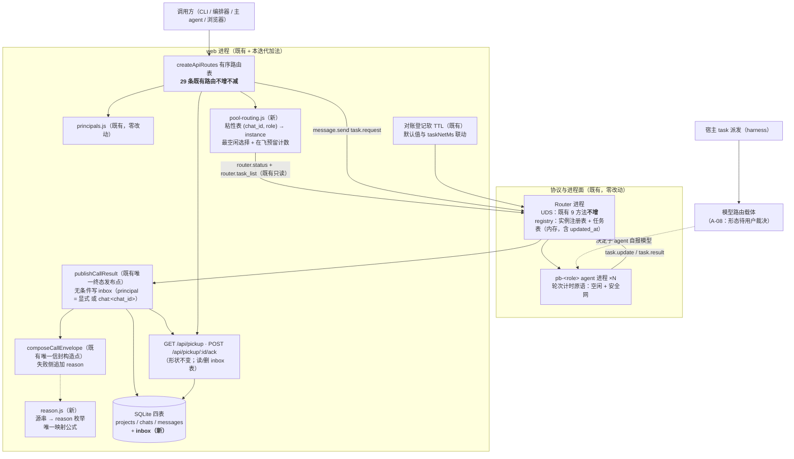

# architecture.md — 0030-hub-communication-upgrade

**版本**: 1.0.0
**迭代**: 0030-hub-communication-upgrade
**阶段**: 3（技术架构）
**创建日期**: 2026-09-17
**输入**: `prd.md`（v1.0.0 索引）+ `prd/*.md`（10 卡；F01~F07 的 `[架构待填]` A-01~A-09 待填、F08 的 A-08 待填、F09/G01 声明无待填项）+ `deferred-demand-changes.md`（D-35 载体的搭置记录）+ **现有代码库实测**（`oamp/src/**`、`oamp/API.md`、`oamp/README.md`）+ 既有架构基线（`docs/iterations/0029-hub-client-session-and-duplex/architecture.md`，只读参考）
**产出**: 本文档 + `prd/*.md` 8 张卡的「架构维度」段回填（A-01~A-09 全部填定）+ 本角色决策记录
**未读（按角色契约）**: `demand.md`（不作为设计依据；本文件引用的 demand 条款、决策 D-20~D-36、事实 F-1~F-12 均**经由 prd 卡片转述**，且凡涉实现的事实一律**以代码复核**，见 §1.2）

本文档回答 prd 的全部 9 条架构待填项（A-01~A-09 逐条落定见 §4），给出组件与数据流（§2/§3）、变更面清单（§5）、对既有面的零影响声明（§6，逐条对 G01 验收 1~12）、决策分级与 **L1 清单**（§7）、奥卡姆检验（§8）、已知局限（§9）、待用户裁决项（§10）、回填与越界声明（§11）。

**prd 阶段上报的三项疑问在本文件给出具体裁决**：疑问 1 / MI-5（`reason` 源串全函数映射、`agent_error` 归属、参数化串解析口径）→ **§4 A-03 / A-04**；疑问 2（收件箱存储层清理策略）→ **§4 A-09**；疑问 5（模型绑定两处真源）→ **§4 A-08**（技术与事实评估，**不作架构判断收口**）。

---

## 0. 一句话方案

**在既有的两个进程（web = HTTP/SSE 面 + SQLite；Router = UDS 面）上做加法，不新增进程、不新增技术栈、不新增第三方依赖、不新增协议方法**：

| 加法项 | 数量 | 落点 |
|---|---|---|
| 新增源文件（叶子模块） | **2** | `src/reason.js`（源串→`reason` 枚举的**唯一**映射公式）／`src/pool-routing.js`（池内选择 + 粘性表） |
| 新增 SQLite 表 | **1** | `inbox`（`src/persist.js` 的 `SCHEMA` 内增量 DDL + 1 索引 + 3 个方法） |
| 既有唯一终态发布点的补线 | **1 处** | `publishCallResult`：取件写入从"仅显式 `requester`"改为**无条件**（身份 = 显式 principal **或** 缺省 `chat:<chat_id>`），写入面由进程内表改为 `inbox` 表 |
| 既有"角色→实例"解析的替换 | **1 处** | `/api/calls` 的 `instanceIdForRole(role)` → 池内选择（`router.status` + `router.task_list` 两个**既有**只读方法） |
| 既有轮次计时原语的改造 | **3 处同构点** | `acp-client` / `rpc-client` / `oneshot-client` 的 turn timer：**单绝对上限** → **空闲计时 + 安全网计时**（门挂起冻结语义保留） |
| 新增配置键 | **2** | `taskIdleMs`（默认 `600000`）/ `taskNetMs`（默认 `14400000`），env `OAMP_TASK_IDLE_MS` / `OAMP_TASK_NET_MS`（沿用"测试可压缩时间轴"的既有先例） |
| 既有响应/请求面的追加 | **3 项** | 失败终态信封追加 `reason`；`POST /api/calls` 项追加可选 `new_session`；`GET /api/pickup` 的条目 `acked` 恒 `false`（见 §9-1） |
| 退役 | **1 个文件** | `src/pickup.js`（其职责由 `inbox` 表承接；调用点全部迁移） |

**既有面（4 条 SSE 推送面的事件类与语义 / 既有 `state` 词表 / 既有 `error` 键位与取值形态 / 取件端点契约与参数名 / Router 任务表的内存语义 / 既有 UDS 8+1 方法与错误契约 / `cluster.json` 与 `roles/**`）逐字不变**（逐条见 §6）。

**被替换的语义只有一处**：`omp` / `omp-daemon` 两条 LLM 执行路径的**默认**轮次判据，由"距开始 30 分钟"改为"距最近一次进展 10 分钟 **或** 距开始 4 小时"（显式传入的 `timeout_ms` 语义不变，见 §4 A-05）。

---

## 1. 架构基线（实测，非推断）

### 1.1 现状组件与关键代码位置（本迭代的全部接入点）

| 面 | 现状（实测） | 位置 |
|---|---|---|
| 进程拓扑 | 三进程：`Router`（UDS + 注册表 + 任务表，全内存）／`web`（Node 内建 http + `node:sqlite`）／`pb-<role>` agent 节点 | `src/router.js` / `web.js` / `agent.js` / `cluster.js` |
| HTTP 面 | `createApiRoutes(deps)` 返回有序数组 —— **29 条路由**（`method:` 登记数：`awk '/function createApiRoutes/,0' src/web.js \| grep -cE "method: '(GET\|POST\|PUT\|DELETE)'"` = 29，与 `API.md` §3 编号至 29、`llms.txt` 头部"接口（29 条）"三处同值）；错误契约 = `ERR_CODE` 封闭 5 码 + `sendError` 唯一构造点（**本迭代不新增路由** ⇒ 与迭代前同值，见 §5/§10-8） | `src/web.js:createApiRoutes / sendError` |
| 调用面派发 | `/api/calls` handler：校验 → **`const agentId = instanceIdForRole(role)`**（角色↔实例 **1:1 硬解析**，仅校验角色文件存在）→ 逐项 `sendTask(agentId, …)`；**该 handler 的投递失败分支（404 `agent 不可用: <role>（无对应在线实例）` / 502 `UPSTREAM_UNAVAILABLE`）在当前实现下不可达**（`sendTask` 吞错，见 §9-13；404 实际只由"角色不可解析"触发） | `src/web.js:1342 / 1468-1472` |
| 调用登记 | `tasks: Map<call_id, entry>`（entry 含 `chatId/agentId/lines/landed/attempts/slow/registeredAt/timer/call`）与 `callSchemas: Map<call_id, call>`；`call = {callId, role, chatId, requester, outputSchema, schemaMode, done, resolve, published, working, terminal}` —— **全部进程内** | `src/web.js:1443 / 2149-2164` |
| 终态发布链 | agent 投递 → `handleDeliver(task.result)` → `finishTask(entry, body)`（落 `out` + `message` + `chat_state`）→ `queryOnce(router.task_get)` → **`publishCallResult(task, entry)`（唯一发布点）**；对账兜底 `reconcileTask` 走**同一发布点** | `src/web.js:handleDeliver / finishTask / publishCallResult / reconcileTask` |
| 终态信封 | `composeCallEnvelope(task, call)`：**10 键固定键序**（`call_id/agent/state/duration_ms/model/truncated/text/structured_output/error/exit_code`；实测返回键为 10，`src/web.js:539` 的模块注释写"11 键"为既有注释滞后，见 §10-12），`error` 为自由字符串；strict 结构校验失败时以 `error='structured_output_invalid'` **覆写**则 state 降为 `failed` | `src/web.js:539-558` |
| 取件面 | `src/pickup.js`：**进程内** `Map<call_id, {call_id, requester, agent, chat_id, terminal_at, acked}>`（指针，不存正文）；写入点 = `publishCallResult`，条件 = **`call.requester !== null`**；读取 = `listByRequester` 逐条 `queryOnce(router.task_get)` **现算信封**；ack = 置 `acked=true` 移出集合 | `src/pickup.js` / `web.js:1627-1642 / 1791-1796 / 2223-2231` |
| 身份面 | `src/principals.js`：进程内表 + `requesterOf(source)` 单一接缝；`/api/calls` 把**空串**归为 `null`（既有行为） | `src/principals.js` / `web.js:1347` |
| 持久层 | `src/persist.js`：`node:sqlite` `DatabaseSync`，`SCHEMA` 字符串 + `CREATE … IF NOT EXISTS` 幂等建表（无迁移机制）；三表 `projects/chats/messages` + 4 索引；SQL 只在本模块 | `src/persist.js` |
| 执行侧 | `runDaemonTask`（常驻上下文）／`runOmpTask`（一次性）／`runShellTask`；增量经 `sendUpdate('working', {kind,…})` → `task.update`；终态经 `sendTaskMessage(…, 'task.result', body)` | `src/agent.js:388-503` |
| 轮次上限（**F05 的改造对象**） | 3 个同构 turn timer：`acp-client.prompt(timeoutMs=1800000)` + `_request` timer（:319/:433）、`rpc-client.armTurnTimer(DEFAULT_TURN_TIMEOUT_MS=1800000)`（:14/:204）、`oneshot-client`（`DEFAULT_TIMEOUT_MS=1800000`，:17/:160）；agent 侧默认 `DEFAULT_OMP_TIMEOUT_MS=1800000`，显式值上限 `MAX_TIMEOUT_MS=1800000`（`parseTaskBody` 校验）；**门挂起期间计时冻结**（0029 L1-1） | 三客户端 + `agent.js:30-32/91-144` |
| 既有失败串（F04 的映射对象） | 见 §4 A-04 的完整表（13 种已知形态 + 1 个开放文本来源 `err.message`） | `agent.js` / `acp-client.js` / `rpc-client.js` / `context-pool.js` / `oneshot-client.js` / `router.js` / `web.js` |
| Router 只读面 | `router.status`（任意连接可查，节点 5 字段 = `instance_id/session_id/state/last_heartbeat/connected`）与 `router.task_list`（10 列，含 `to`/`state`/`started_at`）；`message.send` 对目标要求 `state==='online'` **且** `connId !== null`，否则 `AGENT_OFFLINE` | `src/router.js:100 / 372-460` / `src/registry.js:156-169 / 275-300` |
| 负载投影（**可直接复用**） | `deriveAgentWork(taskRows)`：按实例算 `{busy, current_call_id, queued, since}` —— 已服务 `GET /api/agents` 与 `agent_state` 帧 | `src/web.js:214-235` |
| 映射体例（**照抄**） | `src/role-binding.js`：叶子模块、零依赖、"公式只此一处" | `src/role-binding.js` |
| 文档面机械锁 | `hub doctor` R1 双向比对（新增**路由**必须登记 `API.md` §3）；`llms.txt` 为生成快照 | `sdk/doctor.js` / `scripts/gen-llms-txt.mjs` |
| 本迭代范围外但**必须联动** | `RECONCILE_TTL_DEFAULT_MS = 30 * 60 * 1000`（web 对账登记软 TTL）：**超时即删登记**，此后迟到的 `task.result` 在 `handleDeliver` 查不到 `entry` 被**丢弃** ⇒ 终态永不发布。代码自述"agent 侧 omp 超时上限亦为 30 分钟 ⇒ 覆盖关系由「有余」变为「持平」，待优化" | `src/web.js:76 / 2286-2289 / 2353` |

### 1.2 prd 事实线索的代码复核（以代码为准）

| 线索 | 复核结果 | 证据 |
|---|---|---|
| F-2：`pickup` 是选择性的（只有传 `requester` 才写入） | **成立** | `web.js:2223` `if (call.requester !== null) pickup.add(…)` |
| F-2 续：ack 只置标记、条目不去留 | **成立** | `pickup.js:ack()` 置 `acked=true`；`listByRequester` 过滤 `acked===false` ⇒ **响应里的 `acked` 恒为 `false`**（可观测行为：列表只含未取件条目） |
| F-2 续：取件面为进程内表，重启即丢；且**重启后即使有条目也拿不到正文**（信封由 Router 任务表现算） | **成立（本迭代的关键约束）** | `web.js:1639` `envelope: task ? composeCallEnvelope(…) : null`；Router 任务表纯内存 |
| F-4 / MI-5：失败原因塞自由字符串、全仓 13 种形态 | **成立**（并**新增一条** prd 未列的形态：`executor:'omp'` 失败路径直接透传 `err.message`，形态**不可穷举**） | `agent.js:224` `error: err && err.message ? err.message : '一次性执行失败'` ⇒ §4 A-04 |
| F-5：30 分钟为**绝对总时长**，通道层不可绕 | **成立**：默认档在 agent 侧（`DEFAULT_OMP_TIMEOUT_MS`）经三客户端 turn timer 生效；`MAX_TIMEOUT_MS` 使显式值也 ≤30 分钟；`mode:block` 只是 web 侧挂起 HTTP ⇒ 与 `background` 同一条执行路径 | `agent.js:31-32/91-144`、`acp-client.js:319`、`rpc-client.js:14`、`oneshot-client.js:17`、`web.js:1442` |
| F-5 续：另有**一处 30 分钟**（web 对账软 TTL）会间接吞掉长任务终态 | **成立（prd 未列，本文件补入判决）** | `web.js:76/2286`；见 §4 A-05 的"生效位置清单"第 6 条 |
| F-6：`last_event_at`/`idle_ms` 已存在但未驱动判死 | **成立**：`updated_at` 由 `createTask`/`recordTaskUpdate`/`finishTask` 三处维护；web 的 roster 暴露 `last_event_at`；无任何判死逻辑读它 | `registry.js:196-260`、`web.js:1500-1516` |
| F-7：`ContextPool` 同键单 in-flight | **成立**：键 = `(chat_id, agent_id)`，`agent_id` 实参 = agent 进程的 `instanceId`（`ctx.instanceId`） | `context-pool.js:10/137-147`、`agent.js:366` |
| F-8：角色↔实例硬编码 1:1 | **成立**（唯一公式在 `role-binding.js`；web 侧 `instanceIdForRole` 是唯一调用点） | `web.js:1342`、`role-binding.js:29` |
| D-22 边界：Router 任务表继续纯内存 | **成立**（`tasks` Map，无淘汰） | `registry.js:197-260` |
| D-35 载体：项目 agent 文件 + `modelRoles` 别名 | **harness 事实（文档面复核）**：发现根含 ①**最近的项目 `.omp/agents`（按会话 cwd 定位）** ②**用户 `~/.omp/agent/agents`**；`modelRoles` 在 `~/.omp/agent/config.yml`（该文件**已存在**且已有 `modelRoles.default`）；`task` wire schema 不暴露模型字段 | `omp://task-agent-discovery.md`；实测 `~/.omp/agent/config.yml` |

### 1.3 既有面的硬约束（本迭代必须保持）

1. **4 条 SSE 推送面的事件类集合与语义逐字不变**（G01 验收 1）：`chat:<id>`（message / task_update / chat_state / notice）、全局（agent_online / agent_offline / confirmation / chat_state）、`chat-calls:<id>`、`call:<id>`（call_state / call_update / call_result）。
2. **`state` 词表封闭四值**，不新增第三个终态；取消仍落 `failed`（G01 验收 2）。
3. **既有 `error` 键**：键位、拼写、取值形态（含既有文案）不变；**不做任何既有错误文案的统一/重写**（G01 验收 3 / F04 边界）⇒ 本方案对既有失败产生点**零改动**（唯一的例外是"新增 `reason` 键"，见 §4 A-03）。
4. **取件端点契约不变**（G01 验收 4）：`GET /api/pickup?principal=&epoch=` 与 `POST /api/pickup/:call_id/ack?principal=&epoch=` 的**参数名、响应结构、确认语义**不变；变的只有"何时写入"与"正文从哪读"。
5. **Router 任务表的内存语义不变**（G01 验收 5）；**既有 UDS 方法集合不变**（不新增第 10 个方法）。
6. **绑定与角色定义约束不变**（G01 验收 11）：只绑 `dev`/`verifier`；模型值不进 `roles/*/*.md`；`cluster.json` 零改动。
7. **零第三方依赖、零新进程、零新端口/socket**（`oamp/package.json` `dependencies: {}`）。
8. **不新增 `demand.md` 之外的功能点**（G01 验收 12）：本方案不含 Router 任务表持久化、产物核实、隔离边界协议、实例生命周期管理、无状态均衡、`transcript` 截断修复、惰性启动竞态修复、HB-01 的三个备选、HB-04 的可见性诉求。

---

## 2. 组件与拓扑



**组件清单（1~5 条）**

1. **既有 web 进程** —— 承载全部新增落点：收件箱唯一写点（`publishCallResult`）、`inbox` 表读写、池内选择与粘性表、`reason` 映射消费、对账 TTL 默认值联动。
2. **既有 Router 进程** —— **零改动**：`router.status` / `router.task_list` 是池成员与负载的**唯一读数来源**；任务表继续纯内存。
3. **既有 agent 进程（执行侧）** —— 轮次计时原语由"单绝对上限"改为"空闲 + 安全网"（3 个协议客户端同构改造）；失败输出面（`task.result` 的字段集与文案）**不变**。
4. **既有 SQLite 持久层** —— 新增 1 表 1 索引 + 3 个方法；既有三表与全部读口零改动。
5. **新增两个叶子模块** —— `reason.js`（纯映射）、`pool-routing.js`（选择 + 粘性表 + 预留计数）；均零依赖、零定时器、体例照 `role-binding.js` / `pickup.js`。

---

## 3. 核心数据流

### 3.1 权威送达：终态必然进收件箱（F01 + F02 + F03）

1. `/api/calls` 逐项装配时**一次性**算出归属身份（A-02）：
   `principal = (显式 requester 非空) ? requester : 'chat:' + chatId`（既有的空串归 `null` 行为原样保留 ⇒ MI-3 天然成立），写进 `call.principal`（**替代** `call.requester` 一字段；`warnings` 的出现条件仍只看出否显式给出）。
2. 终态 ⇒ `publishCallResult`（唯一发布点）：
   - 组信封（失败侧含 `reason`，A-03）→ 写 `call.terminal`（既有）→ **无条件**写收件箱：
     `db.insertInbox({call_id, principal, agent: role, chat_id, terminal_at: now, envelope})`（`INSERT OR IGNORE`：重复发布/对账重入幂等，且**不覆盖首条**——与既有 `pickup.add` 的幂等口径逐字一致）；
   - 再发 SSE（`call:<id>` + 过滤面）→ 关流 → 解等待句柄（既有顺序不变）。
3. 取件（**不再是第二真源**，且**不依赖 Router 任务表**）：
   `GET /api/pickup?principal=` ⇒ `db.listInbox(principal)` ⇒ 逐条
   `{call_id, requester: row.principal, agent, chat_id, terminal_at, acked: false, envelope: JSON.parse(row.envelope)}`。
   信封即步骤 2 写入的那一份 ⇒ **重启前后逐字节一致**（F03 验收 1/5），且与 `GET /api/calls/<id>` 现算的信封同源同值（同一函数、同一输入，终态后不可变 ⇒ F01 验收 5）。
4. 确认：`POST /api/pickup/:call_id/ack` ⇒ `db.deleteInbox(call_id)`（幂等删；返回 `{call_id, acked:true}` 不变）。

### 3.2 缺省身份（F02）

| 环节 | 落点 |
|---|---|
| 派生点（**唯一**） | `web.js:/api/calls` handler 的逐项装配处（`call.principal` 的三目赋值）；无第二分支、不双写 |
| 传递路径 | `call.principal` → `entry.call`（进程内）→ `publishCallResult` → `inbox.principal` 列 |
| 与显式分支的合流 | 同一处三目（`explicit ?? 'chat:'+chatId`）；显式优先、不合并（MI-1） |
| 取件面过滤 | `WHERE principal = ?`；调用方自行构造 `chat:<chat_id>`（MI-2）。形态经既有 `validPrincipalId` 校验：`chat:chat-<uuid>` 共 46 字符、全可打印 ASCII ⇒ **零新增校验分支** |
| 无需登记 | 缺省身份**不写入** `principals` 表（纯过滤键；登记只服务"显式声明 + 自派发判定"）⇒ 零新增内存增长 |

### 3.3 空闲超时 + 安全网（F05）

1. **进展信号口径（一处规则）**：一次轮次内的**每一个增量事件**（`onDelta`：`chunk` / `thinking` / `tool_call` / `tool_output` / `stdout` 行 / `truncated` 控制条目）+ 轮次开始事件（`started`）。这与 MI-7 的"`task.update` 类事件"是同一批事实：agent 对每个增量都调用 `sendUpdate('working', …)` 产出 `task.update`，Router 记 `updated_at`。
2. **判据落点（统一实现位置）**：**轮次计时原语**——即既有 30 分钟绝对上限的**唯一实现处**（`acp-client` / `rpc-client` / `oneshot-client` 各一份同构实现）。改为双计时：
   - `idle`：自最近一次进展事件起算，达 `taskIdleMs` ⇒ 判死；
   - `net`：自轮次开始起算，达 `taskNetMs` ⇒ 判死；
   - **门挂起冻结语义保留**（人工审批/提问等待期间两个计时器一同冻结，0029 L1-1 不回归）。
3. **两种执行形态的统一性**：`mode:block` 只是 web 侧 HTTP 挂起（`call.resolve`），执行路径与 `background` **完全相同** ⇒ F05 验收 7 的"`mode:block` 不可绕"由构造满足，web 侧**零新增分支**。
4. **阈值来源**：`loadConfig()` 新增 `taskIdleMs` / `taskNetMs`（默认 `600000` / `14400000`，env `OAMP_TASK_IDLE_MS` / `OAMP_TASK_NET_MS`，沿用既有 `readPositiveInt` 校验 ⇒ 非法值启动即报错）。env 存在理由 = ① 验收 5「初值可调」；② **阶段 5/6 必须能压缩时间轴**验证（10 分钟/4 小时的真实等待不可行）——先例 = 既有 `OAMP_WEB_RECONCILE_*` 的注释"供测试压缩时间轴"。
5. **触发后走既有唯一终态路径**：`ProtocolError('timeout')` → agent 上报 `task.result{state:'failed', error:'timeout'}` → Router `finishTask`（唯一终态写点）→ web 唯一发布点 ⇒ 取件/订阅/等待三面**同一条**（验收 6）。
6. **人类可读面区分两种触发**（验收 4）：ProtocolError 的 message 区分（如 `轮次空闲超时（空闲 600000ms）` / `轮次安全网超时（累计 14400000ms）`）；承载 = 既有失败路径的 `text`（daemon）或 `error`（shell / one-shot 的参数化串）⇒ **不新增枚举值、不新增子层级**（D-29）。
7. **生效位置清单**（验收 7 的可核对形态）见 §4 A-05。

### 3.4 池化与池内路由（F06 + F07）

1. 派发时（`/api/calls` handler）：每个请求取**一次**池与负载快照 —— `queryOnce(router.status)` + `queryOnce(router.task_list)`（两个既有只读方法，**不新增协议方法**）；
   - **池成员** = `roleOfPoolInstance(node.instance_id) === role && node.state === 'online' && node.connected === true`（`connected=false` 的节点投递必然得 `AGENT_OFFLINE`，纳入池只是浪费选择）；`roleOfPoolInstance` = **多实例感知的角色解析**（`pb-<role>` 或 `pb-<role>-<n>`：先走既有精确公式，未命中再剥后缀复用同一公式；约定全文与来源见 **§4 A-06 补定**），且**与 `GET /api/agents` 的 `role` 列同源**（同一函数，不各写一遍）；
   - **负载** = 复用 `deriveAgentWork(taskRows)` 的 `{queued, busy}` + `pool-routing` 维护的**在飞预留计数**；次序键 = `(queued, busy, inflight, instance_id)` 的字典序最小值 ⇒ 确定性、可复现（验收 2/5 可判定）。
2. **粘性**：`pool-routing` 内 `Map<'<chat_id>\u0000<role>', instance_id>`：
   - 命中且该实例 ∈ 池 ⇒ 复用（验收 1）；
   - 未命中 / 命中但实例已不在池（MI-11）/ 调用方本次声明 `new_session: true`（验收 3）⇒ 按最空闲重选并**重绑**（不报错，跨轮上下文可能断 = D-30 的代价，卡内已声明）；
   - 池为空（MI-9）⇒ 返回 `null` ⇒ 调用方回落 `instanceIdForRole(role)`（既有目标解析）⇒ 响应与**基线逐字一致**（实得 HTTP 200 + 受理态 `submitted`；投递失败在 `sendTask` 内被吞，见 §9-13），**不静默排队到未来实例、不自动拉起实例、不新造错误面**。
3. **在飞预留**：选中 ⇒ `inflight[instance] += 1`；`sendTask` settle（成功或失败）⇒ `-= 1`。作用：两条并发、不同 `chat_id` 的派发若在"读负载 → 落 Router 任务表"窗口内交错，会同时选中负载相同的实例，使 F06 验收 1 **假失败**；预留计数是让该验收**确定性成立**的最小机制。
4. **单实例不回归**（验收 2）：池内只有 1 个在线成员时，选择结果恒为该成员（不额外排队、不新增错误面）；该成员即 `pb-<role>`（既有唯一形态）时，目标与投递路径与迭代前**逐字相同**（多实例形态 `pb-<role>-<n>` 是本迭代新增的命名约定，见 §4 A-06 补定）。
5. **不改变既有 `ContextPool` 键语义**（F06 验收 4 / F07 验收 4）：粘性表只回答"落到哪个实例"；选定后 `ContextPool` 的既有键 `(chat_id, instance_id)` 自然命中同一实例的常驻会话——粘性表**不替代、不改写**该键空间。
6. **可观测性（验收 5）**：目标实例经**既有标识面**可读——`GET /api/agents` 行的 `instance_id` + 既有五字段投影（`busy`/`current_call_id`/`queued`/`since`，0029 已建），以及转录条目的 `from`（= 上报实例 id）⇒ **不新增第二套标识**。

### 3.5 模型归属（F08）——载体形态待裁决

链路事实（harness 文档面复核）：宿主 `task` 派发**只设 `agent` 不设模型**；子 agent 的模型解析优先级 = `task.agentModelOverrides[agentName]` → agent 文件 frontmatter `model` → 父会话生效模型/默认；`modelRoles` 提供别名展开；`task` wire schema 不暴露模型字段。⇒ 让"`dev` 跑 gpt / `verifier` 跑 grok"落地，**只能靠子 agent 身份本身**（按名字找到一份带 `model` 的 agent 定义），因此派发时必须按角色名指定 `agent`（`tasks[].agent = 'dev' | 'verifier'`，其余角色走默认 agent ⇒ "其余角色 = 当刻默认"自动成立）。载体形态的三候选技术评估与推荐见 §4 A-08（**待用户裁决，本文件不选定**）。

---

## 4. A-01 ~ A-09 逐项答案

> 每项给出：**结论**（可直接实现的形态）→ **理由** → **追溯**（来源卡 / 验收项 / MI / D）。

### A-01 权威送达路径与持久层的落地形态（追溯：F01 验收 1~6；F03 验收 1~5；D-20 / D-22）

- **写入点 = 既有唯一终态发布点 `publishCallResult`**（`web.js:2215`）。改造 = 两条：① 条件由 `if (call.requester !== null)` 变为**无条件**（身份取 `call.principal`）；② 写入面由 `pickup.add` 变为 `db.insertInbox`。**不新增发布点**、不新增第二个终态源。
- **存储形态**：`persist.js` 的 `SCHEMA` 内增量 DDL（`IF NOT EXISTS` 幂等，沿用无迁移机制的既有口径）：
  ```sql
  CREATE TABLE IF NOT EXISTS inbox (
    call_id     TEXT PRIMARY KEY,   -- = task_id；主键 ⇒ 同一调用至多一条（F01 验收 4）
    principal   TEXT NOT NULL,      -- 显式身份 或 缺省 chat:<chat_id>（A-02）
    agent       TEXT,               -- 角色名（既有信封同口径）
    chat_id     TEXT,
    terminal_at INTEGER NOT NULL,   -- epoch ms（写入时刻）
    envelope    TEXT NOT NULL       -- composeCallEnvelope 的终态信封 JSON（唯一写点产物）
  );
  CREATE INDEX IF NOT EXISTS idx_inbox_principal ON inbox(principal, terminal_at);
  ```
- **为什么存**整份**信封（而不是"只存指针、读时现算"）**：终态一旦产生，Router 任务表（内存）与 `callSchemas`（内存）都可能消失；重启后"现算"缺少 `task.result` 与 `output_schema` ⇒ `structured_output` 不可复算，正文不可得（实测：现状 `pickup` 路由在 `task === null` 时给出 `envelope: null`）。存写入点产出的那一份信封 ⇒ 重启前后逐字节一致（F03 验收 5），且**不引入独立状态语义**：内容由唯一写点一次性产出、无第二处维护（D-14 延续）。
- **写入时机**：只在终态发布那一刻写一次（`submitted`/`working` 在持久层**无记录** ⇒ F03 验收 3）；`INSERT OR IGNORE` ⇒ 重复发布/对账重入幂等（幂等口径与既有 `pickup.add` 的"不覆盖首条"逐字一致）。
- **按身份过滤路径**：`db.listInbox(principal)` = `SELECT … FROM inbox WHERE principal = ? ORDER BY terminal_at ASC`（覆盖索引 `idx_inbox_principal`）。**取件面不再逐条查 Router**：这既去掉 N 次 UDS 往返，也让"跨重启可查"成立。
- **响应形状零变化**：条目仍为 `{call_id, requester, agent, chat_id, terminal_at, acked, envelope}`（`requester` 列名与位置不变，取值域扩展为"显式 principal 或 `chat:<chat_id>`"）；`acked` 恒 `false`（见 §10 提请知会）。
- **退役 `src/pickup.js`**（3 个调用点全部迁移：`publishCallResult` / `GET /api/pickup` / `POST /api/pickup/:call_id/ack`）。理由：SQL 在本仓库**只此一处**（`persist.js`）；若保留 `pickup.js` 作二层包装，则"进程内表 + 持久表"两份登记并存 ⇒ 漂移面，且它的三个函数中两个只是 SQL 的直译（净增抽象，无收益）。
- **边界**：不写非终态、不写过程事件、不做归档/导出/游标（F01/F03 边界）。

### A-02 缺省身份的派生点与承载（追溯：F02 验收 1~5；MI-1~MI-3；D-21）

- **派生点（唯一点）**：`/api/calls` handler 的逐项装配处 —— `const principal = requester ?? \`chat:${chatId}\``（`requester` 已由既有代码把空串归一为 `null` ⇒ MI-3 无需改动）。
- **承载**：`call.principal`（字段由 `call.requester` **改名**，仍是进程内单字段）；**不进 UDS 信封、不进 Router 任务表**（既有约束：`from` 由投递连接代填 `'web'`）。
- **合流位置**：上述三目即合流点；**无第二分支、不双写**（MI-1：显式优先、不合并）。
- **取件面过滤实现**：`WHERE principal = ?`（SQL 单条件）；调用方按 `chat:<chat_id>` 自行构造查询（MI-2），形态满足既有 `validPrincipalId`（实测 46 字符 ≤64、可打印 ASCII）⇒ 取件端点的参数校验**零新增分支**。
- **`warnings` 契约不变**：自派发告警的依据仍是"**显式**身份所声明的 `instance_id`"（缺省身份不登记 ⇒ 永不触发）⇒ F02 验收 5「不传身份时响应面与迭代前逐字一致」由构造满足。
- **不登记缺省身份**：`principals` 表零新增条目（它是"显式声明 + 实例归属"的登记面，不是过滤键的索引）。

### A-03 `reason` 的键位与序列化形态（追溯：F04 验收 1~5 / 7；MI-4~MI-6；D-23 / D-29）

- **映射公式落点**：新增叶子模块 `src/reason.js`，导出唯一函数
  `reasonOf(state, error) → 'agent_error' | 'cancelled_by_client' | 'infra_error' | 'timeout' | 'rejected' | null`（**仅在 `state === 'failed'` 时返回非 null**）。体例逐条照 `role-binding.js`：零依赖、"公式只此一处"、纯函数（可独立验收）。
- **信封落点**：`composeCallEnvelope`（既有唯一信封构造点，`web.js:539`）在 `state === 'failed'` 时**追加** `reason` 键：
  - 追加在既有 **10 键** 之后（**末位**）⇒ 既有键名与键序零改动；
  - `state !== 'failed'` ⇒ **不带该键**（MI-4：成功侧不新增字段，`POST /api/calls` 的受理态信封与成功终态信封键集不变）；
  - 取值必须 ∈ 五值闭集：`reasonOf` 的返回值在 `failed` 时**恒非 null**（兜底归 `agent_error`，见 A-04）⇒ F04 验收 1「不存在缺 `reason` 或取枚举外取值」由构造满足。
- **持久化落点**：`inbox.envelope` 列内的 JSON —— **不单列一列**（`reason` 无独立查询需求，YAGNI；何况它必须与信封其余字段同源同字节）。
- **序列化形态**：字符串字面量（非对象、非子枚举）；`timeout` 不分子层级（D-29）。
- **`call.terminal` 不动**（仍是 `{state, error}`）：roster / 转录读的是 `state`，本方案不需要它们多读一个字段 ⇒ 少一处改动。
- **唯一消费点**：`composeCallEnvelope` 一处 ⇒ 信封面（`/api/calls` 响应、`/api/calls/<id>`、`/api/calls/wait`、`/api/pickup`、SSE `call_result` 帧）**全部同源**（F05 验收 6 的"同一条"由此保证）。

### A-04 全仓引用点收口：完整映射表 + `agent_error` 归属 + 参数化串口径（追溯：F04 验收 1~4；MI-5；疑问 1；D-23）

**裁决 1：完整源→枚举映射表（对"所有可能进入终态 `error` 的自由字符串"成立）**

映射表按 **（源串形态，产生点）** 定义；匹配规则 = ① 精确匹配 → ② 三条前缀规则 → ③ 兜底。

| # | 源串形态 | 产生点（代码位置） | 枚举 |
|---|---|---|---|
| 1 | `cancelled` | `router.js:405`（`router.task_cancel`）；`web.js:2199`（web 侧取消收口） | `cancelled_by_client` |
| 2 | `rejected_by_agent` | `router.js:370`（`task.request` 被目标 `ack{status:'rejected'}`） | `rejected` |
| 3 | `structured_output_invalid` | `web.js:555`（strict 且结构未通过的覆写） | `rejected` |
| 4 | `permission_denied` | `acp-client.js:354/358`（审批门拒绝）；`rpc-client.js:347`（审批门无收件人） | `rejected` |
| 5 | `model_unavailable` | `acp-client.js:378`（`set_config_option` 被拒） | `rejected` |
| 6 | `context_busy` | `context-pool.js:140`（同键队列满）；`rpc-client.js:116`（already processing） | `rejected` |
| 7 | `timeout` | `agent.js:233`（daemon 失败码）；`rpc-client.js:251` / `acp-client.js:433`（轮次超时） | `timeout` |
| 8 | `timeout_after_<N>ms` | `agent.js:221`（one-shot）；`agent.js:485`（shell） | `timeout` |
| 9 | `context_crashed` | `acp-client.js:297/303/320/321/425/449/456/850`（会话/初始化/stdin/子进程）、`rpc-client.js:161/280/535/542/585`（握手/进程）、`context-pool.js:138/155/165/178/234/249`（键释放/排队轮次）、`oneshot-client.js:108/110/125/183/190` | `infra_error` |
| 10 | `spawn_failed: <msg>` | `agent.js:433`（shell `spawn` 同步抛错） | `infra_error` |
| 11 | `spawn_error: <msg>` | `agent.js:476`（shell 子进程异步 `error`） | `infra_error` |
| 12 | `dispatch_failed` | `web.js:1222/1464/1926`（**仅对话面 `out` 记录**；不在终态信封上，见下） | `infra_error`（防御性归属） |
| 13 | 自由文本（`err.message` / `一次性执行失败`） | `agent.js:224`（`executor:'omp'` 非超时失败**直接透传 message**） | 无法穷举 ⇒ **兜底** |
| 14 | 缺失 / `null` / 非字符串 / `task_failed` | `web.js:2247`（out 记录兜底串）；`composeCallEnvelope` 的 `result?.error ?? null` | `agent_error`（兜底） |
| 15 | 其余未匹配 | — | `agent_error`（fallback） |

**裁决 1 的三点说明（对应 question 1 的三处口径差）**：

1. **`task_failed` 与参数化 `timeout_after_<N>ms` 的归属**（决策文档映射表未列）：`timeout_after_<N>ms` → `timeout`；`task_failed` 是 **web 侧 `out` 记录的兜底文案**，它与"终态信封 `error` 为 `null`"是同一情形的两种载体 ⇒ 一并归 `agent_error`（第 14 行）。另注：**`dispatch_failed` 根本不在终态信封域**（实测：`/api/calls` 投递失败时 `tasks.delete(callId)` + `callSchemas.delete(callId)`，不产生任何终态信封，调用方得到的是 HTTP 错误码 + 一条对话 `out`）⇒ 表中列为防御性归属；MI-5 把它计入"13 种"是**字符串扫描**的结论，不是"进入信封"的结论，此处如实更正分类（不是驳回，是收窄适用域）。
2. **参数化串的解析口径**：**前缀匹配，不解析参数**——
   - `timeout_after_` 开头且 `ms` 结尾 ⇒ `timeout`（`N` 不参与归类，不解析数值）；
   - `spawn_failed:` / `spawn_error:` 开头 ⇒ `infra_error`（`:` 后任意文本，含空）。
   理由：三条参数化串的参数都不带语义；**不做关键字启发式**（HB-10 结论：纯文本启发式不足以判定证据合格），未匹配一律走兜底。
3. **`agent_error` 的来源归属（明确裁决 = 兜底类）**：它在现状里**本就没有专属源串**——决策文档映射表把它当"有源串的枚举值"列，是**表述缺陷**，不是遗漏。本方案给它的来源是两条可达路径：
   ① `state=failed` 且 `error` 缺失/非字符串（"agent 报了失败但没报原因"）；
   ② 未匹配任何已知形态的自由文本（`executor:'omp'` 路径透传的 `err.message`）。
   两条都归 `agent_error`，且都可被构造、可被观测 ⇒ 满足 F04 验收 2 情形②（"agent 自身执行出错"）与验收 1（五值可达）。
   **代价（如实记录）**：现状中"agent 执行体失败"与"会话/子进程基础设施失败"在**同一个串**上（`context_crashed` 一族既含会话崩溃、也含 `rpc prompt` 命令级失败），本迭代按决策文档把该族整体归 `infra_error` ⇒ 消费侧归类是**近似**。要精确区分须在**产生点**分码（新增轮次级 `ProtocolError` 码 + 扩展 `context-pool._failSession` 的轮次级集合 `{model_unavailable, context_busy, permission_denied, + 新码}`，否则会把轮次失败误当会话崩溃而拆会话），属跨迭代改造，本迭代不做（§9-1 / §10）。

**裁决 2：既有失败产生点的改造清单 = 空**（本方案对既有失败来源**零改动**）。理由：F04 验收 5 与 G01 验收 3 要求 `error` 的键位、拼写、取值形态**含既有文案**不变，且 F04 边界明文"不做既有错误文案的统一/重写"⇒ 任何"在产生点改写错误串"的做法都与之相撞。归类因此全部落在**消费侧唯一映射函数**（`reason.js`）内。新增点清单 = `src/reason.js`（1 文件）+ `composeCallEnvelope` 内 1 行。

**裁决 3：映射是全函数**（F04 验收 4）：已知形态 15 行全覆盖 + 显式兜底 ⇒ 不存在落空字符串；"全函数"由"精确 → 前缀 → 兜底"三段式**构造性保证**，不依赖对自由文本的穷举（第 13 行的存在使纯枚举比对在数学上不可能完备，这一点是 MI-5 结论的补强）。

### A-05 空闲判据的信号源与计时落点（追溯：F05 验收 1~7；MI-7 / MI-8；D-26~D-29）

- **信号源接入点**：与既有进展链**同一批事实**——轮次内的增量事件（`onDelta`）与轮次开始事件；等价于 MI-7 的 `task.update`（agent 对每个增量调 `sendUpdate` ⇒ `task.update` ⇒ Router `updated_at`）。**判死不读轮询、不看产物**（F05 边界；D-25）。
- **计时落点**：轮次计时原语（3 个协议客户端的 turn timer，即既有绝对上限的同一实现处）改为 `idle` + `net` 双计时；**门挂起冻结**语义保留（两计时同冻结）。
- **两条执行形态的统一实现位置**：执行侧轮次计时原语**一处**；`mode:block` 与 `mode:background` 在 web 侧只差"是否挂起 HTTP 响应"，执行路径相同 ⇒ 天然同源（验收 7 的 `mode:block` 项由此覆盖）。
- **计时起点**（MI-8）：`net` 自轮次开始起算；`idle` 自"轮次开始 **或** 最近一次进展事件"起算 ⇒ "开始到首个进展信号之间"同样受空闲阈值约束（与 MI-8 落卡一致）。
- **阈值透传通道（必要改动，实测依据）**：默认执行器（daemon）路径的选项通道是 `context-pool.js` 的 `ContextSession.prompt` —— 形参表（`:137`）、队列项（`:144`）、`client.prompt` 实参（`:170-174`）**全是显式键集** ⇒ 未列入的键被**静默丢弃**。实测（阶段 5，/tmp 参照实现）：不改该文件时，daemon 路径的阈值变 `null` ⇒ 任务 ≈2.5s 即判死（报文 `轮次安全网超时（累计 nullms）`）；若客户端补 null 防御，则退化为"该路径无计时器" ⇒ **F05 验收 2/3/6 在默认执行器路径不成立**。⇒ `context-pool.js` 的**两键透传**（`idleMs` / `netMs` 沿既有通道逐段透传：形参 → 队列项 → `client.prompt` 实参）是本卡**必要改动**；该文件受保护的语义（`(chat_id, agent_id)` 键语义、同键 FIFO 串行、LRU / 释放路径）**零改动**（见 §5、§6 的唯一例外）。
- **阈值配置面位置**：`src/config.js`（既有唯一配置面）的 `loadConfig()` —— `taskIdleMs`（默认 `600000`）/ `taskNetMs`（默认 `14400000`），env `OAMP_TASK_IDLE_MS` / `OAMP_TASK_NET_MS`；校验沿用 `readPositiveInt`（非法值启动即报错，不静默回落）。
- **判据取代既有上限的全部生效位置**（验收 7 的可核对清单，逐条已实测）：

  | # | 位置 | 处置 |
  |---|---|---|
  | 1 | `agent.js:31 DEFAULT_OMP_TIMEOUT_MS`（LLM 路径的**默认档**） | **移除**（缺省改传 `{idleMs, netMs}`） |
  | 2 | `acp-client.js:319 prompt(timeoutMs = 1800000)` | 改双计时（默认档移除） |
  | 3 | `rpc-client.js:14 DEFAULT_TURN_TIMEOUT_MS` / `armTurnTimer` | 改双计时（默认档移除） |
  | 4 | `oneshot-client.js:17 DEFAULT_TIMEOUT_MS` | 改双计时（默认档移除） |
  | 5 | `agent.js:32 MAX_TIMEOUT_MS`（显式值上限 30 分钟） | **保留**：它只约束"调用方显式声明的上限"，不再构成默认截断（call 面从不传 `timeout_ms`） |
  | 6 | **`web.js:76 RECONCILE_TTL_DEFAULT_MS`（对账登记软 TTL，30 分钟）** | **默认值改为与 `taskNetMs` 联动**（env `OAMP_WEB_RECONCILE_TTL_MS` 覆盖保留）；**判据是不变式而非近似值**：`缺省 TTL ≥ config.taskNetMs`（当前算式 = `taskNetMs + RECONCILE_SLOW_DEFAULT_MS`，即 4h + 30s；`RECONCILE_SLOW_DEFAULT_MS` = 30000）。**不联动即破 F01**：登记 30 分钟被清后，4 小时长任务的终态在 `handleDeliver` 查不到 `entry` 被丢弃 ⇒ 永不发布（代码自述"覆盖关系由有余变为持平，待优化"） |
  | 7 | `shell` 路径 `timeout_ms`（默认 30s、上限 30 分钟） | **保留**：命令超时是调用方期望的**硬上限**语义（与"推理空转"不同），且它不是 F-5 的现象面 |
  | 8 | `sdk/cli.js DEFAULT_WAIT_MS` / `surface.js BLOCK_WAIT_DEFAULT_MS`（30 分钟） | **不改**：它是**调用方的放弃等待预算**，不是判死位置（`API.md` §2.4 明文"超时只表示放弃等待…不产生失败结论"）。后果见 §9-6 |

- **显式 `timeout_ms` 的边界裁决**：语义**不变**（调用方声明的本轮绝对上限，≤30 分钟）；只移除"缺省即 30 分钟"这一档。理由：① `shell` 命令需要硬上限（第 7 条）；② 显式值是调用方的显式预算，不是需求的"判据残留"；③ call 面不暴露该参数 ⇒ 效果#4 的全部观测面都在新判据下。
- **文档面同步**（阶段 5）：`README.md` 的"omp 默认超时 1800s（30 分钟）"与 `API.md` 的相关条文需改写为"缺省 = 空闲 10 分钟 / 安全网 4 小时；显式 `timeout_ms` 仍为该轮绝对上限"。

### A-06 池成员判定与选择算法（追溯：F06 验收 1~5；MI-9；D-30 / D-32）

- **池成员读数来源**：`router.status` 的 `nodes`（既有方法、任意连接可查、零新增协议面）：`state === 'online' && connected === true && roleOfPoolInstance(instance_id) === role`。
  - 为什么要求 `connected`：`message.send` 对 `connId === null` 的节点直接回 `AGENT_OFFLINE`（`router.js:100`）⇒ 未连通的节点进池只是浪费一次选择。
  - `roleOfPoolInstance` = **多实例感知的角色解析**（见下方补定）：先走既有 `roleFromInstanceId`（`pb-<role>` 精确公式 + 角色文件存在性），未命中时剥离尾段 `-<n>` 再走**同一**公式 ⇒ 不重新实现角色↔实例映射公式（"公式只此一处"的既有取向不破），只新增"同角色多实例的后缀归一"这一条新知识。

- **补定：同角色多实例的识别约定（2026-09-17，来源见 §10-10）**
  - **约定的必要性（代码实测）**：hub 侧**无法**从协议面得知实例的角色 —— `agent.register` 载荷只有 `instance_id`（`agent.js:841` `client.register(instanceId)`），`registry.snapshot()` 的节点字段 = `instance_id / session_id / state / last_heartbeat / connected`（**无 role**，`registry.js:156-169`）。既有反向映射 `roleFromInstanceId` 只认 `^pb-(.+)$` 且要求 `<root>/roles/<role>/<role>.md` 存在 ⇒ `pb-dev` → `dev`，而 `pb-dev-2` 会去解析角色 `dev-2`（角色文件不存在）⇒ 返回 `null`。⇒ 若池成员判据只认精确公式，**同角色在线池上限恒为 1**，F06 验收 1 与效果#5 在端到端面**不可构造**。
  - **约定**：实例 id 形如 `pb-<role>` **或** `pb-<role>-<n>`（`n` = 正整数）即计入该 role 的池。**解析顺序**：① 先按既有精确公式（若 `roles/dev-2/dev-2.md` 真实存在，则 `pb-dev-2` **就是**角色 `dev-2` 的实例 —— 精确优先、向后兼容）；② 未命中再剥离尾段 `-<n>`，用**同一**角色文件存在性判据解析 `<role>`。⇒ 无歧义、无第二套角色真源；`pb-dev-1` 与 `pb-dev` 视为两个独立实例（不做别名等价）。
  - **用户侧启动方式**：`oamp agent start pb-<role>-<n> --role <role>`（**`--role` 必带**）：agent 侧的角色绑定 = `explicitRole || roleFromInstanceId(instanceId)`（`agent.js:677`），不带则 `pb-dev-2` 在 agent 侧同样绑不上角色（角色文件预检与 `--tools` 缺省档都会退化）；`--role` 的既有校验（无分隔符、非 `.`/`..`、角色文件必须存在否则退出 2）**全部保留**。
  - **落点与同源要求**：`roleOfPoolInstance(instanceId, baseResolve)` 由**新增模块** `src/pool-routing.js` **具名导出**（**冻结签名**：纯函数、不抛错、不 import `role-binding.js`——`baseResolve` 由调用方以参数传入，既有两公式因此**零改动** ⇒ §5「明确不改」清单与 §1.3 / §6 的声明逐字成立）；**池成员判定与 `GET /api/agents` 的 `role` 列必须消费同一函数**（`web.js:673` 现用 `roleFromInstanceId` ⇒ 不同步会出现"能进池但 role 列显示 `null`"的自相矛盾，直接损害验收 5 的可观测性），两处的 `baseResolve` 实参均为 `roleFromInstanceId`。
  - **作用域（不做扩散）**：**仅**手动启动的实例走该约定；`cluster.json` 管理的实例恒为 `pb-<role>`（`cluster-config.js` 的 `instanceIdForRole` 零改动）⇒ 与 D-30 / D-32（hub 不管生命周期、固定配置）一致。协议面**不加 role 字段**（备选"`agent.register` 自报 role + `snapshot()` 追加 role 字段"要改 `agent.js` / `router.js` / `registry.js` / `/api/agents` 投影四处并扩协议载荷，收益仅是省掉一条命名约定 ⇒ 不采纳，见 §9-10）。
- **负载读数来源**：`router.task_list`（既有方法）+ `deriveAgentWork`（**既有函数**，服务 `GET /api/agents` 与 `agent_state` 帧）⇒ "最空闲"不需要新度量。
- **选择口径**：次序键 `(queued, busy, inflight, instance_id)` 取字典序最小（`queued`/`busy` 来自任务表；`inflight` = 本进程"已选中未落表"的预留计数；`instance_id` 升序做确定性 tie-break）。
- **实现口径与调用点**：新增 `src/pool-routing.js`（叶子模块：粘性表 + `choose()` + 预留计数），在 `startWeb` 内接线为 `pickInstance(role, {chatId, noReuse, snapshot})` 并注入 `createApiRoutes` 的 deps（体例 = 既有 `sendTask` / `scheduleReconcile` 的注入方式）；替换点 = `/api/calls` handler 的 `const agentId = instanceIdForRole(role)`（**唯一调用点**）。
- **"既有角色→实例映射规则的替换落点"**：仅 `/api/calls` 一处；`role-binding.js` 的 `instanceIdForRole` **保留**（空池回落、`/api/messages` 面板路径、自派发判定仍用它），公式仍在唯一处。
- **空池行为**（MI-9）：回落 `instanceIdForRole(role)`（既有目标解析），随后与**基线逐字一致**——投递失败（`AGENT_OFFLINE`）在既有 `sendTask` 内被吞（`lastErr` 未被使用、循环结束后返回 `undefined`，见 §9-13），调用方实得 **HTTP 200 + 受理态 `submitted` 信封**；**不新造错误面**、不静默排队到未来实例、不自动拉起实例（MI-9 意图保留）。**404 `agent 不可用: <role>（无对应在线实例）` 只发生在"角色不可解析"**（如 `agent=nosuch-role`：`roleOfInstance(instanceIdForRole(role)) !== role`），与在线与否无关 —— 该文案与分支逐字复用、不受本卡影响。
- **成本**：每个 `/api/calls` 请求 2 次 UDS 只读查询（无论 1 项还是 N 项，快照只取一次）；池化未启用（单实例）时结果与迭代前一致。
- **不做**：不新增协议方法（YAGNI：`router.status` + `router.task_list` 已足够；新增 `router.pool_pick` 只为省一次往返，却扩了协议面）；不做实例健康探测/生命周期管理（G01 验收 8）。

### A-07 粘性路由的落地形态（追溯：F07 验收 1~5；MI-10 / MI-11；D-31）

- **表与键**：`pool-routing.js` 内的进程内 `Map`，键 = **`(chat_id, role)`**，值 = `instance_id`。
  - 为什么键在 web 而不在 Router：`chat_id` 只存在于 web 侧（Router 任务条目**不携带 `chat_id`** ⇒ 无法在 Router 侧做会话粘性）；且粘性决策必须发生在"选目标 → `message.send`"之前，正是 web 的位置。
  - 与既有 `(chat_id, agent_id)` 上下文键的关系：`ContextPool` 的 `agent_id` 实参 = 实例 id（`agent.js` 传 `ctx.instanceId`）⇒ 粘性键 + 选中实例**恰好重构出**该键空间中的一项；粘性表不改写、不替代它（F06 验收 4 / F07 验收 4）。
- **"最空闲"度量口径**：见 A-06（`(queued, busy, inflight, instance_id)`）。
- **"不需要延续"声明的承载形态**（MI-10）：`POST /api/calls` 的**项级可选布尔字段 `new_session`**（与既有项内字段 `output_schema`/`schema_mode`/`mode`/`model` 同层；缺省不出现 ⇒ 既有请求形状零变化，G01 验收 10）。语义 = 本次派发忽略既有绑定、按最空闲重选并**重绑**（下一轮若无该声明，则粘到本次选中的实例 ⇒ "新会话从这里开始"）。`API.md` §3.9 的参数表与之同步。**调用方可达性（实测口径）**：`oamp/sdk/surface.js` 的 `calls create` flag 白名单是硬编码的（`--chat-id / --agent / --task / --tasks / --context / --output-schema / --schema-mode / --mode / --model / --wait`），**没有** `--new-session`（也没有 `--requester`）⇒ 本迭代该字段的调用方途径 = **裸 HTTP 项级字段**；`oamp/sdk/**` 本迭代零改动（CLI flag 可达性属另一迭代）。
- **生命周期与增长**：进程内、**无 TTL、无淘汰定时器**；每次选择时顺带丢弃"绑定实例已不在池"的条目（零定时器）。条目上界 = 有派发历史的 `(chat_id, role)` 对，与既有 `principals` 表同阶（同寿命口径）。
- **失效口径**（MI-11）：绑定实例不在池 ⇒ 回落最空闲并重绑，**不报错**（代价：跨轮上下文可能断，D-30 的必然结果）。
- **可观测性**（验收 5）：见 §3.4 第 6 条（既有 `instance_id` + 既有五字段投影 + 转录 `from`），不新增标识。
- **不做**：跨实例上下文迁移、无状态均衡、粘性淘汰策略产品化、除两条规则外的任何路由策略（F07 边界）。

### A-08 模型别名与模型值的集中存放载体（追溯：F08 验收 1~6；MI-12；D-34 / D-35；疑问 5）

> **本节不选定形态**：载体形态选择权不在架构角色（D-35 原载体已实测不可实现，见 `deferred-demand-changes.md` 2026-09-17 首条）。以下为三候选的**技术评估与推荐**，**推荐不等于决定**，最终由用户在阶段 4→5 门裁决。

**链路事实（评估依据，harness 文档面 + 实测）**：
1. 宿主 `task` 派发的模型解析优先级 = ① `task.agentModelOverrides[agentName]` ② agent 文件 frontmatter `model` ③ 父会话生效模型/默认；别名经 `modelRoles` 展开；**`task` wire schema 不暴露模型字段**（⇒ 逐次派发指定模型这条路径不存在）。
2. agent 发现根（按优先级）：① **最近的项目 `.omp/agents`（按 cwd 定位）** ② **用户 `~/.omp/agent/agents`** ③ 扩展包 `<root>/agents` ④ Claude 插件根 ⑤ bundled。项目级覆盖用户级（同名 first-wins）。
3. `modelRoles` 存放位置 = 配置文件（用户级 `~/.omp/agent/config.yml` **已存在**且已有 `modelRoles.default`）；项目级 `.omp/config.yml` 同构。
4. 本会话 cwd = 仓库主工作区（迭代工作区 ≠ cwd）⇒ 项目级载体必然写入**仓库主工作区**，触 `data/scm-protocol.md` **规则 F**（跨工作区写入禁止；闭集例外只有"工作区创建"与"收口三步"）；且该目录**未被 `.gitignore` 忽略**（会在主工作区 git status 中显形）。
5. 判据（F08 验收 1~4 / F09 验收 1）：子 agent **自报模型**（= 子 agent 系统提示中的模型名，F-11 实测可用），且派发通道必须是**本地 subagent**。

| 候选 | 形态 | 技术评估 | 风险/代价 |
|---|---|---|---|
| **A** | `<仓库主工作区>/.omp/agents/{dev,verifier}.md`（frontmatter `model: "@dev"`）+ `<仓库主工作区>/.omp/config.yml` 的 `modelRoles` | 最贴合 D-35 **字面**（项目级两件套）；发现优先级最高，实测同形态（仓库根探针）**已生效**；对"仓库使用者"是共享资产 | **触规则 F**（唯一硬冲突）⇒ 需用户显式豁免；未忽略 ⇒ 主工作区 git status 出现未跟踪文件；随仓库分发（可能被其它会话/迭代意外读到）；与"迭代产物落在工作区"的既有协议取向相反 |
| **B** | `~/.omp/agent/agents/{dev,verifier}.md`（`model: "@dev"`）+ `~/.omp/agent/config.yml` 增 `modelRoles.dev` / `modelRoles.verifier` | **harness 原生"角色别名 + 集中存放"标准形态**（文档正例即此形状）；用户级配置**已存在**（增量改键，不新建体系）；**不触规则 F**（仓库之外）、不动任何仓库文件、不入迭代分支 | 载体**不入版本控制**（"绑定的可追溯性"落在 `demand.md`/本文件与台账，不落在 git）；影响该用户的**所有**项目会话（`dev`/`verifier` 名字全局可见）；`~/.omp/agent/agents/` 目录**当前不存在**、用户级发现**未经本会话实测**（须先跑一次极低成本的探针再落地） |
| **C** | 子 agent 执行器改为 `omp -p --no-session --model X` 一次性进程 | 完全合规（不写任何非工作区路径） | **与 D-33 / F09 验收 1 正面冲突**（"阶段 2~6 全部角色派发走本地 subagent"）⇒ 需改需求；**破坏 F08 验收 1~4 的判据**（无"子 agent 自报模型"，`omp://` 自身报告不是同一取证面）；且 `demand.md` 已否决该路径（round-1 §八）。**不推荐** |

**推荐（待用户裁决）**：**B** —— 在"不触规则 F、不改仓库、形态是 harness 原生角色别名的正例"三点上最优；代价（不入 git、影响用户级）可用**台账 + 本文件 + `demand.md`** 承担。若用户认为"D-35 的字面路径不可让"，则 **A** 需以显式豁免规则 F 为前提（并建议同时把 `.omp/` 加入 `.gitignore` 以消除主工作区污染面），落地成本最低、实测最接近已知生效形态。**C 不推荐**（推翻 D-33 且破坏验收判据）。

**评估中发现的第四条路径（事实陈述，未列为候选、同样待用户裁决）**：发现根 ③ 支持**扩展包根**（CLI `--extension` / 用户或项目设置的 `extensions:` 项），即"把 agent 定义放在**迭代工作区内**的某个目录、经用户级 `extensions:` 指向它"在机制上可行，且**不写仓库主工作区**、不写仓库文件。它未列入原候选清单，本文件不推荐也不排除，仅呈交该事实供裁决时参考（代价：需要改用户级 `extensions:` 设置，比 B 多一处配置面）。

**`model` 引用的两种写法**（两候选共用）：① `model: "@dev"` + `modelRoles.dev: openai/gpt-5.6-luna`（**别名 + 值集中一处**，即 D-35 明文意图；值只在配置面出现一次）；② `model: openai/gpt-5.6-luna` 直接写进 agent 文件（少一层，但值落在 agent 文件）。本文件建议 ①（与 D-35 意图一致；F08 验收 5 的"值集中一处"仍成立）。`modelRoles` 值可带 `:high` 形态的 thinking 后缀；D-34 给的模型串不带后缀。

**F08 验收 3（其余角色 = 当刻全局默认）的落地方式**：其余角色**不新增绑定**、派发时用默认 agent（不指定 `dev`/`verifier` 名）⇒ 走既有解析链的 ③ 档，天然"等于当刻生效模型"。**注意**：该档的取值 = **父会话当刻生效模型**（可能随 `/model` 变化），不必然等于 `modelRoles.default` ⇒ MI-12 的"当刻全局默认值"在架构侧**不写死**，验收时以当刻生效值为观察基准（提请主 agent 在 MI-12 确认时同步该口径）。

**疑问 5（模型绑定两处真源）的技术评估（不作架构判断收口）**：
- **事实**：`cluster.json` 的 `roles.dev.model = openai/gpt-5.6-luna`、`roles.verifier.model = powerby/grok-4.6` 是 **oamp 集群通道**的绑定（`loadClusterConfig` → `oamp cluster up` 拉起 `pb-<role>` 节点时作为该节点的角色级模型解析档）；A-08 的新载体是 **harness 本地 subagent 通道**的绑定（`task` 派发时的 agent/模型解析）。**两者是两条派发通道各自的绑定面，不是同一份绑定对象的两个副本**。
- **本迭代的覆盖关系**：D-33 已把本迭代的派发通道定为本地 subagent ⇒ **`cluster.json` 的绑在本迭代的派发路径上不被读取**（它只对 `oamp cluster` 通道生效）。因此"一处失效但保留"**不产生漂移风险**，只是同一意图在两个通道各有一份声明。
- **建议（供裁决，不作架构收口）**：① 保持"不做#8"（`cluster.json` 零改动 ✅）；② **不引入任何同步/生成机制**（跨"oamp 包配置"与"harness 用户配置"两层强行单一真源，需要生成器或校验器，违反奥卡姆与 YAGNI）；③ 在文档面（载体文件的注释或 `README` 一行）显式标注"两条通道各自的适用范围" ⇒ 消除"看起来是重复真源"的误读。
- **若用户要求真正收口**：唯一可行方向是"让 `oamp cluster` 也读同一份载体"——那需要给 oamp 加一层 harness 配置读取器（新耦合、新失败面），本文件**不建议**。

### A-09 收件箱存储层清理策略（追溯：F03 验收 1~5 / 边界；疑问 2；D-22）

- **结论（a）ack 后条目去留 = 就地删除**：`POST /api/pickup/:call_id/ack` ⇒ `DELETE FROM inbox WHERE call_id = ?`（幂等：影响 0 行同样返回 `{call_id, acked:true}`，既有响应形状与幂等语义不变）。**不保留 `acked` 列**。
  - 为什么删除而不是"置位保留"：① **可观测行为完全等价**——现状 `listByRequester` 已过滤 `acked === false`，列表里的条目 `acked` **恒为 `false`**（实测）⇒ 保留标记不产生任何可观测信息；② F03 边界明文"不做归档/导出/历史台账面" ⇒ 保留行是**纯负债**（只增长、无读者）；③ 删除天然满足"重启前后都不出现在未取件集合中"（F03 验收 2）——持久化不改写确认语义；④ 不引入任何清理定时器（KISS）。
  - 副作用与处置：响应的 `acked` 字段成为常量 `false`（列出的条目必然是未取件条目）⇒ 字段语义在文档面写明（§10 提请知会），响应结构逐字不变（G01 验收 4）。
- **结论（b）增长抑制 = 三条结构性约束，零定时器**：
  1. **写入侧有界**：`call_id` 主键 + `INSERT OR IGNORE` + 只在终态写一次 ⇒ 每条调用**至多一行**；重复发布/对账重入不新增行。
  2. **已取件侧归零**：ack 即删除 ⇒ **已消费条目不留存**（这是表增长的唯一可控项）。
  3. **未取件侧不设 TTL**（**明确不做**）：未取件集合正是 F01"必达"承诺的载体，任何 TTL/淘汰都会让"未取的结果自己消失"，与效果#1/#2 直接对立——与 0029 A-06 对"未取件指针不设 TTL"的结论同源、同理由。表规模上界 = 未取件终态数（与"本机调用量 − 已取件量"同阶），SQLite 单表可承受。
- **不做**（逐条对应卡片边界/需求边界）：不设 TTL/淘汰/归档/导出/游标；不引入 `VACUUM` 一类维护动作（SQLite 默认行为即可，`DELETE` 释放页由引擎自管）；不做跨重启的其它内存投影恢复。
- **与 F01 的关系**：清理策略**不得削弱**必达 ⇒ 未取件行只由调用方 ack 收敛（把收敛权留给调用方，服务端不替它决定"取过没取"）。

---

## 5. 变更面清单

**新增（2 个文件）**
1. `oamp/src/reason.js` —— 源串→`reason` 枚举的唯一映射（A-03 / A-04）。
2. `oamp/src/pool-routing.js` —— 池内选择 + 粘性表 + 在飞预留计数 + **多实例感知的角色解析**：具名导出 `roleOfPoolInstance(instanceId, baseResolve)`（冻结签名：纯函数、不抛错，`baseResolve` 参数化 ⇒ 不 import `role-binding.js`）（A-06 含补定 / A-07）。

**修改（既有文件）**

| 文件 | 改动 | 对应 |
|---|---|---|
| `oamp/src/persist.js` | `SCHEMA` 增 `inbox` 表 + 索引；新增 `insertInbox` / `listInbox` / `deleteInbox` 并导出 | A-01 / A-09 |
| `oamp/src/web.js` | ① `/api/calls`：目标由池内选择（`pickInstance`）决定 + 项级 `new_session` + `call.principal` 派生；② `composeCallEnvelope`：失败侧追加 `reason`；③ `publishCallResult`：无条件写 `inbox`（`call.principal`）；④ `GET /api/pickup`：改读 `db.listInbox`（不再逐条 `task_get`）；⑤ `POST /api/pickup/:call_id/ack`：改 `db.deleteInbox`；⑥ `RECONCILE_TTL_DEFAULT_MS` 默认值与 `taskNetMs` 联动；⑦ deps 注入 `pickInstance` | A-01~A-09 |
| `oamp/src/agent.js` | LLM 两路（`runDaemonTask` / `runOmpTask`）改传 `{idleMs, netMs}`；移除 `DEFAULT_OMP_TIMEOUT_MS` 默认档；`MAX_TIMEOUT_MS` 保留 | A-05 |
| `oamp/src/acp-client.js` · `rpc-client.js` · `oneshot-client.js` | turn timer 改 `idle` + `net` 双计时（门挂起冻结保留） | A-05 |
| `oamp/src/context-pool.js` | **仅两键透传**：`idleMs` / `netMs` 沿既有选项通道逐段透传（`ContextSession.prompt` 形参 → 队列项 → `client.prompt` 实参）；**`(chat_id, agent_id)` 键语义、同键 FIFO 串行、LRU 与释放路径零改动**（A-05 的实测依据：该通道是显式键集，未列入的键被静默丢弃） | A-05 |
| `oamp/src/config.js` | 新增 `taskIdleMs` / `taskNetMs`（env `OAMP_TASK_IDLE_MS` / `OAMP_TASK_NET_MS`） | A-05 |
| `oamp/API.md` · `oamp/README.md` · `oamp/llms.txt`（生成物） · `oamp/skill/hub.md` | 文档面同步：`reason` 字段、`new_session` 参数、超时口径、取件跨重启语义、`acked` 恒定值的说明 | 全部 |

**退役（1 个文件）**：`oamp/src/pickup.js`（调用点全部迁移；无 re-export、无兼容层）。**退役判据 = 实现面零命中**（`grep -rn pickup oamp/src oamp/sdk oamp/bin oamp/scripts` 无引用）；`docs/**`、`roles/**` 等处的历史文字提及（例如本文件的"现状基线"段与 0029 文档）不在可写面内，**不作为该判据的失败项**。

**明确不改（零改动）**：`src/router.js`（含 UDS 方法集合与错误契约）、`src/registry.js`、`src/role-binding.js`、`src/principals.js`、`src/inbox.js`、`src/transport.js`、`src/cluster-config.js`、`oamp/web/**`（控制台前端）、`oamp/sdk/**`、`oamp/scripts/**`、`cluster.json`、`roles/**`、`oamp/package.json`（零新依赖）。（`src/context-pool.js` 原在本清单，现按 A-05 的实测依据移入上表 —— **仅两键透传**，键语义/串行/LRU 零改动。）

**文档面机械锁提示**：本迭代**不新增 HTTP 路由**（既有 **29 条**不变，与迭代前同值；口径见 §1.1），故 `hub doctor` R1 不会因缺行而失败；但 `API.md` 的**参数表**（§3.9 的 `new_session`）与 `reason` 字段说明属人工同步项，阶段 5 需显式核对（`llms.txt` 由脚本重生成）。

---

## 6. 对既有面的零影响声明（逐条对 G01 验收 1~12）

| G01 验收 | 本方案如何满足 |
|---|---|
| 1 SSE 事件类集合与语义逐字不变 | `transport.js` 零改动；本迭代不新增/删除/改名任何事件类。失败终态 `call_result` 帧的 **payload** 多一个 `reason` 键（F04 明文要求），事件类名与语义不变 |
| 2 `state` 词表与终态集合不变 | 未触碰 `state` 的产生处；取消仍落 `failed` |
| 3 `error` 键位/拼写/取值形态不变 | **既有失败产生点零改动**（A-04 裁决 2）⇒ 文案逐字不动；不新增 `detail` 键（MI-6 的读法：`detail` 只是语义称谓） |
| 4 取件端点形状兼容 | 参数名（`principal` / `epoch`）、响应键集与键序、确认语义（确认后不再出现在未取件集合、重复确认无副作用）全部不变；变的只有"何时写入"与"正文从哪读" |
| 5 Router 任务表仍纯内存 | Router 零改动；`inbox` 只承载**收件箱**，不承载任务登记（`GET /api/calls/<id>` 对重启前 `call_id` 仍按既有"不存在"口径回答） |
| 6 不做产物核实 | 无产物字段、无 hub 侧核实（判死只看进展信号） |
| 7 不做隔离边界协议设计 | 零相关改动（worktree / UDS 路径不涉） |
| 8 不做实例生命周期管理与无状态均衡 | hub 不启停/不伸缩实例；池内路由保持同会话粘性；离线实例不参与选择 |
| 9 不修 `transcript` 截断 / 惰性启动竞态 | 两者均在改动清单之外 |
| 10 不让既有使用者被迫升级 | 无新增必填参数（`new_session` 可选、缺省不出现）；既有响应字段集与取值域不变；缺省身份是"默认获得"的新行为 |
| 11 绑定范围与角色定义约束 | 只绑 `dev`/`verifier`（A-08 两候选均只增这两个）；模型值不进 `roles/*/*.md`；`cluster.json` 零改动 |
| 12 无 demand 之外的新增功能点 | 改动清单逐条可回溯到 F01~F08 的验收项或边界（§4 每项的"追溯"） |

**§6 的唯一例外（如实补充，与 pr-008 的新口径一致）**：本节各行的断言都是**语义级**（"既有面语义不回归"），且**没有一行**断言"某个既有文件在文件级零改动"。唯一需要在文件级说明的是 —— `oamp/src/context-pool.js` 由 pr-004 做**两键透传**（`idleMs` / `netMs`，A-05 的必要改动，实测依据见 §4 A-05），其 **`(chat_id, agent_id)` 键语义、同键 FIFO 串行、LRU / 释放路径零改动**（见 §5 变更面表）⇒ 第 8 行、第 12 行与 G01 验收 8 / 验收 12 覆盖的 `ContextPool` 面**逐字成立**。

**额外自检**：F09（过程契约卡）与 G01 无待填项 ⇒ 本方案不得与之冲突。核查通过：F09 验收 1（通道单一）——本方案**不要求**用 hub 派发任何角色；F09 验收 5（并发证据按 git 事实）——本方案不引入 hub 侧取证依赖；F09 验收 6（产物落点）——本文件即该约束的落实。

---

## 7. 决策分级与 L1 清单

**L1（需主 agent / 用户确认，本文件只列出、不实施）**

- **L1-01 · 模型路由的落地载体形态（A-08）** —— 从"项目级 `.omp` 两件套"改为任一替代载体，等于改变**模型真源所处的配置层**（跨 harness 工具约定 + 可能跨仓库边界），且选项 A 与项目规则 F 正面冲突。**待用户裁决**：A（项目级，触规则 F，需豁免）／B（用户级，推荐）／C（一次性进程，不推荐）／附第四条观察（扩展包根）。**未确认前不进入代码**（阶段 5 的 F08 相关派发须等此裁决）。

**L2（本角色自主决定，理由已在上文说明）**

| 编号 | 决定 | 理由（摘要） |
|---|---|---|
| L2-01 | 收件箱以 SQLite `inbox` 表为**唯一**存储与读取来源，`pickup.js` 退役 | 单一真源；SQL 集中在 `persist.js`（既有唯一 SQL 面）；避免进程内/持久两份登记漂移 |
| L2-02 | ack = 就地删除；未取件不设 TTL | 可观测行为等价 + 无历史面需求 + 必达承诺不可 TTL 化（A-09） |
| L2-03 | `reason` 由**消费侧唯一映射函数**归类（既有失败产生点零改动） | G01 验收 3 / F04 验收 5 与"不做文案归一"约束下唯一可行；详见 A-04 |
| L2-04 | 空闲/安全网判据落在**执行侧轮次计时原语**（而非新增 web 看门狗 / Router 看门狗） | 既有 30 分钟上限的同一实现处（"取代全部生效位置"的字面形态）；避免第二判死源与僵尸轮次；`background`/`block` 天然同源 |
| L2-05 | 对账登记软 TTL 默认值与 `taskNetMs` 联动（不变式：缺省 TTL ≥ `config.taskNetMs`；算式 = `taskNetMs + RECONCILE_SLOW_DEFAULT_MS`） | 不联动即破 F01 必达（§4 A-05 第 6 条） |
| L2-06 | 池成员 = `state === 'online' && connected` + 多实例感知角色解析（`pb-<role>` / `pb-<role>-<n>`，resolver 在新模块导出，`role-binding` 既有公式零改动）；负载复用 `deriveAgentWork` + 在飞预留计数 | 可投递性 + 零新增度量 + F06 验收 1 的确定性；多实例识别见 §4 A-06 补定（hub 侧无 role 信息 ⇒ 只能走命名约定） |
| L2-07 | 粘性键 = `(chat_id, role)`，表在 web 进程；"不延续"声明 = 项级可选 `new_session` | Router 任务条目无 `chat_id` ⇒ 粘性只能在 web；可选布尔字段满足 G01 验收 10 |
| L2-08 | 新增两个叶子模块（`reason.js` / `pool-routing.js`），不新增协议方法、不新增进程 | 奥卡姆检验见 §8 |
| L2-09 | 显式 `timeout_ms` 语义保留（含 30 分钟上限）；移除其"缺省档" | shell 命令硬上限语义不可改；call 面不暴露该参数 |

**L3（实现细节，正文不专门说明）**：函数命名、SQL 语句写法、Map 的 key 分隔符、注释措辞等。

---

## 8. 奥卡姆检验（每个新实体：不引入它，哪个功能无法实现？）

| 新实体 | "不引入它什么无法实现" | 判定 |
|---|---|---|
| `src/reason.js`（1 文件） | 五值枚举的归类必须有**唯一**落点：同一失败要在信封与持久化两处同值、且"全函数"可核对（F04 验收 1/4）。散落各面 ⇒ 漂移不可检 | 保留 |
| `src/pool-routing.js`（1 文件） | F07 的粘性/最空闲 + F06 验收 1 的确定性（在飞预留）无落点 | 保留 |
| `inbox` 表 + 3 方法 | F03 全部验收（跨重启可查） | 保留（demand 明文"新增一张 SQLite 表"） |
| `taskIdleMs` / `taskNetMs` 两个配置键 | ① 验收 5「阈值可调」；② 阶段 5/6 必须压缩时间轴（10 分钟/4 小时的真实等待不可行）——先例 = 既有 `OAMP_WEB_RECONCILE_*` 的测试压缩用法 | 保留（2 键，非必要不更多） |
| `new_session` 字段 | F07 验收 3 要求"存在调用方可用的显式途径" | 保留（可选、缺省不出现） |
| 失败侧信封的 `reason` 键 | F04 验收 1/2（调用方只读 `reason` 即可区分） | 保留 |

**明确拒绝引入的**（每个都写出"为什么现在不需要"）：

- **Router 侧新增 `pool_pick` / 任务超时判死 / 通知推送方法** ⇒ 现有两个只读方法足够；新增协议方法扩大面且引入"第二判死源"。
- **`task.agentModelOverrides` 层**（F08 边界已否决）：与 agent frontmatter 语义重复，多一层真源。
- **`detail` 新键**（MI-6）：`error` 保留、语义称谓变化即满足。
- **收件箱 TTL / 归档 / 游标 / 分页**：与必达承诺冲突或无量级需求（0029 A-06 同结论）。
- **跨实例上下文迁移 / 无状态均衡 / 实例健康探测**：已否决路径（不做什么#4/#5）。
- **`acked` 列**：无可观测信息（A-09）。
- **`omp -p` 一次性进程作执行器**（候选 C）：推翻 D-33 且破坏验收判据。

---

## 9. 已知局限（如实说明，不掩饰）

1. **`agent_error` 与 `infra_error` 是消费侧近似划分**：`context_crashed` 一族（会话崩溃 + `rpc prompt` 命令级失败混在同一串）整体归 `infra_error` ⇒ 现状下"agent 自己崩了"与"会话基础设施崩了"仍可能落在同一枚举值上。精确化需要**产生点分码**（+ `_failSession` 轮次级集合扩展），本迭代按 F04 验收 5 / G01 验收 3 的"文案不动"约束不做，列为跨迭代候选。
2. **"派发失败"情形下调用方既拿不到 `reason`、也拿不到失败信号**：该分支在当前实现下**不可达**（§9-13：`sendTask` 吞错）⇒ 投递失败对调用方表现为 HTTP 200 + 受理态 `submitted`，且该调用**永不产生终态**（因而永不进收件箱 —— F01 的"必达"在该分支上的既有空洞：验收 3 的措辞"其终态必然出现"因"无终态"而不被触发，但调用方会一直等）。`dispatch_failed` 只是**对话面 `out` 记录**的串、不在信封域。本迭代不改（修复需先让 `sendTask` 抛出或返回失败信号，属既有缺陷修复；`demand.md` 无对应条目）。
3. **池选择的乐观窗口**：`connected` 与投递之间仍存在心跳/断连竞态 ⇒ 选中后投递仍可能得 `AGENT_OFFLINE`（既有语义与既有错误码，不新造）。池化降低概率，不消除。
4. **web 重启期间在飞的调用，其终态不会进入收件箱**：web 侧调用登记为进程内（`tasks` / `callSchemas`），重启即丢；Router 任务条目不携带 `principal`/`chat_id` ⇒ 无法重建归属。**F03 验收 3 明文禁止"派发时先落一条半成品记录"**，故本迭代不修（既有缺口，非本迭代引入）。影响范围 = "终态产生**之前**发生 web 重启"的调用；"终态已产生后重启"由 F03 覆盖。修复方向（后续项）：给 Router 任务条目补归属字段 + 启动时重新认领 —— 需协议面扩容，独立评估。
5. **粘性表无 TTL**：条目上界 = 有派发历史的 `(chat_id, role)` 对（与 `principals` 同寿命口径）；不引入淘汰定时器（淘汰会让"粘性悄悄失效"变成隐性行为）。
6. **长任务的调用方等待预算未变**：`--wait` / `mode:block` 的客户端预算仍为 30 分钟 ⇒ 超过 30 分钟仍在跑的长任务会先收到 `timed_out:true`（**不改任务状态**），随后经取件面（F01）拿到终态。这是 F05 × F01 的协同，不是冲突；是否抬高客户端默认预算属产品口径（`demand.md` 无条目 ⇒ 不改）。
7. **显式 `timeout_ms` 的调用方仍受 30 分钟上限**（A-05 第 5 条）：call 面不暴露该参数；`oamp task send` 的 demo 面保留既有语义与既有文档措辞（仅"默认 30 分钟"一档改为新判据）。
8. **取件条目的 `acked` 恒为 `false`**（A-09）：响应键位与类型不变，信息量为常量。
9. **`reason` 只存在于失败终态**：受理态与成功态信封键集不变（MI-4）；SSE `call_result` 帧在失败侧的 payload 多一个键（事件类不变）。
10. **同角色多实例识别走命名约定，而非协议字段（已评估的备选未采纳）**：hub 侧看不到实例的角色（`agent.register` 不带 role、节点快照无 role 字段），本迭代用 `pb-<role>-<n>` 的后缀约定解决（§4 A-06 补定）。备选"`agent.register` 自报 role + `snapshot()` 追加 role 字段"更显式，但要改四处（`agent.js` / `router.js` / `registry.js` / `/api/agents` 投影）并扩协议载荷，收益仅是省掉一条命名约定 ⇒ 不采纳（YAGNI）；代价 = 实例 id 必须遵守该命名（否则不进池，仍是既有"实例不在线"的结论）。附一处**取值变化**（如实登记）：`GET /api/agents` 行的 `role` 列对 `pb-<role>-<n>` 从 `null` 变为角色名——字段类型与既有取值域（`string|null`）不变，且该 id 形态在迭代前本就不被识别（该值此前无意义）。
11. **`/api/subscribe` 的角色归一不识别多实例后缀 id**：该面的 `matchesAgent` 用 `roleFromInstanceId` / `instanceIdForRole` 归一 token ⇒ 用**确切实例名**（`pb-dev-2`）过滤正常，用**角色名**（`dev`）过滤会漏掉多实例实例的事件。F06 只覆盖调用面、`demand.md` 无订阅面条目 ⇒ 本迭代不改，如实登记（若要一致化，改法与 A-06 补定同源：接入 `roleOfPoolInstance`）。
12. **`/api/messages`（对话面板路径）不经池化路由**：该面按 `instance_id` 直接寻址（不做角色→实例解析），因此面板可以精确寻址到 `pb-dev-2`，但同一 chat 的面板提问不会被池内路由分散/粘性化 —— 池化在本迭代只覆盖 `/api/calls`（F06 范围）。
13. **既有 `/api/calls` 的投递失败分支（404 不可用 / 502 派发失败）在当前实现下不可达**：`sendTask` 两次重试均失败后**不抛出**（`lastErr` 未被使用、循环结束即返回 `undefined`）⇒ handler 的 `catch` 分支不可达，投递失败对调用方表现为 **HTTP 200 + 受理态 `submitted`**（实测基线；`agent=nosuch-role` 的 404 走的是另一条通道：角色不可解析）。这是**既有行为**（非本迭代引入），本方案据此把空池行为按基线对齐（见 §4 A-06 空池条）并**不把该分支当作错误面依据**；修复该缺陷不在本迭代范围。

**架构内部一致性检查（无冲突）**：
- F01 × F03：必达的实现依赖持久层；两者写入点同一（`publishCallResult`）⇒ 不产生"必达但重启即丢"的中间态。
- F01 × F04：`reason` 是信封的一部分，随信封一并落库 ⇒ 取件面与调用面永远同源。
- F04 × F05：判死产出的 `timeout` 经既有失败路径进入信封（`reason=timeout`）⇒ 语义面与行为面不重复定义（触发条件见 A-05、取值形态见 A-03）。
- F05 × F03：对账 TTL 与 `taskNetMs` 联动，消除"合法长任务被登记清理吞掉终态"的冲突（§4 A-05 第 6 条）。
- F06 × F07：池化（成员判定）与路由（选择规则）分层，二者可分别失败（与 prd 的拆卡理由一致）；粘性不依赖池成员的顺序，池成员不依赖粘性表。
- F06/F07 × G01：池化不改 `ContextPool` 键语义、不改实例生命周期、不新增标识。
- F08 × F09：载体候选 A/B 均保持"本地 subagent"通道 ⇒ 与 F09 验收 1 一致；候选 C 与之冲突（故不推荐）。

---

## 10. 待用户裁决与提请知会

**待用户裁决（阻塞阶段 5 的 F08 相关派发）**
1. **A-08 载体形态**（L1-01）：A（项目级，需豁免规则 F）／**B（推荐，用户级）**／C（不推荐）／附第四条观察（扩展包根）。裁决前 F08 的实现与验收停在文档面。

**提请主 agent 知会（不阻塞，但需在阶段 4→5 门一并确认）**
2. **MI-5 的分类更正**：`dispatch_failed` **不进入终态信封**（仅对话面 `out` 记录）⇒ 它不进 `reason` 映射域（防御性归属 `infra_error` 已写在表中）。MI-5 的"13 种"是字符串扫描口径，本文件在架构层收窄为"进入信封的形态 + 1 个开放文本来源 + 显式兜底"。
3. **`agent_error` 的归属**：它是**兜底类**（无专属源串），决策文档映射表把它列为"有源串"是表述缺陷，不是遗漏（A-04 裁决 3）。
4. **`error` "收窄为 detail"**：架构侧按 MI-6 的读法落定——**不新增键**，只做语义称谓变化（A-03）。
5. **取件响应 `acked` 恒 `false`**（A-09）：响应结构不变；语义文档化。
6. **疑问 5 的处置**：`cluster.json` 零改动（不做#8 ✅）+ 目标两个通道各自适用范围（A-08 末段）；**不引入同步机制**。
7. **MI-12 的取值口径**：F08 验收 3 的"当刻全局默认值"在 harness 侧 = 父会话当刻生效模型（可能随 `/model` 变化），与 `modelRoles.default` 不必然相等 ⇒ 架构侧不写死（A-08 末段）。
8. **既有 HTTP 路由条数的口径更正（29 条）**：本文件初稿在 §2 拓扑与 §5 文档面提示中误写"21 条"（沿用了 0029 基线口径）。更正来源 = 阶段 6 独立验证的偏差记录（`clarifications/verify-20260917-140951-stage4-prs.md` 第 3 条）+ 主 agent 复核：`awk '/function createApiRoutes/,0' oamp/src/web.js | grep -cE "method: '(GET|POST|PUT|DELETE)'"` ⇒ **29**，且与 `oamp/API.md` §3 编号至 29、`oamp/llms.txt` 头部"接口（29 条）"三处同值 ⇒ 已按 29 改正，§1.1 基线行同时补上该实测口径（"本迭代不新增路由"的判据语义不变）。
9. **`prd.md` 索引的「架构待填汇总」表**未随本文件更新（该文件的写入面不在本角色授权内）⇒ 状态列（`待填`）与 §0 表格的"已填定"不一致，提请主 agent 在收口时同步。
10. **A-06 池成员判据的补定（同角色多实例识别约定，2026-09-17）**：来源 = **阶段 5 planner 发现 + 主 agent 代码复核**（`agent.js:841` 的 `client.register(instanceId)` 不带 role；`registry.js:156-169` 的 `snapshot()` 无 role 字段；`role-binding.js` 的 `roleFromInstanceId` 只认 `^pb-(.+)$` + 角色文件存在性 ⇒ `pb-dev-2` 解析为角色 `dev-2` → `null`）⇒ 本文件初稿的 `roleFromInstanceId(...) === role` 判据使**同角色在线池上限恒为 1**，F06 验收 1 与效果#5 在端到端面不可构造。已补定为"`pb-<role>` 或 `pb-<role>-<n>` 计入该 role 的池；解析先精确公式、未命中再剥后缀复用同一公式；用户侧以 `agent start pb-<role>-<n> --role <role>` 启动；resolver 由新增模块 `pool-routing.js` 导出、`role-binding.js` 既有公式零改动；池成员判定与 `GET /api/agents` 的 role 列同源"，全文见 §4 A-06 补定。**与 §1.3 既有面硬约束、§6 零影响声明无冲突**（不新增协议字段、不改既有可观测面的字段集与语义、不改 `cluster.json`/`roles/**`）；未采纳的显式备选与两处相邻不一致（订阅面归一、`/api/messages` 不经池化）已登记于 §9-10 ~ §9-12。
11. **A-05 阈值透传通道的补定（`context-pool.js` 纳入改动面，2026-09-17）**：来源 = **阶段 5 planner 实测复现 + 主 agent 裁决（候选 A：把该文件纳入 pr-004 文件范围做两键透传）**。实测依据：默认执行器（daemon）路径的选项通道是 `ContextSession.prompt` 的**显式键集**（形参 `:137` / 队列项 `:144` / `client.prompt` 实参 `:170-174`）⇒ 未列入的键被静默丢弃；不改该文件时 daemon 路径阈值变 `null`，任务 ≈2.5s 判死（报文 `轮次安全网超时（累计 nullms）`），或客户端补 null 防御后退化为"该路径无计时器" ⇒ F05 验收 2/3/6 在默认执行器路径不成立。已补定：`context-pool.js` **仅两键透传**（`idleMs` / `netMs`），其键语义 / 同键 FIFO 串行 / LRU 与释放路径**零改动**；§1.3 硬约束与 §6 声明不受影响（本节 §6 已补"唯一例外"注），全文见 §4 A-05 与 §5 变更面表。
12. **三处实跑事实更正 + 两处补记（2026-09-17）**：来源 = **pr-005 planner 在 /tmp 搭"真 Router + 真 web + 假节点"基线塔实跑**（非推断）。① §4 A-06 空池行为原写"回落 ⇒ 404 `agent 不可用`"⇒ 更正为"与基线逐字一致（HTTP 200 + 受理态 `submitted`；投递失败在 `sendTask` 内被吞），404 仅限**角色不可解析**"，MI-9 意图不变；② 终态信封计数 **11 键 → 10 键**（§1.1 与 §4 A-03；`web.js:539` 的模块注释写"11 键"为既有注释滞后，**未改代码**）；③ §4 A-05 第 6 条与 §7 L2-05 的对账 TTL 由"≈4h30m"改为**算式 + 不变式**（`缺省 TTL ≥ config.taskNetMs`；算式 = `taskNetMs + RECONCILE_SLOW_DEFAULT_MS` = 4h + 30s），去掉歧义近似值。另补记：④ `pickup.js` 退役判据 = **实现面零命中**（`docs/**`、`roles/**` 的历史文字提及不算失败项），见 §5 退役行；⑤ `new_session` **无 CLI flag**（`oamp/sdk/surface.js` 的 `calls create` flag 白名单硬编码、`sdk/**` 本迭代零改动）⇒ 其调用方途径 = **裸 HTTP 项级字段**（与既有 `requester` 同情形），见 §4 A-07。

---

## 11. 回填与越界声明

**已回填**：`prd/F01…F08` 共 8 张卡的「架构维度」段（A-01~A-09 全部填定；F09 / G01 声明无待填项 ⇒ 未触碰）。回填**只改「架构维度」段**：来源 / 用户价值 / 验收标准 / 边界 / `model_inferred` 逐字未动。

**本角色的唯一写入面**：
- `docs/iterations/0030-hub-communication-upgrade/architecture.md`（新建，即本文件）
- `docs/iterations/0030-hub-communication-upgrade/prd/{F01..F08}-*.md` 的「架构维度」段
- 本角色决策记录 `roles/architect/data/0030-hub-communication-upgrade-decision-notes.md`（按角色「决策记录」判断标准写入：① A-04 的"消费侧归类"取舍——在"改产生点（更精确）"与"零改既有文案（合规）"之间选了后者；② F05 的"判据落执行侧"取舍——拒绝了"web 新增看门狗"这一更"架构感"的方案，选了既有实现处的原地替换，并额外发现与 `RECONCILE_TTL` 的联动冲突）

**未触碰**：`oamp/**` 任何实现文件（本阶段不写实现代码）、`demand.md`、`prd.md`（索引）、`status.md`、`history.md`、`deferred-demand-changes.md`、`clarifications/`、其它角色目录。**未执行**任何 git 写操作（无 add/commit/branch/worktree 命令）。**未运行**测试、集群、hub 调用面与格式化/lint（本阶段全部结论来自只读检索与读代码）。**未修改** 0029 的 `architecture.md`（仅只读参考）。

**越界自检**：① 未修改功能卡的产品维度（用户价值/验收标准/边界/`model_inferred` 逐字保留）；② 未擅自实施 L1（A-08 未选定、未创建任何载体文件）；③ 未做工程任务拆解（PR 切分与依赖边归阶段 4）——本文件只给"改动面清单"，不划分 PR、不给依赖图；④ 未夹带范围外项（§5「明确不改」逐条列出 `demand.md` 范围外的一切）。

**本阶段上报的疑问（供主 agent 处理）**：
- 疑问 A（**需裁决，阻塞 F08**）：A-08 载体形态（L1-01）——三候选的技术评估与推荐见 §4 A-08，**待用户裁决**。
- 疑问 B（**需确认，不阻塞**）：`RECONCILE_TTL` 默认值与 `taskNetMs` 联动（L2-05）是本架构自主决定，但它改动的是一处**既有运行时旋钮的默认值**，且理由（不联动即破 F01 必达）跨越了 F01/F03/F05 三张卡 ⇒ 提请主 agent 在阶段 4→5 门一并确认。
- 疑问 C（**需知会，不阻塞**）：`prd.md` 索引状态列未同步（§10-9）；`acked` 常量语义（§10-5）；MI-5 分类更正（§10-2/3）。
