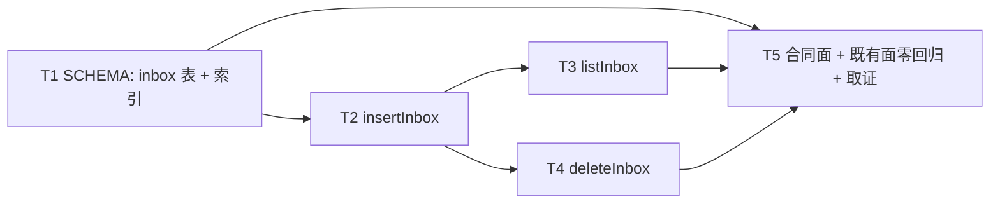

# pr-003-tasks.md — pr-003 内部任务列表（收件箱持久表：`inbox` 表 + 3 个方法）

**迭代**: 0030-hub-communication-upgrade ｜ **阶段**: 5（PR 实现）｜ **PR 文件**: `prs/pr-003-inbox-table-persistence.md`
**PR worktree 分支**: `feat/0030-pr-003-inbox-table-persistence`（base = `9f071b8`，= 该 worktree 创建时的迭代分支 tip）｜ **任务总数**: **5**（T1~T5）｜ **依赖图**: **无环**（见 §2）
**性质**: 本 PR 内部任务列表（子 agent 内部步骤，**不是**全局任务图），供 dev 消费
**输入真源**: PR 文件（5 条验收标准 / 2 个功能点 F01·F03）+ `architecture.md`（§4 A-01 表结构·索引·写入时机、§4 A-09 清理策略、§5 变更面清单、§7 L2-01）+ `prd/F01-inbox-authoritative-delivery.md`（验收 4）、`prd/F03-inbox-persistence.md`（验收 1~5、边界）+ `oamp/src/persist.js` 实读（§0.3 逐条带 `文件:行号`）

> **本 PR 无任何可执行入口**：写入点与读取点的接线（`publishCallResult` / `GET /api/pickup` / `ack`）与 `pickup.js` 退役**全部归 pr-005**（PR 文件明文"本 PR 只交付持久层能力与其自证，**不接线**"）⇒ **全部验收以模块级一次性脚本 + `grep`/`diff` 原始输出判定**，**不新增测试文件**（本仓当前 `.test.js` 数为 0，见 A6）。

---

## 0. 范围、文件面与事实锚点

### 0.1 本 PR 文件范围（唯一可写面）

| # | 文件 | 动作 | 内容（任务归属） |
|---|---|---|---|
| 1 | `oamp/src/persist.js` | 改（**只在既有结构上追加**：`SCHEMA` 段 +2 条语句、`stmts` +3 条预编译、句柄 `return` +3 个方法、+3 个函数体） | `inbox` 表与索引（**T1**）；`insertInbox`（**T2**）；`listInbox`（**T3**）；`deleteInbox`（**T4**） |
| 2 | `docs/iterations/0030-hub-communication-upgrade/prs/pr-003-inbox-table-persistence-tasks.md` | 本文件（阶段 5 产物；仅末尾「执行证据」段由 dev 回填，见 T5） | 取证输出落点（**T5**） |

> 本 tasks 文件不计入代码改动面（PR 文件「文件范围」只列 `oamp/src/persist.js`）；PR 文件自身**不在**其文件范围内（0030 的 PR 文件七字段不含「验收证据」段）⇒ 回填落点取本文件（见 §8 疑问 1）。

### 0.2 非目标（零改动清单 / 防夹带）

- **零改动**（PR 文件「文件范围」+ architecture §5「明确不改」）：`oamp/src/web.js`（写入/读取点接线 + `pickup.js` 退役归 pr-005）、`oamp/src/pickup.js`、`oamp/src/router.js`、`oamp/src/registry.js`、`oamp/src/config.js`、`oamp/src/agent.js`、三个协议客户端、`oamp/bin/**`、`oamp/web/**`、`oamp/sdk/**`、`oamp/scripts/**`、`oamp/package.json`、`oamp/API.md`、`oamp/README.md`、`oamp/llms.txt`、`oamp/skill/hub.md`、`cluster.json`、`roles/**`、`docs/**`（除本文件）。
- **不新增**：第三方依赖（`dependencies` 保持 `{}`）、配置键、env 键、**HTTP 路由**（本迭代 29 条不变）、UDS 协议方法、表（除 `inbox`）、索引（除 `idx_inbox_principal`）、**迁移机制**（`PRAGMA user_version` / migrations 目录 / 迁移表）、定时器、事件面、测试文件、目录、第二个持久层模块。
- **不做**（属 pr-005）：`publishCallResult` 条件由"仅显式 `requester`"改无条件 + 写 `insertInbox`；`GET /api/pickup` 改读 `listInbox`；`POST /api/pickup/:call_id/ack` 改调 `deleteInbox`；`pickup.js` 退役；信封 `reason` 追加。
- **不做**（F01/F03 边界 + architecture §4 A-09「不做」）：TTL / 淘汰 / 归档 / 导出 / 游标 / 分页 / 历史台账面 / `VACUUM` 类维护动作 / 跨重启的其它内存投影恢复 / 非终态记录（`submitted`·`working` 在持久层**无记录**）。

### 0.3 读码事实锚点（2026-09-17 实读，base `9f071b8`；判据基础）

| # | 事实 | 位置 |
|---|---|---|
| **A1** | `SCHEMA` 是**单条模板字符串**（`const SCHEMA = \`…\`;`），内含 3 表 + 3 条索引，全部 `CREATE … IF NOT EXISTS`；`openDb` 每次调用执行 `db.exec(SCHEMA)` | `oamp/src/persist.js:13-47`（语句行 `:14/:20/:32/:44/:45/:46`，闭合 `` `; `` 在 `:47`）、`:182`、`:193-194` |
| **A2** | 全仓**无迁移机制**：无 `ALTER TABLE` / `PRAGMA user_version` / migrations 目录；`isLegacyChats` + `rmSync` 是"旧结构库删库重建"路径（**既有硬契约，本 PR 不动**），不是加列机制 | `oamp/src/persist.js:49-57`、`:187-192` |
| **A3** | 句柄 `return { … }` 实测 **16 键**（`activateChat, archiveChat, close, closeChat, createProject, getChat, getProject, insertInput, insertOutput, listArchivable, listChats, listProjects, projectByChat, renameChat, startupSweep, upsertChat`）；模块级导出**恰 1 个**（`openDb`） | `:406-411`；实测 `Object.keys()` |
| **A4** | 写口参数体例 = **camelCase 对象 + `nowMs = Date.now()` 默认值**；返回体例：`archiveChat`/`activateChat` → `changes > 0` 布尔、`startupSweep` → 影响行数、`closeChat` → 布尔 | `insertInput` / `insertOutput` / `upsertChat` 函数体；句柄区 |
| **A5** | 行读取体例 = `toPlain(row)`（`{...row}`，转普通对象）+ snake_case 列名；空结果 → `[]`（`listArchivable`）、不存在 → `null`（`getProject`/`getChat`/`projectByChat`） | `:79-82`；`listArchivable` / `getProject` 函数体 |
| **A6** | 参数校验函数族已存在：`readRequiredString`（非字符串 / 空串 ⇒ 抛错，**绝不静默兜底**）、`readOptionalString`（`undefined`/`null`/`''` ⇒ `null`） | `:127-133`、`:139-143` |
| **A7** | 本仓**无测试面**：`find . -name '*.test.js'` = **0**；`oamp/package.json` 无 `scripts` 段（实测）⇒ 判据 = 模块级一次性脚本 + `grep`/`diff`（体例先例 = `docs/iterations/0029-hub-client-session-and-duplex/prs/pr-002-session-registries-tasks.md` §4） | 实测 |
| **A8** | 基线 `sqlite_master` 对象集（实测，新库）= 表 `projects`/`chats`/`messages`/`sqlite_sequence` + 显式索引 `idx_messages_chat_time`/`idx_chats_updated`/`idx_chats_project_updated` + 3 个隐式 `sqlite_autoindex_*` ⇒ 本 PR 后**新增恰 2 个对象**（表 `inbox`、索引 `idx_inbox_principal`） | 实测（`SELECT type,name FROM sqlite_master`） |
| **A9** | 幂等"**不覆盖首条**"的既有口径先例：`pickup.add` 首次 `true`、重复 `false`、不覆盖；architecture §4 A-01 明写"与既有 `pickup.add` 的幂等口径**逐字一致**" | `oamp/src/pickup.js:13-20`；architecture §4 A-01「写入时机」 |
| **A10** | 唯一终态发布点自带**一次性守卫** `if (!call \|\| call.published) return;`（`call.published` 置位）⇒ 同一进程内同一 `call_id` 不可能二次发布；重启后调用登记（进程内 `tasks`/`callSchemas`）已丢 ⇒ 无对账源。**故 ack 之后不会因重复发布而"复活"**（T4 判据 4 的依据） | `oamp/src/web.js:2215-2218` |
| **A11** | 环境：`node v22.15.0`，`node:sqlite` 可用（`DatabaseSync` 会打 `ExperimentalWarning`，不影响判据）；PR worktree 的 `persist.js` 与迭代分支**逐字节相同**（`diff` 空）⇒ 基线副本可取 `git -C <PR worktree> show 9f071b8:oamp/src/persist.js` | 实测 |

### 0.4 本 PR 内冻结契约（跨 PR 接缝 = pr-005 的消费面，实施与判据以此为准）

1. **方法名与落点**〔追溯：PR 验收 2；architecture §5「修改」行〕：`openDb(dbPath)` 返回的句柄**新增恰好 3 个方法** `insertInbox` / `listInbox` / `deleteInbox`；**模块级导出面仍恰 1 个** `openDb`（不新增 `export`）。
2. **DDL 逐字**〔追溯：architecture §4 A-01「存储形态」〕——追加在 `SCHEMA` 内既有三条索引（`:46`）之后、闭合反引号（`:47`）之前：

   ```sql
   CREATE TABLE IF NOT EXISTS inbox (
     call_id     TEXT PRIMARY KEY,   -- = task_id；主键 ⇒ 同一调用至多一条（F01 验收 4）
     principal   TEXT NOT NULL,      -- 显式身份 或 缺省 chat:<chat_id>（A-02）
     agent       TEXT,               -- 角色名（既有信封同口径）
     chat_id     TEXT,
     terminal_at INTEGER NOT NULL,   -- epoch ms（写入时刻）
     envelope    TEXT NOT NULL       -- composeCallEnvelope 的终态信封 JSON（唯一写点产物）
   );
   CREATE INDEX IF NOT EXISTS idx_inbox_principal ON inbox(principal, terminal_at);
   ```

3. **入参形态**（camelCase 对象，照 A4 体例）〔追溯：architecture §3.1 第 2 步写点表达式 + §4 A-01；拼写归属 L3（§7 L3 明列"函数命名"）〕：

   ```js
   insertInbox({ callId, principal, agent = null, chatId = null, terminalAt = Date.now(), envelope })
   listInbox(principal)
   deleteInbox(callId)
   ```
4. **返回面**〔追溯：A9（`pickup.add`）与 A4（`archiveChat`）体例；PR 验收 2/3〕：`insertInbox` → **boolean**（`true` = 本次真的插入；`false` = 主键已存在被忽略）；`deleteInbox` → **boolean**（`true` = 本次真的删掉 1 行）；`listInbox` → **行数组**（空 ⇒ `[]`，不是 `null`），行 = `toPlain` 后的 6 键 snake_case 对象，其中 `envelope` 为**原始字符串**（解析归调用方，追溯 architecture §3.1 第 3 步的 `JSON.parse(row.envelope)` 在消费侧）。
5. **SQL 语义**〔追溯：PR 验收 3；architecture §4 A-01 / A-09〕：写入 = `INSERT OR IGNORE`（主键冲突即忽略、**不覆盖首条**）；读取 = `SELECT … FROM inbox WHERE principal = ? ORDER BY terminal_at ASC`（覆盖索引 `idx_inbox_principal`）；删除 = `DELETE FROM inbox WHERE call_id = ?`（影响 0 行**不抛错**）。
6. **值面**〔追溯：architecture §4 A-01「为什么存整份信封」〕：`envelope` **原样字符串**落库（不 `JSON.parse`、不校验结构、不二次加工）；`terminal_at` 为毫秒整数，由调用方（pr-005 发布点）传入。
7. **校验口径**〔追溯：A6 既有校验函数族；PR 验收 3〕：`callId` / `principal` 为**必填非空字符串**，缺失 / 非字符串 / 空串 ⇒ **抛错且不落行**（照 `readRequiredString` 的"绝不静默兜底"体例）；`agent` / `chatId` 按 `readOptionalString` 口径归一（`undefined`/`null`/`''` ⇒ `null`）。
8. **零面**〔追溯：PR 验收 5；architecture §4 A-09「不做」〕：本 PR 新增代码**无** `VACUUM` / `ALTER` / `DROP` / `user_version` / 定时器 / TTL / 归档 / 导出 / 游标；`inbox` 的收敛路径**只有** `deleteInbox` 一条。
9. **不接线**〔追溯：PR 文件明文；pr-005 依赖〕：本 PR **不触碰** `web.js` / `pickup.js`；`inbox` 表在本 PR 内**无生产写入者**（dev 的一次性脚本即唯一驱动器）。

### 0.5 PR 验收标准 → 任务映射（5 条 AC 全覆盖，无孤儿任务、无无主 AC）

| AC | 验收标准（PR 文件原文摘要） | 服务任务 |
|---|---|---|
| AC1 | `SCHEMA` 内含 `CREATE TABLE IF NOT EXISTS inbox (…)` 与 `CREATE INDEX IF NOT EXISTS idx_inbox_principal ON inbox(principal, terminal_at)`；沿用 `CREATE … IF NOT EXISTS` 幂等口径、**不引入迁移机制** | **T1** |
| AC2 | 句柄新增 `insertInbox` / `listInbox` / `deleteInbox`；既有导出面逐条不变 | **T2 / T3 / T4**（方法本体）+ **T5**（导出面判定） |
| AC3 | 幂等与顺序：同一 `call_id` 二次 insert ⇒ 行数不变且首条不被覆盖；`listInbox(principal)` 只返回该 principal 且按 `terminal_at` 升序；`deleteInbox` 对不存在 / 已删除的影响 0 行且不抛错 | **T2** / **T3** / **T4** |
| AC4 | 结构幂等：同一库文件连续两次 `openDb` 不报错、表结构不变；既有三表（`projects`/`chats`/`messages`）的读写与索引行为不变 | **T1**（结构幂等侧）+ **T5**（既有面零回归侧） |
| AC5 | 无 TTL / 淘汰 / 归档 / 导出 / `VACUUM` 类维护动作（未取件行只由调用方 ack 收敛） | **T5** |

> **无孤儿任务**：T1~T4 各自服务至少一条 AC；**T5** 不新增任务、只做合同面判定与既有面回归，是 AC2/AC4/AC5 的判据点与 AC1~AC5 的**证据载体**。

---

## 1. 任务列表

### T1: `SCHEMA` 增量 —— `inbox` 表 + `idx_inbox_principal` 覆盖索引

- **服务哪条 AC**: AC1、AC4（结构幂等侧）
- **描述**: 在 `SCHEMA` 模板字符串内、既有三条索引之后追加 `inbox` 表与覆盖索引 DDL（§0.4 契约 2 逐字），沿用 `IF NOT EXISTS` 幂等口径；不引入任何迁移机制。
- **文件/锚点**: `oamp/src/persist.js:13-47`（`SCHEMA`）；追加点 = `:46`（`idx_chats_project_updated`）之后、`:47`（闭合 `` `; ``）之前；列注释体例照 `:15-18`；建表由 `:194` 的 `db.exec(SCHEMA)` 在每次 `openDb` 时执行。
- **步骤**: ① 追加 2 条语句（表 + 索引，含列注）；② 跑 §4.2 判据 1~6；③ 与 base 副本对照（§4.3）。
- **验收判据（可执行；脚本见 §4.1/§4.2/§4.3）**:
  1. **表与索引存在**：新库 `openDb(<tmp>/sql.db)` 后 `SELECT type, name FROM sqlite_master WHERE name IN ('inbox','idx_inbox_principal')` ⇒ **恰好 2 行**（`table` + `index`）〔追溯：PR 验收 1；architecture §4 A-01「存储形态」〕
  2. **列序与约束**：`pragma_table_info('inbox')` 的列序**逐位** = `['call_id','principal','agent','chat_id','terminal_at','envelope']`；`call_id.pk = 1`；`principal`/`terminal_at`/`envelope` 的 `notnull = 1`；`agent`/`chat_id` 的 `notnull = 0`。
     **实测口径（勿"修正"DDL）**：SQLite 的 `TEXT PRIMARY KEY` **不隐含** `NOT NULL` ⇒ `call_id` 的 `notnull` 读回为 **0**（实测），且非 INTEGER 主键允许 NULL 行——`call_id` 的必填由**写口校验**承载（§0.4 契约 7：缺失/空串 ⇒ 抛错），而非列约束；DDL 按 §0.4 契约 2 **逐字**落地，不追加 `NOT NULL`〔追溯：architecture §4 A-01 的 DDL 逐字；A6 校验体例〕
  3. **索引列与序**：`pragma_index_info('idx_inbox_principal')` 的列序 = `[principal, terminal_at]`（`seqno` 0 → 1）；`pragma_index_list('inbox')` 中该索引 `origin = 'c'`（显式创建，非主键自动索引）〔追溯：architecture §4 A-01「按身份过滤路径」的 `WHERE principal = ? ORDER BY terminal_at ASC` 走覆盖索引〕
  4. **结构幂等**：同一库文件 `openDb → close → openDb`（第二次）**不抛错**；两次的 `sqlite_master` 对象集与 `pragma_table_info('inbox')` **逐字相同**；且全仓无 `ALTER TABLE` / `user_version` / migrations 目录（`grep` 零命中）〔追溯：PR 验收 4；architecture §4 A-01「沿用无迁移机制的既有口径」〕
  5. **既有库补齐（无迁移机制下的唯一正确路径）**：用**改动前**的 `persist.js`（`git show 9f071b8:oamp/src/persist.js` 副本）建库并写入 1 个 project + 1 个 chat + 2 条 message → 用改动后的 `openDb` 打开同一文件 ⇒ 不抛错、`inbox` 表与索引存在、既有三表**行数与内容 dump 逐行不变**〔追溯：A2（无迁移机制）+ architecture §5「沿用 `IF NOT EXISTS` 幂等建表」；PR 验收 4〕
  6. **对象集增量恰 2**：新库 `sqlite_master` 对象集 = 基线 A8 ∪ {`inbox`, `idx_inbox_principal`}，**无第三项**（无迁移表、`PRAGMA user_version` 仍为 0）〔追溯：PR 验收 1/4；architecture §7 L2-01「收件箱以 SQLite `inbox` 表为唯一存储」+ §0 表格「新增 SQLite 表 1」〕
- **前置依赖**: 无
- **优先级**: P0

---

### T2: `insertInbox` —— `INSERT OR IGNORE` 幂等写口

- **服务哪条 AC**: AC2、AC3（幂等侧）
- **描述**: `stmts` 追加 1 条预编译 `INSERT OR IGNORE`，句柄新增 `insertInbox({…})`（§0.4 契约 3/4/5/6/7 的入参、返回、校验口径），并在 `return { … }` 中登记。
- **文件/锚点**: `stmts`（`:196` 起，函数体区内按既有写口相邻位置追加）；句柄函数区（`insertOutput` 之下）；`return { … }`（`:406-411`）。体例 = `insertInput`（参数默认值 + `stmts.*.run` + `info.changes`），幂等返回照 `pickup.add`（A9），校验照 `readRequiredString`/`readOptionalString`（A6）。
- **步骤**: ① `stmts.insertInbox = db.prepare('INSERT OR IGNORE INTO inbox (call_id, principal, agent, chat_id, terminal_at, envelope) VALUES (?, ?, ?, ?, ?, ?)')`；② 函数体（校验 → `run` → 返回 `info.changes > 0`）；③ 注册进返回对象。
- **验收判据（可执行；脚本见 §4.2）**:
  1. **首次写入**：`insertInbox({callId:'c1', principal:'p1', agent:'dev', chatId:'chat-1', terminalAt:1000, envelope:'{"call_id":"c1"}'})` ⇒ 返回 **`true`**；`SELECT COUNT(*) FROM inbox` = **1**〔追溯：PR 验收 3；architecture §4 A-01「写入时机 = 只在终态发布那一刻写一次」〕
  2. **幂等且不覆盖首条**：同一 `callId` 二次 insert（**故意改 `principal`/`agent`/`chatId`/`terminalAt`/`envelope`**）⇒ 返回 **`false`**；行数仍 **1**；该行 6 列取值与**首次逐字相同**〔追溯：PR 验收 3「行数不变且首条不被覆盖」；architecture §4 A-01「`INSERT OR IGNORE` ⇒ 重复发布/对账重入幂等…与既有 `pickup.add` 逐字一致」〕
  3. **每调用至多一行**：判据 2 之后 `SELECT COUNT(*)` 仍为 1（主键结构性保证）〔追溯：PR 验收 3；prd F01 验收 4「同一 `call_id` 在取件面上至多出现一条条目」〕
  4. **值面**：`envelope` 读回**逐字节等于**写入的字符串（未被 `JSON.parse` 或重新序列化）；`agent`/`chatId` 缺省 ⇒ 读回 `null`；`terminalAt` 缺省 ⇒ 读回 `Date.now()` 量级整数（`> 1.7e12`）〔追溯：architecture §4 A-01 DDL 的可空列与「存整份信封」；§3.1 第 2 步 `terminal_at: now`〕
  5. **写口唯一性**：`Object.keys(handle).filter(k => 能写 inbox)` 恰 1 个（本 PR 不新增第二个写口；`submitted`/`working` 无记录）〔追溯：prd F03 验收 3「只在终态写一次、不承载流式进展」；architecture §4 A-01「不写非终态、不写过程事件」〕
  6. **必填校验**：`principal` 缺失 / `null` / `''` / 非字符串，以及 `callId` 同形 ⇒ **抛错**，且 `SELECT COUNT(*)` 不增（不落半行）〔追溯：§0.4 契约 7；A6 既有校验体例；architecture §4 A-01 DDL 的 `NOT NULL`〕
- **前置依赖**: T1（`inbox` 表必须先存在）
- **优先级**: P0

---

### T3: `listInbox` —— 按身份过滤 + `terminal_at` 升序

- **服务哪条 AC**: AC2、AC3（顺序侧）
- **描述**: `stmts` 追加 1 条预编译 `SELECT`，句柄新增 `listInbox(principal)`：单条件 `WHERE principal = ?` + `ORDER BY terminal_at ASC`，`.all().map(toPlain)` 返回。
- **文件/锚点**: `stmts` 追加 `listInbox`；句柄函数区（紧随 `insertInbox` 之后）；读取体例 = `listArchivable`（`.all()` + `toPlain`，A5）；覆盖索引 = T1 的 `idx_inbox_principal`。
- **步骤**: ① `stmts.listInbox = db.prepare('SELECT ' + INBOX_COLUMNS + ' FROM inbox WHERE principal = ? ORDER BY terminal_at ASC')`（列清单常量体例照 `CHAT_COLUMNS` `:65`）；② 函数体；③ 注册进返回对象。
- **验收判据（可执行；脚本见 §4.2）**:
  1. **归属过滤**：插入 p1×2（`terminalAt` 2000 / 1000）+ p2×1 ⇒ `listInbox('p1')` 的 `call_id` 集合 = p1 的 2 条（**不含 p2 的**）；`listInbox('p2')` = 1 条；`listInbox('nobody')` = `[]`（严格集合相等，不误配、不是 `null`）〔追溯：PR 验收 3「只返回该 principal 的行」；architecture §4 A-01「按身份过滤路径」〕
  2. **升序**：`listInbox('p1').map(r => r.terminal_at)` = `[1000, 2000]`（与插入顺序相反即为有效判据）〔追溯：PR 验收 3「按 `terminal_at` 升序」；architecture §4 A-01 的 `ORDER BY terminal_at ASC`〕
  3. **行形状**：每行键集**恰 6 键** `['agent','call_id','chat_id','envelope','principal','terminal_at']`（键序不判）；`envelope` 为**原始字符串**（`typeof === 'string'`，未解析为对象）〔追溯：architecture §4 A-01 DDL 六列；§3.1 第 3 步「`envelope: JSON.parse(row.envelope)`」在**消费侧**（pr-005）〕
  4. **空库**：空库 `listInbox('p1')` = `[]`〔追溯：A5 既有读取体例；PR 验收 2〕
  5. **不依赖 Router**：本函数体无任何 UDS / `queryOnce` / `router.` 引用（`grep` 本文件新增行零命中）⇒ 取件面不再逐条查 Router 的前提成立〔追溯：architecture §4 A-01「取件面**不再逐条查 Router**：这既去掉 N 次 UDS 往返，也让"跨重启可查"成立」〕
  6. **读口无副作用**：连续两次 `listInbox('p1')` 返回值 `deep-equal`，且 `SELECT COUNT(*)` 不变〔追溯：prd F03 验收 5「持久化不引入独立的状态/正文副本语义」〕
  7. **同 `terminal_at` 不判序**：并列项的相对顺序**不作判据**（architecture 未定义 tie-break，禁止自行补充 `, call_id` 之类第二排序键——见 §6 MI-P2）〔追溯：architecture §4 A-01 只写 `ORDER BY terminal_at ASC`〕
- **前置依赖**: T2（行数据来源 = `insertInbox`）
- **优先级**: P0

---

### T4: `deleteInbox` —— ack 就地删除（幂等）

- **服务哪条 AC**: AC2、AC3（删除幂等侧）
- **描述**: 句柄新增 `deleteInbox(callId)`：`DELETE FROM inbox WHERE call_id = ?`，返回 `changes > 0`。
- **文件/锚点**: `stmts` 追加 `deleteInbox`；句柄函数区；返回体例 = `archiveChat`（`changes > 0`，A4）；"不存在 ⇒ 无副作用、不抛错"体例 = `pickup.ack`（A9）；**不保留 `acked` 列**（A-09 裁决）。
- **步骤**: ① `stmts.deleteInbox = db.prepare('DELETE FROM inbox WHERE call_id = ?')`；② 函数体（`callId` 必填校验 → `run` → 返回 `changes > 0`）；③ 注册进返回对象。
- **验收判据（可执行；脚本见 §4.2）**:
  1. **生效**：`deleteInbox('c1')` ⇒ 返回 **`true`**；`SELECT COUNT(*) FROM inbox` 减 1；`listInbox('p1')` 不再含 `c1`〔追溯：PR 验收 3；architecture §4 A-09「ack 后条目去留 = **就地删除**：`DELETE FROM inbox WHERE call_id = ?`」〕
  2. **幂等**：对同一 `call_id` 再次 `deleteInbox` ⇒ 返回 **`false`**、**不抛错**、行数不变〔追溯：PR 验收 3「对不存在或已删除的 `call_id` 影响 0 行且不抛错」；architecture §4 A-09「幂等：影响 0 行同样返回」〕
  3. **不存在 / 非法入参**：`deleteInbox('never')` ⇒ `false`、不抛错、不建行；`deleteInbox('')` / 非字符串 ⇒ 抛错（§0.4 契约 7）〔追溯：PR 验收 3；A6 体例〕
  4. **不覆盖 ack 语义**：删除后再 `insertInbox({callId:'c1', …})` ⇒ `true` 且重新计入未取件集合。**这是与 `pickup.ack`（置位保留 ⇒ 重复 `add` 恒 `false`）的已知差异，不是缺陷**：唯一发布点自带一次性守卫（A10）⇒ 同一进程不会二次发布、重启后无对账源 ⇒ **不存在"已 ack 的条目被重新写回"的路径**〔追溯：architecture §4 A-09「删除天然满足验收 2」+ A10 证据 `web.js:2217`；`[model_inferred]` MI-P3〕
  5. **无 `acked` 列**：`pragma_table_info('inbox')` 的列名集合**不含** `acked`〔追溯：architecture §4 A-09「不保留 `acked` 列」；prd F03 A-09「保留标记不产生任何可观测信息」〕
  6. **唯一收敛路径**：全文件 `DELETE` 语句**恰 1 条**且带 `WHERE call_id = ?`；无 `UPDATE` / `VACUUM` / 归档 / 导出语句〔追溯：PR 验收 5；architecture §4 A-09「未取件行只由调用方 ack 收敛」〕
- **前置依赖**: T2（需要既有行才能观测删除生效）
- **优先级**: P0

---

### T5: 合同面自证 + 既有面零回归（base 对照）+ 零面核查 + 证据回填

- **服务哪条 AC**: AC2（导出面）、AC4（既有三表读写与索引行为不变）、AC5（零维护动作）；同时是 AC1~AC5 的**证据载体**
- **描述**: ① 句柄 / 模块导出面判定；② 与 base 副本的**全行为对照**（既有三表读写 + `PRAGMA foreign_keys` + `sqlite_master`）；③ 零维护面（限本 PR 新增行）；④ 改动面封闭性；⑤ 把 §4 全部原始输出回填本文件「执行证据」段。
- **文件/锚点**: **只读** `oamp/src/persist.js`；base 副本 = `git -C <PR worktree> show 9f071b8:oamp/src/persist.js > /tmp/pr003-base/persist.js`（A11：两份文件逐字节相同 ⇒ 基线可比）；证据落点 = 本文件 `## 执行证据（dev 回填）`。
- **步骤**: ① §4.2 全量脚本（AC 断言）；② §4.3 base 对照脚本（同一脚本跑两份实现，JSON diff）；③ §4.4 grep/diff 族；④ 逐条粘贴原始输出。
- **验收判据（可执行）**:
  1. **句柄导出面**：`Object.keys(openDb(<tmp>)).sort()` = A3 的 16 键 ∪ `{deleteInbox, insertInbox, listInbox}` = **19 键**，集合**逐键相等**（多一个 / 少一个即失败）〔追溯：PR 验收 2「既有导出面…逐条不变」〕
  2. **模块导出面**：`Object.keys(await import('<PR worktree>/oamp/src/persist.js'))` = `['openDb']`（不新增模块级导出）〔追溯：PR 验收 2；A3〕
  3. **既有行为零回归（base 对照）**：同一驱动脚本（§4.3）分别驱动 base 副本与改动版，输出的 JSON 中 **`behavior` 段逐字符相等**（覆盖 `createProject`/`listProjects`/`getProject`/`projectByChat`/`insertInput`/`insertOutput`/`upsertChat`/`closeChat`/`renameChat`/`archiveChat`/`activateChat`/`listArchivable`/`startupSweep`/`listChats`/`getChat` + `PRAGMA foreign_keys` 读回 + 既有三表的行 dump）；差异**只允许**出现在 `schemaObjects`（差集 = `{inbox, idx_inbox_principal}`）与 `handleKeys`（差集 = 3 个新键）两段〔追溯：PR 验收 4「既有三表的读写与索引行为不变」；architecture §6「明确不改」〕
  4. **零维护面（限本 PR 新增行）**：`git diff -U0 9f071b8 -- oamp/src/persist.js | grep '^+'` 的输出中，`VACUUM|setTimeout|setInterval|ALTER TABLE|DROP TABLE|DROP INDEX|user_version|归档|导出|游标|cursor|TTL` 命中数 = **0**；且新增行里的 SQL 语句**只有 5 类**（`CREATE TABLE IF NOT EXISTS inbox` / `CREATE INDEX IF NOT EXISTS idx_inbox_principal` / `INSERT OR IGNORE` / `SELECT … FROM inbox` / `DELETE FROM inbox WHERE call_id = ?`），无第 6 类〔追溯：PR 验收 5；architecture §4 A-09「不做」清单〕
  5. **改动面封闭**：`git -C <PR worktree> diff --name-status 9f071b8 -- oamp/` ⇒ **恰 1 行** `M  oamp/src/persist.js`；`git diff 9f071b8 -- oamp/package.json` ⇒ 空；`grep -c '"dependencies": {}' oamp/package.json` = 1；`git status --short` 除 `oamp/src/persist.js`、本 tasks 文件外无其它改动（PR 文件零改动）〔追溯：PR 文件「文件范围」；architecture §5「明确不改」〕
  6. **对象集复核**：新库 `sqlite_master` 的表集合 = `{projects, chats, messages, sqlite_sequence, inbox}`、显式索引集合 = A8 的 3 条 + `idx_inbox_principal`〔追溯：PR 验收 1；architecture §0 表格「新增 SQLite 表 1」〕
  7. **证据齐备**：本文件「执行证据」段含 §4.2/§4.3 脚本的**原样 stdout** + §4.4 的 `grep`/`diff` 原始输出；AC1~AC5 每条可指到对应输出（缺一即 T5 未完成）〔追溯：PR 文件全部 5 条验收标准〕
- **前置依赖**: T1、T2、T3、T4
- **优先级**: P1（**P1 ≠ 可选**：5 条 AC 全部通过才算本 PR 完成）

---

## 2. 依赖图



边（逐条，均为真实约束；共 5 条）：
- `T1 → T2`：`insertInbox` 的目标表由 T1 的 DDL 建立（表不存在则 `prepare` 即抛 `no such table`）——**代码级真实耦合**，非顺序偏好。
- `T2 → T3`：`listInbox` 的全部判据经由 `insertInbox` 写入的行观测（无写口则读口无可判定的数据）。
- `T2 → T4`：`deleteInbox` 的"生效 / 幂等 / 0 行"三条判据都需要既有行（来源同上）。
- `T1 → T5`、`T3 → T5`、`T4 → T5`：合同面判定（句柄 19 键、新增行零面、对象集）与 base 对照覆盖**完整改动面**——缺任一语句或任一方法，判据 1/3/4/6 都不成立。
- `T5 → （无）`。

**无环**：存在拓扑序 `T1 < T2 < T3 < T5`、`T1 < T2 < T4 < T5` 同时满足全部边方向，不存在回到已访问节点的路径。
**最长依赖链（本 PR 内部任务图的关键路径，4 节点）**：`T1 → T2 → T3 → T5`（另一条等长链 `T1 → T2 → T4 → T5`）。
**关键路径任务**：**T1**（DDL 是一切判据的结构前提）→ **T2**（唯一写口，读/删判据的数据来源）→ **T3/T4**（同层、互不依赖）→ **T5**（合同面与既有面回归的唯一判据点 + 证据载体）。

---

## 3. 执行顺序（增量策略）

**顺序**：`T1 → T2 → T3 → T4 → T5`（同一文件连续施工，不新增依赖边：T3/T4 之间无依赖，先后由 dev 自定，但**不得**留下"表已建而方法未注册"的半状态）。

| 增量 | 任务 | 独立可验证结果（该次调用结束时的产出） |
|---|---|---|
| 1 | T1 | 新库 / 既有库两条路径下 `inbox` + `idx_inbox_principal` 存在且列序逐位正确；连续两次 `openDb` 幂等；对象集增量恰 2 |
| 2 | T2 | `insertInbox` 首次 `true` / 重复 `false` 且首条逐字不变；`envelope` 原样字符串；必填校验抛错不落行 |
| 3 | T3 | 归属过滤 + `terminal_at` 升序 + 行键集 6 键；空库 `[]`；读口无副作用 |
| 4 | T4 | 删除生效 / 幂等 / 0 行不抛错；`pragma_table_info('inbox')` 无 `acked` |
| 5 | T5 | 句柄 19 键、模块导出 1 键、base 对照 `behavior` 段相等、零面 grep 全 0、`--name-status` 恰 1 行 + 证据回填 |

**若单次调用未跑完**：按上表在**任务边界**停下——注意 **T1 一旦开始就必须跑完判据 4/5**（半追加的 `SCHEMA` 会让"结构幂等"与"既有库补齐"两条判据失去意义）；T2 与 T3/T4 必须**成对完成**（句柄 `return` 里注册了方法名而函数体未写 ⇒ `Object.keys` 有键但调用即 `undefined is not a function`，T5 判据 1 会假通过）。已完成任务的判据输出即为本次调用的增量产物。

---

## 4. 验证配方（**禁止新增测试文件**；全部为一次性脚本 + `grep`/`diff`，A7）

工作目录 = PR worktree 根（`/Users/chenchiyuan/projects/agents/.pb-agents/worktrees/0030-hub-communication-upgrade/.pb-agents/worktrees/0030-pr-003-inbox-table-persistence`）。脚本一律落在 `/tmp/`（**不进仓库**）；库文件一律 `os.tmpdir()` 下（既有 hygiene 口径）；`node:sqlite` 的 `ExperimentalWarning` 出现在 stderr，不代表失败。

### 4.1 导出面与对象集（T5 判据 1/2/6）

```bash
cd <PR worktree 根>
node --input-type=module -e '
import { openDb } from "./oamp/src/persist.js";
import os from "node:os"; import path from "node:path"; import fs from "node:fs";
const dir = fs.mkdtempSync(path.join(os.tmpdir(), "pr003-"));
const p = path.join(dir, "sql.db");
const db = openDb(p);
console.log("handleKeys:", JSON.stringify(Object.keys(db).sort()));
console.log("moduleExports:", JSON.stringify(Object.keys(await import("./oamp/src/persist.js"))));
const { DatabaseSync } = await import("node:sqlite");
const raw = new DatabaseSync(p);
console.log("objects:", JSON.stringify(raw.prepare("SELECT type,name FROM sqlite_master ORDER BY name").all()));
console.log("inboxCols:", JSON.stringify(raw.prepare("SELECT name,type,notnull,pk FROM pragma_table_info(\"inbox\")").all()));
raw.close(); db.close(); fs.rmSync(dir, {recursive:true, force:true});
'
```

（若上句 `pragma_table_info("inbox")` 报 `no such column`，改写为 `pragma_table_info('inbox')`——单引号在 shell 单引号串内需换用 `node --input-type=module /tmp/pr003-inspect.mjs` 形态落文件执行。）

### 4.2 全量 AC 断言脚本（T1~T4 判据、T5 判据 7 的证据来源）

```js
// /tmp/pr003-ac.mjs —— 单进程内驱动同一句柄，按序断言；库文件在 os.tmpdir()
import { openDb } from "<PR worktree 绝对路径>/oamp/src/persist.js";
import os from "node:os"; import path from "node:path"; import fs from "node:fs";
const { DatabaseSync } = await import("node:sqlite");
const ok = (n, c) => { console.log(`${c ? "PASS" : "FAIL"} ${n}`); if (!c) process.exitCode = 1; };
const tmp = () => { const d = fs.mkdtempSync(path.join(os.tmpdir(), "pr003-")); return { d, p: path.join(d, "sql.db") }; };
const dump = (p, sql) => { const raw = new DatabaseSync(p); const r = raw.prepare(sql).all().map((x) => ({ ...x })); raw.close(); return r; };

// --- T1: 表 / 列序 / 索引 / 结构幂等 / 对象集 ---
const { d, p } = tmp();
let db = openDb(p);
const objects = dump(p, "SELECT type, name FROM sqlite_master WHERE name IN ('inbox','idx_inbox_principal') ORDER BY type");
ok("T1.1 inbox+index 恰 2 对象", objects.length === 2 && objects[0].type === "index" && objects[1].type === "table");
const cols = dump(p, "SELECT * FROM pragma_table_info('inbox')");
ok("T1.2 列序逐位", JSON.stringify(cols.map((c) => c.name)) === JSON.stringify(["call_id", "principal", "agent", "chat_id", "terminal_at", "envelope"]));
ok("T1.2 约束", cols[0].pk === 1 && cols[1].notnull === 1 && cols[2].notnull === 0 && cols[3].notnull === 0 && cols[4].notnull === 1 && cols[5].notnull === 1);
const idx = dump(p, "SELECT name, seqno FROM pragma_index_info('idx_inbox_principal') ORDER BY seqno");
ok("T1.3 索引列序", JSON.stringify(idx.map((r) => r.name)) === JSON.stringify(["principal", "terminal_at"]));
const idxList = dump(p, "SELECT name, origin FROM pragma_index_list('inbox') WHERE name = 'idx_inbox_principal'");
ok("T1.3 显式索引", idxList.length === 1 && idxList[0].origin === "c");
const before = JSON.stringify(dump(p, "SELECT type,name FROM sqlite_master ORDER BY name"));
db.close(); db = openDb(p);
ok("T1.4 结构幂等", JSON.stringify(dump(p, "SELECT type,name FROM sqlite_master ORDER BY name")) === before);
ok("T1.6 增量恰 2 且无 user_version", dump(p, "SELECT name FROM sqlite_master WHERE name IN ('inbox','idx_inbox_principal')").length === 2
   && dump(p, "SELECT * FROM pragma_user_version")[0].user_version === 0);
db.close();

// --- T1.5: 既有库补齐（先用 base 副本建库写入，再用本实现打开；需先跑 §4.3 第 1 行生成 base 副本）---
const { openDb: openBase } = await import("/tmp/pr003-base/persist.js");
const w3 = tmp();
const hb = openBase(w3.p);
const prj = hb.createProject({ repoUrl: "https://example.com/x.git" });
hb.insertInput({ chatId: "chat-legacy", projectId: prj.project_id, text: "hello" });
hb.insertOutput({ chatId: "chat-legacy", text: "world" });
const legacyDump = JSON.stringify(dump(w3.p, "SELECT * FROM messages ORDER BY id"));
hb.close();
const h3 = openDb(w3.p);
ok("T1.5 既有库补齐 + 既有行逐行不变",
  dump(w3.p, "SELECT name FROM sqlite_master WHERE name = 'inbox'").length === 1
  && JSON.stringify(dump(w3.p, "SELECT * FROM messages ORDER BY id")) === legacyDump);
h3.close(); fs.rmSync(w3.d, { recursive: true, force: true });

// --- T2: insertInbox 幂等 / 值面 / 校验 ---
const w1 = tmp(); const h = openDb(w1.p);
ok("T2.1 首次 true", h.insertInbox({ callId: "c1", principal: "p1", agent: "dev", chatId: "chat-1", terminalAt: 1000, envelope: '{"call_id":"c1"}' }) === true);
ok("T2.2 重复 false", h.insertInbox({ callId: "c1", principal: "pX", agent: "other", chatId: null, terminalAt: 2000, envelope: '{"call_id":"OVERWRITE"}' }) === false);
const row1 = dump(w1.p, "SELECT * FROM inbox WHERE call_id='c1'");
ok("T2.2 不覆盖首条", row1.length === 1 && row1[0].principal === "p1" && row1[0].agent === "dev" && row1[0].chat_id === "chat-1" && row1[0].terminal_at === 1000 && row1[0].envelope === '{"call_id":"c1"}');
h.insertInbox({ callId: "c2", principal: "p1", terminalAt: 2000, envelope: "{}" });
h.insertInbox({ callId: "c3", principal: "p2", terminalAt: 3000, envelope: "{}" });
ok("T2.4 envelope 原样字符串", typeof dump(w1.p, "SELECT envelope FROM inbox WHERE call_id='c2'")[0].envelope === "string");
for (const bad of [undefined, null, "", 123]) {
  let threw = false, cnt = 0;
  try { h.insertInbox({ callId: "cx", principal: bad, envelope: "{}" }); } catch { threw = true; }
  cnt = dump(w1.p, "SELECT COUNT(*) AS n FROM inbox")[0].n;
  ok(`T2.6 非法 principal=${String(bad)} 抛错且不落行`, threw && cnt === 3);
}

// --- T3: listInbox 过滤 / 升序 / 行形状 ---
const l1 = h.listInbox("p1");
const l2 = h.listInbox("p2");
ok("T3.1 归属过滤", JSON.stringify(l1.map((r) => r.call_id)) === JSON.stringify(["c1", "c2"]) && l2.length === 1 && l2[0].call_id === "c3" && h.listInbox("nobody").length === 0);
ok("T3.2 升序", JSON.stringify(l1.map((r) => r.terminal_at)) === JSON.stringify([1000, 2000]));
ok("T3.3 行键集 6 键", JSON.stringify(Object.keys(l1[0]).sort()) === JSON.stringify(["agent", "call_id", "chat_id", "envelope", "principal", "terminal_at"]));
ok("T3.3 envelope 原样", typeof l1[0].envelope === "string");
ok("T3.6 读口无副作用", JSON.stringify(h.listInbox("p1")) === JSON.stringify(l1));

// --- T4: deleteInbox 生效 / 幂等 / 0 行 ---
ok("T4.1 删除 true", h.deleteInbox("c1") === true);
ok("T4.1 移出未取件集合", h.listInbox("p1").every((r) => r.call_id !== "c1"));
ok("T4.2 重复删除 false 不抛错", h.deleteInbox("c1") === false);
ok("T4.3 不存在 false 不抛错", h.deleteInbox("never") === false);
ok("T4.4 重插可复活（已知差异）", h.insertInbox({ callId: "c1", principal: "p1", terminalAt: 1000, envelope: '{"call_id":"c1"}' }) === true);
ok("T4.5 无 acked 列", dump(w1.p, "SELECT name FROM pragma_table_info('inbox')").every((r) => r.name !== "acked"));
h.close(); fs.rmSync(w1.d, { recursive: true, force: true }); fs.rmSync(d, { recursive: true, force: true });
console.log(process.exitCode ? "RESULT: FAIL" : "RESULT: PASS");
```

> T1 判据 5（既有库补齐）与 T2 判据 4 的默认值与 T2 判据 5（写口唯一性）由同一脚本的两段独立断言补充：前者用 `git show 9f071b8:oamp/src/persist.js` 副本建库后再用改动版打开；后者用 `Object.keys(h).length` 与新增键集合判定（见 §4.3 的 `handleKeys` 段）。

### 4.3 base 对照脚本（T5 判据 3；既有面零回归的唯一判据形态）

```bash
cd <PR worktree 根>
mkdir -p /tmp/pr003-base && git show 9f071b8:oamp/src/persist.js > /tmp/pr003-base/persist.js
# 同一驱动脚本 /tmp/pr003-drive.mjs 接受目标模块路径参数，输出 JSON：{schemaObjects, handleKeys, behavior}
node /tmp/pr003-drive.mjs ./oamp/src/persist.js        > /tmp/pr003-after.json
node /tmp/pr003-drive.mjs /tmp/pr003-base/persist.js   > /tmp/pr003-base.json
diff /tmp/pr003-base.json /tmp/pr003-after.json
```

`/tmp/pr003-drive.mjs` 的 `behavior` 段须覆盖（全部在 `os.tmpdir()` 的库上跑，时间戳由调用方显式传入 ⇒ 输出可比）：
`createProject` → `listProjects` → `getProject` → `projectByChat` → `upsertChat` → `insertInput` → `insertOutput`（含 `error` 非空分支）→ `listChats`（含 `state` 过滤与分页）→ `getChat` → `renameChat` → `closeChat` → `archiveChat` → `activateChat` → `listArchivable` → `startupSweep` → `close` 后重开读回；外加 `PRAGMA foreign_keys` 读回值与三表行 dump。
**判据**：`diff` 输出中**只允许**出现 `schemaObjects`（表集合差 `inbox`、显式索引差 `idx_inbox_principal`）与 `handleKeys`（差 3 个新键）两段的行；`behavior` 段**逐字符相同**（出现任一 `behavior` 差异 ⇒ 既有面回归，T5 未完成）。

### 4.4 grep / diff 族（T5 判据 4/5）

```bash
cd <PR worktree 根>
echo "① 零维护面（新增行）："
git diff -U0 9f071b8 -- oamp/src/persist.js | grep '^+' | grep -cE 'VACUUM|setTimeout|setInterval|ALTER TABLE|DROP TABLE|DROP INDEX|user_version|归档|导出|游标|cursor|TTL'
echo "② 新增行里的语句类别（应恰 5 类，无第 6 类）："
git diff -U0 9f071b8 -- oamp/src/persist.js | grep '^+' | grep -oE 'CREATE TABLE IF NOT EXISTS inbox|CREATE INDEX IF NOT EXISTS idx_inbox_principal|INSERT OR IGNORE INTO inbox|SELECT .* FROM inbox|DELETE FROM inbox WHERE call_id = \?' | sort | uniq -c
echo "③ 全仓无迁移机制（本 PR 未引入）："
grep -rn "ALTER TABLE\|user_version\|migrations" oamp/src/persist.js | wc -l   # 期望 0（既有 isLegacyChats 路径不含这两者）
echo "④ 改动面封闭："
git diff --name-status 9f071b8 -- oamp/
git diff --stat 9f071b8 -- oamp/package.json
grep -c '"dependencies": {}' oamp/package.json
git status --short
```

---

## 5. 粒度说明

本 PR 是**单文件、5 条 AC 的持久层增量**（`oamp/src/persist.js` 一处改动面），任务按**可独立验收的行为面**切分，而不是按 SQL 语句或函数行数切分：

- **T1（结构）与 T2~T4（三个方法）分开**：结构判据（列序 / 约束 / 索引列序 / 结构幂等 / 既有库补齐 / 对象集增量）**不需要任何方法调用**即可判定；三个方法的判据则必须在表存在之后才可判定 ⇒ 这是真实的"能独立验收"边界，不是顺序偏好。
- **T2 单列**（而不是与 T3/T4 合并成"三个方法"）：T2 是唯一写口，T3/T4 的**全部**判据都以它写入的行为数据来源 ⇒ 它失败时 T3/T4 的判据会在错误的输入上得出"通过"的假象（读/删在空表上同样返回 `[]`/`false`）。把写口单列使这条前提**可判定**。
- **T3 与 T4 同层不合并**：两者互不依赖（读口 ≠ 写口），失败面不同（过滤/排序 vs 幂等删除），合并会让一次失败掩盖另一半的判定。
- **T5 不新增能力**，只做（a）合同面（导出面 / 零面 / 对象集）与（b）**既有面零回归的 base 对照**——后者必须等全部改动落定后才能跑（对照对象是"完整改动面 vs 基线"），因此天然是收口任务。
- **未进一步拆分**（如把 `stmts` 追加与函数体拆分、或把"结构幂等"从 T1 拆出）：再细就无法各自独立验收（同一 DDL 文本、同一句柄对象），违反"粒度以能独立验收为下限"。

---

## 6. `[model_inferred]` 清单（需主 agent 确认；本文件不自行确认）

| # | 条目 | 落点 | 推断理由与依据 |
|---|---|---|---|
| **MI-P1** | 三个方法的**入参拼写为 camelCase 对象**（`callId`/`principal`/`agent`/`chatId`/`terminalAt`/`envelope`）与**布尔返回面**（`insertInbox` = 本次是否插入；`deleteInbox` = 本次是否删除一行） | §0.4 契约 3/4；T2 判据 1/2、T4 判据 1/2 | PR 文件与 architecture 只给**方法名**与 SQL 语义；`architecture.md` §3.1 第 2 步写作 `db.insertInbox({call_id, principal, …})`（snake_case），而 `persist.js` 既有写口一律 camelCase 入参 + snake_case 出行（A4）⇒ 取**同文件体例**为准。返回布尔取自 A9（`pickup.add` 的幂等返回）与 A4（`archiveChat` 的 `changes > 0`）。**此为 L3 级（architecture §7 L3 明列"函数命名"），但它是 pr-005 的调用契约**，故显式列出等确认 |
| **MI-P2** | 同 `terminal_at` 的并列行**不定义 tie-break**（不加第二排序键）；判据只判"集合相等 + `terminal_at` 非降序" | T3 判据 2/7 | architecture §4 A-01 与 PR 验收 3 都只写 `ORDER BY terminal_at ASC`；补 `, call_id` 会新增未被要求的确定性来源（planner 不补充架构未覆盖的决策）⇒ 判据按原文口径收窄 |
| **MI-P3** | ack 删除后**同一 `call_id` 可再次写入并重新出现**（与 `pickup.ack` 的"置位保留 ⇒ 重复 `add` 恒 false"不同）；判定为**不违反** prd F03 验收 2 | T4 判据 4 | architecture §4 A-09 明确选"就地删除、不保留 `acked` 列"，其"删除天然满足验收 2"的论证依赖"不再有二次发布"。该前提**已被代码证实**：唯一发布点自带 `call.published` 一次性守卫（A10，`web.js:2217`），重启后无对账源 ⇒ 不存在"已 ack 条目被写回"的路径。此行价值 = 阻止 dev 因"复活"困惑而自行加 `acked` 列或唯一性补丁 |
| **MI-P4** | **判据载体 = 一次性脚本 + `grep`/`diff`，不新增测试文件** | §4 全节 | 本仓 `.test.js` 数为 0、`package.json` 无 `scripts`（A7）；PR 文件「文件范围」只列 `oamp/src/persist.js` ⇒ 新增测试文件会越出改动面。体例先例 = 0029 `pr-002-session-registries-tasks.md` §4 |

> **无其它推导项**：AC1~AC5 的其余判据均可逐字回指 PR 文件、`architecture.md` §4 A-01 / A-09、§5、§7 L2-01 或 `prd/{F01,F03}` 的具体条目（见 §7）。

---

## 7. 追溯矩阵

### 7.1 PR 验收标准 → 任务

| PR-003 验收标准 | 服务任务 | 该任务的判据 |
|---|---|---|
| AC1 `SCHEMA` 含表 + 索引、幂等口径、无迁移机制 | T1 | T1-1、T1-2、T1-3、T1-6 |
| AC2 句柄新增 3 方法 + 既有导出面逐条不变 | T2、T3、T4、T5 | T2-1、T3-1、T4-1；T5-1（句柄 19 键）、T5-2（模块导出 1 键） |
| AC3 幂等与顺序（重复 insert / 首条不覆盖 / 按 principal + 升序 / 删除 0 行不抛错） | T2、T3、T4 | T2-2、T2-3、T3-1、T3-2、T4-1、T4-2、T4-3 |
| AC4 结构幂等 + 既有三表读写与索引行为不变 | T1、T5 | T1-4、T1-5、T1-6；T5-3（base 对照 `behavior` 段） |
| AC5 无 TTL / 淘汰 / 归档 / 导出 / `VACUUM` | T5 | T5-4（新增行零面 + 语句只有 5 类）、T4-6（唯一收敛路径） |

### 7.2 验收标准 → architecture / prd 条目（逐条可追溯）

| 判据族 | 追溯目标 |
|---|---|
| 表结构 / 列 / 约束 / 索引列序 | `architecture.md` §4 A-01「存储形态」的 DDL（`call_id` 主键、`principal` NOT NULL、`agent`/`chat_id` 可空、`terminal_at` NOT NULL、`envelope` NOT NULL、`idx_inbox_principal(principal, terminal_at)`） |
| 写入时机（只写终态一次、`INSERT OR IGNORE`、不覆盖首条） | `architecture.md` §4 A-01「写入时机」+ §3.1 第 2 步；`prd/F03-inbox-persistence.md` 验收 3 |
| 按身份过滤 + 升序 + 不查 Router + 存整份信封 | `architecture.md` §4 A-01「按身份过滤路径」「为什么存整份信封」；`prd/F03` 验收 1/5 |
| 每 `call_id` 至多一条 | `prd/F01-inbox-authoritative-delivery.md` 验收 4；`architecture.md` §4 A-01（主键） |
| ack = 就地删除 / 不保留 `acked` 列 / 幂等 0 行不抛错 / 未取件无 TTL | `architecture.md` §4 A-09（三条结论 + 「不做」清单）+ §7 L2-02；`prd/F03` 验收 2 + 「架构维度」A-09 段 |
| 无迁移机制 / `IF NOT EXISTS` 幂等 / 既有库补齐 | `architecture.md` §4 A-01「沿用无迁移机制的既有口径」+ §5「沿用 `IF NOT EXISTS` 幂等建表」；`prd/F03`「架构维度」A-01 段 |
| 本 PR 不接线（写入/读取点归 pr-005） | `prs/pr-003-inbox-table-persistence.md`「上下文摘要」+ `prs/pr-005-web-inbox-and-pool-wiring.md`「验收标准」第 1/3/5 条 |
| 零维护动作 / 零新依赖 / 文件范围封闭 | `architecture.md` §5 变更面清单「明确不改」+ §6 对 G01 验收 3 的承诺；`oamp/package.json`（`dependencies: {}`） |

---

## 8. 疑问 / 越界与范围外声明

1. **证据回填落点（本文件自主决定，供主 agent 复核）**：0030 的 PR 文件格式（七字段）**没有**「验收证据」段，且 `prs/pr-003-inbox-table-persistence.md` 的「文件范围」只列 `oamp/src/persist.js` ⇒ 把证据写回 PR 文件会越出该 PR 的文件范围。因此本任务列表把原始输出落点定在**本文件末尾的「执行证据」段**（本文件是阶段 5 产物、与 PR 文件同目录、无其它 PR 声明该路径）。若主 agent 另有约定（例如勾选 PR 文件的验收复选框），T5 判据 7 的落点随之替换，其余判据不受影响。
2. **基线 commit（判据口径，非缺陷）**：本 PR worktree 的 base = `9f071b8`（该 worktree 创建时的迭代分支 tip）；此后迭代分支已前进（含"PR 规划返工 9→8 个 / 路由口径 21→29"提交）⇒ 全部 `git show <base>:…` / `git diff <base>` 判据一律以 **`9f071b8`** 为准，否则"与 base 逐字节相同"的对照含义会漂移。本 PR 的 `persist.js` 与当前迭代分支工作区**逐字节相同**（A11），故不影响可比性。
3. **未发现的架构信息缺口**：AC1~AC5 均能在 `architecture.md` §4 A-01 / A-09、§5、§7 L2-01 与 `prd/F01` 验收 4、`prd/F03` 验收 1~5 找到可追溯依据；需推导的四处（MI-P1~MI-P4）已在 §6 逐条列出等确认。
4. **无循环依赖**：本 PR `depends_on` 为空；本文件内部的依赖图见 §2，无环、无悬挂节点（每个任务至少被一条边或一次判据引用）。
5. **粒度决策记录（本 PR 未写 `roles/planner/data/`）**：本次把"结构"与"三个方法"、把"写口"与"读/删口"、把"合同面 + 既有面回归"拆开，理由见 §5（独立验收面 / 失败面不同 / 判据顺序不可逆）。按 planner 角色定义本应记入 `data/`，但本 PR 的可写面只有 `oamp/src/persist.js` 与本 tasks 文件 ⇒ 记录在此处，不越界写 `roles/`。
6. **零改动确认（本 planner 会话）**：本次**只写**本 tasks 文件；未改任何代码、PR 文件、`architecture.md` / `prd/**` / `demand.md` / `status.md` / `history.md`；未执行任何 git 写操作；未把任何内容写入仓库主工作区。

---

## 执行证据（dev 回填）

> 由 dev 在 T5 完成时回填：§4.2 / §4.3 脚本的**原样 stdout**，以及 §4.4 的 `grep`/`diff` 原始输出（原始命令 + 紧跟输出，不做二次加工）。落点 = 本节内追加，不新建文档。
