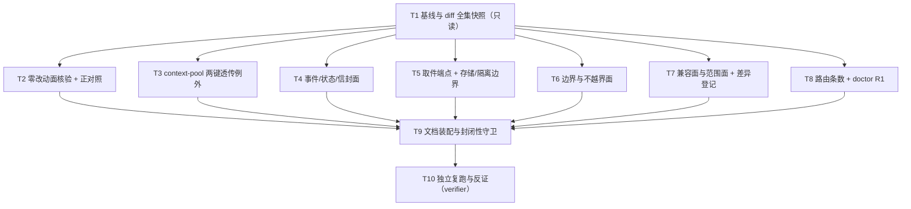

# pr-008-tasks.md — pr-008 内部任务列表（既有面保持与范围守卫的证据面，G01）

**运行模型标识**: deepseek/deepseek-v4-flash
**迭代**: 0030-hub-communication-upgrade ｜ **阶段**: 5（PR 实现）· 内部第一步（planner，子 agent 内部步骤）
**PR 文件**: `docs/iterations/0030-hub-communication-upgrade/prs/pr-008-existing-surface-guard.md`
**PR worktree（绝对路径，唯一产物写入面）**: `/Users/chenchiyuan/projects/agents/.pb-agents/worktrees/0030-hub-communication-upgrade/.pb-agents/worktrees/0030-pr-008-existing-surface-guard`
**PR worktree 分支**: `feat/0030-pr-008-existing-surface-guard`（快照时 HEAD = `9a4f424`，`git status --porcelain` 为空）
**任务总数**: **9**（T1~T9，dev 可执行）+ **1 个独立核验任务**（T10，verifier，非 dev） ｜ **依赖图**: **无环**（见 §2）
**关键路径**: `T1 → T4 → T9 → T10`（4 节点）；广度路径 `T1 → {T2,T3,T4,T5,T6,T7,T8} → T9`
**性质**: 本 PR 内部任务列表（**不是**全局任务图），供 dev 消费
**输入真源**: PR 文件（4 条验收标准 + 文件范围 + `depends_on`）+ `prd/G01-existing-surface-preserved.md`（验收 1~12 + 边界 + `model_inferred: 无`）+ `architecture.md`（§1.3 既有面硬约束 1~8、§5 变更面清单「明确不改」+ 退役判据、§6 逐条零影响声明 12 行 + 唯一例外、§9 已知局限 1~13、§10-8/§10-10/§10-11/§10-12）+ **planner 实读与 `/tmp` 演练实测**（§0.3 F1~F18、§4.9）

> **本 PR 零运行时代码改动**：唯一交付物 = 1 份证据文档（`evidence/g01-existing-surface.md`）。全部判据 = **只读 git 命令 + 源码静态抽取 + 只读 http 探测**；本仓 `oamp/` 下无 `*.test.js` ⇒ 无测试可跑、不新增测试。
> 判据命令族**已由 planner 全部实跑过一遍**（§4.9）：正例通过、正对照非空、`hub doctor` R1 落 29 项 0 失败、`context-pool.js` 归一化等价判据实测 `NORMALIZED-IDENTICAL`。

---

## 0. 范围、冻结契约与事实锚点

### 0.1 本 PR 可写文件面（唯一）

| # | 文件（PR worktree 相对路径） | 动作 | 内容（任务归属） |
|---|---|---|---|
| 1 | `docs/iterations/0030-hub-communication-upgrade/evidence/g01-existing-surface.md` | **新建**（父目录 `evidence/` 已存在，含 `f09-process-contract.md`） | G01 验收 1~12 逐条判据与证据（**T2~T9** 分段写入） |

> 第 2 个写入面（**非 PR 交付物**）：本 tasks 文件**末尾「执行证据（dev 回填）」段**（§7）。该文件位于**迭代工作区** `<工作区地址>/docs/iterations/0030-hub-communication-upgrade/prs/pr-008-existing-surface-guard-tasks.md`，**与 PR worktree 不是同一棵工作树**——dev 的原始输出（命令 + 原样 stdout + exit code）回填此段，**不回填 PR 文件**、不新建第二份证据文件、不写 `clarifications/`。

**冻结：本 PR 的 `evidence/g01-existing-surface.md` 内容分节顺序（K11 的载体）**

```
0. 基线与复现前提（baseline SHA / PR worktree / 命令族入口）
1. G01 验收 1~12 逐条结论表（12 行；结论列只能取「不回归」）
2. 变更面 diff 的分类表（§5 明文改动 / 已登记预期差异 ①~⑤ / 既有滞后；无第三类）
3. 零改动面逐条核验（含正对照）
4. `context-pool.js` 两键透传例外（白名单 + 归一化等价证明）
5. 事件面（事件类集合 / 常量 / 发布调用点 / 4 键空间 / 失败侧 payload 增量）
6. 信封与状态面（10 键与失败侧 11 键、键序、state 四值、取消落 failed）
7. 取件端点契约面（参数行 / 响应键序 / 确认语义 / Router 不在场时的取值登记）
8. 边界与不越界面（实例生命周期 / 既有缺陷不修 / 绑定范围）
9. 兼容与范围面（无新增必填参数、取值域、预期差异 ①~⑤ 登记、§5↔F01~F08 回溯表）
10. 路由条数与 `hub doctor` R1（四处同值 + R1 双向比对）
11. 复现命令族（逐条可复制）
```

### 0.2 非目标（零改动清单 / 防夹带）

- **零改动（`git diff --name-only main HEAD -- <path>` 必须为空）**：`oamp/src/router.js`、`oamp/src/registry.js`、`oamp/src/role-binding.js`、`oamp/src/transport.js`、`oamp/src/principals.js`、`oamp/src/inbox.js`、`oamp/src/cluster-config.js`、`oamp/sdk/**`、`oamp/web/**`、`oamp/scripts/**`、**仓库根 `cluster.json`**、**角色定义面** `':(glob)roles/*/*.md'` + `':(glob)roles/_template/**'`（**必须带 `:(glob)` 魔法**，否则 `*` 跨 `/` 会命中 `roles/*/data/**`，见 F6）。
  追溯：PR 文件 AC3；`architecture.md` §5「明确不改（零改动）」+ §6 唯一例外段；G01 验收 11。
- **本 PR 自身零运行时代码改动**：不碰 `oamp/src/**`、`oamp/sdk/**`、`oamp/web/**`、`oamp/*.md`、`oamp/skill/**`、`roles/**`、`cluster.json`、`tests/**`、`tools/**`。
  追溯：PR 文件「文件范围」（唯一新建项）+ AC3；`architecture.md` §5。
- **不改任何主 agent 产物**：`status.md`、`history.md`、`deferred-demand-changes.md`、`dispatch-ledger.md`、`prd/**`、`architecture.md`、`demand.md`、`prd.md`、`clarifications/**`、以及 `prs/` 下任何 PR 文件（含本 PR 自己的 PR 文件）——全部**只读**。
  追溯：简报硬约束；`data/formats.md` §状态追踪协议（由主 agent 维护）。
- **不新建**：任何第二份证据文件（含 `evidence/g01-*.md` 之外的同名变体）、测试文件、校验脚本入库、格式规范。
  追溯：PR 文件「文件范围」= 单文件；`architecture.md` §8「明确拒绝引入的」第 4 条（不引入工具化门禁）。
- **不做（属其他 PR 或已合并面）**：`reason.js` / `pool-routing.js` / `persist.js` inbox 表（pr-001~003）、双计时与 `context-pool` 两键透传（pr-004）、`web.js` 六处接线与 `pickup.js` 退役（pr-005）、模型归属载体与派发台账（pr-007）、`API.md`/`README.md`/`llms.txt`/`skill/hub.md` 文档面同步与 `llms.txt` 重生成（pr-006，**尚未合并**，见 F3）。
- **做错的形态（明确排除）**：① 把"零改动"写成含糊的"没有大改"（必须逐路径给命令与空输出）；② 把 `roles/**` 递归面当作零改动（**它真的变了**，见 F6——判据必须分层，否则本 PR 自证失败）；③ 把预期差异 ①~⑤ 当作回归并去"修"（它们**已登记**，见 K8）；④ 把非空洞的 `git diff` 判据用在**不存在**的路径上（`oamp/cluster.json`，见 F5）；⑤ 为了让判据好看而删改任何既有代码或注释（例：`web.js:539` 的"11 键"注释是**既有滞后**，本迭代与 pr-008 都不改，见 F9）；⑥ 起 Router/web 时占用默认端口/socket 或写 `oamp/.runtime/`（取证一律 `/tmp` 副本 + env 隔离，见 K10）。

### 0.3 实读事实锚点（2026-09-17 实读 + `/tmp` 演练实测；判据的可判定性基础）

| # | 事实 | 位置 / 依据（实跑命令） |
|---|---|---|
| **F1** | PR worktree 存在且干净：分支 `feat/0030-pr-008-existing-surface-guard`，HEAD = `9a4f424`（= 迭代分支 tip），`git status --porcelain` 为空 | `git -C <PR worktree> log --oneline -1` / `status --porcelain` |
| **F2** | **基线口径唯一**：`git rev-parse main` = `706e3d004029396b0ab24f95c3951b9fe7226214` = `git merge-base main HEAD` ⇒ `git diff main HEAD` = **完整迭代改动面**（不是"上一个 PR 之后"） | 实测 |
| **F3** | 8 个 PR 中 **6 个已合并**；`pr-006`（docs 面同步）与 `pr-008`（本 PR）**未合并** ⇒ 当前 `git diff --name-status main HEAD` 中 **不含** `oamp/API.md` / `oamp/README.md` / `oamp/llms.txt` / `oamp/skill/hub.md`（这 4 个文件的差异待 pr-006 落地）。**本 PR 的零改动清单不含这 4 个文件**（§5 把文档面列为"同步"，非零改动面） | `git diff --stat main HEAD -- oamp/`（11 个 `oamp/src/**` 文件，无 `*.md`） |
| **F4** | **零改动面实测为空**：`git diff --name-only main HEAD -- <K3 各组路径>` 输出 **空**（含组 A 7 文件 / 组 B 3 目录 / 组 C 根 `cluster.json` / 组 D 定义面 / 组 E）；**正对照** `git diff --name-only main HEAD -- oamp/src/web.js` 输出 **非空**（= 1 行）⇒ 命令面有效、非空洞 | 实测（§4 R2） |
| **F5** | **路径更正（事实更正 ①）**：`oamp/cluster.json` **不存在**；`cluster.json` 在**仓库根**（489 B）。PR 文件 AC3 与 `architecture.md` §5 的字面写法混了前缀（§5 的 `cluster.json` 无 `oamp/` 前缀，与根路径一致）⇒ 判据必须写作"根 `cluster.json` 的 diff 为空"，**且**补一条"`oamp/cluster.json` 不存在"的存在性断言（否则该行判据永远"通过"而无意义） | `test -e oamp/cluster.json` → 否；`ls -la cluster.json` → 489 B；`git ls-tree -r --name-only main -- cluster.json` → 命中根路径 |
| **F6** | **`roles/**` 递归面变了（事实更正 ②）+ pathspec 陷阱（事实更正 ⑤）**：`git diff --name-status main HEAD -- roles` = **9 个 `A`**，全部位于 `roles/{architect,prd,verifier}/data/*.md`（决策记录与验收报告 = **过程产物**）；**角色定义面**（22 个 tracked 文件：`roles/<role>/<role>.md` / `memory.md` / `SKILL.md` / `_template/role-structure-reference.md`）**零改动**。**陷阱**：git pathspec **默认 `*` 跨 `/`** ⇒ `git diff -- 'roles/*/*.md'` 会命中 `roles/*/data/*.md`（实测 **9 行**，与递归面同值，极易被误读为"定义面也变了"）；必须用 **glob magic** `':(glob)roles/*/*.md'`（实测 **0 行**）；且 `git ls-tree` **不支持 `:(glob)`**（报 `pathspec magic not supported`）⇒ 存在性断言改用 `git ls-tree -r --name-only main -- roles \| grep -cE '^roles/[^/]+/[^/]+$'` = **22**。⇒ G01 验收 11 的"模型值不进 `roles/*/*.md`"与 §5 的"`roles/**` 零改动"**必须分层写且用 glob magic**：定义面零改动（可断言），`roles/*/data/**` 是本迭代过程产物面（登记说明，不属"既有产品面回归"） | 实测（§4 R2、§4.13 P2） |
| **F7** | **`context-pool.js` 例外实测形态**：`git diff --stat` = `1 file changed, 4 insertions(+), 2 deletions(-)`；`-U0` 行集 = **恰好 6 行 / 3 处**白名单（`prompt` 形参表加 `idleMs, netMs`；`this.queue.push({…})` 加两键；`client.prompt` 实参加 `idleMs: turn.idleMs,` / `netMs: turn.netMs,`）；**归一化等价判据实测通过**：把这三处白名单行从 HEAD 版剔除后与 main 版**逐字相同**（`NORMALIZED-IDENTICAL`）⇒ "除两键透传外逐字零改动"是可证的，不靠人眼 | 实测（§4 R3） |
| **F8** | **事件面零改动实测**：① `grep -oE "type: '[a-zA-Z_]+'" oamp/src/web.js \| sort -u` 与 main 版 **diff 为空**；② `CALL_EVENTS = …`（`web.js:68`）与 `FILTERED_EVENT_KINDS = …`（`web.js:50`）两常量行 diff 为空；③ `git diff main HEAD -- oamp/src/web.js \| grep -E "^[+-].*transport\."` **输出为空**（**发布调用点行零差异**——比"事件名集合"更强）；④ `transport.js` 零改动（F4）⇒ 4 个键空间（`chat:` / 全局 `null` / `chat-calls:` / `call:`）与 `publish/publishGlobal/publishCall` 语义逐字未动 | 实测（§4 R4） |
| **F9** | **信封实测**：main 与 HEAD 的 `composeCallEnvelope` **均返回 10 键、键序逐字相同**（`call_id,agent,state,duration_ms,model,truncated,text,structured_output,error,exit_code`）；HEAD 追加的**唯一**一行是 `if (state === 'failed') envelope.reason = reasonOf(state, envelope.error);` ⇒ **失败侧 11 键（末位 `reason`）、成功/受理侧 10 键**。`web.js:539` 的模块注释写"11 键"是**既有注释滞后**（main 的同一注释亦写 11）⇒ 不改注释、不在文档里把它当改动 | 实测（§4 R5） |
| **F10** | **取件端点实测**：`GET /api/pickup` 参数行 = `principal`(query, required) + `epoch`(query, optional)，与 main **逐字相同**；HEAD 响应为**显式 7 键有序映射** `call_id,requester,agent,chat_id,terminal_at,acked,envelope`，与 main 的 `{...entry(6 键), envelope}` 顺序一致；`POST /api/pickup/:call_id/ack` 参数行 = `call_id`(path) + `principal`(query) + `epoch`(query)，响应 `{ call_id, acked: true }`，与 main 相同；确认语义：`db.deleteInbox`（就地删除，幂等）+ `listInbox` 只返未取件 ⇒ "确认后不再出现在未取件集合 / 重复确认无副作用"成立 | 实测（§4 R6） |
| **F11** | **预期差异 ① 的代码位置**：`GET /api/agents` 的行投影由 main 的 `roleFromInstanceId(n.instance_id)`（main `web.js:673`）变为 `roleOfPoolInstance(n.instance_id, roleFromInstanceId)`（HEAD `web.js:677`）⇒ `pb-<role>-<n>` 的 `role` 列由 `null` → 角色名。**字段类型与取值域 `string\|null` 不变** | `git show main:oamp/src/web.js \| grep -n "withRole"`；`grep -n "roleOfPoolInstance" oamp/src/web.js`；登记出处 `architecture.md` §9-10 + §10-10 |
| **F12** | **路由 29 条实测（四处同值）**：① `awk '/^export function createApiRoutes/,/^export function projectRoutes/' oamp/src/web.js \| grep -cE "^      method: '"` = **29**；② `awk '/function createApiRoutes/,0' oamp/src/web.js \| grep -cE "method: '(GET\|POST\|PUT\|DELETE)'"` = **29**；③ `grep -cE "^- (GET\|POST) /api/" oamp/llms.txt` = **29**（头部第 11 行 `## 接口（29 条）`）；④ `grep -cE "^\|\s*[0-9]+\s*\|\s*\\\`(GET\|POST)\s+/api/" oamp/API.md` = **29**；⑤ **运行时** `GET /api/docs` 的 `routes.length` = **29**（planner 实跑）。PR 文件写"三处"⇒ 实为**四处静态 + 一处运行时**，文档按实测写 | 实测（§4 R7） |
| **F13** | **`hub doctor` 实跑实测（事实更正 ③）**：`hub doctor` **不接受 `--port`**（`{"code":"USAGE","error":"doctor 不接受该参数: --port"}`，exit 2）；端口走 **env `OAMP_WEB_PORT`**（`sdk/surface.js:34/463` 的缺省链 `opts.port ?? OAMP_WEB_PORT ?? 7788`）；且 **Router 必须在线**（Router 缺 → `{"code":"UPSTREAM_UNAVAILABLE"}` exit 3）；Router + web 均在线时 **exit 0、items 66、R1 items 29、R1 失败 0** | 实测（§4 R8，`/tmp` 隔离副本 + 端口 17788 + `/tmp` socket） |
| **F14** | `oamp/package.json` 的 `dependencies` = `{}`（零第三方依赖）；`bin` = `{oamp, hub}`；无 `devDependencies` | `node -p "JSON.stringify(require('./oamp/package.json').dependencies)"` → `{}` |
| **F15** | **`pickup.js` 退役实测 + 判据更正（事实更正 ④）**：`oamp/src/pickup.js` **不存在**；**模块引用零命中**（`grep -rnE "from '(\./)?pickup(\.js)?'" oamp/src oamp/sdk oamp/bin oamp/scripts` → rc=1）。**但 `architecture.md` §5 的字面退役判据 `grep -rn pickup oamp/src oamp/sdk oamp/bin oamp/scripts` 会产生命中**（`web.js` 的 `/api/pickup` 路由名 4 处 + `sdk/surface.js` 的 CLI 命令名 `pickup list` / `pickup ack` 4 处）——**因为 G01 验收 4 要求这两个端点保留**，故那条字面命令**不可用作判据**（用了会得出"退役失败"的假结论） | 实测（§4 R9） |
| **F16** | **预期差异 ③ 实测**：`/api/calls` 的**参数行数 main = HEAD = 9**（逐行 diff 为空），唯一差异是 `tasks` 项的 **desc 文本**由 `{task, output_schema?, schema_mode?, mode?, model?}` 变为追加 `new_session?` ⇒ "无新增必填参数"成立；`new_session` **不出现为顶层 param 行**（故不构成新参数面） | `awk "/path: '\/api\/calls',/,/kind: 'json'/" … \| grep -cE "\{ name: '"`；两侧 desc 行对照 |
| **F17** | **预期差异 ② 活体取证实测**：`/tmp` 隔离副本起 web（端口 17788、socket 指向不存在的路径、Router 未启动）⇒ `GET /api/pickup?principal=whoami` = **HTTP 200** `{"pickup":[]}`；`POST /api/pickup/call_x/ack?principal=whoami` = **HTTP 200** `{"call_id":"call_x","acked":true}`；**正对照** `GET /api/agents` = **502**（证明 Router 确实不可达，200 不是"服务没起来"的假象） | 实测（§4 R10）。main 侧对应实现为 `queryOnce(router.task_get)` 逐条现算（`main web.js:1639` + `main pickup.js` 的 `listByRequester`）⇒ 502 由该查询触发；登记出处 `architecture.md` §6 表第 4 行 + §9 局限 |
| **F18** | **两处必须分类（不得当回归）的既有改动**：① `RECONCILE_TTL_DEFAULT_MS` 由 `30 * 60 * 1000` 改为 `config.taskNetMs + RECONCILE_SLOW_DEFAULT_MS`（= 4h + 30s）——**§5 明文改动 ⑥ / L2-05 的自主动作**；② `entry.agentId = instanceIdForRole(role)` → `entry.agentId = target`（池内选择结果）——**§5 明文改动 ①（pr-005 池化路由）**。另：`api/calls/:call_id/transcript` handler 的整块源码 main 与 HEAD **逐字相同**（`TRANSCRIPT-IDENTICAL`）⇒ G01 验收 9 的"transcript 截断未修"有直接证据；"惰性启动竞态未修"的判据 = 竞态判定面（`landed` / `attempts` / 迟到结果丢弃）逐字未动，**仅** TTL 默认值算式变化（上述 ①，属明文改动） | 实测（§4 R11） |
| **F19** | **UDS 方法集合 9 个（可实现计数）**：`grep -cE "^      case '" oamp/src/router.js` = **9**，方法名逐条 = `agent.register` / `agent.heartbeat` / `agent.deregister` / `message.send` / `message.ack` / `router.status` / `router.task_get` / `router.task_cancel` / `router.task_list`；`router.js` 零改动（F4）⇒ 集合不变（G01 验收 5 / §1.3-5） | 实测（§4 R12） |
| **F20** | **"只绑 `dev` / `verifier`"的**可判定**判据**：根 `cluster.json` 中**带 `model` 键**的角色集合 main 与 HEAD **同为 `{dev, verifier}`**（`node -p "Object.entries(require('./cluster.json').roles).filter(([,v])=>v&&v.model).map(([k])=>k).join(',')"` → `dev,verifier`）；**注意**：`cluster.json` 的 `roles` **键集**含全部 10 个角色（`architect`/`demand`/`dev`/`planner`/`pr-planner`/`prd`/`progress-observer`/`retrospective`/`verifier`/`workflow-pb`）⇒ **不能**用键集当"绑定范围"判据（会得出错误结论），且该文件零改动是 §5/G01 验收 11 的硬约束 | 实测（§4 R12）；`architecture.md` §1.3-6、§5、§6 表第 11 行；D-34 / D-35；F08 验收 6 |

> **本 PR 的"回归判定门槛"由 F5/F6/F15 三条更正共同定义**：若照抄 PR 文件/`architecture.md` 的字面路径与字面命令，会分别得到"路径不存在"（无意义通过）、"`roles/**` 变了"（假回归）、"`pickup` 仍有引用"（假回归）。T2/T3 必须用 §0.4 K3/K4 的**更正后形态**。

### 0.4 本 PR 冻结契约（K1~K12；下游 dev/verifier 按此判定）

**K1 · 落点与写入面**：唯一交付物 = `<PR worktree>/docs/iterations/0030-hub-communication-upgrade/evidence/g01-existing-surface.md`（新建）；dev 原始输出回填迭代工作区的本 tasks 文件 §7。**禁止**写仓库主工作区 `/Users/chenchiyuan/projects/agents`（只读）；**禁止** git 写操作（无 add/commit/branch/worktree）。
〔追溯：PR 文件「文件范围」；简报硬约束〕

**K2 · 基线口径（唯一）**：baseline ref = **`main`**，SHA = `706e3d004029396b0ab24f95c3951b9fe7226214`（= merge-base）；所有比对命令统一 `git -C <PR worktree> diff main HEAD -- <path>`（或 `git -C <PR worktree> show main:<path>`）。文档**必须**写出这两个 SHA 与命令形态（可复现性的前提）。`main` 若在本 PR 执行期间前进 ⇒ 停机上报（基线漂移）。
〔追溯：PR 文件 AC1「变更面 diff」；`architecture.md` §1.1 实测口径〕

**K3 · 零改动面清单（更正后形态，逐条可断言）**

| 组 | 路径（相对 PR worktree 根） | 判据形态 |
|---|---|---|
| A | `oamp/src/router.js`、`oamp/src/registry.js`、`oamp/src/role-binding.js`、`oamp/src/transport.js`、`oamp/src/principals.js`、`oamp/src/inbox.js`、`oamp/src/cluster-config.js` | `git ls-tree -r --name-only main -- <path>` **命中**（存在性前置）**且** `git diff --name-only main HEAD -- <path>` 为空 |
| B | `oamp/sdk`（7 个文件）、`oamp/web`（11 个文件）、`oamp/scripts`（1 个文件） | 同上（目录级；文件数入证，防止"目录不存在 ⇒ 空 diff"的空洞通过） |
| C | **根** `cluster.json` | 见 F5：`oamp/cluster.json` **不存在**（负向断言）；根 `cluster.json` 存在（`git ls-tree -r --name-only main -- cluster.json` 命中）且 diff 为空 |
| D | `:(glob)roles/*/*.md`（**21** 个：20 个角色定义/记忆文件 + `_template/role-structure-reference.md`）+ `:(glob)roles/_template/**`（1 个，与前者重叠）；定义面合计 = `ls-tree` 的两级计数 **22** | 见 F6：`git diff --name-only main HEAD -- ':(glob)roles/*/*.md' ':(glob)roles/_template/**'` 为空；存在性前置 = `git ls-tree -r --name-only main -- roles \| grep -cE '^roles/[^/]+/[^/]+$'` = **22**（`ls-tree` 不支持 `:(glob)`）；**另**：`roles/*/data/**` 的 9 个 `A`（`git diff --name-only main HEAD -- ':(glob)roles/*/data/**'`）必须**登记说明**，不得声称 `roles/**` 整体零改动。**禁止**用非 magic 的 `roles/*/*.md`（`*` 跨 `/` ⇒ 恒得 9） |
| E | `oamp/package.json` 的 `dependencies` | `node -p "JSON.stringify(require('./oamp/package.json').dependencies)"` = `{}`（**逐字**）；并断言 `oamp/package.json` 的整体 diff 为空 |
| — | **正对照（必做）** | `git diff --name-only main HEAD -- oamp/src/web.js` **非空**（= `oamp/src/web.js`）⇒ 证明命令族确实在比对而不是恒空 |

〔追溯：PR 文件 AC3；`architecture.md` §1.3-7、§5「明确不改」、§6 唯一例外段；G01 验收 11〕

**K4 · `context-pool.js` 例外白名单（唯一允许的改动，逐字）**

1. `prompt(text, { model = null, timeoutMs, idleMs, netMs, onDelta = null, origin = null, projectContext = null } = {})`（形参表 +`idleMs`,`netMs`）
2. `this.queue.push({ text, model, timeoutMs, idleMs, netMs, onDelta, projectContext, resolve, reject });`（队列项 +两键）
3. `client.prompt` 实参对象内新增两行 `idleMs: turn.idleMs,` / `netMs: turn.netMs,`

判据（三选二即可判死，建议全做）：① `git diff --stat` = 恰 `1 file changed, 4 insertions(+), 2 deletions(-)`；② `git diff -U0 \| grep -E '^[+-][^+-]'` = **恰 6 行且逐行落在上述三处**；③ **归一化等价**：`sed -e 's/, idleMs, netMs//' -e '/idleMs: turn\.idleMs,$/d' -e '/netMs: turn\.netMs,$/d'` 后的 HEAD 版与 main 版 **逐字相同**（`diff` 空）。
**零改动断言（必须显式写进文档）**：`(chat_id, agent_id)` 键语义（`key(chatId, agentId)` 构造）、同键 FIFO 串行、LRU / 释放路径 —— 由判据 ③ 蕴含（这些行未进入白名单）。
〔追溯：PR 文件 AC3 的"唯一例外"；`architecture.md` §5 表 `context-pool.js` 行、§10-11；G01 验收 8 / 12〕

**K5 · 事件面判据（三重口径，全部落到文档）**：① 事件类字面集合 diff（`grep -oE "type: '[a-zA-Z_]+'" … | sort -u`，两侧 diff 空）；② 两个常量行 diff 空（`CALL_EVENTS` / `FILTERED_EVENT_KINDS`）；③ **发布调用点行**零差异（`git diff … -- oamp/src/web.js | grep -E "^[+-].*transport\."` 空）。并**如实说明**"4 条推送面"= 4 个**键空间**（`chat:<id>` / 全局 `null` / `chat-calls:<id>` / `call:<id>`），而 SSE **路由**共 5 条（多一条过滤面 `/api/subscribe`）——避免"4 条面 vs 5 条路由"被误读为矛盾。
**唯一允许的帧级差异**：失败终态 `call_result` 帧的 `payload` 多一个 `reason` 键（事件类名 `call_result` 不变、4 键空间不变）。
〔追溯：`architecture.md` §1.3-1、§6 表第 1 行、§9-9；G01 验收 1〕

**K6 · 信封与状态面判据**：① 键序抽取命令（`awk '/^function composeCallEnvelope/,/^}$/' … \| awk '/const envelope = \{/,/^  \};/' \| grep -oE "^    [a-z_]+" \| tr -d ' '`）两侧**逐字相同**（10 键）；② HEAD 失败侧 `reason` 追加行的原文入证（`if (state === 'failed') envelope.reason = reasonOf(state, envelope.error);`）⇒ 失败侧 11 键、末位；③ `state:` 字面集合两侧 diff 空（含 `submitted`/`working`/`failed`；`online`/`closed` 属非任务域，同集合内）；④ 取消落 `failed` 的代码行两侧逐字相同（`finishTask(entry, { state: 'failed', error: 'cancelled' })`）。
**明确写入**：`error` 键**保留、不改名、不新增 `detail` 键**；既有失败产生点零改动（故既有文案逐字不动）。
〔追溯：`architecture.md` §1.3-2/3、§4 A-03、§6 表第 2/3 行、§10-4；G01 验收 2/3；F04 验收 5〕

**K7 · 取件端点契约判据**：① 两端点**参数行**逐行 diff 空（`principal` / `epoch` / `call_id` 名与 in/required 取值）；② HEAD 响应键序 = `call_id,requester,agent,chat_id,terminal_at,acked,envelope`（7 键），并给出 main 侧等价形态（`{...entry(6 键白名单), envelope}`，`main src/pickup.js` 的 `entries.set` 字段表为证）；③ 确认语义：`db.deleteInbox(call_id)`（就地删除、幂等）+ `listInbox(principal)` 只返未取件条目 ⇒ 已确认者不再出现；④ **如实登记**"Router 不在场时 502 → 200"为**已登记取值变化**（F17），并给出 main 侧触发机制（`queryOnce` → 502）。
〔追溯：`architecture.md` §1.3-4、§6 表第 4 行、§9-8（`acked` 恒 `false`）；G01 验收 4；事实 F-2〕

**K8 · 预期差异分类（唯一权威清单；不得新增类别）**

| 编号 | 内容 | 判定 |
|---|---|---|
| ① | `GET /api/agents` 的 `role` 列对 `pb-<role>-<n>` 由 `null` → 角色名（F11） | **已登记取值变化**（`architecture.md` §9-10 / §10-10） |
| ② | 取件面在 Router 不可达时 502 → 200（F17） | **已登记取值变化**（§6 表第 4 行"变的只有何时写入与正文从哪读"） |
| ③ | `/api/docs` 的 `POST /api/calls` desc 行（新增 `new_session` 可见性）（F16） | **已登记取值变化**（§5 表 `web.js` ② 行 / §10-12⑤） |
| ④ | 失败终态信封 10 键 → 11 键（末位 `reason`；成功侧仍 10 键）（F9） | **已登记取值变化**（§4 A-03 / §9-9） |
| ⑤ | `pickup.js` 退役（实现面零命中）（F15） | **已登记实现面变化**（§5 退役行 / §10-12④） |
| — | `RECONCILE_TTL` 默认值算式与 `entry.agentId` 取值来源（F18） | **§5 明文改动**（非差异、非回归） |
| — | `web.js:539` 注释"11 键" | **既有滞后**（main 同形；不改） |

**判据**：`git diff main HEAD` 的**每一行**都必须能归入 {§5 明文改动 / 上表 ①~⑤ / 既有滞后} 之一；出现第六类 ⇒ 结论"回归" ⇒ **本 PR 不通过**。
〔追溯：PR 文件 AC1/AC3；简报「预期差异清单」；`architecture.md` §5/§6/§9/§10〕

**K9 · 回归判定规则**：文档 12 条结论**只能取"不回归"**；任一条不成立（含任何未分类 diff 行）⇒ 本 PR 不通过，并在文档中如实写出该条与证据，**不允许**用"部分通过""基本一致"等模糊表述。

**K10 · `hub doctor` R1 取证协议（隔离，不得占用默认资源）**：`cp -R <PR worktree>/oamp /tmp/0030-pr-008/oamp`；`OAMP_SOCKET=/tmp/0030-pr-008/router.sock`、`OAMP_DB=/tmp/0030-pr-008/sql.db`；Router 与 web **都必须起**（F13）；web 端口用 **17788**（非默认 7788）；`hub doctor` 的端口**只能**经 `OAMP_WEB_PORT=17788` 传入（**不接受 `--port`**，F13）。取证完成后停掉两个进程；**不得**在 `oamp/.runtime/` 或 `oamp/data/` 留下任何文件。
〔追溯：简报取证硬约束；F13〕

**K11 · 12 条结论表（文档第 1 节，逐条强制）**：12 行，列 = `G01 验收 n ｜ 结论 ｜ 判据命令（引用 §11） ｜ 证据所在节`。**每行的"判据命令"必须在文档 §11 存在且可复制执行**；不得出现"见上文""同上"。
〔追溯：PR 文件 AC1（"逐条"）+ AC2（"文档须至少覆盖这些事实"）〕

**K12 · 证据形态**：命令 + 原样输出（可截断长输出但必须给出计数与首尾）+ exit code；所有命令以 `<PR worktree>` 为根的**相对路径**可复现；**不得**依赖未合并的 pr-006（若某判据在 pr-006 合并后会变，写"不变量说明"并给出复跑命令与期望值——路由 29 即此情形）。

### 0.5 PR 验收标准 → 任务映射（4 条 AC 全覆盖，无孤儿任务、无无主 AC）

| PR AC（原文摘要） | 服务任务 | 判据落点 |
|---|---|---|
| **AC1** `evidence/g01-existing-surface.md` 对 G01 验收 1~12 **逐条**给出判据与可核验证据（变更面 diff / 事件类集合比对 / 响应键集断言 / 路由条数 / `git diff --stat` 零改动面核验），12 条结论全为"不回归" | **T9**（收口与 12 行结论表）+ **T2~T8**（各段证据，其中 T2 提供"变更面 diff"、T4 提供事件类集合与键集、T8 提供路由条数） | T9 判据 1~5；T2 判据 1~3；T4 判据 1~5；T8 判据 1~3 |
| **AC2** 文档须至少覆盖 ①~⑫ 这些事实（SSE 事件类 / `state` 四值 / `error` 与 10 键信封 / 取件两端点 / Router 纯内存 / 无产物核实 / UDS 与 worktree 协议 / 无生命周期与均衡 / 两处既有缺陷未修 / 无新增必填参数与例外 ① / 绑定范围与模型值 / 无 demand 之外功能点） | **T4**（①②③）、**T5**（④⑤⑥⑦）、**T6**（⑧⑨⑪）、**T7**（⑩⑫ + 差异登记） | T4~T7 各自的"⑫ 事实覆盖"判据（每条 = 1 个判据编号，与 AC2 的编号对齐） |
| **AC3** 零改动面可核验为零改动（含 `oamp/package.json` 的 `dependencies` = `{}`）；**唯一例外 = `oamp/src/context-pool.js`**（只应出现 `idleMs` / `netMs` 两键透传；键语义 / 同键 FIFO / LRU 与释放路径出现任何改动即不通过） | **T2**（零改动面逐条 + 正对照）、**T3**（例外白名单 + 归一化等价证明） | T2 判据 1~5；T3 判据 1~4 |
| **AC4** 路由不增不减（三处同值，本迭代前实测 = 29）且 `hub doctor` 的 R1 双向比对通过 | **T8** | T8 判据 1~4 |

> **T1** 不单独服务某一条 AC，而是**全部 AC 的基线前提**（SHA 冻结、diff 全集、命令族入口）；**T9** 是 AC1 的载体与全部 AC 的守门；**T10** 是独立核验（不属本 PR 交付物）。无孤儿任务、无无主 AC。

---

## 1. 任务列表

### T1: 基线与 diff 全集快照（只读；全部后续任务的公因子）

- **服务哪条 AC**: AC1~AC4 的基线前提（不是单独某条的判据）
- **描述**: 冻结本 PR 的执行基线：① 三个 ref 与 SHA（`HEAD` / `main` / merge-base）；② worktree 干净度；③ `git diff --name-status main HEAD` 的**全迭代改动面全集**（不限定 `oamp/`）；④ 每条路径的 **tracked 文件数**（K3 组 A/B/D 的"非空洞"前提）；⑤ 命令族入口（`W=<PR worktree>` 的写法、`git -C` 形态）。
- **文件/锚点**: 只读 `git`；不需要读任何文档（PR 文件与架构已由 planner 读毕，事实见 §0.3）。
- **步骤**: ① `git -C $W rev-parse HEAD main`；② `git -C $W merge-base main HEAD`；③ `git -C $W status --porcelain`；④ `git -C $W diff --name-status main HEAD`（**全量输出入证**）；⑤ `git -C $W ls-tree -r --name-only main -- <K3 各组路径> | wc -l` 逐组计数。
- **验收判据（可执行；输出全部入证）**:
  1. `git rev-parse main` = `706e3d004029396b0ab24f95c3951b9fe7226214` **且** `merge-base main HEAD` 同值（否则停机上报基线漂移，K2）。
  2. `git status --porcelain` 为空（clean）。
  3. `git diff --name-status main HEAD` 全集 = **11 个 `oamp/src/**`（10 `M` + 1 `D`=`pickup.js`）+ 2 个 `A`（`reason.js` / `pool-routing.js`）+ `docs/**` 与 `roles/*/data/**` 的 `A`/`M`**；逐行列出并标注 `A/M/D`，**并明确写出"不含 `oamp/API.md` / `oamp/README.md` / `oamp/llms.txt` / `oamp/skill/hub.md`"**（F3：pr-006 未合并）。
  4. 组 A/B/D 的 tracked 计数入证（实测：`oamp/sdk`=7、`oamp/web`=11、`oamp/scripts`=1、`roles` 递归=72；逐条列出），证明 K3 的路径**存在且非空**。
- **追溯**: PR 文件 AC1「变更面 diff」+ AC3；`architecture.md` §5 变更面清单（新增 2 / 修改 8 / 退役 1）+ §1.1 实测口径。
- **前置依赖**: 无
- **优先级**: P0

---

### T2: 零改动面逐条核验（K3 组 A~E + 正对照）

- **服务哪条 AC**: **AC3**（零改动面可核验为零改动）
- **描述**: 对 K3 的 5 组路径逐条执行"存在性 + diff 为空"断言，并跑一次**正对照**证明命令面非空洞；如实登记 `roles/*/data/**` 的 9 个新增过程产物（F6）与 `oamp/cluster.json` 的不存在（F5）。
- **文件/锚点**: 只读 git + `oamp/package.json`（`node -p` 读 JSON）。
- **步骤**: ① 逐路径跑 K3 的存在性命令；② 逐路径跑 `git diff --name-only main HEAD -- <path>`；③ 跑正对照；④ 跑 E 组的 `node -p`；⑤ 跑 `git diff --name-status main HEAD -- roles`（**必须**执行，用于 F6 的登记说明）。
- **验收判据（可执行）**:
  1. 组 A（7 个文件）逐条：`git ls-tree -r --name-only main -- <path>` 命中 **且** diff 为空（7/7 入证）。
  2. 组 B（3 个目录）：diff 为空 **且** 计数非 0（7 / 11 / 1）。
  3. 组 C：`test -e oamp/cluster.json` → **不存在**（负向断言写明）；`git ls-tree -r --name-only main -- cluster.json` 命中 **且** diff 为空。
  4. 组 D：`git diff --name-only main HEAD -- ':(glob)roles/*/*.md' ':(glob)roles/_template/**'` **为空**（存在性前置 = `git ls-tree -r --name-only main -- roles | grep -cE '^roles/[^/]+/[^/]+$'` = 22）；**必须**附 `git diff --name-only main HEAD -- roles` 的 9 行 `A` 输出，并写一句登记："`roles/*/data/**` 是本迭代过程产物（决策记录 / 验收报告），非既有产品面；G01 验收 11 的判据层 = `roles/*/*.md`"。**并登记 pathspec 陷阱**：非 magic 的 `'roles/*/*.md'` 实测得 9 行（`*` 跨 `/`），故本判据必须带 `:(glob)`（F6）。
  5. 组 E：`node -p "JSON.stringify(require('./oamp/package.json').dependencies)"` → `{}`（逐字）；`git diff --name-only main HEAD -- oamp/package.json` 为空。
  6. **正对照**：`git diff --name-only main HEAD -- oamp/src/web.js` **非空**（= 该路径）。
- **追溯**: PR 文件 AC3；`architecture.md` §1.3-7（零第三方依赖）、§1.3-6（`cluster.json` 零改动）、§5「明确不改」、§6 唯一例外段；G01 验收 11。
- **前置依赖**: T1
- **优先级**: P0

---

### T3: `context-pool.js` 两键透传例外（唯一例外；白名单 + 归一化等价）

- **服务哪条 AC**: **AC3**（后半：`context-pool.js` 是唯一例外，键语义 / FIFO / LRU / 释放路径零改动）
- **描述**: 用三条独立判据证明该文件"除 `idleMs` / `netMs` 两键透传外逐字未动"，并显式声明键语义 / 同键 FIFO / LRU / 释放路径零改动（由归一化等价蕴含）。
- **文件/锚点**: `oamp/src/context-pool.js`（只读）；对照 `git show main:oamp/src/context-pool.js`。
- **步骤**: ① `git diff --stat`；② `git diff -U0 | grep -E '^[+-][^+-]'` 逐行核对白名单；③ 归一化等价（`sed` 剔除 3 处白名单行后与 main 逐字 diff）；④ 抽取 `key(chatId, agentId)` 构造行、队列/串行/LRU/释放路径的关键行，两侧对照。
- **验收判据（可执行）**:
  1. `git diff --stat main HEAD -- oamp/src/context-pool.js` = 恰 `1 file changed, 4 insertions(+), 2 deletions(-)`。
  2. `-U0` 行集 = **恰 6 行**，且逐行落入 K4 白名单三处（列出原文 6 行做对照；出现第 4 处即判死）。
  3. **归一化等价**：`sed -e 's/, idleMs, netMs//' -e '/idleMs: turn\.idleMs,$/d' -e '/netMs: turn\.netMs,$/d'` 后的 HEAD 版与 main 版 `diff` **为空**（把命令与 `diff` 的 exit code 入证）。**这一条即"键语义 / FIFO / LRU / 释放路径零改动"的证明**。
  4. 文档显式写出三句断言（逐字）："`(chat_id, agent_id)` 键语义未动"、"同键 FIFO 串行未动"、"LRU 与释放路径未动"，并标注证明来源 = 判据 3。
- **追溯**: PR 文件 AC3（唯一例外段）；`architecture.md` §5 表 `context-pool.js` 行（"仅两键透传"）、§10-11（A-05 补定）；G01 验收 8 / 12；F-7。
- **前置依赖**: T1
- **优先级**: P0

---

### T4: 事件面 / 状态面 / 信封面证据（AC2 的 ①②③ → G01 验收 1~3）

- **服务哪条 AC**: **AC2 ①②③**（并入 AC1 的"事件类集合比对 / 响应键集断言"）
- **描述**: 产出文档第 5、6 节：事件类集合与语义不变（三重口径 + 4 键空间 + 唯一允许的帧级差异）；`state` 四值与取消落 `failed`；`error` 键保留、信封 10 键与失败侧 11 键。
- **文件/锚点**: `oamp/src/web.js`（只读：`FILTERED_EVENT_KINDS:50`、`CALL_EVENTS:68`、`composeCallEnvelope`）；`oamp/src/transport.js`（零改动，T2 组 A 已证）。
- **步骤**: ① 事件类字面集合两侧 diff；② 两常量行两侧 diff；③ `git diff main HEAD -- oamp/src/web.js | grep -E "^[+-].*transport\."`（期望空）；④ 键序抽取（K6 命令）两侧比对；⑤ 抽取 `reason` 追加行、`state:` 字面集合、取消 `finishTask` 行。
- **验收判据（可执行，对应 AC2 编号）**:
  1. **〔AC2 ①〕** ① 字面集合 diff 空 + ② 常量行 diff 空 + ③ **发布调用点行 diff 空**（三条全做）；文档写出 4 键空间与 5 条 SSE 路由的关系说明（K5）；写出唯一帧级差异 = 失败终态 `call_result` 的 payload 多 `reason` 键。
  2. **〔AC2 ②〕** `state:` 字面集合两侧 diff 空；取消路径行 `finishTask(entry, { state: 'failed', error: 'cancelled' })` 两侧逐字相同（含行号对照）；文档写明"仍为四值、不新增第三终态"。
  3. **〔AC2 ③〕** 键序抽取两侧逐字相同（10 键，顺序列出）；`reason` 追加行原文入证并注明"仅 `state === 'failed'` 分支、末位"；文档写明"**本迭代前实测既有信封 = 10 键**：`call_id/agent/state/duration_ms/model/truncated/text/structured_output/error/exit_code`"，失败侧 11 键、成功/受理侧 10 键；显式写出"`error` 键位、拼写、取值形态（含既有文案）不变，**不新增 `detail` 键**"；并登记 `web.js:539` 注释"11 键"为**既有滞后**（F9）。
  4. 三处失败产生点抽样：至少 3 条既有失败文案字符串（例如 `structured_output_invalid`、`cancelled`、`timeout`/安全网文案之一）两侧 `git diff` 零命中（命令：`git diff main HEAD -- oamp/src/**/*.js | grep -nE "<文案>"` 为空）。
  5. 文档第 5/6 节末尾各附 K11 要求的"判据命令引用"（指向文档 §11 的命令编号）。
- **追溯**: `architecture.md` §1.3-1/2/3、§4 A-03、§6 表第 1/2/3 行、§9-9；G01 验收 1/2/3；F04 验收 1/5；`prd/G01` 验收 1~3。
- **前置依赖**: T1
- **优先级**: P0

---

### T5: 取件端点契约面 + 存储与隔离边界面证据（AC2 的 ④⑤⑥⑦ → G01 验收 4~7）

- **服务哪条 AC**: **AC2 ④⑤⑥⑦**
- **描述**: 产出文档第 7、8 节（前半）：取件两端点参数名 / 响应键集与键序 / 确认语义不变；Router 任务表仍纯内存（`inbox` 只承载收件箱）；无产物字段与产物核实；UDS 路径与 worktree 隔离协议零改动。
- **文件/锚点**: `oamp/src/web.js`（`/api/pickup`、`/api/pickup/:call_id/ack`）；`oamp/src/pickup.js`（main 版，作为对照）、`oamp/src/persist.js`（`inbox` 表）、`oamp/src/router.js`+`registry.js`（零改动，T2 组 A 已证）、`oamp/src/inbox.js`（零改动）、`oamp/src/cluster-config.js`（零改动）。
- **步骤**: ① 两端点参数行两侧 diff；② 响应键序抽取（HEAD 显式映射）与 main 等价形态（`main:oamp/src/pickup.js` 的 `entries.set` 字段表）；③ 确认语义的代码行（`db.deleteInbox` + `listInbox`）；④ **活体附证**（K10 的隔离副本 + Router **不启动**）跑 F17 的三条 curl；⑤ `git diff main HEAD -- oamp/src/router.js oamp/src/registry.js` 空 + `GET /api/calls/<id>` 仍走 `queryOnce`（重启后不存在口径）的代码行；⑥ 产物面：`grep -rnE "artifact|产物校验|verify_artifact" oamp/src` **零命中**（或命中清单逐条说明均为既有面）；⑦ UDS：`git diff main HEAD -- oamp/src/router.js oamp/src/cluster-config.js` 空 + `OAMP_SOCKET` 缺省路径行两侧相同。
- **验收判据（可执行，对应 AC2 编号）**:
  1. **〔AC2 ④〕** ① `GET /api/pickup` 参数行两侧 diff 空；`POST /api/pickup/:call_id/ack` 参数行两侧 diff 空；② HEAD 响应键序 = 7 键并逐字列出，main 侧给出 6 键 entry 白名单 + `envelope` 的等价说明；③ 确认语义两行代码 + 一句断言"确认后不再出现在未取件集合、重复确认无副作用"；④ 活体附证三条 curl 的 **HTTP 码与响应体原文**入证，**并附正对照** `GET /api/agents` = 502（F17），且标注该 200 为**已登记取值变化 ②**（K8）。
  2. **〔AC2 ⑤〕** `router.js` / `registry.js` diff 为空（引用 T2 组 A 输出）；`inbox` 表的用途行文（`insertInbox`/`listInbox`/`deleteInbox` 只服务取件面）+ 反证：`GET /api/calls/<call_id>` 仍 `queryOnce(router.task_get)` 且不存在 → 404（代码行入证）⇒ "重启前 `call_id` 仍按既有不存在口径回答"。
  3. **〔AC2 ⑥〕** 产物字段/核实面 grep 的**原样输出**（零命中则写零命中；有命中则逐条列出并说明其非本迭代新增——用 `git diff main HEAD -- <文件>` 证明）。
  4. **〔AC2 ⑦〕** `router.js`（UDS 方法集合与错误契约面）/ `cluster-config.js` diff 为空；worktree 隔离协议面（`cluster.json` 根文件 diff 为空，引用 T2 组 C）零改动；文档写明"不做 `demand.md` 之外的隔离边界协议设计"并指出本迭代零相关改动行。
- **追溯**: `architecture.md` §1.3-4/5、§6 表第 4/5/6/7 行、§9-8；G01 验收 4~7；事实 F-2；`prd/G01` 验收 4/5/6/7。
- **前置依赖**: T1
- **优先级**: P0

---

### T6: 边界与不越界面证据（AC2 的 ⑧⑨⑪ → G01 验收 8/9/11）

- **服务哪条 AC**: **AC2 ⑧⑨⑪**
- **描述**: 产出文档第 8、9 节（前半）：hub 不启停/不伸缩实例、无无状态均衡、池内粘性；`transcript` 1000 条截断与惰性启动竞态未修；只绑 `dev`/`verifier`、模型值不入 `roles/*/*.md`、`cluster.json` 零改动。
- **文件/锚点**: `oamp/src/web.js`（`api/calls/:call_id/transcript` handler、`reconcileTask`、粘性表与池内选择调用点）、`oamp/src/pool-routing.js`、`oamp/src/agent.js`（零改动面中的 `roles` 侧无）、`roles/*/*.md`（只读 grep）、`cluster.json`。
- **步骤**: ① `diff <(sed -n '<transcript 块>' …)` 两侧逐字比对；② 竞态判定面（`landed`/`attempts`/迟到结果丢弃）逐行核对 + TTL 默认值算式（F18①）标注为明文改动；③ 生命周期面 grep（`start|stop|scale|spawn` 类调用是否新增）；④ `roles/*/*.md` 的 `model:` 键与模型字面量 grep；⑤ 根 `cluster.json` diff（引用 T2 组 C）。
- **验收判据（可执行，对应 AC2 编号）**:
  1. **〔AC2 ⑧〕** 文档写明"hub 不启停 / 不伸缩实例、无无状态均衡"，判据 = ① 既有 **UDS 方法集合 = 9 个**（`grep -cE "^      case '" oamp/src/router.js` = 9，9 个方法名逐条列出——F19）+ `router.js` 零改动（引用 T2 组 A）⇒ "不新增第 10 个方法"；② 池内路由的粘性键 `(chat_id, role)` 与其声明（`new_session` 项级可选）在两处代码落点，且**不含任何实例生命周期动作**：附 `grep -rnE "spawn|scale|startAgent|stopAgent|addInstance|removeInstance" oamp/src/web.js oamp/src/pool-routing.js` 的原样输出（期望零命中；有命中则逐条说明为既有面）。
  2. **〔AC2 ⑨〕** ① transcript handler 整块两侧 `diff` **为空**（`TRANSCRIPT-IDENTICAL`），并给出该块的 sed 抽取命令；② 惰性启动竞态面：`landed` / `attempts` / `slow` 字段与迟到结果丢弃分支逐字未动，**唯一**相关改动 = `RECONCILE_TTL_DEFAULT_MS` 默认值算式（原文两行入证），标注为 **K8 的"§5 明文改动"**（§5 表 `web.js` ⑥ / L2-05），**不是**"修了竞态"。文档写一句明文："两处既有缺陷均不在本迭代修"。
  3. **〔AC2 ⑪〕** ① `cluster.json` diff 为空（引用 T2 组 C）；② `grep -cE '^[[:space:]]*model:' roles/*/*.md` 逐文件 = 0（原样输出；**shell glob，不跨 `/`**，与 git pathspec 陷阱无关）；③ 模型字面量的**判据层**命中 = 0（`grep -rnE "openai/|powerby/|deepseek/" roles/*/*.md`），并**如实登记**递归层 `roles/*/data/**` 的既有命中（属过程产物/取证报告，不在判据层）；④ 绑定范围（**F20 的可判定判据**）：`node -p "Object.entries(require('./cluster.json').roles).filter(([,v])=>v&&v.model).map(([k])=>k).join(',')"` → **`dev,verifier`**，且 main 侧同值（`git show main:cluster.json` 同命令）；**必须写明反例陷阱**：`cluster.json` 的 `roles` **键集**含 10 个角色 ⇒ **不得**用键集当绑定范围判据（会得出"绑了 10 个角色"的错误结论）；⑤ 附 pr-007 载体文档（`model-routing-carrier.md`）的引用路径（**只读**）说明绑定面已迁至用户级载体、`cluster.json` 保持零改动。
- **追溯**: `architecture.md` §1.3-6、§6 表第 8/9/11 行、§9-1/§9-2（缺陷不修）、§9-10（命名约定）；G01 验收 8/9/11；F08 验收 6；D-30~D-35。
- **前置依赖**: T1
- **优先级**: P0

---

### T7: 兼容面与范围面证据（AC2 的 ⑩⑫ + 预期差异 ①~⑤ 登记 → G01 验收 10/12）

- **服务哪条 AC**: **AC2 ⑩⑫**（并入 AC1 的"响应键集断言"与 AC3 的差异分类）
- **描述**: 产出文档第 9 节：无新增必填参数、既有响应字段集与取值域不变；预期差异 ①~⑤ 逐条标注为**已登记取值变化**；§5 变更面 ↔ F01~F08 的逐条回溯表 ⇒ 无 `demand.md` 之外的新增功能点。
- **文件/锚点**: `oamp/src/web.js`（`/api/calls` 参数行与 desc、`withRole` 投影）、`oamp/src/pool-routing.js`（`roleOfPoolInstance`）、`oamp/src/reason.js`、`oamp/src/persist.js`、`oamp/src/config.js`、`architecture.md` §5/§6/§9/§10（只读引用）。
- **步骤**: ① `/api/calls` 参数行数两侧 + 逐行 diff + desc 行对照；② 各既有响应面（`/api/agents`、`/api/calls` 响应 desc、`/api/calls/:id`）字段集两侧对照；③ 预期差异 ①~⑤ 逐条定位代码/输出证据；④ §5 变更面清单逐项 ↔ F01~F08 验收编号的映射表。
- **验收判据（可执行，对应 AC2 编号）**:
  1. **〔AC2 ⑩〕** ① `/api/calls` 参数行数 main = HEAD = **9**，逐行 diff 空；唯一差异 = `tasks` 项 desc 追加 `new_session?`（原文两行入证），标注为**已登记取值变化 ③**；② 文档写明"`new_session` 可选、缺省不出现，**不是**顶层 param 行"；③ 既有响应字段集与取值域不变：给 `/api/agents` 行字段集（`instance_id/session_id/state/last_heartbeat/connected/role/busy/current_call_id/queued/since` 两侧同集合）与 `/api/calls` 响应 desc 两侧对照；④ **预期差异 ①**：`withRole` 行的 main/HEAD 原文对照 + 字段类型 `string|null` 不变的断言，标注为**已登记取值变化 ①**（`architecture.md` §9-10 / §10-10）。
  2. **〔AC2 ⑫〕** §5 变更面清单的**每一项**（新增 2 文件、修改 8 文件、退役 1 文件、文档面 4 文件）↔ F01~F08 验收编号/边界的映射表（一行一项，无空行）；映射表覆盖 `git diff --name-status main HEAD -- oamp/` 的**全部 11 项**（T1 判据 3 的全集）⇒ 无 `demand.md` 之外的新增功能点；文档写明"文档面 4 文件的差异待 pr-006 落地（F3），本 PR 不对其作零改动断言"。
  3. **预期差异 ①~⑤ 逐条登记**（K8 表格逐行落到文档）：每条给"编号 / 内容 / 代码或输出证据 / 登记出处（`architecture.md` 小节号）/ 判定 = 已登记取值变化"，并**明确写出**"不构成回归"。
  4. **分类完备性**：`git diff main HEAD -- oamp/` 的每一行改动可归入 K8 的类别表（逐文件给一句归属），且**无第六类**（K8 判据）。
- **追溯**: `architecture.md` §5、§6 表第 10/12 行、§9-9/§9-10、§10-10~§10-12；G01 验收 10/12；F02 验收 5；D-21/D-25。
- **前置依赖**: T1
- **优先级**: P0

---

### T8: 路由条数与 `hub doctor` R1 双向比对（AC4）

- **服务哪条 AC**: **AC4**
- **描述**: 产出文档第 10 节：路由条数**四处静态 + 一处运行时**同值；`hub doctor` R1 双向比对通过（隔离实跑）。
- **文件/锚点**: `oamp/src/web.js`（`createApiRoutes`）、`oamp/llms.txt`（生成物快照）、`oamp/API.md` §3、`oamp/sdk/doctor.js`（`readDocumented` / `compareSignatures` 两函数，只读）、`oamp/sdk/surface.js:34/463`（端口缺省链）。
- **步骤**: ① 跑 K5/F12 的 5 条计数命令；② 建 `/tmp/0030-pr-008/` 隔离副本（K10）；③ 起 Router + web（端口 17788、`/tmp` socket/db）→ 取 `GET /api/docs` 的 `routes.length`；④ `OAMP_WEB_PORT=17788 … node bin/hub.js doctor` → 解析 R1 项；⑤ 停进程。
- **验收判据（可执行）**:
  1. 五处计数**全部 = 29**：`awk '/^export function createApiRoutes/,/^export function projectRoutes/' … | grep -cE "^      method: '"`；`awk '/function createApiRoutes/,0' … | grep -cE "method: '(GET|POST|PUT|DELETE)'"`；`grep -cE "^- (GET|POST) /api/" oamp/llms.txt`；`grep -cE "^\|\s*[0-9]+\s*\|…\`(GET|POST)\s+/api/" oamp/API.md`；运行时 `/api/docs` 的 `routes.length`。**五条命令与输出逐条入证。**
  2. `oamp/llms.txt` 头部行 `## 接口（29 条）` 的原文（`grep -n`）入证。
  3. `hub doctor`（`OAMP_WEB_PORT=17788`，Router + web 在线）**exit 0**，报告 `items` 总数与 **`R1` 项数 = 29、`ok:false` 的 R1 项 = 0**；把 R1 判定逻辑（`compareSignatures` 双向：文档有运行无 ⇒ `登记缺失`；运行有文档无 ⇒ `文档未覆盖`）**原文引用两行代码**，并说明"本迭代不新增路由 ⇒ R1 不会因缺行失败"。
  4. **陷阱登记（必写）**：`hub doctor` **不接受 `--port`**（附 `USAGE` 报错原文与 exit 2 的实测记录）⇒ 端口必须走 `OAMP_WEB_PORT`；且 **Router 不在线时 doctor 以 `UPSTREAM_UNAVAILABLE` / exit 3 退出**（附实测记录）⇒ R1 的取证前提是 Router + web 同时在线（F13）。
  5. **不变量说明（K12）**：因 pr-006 未合并（F3），写明"路由数不变量 = 29，pr-006 只做文档面同步；其落地后复跑上述五条命令，期望仍全为 29"。
- **追溯**: PR 文件 AC4；`architecture.md` §1.1（29 条实测口径）、§5「文档面机械锁提示」、§10-8（口径更正 21→29）；G01 验收 1/10（"不增不减"）。
- **前置依赖**: T1
- **优先级**: P0

---

### T9: 证据文档装配与封闭性守卫（AC1 的载体 + 全 AC 守门）

- **服务哪条 AC**: **AC1**（逐条 + 12 条结论全为"不回归"），并为 AC2/AC3/AC4 提供落点
- **描述**: 把 T2~T8 的输出装配成 `evidence/g01-existing-surface.md`（节序见 §0.1 冻结块），补齐 K11 的 12 行结论表与 §11 命令族；执行封闭性守卫（无空洞判据、无越界写入、无未分类 diff）。
- **文件/锚点**: **唯一写入** `<PR worktree>/docs/.../evidence/g01-existing-surface.md`。
- **步骤**: ① 按冻结节序装配；② 填 K11 结论表（12 行）；③ 归集全部命令到 §11（编号 C01…Cn，正文引用编号）；④ 封闭性自检（下列判据）。
- **验收判据（可执行）**:
  1. 文件存在且含冻结的 11 个节标题（§0.1 冻结块逐字）；**12 行结论表**在场，结论列 12/12 = "不回归"（`grep -c "不回归"` ≥ 12 且无"可能/部分/未验证"类词）。
  2. §11 命令族的每个编号在正文**至少被引用一次**（双向：正文无悬空引用、命令表无未引用命令）；所有命令可直接复制执行（含 `W=` 定义段）。
  3. **非空洞自检**：文档中每条"零改动"判据都附了**正对照**（T2 判据 6 的输出）或**计数**（组 B 的 7/11/1）或**存在性前置**（组 A 的 `ls-tree` 命中）——三类之一必须在场，否则该条判据无效。
  4. **封闭性守卫（零改动面）**：`git -C <PR worktree> status --porcelain` 只列出**本任务创建的 1 个文件**（+ 迭代工作区的 tasks 文件不计入本 worktree）；`git -C <PR worktree> diff main HEAD --name-only | grep -vE "^docs/|^roles/.*/data/"` 的输出集 = 11 个 `oamp/src/**`（无第 12 个文件、无 `oamp/**` 的 `.md`）。
  5. `[model_inferred]` 项：本 PR 的 `prd/G01` 声明 `model_inferred: 无`；若文档中出现 planner/dev 自定的判据口径且无法追溯到 `architecture.md` 或 `prd/G01`，必须列入文档的"上报项"段（对应 §5.2），**不得**自行宣布生效。
- **追溯**: PR 文件 AC1（逐条 + 12 条结论）+ AC2（覆盖）；`adr`/体例先例 = 0029 G01 与 pr-007 的 `evidence/f09-process-contract.md`；`architecture.md` §11「本角色的唯一写入面」。
- **前置依赖**: T2、T3、T4、T5、T6、T7、T8（全部）
- **优先级**: P0

---

### T10（**独立核验任务，verifier 执行；不属本 PR 交付物**）: 复跑与反证

- **服务哪条 AC**: AC1~AC4 的独立可验性（G01 作为保证项卡的"可独立验收载体"）
- **描述**: 在与 dev 无关的上下文里复跑判据命令族，并对三条零改动断言做**反证**（证明判据有辨别力），产出 `clarifications/verify-<ts>-pr-008.md` + `roles/verifier/data/` 报告（**不写本 PR 的 evidence 文件**）。
- **步骤**: ① 独立 `/tmp` 副本取 PR worktree 的 `oamp/**`；② 逐条复跑文档 §11 命令族，与文档结论比对（差异即判 dev 失败）；③ **反证**：在 `/tmp` 副本里做三种人为改动——(a) 在 `transport.js` 加一行注释；(b) 在 `context-pool.js` 的 LRU 分支改一行；(c) 在 `web.js` 的 `CALL_EVENTS` 里改一个事件名——确认对应判据**全部报 FAIL**；④ 抽查 3 条结论的"非空洞性"（正对照是否在场）；⑤ 复核 §0.3 的 F5/F6/F15 三条更正在文档中被正确采纳（未照抄失效判据）。
- **验收判据**:
  1. 文档 §11 命令族复跑结果与文档记载**逐条一致**（不一致项逐条列出，并注明是"文档错"还是"环境差"）。
  2. 三个反证**全部**被捕获（若任一未被捕获 ⇒ 该判据无辨别力 ⇒ 本 PR 不通过，逐条说明）。
  3. `hub doctor` R1 在复跑环境（独立端口/socket）同样 exit 0、R1 29 项 0 失败。
  4. 更正确认：文档中零改动清单**不含** `oamp/cluster.json`（F5）、**分层处理** `roles/**`（F6）、退役判据**不是**字面 `grep pickup`（F15）。
- **前置依赖**: T9
- **优先级**: P0
- **边界**: 只写 `clarifications/` 与 `roles/verifier/data/`；**不写** PR worktree 的 `evidence/`；不改任何 PR 文件。

---

## 2. 依赖图



**无环**：`T1` 入度 0；`T2~T8` 互无边（同层并发，**共享文件只有 T9 的文档**，各自写不同小节 ⇒ 若由同一 dev 顺序执行则无冲突；若并发写同一文件，必须由 T9 统一装配、禁止 T2~T8 各自写文件）；`T9` 出度 1。最长链 = `T1 → T4 → T9 → T10`（4 节点，**关键路径**）。

**共享写入面裁决（避免并发写同一文件）**：`evidence/g01-existing-surface.md` **只由 T9 创建/装配**；T2~T8 的输出以"命令 + 原样输出"形式**回填本 tasks 文件 §7**（dev 证据段），由 T9 汇总入文档。此裁决使 T2~T8 **可无损并发**。

## 3. 执行顺序与增量策略

1. **T1 先跑**（唯一入度 0；其输出是全部判据的 SHA/路径前提）。
2. **T2~T8 同层并发**（互无边）；若单 dev 串行执行，建议顺序 `T2 → T3 → T4 → T5 → T6 → T7 → T8`（先"零改动面"再"语义面"，与 PR 验收标准顺序一致，中途可随时停）。
3. **T9 收口**（全部前驱完成后再建文档；**不允许**先建占位文档再回填，防止出现 `TODO` / "待补"）。
4. **T10 独立核验**（verifier 独立上下文；含三个反证）。
5. 增量策略：每个任务完成后立即把"命令 + 原样输出 + exit code"追加到 tasks 文件 §7；**不做**半成品的文档写入（K9：结论只能取"不回归"，无法判定的条目 ⇒ 停机上报）。

## 4. 验证配方（**禁止新增测试文件 / 禁止落仓任何脚本**；全部为只读命令 + `/tmp` 一次性产物）

> 统一前缀：`W=/Users/chenchiyuan/projects/agents/.pb-agents/worktrees/0030-hub-communication-upgrade/.pb-agents/worktrees/0030-pr-008-existing-surface-guard`；所有 git 命令用 `git -C $W`（K2）。`W2=/Users/chenchiyuan/projects/agents/.pb-agents/worktrees/0030-hub-communication-upgrade`（迭代工作区，只写 tasks 文件证据段）。

### 4.1 R0 · 基线（→ T1）
```bash
git -C $W rev-parse HEAD main
git -C $W merge-base main HEAD
git -C $W status --porcelain
git -C $W diff --name-status main HEAD
```

### 4.2 R2 · 零改动面 + 正对照（→ T2 判据 1~6）
```bash
mkdir -p /tmp/0030-pr-008
for p in oamp/src/router.js oamp/src/registry.js oamp/src/role-binding.js oamp/src/transport.js \
         oamp/src/principals.js oamp/src/inbox.js oamp/src/cluster-config.js \
         oamp/sdk oamp/web oamp/scripts cluster.json ':(glob)roles/*/*.md' ':(glob)roles/_template/**'; do
  printf '%-34s diff=%s\n' "$p" "$(git -C $W diff --name-only main HEAD -- "$p" | wc -l | tr -d ' ')"
done
# 存在性前置（ls-tree 不支持 :(glob) ⇒ 分类计数）
for p in oamp/src/router.js oamp/src/registry.js oamp/src/role-binding.js oamp/src/transport.js \
         oamp/src/principals.js oamp/src/inbox.js oamp/src/cluster-config.js \
         oamp/sdk oamp/web oamp/scripts cluster.json oamp/package.json; do
  printf '%-34s exists=%s\n' "$p" "$(git -C $W ls-tree -r --name-only main -- "$p" | wc -l | tr -d ' ')"
done
git -C $W ls-tree -r --name-only main -- roles | grep -cE '^roles/[^/]+/[^/]+$'   # 期望 22（角色定义面）
# 负向断言：oamp/cluster.json 不存在（否则该行判据是空转）
test -e $W/oamp/cluster.json && echo "UNEXPECTED EXISTS" || echo "ABSENT ok"
# 过程产物面登记（必须执行，用于 F6 的说明）+ pathspec 陷阱对照
git -C $W diff --name-only main HEAD -- roles                              # 期望 9（全部 roles/*/data/**）
git -C $W diff --name-only main HEAD -- 'roles/*/*.md' | wc -l             # 陷阱：非 magic ⇒ 9（别当定义面）
git -C $W diff --name-only main HEAD -- ':(glob)roles/*/*.md' | wc -l      # 定义面 ⇒ 0
# 正对照（必须非 0）
git -C $W diff --name-only main HEAD -- oamp/src/web.js | wc -l
# 依赖面
node -p "JSON.stringify(require('$W/oamp/package.json').dependencies)"
```

### 4.3 R3 · `context-pool.js` 白名单 + 归一化等价（→ T3 判据 1~3）
```bash
git -C $W diff --stat main HEAD -- oamp/src/context-pool.js
git -C $W diff -U0 main HEAD -- oamp/src/context-pool.js | grep -E '^[+-][^+-]'
norm() { sed -e 's/, idleMs, netMs//' -e '/idleMs: turn\.idleMs,$/d' -e '/netMs: turn\.netMs,$/d' "$1"; }
git -C $W show main:oamp/src/context-pool.js > /tmp/0030-pr-008/cp.main.js
norm $W/oamp/src/context-pool.js > /tmp/0030-pr-008/cp.head.norm.js
norm /tmp/0030-pr-008/cp.main.js > /tmp/0030-pr-008/cp.main.norm.js
diff /tmp/0030-pr-008/cp.head.norm.js /tmp/0030-pr-008/cp.main.norm.js && echo NORMALIZED-IDENTICAL
```

### 4.4 R4 · 事件面三重口径（→ T4 判据 1）
```bash
diff <(grep -oE "type: '[a-zA-Z_]+'" $W/oamp/src/web.js | sort -u) \
     <(git -C $W show main:oamp/src/web.js | grep -oE "type: '[a-zA-Z_]+'" | sort -u) && echo EVENT-SET-IDENTICAL
diff <(grep -E "CALL_EVENTS = |FILTERED_EVENT_KINDS = " $W/oamp/src/web.js) \
     <(git -C $W show main:oamp/src/web.js | grep -E "CALL_EVENTS = |FILTERED_EVENT_KINDS = ") && echo CONST-IDENTICAL
git -C $W diff main HEAD -- oamp/src/web.js | grep -E "^[+-].*transport\." ; echo "发布调用点差异行数=$?"
```

### 4.5 R5 · 信封键序 + `reason` + 取消落 failed（→ T4 判据 2~3）
```bash
mkdir -p /tmp/0030-pr-008
git -C $W show main:oamp/src/web.js > /tmp/0030-pr-008/web.main.js
# 统一抽取式（main 用 `return {`、HEAD 用 `const envelope = {`，故锚在函数体 + 4 空格缩进的键行）
keys() { awk '/^function composeCallEnvelope/,/^}$/' "$1" | grep -oE "^    [a-z_]+" | tr -d ' ' | paste -sd,; }
keys $W/oamp/src/web.js    # 期望 call_id,agent,state,duration_ms,model,truncated,text,structured_output,error,exit_code
diff <(keys $W/oamp/src/web.js) <(keys /tmp/0030-pr-008/web.main.js) && echo KEYS-IDENTICAL
grep -n "envelope.reason = reasonOf" $W/oamp/src/web.js
git -C $W diff main HEAD -- oamp/src/web.js | grep -nE "error: 'cancelled'|state: 'failed'" ; echo "取消路径差异行数=$?"
diff <(grep -oE "state: '[a-z]+'" $W/oamp/src/web.js | sort -u) <(grep -oE "state: '[a-z]+'" /tmp/0030-pr-008/web.main.js | sort -u) && echo STATE-SET-IDENTICAL
```

### 4.6 R6 · 取件端点契约（→ T5 判据 1）
```bash
# 端点块抽取：用 index() 而非正则（路径含 `/`，awk 的 /regex/ 形态会被斜杠截断——已实测）
pickupParams() { awk -v p="path: '$1'," 'index($0,p){f=1} f{print} f&&/kind: .json./{exit}' "$2" | grep -E "\{ name: '"; }
pickupParams '/api/pickup' $W/oamp/src/web.js
diff <(pickupParams '/api/pickup' $W/oamp/src/web.js) <(pickupParams '/api/pickup' /tmp/0030-pr-008/web.main.js) && echo PICKUP-PARAMS-IDENTICAL
diff <(pickupParams '/api/pickup/:call_id/ack' $W/oamp/src/web.js) <(pickupParams '/api/pickup/:call_id/ack' /tmp/0030-pr-008/web.main.js) && echo ACK-PARAMS-IDENTICAL
# 响应键序（HEAD 显式映射）
sed -n '/const result = rows.map/,/}));/p' $W/oamp/src/web.js | grep -oE "^          [a-z_]+" | tr -d ' ' | paste -sd,
# main 侧等价形态 = 6 键 entry 白名单 + envelope
git -C $W show main:oamp/src/pickup.js | grep -A8 "entries.set(callId"
# 确认语义
grep -n "db.deleteInbox\|db.listInbox" $W/oamp/src/web.js
```

### 4.7 R7 · 路由计数（→ T8 判据 1~2）
```bash
awk '/^export function createApiRoutes/,/^export function projectRoutes/' $W/oamp/src/web.js | grep -cE "^      method: '"
awk '/function createApiRoutes/,0' $W/oamp/src/web.js | grep -cE "method: '(GET|POST|PUT|DELETE)'"
grep -cE "^- (GET|POST) /api/" $W/oamp/llms.txt
grep -n "接口（" $W/oamp/llms.txt
grep -cE '^\|\s*[0-9]+\s*\|\s*`(GET|POST)\s+/api/' $W/oamp/API.md
```

### 4.8 R8 · `hub doctor` R1（隔离实跑；→ T8 判据 3~4）
```bash
T=/tmp/0030-pr-008; rm -rf $T; mkdir -p $T/run; cp -R $W/oamp $T/oamp
# 起 Router（前台长驻 ⇒ 用 hub 进程管理器或后台 + 记 PID；取证后停掉）
cd $T/oamp
OAMP_SOCKET=$T/run/router.sock OAMP_DB=$T/run/sql.db node bin/oamp.js router start &
OAMP_SOCKET=$T/run/router.sock OAMP_DB=$T/run/sql.db node bin/oamp.js web start --port 17788 &
sleep 3
curl -s http://127.0.0.1:17788/api/docs | node -e "let s='';process.stdin.on('data',d=>s+=d).on('end',()=>console.log('routes:',JSON.parse(s).routes.length))"
# 注意：doctor 不接受 --port（USAGE/exit 2）⇒ 端口走 env
OAMP_WEB_PORT=17788 OAMP_SOCKET=$T/run/router.sock OAMP_DB=$T/run/sql.db node bin/hub.js doctor > $T/doctor.json; echo "exit=$?"
node -e "const j=require('$T/doctor.json');const r1=j.items.filter(i=>String(i.id).startsWith('R1'));console.log('items',j.items.length,'R1',r1.length,'R1 fails',r1.filter(i=>!i.ok).length)"
```

### 4.9 R9 · `pickup.js` 退役判据（模块级；→ T2/T5/T7 引用的 F15）
```bash
test -e $W/oamp/src/pickup.js && echo "STILL EXISTS ✗" || echo "ABSENT ok"
grep -rnE "from '(\./)?pickup(\.js)?'|import\('\./pickup" $W/oamp/src $W/oamp/sdk $W/oamp/bin $W/oamp/scripts
echo "模块引用 rc=$?（1 = 零命中 ✓）"
# 反证：字面词的命中确实存在（端点名 + CLI 命令名）⇒ architecture §5 的字面判据不可用作退役判据
grep -rn pickup $W/oamp/src $W/oamp/sdk $W/oamp/bin $W/oamp/scripts | wc -l
grep -rln pickup $W/oamp/src $W/oamp/sdk   # 期望 web.js（端点名）+ sdk/surface.js（cli pickup list|ack）
```

### 4.10 R10 · 取件面 Router 不在场（活体附证；→ T5 判据 1④）
```bash
# web 已起、Router 未起（socket 不存在）；正对照：/api/agents 必须 502
curl -s -o /tmp/0030-pr-008/pickup.out -w "http=%{http_code}\n" "http://127.0.0.1:17788/api/pickup?principal=whoami"; cat /tmp/0030-pr-008/pickup.out
curl -s -o /tmp/0030-pr-008/ack.out -w "http=%{http_code}\n" -X POST "http://127.0.0.1:17788/api/pickup/call_x/ack?principal=whoami"; cat /tmp/0030-pr-008/ack.out
curl -s -o /dev/null -w "control /api/agents http=%{http_code}\n" "http://127.0.0.1:17788/api/agents"
```

### 4.11 R11 · §5 分类面 + `transcript` 未修（→ T6 判据 2、T7 判据 4）
```bash
# 本迭代在 reconcile 面上的全部差异（须逐条归入 §5 明文改动）
# 预期分桶：pickInstance/target/agentId → §5 ①（pr-005 池化路由）；RECONCILE_TTL/RECONCILE_SLOW → §5 ⑥（L2-05 默认值算式）；
#          landed/attempts/slow → 零改动（仅因 agentId 改名而在 diff 行内出现，字段本身未动）
git -C $W diff main HEAD -- oamp/src/web.js | grep -nE "^[+-].*(RECONCILE_TTL|RECONCILE_SLOW|agentId|landed|attempts|slow)"
# transcript handler 块逐字比对（两侧同命令）
diff <(sed -n '/path: .\/api\/calls\/:call_id\/transcript.,/,/^    },$/p' $W/oamp/src/web.js) \
     <(sed -n '/path: .\/api\/calls\/:call_id\/transcript.,/,/^    },$/p' /tmp/0030-pr-008/web.main.js) && echo TRANSCRIPT-IDENTICAL
```

### 4.12 R12 · UDS 方法集合 + 绑定范围（→ T6 判据 1①/3④；F19/F20）
```bash
grep -cE "^      case '" $W/oamp/src/router.js                       # 期望 9
grep -oE "^      case '[a-z._]+'" $W/oamp/src/router.js | paste -sd' ' # 9 个方法名
# 绑定范围：带 model 键的角色集合（main 与 HEAD 同为 dev,verifier）
node -p "Object.entries(require('$W/cluster.json').roles).filter(([,v])=>v&&v.model).map(([k])=>k).join(',')"
git -C $W show main:cluster.json | node -e "let s='';process.stdin.on('data',d=>s+=d).on('end',()=>{const j=JSON.parse(s);console.log(Object.entries(j.roles).filter(([,v])=>v&&v.model).map(([k])=>k).join(','))})"
# 反例对照（键集 = 10 个角色 ⇒ 不可用作绑定范围判据）
node -p "Object.keys(require('$W/cluster.json').roles).length"
```

### 4.13 判据可判定性前置证明（planner 已在 `/tmp` 用隔离副本实跑演练；结论如下）

| # | 判据族 | 演练结论 |
|---|---|---|
| P1 | R0 基线 | `main` = `706e3d0…` = merge-base；`status --porcelain` 空；`diff --name-status main HEAD` = 11 个 `oamp/src/**`（10 `M` + `pickup.js` 为 `D`），**无 `oamp/*.md`**（pr-006 未合并）⇒ **可判定 ✓** |
| P2 | R2 零改动面 | K3 各组路径 `diff` 全为 0、存在性计数全非 0（`oamp/sdk`=7 / `oamp/web`=11 / `oamp/scripts`=1）；正对照 `oamp/src/web.js` = 1 ⇒ **非空洞 ✓**；`oamp/cluster.json` 实测**不存在**（F5 更正成立）；`roles` 递归实测 9 个 `A`（全在 `data/**`）+ **glob magic 定义面 0 行 / 定义面存在性 22 个**（F6 更正成立）；**非 magic 的 `roles/*/*.md` 实测 9 行**（pathspec 陷阱已实测复现 ⇒ 判据带 `:(glob)` 是必需的） |
| P3 | R3 归一化等价 | `git diff --stat` = `1 file, 4 insertions(+), 2 deletions(-)`；`-U0` 行集**恰 6 行**且全落白名单；归一化后 `diff` 空（`NORMALIZED-IDENTICAL`）⇒ **可判定 ✓ 且判据本身即"键语义/FIFO/LRU 零改动"的证明** |
| P4 | R4 事件面 | 字面集合 `diff` 空（`EVENT-SET-IDENTICAL`）；常量行 `diff` 空；`transport.` 调用行差异 **0** ⇒ **可判定 ✓** |
| P5 | R5 信封 | 两侧键序抽取均为 `call_id,agent,state,duration_ms,model,truncated,text,structured_output,error,exit_code`（`KEYS-IDENTICAL`）；**注意抽取式**：main 的键在 `return {` 下、HEAD 在 `const envelope = {` 下 ⇒ 锚函数体 + 4 空格缩进键行（两段式 awk 在 main 侧会得空串，已实测）；`reason` 追加行唯一位于 `state === 'failed'` 分支 ⇒ **可判定 ✓** |
| P6 | R6 取件 | 两端点参数行两侧 `diff` 空；HEAD 响应键序 7 键实测抽出；main 的 6 键 entry 白名单可从 `main:oamp/src/pickup.js` 逐字抽出 ⇒ **可判定 ✓** |
| P7 | R7 路由 | 五处计数**全部 = 29**（含运行时 `/api/docs`）⇒ PR 文件写"三处"应更正为**四处静态 + 一处运行时** |
| P8 | R8 doctor | 隔离塔实跑：web `/api/docs` 200、`routes.length=29`；Router 缺 → doctor `UPSTREAM_UNAVAILABLE` exit 3；`--port` → `USAGE` exit 2；**Router + web 齐备 → exit 0、items 66、R1 29 项 0 失败** ⇒ **可判定 ✓**（F13 更正成立） |
| P9 | R10 取件 200 | Router 不在场：`/api/pickup` = **200** `{"pickup":[]}`；ack = **200** `{"call_id":"call_x","acked":true}`；正对照 `/api/agents` = **502** ⇒ **可判定 ✓ 且非空洞**（F17） |
| P10 | R9 pickup 退役 | `oamp/src/pickup.js` 不存在；模块引用零命中（rc=1）；但 `grep -rn pickup oamp/src oamp/sdk …` **有命中**（端点名 + CLI 命令名）⇒ **`architecture.md` §5 的字面判据不可用**（F15 更正成立） |
| P11 | R11 §5 分类 | `RECONCILE_TTL` 两行差异与 `entry.agentId = target` 一行差异均可归入 **§5 明文改动**；transcript handler 块 `TRANSCRIPT-IDENTICAL` ⇒ **可判定 ✓** |
| P12 | R12 UDS/绑定 | `grep -cE "^      case '"` = **9**（9 个方法名逐条已取）；`cluster.json` 带 `model` 键的角色集合 main 与 HEAD **同为 `dev,verifier`**，而 `roles` 键集 = **10**（反例对照到场）⇒ **可判定 ✓** |

> 演练用的一次性副本与产物全部位于 `/tmp/g01probe-*`（含 `cp -R` 的 `oamp` 副本、隔离 socket `run/router.sock`、库 `run/sql.db`、非默认端口 **17788**）；两个进程已停止。**演练未触碰仓库主工作区与迭代工作区**（除本 tasks 文件）。

### 4.14 禁止项（取证卫生）
- **禁止**新增任何文件到 `oamp/**`、`tests/**`、`tools/**`；**禁止**落仓脚本（一次性命令照抄进 tasks 文件 §7 即可）。
- **禁止**运行格式化 / lint / 项目级测试套件（本 PR 无代码改动，且简报明文）。
- **禁止**占用默认端口 7788 与默认 socket `.runtime/router.sock`；**禁止**在 `$W/oamp/.runtime` 或 `$W/oamp/data` 留下文件。
- **禁止**执行 git 写操作（`add` / `commit` / `branch` / `worktree` / `checkout` 一律不跑）。
- **禁止**写仓库主工作区 `/Users/chenchiyuan/projects/agents`。
- **禁止**改写任何既有代码/注释（含 `web.js:539` 的滞后注释）以"让判据通过"。

## 5. 边界、已知风险与 `[model_inferred]` 清单

### 5.1 `[model_inferred]`（**留待主 agent 确认；本文件不自行确认**）
1. **[MI-P8-01]** `architecture.md` §5 的退役判据（`grep -rn pickup oamp/src oamp/sdk oamp/bin oamp/scripts` 无引用）**在字面上不成立**（F15：端点名与 CLI 命令名命中 8 处）。本文件采用"**模块引用零命中 + 模块文件不存在**"作为判据。**这是判据口径的替换，不是架构决策**，但替换动作超出 planner 授权范围 ⇒ 请主 agent 确认（若不确认，则 `architecture.md` §5 需回填更正，属架构角色写入面）。
2. **[MI-P8-02]** `roles/**` 零改动在 §5 是**递归**写法，而实测 `roles/*/data/**` 有 9 个新增过程产物（F6）。本文件采用**分层口径**（定义面零改动；`data/**` 登记说明）。§5 与 G01 验收 11 的原意（"模型值不进 `roles/*/*.md`"）与本口径一致，但**文本层不一致** ⇒ 请确认以分层口径为准（或在 §5/§6 补一句"分层面"说明）。
3. **[MI-P8-03]** PR 文件 AC3 写的 `oamp/cluster.json` **不存在**（F5）。本文件按"根 `cluster.json`"取值并补负向断言。若主 agent 认为应保留字面路径 ⇒ 需回填 PR 文件（超出 planner 授权）。
4. **[MI-P8-04]** R8 的 `hub doctor` 实跑需要**同时起 Router 与 web**（F13），这与"零运行时改动"并不冲突（纯观测），但会引入两次进程启动 ⇒ 本文件把它写成 T8 的**必做判据**（带 K10 隔离协议）。若主 agent 认为取证成本过高，可降级为"`GET /api/docs` 的 `routes.length` + `compareSignatures` 的静态等价复算（API.md §3 行 × web.js 路由行双向比对）"——**降级后 R1 的"双向"语义仍成立**（两侧数据源相同）。

### 5.2 上报项（**主 agent 必须裁决 / 知会；planner 不自行填补**）
1. **§5 退役判据文本更正**（同 MI-P8-01）：需要架构角色回填或以本文件的模块级判据为准。
2. **`roles/**` 分层口径**（同 MI-P8-02）：需要一句权威表述，否则 T2 组 D 与 T9 判据 4 的措辞会成为下一轮争议点。
3. **PR AC3 的路径更正**（同 MI-P8-03）。
4. **PR AC4 的"三处"→"四处静态 + 一处运行时"**（F12）：文档按实测写五处（含运行时），**不改 PR 文件**。
5. **F18 的分类归属**：`RECONCILE_TTL` 默认值算式（30min → 4h30s）与 `entry.agentId = target` 属 §5 明文改动，但**前者改变了既有运行时旋钮的默认值**（`architecture.md` §10-12③ 已登记为架构自主动作）⇒ 请在阶段 4→5 门的确认记录中一并沿用（本文件的 K8 已按其口径分类）。
6. **pr-006 未合并的时序**：本 PR 的证据快照在 `9a4f424`；pr-006 落地后 `oamp/API.md` / `llms.txt` / `README.md` / `skill/hub.md` 会变 ⇒ 建议明确"两份 PR 的合并顺序不改变本 PR 的 12 条结论"（路由 29 不变量，K12/T8 判据 5）。

### 5.3 已知风险（不阻塞，供 dev/verifier 知情）
1. **`git diff` 的空输出本身不是证据**：必须与正对照/计数/存在性前置三者之一同现（T9 判据 3），否则可能出现"命令写错路径 ⇒ 恒空 ⇒ 假通过"（F5/F6/F15 三个假判据正是此类）。
2. **git pathspec 的 `*` 默认跨 `/`（实测已复现）**：`'roles/*/*.md'` 会命中 `roles/*/data/*.md`（实测 9 行）⇒ 需要"不跨层级"的 glob 时必须加 `:(glob)` 魔法；且 `git ls-tree` **不支持** `:(glob)`（报 `pathspec magic not supported`）⇒ 存在性断言改用 `ls-tree -- roles` + 正则计数（F6）。同理，`oamp/cluster.json`（不存在）与根 `cluster.json` 是两个不同的判据对象（F5）。
3. **`hub doctor` 的环境敏感**：缺 Router 会以 exit 3 退出（不是"测试失败"而是"前提不足"）；取证记录必须区分 `USAGE(2)` / `UPSTREAM_UNAVAILABLE(3)` / 正常 `exit 0` 三种形态。
4. **活体附证（R10）依赖 web 单进程可起**：web 启动时若因 `OAMP_DB` 指向不可写路径失败，会表现为"连接被拒"，与"Router 不在场"不同 —— 记录时须附 web 启动日志首行（`WEB_READY url=…`）。
5. **`main` 前进风险**：若 T1 执行时 `main` ≠ `706e3d0…`，全部判据的基线漂移 ⇒ 停机上报（K2）。
6. **并发写文档**：T2~T8 若由多个 agent 并发执行，**禁止**各自写 `evidence/g01-existing-surface.md`（§2 的共享写入面裁决）。

## 6. 粒度决策说明（非显然决策，记录依据）

1. **不把 12 条验收拆成 12 个任务**：12 条共享同一判据方法论（diff / grep / 键序抽取 / 键集断言），拆到 12 个任务会各自重复"基线 + 命令入口"的固定成本，且无法独立验收（同一命令族一次跑完即覆盖多条）。按**证据族**聚成 4 个任务（T4 事件/状态/信封、T5 端点/存储/边界、T6 边界/不越界、T7 兼容/范围），每族内部条目仍逐条落判据编号（与 AC2 的 ①~⑫ 编号对齐）⇒ **可独立验收 + 无重复成本**。
2. **T1 单列**：基线（SHA + diff 全集 + 命令入口）是全部判据的公因子；并入任何一族都会使另一族在缺失时不可验收。
3. **T2/T3 拆开**：AC3 的前半（零改动面）与后半（唯一例外白名单）判据形态不同（空 diff vs 精确 6 行 + 归一化等价），且后半是**唯一可能引入回归的改动面**，独立验收价值最高（键语义/FIFO/LRU 的断言只在这一族里）。
4. **T9 单列且后置**：文档是**装配产物**，必须等全部证据族产出后才写，避免出现占位段（K9/§3）。
5. **T10 交 verifier**：独立复跑 + **反证**（人为破坏后判据必须报 FAIL）是保证项卡"可独立验收载体"的实质；反证必须由与 dev 无关的上下文执行。

## 7. 执行证据（dev 回填）

> **落点**：本 tasks 文件（迭代工作区）。每任务一条：命令 → 原样 stdout/stderr（长输出给计数与首尾）→ exit code。**不回填 PR 文件**、不新建第二份证据文件。

### ① T1 · 基线与 diff 全集快照

命令：`git -C "$W" rev-parse HEAD main`; `git -C "$W" merge-base main HEAD`; `git -C "$W" status --porcelain`; `git -C "$W" diff --name-status main HEAD`，其中 `W=/Users/chenchiyuan/projects/agents/.pb-agents/worktrees/0030-hub-communication-upgrade/.pb-agents/worktrees/0030-pr-008-existing-surface-guard`。输出：HEAD=`4748e78e41808e045b4a49733498dd81809215e6`，main=`706e3d004029396b0ab24f95c3951b9fe7226214`；merge-base=`706e3d004029396b0ab24f95c3951b9fe7226214`；status 为空（exit 0）。G01 关心的 `oamp/` 交付面 `diff --name-status` 为 14 路径：`M oamp/API.md`、`M oamp/README.md`、`M oamp/skill/hub.md`、`M oamp/src/acp-client.js`、`M oamp/src/agent.js`、`M oamp/src/config.js`、`M oamp/src/context-pool.js`、`M oamp/src/oneshot-client.js`、`M oamp/src/persist.js`、`D oamp/src/pickup.js`、`A oamp/src/pool-routing.js`、`A oamp/src/reason.js`、`M oamp/src/rpc-client.js`、`M oamp/src/web.js`（exit 0；仓库级另含 docs/ 与 roles/*/data/ 过程产物）。计数：`oamp/sdk=7`、`oamp/web=11`、`oamp/scripts=1`、`roles` 递归=72（各命令 exit 0）。T1 通过。

### ② T2 · 零改动面核验 + 正对照

命令：逐路径 `git ls-tree -r --name-only main -- <path>` + `git diff --name-only main HEAD -- <path>`；`git ls-tree -r --name-only HEAD -- roles | grep -cE '^roles/[^/]+/[^/]+\.md$'`；`test -e "$W/oamp/cluster.json"`；定义面 glob diff；`git diff --name-only main HEAD -- oamp/src/web.js`；`node -p "JSON.stringify(require('$W/oamp/package.json').dependencies)"`。输出：组 A 7/7 均 `exists=1 diff=0`；组 B `oamp/sdk exists=7 diff=0`、`oamp/web exists=11 diff=0`、`oamp/scripts exists=1 diff=0`；根 `cluster.json exists=1 diff=0`，`oamp/cluster.json` 输出 `ABSENT ok`；定义面存在性=22，`git diff ... -- ':(glob)roles/*/*.md' ':(glob)roles/_template/**'` 为空；正对照 `oamp/src/web.js` 输出 1 行；依赖 `{}`（均 exit 0）。同一 ref 的 `git diff --name-status main HEAD -- roles` 实测 11 个 `A`，全部 `roles/{architect,prd,verifier}/data/**`；非 magic `roles/*/*.md` 实测 11 行，说明 `*` 跨 `/` 陷阱。T2 通过；tasks §4.2 的“9 个”是陈旧字面，不改原文。

### ③ T3 · `context-pool.js` 两键透传例外

命令：`git -C "$W" diff --stat main HEAD -- oamp/src/context-pool.js`；`git -C "$W" diff -U0 main HEAD -- oamp/src/context-pool.js | grep -E '^[+-][^+-]'`；按 K4 的 sed 归一化后 `diff`。输出：`1 file changed, 4 insertions(+), 2 deletions(-)`；恰 6 行：`prompt` 形参加入 `idleMs, netMs`，queue item 加两键，`client.prompt` 实参加入 `idleMs: turn.idleMs,` / `netMs: turn.netMs,`；归一化 `diff` exit=0 并输出 `NORMALIZED-IDENTICAL`。T3 通过。

### ④ T4 · 事件面 / 状态面 / 信封面

命令：事件类集合、`CALL_EVENTS`/`FILTERED_EVENT_KINDS` 两常量行、web diff 中 `transport.` 行、`composeCallEnvelope` 键序、reason 行、state 集合、取消行。输出：事件集合两侧相同（`agent_offline agent_online agent_state boolean call... chat_state confirmation json message notice number string task_update`），输出 `EVENT-SET-IDENTICAL`；常量输出 `CONST-IDENTICAL`；transport 差异 0；键序两侧均 `call_id,agent,state,duration_ms,model,truncated,text,structured_output,error,exit_code`，`KEYS-IDENTICAL`；HEAD `web.js:559` 为 `if (state === 'failed') envelope.reason = reasonOf(state, envelope.error);`；取消行 `web.js:2223` 两侧逐字相同；state 值两侧相同 `closed failed online submitted working`。失败文案 `structured_output_invalid`、`cancelled`、`timeout` 的改写 diff 无命中（命令 exit 0；取消/timeout 无命中时 grep 原始 rc=1，按“零命中”记录）。T4 通过。

### ⑤ T5 · 取件端点契约面 + 边界

命令：两端点参数抽取与 diff；HEAD 响应映射抽取；main `pickup.js` entry 映射；`grep -n 'db.deleteInbox\|db.listInbox'`; 隔离 web（17788、`/tmp/0030-pr-008/run`，Router 不起）三次 HTTP 请求。输出：两端点参数逐字相同：GET `principal query required`、`epoch query optional`；POST ack `call_id path required`、`principal query required`、`epoch query optional`；HEAD 七键 `call_id,requester,agent,chat_id,terminal_at,acked,envelope`，main 六键 entry 加 envelope。代码行 `1654 db.listInbox(principalId)`、`1821 db.deleteInbox(params.call_id)`。活体：`GET /api/pickup?principal=whoami` → HTTP 200 `{"pickup":[]}`；POST ack → HTTP 200 `{"call_id":"call_x","acked":true}`；正对照 GET `/api/agents` → HTTP 502，body 含 `code:"UPSTREAM_UNAVAILABLE"` 与 socket ENOENT；web 日志 `WEB_READY url=http://127.0.0.1:17788`，进程已停止。产物词 `artifact|产物校验|verify_artifact` 在 `oamp/src` 零命中。T5 通过；200 属已登记取值变化②。

### ⑥ T6 · 边界与不越界面

命令：UDS case 计数/名称、生命周期词 grep、transcript 两侧抽取、reconcile diff、角色定义面 grep、根 cluster 绑定集合。输出：UDS=9，名称为 `agent.register agent.heartbeat agent.deregister message.send message.ack router.status router.task_get router.task_cancel router.task_list`；`spawn|scale|startAgent|stopAgent|addInstance|removeInstance` 在 web/pool-routing 命中 0；transcript `TRANSCRIPT-IDENTICAL`；reconcile 差异只含池化 `target/agentId` 与 `RECONCILE_TTL_DEFAULT_MS` 默认算式（`config.taskNetMs + RECONCILE_SLOW_DEFAULT_MS`），`landed/attempts/slow` 判定面未改；定义面 `model:`=0、模型字面量=0；HEAD/main 带 model 角色均为 `dev,verifier`，role 键集=10。两处既有缺陷（transcript 1000 条截断、惰性启动竞态）不在本迭代修。T6 通过。

### ⑦ T7 · 兼容面与范围面 + 差异登记

命令：`/api/calls` 参数抽取；`withRole` 两侧；预期差异定位；§5 变更面与 F01~F08 对账。输出：两侧参数行均 9，唯一 desc 差异是 tasks 项追加 `new_session?`，其为可选项且不是顶层 param；`withRole` 从 `roleFromInstanceId` → `roleOfPoolInstance`，role 类型域仍 `string|null`；预期差异①~⑤分别记录于证据文档 §9，均为已登记变化、不构成回归；14 条 oamp diff 与 §5/ F01~F08 可分类，无第六类。`oamp/llms.txt` 不在本快照 diff，虽 pr-006 声明该路径，内容未变。T7 通过。

### ⑧ T8 · 路由条数与 `hub doctor` R1

命令：四处静态计数、`GET /api/docs`、隔离 Router+web、`OAMP_WEB_PORT=17788 node bin/hub.js doctor`，并实测陷阱。输出：源码两计数、llms、API、运行时 routes.length **全部 29**；llms 头部第 11 行 `## 接口（29 条）`。Router+web 同在线 doctor exit=0，JSON `pass=true`、`items=66`、R1=29、R1 fails=0（示例 `R1 GET /api/agents ok:true`）；`--port` exit=2，`{"code":"USAGE","error":"doctor 不接受该参数: --port","exit_code":2}`；仅 web、无 Router exit=3，`{"code":"UPSTREAM_UNAVAILABLE",...}`。两进程已停止，未占默认资源。T8 通过。

### ⑨ T9 · 文档装配与封闭性守卫

命令：创建并检查证据文档；封闭性守卫采用 C13 的 14 条**枚举相等**（实测 diff 集合与显式 14 条期望集合 `diff` 空、exit=0），并将所有 `pr-*.md` 文件范围并集对账。输出：文档存在且含 11 节标题、12 行结论均“不回归”；C13 枚举相等 exit=0；PR 文件声明并集覆盖实际变更集，未声明变更=0；声明但零 diff 仅 `oamp/llms.txt`，其为生成物且内容未变，pr-006 AC3 已声明预期。注意 tasks T9 原“过滤后 11”是 pr-006 合并前陈旧字面；现 ref 实测 14（11 条 `oamp/src/**` + 3 条 `oamp/*.md`），不得以计数替代枚举。证据文档唯一新建。T9 通过。

### ⑩ T10 · 独立核验（verifier；报告落 `clarifications/`，此处只记结论与路径）

（待回填）
### ⑪ C05 `paste` 显式操作数收口（dev，2026-09-17）

命令：一次性 `/tmp/0030-pr-008/keys_probe.sh` 脚本（脚本首行 `exec </dev/null`，同时定义修前 `paste -sd,` 与修后 `paste -sd, -`，直接调用目标 `web.js`）分别执行 `bash /tmp/0030-pr-008/keys_probe.sh "$W/oamp/src/web.js"` 与 `sh /tmp/0030-pr-008/keys_probe.sh "$W/oamp/src/web.js"`。

`bash` 原样 stdout/stderr（exit 0）：
```text
old_stdout=<>
old_stderr=<usage: paste [-s] [-d delimiters] file ...>
old_rc=1
new_stdout=<call_id,agent,state,duration_ms,model,truncated,text,structured_output,error,exit_code>
new_stderr=<>
new_rc=0
new_output_matches=1
bash_rc=0
```

`sh` 原样 stdout/stderr（exit 0）：
```text
old_stdout=<>
old_stderr=<usage: paste [-s] [-d delimiters] file ...>
old_rc=1
new_stdout=<call_id,agent,state,duration_ms,model,truncated,text,structured_output,error,exit_code>
new_stderr=<>
new_rc=0
new_output_matches=1
sh_rc=0
```

命令：`keys(){ awk '/^function composeCallEnvelope/,/^}/' "$1" | grep -oE '^    [a-z_]+' | tr -d ' ' | paste -sd, -; }; keys "$W/oamp/src/web.js"; git -C "$W" show main:oamp/src/web.js >/tmp/0030-pr-008/web.main.js; keys /tmp/0030-pr-008/web.main.js; diff <(keys "$W/oamp/src/web.js") <(keys /tmp/0030-pr-008/web.main.js) && echo KEYS-IDENTICAL`（exit 0），原样输出：
```text
call_id,agent,state,duration_ms,model,truncated,text,structured_output,error,exit_code
call_id,agent,state,duration_ms,model,truncated,text,structured_output,error,exit_code
KEYS-IDENTICAL
```

命令：`git -C "$W" diff --name-status HEAD`；`git -C "$W" diff -U0 HEAD -- docs/iterations/0030-hub-communication-upgrade/evidence/g01-existing-surface.md`；`git -C "$W" diff --stat HEAD`；`wc -l < "$W/docs/iterations/0030-hub-communication-upgrade/evidence/g01-existing-surface.md"`（exit 0），原样输出：
```text
M	docs/iterations/0030-hub-communication-upgrade/evidence/g01-existing-surface.md
diff --git a/docs/iterations/0030-hub-communication-upgrade/evidence/g01-existing-surface.md b/docs/iterations/0030-hub-communication-upgrade/evidence/g01-existing-surface.md
index 632bc04..9ef5e01 100644
--- a/docs/iterations/0030-hub-communication-upgrade/evidence/g01-existing-surface.md
+++ b/docs/iterations/0030-hub-communication-upgrade/evidence/g01-existing-surface.md
@@ -218 +218 @@ for p in oamp/src/router.js oamp/src/registry.js oamp/src/role-binding.js oamp/s
- keys(){ awk '/^function composeCallEnvelope/,/^}/' "$1" | grep -oE '^    [a-z_]+' | tr -d ' ' | paste -sd,; }
+ keys(){ awk '/^function composeCallEnvelope/,/^}/' "$1" | grep -oE '^    [a-z_]+' | tr -d ' ' | paste -sd, -; }
 .../0030-hub-communication-upgrade/evidence/g01-existing-surface.md     | 2 +-
1 file changed, 1 insertion(+), 1 deletion(-)
266
```
逐行确认：唯一变化是 `paste -sd,` → `paste -sd, -`，其余内容未动。

顺带扫描命令：在 evidence 文档与本 §7 搜索无操作数管道消费者、`sed -i`、`date -d`、`readlink -f`、`stat -c`、`grep -P` 等。命中仅 evidence 第 235 行 `grep -cE '^\|\s*[0-9]+\s*\|\s*...`；tasks §7 无命中。对该可疑 BSD `grep` 写法执行与 evidence 第 235 行相同的计数命令，stdout `29`，exit 0；按要求仅报告，不改。
提交命令：`git -C "$W" add docs/iterations/0030-hub-communication-upgrade/evidence/g01-existing-surface.md && git -C "$W" commit -m "docs: make C05 paste input explicit"`，exit 0，commit=`3c63846f209461caf80f34a5bd6a982176b77e66`。

提交后核验命令：`git -C "$W" status --porcelain`；`git -C "$W" diff HEAD`；`git -C "$W" diff --stat HEAD`（均 exit 0）。三者均无输出，worktree clean；提交内容 `git show --format= --no-ext-diff -U0 HEAD -- docs/iterations/0030-hub-communication-upgrade/evidence/g01-existing-surface.md` 仍仅显示第 218 行 `paste -sd,` → `paste -sd, -` 一处变化。
